# 10 视觉嵌入

本章节涵盖

+   通过损失函数表达图像之间的相似性

+   训练 CNN 以实现高精度的期望嵌入函数

+   在实际应用中使用视觉嵌入

由拉特内什·库马尔编写

获取图像之间有意义的关联是许多与我们日常生活息息相关的应用的关键构建块，例如人脸识别和图像搜索算法。为了解决这类问题，我们需要构建一个算法，可以从图像中提取相关特征，并随后使用相应的特征进行比较。

拉特内什·库马尔于 2014 年在法国 Inria 的 STARS 团队获得博士学位。在攻读博士学位期间，他专注于视频理解问题：视频分割和多目标跟踪。他还拥有印度马普尔大学的工程学士学位和佛罗里达大学盖恩斯维尔分校的科学硕士学位。他共同撰写了多篇关于在相机网络中重新识别物体时学习视觉嵌入的科学出版物。

在前面的章节中，我们了解到我们可以使用卷积神经网络（CNN）来提取图像的有意义特征。本章将利用我们对 CNN 的理解来共同训练（联合）一个视觉嵌入层。在本章的上下文中，视觉嵌入指的是附加到 CNN 的最后一个完全连接层（在损失层之前）。联合训练指的是共同训练嵌入层和 CNN 参数。

本章探讨了训练和使用视觉嵌入进行大规模基于图像的查询检索系统（如图 10.1 所示的应用）的细节。为了执行这项任务，我们首先需要将我们的图像数据库投影（嵌入）到向量空间（嵌入）。这样，图像之间的比较可以通过测量它们在这个嵌入空间中的成对距离来完成。这是视觉嵌入系统的高级概念。

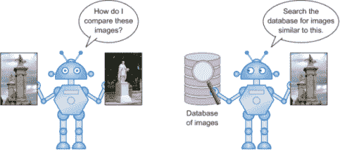

图 10.1 在处理图像时，我们在日常生活中遇到的示例应用：一台机器比较两张图像（左）；查询数据库以找到与输入图像相似的图像（右）。比较两张图像是一个非平凡的任务，并且是许多与有意义图像搜索相关的应用的关键。

定义嵌入是一个向量空间，通常比输入空间维度低，它保留了相对不相似性（在输入空间中）。我们使用向量空间和嵌入空间这两个术语可以互换。在本章的上下文中，训练好的 CNN 的最后完全连接层就是这个向量（嵌入）空间。例如，一个有 128 个神经元的完全连接层对应于一个 128 维的向量空间。

为了在图像之间进行可靠的比较，嵌入函数需要捕捉到期望的输入相似度度量。可以使用各种方法学习嵌入函数；其中一种流行的方法是使用深度卷积神经网络。图 10.2 说明了使用卷积神经网络创建嵌入的高级过程。

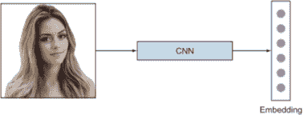

图 10.2 使用卷积神经网络从输入图像中获取嵌入

在下一节中，我们将探讨一些使用视觉嵌入进行大规模查询检索系统的示例应用。然后我们将深入探讨视觉嵌入系统不同组件的不同方面：损失函数、挖掘信息数据以及嵌入网络的训练和测试。随后，我们将使用这些概念来解决我们关于构建基于视觉嵌入的查询检索系统的章节项目。之后，我们将探索推动项目网络准确性的边界的方法。到本章结束时，你将能够训练一个卷积神经网络以获得可靠且有意义的嵌入，并将其用于实际应用中。

## 10.1 视觉嵌入的应用

让我们看看一些实际日常信息检索算法，这些算法使用了视觉嵌入的概念。在给定输入查询的情况下，检索相似图像的一些突出应用包括面部识别（FR）、图像推荐和物体重识别系统。

### 10.1.1 面部识别

FR 是关于自动识别或标记图像，以精确地标识图像中的人物身份。日常应用包括在网络上搜索名人、自动标记照片中的朋友和家人等。识别是一种细粒度分类。人脸识别手册[1]将 FR 系统的两种模式进行了分类（图 10.3 进行了比较）：

+   面部识别——一种将查询人脸图像与数据库中所有模板图像进行一对一匹配，以确定查询人脸身份的方法。例如，城市当局可以检查观察名单，将查询与嫌疑人名单进行匹配（一对一匹配）。另一个有趣的例子是自动标记出现在照片中的用户，这是由主要社交网络平台实现的功能。

+   面部验证——一种将查询人脸图像与声称身份的模板人脸图像进行一对一匹配的方法。

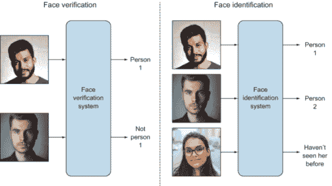

图 10.3 面部验证和面部识别系统：一个面部验证系统的例子，通过一对一匹配来识别图像是否为 Sundar（左）；一个面部识别系统的例子，通过一对多匹配来识别所有图像（右）。尽管识别和识别在目标层面上存在差异，但它们都依赖于一个良好的嵌入函数，该函数能够捕捉到人脸之间的有意义差异。（该图受到了[2]的启发。）

### 10.1.2 图像推荐系统

在这个任务中，用户试图根据给定的查询图像找到相似图像。购物网站根据特定产品的选择提供产品建议（通过图像），例如显示与用户所选鞋子相似的所有类型的鞋子。图 10.4 展示了服装搜索的示例。

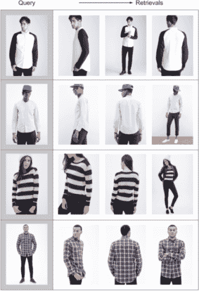

图 10.4 服装搜索。每行的最左边的图像是查询图像，随后的列显示了与它相似的多种服装。（此图中的图像来自[3]。）

注意，两个图像之间的相似性取决于选择相似性度量的上下文。图像的嵌入根据选择的相似性度量类型而有所不同。一些相似性度量的例子包括颜色相似性和语义相似性：

+   颜色相似性 --检索到的图像具有相似的颜色，如图 10.5 所示。这个度量在检索类似颜色的画作、类似颜色的鞋子（不一定确定风格）等应用中使用。

    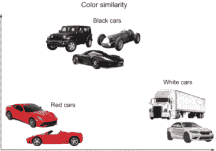

    图 10.5 相似性示例，其中汽车通过颜色进行区分。注意，在这个说明性的二维嵌入空间中，颜色相似的汽车更接近。

+   语义相似性 --检索到的图像具有相同的语义属性，如图 10.6 所示。在我们之前的鞋类检索示例中，用户期望看到与高跟鞋具有相同语义的鞋类建议。你可以发挥创意，决定将颜色相似性与语义结合，以提供更有意义的建议。

    

    图 10.6 示例：身份嵌入。具有相似特征的汽车在嵌入空间中投影得更近。

### 10.1.3 物体重识别

物体重识别的一个例子是安全摄像头网络（CCTV 监控），如图 10.7 所示。安全操作员可能希望查询特定人员并找出他们在所有摄像头中的位置。系统需要在一个摄像头中识别移动对象，然后跨摄像头重新识别对象以建立一致的标识。

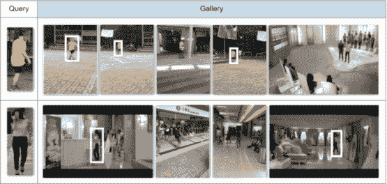

图 10.7 多摄像头数据集显示了人员在摄像头之间的存在。（来源：[4]。）

这个问题通常被称为人员重识别。请注意，它与面部验证系统类似，我们感兴趣的是捕捉在单独摄像头中的任何两个人是否相同，而不需要确切知道一个人的身份。

在所有这些应用中，一个核心方面是依赖于一个嵌入函数，该函数能够捕捉并保留输入与输出嵌入空间之间的相似性（和差异性）。在接下来的章节中，我们将深入探讨设计适当的损失函数和采样（挖掘）信息数据点，以指导 CNN 的训练，以实现高质量的嵌入函数。

但在我们深入探讨创建嵌入的细节之前，让我们回答这个问题：为什么我们需要嵌入——我们难道不能直接使用图像吗？让我们回顾一下直接使用图像像素值作为嵌入的这种天真方法的瓶颈。在这种方法中，嵌入的维度（假设所有图像都是高分辨率的）将是 1920 × 1080，以双精度在计算机内存中表示，这给存储和检索带来了计算上的限制，考虑到任何有意义的时要求。此外，大多数嵌入都需要在监督设置中学习，因为事先的语义比较是未知的（这就是我们释放 CNN 提取有意义和相关性语义的力量的时候）。任何在这种高维嵌入空间上的学习算法都将受到维度灾难的影响：随着维度的增加，空间的体积增加得如此之快，以至于可用的数据变得稀疏。

自然数据的几何和数据分布是非均匀的，围绕低维结构拼接。因此，使用图像大小作为数据维度是过度的（更不用说巨大的计算复杂性和冗余了）。因此，我们在学习嵌入时的目标是双重的：学习所需的语义以进行比较，并实现嵌入空间低（或更低）的维度。

## 10.2 学习嵌入

学习嵌入函数涉及定义一个期望的准则来衡量相似性；它可以基于颜色、图像中存在的对象的语义，或者纯粹在监督形式中数据驱动。由于事先知道正确的语义（用于比较图像）很困难，因此监督学习更受欢迎。我们不会手动制作相似性准则特征，在本章中，我们将专注于监督数据驱动的嵌入学习，其中我们假设我们被给定一个训练集。图 10.8 描述了使用深度 CNN 学习嵌入的高级架构。

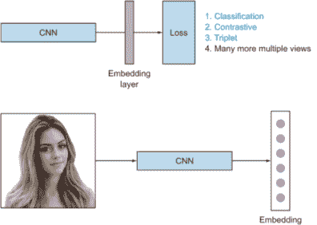

图 10.8 学习机器的示意图（顶部）；（测试）过程概述（底部）。

学习嵌入的过程很简单：

1.  选择一个卷积神经网络（CNN）架构。任何合适的 CNN 架构都可以使用。在实践中，最后一层全连接层用于确定嵌入。因此，这个全连接层的大小决定了嵌入向量空间的大小。根据训练数据集的大小，使用例如 ImageNet 数据集进行预训练可能是明智的。

1.  选择一个损失函数。流行的损失函数是对比损失和三元组损失。（这些在 10.3 节中解释。）

1.  选择数据集采样（挖掘）方法。天真地提供数据集中所有可能的样本是浪费且不可行的。因此，我们需要求助于采样（挖掘）信息数据点来训练我们的 CNN。我们将在第 10.4 节学习各种采样技术。

1.  在测试时，最后一层全连接层充当相应图像的嵌入。

现在我们已经回顾了学习嵌入的训练和推理过程的大致情况，我们将深入探讨定义有用的损失函数以表达我们期望的嵌入目标。

## 10.3 损失函数

我们在第二章中了解到，优化问题需要定义一个损失函数来最小化。学习嵌入与其他深度学习问题没有不同：我们首先定义一个需要最小化的损失函数，然后训练一个神经网络来选择参数（权重）值，以产生最小的误差值。在本节中，我们将更深入地探讨关键的嵌入损失函数：交叉熵、对比和三元组。

首先，我们将形式化问题设置。然后，我们将探讨不同的损失函数及其数学公式。

### 10.3.1 问题设置和形式化

为了理解学习嵌入的损失函数并最终训练一个 CNN（为此损失），我们首先形式化输入成分和期望的输出特性。这种形式化将在后面的章节中以简洁的方式理解和分类各种损失函数。为了这次对话的目的，我们的数据集可以表示如下：

χ = {(*x[i]* , *y[i]*)}*[i]^N* =1

*N*是训练图像的数量，*x*[i]是输入图像，*y*[i]是它的对应标签。我们的目标是创建一个嵌入

*f* (*x* ; θ): ℝ*^D* → ℝ*^F*

将图像从ℝ*^D*映射到ℝ*^D*的特征（嵌入）空间，使得具有相似身份的图像在这个特征空间中是度量上接近的（反之亦然，对于具有不同身份的图像而言）。

θ* = arg [θ] minℒ( *f* (θ; χ ))

其中θ是学习函数的参数集。

让

*D*(*x[i]*, *x[j]*) : ℝ*^F* *X* ℝ^F → ℝ

作为嵌入空间中图像*x[i]*和*x[j]*之间的距离度量。为了简单起见，我们省略了输入标签，并将*D*(*x[i]*, *x[j]*)表示为*D[ij]* · *y[ij]* = 1。这两个样本（i）和（j）属于同一类，且*y[ij]* = 0 表示不同类别的样本。

一旦我们训练了一个嵌入网络的优化参数，我们希望学习到的函数具有以下特性：

+   嵌入应该对视图、光照和形状变化不敏感。

+   从实际应用部署的角度来看，嵌入和排名的计算应该是高效的。这要求一个低维向量空间（嵌入）。这个空间越大，比较任意两个图像所需的计算就越多，这反过来又影响了时间复杂度。

学习嵌入的流行选择是交叉熵损失、对比损失和三元组损失。接下来的章节将介绍和形式化这些损失。

### 10.3.2 交叉熵损失

学习嵌入也可以被表述为一个细粒度的分类问题，相应的卷积神经网络可以使用流行的交叉熵损失（在第二章中详细解释）。以下方程表达了交叉熵损失，其中 *p*(*y*[ij] | *f* (*x; θ* )) 表示后验类别概率。在 CNN 文献中，softmax 损失意味着使用交叉熵损失在判别性区域训练的 softmax 层：

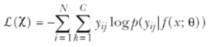

在训练过程中，在损失层之前添加了一个全连接（嵌入）层。每个身份被视为一个单独的类别，类别的数量等于训练集中身份的数量。一旦使用分类损失训练了网络，最终的分类层就被移除，并从网络的新最终层中获得嵌入（图 10.9）。

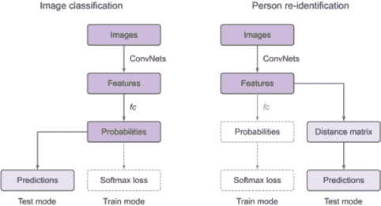

图 10.9 展示了如何使用交叉熵损失来训练嵌入层（全连接）。右侧展示了推理过程，并概述了在直接使用交叉熵损失学习嵌入时的训练和推理之间的不连续性。（此图改编自[5]）

通过最小化交叉熵损失，CNN 的参数（θ）被选择，使得对于正确类别，估计概率接近 1，而对于所有其他类别，估计概率接近 0。由于交叉熵损失的目标是将特征分类到预定义的类别中，因此，与在训练过程中直接在嵌入空间中包含相似性（和差异性）约束的损失相比，这种网络的性能通常较差。此外，当考虑例如 1 百万个身份的数据集时，学习变得计算上不可行。（想象一个有 1 百万个神经元的损失层！）尽管如此，使用交叉熵损失（在数据集的可操作子集上，例如 1,000 个身份的子集）预训练网络是一种流行的策略，这反过来又使得嵌入损失更快地收敛。我们将在第 10.4 节中进一步探讨这一点，在训练过程中挖掘信息样本。

注意：交叉熵损失的一个缺点是训练和推理之间的不连续性。因此，与嵌入学习损失（对比和三元组）相比，它通常表现较差。这些损失明确尝试将输入图像空间到嵌入空间的相对距离保持下来。

### 10.3.3 对比损失

对比损失通过鼓励所有相似类实例无限接近彼此，同时强制其他类别的实例在输出嵌入空间中远离彼此来优化训练目标（我们在这里说无限接近，因为 CNN 不能使用精确为零的损失进行训练）。使用我们的问题形式化，这种损失定义为

是衡量嵌入空间中图像 *x[i]* 和 *x[j]* 距离的度量。为了简单起见，我们省略了输入标签，并将 *D*(*x[i]*, *x[j]*) 表示为 *D[ij]* · *y[ij]* = 1。两个样本 ( i ) 和 ( j ) 属于同一类别，且 *y[ij]* = 0 的值表示不同类别的样本。

*对比损失* (*i, j*) = *y[ij] D²[ij]* + (1 - *y[ij]*)[*α - D²[ij]*][+]

注意，在损失函数中的 [.]+ = max(0,.) 表示 hinge 损失，α是一个预定的阈值（margin），用于确定当两个样本 i 和 j 属于不同类别时的最大损失。从几何上讲，这意味着只有当两个样本在嵌入空间中的距离小于这个 margin 时，不同类别的两个样本才会对损失做出贡献。Dij，如公式中所述，指的是两个样本 i 和 j 在嵌入空间中的距离。

这种损失也被称为 Siamese 损失，因为我们可以将其可视化为具有共享参数的孪生网络；两个 CNN 各自输入一张图像。对比损失在 Chopra 等人[6]的开创性工作中被用于人脸验证问题，其目标是验证两个展示的面孔是否属于同一身份。这种损失的示例在图 10.10 中提供了人脸识别的上下文。

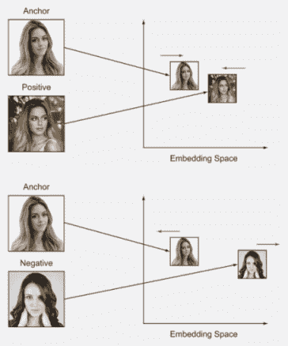

图 10.10 计算对比损失需要两张图像。当两张图像属于同一类别时，优化尝试在嵌入空间中将它们放得更近，反之亦然，当图像属于不同类别时。

注意，所有不同类别的 *margin α* 的选择是相同的。Manmatha 等人[7]分析了其影响：这种α的选择意味着对于不同的身份，视觉上不同的类别被嵌入到与视觉上相似的类别相同的特征空间中。与三元组损失（下文将解释）相比，这种假设更为严格，并限制了嵌入流形的结构，这随后使得学习变得更加困难。对于包含 N 个样本的数据集，每个 epoch 的训练复杂度为 O(N²)，因为这种损失需要遍历一对样本来计算对比损失。

### 10.3.4  三元组损失

受 Weinberger 等人[8]关于最近邻分类的度量学习开创性工作的启发，FaceNet（Schroff 等人[9]）提出了一种适用于查询检索任务的修改版，称为三元组损失。三元组损失通过考虑来自同一点的正负对距离，为损失函数添加了上下文。从数学上讲，与之前的问题形式化相关，三元组损失可以表示如下：

*三元组* (*a, p, n*) = [*D[ap] − D[an] + α*][+]

注意，Dap 代表锚点和正样本之间的距离，而 Dan 是锚点和负样本之间的距离。图 10.11 展示了使用锚点、正样本和负样本计算损失项的过程。在成功训练后，我们希望所有同一类别的对比都会比不同类别的对对比得更近。

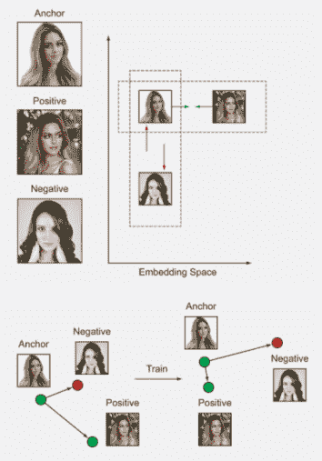

图 10.11 计算三元组损失需要三个样本。学习的目标是使同一类别的样本嵌入比不同类别的样本更近。

由于计算三元组损失需要三个项，每个 epoch 的训练复杂度是*O*(*N*³)，这在实际数据集上计算上是不可行的。三元组和对比损失中的高计算复杂度激发了许多用于高效优化和收敛的采样方法。让我们回顾一下以天真和直接的方式实现这些损失函数的复杂度。

### 10.3.5  损失函数的简单实现和运行时分析

考虑以下规格的玩具示例：

+   身份数（*N*）：100

+   每个身份的样本数（*S*）：10

如果我们以天真方式实现损失函数（参见图 10.12），会导致每个 epoch（图 10.12 中的内部`for`循环 1）的训练复杂度：

+   *交叉熵损失* --这是一个相对简单的损失。在一个 epoch 中，它只需要遍历所有样本。因此，这里的复杂度是*O*(*N × S*) = *O*(10³)。

+   *对比损失* --这个损失会访问所有成对距离，所以从样本数量来看，复杂度是二次的（*N × S*）：即*O*(100 × 10 × 100 × 10) = *O*(10⁶)。

+   *三元组损失* --对于每次损失计算，我们需要访问三个样本，所以最坏情况下的复杂度是立方。从样本总数来看，那就是*O*(10⁹)。

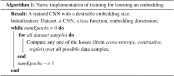

图 10.12 算法 1，对于简单实现

尽管计算交叉熵损失很容易，但与其他嵌入损失相比，其性能相对较低。一些直观的解释在 10.3.2 节中提出。在最近的学术作品中（如[10, 11, 13]），三元组损失在提供适当的硬数据挖掘时，通常比对比损失给出更好的结果，我们将在下一节中解释。

注意：在以下章节中，我们提到三元组损失，因为它在多个学术作品中对比损失具有更高的性能。

一个需要注意的重要点是，在 O(10⁹)的三元组中，并不是很多对损失有显著的贡献。在实践中，在一个训练周期内，大多数的三元组都是微不足道的：也就是说，当前网络在这些数据上的损失已经很低，因此这些微不足道三元组的锚正对（在嵌入空间中）比锚负对更接近。这些微不足道的三元组不会为更新网络参数提供有意义的信息，从而阻碍了收敛。此外，信息三元组比微不足道三元组要少得多，这反过来又导致了信息三元组贡献的稀释。

为了提高三元组枚举的计算复杂度和收敛性，我们需要提出一种有效的策略来枚举三元组，并在训练过程中向 CNN（无微不足道三元组）提供信息三元组样本。这个过程选择信息三元组被称为挖掘。信息数据点是本章的核心，将在以下几节中讨论。

一种处理这种立方复杂度的流行策略是以下方式枚举三元组：

1.  使用数据加载器构建的当前批次仅构建三元组集合。

1.  从这个集合中挖掘一个信息三元组子集。

下一个部分将详细探讨这种策略。

## 10.4  挖掘信息数据

到目前为止，我们已经探讨了三元组和对比损失在计算上对实际数据集大小的不切实际。在本节中，我们将深入了解训练 CNN 进行三元损失时的关键步骤，并学习如何提高训练收敛性和计算复杂度。

图 10.12 中的直接实现被归类为离线训练，因为三元组的选取必须考虑整个数据集，因此在训练 CNN 时不能即时完成。正如我们之前提到的，这种计算有效三元组的方法效率低下，对于深度学习数据集来说在计算上是不可行的。

为了处理这种复杂性，FaceNet [9] 提出使用基于在线批次的三元组挖掘。作者动态构建一个批次，并对该批次进行三元组的挖掘，忽略该批次之外的数据集。这种策略被证明是有效的，并导致了人脸识别中的最先进准确率。

让我们总结一下训练周期中的信息流（见图 10.13）。在训练过程中，从数据集中构建小批量，然后为小批量中的每个样本识别有效三元组。然后使用这些三元组来更新损失，这个过程迭代进行，直到所有批次耗尽，从而完成一个周期。

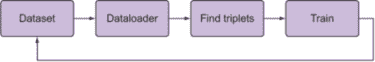

图 10.13 在线训练过程中的信息流。数据加载器从训练数据中采样一个随机子集到 GPU。随后，计算三元组以更新损失。

与 FaceNet 类似，OpenFace [37] 提出了一种训练方案，其中数据加载器构建一个具有预定义统计信息的训练批次，并在 GPU 上计算批次的嵌入。随后，在 CPU 上生成有效三元组以计算损失。

在下一小节中，我们将探讨一个改进的数据加载器，它可以为我们提供良好的批次统计信息以挖掘三元组。随后，我们将探讨如何有效地挖掘好的、信息丰富的三元组以改善训练收敛性。

### 10.4.1 数据加载器

让我们检查数据加载器的设置及其在三元组损失训练中的作用。数据加载器从数据集中选择一个随机子集，对于挖掘信息三元组至关重要。如果我们依赖于一个平凡的数据加载器来选择数据集的随机子集（迷你批次），则可能不会导致良好的类别多样性，从而无法找到许多三元组。例如，随机选择仅包含一个类别的批次将没有任何有效三元组，因此会导致无效的批次迭代。我们必须在数据加载器级别上确保批次分布良好，以便挖掘三元组。

注意：在数据加载器级别上实现更好收敛的要求是形成一个具有足够类别多样性的批次，以促进图 10.11 中的三元组挖掘步骤。

训练的一般有效方法是首先挖掘一组大小为 B 的三元组，以便 B 个项对三元组损失做出贡献。一旦选择了 B，它们的图像将被堆叠以形成一个 3B 图像的批次大小（B 个锚点，B 个正样本和负样本），然后计算 3B 个嵌入以更新损失。

Hermans 等人[11]在他们对重新审视三元组损失所做的令人印象深刻的工作中，意识到在前一节中在线生成中有效三元组的低利用率。在一组 3B 张图像（B 个锚点，B 个正样本，B 个负样本）中，我们总共有 6B 个 2 - 4B 个有效三元组，因此仅使用 B 个三元组是低效的。

计算堆叠的 3B 张 B 三元组图像中的有效三元组数量

为了理解在 3B 图像堆叠中计算有效三元组数量（即 B 个锚点，B 个正样本和负样本），让我们假设我们恰好有一对相同的类别。这意味着我们可以为（锚点，正样本）对选择 3B - 2 个负样本。在这个集合中有 2B 个可能的锚点-正样本对，导致总共 2B (3B - 2)个有效三元组。以下图示了一个示例。

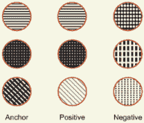

B = 3 的示例。具有相同模式的圆圈属于同一类别。由于只有前两列有可能的正样本，总共有 2B（六个）锚点。选择一个锚点后，我们剩下 3B - 2（七个）负样本，这意味着总共有 2B (3B - 2)个三元组。

基于之前的讨论，为了更有效地使用三元组，Hermans 等人提出在数据加载器级别进行一项关键的组织性修改：通过从数据集 *x* 中随机采样 P 个身份，然后为每个身份采样 K 张图像（随机），从而得到一个大小为 PK 的批次。使用这个数据加载器（适当的三元组挖掘），作者展示了在人员重识别任务上达到最先进的准确率。我们将在接下来的子节中更详细地探讨[11]中引入的挖掘技术。使用这种组织性修改，Kumar 等人[10, 12]在许多不同的数据集上展示了车辆重识别任务的最先进结果。

由于在重识别任务上取得了优越的结果，[11]已成为识别文献中的主要支柱，批次构建（数据加载器）现在已成为实践中的标准。默认推荐批次大小为 P = 18，K = 4，导致 42 个样本。

计算有效三元组的数量

让我们通过一个计算批次中有效三元组数量的工作示例来使这个概念更清晰。假设我们随机选择了一个大小为 PK 的批次：

+   P = 10 个不同的类别

+   每个类别的样本数 = 4 个样本

使用这些值，我们得到以下批次统计信息：

+   锚点的总数 = 40 = (PK)

+   每个锚点的正样本数量 = 3 = (K - 1)

+   每个锚点的负样本数量 = 9 × 4 = (K(P - 1))

+   有效三元组的总数 = 前述结果的乘积 = 40 × 3 × (9 × 4)

在挖掘信息三元组的前瞻概念中窥视，注意到对于每个锚点，我们都有一个正样本集和一个负样本集。我们之前已经论证了许多三元组是非信息性的，因此在后续章节中，我们将探讨各种过滤重要三元组的方法。更确切地说，我们检查帮助过滤正负样本集中信息子集的技术（对于一个锚点）。

现在我们已经构建了一个用于挖掘三元组的有效数据加载器，我们准备探索在训练 CNN 时挖掘信息三元组的各种技术。在接下来的章节中，我们首先概述硬数据挖掘，然后专注于在线生成（挖掘）信息三元组，这遵循了[11]中的批次构建方法。

### 10.4.2  信息性数据挖掘：寻找有用的三元组

在训练机器学习模型时挖掘信息样本是一个重要问题，学术文献中存在许多解决方案。我们在这里简要地看一下它们。

一种流行的采样方法来寻找信息样本是困难数据挖掘，它在许多计算机视觉应用中如目标检测和动作定位中被使用。困难数据挖掘是一种用于模型迭代训练的自举技术：在每次迭代中，当前模型应用于验证集以挖掘模型表现不佳的困难数据。然后只将这组困难数据呈现给优化器，这增加了模型有效学习和更快收敛到最优的能力。另一方面，如果模型只接触到困难数据，这些数据可能包含异常值，那么它对正常数据的异常值判别能力会受到影响，从而阻碍训练进度。数据集中的异常值可能是标签错误或图像质量差的样本捕获的结果。

在三元损失的上下文中，一个困难负样本是离锚点更近的样本（因为这个样本会导致高损失）。同样，一个困难正样本是在嵌入空间中远离锚点的样本。

为了在困难数据采样期间处理异常值，FaceNet [9] 提出了半困难采样，它挖掘既不太困难也不太平凡的三元组，以便在训练期间获得有意义的梯度。这是通过使用边界参数来实现的：只有位于边界并且比选定的正样本对锚点更远的负样本被考虑（见图 10.14），从而忽略了太容易和太困难的负样本。然而，这反过来又增加了调整额外超参数的训练负担。这种半困难负样本的临时策略在大批量的 1,800 张图像中得到了实践，从而在 CPU 上枚举三元组。请注意，在[11]中的默认批量大小（42 张图像）中，可以在 GPU 上有效地枚举有效三元组的集合。

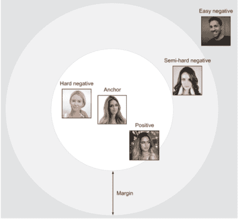

图 10.14 边界：将三元组分为困难、半困难和容易。这个插图（在人脸识别的上下文中）是一个锚点和相应的负样本。因此，靠近锚点的负样本是困难的。

图 10.15 说明了三元组的困难程度。记住，如果一个正样本在训练时间步的网络中离其锚点在嵌入空间中很远，那么这个正样本就更加困难。同样，在从锚点到负数据的距离图中，靠近（距离更短）锚点的样本更困难。作为提醒，以下是锚点（*a*）、正样本（*p*）和负样本（*n*）的三元损失函数：

*l[triplet]* (*a, p, n*) = [*D[ap] − D[an] + α*][+]

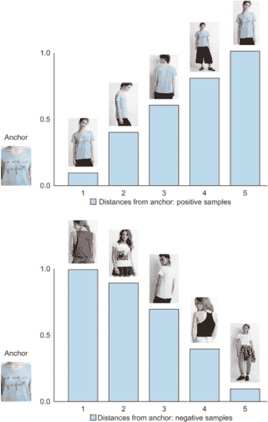

图 10.15 困难正样本和困难负样本数据。图显示了正样本（顶部）和负样本（底部）相对于锚点（在特定时间步）的距离。样本的困难程度随着我们在两个图上从左到右移动而增加。

在探讨了硬数据及其缺陷的概念之后，我们现在将探讨针对我们的批次的多种在线三元组挖掘技术。一旦数据加载器构建了一个批次（大小为 PK），就有 PK 个可能的锚点。如何为这些锚点找到正负数据是挖掘技术的关键。首先，我们来看两种简单而有效的在线三元组挖掘技术：批全（BA）和批硬（BH）。

### 10.4.3 批全（BA）

在批次的上下文中，批全（BA）指的是使用所有可能的和有效的三元组；也就是说，我们不会对三元组进行任何排序或选择。在实现方面，对于一个锚点，这个损失是通过对所有可能的有效三元组求和来计算的。对于一个包含 PK 个图像的批次，由于 BA 选择了所有三元组，因此更新三元组损失的项数是 PK(K - 1)(K(P - 1))。

使用这种方法，所有样本（三元组）都同等重要；因此，这很容易实现。另一方面，BA 可能导致信息平均化。一般来说，许多有效的三元组是平凡的（损失低或非信息性），而只有少数是有信息的。对所有有效的三元组使用相同的权重求和会导致有信息三元组的贡献平均化。Hermans 等人[11]经历了这种平均化，并在人重识别的背景下进行了报告。

### 10.4.4 批硬（BH）

与 BA 不同，批硬（BH）只考虑锚点的最硬数据。对于批次中的每个可能的锚点，BH 使用一个最硬的正数据项和一个最硬的负数据项来计算损失。请注意，在这里，数据点的硬度相对于锚点是相对的。对于一个包含 PK 个图像的批次，由于 BH 对每个锚点只选择一个正样本和一个负样本，因此更新三元组损失的项数是 PK（可能的锚点总数）。

BH 对信息平均化具有鲁棒性，因为简单的（较容易的）样本被忽略了。然而，它可能难以区分异常值：异常值可能由于错误的标注而渗入，并且模型会努力收敛到它们，从而危及训练质量。此外，在使用 BH 之前使用未预训练的网络时，样本的硬度（相对于锚点）无法可靠地确定。在训练过程中无法获得此类信息，因为最硬的样本现在是任何随机样本，这可能导致训练停滞。这已在[9]中报告，并且在[10]中将 BH 应用于从零开始训练车辆重识别网络时也出现了这种情况。

为了直观地理解 BA 和 BH，让我们再次查看我们用来表示锚点与所有正负数据距离的图（图 10.16）。BA 不进行选择，使用所有五个样本来计算最终的损失，而 BH 只使用最硬的数据（忽略所有其他数据）。图 10.17 显示了计算 BH 和 BA 的算法概述。

三重损失函数的另一种形式化

Ristani 等人[13]在他们关于多摄像头重识别特征的著名论文中，将各种批量采样技术统一在一个表达式中。在一个批次中，设 a 为一个锚点样本，N(*a*)和 P(*a*)代表对应锚点 a 的负样本和正样本的子集。然后三重损失可以写成

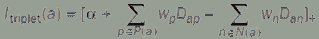

对于锚点样本 a，wp 代表正样本 p 的权重（重要性）；同样，wn 表示负样本 n 的重要性。在一个时间步的总损失通过以下方式获得

![图 10-17_Eb.png]

在这个公式中，BA 和 BH 可以像以下图所示那样集成（也参见下一节中的表 10.1）。这个图中的 Y 轴表示选择权重。

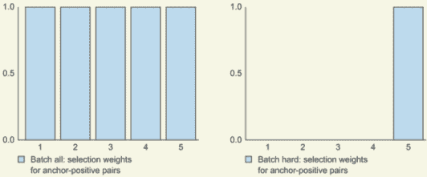

展示了正样本相对于锚点的选择权重。对于 BA，所有样本同等重要，而 BH 只重视最困难的样本（其余的都被忽略）。

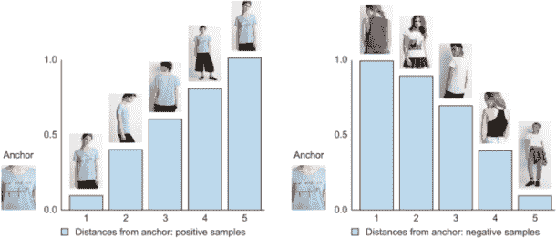

图 10.16 困难数据的说明：正样本与锚点（在特定时间步）的距离（左）；负样本与锚点的距离（右）。BA 考虑了所有样本，而 BH 只考虑最右侧的条形（这个批次的最难正数据）。

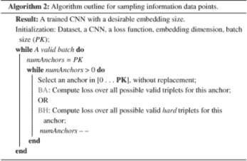

图 10.17 计算 BA 和 BH 的算法

### 10.4.5 批量加权（BW）

BA 是一种简单的采样，对所有样本进行均匀加权。这种均匀的权重分布可能会忽略重要困难样本的贡献，因为这些样本通常被琐碎的简单样本所超过。为了缓解 BA 中的这个问题，Ristani 等人[13]采用了一种批量加权（BW）的加权方案：一个样本的权重基于其与相应锚点的距离，从而比简单样本赋予信息性（更困难）样本更多的重视。正负数据的相应权重在表 10.1 中显示。图 10.18 展示了这种技术中样本的加权情况。

表 10.1 矿掘良好正 xp 和负 xn 的各种方式的快照[10]。BS 和 BW 将在下一节中通过示例进行探讨。

| 矿掘 | 正样本权重：wp | 负样本权重：wn | 评论 |
| --- | --- | --- | --- |
| 所有（BA） | 1 | 1 | 所有样本都进行均匀加权。 |
| 困难（BH） | 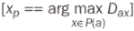  | 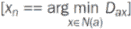  | 选择一个最困难的样本。 |
| 样本（BS） |   | 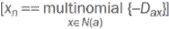  | 从多项式分布中选择一个。 |
| 加权（BW） | 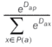 | 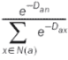 | 权重基于其与锚点的距离进行采样。 |

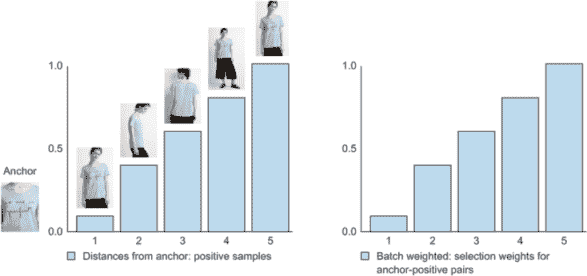

图 10.18 BW 选择左图中锚点正数据的 BW 示意图。在这种情况下，使用了所有五个正样本（如 BA），但每个样本都被分配了权重。与 BA 不同，BA 对每个样本的权重相同，而右边的图按与锚点相应的距离比例对每个样本进行加权。这意味着我们更加关注远离锚点的正样本（因此更难且更有信息量）。对于这个锚点的负数据也是以同样的方式选择的，但权重相反。

### 10.4.6 批量样本（BS）

另一种采样技术是批量样本（BS）；它在 Hermans 等人[11]的实现页面上被积极讨论，并且已经被 Kumar 等人[10]用于最先进的车辆再识别。BS 使用锚点到样本的距离分布来挖掘 2 个正负数据样本用于锚点（见图 10.19）。与 BH 相比，这种技术避免了采样异常值，并且它还希望确定最相关的样本，因为采样是使用距离到锚点的分布进行的。

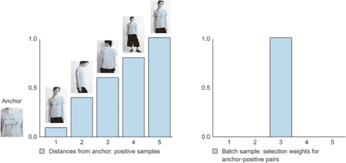

图 10.19 BS 选择锚点正数据的示意图。与 BH 类似，目标是找到一个信息丰富且不是异常值的数据项（对于左图中的锚点）。BH 会选择最困难的数据项，这可能导致找到异常值。BS 使用距离作为分布来以分类方式挖掘样本，从而选择一个信息丰富且可能不是异常值的样本。（注意，这是一个随机多项式选择；我们在这里选择第三个样本只是为了说明这个概念。）

现在，让我们通过一个项目和深入了解训练和测试 CNN 进行嵌入所需的机制来解开这些想法。

## 10.5 项目：训练嵌入网络

在这个项目中，我们通过构建一个基于图像的查询检索系统将我们的概念付诸实践。我们选择了在视觉嵌入文献中流行的两个问题，并且已经积极研究以找到更好的解决方案：

+   购物困境--找到与我查询项目相似的服装。

+   再识别--在数据库中找到相似车辆；即从不同视角（摄像头）识别一辆车。

不论是哪些任务，训练、推理和评估过程都是相同的。以下是成功训练嵌入网络的一些关键要素：

+   训练集--我们遵循一个带有注释的监督学习方法，这些注释强调了固有的相似性度量。数据集可以被组织成一系列文件夹，每个文件夹确定图像的标识/类别。目标是使属于同一类别的图像在嵌入空间中彼此更接近，反之亦然。

+   测试集--测试集通常分为两个集合：查询集和图库集（通常，学术论文将图库集称为测试集）。查询集由用作查询的图像组成。图库集中的每张图像都与每张查询图像进行排名（检索）。如果嵌入被完美学习，则查询的最高排名（检索）物品都属于同一类。

+   距离度量--为了在嵌入空间中表达两张图像之间的相似性，我们使用相应的嵌入之间的欧几里得（L2）距离。

+   评估--为了定量评估训练好的模型，我们使用第四章和第七章中解释的 top-k 准确率和平均精度（mAP）指标。对于查询集中的每个对象，目标是检索测试集（图库集）中相似的身份。对于查询图像 q 的 AP(q) 定义为

    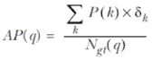

    其中 P(k) 表示排名 k 的精确度，Ngt(q) 是查询 q 的总真实检索数，δk 是一个布尔指示函数。所以，当查询图像 q 与测试图像的正确匹配发生在排名 k 时，其值为 1。正确的检索意味着查询和测试的地面真实标签是相同的。

    然后计算 mAP 作为所有查询图像的平均值

    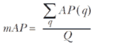

    其中 Q 是查询图像的总数。以下几节将更详细地探讨这两个任务。

### 10.5.1 时尚：给我找类似这个的物品

第一个任务是确定在商店拍摄的两张图片是否属于同一服装物品。与时尚相关的购物对象（衣服、鞋子）是工业应用中视觉搜索的关键领域，例如图像推荐引擎，这些引擎推荐与购物者所寻找的产品相似的产品。刘等人 [3] 为购物图像检索任务引入了最大的数据集之一（DeepFashion）。该基准包含来自流行的 Forever 21 目录的 11,735 件服装的 54,642 张图片。该数据集包括 25,000 张训练图像和大约 26,000 张测试图像，分为查询集和图库集；图 10.20 显示了样本图像。

图 10.20 每一行表示一个特定的类别及其相应的相似图像。一个完美学习的嵌入将使每行中图像的嵌入彼此更接近，而不是任何两列图像（属于不同的服装类别）之间的图像。（此图中的图像取自 DeepFashion 数据集 [3]。）

### 10.5.2 车辆重新识别

重新识别是匹配相机网络中及跨相机网络中物体外观的任务。通常的流程涉及用户在网络的全部相机中寻找查询物体出现的所有实例。例如，交通管理员可能在全市范围的相机网络中寻找一辆特定的汽车。其他例子包括人和面部重新识别，这些在安全和生物识别领域是主流。

本任务使用来自 Liu 等人的著名 VeRi 数据集 [14, 36]。该数据集包含 776 辆车（身份）在交通监控场景中 20 个摄像头下的 40,000 个边界框标注；图 10.21 展示了样本图像。每辆车由 2 到 18 个摄像头从不同的视角和不同的光照条件下捕捉。值得注意的是，视角不仅限于前/后视图，还包括侧面视图，从而使这个数据集更具挑战性。标注包括车辆的品牌和型号、颜色以及相机间关系和轨迹信息。

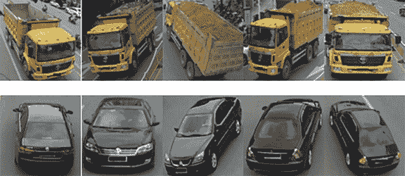

图 10.21 每一行表示一个车辆类别。与服装任务类似，这里的目的是（训练嵌入 CNN）使同一类别的嵌入比不同类别的嵌入更接近。（此图中的图像来自 VeRi 数据集 [14]。）

我们将仅使用类别（或身份）级别的标注；我们不会使用品牌、型号和时空位置等属性。在训练过程中加入更多信息可能有助于提高准确性，但这超出了本章的范围。然而，本章的最后部分引用了一些关于在嵌入学习中结合多源信息的新发展。

### 10.5.3 实现方法

本项目使用与 [11] 相关的 GitHub 代码库的 triplet learning（[`github.com/VisualComputingInstitute/triplet-reid/tree/sampling`](https://github.com/VisualComputingInstitute/triplet-reid/tree/sampling)）。数据预处理和步骤总结可在本书的可下载代码中找到；前往项目的 Jupyter notebook，可以跟随项目实现的逐步教程。鼓励 TensorFlow 用户查看 Olivier Moindrot 的博客文章“TensorFlow 中的 Triplet Loss 和在线 Triplet Mining”（[`omoindrot.github.io/triplet-loss`](https://omoindrot.github.io/triplet-loss)），以了解实现 triplet loss 的各种方法。

训练深度卷积神经网络（CNN）涉及几个关键的超参数，我们在此简要讨论它们。以下是本项目设置的超参数总结：

+   预训练在 ImageNet 数据集 [15] 上进行。

+   输入图像大小为 224 × 224。

+   元架构：我们使用 Mobilenet-v1 [16]，它有 569 百万 MACs，并测量融合的乘法和加法操作的数量。这个架构有 424 万个参数，在 ImageNet 的图像分类基准测试中实现了 70.9% 的 top-1 准确率，输入图像大小为 224 × 224。

+   优化器：我们使用默认超参数的 Adam 优化器 [17]（ε = 10^-3，β1 = 0.9，β2 = 0.999）。初始学习率设置为 0.0003。

+   数据增强通过在线方式使用标准的图像翻转操作进行。

+   批量大小为 18（P）随机采样的身份，每个身份 4（K）个样本，因此每个批次共有 18 × 4 个样本。

+   边距：作者将 hinge 损失 [.]+ 替换为一种称为 softplus 的平滑变化：ln(1 + .)。我们的实验也应用 softplus 而不是使用硬边距。

+   嵌入维度对应于最后一个全连接层的维度。我们将其固定为所有实验的 128 个单位。使用较小的嵌入大小有助于提高计算效率。

定义：在计算机科学中，乘累加操作是一个常见的步骤，它计算两个数字的乘积并将该乘积加到累加器中。执行此操作的硬件单元称为乘累加器（MAC，或 MAC 单元）；该操作本身也常被称为 MAC 或 MAC 操作。

关于与最先进方法的比较的说明

在深入比较之前，请记住，训练一个深度神经网络需要调整几个超参数。这反过来可能导致比较几个算法时的陷阱：例如，如果底层 CNN 在相同的预训练数据集上表现良好，则一种方法可能会表现得更好。其他类似的超参数包括训练算法的选择（例如 vanilla SGD 或更复杂的 Adam）以及我们在本书中看到的许多其他参数。你必须深入了解算法的机制，才能看到完整的图景。

### 10.5.4  测试训练好的模型

要测试一个训练好的模型，每个数据集都包含两个文件：一个查询集和一个画廊集。这些集合可以用来计算前面提到的评估指标：mAP 和 top-k 准确率。虽然评估指标是一个很好的总结，但我们也会从视觉上查看结果。为此，我们从查询集中随机选取图像，并从画廊集中找到（绘制）top-k 检索结果。以下小节展示了使用本章中各种挖掘技术的定量和定性结果。

#### 任务 1：店内检索

让我们看看图 10.22 中的学习嵌入的样本检索。结果看起来视觉上很吸引人：top 检索来自与查询相同的类别。网络在推断排名靠前的相同查询的不同视图方面表现合理。

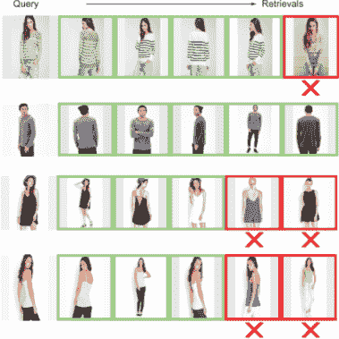

图 10.22 使用各种嵌入方法从时尚数据集中检索的样本。每一行表示查询图像及其查询图像的 top-5 检索。一个 *x* 表示一个错误的检索。

表 10.2 概述了在各种采样场景下 triplet 损失的性能。BW 在所有采样方法中表现最佳。在这种情况下，top-1 准确率相当好：我们能够在第一次检索中检索到相同类别的时尚物品，准确率超过 87%。请注意，在评估设置中，k > 1 的 top-k 准确率更高（单调递增）。

表 10.2 各种采样方法在店内检索任务上的性能

| 方法 | top-1 | top-2 | top-5 | top-10 | top-20 |
| --- | --- | --- | --- | --- | --- |
| 批量所有 | 83.79 | 89.81 | 94.40 | 96.38 | 97.55 |
| 批量硬匹配 | 86.40 | 91.22 | 95.43 | 96.85 | 97.83 |
| 批量采样 | 86.62 | 91.36 | 95.36 | 96.72 | 97.84 |
| 批量加权 | 87.70 | 92.26 | 95.77 | 97.22 | 98.09 |
| 胶囊嵌入  | 33.90 | - | - | 75.20 | 84.60 |
| ABE [18] | 87.30 | - | - | 96.70 | 97.90 |
| BIER [19] | 76.90 | - | - | 92.80 | 95.20 |

我们的结果与最先进的结果相比表现良好。使用基于注意力的集成（ABE）[18]，训练了多种关注图像不同部分的集成。通过增强独立嵌入的鲁棒性（BIER）[19]，将具有共享特征表示的度量 CNN 集成训练为一个在线梯度提升问题。值得注意的是，这个集成框架不引入任何额外的参数（并且与任何差异损失一起工作）。

#### 任务 2：车辆重识别

Kumar 等人 [12] 最近对优化三元组损失的采样变体进行了彻底评估。结果总结在表 10.3 中，并与几种最先进的方法进行了比较。值得注意的是，作者在没有使用任何其他信息源（如时空距离和属性）的情况下，与最先进的方法相比表现良好。定性结果如图 10.23 所示，展示了嵌入对视角的鲁棒性。请注意，检索具有所需的视角不变性属性，因为同一辆车的不同视角被检索到 top-5 排名中。

表 10.3 在 VeRi 数据集上比较各种提出的方法。星号 (*) 表示使用了时空信息。

| 方法 | mAP | top-1 | top-5 |
| --- | --- | --- | --- |
| 批量采样 | 67.55 | 90.23 | 96.42 |
| 批量硬匹配 | 65.10 | 87.25 | 94.76 |
| 批量全部 | 66.91 | 90.11 | 96.01 |
| 批量加权 | 67.02 | 89.99 | 96.54 |
| GSTE [20] | 59.47 | 96.24 | 98.97 |
| VAMI [21] | 50.13 | 77.03 | 90.82 |
| VAMI+ST * [21] | 61.32 | 85.92 | 91.84 |
| Path-LSTM * [22] | 58.27 | 83.49 | 90.04 |
| PAMTRI (RS) [23] | 63.76 | 90.70 | 94.40 |
| PAMTRI (All) [23] | 71.88 | 92.86 | 96.97 |
| MSVR [24] | 49.30 | 88.56 | - |
| AAVER [25] | 61.18 | 88.97 | 94.70 |

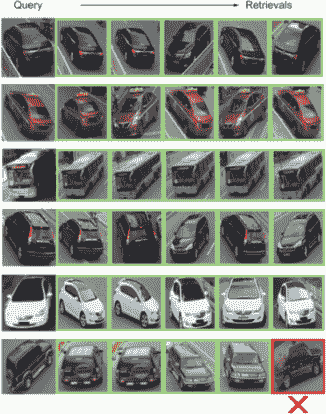

图 10.23 使用各种嵌入方法在 VeRi 数据集上的样本检索。每一行表示一个查询图像及其 top-5 检索结果。星号 (*) 表示一个错误的检索。

为了评估文献中各种方法的优缺点，让我们从概念上考察车辆重识别中的竞争方法：

+   Kanaci 等人 [26] 基于使用模型标签的损失函数（见图 10.24）提出了基于交叉级别的车辆重识别（CLVR）。这种设置与我们第 10.3.2 节和图 10.9 中看到的是相似的。作者没有在 VeRi 数据集上进行评估。鼓励您参考这篇论文以了解在其他车辆重识别数据集上的性能。

    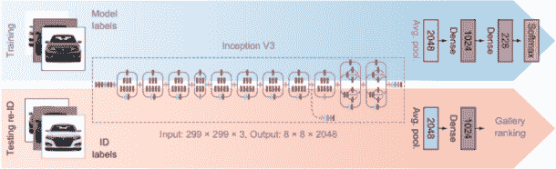

    图 10.24 跨级车辆重识别（CLVR）。(来源：[24]。)

+   Bai 等人[20]提出的组敏感三元组嵌入（GSTE）是一种新颖的训练过程，它使用 K-Means 聚类来聚类类内变化。这以增加一个额外参数 K-Means 聚类为代价，帮助进行更有指导性的训练。

+   Zheng 等人[23]提出的姿态感知多任务学习（PAMTRI）通过结合合成数据（从而解决关键点标注需求）和关键点标注来训练一个多任务环境下的嵌入网络。PAMTRI（All）在此数据集上取得了最佳结果。PAMTRI（RS）使用真实和合成数据的混合来学习嵌入，而 PAMTRI（All）还额外在多任务学习框架中使用车辆关键点和属性。

+   由 Khorramshahi 等人[25]提出的自适应注意力车辆重识别（AAVER）是一种近期的研究成果，其中作者构建了一个双路径网络以提取全局和局部特征。这些特征随后被连接起来形成一个最终的嵌入。所提出的嵌入损失是通过身份和关键点方向注释来最小化的。

+   周等人[21]提出了一种用于视角注意力多视角推理（VAMI）的训练过程，包括生成对抗网络（GAN）和多视角注意力学习。作者推测，能够合成（使用 GAN 生成）多个视角视图将有助于学习更好的最终嵌入。

+   使用 Path-LSTM，Shen 等人[22]为他们的时空正则化生成多个路径建议，并需要一个额外的 LSTM 来对这些建议进行排序。

+   Kanaci 等人[24]提出了基于金字塔的深度学习方法的多尺度车辆表示（MSVR）用于重识别。MSVR 通过具有多个分支的网络架构从图像金字塔中学习车辆重识别敏感的特征表示，所有这些分支都是同时优化的。

这些方法关于关键超参数的快照总结见表 10.4。

表 10.4 总结了训练过程中使用的一些重要超参数和标签。

| 方法 | ED | 标注 |
| --- | --- | --- |
| 我们的方法 | 0128 | ID |
| GSTE [20] | 1024 | ID |
| VAMI [21] | 2048 | ID + A |
| PAMTRI (All) [23] | 1024 | ID + K + A |
| MSVR [24] | 2048 | ID |
| AAVER [25] | 2048 | ID + K |
| 备注：ED = 嵌入维度；K = 关键点；A = 属性。 |

通常，车牌是一个全局唯一标识符。然而，由于标准交通摄像机的安装，车牌难以提取；因此，车辆再识别需要基于视觉的特征。如果两辆车是同一品牌、型号和颜色，那么视觉特征无法区分它们（除非有一些独特的标记，如文字或划痕）。在这些困难场景中，只有时空信息（如 GPS 信息）才能有所帮助。要了解更多信息，鼓励大家查阅 Tang 等人[27]最近提出的提议数据集。

## 10.6 推动当前准确性的边界

深度学习是一个不断发展的领域，每天都有新的训练方法被引入。本节提供了提高当前嵌入水平的一些想法，以及一些最近提出的用于训练深度 CNN 的技巧和窍门：

+   重新排序 -- 在获得画廊图像的初始排名（针对输入查询图像）后，重新排序使用后处理步骤，目的是提高相关图像的排名。这是许多再识别和信息检索系统中广泛使用的一个强大步骤。

    再识别中一个流行的方法是 Zhong 等人[28]提出的（见图 10.25）。给定一个探测图像 p 和一个画廊集，为每个人提取外观特征（嵌入）和 k-互反特征。计算每个探测图像和画廊图像对的原始距离 d 和 Jaccard 距离 Jd。最终距离是 d 和 Jd 的组合，并用于获得提出的排名列表。

    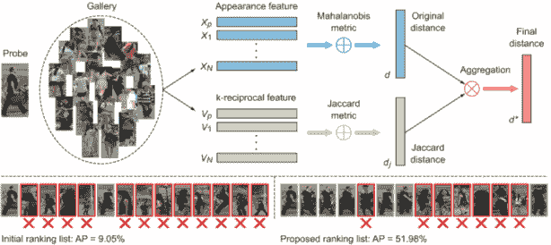

    图 10.25 Zhong 等人提出的重新排序建议（来源：[28]）

    最近在车辆再识别领域的一项工作，AAVER [25] 通过后处理使用重新排序提升了 5%的 mAP 准确率。

    定义 Jaccard 距离是在两组数据之间计算的，表示两个集合的交集与并集的比例。

+   技巧和窍门 -- Luo 等人[29]在人员再识别任务上展示了强大的基线性能。作者遵循了 Hermans 等人[11]（本章研究）相同的批量构建方法，并使用了数据增强、预热学习率和标签平滑等技巧，仅举几例。值得注意的是，作者的表现优于许多最先进的方法。鼓励大家将这些通用技巧应用于训练任何与识别相关的 CNN 任务。

    定义 预热学习率是指一个学习率调度策略，该策略将学习率线性地与预定义的初始训练 epoch 数相关联。标签平滑调整交叉熵损失，使得结果损失对训练集的置信度较低，从而有助于模型泛化并防止过拟合。这在小规模数据集中特别有用。

+   注意 --在本章中，我们专注于以全局方式学习嵌入：也就是说，我们没有明确引导网络关注，例如，对象的判别部分。一些采用注意力的突出工作包括 Liu 等人 [30] 和 Chen 等人 [31]。采用注意力还可以帮助提高重识别网络的跨域性能，如 [32] 中所示。

+   使用更多信息指导训练 --表 10.3 中的最先进比较简要地提到了结合来自多个来源的信息的工作：身份、属性（例如车辆的制造商和型号）以及时空信息（每个查询图像和图库图像的 GPS 位置）。理想情况下，包括更多信息有助于获得更高的准确性。然而，这需要为数据添加标注。在多属性设置中进行训练的合理方法是使用多任务学习（MTL）。通常，损失会变得冲突；这通过适当的任务权重（使用交叉验证）来解决。通过多目标优化解决这种冲突损失场景的多任务学习框架是由 Sener 等人 [32] 提出的。

    在人脸、人员和车辆分类的上下文中，MTL 的一些流行作品由 Ranjan 等人 [34]、Ling 等人 [35] 和 Tang [23] 完成。

## 摘要

+   图像检索系统需要学习视觉嵌入（一个向量空间）。在这个嵌入空间中，任何一对图像都可以通过它们的几何距离进行比较。

+   要使用 CNN 学习嵌入，有三种流行的损失函数：交叉熵、三重损失和对比损失。

+   三重损失的三种简单训练方法在计算上难以承受。因此，我们使用基于批次的基于信息的数据挖掘：全部批次、硬批次、样本批次和加权批次。

## 参考文献

1.  S.Z. Li 和 A.K. Jain. 2011\. 《人脸识别手册》. Springer Science & Business Media. [`www.springer.com/gp/book/9780857299314`](https://www.springer.com/gp/book/9780857299314).

1.  V. Gupta 和 S. Mallick. 2019\. “面向初学者的面部识别介绍。” Learn OpenCV. 2019 年 4 月 16 日。 [`www.learnopencv.com/face-recognition-an-introduction-for-beginners`](https://www.learnopencv.com/face-recognition-an-introduction-for-beginners).

1.  Z. Liu, P. Luo, S. Qiu, X. Wang, 和 X. Tang. 2016\. “Deepfashion: 利用丰富注释实现鲁棒的服装识别和检索。” IEEE 计算机视觉与模式识别会议 (CVPR)。 [`mmlab.ie.cuhk.edu.hk/projects/DeepFashion.html`](http://mmlab.ie.cuhk.edu.hk/projects/DeepFashion.html).

1.  T. Xiao, S. Li, B. Wang, L. Lin, 和 X. Wang. 2016\. “人员搜索的联合检测和识别特征学习。” [`arxiv.org/abs/1604.01850`](http://arxiv.org/abs/1604.01850).

1.  Y. Zhai, X. Guo, Y. Lu, 和 H. Li. 2018\. “为行人重识别的分类损失辩护。” [`arxiv.org/abs/1809.05864`](http://arxiv.org/abs/1809.05864).

1.  S. Chopra, R. Hadsell, and Y. LeCun. 2005\. “Learning a Similarity Metric Discriminatively, with Application to Face Verification.” In 2005 IEEE Computer Society Conference on Computer Vision and Pattern Recognition (CVPR’05), 1: 539-46 vol. 1\. [`doi.org/10.1109/CVPR.2005.202`](https://doi.org/10.1109/CVPR.2005.202).

1.  C-Y. Wu, R. Manmatha, A.J. Smola, and P. Krähenbühl. 2017\. “Sampling Matters in Deep Embedding Learning.” [`arxiv.org/abs/1706.07567`](http://arxiv.org/abs/1706.07567).

1.  Q. Weinberger and L.K. Saul. 2009\. “Distance Metric Learning for Large Margin Nearest Neighbor Classification.” The Journal of Machine Learning Research 10: 207-244. [`papers.nips.cc/paper/2795-distance-metric-learning-for-large-margin-nearest-neighbor-classification.pdf`](https://papers.nips.cc/paper/2795-distance-metric-learning-for-large-margin-nearest-neighbor-classification.pdf).

1.  F. Schroff, D. Kalenichenko, and J. Philbin. 2015\. “FaceNet: A Unified Embedding for Face Recognition and Clustering.” In 2015 IEEE Conference on Computer Vision and Pattern Recognition (CVPR), 815-23\. [`ieeexplore.ieee.org/document/7298682`](https://ieeexplore.ieee.org/document/7298682).

1.  R. Kumar, E. Weill, F. Aghdasi, and P. Sriram. 2019\. “Vehicle Re-Identification: An Efficient Baseline Using Triplet Embedding.” [`arxiv.org/pdf/1901.01015.pdf`](https://arxiv.org/pdf/1901.01015.pdf).

1.  A. Hermans, L. Beyer, and B. Leibe. 2017\. “In Defense of the Triplet Loss for Person Re-Identification.” [`arxiv.org/abs/1703.07737`](http://arxiv.org/abs/1703.07737).

1.  R. Kumar, E. Weill, F. Aghdasi, and P. Sriram. 2020\. “A Strong and Efficient Baseline for Vehicle Re-Identification Using Deep Triplet Embedding.” Journal of Artificial Intelligence and Soft Computing Research 10 (1): 27-45\. [`content.sciendo.com/view/journals/jaiscr/10/1/article-p27.xml`](https://content.sciendo.com/view/journals/jaiscr/10/1/article-p27.xml).

1.  E. Ristani and C. Tomasi. 2018\. “Features for Multi-Target Multi-Camera Tracking and Re-Identification.” [`arxiv.org/abs/1803.10859`](http://arxiv.org/abs/1803.10859).

1.  X. Liu, W. Liu, T. Mei, and H. Ma. 2018\. “PROVID: Progressive and Multimodal Vehicle Reidentification for Large-Scale Urban Surveillance.” IEEE Transactions on Multimedia 20 (3): 645-58\. [`doi.org/10.1109/TMM.2017.2751966`](https://doi.org/10.1109/TMM.2017.2751966).

1.  J. Deng, W. Dong, R. Socher, L. Li, Kai Li, and Li Fei-Fei. 2009\. “ImageNet: A Large-Scale Hierarchical Image Database.” In 2009 IEEE Conference on Computer Vision and Pattern Recognition, 248-55\. [`ieeexplore.ieee.org/lpdocs/epic03/wrapper.htm?arnumber=5206848`](http://ieeexplore.ieee.org/lpdocs/epic03/wrapper.htm?arnumber=5206848).

1.  A.G. Howard, M. Zhu, B. Chen, D. Kalenichenko, W. Wang, T. Weyand, M. Andreetto, and H. Adam. 2017\. “MobileNets: Efficient Convolutional Neural Networks for Mobile Vision Applications.” [`arxiv.org/abs/1704.04861`](http://arxiv.org/abs/1704.04861).

1.  D.P. Kingma 和 J. Ba. 2014\. “Adam: 随机优化的方法。” [`arxiv.org/abs/1412.6980`](http://arxiv.org/abs/1412.6980).

1.  W. Kim, B. Goyal, K. Chawla, J. Lee, 和 K. Kwon. 2018\. “基于注意力的深度度量学习集成。” 在 2018 IEEE 计算机视觉与模式识别会议 (CVPR), 760-777, [`arxiv.org/abs/1804.00382`](https://arxiv.org/abs/1804.00382).

1.  M. Opitz, G. Waltner, H. Possegger, 和 H. Bischof. 2017\. “BIER--稳健提升独立嵌入。” 在 2017 IEEE 国际计算机视觉会议 (ICCV), 5199-5208\. [`ieeexplore.ieee.org/document/8237817`](https://ieeexplore.ieee.org/document/8237817).

1.  Y. Bai, Y. Lou, F. Gao, S. Wang, Y. Wu, 和 L. Duan. 2018\. “针对车辆重识别的组敏感三元组嵌入。” IEEE 传输多媒体 20 (9): 2385-99\. [`ieeexplore.ieee.org/document/8265213`](https://ieeexplore.ieee.org/document/8265213).

1.  Y. Zhouy 和 L. Shao. 2018\. “针对车辆重识别的视角感知多视图推理。” 在 2018 IEEE/CVF 计算机视觉与模式识别会议，6489-98\. [`ieeexplore.ieee.org/document/8578777`](https://ieeexplore.ieee.org/document/8578777).

1.  Y. Shen, T. Xiao, H. Li, S. Yi, 和 X. Wang. 2017\. “使用视觉时空路径提议学习车辆重识别的深度神经网络。” 在 2017 IEEE 国际计算机视觉会议 (ICCV), 1918-27\. [`ieeexplore.ieee.org/document/8237472`](https://ieeexplore.ieee.org/document/8237472).

1.  Z. Tang, M. Naphade, S. Birchfield, J. Tremblay, W. Hodge, R. Kumar, S. Wang, 和 X. Yang. 2019\. “PAMTRI: 基于姿态的多任务学习，用于使用高度随机化合成数据的车辆重识别。” 在 IEEE 国际计算机视觉会议论文集，211-20\. [`openaccess.thecvf.com/content_ICCV_2019/html/Tang_PAMTRI_Pose-Aware_Multi-Task_Learning_for_Vehicle_Re-Identification_Using_Highly_Randomized_ICCV_2019_paper.html`](http://openaccess.thecvf.com/content_ICCV_2019/html/Tang_PAMTRI_Pose-Aware_Multi-Task_Learning_for_Vehicle_Re-Identification_Using_Highly_Randomized_ICCV_2019_paper.html).

1.  A. Kanacı, X. Zhu, 和 S. Gong. 2017\. “通过细粒度跨层深度学习进行车辆重识别。” 在 BMVC AMMDS Workshop, 2:772-88\. [`arxiv.org/abs/1809.09409`](https://arxiv.org/abs/1809.09409).

1.  P. Khorramshahi, A. Kumar, N. Peri, S.S. Rambhatla, J.-C. Chen, 和 R. Chellappa. 2019\. “具有自适应注意力的双路径模型，用于车辆重识别。” [`arxiv.org/abs/1905.03397`](http://arxiv.org/abs/1905.03397).

1.  A. Kanacı, X. Zhu, 和 S. Gong. 2017\. “通过细粒度跨层深度学习进行车辆重识别。” 在 BMVC AMMDS Workshop, 2:772-88\. [`www.eecs.qmul.ac.uk/~xiatian/papers`](http://www.eecs.qmul.ac.uk/~xiatian/papers).

1.  Z. Tang, M. Naphade, M.-Y. Liu, X. Yang, S. Birchfield, S. Wang, R. Kumar, D. Anastasiu, and J.-N. Hwang. 2019\. “CityFlow：用于多目标多摄像头车辆跟踪和重识别的城市规模基准.” 在 2019 年 IEEE 计算机视觉和模式识别会议（CVPR）中. [`arxiv.org/abs/1903.09254`](http://arxiv.org/abs/1903.09254).

1.  Z. Zhong, L. Zheng, D. Cao, and S. Li. 2017\. “使用 K-互反编码对人员重识别进行重新排序.” 在 2017 年 IEEE 计算机视觉和模式识别会议（CVPR）中, 3652-3661, [`arxiv.org/abs/1701.08398`](https://arxiv.org/abs/1701.08398).

1.  H. Luo, Y. Gu, X. Liao, S. Lai, and W. Jiang. 2019\. “深度人员重识别的技巧集合和强大基线.” 在 2019 年 IEEE 计算机视觉和模式识别会议（CVPR）研讨会中. [`arxiv.org/abs/1903.07071`](https://arxiv.org/abs/1903.07071).

1.  H. Liu, J. Feng, M. Qi, J. Jiang, and S. Yan. 2016\. “用于人员重识别的端到端比较注意力网络.” IEEE 图像处理杂志 26 (7): 3492-3506\. [`arxiv.org/abs/1606.04404`](https://arxiv.org/abs/1606.04404).

1.  G. Chen, C. Lin, L. Ren, J. Lu, and J. Zhou. 2019\. “用于人员重识别的自我批判注意力学习.” 在 IEEE 国际计算机视觉会议论文集中, 9637-46\. [`openaccess.thecvf.com/content_ICCV_2019/html/Chen_Self-Critical_Attention_Learning_for_Person_Re-Identification_ICCV_2019_paper.html`](http://openaccess.thecvf.com/content_ICCV_2019/html/Chen_Self-Critical_Attention_Learning_for_Person_Re-Identification_ICCV_2019_paper.html).

1.  H. Liu, J. Cheng, S. Wang, and W. Wang. 2019\. “注意力：跨域人员重识别的一个大惊喜.” [`arxiv.org/abs/1905.12830`](http://arxiv.org/abs/1905.12830).

1.  O. Sener and V. Koltun. 2018\. “多任务学习作为多目标优化.” 在第 32 届国际神经网络信息处理系统会议论文集中, 525-36\. [`dl.acm.org/citation.cfm?id=3326943.3326992`](http://dl.acm.org/citation.cfm?id=3326943.3326992).

1.  R. Ranjan, S. Sankaranarayanan, C. D. Castillo, and R. Chellappa. 2017\. “用于面部分析的全能卷积神经网络.” 在 2017 年第 12 届 IEEE 自动面部和手势识别会议（FG 2017）中, 17-24\. [`arxiv.org/abs/1611.00851`](https://arxiv.org/abs/1611.00851).

1.  H. Ling, Z. Wang, P. Li, Y. Shi, J. Chen, and F. Zou. 2019\. “通过多任务学习提高人员重识别.” Neurocomputing 347: 109-118\. [`doi.org/10.1016/j.neucom.2019.01.027`](https://doi.org/10.1016/j.neucom.2019.01.027).

1.  X. Liu, W. Liu, T. Mei, and H. Ma. 2016\. “基于深度学习的城市监控车辆渐进式重识别方法.” 在计算机视觉 - ECCV 2016, 869-84\. [`doi.org/10.1007/978-3-319-46475-6_53`](https://doi.org/10.1007/978-3-319-46475-6_53).

1.  B. Amos, B. Ludwiczuk, M. Satyanarayanan, 等人. 2016\. “Openface: 一个具有移动应用的通用人脸识别库.” 卡内基梅隆大学计算机科学学院 6: 2\. [`elijah.cs.cmu.edu/DOCS/CMU-CS-16-118.pdf`](http://elijah.cs.cmu.edu/DOCS/CMU-CS-16-118.pdf).

* * *

1. 在实践中，由于主机内存限制，这一步被分解为两个 `for` 循环。

2. 坚定地。例如，在 Tensorflow 中，请参阅[`mng.bz/zjvQ`](http://mng.bz/zjvQ).
