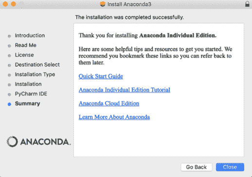
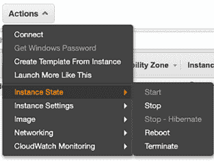
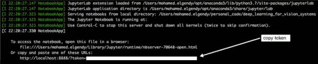

# 附录 A. 设置环境

本书中的所有代码都是用 Python 3、Open CV、Keras 和 TensorFlow 编写的。在你的计算机上设置深度学习环境的过程相当复杂，包括以下步骤，本附录将详细说明这些步骤：

1.  下载代码仓库。

1.  安装 Anaconda。

1.  设置你的深度学习环境：安装本书项目中需要的所有包（NumPy、OpenCV、Keras、TensorFlow 等）。

1.  [可选] 设置 AWS EC2 环境。如果你想在 GPU 上训练网络，这一步是可选的。

## A.1 下载代码仓库

本书展示的所有代码都可以从本书的网站 [(www.manning.com/books/deep-learning-for-vision-systems](https://www.manning.com/books/deep-learning-for-vision-systems)) 和 GitHub ([`github.com/moelgendy/deep_learning_for_vision_systems`](https://github.com/moelgendy/deep_learning_for_vision_systems/)) 下载，以 Git 仓库的形式。GitHub 仓库包含每个章节的目录。如果你不熟悉使用 Git 和 GitHub 进行版本控制，你可以查看入门文章 ([`help.github.com/categories/bootcamp`](https://help.github.com/categories/bootcamp)) 和/或初学者资源 ([`help.github.com/articles/good-resources-for-learning-git-and-github`](https://help.github.com/articles/good-resources-for-learning-git-and-github)) 以学习这些工具。

## A.2 安装 Anaconda

Anaconda ([`anaconda.org`](https://anaconda.org/)) 是为数据科学和机器学习项目构建的包发行版。它包含 conda，一个包和环境管理器。你将使用 conda 为使用不同版本库的项目创建隔离的环境。你还将使用它来在你的环境中安装、卸载和更新包。

注意，Anaconda 是一个相当大的下载文件（约 600 MB），因为它包含了 Python 中最常用的机器学习包。如果你不需要所有这些包，或者需要节省带宽或存储空间，也可以选择 Miniconda，这是一个更小的发行版，仅包含 conda 和 Python。你仍然可以使用 conda 安装任何可用的包；只是它们不会随安装包一起提供。

按以下步骤在你的计算机上安装 Anaconda：

1.  Anaconda 可用于 Windows、macOS 和 Linux。你可以在 [www.anaconda.com/distribution](https://www.anaconda.com/distribution/) 找到安装程序和安装说明。选择 Python 3 版本，因为自 2020 年 1 月起 Python 2 已被弃用。如果你有 64 位操作系统，请选择 64 位安装程序；否则，请选择 32 位安装程序。请下载适当的版本。

1.  按照图 A.1 中显示的图形界面安装程序进行安装。

    

    图 A.1 macOS 上的 Anaconda 安装器

1.  安装完成后，你将自动进入默认的 conda 环境，其中已安装所有软件包。你可以通过在终端中输入 `conda` `list` 来检查自己的安装情况，以查看你的 conda 环境。

## A.3 设置你的深度学习环境

现在，你将创建一个新的环境并安装你将为项目使用的软件包。你将使用 conda 作为包管理器来安装你需要的库。你可能已经熟悉 pip；它是 Python 库的默认包管理器。conda 与 pip 类似，但可用的软件包主要集中在数据科学领域，而 pip 用于通用用途。

Conda 也是一个虚拟环境管理器。它与像 virtualenv ([`virtualenv.pypa.io/en/stable`](https://virtualenv.pypa.io/en/stable)) 和 pyenv ([`github.com/pyenv/pyenv`](https://github.com/pyenv/pyenv)) 这样的其他流行环境管理器类似。然而，conda 并不像 pip 那样特定于 Python：它也可以安装非 Python 软件包。它是一个适用于任何软件栈的包管理器。也就是说，并非所有 Python 库都可通过 Anaconda 发行版和 conda 获取。你可以（并且将会）继续使用 pip 与 conda 一起安装软件包。

### A.3.1 手动设置你的开发环境

按照以下步骤手动安装本书项目中需要的所有库。否则，跳到下一节以安装书中 GitHub 仓库中为你创建的环境。

1.  在你的终端中，创建一个新的 conda 环境，使用 Python 3，并将其命名为 `deep_learning_for_vision_systems`：

    ```
    conda create -n deep_learning_for_vision_systems python=3
    ```

    注意，要删除 conda 环境，你使用 `conda` `env` `remove` `-n` `<env_name>`。

1.  激活你的环境。在安装你的软件包之前，你必须激活该环境。这样，所有软件包都只为此环境安装：

    ```
    conda activate deep_learning_for_vision_systems 
    ```

    注意，要停用环境，你使用 `conda` `deactivate` `<env_name>`。

    现在，你已经进入了你的新环境。要查看此环境中安装的默认软件包，请输入以下命令：`conda` `list`。接下来，你将安装本书项目中使用的软件包。

1.  安装 NumPy、pandas 和 Matplotlib。这些是非常常见的机器学习包，你几乎总是在你的项目中使用它们进行数学运算、数据处理和可视化任务：

    ```
    conda install numpy pandas matplotlib
    ```

    注意，在整个安装过程中，你将收到提示以确认继续（Proceed ([y]/n)?）。输入 *y* 并按 Enter 键继续安装。

1.  安装 Jupyter 笔记本。在这本书中，我们使用 Jupyter 笔记本来简化开发：

    ```
    conda install jupyter notebook
    ```

1.  安装 OpenCV（最受欢迎的开源计算机视觉库）：

    ```
    conda install -c conda-forge opencv
    ```

1.  安装 Keras：

    ```
    pip install keras
    ```

1.  安装 TensorFlow：

    ```
    pip install tensorflow
    ```

    现在一切准备就绪，你的环境已准备好开始开发。如果你想查看你环境中安装的所有库，请输入以下命令：

    ```
    conda list
    ```

这些软件包与其他环境是分开的。这样，你可以避免任何版本冲突问题。

### A.3.2 使用本书仓库中的 conda 环境

1.  从[`github.com/moelgendy/deep_learning_for_vision_systems`](https://github.com/moelgendy/deep_learning_for_vision_systems)克隆本书的 GitHub 仓库。环境位于安装器/应用程序.yaml 文件中：

    ```
    cd installer
    ```

1.  创建 conda `deep_learning`环境：

    ```
    conda env create -f my_environment.yaml
    ```

1.  激活 conda 环境：

1.  启动你的 Jupyter 笔记本（确保你位于`deep_learning_for_vision_systems`仓库的根目录）：

    ```
    jupyter notebook
    ```

现在你已经准备好运行与本书相关的笔记本了。

### A.3.3 保存和加载环境

如果你想与他人共享环境，以便他们可以使用正确的版本安装你代码中使用的所有包，那么保存环境是一个最佳实践。为此，你可以使用以下命令将包保存到 YAML 文件中：

```
conda env export > my_environment.yaml 
```

这样，其他人可以使用以下命令在他们的机器上使用此 YAML 文件来复制你的环境：

```
conda env create -f my_environment.yaml 
```

你还可以将环境中的包列表导出到一个.txt 文件中，然后将该文件包含在你的代码中。这允许其他人轻松地加载你代码的所有依赖项。Pip 具有与此类似的命令功能：

```
pip freeze > requirements.txt
```

你可以在安装目录中下载的代码中找到本书项目使用的环境详情。你可以使用它来在你的机器上复制我的环境。

## A.4 设置你的 AWS EC2 环境

训练和评估深度神经网络是一项计算密集型任务，这取决于你的数据集大小和神经网络的大小。本书中的所有项目都是专门设计的，具有适当大小的问题和数据集，以便你可以在本地机器的 CPU 上训练网络。但其中一些项目可能需要长达 20 小时才能训练——或者更多，这取决于你的计算机规格和其他参数，如迭代次数、神经网络大小和其他因素。

一种更快的替代方案是在图形处理单元（GPU）上训练，这是一种支持更大并行性的处理器。你可以自己搭建深度学习设备，或者使用像 Amazon AWS EC2 这样的云服务。许多云服务提供商提供类似的功能，但 EC2 是一个合理的默认选择，大多数初学者都可以使用。在接下来的几节中，我们将介绍从无到有，在 Amazon 服务器上运行神经网络的步骤。

### A.4.1 创建 AWS 账户

按照以下步骤操作：

1.  访问[aws.amazon.com](https://aws.amazon.com/)，并点击创建 AWS 账户按钮。你还需要选择一个支持计划。你可以选择免费的 Basic Support Plan。你可能需要提供信用卡信息，但你现在不会收取任何费用。

1.  启动 EC2 实例：

    1.  前往 EC2 管理控制台[`console.aws.amazon.com/ec2/v2/home`](https://console.aws.amazon.com/ec2/v2/home)，并点击启动实例按钮。

    1.  点击 AWS Marketplace。

    1.  搜索“深度学习 AMI”，并选择适合您环境的 AMI。Amazon Machine Images (AMI) 包含了您在 GPU 上训练所需的所有环境文件和驱动程序。它包含 cuDNN 和许多其他用于本书项目中所需的软件包。对于特定项目所需的其他软件包，在相应的项目说明中详细说明。

    1.  选择实例类型：

        +   筛选实例列表，仅显示 GPU 实例。

        +   选择 p2.xlarge 实例类型。这个实例足够强大，可以用于我们的项目，而且并不昂贵。如果您有兴趣尝试更强大的实例，请随意选择。

        +   点击“审查和启动”按钮。

    1.  编辑安全组。您将在本书中使用 Jupyter 笔记本，它们默认使用端口 8888。要访问此端口，您需要通过编辑安全组在 AWS 上打开它：

        +   选择“创建新的安全组”。

        +   将安全组名称设置为 Jupyter。

        +   点击“添加规则”，并设置自定义 TCP 规则。

        +   设置端口号为 8888。

        +   将源设置为“任何地方”。

        +   点击“审查和启动”。

    1.  点击“启动”按钮以启动您的 GPU 实例。您需要指定一个身份验证密钥对才能访问您的实例。因此，当您启动实例时，请确保选择“创建新的密钥对”并点击“下载密钥对”按钮。这将下载一个.pem 文件，您需要它才能访问您的实例。将.pem 文件移动到您计算机上安全且易于记住的位置；您将通过您选择的位置访问您的实例。在.pem 文件下载后，点击“启动实例”按钮。

警告：从现在开始，AWS 将向您收取运行此 EC2 实例的费用。您可以在 EC2 按需定价页面找到详细信息（[`aws.amazon.com/ec2/pricing/on-demand`](https://aws.amazon.com/ec2/pricing/on-demand)）。最重要的是，始终记得在不使用实例时停止实例。否则，它们可能会继续运行，您可能会收到一大笔账单！AWS 主要按运行实例收费，因此一旦您停止实例，大多数费用就会停止。然而，较小的存储费用将继续累积，直到您终止（删除）实例。

### A.4.2 远程连接到您的实例

现在您已经创建了您的 EC2 实例，请转到您的 EC2 仪表板，选择实例，并启动它，如图 A.2 所示。请允许一分钟左右的时间让 EC2 实例启动。当实例状态检查显示“检查通过”时，您就会知道它已经准备好了。滚动到描述部分，并记下 EC2 仪表板上的 IPv4 公共 IP 地址（格式为 X.X.X.X）；您将在下一步中需要它来远程访问您的实例。



图 A.2 如何远程连接到您的实例

在您的终端上，按照以下步骤连接到您的 EC2 服务器：

1.  导航到上一节中存储您的.pem 文件的位置。

1.  输入以下内容：

    ```
    ssh -i YourKeyName.pem user@X.X.X.X 
    ```

    `user` 可以是 `ubuntu@` 或 `ec2-user@`。`X.X.X.X` 是您从 EC2 实例描述中保存的 IPv4 公共 IP。`YourKeyName.pem` 是您的 `.pem` 文件名。

提示：如果您看到有关您的 `.pem` 文件的“权限错误”或“权限被拒绝”错误消息，请尝试执行 `chmod` `400` `path/to/YourKeyName.pem`，然后再次运行 `ssh` 命令。

### A.4.3 运行您的 Jupyter 笔记本

最后一步是在 EC2 服务器上运行您的 Jupyter 笔记本。在您从终端远程访问实例后，按照以下步骤操作：

1.  在您的终端中输入以下命令：

    ```
    jupyter notebook --ip=0.0.0.0 --no-browser
    ```

    当您按下 Enter 键时，您将获得一个访问令牌，如图 A.3 所示。复制此令牌值，因为您将在下一步中使用它。

    

    图 A.3 将令牌复制以运行笔记本。

1.  在您的浏览器中，访问此 URL：http://<IPv4 公共 IP>:8888。请注意，IPv4 公共 IP 是您从 EC2 实例描述中保存的那个。例如，如果公共 IP 是 25.153.17.47，那么 URL 将是 http://25.153.17.47:8888。

1.  将您在步骤 1 中复制的令牌密钥输入到令牌字段中，然后点击登录（图 A.4）。

    

    图 A.4 登录

1.  安装您项目所需的库，类似于您在 A.3.1 节中做的操作。但这次，使用 `pip` `install` 而不是 `conda` `install`。例如，要安装 Keras，您需要输入 `pip` `install` `keras`。

那就这样了。现在您已经准备好开始编码了！
