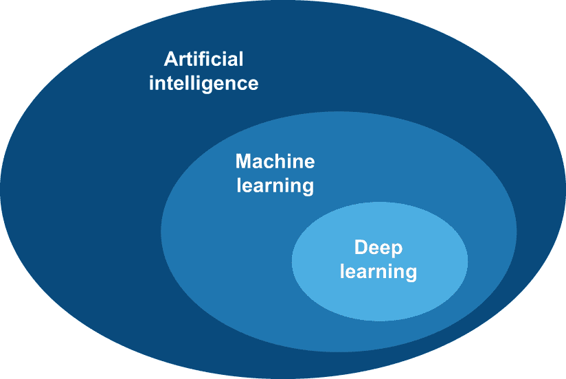
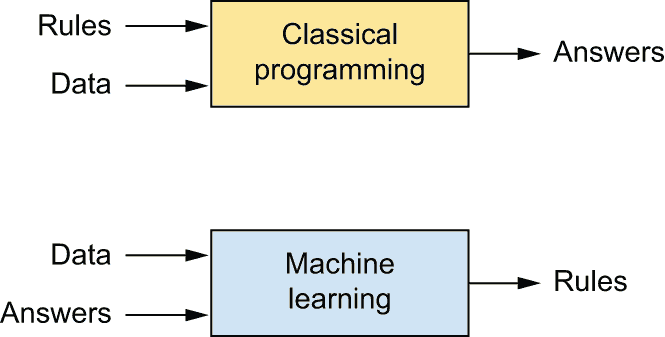
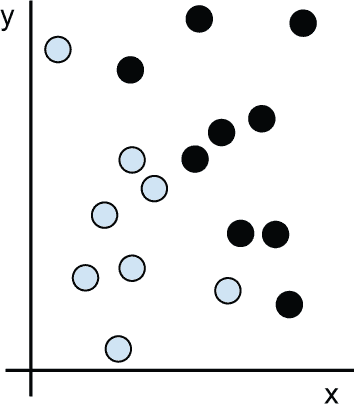
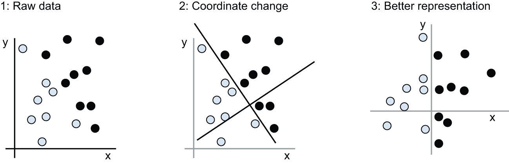
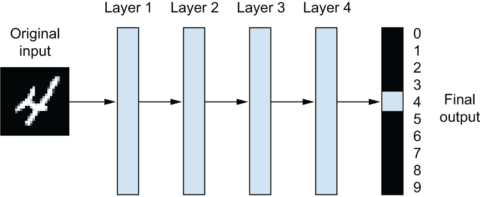
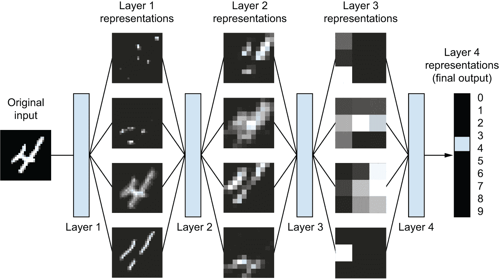
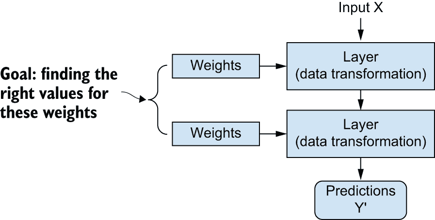
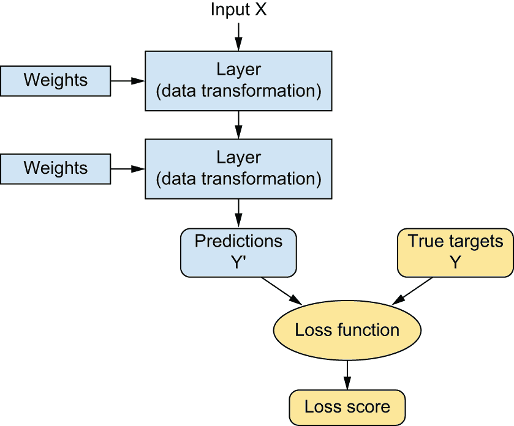
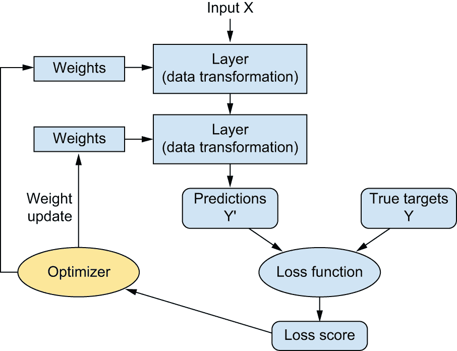

# 什么是深度学习？

> [`deeplearningwithpython.io/chapters/chapter01_what-is-deep-learning`](https://deeplearningwithpython.io/chapters/chapter01_what-is-deep-learning)

在过去的十年里，人工智能（AI）一直是媒体炒作的热点。机器学习、深度学习和人工智能在无数文章中都有提及，通常这些文章并非来自技术导向的出版物。我们被承诺一个智能聊天机器人、自动驾驶汽车和虚拟助手的未来——有时被描绘成一种阴暗的光景，有时被描绘成乌托邦，在那里人类的工作将变得稀缺，大部分经济活动将由机器人或人工智能代理处理。对于机器学习的从业者来说，能够识别信号中的噪音非常重要，这样你就可以区分出世界级的变化和过度炒作的公关稿。我们的未来处于危险之中，而你将扮演一个积极的角色：阅读完这本书后，你将成为那些能够开发这些人工智能系统的人之一。所以，让我们来探讨这些问题：深度学习已经取得了哪些成果？它有多重要？我们接下来将走向何方？你应该相信炒作吗？

## 人工智能、机器学习和深度学习

首先，我们需要明确当我们提到 AI 时我们在谈论什么。什么是人工智能、机器学习和深度学习（图 1.1）？它们之间是如何相互关联的？

图 1.1：人工智能、机器学习和深度学习

## 人工智能

人工智能诞生于 20 世纪 50 年代，当时计算机科学领域的几位先驱开始质疑是否能够制造出能够“思考”的计算机——这是一个我们今天仍在探索的问题的深远影响。

尽管许多基本思想在过去的几年甚至几十年里一直在酝酿，但“人工智能”最终在 1956 年作为一个研究领域得以明确，当时约翰·麦卡锡（John McCarthy），当时是达特茅斯学院的一位年轻的数学助理教授，根据以下提案组织了一个夏季研讨会：

> 这项研究将基于以下猜想进行：学习的各个方面或任何其他智能特征原则上都可以被精确描述，以至于可以制造出能够模拟它的机器。我们将尝试找出如何让机器使用语言，形成抽象和概念，解决目前仅限于人类解决的问题，并自我改进。我们认为，如果一组精心挑选的科学家共同在一个夏天致力于这些问题，那么在这些问题中的一个或多个上可以取得重大进展。

夏季结束时，研讨会没有完全解决它最初要解决的问题，但仍然吸引了很多人参加，这些人后来成为了该领域的先驱，并引发了一场至今仍在进行的智力革命。

简而言之，人工智能可以被描述为*自动化人类通常执行的知识任务的努力*。因此，人工智能是一个涵盖机器学习和深度学习，但也包括许多可能不涉及学习的更广泛领域的通用领域。考虑一下，直到 20 世纪 80 年代，大多数人工智能教科书根本不提“学习”！早期的棋类程序，例如，只涉及程序员编写的硬编码规则，并不符合机器学习的标准。实际上，在相当长的一段时间里，大多数专家认为，通过程序员手工制作足够大的显式规则集来操作存储在显式数据库中的知识，就可以实现人类水平的人工智能。这种方法被称为*符号人工智能*。它是从 20 世纪 50 年代到 20 世纪 80 年代末人工智能的主导范式，并在 20 世纪 80 年代的*专家系统*热潮中达到了顶峰。

尽管符号人工智能被证明适合解决定义明确的逻辑问题，例如下棋，但它发现解决更复杂、模糊的问题，如图像分类、语音识别或自然语言翻译，是难以处理的。一种新的方法应运而生，以取代符号人工智能：*机器学习*。

## 机器学习

在维多利亚时代的英国，洛夫莱斯女士是查尔斯·巴贝奇的朋友和合作者，他是分析机的发明者：已知的第一台通用机械计算机。尽管具有远见卓识，并且领先于时代，但分析机在 19 世纪 30 年代和 40 年代设计时并不是作为通用计算机而设计的，因为通用计算的概念尚未被发明。它仅仅是为了使用机械操作来自动化数学分析领域的某些计算——因此得名分析机。因此，它是早期尝试将数学运算编码为齿轮形式的智力后裔，例如帕斯卡计算器，或莱布尼茨的步进计算器，帕斯卡计算器的改进版。帕斯卡在 1642 年（当时 19 岁！）设计的帕斯卡计算器是世界上第一台机械计算器——它可以进行加法、减法、乘法，甚至除法。

1843 年，阿达·洛夫莱斯对分析机的发明发表了评论：

> 分析机根本不试图创造任何东西。它可以执行我们知道如何命令它执行的一切……它的职责是帮助我们提供我们已熟悉的东西。

即使有 182 年的历史视角，洛夫莱斯女士的观察仍然引人注目。一台通用计算机“创造”出任何东西，还是始终被束缚在执行我们人类完全理解的过程上？它能否具有任何原创思想？它能否从经验中学习？它能否表现出创造力？

她的评论后来被人工智能先驱艾伦·图灵在 1950 年的里程碑式论文《计算机机械与智能》中引用为“洛夫莱斯异议”，该论文介绍了**图灵测试**以及将塑造人工智能的关键概念。图灵当时持有——极具挑衅性——的观点，即计算机原则上可以模仿人类智能的所有方面。

通常让计算机做有用的工作的方式是让人类程序员写下规则——一个计算机程序——以将输入数据转换为适当的答案，就像洛夫莱斯女士为分析机编写逐步指令一样。机器学习则相反：机器查看输入数据和相应的答案，并找出应该遵循的规则（见图 1.2）。

：机器学习：一种新的编程范式

机器学习系统是通过训练而不是明确编程的。它被提供了许多与任务相关的示例，并从这些示例中找到统计结构，最终使系统能够制定自动化任务的规则。例如，如果你希望自动化标记假期照片的任务，你可以向机器学习系统提供许多已经被人类标记的图片示例，系统就会学习将特定图片与特定标签（如“风景”或“食物”）关联的统计规则。

尽管机器学习直到 20 世纪 90 年代才开始蓬勃发展，但它迅速成为人工智能最受欢迎且最成功的子领域，这一趋势是由更快的硬件和更大的数据集的可用性所驱动的。机器学习与数学统计学相关，但在几个重要方面与统计学有所不同——就像医学与化学相关，但不能简化为化学一样，因为医学处理的是其自身独特的系统及其独特的属性。与统计学不同，机器学习倾向于处理大型、复杂的数据集（例如包含数百万个图像的数据集，每个图像由数万个像素组成），对于这些数据集，传统的统计分析（如贝叶斯分析）将是不切实际的。因此，机器学习，尤其是深度学习，在数学理论上相对较少——可能太少——它本质上是一门工程学科。与理论物理学或数学不同，机器学习是一个非常注重实践、由经验发现驱动且深度依赖软件和硬件进步的领域。

## 从数据中学习规则和表示

要定义**深度学习**并理解深度学习与其他机器学习方法的区别，首先我们需要了解机器学习算法是如何工作的。我们之前提到，机器学习是通过发现规则来执行数据处理任务，给定预期的示例。因此，要进行机器学习，我们需要三样东西：

+   **输入数据点** — 例如，如果任务是语音识别，这些数据点可能是人们说话的音频文件。如果任务是图像标记，它们可能是图片。

+   **预期输出的例子** — 在语音识别任务中，这些可能是人类生成的音频文件的转录。在图像任务中，预期输出可能是“狗”、“猫”等标签。

+   **衡量算法是否做得好的方法** — 这是确定算法当前输出与预期输出之间距离所必需的。这种测量被用作反馈信号来调整算法的工作方式。这个调整步骤就是我们所说的**学习**。

机器学习模型将输入数据转换成有意义的输出，这个过程是通过接触已知的输入和输出示例来“学习”的。因此，机器学习与深度学习的核心问题是有意义地**转换数据**：换句话说，学习手头输入数据的有用**表示**——这些表示使我们更接近预期的输出。

在我们继续之前，什么是表示？在本质上，它是一种不同的方式来看待数据，以表示或编码数据。例如，彩色图像可以编码在 RGB 格式（红-绿-蓝）或 HSV 格式（色调-饱和度-值）中：这些都是相同数据的两种不同表示。一些任务可能在一个表示下很难，但在另一个表示下可能变得容易。例如，“在图像中选择所有红色像素”在 RGB 格式下更简单，而“使图像不那么饱和”在 HSV 格式下更简单。机器学习模型都是关于为其输入数据找到适当的表示——对数据进行转换，使其更适合当前任务。

让我们具体说明。考虑一个 x 轴、一个 y 轴和一些在（x，y）系统中用坐标表示的点，如图 1.3 所示。

图 1.3：一些样本数据

如您所见，我们有一些白色点和一些黑色点。假设我们想要开发一个算法，该算法可以接受一个点的（x，y）坐标，并输出该点可能是黑色还是白色。在这种情况下，

+   输入是我们点的坐标。

+   预期输出是我们点的颜色。

+   一种衡量我们的算法是否做得好的方法可以是，例如，正确分类的点的百分比。

在这里，我们需要一种新的数据表示方法，能够清晰地分离出白点和黑点。在众多可能性中，我们可以使用的一种变换就是坐标变换，如图 1.4 所示。

图 1.4：坐标变换

在这个新的坐标系中，我们点的坐标可以说是一种新的数据表示。而且这是一个很好的表示！使用这种表示，黑/白分类问题可以表达为一个简单的规则：“黑点满足 x > 0，”或者“白点满足 x < 0。”这种新的表示，结合这个简单的规则，巧妙地解决了分类问题。

在这个例子中，我们手动定义了坐标变换：我们利用人类智慧来提出我们自己的数据适当表示。对于如此简单的问题来说，这是可以的，但如果你要分类手写数字的图像，你能做到同样的事情吗？你能写下明确的、计算机可执行的图像变换，以阐明 6 和 8、1 和 7 之间的区别，以及各种不同手写的区别吗？

这在某种程度上是可能的。基于数字表示的规则，例如“计算封闭环的数量”或垂直和水平像素直方图，可以在区分手写数字方面做得相当不错。但手动找到这样的有用表示是件辛苦的工作，而且正如你可以想象的那样，由此产生的基于规则的系统将是脆弱的，维护起来将是一场噩梦。每次你遇到一个新的手写例子，它打破了你的精心设计的规则，你都必须添加新的数据变换和新的规则，同时考虑到它们与每个先前规则之间的相互作用。

你可能正在想，如果这个过程如此痛苦，我们能否自动化它？如果我们尝试系统地搜索不同集合的自动生成数据表示及其规则，并使用某些开发数据集中正确分类数字的百分比作为反馈来识别好的表示，我们会做什么？那么我们就会进行机器学习。在机器学习的背景下，“学习”描述了一个自动搜索过程，用于寻找产生某些数据有用表示的数据变换，这个过程由某些反馈信号引导——这些表示可以适用于更简单的规则来解决手头的任务。*学习*，在机器学习的上下文中，描述了一个自动搜索过程，用于寻找产生有用表示的数据变换，这个过程由某些反馈信号引导——这些表示可以适用于更简单的规则来解决手头的任务。

这些变换可以是坐标变化（就像我们在二维坐标分类示例中那样）或像素直方图和计数环（就像我们在数字分类示例中那样），但它们也可以是线性投影、平移和非线性操作（例如“选择所有 x > 0 的点”），等等。机器学习算法在寻找这些变换方面通常并不具有创造性；它们只是在预定义的操作集合中搜索，称为*假设空间*。例如，所有可能的坐标变化空间将是我们在二维坐标分类示例中的假设空间。

所以，这就是机器学习的简要概述：在预定义的可能空间内，通过反馈信号的引导，搜索一些输入数据的有用表示和规则。这个简单的想法使我们能够解决从自动驾驶到自然语言问答的广泛智力任务。

现在你已经理解了我们所说的*学习*是什么意思，让我们来看看是什么让*深度学习*变得特殊。

## “深度学习”中的“深度”

深度学习是机器学习的一个特定子领域；它是对从数据中学习表示的新方法，强调学习越来越有意义的表示的连续层。在“深度学习”中的“深度”并不是指通过这种方法实现的任何更深入的理解；相反，它代表了这个连续层表示的想法。对数据模型贡献多少层被称为模型的*深度*。该领域的其他适当名称可以是*分层表示学习*或*层次表示学习*。现代深度学习通常涉及数十甚至数百个连续的表示层，它们都是通过接触训练数据自动学习的。同时，其他机器学习方法倾向于只学习数据的一层或两层表示（例如，获取像素直方图然后应用分类规则）；因此，它们有时被称为*浅层学习*。

在深度学习中，这些分层表示是通过称为**神经网络**的模型来学习的，这些网络以实际的层堆叠在一起。术语**神经网络**是对神经生物学的引用，尽管深度学习的一些核心概念部分是通过从我们对大脑（特别是视觉皮层）的理解中汲取灵感而开发的，但深度学习模型并不是大脑的模型。没有证据表明大脑实现了与现代深度学习模型中使用的任何类似的学习机制。你可能会遇到一些流行科学文章宣称深度学习就像大脑一样工作，或者是以大脑为模型，但这并不是事实。对于新进入该领域的人来说，将深度学习视为与神经生物学有任何关联将会令人困惑且适得其反；你不需要那种“就像我们的心智”的神秘和神秘感，而且你最好忘记任何关于深度学习与生物学之间假设性联系的内容。就我们的目的而言，深度学习是从数据中学习表示的数学框架。

深度学习算法学习的表示是什么样的呢？让我们考察一个多层网络（见图 1.5）是如何将数字图像转换为识别其是哪个数字的。

图 1.5：用于数字分类的深度神经网络

正如你在图 1.6 中看到的，网络将数字图像转换为与原始图像越来越不同且越来越有助于最终结果的表示。你可以将深度网络视为一个多阶段**信息蒸馏**过程，其中信息通过连续的过滤器，并越来越**纯净**（即，对某些任务有用）。

图 1.6：数字分类模型学习的深度表示

因此，从技术上讲，深度学习就是这样一种多阶段学习数据表示的方法。这是一个简单的想法，但正如实际情况所证明的，非常简单的机制，如果足够规模，最终看起来就像魔术。

## 通过三个图解理解深度学习的工作原理

到目前为止，你知道机器学习是关于将输入（如图像）映射到目标（如标签“猫”），这是通过观察许多输入和目标的示例来完成的。你也知道，深度神经网络通过一系列简单数据变换（层）来实现输入到目标的映射，而这些数据变换是通过接触示例来学习的。现在让我们具体看看这种学习是如何发生的。

层对输入数据的处理规范存储在层的**权重**中，本质上是一系列数字。从技术角度讲，我们可以说层的实现是通过其权重**参数化**的（见图 1.7）。（权重有时也被称为层的参数。）在这个背景下，**学习**意味着找到网络中所有层权重的值，使得网络能够正确地将示例输入映射到其相关目标。但问题是：深度神经网络可能包含数百万个参数。找到所有这些参数的正确值可能是一项艰巨的任务，尤其是考虑到修改一个参数的值将影响所有其他参数的行为！

：神经网络通过其权重进行参数化。

要控制某物，首先你需要能够观察它。要控制神经网络的输出，你需要能够测量这个输出与预期之间的差距。这是网络**损失函数**的工作，有时也称为**目标函数**或**成本函数**。损失函数接受网络的预测和真实目标（你希望网络输出的内容）并计算一个距离分数，捕捉网络在这个特定示例上的表现（见图 1.8）。

：损失函数衡量网络输出的质量。

深度学习的基本技巧是使用这个分数作为反馈信号来稍微调整权重的值，使其在当前示例中降低损失分数（见图 1.9）。这个调整是**优化器**的工作，它实现了所谓的**反向传播**算法：深度学习的核心算法。下一章将更详细地解释反向传播是如何工作的。

：损失分数被用作反馈信号来调整权重。

初始时，网络的权重被分配随机值，因此网络仅仅实现了一系列随机变换。自然地，其输出远远不是理想的，相应的损失分数也极高。但随着网络处理每个示例，权重都会在正确的方向上稍微调整，损失分数随之降低。这就是**训练循环**，重复足够多次（通常是数千个示例的数十次遍历），可以得到最小化损失函数的权重值。损失最小的网络是输出尽可能接近目标的网络：一个训练好的网络。再次强调，这是一个简单的机制，一旦扩展，最终看起来就像魔法。

## 深度学习与众不同的地方

深度神经网络有什么特别之处，使得它们成为公司投资和研究人员蜂拥而至的“正确”方法？我们还会在 20 年后继续使用深度神经网络吗？

深度学习有几个特性使其成为 AI 革命的正当理由，并且它将长期存在。我们可能在未来几十年内不会使用神经网络，但我们将使用的东西将直接继承自现代深度学习和其核心概念。这些重要特性可以大致分为三类：

+   *简单性* — 深度学习使问题解决变得更加容易，因为它自动化了机器学习工作流程中最关键的一步：特征工程。先前的机器学习技术——浅层学习——仅涉及将输入数据转换为一个或两个连续的表示空间，这对于大多数问题来说表达性不足。因此，人类不得不付出巨大的努力来使初始输入数据更适合这些方法：他们必须手动为他们的数据设计良好的表示。这被称为*特征工程*。另一方面，深度学习完全自动化了这一步骤：使用深度学习，你可以在一次遍历中学习所有特征，而无需自己设计。这极大地简化了机器学习工作流程，通常用单个简单、端到端的深度学习模型取代了复杂的多个阶段管道。

+   *可扩展性* — 深度学习非常适合在 GPU 或更专业的机器学习硬件上进行并行化，因此它可以充分利用摩尔定律。此外，深度学习模型通过迭代处理小批量数据来训练，这使得它们可以在任意大小的数据集上训练。（唯一的瓶颈是可用的并行计算能力，但由于摩尔定律，这是一个快速移动的障碍。）

+   *通用性和可重用性* — 与许多先前的机器学习方法不同，深度学习模型可以在不从头开始的情况下使用额外数据进行训练，这使得它们适用于持续在线学习——这对于非常大的生产模型来说是一个重要的特性。此外，训练好的深度学习模型可以重新部署，因此可以重复使用：这就是“基础模型”背后的重大理念——在大量数据上训练的大型模型，可以用于许多新的任务，只需少量重新训练，甚至无需重新训练。

## 生成式 AI 的时代

深度学习今天最著名的例子可能是最近一波生成式 AI 应用——如 ChatGPT、Gemini 和 Claude 等聊天机器人助手，以及 Midjourney 等图像生成服务。这些应用通过其能够对简单提示产生信息或甚至创造性的内容的能力，吸引了公众的想象力，模糊了人类与机器创造力的界限。

生成式 AI 由非常庞大的“基础模型”驱动，这些模型学会*重建*输入给它们的文本和图像内容——从噪声版本重建清晰图像，预测句子中的下一个单词，等等。这意味着图 1.8 中的*目标*是从输入本身提取的。这被称为*自监督学习*，它使得这些模型能够使用大量未标记的数据。摆脱了以前机器学习瓶颈的手动数据标注，解锁了前所未有的规模——这些基础模型中的一些拥有数百亿个参数，并在超过 1PB 的数据上进行训练，成本高达数百万美元。

这些基础模型作为人类知识的一种模糊数据库运行，使得它们适用于非常广泛的应用，而无需专门的编程或重新训练。因为它们已经记住了很多，它们可以通过*提示*来解决新问题——查询它们学习到的知识表示，并返回与提示最可能相关联的输出。

生成式 AI 直到 2022 年才进入主流意识，但它有着悠久的历史——最早的文本生成实验可以追溯到 20 世纪 90 年代。本书的第一版于 2017 年发布，其中已经有一个名为“生成式 AI”的章节，探讨了当时的文本生成和图像生成技术，并承诺“很快”，我们消费的大部分文化内容都将借助 AI 创造。

## 深度学习至今所取得的成就

在过去十年中，深度学习取得了不亚于技术革命的成就，从 2013 年到 2017 年，在感知任务上取得了显著成果，然后从 2017 年到 2022 年在自然语言处理任务上快速进步，最终从 2022 年到如今，涌现出一波变革性的生成式 AI 应用。

深度学习在极其具有挑战性的问题上实现了重大突破，这些问题长期以来一直困扰着机器：

+   流畅且高度通用的聊天机器人，如 ChatGPT 和 Gemini

+   如 GitHub Copilot 之类的编程助手

+   真实感图像生成

+   人类水平的图像分类

+   人类水平的语音转录

+   人类水平的手写转录和印刷文本转录

+   显著改进的机器翻译

+   显著改进的文本到语音转换

+   人类水平的自动驾驶，截至 2025 年已在凤凰城、旧金山、洛杉矶和奥斯汀向公众部署

+   改进的推荐系统，如 YouTube、Netflix 或 Spotify 所使用

+   超人类水平的围棋、象棋和国际象棋游戏

我们仍在探索深度学习的全部潜力。我们已经成功地将它应用于各种问题，这些问题几年前还被认为是不可能解决的——自动转录梵蒂冈秘密档案中持有的数万份古代手稿，使用简单的智能手机在田间检测和分类植物疾病，协助肿瘤学家或放射科医生解读医学影像数据，预测自然灾害，如洪水、飓风甚至地震。随着每一个里程碑的达成，我们正越来越接近一个深度学习帮助我们从事每一个活动和每一个人类努力领域的时代——科学、医学、制造业、能源、交通、软件开发、农业甚至艺术创作。

## 警惕短期炒作

这看似不可阻挡的成功连锁反应引发了一波强烈的炒作热潮，其中一些多少有些根据，但大部分只是华丽的童话。在 2023 年初，OpenAI 发布 GPT-4 之后不久，许多专家声称“没有人需要再工作了”，或者大规模失业将在一年内到来，或者经济生产力将很快增长 10 倍到 100 倍。当然，两年后，这一切都没有发生——美国的失业率仍然很低，而生产力指标远未达到预期的爆炸性增长。不要误解：AI——特别是生成式 AI——的影响已经相当可观，并且增长速度非常快。截至 2025 年中，生成式 AI 每年产生数十亿美元的收益，这对于两年前还不存在的行业来说是非常令人印象深刻的！但这还没有在整体经济中造成太大的影响，与我们在其初期所受到的绝对不受约束的承诺相比相形见绌。

虽然关于由 AI 引发的失业和 100 倍生产力增长的讨论已经引起了焦虑，但 AI 炒作的另一个更引人注目的方面是，它宣称人类水平的一般智能（AGI）或甚至超越人类能力的“超级智能”即将到来。这些说法正在引发超越经济破坏的恐惧——人类物种本身可能面临被我们的数字创造物所取代的危险。

对于那些刚进入这个领域的人来说，可能会觉得是生成式 AI 的实用成功导致了近端 AGI（通用人工智能）的信念，但实际上是相反的。近端 AGI 的声明先于一切，并且它们极大地促进了生成式 AI 的兴起。早在 2013 年，科技精英们就担心 AGI 可能在几年内到来。当时，DeepMind（一家被谷歌收购的伦敦 AI 研究初创公司）被认为正在朝着这个目标前进。这种信念是 2015 年 OpenAI 成立的动力，它最初的目标是成为 DeepMind 的开源平衡力量。OpenAI 在启动生成式 AI 方面发挥了关键作用，因此，在一种奇特的反转中，是近端 AGI 的信念推动了生成式 AI 的崛起，而不是相反。2016 年，OpenAI 的招聘口号是它将在 2020 年实现 AGI！诚然，当时，科技行业只有少数人相信这样的乐观时间表。然而，到了 2023 年初，旧金山湾区的大多数工程师似乎都相信 AGI 将在接下来的几年内到来。

以健康的好奇心去审视这样的说法至关重要。尽管名字叫“人工智能”，但今天的“人工智能”更准确地描述为“认知自动化”——人类技能和知识的编码和操作。AI 擅长解决那些定义狭窄的问题或那些有大量精确示例的问题。它关于增强计算机的能力，而不是复制人类心智。

要明确的是，认知自动化极其有用。但智能——认知自主性——却是完全不同的生物。可以这样想：AI 就像一个卡通人物，而智能则像是一个活生生的人。无论卡通多么逼真，它也只能表演出它被绘制出来的场景。另一方面，一个活生生的人可以适应意外情况。

“如果卡通画得足够逼真，覆盖足够多的场景，那又有什么区别？”你可能会问。如果一个大型语言模型在被问及问题时能输出足够像人类的声音的回答，那么它是否拥有真正的认知自主性就无关紧要了吗？关键的区别在于适应性。智能是面对未知、适应它并从中学习的能力。自动化，即使在其最佳状态下，也只能处理它被训练或编程的情况。这就是为什么创建健壮的自动化如此具有挑战性——它需要考虑到每一个可能的场景。

因此，无需担心 AI 突然变得有自我意识并接管人类。今天的技术根本不是朝着这个方向发展。即使有显著的进步，AI 也将保持为一个复杂的工具，而不是一个有感知的生物。这就像期待一个更好的时钟能导致时间旅行——它们完全是不同的事物。

## 夏天可以变成冬天

过度膨胀的短期期望的危险在于，当技术不可避免地未能达到预期时，研究投资可能会枯竭，长时间地减缓进步。这种情况以前发生过。在过去，人工智能经历了两次高度乐观随后是失望和怀疑的周期，结果是资金短缺。这一切始于 20 世纪 60 年代的符号人工智能。在那些早期日子里，对人工智能的预测很高。符号人工智能方法最著名的先驱和倡导者之一是马文·明斯基，他在 1967 年声称：“在一代人之内……创造‘人工智能’的问题将基本得到解决。”三年后，在 1970 年，他做出了一个更精确的预测：“在三到八年之内，我们将拥有一个具有普通人类一般智能的机器。”到 2025 年，这样的成就似乎仍然遥不可及——如此遥远以至于我们无法预测它需要多长时间——但在 20 世纪 60 年代和早期 70 年代，一些专家认为它就在眼前（正如今天许多人所认为的那样）。几年后，随着这些高期望未能实现，研究人员和政府资金开始远离这个领域，标志着第一次**人工智能寒冬**（这个术语是参照核冬天而来的，因为这是冷战高潮之后不久）的开始。

这不会是最后一次。在 20 世纪 80 年代，一种新的符号人工智能观点，即**专家系统**，开始在大型公司中积聚势头。一些初步的成功故事引发了一波投资热潮，全球各地的公司开始建立自己的内部人工智能部门来开发专家系统。到 1985 年左右，公司每年在技术上的支出超过 10 亿美元；但到 20 世纪 90 年代初，这些系统已被证明维护成本高昂、难以扩展且应用范围有限，兴趣逐渐消退。于是开始了第二次人工智能寒冬。我们现在可能正在见证第三次人工智能炒作和失望的周期——我们仍然处于极度乐观的阶段。

我目前的观点是，我们不太可能看到像 20 世纪 90 年代那样全面退出人工智能研究的情况。如果真的有寒冬，它应该非常温和。人工智能已经证明了其改变世界的价值。然而，似乎不可避免的是，2023-2024 年的人工智能泡沫需要释放一些空气。目前，人工智能投资，主要在数据中心和 GPU 上，每年超过 1000 亿美元，而收入生成却远远落后，接近 100 亿美元。目前，人工智能正在被高管和投资者根据我们被告知它可能很快能够做到的事情来评判——其中许多将长期超出现有技术的范围。总会有所让步。但人工智能泡沫缩水时会发生什么仍然是个未知数。

## 人工智能的承诺

尽管我们可能对人工智能的短期期望不切实际，但长期前景看起来光明。我们只是在将深度学习应用于许多可能证明具有变革性的重要问题，例如医疗诊断和数字助手，才刚刚开始。

在 2017 年，在这本同一本书中，我写道：

> 目前，可能很难相信人工智能会对我们的世界产生重大影响，因为它尚未得到广泛部署——就像 1995 年，人们很难相信互联网未来的影响一样。当时，大多数人看不到互联网与他们有何关联，以及它将如何改变他们的生活。对于深度学习和人工智能来说，今天也是如此。但不要误解：人工智能正在到来。在不那么遥远的未来，人工智能将成为你的助手，甚至你的朋友；它将回答你的问题，帮助你教育孩子，并关注你的健康。它将把你的杂货送到门口，并把你从 A 点带到 B 点。它将成为你通往日益复杂和信息密集世界的接口。更重要的是，人工智能将通过协助人类科学家在所有科学领域的新突破性发现，帮助整个人类社会前进，从基因组学到数学。

快进到 2025 年，这些事情中的大多数要么已经实现，要么即将实现——而这只是开始：

+   数以千万计的人正在每天使用像 ChatGPT、Gemini 和 Claude 这样的 AI 聊天机器人作为助手。事实上，问答和“教育你的孩子”（家庭作业辅助）已经成为这些聊天机器人的主要应用！对许多人来说，人工智能已经成为通往世界信息的首选接口。

+   数十万人在与 AI“朋友”互动，例如在 Character.ai 等应用程序中。

+   在凤凰城、旧金山、洛杉矶和奥斯汀等城市，完全自动驾驶已经大规模部署。

+   人工智能正在迈出重大步伐，帮助加速科学发展。DeepMind 的 AlphaFold 模型正在帮助生物学家以前所未有的准确性预测蛋白质结构。著名数学家田纳西·陶（Terence Tao）认为，到 2026 年左右，如果使用得当，人工智能可能成为数学研究和其他领域的可靠合著者。

人工智能革命，曾经是一个遥远的愿景，现在正迅速在我们眼前展开。在这个过程中，我们可能会遇到一些挫折——就像 1998-1999 年互联网行业过度炒作，并在 2000 年代初遭受了投资枯竭的崩溃一样。但最终我们会到达那里。人工智能最终将应用于构成我们社会和日常生活的几乎每一个过程，就像今天的互联网一样。

不要相信短期炒作，但要对长期愿景保持信心。AI 发挥其真正潜力可能需要一段时间——这种潜力的全貌至今无人敢梦想——但 AI 正在到来，并以惊人的方式改变我们的世界。

### 脚注

1.  A. M. 图灵，“计算机与智能”，《心灵》59 卷，第 236 期（1950 年）：433-460。 [[↩]](#footnote-link-1)]

1.  尽管图灵测试有时被解释为一种字面意义上的测试——人工智能领域应努力实现的目标——图灵只是将其视为关于认知本质的哲学讨论中的一个概念性工具。 [[↩]](#footnote-link-2)
