# 神经网络的数学基础

> 原文：[`deeplearningwithpython.io/chapters/chapter02_mathematical-building-blocks`](https://deeplearningwithpython.io/chapters/chapter02_mathematical-building-blocks)

理解深度学习需要熟悉许多简单的数学概念：*张量*、*张量运算*、*微分*、*梯度下降*等等。我们本章的目标将是建立你对这些概念的理解，而不需要过于技术化。特别是，我们将避免使用数学符号，这可能会为没有数学背景的人设置不必要的障碍，而且对于解释事物来说也不是必要的。数学运算最精确、最明确描述是其可执行代码。

为了为介绍张量和梯度下降提供足够的背景，我们将以一个神经网络的实用示例开始本章。然后我们将逐一点评介绍的新概念。记住，这些概念对于你理解接下来章节中的实际示例是至关重要的！

在阅读完本章后，你将对深度学习背后的数学理论有一个直观的理解，并且你将准备好开始深入研究第三章中的现代深度学习框架。

## 首次了解神经网络

让我们来看一个具体的例子，这个神经网络使用机器学习库 *Keras* 来学习对手写数字进行分类。我们将在整本书中广泛使用 Keras。这是一个简单、高级的库，将使我们能够专注于我们想要覆盖的概念。

除非你已经具备使用 Keras 或类似库的经验，否则你不会立即理解这个第一个示例的所有内容。这没关系。在接下来的几个部分中，我们将回顾示例中的每个元素，并对其进行详细解释。所以，如果某些步骤看起来很随意或者对你来说像是魔术，请不要担心！我们必须从某个地方开始。

我们试图解决的问题是将灰度图像的手写数字（28 × 28 像素）分类到其 10 个类别（0 到 9）中。我们将使用 MNIST 数据集，这是机器学习社区中的经典数据集，几乎与该领域一样历史悠久，并且已经被深入研究。它是由美国国家标准与技术研究院（NIST）在 20 世纪 80 年代汇编的一套 60,000 张训练图像和 10,000 张测试图像。你可以把“解决”MNIST 看作是深度学习的“Hello World”——这是你用来验证你的算法是否按预期工作的方法。随着你成为机器学习从业者，你会在科学论文、博客文章等地方反复看到 MNIST。你可以在图 2.1 中看到一些 MNIST 样本。

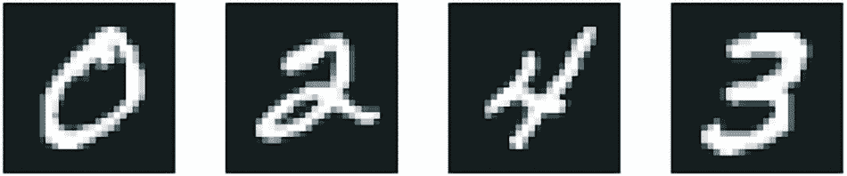

图 2.1：MNIST 样本数字

MNIST 数据集在 Keras 中预先加载，以一组四个 NumPy 数组的形式存在。

```py
from keras.datasets import mnist

(train_images, train_labels), (test_images, test_labels) = mnist.load_data() 
```

列表 2.1：在 Keras 中加载 MNIST 数据集

`train_images`和`train_labels`构成了训练集，即模型将从中学习的数据。然后，模型将在测试集`test_images`和`test_labels`上进行测试。图像被编码为 NumPy 数组，标签是一个从 0 到 9 的数字数组。图像和标签有一一对应的关系。

让我们看看训练数据：

```py
>>> train_images.shape
(60000, 28, 28)
>>> len(train_labels)
60000
>>> train_labels
array([5, 0, 4, ..., 5, 6, 8], dtype=uint8)
```

下面是测试数据：

```py
>>> test_images.shape
(10000, 28, 28)
>>> len(test_labels)
10000
>>> test_labels
array([7, 2, 1, ..., 4, 5, 6], dtype=uint8)
```

工作流程将如下进行。首先，我们将训练数据`train_images`和`train_labels`输入神经网络。然后，网络将学会将图像和标签关联起来。最后，我们将要求网络对`test_images`生成预测，并验证这些预测是否与`test_labels`中的标签匹配。

让我们构建网络——再次提醒，你不需要现在就理解这个例子中的所有内容。

```py
import keras
from keras import layers

model = keras.Sequential(
    [
        layers.Dense(512, activation="relu"),
        layers.Dense(10, activation="softmax"),
    ]
) 
```

列表 2.2：网络架构

神经网络的核心构建块是*层*。你可以将层视为数据的过滤器：一些数据进入，以更有用的形式输出。具体来说，层从输入的数据中提取*表示*——希望这些表示对于当前问题更有意义。大多数深度学习都是由将简单的层链接起来以实现一种形式的*数据蒸馏*。深度学习模型就像数据处理的筛子，由一系列越来越精细的数据过滤器——即层组成。

在这里，我们的模型由两个`Dense`层组成，这些层是密集连接的（也称为*全连接*）神经网络层。第二个（也是最后一个）层是一个 10 路*`softmax`分类*层，这意味着它将返回一个包含 10 个概率分数的数组（总和为 1）。每个分数将是当前数字图像属于我们 10 个数字类别之一的概率。

为了使模型准备好训练，我们需要在*编译*步骤中挑选三个更多的事物：

+   *损失函数*——模型将如何衡量其在训练数据上的性能，从而如何能够引导自己走向正确的方向。

+   *优化器* — 模型将根据其看到的训练数据更新自己的机制，以改善其性能。

+   *在训练和测试期间要监控的指标* — 在这里，我们只关心准确率（正确分类的图像的比例）。

损失函数和优化器的确切目的将在接下来的两章中变得清晰。

```py
model.compile(
    optimizer="adam",
    loss="sparse_categorical_crossentropy",
    metrics=["accuracy"],
) 
```

列表 2.3：编译步骤

在训练之前，我们将通过将其重塑成模型期望的形状并缩放到所有值都在 `[0, 1]` 区间内来*预处理*数据。之前，我们的训练图像存储在一个形状为 `(60000, 28, 28)`、类型为 `uint8` 且值在 `[0, 255]` 区间内的数组中。我们将其转换为一个形状为 `(60000, 28 * 28)`、值在 `0` 到 `1` 之间的 `float32` 数组。

```py
train_images = train_images.reshape((60000, 28 * 28))
train_images = train_images.astype("float32") / 255
test_images = test_images.reshape((10000, 28 * 28))
test_images = test_images.astype("float32") / 255 
```

列表 2.4：准备图像数据

我们现在准备好训练模型了，在 Keras 中，这是通过调用模型的 `fit()` 方法来完成的——我们将模型*拟合*到其训练数据。

```py
model.fit(train_images, train_labels, epochs=5, batch_size=128) 
```

列表 2.5：“拟合”模型

训练过程中显示了两个量：模型在训练数据上的损失和模型在训练数据上的准确率。我们很快就在训练数据上达到了 98.9%（0.989）的准确率。

现在我们已经训练了一个模型，我们可以用它来预测新数字的类别概率——那些不是训练数据一部分的图像，比如测试集中的图像。

```py
>>> test_digits = test_images[0:10]
>>> predictions = model.predict(test_digits)
>>> predictions[0]
array([1.0726176e-10, 1.6918376e-10, 6.1314843e-08, 8.4106023e-06,
       2.9967067e-11, 3.0331331e-09, 8.3651971e-14, 9.9999106e-01,
       2.6657624e-08, 3.8127661e-07], dtype=float32)
```

列表 2.6：使用模型进行预测

那个数组中索引 `i` 的每个数字都对应于数字图像 `test_digits[0]` 属于类别 `i` 的概率。

这个第一个测试数字在索引 7 处具有最高的概率分数（0.99999106，几乎为 1），因此根据我们的模型，它必须是一个 7：

```py
>>> predictions[0].argmax()
7
>>> predictions[0][7]
0.99999106
```

我们可以检查测试标签是否一致：

```py
>>> test_labels[0]
7
```

平均来说，我们的模型在分类这些从未见过的数字方面有多好？让我们通过在整个测试集上计算平均准确率来检查。

```py
>>> test_loss, test_acc = model.evaluate(test_images, test_labels)
>>> print(f"test_acc: {test_acc}")
test_acc: 0.9785
```

列表 2.7：在新数据上评估模型

测试集的准确率结果是 97.8%——这几乎是训练集错误率（98.9% 准确率）的两倍。训练准确率和测试准确率之间的差距是*过拟合*的一个例子：机器学习模型往往在新数据上的表现不如在训练数据上。过拟合是第五章的核心主题。

这就结束了我们的第一个例子。您刚刚看到了如何用不到 15 行 Python 代码构建和训练一个神经网络来分类手写数字。在本章和下一章中，我们将详细介绍我们刚刚预览的每个移动部件，并阐明幕后发生的事情。您将了解张量，即进入模型的数据存储对象；张量操作，即哪些层由它们组成；以及梯度下降，它允许您的模型从其训练示例中学习。

## 神经网络的表示

在上一个例子中，我们是从存储在多维 NumPy 数组中的数据开始的，这些数组也被称为*tensors*。一般来说，所有当前的机器学习系统都使用张量作为它们的基本数据结构。张量是该领域的基石——基础到以至于 TensorFlow 框架就是以它们的名称命名的。那么，什么是张量呢？

从本质上讲，张量是数据的容器 — 通常是指数值数据。因此，它是一个数字的容器。您可能已经熟悉矩阵，它们是 2 秩张量：张量是矩阵向任意维数的推广（请注意，在张量的上下文中，维度通常被称为*轴*）。

最初了解张量的细节可能有点抽象。但这是值得的 — 操作张量将是您所写的任何机器学习代码的基础。

### 标量（0 秩张量）

只包含一个数的张量被称为*标量*（或标量张量、0 阶张量或 0D 张量）。在 NumPy 中，一个`float32`或`float64`数字是一个标量张量（或标量数组）。您可以通过`ndim`属性显示 NumPy 张量的轴数；标量张量有 0 个轴（`ndim == 0`）。张量的轴数也称为其*秩*。以下是一个 NumPy 标量：

```py
>>> import numpy as np
>>> x = np.array(12)
>>> x
array(12)
>>> x.ndim
0
```

### 向量（1 秩张量）

数字数组被称为向量（或 1 秩张量或 1D 张量）。1 秩张量恰好有一个轴。以下是一个 NumPy 向量：

```py
>>> x = np.array([12, 3, 6, 14, 7])
>>> x
array([12, 3, 6, 14, 7])
>>> x.ndim
1
```

这个向量有五个条目，因此被称为*5 维向量*。不要将 5 维向量与 5 维张量混淆！5 维向量只有一个轴，其轴上有五个维度，而 5 维张量有五个轴（并且每个轴上可能有任意数量的维度）。*维度*可以表示特定轴上的条目数（如我们的 5 维向量的情况）或张量中的轴数（如 5 维张量），有时可能会造成混淆。在后一种情况下，从技术上讲，更正确地谈论一个*秩为 5 的张量*（张量的秩是轴的数量），但模糊的符号*5D 张量*仍然很常见。

### 矩阵（2 秩张量）

向量数组是一个*矩阵*（或 2 秩张量或 2D 张量）。矩阵有两个轴（通常被称为*行*和*列*）。您可以将矩阵可视化为数字的矩形网格。这是一个 NumPy 矩阵：

```py
>>> x = np.array([[5, 78, 2, 34, 0],
...               [6, 79, 3, 35, 1],
...               [7, 80, 4, 36, 2]])
>>> x.ndim
2
```

第一轴的条目称为*行*，第二轴的条目称为*列*。在上一个例子中，`[5, 78, 2, 34, 0]`是`x`的第一行，而`[5, 6, 7]`是第一列。

### 3 秩张量和更高秩的张量

如果您将这些矩阵打包到一个新的数组中，您将获得一个 3 秩张量（或 3D 张量），您可以将其可视化为数字的立方体。以下是一个 NumPy 3 秩张量：

```py
>>> x = np.array([[[5, 78, 2, 34, 0],
...                [6, 79, 3, 35, 1],
...                [7, 80, 4, 36, 2]],
...               [[5, 78, 2, 34, 0],
...                [6, 79, 3, 35, 1],
...                [7, 80, 4, 36, 2]],
...               [[5, 78, 2, 34, 0],
...                [6, 79, 3, 35, 1],
...                [7, 80, 4, 36, 2]]])
>>> x.ndim
3
```

通过将 3 秩张量打包到数组中，您可以创建一个 4 秩张量，依此类推。在深度学习中，您通常操作秩为 0 到 4 的张量，尽管如果您处理视频数据，您可能达到 5。

### 关键属性

张量由三个关键属性定义：

+   *轴数（秩）* — 例如，一个 3 秩张量有三个轴，而矩阵有两个轴。这也被称为 Python 库（如 NumPy、JAX、TensorFlow 和 PyTorch）中的张量的`ndim`。

+   *形状* — 这是一个整数元组，描述了张量在每个轴上的维度数。例如，前面的矩阵示例的形状是`(3, 5)`，而三阶张量示例的形状是`(3, 3, 5)`。一个向量有一个元素的形状，例如`(5,)`，而一个标量有一个空的形状，`()`。

+   *数据类型（在 Python 库中通常称为`dtype`）* — 这是张量中包含的数据类型；例如，张量的类型可以是`float16`、`float32`、`float64`、`uint8`、`bool`等等。在 TensorFlow 中，你也可能会遇到`string`类型的张量。

为了使这一点更加具体，让我们回顾一下 MNIST 示例中处理的数据。首先，我们加载 MNIST 数据集：

```py
from keras.datasets import mnist

(train_images, train_labels), (test_images, test_labels) = mnist.load_data() 
```

接下来，我们显示张量`train_images`的轴数，`ndim`属性：

```py
>>> train_images.ndim
3
```

这是它的形状：

```py
>>> train_images.shape
(60000, 28, 28)
```

这就是它的数据类型，`dtype`属性：

```py
>>> train_images.dtype
uint8
```

因此，我们这里有一个 8 位整数的三阶张量。更确切地说，它是一个包含 60,000 个 28 × 28 整数的矩阵数组。每个这样的矩阵是一个灰度图像，其系数在 0 到 255 之间。

让我们使用 Matplotlib 库（标准科学 Python 套件的一部分）显示这个三阶张量中的第四个数字；参见图 2.2。

```py
import matplotlib.pyplot as plt

digit = train_images[4]
plt.imshow(digit, cmap=plt.cm.binary)
plt.show() 
```

代码列表 2.8：显示第四位数字

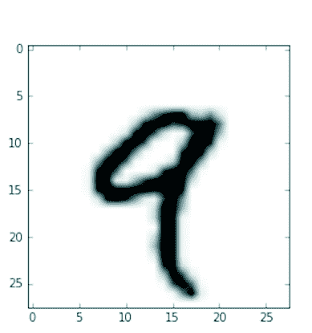

图 2.2：数据集的第四个样本

自然地，相应的标签只是整数 9：

```py
>>> train_labels[4]
9
```

### 在 NumPy 中操作张量

在前面的例子中，我们使用语法`train_images[i]`在第一个轴上选择了一个特定的数字。在张量中选择特定元素称为*张量切片*。让我们看看可以在 NumPy 数组上执行的张量切片操作。

以下示例选择了数字#10 到#100（不包括#100）并将它们放入形状为`(90, 28, 28)`的数组中：

```py
>>> my_slice = train_images[10:100]
>>> my_slice.shape
(90, 28, 28)
```

这与以下更详细的表示法等价，它为每个张量轴上的切片指定了起始索引和停止索引。注意，`:`等价于选择整个轴：

```py
>>> # Equivalent to the previous example
>>> my_slice = train_images[10:100, :, :]
>>> my_slice.shape
(90, 28, 28)
>>> # Also equivalent to the previous example
>>> my_slice = train_images[10:100, 0:28, 0:28]
>>> my_slice.shape
(90, 28, 28)
```

通常，您可以在每个张量轴上的任意两个索引之间选择切片。例如，要选择所有图像右下角的 14 × 14 像素，您将这样做：

```py
my_slice = train_images[:, 14:, 14:] 
```

也可以使用负索引。与 Python 列表中的负索引类似，它们表示相对于当前轴末尾的位置。为了将图像裁剪为中间 14 × 14 像素的补丁，这样做：

```py
my_slice = train_images[:, 7:-7, 7:-7] 
```

### 数据批次的观念

通常，在深度学习中遇到的所有数据张量的第一个轴（轴 0，因为索引从 0 开始）将是*样本轴*。在 MNIST 示例中，“样本”是数字的图像。

此外，深度学习模型不会一次性处理整个数据集；相反，它们将数据分成小的“批次”，即具有固定大小的样本组。具体来说，这是我们 MNIST 数字的一个批次，批次大小为 128：

```py
batch = train_images[:128] 
```

这是下一个批次：

```py
batch = train_images[128:256] 
```

以及第`n`个批次：

```py
n = 3
batch = train_images[128 * n : 128 * (n + 1)] 
```

当考虑这样的批量张量时，第一个轴（轴 0）被称为*批量轴*（或*批量维度*）。当使用 Keras 和其他深度学习库时，你经常会遇到这个术语。

### 数据张量的现实世界示例

让我们通过一些与您稍后将要遇到的类似示例来具体说明数据张量。您将要操作的数据几乎总是属于以下类别之一：

+   *向量数据* — 形状为`(样本, 特征)`的二阶张量，其中每个样本是一个数值属性（“特征”）的向量

+   *时序数据或序列数据* — 形状为`(样本, 时间步长, 特征)`的三阶张量，其中每个样本是一个特征向量的序列（长度为`时间步长`）

+   *图像* — 形状为`(样本, 高度, 宽度, 通道)`的四阶张量，其中每个样本是一个二维像素网格，每个像素由一个值向量（“通道”）表示

+   *视频* — 形状为`(样本, 帧, 高度, 宽度, 通道)`的五阶张量，其中每个样本是一个长度为`帧`的图像序列

#### 向量数据

向量数据是最常见的案例之一。在这样的数据集中，每个单独的数据点都可以编码为一个向量，因此一批数据将被编码为一个二阶张量（即向量的数组），其中第一个轴是*样本轴*，第二个轴是*特征轴*。

让我们看看两个例子：

+   一个关于人群的精算数据集，其中我们考虑每个人的年龄、性别和收入。每个人可以表示为一个包含三个值的向量，因此整个包含 100,000 个人的数据集可以存储在一个形状为`(100000, 3)`的二阶张量中。

+   一个文本文档数据集，其中我们通过每个文档中每个单词出现的次数（从 20,000 个常用单词的字典中）来表示每个文档。每个文档可以编码为一个包含 20,000 个值（字典中每个单词的一个计数）的向量，因此整个包含 500 个文档的数据集可以存储在一个形状为`(500, 20000)`的张量中。

#### 时序数据或序列数据

当时间在你的数据（或序列顺序的概念）中很重要时，将数据存储在具有显式时间轴的三阶张量中是有意义的。每个样本可以编码为一个向量的序列（一个二阶张量），因此一批数据将被编码为一个三阶张量（参见图 2.3）。

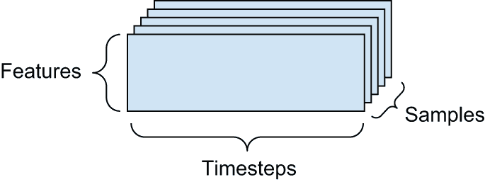

图 2.3：一个三阶时序数据张量

时间轴始终是第二个轴（索引为 1 的轴），这是惯例。让我们看看几个例子：

+   *股票价格数据集* — 每分钟，我们存储股票的当前价格、过去一分钟内的最高价格和最低价格。因此，每分钟被编码为一个三维向量，整个交易日的编码是一个形状为`(390, 3)`的矩阵（交易日中有 390 分钟），250 天的数据可以存储在一个形状为`(250, 390, 3)`的三阶张量中。在这里，每个样本代表一天的数据。

+   *一个包含推文的数据库，其中我们将每个推文编码为从 128 个唯一字符的字母表中选取的 280 个字符的序列*——在这个设置中，每个字符可以编码为一个大小为 128 的二进制向量（除了对应字符的索引处的 1 条记录之外，其余都是全零向量）。然后每个推文可以编码为一个形状为`(280, 128)`的二阶张量，一个包含 100 万个推文的数据库可以存储在一个形状为`(1000000, 280, 128)`的张量中。

#### 图像数据

图像通常具有三个维度：高度、宽度和颜色深度。尽管灰度图像（如我们的 MNIST 数字）只有一个颜色通道，因此可以存储在二阶张量中，但按照惯例，图像张量总是三阶的，对于灰度图像有一个一维的颜色通道。因此，一个大小为 256 × 256 的 128 个灰度图像批次的张量形状可以是`(128, 256, 256, 1)`，而一个 128 个彩色图像批次的张量形状可以是`(128, 256, 256, 3)`（见图 2.4）。

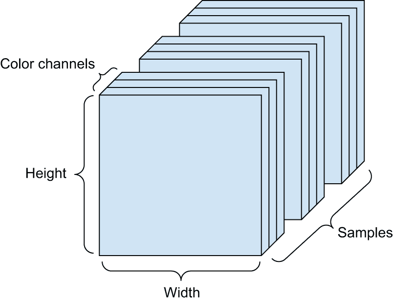

图 2.4：四阶图像数据张量

图像张量的形状有两种惯例：*通道最后*惯例（在 JAX、TensorFlow 以及大多数其他深度学习工具中是标准的）和*通道首先*惯例（在 PyTorch 中是标准的）。

通道最后惯例将颜色深度轴放在末尾：`(样本, 高度, 宽度, 颜色深度)`。同时，通道首先惯例将颜色深度轴放在批次轴之后：`(样本, 颜色深度, 高度, 宽度)`。使用通道首先惯例，前面的例子将变为`(128, 1, 256, 256)`和`(128, 3, 256, 256)`。Keras API 提供了对这两种格式的支持。

#### 视频数据

视频数据是少数几种需要五阶张量的真实世界数据之一。视频可以被理解为一系列帧，每一帧都是一个彩色图像。因为每一帧可以存储在一个三阶张量中`(高度, 宽度, 颜色深度)`，所以一系列帧可以存储在一个四阶张量中`(帧, 高度, 宽度, 颜色深度)`，因此不同视频的批次可以存储在一个形状为`(样本, 帧, 高度, 宽度, 颜色深度)`的五阶张量中。

例如，一个 60 秒、每秒 4 帧的 144 × 256 YouTube 视频剪辑将包含 240 帧。四个这样的视频剪辑的批次将存储在一个形状为`(4, 240, 144, 256, 3)`的张量中。这总共是 10,616,8320 个值！如果张量的`dtype`是`float32`，那么每个值将占用 32 位，因此张量将代表 425 MB。太重了！你在现实生活中遇到的视频要轻得多，因为它们不是以`float32`存储的，并且通常被压缩了很大的比例（例如 MPEG 格式）。

## 神经网络齿轮：张量操作

就像任何计算机程序最终都可以归结为对二进制输入（`AND`、`OR`、`NOR`等）进行的一小套二进制操作一样，深度神经网络学习到的所有变换都可以归结为对数值数据张量应用的一小套*张量操作*（或*张量函数*）。例如，可以添加张量、乘以张量等。

在我们的初始示例中，我们通过将`Dense`层堆叠在一起来构建我们的模型。一个 Keras 层实例看起来像这样：

```py
keras.layers.Dense(512, activation="relu") 
```

这个层可以解释为一个函数，它接受一个矩阵作为输入，并返回另一个矩阵——这是输入张量的新表示。具体来说，函数如下（其中`W`是一个矩阵，`b`是一个向量，都是层的属性）：

```py
output = relu(matmul(input, W) + b) 
```

让我们分解一下。这里我们有三个张量操作：

+   输入张量与名为`W`的张量之间的张量积（`matmul`）。

+   结果矩阵与向量`b`之间的加法（`+`）。

+   一个`relu`操作：`relu(x)`是`max(x, 0)`。"relu"代表“REctified Linear Unit"。

### 元素级操作

`relu`操作和加法是元素级操作：这些操作独立应用于考虑中的张量中的每个条目。这意味着这些操作非常适合大规模并行实现（矢量化实现，这个术语来自 1970-1990 期间的矢量处理器超级计算机架构）。如果你想要编写一个元素级操作的原始 Python 实现，你可以使用一个`for`循环，就像这个元素级`relu`操作的原始实现一样：

```py
def naive_relu(x):
    # x is a rank-2 NumPy tensor.
    assert len(x.shape) == 2
    # Avoids overwriting the input tensor
    x = x.copy()
    for i in range(x.shape[0]):
        for j in range(x.shape[1]):
            x[i, j] = max(x[i, j], 0)
    return x 
```

你可以为加法做同样的事情：

```py
def naive_add(x, y):
    # x and y are rank-2 NumPy tensors.
    assert len(x.shape) == 2
    assert x.shape == y.shape
    # Avoids overwriting the input tensor
    x = x.copy()
    for i in range(x.shape[0]):
        for j in range(x.shape[1]):
            x[i, j] += y[i, j]
    return x 
```

根据同样的原理，你可以进行元素级乘法、减法等操作。

在实践中，当处理 NumPy 数组时，这些操作也是作为优化良好的内置 NumPy 函数提供的，这些函数本身将繁重的工作委托给基本线性代数子程序（BLAS）实现。BLAS 是低级、高度并行、高效的张量操作例程，通常用 Fortran 或 C 实现。

因此，在 NumPy 中，你可以执行以下元素级操作，并且它会非常快：

```py
import numpy as np

# Element-wise addition
z = x + y
# Element-wise relu
z = np.maximum(z, 0.0) 
```

让我们实际测量一下这个差异：

```py
import time

x = np.random.random((20, 100))
y = np.random.random((20, 100))

t0 = time.time()
for _ in range(1000):
    z = x + y
    z = np.maximum(z, 0.0)
print("Took: {0:.2f} s".format(time.time() - t0)) 
```

这需要 0.02 秒。与此同时，原始版本需要惊人的 2.45 秒：

```py
t0 = time.time()
for _ in range(1000):
    z = naive_add(x, y)
    z = naive_relu(z)
print("Took: {0:.2f} s".format(time.time() - t0)) 
```

同样，当在 GPU 上运行 JAX/TensorFlow/PyTorch 代码时，元素级操作通过完全矢量化 CUDA 实现执行，这可以最好地利用高度并行的 GPU 芯片架构。

### 广播

我们之前对`naive_add`的原始实现只支持相同形状的秩为 2 的张量相加。但在之前引入的`Dense`层中，我们添加了一个与向量相加的秩为 2 的张量。当两个要相加的张量的形状不同时，加法会发生什么？

当可能时，如果没有歧义，较小的张量将被*广播*以匹配较大张量的形状。广播包括两个步骤：

+   轴（称为**广播轴**）被添加到较小的张量中，以匹配较大张量的`ndim`。

+   较小的张量会沿着这些新轴重复，以匹配较大张量的完整形状。

让我们来看一个具体的例子。考虑形状为`(32, 10)`的`X`和形状为`(10,)`的`y`：

```py
import numpy as np

# X is a random matrix with shape (32, 10).
X = np.random.random((32, 10))
# y is a random vector with shape (10,).
y = np.random.random((10,)) 
```

首先，我们向`y`添加一个空的第一轴，其形状变为`(1, 10)`：

```py
# The shape of y is now (1, 10).
y = np.expand_dims(y, axis=0) 
```

然后，我们将`y`重复 32 次在这个新轴上，这样我们最终得到一个形状为`(32, 10)`的张量`Y`，其中`Y[i, :] == y`对于`i`在`range(0, 32)`中：

```py
# Repeat y 32 times along axis 0 to obtain Y with shape (32, 10).
Y = np.tile(y, (32, 1)) 
```

在这一点上，我们可以添加`X`和`Y`，因为它们具有相同的形状。

在实现方面，没有创建新的秩为 2 的张量，因为这会非常低效。重复操作完全是虚拟的：它在算法级别发生，而不是在内存级别。但想象向量在新的轴上重复 32 次是一个有帮助的心智模型。以下是一个简单的实现示例：

```py
def naive_add_matrix_and_vector(x, y):
    # x is a rank-2 NumPy tensor.
    assert len(x.shape) == 2
    # y is a NumPy vector.
    assert len(y.shape) == 1
    assert x.shape[1] == y.shape[0]
    # Avoids overwriting the input tensor
    x = x.copy()
    for i in range(x.shape[0]):
        for j in range(x.shape[1]):
            x[i, j] += y[j]
    return x 
```

通过广播，如果第一个张量的形状为`(a, b, … n, n + 1, … m)`，而第二个张量的形状为`(n, n + 1, … m)`，则通常可以应用两个张量的逐元素操作。广播将自动发生在轴`a`通过`n - 1`上。

以下示例通过广播将逐元素`maximum`操作应用于不同形状的两个张量：

```py
import numpy as np

# x is a random tensor with shape (64, 3, 32, 10).
x = np.random.random((64, 3, 32, 10))
# y is a random tensor with shape (32, 10).
y = np.random.random((32, 10))
# The output z has shape (64, 3, 32, 10) like x.
z = np.maximum(x, y) 
```

### 张量积

**张量积**，也称为**点积**或**矩阵乘积**（简称“矩阵乘法”），是最常见、最有用的张量运算之一。

在 NumPy 中，张量积是通过`np.matmul`函数实现的，而在 Keras 中，则是通过`keras.ops.matmul`函数。其简写是 Python 中的`@`运算符：

```py
x = np.random.random((32,))
y = np.random.random((32,))

# Takes the product between x and y
z = np.matmul(x, y)
# This is equivalent.
z = x @ y 
```

在数学符号中，您会注意到操作使用点（•）来表示（因此得名“点积”）：

```py
z = x • y 
```

从数学的角度来看，`matmul`操作做什么？让我们从两个向量`x`和`y`的乘积开始。它被计算如下：

```py
def naive_vector_product(x, y):
    # x and y are NumPy vectors.
    assert len(x.shape) == 1
    assert len(y.shape) == 1
    assert x.shape[0] == y.shape[0]
    z = 0.0
    for i in range(x.shape[0]):
        z += x[i] * y[i]
    return z 
```

您会注意到两个向量的乘积是一个标量，并且只有具有相同元素数量的向量才能进行此操作兼容。

您还可以计算矩阵`x`和向量`y`之间的乘积，这将返回一个向量，其系数是`y`与`x`的行的乘积。您可以这样实现它：

```py
def naive_matrix_vector_product(x, y):
    # x is a NumPy matrix.
    assert len(x.shape) == 2
    # y is a NumPy vector.
    assert len(y.shape) == 1
    # The 1st dimension of x must equal the 0th dimension of y!
    assert x.shape[1] == y.shape[0]
    # This operation returns a vector of 0s with as many rows as x.
    z = np.zeros(x.shape[0])
    for i in range(x.shape[0]):
        for j in range(x.shape[1]):
            z[i] += x[i, j] * y[j]
    return z 
```

您还可以重用我们之前编写的代码，这突出了矩阵-向量乘积和向量乘积之间的关系：

```py
def naive_matrix_vector_product(x, y):
    z = np.zeros(x.shape[0])
    for i in range(x.shape[0]):
        z[i] = naive_vector_product(x[i, :], y)
    return z 
```

注意，一旦两个张量中的任何一个的`ndim`大于 1，`matmul`就不再是**对称的**，也就是说`matmul(x, y)`不等于`matmul(y, x)`。

当然，张量乘积可以推广到具有任意数量轴的张量。最常见的应用可能是两个矩阵之间的乘法。如果你可以取两个矩阵`x`和`y`的乘积（`matmul(x, y)`），当且仅当`x.shape[1] == y.shape[0]`。结果是形状为`(x.shape[0], y.shape[1])`的矩阵，其中系数是`x`的行和`y`的列之间的向量乘积。以下是原始实现：

```py
def naive_matrix_product(x, y):
    # x and y are NumPy matrices.
    assert len(x.shape) == 2
    assert len(y.shape) == 2
    # The 1st dimension of x must equal the 0th dimension of y!
    assert x.shape[1] == y.shape[0]
    # This operation returns a matrix of 0s with a specific shape.
    z = np.zeros((x.shape[0], y.shape[1]))
    # Iterates over the rows of x ...
    for i in range(x.shape[0]):
        # ... and over the columns of y.
        for j in range(y.shape[1]):
            row_x = x[i, :]
            column_y = y[:, j]
            z[i, j] = naive_vector_product(row_x, column_y)
    return z 
```

要理解向量乘积的形状兼容性，通过如图 2.5 所示的对齐输入和输出张量来可视化它们是有帮助的。

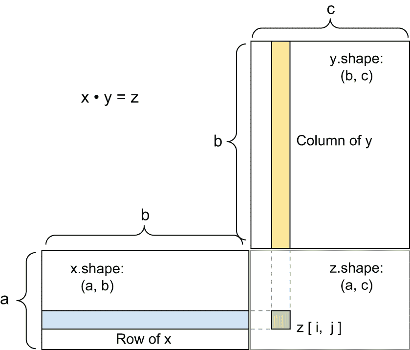

图 2.5：矩阵乘法框图

`x`、`y`和`z`被表示为矩形（系数的实心框）。因为`x`的行和`y`的列必须具有相同的大小，所以`x`的宽度必须与`y`的高度相匹配。如果你继续开发新的机器学习算法，你很可能会经常绘制这样的图表。

更一般地，你可以根据前面为二维情况概述的形状兼容性规则，对高维张量进行乘法运算：

```py
(a, b, c, d) • (d,) -> (a, b, c)
(a, b, c, d) • (d, e) -> (a, b, c, e) 
```

等等。

### 张量重塑

需要理解的一种第三类张量操作是*张量重塑*。尽管它在我们第一个神经网络示例中的`Dense`层中没有使用，但我们使用它在我们预处理数字数据并将其输入到我们的模型之前：

```py
train_images = train_images.reshape((60000, 28 * 28)) 
```

重塑张量意味着重新排列其行和列以匹配目标形状。自然地，重塑后的张量与初始张量具有相同数量的系数。重塑最好通过简单的例子来理解：

```py
>>> x = np.array([[0., 1.],
...               [2., 3.],
...               [4., 5.]])
>>> x.shape
(3, 2)
>>> x = x.reshape((6, 1))
>>> x
array([[ 0.],
       [ 1.],
       [ 2.],
       [ 3.],
       [ 4.],
       [ 5.]])
>>> x = x.reshape((2, 3))
>>> x
array([[ 0.,  1.,  2.],
       [ 3.,  4.,  5.]])
```

常见的一种重塑特殊情况是*转置*。转置矩阵意味着交换其行和列，使得`x[i, :]`变为`x[:, i]`：

```py
>>> # Creates an all-zeros matrix of shape (300, 20)
>>> x = np.zeros((300, 20))
>>> x = np.transpose(x)
>>> x.shape
(20, 300)
```

### 张量操作的几何解释

因为张量操作中操作的张量内容可以解释为某些几何空间中点的坐标，所以所有张量操作都有几何解释。例如，让我们考虑加法。我们将从以下向量开始：

```py
A = [0.5, 1] 
```

它是一个二维空间中的点（见图 2.6）。通常将向量表示为从原点到点的箭头，如图 2.7 所示。

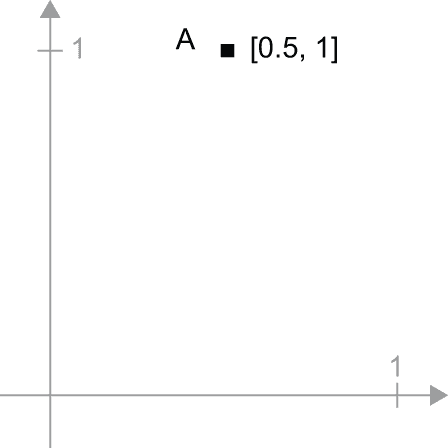

图 2.6：二维空间中的点

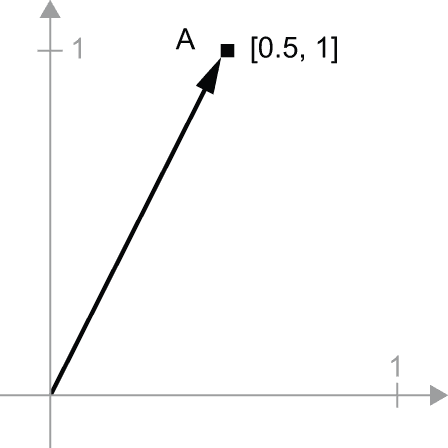

图 2.7：一个二维空间中的点，以箭头形式表示

让我们考虑一个新的点`B = [1, 0.25]`，我们将将其添加到前面的点上。这是通过将向量箭头链式连接起来在几何上完成的，结果位置是表示前两个向量之和的向量（见图 2.8）。正如你所看到的，将向量`B`添加到向量`A`表示将点`A`复制到新的位置，该位置与原始点`A`的距离和方向由向量`B`确定。如果你将相同的向量加法应用于平面上的点组（一个“对象”），你将创建整个对象在新的位置上的副本（见图 2.9）。因此，张量加法表示通过一定量的方向移动对象（不扭曲对象）的动作。

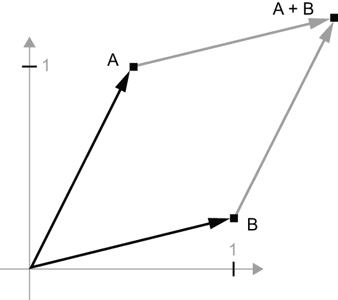

图 2.8：两个向量的几何和的解释

通常，基本的几何运算，如平移、旋转、缩放、倾斜等，都可以表示为张量运算。以下是一些例子：

+   *平移* — 正如你所看到的，向一个点添加一个向量将使该点在固定方向上移动固定距离。应用于一组点（例如一个 2D 对象），这被称为“平移”（见图 2.9）。


图 2.9：2D 平移作为向量加法

+   *旋转* — 通过与一个 2×2 矩阵`R = [[cos(theta), -sin(theta)], [sin(theta), cos(theta)]]`相乘，可以实现一个 2D 向量以角度 theta 逆时针旋转（见图 2.10）。

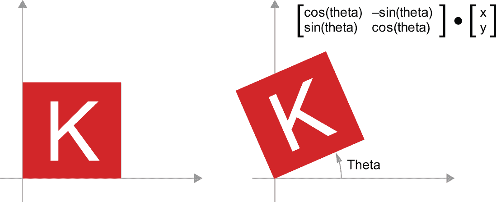

图 2.10：2D 旋转（逆时针）作为矩阵乘积

+   *缩放* — 通过与一个 2×2 矩阵`S = [[horizontal_factor, 0], [0, vertical_factor]]`相乘（注意这样的矩阵被称为“对角矩阵”，因为它只在“对角线”上有非零系数，从左上角到右下角），可以实现图像的垂直和水平缩放（见图 2.11）。

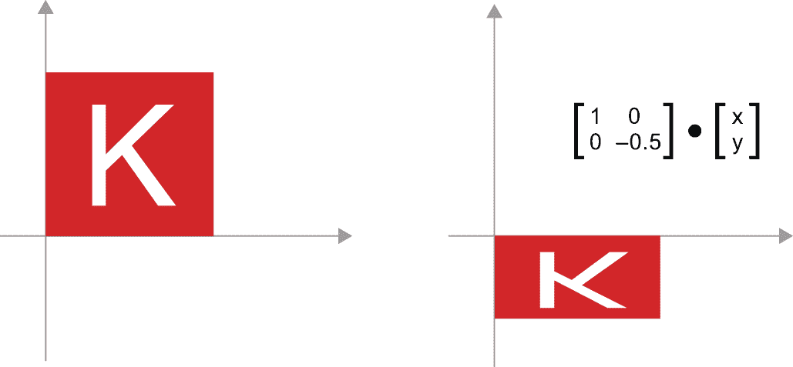

图 2.11：2D 缩放作为矩阵乘积

+   *线性变换* — 与任意矩阵相乘实现线性变换。注意，之前看到的*缩放*和*旋转*按定义是线性变换。

+   *仿射变换* — 仿射变换（见图 2.12）是线性变换（通过矩阵乘法实现）和平移（通过向量加法实现）的组合。你可能已经注意到，这正是`Dense`层中实现的`y = W @ x + b`计算！没有激活函数的`Dense`层是一个仿射层。

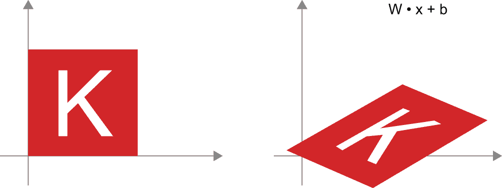

图 2.12：平面上的仿射变换

+   *`具有`relu`激活功能的`Dense`层`* — 关于仿射变换的一个重要观察是，如果你反复应用许多次，最终仍然得到一个仿射变换（所以你一开始就可以只应用那个仿射变换）。让我们用两个来试一下：`affine2(affine1(x)) = W2 @ (W1 @ x + b1) + b2 = (W2 @ W1) @ x + (W2 @ b1 + b2)`。这是一个仿射变换，其中线性部分是矩阵`W2 @ W1`，平移部分是向量`W2 @ b1 + b2`。因此，一个完全由`Dense`层组成且没有激活的多层神经网络等价于一个单一的`Dense`层。这个“深度”神经网络实际上只是一个伪装的线性模型！这就是为什么我们需要激活函数，比如`relu`（如图 2.13 所示）。多亏了激活函数，一系列`Dense`层可以被用来实现非常复杂、非线性的几何变换，从而为你的深度神经网络提供非常丰富的假设空间。我们将在下一章更详细地介绍这个想法。

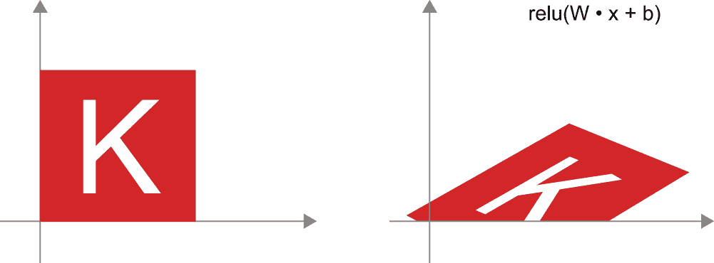

图 2.13：仿射变换后跟`relu`激活

### 深度学习的几何解释

你刚刚了解到神经网络完全由张量操作链组成，而且所有这些张量操作都只是输入数据的简单几何变换。因此，你可以将神经网络解释为一个在多维空间中的非常复杂的几何变换，通过一系列简单的步骤实现。

在三维空间中，以下的心智图可能很有用。想象两张彩色纸：一张红色，一张蓝色。将一张放在另一张上面。现在将它们揉成一个小球。这个揉皱的纸球是你的输入数据，而每一张纸都是分类问题中的一个数据类别。神经网络的目的就是找出一个将纸球展开，使两个类别再次清晰可分的变换（见图 2.14）。通过深度学习，这将通过一系列简单的三维空间变换来实现，就像你可以用手指对纸球进行的一次次简单变换。

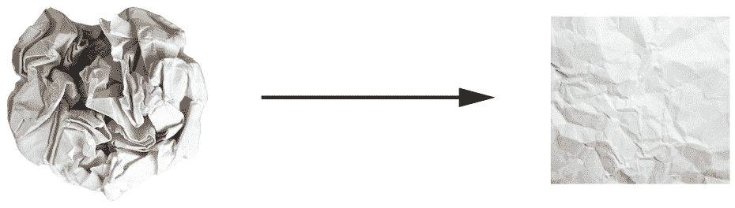

图 2.14：展开复杂的数据流形

将纸团展开是机器学习的主要内容：在多维空间中找到复杂、高度折叠的数据*流形*的整洁表示（流形是一个连续的表面，就像我们皱巴巴的纸张）。到这一点，你应该对为什么深度学习在这方面表现出色有很好的直觉：它采用了一种将复杂几何变换逐步分解为一系列基本变换的方法，这基本上是人类展开纸团所遵循的策略。深度网络中的每一层都应用一种转换，稍微解开数据——而深度堆叠的层使得极其复杂的解开过程变得可行。

## 神经网络的引擎：基于梯度的优化

正如你在上一节中看到的，我们第一个模型示例中的每个神经网络层都按以下方式转换其输入数据：

```py
output = relu(matmul(input, W) + b) 
```

在这个表达式中，`W`和`b`是层的属性张量。它们被称为层的*权重*或*可训练参数*（分别对应`kernel`和`bias`属性）。这些权重包含了模型从训练数据中学习到的信息。

初始时，这些权重矩阵填充了小的随机值（称为*随机初始化*）。当然，没有理由期望当`W`和`b`是随机的时，`relu(matmul(input, W) + b)`会产生任何有用的表示。结果表示是没有意义的——但它们是一个起点。接下来要做的是根据反馈信号逐渐调整这些权重。这种逐渐调整，也称为*训练*，基本上是机器学习所涉及的学习过程。

这发生在所谓的*训练循环*中，其工作原理如下。重复以下步骤，直到损失看起来足够低：

1.  提取一批训练样本`x`和相应的目标`y_true`。

1.  在`x`上运行模型（称为*前向传递*）以获得预测`y_pred`。

1.  计算模型在批次上的损失，这是`y_pred`和`y_true`之间不匹配的度量。

1.  以一种方式更新模型的所有权重，以略微减少这个批次上的损失。

最终，你将得到一个在训练数据上损失非常低的模型：预测`y_pred`和预期目标`y_true`之间的低不匹配。模型“学习”了将其输入映射到正确目标。从远处看，这可能看起来像魔法，但当你将其简化为基本步骤时，它实际上很简单。

第一步听起来很简单——它只是 I/O 代码。第二步和第三步仅仅是应用一些张量操作，所以你可以纯粹根据上一节学到的知识来实现这些步骤。困难的部分是第四步：更新模型的权重。给定模型中的一个权重系数，你如何计算该系数应该增加还是减少，以及增加或减少多少？

一个简单的方法是冻结模型中除考虑的单个标量系数外的所有权重，并尝试这个系数的不同值。假设系数的初始值为 0.3。在数据批次的前向传递后，模型在批次上的损失为 0.5。如果你将系数的值改为 0.35 并重新运行前向传递，损失增加到 0.6。但如果你将系数降低到 0.25，损失下降到 0.4。在这种情况下，似乎通过更新系数-0.05 可以有助于最小化损失。这需要为模型中的所有系数重复进行。

但这样的方法将非常低效，因为你需要为每个单独的系数（通常至少有几千个，甚至可能高达数十亿）计算两次前向传递（这是昂贵的）。幸运的是，有一个更好的方法：**梯度下降**。

梯度下降是现代神经网络背后的优化技术。以下是它的核心内容。我们模型中使用的所有函数（例如`matmul`或`+`）都以平滑和连续的方式转换它们的输入：例如，如果你看`z = x + y`，那么`y`的微小变化只会导致`z`的微小变化，如果你知道`y`变化的方向，你可以推断出`z`变化的方向。从数学上讲，你会说这些函数是**可微**的。如果你将这些函数链在一起，得到的更大的函数仍然是可微的。特别是，这适用于将模型的系数映射到模型在数据批次上的损失的函数：模型系数的微小变化会导致损失值的微小、可预测的变化。这使得你可以使用一个称为**梯度**的数学运算符来描述随着你将模型系数移动到不同方向时损失的变化。如果你计算这个梯度，你可以用它来移动系数（在一次更新中同时移动所有系数，而不是逐个移动）以减少损失。

如果你已经知道什么是**可微**的以及什么是**梯度**，你可以跳过接下来的两节。否则，以下内容将帮助你理解这些概念。

### 什么是导数？

考虑一个连续、平滑的函数`f(x) = y`，将一个数字`x`映射到一个新的数字`y`。我们可以用图 2.15 中的函数作为例子。

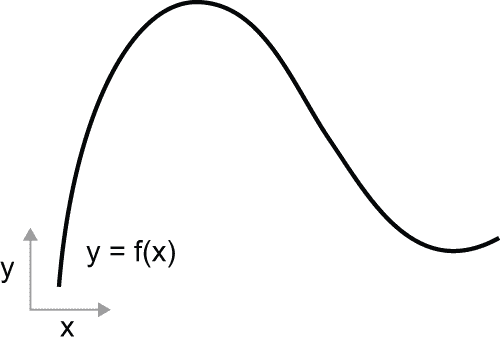

图 2.15：一个连续、平滑的函数

因为函数是**连续**的，`x`的微小变化只能导致`y`的微小变化——这就是**连续性**的直觉。假设你通过一个小的因子`epsilon_x`增加`x`：这将导致`y`的微小`epsilon_y`变化，如图 2.16 所示。

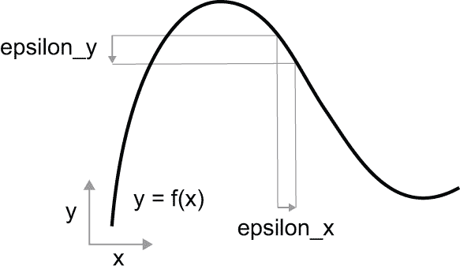

图 2.16：对于连续函数，`x`的微小变化导致`y`的微小变化。

此外，由于函数是*平滑的*（其曲线没有任何突然的角度），当`epsilon_x`足够小的时候，在某个点`p`附近，可以将`f`近似为一个斜率为`a`的线性函数，这样`epsilon_y`就变成了`a * epsilon_x`：

```py
f(x + epsilon_x) = y + a * epsilon_x 
```

显然，这种线性近似仅在`x`足够接近`p`时才有效。

斜率`a`被称为`f`在`p`处的*导数*。如果`a`是负数，这意味着在`p`附近的`x`的微小增加将导致`f(x)`的减少，如图 2.17 所示，如果`a`是正数，则`x`的微小增加将导致`f(x)`的增加。此外，`a`的绝对值（导数的*大小*）告诉你这种增加或减少将发生得多快。


图 2.17：`f`在`p`处的导数

对于每一个可导函数`f(x)`（可导意味着“可以求导”：例如，平滑、连续的函数可以求导），都存在一个导数函数`f'(x)`，它将`x`的值映射到`f`在这些点的局部线性近似的斜率。例如，`cos(x)`的导数是`-sin(x)`，`f(x) = a * x`的导数是`f'(x) = a`，等等。

能够求导函数是进行*优化*时一个非常强大的工具，优化是指寻找使`f(x)`的值最小化的`x`的值。如果你试图通过一个因子`epsilon_x`更新`x`以最小化`f(x)`，并且你知道`f`的导数，那么你的工作就完成了：导数完全描述了随着`x`的变化`f(x)`如何演变。如果你想减少`f(x)`的值，你只需要将`x`稍微移动到导数的相反方向。

### 张量运算的导数：梯度

我们刚才看到的函数将标量值`x`转换成另一个标量值`y`：你可以在二维平面上将其绘制为曲线。现在，想象一个将标量元组`(x, y)`转换成标量值`z`的函数：这将是一个向量运算。你可以在三维空间（由坐标`x, y, z`索引）中将其绘制为二维*表面*。同样，你可以想象输入矩阵的函数，输入秩为 3 的张量的函数，等等。

只要描述它们的表面是连续且平滑的，导数的概念就可以应用于任何这样的函数。张量运算（或张量函数）的导数称为*梯度*。梯度只是将导数的概念推广到以张量作为输入的函数。记得对于标量函数，导数代表函数曲线的*局部斜率*吗？同样地，张量函数的梯度代表由函数描述的多维表面的*曲率*。它描述了当输入参数变化时函数输出的变化情况。

让我们来看一个基于机器学习的例子。考虑

+   一个输入向量 `x`（数据集中的样本）。

+   一个矩阵 `W`（模型的权重）。

+   一个目标 `y_true`（模型应该学习与 `x` 关联的内容）。

+   一个损失函数 `loss`（用来衡量模型当前预测与 `y_true` 之间的差距）。

你可以使用 `W` 来计算一个目标候选 `y_pred`，然后计算目标候选 `y_pred` 与目标 `y_true` 之间的损失或差异：

```py
# We use the model weights W to make a prediction for x.
y_pred = matmul(x, W)
# We estimate how far off the prediction was.
loss_value = loss(y_pred, y_true) 
```

现在，我们想使用梯度来确定如何更新 `W` 以使 `loss_value` 更小。我们该如何做？

给定固定的输入 `x` 和 `y_true`，前面的操作可以解释为一个将 `W`（模型的权重）的值映射到损失值的函数：

```py
# f describes the curve (or high-dimensional surface) formed by loss
# values when W varies.
loss_value = f(W) 
```

假设当前 `W` 的值为 `W0`。那么 `f` 在点 `W0` 的导数是一个与 `W` 形状相同的张量 `grad(loss_value, W0)`，其中每个系数 `grad(loss_value, W0)[i, j]` 指示了当修改 `W0[i, j]` 时观察到的 `loss_value` 变化的方向和大小。这个张量 `grad(loss_value, W0)` 是函数 `f(W) = loss_value` 在 `W0` 处的梯度，也称为“`loss_value` 关于 `W` 在 `W0` 附近的梯度。”

具体来说，`grad(loss_value, W0)` 代表什么？你之前看到，一个单系数函数 `f(x)` 的导数可以解释为 `f` 的曲线的斜率。同样，`grad(loss_value, W0)` 可以解释为描述 `loss_value = f(W)` 在 `W0` 附近 *曲率* 的张量。每个偏导数描述了 `f` 在特定方向上的曲率。

我们刚刚看到，对于一个函数 `f(x)`，你可以通过将 `x` 向导数的相反方向移动一小段距离来减少 `f(x)` 的值。以类似的方式，对于一个张量 `f(W)` 的函数，你可以通过将 `W` 向梯度相反的方向移动来减少 `loss_value = f(W)`，例如更新 `W1 = W0 - step * grad(f(W0), W0)`，其中 `step` 是一个小的缩放因子。这意味着逆着曲率走，直观上应该会让你处于曲线的较低位置。请注意，缩放因子 `step` 是必需的，因为 `grad(loss_value, W0)` 只在接近 `W0` 时近似曲率，所以你不想离 `W0` 太远。

### 随机梯度下降。

对于一个可微函数，从理论上讲，可以找到它的最小值：已知函数的最小值是导数为 0 的点，所以你只需要找到所有导数变为 0 的点，并检查这些点中哪个函数值最低。

将此应用于神经网络，意味着通过解析方法找到权重值的组合，以产生最小的损失函数。这可以通过求解方程 `grad(f(W), W) = 0` 对于 `W` 来实现。这是一个 `N` 个变量的多项式方程，其中 `N` 是模型中的系数数量。虽然对于 `N = 2` 或 `N = 3`，解决这样的方程是可能的，但对于实际神经网络来说，这样做是难以处理的，因为参数的数量永远不会少于几千，有时甚至达到数十亿。

相反，您可以使用本节开头概述的四个步骤算法：根据当前随机批次数据上的损失值逐渐修改参数。因为您正在处理一个可微分的函数，您可以计算其梯度，这为您实现第 4 步提供了一个有效的方法。如果您将权重更新为与梯度相反的方向，损失将每次都略有减少：

1.  抽取一批训练样本 `x` 和相应的目标 `y_true`。

1.  在 `x` 上运行模型以获得预测 `y_pred`（这被称为 *正向传播*）。

1.  计算模型在批次上的损失，这是 `y_pred` 和 `y_true` 之间差异的度量。

1.  计算损失相对于模型参数的梯度（这被称为 *反向传播*）。

1.  将参数稍微向梯度的反方向移动——例如，`W -= learning_rate * gradient`——从而略微减少批次的损失。*学习率*（此处为 `learning_rate`）将是一个标量因子，调节梯度下降过程的“速度”。

足够简单！我们刚才描述的被称为 *小批量随机梯度下降*（mini-batch SGD）。术语 *随机* 指的是每个数据批次都是随机抽取的（*随机* 是 *random* 的科学同义词）。图 2.18 展示了当模型只有一个参数且只有一个训练样本时，在 1D 中会发生什么。

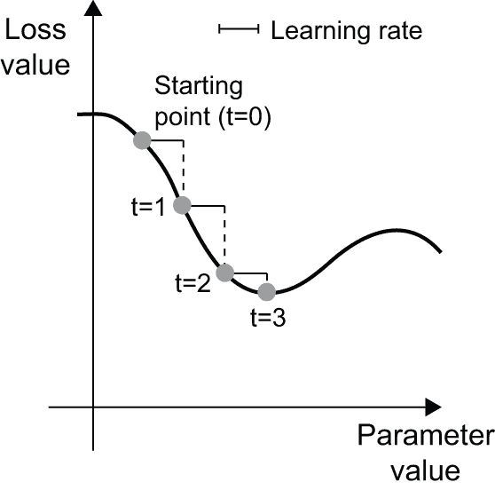

图 2.18：SGD 在 1D 损失曲线上下降（一个可学习的参数）

我们可以直观地看出，选择一个合理的 `learning_rate` 因子值是很重要的。如果它太小，沿着曲线的下降将需要许多迭代，并且可能会陷入局部最小值。如果 `learning_rate` 太大，您的更新可能会将您带到曲线上的完全随机位置。

注意，mini-batch SGD 算法的一个变体是每次迭代抽取一个样本和目标，而不是抽取一批数据。这将被称为 *真实* SGD（与 *小批量* SGD 相对）。或者，走向相反的极端，您可以在所有可用数据上运行每个步骤，这被称为 *批量梯度下降*。这样，每次更新将更加准确，但成本也更高。在这两个极端之间的有效折衷方案是使用合理大小的小批量。

虽然图 2.18 说明了在 1D 参数空间中的梯度下降，但在实践中，你会在高维空间中使用梯度下降：神经网络中的每个权重系数都是空间中的一个自由维度，可能有成千上万个，甚至更多。为了帮助你建立对损失表面的直观理解，你还可以可视化沿二维损失表面的梯度下降，如图 2.19 所示。但你不可能可视化神经网络实际训练过程的样子——你不能以对人类有意义的方式表示一个一百万维度的空间。因此，值得注意的是，通过这些低维表示建立起来的直觉在实践上可能并不总是准确的。这在历史上一直是深度学习研究领域的问题来源。

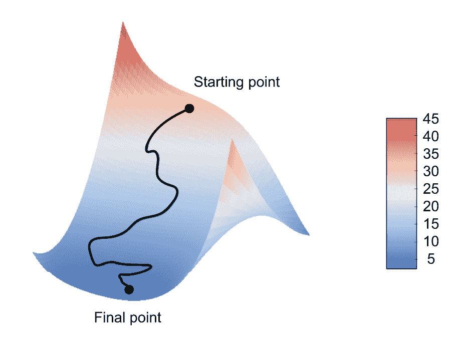

图 2.19：沿二维损失表面的梯度下降（两个可学习参数）

此外，还存在多种 SGD 变体，这些变体在计算下一个权重更新时考虑了之前的权重更新，而不仅仅是查看当前梯度的值。例如，有带有动量的 SGD，以及 Adagrad、RMSprop 和几个其他变体。这些变体被称为*优化方法*或*优化器*。特别是，*动量*的概念，它在许多这些变体中使用，值得你的注意。动量解决了 SGD 的两个问题：收敛速度和局部最小值。考虑图 2.20，它显示了损失作为模型参数的函数的曲线。

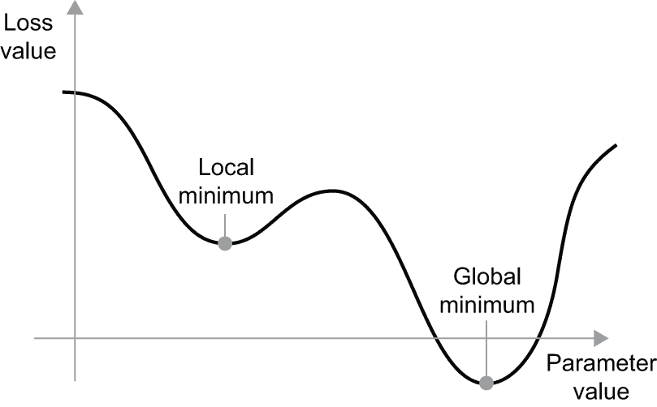

图 2.20：局部最小值和全局最小值

如你所见，在某个参数值附近，存在一个*局部最小值*：在该点附近，向左移动会导致损失增加，向右移动也是如此。如果考虑的参数通过具有小学习率的 SGD 进行优化，那么优化过程会卡在局部最小值上，而不是达到全局最小值。

你可以通过使用动量来避免这些问题，这从物理学中汲取了灵感。在这里的一个有用的心理图像是将优化过程想象成一个沿着损失曲线滚动的小球。如果它有足够的动量，球就不会卡在沟壑中，最终会达到全局最小值。动量通过在每个步骤中不仅基于当前斜率值（当前加速度）而且还基于当前速度（由过去的加速度产生）来移动球来实现。在实践中，这意味着不仅基于当前的梯度值，还基于之前的参数更新来更新参数`w`，例如在这个简单的实现中：

```py
past_velocity = 0.0
# Constant momentum factor
momentum = 0.1
# Optimization loop
while loss > 0.01:
    w, loss, gradient = get_current_parameters()
    velocity = past_velocity * momentum - learning_rate * gradient
    w = w + momentum * velocity - learning_rate * gradient
    past_velocity = velocity
    update_parameter(w) 
```

### 连续求导：反向传播算法

在之前讨论的算法中，我们随意假设由于函数是可微的，我们可以轻松地计算其梯度。但这真的正确吗？我们如何在实践中计算复杂表达式的梯度？在我们的两层网络示例中，我们如何得到关于权重的损失梯度？这就是*反向传播算法*发挥作用的地方。

#### 链式法则

反向传播是一种使用简单操作（如加法、`relu`或张量积）的导数来轻松计算这些原子操作任意复杂组合的梯度的方法。关键的是，神经网络由许多链式连接的张量操作组成，每个操作都有一个简单且已知的导数。例如，我们第一个示例中的模型可以表示为一个由变量`W1`、`b1`、`W2`和`b2`（分别属于第一和第二`Dense`层）参数化的函数，涉及原子操作`matmul`、`relu`、`softmax`和`+`，以及我们的损失函数`loss`，所有这些都很容易微分：

```py
loss_value = loss(
    y_true,
    softmax(matmul(relu(matmul(inputs, W1) + b1), W2) + b2),
) 
```

微积分告诉我们，可以使用以下称为*链式法则*的恒等式推导出这样的函数链。考虑两个函数`f`和`g`，以及复合函数`fg`，使得`y = fg(x) == f(g(x))`：

```py
def fg(x):
    x1 = g(x)
    y = f(x1)
    return y 
```

链式法则指出`grad(y, x) == grad(y, x1) * grad(x1, x)`。这使你能够在知道`f`和`g`的导数的情况下计算`fg`的导数。链式法则之所以得名，是因为当你添加更多的中间函数时，它开始看起来像一条链：

```py
def fghj(x):
    x1 = j(x)
    x2 = h(x1)
    x3 = g(x2)
    y = f(x3)
    return y

grad(y, x) == grad(y, x3) * grad(x3, x2) * grad(x2, x1) * grad(x1, x) 
```

将链式法则应用于计算神经网络梯度值会产生一个称为*反向传播*的算法。让我们具体看看它是如何工作的。

#### 基于计算图的自动微分

考虑到反向传播的一个有用方法是将其视为*计算图*。计算图是深度学习革命的核心数据结构。它是一个有向无环图，表示操作——在我们的例子中，是张量操作。例如，图 2.21 是我们第一个模型的图表示。

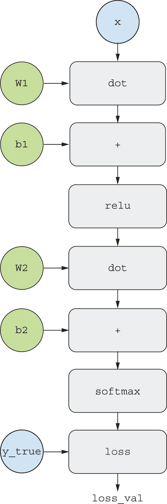

图 2.21：我们两层模型的计算图表示

计算图在计算机科学中是一个非常成功的抽象，因为它们使我们能够将计算视为数据：一个可计算的表达式被编码为一种机器可读的数据结构，可以用作另一个程序的输入或输出。例如，你可以想象一个程序，它接收一个计算图并返回一个新的计算图，该图实现了相同计算的大规模分布式版本——这意味着你可以分发任何计算，而无需自己编写分发逻辑。或者想象一个程序，它接收一个计算图并可以自动生成它所表示的表达式的导数。如果你的计算以显式的图数据结构表达，而不是，比如说，`.py`文件中的 ASCII 字符行，那么做这些事情会容易得多。

为了清晰地解释反向传播，让我们来看一个计算图的简单示例。我们将考虑图 2.21 中的简化版本，其中只有一个线性层，并且所有变量都是标量，如图 2.22 所示。我们将考虑两个标量变量`w`、`b`，一个标量输入`x`，并对它们应用一些操作以组合成一个输出`y`。最后，我们将应用一个绝对值误差损失函数：`loss_val = abs(y_true - y)`。由于我们希望以最小化`loss_val`的方式更新`w`和`b`，因此我们感兴趣的是计算`grad(loss_val, b)`和`grad(loss_val, w)`。

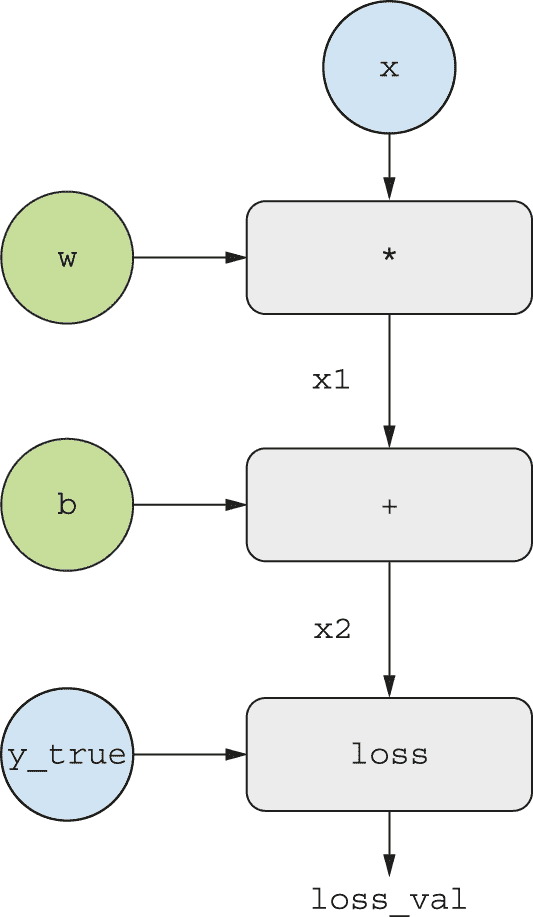

图 2.22：计算图的基本示例

让我们在图中为“输入节点”设置具体的值——也就是说，输入`x`、目标`y_true`、`w`和`b`（图 2.23）。我们将从上到下传播这些值到图中的所有节点，直到我们达到`loss_val`。这就是*正向传播*。

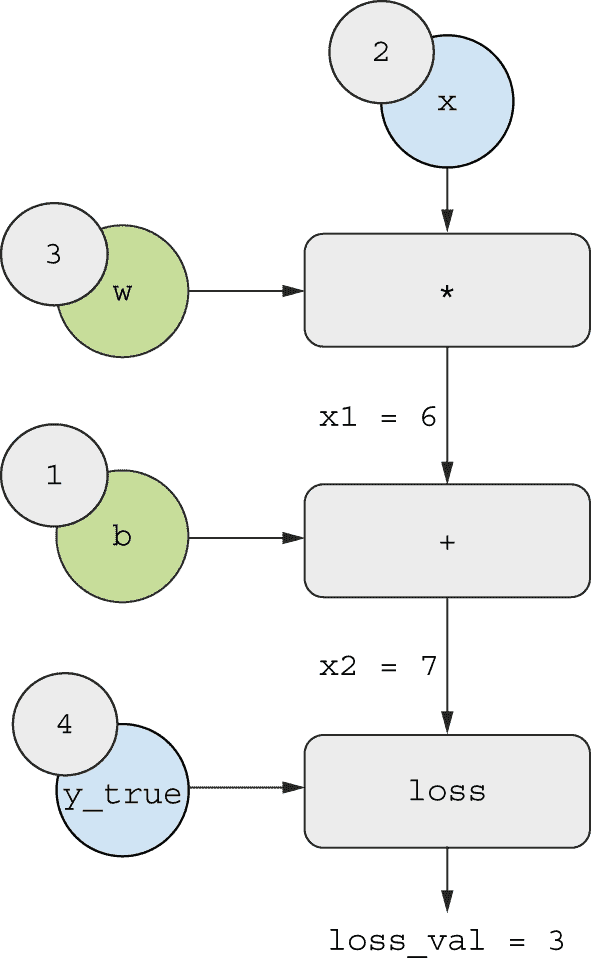

图 2.23：运行正向传播

现在，让我们“反转”图：对于图中从`A`到`B`的每条边，我们将创建一个从`B`到`A`的相反边，并询问，“当`A`变化时，`B`变化多少？”也就是说，`grad(B, A)`是多少？我们将用这个值标注每个反转边（图 2.24）。这个反向图代表了*反向传播*。

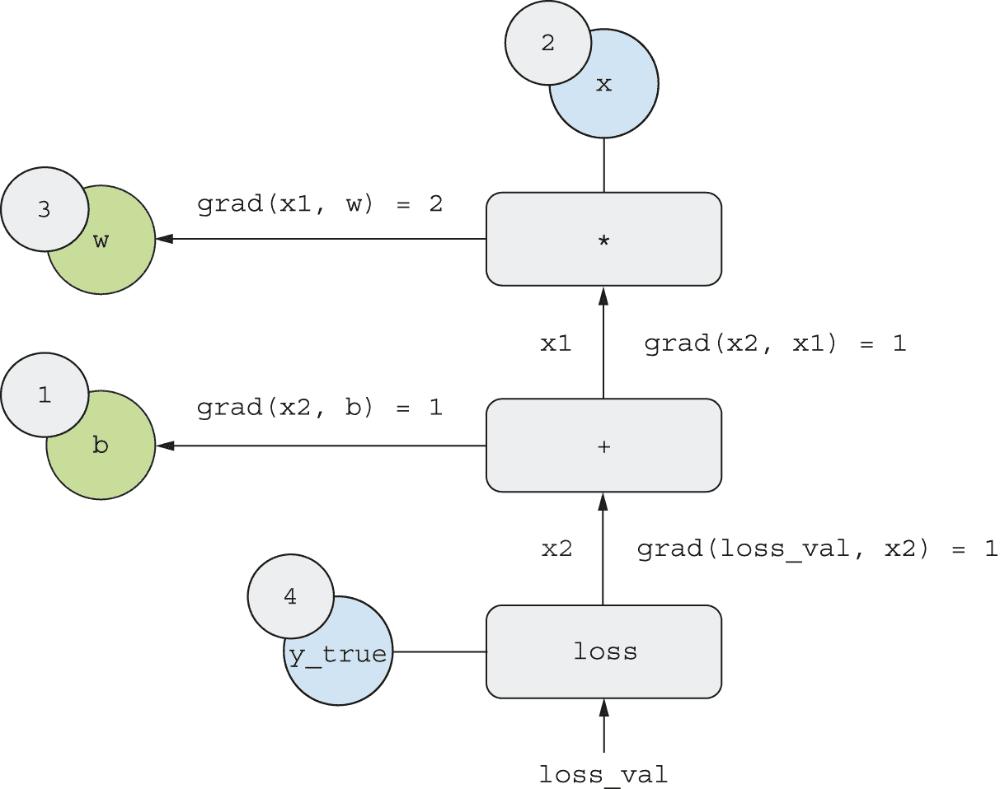

图 2.24：运行反向传播

我们有

+   `grad(loss_val, x2) = 1`，因为当`x2`变化一个量ε时，`loss_val = abs(4 - x2)`也变化相同的量。

+   `grad(x2, x1) = 1`，因为当`x1`变化一个量ε时，`x2 = x1 + b = x1 + 1`也变化相同的量。

+   `grad(x2, b) = 1`，因为当`b`变化一个量ε时，`x2 = x1 + b = 6 + b`也变化相同的量。

+   `grad(x1, w) = 2`，因为当`w`变化一个量ε时，`x1 = x * w = 2 * w`变化`2 * epsilon`。

链式法则关于这个反向图的说法是，你可以通过*沿着连接两个节点的路径乘以每个边的导数*来获得一个节点相对于另一个节点的导数。例如，`grad(loss_val, w) = grad(loss_val, x2) * grad(x2, x1) * grad(x1, w)`。

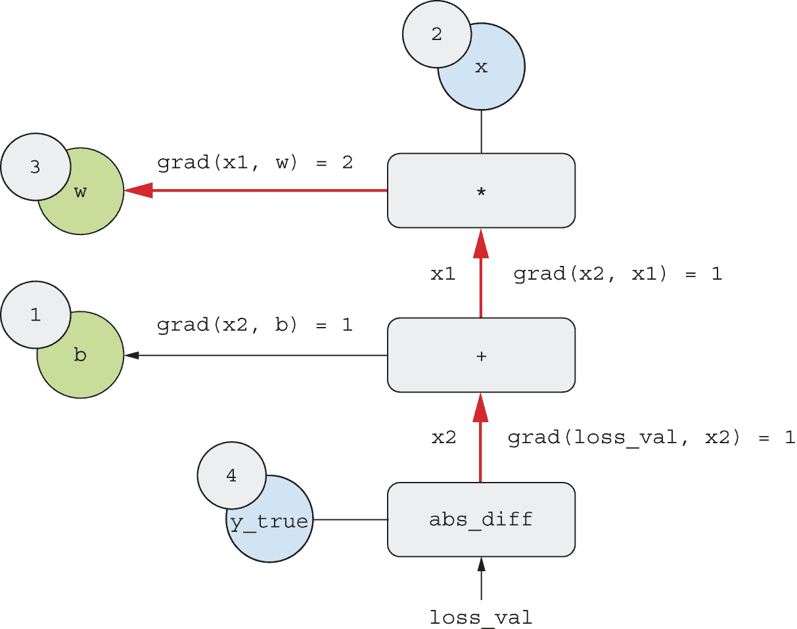

图 2.25：反向图中从`loss_val`到`w`的路径

通过将链式法则应用于我们的图，我们得到了我们想要的结果：

+   `grad(loss_val, w) = 1 * 1 * 2 = 2`

+   `grad(loss_val, b) = 1 * 1 = 1`

有了这些，你刚刚见证了反向传播的实际应用！反向传播仅仅是将链式法则应用于计算图。除此之外没有其他内容。反向传播从最终的损失值开始，从顶层到底层反向工作，计算每个参数在损失值中的贡献。这就是“反向传播”这个名字的由来：我们在计算图的节点中“反向传播”不同节点的损失贡献。

现在，人们使用能够进行*自动微分*的现代框架来实现神经网络，例如 JAX、TensorFlow 和 PyTorch。自动微分是通过之前提出的计算图实现的。自动微分使得能够检索任意可微张量操作的任意组合的梯度，而无需进行任何额外的工作，除了写下正向传递。当我 2000 年代用 C 语言编写我的第一个神经网络时，我不得不手动编写梯度。现在，多亏了现代自动微分工具，你永远不需要自己实现反向传播。觉得自己很幸运吧！

## 回顾我们的第一个例子

你即将结束本章的学习，现在你应该对神经网络背后的工作原理有一个大致的了解。在章节开始时，神经网络是一个神秘的黑色盒子，而现在它已经变成了一个更清晰的图景，如图 2.26 所示：由层组成的模型将输入数据映射到预测。损失函数随后将这些预测与目标进行比较，产生损失值：衡量模型预测与预期匹配程度的一个指标。优化器使用这个损失值来更新模型的权重。

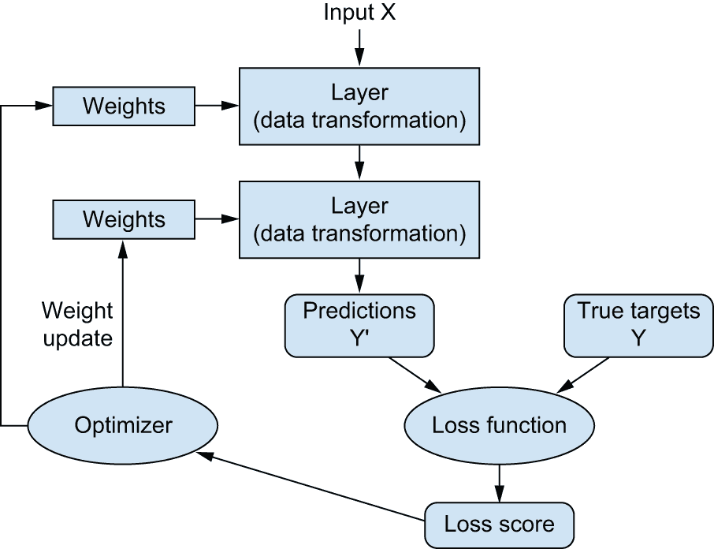

图 2.26：网络、层、损失函数和优化器之间的关系

让我们回到第一个例子，并回顾一下你在前几节中学到的内容。

这是输入数据：

```py
(train_images, train_labels), (test_images, test_labels) = mnist.load_data()
train_images = train_images.reshape((60000, 28 * 28))
train_images = train_images.astype("float32") / 255
test_images = test_images.reshape((10000, 28 * 28))
test_images = test_images.astype("float32") / 255 
```

现在你已经理解了输入图像存储在 NumPy 张量中，这里格式化为形状为`(60000, 784)`的`float32`张量（训练数据）和形状为`(10000, 784)`的张量（测试数据）。

这就是我们的模型：

```py
model = keras.Sequential(
    [
        layers.Dense(512, activation="relu"),
        layers.Dense(10, activation="softmax"),
    ]
) 
```

现在你已经明白这个模型由两个 `Dense` 层组成，每个层都对输入数据应用一些简单的张量操作，并且这些操作涉及到权重张量。权重张量是层的属性，是模型知识的持久化所在。

这是模型编译步骤：

```py
model.compile(
    optimizer="adam",
    loss="sparse_categorical_crossentropy",
    metrics=["accuracy"],
) 
```

现在你已经明白 `"sparse_categorical_crossentropy"` 是用于学习权重张量的损失函数，作为学习的反馈信号，训练阶段将尝试最小化它。你还知道这种损失减少是通过小批量随机梯度下降实现的。具体使用梯度下降的规则由作为第一个参数传递的 `"adam"` 优化器定义。

最后，这是训练循环：

```py
model.fit(
    train_images,
    train_labels,
    epochs=5,
    batch_size=128,
) 
```

现在你已经明白当你调用 `fit` 时会发生什么：模型将开始以 128 个样本的小批量迭代训练数据，总共迭代 5 次（每次遍历所有训练数据称为一个 *epoch*）。对于每个批量，模型将计算损失相对于权重的梯度（使用反向传播算法，该算法源于微积分中的链式法则）并将权重移动到减少该批量损失值的方向。

经过这 5 个 epoch 后，模型将执行 2,345 次梯度更新（每个 epoch 469 次），并且模型的损失将足够低，以至于模型能够以高精度对手写数字进行分类。

到目前为止，你已经了解了关于神经网络的大部分知识。让我们通过逐步重新实现第一个示例的简化版本来证明这一点，只使用低级操作。

### 从头开始重新实现我们的第一个示例

什么比从头开始实现一切更能证明对知识的全面、明确理解呢？当然，“从头开始”在这里是相对的：我们不会重新实现基本的张量操作，也不会实现反向传播。但我们会深入到这样的低级，以至于每个计算步骤都会被明确地表示出来。

如果你现在还不完全理解这个例子中的每一个细节，不要担心。下一章将更详细地介绍 Keras API。现在，只需尽量理解正在发生的事情的大致情况——这个例子的目的是通过具体的实现帮助你巩固对深度学习数学的理解。让我们开始吧！

#### 一个简单的 Dense 类

你之前已经了解到 `Dense` 层实现了以下输入转换，其中 `W` 和 `b` 是模型参数，而 `activation` 是逐元素函数（通常是 `relu`）：

```py
output = activation(matmul(input, W) + b) 
```

让我们实现一个简单的 Python 类 `NaiveDense`，它创建两个 Keras 变量 `W` 和 `b`，并公开一个 `__call__()` 方法，该方法应用之前的转换：

```py
# keras.ops is where you will find all the tensor operations you need.
import keras
from keras import ops

class NaiveDense:
    def __init__(self, input_size, output_size, activation=None):
        self.activation = activation
        self.W = keras.Variable(
            # Creates a matrix W of shape (input_size, output_size),
            # initialized with random values drawn from a uniform
            # distribution
            shape=(input_size, output_size), initializer="uniform"
        )
        # Creates a vector b of shape (output_size,), initialized with
        # zeros
        self.b = keras.Variable(shape=(output_size,), initializer="zeros")

    # Applies the forward pass
    def __call__(self, inputs):
        x = ops.matmul(inputs, self.W)
        x = x + self.b
        if self.activation is not None:
            x = self.activation(x)
        return x

    @property
    # The convenience method for retrieving the layer's weights
    def weights(self):
        return [self.W, self.b] 
```

#### 一个简单的 Sequential 类

现在，让我们创建一个`NaiveSequential`类来连接这些层。它包装了一个层列表，并暴露了一个`__call__()`方法，该方法简单地按顺序调用输入的底层层。它还提供了一个`weights`属性，以便轻松跟踪层的参数：

```py
class NaiveSequential:
    def __init__(self, layers):
        self.layers = layers

    def __call__(self, inputs):
        x = inputs
        for layer in self.layers:
            x = layer(x)
        return x

    @property
    def weights(self):
        weights = []
        for layer in self.layers:
            weights += layer.weights
        return weights 
```

使用这个`NaiveDense`类和这个`NaiveSequential`类，我们可以创建一个模拟的 Keras 模型：

```py
model = NaiveSequential(
    [
        NaiveDense(input_size=28 * 28, output_size=512, activation=ops.relu),
        NaiveDense(input_size=512, output_size=10, activation=ops.softmax),
    ]
)
assert len(model.weights) == 4 
```

#### 批量生成器

接下来，我们需要一种方法来迭代 MNIST 数据的小批量。这很简单：

```py
import math

class BatchGenerator:
    def __init__(self, images, labels, batch_size=128):
        assert len(images) == len(labels)
        self.index = 0
        self.images = images
        self.labels = labels
        self.batch_size = batch_size
        self.num_batches = math.ceil(len(images) / batch_size)

    def next(self):
        images = self.images[self.index : self.index + self.batch_size]
        labels = self.labels[self.index : self.index + self.batch_size]
        self.index += self.batch_size
        return images, labels 
```

### 运行一个训练步骤

过程中最困难的部分是“训练步骤”：在运行一个数据批次后更新模型的权重。我们需要

+   计算模型对批次中图像的预测

+   根据实际标签计算这些预测的损失值

+   计算损失相对于模型权重的梯度

+   将权重沿着与梯度相反的方向移动一小步

```py
def one_training_step(model, images_batch, labels_batch):
    # Runs the "forward pass"
    predictions = model(images_batch)
    loss = ops.sparse_categorical_crossentropy(labels_batch, predictions)
    average_loss = ops.mean(loss)
    # Computes the gradient of the loss with regard to the weights. The
    # output, gradients, is a list where each entry corresponds to a
    # weight from the model.weights list. We haven't defined this
    # function yet!
    gradients = get_gradients_of_loss_wrt_weights(loss, model.weights)
    # Updates the weights using the gradients. We haven't defined this
    # function yet!
    update_weights(gradients, model.weights)
    return loss 
```

列表 2.9：训练的单个步骤

#### 权重更新步骤

如你所知，“权重更新”步骤（由`update_weights()`函数表示）的目的是将权重“稍微”移动到一个方向，以减少这个批次的损失。移动的幅度由“学习率”决定，通常是一个很小的量。实现这个`update_weights()`函数的最简单方法是从每个权重中减去`gradient * learning_rate`：

```py
learning_rate = 1e-3

def update_weights(gradients, weights):
    for g, w in zip(gradients, weights):
        # Assigns a new value to the variable, in place
        w.assign(w - g * learning_rate) 
```

在实践中，你几乎永远不会手动实现这样的权重更新步骤。相反，你会使用 Keras 中的一个`Optimizer`实例——就像这样：

```py
from keras import optimizers

optimizer = optimizers.SGD(learning_rate=1e-3)

def update_weights(gradients, weights):
    optimizer.apply_gradients(zip(gradients, weights)) 
```

#### 梯度计算

现在，我们只是还缺少一件事情：梯度计算（由列表 2.9 中的`get_gradients_of_loss_wrt_weights()`函数表示）。在前一节中，我们概述了如何使用链式法则来获得函数链的梯度，给定它们的各个导数，这个过程称为反向传播。我们可以在这里从头开始重新实现反向传播，但这会很繁琐，尤其是我们正在使用`softmax`操作和交叉熵损失，它们的导数相当冗长。

相反，我们可以依赖 Keras 支持的低级框架之一内置的自动微分机制，例如 TensorFlow、JAX 或 PyTorch。为了示例的目的，让我们在这里使用 TensorFlow。你将在下一章中了解更多关于 TensorFlow、JAX 和 PyTorch 的信息。

你可以通过`tf.GradientTape`对象使用 TensorFlow 的自动微分功能。它是一个 Python 作用域，会“记录”在其中运行的张量操作，以计算图的形式（有时称为*tape*）。然后，这个图可以用来检索任何标量值相对于任何一组输入值的梯度：

```py
import tensorflow as tf

# Instantiates a scalar tensor with value 0
x = tf.zeros(shape=())
# Opens a GradientTape scope
with tf.GradientTape() as tape:
    # Inside the scope, applies some tensor operations to our variable
    y = 2 * x + 3
# Uses the tape to retrieve the gradient of the output y with respect
# to our variable x
grad_of_y_wrt_x = tape.gradient(y, x) 
```

让我们使用 TensorFlow 的`GradientTape`重写我们的`one_training_step()`函数（跳过需要单独的`get_gradients_of_loss_wrt_weights()`函数）：

```py
def one_training_step(model, images_batch, labels_batch):
    with tf.GradientTape() as tape:
        predictions = model(images_batch)
        loss = ops.sparse_categorical_crossentropy(labels_batch, predictions)
        average_loss = ops.mean(loss)
    gradients = tape.gradient(average_loss, model.weights)
    update_weights(gradients, model.weights)
    return average_loss 
```

现在我们已经准备好了每个批次的训练步骤，我们可以继续实现整个训练周期的实现。

### 完整的训练循环

一个训练周期简单地由重复训练数据集中每个批次的训练步骤组成，完整的训练循环只是重复一个周期：

```py
def fit(model, images, labels, epochs, batch_size=128):
    for epoch_counter in range(epochs):
        print(f"Epoch {epoch_counter}")
        batch_generator = BatchGenerator(images, labels)
        for batch_counter in range(batch_generator.num_batches):
            images_batch, labels_batch = batch_generator.next()
            loss = one_training_step(model, images_batch, labels_batch)
            if batch_counter % 100 == 0:
                print(f"loss at batch {batch_counter}: {loss:.2f}") 
```

让我们试驾一下：

```py
from keras.datasets import mnist

(train_images, train_labels), (test_images, test_labels) = mnist.load_data()

train_images = train_images.reshape((60000, 28 * 28))
train_images = train_images.astype("float32") / 255
test_images = test_images.reshape((10000, 28 * 28))
test_images = test_images.astype("float32") / 255

fit(model, train_images, train_labels, epochs=10, batch_size=128) 
```

### 评估模型

我们可以通过对其测试图像的预测取`argmax`并与其期望的标签进行比较来评估模型：

```py
>>> predictions = model(test_images)
>>> predicted_labels = ops.argmax(predictions, axis=1)
>>> matches = predicted_labels == test_labels
>>> f"accuracy: {ops.mean(matches):.2f}"
accuracy: 0.83
```

所有工作都完成了！正如你所见，手动完成你可以在几行 Keras 代码中完成的事情需要相当多的工作。但是因为你已经经历了这些步骤，你现在应该对当你调用`fit()`时神经网络内部发生的事情有一个清晰的理解。拥有这种低级别的心理模型，将使你更好地利用 Keras API 的高级功能。

## 摘要

+   *张量*是现代机器学习系统的基础。它们有各种`dtype`、`rank`和`shape`的口味。

+   你可以通过*张量操作*（如加法、张量积或逐元素乘法）来操作数值张量，这些操作可以解释为编码几何变换。在深度学习中，一切都可以用几何解释。

+   深度学习模型由一系列简单的张量操作组成，这些操作由*权重*参数化，而权重本身也是张量。模型的重量是其“知识”存储的地方。

+   *学习*意味着找到一组模型权重的值，这组值可以最小化给定一组训练数据样本及其对应的目标的*损失函数*。

+   学习是通过随机抽取数据样本及其目标，并计算模型参数相对于批次损失的梯度来发生的。然后，模型参数会朝着梯度的反方向移动一点（移动的大小由学习率定义）。这被称为*小批量梯度下降*。

+   整个学习过程之所以成为可能，是因为神经网络中的所有张量操作都是可微分的，因此可以应用导数的链式法则来找到将当前参数和当前批次数据映射到梯度值的梯度函数。这被称为*反向传播*。

+   在未来的章节中你将频繁看到的两个关键概念是*损失*和*优化器*。在开始将数据输入模型之前，你需要定义这两者：

    +   *损失*是在训练过程中你将尝试最小化的量，因此它应该代表你试图解决的问题的成功度量。

    +   *优化器*指定了损失梯度的确切使用方式来更新参数：例如，它可以是 RMSProp 优化器、带有动量的 SGD，等等。
