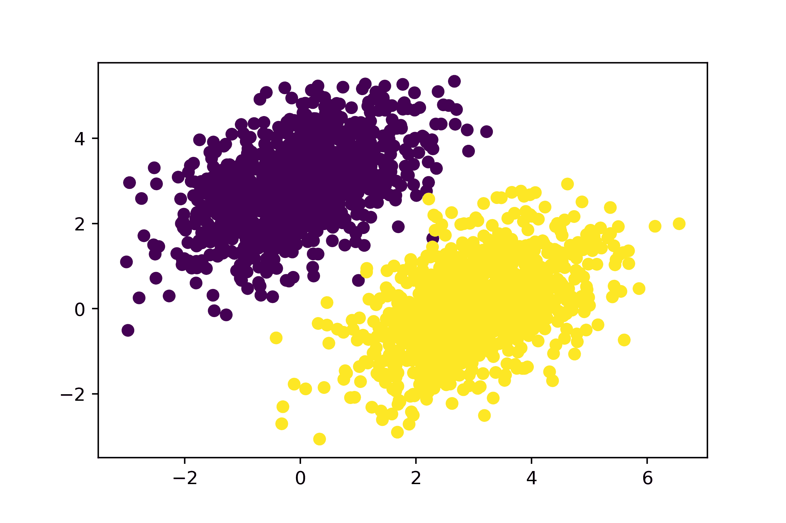
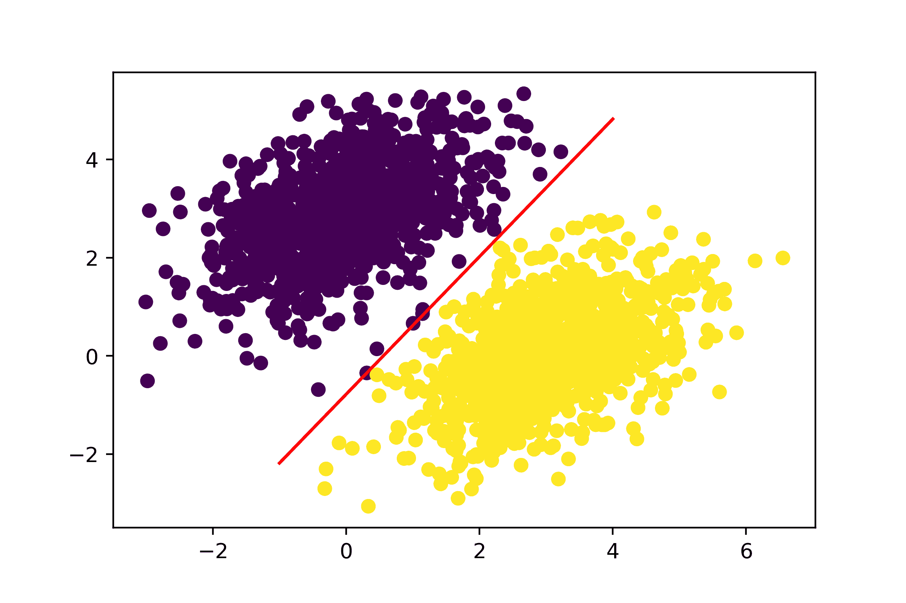
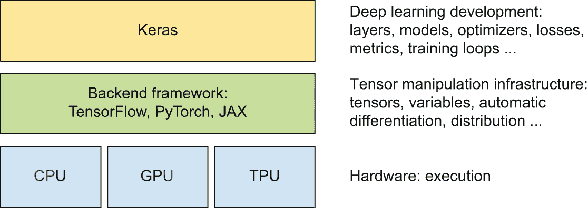
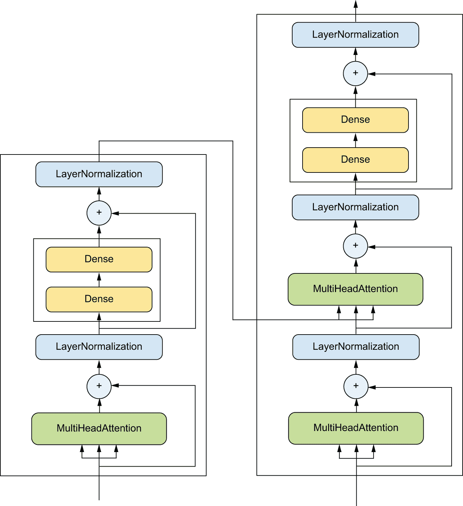

# TensorFlow、PyTorch、JAX 和 Keras 简介

> [深度学习与 Python](https://deeplearningwithpython.io/chapters/chapter03_introduction-to-ml-frameworks)

本章旨在为你提供开始实际进行深度学习所需的一切。首先，你将熟悉三个可以与 Keras 一起使用的流行深度学习框架：

+   TensorFlow ([`tensorflow.org`](https://tensorflow.org))

+   PyTorch ([`pytorch.org/`](https://pytorch.org/))

+   JAX ([`jax.readthedocs.io/`](https://jax.readthedocs.io/))

然后，在第二章中与 Keras 的第一次接触基础上，我们将回顾神经网络的核心组件以及它们如何转换为 Keras API。

到本章结束时，你将准备好进入实际、现实世界的应用——这些应用将从第四章开始。

## 深度学习框架简史

在现实世界中，你不会像我们在第二章末尾那样从头编写底层代码。相反，你将使用一个框架。除了 Keras 之外，今天主要的深度学习框架还有 JAX、TensorFlow 和 PyTorch。这本书将教你了解所有这四个框架。

如果你刚开始接触深度学习，可能会觉得所有这些框架似乎一直都在这里。实际上，它们都相当新，Keras 是其中最古老的（于 2015 年 3 月推出）。然而，这些框架背后的理念有着悠久的历史——关于自动微分的第一篇论文发表于 1964 年^([[1]](#footnote-1))。

所有这些框架都结合了三个关键特性：

+   计算任意可微分函数的梯度的一种方法（自动微分）

+   在 CPU 和 GPU（甚至可能在其他专门的深度学习硬件）上运行张量计算的方法

+   在多个设备或多台计算机上分布计算的方法，例如一台计算机上的多个 GPU，甚至多台不同计算机上的多个 GPU

这三个简单特性共同解锁了所有现代深度学习。

该领域花了很长时间才为这三个问题开发出稳健的解决方案，并将这些解决方案打包成可重用的形式。自从 20 世纪 60 年代诞生以来，直到 2000 年代，自动微分在机器学习中没有实际应用——与神经网络打交道的人只是手动编写自己的梯度逻辑，通常是在 C++这样的语言中。同时，GPU 编程几乎是不可能的。

事情在 2000 年代末开始慢慢发生变化。首先，Python 及其生态系统在科学界逐渐流行起来，逐渐取代了 MATLAB 和 C++。其次，NVIDIA 在 2006 年发布了 CUDA，解锁了在消费级 GPU 上构建神经网络的可能性。最初的 CUDA 重点是物理模拟而不是机器学习，但这并没有阻止机器学习研究人员从 2009 年开始实施基于 CUDA 的神经网络。这些通常是单次实现的，在单个 GPU 上运行，没有任何自动微分。

第一个使自动微分和 GPU 计算能够训练深度学习模型的框架是 Theano，大约在 2009 年左右。Theano 是所有现代深度学习工具的概念先驱。它在 2013-2014 年开始在机器学习研究社区中获得良好的势头，这得益于 ImageNet 2012 竞赛的结果，它引发了全世界对深度学习的兴趣。大约与此同时，一些其他支持 GPU 的深度学习库开始在计算机视觉领域流行起来——特别是基于 Lua 的 Torch 7 和基于 C++的 Caffe。Keras 于 2015 年初作为由 Theano 驱动的更高级、更易于使用的深度学习库推出，并迅速获得了当时对深度学习感兴趣的几千人的青睐。

然后在 2015 年底，谷歌推出了 TensorFlow，它从 Theano 中汲取了许多关键思想，并增加了对大规模分布式计算的支持。TensorFlow 的发布是一个分水岭事件，它推动了深度学习在主流开发者中的普及。Keras 立即增加了对 TensorFlow 的支持。到 2016 年中，超过一半的 TensorFlow 用户都是通过 Keras 来使用的。

作为对 TensorFlow 的回应，Meta（当时名为 Facebook）大约一年后推出了 PyTorch，它借鉴了 Chainer（一个于 2015 年中推出的小众但创新的框架，现在已经不复存在）和 NumPy-Autograd 的思想，NumPy-Autograd 是由 Maclaurin 等人于 2014 年发布的一个仅适用于 CPU 的自动微分库。与此同时，谷歌发布了 TPU 作为 GPU 的替代品，同时发布了 XLA，这是一个高性能编译器，旨在使 TensorFlow 能够在 TPU 上运行。

几年后，在谷歌，NumPy-Autograd 的开发者之一 Matthew Johnson 发布了 JAX，作为一种使用 XLA 进行自动微分的新方法。JAX 因其简约的 API 和高可扩展性而迅速受到研究人员的青睐。今天，Keras、TensorFlow、PyTorch 和 JAX 是深度学习领域的顶级框架。

回顾这段混乱的历史，我们可以问，接下来会怎样？明天会出现一个新的框架吗？我们会转向新的编程语言或新的硬件平台吗？

如果问我，今天有三件事是确定的：

+   Python 已经赢了。它的机器学习和数据科学生态系统目前势头强劲。不会有一种全新的语言来取代它——至少在接下来的 15 年内不会。

+   我们处于一个多框架的世界——所有四个框架都得到了很好的建立，在接下来的几年内不太可能有所改变。了解每个框架的点点滴滴是个不错的选择。然而，未来很可能会有*新*框架流行起来，除了它们之外；苹果最近发布的 MLX 可能就是这样一个例子。在这种情况下，使用 Keras 是一个相当大的优势：你应该能够通过新的 Keras 后端在任何新的新兴框架上运行你的现有 Keras 模型。Keras 将继续像自 2015 年以来那样为机器学习开发者提供未来保障的稳定性——那时 TensorFlow、PyTorch 和 JAX 都还不存在。

+   未来可能会出现新的芯片，与 NVIDIA 的 GPU 和 Google 的 TPUs 并行。例如，AMD 的 GPU 系列可能前景光明。但任何新的此类芯片都必须与现有框架协同工作才能获得市场认可。新硬件不太可能破坏你的工作流程。

## 这些框架之间是如何相互关联的

Keras、TensorFlow、PyTorch 和 JAX 并不都具有相同的特性集，也不能互换使用。它们有一些重叠，但在很大程度上，它们针对不同的用例扮演着不同的角色。最大的区别在于 Keras 和另外三个框架。Keras 是一个高级框架，而其他的是低级框架。想象一下建造一栋房子。Keras 就像一个预制建筑套件：它提供了一个简化的界面来设置和训练神经网络。相比之下，TensorFlow、PyTorch 和 JAX 就像建筑中使用的原材料。

正如你在前几章中看到的，训练神经网络围绕以下概念展开：

+   *首先，低级张量操作*——所有现代机器学习的基础设施。这对应于 TensorFlow、PyTorch^([[2]](#footnote-2))和 JAX 中找到的低级 API：

    +   *张量*，包括存储网络状态的特殊张量（*变量*）

    +   *张量操作*，例如加法、`relu`或`matmul`

    +   *反向传播*，一种计算数学表达式梯度的方法

+   *其次，高级深度学习概念*——这对应于 Keras API：

    +   *层*，它们被组合成一个*模型*

    +   一个*损失函数*，它定义了用于学习的反馈信号

    +   一个*优化器*，它决定了学习过程如何进行

    +   *指标*用于评估模型性能，例如准确率

    +   一个执行小批量随机梯度下降的*训练循环*

此外，Keras 的独特之处在于它不是一个完全独立的框架。它需要一个 *后端引擎* 来运行，(见图 3.4)，就像预制房屋建造套件需要从某处获取建筑材料一样。TensorFlow、PyTorch 和 JAX 都可以用作 Keras 后端。此外，Keras 还可以在 NumPy 上运行，但由于 NumPy 不提供梯度 API，因此基于 NumPy 的 Keras 工作流程仅限于从模型进行预测——训练是不可能的。

现在您已经对所有这些框架是如何产生以及它们之间如何相互关联有了更清晰的理解，让我们深入了解与它们一起工作的感觉。我们将按时间顺序介绍它们：首先是 TensorFlow，然后是 PyTorch，最后是 JAX。

## TensorFlow 简介

TensorFlow 是一个由 Google 主要开发的基于 Python 的开源机器学习框架。它的首次发布是在 2015 年 11 月，随后在 2017 年 2 月发布了 v1 版本，在 2019 年 10 月发布了 v2 版本。TensorFlow 在整个行业的生产级机器学习应用中被广泛使用。

重要的是要记住，TensorFlow 不仅仅是一个库。它实际上是一个平台，拥有一个庞大的组件生态系统，其中一些由 Google 开发，一些由第三方开发。例如，有 TFX 用于工业级机器学习工作流程管理，TF-Serving 用于生产部署，TF Optimization Toolkit 用于模型量化修剪，以及 TFLite 和 MediaPipe 用于移动应用部署。

这些组件共同覆盖了非常广泛的使用案例，从尖端研究到大规模生产应用。

### TensorFlow 的第一步

在接下来的段落中，您将熟悉 TensorFlow 的所有基础知识。我们将介绍以下关键概念：

+   张量和变量

+   TensorFlow 中的数值运算

+   使用 `GradientTape` 计算梯度

+   通过即时编译使 TensorFlow 函数快速运行

然后，我们将通过一个端到端示例结束介绍：一个纯 TensorFlow 实现的线性回归。

让我们让那些张量流动起来。

#### TensorFlow 中的张量和变量

要在 TensorFlow 中做任何事情，我们都需要一些张量。您可以通过几种不同的方式创建它们。

##### 常数张量

张量需要用一些初始值来创建，因此常见的创建张量的方式是通过 `tf.ones`（相当于 `np.ones`）和 `tf.zeros`（相当于 `np.zeros`）。您还可以使用 `tf.constant` 从 Python 或 NumPy 值创建张量。

```py
>>> import tensorflow as tf
>>> # Equivalent to np.ones(shape=(2, 1))
>>> tf.ones(shape=(2, 1))
tf.Tensor([[1.], [1.]], shape=(2, 1), dtype=float32)
>>> # Equivalent to np.zeros(shape=(2, 1))
>>> tf.zeros(shape=(2, 1))
tf.Tensor([[0.], [0.]], shape=(2, 1), dtype=float32)
>>> # Equivalent to np.array([1, 2, 3], dtype="float32")
>>> tf.constant([1, 2, 3], dtype="float32")
tf.Tensor([1., 2., 3.], shape=(3,), dtype=float32)
```

列表 3.1：全为 1 或全为 0 的张量

##### 随机张量

您还可以通过 `tf.random` 子模块（相当于 `np.random` 子模块）的方法之一创建填充随机值的张量。

```py
>>> # Tensor of random values drawn from a normal distribution with
>>> # mean 0 and standard deviation 1\. Equivalent to
>>> # np.random.normal(size=(3, 1), loc=0., scale=1.).
>>> x = tf.random.normal(shape=(3, 1), mean=0., stddev=1.)
>>> print(x)
tf.Tensor(
[[-0.14208166]
 [-0.95319825]
 [ 1.1096532 ]], shape=(3, 1), dtype=float32)
>>> # Tensor of random values drawn from a uniform distribution between
>>> # 0 and 1\. Equivalent to np.random.uniform(size=(3, 1), low=0.,
>>> # high=1.).
>>> x = tf.random.uniform(shape=(3, 1), minval=0., maxval=1.)
>>> print(x)
tf.Tensor(
[[0.33779848]
 [0.06692922]
 [0.7749394 ]], shape=(3, 1), dtype=float32)
```

列表 3.2：随机张量

##### 张量赋值和 Variable 类

NumPy 数组与 TensorFlow 张量之间一个显著的区别是 TensorFlow 张量不可赋值：它们是常量。例如，在 NumPy 中，你可以这样做。

```py
import numpy as np

x = np.ones(shape=(2, 2))
x[0, 0] = 0.0 
```

列表 3.3：NumPy 数组可赋值

尝试在 TensorFlow 中做同样的事情：你会得到一个错误，`EagerTensor object does not support item assignment`。

```py
x = tf.ones(shape=(2, 2))
# This will fail, as a tensor isn't assignable.
x[0, 0] = 0.0 
```

列表 3.4：TensorFlow 张量不可赋值

要训练一个模型，我们需要更新其状态，这是一个张量集合。如果张量不可赋值，我们该如何操作呢？这就是变量的用武之地。`tf.Variable`是用于在 TensorFlow 中管理可修改状态的类。

要创建一个变量，你需要提供一个初始值，例如一个随机张量。

```py
>>> v = tf.Variable(initial_value=tf.random.normal(shape=(3, 1)))
>>> print(v)
array([[-0.75133973],
       [-0.4872893 ],
       [ 1.6626885 ]], dtype=float32)>
```

列表 3.5：创建`tf.Variable`

变量的状态可以通过其`assign`方法进行修改。

```py
>>> v.assign(tf.ones((3, 1)))
array([[1.],
       [1.],
       [1.]], dtype=float32)>
```

列表 3.6：将值赋给`Variable`

赋值也适用于系数的子集。

```py
>>> v[0, 0].assign(3.)
array([[3.],
       [1.],
       [1.]], dtype=float32)>
```

列表 3.7：将值赋给`Variable`的子集

类似地，`assign_add`和`assign_sub`是`+=`和`-=`的有效等效操作。

```py
>>> v.assign_add(tf.ones((3, 1)))
array([[2.],
       [2.],
       [2.]], dtype=float32)>
```

列表 3.8：使用`assign_add`

#### 张量运算：在 TensorFlow 中进行数学运算

就像 NumPy 一样，TensorFlow 提供了一大批张量运算来表示数学公式。以下是一些示例。

```py
a = tf.ones((2, 2))
# Takes the square, same as np.square
b = tf.square(a)
# Takes the square root, same as np.sqrt
c = tf.sqrt(a)
# Adds two tensors (element-wise)
d = b + c
# Takes the product of two tensors (see chapter 2), same as np.matmul
e = tf.matmul(a, b)
# Concatenates a and b along axis 0, same as np.concatenate
f = tf.concat((a, b), axis=0) 
```

列表 3.9：TensorFlow 中的几个基本数学运算

这里是第二章中看到的`Dense`层的等效形式：

```py
def dense(inputs, W, b):
    return tf.nn.relu(tf.matmul(inputs, W) + b) 
```

#### TensorFlow 中的梯度：再次审视 GradientTape API

到目前为止，TensorFlow 看起来很像 NumPy。但这里有一个 NumPy 做不到的事情：检索任何可微表达式相对于其任何输入的梯度。只需打开`GradientTape`作用域，对一或多个输入张量进行一些计算，然后检索相对于输入的结果的梯度。

```py
input_var = tf.Variable(initial_value=3.0)
with tf.GradientTape() as tape:
    result = tf.square(input_var)
gradient = tape.gradient(result, input_var) 
```

列表 3.10：使用`GradientTape`

这通常用于检索模型损失相对于其权重的梯度：`gradients = tape.gradient(loss, weights)`。

在第二章中，你看到了`GradientTape`在单个输入或输入列表上的工作方式，以及输入可以是标量或高维张量。

到目前为止，你只看到了`tape.gradient()`中的输入张量是 TensorFlow 变量的情况。实际上，这些输入可以是任何任意的张量。然而，默认情况下，只有*可训练变量*被跟踪。对于常量张量，你必须手动将其标记为被跟踪，通过在它上面调用`tape.watch()`。

```py
input_const = tf.constant(3.0)
with tf.GradientTape() as tape:
    tape.watch(input_const)
    result = tf.square(input_const)
gradient = tape.gradient(result, input_const) 
```

列表 3.11：使用`GradientTape`与常量张量输入

为什么？因为预先存储计算任何事物相对于任何事物的梯度所需的信息会非常昂贵。为了避免浪费资源，带子需要知道要观察什么。默认情况下，可训练变量会被观察，因为计算损失相对于一系列可训练变量的梯度是梯度带最常见的用法。

梯度带是一个强大的实用工具，甚至能够计算 *二阶梯度*——即梯度的梯度。例如，一个物体相对于时间的位置的梯度是那个物体的速度，而二阶梯度是它的加速度。

如果你测量一个下落的苹果在垂直轴上的位置随时间的变化，并发现它符合 `position(time) = 4.9 * time ** 2`，那么它的加速度是多少？让我们使用两个嵌套梯度带来找出答案。

```py
time = tf.Variable(0.0)
with tf.GradientTape() as outer_tape:
    with tf.GradientTape() as inner_tape:
        position = 4.9 * time**2
    speed = inner_tape.gradient(position, time)
# We use the outer tape to compute the gradient of the gradient from
# the inner tape. Naturally, the answer is 4.9 * 2 = 9.8.
acceleration = outer_tape.gradient(speed, time) 
```

列表 3.12：使用嵌套梯度带计算二阶梯度

#### 使用编译来加速 TensorFlow 函数

你迄今为止编写的所有 TensorFlow 代码都一直在“贪婪地”执行。这意味着操作在 Python 运行时一个接一个地执行，就像任何 Python 代码或 NumPy 代码一样。贪婪执行对于调试来说很棒，但它通常非常慢。通常，并行化某些计算或“融合”操作——将两个连续的操作，如 `matmul` 后跟 `relu`，替换为单个更有效的操作，这样做可以完成相同的事情而不产生中间输出。

这可以通过 *编译* 来实现。编译的一般想法是将你用 Python 编写的某些函数提取出来，自动将它们重写为更快、更高效的“编译程序”，然后从 Python 运行时调用该程序。

编译的主要好处是性能提升。但也有一个缺点：你写的代码不再是执行中的代码，这可能会让调试体验变得痛苦。只有在你已经使用 Python 运行时调试了你的代码之后，才打开编译功能。

你可以通过将 `tf.function` 装饰器包裹在 TensorFlow 函数上来应用编译，如下所示：

```py
@tf.function
def dense(inputs, W, b):
    return tf.nn.relu(tf.matmul(inputs, W) + b) 
```

当你这样做时，对 `dense()` 的任何调用都将被替换为调用一个实现了函数更优化版本的编译程序。第一次调用该函数会花费更长的时间，因为 TensorFlow 将会编译你的代码。这只会发生一次——所有后续对该函数的调用都将很快。

TensorFlow 有两种编译模式：

+   首先，默认的一种，我们称之为“图模式”。任何用 `@tf.function` 装饰的函数都在图模式下运行。

+   第二种，使用 XLA 的编译，XLA 是一个用于机器学习的高性能编译器（它代表加速线性代数）。你可以通过指定 `jit_compile=True` 来打开它，如下所示：

```py
@tf.function(jit_compile=True)
def dense(inputs, W, b):
    return tf.nn.relu(tf.matmul(inputs, W) + b) 
```

通常情况下，使用 XLA 编译函数会比图模式运行得更快——尽管第一次执行函数需要更多时间，因为编译器有更多工作要做。

### 一个端到端的示例：纯 TensorFlow 中的线性分类器

你已经了解了张量、变量和张量操作，也知道如何计算梯度。这足以构建任何基于梯度下降的 TensorFlow 机器学习模型。让我们通过一个端到端的示例来确保一切都很清晰。

在机器学习面试中，你可能会被要求从头实现一个线性分类器：一个非常简单的任务，作为具有一些基本机器学习背景的候选人和没有背景的候选人之间的过滤器。让我们帮助你通过这个过滤器，并使用你新获得的 TensorFlow 知识来实现这样的线性分类器。

首先，让我们想出一些很好的线性可分合成数据来工作：2D 平面上的两类点。

```py
import numpy as np

num_samples_per_class = 1000
negative_samples = np.random.multivariate_normal(
    # Generates the first class of points: 1,000 random 2D points with
    # specified "mean" and "covariance matrix." Intuitively, the
    # "covariance matrix" describes the shape of the point cloud, and
    # the "mean" describes its position in the plane. `cov=[[1,
    # 0.5],[0.5, 1]]` corresponds to "an oval-like point cloud oriented
    # from bottom left to top right."
    mean=[0, 3], cov=[[1, 0.5], [0.5, 1]], size=num_samples_per_class
)
positive_samples = np.random.multivariate_normal(
    # Generates the other class of points with a different mean and the
    # same covariance matrix (point cloud with a different position and
    # the same shape)
    mean=[3, 0], cov=[[1, 0.5], [0.5, 1]], size=num_samples_per_class
) 
```

列表 3.13：在 2D 平面上生成两个类别的随机点

`negative_samples` 和 `positive_samples` 都是形状为 `(1000, 2)` 的数组。让我们将它们堆叠成一个形状为 `(2000, 2)` 的单个数组。

```py
inputs = np.vstack((negative_samples, positive_samples)).astype(np.float32) 
```

列表 3.14：将两个类别堆叠成一个形状为 `(2000, 2)` 的数组

让我们生成相应的目标标签，一个形状为 `(2000, 1)` 的 0 和 1 的数组，其中 `targets[i, 0]` 为 0 如果 `inputs[i]` 属于类别 0（反之亦然）。

```py
targets = np.vstack(
    (
        np.zeros((num_samples_per_class, 1), dtype="float32"),
        np.ones((num_samples_per_class, 1), dtype="float32"),
    )
) 
```

列表 3.15：生成相应的目标（0 和 1）

让我们使用 Matplotlib，一个著名的 Python 数据可视化库（在 Colab 中预先安装，因此你不需要自己安装它）来绘制我们的数据，如图 3.1 所示。

```py
import matplotlib.pyplot as plt

plt.scatter(inputs[:, 0], inputs[:, 1], c=targets[:, 0])
plt.show() 
```

列表 3.16：绘制两个点类



图 3.1：我们的合成数据：2D 平面上的两类随机点

现在，让我们创建一个线性分类器，它可以学会分离这两个团块。线性分类器是一种仿射变换（`prediction = matmul(input, W) + b`），经过训练以最小化预测值与目标之间的差的平方。

如你所见，这实际上比第二章末尾的玩具双层神经网络端到端示例要简单得多。然而，这次，你应该能够逐行理解代码中的每一部分。

让我们创建变量 `W` 和 `b`，分别用随机值和零初始化。

```py
# The inputs will be 2D points.
input_dim = 2
# The output predictions will be a single score per sample (close to 0
# if the sample is predicted to be in class 0, and close to 1 if the
# sample is predicted to be in class 1).
output_dim = 1
W = tf.Variable(initial_value=tf.random.uniform(shape=(input_dim, output_dim)))
b = tf.Variable(initial_value=tf.zeros(shape=(output_dim,))) 
```

列表 3.17：创建线性分类器变量

这是我们的前向传递函数。

```py
def model(inputs, W, b):
    return tf.matmul(inputs, W) + b 
```

列表 3.18：前向传递函数

由于我们的线性分类器在 2D 输入上操作，`W`实际上只是两个标量系数：`W = [[w1], [w2]]`。同时，`b`是一个单一的标量系数。因此，对于给定的输入点`[x, y]`，其预测值是`prediction = [[w1], [w2]] • [x, y] + b = w1 * x + w2 * y + b`。

这里是我们的损失函数。

```py
def mean_squared_error(targets, predictions):
    # per_sample_losses will be a tensor with the same shape as targets
    # and predictions, containing per-sample loss scores.
    per_sample_losses = tf.square(targets - predictions)
    # We need to average these per-sample loss scores into a single
    # scalar loss value: reduce_mean does this.
    return tf.reduce_mean(per_sample_losses) 
```

列表 3.19：均方误差损失函数

现在，我们转向训练步骤，它接收一些训练数据并更新权重`W`和`b`以最小化数据上的损失。

```py
learning_rate = 0.1

# Wraps the function in a tf.function decorator to speed it up
@tf.function(jit_compile=True)
def training_step(inputs, targets, W, b):
    # Forward pass, inside of a gradient tape scope
    with tf.GradientTape() as tape:
        predictions = model(inputs, W, b)
        loss = mean_squared_error(predictions, targets)
    # Retrieves the gradient of the loss with regard to weights
    grad_loss_wrt_W, grad_loss_wrt_b = tape.gradient(loss, [W, b])
    # Updates the weights
    W.assign_sub(grad_loss_wrt_W * learning_rate)
    b.assign_sub(grad_loss_wrt_b * learning_rate)
    return loss 
```

列表 3.20：训练步骤函数

为了简化，我们将进行**批量训练**而不是**小批量训练**：我们将对整个数据集运行每个训练步骤（梯度计算和权重更新），而不是在小的数据批次上迭代。一方面，这意味着每个训练步骤将需要更长的时间来运行，因为我们一次计算 2,000 个样本的前向传递和梯度。另一方面，每个梯度更新将更有效地减少训练数据上的损失，因为它将包含所有训练样本的信息，而不是，比如说，只有 128 个随机样本。因此，我们将需要更少的训练步骤，并且我们应该使用比典型的小批量训练更大的学习率（我们将使用`learning_rate = 0.1`，如之前定义）。

```py
for step in range(40):
    loss = training_step(inputs, targets, W, b)
    print(f"Loss at step {step}: {loss:.4f}") 
```

列表 3.21：批量训练循环

经过 40 步后，训练损失似乎稳定在 0.025 左右。让我们绘制我们的线性模型如何分类训练数据点，如图 3.2 所示。因为我们的目标是 0 和 1，所以给定输入点如果其预测值低于 0.5，则被分类为“0”，如果高于 0.5，则被分类为“1”：

```py
predictions = model(inputs, W, b)
plt.scatter(inputs[:, 0], inputs[:, 1], c=predictions[:, 0] > 0.5)
plt.show() 
```


图 3.2：我们的模型在训练输入上的预测：与训练目标非常相似

回想一下，给定点`[x, y]`的预测值仅仅是`prediction == [[w1], [w2]] • [x, y] + b == w1 * x + w2 * y + b`。因此，类别“0”定义为`w1 * x + w2 * y + b < 0.5`，类别“1”定义为`w1 * x + w2 * y + b > 0.5`。你会注意到你所看到的是二维平面上线的方程：`w1 * x + w2 * y + b = 0.5`。类别 1 在直线之上；类别 0 在直线之下。你可能习惯于看到格式为`y = a * x + b`的线方程；以同样的格式，我们的线变为`y = - w1 / w2 * x + (0.5 - b) / w2`。

让我们绘制这条线，如图 3.3 所示：

```py
# Generates 100 regularly spaced numbers between -1 and 4, which we
# will use to plot our line
x = np.linspace(-1, 4, 100)
# This is our line's equation.
y = -W[0] / W[1] * x + (0.5 - b) / W[1]
# Plots our line (`"-r"` means "plot it as a red line")
plt.plot(x, y, "-r")
# Plots our model's predictions on the same plot
plt.scatter(inputs[:, 0], inputs[:, 1], c=predictions[:, 0] > 0.5) 
```



图 3.3：我们的模型，以线的形式可视化

这正是线性分类器的本质：找到一条线（或在更高维空间中的超平面）的参数，以整洁的方式将两类数据分开。

### TensorFlow 方法独特之处

现在，你已经熟悉了所有支撑 TensorFlow 工作流程的基本 API，你即将深入探索更多框架——特别是 PyTorch 和 JAX。与使用其他任何框架相比，使用 TensorFlow 有何不同？你应该在什么情况下使用 TensorFlow，以及在什么情况下可以使用其他工具？

如果你们问我们，以下是 TensorFlow 的主要优点：

+   多亏了图模式和 XLA 编译，它运行得很快。它通常比 PyTorch 和 NumPy 快得多，尽管 JAX 有时甚至更快。

+   它的功能非常全面。在所有框架中独一无二，它支持字符串张量以及“不规则张量”（不同条目可能具有不同维度的张量——在不需要将它们填充到共享长度的情况下处理序列非常有用）。它还通过高性能的 `tf.data` API 提供出色的数据预处理支持。`tf.data` 非常出色，以至于 JAX 也推荐它用于数据预处理。无论你需要做什么，TensorFlow 都有相应的解决方案。

+   它的生产部署生态系统在所有框架中最为成熟，尤其是在移动或浏览器部署方面。

然而，TensorFlow 也有一些明显的缺点：

+   它有一个庞大的 API——这是功能全面的一个副作用。TensorFlow 包含了数千种不同的操作。

+   它的数值 API 有时与 NumPy API 不一致，如果你已经熟悉 NumPy，那么它可能会让你觉得有点难以接近。

+   流行的预训练模型共享平台 Hugging Face 对 TensorFlow 的支持较少，这意味着最新的生成式 AI 模型可能并不总是可在 TensorFlow 中找到。

现在，让我们转向 PyTorch。

## PyTorch 简介

PyTorch 是由 Meta（前身为 Facebook）主要开发的一个基于 Python 的开源机器学习框架。它最初于 2016 年 9 月发布（作为对 TensorFlow 发布的回应），其 1.0 版本于 2018 年推出，其 2.0 版本于 2023 年推出。PyTorch 从现在已停用的 Chainer 框架继承了其编程风格，而 Chainer 框架本身又受到了 NumPy-Autograd 的启发。PyTorch 在机器学习研究社区中得到广泛应用。

与 TensorFlow 类似，PyTorch 也处于一个庞大的相关包生态系统中心，例如 `torchvision`、`torchaudio` 或流行的模型共享平台 Hugging Face。

PyTorch API 比 TensorFlow 和 JAX 的 API 更高级：它包括层和优化器，就像 Keras 一样。当你使用 PyTorch 后端与 Keras 一起使用时，这些层和优化器与 Keras 工作流程兼容。

### PyTorch 的第一步

在接下来的段落中，你将熟悉 PyTorch 的所有基础知识。我们将涵盖以下关键概念：

+   张量和参数

+   PyTorch 中的数值操作

+   使用 `backward()` 方法计算梯度

+   使用 `Module` 类包装计算

+   通过编译加速 PyTorch

我们将通过重新实现我们的端到端线性回归示例来结束对 PyTorch 的介绍。

#### PyTorch 中的张量和参数

PyTorch 的第一个问题在于，这个包的名字不是 `pytorch`。实际上，它的名字是 `torch`。你可以通过 `pip install torch` 来安装它，并通过 `import torch` 来导入它。

就像在 NumPy 和 TensorFlow 中一样，框架的核心对象是张量。首先，让我们来获取一些 PyTorch 张量。

##### 常数张量

这里有一些常数张量。

```py
>>> import torch
>>> # Unlike in other frameworks, the shape argument is named "size"
>>> # rather than "shape."
>>> torch.ones(size=(2, 1))
tensor([[1.], [1.]])
>>> torch.zeros(size=(2, 1))
tensor([[0.], [0.]])
>>> # Unlike in other frameworks, you cannot pass dtype="float32" as a
>>> # string. The dtype argument must be a torch dtype instance.
>>> torch.tensor([1, 2, 3], dtype=torch.float32)
tensor([1., 2., 3.])
```

列表 3.22：全一或全零张量

##### 随机张量

随机张量创建类似于 NumPy 和 TensorFlow，但语法有所不同。考虑函数 `normal`：它不接受形状参数。相反，均值和标准差应该作为具有预期输出形状的 PyTorch 张量提供。

```py
>>> # Equivalent to tf.random.normal(shape=(3, 1), mean=0., stddev=1.)
>>> torch.normal(
... mean=torch.zeros(size=(3, 1)),
... std=torch.ones(size=(3, 1)))
tensor([[-0.9613],
        [-2.0169],
        [ 0.2088]])
```

列表 3.23：随机张量

至于创建随机均匀张量，你可以通过 `torch.rand` 来完成。与 `np.random.uniform` 或 `tf.random.uniform` 不同，输出形状应该作为每个维度的独立参数提供，如下所示：

```py
>>> # Equivalent to tf.random.uniform(shape=(3, 1), minval=0.,
>>> # maxval=1.)
>>> torch.rand(3, 1)
```

##### 张量分配和参数类

与 NumPy 数组类似，但与 TensorFlow 张量不同，PyTorch 张量是可以分配的。你可以进行如下操作：

```py
>>> x = torch.zeros(size=(2, 1))
>>> x[0, 0] = 1.
>>> x
tensor([[1.],
        [0.]])
```

虽然你可以只用一个普通的 `torch.Tensor` 来存储模型的可训练状态，但 PyTorch 确实提供了一个专门的张量子类来达到这个目的，即 `torch.nn.parameter.Parameter` 类。与普通张量相比，它提供了语义清晰性——如果你看到一个 `Parameter`，你就会知道它是一块可训练状态，而一个 `Tensor` 可能是任何东西。因此，它使得 PyTorch 能够自动跟踪和检索分配给 PyTorch 模型的 `Parameters`——类似于 Keras 对 Keras `Variable` 实例所做的那样。

这里是一个 `Parameter`。

```py
>>> x = torch.zeros(size=(2, 1))
>>> # A Parameter can only be created using a torch.Tensor value — no
>>> # NumPy arrays allowed.
>>> p = torch.nn.parameter.Parameter(data=x)
```

列表 3.24：创建 PyTorch 参数

#### 张量运算：在 PyTorch 中进行数学运算

PyTorch 中的数学与 NumPy 或 TensorFlow 中的数学相同，尽管与 TensorFlow 类似，PyTorch API 在细微之处经常与 NumPy API 有所不同。

```py
a = torch.ones((2, 2))
# Takes the square, same as np.square
b = torch.square(a)
# Takes the square root, same as np.sqrt
c = torch.sqrt(a)
# Adds two tensors (element-wise)
d = b + c
# Takes the product of two tensors (see chapter 2), same as np.matmul
e = torch.matmul(a, b)
# Concatenates a and b along axis 0, same as np.concatenate
f = torch.cat((a, b), dim=0) 
```

列表 3.25：PyTorch 中的一些基本数学运算

这里是一个密集层：

```py
def dense(inputs, W, b):
    return torch.nn.relu(torch.matmul(inputs, W) + b) 
```

#### 使用 PyTorch 计算梯度

PyTorch 中没有显式的“梯度带”。类似的机制确实存在：当你运行 PyTorch 中的任何计算时，框架会创建一个一次性计算图（一个“带子”），记录刚刚发生的事情。然而，这个带子对用户来说是隐藏的。使用它的公共 API 在张量本身级别：你可以调用 `tensor.backward()` 来运行所有先前执行的操作的反向传播，这些操作导致了那个张量。这样做将会填充所有跟踪梯度的张量的 `.grad` 属性。

```py
>>> # To compute gradients with respect to a tensor, it must be created
>>> # with requires_grad=True.
>>> input_var = torch.tensor(3.0, requires_grad=True)
>>> result = torch.square(input_var)
>>> # Calling backward() populates the "grad" attribute on all tensors
>>> # create with requires_grad=True.
>>> result.backward()
>>> gradient = input_var.grad
>>> gradient
tensor(6.)
```

列表 3.26：使用 `.backward()` 计算梯度

如果你连续多次调用`backward()`，`.grad`属性将“累积”梯度：每次新的调用都会将新的梯度与现有的梯度相加。例如，在下面的代码中，`input_var.grad`不是`square(input_var)`相对于`input_var`的梯度；而是该梯度与之前计算的梯度的总和——它的值自从我们上一个代码片段以来已经翻倍了：

```py
>>> result = torch.square(input_var)
>>> result.backward()
>>> # .grad will sum all gradient values from each time backward() is
>>> # called.
>>> input_var.grad
tensor(12.)
```

要重置梯度，你只需将`.grad`设置为`None`：

```py
>>> input_var.grad = None
```

现在让我们将其付诸实践！

### 一个端到端的例子：纯 PyTorch 中的线性分类器

你现在知道足够多的知识来用 PyTorch 重写我们的线性分类器。它将非常类似于 TensorFlow 版本——唯一的重大区别是我们如何计算梯度。

让我们先创建我们的模型变量。别忘了传递`requires_grad=True`，这样我们就可以计算相对于它们的梯度：

```py
input_dim = 2
output_dim = 1

W = torch.rand(input_dim, output_dim, requires_grad=True)
b = torch.zeros(output_dim, requires_grad=True) 
```

这是我们的模型——到目前为止没有区别。我们只是从`tf.matmul`切换到`torch.matmul`：

```py
def model(inputs, W, b):
    return torch.matmul(inputs, W) + b 
```

这是我们的损失函数。我们只是从`tf.square`切换到`torch.square`，从`tf.reduce_mean`切换到`torch.mean`：

```py
def mean_squared_error(targets, predictions):
    per_sample_losses = torch.square(targets - predictions)
    return torch.mean(per_sample_losses) 
```

现在是训练步骤。这是它的工作方式：

1.  `loss.backward()`从`loss`输出节点开始运行反向传播，并在所有参与`loss`计算的张量上填充`tensor.grad`属性。`tensor.grad`表示相对于该张量的损失梯度。

1.  我们使用`.grad`属性来恢复相对于`W`和`b`的损失梯度。

1.  我们使用这些梯度来更新`W`和`b`。因为这些更新不是反向传播的一部分，所以我们在一个`torch.no_grad()`作用域内进行，它会跳过其中所有内容的梯度计算。

1.  我们通过将其设置为`None`来重置`W`和`b`参数的`.grad`属性的内容。如果我们不这样做，梯度值将在多次调用`training_step()`时累积，导致无效值：

```py
learning_rate = 0.1

def training_step(inputs, targets, W, b):
    # Forward pass
    predictions = model(inputs)
    loss = mean_squared_error(targets, predictions)
    # Computes gradients
    loss.backward()
    # Retrieves gradients
    grad_loss_wrt_W, grad_loss_wrt_b = W.grad, b.grad
    with torch.no_grad():
        # Updates weights inside a no_grad scope
        W -= grad_loss_wrt_W * learning_rate
        b -= grad_loss_wrt_b * learning_rate
    # Resets gradients
    W.grad = None
    b.grad = None
    return loss 
```

这可以变得更简单——让我们看看如何。

#### 使用 Module 类打包状态和计算

PyTorch 还有一个用于执行反向传播的高级、面向对象的 API，它需要依赖于两个新类：`torch.nn.Module`类和来自`torch.optim`模块的优化器类，例如`torch.optim.SGD`（与`keras.optimizers.SGD`等价）。

通用思路是定义`torch.nn.Module`的一个子类，它将

+   保持一些`Parameters`，以存储状态变量。这些在`__init__()`方法中定义。

+   在`forward()`方法中实现前向传播计算。

它应该看起来就像以下这样。

```py
class LinearModel(torch.nn.Module):
    def __init__(self):
        super().__init__()
        self.W = torch.nn.Parameter(torch.rand(input_dim, output_dim))
        self.b = torch.nn.Parameter(torch.zeros(output_dim))

    def forward(self, inputs):
        return torch.matmul(inputs, self.W) + self.b 
```

列表 3.27：定义`torch.nn.Module`

我们现在可以实例化我们的`LinearModel`：

```py
model = LinearModel() 
```

当使用`torch.nn.Module`的一个实例时，而不是直接调用`forward()`方法，你会使用`__call__()`（即直接在输入上调用模型类），这会重定向到`forward()`但会向其中添加一些框架钩子：

```py
torch_inputs = torch.tensor(inputs)
output = model(torch_inputs) 
```

现在，让我们动手使用一个 PyTorch 优化器。为了实例化它，你需要提供优化器打算更新的参数列表。你可以通过我们的 `Module` 实例使用 `.parameters()` 方法来获取它：

```py
optimizer = torch.optim.SGD(model.parameters(), lr=learning_rate) 
```

使用我们的 `Module` 实例和 PyTorch 的 `SGD` 优化器，我们可以运行一个简化的训练步骤：

```py
def training_step(inputs, targets):
    predictions = model(inputs)
    loss = mean_squared_error(targets, predictions)
    loss.backward()
    optimizer.step()
    model.zero_grad()
    return loss 
```

之前，更新模型参数看起来是这样的：

```py
with torch.no_grad():
    W -= grad_loss_wrt_W * learning_rate
    b -= grad_loss_wrt_b * learning_rate 
```

现在，我们只需执行 `optimizer.step()`。

同样，之前我们需要手动通过在每个参数上执行 `tensor.grad = None` 来重置参数梯度。现在我们只需执行 `model.zero_grad()`。

总体来说，这可能会感觉有点困惑——某种隐藏的背景机制似乎让损失张量、优化器和 `Module` 实例都相互了解。它们都是通过超距作用相互作用的。不过别担心——你只需将这个步骤序列（`loss.backward()` - `optimizer.step()` - `model.zero_grad()`）视为一个在任何需要编写训练步骤函数时都可以念诵的咒语。只需确保不要忘记 `model.zero_grad()`。那将是一个严重的错误（而且遗憾的是，这种情况相当普遍）！

#### 使用编译来加速 PyTorch 模块

最后一点。与 TensorFlow 允许你编译函数以获得更好的性能类似，PyTorch 允许你通过 `torch.compile()` 工具编译函数或甚至 `Module` 实例。此 API 使用 PyTorch 自己的编译器，名为 Dynamo。

让我们在我们的线性回归 `Module` 上试一试：

```py
compiled_model = torch.compile(model) 
```

生成的对象旨在与原始对象工作方式相同——除了前向和反向传递应该运行得更快。

你还可以将 `torch.compile()` 用作函数装饰器：

```py
@torch.compile
def dense(inputs, W, b):
    return torch.nn.relu(torch.matmul(inputs, W) + b) 
```

实际上，大多数 PyTorch 代码并不使用编译，而是简单地 eager 执行，因为编译器可能并不总是与所有模型兼容，并且当它工作时，可能不会总是导致速度提升。与 TensorFlow 和 Jax 中的编译从库的诞生之初就内置不同，PyTorch 的编译器是一个相对较新的功能。

### 那么，PyTorch 方法独特之处在哪里

与我们接下来要介绍的 TensorFlow 和 JAX 相比，什么让 PyTorch 独树一帜？为什么你应该使用它或不应使用它？

这里是 PyTorch 的两个关键优势：

+   PyTorch 代码默认是 eager 执行的，这使得调试变得容易。请注意，这也是 TensorFlow 代码和 JAX 代码的情况，但一个很大的区别是，PyTorch 通常旨在始终 eager 执行，而任何严肃的 TensorFlow 或 JAX 项目最终都需要在某些时候进行编译，这可能会严重影响调试体验。

+   流行的预训练模型共享平台 Hugging Face 对 PyTorch 提供了一级支持，这意味着你想要使用的任何模型很可能都可用在 PyTorch 中。这是 PyTorch 当前采用的主要驱动力。

同时，使用 PyTorch 也有一些缺点：

+   与 TensorFlow 一样，PyTorch API 与 NumPy 不一致。此外，它内部也不一致。例如，常用的关键字`axis`有时会被命名为`dim`，这取决于函数。一些伪随机数生成操作需要一个`seed`参数；而另一些则不需要。等等。这可能会让 PyTorch 的学习变得令人沮丧，尤其是对于来自 NumPy 的用户。

+   由于其专注于即时执行，PyTorch 相当慢——它是所有主要框架中最慢的，差距很大。对于大多数模型，您可能会看到使用 JAX 可以提升 20%或 30%的速度。对于某些模型——尤其是大型模型——即使使用了`torch.compile()`，您也可能看到 3 倍或 5 倍的速度提升。

+   虽然可以通过`torch.compile()`使 PyTorch 代码更快，但 PyTorch Dynamo 编译器在 2025 年仍然相当无效，充满了陷阱。因此，只有极少数的 PyTorch 用户使用编译。也许在未来的版本中会有所改进！

## JAX 简介

JAX 是一个开源的微分计算库，主要由谷歌开发。自 2018 年发布以来，JAX 迅速在研究社区中获得认可，尤其是其能够大规模使用谷歌 TPU 的能力。如今，JAX 被生成 AI 领域的多数顶级玩家所使用，例如 DeepMind、苹果、Midjourney、Anthropic、Cohere 等公司。

JAX 采用了一种*无状态*的计算方法，这意味着 JAX 中的函数不维护任何持久状态。这与传统的命令式编程形成对比，在命令式编程中，变量可以在函数调用之间保持值。

JAX 函数的无状态特性有几个优点。特别是，它使得有效的自动并行化和分布式计算成为可能，因为函数可以在不需要同步的情况下独立执行。JAX 的极端可扩展性对于处理像谷歌和 DeepMind 这样的公司面临的非常大规模的机器学习问题至关重要。

### JAX 的入门步骤

我们将介绍以下关键概念：

+   `array` 类

+   JAX 中的随机操作

+   JAX 中的数值操作

+   通过`jax.grad`和`jax.value_and_grad`计算梯度

+   通过即时编译来提高 JAX 函数的速度

让我们开始吧。

### JAX 中的张量

JAX 最优秀的特性之一是它不试图实现自己的独立、类似 NumPy 但略有差异的数值 API。相反，它只是实现了 NumPy API，正如其名。它作为`jax.numpy`命名空间提供，您通常会将其导入为`jnp`。

这里有一些 JAX 数组。

```py
>>> from jax import numpy as jnp
>>> jnp.ones(shape=(2, 1))
Array([[1.],
       [1.]], dtype=float32)
>>> jnp.zeros(shape=(2, 1))
Array([[0.],
       [0.]], dtype=float32)
>>> jnp.array([1, 2, 3], dtype="float32")
Array([1., 2., 3.], dtype=float32)
```

列表 3.28：全 1 或全 0 的张量

然而，`jax.numpy`和实际的 NumPy API 之间有两个细微的差异：随机数生成和数组赋值。让我们来看看。

### JAX 中的随机数生成

JAX 与 NumPy 之间的第一个区别与 JAX 处理随机操作的方式有关——这被称为“PRNG”（伪随机数生成）操作。我们之前提到 JAX 是**无状态的**，这意味着 JAX 代码不能依赖于任何隐藏的全局状态。考虑以下 NumPy 代码。

```py
>>> np.random.normal(size=(3,))
array([-1.68856166,  0.16489586,  0.67707523])
>>> np.random.normal(size=(3,))
array([-0.73671259,  0.3053194 ,  0.84124895])
```

列表 3.29：随机张量

第二次调用`np.random.normal()`是如何知道返回与第一次调用不同的值的？没错——这是一个隐藏的全局状态的一部分。实际上，你可以通过`np.random.get_state()`检索该全局状态，并通过`np.random.seed(seed)`设置它。

在无状态框架中，我们不能有任何这样的全局状态。相同的 API 调用必须始终返回相同的值。因此，在无状态版本的 NumPy 中，你必须依赖于向你的`np.random`调用传递不同的种子参数来获取不同的值。

现在，你的 PRNG 调用通常会在被多次调用的函数中进行，并且每次调用都打算使用不同的随机值。如果你不想依赖于任何全局状态，这要求你在目标函数之外管理你的种子状态，如下所示：

```py
def apply_noise(x, seed):
    np.random.seed(seed)
    x = x * np.random.normal((3,))
    return x

seed = 1337
y = apply_noise(x, seed)
seed += 1
z = apply_noise(x, seed) 
```

在 JAX 中基本上是相同的。然而，JAX 不使用整数种子。它使用特殊的数组结构，称为**keys**。你可以从整数值创建一个，如下所示：

```py
import jax

seed_key = jax.random.key(1337) 
```

为了强制你始终为 PRNG 调用提供种子“键”，所有使用 JAX PRNG 的操作都将`key`（随机种子）作为它们的第一个位置参数。以下是使用`random.normal()`的方法：

```py
>>> seed_key = jax.random.key(0)
>>> jax.random.normal(seed_key, shape=(3,))
Array([ 1.8160863 , -0.48262316,  0.33988908], dtype=float32)
```

接收相同种子键的两次`random.normal()`调用将始终返回相同的值。

```py
>>> seed_key = jax.random.key(123)
>>> jax.random.normal(seed_key, shape=(3,))
Array([-0.1470326,  0.5524756,  1.648498 ], dtype=float32)
>>> jax.random.normal(seed_key, shape=(3,))
Array([-0.1470326,  0.5524756,  1.648498 ], dtype=float32)
```

列表 3.30：在 Jax 中使用随机种子

如果你需要一个新种子键，你可以简单地使用`jax.random.split()`函数从一个现有的种子创建一个新的种子。它是确定性的，因此相同的分割序列将始终产生相同的最终种子键：

```py
>>> seed_key = jax.random.key(123)
>>> jax.random.normal(seed_key, shape=(3,))
Array([-0.1470326,  0.5524756,  1.648498 ], dtype=float32)
>>> # You could even split your key into multiple new keys at once!
>>> new_seed_key = jax.random.split(seed_key, num=1)[0]
>>> jax.random.normal(new_seed_key, shape=(3,))
Array([ 0.5362355, -1.1920372,  2.450225 ], dtype=float32)
```

这肯定比`np.random`要复杂得多！但无状态的好处远远超过了成本：它使你的代码**可向量化**（即，JAX 编译器可以自动将其转换为高度并行的代码）同时保持确定性（即，你可以两次运行相同的代码并得到相同的结果）。使用全局 PRNG 状态是无法实现这一点的。

#### 张量赋值

JAX 与 NumPy 之间的第二个区别是张量赋值。就像在 TensorFlow 中一样，JAX 数组是不可直接赋值的。这是因为任何形式的就地修改都会违反 JAX 的无状态设计。相反，如果你需要更新一个张量，你必须创建一个新的张量，其具有所需值。JAX 通过提供`at()`/`set()` API 来简化这一点。这些方法允许你在特定索引处创建一个新的张量，其元素已更新。以下是如何更新 JAX 数组第一个元素的示例。

```py
>>> x = jnp.array([1, 2, 3], dtype="float32")
>>> new_x = x.at[0].set(10)
```

列表 3.31：在 JAX 数组中修改值

简单明了！

#### 张量操作：在 JAX 中进行数学运算

在 JAX 中进行数学运算看起来与在 NumPy 中完全一样。这次不需要学习任何新东西！

```py
a = jnp.ones((2, 2))
# Takes the square
b = jnp.square(a)
# Takes the square root
c = jnp.sqrt(a)
# Adds two tensors (element-wise)
d = b + c
# Takes the product of two tensors (see chapter 2)
e = jnp.matmul(a, b)
# Multiplies two tensors (element-wise)
e *= d 
```

列表 3.32：JAX 中的几个基本数学运算

这里有一个密集层：

```py
def dense(inputs, W, b):
    return jax.nn.relu(jnp.matmul(inputs, W) + b) 
```

#### 使用 JAX 计算梯度

与 TensorFlow 和 PyTorch 不同，JAX 采用 *元编程* 方法进行梯度计算。元编程指的是拥有 *返回函数的函数* 的想法——你可以称它们为“元函数”。在实践中，JAX 允许你 *将损失计算函数转换为梯度计算函数*。因此，在 JAX 中计算梯度是一个三步过程：

1.  定义一个损失函数，`compute_loss()`。

1.  调用 `grad_fn = jax.grad(compute_loss)` 来检索一个梯度计算函数。

1.  调用 `grad_fn` 来检索梯度值。

损失函数应满足以下属性：

+   它应该返回一个标量损失值。

+   其第一个参数（在以下示例中，这也是唯一的参数）应包含我们需要计算梯度的状态数组。这个参数通常命名为 `state`。例如，这个第一个参数可以是一个数组、一个数组列表，或者一个数组字典。

让我们看看一个简单的例子。这是一个损失计算函数，它接受一个单个标量 `input_var` 并返回一个标量损失值——只是输入的平方：

```py
def compute_loss(input_var):
    return jnp.square(input_var) 
```

我们现在可以在这个损失函数上调用 JAX 的实用工具 `jax.grad()`。它返回一个梯度计算函数——一个接受与原始损失函数相同参数的函数，并返回相对于 `input_var` 的损失梯度：

```py
grad_fn = jax.grad(compute_loss) 
```

一旦你获得了 `grad_fn()`，你可以用与 `compute_loss()` 相同的参数调用它，它将返回与 `compute_loss()` 的第一个参数相对应的梯度数组。在我们的例子中，我们的第一个参数是一个单个数组，所以 `grad_fn()` 直接返回相对于该数组的损失梯度：

```py
input_var = jnp.array(3.0)
grad_of_loss_wrt_input_var = grad_fn(input_var) 
```

#### JAX 梯度计算最佳实践

到目前为止一切顺利！元编程是一个大词，但事实证明它相当简单。现在，在现实世界的用例中，你还需要考虑一些其他的事情。让我们看看。

##### 返回损失值

通常，你不仅需要梯度数组；还需要损失值。在 `grad_fn()` 之外独立重新计算它将非常低效，因此，你可以配置你的 `grad_fn()` 以返回损失值。这是通过使用 JAX 实用工具 `jax.value_and_grad()` 而不是 `jax.grad()` 来实现的。它的工作方式相同，但它返回一个值的元组，其中第一个值是损失值，第二个值是梯度（s）：

```py
grad_fn = jax.value_and_grad(compute_loss)
output, grad_of_loss_wrt_input_var = grad_fn(input_var) 
```

##### 为复杂函数获取梯度

现在，如果你需要计算多个变量的梯度怎么办？如果你的 `compute_loss()` 函数有多个输入怎么办？

假设你的状态包含三个变量，`a`、`b` 和 `c`，而你的损失函数有两个输入，`x` 和 `y`。你只需这样构建它：

```py
# state contains a, b, and c. It must be the first argument.
def compute_loss(state, x, y):
    ...
    return loss

grad_fn = jax.value_and_grad(compute_loss)
state = (a, b, c)
# grads_of_loss_wrt_state has the same structure as state.
loss, grads_of_loss_wrt_state = grad_fn(state, x, y) 
```

注意，`state` 不一定是元组——它可以是字典、列表或任何嵌套的元组、字典和列表结构。在 JAX 术语中，这样的嵌套结构被称为 *树*。

##### 返回辅助输出

最后，如果你的 `compute_loss()` 函数需要返回不仅仅是损失呢？比如说，你想要返回一个作为损失计算副产品的额外值 `output`。如何将其获取出来？

你会使用 `has_aux` 参数：

1.  编辑损失函数，使其返回一个元组，其中第一个元素是损失，第二个元素是你的额外输出。

1.  将 `has_aux=True` 参数传递给 `value_and_grad()`。这告诉 `value_and_grad()` 不仅返回梯度，还返回 `compute_loss()` 的“辅助”输出（输出），如下所示：

```py
def compute_loss(state, x, y):
    ...
    # Returns a tuple
    return loss, output

# Passes has_aux=True here
grad_fn = jax.value_and_grad(compute_loss, has_aux=True)
# Gets back a nested tuple
loss, (grads_of_loss_wrt_state, output) = grad_fn(state, x, y) 
```

诚然，到了这一点，事情开始变得相当复杂。不过，别担心；这几乎是 JAX 最难的部分！与其他大部分内容相比，这几乎简单多了。

#### 使用 @jax.jit 使 JAX 函数快速

还有一件事。作为一个 JAX 用户，你将经常使用 `@jax.jit` 装饰器，它与 `@tf.function(jit_compile=True)` 装饰器行为相同。它将任何无状态的 JAX 函数转换为 XLA 编译的代码片段，通常能带来显著的执行速度提升：

```py
@jax.jit
def dense(inputs, W, b):
    return jax.nn.relu(jnp.matmul(inputs, W) + b) 
```

请注意，你只能装饰无状态函数——任何被函数更新的张量都应该是其返回值的一部分。

### 一个端到端示例：纯 JAX 中的线性分类器

现在你已经了解了足够的 JAX 知识，可以编写我们线性分类器的 JAX 版本。与 TensorFlow 和 PyTorch 版本相比，有两个主要区别：

+   我们将创建的所有函数都将是无状态的。这意味着状态（数组 `W` 和 `b`）将作为函数参数提供，如果它们被函数修改，函数将返回它们的新的值。

+   梯度是通过 JAX 的 `value_and_grad()` 工具计算的。

让我们开始吧。模型函数和均方误差函数应该看起来很熟悉：

```py
def model(inputs, W, b):
    return jnp.matmul(inputs, W) + b

def mean_squared_error(targets, predictions):
    per_sample_losses = jnp.square(targets - predictions)
    return jnp.mean(per_sample_losses) 
```

为了计算梯度，我们需要将损失计算包装在单个 `compute_loss()` 函数中。它返回一个标量作为总损失，并接受 `state` 作为其第一个参数——我们需要计算梯度的所有张量的元组：

```py
def compute_loss(state, inputs, targets):
    W, b = state
    predictions = model(inputs, W, b)
    loss = mean_squared_error(targets, predictions)
    return loss 
```

在这个函数上调用 `jax.value_and_grad()` 给我们一个新的函数，具有与 `compute_loss` 相同的参数，它返回损失和相对于 `state` 元素的损失梯度：

```py
grad_fn = jax.value_and_grad(compute_loss) 
```

接下来，我们可以设置我们的训练步骤函数。它看起来很简单。请注意，与 TensorFlow 和 PyTorch 的等效函数不同，它必须是状态无关的，因此它必须返回 `W` 和 `b` 张量的更新值：

```py
learning_rate = 0.1

# We use the jax.jit decorator to take advantage of XLA compilation.
@jax.jit
def training_step(inputs, targets, W, b):
    # Computes the forward pass and backward pass in one go
    loss, grads = grad_fn((W, b), inputs, targets)
    grad_wrt_W, grad_wrt_b = grads
    # Updates W and b
    W = W - grad_wrt_W * learning_rate
    b = b - grad_wrt_b * learning_rate
    # Make sure to return the new values of W and b in addition to the
    # loss!
    return loss, W, b 
```

因为在我们的例子中我们不会改变 `learning_rate`，所以我们可以将其视为函数本身的一部分，而不是我们模型的状态。如果我们想在训练过程中修改学习率，我们也需要将其传递过去。

最后，我们准备运行完整的训练循环。我们初始化`W`和`b`，然后通过无状态的`training_step()`调用反复更新它们：

```py
input_dim = 2
output_dim = 1

W = jax.numpy.array(np.random.uniform(size=(input_dim, output_dim)))
b = jax.numpy.array(np.zeros(shape=(output_dim,)))
state = (W, b)
for step in range(40):
    loss, W, b = training_step(inputs, targets, W, b)
    print(f"Loss at step {step}: {loss:.4f}") 
```

就这些！你现在可以编写自定义的 JAX 训练循环了。

### JAX 方法独特之处在于

在现代机器学习框架中，使 JAX 独特的最主要因素是其函数式、无状态的哲学。虽然一开始可能会觉得这会引起一些摩擦，但它正是解锁 JAX 力量的关键——它能够编译成极快的代码，并且能够扩展到任意大的模型和任意多的设备。

JAX 有很多优点：

+   它很快。对于大多数模型来说，它是你迄今为止见过的所有框架中最快的。

+   它的数值 API 与 NumPy 完全一致，这使得学习起来很愉快。

+   这是最适合在 TPU 上训练模型的，因为它从头开始就是为 XLA 和 TPU 开发的。

使用 JAX 也可能带来一些开发者的摩擦：

+   与纯即时执行相比，它的元编程和编译使用可能会使其调试变得显著困难。

+   与 TensorFlow 或 PyTorch 相比，低级训练循环通常更冗长，更难编写。

到目前为止，你已经了解了 TensorFlow、PyTorch 和 JAX 的基础知识，并且可以使用这些框架从头开始实现一个基本的线性分类器。这是一个坚实的基石，现在我们可以转向更有效的深度学习路径：Keras API。

## Keras 简介

Keras 是一个用于 Python 的深度学习 API，它提供了一种方便的方式来定义和训练任何类型的深度学习模型。它于 2015 年 3 月发布，2017 年发布了 v2 版本，2023 年发布了 v3 版本。

Keras 的用户包括学术研究人员、初创公司和大型公司的工程师和数据科学家、研究生和爱好者。Keras 被用于 Google、Netflix、Uber、YouTube、CERN、NASA、Yelp、Instacart、Square、Waymo、YouTube 以及成千上万的在各个行业中解决各种问题的较小组织。你的 YouTube 推荐来自 Keras 模型。Waymo 的自动驾驶汽车依赖于 Keras 模型来处理传感器数据。Keras 也是 Kaggle 机器学习竞赛网站上的一个流行框架。

由于 Keras 拥有多样化的用户群体，它不会强迫你遵循单一的“正确”的构建和训练模型的方式。相反，它允许广泛的不同工作流程，从非常高级到非常低级，对应不同的用户画像。例如，你有多种构建模型的方法和多种训练它们的方法，每种方法都代表了一定程度上的可用性和灵活性的权衡。在第七章中，我们将详细回顾这部分工作流程的很大一部分。

### Keras 的入门步骤

在我们编写 Keras 代码之前，在导入库之前有一些事情需要考虑。

#### 选择后端框架

Keras 可以与 JAX、TensorFlow 或 PyTorch 一起使用。它们是 Keras 的“后端框架”。通过这些后端框架，Keras 可以在不同的硬件类型上运行（参见图 3.4）——GPU、TPU 或普通 CPU——可以无缝扩展到数千台机器，并且可以部署到各种平台。



图 3.4：Keras 及其后端。后端是一个低级张量计算平台；Keras 是一个高级深度学习 API。

后端框架是可插拔的：在你编写了一些 Keras 代码之后，你可以切换到不同的后端框架。你不会被锁定在单个框架和单个生态系统中——你可以根据当前需求将你的模型从 JAX 切换到 TensorFlow 或 PyTorch。例如，当你开发一个 Keras 模型时，你可以用 PyTorch 调试它，用 JAX 在 TPU 上进行训练以获得最大效率，最后使用 TensorFlow 生态系统中的优秀工具进行推理。

目前 Keras 的默认后端是 TensorFlow，所以如果你在一个全新的环境中运行 `import keras` 而没有进行任何配置，你将运行在 TensorFlow 上。有两种方法可以选择不同的后端：

+   设置环境变量 `KERAS_BACKEND`。在你开始 `python` repl 之前，你可以运行以下 shell 命令来使用 JAX 作为你的 Keras 后端：`export KERAS_BACKEND=jax`。或者，你可以在你的 Python 文件或笔记本的顶部添加以下代码片段（请注意，它必须强制性地放在第一个 `import keras` 之前）：

```py
import os

# Sets the environment variable from within the Python runtime
os.environ["KERAS_BACKEND"] = "jax"

# Only then should you import Keras.
import keras 
```

+   在 `~/.keras/keras.json` 位置编辑你的本地 Keras 配置文件。如果你已经导入过一次 Keras，这个文件已经根据默认设置创建好了。你可以使用任何文本编辑器打开和修改它——它是一个可读的 JSON 文件。它应该看起来像这样：

```py
{
    # Default floating-point precision. It should typically not be
    # changed.
    "floatx": "float32",
    # Default numerical fuzzing factor. It should typically not be
    # changed.
    "epsilon": 1e-07,
    # Change "tensorflow" to "jax" or "torch."
    "backend": "tensorflow",
    # This is the default image layout. We'll talk about this in
    # chapter 8.
    "image_data_format": "channels_last",
} 
```

现在，你可能想知道，我应该选择哪个后端？这完全取决于你自己的选择：本书中所有其余部分的 Keras 代码示例都将与所有三个后端兼容。如果需要特定后端的代码（例如在第七章中），我会展示三个版本——TensorFlow、PyTorch 和 JAX。如果你没有特别的后端偏好，我个人的推荐是 JAX。它通常是性能最好的后端。

一旦你的后端配置完成，你就可以开始实际构建和训练 Keras 模型了。让我们看看。

### 层：深度学习的构建块

神经网络中的基本数据结构是 *层*，这在第二章中已经向你介绍了。层是一个数据处理模块，它接受一个或多个张量作为输入，并输出一个或多个张量。有些层是无状态的，但更常见的是层有状态：层的 *权重*，这些是通过随机梯度下降学习的一个或多个张量，它们共同包含了网络的 *知识*。

不同的层类型适用于不同的张量格式和不同类型的数据处理。例如，简单的向量数据，存储在形状为`(samples, features)`的 2D 张量中，通常由*密集连接*层处理，也称为*全连接*或*密集*层（Keras 中的`Dense`类）。序列数据，存储在形状为`(samples, timesteps, features)`的 3D 张量中，通常由*循环*层处理，例如`LSTM`层，或者 1D 卷积层（`Conv1D`）。图像数据，存储在四阶张量中，通常由 2D 卷积层（`Conv2D`）处理。

你可以将层视为深度学习的乐高积木，这是一个由 Keras 明确提出的比喻。在 Keras 中构建深度学习模型是通过将兼容的层拼接在一起来形成有用的数据转换管道。

#### Keras 中的基本`Layer`类

一个简单的 API 应该围绕一个单一的抽象来构建，Keras 中那就是`Layer`类。Keras 中的所有内容要么是`Layer`，要么是与`Layer`紧密交互的东西。

`Layer`是一个封装了一些状态（权重）和一些计算（前向传递）的对象。权重通常在`build()`中定义（尽管它们也可以在构造函数`__init__()`中创建），计算在`call()`方法中定义。

在上一章中，我们实现了一个`NaiveDense`类，它包含两个权重`W`和`b`，并应用了计算`output = activation(matmul(input, W) + b)`。以下是在 Keras 中相同层的样子。

```py
import keras

# All Keras layers inherit from the base Layer class.
class SimpleDense(keras.Layer):
    def __init__(self, units, activation=None):
        super().__init__()
        self.units = units
        self.activation = activation

    # Weight creation takes place in the build() method.
    def build(self, input_shape):
        batch_dim, input_dim = input_shape
        # add_weight is a shortcut method for creating weights. It's
        # also possible to create standalone variables and assign them
        # as layer attributes, like self.W = keras.Variable(shape=...,
        # initializer=...).
        self.W = self.add_weight(
            shape=(input_dim, self.units), initializer="random_normal"
        )
        self.b = self.add_weight(shape=(self.units,), initializer="zeros")

    # We define the forward pass computation in the call() method.
    def call(self, inputs):
        y = keras.ops.matmul(inputs, self.W) + self.b
        if self.activation is not None:
            y = self.activation(y)
        return y 
```

列表 3.33：Keras 中从头开始创建一个简单的密集层

在下一节中，我们将详细介绍这些`build()`和`call()`方法的目的。如果你现在还不完全理解，请不要担心！

一旦实例化，这样的层就可以像函数一样使用，接受一个张量作为输入：

```py
>>> # Instantiates our layer, defined previously
>>> my_dense = SimpleDense(units=32, activation=keras.ops.relu)
>>> # Creates some test inputs
>>> input_tensor = keras.ops.ones(shape=(2, 784))
>>> # Calls the layer on the inputs, just like a function
>>> output_tensor = my_dense(input_tensor)
>>> print(output_tensor.shape)
(2, 32)
```

现在，你可能想知道，为什么我们必须实现`call()`和`build()`，因为我们最终是通过直接调用它，即使用它的`__call__`方法来使用我们的层的？这是因为我们希望能够在需要时创建状态。让我们看看它是如何工作的。

#### 自动形状推断：动态构建层

就像乐高积木一样，你只能“拼接”兼容的层。这里的*层兼容性*概念具体指的是每个层将只接受特定形状的张量作为输入，并返回特定形状的张量作为输出。考虑以下示例：

```py
from keras import layers

# A dense layer with 32 output units
layer = layers.Dense(32, activation="relu") 
```

这个层将返回一个非批量维度为 32 的张量。它只能连接到一个期望 32 维向量作为输入的下游层。

当使用 Keras 时，你大多数时候不必担心尺寸兼容性，因为添加到你的模型中的层会动态构建以匹配输入数据的形状。例如，假设你编写了以下代码：

```py
from keras import models
from keras import layers

model = models.Sequential(
    [
        layers.Dense(32, activation="relu"),
        layers.Dense(32),
    ]
) 
```

层没有接收到任何关于其输入形状的信息。相反，它们自动推断它们的输入形状为它们看到的第一个输入的形状。

在第二章中我们实现的`Dense`层的玩具版本中，我们必须显式地将层的输入大小传递给构造函数，以便能够创建其权重。这并不理想，因为它会导致看起来像这样的模型，其中每个新的层都需要知道它前面的层的形状：

```py
model = NaiveSequential(
    [
        NaiveDense(input_size=784, output_size=32, activation="relu"),
        NaiveDense(input_size=32, output_size=64, activation="relu"),
        NaiveDense(input_size=64, output_size=32, activation="relu"),
        NaiveDense(input_size=32, output_size=10, activation="softmax"),
    ]
) 
```

当一个层用来产生其输出形状的规则复杂时，情况会更糟。例如，如果我们的层返回形状为`(batch, input_size * 2 if input_size % 2 == 0 else input_size * 3)`的输出呢？

如果我们要重新实现我们的`NaiveDense`层为一个 Keras 层，使其能够自动推断形状，它将看起来像`SimpleDense`层，具有它的`build()`和`call()`方法。

在 Keras 的`SimpleDense`中，我们不再像上一个例子那样在构造函数中创建权重。相反，我们在一个专门的状态创建方法`build()`中创建它们，该方法接收层看到的第一个输入形状作为参数。`build()`方法在层第一次被调用时自动调用（通过其`__call__()`方法）。事实上，这就是为什么我们定义了计算在单独的`call()`方法中而不是直接在`__call__()`方法中的原因！基类层的`__call__()`方法示意图如下：

```py
def __call__(self, inputs):
    if not self.built:
        self.build(inputs.shape)
        self.built = True
    return self.call(inputs) 
```

使用自动形状推断，我们之前的例子变得简单而整洁：

```py
model = keras.Sequential(
    [
        SimpleDense(32, activation="relu"),
        SimpleDense(64, activation="relu"),
        SimpleDense(32, activation="relu"),
        SimpleDense(10, activation="softmax"),
    ]
) 
```

注意，自动形状推断不是`Layer`类的`__call__()`方法处理的唯一事情。它还负责许多其他事情，特别是*急切*和*图*执行之间的路由，以及输入掩码（我们将在第十四章中介绍）。现在，只需记住：当你实现自己的层时，将前向传递放在`call()`方法中。

### 从层到模型

深度学习模型是层的图。在 Keras 中，这是`Model`类。到目前为止，你只看到了`Sequential`模型（`Model`的子类），它们是简单的层堆叠，将单个输入映射到单个输出。但随着你的前进，你将接触到更广泛的各种网络拓扑。一些常见的是

+   双分支网络

+   多头网络

+   残差连接

网络拓扑可能相当复杂。例如，图 3.5 显示了 Transformer 层图的拓扑，这是一种常见的用于处理文本数据的架构。



图 3.5：Transformer 架构。这里有很多内容。在接下来的几章中，你将逐步了解它（在第十五章）。

在 Keras 中通常有两种构建此类模型的方法：你可以直接子类化`Model`类，或者你可以使用功能 API，这让你可以用更少的代码做更多的事情。我们将在第七章中介绍这两种方法。

模型的拓扑结构定义了一个**假设空间**。你可能记得，在第一章中，我们将机器学习描述为“在预定义的**可能性空间**内，使用反馈信号进行指导，寻找某些输入数据的有效表示。”通过选择网络拓扑，你将你的可能性空间（假设空间）限制为一系列特定的张量操作，将输入数据映射到输出数据。你接下来要寻找的是这些张量操作中涉及的权重张量的一组良好值。

为了从数据中学习，你必须对其做出假设。这些假设定义了可以学习的内容。因此，你的假设空间的结构——你的模型架构——非常重要。它编码了你关于问题的假设，模型开始时的先验知识。例如，如果你正在处理一个由单个没有激活（纯仿射变换）的 `Dense` 层组成的两分类问题，你是在假设你的两个类别是线性可分的。

选择正确的网络架构与其说是科学，不如说是艺术，尽管有一些最佳实践和原则你可以依赖，但只有实践才能帮助你成为一名合格的神经网络架构师。接下来的几章将既教你构建神经网络的明确原则，又帮助你培养对特定问题有效或无效的直觉。你将建立起对不同类型问题的模型架构类型、如何在实践中构建这些网络、如何选择正确的学习配置以及如何调整模型直到它产生你想要的结果的稳固直觉。

### “编译”步骤：配置学习过程

一旦定义了模型架构，你仍然需要选择另外三件事：

+   **损失函数（目标函数）**——在训练过程中将被最小化的量。它代表了当前任务的成功度量。

+   **优化器**——根据损失函数确定网络如何更新。它实现了一种特定的随机梯度下降（SGD）变体。

+   **指标**——你希望在训练和验证过程中监控的成功度量，例如分类准确率。与损失不同，训练不会直接优化这些指标。因此，指标不需要可微。

一旦你选择了损失、优化器和指标，你就可以使用内置的 `compile()` 和 `fit()` 方法开始训练你的模型。或者，你也可以编写自己的自定义训练循环——我们将在第七章中介绍如何做这件事。这要复杂得多！现在，让我们来看看 `compile()` 和 `fit()`。

`compile()` 方法配置训练过程——你已经在第二章的第一个神经网络示例中对其有所了解。它接受 `optimizer`、`loss` 和 `metrics`（一个列表）作为参数：

```py
# Defines a linear classifier
model = keras.Sequential([keras.layers.Dense(1)])
model.compile(
    # Specifies the optimizer by name: RMSprop (it's case-insensitive)
    optimizer="rmsprop",
    # Specifies the loss by name: mean squared error
    loss="mean_squared_error",
    # Specifies a list of metrics: in this case, only accuracy
    metrics=["accuracy"],
) 
```

在之前的`compile()`调用中，我们以字符串的形式传递了优化器、损失和度量标准（例如`"rmsprop"`）。实际上，这些字符串是快捷方式，会被转换为 Python 对象。例如，`"rmsprop"`变成了`keras.optimizers.RMSprop()`。重要的是，你也可以将这些参数指定为对象实例，如下所示：

```py
model.compile(
    optimizer=keras.optimizers.RMSprop(),
    loss=keras.losses.MeanSquaredError(),
    metrics=[keras.metrics.BinaryAccuracy()],
) 
```

如果你想要传递你自己的自定义损失或度量标准，或者如果你想进一步配置你正在使用的对象——例如，通过传递`learning_rate`参数给优化器：

```py
model.compile(
    optimizer=keras.optimizers.RMSprop(learning_rate=1e-4),
    loss=my_custom_loss,
    metrics=[my_custom_metric_1, my_custom_metric_2],
) 
```

在第七章中，我们介绍了如何创建自定义损失和度量标准。一般来说，你不需要从头开始创建自己的损失、度量标准或优化器，因为 Keras 提供了一系列内置选项，很可能包含你所需要的内容：

+   *优化器*

    +   `SGD()`（带或不带动量）

    +   `RMSprop()`

    +   `Adam()`

    +   等等。

+   *损失函数*

    +   `CategoricalCrossentropy()`

    +   `SparseCategoricalCrossentropy()`

    +   `BinaryCrossentropy()`

    +   `MeanSquaredError()`

    +   `KLDivergence()`

    +   `CosineSimilarity()`

    +   等等。

+   *度量标准*

    +   `CategoricalAccuracy()`

    +   `SparseCategoricalAccuracy()`

    +   `BinaryAccuracy()`

    +   `AUC()`

    +   `Precision()`

    +   `Recall()`

    +   等等。

在本书中，你会看到许多这些选项的具体应用。

### 选择损失函数

为正确的问题选择正确的损失函数非常重要：你的网络将采取任何可能的捷径来最小化损失。所以如果目标与当前任务的成功不完全相关，你的网络最终会做你可能不希望的事情。想象一下，一个通过 SGD 训练的愚蠢、全能的 AI，它选择了这个糟糕的目标函数：“最大化所有活着的人的平均幸福。”为了使它的任务更容易，这个 AI 可能会选择杀死除少数人之外的所有人，并专注于剩余人的幸福，因为平均幸福不受剩下多少人影响。这可能不是你想要的！记住，你构建的所有神经网络在降低损失函数方面都会同样无情，所以请明智地选择目标，否则你将不得不面对意想不到的副作用。

幸运的是，当涉及到分类、回归和序列预测等常见问题时，你可以遵循一些简单的指南来选择正确的损失函数。例如，对于二分类问题，你会使用二元交叉熵，对于多分类问题，你会使用分类交叉熵，等等。只有在你真正从事新的研究问题时，你才需要开发自己的损失函数。在接下来的几章中，我们将详细说明为各种常见任务选择哪些损失函数。 

### 理解 fit 方法

在`compile()`之后是`fit()`。`fit`方法实现了训练循环本身。它的关键参数包括

+   用于训练的*数据*（输入和目标）。它通常以 NumPy 数组或 TensorFlow `Dataset`对象的形式传递。你将在下一章中了解更多关于`Dataset` API 的信息。

+   训练的*epoch*数量：训练循环应该遍历数据的次数。

+   在每个 epoch 中用于迷你批梯度下降的批大小：用于计算一次权重更新步骤的梯度所需的训练样本数量。

```py
history = model.fit(
    # The input examples, as a NumPy array
    inputs,
    # The corresponding training targets, as a NumPy array
    targets,
    # The training loop will iterate over the data 5 times.
    epochs=5,
    # The training loop will iterate over the data in batches of 128
    # examples.
    batch_size=128,
) 
```

列表 3.34：使用 NumPy 数据调用`fit`

`fit`的调用返回一个`History`对象。该对象包含一个`history`字段，它是一个字典，将键（如`"loss"`或特定的指标名称）映射到它们每个 epoch 的值列表：

```py
>>> history.history
{"binary_accuracy": [0.855, 0.9565, 0.9555, 0.95, 0.951],
 "loss": [0.6573270302042366,
  0.07434618508815766,
  0.07687718723714351,
  0.07412414988875389,
  0.07617757616937161]}
```

### 监控验证数据上的损失和指标

机器学习的目标不是获得在训练数据上表现良好的模型，这很容易——你只需要遵循梯度。目标是获得在一般情况下表现良好的模型，尤其是在模型之前从未遇到过的数据点上。仅仅因为模型在训练数据上表现良好，并不意味着它在从未见过的数据上也会表现良好！例如，你的模型可能最终只是*记忆*了训练样本与其目标之间的映射，这对于预测模型之前从未见过的数据的目标将是无用的。我们将在第五章中更详细地讨论这一点。

为了监控模型在新数据上的表现，通常的做法是保留训练数据的一个子集作为“验证数据”：你不会在这个数据上训练模型，但你会用它来计算损失值和指标值。这是通过在`fit()`中使用`validation_data`参数来完成的。与训练数据一样，验证数据可以以 NumPy 数组或 TensorFlow `Dataset`对象的形式传递。

```py
model = keras.Sequential([keras.layers.Dense(1)])
model.compile(
    optimizer=keras.optimizers.RMSprop(learning_rate=0.1),
    loss=keras.losses.MeanSquaredError(),
    metrics=[keras.metrics.BinaryAccuracy()],
)

# To avoid having samples from only one class in the validation data,
# shuffles the inputs and targets using a random indices permutation
indices_permutation = np.random.permutation(len(inputs))
shuffled_inputs = inputs[indices_permutation]
shuffled_targets = targets[indices_permutation]

# Reserves 30% of the training inputs and targets for "validation."
# (We'll exclude these samples from training and reserve them to
# compute the "validation loss" and metrics).
num_validation_samples = int(0.3 * len(inputs))
val_inputs = shuffled_inputs[:num_validation_samples]
val_targets = shuffled_targets[:num_validation_samples]
training_inputs = shuffled_inputs[num_validation_samples:]
training_targets = shuffled_targets[num_validation_samples:]
model.fit(
    # Training data, used to update the weights of the model
    training_inputs,
    training_targets,
    epochs=5,
    batch_size=16,
    # Validation data, used only to monitor the "validation loss" and
    # metrics
    validation_data=(val_inputs, val_targets),
) 
```

列表 3.35：使用验证数据参数

验证数据上的损失值被称为*验证损失*，以区别于*训练损失*。请注意，保持训练数据和验证数据严格分离是至关重要的：验证的目的是监控模型所学习的内容是否真正适用于新数据。如果在训练过程中模型已经看到了任何验证数据，你的验证损失和指标将会是错误的。

如果你想在训练完成后计算验证损失和指标，可以调用`evaluate`方法：

`loss_and_metrics = model.evaluate(val_inputs, val_targets, batch_size=128)`

`evaluate()`将按批次（大小为`batch_size`）遍历传递的数据，并返回一个标量列表，其中第一个条目是验证损失，后面的条目是验证指标。如果没有指标，则只返回验证损失（而不是列表）。

### 推理：训练后使用模型

一旦你训练好你的模型，你将想要用它来对新数据进行预测。这被称为*推理*。为此，一个简单的方法就是直接`__call__`模型：

```py
# Takes a NumPy array or a tensor for your current backend and returns
# a tensor for your current backend
predictions = model(new_inputs) 
```

然而，这会一次性处理`new_inputs`中的所有输入，如果你正在查看大量数据（特别是，可能需要比你的 GPU 更多的内存），这可能不可行。

进行推理的更好方法是使用`predict()`方法。它将遍历数据的小批量，并返回一个包含预测的 NumPy 数组。而且与`__call__`不同，它还可以处理 TensorFlow `Dataset`对象：

```py
# Takes a NumPy array or a Dataset and returns a NumPy array
predictions = model.predict(new_inputs, batch_size=128) 
```

例如，如果我们使用`predict()`对之前训练的线性模型的一些验证数据进行预测，我们得到的是与模型对每个输入样本预测相对应的标量分数：

```py
>>> predictions = model.predict(val_inputs, batch_size=128)
>>> print(predictions[:10])
[[0.3590725 ]
 [0.82706255]
 [0.74428225]
 [0.682058  ]
 [0.7312616 ]
 [0.6059811 ]
 [0.78046083]
 [0.025846  ]
 [0.16594526]
 [0.72068727]]
```

目前，你只需要了解这么多关于 Keras 模型的知识。到目前为止，你已经准备好进入下一章，使用 Keras 解决现实世界的机器学习问题。

## 摘要

+   TensorFlow、PyTorch 和 JAX 是三种流行的用于数值计算和自动微分的基础层框架。它们都有自己的做事方式、优势和劣势。

+   Keras 是构建和训练神经网络的顶层 API。它可以与 TensorFlow、PyTorch 或 JAX 一起使用——只需选择你最喜欢的后端即可。

+   Keras 的核心类是`Layer`。一个层封装了一些权重和一些计算。层被组装成模型。

+   在开始训练模型之前，你需要选择一个优化器、一个损失函数和一些指标，你可以通过`model.compile()`方法指定它们。

+   要训练一个模型，你可以使用`fit()`方法，它会为你运行小批量梯度下降。你还可以用它来监控验证数据上的损失和指标，这是一组模型在训练期间没有见过的输入。

+   模型训练完成后，你可以使用`model.predict()`方法对新输入生成预测。

### 脚注

1.  R. E. Wengert，“一个简单的自动导数评估程序”，ACM 通讯，第 7 卷第 8 期（1964 年）。[[↩]](#footnote-link-1)

1.  注意，PyTorch 是一个中间案例：虽然它主要是一个底层框架，但它也包括自己的层和自己的优化器。然而，如果你将 PyTorch 与 Keras 结合使用，那么你将只与低级的 PyTorch API 交互，例如张量操作。[[↩]](#footnote-link-2)
