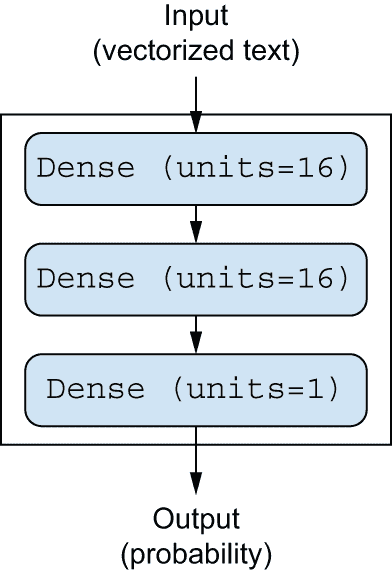
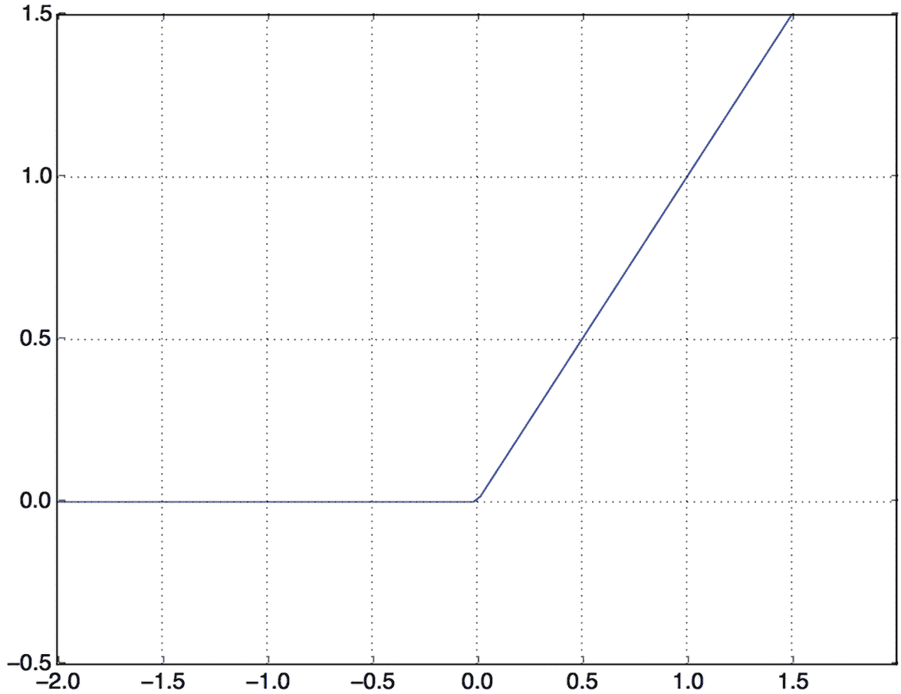
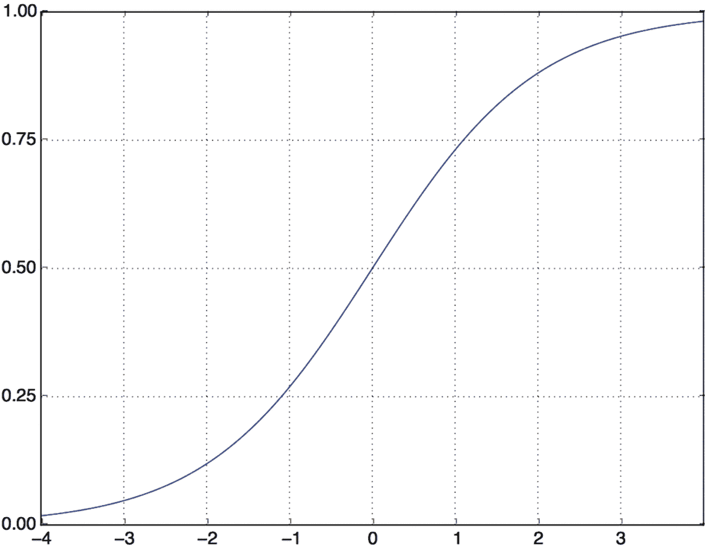
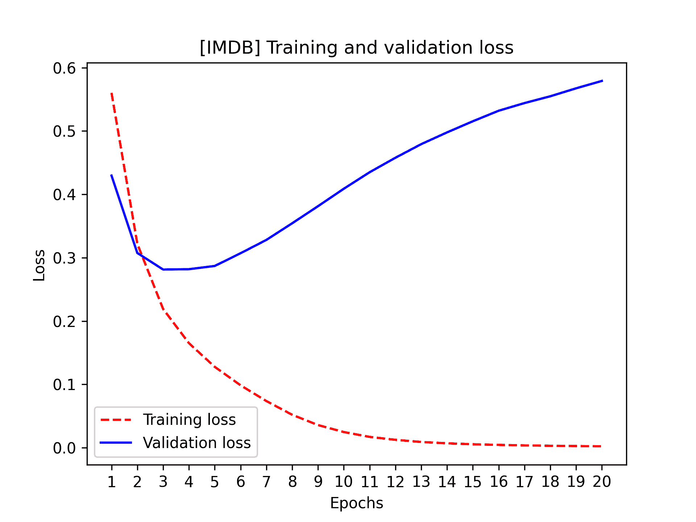
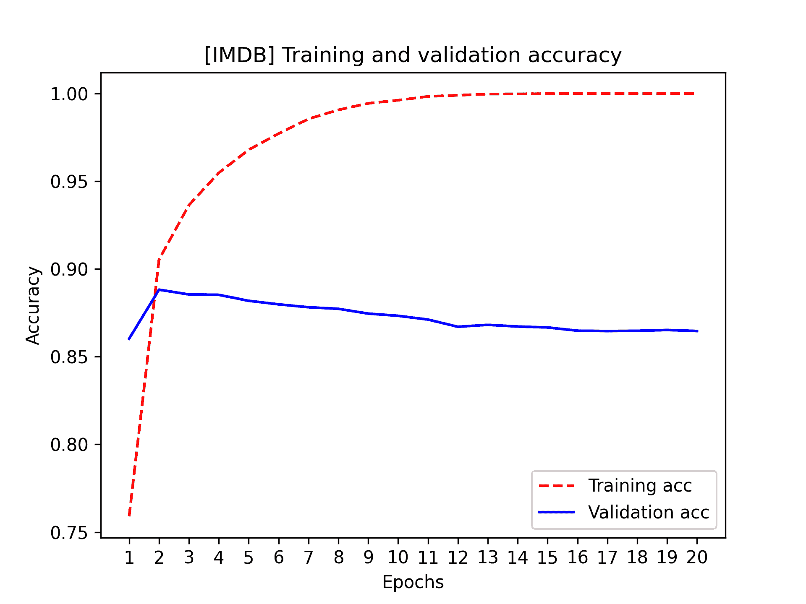
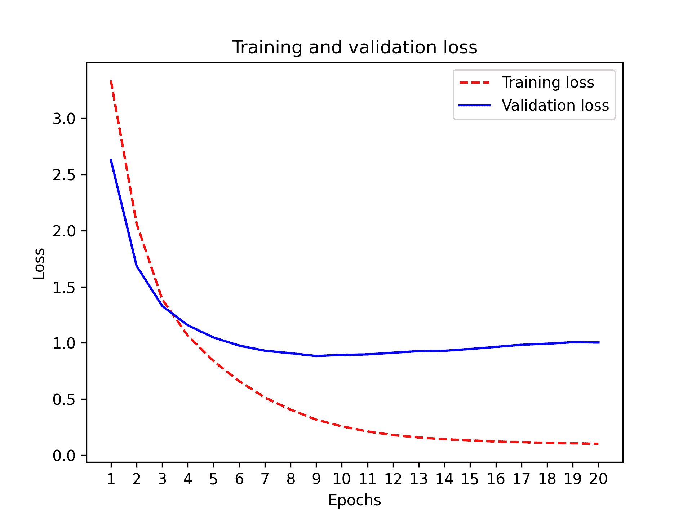
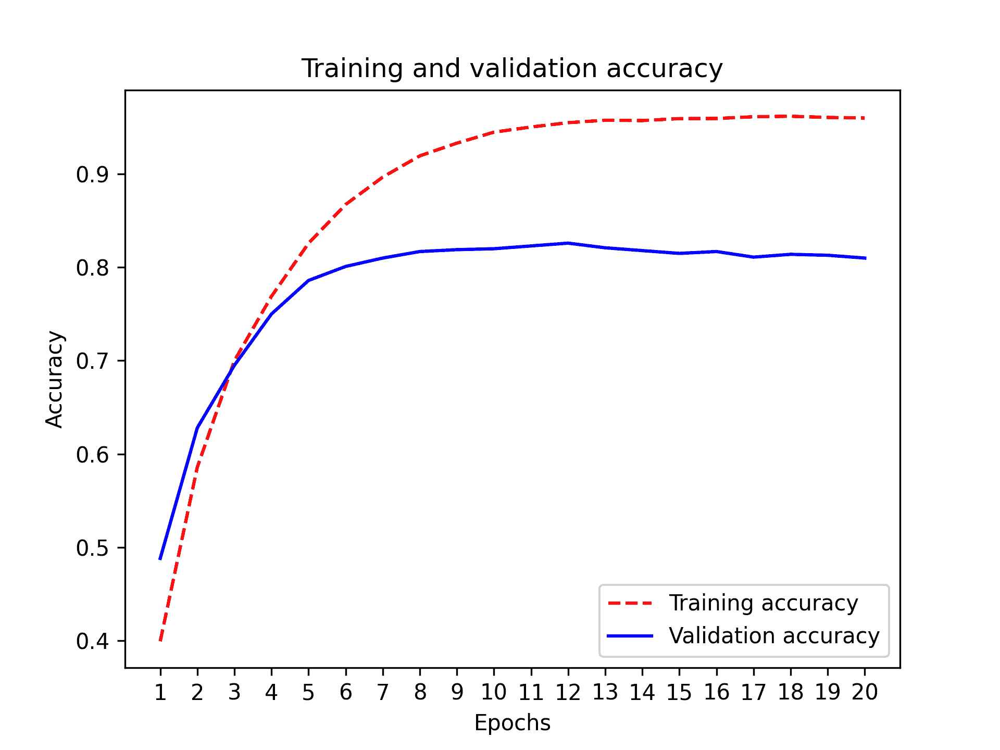
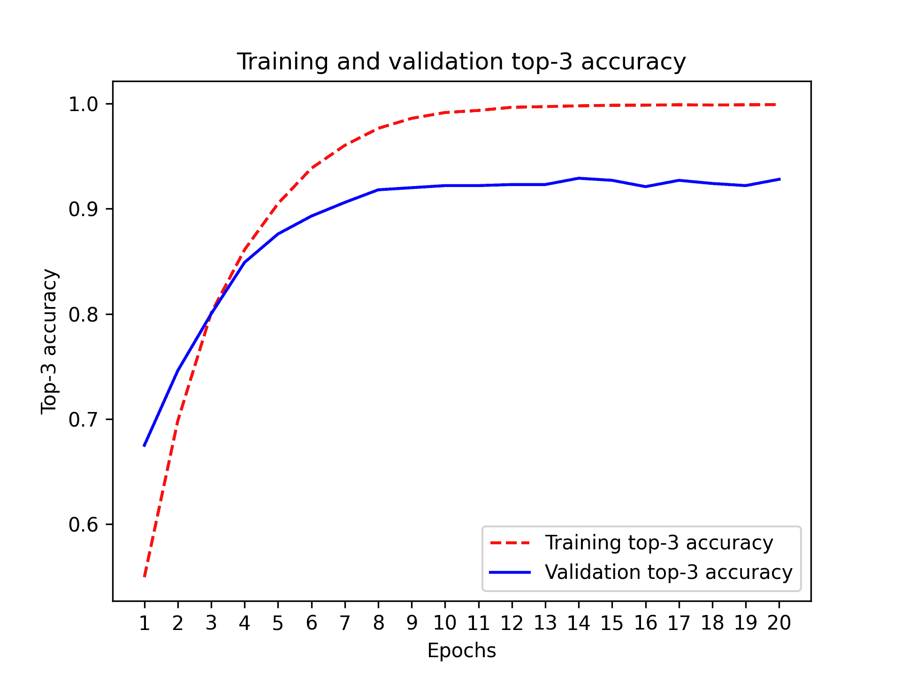
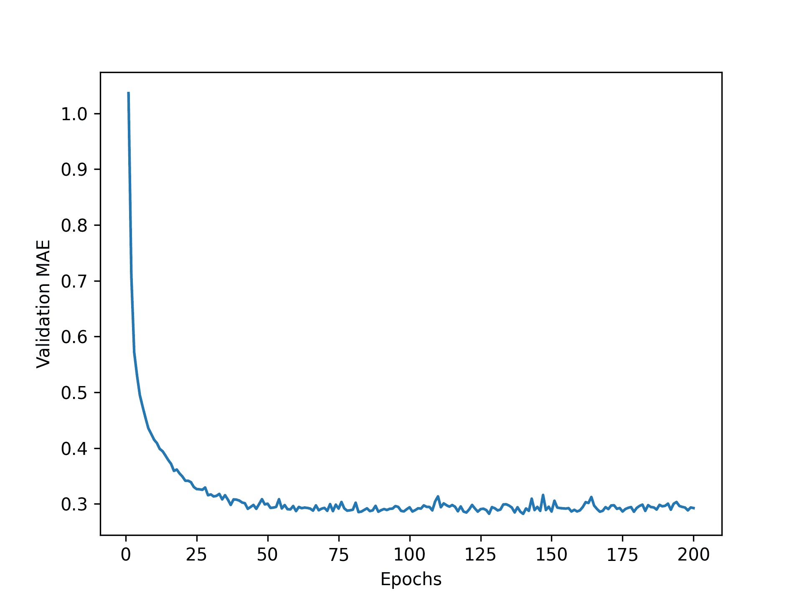
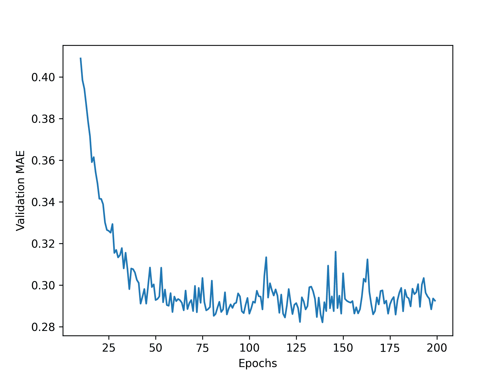

# 第四章：分类和回归

> 原文：[`deeplearningwithpython.io/chapters/chapter04_classification-and-regression`](https://deeplearningwithpython.io/chapters/chapter04_classification-and-regression)

这章旨在帮助你开始使用神经网络解决实际问题。你将巩固从第二章和第三章中获得的知识，并将所学应用到三个新的任务中，涵盖神经网络最常见的三个用例——二元分类、分类分类和标量回归：

+   将电影评论分类为正面或负面（二元分类）

+   根据主题对新闻通讯进行分类（分类分类）

+   根据房地产数据估算房屋价格（标量回归）

这些示例将是你第一次接触端到端机器学习工作流程：你将了解数据预处理、基本模型架构原则以及模型评估。

到本章结束时，你将能够使用神经网络处理简单的基于向量数据的分类和回归任务。然后你将准备好开始在第五章中构建一个更原则性、理论驱动的机器学习理解。

## 对电影评论进行分类：一个二分类示例

二分类，或称为二元分类，是机器学习中最常见的类型之一。在这个例子中，你将学习如何根据评论的文本内容将电影评论分类为正面或负面。

### IMDb 数据集

你将使用 IMDb 数据集：来自互联网电影数据库的 50,000 条高度两极化的评论。它们被分为 25,000 条用于训练和 25,000 条用于测试，每个集合包含 50% 的负面评论和 50% 的正面评论。

就像 MNIST 数据集一样，IMDb 数据集已经打包在 Keras 中。它已经被预处理过：评论（单词序列）已经被转换成整数序列，其中每个整数代表字典中的一个特定单词。这使得我们能够专注于模型构建、训练和评估。在第十四章中，你将学习如何从头开始处理原始文本输入。

以下代码将加载数据集（当你第一次运行时，大约 80 MB 的数据将被下载到你的机器上）。

```py
from keras.datasets import imdb

(train_data, train_labels), (test_data, test_labels) = imdb.load_data(
    num_words=10000
) 
```

列表 4.1：加载 IMDb 数据集

参数 `num_words=10000` 的意思是，你将只保留训练数据中频率最高的前 10,000 个单词。不常见的单词将被丢弃。这允许你处理可管理的向量数据。如果我们没有设置这个限制，我们将在训练数据中处理 88,585 个独特的单词，这是不必要的大的。其中许多单词只出现在单个样本中，因此不能有意义地用于分类。

变量`train_data`和`test_data`是评论的 NumPy 数组；每个评论是一系列单词索引（编码单词序列）。`train_labels`和`test_labels`是 0s 和 1s 的 NumPy 数组，其中 0 代表*负面*，1 代表*正面*：

```py
>>> train_data[0]
[1, 14, 22, 16, ... 178, 32]
>>> train_labels[0]
1
```

由于你将自己限制在频率最高的前 10,000 个单词上，没有单词索引会超过 10,000：

```py
>>> max([max(sequence) for sequence in train_data])
9999
```

为了好玩，让我们快速解码其中一个评论回英文单词。

```py
# word_index is a dictionary mapping words to an integer index.
word_index = imdb.get_word_index()
# Reverses it, mapping integer indices to words
reverse_word_index = dict([(value, key) for (key, value) in word_index.items()])
# Decodes the review. Note that the indices are offset by 3 because 0,
# 1, and 2 are reserved indices for "padding," "start of sequence," and
# "unknown."
decoded_review = " ".join(
    [reverse_word_index.get(i - 3, "?") for i in train_data[0]]
) 
```

列表 4.2：将评论解码回文本

让我们看看我们得到了什么：

```py
>>> decoded_review[:100]
? this film was just brilliant casting location scenery story direction everyone
```

注意，前面的`?`对应于被添加到每个评论前的起始标记。

### 准备数据

你不能直接将整数列表输入到神经网络中。它们的长度各不相同，而神经网络期望处理连续的数据批次。你必须将你的列表转换为张量。有两种方法可以做到这一点：

+   将你的列表填充到相同的长度，然后将其转换为形状为`(samples, max_length)`的整数张量，然后以一个能够处理此类整数张量的层（`Embedding`层，我们将在本书的后面详细讨论）开始你的模型。

+   *多热编码*你的列表，将它们转换为反映所有可能单词存在或不存在情况的 0s 和 1s 的向量。这意味着，例如，将序列 `[8, 5]` 转换为一个 10,000 维度的向量，除了索引 5 和 8 之外的所有位置都是 0s，而这两个索引位置是 1s。

让我们选择后者来矢量化数据。当手动完成时，过程如下所示。

```py
import numpy as np

def multi_hot_encode(sequences, num_classes):
    # Creates an all-zero matrix of shape (len(sequences), num_classes)
    results = np.zeros((len(sequences), num_classes))
    for i, sequence in enumerate(sequences):
        # Sets specific indices of results[i] to 1s
        results[i][sequence] = 1.0
    return results

# Vectorized training data
x_train = multi_hot_encode(train_data, num_classes=10000)
# Vectorized test data
x_test = multi_hot_encode(test_data, num_classes=10000) 
```

列表 4.3：通过多热编码对整数序列进行编码

现在样本看起来是这样的：

```py
>>> x_train[0]
array([ 0.,  1.,  1., ...,  0.,  0.,  0.])
```

除了矢量化输入序列外，你还应该矢量化它们的标签，这很简单。我们的标签已经是 NumPy 数组，所以只需将类型从 int 转换为 float：

```py
y_train = train_labels.astype("float32")
y_test = test_labels.astype("float32") 
```

现在，数据已经准备好输入到神经网络中。

### 构建你的模型

输入数据是向量，标签是标量（1s 和 0s）：这是你将遇到的简单问题设置之一。在这样一个问题上表现良好的模型类型是带有`relu`激活的密集连接（`Dense`）层的简单堆叠。

在这样一个`Dense`层堆叠中，有两个关键架构决策需要做出：

+   使用多少层

+   每层选择多少个单元

在第五章中，你将学习正式原则来指导你做出这些选择。目前，你必须相信我们以下架构选择：

+   两个中间层，每个层有 16 个单元

+   第三层将输出关于当前评论情感的标量预测

图 4.1 显示了模型的外观。这是 Keras 实现，类似于你之前看到的 MNIST 示例。

```py
import keras
from keras import layers

model = keras.Sequential(
    [
        layers.Dense(16, activation="relu"),
        layers.Dense(16, activation="relu"),
        layers.Dense(1, activation="sigmoid"),
    ]
) 
```

列表 4.4：模型定义



图 4.1：三层模型

传递给每个`Dense`层的第一个参数是该层的*单元*数量：该层的表示空间维度。你从第二章和第三章中记得，每个这样的`Dense`层使用`relu`激活函数实现以下链式张量操作：

```py
output = relu(dot(input, W) + b) 
```

有 16 个单元意味着权重矩阵`W`的形状将是`(input_dimension, 16)`：输入数据与`W`的点积将把输入数据投影到 16 维表示空间（然后你会添加偏置向量`b`并应用`relu`操作）。你可以直观地理解你的表示空间的维度为“你在模型学习内部表示时允许多少自由度。”拥有更多的单元（更高维的表示空间）允许你的模型学习更复杂的表示，但它会使模型计算成本更高，并可能导致学习到不希望的模式（这些模式会在训练数据上提高性能，但在测试数据上不会）。

中间层使用`relu`作为它们的激活函数，而最后一层使用 sigmoid 激活来输出一个概率（一个介于 0 和 1 之间的分数，表示评论可能是正面的可能性）。`relu`（修正线性单元）是一个旨在将负值置零的函数（见图 4.2），而 sigmoid 函数“压缩”任意值到`[0, 1]`区间（见图 4.3），输出可以解释为概率的东西。



图 4.2：修正线性单元函数



图 4.3：sigmoid 函数

最后，你需要选择一个损失函数和一个优化器。因为你面临的是一个二元分类问题，并且你的模型输出是一个概率（你的模型以一个具有 sigmoid 激活的单单元层结束），最好使用`binary_crossentropy`损失。这不是唯一可行的选择：例如，你可以使用`mean_squared_error`。但是，当处理输出概率的模型时，交叉熵通常是最佳选择。*交叉熵*是信息论领域的一个量，它衡量概率分布之间的距离，在这种情况下，是真实分布和你的预测之间的距离。

关于优化器的选择，我们将采用`adam`，这对于几乎任何问题来说通常都是一个很好的默认选择。

这里是配置模型使用`adam`优化器和`binary_crossentropy`损失函数的步骤。请注意，你将在训练过程中监控准确度。

```py
model.compile(
    optimizer="adam",
    loss="binary_crossentropy",
    metrics=["accuracy"],
) 
```

列表 4.5：编译模型

### 验证你的方法

正如您在第三章中学到的，深度学习模型永远不应该在其训练数据上评估——使用“验证集”来监控模型在训练期间的准确率是标准做法。在这里，您将通过从原始训练数据中分出 10,000 个样本来创建一个验证集。

您可能会问，为什么不简单地使用 *测试* 数据来评估模型？这似乎会更容易。原因是您将想要使用在验证集上得到的结果来指导您下一步的选择以改进训练——例如，您选择使用什么模型大小或训练多少个周期。当您开始这样做时，您的验证分数就不再准确反映模型在全新数据上的性能，因为模型已经被故意修改以在验证数据上表现更好。保留一组从未见过的新样本以完全无偏见地执行最终评估回合是很好的，这正是测试集的作用。我们将在下一章中更多地讨论这一点。

```py
x_val = x_train[:10000]
partial_x_train = x_train[10000:]
y_val = y_train[:10000]
partial_y_train = y_train[10000:] 
```

列表 4.6：设置验证集

现在，您将使用 20 个周期（在训练数据中的所有样本上迭代 20 次）来训练模型，每次批处理 512 个样本。同时，您将监控您分出的 10,000 个样本的损失和准确率。您可以通过将验证数据作为 `validation_data` 参数传递给 `model.fit()` 来做到这一点。

```py
history = model.fit(
    partial_x_train,
    partial_y_train,
    epochs=20,
    batch_size=512,
    validation_data=(x_val, y_val),
) 
```

列表 4.7：训练您的模型

在 CPU 上，这将在每个周期中花费不到 2 秒——训练在 20 秒内完成。在每个周期的末尾，当模型在验证数据的 10,000 个样本上计算其损失和准确率时，会有轻微的暂停。

注意，`model.fit()` 的调用返回一个 `History` 对象，正如您在第三章中看到的。该对象有一个 `history` 成员，它是一个字典，包含有关训练期间发生的一切的数据。让我们来看看它：

```py
>>> history_dict = history.history
>>> history_dict.keys()
dict_keys(["accuracy", "loss", "val_accuracy", "val_loss"])
```

该字典包含四个条目：每个条目对应于训练期间和验证期间被监控的指标。在接下来的两个列表中，我们将使用 Matplotlib 并排绘制训练和验证损失（见图 4.4），以及训练和验证准确率（见图 4.5）。请注意，由于您自己的模型随机初始化不同，您自己的结果可能会有所不同。

```py
import matplotlib.pyplot as plt

history_dict = history.history
loss_values = history_dict["loss"]
val_loss_values = history_dict["val_loss"]
epochs = range(1, len(loss_values) + 1)
# "r--" is for "dashed red line."
plt.plot(epochs, loss_values, "r--", label="Training loss")
# "b" is for "solid blue line."
plt.plot(epochs, val_loss_values, "b", label="Validation loss")
plt.title("[IMDB] Training and validation loss")
plt.xlabel("Epochs")
plt.xticks(epochs)
plt.ylabel("Loss")
plt.legend()
plt.show() 
```

列表 4.8：绘制训练和验证损失



图 4.4：训练和验证损失

```py
# Clears the figure
plt.clf()
acc = history_dict["accuracy"]
val_acc = history_dict["val_accuracy"]
plt.plot(epochs, acc, "r--", label="Training acc")
plt.plot(epochs, val_acc, "b", label="Validation acc")
plt.title("[IMDB] Training and validation accuracy")
plt.xlabel("Epochs")
plt.xticks(epochs)
plt.ylabel("Accuracy")
plt.legend()
plt.show() 
```

列表 4.9：绘制训练和验证准确率



图 4.5：训练和验证准确率

如你所见，随着每个 epoch 的进行，训练损失减少，训练准确率提高。当你运行梯度下降优化时，你应该期望看到这种情况——你试图最小化的量应该随着每次迭代而减少。但是，验证损失和准确率并不是这样：它们似乎在第 4 个 epoch 达到峰值。这是我们之前警告过的一个例子：在训练数据上表现更好的模型并不一定会在之前未见过的数据上表现更好。精确地说，你所看到的是*过拟合*：在第 4 个 epoch 之后，你对训练数据进行了过度优化，最终学习到的表示只针对训练数据，不能推广到训练集之外的数据。

在这种情况下，为了防止过拟合，你可以在四个 epoch 后停止训练。一般来说，你可以使用一系列技术来减轻过拟合，我们将在第五章中介绍这些技术。

让我们从零开始训练一个新的模型四个 epoch，然后对测试数据进行评估。

```py
model = keras.Sequential(
    [
        layers.Dense(16, activation="relu"),
        layers.Dense(16, activation="relu"),
        layers.Dense(1, activation="sigmoid"),
    ]
)
model.compile(
    optimizer="adam",
    loss="binary_crossentropy",
    metrics=["accuracy"],
)
model.fit(x_train, y_train, epochs=4, batch_size=512)
results = model.evaluate(x_test, y_test) 
```

列表 4.10：对模型进行四个 epoch 的训练

最终结果如下：

```py
>>> results
# The first number, 0.29, is the test loss, and the second number,
# 0.88, is the test accuracy.
[0.2929924130630493, 0.88327999999999995]
```

这种相当简单的方法达到了 88%的准确率。使用最先进的方法，你应该能够接近 95%。

### 使用训练好的模型对新数据进行预测

在训练好一个模型后，你可能会想在实际环境中使用它。你可以通过使用第三章中学到的`predict`方法来生成评论为正面的可能性：

```py
>>> model.predict(x_test)
array([[ 0.98006207]
       [ 0.99758697]
       [ 0.99975556]
       ...,
       [ 0.82167041]
       [ 0.02885115]
       [ 0.65371346]], dtype=float32)
```

如你所见，对于某些样本（0.99 或更多，或 0.01 或更少），模型很有信心，但对于其他样本（0.6，0.4）则不太自信。

### 进一步实验

以下实验将帮助你相信你所做的架构选择都是相当合理的，尽管仍有改进的空间：

+   在最终分类层之前，你使用了两个表示层。尝试使用一个或三个表示层，看看这样做如何影响验证和测试准确率。

+   尝试使用具有更多或更少单元的层：32 个单元，64 个单元，依此类推。

+   尝试使用`mean_squared_error`损失函数代替`binary_crossentropy`。

+   尝试使用`tanh`激活（在神经网络早期很受欢迎的激活函数）代替`relu`。

### 总结

从这个例子中，你应该吸取以下教训：

+   你通常需要对原始数据进行相当多的预处理，以便将其作为张量输入到神经网络中。单词序列可以编码为二进制向量，但还有其他编码选项。

+   带有`relu`激活的`Dense`层堆叠可以解决广泛的问题（包括情感分类），你将经常使用它们。

+   在二元分类问题（两个输出类别）中，你的模型应该以一个具有一个单元和`sigmoid`激活的`Dense`层结束：你的模型输出应该是一个介于 0 和 1 之间的标量，表示一个概率。

+   在二元分类问题上使用这样的标量 sigmoid 输出时，你应该使用的损失函数是`binary_crossentropy`。

+   `adam`优化器通常是一个足够好的选择，无论你的问题是什么。这样你就少了一件需要担心的事情。

+   随着神经网络在训练数据上的表现越来越好，它们最终开始过拟合，并在之前从未见过的数据上获得越来越差的结果。务必始终监控训练集之外的数据的性能！

## 新闻稿分类：多类分类示例

在上一节中，你看到了如何使用密集连接神经网络将向量输入分类到两个互斥的类别。但是，当你有超过两个类别时会发生什么呢？

在本节中，你将构建一个模型，将路透社新闻稿分类到 46 个互斥的主题中。因为你有很多类别，这个问题是一个多类分类的实例，而且由于每个数据点应该只被分类到单个类别，所以这个问题更具体地是一个单标签多类分类的实例。如果你每个数据点可以属于多个类别（在这种情况下，主题），你将面临一个多标签多类分类的问题。

### 路透社数据集

你将使用路透社数据集，这是一组由路透社在 1986 年发布的简短新闻稿及其主题。它是一个简单且广泛使用的文本分类玩具数据集。共有 46 个不同的主题；有些主题比其他主题更常见，但每个主题在训练集中至少有 10 个示例。

就像 IMDb 和 MNIST 一样，路透社数据集是 Keras 的一部分。让我们看看。

```py
from keras.datasets import reuters

(train_data, train_labels), (test_data, test_labels) = reuters.load_data(
    num_words=10000
) 
```

列表 4.11：加载路透社数据集

就像 IMDb 数据集一样，`num_words=10000`参数限制了数据只包含在数据中出现频率最高的 10,000 个单词。

你有 8,982 个训练示例和 2,246 个测试示例：

```py
>>> len(train_data)
8982
>>> len(test_data)
2246
```

就像 IMDb 评论一样，每个示例都是一个整数列表（单词索引）：

```py
>>> train_data[10]
[1, 245, 273, 207, 156, 53, 74, 160, 26, 14, 46, 296, 26, 39, 74, 2979,
3554, 14, 46, 4689, 4329, 86, 61, 3499, 4795, 14, 61, 451, 4329, 17, 12]
```

这里是如何将其解码回单词的，以防你感兴趣。

```py
word_index = reuters.get_word_index()
reverse_word_index = dict([(value, key) for (key, value) in word_index.items()])
decoded_newswire = " ".join(
    # The indices are offset by 3 because 0, 1, and 2 are reserved
    # indices for "padding," "start of sequence," and "unknown."
    [reverse_word_index.get(i - 3, "?") for i in train_data[10]]
) 
```

列表 4.12：将新闻稿解码回文本

与示例相关的标签是一个介于 0 到 45 之间的整数——一个主题索引：

```py
>>> train_labels[10]
3
```

### 数据准备

你可以使用与上一个示例完全相同的代码来向量化数据。

```py
# Vectorized training data
x_train = multi_hot_encode(train_data, num_classes=10000)
# Vectorized test data
x_test = multi_hot_encode(test_data, num_classes=10000) 
```

列表 4.13：编码输入数据

为了向量化标签，有两种可能性：你可以保持标签不变作为整数，或者你可以使用 *one-hot encoding*。One-hot encoding 是一种广泛使用的分类数据格式，也称为 *分类编码*。在这种情况下，标签的 one-hot encoding 是将每个标签嵌入为一个全零向量，标签索引的位置为 1。以下是一个示例。

```py
def one_hot_encode(labels, num_classes=46):
    results = np.zeros((len(labels), num_classes))
    for i, label in enumerate(labels):
        results[i, label] = 1.0
    return results

# Vectorized training labels
y_train = one_hot_encode(train_labels)
# Vectorized test labels
y_test = one_hot_encode(test_labels) 
```

列表 4.14：编码标签

注意，在 Keras 中有内置的方式来完成这个操作：

```py
from keras.utils import to_categorical

y_train = to_categorical(train_labels)
y_test = to_categorical(test_labels) 
```

### 构建你的模型

这个主题分类问题看起来与先前的电影评论分类问题相似：在两种情况下，你都在尝试对短文本片段进行分类。但这里有一个新的约束：输出类别的数量从 2 增加到 46。输出空间的维度要大得多。

在像你一直在使用的 `Dense` 层堆叠中，每一层只能访问前一层输出的信息。如果一个层丢失了与分类问题相关的某些信息，这些信息将永远无法被后续层恢复：每一层都可能成为一个信息瓶颈。在先前的例子中，你使用了 16 维的中间层，但 16 维的空间可能太小，无法学习区分 46 个不同的类别：这样的小层可能充当信息瓶颈，永久性地丢失相关信息。

因此，你会使用更大的中间层。让我们使用 64 个单位。

```py
model = keras.Sequential(
    [
        layers.Dense(64, activation="relu"),
        layers.Dense(64, activation="relu"),
        layers.Dense(46, activation="softmax"),
    ]
) 
```

列表 4.15：模型定义

关于这个架构，还有两件事你应该注意：

+   你以一个大小为 46 的 `Dense` 层结束模型。这意味着对于每个输入样本，网络将输出一个 46 维的向量。这个向量中的每个条目（每个维度）将编码一个不同的输出类别。

+   最后一层使用 `softmax` 激活函数。你在 MNIST 示例中见过这种模式。这意味着模型将在 46 个不同的输出类别上输出一个 *概率分布* —— 对于每个输入样本，模型将产生一个 46 维的输出向量，其中 `output[i]` 是样本属于类别 `i` 的概率。这 46 个分数加起来等于 1。

在这个情况下，最佳损失函数是 `categorical_crossentropy`。它衡量两个概率分布之间的距离——在这里，是模型输出的概率分布和标签真实分布之间的距离。通过最小化这两个分布之间的距离，你训练模型输出尽可能接近真实标签的内容。

和上次一样，我们也会监控准确率。然而，在这个案例中，准确率是一个相当粗略的指标：如果模型对一个样本的第二选择是正确的类别，而第一个选择是错误的，那么模型在这个样本上的准确率仍然是零——即使这样的模型会比随机猜测好得多。在这种情况下，一个更细致的指标是 top-k 准确率，比如 top-3 或 top-5 准确率。它衡量正确的类别是否在模型的 top-k 预测中。让我们将 top-3 准确率添加到我们的模型中。

```py
top_3_accuracy = keras.metrics.TopKCategoricalAccuracy(
    k=3, name="top_3_accuracy"
)
model.compile(
    optimizer="adam",
    loss="categorical_crossentropy",
    metrics=["accuracy", top_3_accuracy],
) 
```

代码列表 4.16：编译模型

### 验证你的方法

让我们在训练数据中留出 1,000 个样本作为验证集。

```py
x_val = x_train[:1000]
partial_x_train = x_train[1000:]
y_val = y_train[:1000]
partial_y_train = y_train[1000:] 
```

代码列表 4.17：留出验证集

现在，让我们训练模型 20 个周期。

```py
history = model.fit(
    partial_x_train,
    partial_y_train,
    epochs=20,
    batch_size=512,
    validation_data=(x_val, y_val),
) 
```

代码列表 4.18：训练模型

最后，让我们显示其损失和准确率曲线（见图 4.6 和 4.7）。

```py
loss = history.history["loss"]
val_loss = history.history["val_loss"]
epochs = range(1, len(loss) + 1)
plt.plot(epochs, loss, "r--", label="Training loss")
plt.plot(epochs, val_loss, "b", label="Validation loss")
plt.title("Training and validation loss")
plt.xlabel("Epochs")
plt.xticks(epochs)
plt.ylabel("Loss")
plt.legend()
plt.show() 
```

代码列表 4.19：绘制训练和验证损失



图 4.6：训练和验证损失

```py
plt.clf()
acc = history.history["accuracy"]
val_acc = history.history["val_accuracy"]
plt.plot(epochs, acc, "r--", label="Training accuracy")
plt.plot(epochs, val_acc, "b", label="Validation accuracy")
plt.title("Training and validation accuracy")
plt.xlabel("Epochs")
plt.xticks(epochs)
plt.ylabel("Accuracy")
plt.legend()
plt.show() 
```

代码列表 4.20：绘制训练和验证 top-3 准确率



图 4.7：训练和验证准确率

```py
plt.clf()
acc = history.history["top_3_accuracy"]
val_acc = history.history["val_top_3_accuracy"]
plt.plot(epochs, acc, "r--", label="Training top-3 accuracy")
plt.plot(epochs, val_acc, "b", label="Validation top-3 accuracy")
plt.title("Training and validation top-3 accuracy")
plt.xlabel("Epochs")
plt.xticks(epochs)
plt.ylabel("Top-3 accuracy")
plt.legend()
plt.show() 
```

代码列表 4.21：绘制训练和验证 top-3 准确率



图 4.8：训练和验证准确率

模型在第九个周期后开始过拟合。让我们从头开始训练一个新的模型九个周期，然后在测试集上评估它。

```py
model = keras.Sequential(
    [
        layers.Dense(64, activation="relu"),
        layers.Dense(64, activation="relu"),
        layers.Dense(46, activation="softmax"),
    ]
)
model.compile(
    optimizer="adam",
    loss="categorical_crossentropy",
    metrics=["accuracy"],
)
model.fit(
    x_train,
    y_train,
    epochs=9,
    batch_size=512,
)
results = model.evaluate(x_test, y_test) 
```

代码列表 4.22：从头开始重新训练模型

这里是最终结果：

```py
>>> results
[0.9565213431445807, 0.79697239536954589]
```

这种方法达到了大约 80% 的准确率。对于一个平衡的二分类问题，纯随机分类器达到的准确率将是 50%。但在这个案例中，我们有 46 个类别，它们可能并不均衡地被表示。随机基线的准确率会是多少？我们可以快速实现一个来验证这一点：

```py
>>> import copy
>>> test_labels_copy = copy.copy(test_labels)
>>> np.random.shuffle(test_labels_copy)
>>> hits_array = np.array(test_labels == test_labels_copy)
>>> hits_array.mean()
0.18655387355298308
```

如您所见，一个随机分类器的大约分类准确率为 19%，因此从这个角度看，我们模型的成果看起来相当不错。

### 在新数据上生成预测

在新样本上调用模型的 `predict` 方法返回每个样本对所有 46 个主题的类别概率分布。让我们为所有测试数据生成主题预测：

```py
predictions = model.predict(x_test) 
```

“预测”中的每个条目都是一个长度为 46 的向量：

```py
>>> predictions[0].shape
(46,)
```

这个向量中的系数之和为 1，因为它们形成了一个概率分布：

```py
>>> np.sum(predictions[0])
1.0
```

最大的条目是预测的类别——概率最高的类别：

```py
>>> np.argmax(predictions[0])
4
```

### 处理标签和损失的不同方法

我们之前提到，另一种编码标签的方法是保持它们不变，作为整数张量，如下所示：

```py
y_train = train_labels
y_test = test_labels 
```

这种方法唯一改变的是损失函数的选择。列表 4.22 中使用的损失函数`categorical_crossentropy`期望标签遵循分类编码。对于整数标签，您应使用`sparse_categorical_crossentropy`：

```py
model.compile(
    optimizer="adam",
    loss="sparse_categorical_crossentropy",
    metrics=["accuracy"],
) 
```

这个新的损失函数在数学上仍然与`categorical_crossentropy`相同；它只是有一个不同的接口。

### 拥有足够大的中间层的重要性

我们之前提到，由于最终输出是 46 维的，您应该避免具有少于 46 个单位的中间层。现在让我们看看当您通过具有显著小于 46 维的中间层引入信息瓶颈时会发生什么：例如，4 维。

```py
model = keras.Sequential(
    [
        layers.Dense(64, activation="relu"),
        layers.Dense(4, activation="relu"),
        layers.Dense(46, activation="softmax"),
    ]
)
model.compile(
    optimizer="adam",
    loss="categorical_crossentropy",
    metrics=["accuracy"],
)
model.fit(
    partial_x_train,
    partial_y_train,
    epochs=20,
    batch_size=128,
    validation_data=(x_val, y_val),
) 
```

列表 4.23：具有信息瓶颈的模型

模型现在在约 71%的验证准确率处达到峰值，下降了 8%。这种下降主要是由于您试图将大量信息（足够的信息来恢复 46 个类的分离超平面）压缩到一个维度太低的中间空间。模型能够将这些必要信息中的*大部分*压缩到这些 4 维表示中，但并非全部。

### 进一步实验

与前一个示例类似，我们鼓励您尝试以下实验，以训练您对这些模型必须做出的配置决策的直觉：

+   尝试使用更大或更小的层：32 个单位，128 个单位，等等。

+   您在最终的 softmax 分类层之前使用了两个中间层。现在尝试使用一个中间层，或者三个中间层。

### 总结

您应该从这个示例中吸取以下教训：

+   如果您试图在*N*个类别中分类数据点，您的模型应以大小为*N*的`Dense`层结束。

+   在单标签多类分类问题中，您的模型应以`softmax`激活结束，以便它将输出一个关于*N*个输出类别的概率分布。

+   分类交叉熵几乎总是您应该用于此类问题的损失函数。它最小化模型输出的概率分布与目标真实分布之间的距离。

+   在多类分类中处理标签有两种方法：

    +   通过分类编码（也称为独热编码）对标签进行编码，并使用`categorical_crossentropy`作为损失函数

    +   将标签编码为整数并使用`sparse_categorical_crossentropy`损失函数

+   如果您需要将数据分类到大量类别中，您应该避免由于中间层太小而在模型中创建信息瓶颈。

## 预测房价：回归示例

前两个例子被认为是分类问题，目标是预测输入数据点的单个离散标签。另一种常见的机器学习问题是 *回归*，它由预测连续值而不是离散标签组成：例如，根据气象数据预测明天的温度，或者根据软件项目的规格预测完成项目所需的时间。

### 加利福尼亚房价数据集

您将尝试根据 1990 年人口普查的数据预测加利福尼亚不同地区的房屋中位数价格。

数据集中的每个数据点代表一个“街区组”的信息，这是一个位于同一区域的住宅群组。您可以将其视为一个区域。这个数据集有两个版本，一个是只有 600 个区域的“小”版本，另一个是包含 20,640 个区域的“大”版本。让我们使用小版本，因为现实世界的数据集通常可能非常小，您需要知道如何处理这种情况。

对于每个区域，我们知道

+   该区域大约地理中心的经纬度。

+   该区域房屋的中位数年龄。

+   该区域的人口。这些区域相当小：平均人口为 1,425.5。

+   家庭总数。

+   这些家庭的中位数收入。

+   该区域所有房屋的总房间数。这通常在几千以下。

+   该区域卧室总数。

总共有八个变量（经纬度算作两个变量）。目标是使用这些变量来预测该区域房屋的中位数价格。让我们通过加载数据开始吧。

```py
from keras.datasets import california_housing

# Make sure to pass version="small" to get the right dataset.
(train_data, train_targets), (test_data, test_targets) = (
    california_housing.load_data(version="small")
) 
```

列表 4.24：加载加利福尼亚房价数据集

让我们看看数据：

```py
>>> train_data.shape
(480, 8)
>>> test_data.shape
(120, 8)
```

如您所见，我们有 480 个训练样本和 120 个测试样本，每个样本包含 8 个数值特征。目标是预测该区域考虑的房屋的中位数价格，单位为美元：

```py
>>> train_targets
array([252300., 146900., 290900., ..., 140500., 217100.],
      dtype=float32)
```

价格在 60,000 美元到 500,000 美元之间。如果听起来很便宜，请记住这是在 1990 年，这些价格没有考虑通货膨胀。

### 准备数据

将所有范围差异很大的值输入神经网络可能会出现问题。模型可能能够自动适应这种异构数据，但这肯定会使学习更加困难。处理此类数据的一个普遍最佳实践是进行特征归一化：对于输入数据中的每个特征（输入数据矩阵中的一列），您从特征的平均值中减去，然后除以标准差，这样特征就围绕 0 对齐，并且具有单位标准差。这可以在 NumPy 中轻松完成。

```py
mean = train_data.mean(axis=0)
std = train_data.std(axis=0)
x_train = (train_data - mean) / std
x_test = (test_data - mean) / std 
```

列表 4.25：数据归一化

注意，用于归一化测试数据的量是通过训练数据计算的。你永远不应该在你的工作流程中使用在测试数据上计算的任何量，即使是像数据归一化这样简单的事情。

此外，我们还应该缩放目标值。我们的归一化输入值在一个接近 0 的小范围内，我们的模型权重是用小的随机值初始化的。这意味着当我们开始训练时，我们的模型预测也将是小的值。如果目标值在 60,000–500,000 的范围内，模型将需要非常大的权重值来输出这些值。使用小的学习率，到达那里将需要非常长的时间。最简单的修复方法是除以所有目标值 100,000，这样最小的目标值变为 0.6，最大的变为 5。然后我们可以通过相应地乘以 100,000 将模型的预测值转换回美元值。

```py
y_train = train_targets / 100000
y_test = test_targets / 100000 
```

列表 4.26：缩放目标值

### 构建你的模型

由于可用的样本非常少，你将使用一个非常小的模型，包含两个中间层，每个层有 64 个单元。一般来说，你拥有的训练数据越少，过拟合的风险就越大，使用小模型是减轻过拟合的一种方法。

```py
def get_model():
    # Because you need to instantiate the same model multiple times,
    # you use a function to construct it.
    model = keras.Sequential(
        [
            layers.Dense(64, activation="relu"),
            layers.Dense(64, activation="relu"),
            layers.Dense(1),
        ]
    )
    model.compile(
        optimizer="adam",
        loss="mean_squared_error",
        metrics=["mean_absolute_error"],
    )
    return model 
```

列表 4.27：模型定义

模型以单个单元和没有激活函数结束：它将是一个线性层。这是标量回归的典型设置——你试图预测一个单一连续值。应用激活函数会限制输出可以取的范围；例如，如果你在最后一层应用 `sigmoid` 激活函数，模型只能学习预测介于 0 和 1 之间的值。在这里，因为最后一层完全是线性的，模型可以自由地学习预测任何范围内的值。

注意，你使用 `mean_squared_error` 损失函数来编译模型——均方误差，预测值与目标值之间差异的平方。这是回归问题中广泛使用的损失函数。

你还正在监控训练过程中的一个新指标：*平均绝对误差*（MAE）。它是预测值与目标值之间差异的绝对值。例如，这个问题上的 MAE 为 0.5 意味着你的预测平均偏离目标值 50,000（记住目标缩放因子为 100,000）。

### 使用 K 折交叉验证来验证你的方法

当你调整模型的参数（如训练使用的 epoch 数量）时，评估你的模型，你可以将数据分成训练集和验证集，就像之前的例子中做的那样。但由于数据点很少，验证集最终会非常小（例如，大约 100 个示例）。结果，验证分数可能会根据你选择用于验证和训练的数据点而大幅变化：验证分数可能会与验证分割有很大的 *方差*。这会阻止你可靠地评估你的模型。

在这种情况下，最佳实践是使用 *K 折* 交叉验证（见图 4.9）。它包括将可用数据分成 *K* 个分区（通常 *K* = 4 或 5），实例化 *K* 个相同的模型，并在 *K* - 1 个分区上训练每个模型，同时在剩余的分区上进行评估。然后，用于模型的验证分数是获得的 *K* 个验证分数的平均值。从代码的角度来看，这是直截了当的。


图 4.9：三折交叉验证

```py
k = 4
num_val_samples = len(x_train) // k
num_epochs = 50
all_scores = []
for i in range(k):
    print(f"Processing fold #{i + 1}")
    # Prepares the validation data: data from partition #k
    fold_x_val = x_train[i * num_val_samples : (i + 1) * num_val_samples]
    fold_y_val = y_train[i * num_val_samples : (i + 1) * num_val_samples]
    # Prepares the training data: data from all other partitions
    fold_x_train = np.concatenate(
        [x_train[: i * num_val_samples], x_train[(i + 1) * num_val_samples :]],
        axis=0,
    )
    fold_y_train = np.concatenate(
        [y_train[: i * num_val_samples], y_train[(i + 1) * num_val_samples :]],
        axis=0,
    )
    # Builds the Keras model (already compiled)
    model = get_model()
    # Trains the model
    model.fit(
        fold_x_train,
        fold_y_train,
        epochs=num_epochs,
        batch_size=16,
        verbose=0,
    )
    # Evaluates the model on the validation data
    scores = model.evaluate(fold_x_val, fold_y_val, verbose=0)
    val_loss, val_mae = scores
    all_scores.append(val_mae) 
```

代码列表 4.28：K 折验证

使用 `num_epochs = 50` 运行此代码得到以下结果：

```py
>>> [round(value, 3) for value in all_scores]
[0.298, 0.349, 0.232, 0.305]
>>> round(np.mean(all_scores), 3)
0.296
```

不同的运行确实显示了有意义的不同的验证分数，从 0.232 到 0.349。平均数（0.296）比任何单个分数都更可靠——这正是 K 折交叉验证的全部意义。在这种情况下，平均误差为 $29,600，考虑到价格范围在 $60,000 到 $500,000 之间，这是一个显著的数值。

让我们尝试训练模型更长一些：200 个 epoch。为了记录模型在每个 epoch 的表现，你需要修改训练循环以保存每个 epoch 的验证分数日志。

```py
k = 4
num_val_samples = len(x_train) // k
num_epochs = 200
all_mae_histories = []
for i in range(k):
    print(f"Processing fold #{i + 1}")
    # Prepares the validation data: data from partition #k
    fold_x_val = x_train[i * num_val_samples : (i + 1) * num_val_samples]
    fold_y_val = y_train[i * num_val_samples : (i + 1) * num_val_samples]
    # Prepares the training data: data from all other partitions
    fold_x_train = np.concatenate(
        [x_train[: i * num_val_samples], x_train[(i + 1) * num_val_samples :]],
        axis=0,
    )
    fold_y_train = np.concatenate(
        [y_train[: i * num_val_samples], y_train[(i + 1) * num_val_samples :]],
        axis=0,
    )
    # Builds the Keras model (already compiled)
    model = get_model()
    # Trains the model
    history = model.fit(
        fold_x_train,
        fold_y_train,
        validation_data=(fold_x_val, fold_y_val),
        epochs=num_epochs,
        batch_size=16,
        verbose=0,
    )
    mae_history = history.history["val_mean_absolute_error"]
    all_mae_histories.append(mae_history) 
```

代码列表 4.29：在每个折叠中保存验证日志

然后，你可以计算所有折叠的每个 epoch 均值绝对误差（MAE）分数的平均值。

```py
average_mae_history = [
    np.mean([x[i] for x in all_mae_histories]) for i in range(num_epochs)
] 
```

代码列表 4.30：构建连续的 K 折验证平均分数的历史记录

让我们绘制这个图表；见图 4.10。

```py
epochs = range(1, len(average_mae_history) + 1)
plt.plot(epochs, average_mae_history)
plt.xlabel("Epochs")
plt.ylabel("Validation MAE")
plt.show() 
```

代码列表 4.31：绘制验证分数



图 4.10：按 epoch 验证的 MAE

由于缩放问题，可能难以阅读图表：前几个 epoch 的验证 MAE 比后续的值高得多。让我们省略前 10 个数据点，这些数据点与曲线的其余部分处于不同的尺度。

```py
truncated_mae_history = average_mae_history[10:]
epochs = range(10, len(truncated_mae_history) + 10)
plt.plot(epochs, truncated_mae_history)
plt.xlabel("Epochs")
plt.ylabel("Validation MAE")
plt.show() 
```

代码列表 4.32：绘制验证分数，排除前 10 个数据点



图 4.11：按 epoch 验证的 MAE，排除前 10 个数据点

根据这个图（见图 4.11），验证 MAE 在 120-140 个周期后（这个数字包括我们省略的 10 个周期）不再显著提高。超过这个点，你开始过拟合。

一旦你完成了模型其他参数的调整（除了周期数，你还可以调整中间层的大小），你可以在所有训练数据上使用最佳参数训练一个最终的生产模型，然后查看其在测试数据上的性能。

```py
# Gets a fresh, compiled model
model = get_model()
# Trains it on the entirety of the data
model.fit(x_train, y_train, epochs=130, batch_size=16, verbose=0)
test_mean_squared_error, test_mean_absolute_error = model.evaluate(
    x_test, y_test
) 
```

列表 4.33：训练最终模型

这是最终结果：

```py
>>> round(test_mean_absolute_error, 3)
0.31
```

我们平均偏差约为 $31,000。

### 在新数据上生成预测

当在二分类模型上调用 `predict()` 时，我们为每个输入样本检索了一个介于 0 和 1 之间的标量分数。对于我们的多类分类模型，我们为每个样本检索了所有类别的概率分布。现在，使用这个标量回归模型，`predict()` 返回模型对样本价格的猜测，以十万美元为单位：

```py
>>> predictions = model.predict(x_test)
>>> predictions[0]
array([2.834494], dtype=float32)
```

测试集中的第一个区域预测的平均房价约为 $283,000。

### 总结

这是你应该从这个标量回归示例中吸取的教训：

+   回归使用与分类不同的损失函数。均方误差（MSE）是回归中常用的损失函数。

+   类似地，用于回归的评估指标与用于分类的指标不同；自然地，准确性的概念不适用于回归。MAE 是一个常见的回归指标。

+   当输入数据中的特征具有不同范围的价值时，每个特征应该作为预处理步骤独立缩放。

+   当可用的数据很少时，使用 K 折验证是可靠评估模型的好方法。

+   当可用的训练数据很少时，最好使用具有少量中间层（通常只有一个或两个）的小型模型，以避免严重的过拟合。

## 摘要

+   在向量数据上最常见的三种机器学习任务是二分类、多类分类和标量回归。每个任务使用不同的损失函数：

    +   `binary_crossentropy` 用于二分类

    +   `categorical_crossentropy` 用于多类分类

    +   `mean_squared_error` 用于标量回归

+   在将原始数据输入神经网络之前，你通常需要预处理原始数据。

+   当你的数据具有不同范围的特征时，作为预处理的一部分，独立地对每个特征进行缩放。

+   随着训练的进行，神经网络最终开始过拟合，并在从未见过的数据上获得更差的结果。

+   如果你没有太多训练数据，使用只有一个或两个中间层的较小模型，以避免严重的过拟合。

+   如果你的数据分为许多类别，如果你使中间层太小，可能会导致信息瓶颈。

+   当你处理少量数据时，K 折交叉验证可以帮助你可靠地评估你的模型。
