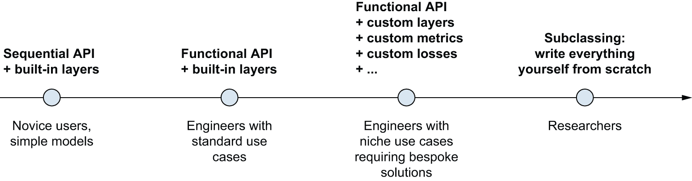
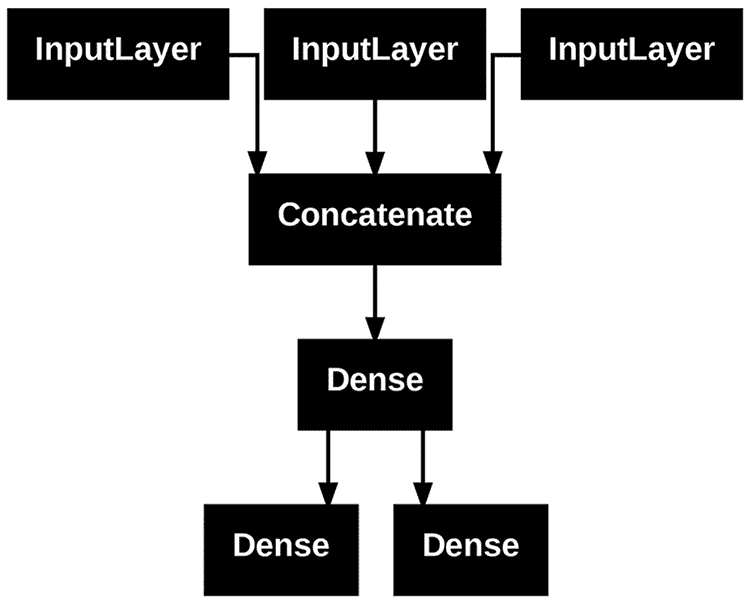
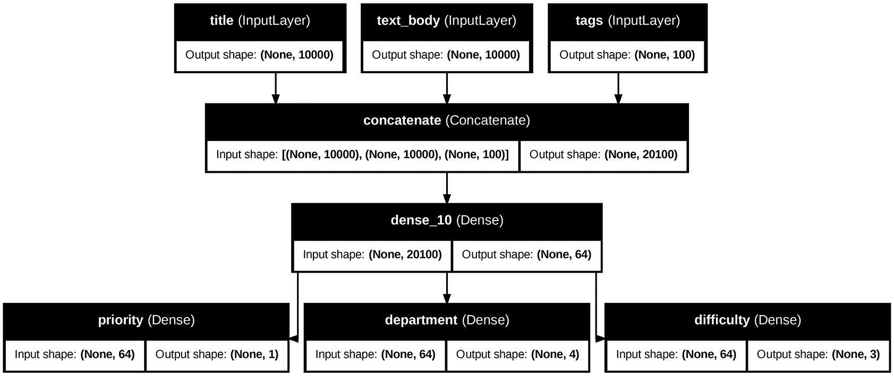
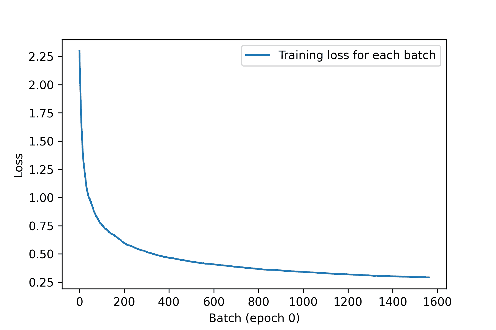
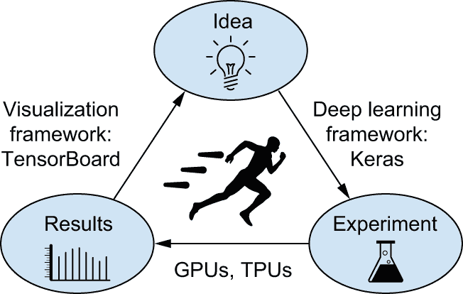
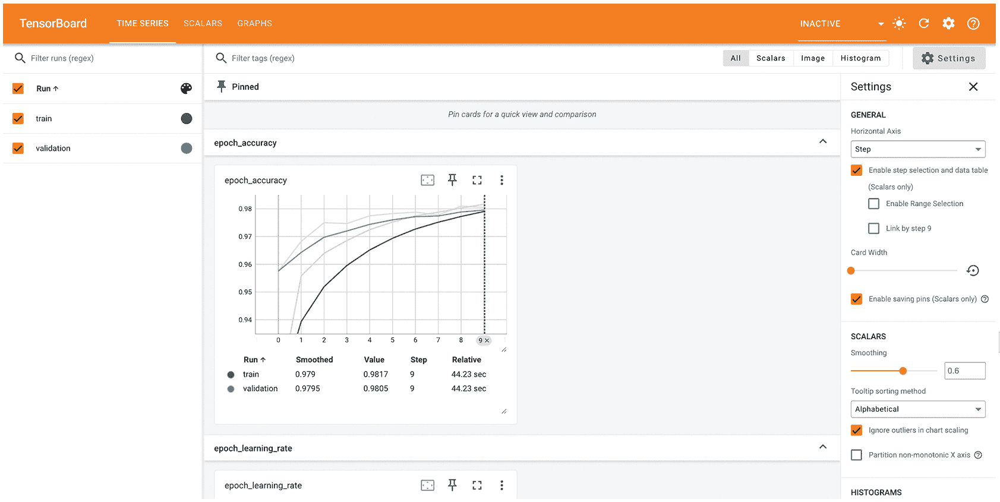

# 第七章：深入探讨 Keras

> 原文：[`deeplearningwithpython.io/chapters/chapter07_deep-dive-keras`](https://deeplearningwithpython.io/chapters/chapter07_deep-dive-keras)

你已经开始对 Keras 有了一些经验。你对 `Sequential` 模型、`Dense` 层以及用于训练、评估和推理的内置 API（`compile()`、`fit()`、`evaluate()` 和 `predict()`）都很熟悉。你甚至在第三章学习了如何从 `Layer` 类继承以创建自定义层，以及如何使用 TensorFlow、JAX 和 PyTorch 中的梯度 API 来实现逐步训练循环。

在接下来的章节中，我们将深入研究计算机视觉、时间序列预测、自然语言处理和生成式深度学习。这些复杂的应用将需要比 `Sequential` 架构和默认的 `fit()` 循环多得多的东西。所以，让我们首先把你培养成一个 Keras 专家！在本章中，你将获得使用 Keras API 的关键方法的全面概述：你将需要的一切来处理你接下来会遇到的高级深度学习用例。

## 工作流程的谱系

Keras API 的设计遵循了 *渐进式复杂性披露* 原则：易于上手，同时又能处理高复杂度用例，只需在每一步进行增量学习。简单的用例应该易于接近，任意高级的工作流程应该是 *可行的*：无论你想要做的事情多么小众和复杂，都应该有一条清晰的路径，一条基于你从更简单的工作流程中学到的各种知识的路径。这意味着你可以从初学者成长为专家，同时仍然使用相同的工具——只是以不同的方式。

因此，没有一种“真正”使用 Keras 的方法。相反，Keras 提供了一组 *工作流程的谱系*，从非常简单到非常灵活。有不同方式来构建 Keras 模型，以及不同的方式来训练它们，满足不同的需求。

例如，你有多种构建模型的方法和多种训练它们的方法，每种方法都代表了可用性和灵活性之间的一定权衡。你可以像使用 scikit-learn 一样使用 Keras——只是调用 `fit()` 并让框架做它的事情——或者你可以像使用 NumPy 一样使用它——完全控制每一个细节。

由于所有这些工作流程都基于共享的 API，如 `Layer` 和 `Model`，任何工作流程的组件都可以用于任何其他工作流程：它们都可以相互通信。这意味着你现在在学习的一切，一旦你成为专家，仍然会相关。你可以轻松上手，然后逐渐深入到需要从头编写更多逻辑的工作流程。在你从学生到研究人员，或从数据科学家到深度学习工程师的过程中，你不需要切换到完全不同的框架。

这种理念与 Python 本身非常相似！一些语言只提供一种编写程序的方式——例如，面向对象编程或函数式编程。而 Python 是一种多范式语言：它提供了一系列可能的用法模式，它们可以很好地协同工作。这使得 Python 适用于广泛的非常不同的用例：系统管理、数据科学、机器学习工程、Web 开发，或者仅仅是学习如何编程。同样，您可以将 Keras 视为深度学习的 Python：一个用户友好的深度学习语言，为不同的用户配置文件提供各种工作流程。

## 构建 Keras 模型的不同方法

Keras 中有三种构建模型的 API，如图 7.1 所示：

+   *Sequential 模型*是最易于接近的 API——它基本上是一个 Python 列表。因此，它仅限于简单的层堆叠。

+   *功能 API*，专注于类似图的结构化模型架构。它代表了可用性和灵活性之间的一个很好的平衡点，因此，它是使用最广泛的模型构建 API。

+   *模型子类化*，这是一个低级选项，您需要从头开始编写一切。如果您希望对每个细节都拥有完全的控制权，这是理想的。然而，您将无法访问许多内置的 Keras 功能，并且更容易犯错。



图 7.1：模型构建的复杂性逐步揭示

### Sequential 模型

构建 Keras 模型最简单的方式是`Sequential`模型，您已经了解过它。

```py
import keras
from keras import layers

model = keras.Sequential(
    [
        layers.Dense(64, activation="relu"),
        layers.Dense(10, activation="softmax"),
    ]
) 
```

列表 7.1：`Sequential`类

注意，可以通过`add()`方法逐步构建相同的模型，类似于 Python 列表的`append()`方法。

```py
model = keras.Sequential()
model.add(layers.Dense(64, activation="relu"))
model.add(layers.Dense(10, activation="softmax")) 
```

列表 7.2：逐步构建`Sequential`模型

您在第三章中看到，层只有在第一次被调用时才会构建（也就是说，创建它们的权重）。这是因为层的权重形状取决于它们的输入形状：直到输入形状已知，它们才能被创建。

因此，之前的`Sequential`模型在您实际在数据上调用它或使用输入形状调用其`build()`方法之前没有任何权重。

```py
>>> # At that point, the model isn't built yet.
>>> model.weights
[]
```

列表 7.3：尚未构建的模型没有权重

```py
>>> # Builds the model. Now the model will expect samples of shape
>>> # (3,). The None in the input shape signals that the batch size
>>> # could be anything.
>>> model.build(input_shape=(None, 3))
>>> # Now you can retrieve the model's weights.
>>> model.weights
[<Variable shape=(3, 64), dtype=float32, path=sequential/dense_2/kernel ...>,
 <Variable shape=(64,), dtype=float32, path=sequential/dense_2/bias ...>,
 <Variable shape=(64, 10), dtype=float32, path=sequential/dense_3/kernel ...>,
 <Variable shape=(10,), dtype=float32, path=sequential/dense_3/bias ...>>]
```

列表 7.4：首次调用模型以构建它

模型构建完成后，您可以通过`summary()`方法显示其内容，这对于调试非常有用。

```py
>>> model.summary()
Model: "sequential_1"
┏━━━━━━━━━━━━━━━━━━━━━━━━━━━━━━━━━━━┳━━━━━━━━━━━━━━━━━━━━━━━━━━┳━━━━━━━━━━━━━━━┓
┃ Layer (type)                      ┃ Output Shape             ┃       Param # ┃
┡━━━━━━━━━━━━━━━━━━━━━━━━━━━━━━━━━━━╇━━━━━━━━━━━━━━━━━━━━━━━━━━╇━━━━━━━━━━━━━━━┩
│ dense_2 (Dense)                   │ (None, 64)               │           256 │
├───────────────────────────────────┼──────────────────────────┼───────────────┤
│ dense_3 (Dense)                   │ (None, 10)               │           650 │
└───────────────────────────────────┴──────────────────────────┴───────────────┘
 Total params: 906 (3.54 KB)
 Trainable params: 906 (3.54 KB)
 Non-trainable params: 0 (0.00 B)
```

列表 7.5：`summary`方法

如您所见，您的模型恰好命名为`sequential_1`。实际上，您可以在 Keras 中为一切命名——每个模型，每个层。

```py
>>> model = keras.Sequential(name="my_example_model")
>>> model.add(layers.Dense(64, activation="relu", name="my_first_layer"))
>>> model.add(layers.Dense(10, activation="softmax", name="my_last_layer"))
>>> model.build((None, 3))
>>> model.summary()
Model: "my_example_model"
┏━━━━━━━━━━━━━━━━━━━━━━━━━━━━━━━━━━━┳━━━━━━━━━━━━━━━━━━━━━━━━━━┳━━━━━━━━━━━━━━━┓
┃ Layer (type)                      ┃ Output Shape             ┃       Param # ┃
┡━━━━━━━━━━━━━━━━━━━━━━━━━━━━━━━━━━━╇━━━━━━━━━━━━━━━━━━━━━━━━━━╇━━━━━━━━━━━━━━━┩
│ my_first_layer (Dense)            │ (None, 64)               │           256 │
├───────────────────────────────────┼──────────────────────────┼───────────────┤
│ my_last_layer (Dense)             │ (None, 10)               │           650 │
└───────────────────────────────────┴──────────────────────────┴───────────────┘
 Total params: 906 (3.54 KB)
 Trainable params: 906 (3.54 KB)
 Non-trainable params: 0 (0.00 B)
```

列表 7.6：使用`name`参数命名模型和层

当逐步构建 `Sequential` 模型时，能够在添加每个层后打印当前模型的外观摘要非常有用。但是，您必须在模型构建后才能打印摘要！实际上有一种方法可以让您的 `Sequential` 模型即时构建：只需提前声明模型输入的形状。您可以通过 `Input` 类来完成此操作。

```py
model = keras.Sequential()
# Use an Input to declare the shape of the inputs. Note that the shape
# argument must be the shape of each sample, not the shape of one
# batch.
model.add(keras.Input(shape=(3,)))
model.add(layers.Dense(64, activation="relu")) 
```

列表 7.7：提前指定模型输入的形状

现在您可以使用 `summary()` 来跟踪随着您添加更多层，模型输出形状的变化：

```py
>>> model.summary()
Model: "sequential_2"
┏━━━━━━━━━━━━━━━━━━━━━━━━━━━━━━━━━━━┳━━━━━━━━━━━━━━━━━━━━━━━━━━┳━━━━━━━━━━━━━━━┓
┃ Layer (type)                      ┃ Output Shape             ┃       Param # ┃
┡━━━━━━━━━━━━━━━━━━━━━━━━━━━━━━━━━━━╇━━━━━━━━━━━━━━━━━━━━━━━━━━╇━━━━━━━━━━━━━━━┩
│ dense_4 (Dense)                   │ (None, 64)               │           256 │
└───────────────────────────────────┴──────────────────────────┴───────────────┘
 Total params: 256 (1.00 KB)
 Trainable params: 256 (1.00 KB)
 Non-trainable params: 0 (0.00 B) 
>>> model.add(layers.Dense(10, activation="softmax"))
>>> model.summary()
Model: "sequential_2"
┏━━━━━━━━━━━━━━━━━━━━━━━━━━━━━━━━━━━┳━━━━━━━━━━━━━━━━━━━━━━━━━━┳━━━━━━━━━━━━━━━┓
┃ Layer (type)                      ┃ Output Shape             ┃       Param # ┃
┡━━━━━━━━━━━━━━━━━━━━━━━━━━━━━━━━━━━╇━━━━━━━━━━━━━━━━━━━━━━━━━━╇━━━━━━━━━━━━━━━┩
│ dense_4 (Dense)                   │ (None, 64)               │           256 │
├───────────────────────────────────┼──────────────────────────┼───────────────┤
│ dense_5 (Dense)                   │ (None, 10)               │           650 │
└───────────────────────────────────┴──────────────────────────┴───────────────┘
 Total params: 906 (3.54 KB)
 Trainable params: 906 (3.54 KB)
 Non-trainable params: 0 (0.00 B)
```

这是在处理像第八章中将要学习的卷积层这样的层以复杂方式转换其输入时的一个相当常见的调试工作流程。

### 功能 API

`Sequential` 模型易于使用，但其适用性极其有限：它只能表达具有单个输入和单个输出的模型，以顺序方式逐层应用。在实践中，遇到具有多个输入（例如，图像及其元数据）、多个输出（您想要预测的数据的不同方面）或非线性拓扑的模型是很常见的。

在这种情况下，您将使用功能 API 构建模型。这是您在野外遇到的绝大多数 Keras 模型所使用的。它很有趣且功能强大——感觉就像在玩乐高积木。

#### 一个简单的例子

让我们从简单的东西开始：我们在上一节中使用过的两层堆叠。其功能 API 版本如下所示。

```py
inputs = keras.Input(shape=(3,), name="my_input")
features = layers.Dense(64, activation="relu")(inputs)
outputs = layers.Dense(10, activation="softmax")(features)
model = keras.Model(inputs=inputs, outputs=outputs, name="my_functional_model") 
```

列表 7.8：一个包含两个 `Dense` 层的简单功能模型

让我们一步一步地过一遍。我们首先声明了一个 `Input`（请注意，您也可以像其他所有对象一样给这些输入对象命名）：

```py
inputs = keras.Input(shape=(3,), name="my_input") 
```

这个 `inputs` 对象包含有关模型将处理的数据的形状和 `dtype` 的信息：

```py
>>> # The model will process batches where each sample has shape (3,).
>>> # The number of samples per batch is variable (indicated by the
>>> # None batch size).
>>> inputs.shape
(None, 3)
>>> # These batches will have dtype float32.
>>> inputs.dtype
"float32"
```

我们称这样的对象为 *符号张量*。它不包含任何实际数据，但它编码了模型在您使用它时将看到的实际数据张量的规格。它 *代表*未来的数据张量。

接下来，我们创建了一个层并在输入上调用它：

```py
features = layers.Dense(64, activation="relu")(inputs) 
```

所有 Keras 层都可以在真实张量数据或这些符号张量上调用。在后一种情况下，它们返回一个新的符号张量，包含更新后的形状和 dtype 信息：

```py
>>> features.shape
(None, 64)
```

在获得最终输出后，我们通过在 `Model` 构造函数中指定其输入和输出实例化了模型：

```py
outputs = layers.Dense(10, activation="softmax")(features)
model = keras.Model(inputs=inputs, outputs=outputs, name="my_functional_model") 
```

这是我们的模型摘要：

```py
>>> model.summary()
Model: "my_functional_model"
┏━━━━━━━━━━━━━━━━━━━━━━━━━━━━━━━━━━━┳━━━━━━━━━━━━━━━━━━━━━━━━━━┳━━━━━━━━━━━━━━━┓
┃ Layer (type)                      ┃ Output Shape             ┃       Param # ┃
┡━━━━━━━━━━━━━━━━━━━━━━━━━━━━━━━━━━━╇━━━━━━━━━━━━━━━━━━━━━━━━━━╇━━━━━━━━━━━━━━━┩
│ my_input (InputLayer)             │ (None, 3)                │             0 │
├───────────────────────────────────┼──────────────────────────┼───────────────┤
│ dense_8 (Dense)                   │ (None, 64)               │           256 │
├───────────────────────────────────┼──────────────────────────┼───────────────┤
│ dense_9 (Dense)                   │ (None, 10)               │           650 │
└───────────────────────────────────┴──────────────────────────┴───────────────┘
 Total params: 906 (3.54 KB)
 Trainable params: 906 (3.54 KB)
 Non-trainable params: 0 (0.00 B)
```

#### 多输入、多输出模型

与这个玩具模型不同，大多数深度学习模型看起来不像列表——它们看起来像图。例如，它们可能有多个输入或多个输出。正是为了这种类型的模型，功能 API 才真正闪耀。

假设你正在构建一个系统，根据优先级对客户支持工单进行排序并将它们路由到适当的部门。你的模型有三个输入：

+   工单的标题（文本输入）

+   工单的文本正文（文本输入）

+   用户添加的任何标签（分类输入，假设为多热编码）

我们可以将文本输入编码为大小为`vocabulary_size`的 1s 和 0s 的数组（有关文本编码技术的详细信息，请参阅第十四章）。

你的模型也有两个输出：

+   票据的优先级分数，介于 0 和 1 之间的标量（sigmoid 输出）

+   应该处理票据的部门（部门集合上的 softmax）

你可以使用功能 API 在几行代码内构建这个模型。

```py
vocabulary_size = 10000
num_tags = 100
num_departments = 4

# Defines model inputs
title = keras.Input(shape=(vocabulary_size,), name="title")
text_body = keras.Input(shape=(vocabulary_size,), name="text_body")
tags = keras.Input(shape=(num_tags,), name="tags")

# Combines input features into a single tensor, features, by
# concatenating them
features = layers.Concatenate()([title, text_body, tags])
# Applies intermediate layer to recombine input features into richer
# representations
features = layers.Dense(64, activation="relu", name="dense_features")(features)

# Defines model outputs
priority = layers.Dense(1, activation="sigmoid", name="priority")(features)
department = layers.Dense(
    num_departments, activation="softmax", name="department"
)(features)

# Creates the model by specifying its inputs and outputs
model = keras.Model(
    inputs=[title, text_body, tags],
    outputs=[priority, department],
) 
```

列表 7.9：一个多输入、多输出的功能模型

功能 API 是一种简单、类似乐高且非常灵活的方式来定义任意层图，如这些。

#### 训练多输入、多输出模型

你可以通过调用`fit()`并传递输入和输出数据的列表来以与训练`Sequential`模型相同的方式训练你的模型。这些数据列表应遵循与传递给`Model()`构造函数的输入相同的顺序。

```py
import numpy as np

num_samples = 1280

# Dummy input data
title_data = np.random.randint(0, 2, size=(num_samples, vocabulary_size))
text_body_data = np.random.randint(0, 2, size=(num_samples, vocabulary_size))
tags_data = np.random.randint(0, 2, size=(num_samples, num_tags))

# Dummy target data
priority_data = np.random.random(size=(num_samples, 1))
department_data = np.random.randint(0, num_departments, size=(num_samples, 1))

model.compile(
    optimizer="adam",
    loss=["mean_squared_error", "sparse_categorical_crossentropy"],
    metrics=[["mean_absolute_error"], ["accuracy"]],
)
model.fit(
    [title_data, text_body_data, tags_data],
    [priority_data, department_data],
    epochs=1,
)
model.evaluate(
    [title_data, text_body_data, tags_data], [priority_data, department_data]
)
priority_preds, department_preds = model.predict(
    [title_data, text_body_data, tags_data]
) 
```

列表 7.10：通过提供输入和目标数组的列表来训练模型

如果你不想依赖于输入顺序（例如，因为你有很多输入或输出），你也可以使用你给`Input`对象和输出层起的名字，并通过字典传递数据。

```py
model.compile(
    optimizer="adam",
    loss={
        "priority": "mean_squared_error",
        "department": "sparse_categorical_crossentropy",
    },
    metrics={
        "priority": ["mean_absolute_error"],
        "department": ["accuracy"],
    },
)
model.fit(
    {"title": title_data, "text_body": text_body_data, "tags": tags_data},
    {"priority": priority_data, "department": department_data},
    epochs=1,
)
model.evaluate(
    {"title": title_data, "text_body": text_body_data, "tags": tags_data},
    {"priority": priority_data, "department": department_data},
)
priority_preds, department_preds = model.predict(
    {"title": title_data, "text_body": text_body_data, "tags": tags_data}
) 
```

列表 7.11：通过提供输入和目标数组的字典来训练模型

#### 功能 API 的强大之处：访问层连接性

功能模型是一个显式的图数据结构。这使得可以*检查层是如何连接的*，并且可以将之前的图节点（层输出）作为新模型的一部分进行重用。它也很好地符合大多数研究人员在思考深度神经网络时使用的“心智模型”：层图。

这使得两个重要的用例成为可能：模型可视化和特征提取。让我们看看。

##### 绘制层连接性

让我们可视化我们刚刚定义的模型的连接性（模型的*拓扑结构*）。你可以使用`plot_model()`实用工具将功能模型作为图形绘制出来，如图 7.2 所示：

```py
keras.utils.plot_model(model, "ticket_classifier.png") 
```



图 7.2：`plot_model()`在我们票据分类器模型上生成的绘图

你可以向此图添加模型中每一层的输入和输出形状，以及层名（而不仅仅是层类型），这在调试期间可能很有帮助（图 7.3）：

```py
keras.utils.plot_model(
    model,
    "ticket_classifier_with_shape_info.png",
    show_shapes=True,
    show_layer_names=True,
) 
```


图 7.3：添加了形状信息的模型绘图

张量形状中的`None`表示批处理大小：此模型允许任何大小的批处理。

##### 使用功能模型进行特征提取

访问层连接性还意味着你可以检查和重用图中的单个节点（层调用）。模型属性`model.layers`提供了构成模型的层列表，对于每一层，你可以查询`layer.input`和`layer.output`。

```py
>>> model.layers
[<InputLayer name=title, built=True>,
 <InputLayer name=text_body, built=True>,
 <InputLayer name=tags, built=True>,
 <Concatenate name=concatenate, built=True>,
 <Dense name=dense_10, built=True>,
 <Dense name=priority, built=True>,
 <Dense name=department, built=True>] 
>>> model.layers[3].input
[<KerasTensor shape=(None, 10000), dtype=float32, sparse=None, name=title>,
 <KerasTensor shape=(None, 10000), dtype=float32, sparse=None, name=text_body>,
 <KerasTensor shape=(None, 100), dtype=float32, sparse=None, name=tags>] 
>>> model.layers[3].output
<KerasTensor shape=(None, 20100), dtype=float32, sparse=False>
```

代码列表 7.12：在功能模型中检索层的输入或输出

这使你能够进行*特征提取*：创建重用另一个模型中间特征的模型。

假设你想向之前定义的模型添加另一个输出——你想要预测给定问题工单解决所需的时间估计，一种难度评级。你可以通过三个类别——“快速”、“中等”和“困难”——的分类层来实现这一点。你不需要从头开始重新创建和重新训练模型！你可以从之前模型的中间特征开始，因为你已经可以访问它们。

```py
# layers[4] is our intermediate Dense layer.
features = model.layers[4].output
difficulty = layers.Dense(3, activation="softmax", name="difficulty")(features)

new_model = keras.Model(
    inputs=[title, text_body, tags], outputs=[priority, department, difficulty]
) 
```

代码列表 7.13：通过重用中间层输出创建新模型

让我们绘制我们的新模型，如图 7.4 所示：

```py
keras.utils.plot_model(
    new_model,
    "updated_ticket_classifier.png",
    show_shapes=True,
    show_layer_names=True,
) 
```



图 7.4：我们新模型的绘图

### 子类化`Model`类

你应该了解的最后一种模型构建模式是最先进的：`Model`子类化。你已经在第三章学习了如何子类化`Layer`类来创建自定义层。子类化`Model`非常相似：

+   在`__init__`方法中，定义模型将使用的层。

+   在`call`方法中，定义模型的正向传递，重用之前创建的层。

+   实例化你的子类，并在数据上调用它以创建其权重。

#### 将我们的前一个示例重写为子类化模型

让我们看看一个简单的例子：我们将使用`Model`子类重新实现客户支持工单管理模型。

```py
class CustomerTicketModel(keras.Model):
    def __init__(self, num_departments):
        # Don't forget to call the super constructor!
        super().__init__()
        # Defines sublayers in the constructor
        self.concat_layer = layers.Concatenate()
        self.mixing_layer = layers.Dense(64, activation="relu")
        self.priority_scorer = layers.Dense(1, activation="sigmoid")
        self.department_classifier = layers.Dense(
            num_departments, activation="softmax"
        )

    # Defines the forward pass in the call() method
    def call(self, inputs):
        title = inputs["title"]
        text_body = inputs["text_body"]
        tags = inputs["tags"]

        features = self.concat_layer([title, text_body, tags])
        features = self.mixing_layer(features)
        priority = self.priority_scorer(features)
        department = self.department_classifier(features)
        return priority, department 
```

代码列表 7.14：一个简单的子类化模型

一旦你定义了模型，你就可以实例化它。注意，它只会在你第一次在某个数据上调用它时创建其权重——就像`Layer`子类一样：

```py
model = CustomerTicketModel(num_departments=4)

priority, department = model(
    {"title": title_data, "text_body": text_body_data, "tags": tags_data}
) 
```

到目前为止，一切看起来都非常类似于`Layer`子类化，这是你在第三章中已经遇到的工作流程。那么，`Layer`子类和`Model`子类之间的区别是什么？很简单：*层*是你用来创建模型的基本构建块，而*模型*是你将实际训练、导出用于推理等的顶级对象。简而言之，`Model`有`fit()`、`evaluate()`和`predict()`方法。层没有。除此之外，这两个类在功能上几乎相同（另一个区别是你可以将模型*保存*到磁盘上的文件——我们将在接下来的几节中介绍）。

你可以像对 Sequential 或 Functional 模型一样编译和训练`Model`子类：

```py
model.compile(
    optimizer="adam",
    # The structure of what you pass as the loss and metrics must match
    # exactly what gets returned by call() — since we returned a list
    # of two elements, so should loss and metrics be lists of two
    # elements.
    loss=["mean_squared_error", "sparse_categorical_crossentropy"],
    metrics=[["mean_absolute_error"], ["accuracy"]],
)
model.fit(
    # The structure of the input data must match exactly what is
    # expected by the call() method, and the structure of the target
    # data must match exactly what gets returned by the call() method.
    # Here, the input data must be a dict with three keys (title,
    # text_body, and tags) and the target data must be a list of two
    # elements.
    {"title": title_data, "text_body": text_body_data, "tags": tags_data},
    [priority_data, department_data],
    epochs=1,
)
model.evaluate(
    {"title": title_data, "text_body": text_body_data, "tags": tags_data},
    [priority_data, department_data],
)
priority_preds, department_preds = model.predict(
    {"title": title_data, "text_body": text_body_data, "tags": tags_data}
) 
```

`Model`子类化工作流程是构建模型最灵活的方式：它允许你构建无法表示为层的有向无环图（DAG）的模型——例如，想象一个`call()`方法在`for`循环中使用层，或者甚至递归调用它们的模型。任何可能的事情都是可能的——你说了算。

#### 注意：子类化模型不支持的功能

这种自由是有代价的：使用子类化模型，你需要负责更多的模型逻辑，这意味着你的潜在错误面要大得多。因此，你将需要进行更多的调试工作。你正在开发一个新的 Python 对象，而不仅仅是拼接乐高积木。

函数模型和子类化模型在本质上也有很大不同：函数模型是一个显式的数据结构——一个层的图，你可以查看、检查和修改。与此同时，子类化模型是一段字节码——一个包含`call()`方法的 Python 类，其中包含原始代码。这是子类化工作流程灵活性的来源——你可以编写任何你喜欢的功能——但它也引入了新的限制。

例如，因为层之间的连接方式隐藏在`call()`方法的主体中，你无法访问这些信息。调用`summary()`不会显示层连接，你也不能通过`plot_model()`来绘制模型拓扑。同样，如果你有一个子类化模型，你无法访问层的图来执行特征提取——因为根本不存在这样的图。一旦模型被实例化，其前向传递就变成了一个完全的黑盒。

### 混合和匹配不同的组件

关键的是，选择这些模式之一——`Sequential`模型、函数 API、`Model`子类化——并不会将你排除在其他模式之外。Keras API 中的所有模型都可以与其他模型无缝交互，无论是`Sequential`模型、函数模型，还是从头开始编写的子类模型。它们都是同一工作流程谱系的一部分。例如，你可以在函数模型中使用子类化的层或模型。

```py
class Classifier(keras.Model):
    def __init__(self, num_classes=2):
        super().__init__()
        if num_classes == 2:
            num_units = 1
            activation = "sigmoid"
        else:
            num_units = num_classes
            activation = "softmax"
        self.dense = layers.Dense(num_units, activation=activation)

    def call(self, inputs):
        return self.dense(inputs)

inputs = keras.Input(shape=(3,))
features = layers.Dense(64, activation="relu")(inputs)
outputs = Classifier(num_classes=10)(features)
model = keras.Model(inputs=inputs, outputs=outputs) 
```

列表 7.15：创建一个包含子类模型的函数模型

相反，你还可以将函数模型用作子类化层或模型的一部分。

```py
inputs = keras.Input(shape=(64,))
outputs = layers.Dense(1, activation="sigmoid")(inputs)
binary_classifier = keras.Model(inputs=inputs, outputs=outputs)

class MyModel(keras.Model):
    def __init__(self, num_classes=2):
        super().__init__()
        self.dense = layers.Dense(64, activation="relu")
        self.classifier = binary_classifier

    def call(self, inputs):
        features = self.dense(inputs)
        return self.classifier(features)

model = MyModel() 
```

列表 7.16：创建一个包含函数模型的子类模型

### 记住：使用合适的工具来完成工作

你已经了解了构建 Keras 模型的工作流程谱系，从最简单的`Sequential`模型到最复杂的模型子类化。何时应该使用一个而不是另一个？每个都有其优缺点——选择最适合当前任务的那个。

通常，函数 API 在易用性和灵活性之间提供了一个相当不错的权衡。它还提供了对层连接的直接访问，这对于模型绘图或特征提取等用例非常强大。如果你可以使用函数 API——也就是说，如果你的模型可以表示为一个层的有向无环图——我们建议你使用它而不是模型子类化。

从现在起，本书中的所有示例都将使用功能 API——仅仅因为我们将要处理的模型都可以表示为层的图。然而，我们将会频繁地使用派生层。一般来说，使用包含派生层的功能模型可以提供两全其美的效果：高开发灵活性同时保留功能 API 的优势。

## 使用内置的训练和评估循环

渐进式披露复杂性的原则——逐步访问从非常简单到任意灵活的工作流程范围——也适用于模型训练。Keras 为您提供了不同的模型训练工作流程——它可以简单到在您的数据上调用`fit()`，也可以复杂到从头编写新的训练算法。

您已经熟悉`compile()`、`fit()`、`evaluate()`、`predict()`工作流程。作为提醒，它看起来如下所示。

```py
from keras.datasets import mnist

# Creates a model. (We factor this into a separate function so as to
# reuse it later.)
def get_mnist_model():
    inputs = keras.Input(shape=(28 * 28,))
    features = layers.Dense(512, activation="relu")(inputs)
    features = layers.Dropout(0.5)(features)
    outputs = layers.Dense(10, activation="softmax")(features)
    model = keras.Model(inputs, outputs)
    return model

# Loads your data, reserving some for validation
(images, labels), (test_images, test_labels) = mnist.load_data()
images = images.reshape((60000, 28 * 28)).astype("float32") / 255
test_images = test_images.reshape((10000, 28 * 28)).astype("float32") / 255
train_images, val_images = images[10000:], images[:10000]
train_labels, val_labels = labels[10000:], labels[:10000]

model = get_mnist_model()
# Compiles the model by specifying its optimizer, the loss function to
# minimize, and metrics to monitor
model.compile(
    optimizer="adam",
    loss="sparse_categorical_crossentropy",
    metrics=["accuracy"],
)
# Uses `fit()` to train the model, optionally providing validation data
# to monitor performance on unseen data
model.fit(
    train_images,
    train_labels,
    epochs=3,
    validation_data=(val_images, val_labels),
)
# Uses `evaluate()` to compute the loss and metrics on new data
test_metrics = model.evaluate(test_images, test_labels)
# Uses `predict()` to compute classification probabilities on new data
predictions = model.predict(test_images) 
```

列表 7.17：标准工作流程：`compile()`、`fit()`、`evaluate()`、`predict()`

有几种方法可以自定义这个简单的流程：

+   通过提供您自己的自定义指标

+   通过将*回调*传递给`fit()`方法来安排在训练过程中的特定点执行的操作

让我们来看看这些。

### 编写您自己的指标

指标是衡量模型性能的关键——特别是衡量其在训练数据和测试数据上的性能差异。常用的分类和回归指标已经包含在内置的`keras.metrics`模块中——大多数情况下，您将使用它。但如果您正在做任何非同寻常的事情，您将需要能够编写自己的指标。这很简单！

Keras 指标是`keras.metrics.Metric`类的子类。与层类似，指标有一个存储在 Keras 变量中的内部状态。与层不同，这些变量不是通过反向传播更新的，因此您必须自己编写状态更新逻辑——这发生在`update_state()`方法中。例如，这里有一个简单的自定义指标，用于衡量均方根误差（RMSE）。

```py
from keras import ops

# Subclasses the Metric class
class RootMeanSquaredError(keras.metrics.Metric):
    # Defines the state variables in the constructor. Like for layers,
    # you have access to the add_weight() method.
    def __init__(self, name="rmse", **kwargs):
        super().__init__(name=name, **kwargs)
        self.mse_sum = self.add_weight(name="mse_sum", initializer="zeros")
        self.total_samples = self.add_weight(
            name="total_samples", initializer="zeros"
        )

    # Implements the state update logic in update_state(). The y_true
    # argument is the targets (or labels) for one batch, while y_pred
    # represents the corresponding predictions from the model. To match
    # our MNIST model, we expect categorical predictions and integer
    # labels. You can ignore the sample_weight argument; we won't use
    # it here.
    def update_state(self, y_true, y_pred, sample_weight=None):
        y_true = ops.one_hot(y_true, num_classes=ops.shape(y_pred)[1])
        mse = ops.sum(ops.square(y_true - y_pred))
        self.mse_sum.assign_add(mse)
        num_samples = ops.shape(y_pred)[0]
        self.total_samples.assign_add(num_samples) 
```

列表 7.18：通过继承`Metric`类实现自定义指标

您可以使用`result()`方法来返回当前指标值：

```py
 def result(self):
        return ops.sqrt(self.mse_sum / self.total_samples) 
```

同时，您还需要提供一个方法来重置指标状态，而无需重新实例化它——这允许相同的指标对象在不同的训练时期或训练和评估之间使用。您可以在`reset_state()`方法中这样做：

```py
 def reset_state(self):
        self.mse_sum.assign(0.)
        self.total_samples.assign(0.) 
```

自定义指标可以像内置指标一样使用。让我们测试一下我们自己的指标：

```py
model = get_mnist_model()
model.compile(
    optimizer="adam",
    loss="sparse_categorical_crossentropy",
    metrics=["accuracy", RootMeanSquaredError()],
)
model.fit(
    train_images,
    train_labels,
    epochs=3,
    validation_data=(val_images, val_labels),
)
test_metrics = model.evaluate(test_images, test_labels) 
```

您现在可以看到`fit()`进度条显示您模型的 RMSE。

### 使用回调

使用 `model.fit()` 在大型数据集上运行数十个 epoch 的训练可能有点像发射纸飞机：在初始推动之后，您对其轨迹或着陆点没有任何控制。如果您想避免不良结果（以及因此浪费的纸飞机），更明智的做法是使用，不是纸飞机，而是一个能够感知其环境的无人机，将数据发送回其操作员，并根据其当前状态自动做出转向决策。Keras *回调* API 将帮助您将 `model.fit()` 的调用从纸飞机转变为一个智能、自主的无人机，它可以自我反思并动态采取行动。

*回调* 是一个对象（一个实现特定方法的类实例），在调用 `fit()` 时传递给模型，并在训练的各个阶段由模型调用。它有权访问有关模型状态及其性能的所有可用数据，并且可以采取行动：中断训练、保存模型、加载不同的权重集，或者以其他方式改变模型的状态。

这里有一些您可以使用回调的例子：

+   *模型检查点* — 在训练的不同阶段保存模型的当前状态。

+   *早期停止* — 当验证损失不再改善时（当然，保存训练期间获得的最佳模型）中断训练。

+   *在训练期间动态调整某些参数的值* — 例如优化器的学习率。

+   *在训练期间记录训练和验证指标，或者可视化模型在更新过程中学习到的表示* — 您熟悉的 `fit()` 进度条实际上是一个回调！

`keras.callbacks` 模块包含了许多内置回调（这并不是一个详尽的列表）：

```py
keras.callbacks.ModelCheckpoint
keras.callbacks.EarlyStopping
keras.callbacks.LearningRateScheduler
keras.callbacks.ReduceLROnPlateau
keras.callbacks.CSVLogger 
```

让我们回顾其中两个，以便您了解如何使用它们：`EarlyStopping` 和 `ModelCheckpoint`。

#### EarlyStopping 和 ModelCheckpoint 回调

当您训练一个模型时，在开始时有很多事情是无法预测的。特别是，您无法知道需要多少个 epoch 才能达到最佳的验证损失。我们之前的例子已经采用了训练足够多的 epoch，以至于您开始过拟合的策略，使用第一次运行来确定最佳的 epoch 数量，然后最终从头开始使用这个最佳数量启动新的训练运行。当然，这种方法是浪费的。一个更好的处理方法是，当您测量到验证损失不再改善时停止训练。这可以通过使用 `EarlyStopping` 回调来实现。

`EarlyStopping`回调在目标监控指标停止改进固定数量的 epochs 后中断训练。例如，这个回调允许你在开始过拟合时立即中断训练，从而避免需要重新训练模型以更少的 epochs。这个回调通常与`ModelCheckpoint`一起使用，它允许你在训练过程中持续保存模型（并且可选地只保存迄今为止的最佳模型：在 epoch 结束时实现最佳性能的模型版本）。

```py
# Callbacks are passed to the model via the callbacks argument in
# fit(), which takes a list of callbacks. You can pass any number of
# callbacks.
callbacks_list = [
    # Interrupts training when improvement stops
    keras.callbacks.EarlyStopping(
        # Monitors the model's validation accuracy
        monitor="accuracy",
        # Interrupts training when accuracy has stopped improving for
        # more than one epoch (that is, two epochs)
        patience=1,
    ),
    # Saves the current weights after every epoch
    keras.callbacks.ModelCheckpoint(
        # Path to the destination model file
        filepath="checkpoint_path.keras",
        # These two arguments mean you won't overwrite the model file
        # unless val_loss has improved, which allows you to keep the
        # best model seen during training.
        monitor="val_loss",
        save_best_only=True,
    ),
]
model = get_mnist_model()
model.compile(
    optimizer="adam",
    loss="sparse_categorical_crossentropy",
    # You monitor accuracy, so it should be part of the model's
    # metrics.
    metrics=["accuracy"],
)
# Because the callback will monitor validation loss and validation
# accuracy, you need to pass validation_data to the call to fit().
model.fit(
    train_images,
    train_labels,
    epochs=10,
    callbacks=callbacks_list,
    validation_data=(val_images, val_labels),
) 
```

列表 7.19：在`fit()`方法中使用`callbacks`参数

注意，你可以在训练后手动保存模型——只需调用`model.save("my_checkpoint_path.keras")`。要重新加载你保存的模型，使用

```py
model = keras.models.load_model("checkpoint_path.keras") 
```

### 编写你自己的回调

如果你需要在训练期间执行一个不是由内置回调覆盖的特定操作，你可以编写自己的回调。回调是通过继承`keras.callbacks.Callback`类实现的。然后你可以透明地实现以下方法，这些方法在训练的不同阶段被调用：

```py
# Called at the start of every epoch
on_epoch_begin(epoch, logs)
# Called at the end of every epoch
on_epoch_end(epoch, logs)
# Called right before processing each batch
on_batch_begin(batch, logs)
# Called right after processing each batch
on_batch_end(batch, logs)
# Called at the start of training
on_train_begin(logs)
# Called at the end of training
on_train_end(logs) 
```

这些方法都是使用`logs`参数调用的，它是一个包含有关先前批次、epoch 或训练运行信息的字典：训练和验证指标等。`on_epoch_*`和`on_batch_*`方法也接受 epoch 或批次索引作为第一个参数（一个整数）。

这里有一个简单的示例回调，它在训练过程中保存每个批次的损失值列表，并在每个 epoch 结束时绘制这些值。

```py
from matplotlib import pyplot as plt

class LossHistory(keras.callbacks.Callback):
    def on_train_begin(self, logs):
        self.per_batch_losses = []

    def on_batch_end(self, batch, logs):
        self.per_batch_losses.append(logs.get("loss"))

    def on_epoch_end(self, epoch, logs):
        plt.clf()
        plt.plot(
            range(len(self.per_batch_losses)),
            self.per_batch_losses,
            label="Training loss for each batch",
        )
        plt.xlabel(f"Batch (epoch {epoch})")
        plt.ylabel("Loss")
        plt.legend()
        plt.savefig(f"plot_at_epoch_{epoch}", dpi=300)
        self.per_batch_losses = [] 
```

列表 7.20：通过继承`Callback`类创建自定义回调

让我们试驾一下：

```py
model = get_mnist_model()
model.compile(
    optimizer="adam",
    loss="sparse_categorical_crossentropy",
    metrics=["accuracy"],
)
model.fit(
    train_images,
    train_labels,
    epochs=10,
    callbacks=[LossHistory()],
    validation_data=(val_images, val_labels),
) 
```

我们得到如图 7.5 所示的图表。



图 7.5：我们自定义的历史绘图回调的输出

### 使用 TensorBoard 进行监控和可视化

要进行良好的研究或开发良好的模型，你需要在你实验过程中对模型内部发生情况的丰富、频繁的反馈。这就是进行实验的目的：获取有关模型表现如何的信息——尽可能多的信息。取得进步是一个迭代过程，一个循环：你从一个想法开始，将其表达为一个实验，试图验证或证伪你的想法。你运行这个实验并处理它生成的信息，如图 7.6 所示。这激发了你下一个想法。你能运行这个循环的迭代次数越多，你的想法就越精细、越强大。Keras 帮助你以最短的时间从想法到实验，快速的 GPU 可以帮助你尽可能快地从实验到结果。但是，如何处理实验结果呢？这就是 TensorBoard 发挥作用的地方。



图 7.6：进步的循环

TensorBoard 是一个基于浏览器的应用程序，您可以在本地运行。它是监控训练过程中模型内部发生的一切的最佳方式。使用 TensorBoard，您可以

+   在训练期间可视化指标

+   可视化您的模型架构

+   可视化激活和梯度的直方图

+   探索 3D 中的嵌入

如果您监控的信息不仅仅是模型的最终损失，您可以对模型做什么以及不做什么有一个更清晰的了解，并且可以更快地取得进展。

使用 TensorBoard 与 Keras 模型和`fit()`方法的最简单方法是`keras.callbacks.TensorBoard`回调。在最简单的情况下，只需指定回调要写入日志的位置，然后就可以开始了：

```py
model = get_mnist_model()
model.compile(
    optimizer="adam",
    loss="sparse_categorical_crossentropy",
    metrics=["accuracy"],
)

tensorboard = keras.callbacks.TensorBoard(
    log_dir="/full_path_to_your_log_dir",
)
model.fit(
    train_images,
    train_labels,
    epochs=10,
    validation_data=(val_images, val_labels),
    callbacks=[tensorboard],
) 
```

一旦模型开始运行，它将在目标位置写入日志。如果您在本地机器上运行 Python 脚本，您可以使用以下命令启动本地 TensorBoard 服务器（注意，如果通过`pip`安装了 TensorFlow，则`tensorboard`可执行文件应该已经可用；如果没有，您可以通过`pip install tensorboard`手动安装 TensorBoard）：

```py
tensorboard --logdir /full_path_to_your_log_dir 
```

然后，您可以导航到命令返回的 URL 以访问 TensorBoard 界面。

如果您在 Colab 笔记本中运行脚本，您可以使用以下命令作为笔记本的一部分运行嵌入的 TensorBoard 实例：

```py
%load_ext tensorboard
%tensorboard --logdir /full_path_to_your_log_dir 
```

在 TensorBoard 界面中，您将能够监控训练和评估指标的实时图表，如图 7.7 所示。



图 7.7：TensorBoard 可以用于轻松监控训练和评估指标。

## 编写自己的训练和评估循环

`fit()`工作流程在易用性和灵活性之间取得了很好的平衡。您将大部分时间都会使用它。然而，它并不旨在支持深度学习研究人员可能想要做的所有事情——即使有自定义指标、自定义损失和自定义回调。

毕竟，内置的`fit()`工作流程仅专注于**监督学习**：这是一种存在已知**目标**（也称为**标签**或**注释**）与您的输入数据相关联的设置，并且您将损失计算为目标函数和模型预测的函数。然而，并非所有形式的机器学习都属于这一类别。还有其他设置，其中不存在显式的目标，例如**生成学习**（我们将在第十六章中介绍），**自监督学习**（目标从输入中获取）或**强化学习**（学习由偶尔的“奖励”驱动——就像训练狗一样）。即使您正在进行常规的监督学习，作为研究人员，您可能希望添加一些需要低级灵活性的新颖功能。

无论何时你发现自己处于内置的`fit()`不足以应对的情况，你将需要编写自己的自定义训练逻辑。你已经在第二章和第三章中看到了低级训练循环的简单示例。作为提醒，典型训练循环的内容如下：

1.  运行“前向传递”（计算模型的输出）以获得当前批次数据的损失值。

1.  检索关于模型权重的损失梯度。

1.  更新模型的权重，以降低当前批次数据的损失值。

这些步骤会重复进行，直到达到必要的批次数量。这本质上就是`fit()`在底层所做的事情。在本节中，你将学习从头开始重新实现`fit()`，这将为你提供编写任何可能想到的训练算法所需的所有知识。

让我们详细了解一下。在接下来的几节中，你将逐步学习如何在 TensorFlow、PyTorch 和 JAX 中编写一个功能齐全的自定义训练循环。

### 训练与推理

在你迄今为止看到的低级训练循环示例中，步骤 1（前向传递）是通过`predictions = model(inputs)`完成的，而步骤 2（通过后端特定的 API 检索由梯度记录计算出的梯度）是通过以下方式完成的：

+   TensorFlow 中的`gradients = tape.gradient(loss, model.weights)`

+   PyTorch 中的`loss.backward()`

+   JAX 中的`jax.value_and_grad()`

在一般情况中，实际上有两个细微之处你需要考虑。

一些 Keras 层，如`Dropout`层，在*训练*期间和*推理*期间（当你使用它们生成预测时）有不同的行为。这些层在其`call()`方法中暴露一个`training`布尔参数。调用`dropout(inputs, training=True)`将丢弃一些激活条目，而调用`dropout(inputs, training=False)`则不执行任何操作。通过扩展，Functional 模型和 Sequential 模型也在它们的`call()`方法中暴露了这个`training`参数。记住，在正向传递时调用 Keras 模型时，要传递`training=True`！因此，我们的正向传递变为`predictions = model(inputs, training=True)`。

此外，请注意，当你检索模型权重的梯度时，不应使用`model.weights`，而应使用`model.trainable_weights`。确实，层和模型拥有两种类型的权重：

+   *可训练权重*，意味着通过反向传播来最小化模型损失，例如`Dense`层的核和偏置。

+   *不可训练权重*，意味着在正向传递过程中由拥有它们的层进行更新。例如，如果你想让一个自定义层保持一个计数器，记录它已经处理了多少批次，那么这个信息将存储在一个不可训练的权重中，并且在每个批次中，你的层将计数器增加一。

在 Keras 内置层中，唯一具有非可训练权重的层是 `BatchNormalization` 层，我们将在第九章中介绍。`BatchNormalization` 层需要非可训练的权重来跟踪通过它的数据的均值和标准差信息，以便执行 *特征归一化*（你在第四章和第六章中学到的概念）的在线近似。

### 编写自定义训练步骤函数

考虑这两个细节，监督学习训练步骤在伪代码中看起来是这样的：

```py
def train_step(inputs, targets):
    # Runs the forward pass
    predictions = model(inputs, training=True)
    # Computes the loss for the current batch
    loss = loss_fn(targets, predictions)
    # Retrieves the gradients of the loss with regard to the model's
    # trainable weights This function doesn't actually exist!
    gradients = get_gradients_of(loss, wrt=model.trainable_weights)
    # Updates the model's trainable weights based on the gradients
    optimizer.apply(gradients, model.trainable_weights) 
```

这段代码是伪代码而不是真实代码，因为它包含了一个想象中的函数，`get_gradients_of()`。实际上，检索梯度是以你当前后端（JAX、TensorFlow 或 PyTorch）特有的方式完成的。

让我们利用第三章中关于每个框架的知识来实现这个 `train_step()` 函数的真正版本。我们将从 TensorFlow 和 PyTorch 开始，因为这两个框架使这项工作相对容易，所以这是一个好的起点。我们将以 JAX 结尾，它相当复杂。

#### TensorFlow 训练步骤函数

TensorFlow 允许你编写看起来几乎与我们的伪代码片段相同的代码。唯一的区别是，你的前向传播应该在 `GradientTape` 范围内进行。然后你可以使用 `tape` 对象来检索梯度：

```py
import tensorflow as tf

model = get_mnist_model()
loss_fn = keras.losses.SparseCategoricalCrossentropy()
optimizer = keras.optimizers.Adam()

def train_step(inputs, targets):
    # Opens a GradientTape
    with tf.GradientTape() as tape:
        # Runs the forward pass
        predictions = model(inputs, training=True)
        loss = loss_fn(targets, predictions)
    # Retrieves the gradients from the tape
    gradients = tape.gradient(loss, model.trainable_weights)
    # Updates the model's trainable weights based on the gradients
    optimizer.apply(gradients, model.trainable_weights)
    return loss 
```

让我们运行一个单步操作：

```py
batch_size = 32
inputs = train_images[:batch_size]
targets = train_labels[:batch_size]
loss = train_step(inputs, targets) 
```

很简单！让我们接下来做 PyTorch。

#### PyTorch 训练步骤函数

当你使用 PyTorch 后端时，所有的 Keras 层和模型都继承自 PyTorch 的 `torch.nn.Module` 类，并暴露了原生的 `Module` API。因此，你的模型、其可训练的权重以及你的损失张量都彼此了解，并通过三种方法进行交互：`loss.backward()`、`weight.value.grad` 和 `model.zero_grad()`。

作为第三章的提醒，你必须记住的思考模式是这样的：

+   每次前向传播时，PyTorch 都会构建一个一次性的计算图，该图跟踪刚刚发生的计算。

+   在此图的任何给定标量节点（如你的损失）上调用 `.backward()` 将从该节点开始运行图的反向传播，自动在所有涉及的张量上填充 `tensor.grad` 属性（如果它们满足 `requires_grad=True`），包含输出节点相对于该张量的梯度。特别是，它将填充你的可训练参数的 `grad` 属性。

+   要清除 `tensor.grad` 属性的内容，你应该在所有你的张量上调用 `tensor.grad = None`。因为逐个对模型变量执行此操作可能会有些繁琐，你可以在模型级别通过 `model.zero_grad()` 来完成——`zero_grad()` 调用将传播到模型跟踪的所有变量。清除梯度是至关重要的，因为 `backward()` 调用是累加的：如果你不在每一步清除梯度，梯度值将累积，训练将无法进行。

让我们链接这些步骤：

```py
import torch

model = get_mnist_model()
loss_fn = keras.losses.SparseCategoricalCrossentropy()
optimizer = keras.optimizers.Adam()

def train_step(inputs, targets):
    # Runs the forward pass
    predictions = model(inputs, training=True)
    loss = loss_fn(targets, predictions)
    # Runs the backward pass, populating gradient values
    loss.backward()
    # Recovers the gradient associated with each trainable variable.
    # That weight.value is the PyTorch tensor that contains the
    # variable's value.
    gradients = [weight.value.grad for weight in model.trainable_weights]
    # Updates the model's trainable weights based on the gradients.
    # This must be done in a no_grad() scope.
    with torch.no_grad():
        optimizer.apply(gradients, model.trainable_weights)
    # Don't forget to clear the gradients!
    model.zero_grad()
    return loss 
```

让我们运行一个单步操作：

```py
batch_size = 32
inputs = train_images[:batch_size]
targets = train_labels[:batch_size]
loss = train_step(inputs, targets) 
```

这并不太难！现在，让我们继续学习 JAX。

#### 一个 JAX 训练步骤函数

当涉及到低级训练代码时，由于其完全无状态的性质，JAX 通常是三个后端中最复杂的。无状态使得 JAX 高度性能和可扩展，使其适合编译和自动性能优化。然而，编写无状态代码需要你跳过一些障碍。

由于梯度函数是通过元编程获得的，因此你首先需要定义一个返回你的损失函数。此外，这个函数需要是无状态的，因此它需要接受所有它将要使用的变量作为参数，并且它需要返回任何它已更新的变量的值。还记得那些在正向传播过程中可以修改的非训练权重吗？这些就是我们需要的变量。

为了使它更容易与 JAX 的无状态编程范式一起工作，Keras 模型提供了一个无状态的前向传递方法：`stateless_call()` 方法。它的行为就像 `__call__`，除了

+   它接受模型的训练权重和非训练权重作为输入，以及 `inputs` 和 `training` 参数。

+   它除了返回模型的输出外，还返回模型更新的非训练权重。

它的工作原理是这样的：

```py
outputs, non_trainable_weights = model.stateless_call(
    trainable_weights, non_trainable_weights, inputs
) 
```

我们可以使用 `stateless_call()` 来实现我们的 JAX 损失函数。由于损失函数还计算所有非训练变量的更新，我们将其命名为 `compute_loss_and_updates()`：

```py
model = get_mnist_model()
loss_fn = keras.losses.SparseCategoricalCrossentropy()

# Gradients are computed for the entries in the first argument
# (trainable_variables here)
def compute_loss_and_updates(
    trainable_variables, non_trainable_variables, inputs, targets
):
    # Calls stateless_call
    outputs, non_trainable_variables = model.stateless_call(
        trainable_variables, non_trainable_variables, inputs, training=True
    )
    loss = loss_fn(targets, outputs)
    # Returns the scalar loss value and the updated non-trainable
    # weights
    return loss, non_trainable_variables 
```

一旦我们有了这个 `compute_loss_and_updates()` 函数，我们就可以将其传递给 `jax.value_and_grad` 来获得梯度计算：

```py
import jax

grad_fn = jax.value_and_grad(fn)
loss, gradients = grad_fn(...) 
```

现在，有一个小问题。`jax.grad()` 和 `jax.value_and_grad()` 都需要 `fn` 只返回一个标量值。我们的 `compute_loss_and_updates()` 函数作为其第一个输出返回一个标量值，但它还返回非训练权重的新的值。还记得你在第三章中学到的吗？解决方案是将 `has_aux` 参数传递给 `grad()` 或 `value_and_grad()`，如下所示：

```py
import jax

grad_fn = jax.value_and_grad(compute_loss_and_updates, has_aux=True) 
```

你会这样使用它：

```py
(loss, non_trainable_weights), gradients = grad_fn(
    trainable_variables, non_trainable_variables, inputs, targets
) 
```

好吧，这有很多 JAX 特性。但现在我们几乎已经拥有了组装 JAX 训练步骤所需的一切。我们只需要最后一部分：`optimizer.apply()`。

当你在第二章开始时编写你的第一个基本训练步骤时，你编写了一个看起来像这样的更新步骤函数：

```py
learning_rate = 1e-3

def update_weights(gradients, weights):
    for g, w in zip(gradients, weights):
        w.assign(w - g * learning_rate) 
```

这对应于优化器 `keras.optimizers.SGD` 会执行的操作。然而，Keras API 中的每个其他优化器都比这复杂一些，并跟踪有助于加速训练的辅助变量——特别是，大多数优化器使用某种形式的 *动量*，这在第二章中你已经学到了。这些额外的变量在训练的每一步都会更新，在 JAX 的世界里，这意味着你需要得到一个无状态函数，这些变量作为参数，并返回它们的新值。

为了使这变得容易，Keras 在所有优化器上提供了 `stateless_apply()` 方法。它的工作方式如下：

```py
trainable_variables, optimizer_variables = optimizer.stateless_apply(
    optimizer_variables, grads, trainable_variables
) 
```

现在，我们已经有了组装端到端训练步骤所需的一切：

```py
optimizer = keras.optimizers.Adam()
optimizer.build(model.trainable_variables)

# The state is part of the function arguments.
def train_step(state, inputs, targets):
    # Unpacks the state
    (trainable_variables, non_trainable_variables, optimizer_variables) = state
    # Computes gradients and updates to non-trainable variables
    (loss, non_trainable_variables), grads = grad_fn(
        trainable_variables, non_trainable_variables, inputs, targets
    )
    # Updates trainable variables and optimizer variables
    trainable_variables, optimizer_variables = optimizer.stateless_apply(
        optimizer_variables, grads, trainable_variables
    )
    return loss, (
        # Returns the updated state alongside the loss
        trainable_variables,
        non_trainable_variables,
        optimizer_variables,
    ) 
```

让我们运行一个单步操作：

```py
batch_size = 32
inputs = train_images[:batch_size]
targets = train_labels[:batch_size]

trainable_variables = [v.value for v in model.trainable_variables]
non_trainable_variables = [v.value for v in model.non_trainable_variables]
optimizer_variables = [v.value for v in optimizer.variables]

state = (trainable_variables, non_trainable_variables, optimizer_variables)
loss, state = train_step(state, inputs, targets) 
```

这确实比 TensorFlow 和 PyTorch 要多做一些工作，但 JAX 的速度和可扩展性优势足以弥补这一点。

接下来，让我们看看自定义训练循环的另一个重要元素：*指标*。

### 指标的高级使用

在低级训练循环中，你可能想使用 Keras 指标（无论是自定义的还是内置的）。你已经了解了指标 API：只需为每个目标批次和预测批次调用 `update_state(y_true, y_pred)`，然后使用 `result()` 查询当前指标值：

```py
from keras import ops

metric = keras.metrics.SparseCategoricalAccuracy()
targets = ops.array([0, 1, 2])
predictions = ops.array([[1, 0, 0], [0, 1, 0], [0, 0, 1]])
metric.update_state(targets, predictions)
current_result = metric.result()
print(f"result: {current_result:.2f}") 
```

你可能还需要跟踪标量值的平均值，例如模型的损失。你可以通过 `keras.metrics.Mean` 指标来完成这项工作：

```py
values = ops.array([0, 1, 2, 3, 4])
mean_tracker = keras.metrics.Mean()
for value in values:
    mean_tracker.update_state(value)
print(f"Mean of values: {mean_tracker.result():.2f}") 
```

记得在你想重置当前结果时（在训练周期的开始或评估的开始）使用 `metric.reset_state()`。

现在，如果你使用 JAX，则不能在无状态函数内部使用修改状态的方法，如 `update_state()` 或 `reset()`。相反，你可以使用无状态指标 API，这与你已经了解的 `model.stateless_call()` 和 `optimizer.stateless_apply()` 方法类似。以下是它的工作方式：

```py
metric = keras.metrics.SparseCategoricalAccuracy()
targets = ops.array([0, 1, 2])
predictions = ops.array([[1, 0, 0], [0, 1, 0], [0, 0, 1]])

# Gets the metric's state variables
metric_variables = metric.variables
# Gets updated values for the metric's state
metric_variables = metric.stateless_update_state(
    metric_variables, targets, predictions
)
# Computes the metric value corresponding to the current state
current_result = metric.stateless_result(metric_variables)
print(f"result: {current_result:.2f}")

# Gets blank variable values for the metric
metric_variables = metric.stateless_reset_state() 
```

### 使用 fit() 和自定义训练循环

在前面的章节中，我们完全从头开始编写自己的训练逻辑。这样做为你提供了最大的灵活性，但最终你会编写大量的代码，同时也会错过 `fit()` 的许多便利功能，例如回调、性能优化或内置的分布式训练支持。

如果你需要一个自定义训练算法，但仍然想使用内置 Keras 训练循环的强大功能，那么在 `fit()` 和从头开始编写的训练循环之间实际上有一个折衷方案：你可以提供一个自定义训练步骤函数，让框架完成其余的工作。

你可以通过重写 `Model` 类的 `train_step()` 方法来实现这一点。这是 `fit()` 为每个数据批次调用的函数。然后你将能够像往常一样调用 `fit()`——并且它将在底层运行你自己的学习算法。

这是它的工作方式：

+   创建一个新的类，该类继承自 `keras.Model`。

+   重写 `train_step()` 方法。其内容几乎与我们之前使用的内容相同。

+   返回一个字典，将指标名称（包括损失）映射到它们的当前值。

注意以下事项：

+   这种模式不会阻止你使用功能 API 构建模型。无论你是构建 `Sequential` 模型、功能 API 模型还是子类化模型，你都可以这样做。

+   当你重写 `train_step()` 方法时，不需要使用 `@tf.function` 或 `@jax.jit` 装饰器——框架会为你完成这项工作。

#### 使用 TensorFlow 自定义 fit()

让我们从编写自定义 TensorFlow 训练步骤开始：

```py
import keras
from keras import layers

loss_fn = keras.losses.SparseCategoricalCrossentropy()
# This metric object will be used to track the average of per-batch
# losses during training and evaluation.
loss_tracker = keras.metrics.Mean(name="loss")

class CustomModel(keras.Model):
    # Overrides the train_step() method
    def train_step(self, data):
        inputs, targets = data
        with tf.GradientTape() as tape:
            # We use self(inputs, training=True) instead of
            # model(inputs, training=True) since our model is the class
            # itself.
            predictions = self(inputs, training=True)
            loss = loss_fn(targets, predictions)
        gradients = tape.gradient(loss, self.trainable_weights)
        self.optimizer.apply(gradients, self.trainable_weights)

        # Updates the loss tracker metric that tracks the average of
        # the loss
        loss_tracker.update_state(loss)
        # Returns the average loss so far by querying the loss tracker
        # metric
        return {"loss": loss_tracker.result()}

    # Listing the loss tracker metric in the model.metrics property
    # enables the model to automatically call reset_state() on it at
    # the start of each epoch and at the start of a call to evaluate()
    # — so you don't have to do it by hand. Any metric you would like
    # to reset across epochs should be listed here.
    @property
    def metrics(self):
        return [loss_tracker] 
```

列表 7.21：自定义`fit()`：TensorFlow 版本

现在，我们可以实例化我们的自定义模型，像往常一样使用`fit()`进行编译（我们只传递优化器，因为损失已经在模型外部定义了），并使用`fit()`进行训练。

让我们将模型定义放在一个可重用的函数中：

```py
def get_custom_model():
    inputs = keras.Input(shape=(28 * 28,))
    features = layers.Dense(512, activation="relu")(inputs)
    features = layers.Dropout(0.5)(features)
    outputs = layers.Dense(10, activation="softmax")(features)
    model = CustomModel(inputs, outputs)
    model.compile(optimizer=keras.optimizers.Adam())
    return model 
```

让我们试试：

```py
model = get_custom_model()
model.fit(train_images, train_labels, epochs=3) 
```

#### 使用 PyTorch 自定义 fit()

接下来是 PyTorch 版本：

```py
import keras
from keras import layers

loss_fn = keras.losses.SparseCategoricalCrossentropy()
loss_tracker = keras.metrics.Mean(name="loss")

class CustomModel(keras.Model):
    def train_step(self, data):
        inputs, targets = data
        # Runs the forward pass
        predictions = self(inputs, training=True)
        loss = loss_fn(targets, predictions)

        # Retrieves the gradients
        loss.backward()
        trainable_weights = [v for v in self.trainable_weights]
        gradients = [v.value.grad for v in trainable_weights]

        with torch.no_grad():
            # Updates weights
            self.optimizer.apply(gradients, trainable_weights)

        # Updates loss tracker metric
        loss_tracker.update_state(loss)
        # Returns the average loss so far by querying the loss tracker
        # metric
        return {"loss": loss_tracker.result()}

    @property
    def metrics(self):
        return [loss_tracker] 
```

让我们试试：

```py
model = get_custom_model()
model.fit(train_images, train_labels, epochs=3) 
```

#### 使用 JAX 自定义 fit()

最后，让我们编写 JAX 版本。首先，我们需要定义一个`compute_loss_and_updates()`方法，类似于我们在自定义训练步骤示例中使用的`compute_loss_and_updates()`函数：

```py
import keras
from keras import layers

loss_fn = keras.losses.SparseCategoricalCrossentropy()

class CustomModel(keras.Model):
    def compute_loss_and_updates(
        self,
        trainable_variables,
        non_trainable_variables,
        inputs,
        targets,
        training=False,
    ):
        predictions, non_trainable_variables = self.stateless_call(
            trainable_variables,
            non_trainable_variables,
            inputs,
            training=training,
        )
        loss = loss_fn(targets, predictions)
        # Returns both the loss and the updated non-trainable variables
        return loss, non_trainable_variables 
```

注意，我们不像在其他两个后端中那样计算损失的移动平均值。相反，我们只返回每个批次的损失值，这不太有用。我们这样做是为了简化示例中的指标状态管理：如果包括它，代码会变得非常冗长（你将在下一节中了解指标管理）：

```py
 def train_step(self, state, data):
        # Unpacks the state. metrics_variables are part of it, although
        # we won't use them here.
        (
            trainable_variables,
            non_trainable_variables,
            optimizer_variables,
            metrics_variables,
        ) = state
        inputs, targets = data

        # Gets the gradient function
        grad_fn = jax.value_and_grad(
            self.compute_loss_and_updates, has_aux=True
        )

        # Computes gradients and updates to non-trainable variables
        (loss, non_trainable_variables), grads = grad_fn(
            trainable_variables,
            non_trainable_variables,
            inputs,
            targets,
            training=True,
        )

        # Updates trainable variables and optimizer variables
        (
            trainable_variables,
            optimizer_variables,
        ) = self.optimizer.stateless_apply(
            optimizer_variables, grads, trainable_variables
        )

        # We aren't computing a moving average of the loss, instead
        # returning the per-batch value.
        logs = {"loss": loss}
        state = (
            trainable_variables,
            non_trainable_variables,
            optimizer_variables,
            metrics_variables,
        )
        # Returns metric logs and updated state variables
        return logs, state 
```

让我们试试：

```py
model = get_custom_model()
model.fit(train_images, train_labels, epochs=3) 
```

### 在自定义 train_step()中处理指标

最后，关于您可以传递给`compile()`的`loss`和`metrics`是什么？在您调用`compile()`之后，您将获得访问权限

+   `self.compute_loss` — 这将您传递给`compile()`的损失函数与可能由某些层添加的正则化损失结合起来。

+   `self.metrics` — 您传递给`compile()`的指标列表。请注意，它还包括一个跟踪损失的指标。

#### 使用 TensorFlow 处理 train_step()指标

这是使用 TensorFlow 时的样子：

```py
import keras
from keras import layers

class CustomModel(keras.Model):
    def train_step(self, data):
        inputs, targets = data
        with tf.GradientTape() as tape:
            predictions = self(inputs, training=True)
            # Computes the loss via self.compute_loss
            loss = self.compute_loss(y=targets, y_pred=predictions)

        gradients = tape.gradient(loss, self.trainable_weights)
        self.optimizer.apply(gradients, self.trainable_weights)

        # Updates the model's metrics, including the one that tracks
        # the loss
        for metric in self.metrics:
            if metric.name == "loss":
                metric.update_state(loss)
            else:
                metric.update_state(targets, predictions)

        # Returns a dict mapping metric names to their current value
        return {m.name: m.result() for m in self.metrics} 
```

让我们试试：

```py
def get_custom_model():
    inputs = keras.Input(shape=(28 * 28,))
    features = layers.Dense(512, activation="relu")(inputs)
    features = layers.Dropout(0.5)(features)
    outputs = layers.Dense(10, activation="softmax")(features)
    model = CustomModel(inputs, outputs)
    model.compile(
        optimizer=keras.optimizers.Adam(),
        loss=keras.losses.SparseCategoricalCrossentropy(),
        metrics=[keras.metrics.SparseCategoricalAccuracy()],
    )
    return model

model = get_custom_model()
model.fit(train_images, train_labels, epochs=3) 
```

#### 使用 PyTorch 处理 train_step()指标

这是使用 PyTorch 时的样子——代码更改完全相同！

```py
import keras
from keras import layers

class CustomModel(keras.Model):
    def train_step(self, data):
        inputs, targets = data
        predictions = self(inputs, training=True)
        loss = self.compute_loss(y=targets, y_pred=predictions)

        loss.backward()
        trainable_weights = [v for v in self.trainable_weights]
        gradients = [v.value.grad for v in trainable_weights]

        with torch.no_grad():
            self.optimizer.apply(gradients, trainable_weights)

        for metric in self.metrics:
            if metric.name == "loss":
                metric.update_state(loss)
            else:
                metric.update_state(targets, predictions)

        return {m.name: m.result() for m in self.metrics} 
```

让我们看看它是如何运行的：

```py
def get_custom_model():
    inputs = keras.Input(shape=(28 * 28,))
    features = layers.Dense(512, activation="relu")(inputs)
    features = layers.Dropout(0.5)(features)
    outputs = layers.Dense(10, activation="softmax")(features)
    model = CustomModel(inputs, outputs)
    model.compile(
        optimizer=keras.optimizers.Adam(),
        loss=keras.losses.SparseCategoricalCrossentropy(),
        metrics=[keras.metrics.SparseCategoricalAccuracy()],
    )
    return model

model = get_custom_model()
model.fit(train_images, train_labels, epochs=3) 
```

#### 使用 JAX 处理 train_step()指标

最后，这是使用 JAX 时的样子。首先，您可以在`compute_loss_and_updates()`方法中使用`compute_loss()`来获取传递给`compile()`的损失：

```py
import keras
from keras import layers

class CustomModel(keras.Model):
    def compute_loss_and_updates(
        self,
        trainable_variables,
        non_trainable_variables,
        inputs,
        targets,
        training=False,
    ):
        predictions, non_trainable_variables = self.stateless_call(
            trainable_variables,
            non_trainable_variables,
            inputs,
            training=training,
        )
        loss = self.compute_loss(y=targets, y_pred=predictions)
        return loss, (predictions, non_trainable_variables) 
```

接下来：指标管理。由于 JAX 的无状态要求，这通常要复杂一些：

```py
 def train_step(self, state, data):
        (
            trainable_variables,
            non_trainable_variables,
            optimizer_variables,
            # Metric variables are part of the state.
            metrics_variables,
        ) = state
        inputs, targets = data

        grad_fn = jax.value_and_grad(
            self.compute_loss_and_updates, has_aux=True
        )

        (loss, (predictions, non_trainable_variables)), grads = grad_fn(
            trainable_variables,
            non_trainable_variables,
            inputs,
            targets,
            training=True,
        )
        (
            trainable_variables,
            optimizer_variables,
        ) = self.optimizer.stateless_apply(
            optimizer_variables, grads, trainable_variables
        )

        new_metrics_vars = []
        logs = {}
        # Iterates over metrics
        for metric in self.metrics:
            num_prev = len(new_metrics_vars)
            num_current = len(metric.variables)
            # Grabs the variables of the current metrics
            current_vars = metrics_variables[num_prev : num_prev + num_current]
            # Updates the metric's state
            if metric.name == "loss":
                current_vars = metric.stateless_update_state(current_vars, loss)
            else:
                current_vars = metric.stateless_update_state(
                    current_vars, targets, predictions
                )
            # Stores the results in the logs dict
            logs[metric.name] = metric.stateless_result(current_vars)
            new_metrics_vars += current_vars

        state = (
            trainable_variables,
            non_trainable_variables,
            optimizer_variables,
            # Returns the new metrics variables as part of the state
            new_metrics_vars,
        )
        return logs, state 
```

虽然信息量很大，但到目前为止，您已经知道足够多的知识来使用 Keras 做几乎所有的事情！

## 概述

+   Keras 提供了一系列不同的工作流程，基于*渐进式复杂性披露*的原则。它们都可以无缝互操作。

+   您可以通过`Sequential`类、功能 API 或通过子类化`Model`类来构建模型。大多数情况下，您将使用功能 API。

+   训练和评估模型的最简单方法是使用默认的`fit()`和`evaluate()`方法。

+   Keras 回调提供了一种简单的方法来在调用`fit()`期间监控模型，并根据模型的状态自动采取行动。

+   您也可以通过重写`train_step()`方法，使用您选择的后端 API（JAX、TensorFlow 或 PyTorch）来完全控制`fit()`函数的行为。

+   除了`fit()`之外，您还可以从头开始完全编写自己的训练循环，以原生后端的方式。这对于实施全新训练算法的研究人员来说很有用。
