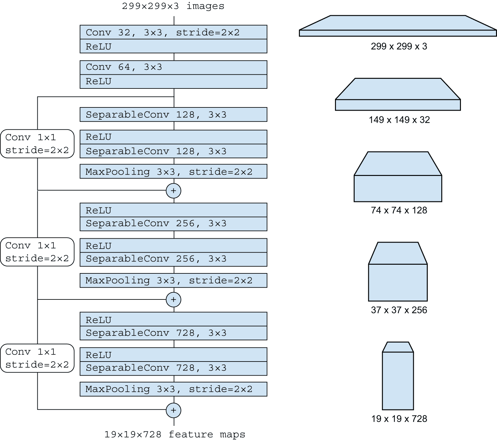
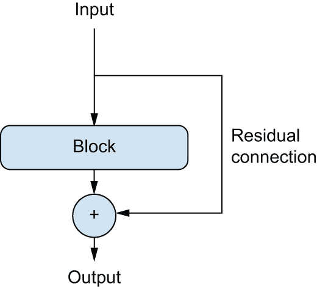
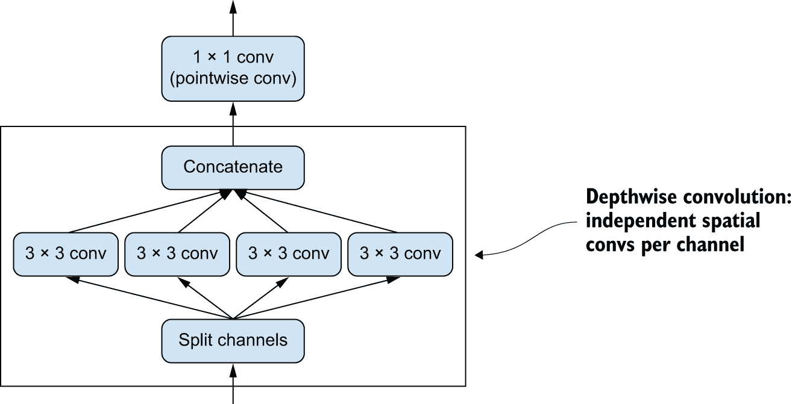
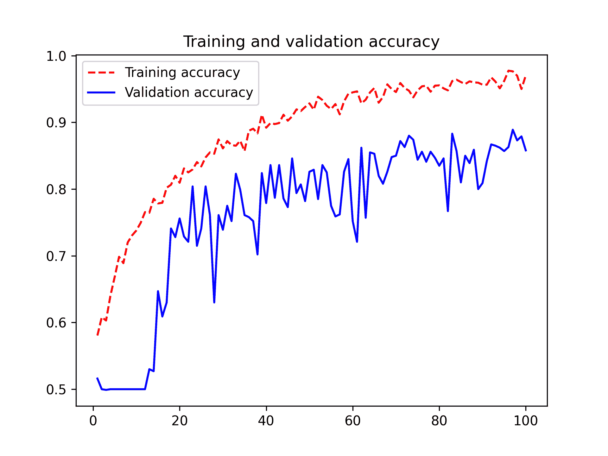
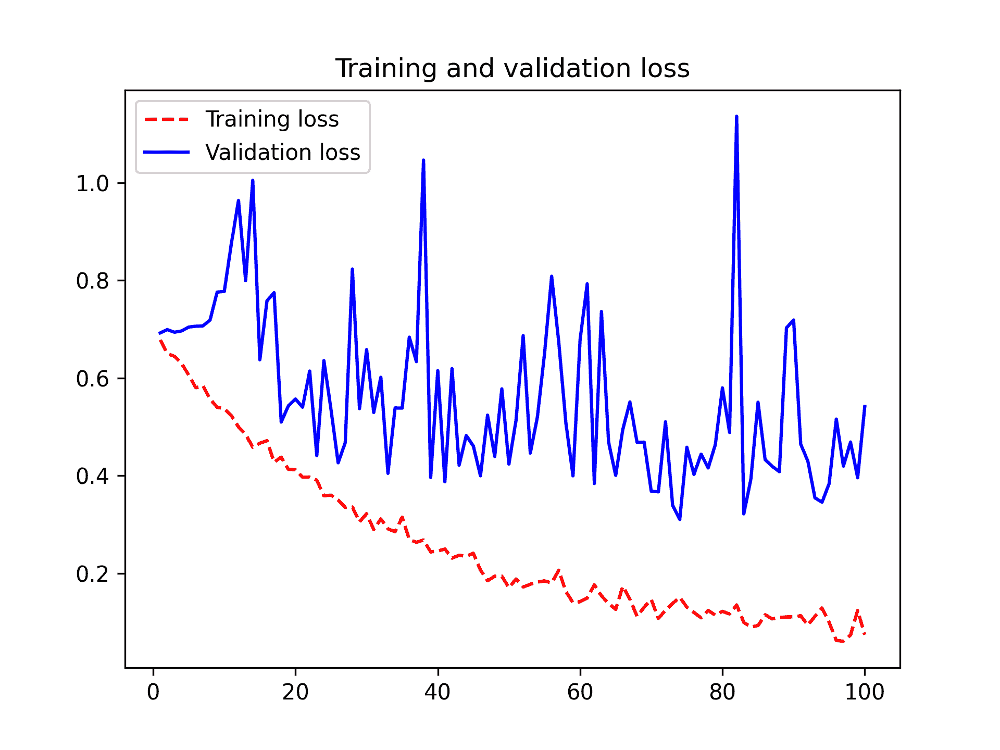

# 第九章：ConvNet 架构模式

> 原文：[`deeplearningwithpython.io/chapters/chapter09_convnet-architecture-patterns`](https://deeplearningwithpython.io/chapters/chapter09_convnet-architecture-patterns)

模型的“架构”是创建它时所做的所有选择的总和：使用哪些层，如何配置它们，以及如何连接它们的排列。这些选择定义了您模型的*假设空间*：梯度下降可以搜索的可能函数空间，由模型的权重参数化。就像特征工程一样，一个好的假设空间编码了您对当前问题和其解决方案的*先验知识*。例如，使用卷积层意味着您事先知道您输入图像中存在的相关模式是平移不变的。为了有效地从数据中学习，您需要就您要寻找的内容做出假设。

模型架构通常是成功与失败之间的区别。如果您做出不适当的架构选择，您的模型可能会陷入次优指标，并且无论多少训练数据都无法挽救它。相反，一个好的模型架构将加速学习，并使您的模型能够有效地利用可用的训练数据，减少对大型数据集的需求。一个好的模型架构是那种*减少搜索空间大小*或以其他方式*使搜索空间中的良好点更容易收敛*的架构。就像特征工程和数据整理一样，模型架构的全部都是为了*使问题对梯度下降来说更简单*——并且请记住，梯度下降是一个相当愚蠢的搜索过程，所以它需要所有它能得到的帮助。

模型架构更是一门艺术而非科学。经验丰富的机器学习工程师能够直观地组合出高性能模型，而初学者往往难以创建一个能够训练的模型。这里的关键词是*直观*：没有人能给出一个明确的解释，说明什么有效，什么无效。专家们依赖于模式匹配，这是一种他们通过大量实践经验获得的能力。您将在本书中发展自己的直觉。然而，这并不是*全部*关于直觉的——实际上并没有多少真正的科学，但就像任何工程学科一样，有最佳实践。

在接下来的章节中，我们将回顾一些基本的 ConvNet 架构最佳实践，特别是*残差连接*、*批量归一化*和*可分离卷积*。一旦您掌握了如何使用它们，您将能够构建高度有效的图像模型。我们将演示如何在我们的狗与猫分类问题上应用它们。

让我们从宏观的角度开始：系统架构的模块化-层次-重用（MHR）公式。

## 模块化、层次和重用

如果你想使一个复杂系统变得简单，有一个通用的配方你可以应用：只需将你的无序复杂汤结构化为*模块*，将模块组织成一个*层次结构*，并在适当的地方开始*重复使用*相同的模块（“重复使用”是*抽象*的另一个词）。这就是模块化-层次结构-重复（MHR）公式（见图 9.1），它几乎在所有使用术语*架构*的领域中都构成了系统架构的基础。它是任何有意义的复杂系统组织的核心，无论是大教堂、你自己的身体、美国海军，还是 Keras 代码库。


图 9.1：复杂系统遵循层次结构，并组织成不同的模块，这些模块被多次重复使用（例如你的 4 条肢体，它们都是同一蓝图的不同变体，或者你的 20 个手指）。

如果你是一名软件工程师，你已经非常熟悉这些原则：一个有效的代码库是一个模块化、层次化的代码库，你不会两次实现相同的事情，而是依赖于可重用的类和函数。如果你通过遵循这些原则来分解你的代码，你可以说你正在做“软件架构”。

深度学习本身仅仅是将这个配方应用于通过梯度下降的连续优化：你采用一个经典的优化技术（在连续函数空间上的梯度下降），并将搜索空间结构化为模块（层），组织成一个深度层次结构（通常只是一个堆栈，最简单的层次结构），在那里你可以重复使用任何可以重复的内容（例如，卷积全部关于在不同空间位置重复相同的信息）。

同样，深度学习模型架构主要关于巧妙地使用模块化、层次结构和重复。你会注意到所有流行的 ConvNet 架构不仅被结构化为层，还被结构化为重复的层组（称为*块*或*模块*）。例如，Xception 架构（在上一章中使用）被结构化为重复的`SeparableConv` - `SeparableConv` - `MaxPooling`块（见图 9.2）。

此外，大多数 ConvNets 通常具有金字塔状结构（*特征层次结构*）。回想一下，例如，我们在上一章中构建的第一个 ConvNet 中使用的卷积滤波器数量的进展：32、64、128。滤波器的数量随着层深度的增加而增加，而特征图的大小相应缩小。你会在 Xception 模型的块中注意到相同的模式（见图 9.2）。



图 9.2：Xception 架构的“入口流”：注意重复的层块和逐渐缩小和加深的特征图，从 299 x 299 x 3 变为 19 x 19 x 728。

深层层次结构本质上是有益的，因为它们鼓励特征重用，因此也鼓励抽象。一般来说，深层窄层堆叠比浅层大层堆叠表现更好。然而，层堆叠的深度有一个限制：*梯度消失*问题。这使我们来到了第一个基本模型架构模式：残差连接。

## 残差连接

你可能听说过游戏*电话*，在英国也称为*Chinese whispers*，在法国称为*telephone arabe*，在这个游戏中，一个初始信息被悄悄地告诉一个玩家，然后该玩家再悄悄地告诉下一个玩家，以此类推。最终的信息与原始版本相差甚远。这是一个有趣的隐喻，描述了在噪声信道上顺序传输过程中累积的错误。

事实上，在顺序深度学习模型中的反向传播与电话游戏非常相似。你有一系列函数，就像这样：

`y = f4(f3(f2(f1(x))))`

游戏的目的是根据记录在`f4`输出上的错误（模型的损失）来调整链中每个函数的参数。要调整`f1`，你需要通过`f2`、`f3`和`f4`传递错误信息。然而，链中的每个后续函数在过程中都会引入一些噪声。如果你的函数链太深，这种噪声开始压倒梯度信息，反向传播就不再起作用。你的模型将无法进行训练。这被称为*梯度消失*问题。

修复方法很简单：只需强制链中的每个函数都是非破坏性的——保留前一个输入中包含的无噪声版本的信息。实现这一点的最简单方法被称为*残差连接*。这非常简单：只需将层或层块的输入添加回其输出（见图 9.3）。残差连接在破坏性或噪声块（例如包含 ReLU 激活或 dropout 层的块）周围充当*信息捷径*，使早期层的错误梯度信息能够无噪声地通过深度网络传播。这项技术于 2015 年随着 ResNet 系列模型（由微软的 He 等人开发）的引入而提出。（^[[1]](#footnote-1)）



图 9.3：一个处理块周围的残差连接

在实践中，你会实现一个像以下列表那样的残差连接。

```py
# Some input tensor
x = ...
# Saves a reference to the original input. This is called the residual.
residual = x
# This computation block can potentially be destructive or noisy, and
# that's fine.
x = block(x)
# Adds the original input to the layer's output. The final output will
# thus always preserve full information about the original input.
x = add([x, residual]) 
```

代码清单 9.1：伪代码中的残差连接

注意，将输入加回到块的输出意味着输出应该与输入具有相同的形状。如果你的块包含具有增加的滤波器数量的卷积层或最大池化层，则这种情况不成立。在这种情况下，使用一个没有激活的 1 × 1 `Conv2D`层将残差线性投影到所需的输出形状。你通常会在目标块中的卷积层中使用`padding="same"`来避免由于填充造成的空间下采样，并且你会在残差投影中使用步长来匹配由最大池化层引起的任何下采样。

```py
import keras
from keras import layers

inputs = keras.Input(shape=(32, 32, 3))
x = layers.Conv2D(32, 3, activation="relu")(inputs)
# Sets aside the residual
residual = x
# This is the layer around which we create a residual connection: it
# increases the number of output filers from 32 to 64\. We use
# padding="same" to avoid downsampling due to padding.
x = layers.Conv2D(64, 3, activation="relu", padding="same")(x)
# The residual only had 32 filters, so we use a 1 x 1 Conv2D to project
# it to the correct shape.
residual = layers.Conv2D(64, 1)(residual)
# Now the block output and the residual have the same shape and can be
# added.
x = layers.add([x, residual]) 
```

列表 9.2：改变输出滤波器数量的目标块

```py
inputs = keras.Input(shape=(32, 32, 3))
x = layers.Conv2D(32, 3, activation="relu")(inputs)
# Sets aside the residual
residual = x
# This is the block of two layers around which we create a residual
# connection: it includes a 2 x 2 max pooling layer. We use
# padding="same" in both the convolution layer and the max pooling
# layer to avoid downsampling due to padding.
x = layers.Conv2D(64, 3, activation="relu", padding="same")(x)
x = layers.MaxPooling2D(2, padding="same")(x)
# We use strides=2 in the residual projection to match the downsampling
# created by the max pooling layer.
residual = layers.Conv2D(64, 1, strides=2)(residual)
# Now the block output and the residual have the same shape and can be
# added.
x = layers.add([x, residual]) 
```

列表 9.3：包含最大池化层的目标块

为了使这些想法更加具体，这里有一个简单的卷积神经网络示例，它由一系列块组成，每个块由两个卷积层和一个可选的最大池化层组成，每个块周围都有一个残差连接：

```py
inputs = keras.Input(shape=(32, 32, 3))
x = layers.Rescaling(1.0 / 255)(inputs)

# Utility function to apply a convolutional block with a residual
# connection, with an option to add max pooling
def residual_block(x, filters, pooling=False):
    residual = x
    x = layers.Conv2D(filters, 3, activation="relu", padding="same")(x)
    x = layers.Conv2D(filters, 3, activation="relu", padding="same")(x)
    if pooling:
        x = layers.MaxPooling2D(2, padding="same")(x)
        # If we use max pooling, we add a strided convolution to
        # project the residual to the expected shape.
        residual = layers.Conv2D(filters, 1, strides=2)(residual)
    elif filters != residual.shape[-1]:
        # If we don't use max pooling, we only project the residual if
        # the number of channels has changed.
        residual = layers.Conv2D(filters, 1)(residual)
    x = layers.add([x, residual])
    return x

# First block
x = residual_block(x, filters=32, pooling=True)
# Second block. Note the increasing filter count in each block.
x = residual_block(x, filters=64, pooling=True)
# The last block doesn't need a max pooling layer, since we will apply
# global average pooling right after it.
x = residual_block(x, filters=128, pooling=False)

x = layers.GlobalAveragePooling2D()(x)
outputs = layers.Dense(1, activation="sigmoid")(x)
model = keras.Model(inputs=inputs, outputs=outputs) 
```

让我们来看看模型摘要：

```py
>>> model.summary()
Model: "functional"
┏━━━━━━━━━━━━━━━━━━━━━━┳━━━━━━━━━━━━━━━━━━━━┳━━━━━━━━━━━━┳━━━━━━━━━━━━━━━━━━━━━┓
┃ Layer (type)         ┃ Output Shape       ┃    Param # ┃ Connected to        ┃
┡━━━━━━━━━━━━━━━━━━━━━━╇━━━━━━━━━━━━━━━━━━━━╇━━━━━━━━━━━━╇━━━━━━━━━━━━━━━━━━━━━┩
│ input_layer_2        │ (None, 32, 32, 3)  │          0 │ -                   │
│ (InputLayer)         │                    │            │                     │
├──────────────────────┼────────────────────┼────────────┼─────────────────────┤
│ rescaling (Rescaling)│ (None, 32, 32, 3)  │          0 │ input_layer_2[0][0] │
├──────────────────────┼────────────────────┼────────────┼─────────────────────┤
│ conv2d_6 (Conv2D)    │ (None, 32, 32, 32) │        896 │ rescaling[0][0]     │
├──────────────────────┼────────────────────┼────────────┼─────────────────────┤
│ conv2d_7 (Conv2D)    │ (None, 32, 32, 32) │      9,248 │ conv2d_6[0][0]      │
├──────────────────────┼────────────────────┼────────────┼─────────────────────┤
│ max_pooling2d_1      │ (None, 16, 16, 32) │          0 │ conv2d_7[0][0]      │
│ (MaxPooling2D)       │                    │            │                     │
├──────────────────────┼────────────────────┼────────────┼─────────────────────┤
│ conv2d_8 (Conv2D)    │ (None, 16, 16, 32) │        128 │ rescaling[0][0]     │
├──────────────────────┼────────────────────┼────────────┼─────────────────────┤
│ add_2 (Add)          │ (None, 16, 16, 32) │          0 │ max_pooling2d_1[0]… │
│                      │                    │            │ conv2d_8[0][0]      │
├──────────────────────┼────────────────────┼────────────┼─────────────────────┤
│ conv2d_9 (Conv2D)    │ (None, 16, 16, 64) │     18,496 │ add_2[0][0]         │
├──────────────────────┼────────────────────┼────────────┼─────────────────────┤
│ conv2d_10 (Conv2D)   │ (None, 16, 16, 64) │     36,928 │ conv2d_9[0][0]      │
├──────────────────────┼────────────────────┼────────────┼─────────────────────┤
│ max_pooling2d_2      │ (None, 8, 8, 64)   │          0 │ conv2d_10[0][0]     │
│ (MaxPooling2D)       │                    │            │                     │
├──────────────────────┼────────────────────┼────────────┼─────────────────────┤
│ conv2d_11 (Conv2D)   │ (None, 8, 8, 64)   │      2,112 │ add_2[0][0]         │
├──────────────────────┼────────────────────┼────────────┼─────────────────────┤
│ add_3 (Add)          │ (None, 8, 8, 64)   │          0 │ max_pooling2d_2[0]… │
│                      │                    │            │ conv2d_11[0][0]     │
├──────────────────────┼────────────────────┼────────────┼─────────────────────┤
│ conv2d_12 (Conv2D)   │ (None, 8, 8, 128)  │     73,856 │ add_3[0][0]         │
├──────────────────────┼────────────────────┼────────────┼─────────────────────┤
│ conv2d_13 (Conv2D)   │ (None, 8, 8, 128)  │    147,584 │ conv2d_12[0][0]     │
├──────────────────────┼────────────────────┼────────────┼─────────────────────┤
│ conv2d_14 (Conv2D)   │ (None, 8, 8, 128)  │      8,320 │ add_3[0][0]         │
├──────────────────────┼────────────────────┼────────────┼─────────────────────┤
│ add_4 (Add)          │ (None, 8, 8, 128)  │          0 │ conv2d_13[0][0],    │
│                      │                    │            │ conv2d_14[0][0]     │
├──────────────────────┼────────────────────┼────────────┼─────────────────────┤
│ global_average_pool… │ (None, 128)        │          0 │ add_4[0][0]         │
│ (GlobalAveragePooli… │                    │            │                     │
├──────────────────────┼────────────────────┼────────────┼─────────────────────┤
│ dense (Dense)        │ (None, 1)          │        129 │ global_average_poo… │
└──────────────────────┴────────────────────┴────────────┴─────────────────────┘
 Total params: 297,697 (1.14 MB)
 Trainable params: 297,697 (1.14 MB)
 Non-trainable params: 0 (0.00 B)
```

使用残差连接，你可以构建任意深度的网络，无需担心梯度消失问题。现在，让我们继续探讨下一个关键的卷积神经网络架构模式：*批量归一化*。

## 批量归一化

在机器学习中，*归一化*是一个广泛的类别，旨在使机器学习模型看到的不同样本彼此更加相似，这有助于模型学习并很好地泛化到新数据。最常见的数据归一化形式是你在这本书中已经看到几次的：通过从数据中减去均值来将数据中心化在零点，并通过将数据除以其标准差来给数据一个单位标准差。实际上，这假设数据遵循正态（或高斯）分布，并确保这个分布是中心化和缩放到单位方差的：

```py
normalized_data = (data - np.mean(data, axis=...)) / np.std(data, axis=...) 
```

你在这本书中看到的先前示例在将数据输入模型之前对数据进行归一化。但是，数据归一化可能是网络执行的每个转换之后的一个问题：即使进入`Dense`或`Conv2D`网络的数据具有 0 均值和单位方差，也没有理由事先期望输出数据也会是这样。对中间激活进行归一化能有所帮助吗？

批量归一化正是如此。这是一种层（在 Keras 中为`BatchNormalization`），由 Ioffe 和 Szegedy 于 2015 年引入；^([[2]](#footnote-2))它可以在训练过程中，即使均值和方差随时间变化，也能自适应地归一化数据。在训练期间，它使用当前数据批次的均值和方差来归一化样本，在推理期间（当可能没有足够大的代表性数据批次时），它使用训练期间看到的批处理均值和方差的指数移动平均值。 

虽然 Ioffe 和 Szegedy 的原始论文建议批归一化是通过“减少内部协变量偏移”来操作的，但没有人真正知道为什么批归一化有帮助。有各种假设但没有确定性。你会发现这在深度学习中很常见——深度学习不是一门精确的科学，而是一套不断变化、基于经验得出的工程最佳实践，由不可靠的叙述编织在一起。你有时会感觉你手中的书告诉你 *如何* 做某事，但并没有很好地解释 *为什么* 它有效：这是因为我们知道如何做，但不知道为什么。每当有可靠的解释时，我们都会确保提及它。批归一化不是那种情况。

实际上，批归一化的主要效果似乎是有助于梯度传播——就像残差连接一样——从而允许更深的网络。一些非常深的网络只有在包含多个 `BatchNormalization` 层的情况下才能进行训练。例如，批归一化在 Keras 包含的许多高级 ConvNet 架构中被广泛使用，如 ResNet50、EfficientNet 和 Xception。

`BatchNormalization` 层可以在任何层之后使用——`Dense`、`Conv2D` 等等：

```py
x = ...
# Because the output of the Conv2D layer gets normalized, the layer
# doesn't need its own bias vector.
x = layers.Conv2D(32, 3, use_bias=False)(x)
x = layers.BatchNormalization()(x) 
```

重要的是，我通常会推荐将前一个层的激活放在批归一化层之后（尽管这仍然是一个有争议的话题）。所以，而不是这样做

```py
x = layers.Conv2D(32, 3, activation="relu")(x)
x = layers.BatchNormalization()(x) 
```

列表 9.4：如何不使用批归一化

你实际上会做以下操作：

```py
# Note the lack of activation here.
x = layers.Conv2D(32, 3, use_bias=False)(x)
x = layers.BatchNormalization()(x)
# We place the activation after the BatchNormalization layer.
x = layers.Activation("relu")(x) 
```

列表 9.5：如何使用批归一化

直觉上，这是因为批归一化会将你的输入中心化在零点，而你的 ReLU 激活使用零作为保持或丢弃激活通道的支点：在激活之前进行归一化最大化了 ReLU 的利用率。尽管如此，这种排序最佳实践并不是绝对的，所以如果你进行卷积-激活-批归一化，你的模型仍然可以训练，你也不一定会看到更差的结果。

现在，让我们来看看我们系列中的最后一个架构模式：深度可分离卷积。

## 深度可分离卷积

假设我们告诉你有一个层可以作为 `Conv2D` 的直接替换，这将使你的模型更小（更少的可训练权重参数）、更精简（更少的浮点运算），并在其任务上提高几个百分点？这正是 *深度可分离卷积* 层所做的（在 Keras 中为 `SeparableConv2D`）。这个层对其输入的每个通道独立地进行空间卷积，然后通过点卷积（一个 1 × 1 卷积）混合输出通道，如图 9.4 所示。



图 9.4：深度可分离卷积：先进行深度卷积然后进行点卷积

这相当于将空间特征的学习和通道特征的学习分开。与卷积依赖于图像中的模式与特定位置无关的假设类似，深度可分离卷积依赖于中间激活中的空间位置*高度相关*，但*不同通道*高度独立的假设。由于这个假设通常适用于深度神经网络学习的图像表示，它作为一个有用的先验，有助于模型更有效地利用其训练数据。具有关于它将必须处理的信息结构的更强先验的模型是一个更好的模型——只要这些先验是准确的。

与常规卷积相比，深度可分离卷积需要显著更少的参数，涉及的计算也更少，同时具有可比的表示能力。它们导致模型更小，收敛更快，并且不太容易过拟合。当你在有限的数据上从头开始训练小型模型时，这些优势变得尤为重要。

当涉及到更大规模的模型时，深度可分离卷积是 Xception 架构的基础，这是一个高性能的 ConvNet，它包含在 Keras 中。你可以在论文“Xception: Deep Learning with Depthwise Separable Convolutions.”中了解更多关于深度可分离卷积和 Xception 的理论基础。[^[[3]](#footnote-3)]

## 将其整合：一个类似 Xception 的小型模型

作为提醒，以下是你迄今为止学到的 ConvNet 架构原则：

+   你的模型应该组织成重复的*块*层，通常由多个卷积层和一个最大池化层组成。

+   你的层中的滤波器数量应随着空间特征图大小的减小而增加。

+   深而窄优于宽而浅。

+   在层块周围引入残差连接有助于你训练更深的网络。

+   在你的卷积层之后引入批量归一化层可能有益。

+   将`Conv2D`层替换为更参数高效的`SeparableConv2D`层可能有益。

让我们将所有这些想法整合成一个单一模型。其架构类似于 Xception 的一个更小版本。我们将将其应用于上一章中的狗与猫的任务。对于数据加载和模型训练，只需重复使用与第八章第 8.2 节中完全相同的设置——但将模型定义替换为以下 ConvNet：

```py
import keras

inputs = keras.Input(shape=(180, 180, 3))
# Don't forget input rescaling!
x = layers.Rescaling(1.0 / 255)(inputs)
# The assumption that underlies separable convolution, "Feature
# channels are largely independent," does not hold for RGB images! Red,
# green, and blue color channels are actually highly correlated in
# natural images. As such, the first layer in our model is a regular
# `Conv2D` layer. We'll start using `SeparableConv2D` afterward.
x = layers.Conv2D(filters=32, kernel_size=5, use_bias=False)(x)

# We apply a series of convolutional blocks with increasing feature
# depth. Each block consists of two batch-normalized depthwise
# separable convolution layers and a max pooling layer, with a residual
# connection around the entire block.
for size in [32, 64, 128, 256, 512]:
    residual = x

    x = layers.BatchNormalization()(x)
    x = layers.Activation("relu")(x)
    x = layers.SeparableConv2D(size, 3, padding="same", use_bias=False)(x)

    x = layers.BatchNormalization()(x)
    x = layers.Activation("relu")(x)
    x = layers.SeparableConv2D(size, 3, padding="same", use_bias=False)(x)

    x = layers.MaxPooling2D(3, strides=2, padding="same")(x)

    residual = layers.Conv2D(
        size, 1, strides=2, padding="same", use_bias=False
    )(residual)
    x = layers.add([x, residual])

# In the original model, we used a Flatten layer before the Dense
# layer. Here, we go with a GlobalAveragePooling2D layer.
x = layers.GlobalAveragePooling2D()(x)
# Like in the original model, we add a dropout layer for
# regularization.
x = layers.Dropout(0.5)(x)
outputs = layers.Dense(1, activation="sigmoid")(x)
model = keras.Model(inputs=inputs, outputs=outputs) 
```

该 ConvNet 的可训练参数数量为 721,857，显著低于上一章模型中 1,569,089 个可训练参数，但取得了更好的结果。图 9.5 显示了训练和验证曲线。

 

图 9.5：具有类似 Xception 架构的训练和验证指标

你会发现我们的新模型达到了 90.8% 的测试准确率——相比之下，前一个模型的准确率是 83.9%。正如你所看到的，遵循架构最佳实践确实对模型性能有立即和显著的影响！

到目前为止，如果你想进一步提高性能，你应该开始系统地调整你架构的超参数——这是我们在第十八章中详细讨论的主题。我们在这里没有进行这一步骤，所以前一个模型的配置纯粹是基于我们概述的最佳实践，以及，在评估模型大小时，一点直觉。

## 超越卷积：视觉 Transformer

虽然 ConvNets 自 2010 年中叶以来一直主导着计算机视觉领域，但它们最近正与一种替代架构竞争：视觉 Transformer（简称 ViTs）。很可能 ViTs 最终会取代 ConvNets，尽管目前来说，在大多数情况下 ConvNets 仍然是你的最佳选择。

你还不知道什么是 Transformer，因为我们将在第十五章中介绍它们。简而言之，Transformer 架构是为了处理文本而开发的——它本质上是一个序列处理架构。Transformer 在此方面非常出色，这引发了一个问题：我们是否也可以将它们用于图像？

因为 ViTs 是一种 Transformer，它们也处理序列：它们将图像分割成一系列 1D 补丁，将每个补丁转换成一个平面向量，并处理向量序列。Transformer 架构允许 ViTs 捕获图像不同部分之间的长距离关系，这是 ConvNets 有时难以做到的。

我们对 Transformer 的总体经验是，如果你正在处理大量数据集，它们是一个很好的选择。它们在利用大量数据方面表现得更好。然而，对于较小的数据集，由于两个原因，它们往往不是最佳选择。首先，它们缺乏 ConvNets 的空间先验——ConvNets 的基于 2D 补丁的架构包含了更多关于视觉空间局部结构的假设，这使得它们更有效率。其次，为了使 ViTs 发挥出色，它们需要非常大。对于小于 ImageNet 的任何东西，它们最终都会变得难以处理。

图像识别霸权的竞争远未结束，但 ViTs 无疑开启了一个新的、令人兴奋的篇章。你可能会在大规模生成图像模型的背景下使用这种架构——这是我们在第十七章中将要讨论的主题。然而，对于你的小规模图像分类需求，ConvNets 仍然是你的最佳选择。

这就结束了我们对关键卷积神经网络架构最佳实践的介绍。掌握这些原则后，你将能够开发出适用于广泛计算机视觉任务的性能更高的模型。你现在正朝着成为一名熟练的计算机视觉实践者的道路迈进。为了进一步深化你的专业知识，我们还需要讨论最后一个重要主题：解释模型如何得出其预测结果。

## 摘要

+   深度学习模型的架构编码了对待解决问题本质的关键假设。

+   模块化-层次-重用公式是几乎所有复杂系统架构的基础，包括深度学习模型。

+   计算机视觉的关键架构模式包括残差连接、批归一化和深度可分离卷积。

+   视觉 Transformer 是卷积神经网络在大型计算机视觉任务中的新兴替代方案。

### 脚注

1.  Kaiming He 等人，“用于图像识别的深度残差学习”，计算机视觉与模式识别会议（2015 年），[`arxiv.org/abs/1512.03385`](https://arxiv.org/abs/1512.03385)。[[↩]](#footnote-link-1)

1.  Sergey Ioffe 和 Christian Szegedy，“通过减少内部协变量偏移加速深度网络训练：批归一化”，*第 32 届国际机器学习会议论文集*（2015 年），[`arxiv.org/abs/1502.03167`](https://arxiv.org/abs/1502.03167)。[[↩]](#footnote-link-2)

1.  François Chollet，“Xception：使用深度可分离卷积的深度学习”，计算机视觉与模式识别会议（2017 年），[`arxiv.org/abs/1610.02357`](https://arxiv.org/abs/1610.02357)。[[↩]](#footnote-link-3)
