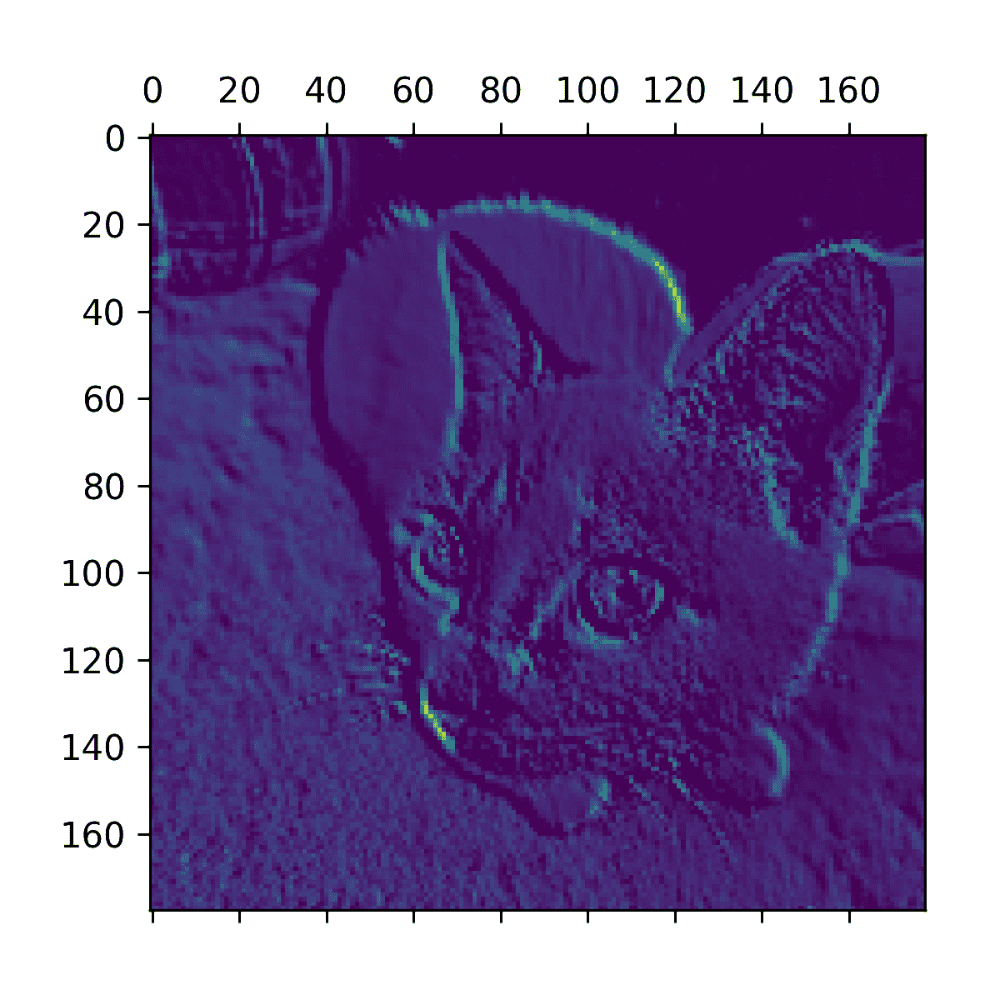
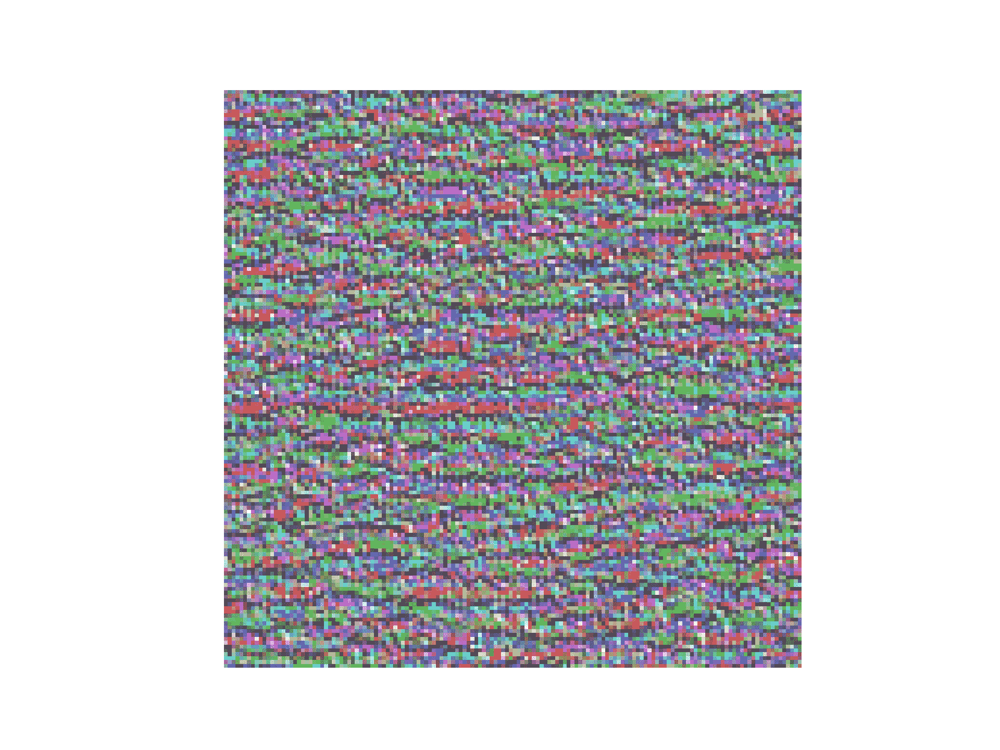
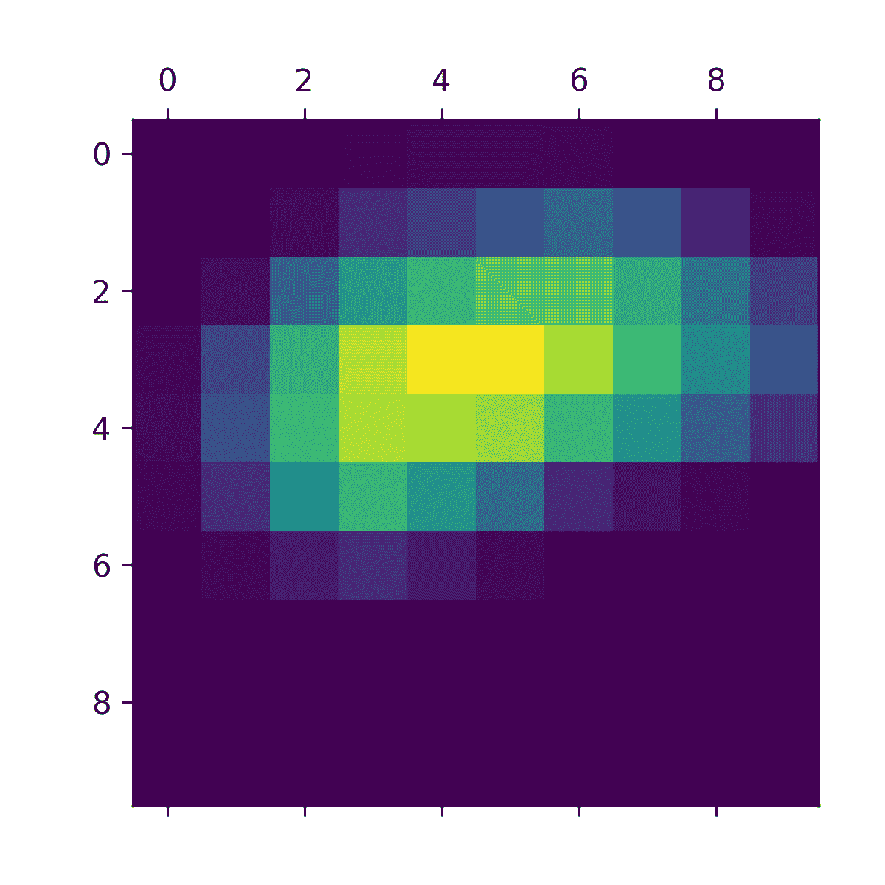

# 第十章：解释卷积神经网络学习的内容

> 原文：[`deeplearningwithpython.io/chapters/chapter10_interpreting-what-convnets-learn`](https://deeplearningwithpython.io/chapters/chapter10_interpreting-what-convnets-learn)

在构建计算机视觉应用时，一个基本问题是**可解释性**：为什么你的分类器认为某个图像包含冰箱，而你只能看到一辆卡车？这在深度学习用于补充人类专业知识的应用场景中尤为重要，例如医学影像应用场景。本章将使你熟悉一系列不同的技术，用于可视化卷积神经网络学习的内容以及理解它们的决策。

人们常说深度学习模型是“黑盒”：它们学习到的表示难以提取并以人类可读的形式呈现。虽然这在某些类型的深度学习模型中部分正确，但对于卷积神经网络来说绝对不是这样。卷积神经网络学习到的表示高度适合可视化，这在很大程度上是因为它们是**视觉概念的表示**。自 2013 年以来，已经开发出大量技术来可视化和解释这些表示。我们不会对所有这些技术进行综述，但我们将介绍三种最易于获取和最有用的技术：

+   *可视化中间卷积神经网络输出（中间激活）*——有助于理解连续的卷积神经网络层如何转换它们的输入，以及获得对单个卷积神经网络滤波器意义的初步了解

+   *可视化卷积神经网络滤波器*——有助于理解卷积神经网络中的每个滤波器对精确的视觉模式或概念的反应

+   *可视化图像中类别激活的热图*——有助于理解图像的哪些部分被识别为属于给定类别，从而允许你在图像中定位对象

对于第一种方法——激活可视化——你将使用你在第八章从头开始训练的小型卷积神经网络，用于处理狗与猫的分类问题。对于接下来的两种方法，你将使用预训练的 Xception 模型。

## 可视化中间激活

可视化中间激活包括显示模型中各种卷积和池化层在给定输入（层的输出通常称为其**激活**，激活函数的输出称为**激活值**）下返回的值。这提供了了解输入如何分解为网络学习到的不同滤波器的视角。你想要可视化的特征图有三个维度：宽度、高度和深度（通道）。每个通道编码相对独立的特点，因此可视化这些特征图的正确方法是独立地将每个通道的内容作为二维图像绘制出来。让我们先加载你在第 8.2 节中保存的模型：

```py
>>> import keras
>>> model = keras.models.load_model(
...     "convnet_from_scratch_with_augmentation.keras"
... )
>>> model.summary()
Model: "functional_3"
┏━━━━━━━━━━━━━━━━━━━━━━━━━━━━━━━━━━━┳━━━━━━━━━━━━━━━━━━━━━━━━━━┳━━━━━━━━━━━━━━━┓
┃ Layer (type)                      ┃ Output Shape             ┃       Param # ┃
┡━━━━━━━━━━━━━━━━━━━━━━━━━━━━━━━━━━━╇━━━━━━━━━━━━━━━━━━━━━━━━━━╇━━━━━━━━━━━━━━━┩
│ input_layer_3 (InputLayer)        │ (None, 180, 180, 3)      │             0 │
├───────────────────────────────────┼──────────────────────────┼───────────────┤
│ rescaling_1 (Rescaling)           │ (None, 180, 180, 3)      │             0 │
├───────────────────────────────────┼──────────────────────────┼───────────────┤
│ conv2d_11 (Conv2D)                │ (None, 178, 178, 32)     │           896 │
├───────────────────────────────────┼──────────────────────────┼───────────────┤
│ max_pooling2d_6 (MaxPooling2D)    │ (None, 89, 89, 32)       │             0 │
├───────────────────────────────────┼──────────────────────────┼───────────────┤
│ conv2d_12 (Conv2D)                │ (None, 87, 87, 64)       │        18,496 │
├───────────────────────────────────┼──────────────────────────┼───────────────┤
│ max_pooling2d_7 (MaxPooling2D)    │ (None, 43, 43, 64)       │             0 │
├───────────────────────────────────┼──────────────────────────┼───────────────┤
│ conv2d_13 (Conv2D)                │ (None, 41, 41, 128)      │        73,856 │
├───────────────────────────────────┼──────────────────────────┼───────────────┤
│ max_pooling2d_8 (MaxPooling2D)    │ (None, 20, 20, 128)      │             0 │
├───────────────────────────────────┼──────────────────────────┼───────────────┤
│ conv2d_14 (Conv2D)                │ (None, 18, 18, 256)      │       295,168 │
├───────────────────────────────────┼──────────────────────────┼───────────────┤
│ max_pooling2d_9 (MaxPooling2D)    │ (None, 9, 9, 256)        │             0 │
├───────────────────────────────────┼──────────────────────────┼───────────────┤
│ conv2d_15 (Conv2D)                │ (None, 7, 7, 512)        │     1,180,160 │
├───────────────────────────────────┼──────────────────────────┼───────────────┤
│ global_average_pooling2d_3        │ (None, 512)              │             0 │
│ (GlobalAveragePooling2D)          │                          │               │
├───────────────────────────────────┼──────────────────────────┼───────────────┤
│ dropout (Dropout)                 │ (None, 512)              │             0 │
├───────────────────────────────────┼──────────────────────────┼───────────────┤
│ dense_3 (Dense)                   │ (None, 1)                │           513 │
└───────────────────────────────────┴──────────────────────────┴───────────────┘
 Total params: 4,707,269 (17.96 MB)
 Trainable params: 1,569,089 (5.99 MB)
 Non-trainable params: 0 (0.00 B)
 Optimizer params: 3,138,180 (11.97 MB)
```

接下来，你将获得一个输入图像——一张猫的图片，这不是网络训练图像的一部分。

```py
import keras
import numpy as np

# Downloads a test image
img_path = keras.utils.get_file(
    fname="cat.jpg", origin="https://img-datasets.s3.amazonaws.com/cat.jpg"
)

def get_img_array(img_path, target_size):
    # Opens the image file and resizes it
    img = keras.utils.load_img(img_path, target_size=target_size)
    # Turns the image into a float32 NumPy array of shape (180, 180, 3)
    array = keras.utils.img_to_array(img)
    # We add a dimension to transform our array into a "batch" of a
    # single sample. Its shape is now (1, 180, 180, 3).
    array = np.expand_dims(array, axis=0)
    return array

img_tensor = get_img_array(img_path, target_size=(180, 180)) 
```

代码清单 10.1：预处理单个图像

让我们显示这张图片（见图 10.1）。

```py
import matplotlib.pyplot as plt

plt.axis("off")
plt.imshow(img_tensor[0].astype("uint8"))
plt.show() 
```

代码清单 10.2：显示测试图片


图 10.1：测试猫图片

要提取你想要查看的特征图，你需要创建一个 Keras 模型，该模型以图像批次作为输入，并输出所有卷积和池化层的激活。

```py
from keras import layers

layer_outputs = []
layer_names = []
# Extracts the outputs of all Conv2D and MaxPooling2D layers and put
# them in a list
for layer in model.layers:
    if isinstance(layer, (layers.Conv2D, layers.MaxPooling2D)):
        layer_outputs.append(layer.output)
        # Saves the layer names for later
        layer_names.append(layer.name)
# Creates a model that will return these outputs, given the model input
activation_model = keras.Model(inputs=model.input, outputs=layer_outputs) 
```

代码清单 10.3：实例化返回层激活的模型

当输入图像时，此模型返回原始模型中层激活的值，作为一个列表。这是你在第七章学习了多输出模型后，在本书中第一次在实践中遇到多输出模型：到目前为止，你看到的模型都有且只有一个输入和一个输出。这个模型有一个输入和九个输出——每个层的激活对应一个输出。

```py
# Returns a list of nine NumPy arrays — one array per layer activation
activations = activation_model.predict(img_tensor) 
```

代码清单 10.4：使用模型计算层激活

例如，这是猫图像输入的第一卷积层的激活：

```py
>>> first_layer_activation = activations[0]
>>> print(first_layer_activation.shape)
(1, 178, 178, 32)
```

这是一个 178 × 178 的特征图，有 32 个通道。让我们尝试绘制原始模型第一层激活的第六通道（见图 10.2）。

```py
import matplotlib.pyplot as plt

plt.matshow(first_layer_activation[0, :, :, 5], cmap="viridis") 
```

代码清单 10.5：可视化第六通道



图 10.2：测试猫图片第一层的激活第六通道

这个通道似乎编码了一个对角线边缘检测器，但请注意，你自己的通道可能会有所不同，因为卷积层学习的特定滤波器不是确定的。

现在，让我们绘制网络中所有激活的完整可视化（见图 10.3）。我们将提取并绘制每个层激活中的每个通道，并将结果堆叠在一个大网格中，通道并排堆叠。

```py
images_per_row = 16
# Iterates over the activations (and the names of the corresponding
# layers)
for layer_name, layer_activation in zip(layer_names, activations):
    # The layer activation has shape (1, size, size, n_features).
    n_features = layer_activation.shape[-1]
    size = layer_activation.shape[1]
    n_cols = n_features // images_per_row
    # Prepares an empty grid for displaying all the channels in this
    # activation
    display_grid = np.zeros(
        ((size + 1) * n_cols - 1, images_per_row * (size + 1) - 1)
    )
    for col in range(n_cols):
        for row in range(images_per_row):
            channel_index = col * images_per_row + row
            # This is a single channel (or feature).
            channel_image = layer_activation[0, :, :, channel_index].copy()
            # Normalizes channel values within the [0, 255] range.
            # All-zero channels are kept at zero.
            if channel_image.sum() != 0:
                channel_image -= channel_image.mean()
                channel_image /= channel_image.std()
                channel_image *= 64
                channel_image += 128
            channel_image = np.clip(channel_image, 0, 255).astype("uint8")
            # Places the channel matrix in the empty grid we prepared
            display_grid[
                col * (size + 1) : (col + 1) * size + col,
                row * (size + 1) : (row + 1) * size + row,
            ] = channel_image
    # Displays the grid for the layer
    scale = 1.0 / size
    plt.figure(
        figsize=(scale * display_grid.shape[1], scale * display_grid.shape[0])
    )
    plt.title(layer_name)
    plt.grid(False)
    plt.axis("off")
    plt.imshow(display_grid, aspect="auto", cmap="viridis") 
```

代码清单 10.6：可视化每个中间激活中的每个通道


图 10.3：测试猫图片上每个层的每个通道的激活

这里有一些需要注意的事项：

+   第一层充当各种边缘检测器的集合。在那个阶段，激活保留了初始图片中几乎所有信息。

+   随着你向上移动，激活变得越来越抽象，视觉上可解释性越来越低。它们开始编码更高级的概念，如“猫耳”和“猫眼”。更高层的表示携带越来越少的关于图像视觉内容的信息，以及越来越多的与图像类别相关的信息。

+   激活稀疏度随着层深度的增加而增加：在第一层，所有滤波器都由输入图像激活，但在后续层中，越来越多的滤波器变为空白。这意味着滤波器编码的图案在输入图像中没有找到。

我们刚刚观察到了深度神经网络学习到的表示的一个重要普遍特征：层中提取的特征随着层深度的增加而变得越来越抽象。更高层的激活携带越来越少关于特定输入的信息，而越来越多关于目标（在这种情况下，图像的类别：猫或狗）的信息。深度神经网络有效地充当一个*信息蒸馏管道*，原始数据进入（在这种情况下，RGB 图片），并被反复转换，以便过滤掉无关信息（例如，图像的具体视觉外观），并放大和细化有用信息（例如，图像的类别）。

这与人类和动物感知世界的方式类似：观察场景几秒钟后，人类可以记住其中包含哪些抽象对象（自行车、树），但无法记住这些对象的具体外观。事实上，如果你试图凭记忆画一辆通用的自行车，你很可能连大致的样子都画不出来，尽管你一生中见过成千上万辆自行车（例如，见图 10.4）。现在试试看：这种效果绝对是真实的。你的大脑已经学会了完全抽象其视觉输入——将其转化为高级视觉概念，同时过滤掉无关的视觉细节——这使得记住周围事物的外观变得极其困难。


图 10.4：左：尝试凭记忆画一辆自行车。右：一个示意图自行车应该看起来像什么。

## 可视化 ConvNet 滤波器

检查 ConvNets 学习到的滤波器的一个简单方法是通过显示每个滤波器旨在响应的视觉模式。这可以通过在输入空间中进行*梯度上升*来实现，对 ConvNet 的输入图像的值应用*梯度下降*，以*最大化*特定滤波器的响应，从空白输入图像开始。结果输入图像将是选择滤波器响应最大的图像。

让我们用 Xception 模型的滤波器来尝试这个方法。过程很简单：我们将构建一个损失函数，该函数最大化给定卷积层中给定滤波器的值，然后我们将使用随机梯度下降来调整输入图像的值，以最大化这个激活值。这将是你的第二个低级梯度下降循环的例子（第一个在第二章中）。我们将为 TensorFlow、PyTorch 和 Jax 展示它。

首先，让我们实例化在 ImageNet 数据集上训练的 Xception 模型。我们可以再次使用 KerasHub 库，就像我们在第八章中所做的那样。

```py
import keras_hub

# Instantiates the feature extractor network from pretrained weights
model = keras_hub.models.Backbone.from_preset(
    "xception_41_imagenet",
)
# Loads the matching preprocessing to scale our input images
preprocessor = keras_hub.layers.ImageConverter.from_preset(
    "xception_41_imagenet",
    image_size=(180, 180),
) 
```

代码列表 10.7：实例化 Xception 卷积基

我们对模型的卷积层感兴趣——`Conv2D`和`SeparableConv2D`层。我们需要知道它们的名称，以便检索它们的输出。让我们按深度顺序打印它们的名称。

```py
for layer in model.layers:
    if isinstance(layer, (keras.layers.Conv2D, keras.layers.SeparableConv2D)):
        print(layer.name) 
```

列表 10.8：打印 Xception 中所有卷积层的名称

你会注意到这里的`SeparableConv2D`层都命名为类似`block6_sepconv1`、`block7_sepconv2`等——Xception 被结构化为块，每个块包含几个卷积层。

现在，让我们创建第二个模型，该模型返回特定层的输出——“特征提取器”模型。由于我们的模型是功能 API 模型，它是可检查的：你可以查询其某个层的`output`并在新模型中重用它。无需复制整个 Xception 代码。

```py
# You could replace this with the name of any layer in the Xception
# convolutional base.
layer_name = "block3_sepconv1"
# This is the layer object we're interested in.
layer = model.get_layer(name=layer_name)
# We use model.input and layer.output to create a model that, given an
# input image, returns the output of our target layer.
feature_extractor = keras.Model(inputs=model.input, outputs=layer.output) 
```

列表 10.9：返回特定输出的特征提取器模型

要使用此模型，我们只需在输入数据上调用它即可，但我们应该小心应用我们模型特有的图像预处理，以确保我们的图像被缩放到与 Xception 预训练数据相同的范围。

```py
activation = feature_extractor(preprocessor(img_tensor)) 
```

列表 10.10：使用特征提取器

让我们使用我们的特征提取器模型定义一个函数，该函数返回一个标量值，量化给定输入图像在层中激活给定滤波器的程度。这是我们将在梯度上升过程中最大化的损失函数：

```py
from keras import ops

# The loss function takes an image tensor and the index of the filter
# we consider (an integer).
def compute_loss(image, filter_index):
    activation = feature_extractor(image)
    # We avoid border artifacts by only involving nonborder pixels in
    # the loss: we discard the first 2 pixels along the sides of the
    # activation.
    filter_activation = activation[:, 2:-2, 2:-2, filter_index]
    # Returns the mean of the activation values for the filter
    return ops.mean(filter_activation) 
```

一个有助于梯度上升过程顺利进行的非明显技巧是将梯度张量通过除以其 L2 范数（张量中值的平方和的平方根）进行归一化。这确保了对输入图像所做的更新幅度始终在相同的范围内。

让我们设置梯度上升步骤函数。任何涉及梯度的操作都需要调用后端 API，例如 TensorFlow 中的`GradientTape`、PyTorch 中的`.backward()`和 JAX 中的`jax.grad()`。让我们排列出三个后端中每个后端的代码片段，从 TensorFlow 开始。

### TensorFlow 中的梯度上升

对于 TensorFlow，我们只需打开一个`GradientTape`作用域，在其中计算损失以检索所需的梯度。我们将使用`@tf.function`装饰器来加速计算：

```py
import tensorflow as tf

@tf.function
def gradient_ascent_step(image, filter_index, learning_rate):
    with tf.GradientTape() as tape:
        # Explicitly watches the image tensor, since it isn't a
        # TensorFlow Variable (only Variables are automatically watched
        # in a gradient tape)
        tape.watch(image)
        # Computes the loss scalar, indicating how much the current
        # image activates the filter
        loss = compute_loss(image, filter_index)
    # Computes the gradients of the loss with respect to the image
    grads = tape.gradient(loss, image)
    # Applies the "gradient normalization trick"
    grads = ops.normalize(grads)
    # Moves the image a little bit in a direction that activates our
    # target filter more strongly
    image += learning_rate * grads
    # Returns the updated image, so we can run the step function in a
    # loop
    return image 
```

列表 10.11：通过随机梯度上升进行损失最大化：TensorFlow

### PyTorch 中的梯度上升

在 PyTorch 的情况下，我们使用`loss.backward()`和`image.grad`来获取相对于输入图像的损失梯度，如下所示。

```py
import torch

def gradient_ascent_step(image, filter_index, learning_rate):
    # Creates a copy of "image" that we can get gradients for.
    image = image.clone().detach().requires_grad_(True)
    loss = compute_loss(image, filter_index)
    loss.backward()
    grads = image.grad
    grads = ops.normalize(grads)
    image = image + learning_rate * grads
    return image 
```

列表 10.12：通过随机梯度上升进行损失最大化：PyTorch

由于图像张量在每个迭代中都会被重新创建，因此无需重置梯度。

### JAX 中的梯度上升

在 JAX 的情况下，我们使用`jax.grad()`来获取一个函数，该函数返回相对于输入图像的损失梯度。

```py
import jax

grad_fn = jax.grad(compute_loss)

@jax.jit
def gradient_ascent_step(image, filter_index, learning_rate):
    grads = grad_fn(image, filter_index)
    grads = ops.normalize(grads)
    image += learning_rate * grads
    return image 
```

列表 10.13：通过随机梯度上升进行损失最大化：JAX

### 过滤器可视化循环

现在您已经拥有了所有部件。让我们将它们组合成一个 Python 函数，该函数接受一个过滤器索引作为输入，并返回一个表示在目标层中最大化指定过滤器激活的模式张量。

```py
img_width = 200
img_height = 200

def generate_filter_pattern(filter_index):
    # The number of gradient ascent steps to apply
    iterations = 30
    # The amplitude of a single step
    learning_rate = 10.0
    image = keras.random.uniform(
        # Initialize an image tensor with random values. (The Xception
        # model expects input values in the [0, 1] range, so here we
        # pick a range centered on 0.5.)
        minval=0.4, maxval=0.6, shape=(1, img_width, img_height, 3)
    )
    # Repeatedly updates the values of the image tensor to maximize our
    # loss function
    for i in range(iterations):
        image = gradient_ascent_step(image, filter_index, learning_rate)
    return image[0] 
```

列表 10.14：生成过滤器可视化的函数

结果的图像张量是一个形状为 `(200, 200, 3)` 的浮点数组，其值可能不在 `[0, 255]` 的整数范围内。因此，您需要后处理这个张量，将其转换为可显示的图像。您可以使用以下简单的实用函数来完成此操作。

```py
def deprocess_image(image):
    # Normalizes image values within the [0, 255] range
    image -= ops.mean(image)
    image /= ops.std(image)
    image *= 64
    image += 128
    image = ops.clip(image, 0, 255)
    # Center crop to avoid border artifacts
    image = image[25:-25, 25:-25, :]
    image = ops.cast(image, dtype="uint8")
    return ops.convert_to_numpy(image) 
```

列表 10.15：将张量转换为有效图像的实用函数

让我们试试（见图 10.5）：

```py
>>> plt.axis("off")
>>> plt.imshow(deprocess_image(generate_filter_pattern(filter_index=2)))
```



图 10.5：层 `block3_sepconv1` 第二通道响应最大的模式

看起来，层 `block3_sepconv1` 中的过滤器 2 对水平线图案有响应，有点像水或毛发的样子。

现在是时候进行有趣的部分了：您可以从可视化层中的每个过滤器开始——甚至可以可视化模型中每一层的每个过滤器（见图 10.6）。

```py
# Generates and saves visualizations for the first 64 filters in the
# layer
all_images = []
for filter_index in range(64):
    print(f"Processing filter {filter_index}")
    image = deprocess_image(generate_filter_pattern(filter_index))
    all_images.append(image)

# Prepares a blank canvas for us to paste filter visualizations
margin = 5
n = 8
box_width = img_width - 25 * 2
box_height = img_height - 25 * 2
full_width = n * box_width + (n - 1) * margin
full_height = n * box_height + (n - 1) * margin
stitched_filters = np.zeros((full_width, full_height, 3))

# Fills the picture with our saved filters
for i in range(n):
    for j in range(n):
        image = all_images[i * n + j]
        stitched_filters[
            (box_width + margin) * i : (box_width + margin) * i + box_width,
            (box_height + margin) * j : (box_height + margin) * j + box_height,
            :,
        ] = image

# Saves the canvas to disk
keras.utils.save_img(f"filters_for_layer_{layer_name}.png", stitched_filters) 
```

列表 10.16：生成所有过滤器响应模式的网格


图 10.6：`block2_sepconv1`、`block4_sepconv1` 和 `block8_sepconv1` 层的一些过滤器模式

这些过滤器可视化向您展示了卷积神经网络层如何观察世界：卷积神经网络中的每一层都学习一组过滤器，使得其输入可以表示为这些过滤器的组合。这类似于傅里叶变换将信号分解到一系列余弦函数中。随着你在模型中向上移动，这些卷积神经网络过滤器库中的过滤器变得越来越复杂和精细：

+   模型第一层的过滤器编码简单的方向边缘和颜色（或在某些情况下，彩色边缘）。

+   栈中更高层的层，如 `block4_sepconv1`，编码由边缘和颜色组合而成的简单纹理。

+   高层中的过滤器开始类似于自然图像中找到的纹理：羽毛、眼睛、叶子等等。

## 可视化类别激活的热图

这里是最后一种可视化技术——一种有助于理解给定图像的哪些部分导致卷积神经网络做出最终分类决策的技术。这对于“调试”卷积神经网络的决策过程非常有用，尤其是在分类错误的情况下（一个被称为 *模型可解释性* 的领域问题）。它还可以让您在图像中定位特定对象。

这种一般的技术类别被称为 *类别激活图*（CAM）的可视化，它包括在输入图像上生成类别激活的热图。一个类别激活热图是与特定输出类别相关联的分数的 2D 网格，为任何输入图像中的每个位置计算，指示每个位置相对于考虑的类别的相对重要性。例如，给定一个输入到狗与猫的 ConvNet 的图像，CAM 可视化将允许你为“猫”类别生成热图，指示图像的不同部分有多像猫，以及为“狗”类别生成热图，指示图像的不同部分有多像狗。我们将使用的具体实现是 Selvaraju 等人描述的（[[1]](#footnote-1))。

Grad-CAM 包括取一个卷积层的输出特征图，给定一个输入图像，并按类别相对于通道的梯度对该特征图中的每个通道进行加权。直观地说，理解这个技巧的一种方式是，你通过“每个通道相对于类别的相对重要性”来加权“输入图像激活不同通道的强度”的空间图，从而得到一个“输入图像激活类别的强度”的空间图。

让我们使用预训练的 Xception 模型来演示这项技术。考虑图 10.7 中显示的两只非洲象的图像，可能是一只母象和她的幼崽，在草原上漫步。我们可以从下载这张图像并将其转换为 NumPy 数组开始，如图 10.7 所示。


图 10.7：非洲象的测试图片

```py
# Downloads the image and stores it locally under the path img_path
img_path = keras.utils.get_file(
    fname="elephant.jpg",
    origin="https://img-datasets.s3.amazonaws.com/elephant.jpg",
)
# Returns a Python Imaging Library (PIL) image
img = keras.utils.load_img(img_path)
img_array = np.expand_dims(img, axis=0) 
```

代码列表 10.17：为 Xception 预处理输入图像

到目前为止，我们只使用了 KerasHub 来实例化一个使用骨干类预训练的特征提取网络。对于 Grad-CAM，我们需要整个 Xception 模型，包括分类头——回想一下，Xception 是在 ImageNet 数据集上训练的，该数据集包含约 100 万张标签图像，属于 1,000 个不同的类别。

KerasHub 提供了一个高级 *任务* API，用于常见的端到端工作流程，如图像分类、文本分类、图像生成等。一个任务将预处理、特征提取网络和特定任务的头封装成一个易于使用的单个类。让我们试试看：

```py
>>> model = keras_hub.models.ImageClassifier.from_preset(
...    "xception_41_imagenet",
...    # We can configure the final activation of the classifier. Here,
...    # we use a softmax activation so our outputs are probabilities.
...    activation="softmax",
... )
>>> preds = model.predict(img_array)
>>> # ImageNet has 1,000 classes, so each prediction from our
>>> # classifier has 1,000 entries.
>>> preds.shape
(1, 1000)
>>> keras_hub.utils.decode_imagenet_predictions(preds)
[[("African_elephant", 0.90331),
  ("tusker", 0.05487),
  ("Indian_elephant", 0.01637),
  ("triceratops", 0.00029),
  ("Mexican_hairless", 0.00018)]]
```

对于此图像预测的前五个类别如下：

+   非洲象（90% 的概率）

+   非洲象（5% 的概率）

+   亚洲象（2% 的概率）

+   三角龙和墨西哥无毛犬，概率低于 0.1%

网络已识别出图像包含不确定数量的非洲象。预测向量中激活程度最高的条目是对应于“非洲象”类别的，索引为 386：

```py
>>> np.argmax(preds[0])
386
```

为了可视化图像中最像非洲象的部分，让我们设置 Grad-CAM 的过程。

你会注意到，在调用任务模型之前，我们不需要对图像进行预处理。这是因为 KerasHub 的 `ImageClassifier` 在 `predict()` 方法中为我们预处理输入。让我们自己预处理图像，以便我们可以直接使用预处理后的输入：

```py
# KerasHub tasks like ImageClassifier have a preprocessor layer.
img_array = model.preprocessor(img_array) 
```

首先，我们创建一个模型，将输入图像映射到最后一层卷积层的激活。

```py
last_conv_layer_name = "block14_sepconv2_act"
last_conv_layer = model.backbone.get_layer(last_conv_layer_name)
last_conv_layer_model = keras.Model(model.inputs, last_conv_layer.output) 
```

列表 10.18：返回最后一层卷积输出

第二，我们创建一个模型，将最后一层卷积层的激活映射到最终的类别预测。

```py
classifier_input = last_conv_layer.output
x = classifier_input
for layer_name in ["pooler", "predictions"]:
    x = model.get_layer(layer_name)(x)
classifier_model = keras.Model(classifier_input, x) 
```

列表 10.19：从最后一层卷积输出到最终预测

然后，我们计算输入图像相对于最后一层卷积层激活的顶级预测类梯度。再次强调，需要计算梯度意味着我们必须使用后端 API。

### 获取顶级类梯度：TensorFlow 版本

让我们从 TensorFlow 版本开始，再次使用 `GradientTape`。

```py
import tensorflow as tf

def get_top_class_gradients(img_array):
    # Computes activations of the last conv layer and makes the tape
    # watch it
    last_conv_layer_output = last_conv_layer_model(img_array)
    with tf.GradientTape() as tape:
        tape.watch(last_conv_layer_output)
        preds = classifier_model(last_conv_layer_output)
        top_pred_index = ops.argmax(preds[0])
        # Retrieves the activation channel corresponding to the top
        # predicted class
        top_class_channel = preds[:, top_pred_index]

    # Gets the gradient of the top predicted class with regard to the
    # output feature map of the last convolutional layer
    grads = tape.gradient(top_class_channel, last_conv_layer_output)
    return grads, last_conv_layer_output

grads, last_conv_layer_output = get_top_class_gradients(img_array)
grads = ops.convert_to_numpy(grads)
last_conv_layer_output = ops.convert_to_numpy(last_conv_layer_output) 
```

列表 10.20：使用 TensorFlow 计算顶级类梯度

### 获取顶级类梯度：PyTorch 版本

接下来，这是 PyTorch 版本，使用 `.backward()` 和 `.grad`。

```py
def get_top_class_gradients(img_array):
    # Computes activations of the last conv layer
    last_conv_layer_output = last_conv_layer_model(img_array)
    # Creates a copy of last_conv_layer_output that we can get
    # gradients for
    last_conv_layer_output = (
        last_conv_layer_output.clone().detach().requires_grad_(True)
    )
    # Retrieves the activation channel corresponding to the top
    # predicted class
    preds = classifier_model(last_conv_layer_output)
    top_pred_index = ops.argmax(preds[0])
    top_class_channel = preds[:, top_pred_index]
    # Gets the gradient of the top predicted class with regard to the
    # output feature map of the last convolutional layer
    top_class_channel.backward()
    grads = last_conv_layer_output.grad
    return grads, last_conv_layer_output

grads, last_conv_layer_output = get_top_class_gradients(img_array)
grads = ops.convert_to_numpy(grads)
last_conv_layer_output = ops.convert_to_numpy(last_conv_layer_output) 
```

列表 10.21：使用 PyTorch 计算顶级类梯度

### 获取顶级类梯度：JAX 版本

最后，让我们来做 JAX。我们定义一个单独的损失计算函数，它接受最终层的输出并返回对应于顶级预测类的激活通道。我们使用这个激活值作为我们的损失，从而计算梯度。

```py
import jax

# Defines a separate loss function
def loss_fn(last_conv_layer_output):
    preds = classifier_model(last_conv_layer_output)
    top_pred_index = ops.argmax(preds[0])
    top_class_channel = preds[:, top_pred_index]
    # Returns the activation value of the top-class channel
    return top_class_channel[0]

# Creates a gradient function
grad_fn = jax.grad(loss_fn)

def get_top_class_gradients(img_array):
    last_conv_layer_output = last_conv_layer_model(img_array)
    # Now  retrieving the gradient of the top-class channel is just a
    # matter of calling the gradient function!
    grads = grad_fn(last_conv_layer_output)
    return grads, last_conv_layer_output

grads, last_conv_layer_output = get_top_class_gradients(img_array)
grads = ops.convert_to_numpy(grads)
last_conv_layer_output = ops.convert_to_numpy(last_conv_layer_output) 
```

列表 10.22：使用 Jax 计算顶级类梯度

### 显示类别激活热图

现在，我们将池化和重要性权重应用于梯度张量，以获得我们的类别激活热图。

```py
# This is a vector where each entry is the mean intensity of the
# gradient for a given channel. It quantifies the importance of each
# channel with regard to the top predicted class.
pooled_grads = np.mean(grads, axis=(0, 1, 2))
last_conv_layer_output = last_conv_layer_output[0].copy()
# Multiplies each channel in the output of the last convolutional layer
# by how important this channel is
for i in range(pooled_grads.shape[-1]):
    last_conv_layer_output[:, :, i] *= pooled_grads[i]
# The channel-wise mean of the resulting feature map is our heatmap of
# class activation.
heatmap = np.mean(last_conv_layer_output, axis=-1) 
```

列表 10.23：梯度池化和通道重要性权重

为了可视化目的，你还需要将热图归一化到 0 到 1 之间。结果如图 10.8 所示。

```py
heatmap = np.maximum(heatmap, 0)
heatmap /= np.max(heatmap)
plt.matshow(heatmap) 
```

列表 10.24：热图后处理



图 10.8：独立的类别激活热图

最后，让我们生成一个图像，将原始图像叠加到你刚刚获得的热图上（见图 10.9）。

```py
import matplotlib.cm as cm

# Loads the original image
img = keras.utils.load_img(img_path)
img = keras.utils.img_to_array(img)

# Rescales the heatmap to the range 0–255
heatmap = np.uint8(255 * heatmap)

# Uses the "jet" colormap to recolorize the heatmap
jet = cm.get_cmap("jet")
jet_colors = jet(np.arange(256))[:, :3]
jet_heatmap = jet_colors[heatmap]

# Creates an image that contains the recolorized heatmap
jet_heatmap = keras.utils.array_to_img(jet_heatmap)
jet_heatmap = jet_heatmap.resize((img.shape[1], img.shape[0]))
jet_heatmap = keras.utils.img_to_array(jet_heatmap)

# Superimposes the heatmap and the original image, with the heatmap at
# 40% opacity
superimposed_img = jet_heatmap * 0.4 + img
superimposed_img = keras.utils.array_to_img(superimposed_img)

# Shows the superimposed image
plt.imshow(superimposed_img) 
```

列表 10.25：将热图与原始图像叠加


图 10.9：测试图片上的非洲象类别激活热图

这种可视化技术回答了两个重要问题：

+   为什么网络认为这张图片包含非洲象？

+   图片中非洲象在哪里？

特别值得注意的是，小象的耳朵激活非常强烈：这可能是网络区分非洲象和亚洲象的方式。

## 摘要

+   卷积神经网络通过应用一系列学习到的过滤器来处理图像。早期层的过滤器检测边缘和基本纹理，而后期层的过滤器检测越来越抽象的概念。

+   您可以可视化过滤器检测到的模式和过滤器在整个图像中的响应图。

+   您可以使用 Grad-CAM 技术来可视化图像中哪些区域负责了分类器的决策。

+   这些技术共同使得卷积神经网络具有高度的可解释性。

### 脚注

1.  Ramprasaath R. Selvaraju 等人，“Grad-CAM: 通过基于梯度的定位从深度网络中获取视觉解释，” arxiv (2019)，[`arxiv.org/abs/1610.02391`](https://arxiv.org/abs/1610.02391)。[[↩]](#footnote-link-1)
