# 第十三章：时间序列预测

> 原文：[`deeplearningwithpython.io/chapters/chapter13_timeseries-forecasting`](https://deeplearningwithpython.io/chapters/chapter13_timeseries-forecasting)

本章探讨时间序列，其中时间顺序至关重要。我们将重点关注最常见且最有价值的时间序列任务：预测。使用最近的过去来预测近未来的能力非常强大，无论您是试图预测能源需求、管理库存还是简单地预测天气。

## 不同类型的时间序列任务

一个 *时间序列* 可以是任何通过定期测量获得的数据，例如股票的每日价格、城市的每小时电力消耗或商店的每周销售额。时间序列无处不在，无论是观察自然现象（如地震活动、河流中鱼类种群的变化或某地的天气）还是人类活动模式（如网站访问者、一个国家的 GDP 或信用卡交易）。与您迄今为止遇到的数据类型不同，处理时间序列需要理解系统的 *动态* —— 它的周期性循环、随时间的变化趋势、常规状态和突然的峰值。

到目前为止，最常见的时间序列相关任务是 *预测*：预测序列中接下来会发生什么。提前几小时预测电力消耗，以便您可以预测需求；提前几个月预测收入，以便您可以规划预算；提前几天预测天气，以便您可以规划日程。预测是本章的重点。但实际上，您可以用时间序列做很多事情，例如

+   *异常检测* —— 在连续数据流中检测任何异常事件。公司网络上的异常活动？可能是攻击者。生产线上的异常读数？是时候让人类去看看了。异常检测通常通过无监督学习来完成，因为您通常不知道您在寻找哪种异常，因此您无法在特定的异常示例上进行训练。

+   *分类* —— 将一个或多个分类标签分配给时间序列。例如，给定网站访问者活动的时间序列，判断该访问者是机器人还是人类。

+   *事件检测* —— 在连续数据流中识别特定、预期的事件发生。特别有用的应用是“热词检测”，其中模型监控音频流并检测“OK, Google”或“Hey, Alexa”等语音。

在本章中，您将了解循环神经网络（RNNs）及其在时间序列预测中的应用。

## 一个温度预测示例

在本章中，我们所有的代码示例都将针对一个问题：根据最近过去由一组安装在建筑物屋顶的传感器记录的诸如大气压力和湿度等量的每小时测量值的时间序列，预测未来 24 小时的温度。正如你将看到的，这是一个相当具有挑战性的问题！

我们将使用这个温度预测任务来突出时间序列数据与迄今为止你遇到的数据集的基本不同之处，以表明密集连接的网络和卷积网络并不适合处理它，并展示一种新的机器学习技术，这种技术在处理这类问题上表现得非常出色：循环神经网络（RNNs）。

我们将使用德国耶拿马克斯·普朗克生物地球化学研究所气象站记录的气象时间序列数据集进行工作.^([[1]](#footnote-1)) 在这个数据集中，记录了 14 个不同的量（如温度、大气压力、湿度、风向等），每隔 10 分钟记录一次，持续了数年。原始数据可以追溯到 2003 年，但我们将要下载的数据子集限制在 2009-2016 年。

让我们开始下载和解压缩数据：

```py
!wget https://s3.amazonaws.com/keras-datasets/jena_climate_2009_2016.csv.zip
!unzip jena_climate_2009_2016.csv.zip 
```

让我们来看看数据。

```py
import os

fname = os.path.join("jena_climate_2009_2016.csv")

with open(fname) as f:
    data = f.read()

lines = data.split("\n")
header = lines[0].split(",")
lines = lines[1:]
print(header)
print(len(lines)) 
```

代码列表 13.1：检查耶拿气象数据集的数据

这输出了 420,551 行数据的计数（每行是一个时间步长：一个日期和 14 个与天气相关的值的记录），以及以下标题：

```py
["Date Time",
 "p (mbar)",
 "T (degC)",
 "Tpot (K)",
 "Tdew (degC)",
 "rh (%)",
 "VPmax (mbar)",
 "VPact (mbar)",
 "VPdef (mbar)",
 "sh (g/kg)",
 "H2OC (mmol/mol)",
 "rho (g/m**3)",
 "wv (m/s)",
 "max. wv (m/s)",
 "wd (deg)"] 
```

现在，将所有 420,551 行数据转换为 NumPy 数组：一个数组用于温度（以摄氏度为单位），另一个数组用于其余的数据——我们将使用这些特征来预测未来的温度。请注意，我们丢弃了“日期时间”列。

```py
import numpy as np

temperature = np.zeros((len(lines),))
raw_data = np.zeros((len(lines), len(header) - 1))

for i, line in enumerate(lines):
    values = [float(x) for x in line.split(",")[1:]]
    # We store column 1 in the temperature array.
    temperature[i] = values[1]
    # We store all columns (including the temperature) in the raw_data
    # array.
    raw_data[i, :] = values[:] 
```

代码列表 13.2：解析数据

图 13.1 显示了温度（以摄氏度为单位）随时间变化的图表。在这张图上，你可以清楚地看到温度的年度周期性——数据跨度为八年。

```py
from matplotlib import pyplot as plt

plt.plot(range(len(temperature)), temperature) 
```

代码列表 13.3：绘制温度时间序列图

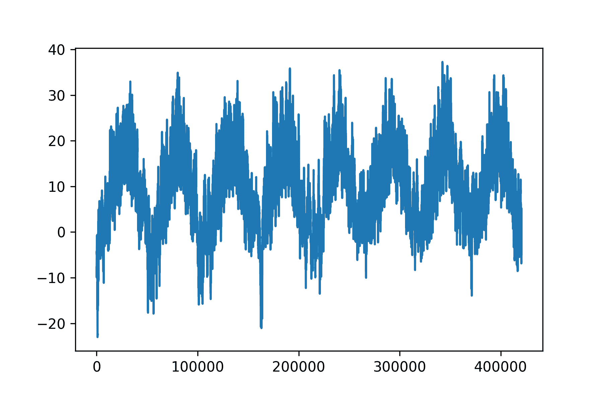

图 13.1：数据集整个时间范围内的温度（ºC）

图 13.2 显示了温度数据的前 10 天的更窄的图表。因为数据每 10 分钟记录一次，所以每天有 24 × 6 = 144 个数据点。

```py
plt.plot(range(1440), temperature[:1440]) 
```

代码列表 13.4：绘制温度时间序列的前 10 天

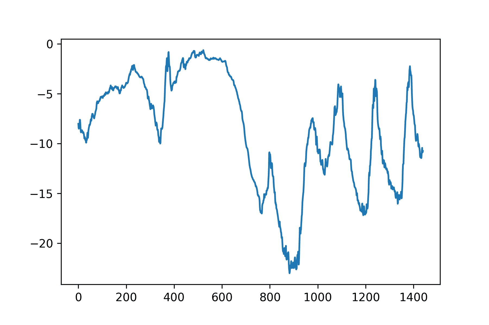

图 13.2：数据集前 10 天的温度（ºC）

在这张图上，你可以看到日周期性，特别是在最后四天尤为明显。同时请注意，这个 10 天的周期必须来自一个相当寒冷的冬季月份。

在我们的数据集中，如果您试图根据几个月的过去数据预测下一个月的平均温度，这个问题将很容易，因为数据的可靠年周期性。但是，从日的时间尺度来看，温度看起来要混乱得多。这个时间序列在日尺度上可预测吗？让我们来看看。

在我们所有的实验中，我们将使用数据的前 50%进行训练，接下来的 25%进行验证，最后的 25%进行测试。当处理时间序列数据时，使用比训练数据更近期的验证和测试数据非常重要，因为您试图根据过去预测未来，而不是相反，并且您的验证/测试拆分应该反映这种时间顺序。如果反转时间轴，某些问题可能会变得相当简单！

```py
>>> num_train_samples = int(0.5 * len(raw_data))
>>> num_val_samples = int(0.25 * len(raw_data))
>>> num_test_samples = len(raw_data) - num_train_samples - num_val_samples
>>> print("num_train_samples:", num_train_samples)
>>> print("num_val_samples:", num_val_samples)
>>> print("num_test_samples:", num_test_samples)
num_train_samples: 210225
num_val_samples: 105112
num_test_samples: 105114
```

列表 13.5：计算每个数据拆分的样本数量

### 准备数据

问题的确切表述如下：给定覆盖前五天且每小时采样一次的数据，我们能否预测 24 小时后的温度？

首先，让我们预处理数据，使其成为神经网络可以摄入的格式。这很简单：数据已经是数值的，因此您不需要进行任何向量化。但是，数据中的每个时间序列都在不同的尺度上（例如，大气压力，以毫巴为单位，约为 1,000，而 H2OC，以每摩尔毫摩尔为单位，约为 3）。我们将独立归一化每个时间序列，使它们都在相似的尺度上取小值。我们将使用前 210,225 个时间步作为训练数据，因此我们只计算这个数据分量的均值和标准差。

```py
mean = raw_data[:num_train_samples].mean(axis=0)
raw_data -= mean
std = raw_data[:num_train_samples].std(axis=0)
raw_data /= std 
```

列表 13.6：数据归一化

接下来，让我们创建一个 `Dataset` 对象，它提供过去五天的数据批次以及未来 24 小时的温度目标。由于数据集中的样本高度冗余（样本 `N` 和样本 `N + 1` 将有大部分时间步长是相同的），明确为每个样本分配内存将是浪费的。相反，我们将动态生成样本，同时只在内存中保留原始 `raw_data` 和 `temperature` 数组，不再需要其他任何东西。

我们可以轻松地编写一个 Python 生成器来完成这项工作，但 Keras 中有一个内置的数据集实用工具可以做到这一点（`timeseries_dataset_from_array()`），因此我们可以通过使用它来节省一些工作。您通常可以使用它来完成任何类型的时序预测任务。

我们将使用 `timeseries_dataset_from_array` 来实例化三个数据集：一个用于训练，一个用于验证，一个用于测试。

我们将使用以下参数值：

+   `sampling_rate = 6` — 观测将以每小时一个数据点的频率进行采样：我们将只保留六个数据点中的一个。

+   `sequence_length = 120` — 观测将回溯五天（120 小时）。

+   `delay = sampling_rate * (sequence_length + 24 - 1)` — 序列的目标将是序列结束后的 24 小时温度。

+   `start_index = 0` 和 `end_index = num_train_samples` — 对于训练数据集，仅使用前 50%的数据。

+   `start_index = num_train_samples` 和 `end_index = num_train_samples + num_val_samples` — 对于验证数据集，仅使用接下来的 25%的数据。

+   `start_index = num_train_samples + num_val_samples` — 对于测试数据集，使用剩余的样本。

```py
sampling_rate = 6
sequence_length = 120
delay = sampling_rate * (sequence_length + 24 - 1)
batch_size = 256

train_dataset = keras.utils.timeseries_dataset_from_array(
    raw_data[:-delay],
    targets=temperature[delay:],
    sampling_rate=sampling_rate,
    sequence_length=sequence_length,
    shuffle=True,
    batch_size=batch_size,
    start_index=0,
    end_index=num_train_samples,
)

val_dataset = keras.utils.timeseries_dataset_from_array(
    raw_data[:-delay],
    targets=temperature[delay:],
    sampling_rate=sampling_rate,
    sequence_length=sequence_length,
    shuffle=True,
    batch_size=batch_size,
    start_index=num_train_samples,
    end_index=num_train_samples + num_val_samples,
)

test_dataset = keras.utils.timeseries_dataset_from_array(
    raw_data[:-delay],
    targets=temperature[delay:],
    sampling_rate=sampling_rate,
    sequence_length=sequence_length,
    shuffle=True,
    batch_size=batch_size,
    start_index=num_train_samples + num_val_samples,
) 
```

列表 13.7：实例化用于训练、验证和测试的数据集

每个数据集都产生一个元组 `(samples, targets)`，其中 `samples` 是包含 256 个样本的批次，每个样本包含 120 个连续小时的输入数据，而 `targets` 是相应的 256 个目标温度数组。请注意，样本是随机打乱的，因此批次中的连续序列（如 `samples[0]` 和 `samples[1]`）不一定在时间上接近。

```py
>>> for samples, targets in train_dataset:
>>>     print("samples shape:", samples.shape)
>>>     print("targets shape:", targets.shape)
>>>     break
samples shape: (256, 120, 14)
targets shape: (256,)
```

列表 13.8：检查数据集

### 常识性、非机器学习基线

在您开始使用黑盒深度学习模型来解决温度预测问题之前，让我们尝试一种简单、常识性的方法。这将作为合理性检查，并建立一个基线，您必须超越这个基线才能证明更高级、基于机器学习模型的实用性。这种常识性基线在您面对一个尚未找到已知解决方案的新问题时可能很有用。一个经典的例子是不平衡分类任务，其中某些类别比其他类别更常见。如果您的数据集中包含 90%的类别 A 实例和 10%的类别 B 实例，那么对分类任务的常识性方法是，在呈现新样本时始终预测“A”。这样的分类器总体准确率为 90%，因此任何基于学习的算法都应该超越这个 90%的分数以证明其有用性。有时，这样的基本基线可能难以超越。

在这个情况下，可以安全地假设温度时间序列是连续的（明天的温度很可能接近今天的温度），并且具有每日周期性。因此，一种常识性的方法是始终预测 24 小时后的温度将与现在的温度相等。让我们使用以下定义的均方误差（MAE）指标来评估这种方法：

```py
np.mean(np.abs(preds - targets)) 
```

这里是评估循环。

```py
def evaluate_naive_method(dataset):
    total_abs_err = 0.0
    samples_seen = 0
    for samples, targets in dataset:
        # The temperature feature is at column 1, so `samples[:, -1,
        # 1]` is the last temperature measurement in the input
        # sequence. Recall that we normalized our features to retrieve
        # a temperature in Celsius degrees, we need to un-normalize it,
        # by multiplying it by the standard deviation and adding back
        # the mean.
        preds = samples[:, -1, 1] * std[1] + mean[1]
        total_abs_err += np.sum(np.abs(preds - targets))
        samples_seen += samples.shape[0]
    return total_abs_err / samples_seen

print(f"Validation MAE: {evaluate_naive_method(val_dataset):.2f}")
print(f"Test MAE: {evaluate_naive_method(test_dataset):.2f}") 
```

列表 13.9：计算常识性基线 MAE

这个常识性基线实现了 2.44 摄氏度的验证 MAE 和 2.62 摄氏度的测试 MAE。所以如果你总是假设 24 小时后的温度将与现在相同，你平均会差两度半。这并不太糟糕，但你可能不会基于这个启发式方法推出天气预报服务。现在，游戏规则是利用你对深度学习的知识做得更好。

### 让我们尝试一个基本的机器学习模型

就像在尝试机器学习方法之前建立常识性基线一样有用，在考虑复杂且计算成本高的模型（如 RNNs）之前，尝试简单的、便宜的机器学习模型（如小型、密集连接的网络）也是有用的。这是确保你向问题添加的任何进一步复杂性都是合法的并且能带来真正好处的方法。

列表 13.10 显示了从数据开始扁平化，然后通过两个`Dense`层运行的完全连接模型。注意最后一个`Dense`层上缺少激活函数，这在回归问题中是典型的。我们使用均方误差（MSE）作为损失，而不是 MAE，因为与 MAE 不同，它在零点周围是平滑的，这对于梯度下降是一个有用的属性。我们将通过在`compile()`中添加它作为度量来监控 MAE。

```py
import keras
from keras import layers

inputs = keras.Input(shape=(sequence_length, raw_data.shape[-1]))
x = layers.Flatten()(inputs)
x = layers.Dense(16, activation="relu")(x)
outputs = layers.Dense(1)(x)
model = keras.Model(inputs, outputs)

callbacks = [
    # We use a callback to save the best-performing model.
    keras.callbacks.ModelCheckpoint("jena_dense.keras", save_best_only=True)
]
model.compile(optimizer="adam", loss="mse", metrics=["mae"])
history = model.fit(
    train_dataset,
    epochs=10,
    validation_data=val_dataset,
    callbacks=callbacks,
)

# Reloads the best model and evaluates it on the test data
model = keras.models.load_model("jena_dense.keras")
print(f"Test MAE: {model.evaluate(test_dataset)[1]:.2f}") 
```

列表 13.10：训练和评估密集连接模型

让我们展示验证和训练的损失曲线（见图 13.3）。

```py
import matplotlib.pyplot as plt

loss = history.history["mae"]
val_loss = history.history["val_mae"]
epochs = range(1, len(loss) + 1)
plt.figure()
plt.plot(epochs, loss, "r--", label="Training MAE")
plt.plot(epochs, val_loss, "b", label="Validation MAE")
plt.title("Training and validation MAE")
plt.legend()
plt.show() 
```

列表 13.11：绘制结果

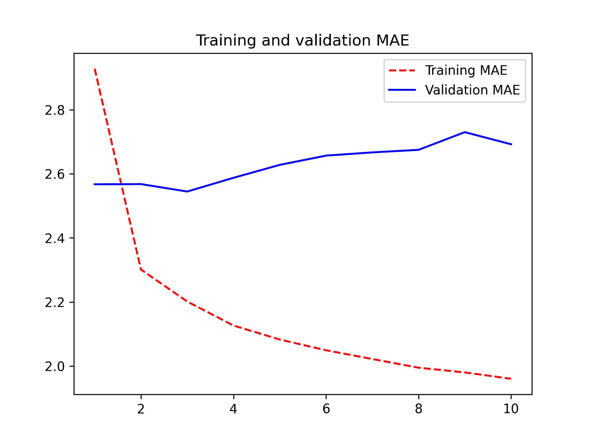

图 13.3：使用简单、密集连接网络在 Jena 温度预测任务上的训练和验证 MAE

一些验证损失接近无学习基线，但并不可靠。这证明了最初建立这个基线的价值：结果证明很难超越。你的常识中包含了许多机器学习模型无法访问的有价值信息。

你可能会想，如果存在一个简单且表现良好的模型可以从数据到目标（常识性基线）进行转换，为什么你正在训练的模型找不到并改进它？好吧，你正在寻找解决方案的模型空间——即你的假设空间——是你定义的配置下所有可能的二层网络的空间。常识性启发式方法只是这个空间中可以表示的数百万个模型之一。这就像在干草堆里找针一样。仅仅因为你的假设空间中技术上存在一个好的解决方案，并不意味着你能够通过梯度下降找到它。

这是对机器学习的一般限制相当大的一个：除非学习算法被硬编码为寻找特定类型的简单模型，否则它有时可能无法找到简单问题的简单解决方案。这就是为什么使用良好的特征工程和相关的架构先验是至关重要的：你需要精确地告诉你的模型它应该寻找什么。

### 让我们尝试一个 1D 卷积模型

说到使用正确的架构先验：由于我们的输入序列具有日周期，也许一个卷积模型可以工作？时间卷积网络可以在不同天之间重用相同的表示，就像空间卷积网络可以在图像的不同位置重用相同的表示一样。

你已经了解 `Conv2D` 和 `SeparableConv2D` 层，这些层通过小窗口在 2D 网格上滑动来观察其输入。这些层也有 1D 和甚至 3D 的版本：`Conv1D`、`SeparableConv1D` 和 `Conv3D`。^([[2]](#footnote-2)) `Conv1D` 层依赖于在输入序列上滑动的 1D 窗口，而 `Conv3D` 层依赖于在输入体积上滑动的立方窗口。

因此，你可以构建 1D ConvNets，严格类似于 2D ConvNets。它们非常适合遵循平移不变性假设的任何序列数据（这意味着如果你在序列上滑动一个窗口，窗口的内容应该独立于窗口的位置遵循相同的属性）。 

让我们在温度预测问题上尝试一下。我们将选择一个初始窗口长度为 24，这样我们一次查看 24 小时的数据（一个周期）。当我们通过 `MaxPooling1D` 层下采样序列时，我们将相应地减小窗口大小（图 13.4）：

```py
inputs = keras.Input(shape=(sequence_length, raw_data.shape[-1]))
x = layers.Conv1D(8, 24, activation="relu")(inputs)
x = layers.MaxPooling1D(2)(x)
x = layers.Conv1D(8, 12, activation="relu")(x)
x = layers.MaxPooling1D(2)(x)
x = layers.Conv1D(8, 6, activation="relu")(x)
x = layers.GlobalAveragePooling1D()(x)
outputs = layers.Dense(1)(x)
model = keras.Model(inputs, outputs)

callbacks = [
    keras.callbacks.ModelCheckpoint("jena_conv.keras", save_best_only=True)
]
model.compile(optimizer="adam", loss="mse", metrics=["mae"])
history = model.fit(
    train_dataset,
    epochs=10,
    validation_data=val_dataset,
    callbacks=callbacks,
)

model = keras.models.load_model("jena_conv.keras")
print(f"Test MAE: {model.evaluate(test_dataset)[1]:.2f}") 
```

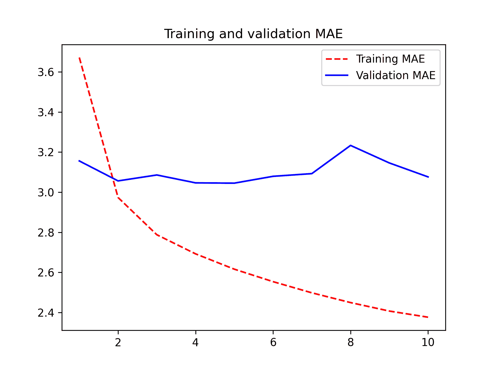

图 13.4：使用 1D ConvNet 在 Jena 温度预测任务上的训练和验证 MAE

结果表明，这个模型的表现甚至比密集连接的模型还要差，只实现了大约 2.9 度的验证 MAE，远低于常识基线。这里出了什么问题？两件事：

+   首先，天气数据并不完全遵守平移不变性假设。虽然数据确实具有日周期，但早晨的数据与傍晚或半夜的数据具有不同的属性。天气数据只在非常特定的时间尺度上具有平移不变性。

+   其次，我们数据中的顺序很重要——非常重要。最近的数据对于预测第二天温度的信息量远大于五天前的数据。1D ConvNet 无法利用这一事实。特别是，我们的最大池化和全局平均池化层在很大程度上破坏了顺序信息。

## 循环神经网络

无论是全连接方法还是卷积方法都没有取得好成绩，但这并不意味着机器学习不适用于这个问题。全连接方法首先将时间序列展平，这从输入数据中移除了时间的概念。卷积方法以相同的方式处理数据的每个部分，甚至应用池化，这破坏了顺序信息。让我们相反地看待数据：它是一个序列，其中因果关系和顺序很重要。

有一种神经网络架构族是专门为这种用例设计的：循环神经网络。其中，特别是长短期记忆（LSTM）层长期以来一直非常受欢迎。我们将在下一分钟看到这些模型是如何工作的——但让我们先尝试一下 LSTM 层。

```py
inputs = keras.Input(shape=(sequence_length, raw_data.shape[-1]))
x = layers.LSTM(16)(inputs)
outputs = layers.Dense(1)(x)
model = keras.Model(inputs, outputs)

callbacks = [
    keras.callbacks.ModelCheckpoint("jena_lstm.keras", save_best_only=True)
]
model.compile(optimizer="adam", loss="mse", metrics=["mae"])
history = model.fit(
    train_dataset,
    epochs=10,
    validation_data=val_dataset,
    callbacks=callbacks,
)

model = keras.models.load_model("jena_lstm.keras")
print("Test MAE: {model.evaluate(test_dataset)[1]:.2f}") 
```

列表 13.12：一个简单的基于 LSTM 的模型

图 13.5 展示了结果。好多了！我们实现了验证 MAE 低至 2.39 度，测试 MAE 为 2.55 度。基于 LSTM 的模型终于打败了常识基线（尽管目前只是略微领先），展示了机器学习在此任务中的价值。

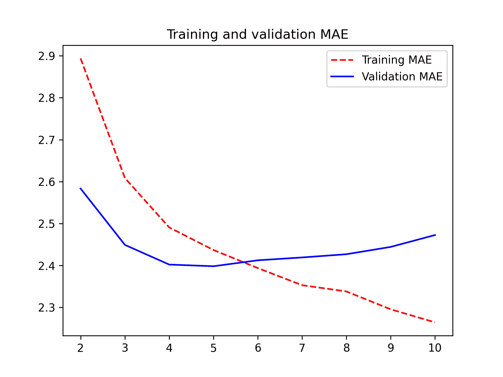

图 13.5：使用基于 LSTM 的模型在耶拿温度预测任务上的训练和验证 MAE。（注意，我们在此图中省略了第 1 个 epoch，因为第 1 个 epoch 的高训练 MAE（7.75）会扭曲比例。）

但为什么 LSTM 模型的表现明显优于密集连接模型或卷积神经网络？我们如何进一步优化模型？为了回答这个问题，让我们更深入地研究循环神经网络。

### 理解循环神经网络

你迄今为止看到的所有神经网络的主要特征，如密集连接网络和卷积神经网络，是它们没有记忆。它们展示给每个输入的处理都是独立的，输入之间没有保持状态。对于这样的网络，要处理一个序列或时间序列数据点，你必须一次性将整个序列展示给网络：将其转换成一个单一的数据点。例如，这就是我们在密集连接网络示例中所做的：我们将五天的数据展平成一个大的向量，并一次性处理它。这样的网络被称为 *前馈网络*。

相比之下，当你阅读本句时，你正在逐字逐句地处理它——或者说，通过眼球运动逐个处理——同时保持对之前内容的记忆；这为你提供了对句子所传达意义的流畅表征。生物智能在处理信息时是逐步进行的，同时保持一个内部模型，该模型由过去的信息构建而成，并随着新信息的到来而不断更新。

一个 *循环神经网络* (RNN) 采用相同的原理，尽管是一个极其简化的版本：它通过迭代序列元素并维护一个包含有关其迄今为止所看到的信息的 *状态* 来处理序列。实际上，RNN 是一种具有内部 *循环* 的神经网络（见图 13.6）。

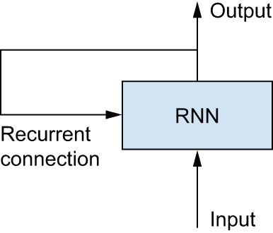

图 13.6：循环网络：具有循环的网络

在处理两个不同、独立的序列（例如批处理中的两个样本）之间，RNN 的状态被重置，因此你仍然将一个序列视为一个单独的数据点：网络的单一输入。变化的是，这个数据点不再在单个步骤中处理；相反，网络内部遍历序列元素。

为了使这些关于 *循环* 和 *状态* 的概念清晰，让我们实现一个玩具 RNN 的前向传递。这个 RNN 将一个向量序列作为输入，我们将它编码为一个大小为 `(timesteps, input_features)` 的二维张量。它遍历时间步长，并在每个时间步长，它考虑其在 `t` 时的当前状态和 `t` 时的输入（形状为 `(input_features,)`），并将它们结合起来以获得 `t` 时的输出。然后我们将下一个步骤的状态设置为这个先前的输出。对于第一个时间步长，先前的输出没有定义；因此，没有当前状态。所以我们将状态初始化为名为网络的 *初始状态* 的全零向量。

在伪代码中，这是 RNN。

```py
# The state at t
state_t = 0
# Iterates over sequence elements
for input_t in input_sequence:
    output_t = f(input_t, state_t)
    # The previous output becomes the state for the next iteration.
    state_t = output_t 
```

代码列表 13.13：伪代码 RNN

你甚至可以细化函数 `f`：输入和状态到输出的转换将由两个矩阵 `W` 和 `U` 以及一个偏置向量来参数化。这类似于前馈网络中密集连接层所进行的转换。

```py
state_t = 0
for input_t in input_sequence:
    output_t = activation(dot(W, input_t) + dot(U, state_t) + b)
    state_t = output_t 
```

代码列表 13.14：RNN 的更详细伪代码

为了使这些概念绝对明确，让我们编写一个简单的 NumPy 实现，用于简单 RNN 的前向传递。

```py
import numpy as np

# Number of timesteps in the input sequence
timesteps = 100
# Dimensionality of the input feature space
input_features = 32
# Dimensionality of the output feature space
output_features = 64
# Input data: random noise for the sake of the example
inputs = np.random.random((timesteps, input_features))
# Initial state: an all-zero vector
state_t = np.zeros((output_features,))
# Creates random weight matrices
W = np.random.random((output_features, input_features))
U = np.random.random((output_features, output_features))
b = np.random.random((output_features,))
successive_outputs = []
# input_t is a vector of shape (input_features,).
for input_t in inputs:
    # Combines the input with the current state (the previous output)
    # to obtain the current output. We use tanh to add nonlinearity (we
    # could use any other activation function).
    output_t = np.tanh(np.dot(W, input_t) + np.dot(U, state_t) + b)
    # Stores this output in a list
    successive_outputs.append(output_t)
    # Updates the state of the network for the next timestep
    state_t = output_t
# The final output is a rank-2 tensor of shape (timesteps,
# output_features).
final_output_sequence = np.concatenate(successive_outputs, axis=0) 
```

代码列表 13.15：简单 RNN 的 NumPy 实现

足够简单：总的来说，RNN 是一个 `for` 循环，它重复使用循环前一次迭代中计算出的量，仅此而已。当然，有许多不同的 RNN 符合这个定义，你可以构建——这个例子是其中最简单的 RNN 公式之一。RNN 以其步函数为特征，例如本例中的以下函数（见图 13.7）：

```py
output_t = tanh(matmul(input_t, W) + matmul(state_t, U) + b) 
```

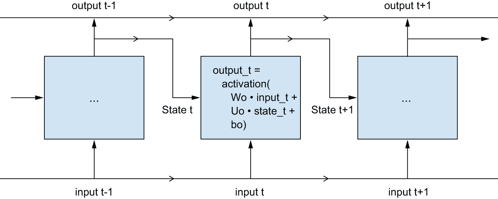

图 13.7：随时间展开的简单 RNN

### Keras 中的循环层

你刚才在 NumPy 中天真地实现的流程对应于实际的 Keras 层——`SimpleRNN` 层。

有一个细微的差别：`SimpleRNN` 处理序列批次，就像所有其他 Keras 层一样，而不是像 NumPy 示例中的单个序列。这意味着它接受形状为 `(batch_size, timesteps, input_features)` 的输入，而不是 `(timesteps, input_features)`。当指定你的初始 `Input()` 的 `shape` 参数时，请注意你可以将 `timesteps` 项设置为 `None`，这使你的网络能够处理任意长度的序列。

```py
num_features = 14
inputs = keras.Input(shape=(None, num_features))
outputs = layers.SimpleRNN(16)(inputs) 
```

列表 13.16：一个可以处理任意长度序列的 RNN 层

如果你的模型旨在处理可变长度的序列，这尤其有用。然而，如果你的所有序列长度都相同，我建议指定完整的输入形状，因为它使 `model.summary()` 能够显示输出长度信息，这总是很棒，并且它可以解锁一些性能优化（请参阅本章后面的“关于 RNN 运行时性能”的注释）。

Keras 中的所有循环层（`SimpleRNN`、`LSTM` 和 `GRU`）都可以以两种不同的模式运行：它们可以返回每个时间步的连续输出序列（形状为 `(batch_size, timesteps, output_features)` 的秩 3 张量）或每个输入序列的最后一个输出（形状为 `(batch_size, output_features)` 的秩 2 张量）。这两个模式由 `return_sequences` 构造函数参数控制。让我们看看使用 `SimpleRNN` 并仅返回最后一个时间步输出的示例。

```py
>>> num_features = 14
>>> steps = 120
>>> inputs = keras.Input(shape=(steps, num_features))
>>> # Note that return_sequences=False is the default.
>>> outputs = layers.SimpleRNN(16, return_sequences=False)(inputs)
>>> print(outputs.shape)
(None, 16)
```

列表 13.17：一个仅返回其最后一个输出步骤的 RNN 层

以下示例返回完整的输出序列。

```py
>>> num_features = 14
>>> steps = 120
>>> inputs = keras.Input(shape=(steps, num_features))
>>> # Sets return_sequences to True
>>> outputs = layers.SimpleRNN(16, return_sequences=True)(inputs)
>>> print(outputs.shape)
(None, 120, 16)
```

列表 13.18：一个返回其完整输出序列的 RNN 层

有时，将几个循环层一个接一个地堆叠以增加网络的表示能力是有用的。在这种设置中，你必须确保所有中间层都返回完整的输出序列。

```py
inputs = keras.Input(shape=(steps, num_features))
x = layers.SimpleRNN(16, return_sequences=True)(inputs)
x = layers.SimpleRNN(16, return_sequences=True)(x)
outputs = layers.SimpleRNN(16)(x) 
```

列表 13.19：堆叠 RNN 层

现在，在实践中，你很少会使用 `SimpleRNN` 层。它通常过于简单，没有实际用途。特别是，`SimpleRNN` 有一个主要问题：尽管从理论上讲，它应该能够在时间 `t` 保留关于许多时间步之前看到的输入的信息，但在实践中，这样的长期依赖关系证明是无法学习的。这是由于 *梯度消失问题*，这是一种类似于观察到的非循环网络（前馈网络）深层的效应：当你继续向网络添加层时，网络最终变得无法训练。这种效应的理论原因在 20 世纪 90 年代初期由 Hochreiter、Schmidhuber 和 Bengio 研究了.^([[3]](#footnote-3))

幸运的是，`SimpleRNN` 并不是 Keras 中唯一的循环层。还有两个其他选项：`LSTM` 和 `GRU`，它们被设计来解决这个问题。

让我们考虑 `LSTM` 层。在 1997 年，Hochreiter 和 Schmidhuber 开发了底层的长短期记忆（LSTM）算法；^([[4]](#footnote-4)) 这是他们关于梯度消失问题的研究的高潮。

这一层是你已经了解的 `SimpleRNN` 层的一个变体；它增加了一种在许多时间步长之间传递信息的方式。想象一下一个与你要处理的序列平行运行的传送带。序列中的信息可以在任何一点跳上传送带，被运送到一个更晚的时间步长，并在你需要时完整地跳下来。这正是 LSTM 所做的：它为以后保存信息，从而防止在处理过程中较老的信号逐渐消失。这应该让你想起在第九章中学到的 *残差连接*，基本上是同一个想法。

要详细了解这一过程，让我们从 `SimpleRNN` 单元开始（见图 13.8）。因为你会有很多权重矩阵，所以用字母 `o`（`Wo` 和 `Uo`）对单元中的 `W` 和 `U` 矩阵进行索引，代表 *output*。


图 13.8：`LSTM` 层的起点：一个 `SimpleRNN`

让我们向这幅图添加一个额外的数据流，它携带信息跨越时间步长。在不同的时间步长中，称其值为 `Ct`，其中 *C* 代表 *carry*。这一信息将对细胞产生以下影响：它将与输入连接和循环连接（通过一个密集变换：与权重矩阵的点积，然后加上偏差并应用激活函数）相结合，并且它将影响发送到下一个时间步长的状态（通过一个激活函数和一个乘法操作）。从概念上讲，携带数据流是一种调节下一个输出和下一个状态的方式（见图 13.9）。到目前为止，很简单。

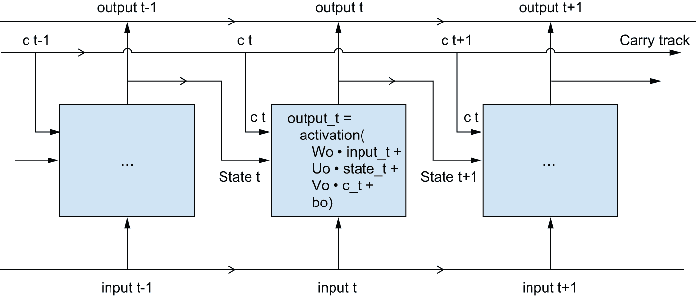

图 13.9：从 SimpleRNN 到 LSTM：添加一个携带轨迹

现在的微妙之处：计算携带数据流下一个值的方式。它涉及三个不同的变换。所有三个都具有 `SimpleRNN` 单元的形态：

```py
y = activation(dot(state_t, U) + dot(input_t, W) + b) 
```

但所有三个变换都有自己的权重矩阵，你将用字母 `i`、`f` 和 `k` 来索引。到目前为止，你有的如下（可能看起来有点随意，但请耐心等待）。

```py
output_t = activation(dot(state_t, Uo) + dot(input_t, Wo) + dot(C_t, Vo) + bo)
i_t = activation(dot(state_t, Ui) + dot(input_t, Wi) + bi)
f_t = activation(dot(state_t, Uf) + dot(input_t, Wf) + bf)
k_t = activation(dot(state_t, Uk) + dot(input_t, Wk) + bk) 
```

列表 13.20：LSTM 架构的伪代码细节（1/2）

你通过结合 `i_t`、`f_t` 和 `k_t` 来获得新的携带状态（下一个 `c_t`）。

```py
c_t+1 = i_t * k_t + c_t * f_t 
```

列表 13.21：LSTM 架构的伪代码细节（2/2）

如图 13.10 所示添加。就是这样。并不复杂——只是稍微有点复杂。

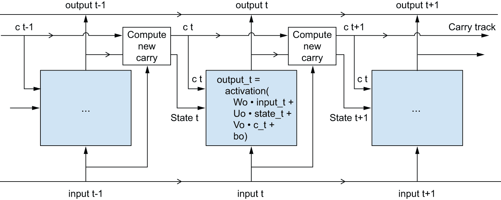

图 13.10：`LSTM` 的解剖结构

如果你想要从哲学的角度来解释，你可以解释这些操作的目的。例如，你可以认为乘以 `c_t` 和 `f_t` 是在携带数据流中故意忘记无关信息的一种方式。同时，`i_t` 和 `k_t` 提供了关于当前的信息，用新信息更新携带轨迹。但最终，这些解释并没有太多意义，因为这些操作*实际上*做什么是由参数化它们的权重内容决定的，而权重是以端到端的方式学习的，每次训练循环都会重新开始，这使得无法将特定目的归因于这个或那个操作。正如刚才所描述的，RNN 单元的指定确定了你的假设空间——你在训练过程中将搜索良好模型配置的空间——但它并不确定单元做什么；这取决于单元权重。具有不同权重的相同单元可以执行非常不同的操作。因此，构成 RNN 单元的操作组合最好解释为对搜索的*约束*，而不是从工程角度的*设计*。

争议性地，这种约束的选择——如何实现 RNN 单元的疑问——最好留给优化算法（如遗传算法或强化学习过程）而不是人类工程师。在未来，我们将以此方式构建我们的模型。总之，你不需要了解 LSTM 单元的具体架构；作为人类，这不应该成为你的工作。只需记住 LSTM 单元的目的：允许过去的信息在稍后时间重新注入，从而对抗梯度消失问题。

### 充分利用循环神经网络

到目前为止，你已经学习了

+   RNN 是什么以及它们是如何工作的

+   LSTM 是什么以及为什么它在长序列上比简单的 RNN 工作得更好

+   如何使用 Keras RNN 层处理序列数据

接下来，我们将回顾 RNN 的许多更高级功能，这些功能可以帮助你充分利用你的深度学习序列模型。到本节结束时，你将了解关于使用 Keras 中的循环网络的大部分知识。

我们将涵盖以下内容：

+   *循环 dropout*  — 这是 dropout 的一种变体，用于对抗循环层中的过拟合。

+   *堆叠循环层*  — 这增加了模型的表示能力（但以更高的计算负载为代价）。

+   *双向循环层* — 这些层以不同的方式向循环网络呈现相同的信息，从而提高准确率并减轻遗忘问题。

我们将使用这些技术来完善我们的温度预测 RNN。

### 使用循环 dropout 来对抗过拟合

让我们回到本章早期使用的基于 LSTM 的模型——我们第一个能够击败常识基线的模型。如果你查看训练和验证曲线，很明显，尽管模型只有非常少的单元，但它很快就开始过拟合了：训练和验证损失在几个 epoch 之后开始显著发散。你已经熟悉了对抗这种现象的经典技术：dropout，它随机将层的输入单元置零，以打破层所暴露的训练数据中的偶然相关性。但是，如何在循环网络中正确应用 dropout 并不是一个简单的问题。

很早就已经知道，在循环层之前应用 dropout 会阻碍学习而不是帮助正则化。2015 年，Yarin Gal 在他的关于贝叶斯深度学习的博士论文中，^([[5]](#footnote-5))确定了在循环网络中使用 dropout 的正确方法：应该在每个 timestep 应用相同的 dropout 掩码（相同的丢弃单元模式），而不是在每个 timestep 随机变化的 dropout 掩码。更重要的是，为了正则化由`GRU`和`LSTM`等层的循环门形成的表示，应该对层的内部循环激活应用时间常数 dropout 掩码（循环 dropout 掩码）。在每个 timestep 使用相同的 dropout 掩码允许网络正确地通过时间传播其学习误差；时间随机的 dropout 掩码会破坏这个误差信号，对学习过程有害。

Yarin Gal 使用 Keras 进行了他的研究，并帮助将这种机制直接集成到 Keras 循环层中。Keras 中的每个循环层都有两个与 dropout 相关的参数：`dropout`，一个浮点数，指定层输入单元的 dropout 率，以及`recurrent_dropout`，指定循环单元的 dropout 率。让我们将循环 dropout 添加到我们第一个 LSTM 示例的`LSTM`层中，看看这样做会如何影响过拟合。

多亏了 dropout，我们不需要那么依赖网络大小来进行正则化，所以我们将使用具有两倍单元数量的`LSTM`层，这应该能够更充分地表达（如果没有 dropout，这个网络会立即开始过拟合——试试看）。因为使用 dropout 进行正则化的网络总是需要更长的时间才能完全收敛，我们将模型训练的 epoch 数增加到五倍。

```py
inputs = keras.Input(shape=(sequence_length, raw_data.shape[-1]))
x = layers.LSTM(32, recurrent_dropout=0.25)(inputs)
# To regularize the Dense layer, we also add a Dropout layer after the
# LSTM.
x = layers.Dropout(0.5)(x)
outputs = layers.Dense(1)(x)
model = keras.Model(inputs, outputs)

callbacks = [
    keras.callbacks.ModelCheckpoint(
        "jena_lstm_dropout.keras", save_best_only=True
    )
]
model.compile(optimizer="adam", loss="mse", metrics=["mae"])
history = model.fit(
    train_dataset,
    epochs=50,
    validation_data=val_dataset,
    callbacks=callbacks,
) 
```

代码列表 13.22：使用 dropout 正则化的 LSTM 进行训练和评估

图 13.11 显示了结果。成功了！在前 20 个 epoch 中，我们不再过拟合。我们实现了 2.27 度的验证 MAE（相对于无学习基线提高了 7%）和 2.45 度的测试 MAE（相对于基线提高了 6.5%）。还不错。

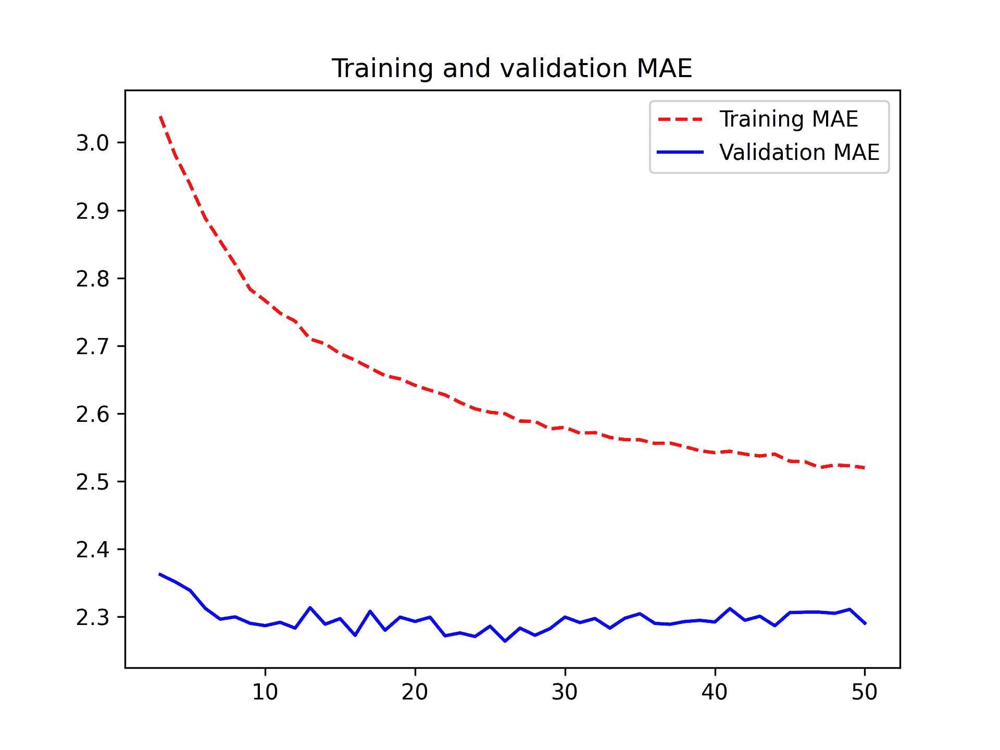

图 13.11：使用 dropout 正则化的 LSTM 在耶拿温度预测任务上的训练和验证损失

### 堆叠循环层

由于你不再过度拟合，但似乎已经达到了性能瓶颈，你应该考虑增加网络的容量和表达能力。回想一下通用机器学习工作流程的描述：通常，直到过度拟合成为主要障碍（假设你已经采取了基本步骤来减轻过度拟合，例如使用 dropout），增加你模型的容量是一个好主意。只要你不严重过度拟合，你很可能容量不足。

增加网络容量通常是通过增加层中的单元数量或添加更多层来实现的。循环层堆叠是构建更强大循环网络的经典方法：例如，不久前，谷歌翻译算法是由七个大型 `LSTM` 层堆叠而成的——这非常庞大。

在 Keras 中堆叠循环层时，所有中间层应返回它们的完整输出序列（一个秩为 3 的张量），而不是最后一个时间步的输出。正如你已经学到的，这是通过指定 `return_sequences=True` 来实现的。

在下面的示例中，我们将尝试堆叠两个带有 dropout 正则化的循环层。为了改变一下，我们将使用 `GRU` 层而不是 `LSTM`。门控循环单元（GRU）与 LSTM 非常相似——你可以将其视为 LSTM 架构的一个略微简单、精简的版本。它由 Cho 等人在 2014 年引入，当时循环网络正开始重新引起当时微小研究社区的注意.^([[6]](#footnote-6))

```py
inputs = keras.Input(shape=(sequence_length, raw_data.shape[-1]))
x = layers.GRU(32, recurrent_dropout=0.5, return_sequences=True)(inputs)
x = layers.GRU(32, recurrent_dropout=0.5)(x)
x = layers.Dropout(0.5)(x)
outputs = layers.Dense(1)(x)
model = keras.Model(inputs, outputs)

callbacks = [
    keras.callbacks.ModelCheckpoint(
        "jena_stacked_gru_dropout.keras", save_best_only=True
    )
]
model.compile(optimizer="adam", loss="mse", metrics=["mae"])
history = model.fit(
    train_dataset,
    epochs=50,
    validation_data=val_dataset,
    callbacks=callbacks,
)
model = keras.models.load_model("jena_stacked_gru_dropout.keras")
print(f"Test MAE: {model.evaluate(test_dataset)[1]:.2f}") 
```

列表 13.23：训练和评估一个带有 dropout 正则化的堆叠 GRU 模型

图 13.12 展示了结果。我们实现了 2.39 度的测试 MAE（相对于基线提高了 8.8%）。你可以看到添加的层确实略微提高了结果，但并不显著。你可能会看到增加网络容量所带来的回报正在减少。

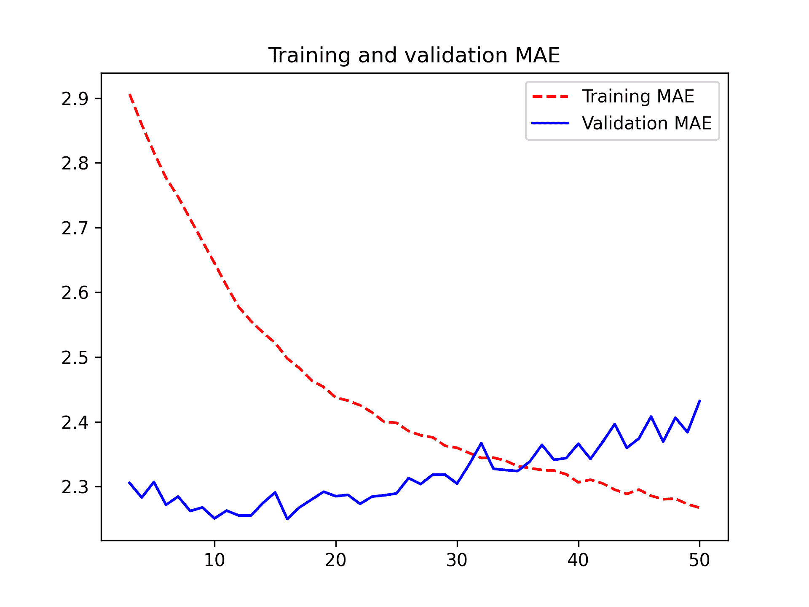

图 13.12：使用堆叠 GRU 网络在耶拿温度预测任务上的训练和验证损失

### 使用双向 RNN

本节最后介绍的技术称为 *双向 RNN*。双向 RNN 是一种常见的 RNN 变体，在某些任务上可以提供比常规 RNN 更好的性能。它经常用于自然语言处理——你可以称其为自然语言处理的深度学习瑞士军刀。

RNNs（循环神经网络）特别依赖于顺序：它们按顺序处理输入序列的时间步长，并且打乱或反转时间步长可以完全改变 RNN 从序列中提取的表示。这正是它们在顺序有意义的任务上表现良好的原因，例如温度预测问题。双向 RNN 利用了 RNN 的顺序敏感性：它由两个常规 RNN 组成，例如你已熟悉的`GRU`和`LSTM`层，每个层都按一个方向（按时间顺序和逆时间顺序）处理输入序列，然后合并它们的表示。通过两种方式处理序列，双向 RNN 可以捕捉到单方向 RNN 可能忽略的图案。

值得注意的是，本节中 RNN 层按时间顺序处理序列（较早的时间步长首先）可能是一个任意决定。至少，这是我们迄今为止没有尝试质疑的决定。如果 RNN 按逆时间顺序处理输入序列，例如，先处理较新的时间步长，它们是否仍然能足够好地表现？让我们在实践中尝试一下，看看会发生什么。你所需要做的就是编写一个数据生成器的变体，其中输入序列沿时间维度被反转（将最后一行替换为`yield samples[:, ::-1, :], targets`）。

当训练本节第一实验中使用的相同基于 LSTM 的模型时，你会发现这种逆序 LSTM 的表现甚至比常识基线还要差。这表明，在这种情况下，按时间顺序处理对于方法的成功至关重要。这完全说得通：底层的`LSTM`层通常在记住近期过去方面比记住遥远过去要好，而且，自然地，对于这个问题（这就是常识基线相当强大）来说，较近的天气数据点比较旧的数据点更有预测性。因此，按时间顺序的层版本必然会优于逆序版本。

然而，这种情况并不适用于许多其他问题，包括自然语言：直观上，一个词在理解一个句子中的重要性并不强烈依赖于它在句子中的位置。在文本数据上，逆序处理与按时间顺序处理一样有效——你可以很好地倒着阅读文本（试试看！）尽管词序在理解语言中确实很重要，但*使用哪种顺序*并不关键。

重要的是，在反转序列上训练的 RNN 将学习与在原始序列上训练的不同表示，就像如果你在真实世界中时间倒流，你会拥有不同的心理模型——如果你在第一天死去，在最后一天出生。在机器学习中，*不同*但*有用*的表示总是值得利用的，而且它们越不同，越好：它们提供了从新的角度看待你的数据，捕捉到其他方法遗漏的数据方面，从而有助于提高任务的性能。这是*集成*背后的直觉，我们将在第十八章中探讨这个概念。

双向 RNN 利用这个想法来提高按时间顺序的 RNN 的性能。它以两种方式查看其输入序列（见图 13.13），获得可能更丰富的表示并捕捉到仅由时间顺序版本单独遗漏的模式。

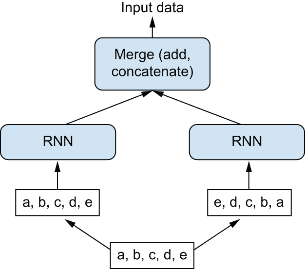

：双向 RNN 层的工作原理

在 Keras 中实例化一个双向 RNN，你使用`Bidirectional`层，它将一个循环层实例作为其第一个参数。`Bidirectional`创建这个循环层的第二个、独立的实例，并使用一个实例按时间顺序处理输入序列，另一个实例按相反顺序处理输入序列。你可以在我们的温度预测任务上尝试它。

```py
inputs = keras.Input(shape=(sequence_length, raw_data.shape[-1]))
x = layers.Bidirectional(layers.LSTM(16))(inputs)
outputs = layers.Dense(1)(x)
model = keras.Model(inputs, outputs)

model.compile(optimizer="adam", loss="mse", metrics=["mae"])
history = model.fit(
    train_dataset,
    epochs=10,
    validation_data=val_dataset,
) 
```

列表 13.24：训练和评估双向 LSTM

你会发现它的表现不如普通的`LSTM`层。这很容易理解：所有的预测能力都必须来自网络的时间顺序部分，因为已知反时间顺序部分在这个任务上表现严重不足（再次强调，在这个案例中，近期过去比遥远过去更重要）。同时，反时间顺序部分的存在使网络的能力加倍，并导致它过早地开始过拟合。

然而，双向 RNN 非常适合文本数据——或者任何其他顺序很重要，但使用哪种顺序无关紧要的数据。事实上，在 2016 年一段时间内，双向 LSTM 被认为在许多自然语言处理任务中是最佳实践（在 Transformer 架构兴起之前，你将在第十五章中了解到这一点）。

## 更进一步

你还可以尝试许多其他方法来提高温度预测问题的性能：

+   调整堆叠设置中每个循环层的单元数量以及 dropout 的数量。当前的选择很大程度上是任意的，因此可能不是最优的。

+   调整`Adam`优化器使用的学习率或尝试不同的优化器。

+   尝试使用`Dense`层的堆叠作为循环层上的回归器，而不是单个`Dense`层。

+   改善模型的输入：尝试使用更长或更短的序列，或不同的采样率，或者开始进行特征工程。

和往常一样，深度学习更是一门艺术而不是科学。我们可以提供一些指南，这些指南可能会告诉你某个特定问题可能或可能不会有效，但最终，每个数据集都是独特的；你必须通过经验评估不同的策略。目前还没有一种理论可以提前精确地告诉你应该做什么来最优地解决问题。你必须迭代。

根据我们的经验，通过大约 10%提高无学习基准可能是你用这个数据集能做的最好了。这并不那么出色，但这些结果是有道理的：如果你能获取来自不同位置广泛网格的数据，那么近未来的天气是高度可预测的，但如果只有来自单个位置的数据，那么它就不是很可预测了。你所在地区的天气演变取决于周围地区的当前天气模式。

## 摘要

+   正如你在第六章首次学习的那样，在处理一个新问题时，首先为你的选择指标建立常识性基准是好的。如果你没有基准可以超越，你就无法判断你是否真的取得了进步。

+   在尝试昂贵的模型之前，先尝试简单的模型，以证明额外支出的合理性。有时一个简单的模型最终会变成你最佳的选择。

+   当你拥有顺序重要数据时——特别是对于时间序列数据——*循环网络*是一个很好的选择，并且可以轻易超越首先将时间数据展平的模型。Keras 中可用的两个基本 RNN 层是`LSTM`层和`GRU`层。

+   要在循环网络中使用 dropout，你应该使用时间恒定的 dropout 掩码和循环 dropout 掩码。这些已经内置在 Keras 循环层中，所以你只需要使用循环层的`recurrent_dropout`参数。

+   堆叠的 RNN 比单个 RNN 层具有更强的表示能力。但它们也昂贵得多，因此并不总是值得。尽管它们在复杂问题（如机器翻译）上提供了明显的收益，但它们可能并不总是适用于较小、较简单的问题。

### 脚注

1.  Adam Erickson 和 Olaf Kolle，[`www.bgc-jena.mpg.de/wetter`](https://www.bgc-jena.mpg.de/wetter)。[[↩]](#footnote-link-1)

1.  没有实现`SeparableConv3D`层，不是出于任何理论原因，而是因为我们还没有实现它。[[↩]](#footnote-link-2)

1.  例如，参见 Yoshua Bengio、Patrice Simard 和 Paolo Frasconi，“使用梯度下降学习长期依赖性是困难的”，*IEEE 神经网络杂志* 5，第 2 期（1994 年）。[[↩]](#footnote-link-3)

1.  Sepp Hochreiter 和 Jürgen Schmidhuber，“长短期记忆”，*神经计算* 9，第 8 期（1997 年）。[[↩]](#footnote-link-4)

1.  参见 Yarin Gal 的论文，“深度学习中的不确定性（博士论文）”，2016 年 10 月 13 日，[`www.cs.ox.ac.uk/people/yarin.gal/website/blog_2248.html`](https://www.cs.ox.ac.uk/people/yarin.gal/website/blog_2248.html). [[↩]](#footnote-link-5)

1.  参见 Cho 等人，“关于神经机器翻译的性质：编码器-解码器方法”，2014 年，[`arxiv.org/abs/1409.1259`](https://arxiv.org/abs/1409.1259). [[↩]](#footnote-link-6)
