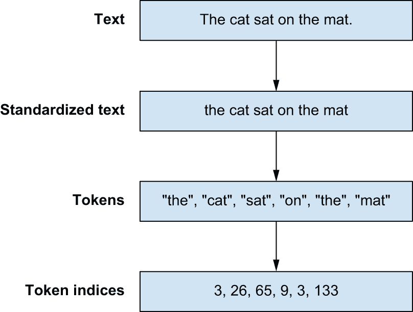
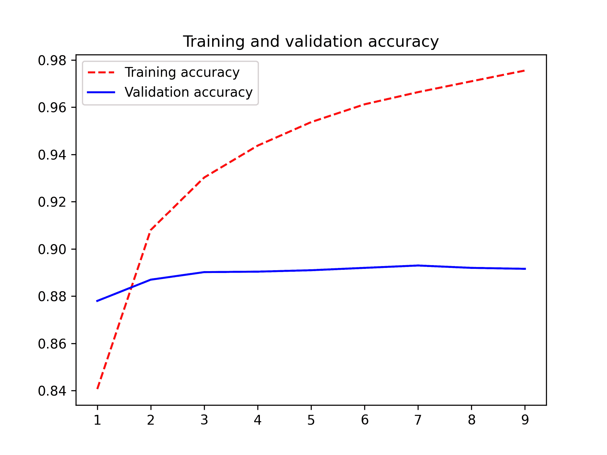
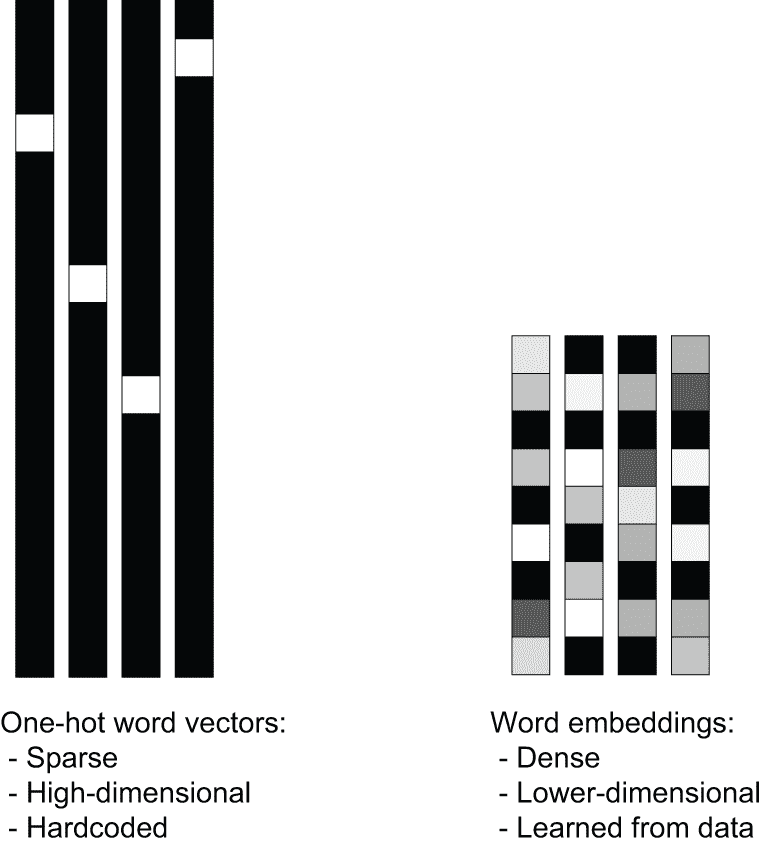
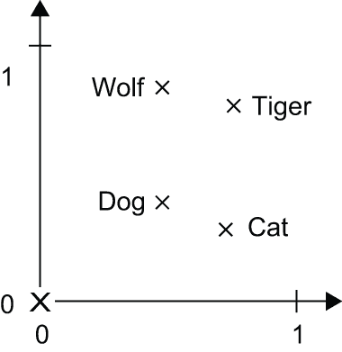
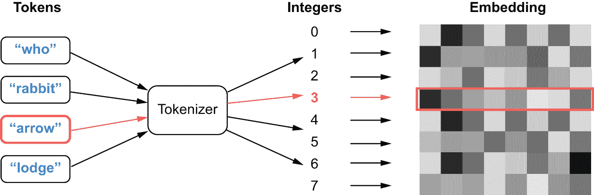
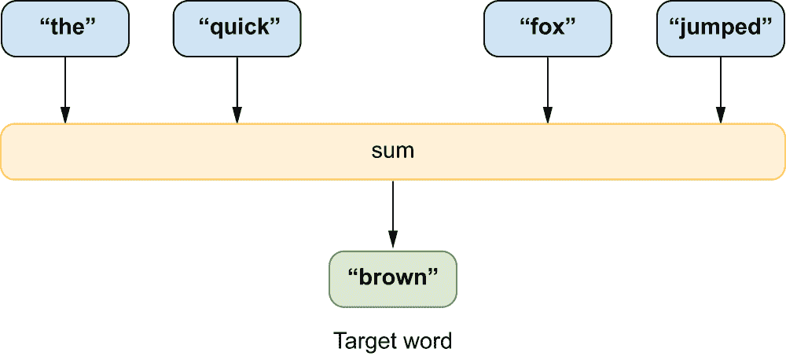

# 第十四章：文本分类

> 原文：[`deeplearningwithpython.io/chapters/chapter14_text-classification`](https://deeplearningwithpython.io/chapters/chapter14_text-classification)

本章将为处理文本输入奠定基础，我们将在本书的下一章中继续构建。到本章结束时，你将能够以多种不同的方式构建一个简单的文本分类器。这将为本章构建更复杂的模型，如下一章中的 Transformer，做好准备。

## 自然语言处理简史

在计算机科学中，我们将人类语言，如英语或普通话，称为“自然”语言，以区别于为机器设计的语言，如 LISP、汇编和 XML。每种机器语言都是被设计的：它的起点是一位工程师写下一系列形式规则来描述你可以做出哪些陈述以及它们的含义。规则先出现，人们只有在规则集完成后才开始使用这种语言。对于人类语言来说，情况正好相反：使用先于规则的出现。自然语言是通过一个进化过程形成的，就像生物有机体一样——这就是它被称为“自然”的原因。它的“规则”，比如英语的语法，是在事后形式化的，并且经常被使用者忽略或违反。因此，尽管机器可读语言高度结构化和严格，自然语言却是混乱的——模糊的、混乱的、蔓延的，并且始终处于变化之中。

计算机科学家长期以来一直专注于能够摄入或产生自然语言的系统的潜力。语言，尤其是书面文本，支撑着我们的大多数沟通和文化生产。几个世纪的人类知识都是通过文本存储的；互联网主要是文本，甚至我们的思想也是基于语言的！使用计算机来解释和操作语言的做法被称为自然语言处理，简称 NLP。它是在第二次世界大战后立即作为一个研究领域提出的，当时有人认为我们可以将理解语言视为一种“密码破解”，其中自然语言是传输信息的“密码”。

在该领域的早期，许多人天真地认为可以写下“英语的规则集”，就像可以写下 LISP 的规则集一样。在 20 世纪 50 年代初，IBM 和乔治敦的研究人员展示了一个可以将俄语翻译成英语的系统。该系统使用了一个包含六个硬编码规则的语法和一个包含几百个元素（单词和后缀）的查找表，以准确翻译 60 个精心挑选的俄语句子。目标是激起对机器翻译的热情和资金支持，从这个意义上说，这是一个巨大的成功。尽管演示的性质有限，但作者声称，在五年内，翻译问题将得到解决。在接下来的十年中，资金大量涌入。然而，将这样的系统推广开来证明是极其困难的。单词的意义会根据上下文发生巨大变化。任何语法规则都需要无数例外。开发一个能够在几个精心挑选的例子上表现出色的程序是足够的简单，但建立一个能够与人类翻译者竞争的健壮系统则是另一回事。十年后，一份有影响力的美国报告剖析了缺乏进展的原因，资金也随之枯竭。

尽管有这些挫折和从兴奋到幻灭的反复波动，手工编写的规则在 20 世纪 90 年代中期仍然作为主导方法存在。问题很明显，但简单地写下描述语法的符号规则似乎没有可行的替代方案。然而，随着 20 世纪 80 年代末更快计算机和更大数据量的可用性，研究开始走向新的方向。当你发现自己正在构建大量临时规则的系统时，作为一个聪明的工程师，你可能会开始问自己，“我能用数据语料库来自动化寻找这些规则的过程吗？我能否在某个规则空间内搜索规则，而不是自己想出来？”就这样，你进入了机器学习的领域。

在 20 世纪 80 年代末，我们开始看到自然语言处理中机器学习方法的兴起。最早的这些方法基于决策树——其意图实际上是要自动化开发类似于硬编码语言系统的 if/then/else 规则。随后，统计方法开始加速发展，从逻辑回归开始。随着时间的推移，学习到的参数模型逐渐取代了主导地位，并且有些人认为，当直接嵌入到模型中时，语言学成了一种阻碍。早期语音识别研究者弗雷德里克·杰利内克在 20 世纪 90 年代开玩笑说：“每次我解雇一个语言学家，语音识别器的性能就会提高。”

就像计算机视觉是将模式识别应用于像素一样，现代自然语言处理领域完全是关于将模式识别应用于文本中的单词。实际应用并不缺乏：

+   给定一封电子邮件的文本，它被判定为垃圾邮件的概率是多少？（*文本分类*）

+   给定一个英文句子，最可能的俄语翻译是什么？(*翻译*)

+   给定一个不完整的句子，下一个可能出现的单词是什么？(*语言建模*)

在这本书中你将要训练的文本处理模型不会拥有类似人类对语言的理解；相反，它们只是在输入数据中寻找统计规律，而事实证明这足以在广泛的现实世界任务中表现良好。

在过去十年中，NLP 研究人员和实践者发现了学习关于文本的狭窄统计问题的答案可以有多么惊人地有效。在 2010 年代，研究人员开始将 LSTM 模型应用于文本，大大增加了 NLP 模型中的参数数量以及训练它们所需的计算资源。结果是令人鼓舞的——LSTMs 能够以比以前的方法更高的准确性泛化到未见过的例子，但它们最终遇到了限制。LSTMs 在处理包含许多句子和段落的文本中的长链依赖关系时遇到了困难，与计算机视觉模型相比，它们的训练既慢又难以控制。

到 2010 年代末，谷歌的研究人员发现了一种名为 Transformer 的新架构，该架构解决了许多困扰 LSTMs 的可扩展性问题。只要同时增加模型的大小和训练数据，Transformer 似乎就能越来越准确地执行。更好的是，训练 Transformer 所需的计算可以有效地并行化，即使是对于长序列也是如此。如果你将进行训练的机器数量加倍，你大约可以将等待结果的时间减半。

Transformer 架构的发现，以及 GPU 和 CPU 的持续加速，在过去几年中导致了 NLP 模型投资和兴趣的显著增长。ChatGPT 等聊天系统凭借其能够在看似任意的话题和问题上产生流畅自然的文本的能力，吸引了公众的注意。用于训练这些模型的原始文本是互联网上所有可用书面语言的一个很大部分，而训练单个模型所需的计算成本可能高达数百万美元。一些炒作是值得削减的——这些是模式识别机器。尽管我们持续的人类倾向是在“会说话的事物”中寻找智能，但这些模型以与人类智能截然不同（而且效率低得多）的方式复制和综合训练数据。然而，公平地说，从极其简单的“猜测缺失单词”训练设置中产生复杂行为，是过去十年机器学习中最令人震惊的实证结果之一。

在接下来的三个章节中，我们将探讨一系列用于文本数据的机器学习技术。我们将跳过关于直到 20 世纪 90 年代盛行的硬编码语言特征的讨论，但我们将从运行逻辑回归以对文本进行分类到训练 LSTM 进行机器翻译的一切进行探讨。我们将仔细检查 Transformer 模型，并讨论它在文本领域进行泛化时为什么如此可扩展和有效。让我们深入探讨。

## 准备文本数据

让我们考虑一个英文句子：

```py
The quick brown fox jumped over the lazy dog. 
```

在我们可以开始应用前几章中提到的任何深度学习技术之前，有一个明显的障碍——我们的输入不是数字！在开始任何建模之前，我们需要将书面文字转换成数字张量。与具有相对自然数字表示的图像不同，你可以以几种方式构建文本的数字表示。

一种简单的方法是借鉴标准的文本文件格式，并使用类似 ASCII 编码的东西。我们可以将输入切割成字符序列，并为每个字符分配一个唯一的索引。另一种直观的方法是构建基于单词的表示，首先在所有空格和标点符号处将句子分开，然后将每个单词映射到一个唯一的数字表示。

这两种方法都是值得尝试的，通常，所有文本预处理都会包括一个*分割*步骤，即将文本分割成小的单个单元，称为*标记*。分割文本的一个强大工具是正则表达式，它可以灵活地匹配文本中字符的模式。

让我们看看如何使用正则表达式将字符串分割成字符序列。我们可以应用的最基本的正则表达式是`"."`，它可以匹配输入文本中的任何字符：

```py
import regex as re

def split_chars(text):
    return re.findall(r".", text) 
```

我们可以将该函数应用于我们的示例输入字符串：

```py
>>> chars = split_chars("The quick brown fox jumped over the lazy dog.")
>>> chars[:12]
["T", "h", "e", " ", "q", "u", "i", "c", "k", " ", "b", "r"]
```

正则表达式可以很容易地应用于将我们的文本分割成单词。正则表达式`"[\w]+"`将抓取连续的非空白字符，而`"[.,!?;]"`可以匹配括号中的标点符号。我们可以将这两个结合起来，得到一个正则表达式，将每个单词和标点符号分割成标记：

```py
def split_words(text):
    return re.findall(r"[\w]+|[.,!?;]", text) 
```

这里展示了它对一个测试句子的作用：

```py
>>> split_words("The quick brown fox jumped over the dog.")
["The", "quick", "brown", "fox", "jumped", "over", "the", "dog", "."]
```

分割将我们从一个单独的字符串转换成标记序列，但我们仍然需要将我们的字符串标记转换成数字输入。迄今为止最常见的方法是将每个标记映射到一个唯一的整数索引，通常称为*索引*我们的输入。这是一种灵活且可逆的表示，可以与广泛的建模方法一起工作。稍后，我们可以决定如何将标记索引映射到模型摄入的潜在空间。

对于字符标记，我们可以使用 ASCII 查找来索引每个标记——例如，`ord('A') → 65` 和 `ord('z') → 122`。然而，当你开始考虑其他语言时，这可能会扩展得不好——Unicode 规范中超过一百万个字符！一种更稳健的技术是从我们的训练数据中的特定标记构建到我们关心的数据的索引的映射，这在 NLP 中称为*词汇表*。它有一个很好的特性，即它对单词级标记和字符级标记都同样有效。

让我们看看我们如何可能使用一个词汇表来转换文本。我们将构建一个简单的 Python 字典，将标记映射到索引，将输入拆分为标记，并最终索引我们的标记：

```py
vocabulary = {
    "[UNK]": 0,
    "the": 1,
    "quick": 2,
    "brown": 3,
    "fox": 4,
    "jumped": 5,
    "over": 6,
    "dog": 7,
    ".": 8,
}
words = split_words("The quick brown fox jumped over the lazy dog.")
indices = [vocabulary.get(word, 0) for word in words] 
```

这会输出以下内容：

```py
[0, 2, 3, 4, 5, 6, 1, 0, 7, 8] 
```

我们向我们的词汇表中引入一个特殊标记`"[UNK]"`，它代表一个对词汇表来说是未知的标记。这样，我们可以索引我们遇到的所有输入，即使某些术语只出现在我们的测试数据中。在先前的例子中，`"lazy"`映射到`"[UNK]"`索引 0，因为它不包括在我们的词汇表中。

通过这些简单的文本转换，我们正在稳步构建一个文本预处理管道。然而，我们还需要考虑一种常见的文本操作类型——标准化。

考虑这两个句子：

+   “日落时分。我凝视着墨西哥的天空。大自然多么壮丽??”

+   “Sunset came; I stared at the México sky. Isn’t nature splendid?”

它们非常相似——事实上，它们几乎是相同的。然而，如果你将它们转换为之前描述的索引，你会得到非常不同的表示，因为“i”和“I”是两个不同的字符，“Mexico”和“México”是两个不同的单词，“isnt”不是“isn’t”，等等。将文本标准化是一种基本的特征工程形式，旨在消除你不想让模型处理的编码差异。这也不局限于机器学习——如果你在构建搜索引擎，你也必须做同样的事情。

一个简单且广泛使用的标准化方案是将所有内容转换为小写并删除标点符号。我们的两个句子将变成

+   “日落时分，我凝视着墨西哥的天空，大自然多么壮丽”

+   “日落时分，我凝视着墨西哥的天空，大自然多么壮丽”

已经非常接近了。如果我们从所有字符中移除重音符号，我们可以更接近。

标准化有很多用途，它曾经是提高模型性能最关键的领域之一。在几十年的自然语言处理中，使用正则表达式尝试将单词映射到共同的词根（例如，“tired”→“tire”和“trophies”→“trophy”），称为*词干提取*或*词形还原*，是一种常见的做法。但随着模型的表达能力增强，这种标准化往往弊大于利。单词的时态和复数是传达其意义的重要信号。对于今天使用的较大模型，大多数标准化尽可能轻量级——例如，在进一步处理之前将所有输入转换为标准字符编码。

通过标准化，我们现在已经看到了文本预处理的三个不同阶段（图 14.1）：

1.  *标准化* — 我们通过基本的文本到文本转换来规范化输入

1.  *分割* — 我们将文本分割成标记序列

1.  *索引化* — 我们使用*词汇表*将我们的标记映射到索引



图 14.1：文本预处理流程

人们通常将整个过程称为*分词*，将映射文本到标记索引序列的对象称为*分词器*。让我们尝试构建几个。

### 字符和词分词

首先，让我们构建一个字符级分词器，该分词器将输入字符串中的每个字符映射到一个整数。为了简化问题，我们将只使用一个标准化步骤——我们将所有输入转换为小写。

```py
class CharTokenizer:
    def __init__(self, vocabulary):
        self.vocabulary = vocabulary
        self.unk_id = vocabulary["[UNK]"]

    def standardize(self, inputs):
        return inputs.lower()

    def split(self, inputs):
        return re.findall(r".", inputs)

    def index(self, tokens):
        return [self.vocabulary.get(t, self.unk_id) for t in tokens]

    def __call__(self, inputs):
        inputs = self.standardize(inputs)
        tokens = self.split(inputs)
        indices = self.index(tokens)
        return indices 
```

列表 14.1：一个基本的字符级分词器

非常简单。在使用这个之前，我们还需要构建一个函数，该函数根据一些输入文本计算标记的词汇表。而不是简单地将所有字符映射到唯一的索引，让我们给自己一个能力，将我们的词汇表大小限制在我们输入数据中最常见的标记。当我们进入建模方面的事情时，限制词汇表大小将是一个限制模型中参数数量的重要方法。

```py
import collections

def compute_char_vocabulary(inputs, max_size):
    char_counts = collections.Counter()
    for x in inputs:
        x = x.lower()
        tokens = re.findall(r".", x)
        char_counts.update(tokens)
    vocabulary = ["[UNK]"]
    most_common = char_counts.most_common(max_size - len(vocabulary))
    for token, count in most_common:
        vocabulary.append(token)
    return dict((token, i) for i, token in enumerate(vocabulary)) 
```

列表 14.2：计算字符级词汇表

我们现在可以为词级分词器做同样的事情。我们可以使用与我们的字符级分词器相同的代码，但使用不同的分割步骤。

```py
class WordTokenizer:
    def __init__(self, vocabulary):
        self.vocabulary = vocabulary
        self.unk_id = vocabulary["[UNK]"]

    def standardize(self, inputs):
        return inputs.lower()

    def split(self, inputs):
        return re.findall(r"[\w]+|[.,!?;]", inputs)

    def index(self, tokens):
        return [self.vocabulary.get(t, self.unk_id) for t in tokens]

    def __call__(self, inputs):
        inputs = self.standardize(inputs)
        tokens = self.split(inputs)
        indices = self.index(tokens)
        return indices 
```

列表 14.3：一个基本的词级分词器

我们还可以将这个新的分割规则替换到我们的词汇函数中。

```py
def compute_word_vocabulary(inputs, max_size):
    word_counts = collections.Counter()
    for x in inputs:
        x = x.lower()
        tokens = re.findall(r"[\w]+|[.,!?;]", x)
        word_counts.update(tokens)
    vocabulary = ["[UNK]"]
    most_common = word_counts.most_common(max_size - len(vocabulary))
    for token, count in most_common:
        vocabulary.append(token)
    return dict((token, i) for i, token in enumerate(vocabulary)) 
```

列表 14.4：计算词级词汇表

让我们在一些真实世界的输入上尝试我们的分词器——赫尔曼·梅尔维尔的全文本《白鲸》。我们将首先为这两个分词器构建一个词汇表，然后使用它来分词一些文本：

```py
import keras

filename = keras.utils.get_file(
    origin="https://www.gutenberg.org/files/2701/old/moby10b.txt",
)
moby_dick = list(open(filename, "r"))

vocabulary = compute_char_vocabulary(moby_dick, max_size=100)
char_tokenizer = CharTokenizer(vocabulary) 
```

让我们检查一下我们的字符级分词器计算出的结果：

```py
>>> print("Vocabulary length:", len(vocabulary))
Vocabulary length: 64
>>> print("Vocabulary start:", list(vocabulary.keys())[:10])
Vocabulary start: ["[UNK]", " ", "e", "t", "a", "o", "n", "i", "s", "h"]
>>> print("Vocabulary end:", list(vocabulary.keys())[-10:])
Vocabulary end: ["@", "$", "%", "#", "=", "~", "&", "+", "<", ">"]
>>> print("Line length:", len(char_tokenizer(
...    "Call me Ishmael. Some years ago--never mind how long precisely."
... )))
Line length: 63
```

那么，关于词级分词器呢？

```py
vocabulary = compute_word_vocabulary(moby_dick, max_size=2_000)
word_tokenizer = WordTokenizer(vocabulary) 
```

我们也可以为我们的词级分词器打印出相同的数据：

```py
>>> print("Vocabulary length:", len(vocabulary))
Vocabulary length: 2000
>>> print("Vocabulary start:", list(vocabulary.keys())[:5])
Vocabulary start: ["[UNK]", ",", "the", ".", "of"]
>>> print("Vocabulary end:", list(vocabulary.keys())[-5:])
Vocabulary end: ["tambourine", "subtle", "perseus", "elevated", "repose"]
>>> print("Line length:", len(word_tokenizer(
...    "Call me Ishmael. Some years ago--never mind how long precisely."
... )))
Line length: 13
```

我们已经可以看到这两种标记化技术的优势和劣势。字符级标记化器只需要 64 个词汇项就可以覆盖整本书，但会将每个输入编码为非常长的序列。词级标记化器很快就会填满一个 2,000 个术语的词汇表（你需要一个包含 17,000 个术语的字典来索引书中的每个单词！），但词级标记化器的输出要短得多。

随着机器学习从业者使用越来越多的数据和参数扩展模型，词和字符标记化的缺点变得明显。词级标记化提供的“压缩”实际上非常重要——它允许将更长的序列输入到模型中。然而，如果你尝试为大型数据集（今天，你可能看到包含万亿个单词的数据集）构建词级词汇表，你将得到一个无法工作的巨大词汇表，包含数亿个术语。如果你激进地限制你的词级词汇表大小，你将把大量文本编码为`"[UNK]"`标记，从而丢弃有价值的信息。

这些问题导致了第三种类型的标记化方法流行起来，称为*子词标记化*，它试图弥合词和字符级方法之间的差距。

### 子词标记化

子词标记化旨在结合字符级和词级编码技术的优点。我们希望`WordTokenizer`能够产生简洁的输出，同时希望`CharTokenizer`能够用一个小型的词汇表编码广泛的输入。

我们可以将寻找理想标记化器的搜索视为寻找理想输入数据压缩的狩猎。减少标记长度压缩了我们的示例的整体长度。一个小型的词汇表减少了表示每个标记所需的字节数。如果我们两者都能实现，我们就能向我们的深度学习模型提供短而信息丰富的序列。

压缩和标记化之间的这种类比并不总是显而易见，但它证明是非常有力的。在过去十年自然语言处理研究中最实用的技巧之一是将用于无损压缩的 1990 年代算法*字节对编码*^([[1]](#footnote-1))重新用于标记化。它至今仍被 ChatGPT 和其他许多模型使用。在本节中，我们将构建一个使用字节对编码算法的标记化器。

字节对编码的思路是从一个基本的字符词汇表开始，逐步“合并”常见的配对到越来越长的字符序列中。假设我们从一个以下输入文本开始：

```py
data = [
    "the quick brown fox",
    "the slow brown fox",
    "the quick brown foxhound",
] 
```

与`WordTokenizer`类似，我们首先会计算文本中所有单词的词频。在我们创建词频字典的同时，我们会将所有文本拆分为字符，并用空格连接字符。这将使我们在下一步考虑字符对变得更容易。

```py
def count_and_split_words(data):
    counts = collections.Counter()
    for line in data:
        line = line.lower()
        for word in re.findall(r"[\w]+|[.,!?;]", line):
            chars = re.findall(r".", word)
            split_word = " ".join(chars)
            counts[split_word] += 1
    return dict(counts)

counts = count_and_split_words(data) 
```

列表 14.5：初始化字节对编码算法的状态

让我们在我们的数据上试一试：

```py
>>> counts
{"t h e": 3,
 "q u i c k": 2,
 "b r o w n": 3,
 "f o x": 2,
 "s l o w": 1,
 "f o x h o u n d": 1}
```

要将字节对编码应用于我们的单词分割计数，我们将找到两个字符并将它们合并成一个新的符号。我们考虑所有单词中的所有字符对，并且只合并我们找到的最常见的字符对。在先前的例子中，最常见的字符对是 `("o", "w")`，在单词 `"brown"`（在我们的数据中出现了三次）和 `"slow"`（出现了一次）中。我们将这个字符对组合成一个新的符号 `"ow"`，并将所有 `"o w"` 的出现合并。

然后，我们继续，计数字符对并合并字符对，但现在 `"ow"` 将是一个单独的单元，它可以与，比如说，`"l"` 合并形成 `"low"`。通过逐步合并最频繁的符号对，我们构建起一个更大和更大的子词词汇表。

让我们在我们的玩具数据集上试一试：

```py
def count_pairs(counts):
    pairs = collections.Counter()
    for word, freq in counts.items():
        symbols = word.split()
        for pair in zip(symbols[:-1], symbols[1:]):
            pairs[pair] += freq
    return pairs

def merge_pair(counts, first, second):
    # Matches an unmerged pair
    split = re.compile(f"(?<!\S){first} {second}(?!\S)")
    # Replaces all occurances with a merged version
    merged = f"{first}{second}"
    return {split.sub(merged, word): count for word, count in counts.items()}

for i in range(10):
    pairs = count_pairs(counts)
    first, second = max(pairs, key=pairs.get)
    counts = merge_pair(counts, first, second)
    print(list(counts.keys())) 
```

列表 14.6：运行字节对合并的几个步骤

这是我们的结果：

```py
["t h e", "q u i c k", "b r ow n", "f o x", "s l ow", "f o x h o u n d"]
["th e", "q u i c k", "b r ow n", "f o x", "s l ow", "f o x h o u n d"]
["the", "q u i c k", "b r ow n", "f o x", "s l ow", "f o x h o u n d"]
["the", "q u i c k", "br ow n", "f o x", "s l ow", "f o x h o u n d"]
["the", "q u i c k", "brow n", "f o x", "s l ow", "f o x h o u n d"]
["the", "q u i c k", "brown", "f o x", "s l ow", "f o x h o u n d"]
["the", "q u i c k", "brown", "fo x", "s l ow", "fo x h o u n d"]
["the", "q u i c k", "brown", "fox", "s l ow", "fox h o u n d"]
["the", "qu i c k", "brown", "fox", "s l ow", "fox h o u n d"]
["the", "qui c k", "brown", "fox", "s l ow", "fox h o u n d"] 
```

我们可以看到常见单词被完全合并，而较少见的单词则只部分合并。

现在，我们可以将此扩展为计算字节对编码词汇表的完整函数。我们以输入文本中找到的所有字符开始我们的词汇表，并将逐步添加合并符号（更大和更大的子词）到我们的词汇表中，直到它达到我们期望的长度。我们还将保留一个包含我们应用顺序的合并规则单独字典。接下来，我们将看到如何使用这些合并规则来分词新的输入文本。

```py
def compute_sub_word_vocabulary(dataset, vocab_size):
    counts = count_and_split_words(dataset)

    char_counts = collections.Counter()
    for word in counts:
        for char in word.split():
            char_counts[char] += counts[word]
    most_common = char_counts.most_common()
    vocab = ["[UNK]"] + [char for char, freq in most_common]
    merges = []

    while len(vocab) < vocab_size:
        pairs = count_pairs(counts)
        if not pairs:
            break
        first, second = max(pairs, key=pairs.get)
        counts = merge_pair(counts, first, second)
        vocab.append(f"{first}{second}")
        merges.append(f"{first} {second}")

    vocab = dict((token, index) for index, token in enumerate(vocab))
    merges = dict((token, rank) for rank, token in enumerate(merges))
    return vocab, merges 
```

列表 14.7：计算字节对编码词汇表

让我们构建一个 `SubWordTokenizer`，它将我们的合并规则应用于对新输入文本进行分词。`standardize()` 和 `index()` 步骤可以保持与 `WordTokenizer` 相同，所有更改都发生在 `split()` 方法中。

在我们的分割步骤中，我们首先将所有输入分割成单词，然后将所有单词分割成字符，最后将我们学到的合并规则应用于分割后的字符。剩下的就是子词——根据输入单词在我们训练数据中的频率，这些子词可能是完整的单词、部分单词或简单的字符。这些子词是我们输出中的标记。

```py
class SubWordTokenizer:
    def __init__(self, vocabulary, merges):
        self.vocabulary = vocabulary
        self.merges = merges
        self.unk_id = vocabulary["[UNK]"]

    def standardize(self, inputs):
        return inputs.lower()

    def bpe_merge(self, word):
        while True:
            # Matches all symbol pairs in the text
            pairs = re.findall(r"(?<!\S)\S+ \S+(?!\S)", word, overlapped=True)
            if not pairs:
                break
            # We apply merge rules in "rank" order. More frequent pairs
            # are merged first.
            best = min(pairs, key=lambda pair: self.merges.get(pair, 1e9))
            if best not in self.merges:
                break
            first, second = best.split()
            split = re.compile(f"(?<!\S){first} {second}(?!\S)")
            merged = f"{first}{second}"
            word = split.sub(merged, word)
        return word

    def split(self, inputs):
        tokens = []
        # Split words
        for word in re.findall(r"[\w]+|[.,!?;]", inputs):
            # Joins all characters with a space
            word = " ".join(re.findall(r".", word))
            # Applies byte-pair encoding merge rules
            word = self.bpe_merge(word)
            tokens.extend(word.split())
        return tokens

    def index(self, tokens):
        return [self.vocabulary.get(t, self.unk_id) for t in tokens]

    def __call__(self, inputs):
        inputs = self.standardize(inputs)
        tokens = self.split(inputs)
        indices = self.index(tokens)
        return indices 
```

列表 14.8：字节对编码分词器

让我们在 *Moby Dick* 的全文上试一试我们的分词器：

```py
vocabulary, merges = compute_sub_word_vocabulary(moby_dick, 2_000)
sub_word_tokenizer = SubWordTokenizer(vocabulary, merges) 
```

我们可以查看我们的词汇表，并在我们的分词器上尝试一个测试句子，就像我们在 `WordTokenizer` 和 `CharTokenizer` 上做的那样：

```py
>>> print("Vocabulary length:", len(vocabulary))
Vocabulary length: 2000
>>> print("Vocabulary start:", list(vocabulary.keys())[:10])
Vocabulary start: ["[UNK]", "e", "t", "a", "o", "n", "i", "s", "h", "r"]
>>> print("Vocabulary end:", list(vocabulary.keys())[-7:])
Vocabulary end: ["bright", "pilot", "sco", "ben", "dem", "gale", "ilo"]
>>> print("Line length:", len(sub_word_tokenizer(
...    "Call me Ishmael. Some years ago--never mind how long precisely."
... )))
Line length: 16
```

`SubWordTokenizer` 对于我们的测试句子比 `WordTokenizer` 的长度略长（16 个标记与 13 个标记），但与 `WordTokenizer` 不同，它可以在不使用 `"[UNK]"` 标记的情况下对 *Moby Dick* 中的每个单词进行分词。词汇表包含我们源文本中的每个字符，所以最坏的情况是将单词分词成单个字符。我们在处理罕见单词的同时，实现了较短的 *平均* 标记长度。这是子词分词器的优势。

你可能会注意到运行这段代码比单词和字符分词器慢得多；在我们的参考硬件上大约需要一分钟。学习合并规则比简单地统计输入数据集中的单词要复杂得多。虽然这是子词分词的一个缺点，但在实践中很少是一个重要的问题。你只需要为每个模型学习一次词汇表，与模型训练相比，学习子词词汇表的成本通常是可以忽略不计的。

我们已经看到了三种不同的输入分词方法。现在我们能够将文本转换为数值输入，我们可以继续进行模型训练。

关于分词的最后一点说明——虽然理解分词器的工作原理非常重要，但很少需要你自己去构建一个分词器。Keras 自带了用于分词文本输入的实用工具，大多数深度学习框架也是如此。在接下来的章节中，我们将利用 Keras 内置的分词功能。

## 集合与序列

机器学习模型应该如何表示单个标记是一个相对无争议的问题：它们是分类特征（来自预定义集合的值），我们知道如何处理这些特征。它们应该被编码为特征空间中的维度或作为类别向量（在这种情况下是标记向量）。然而，一个更成问题的问题是，如何编码文本中标记的顺序。

自然语言中的顺序问题很有趣：与时间序列的步骤不同，句子中的单词没有自然、规范化的顺序。不同的语言以非常不同的方式排列相似的单词。例如，英语的句子结构与日语的句子结构大不相同。即使在给定的语言中，你通常也可以通过稍微重新排列单词来用不同的方式表达相同的事情。如果你要完全随机化一个短句中的单词，有时你仍然可以弄清楚它在说什么——尽管在许多情况下，会出现显著的歧义。顺序显然很重要，但它的意义关系并不直接。

如何表示词序是不同类型的 NLP 架构产生的关键问题。你可以做的最简单的事情就是忽略顺序，将文本视为一个无序的单词集合——这给你的是词袋模型。你也可以决定单词应该严格按照它们出现的顺序进行处理，一次一个，就像时间序列中的步骤一样——然后你可以使用上一章中的循环模型。最后，还可以采用混合方法：Transformer 架构在技术上是无序的，但它将单词位置信息注入到它处理的表示中，这使得它能够同时查看句子的不同部分（与 RNN 不同），同时仍然保持对顺序的感知。由于它们考虑了词序，RNN 和 Transformer 都被称为*序列模型*。

历史上，大多数早期将机器学习应用于 NLP 的应用仅涉及丢弃序列数据的词袋模型。对序列模型感兴趣的情况直到 2015 年才开始上升，随着 RNN 的复兴。今天，这两种方法仍然相关。让我们看看它们是如何工作的，以及在何时使用哪种方法。

我们将在一个著名的文本分类基准数据集上展示每种方法：IMDb 电影评论情感分类数据集。在第四章和第五章中，你使用的是 IMDb 数据集的预向量化版本；现在让我们处理原始的 IMDb 文本数据，就像你在现实生活中处理一个新的文本分类问题一样。

### 加载 IMDb 分类数据集

首先，让我们下载并提取我们的数据集。

```py
import os, pathlib, shutil, random

zip_path = keras.utils.get_file(
    origin="https://ai.stanford.edu/~amaas/data/sentiment/aclImdb_v1.tar.gz",
    fname="imdb",
    extract=True,
)

imdb_extract_dir = pathlib.Path(zip_path) / "aclImdb" 
```

列表 14.9：下载 IMDb 电影评论数据集

让我们列出我们的目录结构：

```py
>>> for path in imdb_extract_dir.glob("*/*"):
...     if path.is_dir():
...         print(path)
~/.keras/datasets/aclImdb/train/pos
~/.keras/datasets/aclImdb/train/unsup
~/.keras/datasets/aclImdb/train/neg
~/.keras/datasets/aclImdb/test/pos
~/.keras/datasets/aclImdb/test/neg
```

我们可以看到包含正例和负例的训练集和测试集。在 IMDb 网站上用户评分低的影评被归类到`neg/`目录中，而评分高的影评被归类到`pos/`目录中。我们还可以看到一个`unsup/`目录，这是无监督的缩写。这些是数据集创建者故意留下未标记的评论；它们可能是负评或正评。

让我们查看一些这些文本文件的内容。无论你是在处理文本数据还是图像数据，记得在深入建模之前检查你的数据看起来是什么样子。这将帮助你理解你的模型实际上在做什么。

```py
>>> print(open(imdb_extract_dir / "train" / "pos" / "4077_10.txt", "r").read())
I first saw this back in the early 90s on UK TV, i did like it then but i missed
the chance to tape it, many years passed but the film always stuck with me and i
lost hope of seeing it TV again, the main thing that stuck with me was the end,
the hole castle part really touched me, its easy to watch, has a great story,
great music, the list goes on and on, its OK me saying how good it is but
everyone will take there own best bits away with them once they have seen it,
yes the animation is top notch and beautiful to watch, it does show its age in a
very few parts but that has now become part of it beauty, i am so glad it has
came out on DVD as it is one of my top 10 films of all time. Buy it or rent it
just see it, best viewing is at night alone with drink and food in reach so you
don't have to stop the film.<br /><br />Enjoy
```

列表 14.10：预览单个 IMDb 评论

在我们开始标记输入文本之前，我们将对训练数据进行一些重要修改的副本。现在我们可以忽略无监督评论，并创建一个单独的验证集来监控训练过程中的准确率。我们通过将 20%的训练文本文件分割到一个新目录中来实现这一点。

```py
train_dir = pathlib.Path("imdb_train")
test_dir = pathlib.Path("imdb_test")
val_dir = pathlib.Path("imdb_val")

# Moves the test data unaltered
shutil.copytree(imdb_extract_dir / "test", test_dir)

# Splits the training data into a train set and a validation set
val_percentage = 0.2
for category in ("neg", "pos"):
    src_dir = imdb_extract_dir / "train" / category
    src_files = os.listdir(src_dir)
    random.Random(1337).shuffle(src_files)
    num_val_samples = int(len(src_files) * val_percentage)

    os.makedirs(val_dir / category)
    for file in src_files[:num_val_samples]:
        shutil.copy(src_dir / file, val_dir / category / file)
    os.makedirs(train_dir / category)
    for file in src_files[num_val_samples:]:
        shutil.copy(src_dir / file, train_dir / category / file) 
```

列表 14.11：从 IMDb 数据集中分割验证集

现在，我们已经准备好加载数据了。记得在第八章中，我们是如何使用`image_dataset_from_directory`实用工具来创建一个包含图像及其标签的`Dataset`对象，用于目录结构？你可以使用`text_dataset_from_directory`实用工具做完全相同的事情来处理文本文件。让我们创建三个`Dataset`对象，分别用于训练、验证和测试。

```py
from keras.utils import text_dataset_from_directory

batch_size = 32
train_ds = text_dataset_from_directory(train_dir, batch_size=batch_size)
val_ds = text_dataset_from_directory(val_dir, batch_size=batch_size)
test_ds = text_dataset_from_directory(test_dir, batch_size=batch_size) 
```

列表 14.12：使用 Keras 加载 IMDb 数据集

最初我们各有 25,000 个训练和测试示例，经过验证分割后，我们有 20,000 条评论用于训练，5,000 条用于验证。让我们尝试从这些数据中学习一些东西。

## 设置模型

关于文本中标记顺序的最简单方法就是忽略它。我们仍然将输入评论正常标记为一系列标记 ID，但在标记化之后，立即将整个训练示例转换为集合——一个简单的无序“包”，其中包含或不存在于影评中的标记。

这里的想法是使用这些集合构建一个非常简单的模型，为每个评论中的每个单词分配一个权重。单词`"terrible"`的存在可能（尽管不总是）表示一个差评，而`"riveting"`可能表示一个好评。我们可以构建一个小型模型来学习这些权重——称为词袋模型。

例如，假设你有一个简单的输入句子和词汇表：

```py
"this movie made me cry"

{"[UNK]": 0, "movie": 1, "film": 2, "made": 3, "laugh": 4, "cry": 5} 
```

我们将这个微小的回顾文本标记化如下

```py
[0, 1, 3, 0, 5] 
```

忽略顺序，我们可以将其转换为一系列标记 ID：

```py
{0, 1, 3, 5} 
```

最后，我们可以使用多热编码将集合转换为一个与词汇表长度相同的固定大小的向量：

```py
[1, 1, 0, 1, 0, 1] 
```

这里第五位上的 0 表示`"laugh"`这个词在我们的回顾中不存在，而第六位上的 1 表示`"cry"`这个词存在。这种简单的编码可以直接用于训练模型。

### 训练词袋模型

要在代码中执行此文本处理，可以很容易地扩展本章早些时候的`WordTokenizer`。一个更简单的解决方案是使用 Keras 内置的`TextVectorization`层。`TextVectorization`处理单词和字符标记化，并附带一些附加功能，包括层输出的多热编码。

`TextVectorization`层，像 Keras 中的许多预处理层一样，有一个`adapt()`方法，可以从输入数据中学习层状态。在`TextVectorization`的情况下，`adapt()`将通过遍历输入数据集动态地学习数据集的词汇表。让我们使用它来标记化和编码我们的输入数据。我们将构建一个包含 20,000 个单词的词汇表，这对于文本分类问题是一个很好的起点。

```py
from keras import layers

max_tokens = 20_000
text_vectorization = layers.TextVectorization(
    max_tokens=max_tokens,
    # Learns a word-level vocabulary
    split="whitespace",
    output_mode="multi_hot",
)
train_ds_no_labels = train_ds.map(lambda x, y: x)
text_vectorization.adapt(train_ds_no_labels)

bag_of_words_train_ds = train_ds.map(
    lambda x, y: (text_vectorization(x), y), num_parallel_calls=8
)
bag_of_words_val_ds = val_ds.map(
    lambda x, y: (text_vectorization(x), y), num_parallel_calls=8
)
bag_of_words_test_ds = test_ds.map(
    lambda x, y: (text_vectorization(x), y), num_parallel_calls=8
) 
```

列表 14.13：将词袋编码应用于 IMDb 评论

让我们看看我们预处理后的单个输入数据批次：

```py
>>> x, y = next(bag_of_words_train_ds.as_numpy_iterator())
>>> x.shape
(32, 20000)
>>> y.shape
(32, 1)
```

你可以看到，在预处理之后，我们批次中的每个样本都被转换成了一个包含 20,000 个数字的向量，每个数字跟踪词汇表中每个术语的存在或不存在。

接下来，我们可以训练一个非常简单的线性模型。我们将把我们的模型构建代码保存为一个函数，以便以后再次使用。

```py
def build_linear_classifier(max_tokens, name):
    inputs = keras.Input(shape=(max_tokens,))
    outputs = layers.Dense(1, activation="sigmoid")(inputs)
    model = keras.Model(inputs, outputs, name=name)
    model.compile(
        optimizer="adam",
        loss="binary_crossentropy",
        metrics=["accuracy"],
    )
    return model

model = build_linear_classifier(max_tokens, "bag_of_words_classifier") 
```

列表 14.14：构建词袋回归模型

让我们来看看我们模型的摘要：

```py
>>> model.summary()
Model: "bag_of_words_classifier"
┏━━━━━━━━━━━━━━━━━━━━━━━━━━━━━━━━━━━┳━━━━━━━━━━━━━━━━━━━━━━━━━━┳━━━━━━━━━━━━━━━┓
┃ Layer (type)                      ┃ Output Shape             ┃       Param # ┃
┡━━━━━━━━━━━━━━━━━━━━━━━━━━━━━━━━━━━╇━━━━━━━━━━━━━━━━━━━━━━━━━━╇━━━━━━━━━━━━━━━┩
│ input_layer (InputLayer)          │ (None, 20000)            │             0 │
├───────────────────────────────────┼──────────────────────────┼───────────────┤
│ dense (Dense)                     │ (None, 1)                │        20,001 │
└───────────────────────────────────┴──────────────────────────┴───────────────┘
 Total params: 20,001 (78.13 KB)
 Trainable params: 20,001 (78.13 KB)
 Non-trainable params: 0 (0.00 B)
```

这个模型非常简单。我们只有 20,001 个参数，一个对应于词汇表中的每个词，一个对应于偏置项。让我们来训练它。我们将添加在第七章中首次介绍的`EarlyStopping`回调，当验证损失停止改进时，它将自动停止训练，并从最佳时期恢复权重。

```py
early_stopping = keras.callbacks.EarlyStopping(
    monitor="val_loss",
    restore_best_weights=True,
    patience=2,
)
history = model.fit(
    bag_of_words_train_ds,
    validation_data=bag_of_words_val_ds,
    epochs=10,
    callbacks=[early_stopping],
) 
```

列表 14.15：训练词袋回归模型

我们的模型训练时间不到一分钟，考虑到其规模，这并不令人惊讶。实际上，我们的输入的标记化和编码比更新模型参数要昂贵得多。让我们绘制模型准确率（图 14.2）：

```py
import matplotlib.pyplot as plt

accuracy = history.history["accuracy"]
val_accuracy = history.history["val_accuracy"]
epochs = range(1, len(accuracy) + 1)

plt.plot(epochs, accuracy, "r--", label="Training accuracy")
plt.plot(epochs, val_accuracy, "b", label="Validation accuracy")
plt.title("Training and validation accuracy")
plt.legend()
plt.show() 
```



图 14.2：我们的词袋模型的训练和验证指标

我们可以看到，验证性能趋于平稳而不是显著下降；我们的模型如此简单，实际上无法过度拟合。让我们尝试在测试集上评估它。

```py
>>> test_loss, test_acc = model.evaluate(bag_of_words_test_ds)
>>> test_acc
0.88388
```

列表 14.16：评估词袋回归模型

我们可以在训练作业足够轻的情况下正确预测 88% 的评论情感，这样它就可以在单个 CPU 上高效运行。

值得注意的是，我们在这个例子中选择的单词分词方式。避免字符级分词的原因很明显——一个包含电影评论中所有字符的“袋”将告诉你很少关于其内容的信息。使用足够大的词汇量的子词分词将是一个不错的选择，但在这里几乎没有必要。由于我们正在训练的模型非常小，使用一个快速训练且权重对应实际英语单词的词汇表是很方便的。

### 训练二元组模型

当然，我们可以直观地猜测，丢弃所有单词顺序是非常简化的，因为即使是原子概念也可以通过多个单词来表达：术语“美国”传达的概念与单独的“州”和“联合”这两个词的意义截然不同。一部“不错”的电影和一部“糟糕”的电影可能应该得到不同的情感分数。

因此，通常在模型中注入一些关于局部单词顺序的知识是一个好主意，即使对于我们目前正在构建的这些简单的集合模型也是如此。一个简单的方法是考虑*二元组*——一个术语，指的是在输入文本中连续出现的两个标记。在我们的例子“这部电影让我哭了”中，`{"this", "movie", "made", "me", "cry"}`是输入中所有单词*单语素*的集合，而`{"this movie", "movie made", "made me", "me cry"}`是所有二元组的集合。我们刚刚训练的词袋模型可以等价地称为单语素模型，而*n-gram*术语指的是任何*n*的有序标记序列。

要将二元组添加到我们的模型中，我们希望在构建词汇表时考虑所有二元组的频率。我们可以通过两种方式做到这一点：创建仅包含二元组的词汇表，或者允许二元组和单语素在同一个词汇表中竞争空间。在后一种情况下，如果“美国”在输入文本中出现的频率高于`"ventriloquism"`，则“美国”将包含在我们的词汇表中。

同样，我们可以通过扩展本章早些时候的`WordTokenizer`来构建这个模型，但这是不必要的。`TextVectorization`提供了这个功能。我们将训练一个稍微大一点的词汇表来考虑二元组的存在，`adapt()`一个新的词汇表，并对包括二元组的多热编码输出向量。

```py
max_tokens = 30_000
text_vectorization = layers.TextVectorization(
    max_tokens=max_tokens,
    # Learns a word-level vocabulary
    split="whitespace",
    output_mode="multi_hot",
    # Considers all unigrams and bigrams
    ngrams=2,
)
text_vectorization.adapt(train_ds_no_labels)

bigram_train_ds = train_ds.map(
    lambda x, y: (text_vectorization(x), y), num_parallel_calls=8
)
bigram_val_ds = val_ds.map(
    lambda x, y: (text_vectorization(x), y), num_parallel_calls=8
)
bigram_test_ds = test_ds.map(
    lambda x, y: (text_vectorization(x), y), num_parallel_calls=8
) 
```

列表 14.17：将二元编码应用于 IMDb 评论

让我们再次检查我们预处理的输入批次：

```py
>>> x, y = next(bigram_train_ds.as_numpy_iterator())
>>> x.shape
(32, 30000)
```

如果我们查看词汇表的一个小部分，我们可以看到单语和二元术语：

```py
>>> text_vectorization.get_vocabulary()[100:108]
["in a", "most", "him", "dont", "it was", "one of", "for the", "made"]
```

使用我们为输入数据的新编码，我们可以训练一个与之前相同的线性模型。

```py
model = build_linear_classifier(max_tokens, "bigram_classifier")
model.fit(
    bigram_train_ds,
    validation_data=bigram_val_ds,
    epochs=10,
    callbacks=[early_stopping],
) 
```

列表 14.18：训练二元回归模型

这个模型将比我们的词袋模型稍大一些（30,001 个参数而不是 20,001 个参数），但它仍然需要大约相同的时间来训练。它做得怎么样？

```py
>>> test_loss, test_acc = model.evaluate(bigram_test_ds)
>>> test_acc
0.90116
```

列表 14.19：评估二元回归模型

我们现在获得了 90% 的测试准确率，这是一个明显的提升！

通过考虑三元组（单词的三重组合），我们可以进一步提高这个数字，尽管超过三元组，问题会迅速变得难以解决。英语语言中可能的 4-gram 单词空间是巨大的，随着序列变得越来越长，问题呈指数增长。你需要一个庞大的词汇量来提供对 4-gram 的良好覆盖，而你的模型将失去其泛化能力，仅仅通过附加权重来记忆整个句子的片段。为了稳健地考虑更长的有序文本序列，我们需要更高级的建模技术。

## 序列模型

我们最后两个模型表明，序列信息很重要。我们通过添加一些关于局部单词顺序的信息来改进了一个基本的线性模型。

然而，这是通过手动设计输入特征来完成的，我们可以看到这种方法只能扩展到只有几个单词的局部顺序。在深度学习中，通常不是试图自己构建这些特征，而应该让模型直接接触到原始单词序列，并让它直接学习标记之间的位置依赖关系。

消费完整标记序列的模型简单地被称为 *序列模型*。在这里我们有几种架构选择。我们可以构建一个 RNN 模型，就像我们刚才为时间序列建模所做的那样。我们可以构建一个 1D ConvNet，类似于我们的图像处理模型，但只是在单个序列维度上卷积滤波器。而且正如我们将在下一章中深入探讨的，我们可以构建一个 Transformer。

在采取任何这些方法之前，我们必须将我们的输入预处理为有序序列。我们希望有一个整数序列的标记 ID，就像我们在本章的标记化部分所看到的那样，但有一个额外的复杂性要处理。当我们对一个输入批次运行计算时，我们希望所有输入都是矩形的，这样所有计算都可以在 GPU 上有效地并行化。然而，标记化输入几乎总是具有不同的长度。IMDb 电影评论从只有几句话到多个段落不等，单词数量也各不相同。

为了适应这一事实，我们可以截断我们的输入序列或“填充”它们，使用另一个特殊标记 `"[PAD]"`，类似于我们之前使用的 `"[UNK]"` 标记。例如，给定两个输入句子和一个期望的长度为八

```py
"the quick brown fox jumped over the lazy dog"

"the slow brown badger" 
```

我们将对以下标记进行标记化到整数 ID：

```py
["the", "quick", "brown", "fox", "jumped", "over", "the", "lazy"]
["the", "slow", "brown", "badger", "[PAD]", "[PAD]", "[PAD]", "[PAD]"] 
```

这将使我们的批次计算速度大大加快，尽管我们需要小心处理填充标记，以确保它们不会影响我们模型预测的质量。

为了保持可管理的输入大小，我们可以在第一个 600 个单词之后截断我们的 IMDb 评论。这是一个合理的选择，因为平均评论长度为 233 个单词，只有 5% 的评论长度超过 600 个单词。再次，我们可以使用 `TextVecotorization` 层，该层具有填充或截断输入的选项，并在学习词汇表的索引 0 处包含一个 `"[PAD]"`。

```py
max_length = 600
max_tokens = 30_000
text_vectorization = layers.TextVectorization(
    max_tokens=max_tokens,
    # Learns a word-level vocabulary
    split="whitespace",
    # Outputs a integer sequence of token IDs
    output_mode="int",
    # Pads and truncates to 600 tokens
    output_sequence_length=max_length,
)
text_vectorization.adapt(train_ds_no_labels)

sequence_train_ds = train_ds.map(
    lambda x, y: (text_vectorization(x), y), num_parallel_calls=8
)
sequence_val_ds = val_ds.map(
    lambda x, y: (text_vectorization(x), y), num_parallel_calls=8
)
sequence_test_ds = test_ds.map(
    lambda x, y: (text_vectorization(x), y), num_parallel_calls=8
) 
```

列表 14.20：将 IMDb 评论填充到固定序列长度

让我们看看单个输入批次：

```py
>>> x, y = next(sequence_test_ds.as_numpy_iterator())
>>> x.shape
(32, 600)
>>> x
array([[   11,    29,     7, ...,     0,     0,     0],
       [  132,   115,    35, ...,     0,     0,     0],
       [ 1825,     3, 25819, ...,     0,     0,     0],
       ...,
       [    4,   576,    56, ...,     0,     0,     0],
       [   30,   203,     4, ...,     0,     0,     0],
       [ 5104,     1,    14, ...,     0,     0,     0]])
```

每个批次在预处理后具有形状 `(batch_size, sequence_length)`，并且几乎所有训练样本在末尾都有一定数量的 0 用于填充。

### 训练循环模型

让我们尝试训练一个 LSTM。正如我们在上一章中看到的，LSTM 可以有效地处理序列数据。在我们能够应用它之前，我们仍然需要将我们的标记 ID *整数* 映射到 `Dense` 层可以接受的浮点数据。

最直接的方法是将我们的输入 ID *one-hot* 编码，类似于我们对整个序列所做的多热编码。每个标记将变成一个长向量，其中所有元素都是 0，只有一个 1 在词汇表中的标记索引处。让我们构建一个层来 one-hot 编码我们的输入序列。

```py
from keras import ops

class OneHotEncoding(keras.Layer):
    def __init__(self, depth, **kwargs):
        super().__init__(**kwargs)
        self.depth = depth

    def call(self, inputs):
        # Flattens the inputs
        flat_inputs = ops.reshape(ops.cast(inputs, "int"), [-1])
        # Builds an identity matrix with all possible one-hot vectors
        one_hot_vectors = ops.eye(self.depth)
        # Uses our input token IDs to gather the correct vector for
        # each token
        outputs = ops.take(one_hot_vectors, flat_inputs, axis=0)
        # Unflattens the output
        return ops.reshape(outputs, ops.shape(inputs) + (self.depth,))

one_hot_encoding = OneHotEncoding(max_tokens) 
```

列表 14.21：使用 Keras 操作构建 one-hot 编码层

让我们在单个输入批次上尝试这个层：

```py
>>> x, y = next(sequence_train_ds.as_numpy_iterator())
>>> one_hot_encoding(x).shape
(32, 600, 30000)
```

我们可以直接将这个层构建到模型中，并使用双向 LSTM 来允许信息在标记序列中向前和向后传播。稍后，当我们查看生成时，我们将看到需要单向序列模型（其中标记状态只依赖于它之前的标记状态）的需求。对于分类任务，双向 LSTM 是一个很好的选择。

让我们构建我们的模型。

```py
hidden_dim = 64
inputs = keras.Input(shape=(max_length,), dtype="int32")
x = one_hot_encoding(inputs)
x = layers.Bidirectional(layers.LSTM(hidden_dim))(x)
x = layers.Dropout(0.5)(x)
outputs = layers.Dense(1, activation="sigmoid")(x)
model = keras.Model(inputs, outputs, name="lstm_with_one_hot")
model.compile(
    optimizer="adam",
    loss="binary_crossentropy",
    metrics=["accuracy"],
) 
```

列表 14.22：构建 LSTM 序列模型

我们可以查看我们的模型摘要，以了解我们的参数数量：

```py
>>> model.summary()
Model: "lstm_with_one_hot"
┏━━━━━━━━━━━━━━━━━━━━━━━━━━━━━━━━━━━┳━━━━━━━━━━━━━━━━━━━━━━━━━━┳━━━━━━━━━━━━━━━┓
┃ Layer (type)                      ┃ Output Shape             ┃       Param # ┃
┡━━━━━━━━━━━━━━━━━━━━━━━━━━━━━━━━━━━╇━━━━━━━━━━━━━━━━━━━━━━━━━━╇━━━━━━━━━━━━━━━┩
│ input_layer_2 (InputLayer)        │ (None, 600)              │             0 │
├───────────────────────────────────┼──────────────────────────┼───────────────┤
│ one_hot_encoding (OneHotEncoding) │ (None, 600, 30000)       │             0 │
├───────────────────────────────────┼──────────────────────────┼───────────────┤
│ bidirectional (Bidirectional)     │ (None, 128)              │    15,393,280 │
├───────────────────────────────────┼──────────────────────────┼───────────────┤
│ dropout (Dropout)                 │ (None, 128)              │             0 │
├───────────────────────────────────┼──────────────────────────┼───────────────┤
│ dense_2 (Dense)                   │ (None, 1)                │           129 │
└───────────────────────────────────┴──────────────────────────┴───────────────┘
 Total params: 15,393,409 (58.72 MB)
 Trainable params: 15,393,409 (58.72 MB)
 Non-trainable params: 0 (0.00 B)
```

这在规模上比单语模型和二元模型有了相当大的提升。大约有 1500 万个参数，这是我们迄今为止在书中训练的较大模型之一，只有一个 LSTM 层。让我们尝试训练这个模型。

```py
model.fit(
    sequence_train_ds,
    validation_data=sequence_val_ds,
    epochs=10,
    callbacks=[early_stopping],
) 
```

列表 14.23：训练 LSTM 序列模型

它的表现如何？

```py
>>> test_loss, test_acc = model.evaluate(sequence_test_ds)
>>> test_acc
0.84811
```

列表 14.24：评估 LSTM 序列模型

这个模型是可行的，但它训练得非常慢，尤其是与上一节中的轻量级模型相比。这是因为我们的输入相当大：每个输入样本被编码为一个大小为`(600, 30000)`的矩阵（每个样本 600 个单词，30000 个可能的单词）。这是一篇电影评论的 1800 万个浮点数！我们的双向 LSTM 有很多工作要做。除了速度慢之外，该模型在测试集上的准确率只有 84%——它远不如我们非常快速的基于集合的模型。

显然，使用独热编码将单词转换为向量，这是我们能够做的最简单的事情，并不是一个好主意。有更好的方法——词嵌入。

### 理解词嵌入

当你通过独热编码对某个事物进行编码时，你正在做出一个特征工程决策。你正在向你的模型注入一个关于你的特征空间结构的根本性假设。这个假设是，你正在编码的不同标记之间都是相互独立的：确实，独热向量都是相互正交的。在单词的情况下，这个假设显然是错误的。单词构成一个结构化的空间：它们相互之间共享信息。在大多数句子中，“电影”和“电影”是可以互换的，所以代表“电影”的向量不应该与代表“电影”的向量正交——它们应该是同一个向量，或者足够接近。

要更抽象一点，两个词向量之间的几何关系应该反映这些词之间的语义关系。例如，在一个合理的词向量空间中，你预计同义词将被嵌入到相似的词向量中，通常，你预计任何两个词向量之间的几何距离（如余弦距离或 L2 距离）将与相关单词之间的“语义距离”相关。意义不同的单词应该彼此远离，而相关的单词应该更接近。

词嵌入是单词的向量表示，它们精确地实现了这一点：它们将人类语言映射到结构化的几何空间中。

与通过独热编码获得的向量是二进制、稀疏（主要由零组成）且非常高维（与词汇表中的单词数量相同维度的维度）不同，词嵌入是低维浮点向量（即密集向量，与稀疏向量相对）；参见图 14.3。在处理非常大的词汇表时，常见的词嵌入维度是 256 维、512 维或 1024 维。另一方面，在我们的当前词汇表中，独热编码单词通常会导致 30,000 维的向量。因此，词嵌入将更多信息压缩到更少的维度中。



图 14.3：从 one-hot 编码或哈希得到的词表示是稀疏的、高维的且是硬编码的。词嵌入是密集的、相对低维的，并且是从数据中学习的。

除了是密集表示之外，词嵌入也是结构化表示，它们的结构是从数据中学习的。相似词语被嵌入在接近的位置，并且更进一步，嵌入空间中的特定方向是有意义的。为了使这一点更清晰，让我们看一个具体的例子。在图 14.4 中，四个词语被嵌入在一个 2D 平面上：猫、狗、狼和老虎。使用我们这里选择的向量表示，这些词语之间的一些语义关系可以编码为几何变换。例如，相同的向量使我们能够从猫到老虎，从狗到狼：这个向量可以解释为“从宠物到野生动物”的向量。同样，另一个向量使我们能够从狗到猫，从狼到老虎，这可以解释为“从犬科到猫科”的向量。



图 14.4：词嵌入空间的玩具示例

在现实世界的词嵌入空间中，典型的有意义的几何变换示例是“性别”向量和“复数”向量。例如，通过向“国王”向量添加一个“女性”向量，我们得到“王后”向量。通过添加一个“复数”向量，我们得到“国王们”。词嵌入空间通常具有数千个这样的可解释且可能有用的向量。

让我们看看如何在实践中使用这样的嵌入空间。

### 使用词嵌入

是否存在一个理想的词嵌入空间，可以完美映射人类语言，并且可以用于任何自然语言处理任务？可能存在，但我们还没有计算出这样的东西。此外，没有单一的人类语言我们可以尝试去映射——存在许多不同的语言，它们之间不是同构的，因为一种语言是特定文化和特定背景的反映。更实际地说，一个好的词嵌入空间取决于你的任务：对于英语电影评论情感分析模型来说，完美的词嵌入空间可能与英语法律文档分类模型的理想嵌入空间不同，因为某些语义关系的重要性因任务而异。

因此，在每次新任务中学习一个新的嵌入空间是合理的。幸运的是，反向传播使得这一点变得容易，而 Keras 则使得这一点更加容易。这涉及到学习 Keras `Embedding`层的权重。

`Embedding`层最好理解为将整数索引（代表特定单词）映射到密集向量的字典。它接受整数作为输入，在内部字典中查找它们，并返回相关的向量。它实际上是一个字典查找（见图 14.5）。



图 14.5：`Embedding` 层充当一个将整数映射到浮点向量的字典。

`Embedding` 层接受一个形状为 `(batch_size, sequence_length)` 的二维张量作为输入，其中每个条目是一个整数的序列。该层返回一个形状为 `(batch_size, sequence_length, embedding_size)` 的浮点张量。

当你实例化一个 `Embedding` 层时，其权重（其内部标记向量的字典）最初是随机的，就像任何其他层一样。在训练过程中，这些词向量通过反向传播逐渐调整，将空间结构化，以便下游模型可以利用。一旦完全训练，嵌入空间将显示出很多结构——一种专门针对你训练模型的具体问题的结构。

让我们构建一个带有 `Embedding` 层的模型，并在我们的任务上对其进行基准测试。

```py
hidden_dim = 64
inputs = keras.Input(shape=(max_length,), dtype="int32")
x = keras.layers.Embedding(
    input_dim=max_tokens,
    output_dim=hidden_dim,
    mask_zero=True,
)(inputs)
x = keras.layers.Bidirectional(keras.layers.LSTM(hidden_dim))(x)
x = keras.layers.Dropout(0.5)(x)
outputs = keras.layers.Dense(1, activation="sigmoid")(x)
model = keras.Model(inputs, outputs, name="lstm_with_embedding")
model.compile(
    optimizer="adam",
    loss="binary_crossentropy",
    metrics=["accuracy"],
) 
```

列表 14.25：使用 `Embedding` 层构建 LSTM 序列模型

`Embedding` 层的前两个参数相当直接。`input_dim` 设置层中整数输入的可能值的总范围——即我们的字典查找中有多少可能的键。`output_dim` 设置我们查找的输出向量的维度——即我们单词的结构化向量空间的维度。

第三个参数 `mask_zero=True` 稍微有点微妙。此参数告诉 Keras 我们序列中的哪些输入是 `"[PAD]"` 标记，这样我们就可以在模型中稍后对这些条目进行掩码。

记住，在预处理我们的序列输入时，我们可能会向原始输入添加很多填充标记，以便一个标记序列可能看起来像：

```py
["the", "movie", "was", "awful", "[PAD]", "[PAD]", "[PAD]", "[PAD]"] 
```

所有这些填充标记都将首先嵌入，然后输入到 `LSTM` 层。这意味着我们从 `LSTM` 单元接收的最后表示可能包含反复处理 `"[PAD]"` 标记表示的结果。我们对上一个序列中最后一个 `"[PAD]"` 标记的 `LSTM` 学习到的表示并不感兴趣。相反，我们感兴趣的是 `"awful"` 的表示，即最后一个非填充标记。或者，等价地，我们想要掩码所有的 `"[PAD]"` 标记，这样它们就不会影响我们的最终输出预测。

`mask_zero=True` 只是一个简写，用于在 Keras 中通过 `Embedding` 层轻松地进行此类掩码。Keras 将标记我们序列中最初包含零值的所有元素，其中零被认为是 `"[PAD]"` 标记的标记 ID。这个掩码将由 `LSTM` 层内部使用。它不会输出整个序列的最后学习到的表示，而是输出最后非掩码的表示。

这种掩码形式是隐式的且易于使用，但如果需要，你总是可以明确指出序列中你想掩码哪些项目。`LSTM` 层接受一个可选的 `mask` 调用参数，用于显式或自定义掩码。

在我们训练这个新模型之前，让我们先看看模型摘要：

```py
>>> model.summary()
Model: "lstm_with_embedding"
┏━━━━━━━━━━━━━━━━━━━━━━━┳━━━━━━━━━━━━━━━━━━━┳━━━━━━━━━━━━━┳━━━━━━━━━━━━━━━━━━━━┓
┃ Layer (type)          ┃ Output Shape      ┃     Param # ┃ Connected to       ┃
┡━━━━━━━━━━━━━━━━━━━━━━━╇━━━━━━━━━━━━━━━━━━━╇━━━━━━━━━━━━━╇━━━━━━━━━━━━━━━━━━━━┩
│ input_layer_3         │ (None, 600)       │           0 │ -                  │
│ (InputLayer)          │                   │             │                    │
├───────────────────────┼───────────────────┼─────────────┼────────────────────┤
│ embedding (Embedding) │ (None, 600, 64)   │   1,920,000 │ input_layer_6[0][… │
├───────────────────────┼───────────────────┼─────────────┼────────────────────┤
│ not_equal (NotEqual)  │ (None, 600)       │           0 │ input_layer_6[0][… │
├───────────────────────┼───────────────────┼─────────────┼────────────────────┤
│ bidirectional_1       │ (None, 128)       │      66,048 │ embedding[0][0],   │
│ (Bidirectional)       │                   │             │ not_equal[0][0]    │
├───────────────────────┼───────────────────┼─────────────┼────────────────────┤
│ dropout_1 (Dropout)   │ (None, 128)       │           0 │ bidirectional_2[0… │
├───────────────────────┼───────────────────┼─────────────┼────────────────────┤
│ dense_3 (Dense)       │ (None, 1)         │         129 │ dropout_2[0][0]    │
└───────────────────────┴───────────────────┴─────────────┴────────────────────┘
 Total params: 1,986,177 (7.58 MB)
 Trainable params: 1,986,177 (7.58 MB)
 Non-trainable params: 0 (0.00 B)
```

我们将我们的 one-hot 编码的 LSTM 模型参数数量从 1500 万减少到 200 万。让我们训练和评估这个模型。

```py
>>> model.fit(
...     sequence_train_ds,
...     validation_data=sequence_val_ds,
...     epochs=10,
...     callbacks=[early_stopping],
... )
>>> test_loss, test_acc = model.evaluate(sequence_test_ds)
>>> test_acc
0.8443599939346313
```

列表 14.26：使用`Embedding`层训练和评估 LSTM

通过嵌入，我们减少了我们的训练时间和模型大小一个数量级。学习到的嵌入显然比输入的一热编码更有效率。

然而，LSTM 的整体性能并没有改变。准确率固执地徘徊在 84%左右，仍然与词袋模型和二元模型相去甚远。这意味着“结构化嵌入空间”对于输入标记来说在实践上并不那么有用吗？或者它对于文本分类任务来说没有用？

恰恰相反，一个训练良好的标记嵌入空间可以显著提高此类模型的实际性能上限。在这个特定案例中，问题在于我们的训练设置。在我们的 20,000 条评论示例中，我们缺乏足够的数据来有效地训练一个好的词嵌入。到我们 10 个训练周期结束时，我们的训练集准确率已经突破了 99%。我们的模型已经开始过拟合并记住我们的输入，结果发现它在我们还没有学习到针对当前任务的优化词嵌入集之前就已经表现得很好。

对于这类情况，我们可以转向*预训练*。与其将我们的词嵌入与分类任务联合训练，我们可以在更多数据上单独训练它，无需正负样本标签。让我们看看。

### 预训练词嵌入

在过去十年 NLP 的快速发展中，*预训练*作为文本建模问题的主要方法也随之兴起。一旦我们超越了简单的基于集合的回归模型，转向具有数百万甚至数十亿参数的序列模型，文本模型对数据的需求变得极其巨大。我们通常受限于在文本领域中找到特定问题的标记示例的能力。

策略是设计一个无监督任务来训练模型参数，这些参数不需要标记数据。预训练数据可以是与我们最终任务类似领域的文本，或者甚至是我们在感兴趣工作的语言中的任意文本。预训练使我们能够学习语言中的通用模式，有效地在我们将模型专门化到感兴趣的最终任务之前对其进行初始化。

词嵌入是文本预训练的第一个重大成功之一，我们将在本节中展示如何预训练词嵌入。还记得我们在 IMDb 数据集准备中忽略的`unsup/`目录吗？它包含另外 25,000 条评论——与我们的训练数据大小相同。我们将结合所有我们的训练数据，并展示如何通过无监督任务预训练`Embedding`层的参数。

训练词嵌入的最直接设置之一被称为连续词袋（CBOW）模型^([[2]](#footnote-2))。其思路是在数据集的所有文本上滑动一个窗口，我们持续尝试根据出现在其直接左右两侧的词来猜测一个缺失的词（图 14.6）。例如，如果我们的“词袋”周围包含“sail”、“wave”和“mast”这些词，我们可能会猜测中间的词是“boat”或“ocean”。



图 14.6：连续词袋模型使用浅层神经网络根据其周围上下文预测一个词。

在我们特定的 IMDb 分类问题中，我们感兴趣的是“初始化”我们刚刚训练的 LSTM 模型的词嵌入。我们可以重用之前计算出的`TextVectorization`词汇表。我们在这里试图做的只是为这个词汇表中的每个词学习一个良好的 64 维向量。

我们可以创建一个新的`TextVectorization`层，它具有相同的词汇表，但不截断或填充输入。我们将通过在文本上滑动上下文窗口来预处理这个层的输出标记。

```py
imdb_vocabulary = text_vectorization.get_vocabulary()
tokenize_no_padding = keras.layers.TextVectorization(
    vocabulary=imdb_vocabulary,
    split="whitespace",
    output_mode="int",
) 
```

代码列表 14.27：从我们的`TextVectorization`预处理层中移除填充

为了预处理我们的数据，我们将在训练数据上滑动一个窗口，创建包含九个连续标记的“词袋”。然后，我们使用中间词作为我们的标签，并将剩余的八个词作为无序上下文来预测我们的标签。

为了做到这一点，我们再次使用`tf.data`来预处理我们的输入，尽管这个选择并不限制我们实际模型训练时使用的后端。

```py
import tensorflow as tf

# Words to the left or right of label
context_size = 4
# Total window size
window_size = 9

def window_data(token_ids):
    num_windows = tf.maximum(tf.size(token_ids) - context_size * 2, 0)
    windows = tf.range(window_size)[None, :]
    windows = windows + tf.range(num_windows)[:, None]
    windowed_tokens = tf.gather(token_ids, windows)
    return tf.data.Dataset.from_tensor_slices(windowed_tokens)

def split_label(window):
    left = window[:context_size]
    right = window[context_size + 1 :]
    bag = tf.concat((left, right), axis=0)
    label = window[4]
    return bag, label

# Uses all training data, including the unsup/ directory
dataset = keras.utils.text_dataset_from_directory(
    imdb_extract_dir / "train", batch_size=None
)
# Drops label
dataset = dataset.map(lambda x, y: x, num_parallel_calls=8)
# Tokenizes
dataset = dataset.map(tokenize_no_padding, num_parallel_calls=8)
# Creates context windows
dataset = dataset.interleave(window_data, cycle_length=8, num_parallel_calls=8)
# Splits middle wonder into a label
dataset = dataset.map(split_label, num_parallel_calls=8) 
```

代码列表 14.28：预处理我们的 IMDb 数据以预训练 CBOW 模型

预处理之后，我们可以看到我们有八个整数标记 ID 作为上下文与一个单独的标记 ID 标签配对。

我们使用这些数据训练的模型极其简单。我们将使用一个`Embedding`层来嵌入所有上下文标记，并使用`GlobalAveragePooling1D`来计算上下文“词袋”的平均嵌入。然后，我们使用这个平均嵌入来预测中间标签标记的值。

就这样！通过反复细化我们的嵌入空间，以便我们擅长根据附近的词嵌入来预测一个词，我们学会了电影评论中使用的标记的丰富嵌入。

```py
hidden_dim = 64
inputs = keras.Input(shape=(2 * context_size,))
cbow_embedding = layers.Embedding(
    max_tokens,
    hidden_dim,
)
x = cbow_embedding(inputs)
x = layers.GlobalAveragePooling1D()(x)
outputs = layers.Dense(max_tokens, activation="sigmoid")(x)
cbow_model = keras.Model(inputs, outputs)
cbow_model.compile(
    optimizer="adam",
    loss="sparse_categorical_crossentropy",
    metrics=["sparse_categorical_accuracy"],
) 
```

代码列表 14.29：构建 CBOW 模型

```py
>>> cbow_model.summary()
Model: "functional_1"
┏━━━━━━━━━━━━━━━━━━━━━━━━━━━━━━━━━━━┳━━━━━━━━━━━━━━━━━━━━━━━━━━┳━━━━━━━━━━━━━━━┓
┃ Layer (type)                      ┃ Output Shape             ┃       Param # ┃
┡━━━━━━━━━━━━━━━━━━━━━━━━━━━━━━━━━━━╇━━━━━━━━━━━━━━━━━━━━━━━━━━╇━━━━━━━━━━━━━━━┩
│ input_layer_4 (InputLayer)        │ (None, 8)                │             0 │
├───────────────────────────────────┼──────────────────────────┼───────────────┤
│ embedding_1 (Embedding)           │ (None, 8, 64)            │     1,920,000 │
├───────────────────────────────────┼──────────────────────────┼───────────────┤
│ global_average_pooling1d_2        │ (None, 64)               │             0 │
│ (GlobalAveragePooling1D)          │                          │               │
├───────────────────────────────────┼──────────────────────────┼───────────────┤
│ dense_4 (Dense)                   │ (None, 30000)            │     1,950,000 │
└───────────────────────────────────┴──────────────────────────┴───────────────┘
 Total params: 3,870,000 (14.76 MB)
 Trainable params: 3,870,000 (14.76 MB)
 Non-trainable params: 0 (0.00 B)
```

由于我们的模型非常简单，我们可以使用较大的批处理大小来加快训练速度，而不用担心内存限制。

我们还将对这个批处理数据集调用`cache()`，以便我们将整个预处理的整个数据集存储在内存中，而不是在每个 epoch 重新计算它。这是因为对于这个非常简单的模型，我们的瓶颈在于预处理而不是训练。也就是说，在 CPU 上对文本进行标记和计算滑动窗口比在 GPU 上更新我们的模型参数要慢。

在这种情况下，将您的预处理输出保存在内存中或磁盘上通常是一个好主意。您会注意到我们的后续 epoch 比第一次快三倍以上。这要归功于预处理的训练数据缓存。

```py
dataset = dataset.batch(1024).cache()
cbow_model.fit(dataset, epochs=4) 
```

列表 14.30：训练 CBOW 模型

训练结束时，我们能够大约 12%的时间仅根据邻近的八个单词来猜测中间的单词。这可能听起来不是一个很好的结果，但考虑到每次我们有 30,000 个单词可供猜测，这实际上是一个合理的准确率。

让我们使用这个词嵌入来提高我们 LSTM 模型的表现。

### 使用预训练的嵌入进行分类

现在我们已经训练了一个新的词嵌入，将其应用于我们的 LSTM 模型很简单。首先，我们创建的模型与之前完全相同。

```py
inputs = keras.Input(shape=(max_length,))
lstm_embedding = layers.Embedding(
    input_dim=max_tokens,
    output_dim=hidden_dim,
    mask_zero=True,
)
x = lstm_embedding(inputs)
x = layers.Bidirectional(layers.LSTM(hidden_dim))(x)
x = layers.Dropout(0.5)(x)
outputs = layers.Dense(1, activation="sigmoid")(x)
model = keras.Model(inputs, outputs, name="lstm_with_cbow") 
```

列表 14.31：使用`Embedding`层构建另一个 LSTM 序列模型

然后，我们将 CBOW 嵌入层的嵌入权重应用到 LSTM 嵌入层。这实际上为 LSTM 模型中大约 200 万个嵌入参数提供了一个新的、更好的初始化器。

```py
lstm_embedding.embeddings.assign(cbow_embedding.embeddings) 
```

列表 14.32：重用 CBOW 嵌入以初始化 LSTM 模型

这样，我们可以像平常一样编译和训练我们的 LSTM 模型。

```py
model.compile(
    optimizer="adam",
    loss="binary_crossentropy",
    metrics=["accuracy"],
)
model.fit(
    sequence_train_ds,
    validation_data=sequence_val_ds,
    epochs=10,
    callbacks=[early_stopping],
) 
```

列表 14.33：使用预训练嵌入训练 LSTM 模型。

让我们评估我们的 LSTM 模型。

```py
>>> test_loss, test_acc = model.evaluate(sequence_test_ds)
>>> test_acc
0.89139
```

列表 14.34：使用预训练嵌入评估 LSTM 模型

使用预训练的嵌入权重，我们将 LSTM 的性能提升到了与我们的集合模型大致相同。我们略好于单语模型，略差于双语模型。

在投入了所有这些工作之后，这可能会让人有些失望。在整个序列上，带有顺序信息进行学习，难道真是一个糟糕的想法吗？问题是，我们的最终 LSTM 模型仍然受到数据限制。模型的表达能力和强大程度足以在拥有足够的电影评论的情况下，我们很容易超越基于集合的方法，但我们需要在有序数据上进行更多的训练，才能达到我们模型性能的上限。

这是一个在足够的计算资源下可以轻松解决的问题。在下一章中，我们将介绍 transformer 模型。该模型在跨较长的标记序列学习依赖关系方面略胜一筹，但最重要的是，这些模型通常在大量的英文文本上训练，包括所有单词顺序信息。这允许模型学习，粗略地说，一种统计形式的语法模式，该模式控制着语言。这些关于单词顺序的统计模式正是我们当前的 LSTM 模型过于数据受限而无法有效学习的原因。

然而，当我们转向更大、更先进的模型，这些模型将推动文本分类性能的极限时，值得注意的是，像我们的二元模型这样的简单基于集合的回归方法可以给你带来很多“物有所值”。基于集合的模型速度极快，并且可以只包含几千个参数，这与今天新闻中占据主导地位的数十亿参数的大型语言模型相去甚远。

如果你在一个计算资源有限的环境中工作，并且可以牺牲一些准确性，那么基于集合的模型通常是最具成本效益的方法。

## 摘要

+   所有文本建模问题都涉及一个预处理步骤，其中文本被拆分并转换为整数数据，称为*标记化*。

+   标记化可以分为三个步骤：*标准化*、*分割*和*索引*。标准化使文本标准化，分割将文本拆分成标记，索引为每个标记分配一个唯一的整数 ID。

+   标记化主要有三种类型：*字符*、*单词*和*子词*标记化。在有足够表达力和训练数据的情况下，*子词*标记化通常是效果最好的。

+   NLP 模型在处理输入标记的顺序上存在主要差异：

    +   *集合模型*丢弃了大部分顺序信息，并仅基于输入中标记的存在或不存在来学习简单且快速的模型。*二元*或*三元*模型考虑两个或三个连续标记的存在或不存在。集合模型训练和部署速度极快。

    +   *序列模型*试图通过输入数据中标记的有序序列来学习。序列模型需要大量的数据才能有效地学习。

+   *嵌入*是将标记 ID 转换为学习到的潜在空间的一种有效方式。嵌入可以通过梯度下降正常训练。

+   *预训练*对于序列模型至关重要，因为它可以克服这些模型对数据的贪婪需求。在*预训练*期间，一个无监督任务允许模型从大量未标记的文本数据中学习。然后可以将学习到的参数转移到下游任务。

### 脚注

1.  Phillip Gage，“一种新的数据压缩算法”，*C 用户杂志档案*（1994 年），[`dl.acm.org/doi/10.5555/177910.177914`](https://dl.acm.org/doi/10.5555/177910.177914)。[[↩]](#footnote-link-1)

1.  Mikolov 等人，“在向量空间中高效估计词表示”，国际学习表示会议（2013 年），[`arxiv.org/abs/1301.3781`](https://arxiv.org/abs/1301.3781)。[[↩]](#footnote-link-2)
