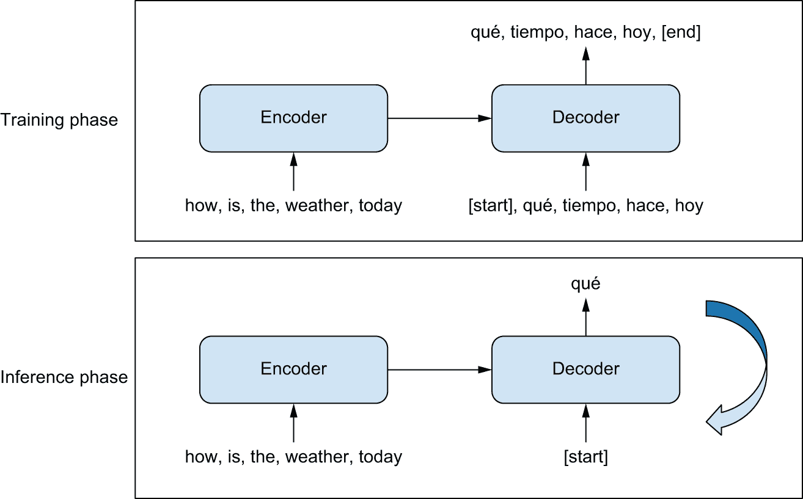
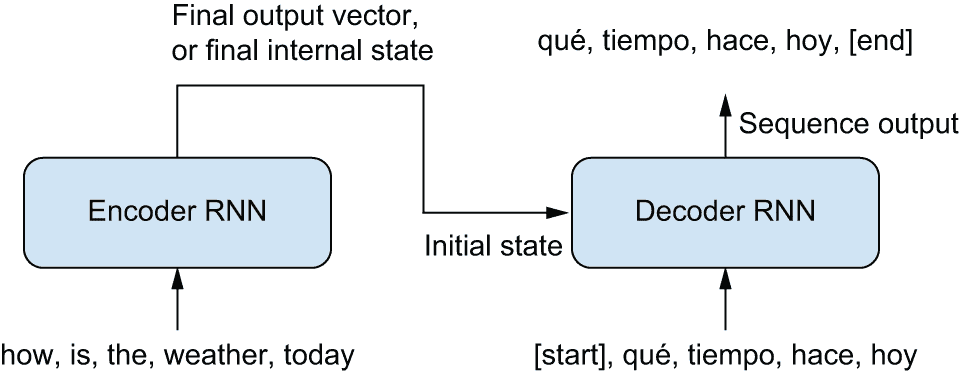
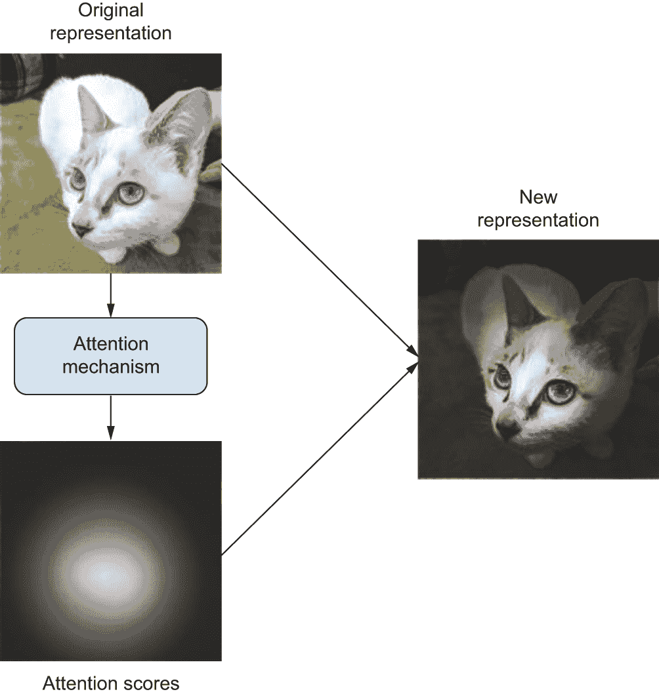
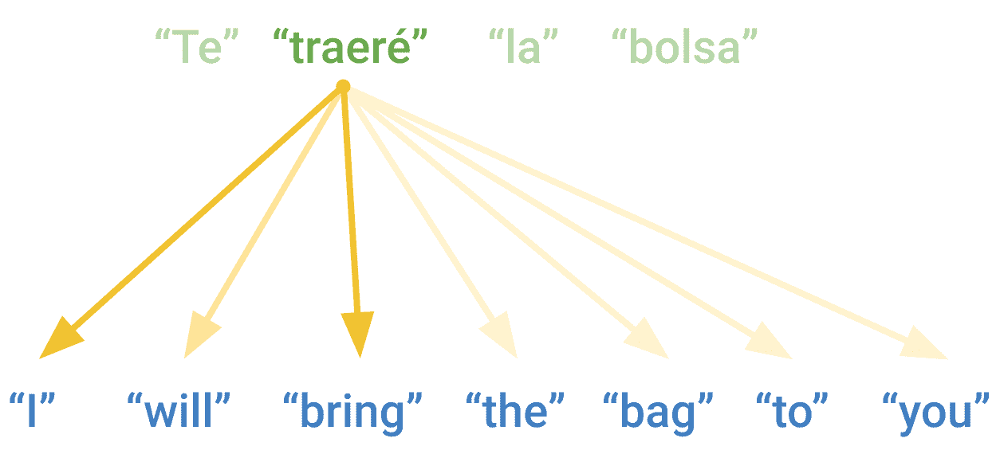
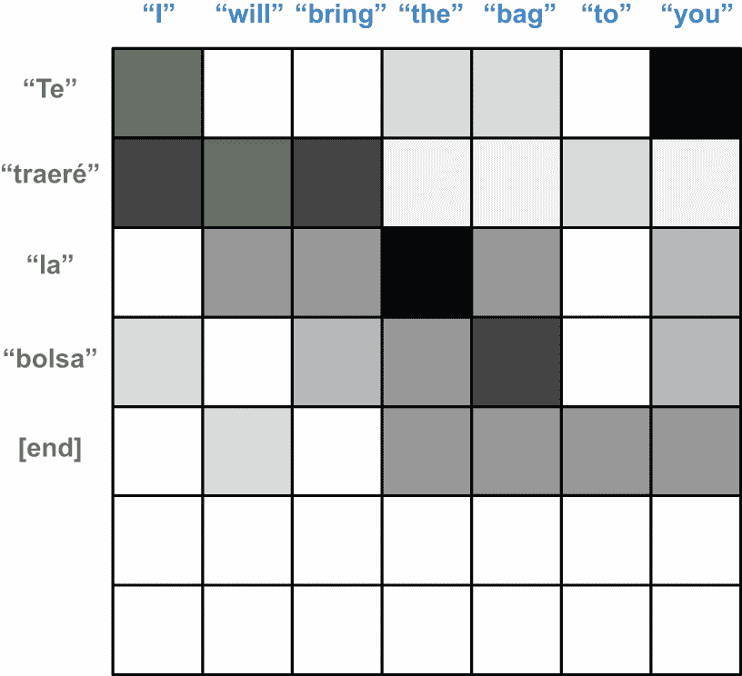
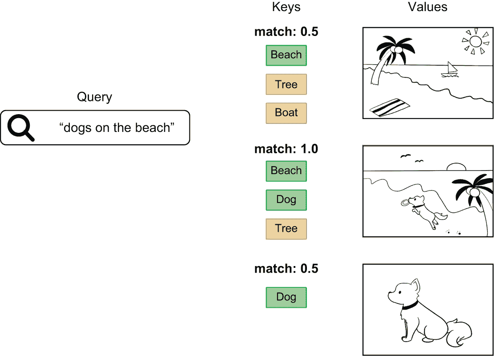
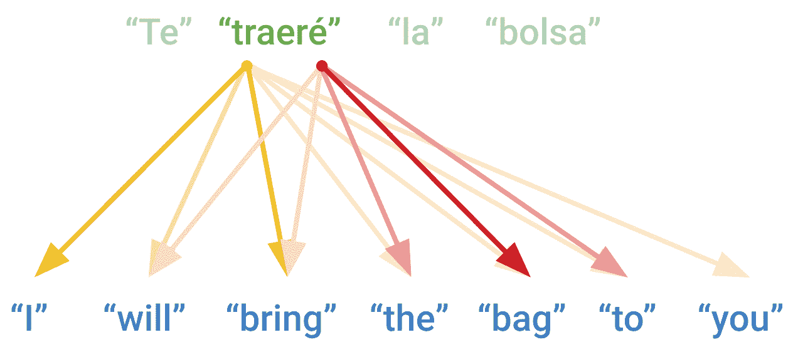
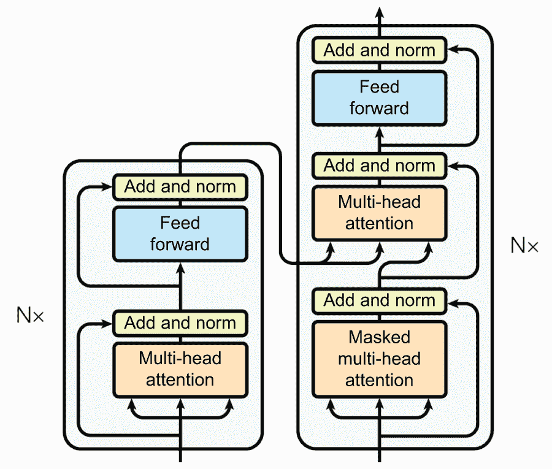

# 语言模型和 Transformer

> 原文：[`deeplearningwithpython.io/chapters/chapter15_language-models-and-the-transformer`](https://deeplearningwithpython.io/chapters/chapter15_language-models-and-the-transformer)

在上一章中介绍了文本预处理和建模的基础之后，本章将探讨一些更复杂的语言问题，例如机器翻译。我们将为驱动 ChatGPT 等产品并帮助引发自然语言处理（NLP）投资热潮的 Transformer 模型建立起坚实的直觉。

## 语言模型

在上一章中，我们学习了如何将文本数据转换为数值输入，并使用这种数值表示来对电影评论进行分类。然而，文本分类在很多方面都是一个独特而简单的问题。对于二元分类，我们只需要输出一个单精度浮点数，而对于 N 路分类，最坏的情况是输出*N*个数字。

那么，关于其他基于文本的任务，如问答或翻译呢？对于许多现实世界的问题，我们感兴趣的是能够为给定输入生成文本输出的模型。就像我们需要标记化器和嵌入层来帮助我们处理模型输入路径上的文本一样，我们必须在能够生成模型输出路径上的文本之前构建一些技术。

在这里我们不需要从头开始；我们可以继续使用整数序列作为文本的自然数值表示的想法。在上一章中，我们学习了如何将字符串**标记化**，即把输入分割成标记并将每个标记映射到一个整数。我们可以通过相反的过程**反标记化**一个序列——将整数映射回字符串标记并将它们连接起来。采用这种方法，我们的问题变成了构建一个能够预测标记整数序列的模型。

考虑的最简单选项可能是训练一个直接分类器，覆盖所有可能的输出整数序列空间，但一些简单的数学计算很快就会显示这是不可行的。以 20,000 个单词的词汇量为例，有 20,000⁴，即 160 万亿可能的 4 词序列，而宇宙中的原子数量少于可能的 20 词序列。试图将每个输出序列表示为唯一的分类器输出将无论我们如何设计模型都会耗尽计算资源。

要使这样的预测问题可行的一个实际方法是构建一个一次只预测单个标记输出的模型。一个**语言模型**在其最简单的形式下，学习一个简单但深入的概率分布：`p(token|past tokens)`。给定一个观察到某个点的所有标记的序列，语言模型将尝试输出一个概率分布，覆盖所有可能的下一个标记。一个 20,000 词的词汇表意味着模型只需要预测 20,000 个输出，但通过**重复**预测下一个标记，我们将构建一个能够生成长序列文本的模型。

让我们通过构建一个简单的语言模型来预测字符序列中的下一个字符来使这个问题更具体。我们将训练一个能够输出类似莎士比亚文本的小型模型。

### 训练莎士比亚语言模型

首先，我们可以下载一些莎士比亚的戏剧和十四行诗的集合。

```py
import keras

filename = keras.utils.get_file(
    origin=(
        "https://storage.googleapis.com/download.tensorflow.org/"
        "data/shakespeare.txt"
    ),
)
shakespeare = open(filename, "r").read() 
```

列表 15.1：下载莎士比亚作品的缩略版集合

让我们看看一些数据：

```py
>>> shakespeare[:250]
First Citizen:
Before we proceed any further, hear me speak.

All:
Speak, speak.

First Citizen:
You are all resolved rather to die than to famish?

All:
Resolved. resolved.

First Citizen:
First, you know Caius Marcius is chief enemy to the people.
```

要从这个输入构建一个*语言模型*，我们需要对我们的源文本进行整理。首先，我们将数据分割成等长块，我们可以批量使用这些块进行模型训练，就像我们在时间序列章节中为天气测量所做的那样。因为我们在这里将使用字符级分词器，所以我们可以直接在字符串输入上进行这种分割。一个 100 字符的字符串将映射到一个 100 个整数的序列。

我们还将每个输入分割成两个单独的特征和标签序列，每个标签序列只是输入序列偏移一个字符。

```py
import tensorflow as tf

# The chunk size we will use during training. We only train on
# sequences of 100 characters at a time.
sequence_length = 100

def split_input(input, sequence_length):
    for i in range(0, len(input), sequence_length):
        yield input[i : i + sequence_length]

features = list(split_input(shakespeare[:-1], sequence_length))
labels = list(split_input(shakespeare[1:], sequence_length))
dataset = tf.data.Dataset.from_tensor_slices((features, labels)) 
```

列表 15.2：将文本分割成块以进行语言模型训练

让我们看看一个`(x, y)`输入样本。序列中每个位置上的标签是序列中的下一个字符：

```py
>>> x, y = next(dataset.as_numpy_iterator())
>>> x[:50], y[:50]
(b"First Citizen:\nBefore we proceed any further, hear",
 b"irst Citizen:\nBefore we proceed any further, hear ")
```

为了将这个输入映射到整数序列，我们又可以再次使用我们在上一章中看到的`TextVectorization`层。为了学习字符级词汇表而不是词级词汇表，我们可以更改我们的`split`参数。而不是默认的`"whitespace"`分割，我们改为按`"character"`分割。在这里我们不会进行标准化——为了简单起见，我们将保留大小写并直接传递标点符号。

```py
from keras import layers

tokenizer = layers.TextVectorization(
    standardize=None,
    split="character",
    output_sequence_length=sequence_length,
)
tokenizer.adapt(dataset.map(lambda text, labels: text)) 
```

列表 15.3：使用`TextVectorization`层学习字符级词汇表

让我们检查一下词汇表：

```py
>>> vocabulary_size = tokenizer.vocabulary_size()
>>> vocabulary_size
67
```

我们只需要 67 个字符来处理完整的源文本。

接下来，我们可以将我们的分词层应用于我们的输入文本。最后，我们可以打乱、批量并缓存我们的数据集，这样我们就不需要在每个 epoch 重新计算它：

```py
dataset = dataset.map(
    lambda features, labels: (tokenizer(features), tokenizer(labels)),
    num_parallel_calls=8,
)
training_data = dataset.shuffle(10_000).batch(64).cache() 
```

到此为止，我们已经准备好开始建模。

为了构建我们的简单语言模型，我们想要预测给定所有过去字符的字符概率。在我们这本书中迄今为止看到的所有建模可能性中，RNN 是最自然的选择，因为每个单元的循环状态允许模型在预测当前字符的标签时传播关于过去字符的信息。我们也可以使用`Embedding`，正如我们在上一章中看到的，将每个输入字符嵌入为唯一的 256 维向量。

我们将只使用单个循环层来保持这个模型小巧且易于训练。任何循环层都可以在这里使用，但为了简单起见，我们将使用`GRU`，它速度快且内部状态比`LSTM`简单。

```py
embedding_dim = 256
hidden_dim = 1024

inputs = layers.Input(shape=(sequence_length,), dtype="int", name="token_ids")
x = layers.Embedding(vocabulary_size, embedding_dim)(inputs)
x = layers.GRU(hidden_dim, return_sequences=True)(x)
x = layers.Dropout(0.1)(x)
# Outputs a probability distribution over all potential tokens in our
# vocabulary
outputs = layers.Dense(vocabulary_size, activation="softmax")(x)
model = keras.Model(inputs, outputs) 
```

列表 15.4：构建微型语言模型

让我们看看我们的模型摘要：

```py
>>> model.summary()
Model: "functional"
┏━━━━━━━━━━━━━━━━━━━━━━━━━━━━━━━━━━━┳━━━━━━━━━━━━━━━━━━━━━━━━━━┳━━━━━━━━━━━━━━━┓
┃ Layer (type)                      ┃ Output Shape             ┃       Param # ┃
┡━━━━━━━━━━━━━━━━━━━━━━━━━━━━━━━━━━━╇━━━━━━━━━━━━━━━━━━━━━━━━━━╇━━━━━━━━━━━━━━━┩
│ token_ids (InputLayer)            │ (None, 100)              │             0 │
├───────────────────────────────────┼──────────────────────────┼───────────────┤
│ embedding (Embedding)             │ (None, 100, 256)         │        17,152 │
├───────────────────────────────────┼──────────────────────────┼───────────────┤
│ gru (GRU)                         │ (None, 100, 1024)        │     3,938,304 │
├───────────────────────────────────┼──────────────────────────┼───────────────┤
│ dropout (Dropout)                 │ (None, 100, 1024)        │             0 │
├───────────────────────────────────┼──────────────────────────┼───────────────┤
│ dense (Dense)                     │ (None, 100, 67)          │        68,675 │
└───────────────────────────────────┴──────────────────────────┴───────────────┘
 Total params: 4,024,131 (15.35 MB)
 Trainable params: 4,024,131 (15.35 MB)
 Non-trainable params: 0 (0.00 B)
```

此模型为词汇表中的每个可能字符输出一个 softmax 概率，我们将使用交叉熵损失`compile()`它。请注意，我们的模型仍在进行分类问题的训练，只是我们将为序列中的每个符号进行一次分类预测。对于我们的每个包含 100 个字符的 64 个样本批次，我们将预测 6,400 个单独的标签。Keras 在训练期间报告的损失和准确度指标将首先在每个序列中平均，然后在每个批次中平均。

让我们继续训练我们的语言模型。

```py
model.compile(
    optimizer="adam",
    loss="sparse_categorical_crossentropy",
    metrics=["sparse_categorical_accuracy"],
)
model.fit(training_data, epochs=20) 
```

列表 15.5：训练微型语言模型

经过 20 个 epoch 后，我们的模型最终可以大约 70%的时间预测输入序列中的下一个字符。

### 生成莎士比亚

现在我们已经训练了一个可以以一定精度预测下一个 *单个* 符号的模型，我们希望用它来预测整个序列。我们可以通过循环调用模型来实现这一点，其中模型在某一时间步的预测输出成为下一时间步的模型输入。为这种反馈循环构建的模型有时被称为 *自回归* 模型。

要运行这样的循环，我们需要对我们刚刚训练的模型进行轻微的手术。在训练过程中，我们的模型只处理固定长度的 100 个符号序列，并且当调用层时，`GRU` 单元的状 态被隐式处理。在生成过程中，我们希望一次预测一个输出符号并显式输出 `GRU` 的单元状态。我们需要传播这个状态，它包含模型关于过去输入字符的所有编码信息，在下一次调用模型时。

让我们创建一个一次处理一个输入字符并允许显式传递 RNN 状态的模型。因为这个模型将具有相同的计算结构，只是输入和输出略有修改，我们可以将一个模型的权重分配给另一个模型。

```py
# Creates a model that receives and outputs the RNN state
inputs = keras.Input(shape=(1,), dtype="int", name="token_ids")
input_state = keras.Input(shape=(hidden_dim,), name="state")

x = layers.Embedding(vocabulary_size, embedding_dim)(inputs)
x, output_state = layers.GRU(hidden_dim, return_state=True)(
    x, initial_state=input_state
)
outputs = layers.Dense(vocabulary_size, activation="softmax")(x)
generation_model = keras.Model(
    inputs=(inputs, input_state),
    outputs=(outputs, output_state),
)
# Copies the parameters from the original model
generation_model.set_weights(model.get_weights()) 
```

列表 15.6：修改语言模型以进行自回归推理

通过这种方式，我们可以循环调用模型来预测输出序列。在我们这样做之前，我们将创建显式查找表，以便从字符切换到整数并选择一个 *提示* —— 一段文本，在我们开始预测新符号之前作为输入提供给模型：

```py
tokens = tokenizer.get_vocabulary()
token_ids = range(vocabulary_size)
char_to_id = dict(zip(tokens, token_ids))
id_to_char = dict(zip(token_ids, tokens))

prompt = """
KING RICHARD III:
""" 
```

为了开始生成，我们首先需要用我们的提示“初始化”GRU 的内部状态。为此，我们将提示逐个符号地输入到模型中。这将计算出模型在训练过程中遇到此提示时的确切 RNN 状态。

当我们将提示的最后一个字符输入到模型中时，我们的状态输出将捕获关于整个提示序列的信息。我们可以将最终的输出预测保存下来，以便稍后选择我们生成响应的第一个字符。

```py
input_ids = [char_to_id[c] for c in prompt]
state = keras.ops.zeros(shape=(1, hidden_dim))
for token_id in input_ids:
    inputs = keras.ops.expand_dims([token_id], axis=0)
    # Feeds the prompt character by character to update state
    predictions, state = generation_model.predict((inputs, state), verbose=0) 
```

列表 15.7：使用固定提示计算语言模型的起始状态

现在，我们已经准备好让模型预测一个新的输出序列。在一个循环中，直到达到期望的长度，我们将不断地选择模型预测的最可能的下一个字符，将其输入到模型中，并保持新的 RNN 状态。这样，我们可以预测整个序列，一次一个标记。

```py
import numpy as np

generated_ids = []
max_length = 250
# Generates characters one by one, computing a new state each iteration
for i in range(max_length):
    # The next character is the output index with the highest
    # probability.
    next_char = int(np.argmax(predictions, axis=-1)[0])
    generated_ids.append(next_char)
    inputs = keras.ops.expand_dims([next_char], axis=0)
    predictions, state = generation_model.predict((inputs, state), verbose=0) 
```

列表 15.8：使用语言模型逐个预测标记

让我们将我们的输出整数序列转换为字符串，看看模型预测了什么。为了*去标记化*我们的输入，我们只需将所有标记 ID 映射到字符串并将它们连接起来：

```py
output = "".join([id_to_char[token_id] for token_id in generated_ids])
print(prompt + output) 
```

我们得到以下输出：

```py
KING RICHARD III:
Stay, men! hear me speak.

FRIAR LAURENCE:
Thou wouldst have done thee here that he hath made for them?

BUCKINGHAM:
What straight shall stop his dismal threatening son,
Thou bear them both. Here comes the king;
Though I be good to put a wife to him, 
```

我们还没有创造出下一个伟大的悲剧，但这对于在最小数据集上训练两分钟来说并不糟糕。这个玩具示例的目标是展示语言模型设置的力量。我们在猜测单个字符的狭窄问题上训练了模型，但仍然用它来解决一个更广泛的问题，生成一个开放式的、莎士比亚式的文本响应。

重要的是要注意，这种训练设置之所以有效，仅仅是因为循环神经网络只在前向传递信息。如果你想的话，可以尝试将`GRU`层替换为`Bidirectional(GRU(...))`。训练准确率将立即飙升到 99%以上，而生成将完全停止工作。在训练过程中，我们的模型在每个训练步骤中都会看到整个序列。如果我们通过让序列中下一个标记的信息影响当前标记的预测来“作弊”，我们就使我们的问题变得极其简单。

这种*语言建模*设置对于文本领域的无数问题至关重要。与其他我们在本书中看到的建模问题相比，它也有些独特。我们无法简单地调用`model.predict()`来获取所需的输出。在推理时间存在一个完整的循环和一个非平凡的逻辑！RNN 单元中的状态循环在训练和推理时都会发生，但在训练过程中，我们从未将模型的预测标签作为输入反馈给模型。

## 序列到序列学习

让我们将语言模型的想法扩展到解决一个重要的问题——机器翻译。翻译属于一类通常称为*序列到序列*建模（如果你试图节省按键，可以称为*seq2seq*）。我们寻求构建一个模型，它可以接受源文本作为固定输入序列，并生成翻译文本序列作为结果。问答是另一个经典的序列到序列问题。

序列到序列模型背后的通用模板在图 15.1 中描述。在训练过程中，以下情况发生：

+   编码器模型将源序列转换为中间表示。

+   使用我们之前看到的语言建模设置来训练解码器。它将通过查看所有先前的目标标记以及我们编码器对源序列的表示来递归地预测目标序列中的下一个标记。

在推理过程中，我们无法访问目标序列——我们正在从头开始尝试预测它。我们将逐个生成标记，就像我们使用我们的莎士比亚生成器一样：

+   我们从编码器中获取编码后的源序列。

+   解码器首先查看编码后的源序列以及一个初始的“种子”标记（例如字符串`"[start]"`），并使用它们来预测序列中的第一个真实标记。

+   到目前为止预测的序列被反馈到解码器中，在一个循环中，直到生成一个停止标记（例如字符串`"[end]"`）。



图 15.1：序列到序列学习：源序列由编码器处理，然后发送到解码器。解码器查看到目前为止的目标序列，并预测未来一步的目标序列。在推理过程中，我们逐个生成目标标记，并将其反馈到解码器中。

让我们构建一个序列到序列的翻译模型。

### 英语到西班牙语的翻译

我们将使用一个英语到西班牙语的翻译数据集。让我们下载它：

```py
import pathlib

zip_path = keras.utils.get_file(
    origin=(
        "http://storage.googleapis.com/download.tensorflow.org/data/spa-eng.zip"
    ),
    fname="spa-eng",
    extract=True,
)
text_path = pathlib.Path(zip_path) / "spa-eng" / "spa.txt" 
```

文本文件每行包含一个示例：一个英语句子，后面跟着一个制表符，然后是相应的西班牙语句子。让我们解析这个文件：

```py
with open(text_path) as f:
    lines = f.read().split("\n")[:-1]
text_pairs = []
for line in lines:
    english, spanish = line.split("\t")
    spanish = "[start] " + spanish + " [end]"
    text_pairs.append((english, spanish)) 
```

我们的`text_pairs`看起来像这样：

```py
>>> import random
>>> random.choice(text_pairs)
("Who is in this room?", "[start] ¿Quién está en esta habitación? [end]")
```

让我们打乱它们并将它们分成通常的训练、验证和测试集：

```py
import random

random.shuffle(text_pairs)
val_samples = int(0.15 * len(text_pairs))
train_samples = len(text_pairs) - 2 * val_samples
train_pairs = text_pairs[:train_samples]
val_pairs = text_pairs[train_samples : train_samples + val_samples]
test_pairs = text_pairs[train_samples + val_samples :] 
```

接下来，让我们准备两个独立的`TextVectorization`层：一个用于英语，一个用于西班牙语。我们需要自定义字符串的预处理方式：

+   我们需要保留我们插入的`"[start]"`和`"[end]"`标记。默认情况下，字符`[`和`]`会被去除，但我们要保留它们，以便我们可以区分单词`"start"`和起始标记`"[start]"`。

+   标点符号在不同的语言中是不同的！在西班牙语的`TextVectorization`层中，如果我们打算去除标点符号，我们还需要去除字符`¿`。

注意，对于一个非玩具翻译模型，我们会将标点符号视为单独的标记，而不是去除它们，因为我们希望能够生成正确标点的句子。在我们的情况下，为了简单起见，我们将去除所有标点。

```py
import string
import re

strip_chars = string.punctuation + "¿"
strip_chars = strip_chars.replace("[", "")
strip_chars = strip_chars.replace("]", "")

def custom_standardization(input_string):
    lowercase = tf.strings.lower(input_string)
    return tf.strings.regex_replace(
        lowercase, f"[{re.escape(strip_chars)}]", ""
    )

vocab_size = 15000
sequence_length = 20

english_tokenizer = layers.TextVectorization(
    max_tokens=vocab_size,
    output_mode="int",
    output_sequence_length=sequence_length,
)
spanish_tokenizer = layers.TextVectorization(
    max_tokens=vocab_size,
    output_mode="int",
    output_sequence_length=sequence_length + 1,
    standardize=custom_standardization,
)
train_english_texts = [pair[0] for pair in train_pairs]
train_spanish_texts = [pair[1] for pair in train_pairs]
english_tokenizer.adapt(train_english_texts)
spanish_tokenizer.adapt(train_spanish_texts) 
```

列表 15.9：为英语和西班牙语文本学习标记词汇表

最后，我们可以将我们的数据转换为`tf.data`管道。我们希望它返回一个元组`(inputs, target, sample_weights)`，其中`inputs`是一个字典，包含两个键，`"english"`（标记化的英语句子）和`"spanish"`（标记化的西班牙语句子），而`target`是提前一步的西班牙语句子。`sample_weights`在这里将用于告诉 Keras 在计算我们的损失和度量时使用哪些标签。我们的输出翻译长度并不相同，我们的一些标签序列将用零填充。我们只关心非零标签的预测，这些标签代表实际的翻译文本。

这与我们在刚刚构建的生成模型中设置的“偏移一个”标签设置相匹配，增加了固定的编码器输入，这些输入将在我们的模型中单独处理。

```py
batch_size = 64

def format_dataset(eng, spa):
    eng = english_tokenizer(eng)
    spa = spanish_tokenizer(spa)
    features = {"english": eng, "spanish": spa[:, :-1]}
    labels = spa[:, 1:]
    sample_weights = labels != 0
    return features, labels, sample_weights

def make_dataset(pairs):
    eng_texts, spa_texts = zip(*pairs)
    eng_texts = list(eng_texts)
    spa_texts = list(spa_texts)
    dataset = tf.data.Dataset.from_tensor_slices((eng_texts, spa_texts))
    dataset = dataset.batch(batch_size)
    dataset = dataset.map(format_dataset, num_parallel_calls=4)
    return dataset.shuffle(2048).cache()

train_ds = make_dataset(train_pairs)
val_ds = make_dataset(val_pairs) 
```

列表 15.10：标记化和准备翻译数据

这里是我们的数据集输出看起来像什么：

```py
>>> inputs, targets, sample_weights = next(iter(train_ds))
>>> print(inputs["english"].shape)
(64, 20)
>>> print(inputs["spanish"].shape)
(64, 20)
>>> print(targets.shape)
(64, 20)
>>> print(sample_weights.shape)
(64, 20)
```

数据现在准备好了——是时候构建一些模型了。

### 使用 RNN 进行序列到序列学习

在尝试我们之前提到的双编码器/解码器设置之前，让我们先考虑一些更简单的选项。使用 RNN 将一个序列转换为另一个序列的最简单、最直接的方法是保留 RNN 在每个时间步的输出，并从中预测一个输出标记。在 Keras 中，它看起来像这样：

```py
inputs = keras.Input(shape=(sequence_length,), dtype="int32")
x = layers.Embedding(input_dim=vocab_size, output_dim=128)(inputs)
x = layers.LSTM(32, return_sequences=True)(x)
outputs = layers.Dense(vocab_size, activation="softmax")(x)
model = keras.Model(inputs, outputs) 
```

然而，这种方法存在一个关键问题。由于 RNN 的逐步性质，模型将只查看源序列中的`0...N`标记来预测目标序列中的标记`N`。考虑翻译句子，“我将把包带到你那里。”在西班牙语中，这将变成“Te traeré la bolsa”，其中“Te”，翻译中的第一个词，对应于英语源文本中的“you”。没有看到源英语文本的最后单词，就根本无法输出翻译的第一个单词！

如果你是一名人工翻译员，你将首先阅读整个源句子，然后再开始翻译。如果你处理的是具有截然不同单词顺序的语言，这一点尤为重要。这正是标准序列到序列模型所做的事情。在一个合适的序列到序列设置中（见图 15.2），你将首先使用编码器 RNN 将整个源序列转换成源文本的单个表示。这可以是 RNN 的最后一个输出，或者，作为替代，其最终内部状态向量。我们可以使用这个表示作为语言模型设置中解码器 RNN 的初始状态，而不是我们用于莎士比亚生成器的零初始状态。这个解码器学习根据翻译中的当前单词预测西班牙语翻译的下一个单词，所有关于英语序列的信息都来自那个初始 RNN 状态。



图 15.2：序列到序列 RNN：一个 RNN 编码器用于生成一个编码整个源序列的向量，该向量用作 RNN 解码器的初始状态。

让我们在 Keras 中实现这个模型，使用基于 GRU 的编码器和解码器。我们可以先从编码器开始。由于我们实际上不会在编码器序列中预测标记，所以我们不必担心通过让模型从序列的末尾传递信息到序列的开头位置来“作弊”。实际上，这是一个好主意，因为我们希望有一个丰富的源序列表示。我们可以通过一个`双向`层来实现这一点。

```py
embed_dim = 256
hidden_dim = 1024

source = keras.Input(shape=(None,), dtype="int32", name="english")
x = layers.Embedding(vocab_size, embed_dim, mask_zero=True)(source)
rnn_layer = layers.GRU(hidden_dim)
rnn_layer = layers.Bidirectional(rnn_layer, merge_mode="sum")
encoder_output = rnn_layer(x) 
```

列表 15.11：构建序列到序列编码器

接下来，让我们添加解码器——一个简单的 `GRU` 层，它将编码的源句子作为其初始状态。在其之上，我们添加一个 `Dense` 层，它为每个输出步骤生成西班牙语词汇表上的概率分布。在这里，我们希望仅基于之前的内容来预测下一个标记，所以一个 `双向` RNN 会通过使损失函数变得过于简单而破坏训练。

```py
target = keras.Input(shape=(None,), dtype="int32", name="spanish")
x = layers.Embedding(vocab_size, embed_dim, mask_zero=True)(target)
rnn_layer = layers.GRU(hidden_dim, return_sequences=True)
x = rnn_layer(x, initial_state=encoder_output)
x = layers.Dropout(0.5)(x)
# Predicts the next word of the translation, given the current word
target_predictions = layers.Dense(vocab_size, activation="softmax")(x)
seq2seq_rnn = keras.Model([source, target], target_predictions) 
```

列表 15.12：构建序列到序列解码器

让我们全面看看 seq2seq 模型：

```py
>>> seq2seq_rnn.summary()
Model: "functional_1"
┏━━━━━━━━━━━━━━━━━━━━━━━┳━━━━━━━━━━━━━━━━━━━┳━━━━━━━━━━━━━┳━━━━━━━━━━━━━━━━━━━━┓
┃ Layer (type)          ┃ Output Shape      ┃     Param # ┃ Connected to       ┃
┡━━━━━━━━━━━━━━━━━━━━━━━╇━━━━━━━━━━━━━━━━━━━╇━━━━━━━━━━━━━╇━━━━━━━━━━━━━━━━━━━━┩
│ english (InputLayer)  │ (None, None)      │           0 │ -                  │
├───────────────────────┼───────────────────┼─────────────┼────────────────────┤
│ spanish (InputLayer)  │ (None, None)      │           0 │ -                  │
├───────────────────────┼───────────────────┼─────────────┼────────────────────┤
│ embedding_1           │ (None, None, 256) │   3,840,000 │ english[0][0]      │
│ (Embedding)           │                   │             │                    │
├───────────────────────┼───────────────────┼─────────────┼────────────────────┤
│ not_equal (NotEqual)  │ (None, None)      │           0 │ english[0][0]      │
├───────────────────────┼───────────────────┼─────────────┼────────────────────┤
│ embedding_2           │ (None, None, 256) │   3,840,000 │ spanish[0][0]      │
│ (Embedding)           │                   │             │                    │
├───────────────────────┼───────────────────┼─────────────┼────────────────────┤
│ bidirectional         │ (None, 1024)      │   7,876,608 │ embedding_1[0][0], │
│ (Bidirectional)       │                   │             │ not_equal[0][0]    │
├───────────────────────┼───────────────────┼─────────────┼────────────────────┤
│ gru_2 (GRU)           │ (None, None,      │   3,938,304 │ embedding_2[0][0], │
│                       │ 1024)             │             │ bidirectional[0][… │
├───────────────────────┼───────────────────┼─────────────┼────────────────────┤
│ dropout_1 (Dropout)   │ (None, None,      │           0 │ gru_2[0][0]        │
│                       │ 1024)             │             │                    │
├───────────────────────┼───────────────────┼─────────────┼────────────────────┤
│ dense_1 (Dense)       │ (None, None,      │  15,375,000 │ dropout_1[0][0]    │
│                       │ 15000)            │             │                    │
└───────────────────────┴───────────────────┴─────────────┴────────────────────┘
 Total params: 34,869,912 (133.02 MB)
 Trainable params: 34,869,912 (133.02 MB)
 Non-trainable params: 0 (0.00 B)
```

我们的模式和数据都已经准备好了。现在我们可以开始训练我们的翻译模型了：

```py
seq2seq_rnn.compile(
    optimizer="adam",
    loss="sparse_categorical_crossentropy",
    weighted_metrics=["accuracy"],
)
seq2seq_rnn.fit(train_ds, epochs=15, validation_data=val_ds) 
```

我们选择准确率作为监控训练过程中验证集性能的粗略方法。我们达到了 65% 的准确率：平均而言，模型在西班牙语句子中正确预测下一个单词的频率为 65%。然而，在实践中，下一个标记的准确率并不是机器翻译模型的一个很好的指标，特别是因为它假设在预测标记 `N + 1` 时，从 `0` 到 `N` 的正确目标标记已经为人所知。实际上，在推理过程中，你是从头开始生成目标句子，你不能依赖之前生成的标记是 100% 正确的。在处理实际的机器翻译系统时，指标必须更加精心设计。有一些标准指标，如 BLEU 分数，可以衡量机器翻译文本与一组高质量参考翻译的相似性，并且可以容忍略微错位的序列。

最后，让我们使用我们的模型进行推理。我们将从测试集中的几个句子中选择，并检查我们的模型如何翻译它们。我们将从种子标记 `"[start]"` 开始，将其输入到解码器模型中，同时输入编码的英语源句子。我们将检索下一个标记的预测，并将其反复重新注入到解码器中，在每次迭代中采样一个新的目标标记，直到我们到达 `"[end]"` 或达到最大句子长度。

```py
import numpy as np

spa_vocab = spanish_tokenizer.get_vocabulary()
spa_index_lookup = dict(zip(range(len(spa_vocab)), spa_vocab))

def generate_translation(input_sentence):
    tokenized_input_sentence = english_tokenizer([input_sentence])
    decoded_sentence = "[start]"
    for i in range(sequence_length):
        tokenized_target_sentence = spanish_tokenizer([decoded_sentence])
        inputs = [tokenized_input_sentence, tokenized_target_sentence]
        next_token_predictions = seq2seq_rnn.predict(inputs, verbose=0)
        sampled_token_index = np.argmax(next_token_predictions[0, i, :])
        sampled_token = spa_index_lookup[sampled_token_index]
        decoded_sentence += " " + sampled_token
        if sampled_token == "[end]":
            break
    return decoded_sentence

test_eng_texts = [pair[0] for pair in test_pairs]
for _ in range(5):
    input_sentence = random.choice(test_eng_texts)
    print("-")
    print(input_sentence)
    print(generate_translation(input_sentence)) 
```

列表 15.13：使用 seq2seq RNN 生成翻译

精确的翻译会因运行而异，因为最终的模型权重将取决于我们权重的随机初始化以及输入数据的随机洗牌。以下是我们的结果：

```py
-
You know that.
[start] tú lo sabes [end]
-
"Thanks." "You're welcome."
[start] gracias tú [UNK] [end]
-
The prisoner was set free yesterday.
[start] el plan fue ayer a un atasco [end]
-
I will tell you tomorrow.
[start] te lo voy mañana a decir [end]
-
I think they're happy.
[start] yo creo que son felices [end] 
```

我们的模型作为一个玩具模型表现相当不错，尽管它仍然犯了许多基本错误。

注意，这个推理设置虽然非常简单，但效率低下，因为每次我们采样一个新词时，都需要重新处理整个源句子和整个生成的目标句子。在实际应用中，你想要小心不要重新计算任何没有改变的状态。我们真正需要预测解码器中的新标记的只是当前标记和之前的 RNN 状态，我们可以在每次循环迭代之前将其缓存。

有许多方法可以改进这个玩具模型。我们可以为编码器和解码器都使用深层循环层堆叠，我们可以尝试其他 RNN 层，如 `LSTM`，等等。然而，除了这些微调之外，RNN 方法在序列到序列学习中的几个基本局限性：

+   源序列表示必须完全存储在编码器状态向量中，这显著限制了你可以翻译的句子的规模和复杂性。

+   RNN 在处理非常长的序列时遇到困难，因为它们往往会逐渐忘记过去——当你到达任意序列中的第 100 个标记时，关于序列开始的信息就所剩无几了。

循环神经网络在 2010 年代中期主导了序列到序列学习。2017 年左右的 Google Translate 是由七个大型 `LSTM` 层堆叠而成的，其设置类似于我们刚刚创建的。然而，这些 RNN 的局限性最终导致了研究人员开发了一种新的序列模型风格，称为 Transformer。

## Transformer 架构

2017 年，Vaswani 等人发表了开创性的论文“Attention Is All You Need.”^([[1]](#footnote-1))，在其中介绍了 Transformer 架构。作者们正在研究类似于我们刚刚构建的翻译系统，而关键发现就体现在标题中。结果证明，一种简单的机制称为 *注意力* 可以用来构建不包含循环层的强大序列模型。注意力的想法并不新颖，在他们发表时，该想法已经在自然语言处理系统中使用了几年。但当时，注意力如此有用，以至于它可以成为传递序列信息的 *唯一* 机制，这一点相当令人惊讶。

这一发现引发了自然语言处理——乃至更广泛的领域的革命。注意力迅速成为深度学习中最有影响力的想法之一。在本节中，你将深入了解它是如何工作的以及为什么它在序列建模中证明如此有效。然后我们将使用注意力来重建我们的英语到西班牙语的翻译模型。

因此，在所有这些铺垫之后，什么是注意力？它又是如何为我们迄今为止使用的循环神经网络提供替代方案的？

注意力实际上是为了增强我们刚刚构建的类似 RNN 模型而开发的。研究人员注意到，虽然 RNNs 在建模局部邻域中的依赖关系方面表现出色，但随着序列变长，它们在回忆方面遇到了困难。比如说，你正在构建一个回答关于源文档问题的系统。如果文档长度过长，RNN 的结果会变得非常糟糕，远远低于人类的表现。

作为一种思想实验，想象使用这本书来构建一个天气预报模型。如果你有足够的时间，你可能会从头到尾阅读整本书，但在实际实现你的模型时，你会特别关注时间序列章节。即使在章节中，你也可能会找到你经常参考的特定代码示例和解释。另一方面，当你编写代码时，你不会特别担心图像卷积的细节。这本书的总字数远远超过 10 万，远超我们处理过的任何序列长度，但人类在从文本中提取信息时可以是*选择性的*和*情境性的*。

与此相反，RNNs 缺乏直接回溯序列先前部分的机制。所有信息必须通过 RNN 单元的内部状态在循环中传递，通过序列中的每个位置。这有点像完成这本书，合上它，然后试图完全从记忆中实现那个天气预报模型。注意力的想法是通过构建一种机制，使神经网络可以根据当前正在处理的输入，在序列的某些部分给予更多权重，而在其他部分给予较少权重（图 15.3）。



图 15.3：深度学习中注意力的通用概念：输入特征被分配注意力分数，这些分数可以用来告知输入的下一个表示。

### 点积注意力

让我们回顾一下我们的翻译 RNN，并尝试添加选择性注意的概念。考虑预测单个标记。在通过我们的`GRU`层传递`source`和`target`序列之后，我们将有一个代表即将预测的目标标记的向量，以及代表源文本中每个单词的向量序列。

使用注意力，我们的目标是给模型一种方法，根据当前试图预测的单词的相关性，为我们的源序列中的每个向量评分（图 15.4）。如果一个源标记的向量表示具有高分数，我们认为它特别重要；如果不是，我们就不太关心它。目前，让我们假设我们有一个这个函数 `score(target_vector, source_vector)`。



图 15.4：注意力为源序列中的每个向量以及目标序列中的每个向量分配一个相关性分数。

为了使注意力机制工作得更好，我们希望避免通过可能长达我们组合的源和目标序列长度之长的循环传递关于重要标记的信息——这就是 RNN 开始失败的地方。一个简单的方法是根据我们将要计算的分数对所有的源向量进行加权求和。如果给定目标的所有注意力分数之和为 1，这将使我们的加权求和具有可预测的幅度，这将是方便的。我们可以通过运行`softmax`函数来实现这一点——在 NumPy 伪代码中可能像这样：

```py
scores = [score(target, source) for source in sources]
scores = softmax(scores)
combined = np.sum(scores * sources) 
```

但我们应该如何计算这个相关性分数呢？当研究人员最初开始使用注意力机制时，这个问题成为了研究的重点。事实证明，最直接的方法是最好的。我们可以使用点积作为目标向量和源向量之间距离的简单度量。如果源向量和目标向量很接近，我们假设这意味着源标记与我们的预测相关。在本章结束时，我们将探讨为什么这个假设具有直观的意义。

让我们更新我们的伪代码。我们可以通过一次处理整个目标序列来使我们的片段更加完整——它将相当于在目标序列中的每个标记上运行我们之前的片段。当`target`和`source`都是序列时，注意力分数将是一个矩阵。每一行表示在加权求和中，目标单词将如何评价源单词（参见图 15.5）。我们将使用 Einsum 符号作为方便地编写点积和加权求和的方法：

```py
def dot_product_attention(target, source):
    # Takes the dot-product between all target and source vectors,
    # where b = batch size, t = target length, s = source length, and d
    # = vector size
    scores = np.einsum("btd,bsd->bts", target, source)
    scores = softmax(scores, axis=-1)
    # Computes a weighted sum of all source vectors for each target
    # vector
    return np.einsum("bts,bsd->btd", scores, source)

dot_product_attention(target, source) 
```



图 15.5：当目标和源都是序列时，注意力分数是一个二维矩阵。每一行显示了我们要预测的单词的注意力分数（以绿色显示）。

如果我们给模型参数以控制注意力分数，我们可以使这个注意力机制的**假设空间**变得更加丰富。如果我们用`Dense`层将源和目标向量都投影，模型可以在一个良好的共享空间中找到源向量，如果它们有助于整体预测质量，源向量就会靠近目标向量。同样，我们应该允许模型在将源向量组合之前和求和之后将源向量投影到完全不同的空间中。

我们还可以采用在领域内已成为标准的稍有不同的输入命名。我们刚才写的内容大致可以总结为`sum(score(target, source) * source)`。我们将用不同的输入名称以相同的方式写出这个等价表达式，即`sum(score(query, key) * value)`。这个三个参数的版本更通用——在罕见的情况下，你可能不想使用与你的源输入相同的向量来评分你的源输入，就像你用来求和源输入的向量一样。

术语来自搜索引擎和推荐系统。想象一个在数据库中查找照片的工具——“查询”是你的搜索词，“键”是你用来与查询匹配的照片标签，最后，“值”是照片本身（图 15.6）。我们构建的注意力机制大致相当于这种查找方式。



图 15.6：从数据库检索图像：*查询*与一组*键*进行比较，并使用匹配分数对*值*（图像）进行排序。

让我们更新我们的伪代码，以便我们有一个使用新术语的参数化注意力：

```py
query_dense = layers.Dense(dim)
key_dense = layers.Dense(dim)
value_dense = layers.Dense(dim)
output_dense = layers.Dense(dim)

def parameterized_attention(query, key, value):
    query = query_dense(query)
    key = key_dense(key)
    value = value_dense(value)
    scores = np.einsum("btd,bsd->bts", query, key)
    scores = softmax(scores, axis=-1)
    outputs = np.einsum("bts,bsd->btd", scores, value)
    return output_dense(outputs)

parameterized_attention(query=target, key=source, value=source) 
```

这个模块是一个功能齐全的注意力机制！我们刚刚编写了一个函数，允许模型根据我们正在解码的目标词，从源序列的任何位置提取信息，上下文相关。

“注意力即一切”的作者通过试错法对我们的机制进行了两项更多更改。第一项是一个简单的缩放因子。当输入向量变长时，点积分数可能会变得相当大，这可能会影响 softmax 梯度的稳定性。解决方案很简单：我们可以稍微降低我们的 softmax 分数。通过向量长度的平方根进行缩放对任何向量大小都有效。

另一方面与注意力机制的表意性有关。我们进行的 softmax 求和非常强大——它允许在序列的遥远部分之间建立直接连接。但求和操作也很直接：如果模型试图一次性关注太多标记，单个源标记的有趣特征会在组合表示中被“冲淡”。一个有效的小技巧是对同一序列进行多次注意力操作，使用几个不同的注意力*头*以不同的参数运行相同的计算：

```py
query_dense = [layers.Dense(head_dim) for i in range(num_heads)]
key_dense = [layers.Dense(head_dim) for i in range(num_heads)]
value_dense = [layers.Dense(head_dim) for i in range(num_heads)]
output_dense = layers.Dense(head_dim * num_heads)

def multi_head_attention(query, key, value):
    head_outputs = []
    for i in range(num_heads):
        query = query_densei
        key = key_densei
        value = value_densei
        scores = np.einsum("btd,bsd->bts", target, source)
        scores = softmax(scores / math.sqrt(head_dim), axis=-1)
        head_output = np.einsum("bts,bsd->btd", scores, source)
        head_outputs.append(head_output)
    outputs = ops.concatenate(head_outputs, axis=-1)
    return output_dense(outputs)

multi_head_attention(query=target, key=source, value=source) 
```

通过不同地投影查询和键，一个头可能学会匹配源句子的主题，而另一个头可能关注标点符号。这种多头注意力避免了需要将整个源序列与单个 softmax 求和结合的限制（图 15.7）。



图 15.7：多头注意力允许每个目标词在最终输出向量的不同分区中关注源序列的不同部分。

当然，在实践中，你希望将这段代码编写成一个可重用的层。在这里，Keras 为你提供了支持。我们可以使用`MultiHeadAttention`层重新创建之前的代码，如下所示：

```py
multi_head_attention = keras.layers.MultiHeadAttention(
    num_heads=num_heads,
    head_dim=head_dim,
)
multi_head_attention(query=target, key=source, value=source) 
```

### Transformer 编码器块

使用 `MultiHeadAttention` 层的一种方法是将它添加到我们现有的 RNN 翻译模型中。我们可以将编码器和解码器的序列输出传递到一个注意力层，并使用其输出在预测之前更新我们的目标序列。注意力可以使模型处理文本中的长距离依赖关系，而 `GRU` 层将难以处理。这实际上提高了 RNN 模型的能力，并且是注意力在 2010 年代中期首次被使用的方式。

然而，“Attention is all you need”的作者意识到你可以更进一步，将注意力作为处理模型中所有序列数据的一般机制。尽管到目前为止我们只将注意力视为处理两个序列之间信息传递的方式，但你也可以将注意力作为让序列关注自身的方式：

```py
multi_head_attention(key=source, value=source, query=source) 
```

这被称为 *自注意力*，它非常强大。使用自注意力，每个标记可以关注其自身序列中的每个标记，包括自身，这使得模型能够学习到上下文中的词表示。

考虑一个例子句子：“火车准时离开了车站。”现在，考虑句子中的一个词：“车站。”我们谈论的是哪种车站？可能是一个广播电台？也许是一个国际空间站？使用自注意力，模型可以学习给“车站”和“火车”这对词赋予高注意力得分，将表示“火车”的向量加到“车站”这个词的表示中。

自注意力为模型提供了一种有效的方法，从表示一个真空中的词到表示一个基于序列中所有其他标记的词。这听起来很像 RNN 应该做的事情。我们是否可以直接用 `MultiHeadAttention` 替换我们的 RNN 层？

几乎是了！但还不完全；我们仍然需要一个深度神经网络的基本成分——一个非线性激活函数。`MultiHeadAttention` 层结合了源序列中每个元素的线性投影，仅此而已。从某种意义上说，它是一个非常表达性的池化操作。考虑一个极端情况，一个标记长度为 1。在这种情况下，注意力得分矩阵始终是一个单一值，整个层简化为源序列的线性投影，没有任何非线性。你可以堆叠 100 个注意力层，仍然可以将整个计算简化为单次矩阵乘法！这是我们模型表达力的一个真正问题。

在某个点上，所有循环单元都会将每个标记的输入向量通过密集投影，并应用激活函数；我们需要一个类似的计划。在“Attention is all you need”的作者决定以最简单的方式添加这个功能——堆叠一个由两个密集层和一个中间激活函数组成的前馈网络。注意力在序列间传递信息，前馈网络更新单个序列项的表示。

我们已经准备好开始构建一个 Transformer 模型。让我们从替换我们的翻译模型的编码器开始。我们将使用自注意力机制来在英语单词的源序列中传递信息。我们还将加入在第九章中构建 ConvNets 时发现特别重要的两个东西，*归一化*和 _residual connections_。

```py
class TransformerEncoder(keras.Layer):
    def __init__(self, hidden_dim, intermediate_dim, num_heads):
        super().__init__()
        key_dim = hidden_dim // num_heads
        # Self-attention layers
        self.self_attention = layers.MultiHeadAttention(num_heads, key_dim)
        self.self_attention_layernorm = layers.LayerNormalization()
        # Feedforward layers
        self.feed_forward_1 = layers.Dense(intermediate_dim, activation="relu")
        self.feed_forward_2 = layers.Dense(hidden_dim)
        self.feed_forward_layernorm = layers.LayerNormalization()

    def call(self, source, source_mask):
        # Self-attention computation
        residual = x = source
        mask = source_mask[:, None, :]
        x = self.self_attention(query=x, key=x, value=x, attention_mask=mask)
        x = x + residual
        x = self.self_attention_layernorm(x)
        # Feedforward computation
        residual = x
        x = self.feed_forward_1(x)
        x = self.feed_forward_2(x)
        x = x + residual
        x = self.feed_forward_layernorm(x)
        return x 
```

列表 15.14：一个 Transformer 编码器块

你会注意到我们在这里使用的归一化层并不是像我们在图像模型中使用的那种 `BatchNormalization` 层。这是因为 `BatchNormalization` 在序列数据上效果不佳。相反，我们使用的是 `LayerNormalization` 层，它独立于批次中的其他序列对每个序列进行归一化——就像这样，在类似 NumPy 的伪代码中：

```py
# Input shape: (batch_size, sequence_length, embedding_dim)
def layer_normalization(batch_of_sequences):
    # To compute mean and variance, we only pool data over the last
    # axis.
    mean = np.mean(batch_of_sequences, keepdims=True, axis=-1)
    variance = np.var(batch_of_sequences, keepdims=True, axis=-1)
    return (batch_of_sequences - mean) / variance 
```

与 `BatchNormalization`（在训练期间）比较：

```py
# Input shape: (batch_size, height, width, channels)
def batch_normalization(batch_of_images):
    # Pools data over the batch axis (axis 0), which creates
    # interactions between samples in a batch
    mean = np.mean(batch_of_images, keepdims=True, axis=(0, 1, 2))
    variance = np.var(batch_of_images, keepdims=True, axis=(0, 1, 2))
    return (batch_of_images - mean) / variance 
```

虽然 `BatchNormalization` 从许多样本中收集信息以获得特征均值和方差的准确统计数据，但 `LayerNormalization` 在每个序列内部单独汇总数据，这更适合序列数据。

我们还向 `MultiHeadAttention` 层传递一个新的输入，称为 `attention_mask`。这个布尔张量输入将被广播到与我们的注意力分数相同的形状 `(batch_size, target_length, source_length)`。当设置时，它将在特定位置将注意力分数置零，阻止这些位置的源标记在注意力计算中使用。我们将使用这个来防止序列中的任何标记关注到填充标记，这些标记不包含任何信息。我们的编码器层接受一个 `source_mask` 输入，它将标记我们输入中的所有非填充标记，并将其提升到形状 `(batch_size, 1, source_length)` 以用作 `attention_mask`。

注意，这个层的输入和输出具有相同的形状，因此编码器块可以堆叠在一起，构建对输入英语句子表达越来越丰富的表示。

### Transformer 解码器块

接下来是解码器块。这个层将几乎与编码器块相同，但我们希望解码器使用编码器的输出序列作为输入。为此，我们可以使用两次注意力。我们首先应用一个类似于编码器的自注意力层，它允许目标序列中的每个位置使用来自其他目标位置的信息。然后我们添加另一个 `MultiHeadAttention` 层，它接收源序列和目标序列作为输入。我们将这个注意力层称为 *交叉注意力*，因为它在编码器和解码器之间传递信息。

```py
class TransformerDecoder(keras.Layer):
    def __init__(self, hidden_dim, intermediate_dim, num_heads):
        super().__init__()
        key_dim = hidden_dim // num_heads
        # Self-attention layers
        self.self_attention = layers.MultiHeadAttention(num_heads, key_dim)
        self.self_attention_layernorm = layers.LayerNormalization()
        # Cross-attention layers
        self.cross_attention = layers.MultiHeadAttention(num_heads, key_dim)
        self.cross_attention_layernorm = layers.LayerNormalization()
        # Feedforward layers
        self.feed_forward_1 = layers.Dense(intermediate_dim, activation="relu")
        self.feed_forward_2 = layers.Dense(hidden_dim)
        self.feed_forward_layernorm = layers.LayerNormalization()

    def call(self, target, source, source_mask):
        # Self-attention computation
        residual = x = target
        x = self.self_attention(query=x, key=x, value=x, use_causal_mask=True)
        x = x + residual
        x = self.self_attention_layernorm(x)
        # Cross-attention computation
        residual = x
        mask = source_mask[:, None, :]
        x = self.cross_attention(
            query=x, key=source, value=source, attention_mask=mask
        )
        x = x + residual
        x = self.cross_attention_layernorm(x)
        # Feedforward computation
        residual = x
        x = self.feed_forward_1(x)
        x = self.feed_forward_2(x)
        x = x + residual
        x = self.feed_forward_layernorm(x)
        return x 
```

列表 15.15：一个 Transformer 解码器块

我们的解码器层接受一个 `target` 和一个 `source`。与 `TransformerEncoder` 一样，我们接受一个 `source_mask`，它标记源输入中所有填充的位置（`True` 表示非填充，`False` 表示填充），并将其用作交叉注意力层的 `attention_mask`。

对于解码器的自注意力层，我们需要不同类型的注意力掩码。回想一下，当我们构建我们的 RNN 解码器时，我们避免了使用 `Bidirectional` RNN。如果我们使用了双向 RNN，模型将能够通过看到它试图预测的标签作为特征来作弊！注意力本质上是双向的；在自注意力中，目标序列中的任何标记位置都可以关注任何其他位置。如果不特别小心，我们的模型将学会将序列中的下一个标记作为当前标签，并且将没有能力生成新颖的翻译。

我们可以使用特殊的“因果”注意力掩码来实现单向信息流。假设我们传递一个在下半三角部分为 1 的注意力掩码，如下所示：

```py
[
    [1, 0, 0, 0, 0],
    [1, 1, 0, 0, 0],
    [1, 1, 1, 0, 0],
    [1, 1, 1, 1, 0],
    [1, 1, 1, 1, 1],
] 
```

每一行 `i` 可以被读取为目标位置 `i` 的目标标记的注意力掩码。在第一行中，第一个标记只能关注自身。在第二行中，第二个标记可以关注第一个和第二个标记，以此类推。这给我们带来了与我们的 RNN 层相同的效果，其中信息只能在序列中向前传播，而不能向后传播。在 Keras 中，您可以通过在调用时将 `use_casual_mask` 传递给 `MultiHeadAttention` 层来简单地指定这个下三角掩码。图 15.8 展示了当堆叠到 Transformer 模型中时，编码器和解码器层中的层的一个视觉表示。



图 15.8：`TransformerEncoder` 和 `TransformerDecoder` 块的计算的视觉表示

### 使用 Transformer 进行序列到序列学习

让我们尝试将这些全部放在一起。我们将使用与我们的 RNN 模型相同的基本设置，用我们的 `TransformerEncoder` 和 `TransformerDecoder` 替换 `GRU` 层。在整个模型中，我们将使用 `256` 作为嵌入大小，除了在前馈块中。在前馈块中，我们在非线性之前将嵌入大小扩展到 `2048`，然后在之后将其缩放回模型的隐藏大小。这个大的中间维度在实践中效果很好。

```py
hidden_dim = 256
intermediate_dim = 2048
num_heads = 8

source = keras.Input(shape=(None,), dtype="int32", name="english")
x = layers.Embedding(vocab_size, hidden_dim)(source)
encoder_output = TransformerEncoder(hidden_dim, intermediate_dim, num_heads)(
    source=x,
    source_mask=source != 0,
)

target = keras.Input(shape=(None,), dtype="int32", name="spanish")
x = layers.Embedding(vocab_size, hidden_dim)(target)
x = TransformerDecoder(hidden_dim, intermediate_dim, num_heads)(
    target=x,
    source=encoder_output,
    source_mask=source != 0,
)
x = layers.Dropout(0.5)(x)
target_predictions = layers.Dense(vocab_size, activation="softmax")(x)
transformer = keras.Model([source, target], target_predictions) 
```

列表 15.16：构建 Transformer 模型

让我们来看看我们 Transformer 模型的摘要：

```py
>>> transformer.summary()
Model: "functional_3"
┏━━━━━━━━━━━━━━━━━━━━━━━┳━━━━━━━━━━━━━━━━━━━┳━━━━━━━━━━━━━┳━━━━━━━━━━━━━━━━━━━━┓
┃ Layer (type)          ┃ Output Shape      ┃     Param # ┃ Connected to       ┃
┡━━━━━━━━━━━━━━━━━━━━━━━╇━━━━━━━━━━━━━━━━━━━╇━━━━━━━━━━━━━╇━━━━━━━━━━━━━━━━━━━━┩
│ english (InputLayer)  │ (None, None)      │           0 │ -                  │
├───────────────────────┼───────────────────┼─────────────┼────────────────────┤
│ embedding_5           │ (None, None, 256) │   3,840,000 │ english[0][0]      │
│ (Embedding)           │                   │             │                    │
├───────────────────────┼───────────────────┼─────────────┼────────────────────┤
│ not_equal_4           │ (None, None)      │           0 │ english[0][0]      │
│ (NotEqual)            │                   │             │                    │
├───────────────────────┼───────────────────┼─────────────┼────────────────────┤
│ spanish (InputLayer)  │ (None, None)      │           0 │ -                  │
├───────────────────────┼───────────────────┼─────────────┼────────────────────┤
│ transformer_encoder_1 │ (None, None, 256) │   1,315,072 │ embedding_5[0][0], │
│ (TransformerEncoder)  │                   │             │ not_equal_4[0][0]  │
├───────────────────────┼───────────────────┼─────────────┼────────────────────┤
│ not_equal_5           │ (None, None)      │           0 │ english[0][0]      │
│ (NotEqual)            │                   │             │                    │
├───────────────────────┼───────────────────┼─────────────┼────────────────────┤
│ embedding_6           │ (None, None, 256) │   3,840,000 │ spanish[0][0]      │
│ (Embedding)           │                   │             │                    │
├───────────────────────┼───────────────────┼─────────────┼────────────────────┤
│ transformer_decoder_1 │ (None, None, 256) │   1,578,752 │ transformer_encod… │
│ (TransformerDecoder)  │                   │             │ not_equal_5[0][0], │
│                       │                   │             │ embedding_6[0][0]  │
├───────────────────────┼───────────────────┼─────────────┼────────────────────┤
│ dropout_9 (Dropout)   │ (None, None, 256) │           0 │ transformer_decod… │
├───────────────────────┼───────────────────┼─────────────┼────────────────────┤
│ dense_11 (Dense)      │ (None, None,      │   3,855,000 │ dropout_9[0][0]    │
│                       │ 15000)            │             │                    │
└───────────────────────┴───────────────────┴─────────────┴────────────────────┘
 Total params: 14,428,824 (55.04 MB)
 Trainable params: 14,428,824 (55.04 MB)
 Non-trainable params: 0 (0.00 B)
```

我们的模式几乎与我们在前面训练的 `GRU` 翻译模型具有相同的结构，现在注意力取代了循环层作为在序列间传递信息的机制。让我们尝试训练这个模型：

```py
transformer.compile(
    optimizer="adam",
    loss="sparse_categorical_crossentropy",
    weighted_metrics=["accuracy"],
)
transformer.fit(train_ds, epochs=15, validation_data=val_ds) 
```

训练后，我们达到了大约 58% 的准确率：平均而言，模型正确预测西班牙语句子中下一个单词的准确率为 58%。这里有些不对劲。训练效果比 RNN 模型差 7 个百分点。要么这个 Transformer 架构并不是人们吹嘘的那样，要么我们在实现中遗漏了某些东西。你能找出是什么吗？

这一节表面上关于序列模型。在前一章中，我们看到了单词顺序对于意义的重要性。然而，我们刚刚构建的 Transformer 根本不是一个序列模型。你注意到了吗？它由密集层组成，这些层独立地处理序列标记，还有一个关注层，它将标记视为一组。如果你改变序列中标记的顺序，你会得到相同的成对注意力分数和相同的有上下文感知的表示。如果你将每个英语源句子中的每个单词完全重新排列，模型不会注意到，你仍然会得到相同的准确度。注意力是一种集合处理机制，专注于序列元素对之间的关系——它对元素是否出现在序列的开始、结束或中间是盲目的。那么我们为什么说 Transformer 是一个序列模型呢？如果它不查看单词顺序，它怎么可能适合机器翻译呢？

对于 RNNs，我们依赖于层的**计算**来确保顺序感知。在 Transformer 的情况下，我们直接将位置信息注入到我们的嵌入序列本身。这被称为**位置嵌入**。让我们看看。

### 嵌入位置信息

位置嵌入背后的思想非常简单：为了使模型能够访问单词顺序信息，我们将单词在句子中的位置添加到每个单词嵌入中。我们的输入单词嵌入将有两个组成部分：通常的单词向量，它代表单词，不受任何特定上下文的影响，以及一个位置向量，它代表单词在当前句子中的位置。希望模型能够然后找出如何最好地使用这些附加信息。

添加位置信息最直接的方法是将每个单词的位置连接到其嵌入向量中。你会在向量中添加一个“位置”轴，并用`0`填充序列中的第一个单词，`1`填充第二个，以此类推。

然而，这可能并不理想，因为位置可能潜在地是非常大的整数，这将干扰嵌入向量的值域。正如你所知，神经网络不喜欢非常大的输入值或离散的输入分布。

“注意力即一切”的作者使用了一个有趣的技巧来编码单词位置：他们向单词嵌入中添加了一个包含`[-1, 1]`范围内值的向量，这些值根据位置周期性变化（他们使用余弦函数来实现这一点）。这个技巧提供了一种通过一个小值向量唯一表征大范围内任何整数的方法。这很聪明，但结果证明我们可以做更简单、更有效的事情：我们将以学习单词索引相同的方式学习位置嵌入向量。然后我们将我们的位置嵌入添加到相应的单词嵌入中，以获得一个位置感知的单词嵌入。这被称为*位置嵌入*。让我们来实现它。

```py
from keras import ops

class PositionalEmbedding(keras.Layer):
    def __init__(self, sequence_length, input_dim, output_dim):
        super().__init__()
        self.token_embeddings = layers.Embedding(input_dim, output_dim)
        self.position_embeddings = layers.Embedding(sequence_length, output_dim)

    def call(self, inputs):
        # Computes incrementing positions [0, 1, 2...] for each
        # sequence in the batch
        positions = ops.cumsum(ops.ones_like(inputs), axis=-1) - 1
        embedded_tokens = self.token_embeddings(inputs)
        embedded_positions = self.position_embeddings(positions)
        return embedded_tokens + embedded_positions 
```

列表 15.17：一个学习到的位置嵌入层

我们将像使用常规`Embedding`层一样使用这个`PositionalEmbedding`层。让我们在尝试第二次训练我们的 Transformer 时看看它的实际效果。

```py
hidden_dim = 256
intermediate_dim = 2056
num_heads = 8

source = keras.Input(shape=(None,), dtype="int32", name="english")
x = PositionalEmbedding(sequence_length, vocab_size, hidden_dim)(source)
encoder_output = TransformerEncoder(hidden_dim, intermediate_dim, num_heads)(
    source=x,
    source_mask=source != 0,
)

target = keras.Input(shape=(None,), dtype="int32", name="spanish")
x = PositionalEmbedding(sequence_length, vocab_size, hidden_dim)(target)
x = TransformerDecoder(hidden_dim, intermediate_dim, num_heads)(
    target=x,
    source=encoder_output,
    source_mask=source != 0,
)
x = layers.Dropout(0.5)(x)
target_predictions = layers.Dense(vocab_size, activation="softmax")(x)
transformer = keras.Model([source, target], target_predictions) 
```

列表 15.18：使用位置嵌入构建 Transformer 模型

现在我们已经将位置嵌入添加到我们的模型中，让我们再次尝试训练：

```py
transformer.compile(
    optimizer="adam",
    loss="sparse_categorical_crossentropy",
    weighted_metrics=["accuracy"],
)
transformer.fit(train_ds, epochs=30, validation_data=val_ds) 
```

在模型中重新引入位置信息后，情况变得好多了。我们在猜测下一个单词时达到了 67%的准确率。与`GRU`模型相比，这是一个明显的改进，而且当你考虑到这个模型只有`GRU`模型参数的一半时，这更加令人印象深刻。

关于这次训练运行，还有一件其他重要的事情需要注意。训练速度明显快于 RNN——每个 epoch 大约需要三分之一的时间。即使我们与 RNN 模型的参数数量相匹配，这也是真的，这是去掉我们的`GRU`层循环状态传递的副作用。有了注意力，训练过程中没有循环计算要处理，这意味着在 GPU 或 TPU 上，我们可以一次性处理整个注意力计算。这使得`Transformer`在加速器上的训练更快。

让我们使用新训练的`Transformer`重新运行生成。我们可以使用与我们的 RNN 采样相同的代码。

```py
import numpy as np

spa_vocab = spanish_tokenizer.get_vocabulary()
spa_index_lookup = dict(zip(range(len(spa_vocab)), spa_vocab))

def generate_translation(input_sentence):
    tokenized_input_sentence = english_tokenizer([input_sentence])
    decoded_sentence = "[start]"
    for i in range(sequence_length):
        tokenized_target_sentence = spanish_tokenizer([decoded_sentence])
        tokenized_target_sentence = tokenized_target_sentence[:, :-1]
        inputs = [tokenized_input_sentence, tokenized_target_sentence]
        next_token_predictions = transformer.predict(inputs, verbose=0)
        sampled_token_index = np.argmax(next_token_predictions[0, i, :])
        sampled_token = spa_index_lookup[sampled_token_index]
        decoded_sentence += " " + sampled_token
        if sampled_token == "[end]":
            break
    return decoded_sentence

test_eng_texts = [pair[0] for pair in test_pairs]
for _ in range(5):
    input_sentence = random.choice(test_eng_texts)
    print("-")
    print(input_sentence)
    print(generate_translation(input_sentence)) 
```

列表 15.19：使用 Transformer 生成翻译

运行生成代码，我们得到以下输出：

```py
-
The resemblance between these two men is uncanny.
[start] el parecido entre estos cantantes de dos hombres son asombrosa [end]
-
I'll see you at the library tomorrow.
[start] te veré en la biblioteca mañana [end]
-
Do you know how to ride a bicycle?
[start] sabes montar en bici [end]
-
Tom didn't want to do their dirty work.
[start] tom no quería hacer su trabajo [end]
-
Is he back already?
[start] ya ha vuelto [end] 
```

主观来说，Transformer 的性能明显优于基于 GRU 的翻译模型。它仍然是一个玩具模型，但是一个更好的玩具模型。

Transformer 是一种强大的架构，为文本处理模型兴趣的爆发奠定了基础。就深度学习模型而言，它也相当复杂。在看到所有这些实现细节后，人们可能会合理地抗议，这一切似乎都很随意。有如此多的细节需要我们相信。我们怎么可能知道这个层的选择和配置是最优的？

答案很简单——它不是。多年来，人们通过改变注意力、归一化和位置嵌入等方式对 Transformer 架构进行了多项改进。随着序列长度变得非常长，今天的研究中许多新模型都在用某种计算上更简单的机制来完全取代注意力。最终，也许在你阅读这本书的时候，某种东西将取代 Transformer，成为语言建模中占主导地位的架构。

我们可以从 Transformer 中学到很多经得起时间考验的东西。在本章结束时，我们将讨论是什么使得 Transformer 如此有效。但值得记住的是，作为整体，机器学习领域是经验性的。注意力是从增强 RNNs 的尝试中产生的，经过大量人员的多年猜测和检查，它导致了 Transformer 的诞生。几乎没有理由认为这个过程已经结束。

## 使用预训练 Transformer 进行分类

在“注意力即一切”之后，人们开始注意到 Transformer 训练可以扩展到何种程度，尤其是与之前的模型相比。正如我们刚才提到的，一个很大的优点是，该模型比 RNNs 训练得更快。在用 GPU 或 TPU 工作时，没有更多的循环，这总是件好事。

它也是一个非常“数据饥渴”的模型架构。我们实际上在上一个部分中已经尝到了一点。虽然我们的 RNN 翻译模型在 5 个或更多个 epoch 后验证性能达到了平台期，但 Transformer 模型在训练了 30 个 epoch 后仍在提高其验证分数。

这些观察促使许多人尝试通过更多数据、层和参数来扩展 Transformer，结果非常显著。这导致该领域向大型预训练模型发生了显著转变，这些模型训练成本可能高达数百万美元，但在文本领域的广泛问题上表现明显更好。

在文本部分的最后一个代码示例中，我们将重新审视我们的 IMDb 文本分类问题，这次使用预训练的 Transformer 模型。

### 预训练 Transformer 编码器

在 NLP 中第一个流行的预训练 Transformer 被称为 BERT，即“来自 Transformer 的双向编码器表示”，缩写为 BERT^([[2]](#footnote-2))。该论文和模型在“注意力即一切”发布后一年发布。模型结构与我们所构建的翻译 Transformer 的编码器部分完全相同。这个编码器模型是*双向的*，即序列中的每个位置都可以关注其前后的位置。这意味着它是一个计算输入文本丰富表示的好模型，但不是一个旨在循环运行生成的模型。

BERT 的训练规模在 1 亿到 3 亿参数之间，比我们刚刚训练的 1400 万个参数的 Transformer 大得多。这意味着模型需要大量的训练数据才能表现良好。为了实现这一点，作者们使用了一种经典的称为*遮蔽语言模型*的语言模型设置。为了预训练模型，我们取一个文本序列，并替换大约 15%的标记为一个特殊的`

这种训练设置是无监督的。你不需要任何关于你输入文本的标签；对于任何文本序列，你都可以轻松地选择一些随机标记并对其进行遮蔽。这使得作者们能够找到大量训练这种规模模型所需的文本数据。大部分数据是从维基百科作为来源获取的。

在 BERT 发布时，使用预训练的词嵌入已经是常见的做法了——我们在上一章中自己就看到了这一点。但是，预训练整个 Transformer 带来了更强大的功能——能够在周围词语的*上下文*中计算一个词语的嵌入。Transformer 允许以当时前所未有的规模和质量来做这件事。

BERT 的作者将这个模型在大量文本上进行了预训练，并将其专门化，以在当时的几个 NLP 基准测试中取得最先进的成果。这标志着该领域向使用非常大的预训练模型转变，通常只需要少量微调。让我们试试看。

### 加载预训练的 Transformer

在这里不使用 BERT，让我们使用一个后续模型，称为 RoBERTa^([[3]](#footnote-3))，简称 Robustly Optimized BERT。RoBERTa 对 BERT 的架构进行了一些小的简化，但最值得注意的是使用了更多的训练数据来提高性能。BERT 使用了 16 GB 的英语文本，主要来自维基百科。RoBERTa 的作者使用了来自整个网络的 160 GB 文本。当时估计 RoBERTa 的训练成本为几万美元。由于这个额外的训练数据，模型在等效的总参数数量下表现明显更好。

要使用预训练模型，我们需要一些东西：

+   *匹配的分词器*——与预训练模型本身一起使用。任何文本都必须以与预训练期间相同的方式进行分词。如果我们的 IMDb 评论中的词语映射到与预训练期间不同的标记索引，我们就不能使用模型中每个标记学习到的表示。

+   *匹配的模型架构*——为了使用预训练模型，我们需要精确地重建模型在预训练过程中内部使用的数学公式。

+   *预训练权重*——这些权重是通过在 1,024 个 GPU 上训练模型大约一天，并在数十亿个输入词上创建的。

我们自己重新创建分词器和架构代码并不会太难。模型的内部结构几乎与我们之前构建的`TransformerEncoder`完全匹配。然而，匹配模型实现是一个耗时的过程，正如我们在本书前面所做的那样，我们可以使用 KerasHub 库来访问 Keras 的预训练模型实现。

让我们使用 KerasHub 来加载 RoBERTa 分词器和模型。我们可以使用特殊的构造函数`from_preset()`从磁盘加载预训练模型的权重、配置和分词器资产。我们将加载 RoBERTa 的基础模型，这是与 RoBERTa 论文一起发布的几个预训练检查点中最小的一个。

```py
import keras_hub

tokenizer = keras_hub.models.Tokenizer.from_preset("roberta_base_en")
backbone = keras_hub.models.Backbone.from_preset("roberta_base_en") 
```

列表 15.20：使用 KerasHub 加载 RoBERTa 预训练模型

`Tokenizer`将文本映射到整数序列，正如我们所期望的那样。还记得我们在上一章中构建的`SubWordTokenizer`吗？RoBERTa 的分词器几乎与那个分词器相同，只是对处理来自任何语言的 Unicode 字符进行了一些小的调整。

考虑到 RoBERTa 预训练数据集的大小，子词分词是必须的。使用字符级分词器会使输入序列变得非常长，从而使模型训练成本大大增加。使用词级分词器则需要一个庞大的词汇表来尝试覆盖来自网络上的数百万个文档中的所有不同单词。要获得良好的单词覆盖范围，将会使我们的词汇表大小爆炸，并使 Transformer 前面的`Embedding`层变得无法使用。使用子词分词器允许模型仅使用 50,000 个术语的词汇表来处理任何单词：

```py
>>> tokenizer("The quick brown fox")
Array([  133,  2119,  6219, 23602], dtype=int32)
```

我们刚刚加载的这个`Backbone`是什么？在第八章中，我们看到`backbone`是一个在计算机视觉中常用的术语，指的是从输入图像映射到潜在空间（basically a vision model without a head for making predictions）的网络——基本上是一个没有预测头部的视觉模型。在 KerasHub 中，`backbone`指的是任何尚未针对特定任务进行优化的预训练模型。我们刚刚加载的模型接受一个输入序列，并将其嵌入到一个形状为`(batch_size, sequence_length, 768)`的输出序列中，但它还没有设置特定的损失函数。你可以用它来完成任何数量的下游任务——例如分类句子、识别包含特定信息的文本片段、识别词性等。

接下来，我们将为这个`backbone`附加一个分类头，使其专门用于我们的 IMDb 评论分类微调。你可以将这想象为给螺丝刀附加不同的头部：一个用于一个任务，一个用于另一个任务。

让我们来看看我们的`backbone`。在这里，我们加载了 RoBERTa 的最小变体，但它仍然有 1.24 亿个参数，这是我们在这本书中使用过的最大的模型：

```py
>>> backbone.summary()
Model: "roberta_backbone"
┏━━━━━━━━━━━━━━━━━━━━━━━┳━━━━━━━━━━━━━━━━━━━┳━━━━━━━━━━━━━┳━━━━━━━━━━━━━━━━━━━━┓
┃ Layer (type)          ┃ Output Shape      ┃     Param # ┃ Connected to       ┃
┡━━━━━━━━━━━━━━━━━━━━━━━╇━━━━━━━━━━━━━━━━━━━╇━━━━━━━━━━━━━╇━━━━━━━━━━━━━━━━━━━━┩
│ token_ids             │ (None, None)      │           0 │ -                  │
│ (InputLayer)          │                   │             │                    │
├───────────────────────┼───────────────────┼─────────────┼────────────────────┤
│ embeddings            │ (None, None, 768) │  38,996,736 │ token_ids[0][0]    │
│ (TokenAndPositionEmb… │                   │             │                    │
├───────────────────────┼───────────────────┼─────────────┼────────────────────┤
│ embeddings_layer_norm │ (None, None, 768) │       1,536 │ embeddings[0][0]   │
│ (LayerNormalization)  │                   │             │                    │
├───────────────────────┼───────────────────┼─────────────┼────────────────────┤
│ embeddings_dropout    │ (None, None, 768) │           0 │ embeddings_layer_… │
│ (Dropout)             │                   │             │                    │
├───────────────────────┼───────────────────┼─────────────┼────────────────────┤
│ padding_mask          │ (None, None)      │           0 │ -                  │
│ (InputLayer)          │                   │             │                    │
├───────────────────────┼───────────────────┼─────────────┼────────────────────┤
│ transformer_layer_0   │ (None, None, 768) │   7,087,872 │ embeddings_dropou… │
│ (TransformerEncoder)  │                   │             │ padding_mask[0][0] │
├───────────────────────┼───────────────────┼─────────────┼────────────────────┤
│ transformer_layer_1   │ (None, None, 768) │   7,087,872 │ transformer_layer… │
│ (TransformerEncoder)  │                   │             │ padding_mask[0][0] │
├───────────────────────┼───────────────────┼─────────────┼────────────────────┤
│ ...                   │ ...               │ ...         │ ...                │
├───────────────────────┼───────────────────┼─────────────┼────────────────────┤
│ transformer_layer_11  │ (None, None, 768) │   7,087,872 │ transformer_layer… │
│ (TransformerEncoder)  │                   │             │ padding_mask[0][0] │
└───────────────────────┴───────────────────┴─────────────┴────────────────────┘
 Total params: 124,052,736 (473.22 MB)
 Trainable params: 124,052,736 (473.22 MB)
 Non-trainable params: 0 (0.00 B)
```

RoBERTa 使用了 12 个堆叠在一起的 Transformer 编码器层。这比我们的翻译模型有了很大的提升！

### 预处理 IMDb 电影评论

我们可以不加修改地重用第十四章中使用的 IMDb 加载代码。这将下载电影评论数据到 `train_dir` 和 `test_dir`，并将验证数据集分割到 `val_dir`：

```py
from keras.utils import text_dataset_from_directory

batch_size = 16
train_ds = text_dataset_from_directory(train_dir, batch_size=batch_size)
val_ds = text_dataset_from_directory(val_dir, batch_size=batch_size)
test_ds = text_dataset_from_directory(test_dir, batch_size=batch_size) 
```

加载后，我们再次拥有一个包含 20,000 条电影评论的训练集和一个包含 5,000 条电影评论的验证集。

在微调我们的分类模型之前，我们必须使用我们加载的 RoBERTa 分词器对电影评论进行标记。在预训练期间，RoBERTa 使用了一种类似于我们为翻译模型所做的“打包”标记到序列的特定形式。每个序列将以 `<s>` 标记开始，以 `</s>` 标记结束，并跟随着任意数量的 `<pad>` 标记，如下所示：

```py
[
    ["<s>", "the", "quick", "brown", "fox", "jumped", ".", "</s>"],
    ["<s>", "the", "panda", "slept", ".", "</s>", "<pad>", "<pad>"],
] 
```

重要的是尽可能匹配预训练中使用的标记顺序；如果我们这样做，模型将训练得更快、更准确。KerasHub 提供了一个用于此类标记打包的层，称为 `StartEndPacker`。该层附加起始、结束和填充标记，如果需要，将长序列修剪到给定的序列长度。让我们使用它以及我们的分词器。

```py
def preprocess(text, label):
    packer = keras_hub.layers.StartEndPacker(
        sequence_length=512,
        start_value=tokenizer.start_token_id,
        end_value=tokenizer.end_token_id,
        pad_value=tokenizer.pad_token_id,
        return_padding_mask=True,
    )
    token_ids, padding_mask = packer(tokenizer(text))
    return {"token_ids": token_ids, "padding_mask": padding_mask}, label

preprocessed_train_ds = train_ds.map(preprocess)
preprocessed_val_ds = val_ds.map(preprocess)
preprocessed_test_ds = test_ds.map(preprocess) 
```

列表 15.21：使用 RoBERTa 的分词器预处理 IMDb 电影评论

让我们看一下单个预处理的批次：

```py
>>> next(iter(preprocessed_train_ds))
({"token_ids": <tf.Tensor: shape=(16, 512), dtype=int32, numpy=
  array([[   0,  713,   56, ...,    1,    1,    1],
         [   0, 1121,    5, ...,  101,   24,    2],
         [   0,  713, 1569, ...,    1,    1,    1],
         ...,
         [   0,  100, 3996, ...,    1,    1,    1],
         [   0,  100,   64, ..., 4655,  101,    2],
         [   0,  734,    8, ...,    1,    1,    1]], dtype=int32)>,
  "padding_mask": <tf.Tensor: shape=(16, 512), dtype=bool, numpy=
  array([[ True,  True,  True, ..., False, False, False],
         [ True,  True,  True, ...,  True,  True,  True],
         [ True,  True,  True, ..., False, False, False],
         ...,
         [ True,  True,  True, ..., False, False, False],
         [ True,  True,  True, ...,  True,  True,  True],
         [ True,  True,  True, ..., False, False, False]])>},
 <tf.Tensor: shape=(16,), dtype=int32, numpy=array([0, 1, ...], dtype=int32)>)
```

在我们的输入预处理完成后，我们就可以开始微调我们的模型了。

### 微调预训练的 Transformer

在我们将骨干微调以预测电影评论之前，我们需要更新它，使其输出二进制分类标签。骨干输出一个形状为 `(batch_size, sequence_length, 768)` 的整个序列，其中每个 768 维向量代表一个在其周围词语上下文中的输入词。在预测标签之前，我们必须将这个序列压缩为每个样本的单个向量。

一个选择是在整个序列上进行平均池化或最大池化，计算所有标记向量的平均值。稍微好一点的方法是简单地使用第一个标记的表示作为池化值。这是由于我们模型中注意力的性质——最终编码层的第一个位置将能够关注序列中的所有其他位置并从中提取信息。因此，而不是用像平均这样的粗糙方法来池化信息，注意力使我们能够在整个序列中*上下文相关地*池化信息。

现在，让我们向我们的骨干添加一个分类头。我们还会在生成输出预测之前添加一个具有非线性性的最终 `Dense` 投影。

```py
inputs = backbone.input
x = backbone(inputs)
# Uses the hidden representation of the first token
x = x[:, 0, :]
x = layers.Dropout(0.1)(x)
x = layers.Dense(768, activation="relu")(x)
x = layers.Dropout(0.1)(x)
outputs = layers.Dense(1, activation="sigmoid")(x)
classifier = keras.Model(inputs, outputs) 
```

列表 15.22：扩展基础 RoBERTa 模型以进行分类

到此，我们就可以在 IMDb 数据集上微调和评估模型了。

```py
classifier.compile(
    optimizer=keras.optimizers.Adam(5e-5),
    loss="binary_crossentropy",
    metrics=["accuracy"],
)
classifier.fit(
    preprocessed_train_ds,
    validation_data=preprocessed_val_ds,
) 
```

列表 15.23：训练 RoBERTa 分类模型

最后，让我们评估训练好的模型：

```py
>>> classifier.evaluate(preprocessed_test_ds)
[0.168127179145813, 0.9366399645805359]
```

在仅仅一个训练周期后，我们的模型达到了 93%，相较于我们上一章中达到的 90% 的上限，这是一个明显的提升。当然，这个模型比我们之前构建的简单二元分类器要昂贵得多，但使用这样一个大型模型确实有明显的优势。而且这还是在 RoBERTa 模型较小规模的情况下。使用更大规模的 3 亿参数模型，我们能够达到超过 95% 的准确率。

## 什么是让 Transformer 变得有效的因素？

2013 年，在谷歌，Tomas Mikolov 和他的同事们注意到了一个显著的现象。他们正在构建一个名为“Word2Vec”的预训练嵌入，这与我们在上一章中构建的连续词袋（CBOW）嵌入类似。与我们的 CBOW 模型一样，他们的训练目标旨在将单词之间的相关性关系转换为嵌入空间中的距离关系：每个词汇中的每个单词都与一个向量相关联，并且这些向量被优化，使得代表频繁共现单词的向量之间的点积（余弦距离）更接近 1，而代表很少共现单词的向量之间的点积更接近 0。

他们发现，生成的嵌入空间不仅能够捕捉语义相似性，还包含某种形式的自发学习——一种“词算术”。在这个空间中存在一个向量，你可以将其添加到许多男性名词中，以获得一个接近其女性对应词的点，例如 `V(king) - V(man) + V(woman) = V(queen)`，这是一个性别向量。这相当令人惊讶；模型在没有任何明确训练的情况下做到了这一点。似乎有数十个这样的神奇向量——一个复数向量，一个从野生动物名称到其最接近的宠物对应词的向量等。

快进大约 10 年——我们现在处于大型预训练 Transformer 模型的时代。从表面上看，这些模型似乎与原始的 Word2Vec 模型相去甚远。Transformer 可以生成完全流畅的语言——这是 Word2Vec 完全无法做到的壮举。正如我们将在下一章中看到的，这些模型似乎对几乎所有主题都了如指掌。然而，它们实际上与古老的 Word2Vec 有很多共同之处。

这两个模型都试图在向量空间中嵌入标记（单词或子词）。它们都依赖于相同的基本原理来学习这个空间：一起出现的标记最终会在嵌入空间中靠近。在两种情况下，用于比较标记的距离函数都是余弦距离。甚至嵌入空间的维度也相似：一个具有 1,000 到 10,000 维的向量来表示每个单词。

在这一点上，你可能会打断我：Transformer 是训练用来预测序列中缺失的单词，而不是在嵌入空间中对标记进行分组。语言模型损失函数如何与 Word2Vec 的目标相关，即最大化共现标记之间的点积？答案是注意力机制。

注意力是 Transformer 架构中迄今为止最重要的组件。它是一种通过线性重新组合先前空间中的标记嵌入，以加权组合的形式学习新的标记嵌入空间，赋予已经“更接近”彼此的标记（即具有更高点积的标记）更高重要性的机制。它倾向于将已经接近的标记的向量拉在一起，随着时间的推移，在空间中，标记的相关关系转变为嵌入的邻近关系（从余弦距离的角度来看）。Transformer 通过学习一系列增量优化的嵌入空间来工作，每个嵌入空间都是基于重新组合前一个嵌入空间中的元素。

注意力为 Transformer 提供了两个关键属性：

+   他们学习的嵌入空间是语义连续的——也就是说，在嵌入空间中稍微移动只会略微改变对应标记的人类面向意义。Word2Vec 空间也表现出这一特性。

+   他们学习的嵌入空间是语义插值的——也就是说，在嵌入空间中取两个点的中间点会产生一个表示对应标记之间“中间意义”的点。这源于每个新的嵌入空间都是通过在先前空间中的向量之间进行插值来构建的。

这与大脑学习的方式并不完全不同。大脑中的关键学习原理是赫布学习——简而言之，“一起放电的神经元，一起连接。”神经放电事件（可能代表动作或感知输入）之间的相关性关系在脑网络中转变为邻近关系，就像 Transformer 和 Word2Vec 将相关性关系转变为向量邻近关系一样。两者都是信息空间的一幅图。

当然，Word2Vec 和 Transformer 之间存在显著差异。Word2Vec 并非为生成文本采样而设计。Transformer 可以更大，并且可以编码更复杂的转换。问题是，Word2Vec 非常像一个玩具模型：它对于今天的语言模型来说，就像 MNIST 像素上的逻辑回归对于最先进的计算机视觉模型一样。基本原理大多相同，但玩具模型缺乏任何有意义的表示能力。Word2Vec 甚至不是一个深度神经网络——它有一个浅层、单层架构。与此同时，今天的 Transformer 模型具有任何人所训练过的模型中最高的表示能力——它们具有数十个堆叠的注意力和前馈层，其参数数量在数十亿级别。

就像 Word2Vec 一样，Transformer 通过将标记组织到向量空间中作为副产品学习有用的语义函数。但得益于这种增强的表示能力和一个更加精细的自回归优化目标，我们不再局限于像性别向量或复数向量这样的线性变换。Transformers 可以存储任意复杂的向量函数——实际上，它们如此复杂，以至于更准确地称其为向量程序而不是函数。

Word2Vec 使你可以做基本的事情，比如 `plural(cat) → cats` 或 `male_to_female(king) → queen`。与此同时，一个大型 Transformer 模型可以做到纯粹的魔法——比如 `write_this_in_style_of_shakespeare("...your poem...") → "...new poem..."`。而且一个模型可以包含数百万这样的程序。

你可以将 Transformer 视为一个数据库的类似物：它存储的信息可以通过你传递的标记检索。但 Transformer 和数据库之间有两个重要的区别。

第一个区别在于，Transformer 是一种连续的、插值型的数据库。与存储为一系列离散条目不同，你的数据以向量空间的形式存储——一条曲线。你可以在曲线上移动（正如我们讨论的，它在语义上是连续的）来探索附近的、相关的点。你还可以在曲线上对不同的数据点进行插值，以找到它们之间的中间值。这意味着你可以从数据库中检索出比输入更多的信息——尽管其中并非所有信息都是准确或有意义的。插值可能导致泛化，但也可能导致幻觉——这是今天训练的生成语言模型面临的一个重大问题。

第二个区别是，Transformer 不仅包含数据。对于像 RoBERTa 这样的模型，它是在从互联网上抓取的数十万份文档上训练的，因此有大量的数据：事实、地点、人物、日期、事物和关系。但它还——也许主要是——一个程序数据库。

请注意，它们与您习惯处理的程序不同。这些不是像 Python 程序那样的符号语句序列，逐步处理数据。相反，这些向量程序是高度非线性的函数，将潜在嵌入空间映射到自身，类似于 Word2Vec 的魔法向量，但更加复杂。

在下一章中，我们将把 Transformer 模型推向一个全新的规模。这些模型将使用数十亿个参数，并在万亿个单词上进行训练。这些模型的输出常常让人感觉像是魔法——就像一个智能操作员坐在我们的模型内部，操纵着一切。但重要的是要记住，这些模型在本质上都是插值的——多亏了注意力机制，它们学习了一个插值嵌入空间，这个空间涵盖了英语语言中大量文本的嵌入。在这个嵌入空间中漫步可能会产生有趣、意外的泛化，但它无法用任何接近真正、人类水平智能的方式合成全新的东西。

## 摘要

+   一个 *语言模型* 是一个学习特定概率分布——`p(token|past tokens)` 的模型：

    +   语言模型有广泛的应用，但最重要的是，你可以通过循环调用它们来生成文本，其中某一时间步的输出标记成为下一时间步的输入标记。

    +   一个 *掩码语言模型* 学习一个相关的概率分布 `p(tokens|surrounding tokens)`，并且对于文本分类和单个标记的分类可能很有帮助。

    +   一个 *序列到序列语言模型* 学习在给定目标序列中的过去标记和一个完全独立的、固定的源序列的情况下预测下一个标记。序列到序列模型对于翻译和问答等问题非常有用。

    +   一个序列到序列模型通常有两个独立的组件。一个 *编码器* 计算源序列的表示，而一个 *解码器* 将这个表示作为输入，并根据过去的标记预测目标序列中的下一个标记。

+   *注意力* 是一种机制，允许模型根据当前正在处理的标记的上下文，从序列的任何位置有选择地提取信息：

    +   注意力避免了 RNN 在文本中的长距离依赖问题。

    +   注意力通过计算两个向量的点积来计算一个注意力分数。在嵌入空间中彼此靠近的向量将在注意力机制中被相加。

+   *Transformer* 是一种序列建模架构，它使用注意力作为唯一机制在序列中传递信息：

    +   Transformer 通过堆叠交替的注意力块和两层前馈网络来工作。

    +   Transformer 可以扩展到许多参数和大量训练数据，同时在语言建模问题上提高准确性。

    +   与 RNN 不同，Transformer 在训练时没有序列长度循环，这使得模型在多台机器上并行训练变得更加容易。

    +   Transformer 编码器使用双向注意力来构建序列的丰富表示。

    +   Transformer 解码器在语言模型设置中使用因果注意力来预测下一个单词。

### 脚注

1.  瓦斯瓦尼等人，“Attention Is All You Need”，第 31 届国际神经网络信息处理系统会议论文集（2017），[`arxiv.org/abs/1706.03762`](https://arxiv.org/abs/1706.03762). [[↩]](#footnote-link-1)

1.  德夫林等人，“BERT：用于语言理解的深度双向变换器预训练”，北美计算语言学协会第 2019 年会议：人机语言技术，第 1 卷（2019），[`arxiv.org/abs/1810.04805`](https://arxiv.org/abs/1810.04805). [[↩]](#footnote-link-2)

1.  刘等人，“RoBERTa：一种鲁棒优化的 BERT 预训练方法”（2019），[`arxiv.org/abs/1907.11692`](https://arxiv.org/abs/1907.11692). [[↩]](#footnote-link-3)
