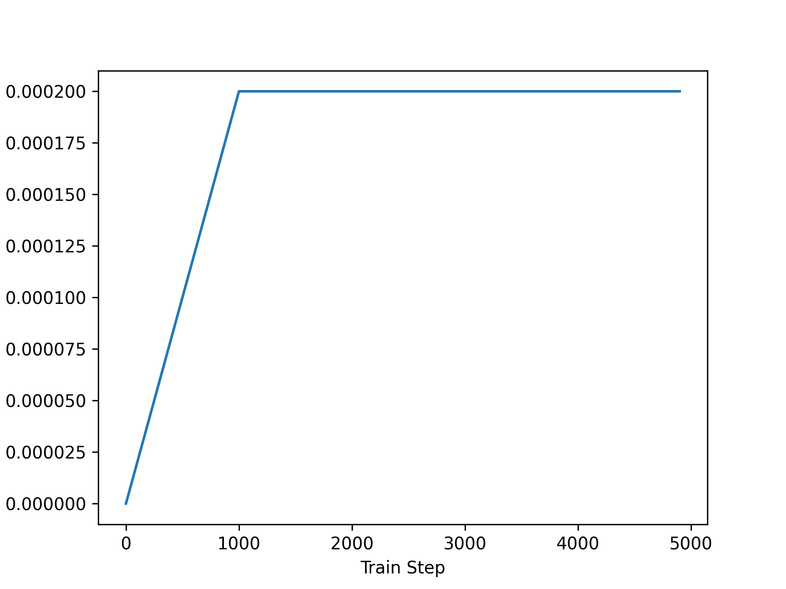
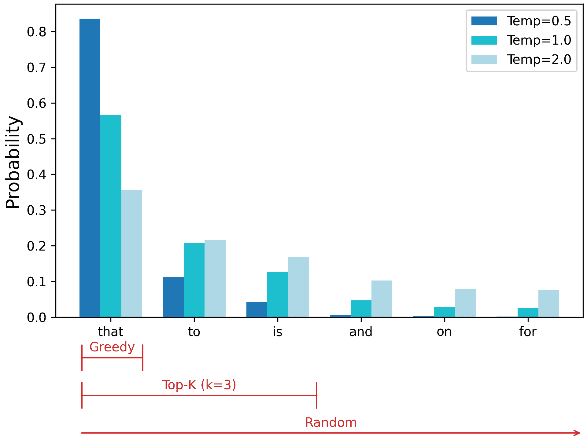
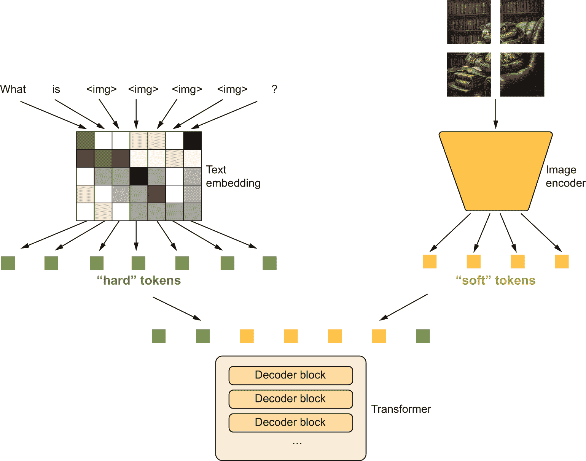
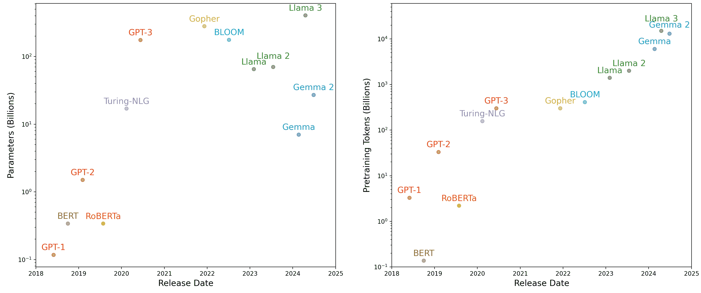

# 文本生成

> 原文：[`deeplearningwithpython.io/chapters/chapter16_text-generation`](https://deeplearningwithpython.io/chapters/chapter16_text-generation)

当我首次声称在不那么遥远的未来，我们消费的大部分文化内容都将得到人工智能的大量帮助时，我遭到了彻底的怀疑，甚至来自长期从事机器学习实践的人。那是在 2014 年。快进十年，这种怀疑以惊人的速度消退。生成式人工智能工具现在已成为文字处理器、图像编辑器和开发环境中的常见补充。文学和艺术作品因生成模型而获得声望——引起了相当大的争议和辩论。^([[1]](#footnote-1)) 考虑到人工智能与艺术创作经常交织在一起的世界，已经不再像科幻小说了。

在任何实际意义上，人工智能都远远无法与人类编剧、画家或作曲家相媲美。但取代人类并不需要，也不应该是目标。在许多领域，尤其是在创意领域，人们将使用人工智能来增强他们的能力——更多的是增强智能而非人工智能。

艺术创作的大部分内容都包括模式识别和技术技能。我们的感知模式、语言和艺术品都具有统计结构，而深度学习模型擅长学习这种结构。机器学习模型可以学习图像、音乐和故事的统计潜在空间，然后可以从这些空间中进行采样，创建具有与模型在训练数据中看到的特点相似的新艺术品。这种采样本身几乎不是艺术创作的行为——它仅仅是一个数学运算。只有我们作为人类观众的解释，才能赋予模型生成的内容意义。但一个技艺高超的艺术家可以将算法生成引导到有意义的——并且美丽的一面。潜在空间采样可以成为赋予艺术家力量的画笔，增强我们的创造能力，并扩展我们能够想象的空间。它甚至可以通过消除对技术技能和实践的需求，使艺术创作更加容易接近——建立一个纯粹表达的新媒介，将艺术与工艺分开。


图 16.1：使用生成图像软件 Midjourney 生成的图像。提示词是“一个手绘的科幻景观，居民居住在一个像红色字母 K 形状的建筑中。”

伊安尼斯·泽纳基斯，电子和算法音乐的先驱性开拓者，在 20 世纪 60 年代，在将自动化技术应用于音乐创作的背景下，巧妙地表达了同样的观点：^([[2]](#footnote-2))

> 脱离了繁琐的计算，作曲家能够专注于新音乐形式提出的一般问题，并在修改输入数据值的同时探索这一形式的各种角落和缝隙。例如，他可能会测试从独奏者到室内乐团再到大型乐团的所有乐器组合。借助电子计算机，作曲家变成了一种飞行员：他按按钮，输入坐标，并监督在声音空间中航行的宇宙飞船的控制，穿越他以前只能作为遥远梦想一瞥的声学星座和星系。

生成式 AI 的潜力远远超出了艺术创作的范畴。在许多职业中，人们创造的内容中模式识别更为明显：想想总结大量文档、转录语音、校对错别字或标记代码中的常见错误。这些例行公事的任务直接针对深度学习方法的优点。关于我们在工作场所如何选择部署 AI 有很多要考虑的问题——这具有真实的社会影响。

在接下来的两章中，我们将探讨深度学习在创作方面的潜力。我们将学习在文本和图像领域管理潜在空间，并从这些空间中提取新内容。我们将从文本开始，扩展我们在上一章中首次使用的语言模型的概念。这些*大型语言模型*，或简称*LLMs*，是像 ChatGPT 这样的数字助手以及快速增长的现实世界应用背后的技术。

## 序列生成的简史

直到最近，从模型生成序列的想法在机器学习领域还是一个边缘的子主题——生成式循环网络直到 2016 年才开始进入主流。然而，这些技术有着相当长的历史，始于 1997 年 LSTM 算法的开发。

2002 年，Douglas Eck 首次将 LSTM 应用于音乐生成，并取得了有希望的结果。Eck 成为了谷歌大脑的研究员，2016 年，他成立了一个名为 Magenta 的新研究小组，专注于将现代深度学习技术应用于创作引人入胜的音乐。有时，好主意需要 15 年的时间才能开始实施。

在 2000 年代末和 2010 年代初，Alex Graves 开创了使用循环网络生成新型序列数据的方法。特别是，有些人认为他在 2013 年将循环混合密度网络应用于使用笔位时间序列生成类似人类手写的作品的工作是一个转折点。Graves 在 2013 年上传到预印本服务器 arXiv 的一个 LaTeX 文件中留下了一条注释掉的评论：“从模型生成序列是计算机最接近做梦的时候。”当我开始开发 Keras 时，这项工作和机器做梦的概念是重要的灵感来源。

在上一章中我们讨论的“Attention Is All You Need”论文发布后的一年，即 2018 年，一个名为 OpenAI 的组织的研究人员发布了一篇新论文“通过生成预训练改进语言理解”。^([[3]](#footnote-3)) 他们结合了几个要素：

+   语言模型的非监督预训练——本质上是在序列中训练模型“猜测下一个标记”，就像我们在第十五章中的莎士比亚生成器所做的那样

+   Transformer 架构

+   通过成千上万的自出版书籍中的各种主题文本数据

作者展示了这样的预训练模型可以通过微调在广泛的文本分类任务上实现最先进的性能——从衡量两个句子的相似度到回答多项选择题。他们将预训练模型称为 *GPT*，即生成预训练 Transformer 的缩写。

GPT 并没有带来任何建模或训练上的进步。有趣的是，结果是这样的通用训练设置可以在多个任务上击败更复杂的技巧。没有复杂的文本归一化，不需要针对每个基准定制模型架构或训练数据，只需要大量的预训练数据和计算。

在接下来的几年里，OpenAI 以单一的目标集中精力扩展这一想法。模型架构仅略有变化。在四年的时间里，OpenAI 发布了三个版本的 GPT，扩展情况如下：

+   2018 年发布的 GPT-1 拥有 1.17 亿个参数，并在 10 亿个标记上进行了训练。

+   2019 年发布的 GPT-2 拥有 15 亿个参数，并在超过 100 亿个标记上进行了训练。

+   2020 年发布的 GPT-3 拥有 1750 亿个参数，并在大约半万亿个标记上进行了训练。

语言模型设置使得每个模型都能够生成文本，OpenAI 的开发者注意到，随着规模的每次跃升，这种生成输出的质量都会显著提高。

在 GPT-1 中，模型的生成能力主要是其预训练的副产品，而不是主要焦点。他们通过添加一个额外的密集层进行分类微调来评估模型，就像我们在上一章中对待 RoBERTa 一样。

在 GPT-2 中，作者注意到，你可以用几个任务的示例来提示模型，并生成高质量的输出，而无需任何微调。例如，你可以用以下内容提示模型以获得“奶酪”的法语翻译：

```py
Translate English to French:

sea otter => loutre de mer
peppermint => menthe poivrée
plush giraffe => peluche girafe
cheese => 
```

这种设置被称为 *少量样本学习*，即你试图用少量监督示例来教授模型一个新问题——对于标准梯度下降来说太少了。

在 GPT-3 中，示例并不总是必要的。你可以用对问题、输入的简单文本描述来提示模型，并经常得到高质量的结果：

```py
Translate English to French:

cheese => 
```

GPT-3 仍然受到一些尚未解决的问题的基本问题的困扰。LLMs“幻想”很常见——它们的输出可以从准确到完全错误，没有任何指示。它们对提示语句非常敏感，看似微小的提示重写可能会触发性能的大幅上升或下降。而且它们无法适应训练数据中没有广泛涉及的问题。

然而，GPT-3 的生成输出已经足够好，以至于该模型成为了 ChatGPT 的基础——第一个广泛使用的面向消费者的生成模型。在过去的几个月和几年里，ChatGPT 引发了大量投资和对构建 LLMs 以及寻找它们的新用例的兴趣。在下一节中，我们将构建一个自己的迷你 GPT 模型，以更好地理解这样的模型是如何工作的，它能做什么，以及它的局限性在哪里。

## 训练一个迷你 GPT

要开始预训练我们的迷你 GPT，我们需要大量的文本数据。GPT-1 使用了名为 BooksCorpus 的数据集，其中包含了一些未经作者明确许可就添加到数据集中的免费、自出版书籍。该数据集随后被其出版商撤下。

我们将使用一个更近期的预训练数据集，称为“Colossal Clean Crawled Corpus”（C4），由谷歌在 2020 年发布。它有 750GB，比我们为书籍示例合理训练的要大得多，所以我们将使用整个语料库的不到 1%。

让我们先下载并提取我们的数据：

```py
import keras
import pathlib

extract_dir = keras.utils.get_file(
    fname="mini-c4",
    origin=(
        "https://hf.co/datasets/mattdangerw/mini-c4/resolve/main/mini-c4.zip"
    ),
    extract=True,
)
extract_dir = pathlib.Path(extract_dir) / "mini-c4" 
```

列表 16.1：下载 C4 数据集的一部分

我们有 50 个文本数据分片，每个分片大约有 75MB 的原始文本。每一行都包含一个爬取的文档，其中换行符被转义。让我们看看我们第一个分片中的一个文档：

```py
>>> with open(extract_dir / "shard0.txt", "r") as f:
>>>     print(f.readline().replace("\\n", "\n")[:100])
Beginners BBQ Class Taking Place in Missoula!
Do you want to get better at making delicious BBQ? You
```

即使是像我们正在训练的这样的迷你 LLM，我们也需要预处理大量数据来运行预训练。使用快速分词程序将源文档预处理为整数标记可以简化我们的生活。

我们将使用 SentencePiece，这是一个用于文本数据子词分词的库。实际的分词技术与我们自己在第十四章中构建的字节对编码分词技术相同，但这个库是用 C++编写的，以提高速度，并添加了一个`detokenize()`函数，该函数可以将整数反转成字符串并将它们连接起来。我们将使用一个包含 32,000 个词汇项的预制作词汇表，这些词汇项存储在 SentencePiece 库需要的特定格式中。

正如上一章所述，我们可以使用 KerasHub 库来访问一些用于处理大型语言模型的额外函数。KerasHub 将 SentencePiece 库包装成一个 Keras 层。让我们试试看。

```py
import keras_hub
import numpy as np

vocabulary_file = keras.utils.get_file(
    origin="https://hf.co/mattdangerw/spiece/resolve/main/vocabulary.proto",
)
tokenizer = keras_hub.tokenizers.SentencePieceTokenizer(vocabulary_file) 
```

列表 16.2：下载 SentencePiece 词汇表并实例化分词器

我们可以使用这个分词器双向地将文本映射到整数序列：

```py
>>> tokenizer.tokenize("The quick brown fox.")
array([  450,  4996, 17354,  1701, 29916, 29889], dtype=int32)
>>> tokenizer.detokenize([450, 4996, 17354, 1701, 29916, 29889])
"The quick brown fox."
```

让我们使用这个层来分词我们的输入文本，然后使用`tf.data`将输入窗口化成长度为 256 的序列。

在训练 GPT 时，开发者选择保持简单，并试图避免在样本中间出现文档边界。相反，他们使用特殊的`<|endoftext|>`标记来标记文档边界。我们在这里也将这样做。再次使用`tf.data`作为输入数据管道，并使用任何后端进行训练。

我们将单独加载每个文件分片，并将输出数据交错到一个单独的数据集中。这保持了我们的数据加载速度快，我们不需要担心文本在样本边界处对齐——每个都是独立的。通过交错，我们 CPU 上的每个处理器可以同时读取和标记一个单独的文件。

```py
import tensorflow as tf

batch_size = 64
sequence_length = 256
suffix = np.array([tokenizer.token_to_id("<|endoftext|>")])

def read_file(filename):
    ds = tf.data.TextLineDataset(filename)
    # Restores newlines
    ds = ds.map(lambda x: tf.strings.regex_replace(x, r"\\n", "\n"))
    # Tokenizes data
    ds = ds.map(tokenizer, num_parallel_calls=8)
    # Adds the <|endoftext|> token
    return ds.map(lambda x: tf.concat([x, suffix], -1))

files = [str(file) for file in extract_dir.glob("*.txt")]
ds = tf.data.Dataset.from_tensor_slices(files)
# Combines our file shards into a single dataset
ds = ds.interleave(read_file, cycle_length=32, num_parallel_calls=32)
# Windows tokens into even samples of 256 tokens
ds = ds.rebatch(sequence_length + 1, drop_remainder=True)
# Splits labels, offset by one
ds = ds.map(lambda x: (x[:-1], x[1:]))
ds = ds.batch(batch_size).prefetch(8) 
```

列表 16.3：为 Transformer 预训练预处理文本输入

正如我们在第八章中首次做的那样，我们将以对`prefetch()`的调用结束我们的`tf.data`管道。这将确保我们始终有一些批次的加载到我们的 GPU 上，并准备好用于模型。

我们有 58,746 个批次。如果您愿意，可以自己数一下——行`ds.reduce(0, lambda c, _: c + 1)`将遍历整个数据集并增加计数器。但是，仅对这么大的数据集进行标记化就需要在性能良好的 CPU 上几分钟。

在每个批次 64 个样本和每个样本 256 个标记的情况下，这接近十亿个标记的数据。让我们分出 500 个批次作为快速验证集，然后我们就可以开始预训练了：

```py
num_batches = 58746
num_val_batches = 500
num_train_batches = num_batches - num_val_batches
val_ds = ds.take(num_val_batches).repeat()
train_ds = ds.skip(num_val_batches).repeat() 
```

### 构建模型

原始的 GPT 模型简化了我们上章看到的序列到序列 Transformer。与我们的翻译模型不同，它不是通过编码器和解码器接收源和目标序列，而是完全去掉了编码器，只使用解码器。这意味着信息只能在一个序列中从左到右传递。

这是对 GPT 开发者的一次有趣的赌注。仅解码器模型仍然可以处理像问答这样的序列到序列问题。然而，我们不是将问题和答案作为单独的输入提供，而是将两者合并成一个序列来提供给我们的模型。因此，与原始的 Transformer 不同，问题标记将不会像答案标记那样被特殊处理。所有标记都嵌入到相同的潜在空间中，使用相同的参数集。

这种方法的另一个后果是，即使对于输入序列，信息流也不再是双向的。给定一个输入，例如“法国的首都是哪里？”，单词“Where”在注意力层中无法关注到“capital”和“France”。这限制了模型的表达能力，但在预训练的简单性方面具有巨大的优势。我们不需要整理包含输入和输出对的集合；一切都可以是一个单独的序列。我们可以在互联网上找到的任何文本上进行大规模训练。

让我们从第十五章复制`TransformerDecoder`，但移除交叉注意力层，这使得解码器能够关注编码器序列。我们还将进行一个小的修改，在注意力和前馈块之后添加 dropout。在第十五章中，我们在编码器和解码器中只使用了一个 Transformer 层，因此我们可以在整个模型的末尾只使用一个 dropout 层。对于我们的 GPT 模型，我们将堆叠相当多的层，因此在每个解码器层中添加 dropout 对于防止过拟合非常重要。

```py
from keras import layers

class TransformerDecoder(keras.Layer):
    def __init__(self, hidden_dim, intermediate_dim, num_heads):
        super().__init__()
        key_dim = hidden_dim // num_heads
        # Self-attention layers
        self.self_attention = layers.MultiHeadAttention(
            num_heads, key_dim, dropout=0.1
        )
        self.self_attention_layernorm = layers.LayerNormalization()
        # Feedforward layers
        self.feed_forward_1 = layers.Dense(intermediate_dim, activation="relu")
        self.feed_forward_2 = layers.Dense(hidden_dim)
        self.feed_forward_layernorm = layers.LayerNormalization()
        self.dropout = layers.Dropout(0.1)

    def call(self, inputs):
        # Self-attention computation
        residual = x = inputs
        x = self.self_attention(query=x, key=x, value=x, use_causal_mask=True)
        x = self.dropout(x)
        x = x + residual
        x = self.self_attention_layernorm(x)
        # Feedforward computation
        residual = x
        x = self.feed_forward_1(x)
        x = self.feed_forward_2(x)
        x = self.dropout(x)
        x = x + residual
        x = self.feed_forward_layernorm(x)
        return x 
```

列表 16.4：没有交叉注意力的 Transformer 解码器块

接下来，我们可以从第十五章复制`PositionalEmbedding`层。回想一下，这个层为我们提供了一种简单的方法来学习序列中每个位置嵌入，并将其与我们的标记嵌入相结合。

这里有一个巧妙的方法可以用来节省一些 GPU 内存。在 Transformer 模型中，最大的权重是输入标记嵌入和输出密集预测层，因为它们处理我们的词汇空间。标记嵌入权重具有形状`(vocab_size, hidden_dim)`，用于嵌入每个可能的标记。我们的输出投影具有形状`(hidden_dim, vocab_size)`，为每个可能的标记做出浮点预测。

我们实际上可以将这两个权重矩阵绑定在一起。为了计算我们模型的最终预测，我们将隐藏状态乘以标记嵌入矩阵的转置。你可以非常地将最终的投影视为一个“反向嵌入”。它将隐藏空间映射到标记空间，而嵌入则是从标记空间映射到隐藏空间。结果发现，使用相同的权重进行输入和输出投影是一个好主意。

将这个添加到我们的`PositionalEmbedding`中很简单；我们只需在`call`方法中添加一个`reverse`参数，该方法通过标记嵌入矩阵的转置来计算投影。

```py
from keras import ops

class PositionalEmbedding(keras.Layer):
    def __init__(self, sequence_length, input_dim, output_dim):
        super().__init__()
        self.token_embeddings = layers.Embedding(input_dim, output_dim)
        self.position_embeddings = layers.Embedding(sequence_length, output_dim)

    def call(self, inputs, reverse=False):
        if reverse:
            token_embeddings = self.token_embeddings.embeddings
            return ops.matmul(inputs, ops.transpose(token_embeddings))
        positions = ops.cumsum(ops.ones_like(inputs), axis=-1) - 1
        embedded_tokens = self.token_embeddings(inputs)
        embedded_positions = self.position_embeddings(positions)
        return embedded_tokens + embedded_positions 
```

列表 16.5：一个可以反转文本嵌入的位置嵌入层

让我们构建我们的模型。我们将把八个解码器层堆叠成一个单一的“迷你”GPT 模型。

我们还将开启一个名为*mixed precision*的 Keras 设置来加速训练。这将允许 Keras 通过牺牲一些数值精度来运行模型的一些计算更快。目前，这可能会有些神秘，但完整的解释将在第十八章中提供。

```py
# Enables mixed precision (see chapter 18)
keras.config.set_dtype_policy("mixed_float16")

vocab_size = tokenizer.vocabulary_size()
hidden_dim = 512
intermediate_dim = 2056
num_heads = 8
num_layers = 8

inputs = keras.Input(shape=(None,), dtype="int32", name="inputs")
embedding = PositionalEmbedding(sequence_length, vocab_size, hidden_dim)
x = embedding(inputs)
x = layers.LayerNormalization()(x)
for i in range(num_layers):
    x = TransformerDecoder(hidden_dim, intermediate_dim, num_heads)(x)
outputs = embedding(x, reverse=True)
mini_gpt = keras.Model(inputs, outputs) 
```

列表 16.6：创建一个迷你 GPT 功能模型

这个模型有 4100 万个参数，对于本书中的模型来说算是大的，但与今天大多数 LLM（大型语言模型）相比，它们的参数量从几十亿到万亿不等，就显得相当小了。

### 预训练模型

训练一个大型 Transformer 模型众所周知是相当挑剔的——模型对参数的初始化和优化器的选择很敏感。当堆叠了许多 Transformer 层时，很容易出现梯度爆炸的问题，即参数更新得太快，我们的损失函数无法收敛。一个有效的方法是在多个预热步骤中线性地逐渐增加到完整的学习率，这样我们模型参数的初始更新就很小。在 Keras 中使用`LearningRateSchedule`来实现这一点很容易。

```py
class WarmupSchedule(keras.optimizers.schedules.LearningRateSchedule):
    def __init__(self):
        # Peak learning rate
        self.rate = 2e-4
        self.warmup_steps = 1_000.0

    def __call__(self, step):
        step = ops.cast(step, dtype="float32")
        scale = ops.minimum(step / self.warmup_steps, 1.0)
        return self.rate * scale 
```

列表 16.7：定义自定义学习率计划

我们可以将我们的学习率随时间的变化绘制出来，以确保它符合我们的预期（图 16.2）：

```py
import matplotlib.pyplot as plt

schedule = WarmupSchedule()
x = range(0, 5_000, 100)
y = [ops.convert_to_numpy(schedule(step)) for step in x]
plt.plot(x, y)
plt.xlabel("Train Step")
plt.ylabel("Learning Rate")
plt.show() 
```



图 16.2：预热使我们在训练开始时对模型参数的更新更小，并有助于稳定性。

我们将使用一次遍历我们的 100 亿个标记来训练我们的模型，这些标记分布在八个时期中，这样我们就可以偶尔检查我们的验证集损失和准确率。

我们正在训练一个 GPT 的微型版本，比 GPT-1 少 3 倍参数，总体训练步骤少 100 倍。但尽管这比最小的 GPT 模型便宜两个数量级来训练，这个`fit()`调用将是整本书中最昂贵的训练运行。如果你在阅读代码时运行，请启动它并休息一下！

```py
num_epochs = 8
# Set these to a lower value if you don't want to wait for training.
steps_per_epoch = num_train_batches // num_epochs
validation_steps = num_val_batches

mini_gpt.compile(
    optimizer=keras.optimizers.Adam(schedule),
    loss=keras.losses.SparseCategoricalCrossentropy(from_logits=True),
    metrics=["accuracy"],
)
mini_gpt.fit(
    train_ds,
    validation_data=val_ds,
    epochs=num_epochs,
    steps_per_epoch=steps_per_epoch,
    validation_steps=validation_steps,
) 
```

列表 16.8：训练迷你 GPT 模型

训练完成后，我们的模型在验证集上预测序列中的下一个标记大约有 36%的时间，尽管这样的指标只是一个粗略的经验法则。

注意，我们的模型训练不足。在每个时期之后，我们的验证损失将继续下降，这在使用比 GPT-1 少一百倍的训练步骤的情况下并不令人惊讶。更长时间的训练将是一个很好的主意，但我们需要时间和金钱来支付计算费用。

让我们玩一玩我们的迷你 GPT 模型。

### 生成式解码

为了从我们的模型中采样一些输出，我们可以遵循第十五章中生成莎士比亚或西班牙语翻译的方法。我们将一个固定标记的提示输入到模型中。对于输入序列中的每个位置，模型输出整个词汇表上下一个标记的概率分布。通过在最后一个位置选择最可能的下一个标记，将其添加到我们的序列中，然后重复此过程，我们能够逐个生成新的序列。

```py
def generate(prompt, max_length=64):
    tokens = list(ops.convert_to_numpy(tokenizer(prompt)))
    prompt_length = len(tokens)
    for _ in range(max_length - prompt_length):
        prediction = mini_gpt(ops.convert_to_numpy([tokens]))
        prediction = ops.convert_to_numpy(prediction[0, -1])
        tokens.append(np.argmax(prediction).item())
    return tokenizer.detokenize(tokens) 
```

列表 16.9：迷你 GPT 模型的一个简单生成函数

让我们用一个文本提示来试一试：

```py
>>> prompt = "A piece of advice"
>>> generate(prompt)
A piece of advice, and the best way to get a feel for yourself is to get a sense
of what you are doing.
If you are a business owner, you can get a sense of what you are doing. You can
get a sense of what you are doing, and you can get a sense of what
```

当你运行这个程序时，你首先会注意到它需要几分钟才能完成。这有点令人困惑。我们在训练期间预测，在参考硬件上每秒大约有 200,000 个标记。生成循环可能会增加时间，但一分钟延迟太慢了。发生了什么？我们速度慢的最大原因，至少在 Jax 和 TensorFlow 后端，是我们正在运行一个未编译的计算。

每次你运行`fit()`或`predict()`，Keras 都会编译在每批数据上运行的计算。所有使用的`keras.ops`都会从 Python 中提取出来，并由后端框架进行大量优化。对于单个批次来说很慢，但对于后续的每次调用来说则快得多。然而，当我们像之前那样直接调用模型时，后端框架需要在每个步骤上实时且未经优化的运行前向传递。

这里的简单解决方案是依赖`predict()`。使用`predict()`，Keras 会为我们处理编译，但有一个重要的陷阱需要注意。当 TensorFlow 或 Jax 编译一个函数时，它将针对特定的输入形状进行编译。有了已知的形状，后端可以针对特定硬件进行优化，确切地知道组成张量操作的各个处理器指令的数量。但在我们的生成函数中，我们在每次预测后调用模型时，序列的形状都会改变。这会在每次调用`predict()`时触发重新编译。

相反，如果我们通过填充输入使得我们的序列始终具有相同的长度，我们可以避免重新编译`predict()`函数。让我们试试看。

```py
def compiled_generate(prompt, max_length=64):
    tokens = list(ops.convert_to_numpy(tokenizer(prompt)))
    prompt_length = len(tokens)
    # Pads tokens to the full sequence length
    tokens = tokens + [0] * (max_length - prompt_length)
    for i in range(prompt_length, max_length):
        prediction = mini_gpt.predict(np.array([tokens]), verbose=0)
        prediction = prediction[0, i - 1]
        tokens[i] = np.argmax(prediction).item()
    return tokenizer.detokenize(tokens) 
```

列表 16.10：mini-GPT 模型的编译生成函数

让我们看看这个新函数有多快：

```py
>>> import timeit
>>> tries = 10
>>> timeit.timeit(lambda: compiled_generate(prompt), number=tries) / tries
0.4866470648999893
```

通过编译，我们的生成调用从几分钟缩短到不到一秒。这是一个相当大的改进。

### 抽样策略

我们生成输出中的另一个明显问题是我们的模型经常重复自己。在我们的特定训练运行中，模型反复重复“get a sense of what you are doing”这个单词组。

这与其说是一个错误，不如说是我们训练目标的直接后果。我们的模型试图预测在约十亿个单词和许多主题上的序列中最可能出现的下一个标记。如果没有明显的选择来决定文本序列接下来应该走向何方，一个有效的策略是猜测常见的单词或单词的重复模式。不出所料，我们的模型在训练过程中几乎立即学会了这样做。如果你在训练我们的模型非常早的时候停止，它可能会不断地生成单词`"the"`，因为`"the"`是英语中最常见的单词。

在我们的生成循环中，我们总是选择模型输出中最可能预测的标记。但我们的输出不仅仅是一个预测的标记；它是在我们的词汇表中的 32,000 个标记上的概率分布。

在每个生成步骤使用最可能的输出被称为*贪婪搜索*。这是使用模型预测的最直接方法，但它绝不是唯一的方法。如果我们向过程中添加一些随机性，我们可以更广泛地探索模型学习到的概率分布。这可以防止我们陷入高概率标记序列的循环中。

让我们尝试一下。我们可以通过重构我们的生成函数，使其能够传递一个将模型的预测映射到下一个标记选择的函数。我们将称之为我们的*采样策略*：

```py
def compiled_generate(prompt, sample_fn, max_length=64):
    tokens = list(ops.convert_to_numpy(tokenizer(prompt)))
    prompt_length = len(tokens)
    tokens = tokens + [0] * (max_length - prompt_length)
    for i in range(prompt_length, max_length):
        prediction = mini_gpt.predict(np.array([tokens]), verbose=0)
        prediction = prediction[0, i - 1]
        next_token = ops.convert_to_numpy(sample_fn(prediction))
        tokens[i] = np.array(next_token).item()
    return tokenizer.detokenize(tokens) 
```

现在我们可以将我们的贪婪搜索编写为一个简单的函数，我们将其传递给`compiled_generate()`：

```py
def greedy_search(preds):
    return ops.argmax(preds)

compiled_generate(prompt, greedy_search) 
```

Transformer 的输出定义了一个分类分布，其中每个标记在每个时间步都有一定的概率被输出。我们不仅可以选择最有可能的标记，还可以直接采样这个分布。`keras.random.categorical()`将我们的预测通过 softmax 函数，得到一个概率分布，然后随机采样。让我们试一下：

```py
def random_sample(preds, temperature=1.0):
    preds = preds / temperature
    return keras.random.categorical(preds[None, :], num_samples=1)[0] 
```

```py
>>> compiled_generate(prompt, random_sample)
A piece of advice, just read my knees and stick with getables and a hello to me.
However, the bar napkin doesn't last as long. I happen to be waking up close and
pull it up as I wanted too and I still get it, really, shouldn't be a reaction
```

我们的输出更加多样化，模型也不再陷入循环。但我们的采样现在探索得太多；输出跳跃不定，没有任何连续性。

你会注意到我们添加了一个名为`temperature`的参数。我们可以使用这个参数来锐化或拓宽我们的概率分布，以便我们的采样探索分布的程度更少或更多。

如果我们传递一个低温度，我们将在 softmax 函数之前使所有 logits 更大，这使得最有可能的输出更加可能。如果我们传递一个高温度，我们的 logits 将在 softmax 之前更小，我们的概率分布将更加分散。让我们试几次，看看这对我们的采样有什么影响：

```py
>>> from functools import partial
>>> compiled_generate(prompt, partial(random_sample, temperature=2.0))
A piece of advice tran writes using ignore unnecessary pivot - come without
introdu accounts indicugelâ per\u3000divuren sendSolisżsilen om transparent
Gill Guide pover integer song arrays coding\u3000LIST**…Allow index criteria
Draw Reference Ex artifactincluding lib tak Br basunker increases entirelytembre
AnyкаTextView cardinal spiritual heavenToen
>>> compiled_generate(prompt, partial(random_sample, temperature=0.8))
A piece of advice I wrote about the same thing today. I have been a writer for
two years now. I am writing this blog and I just wrote about it. I am writing
this blog and it was really interesting. I have been writing about the book and
I have read many things about my life.
The
>>> compiled_generate(prompt, partial(random_sample, temperature=0.2))
A piece of advice, and a lot of people are saying that they have to be careful
about the way they think about it.
I think it's a good idea to have a good understanding of the way you think about
it.
I think it's a good idea to have a good understanding of the
```

在高温下，我们的输出不再像英语，而是停留在看似随机的标记上。在低温下，我们的模型行为开始类似于贪婪搜索，反复重复某些文本模式。

另一种塑造我们分布的流行技术是将采样限制在最有可能的标记集合中。这被称为*top-k 采样*，其中 K 是你应该探索的候选数量。图 16.3 展示了 top-k 采样如何在贪婪和随机方法之间取得平衡。



图 16.3：在相同的概率分布上展示了贪婪、top-k 和随机采样策略

让我们在代码中尝试一下。我们可以使用`keras.ops.top_k`来找到数组的前 K 个元素：

```py
def top_k(preds, k=5, temperature=1.0):
    preds = preds / temperature
    top_preds, top_indices = ops.top_k(preds, k=k, sorted=False)
    choice = keras.random.categorical(top_preds[None, :], num_samples=1)[0]
    return ops.take_along_axis(top_indices, choice, axis=-1) 
```

我们可以尝试几种不同的 top-k 变体，看看它如何影响采样：

```py
>>> compiled_generate(prompt, partial(top_k, k=5))
A piece of advice that I can't help it. I'm not going to be able to do anything
for a few months, but I'm trying to get a little better. It's a little too much.
I have a few other questions on this site, but I'm sure I
>>> compiled_generate(prompt, partial(top_k, k=20))
A piece of advice and guidance from the Audi Bank in 2015\. With all the above,
it's not just a bad idea, but it's very good to see that is going to be a great
year for you in 2017.
That's really going to
```

传递一个 top-k 截止值与温度采样不同。传递一个低温度会使可能的标记更有可能，但它不会排除任何标记。top-k 采样将 K 候选之外的所有标记的概率置零。你可以将两者结合起来，例如，用 0.5 的温度采样前五个候选：

```py
>>> compiled_generate(prompt, partial(top_k, k=5, temperature=0.5))
A piece of advice that you can use to get rid of the problem.
The first thing you need to do is to get the job done. It is important that you
have a plan that will help you get rid of it.
The first thing you need to do is to get rid of the problem yourself.
```

样本策略是生成文本时的重要控制手段，有更多的方法。例如，beam search 是一种通过在每个时间步长保持固定数量的“光束”（不同的预测标记链）来启发式地探索多个预测标记链的技术。

使用 top-k 样本采样，我们的模型生成的文本更接近合理的英语文本，但这种输出的实际效用很小。这与 GPT-1 的结果相符。对于最初的 GPT 论文，生成的输出更多的是一种好奇心，而最先进的结果是通过微调分类模型实现的。我们的 mini-GPT 的训练程度远低于 GPT-1。

要达到今天生成式大型语言模型（LLM）的规模，我们需要将参数数量至少增加 100 倍，训练步数至少增加 1,000 倍。如果我们这样做，我们将看到与 OpenAI 在 GPT 中观察到的相同的质量飞跃。而且我们能够做到！我们之前使用的训练方案是今天所有训练 LLM 的人使用的确切蓝图。唯一缺少的部分是巨大的计算预算和跨多台机器训练的一些技巧，这些内容将在第十八章中介绍。

为了更实用的方法，我们将过渡到使用预训练模型。这将使我们能够探索今天规模下 LLM 的行为。

## 使用预训练的 LLM

现在我们已经从头开始训练了一个 mini 语言模型，让我们尝试使用一个十亿参数的预训练模型，看看它能做什么。鉴于预训练 Transformer 的成本过高，大多数行业都集中在使用由相对少数公司开发的预训练模型上。这不仅仅是一个成本问题，也是一个环境问题——生成模型训练现在占了大科技公司数据中心总电力消耗的很大一部分。

Meta 在 2023 年发布了 Llama 2 的环境数据，这是它发布的一个 LLM。它比 GPT-3 小得多，但训练它需要估计 130 万千瓦时的电力——相当于大约 45,000 美国家庭的日用电量。如果每个使用 LLM 的组织都自行进行预训练，那么能源使用的规模将占全球能源消耗的一个明显的百分比。

让我们用 Google 提供的一个预训练生成模型 Gemma 来玩玩。我们将使用 Gemma 的第三个版本，该版本于 2025 年公开发布。为了使本书中的示例易于理解，我们将使用可用的 Gemma 最小变体，其参数数量几乎正好是 10 亿。这个“小型”模型在约 2 万亿个预训练数据标记上进行了训练——比我们刚刚训练的 mini-GPT 多 2,000 倍！

### 使用 Gemma 模型进行文本生成

要加载这个预训练模型，我们可以使用 KerasHub，就像我们在前面的章节中做的那样。

```py
gemma_lm = keras_hub.models.CausalLM.from_preset(
    "gemma3_1b",
    dtype="float32",
) 
```

列表 16.11：使用 KerasHub 实例化预训练的 LLM

`CausalLM`是高级任务 API 的另一个例子，就像我们在书中早期使用的`ImageClassifier`和`ImageSegmenter`任务一样。`CausalLM`任务将结合一个分词器和正确初始化的架构到一个单一的 Keras 模型中。KerasHub 将 Gemma 权重加载到正确初始化的架构中，并为预训练权重加载一个匹配的分词器。

让我们来看看 Gemma 模型的摘要：

```py
>>> gemma_lm.summary()
Preprocessor: "gemma3_causal_lm_preprocessor"
┏━━━━━━━━━━━━━━━━━━━━━━━━━━━━━━━━━━━━━━━━━━━━━━┳━━━━━━━━━━━━━━━━━━━━━━━━━━━━━━━┓
┃ Layer (type)                                 ┃                        Config ┃
┡━━━━━━━━━━━━━━━━━━━━━━━━━━━━━━━━━━━━━━━━━━━━━━╇━━━━━━━━━━━━━━━━━━━━━━━━━━━━━━━┩
│ gemma3_tokenizer (Gemma3Tokenizer)           │           Vocab size: 262,144 │
└──────────────────────────────────────────────┴───────────────────────────────┘
Model: "gemma3_causal_lm"
┏━━━━━━━━━━━━━━━━━━━━━━━┳━━━━━━━━━━━━━━━━━━━┳━━━━━━━━━━━━━┳━━━━━━━━━━━━━━━━━━━━┓
┃ Layer (type)          ┃ Output Shape      ┃     Param # ┃ Connected to       ┃
┡━━━━━━━━━━━━━━━━━━━━━━━╇━━━━━━━━━━━━━━━━━━━╇━━━━━━━━━━━━━╇━━━━━━━━━━━━━━━━━━━━┩
│ padding_mask          │ (None, None)      │           0 │ -                  │
│ (InputLayer)          │                   │             │                    │
├───────────────────────┼───────────────────┼─────────────┼────────────────────┤
│ token_ids             │ (None, None)      │           0 │ -                  │
│ (InputLayer)          │                   │             │                    │
├───────────────────────┼───────────────────┼─────────────┼────────────────────┤
│ gemma3_backbone       │ (None, None,      │ 999,885,952 │ padding_mask[0][0… │
│ (Gemma3Backbone)      │ 1152)             │             │ token_ids[0][0]    │
├───────────────────────┼───────────────────┼─────────────┼────────────────────┤
│ token_embedding       │ (None, None,      │ 301,989,888 │ gemma3_backbone[0… │
│ (ReversibleEmbedding) │ 262144)           │             │                    │
└───────────────────────┴───────────────────┴─────────────┴────────────────────┘
 Total params: 999,885,952 (3.72 GB)
 Trainable params: 999,885,952 (3.72 GB)
 Non-trainable params: 0 (0.00 B)
```

我们不必亲自实现生成流程，可以通过使用`CausalLM`类中提供的`generate()`函数来简化我们的生活。这个`generate()`函数可以与不同的采样策略一起编译，正如我们在上一节中探讨的那样：

```py
>>> gemma_lm.compile(sampler="greedy")
>>> gemma_lm.generate("A piece of advice", max_length=40)
A piece of advice from a former student of mine:

<blockquote>"I'm not sure if you've heard of it, but I've been told that the
best way to learn
>>> gemma_lm.generate("How can I make brownies?", max_length=40)
How can I make brownies?

[User 0001]

I'm trying to make brownies for my son's birthday party. I've never made
brownies before.
```

我们可以立即注意到几点。首先，输出比我们的迷你 GPT 模型要连贯得多。很难将这段文本与 C4 数据集中的大量训练数据区分开来。其次，输出仍然不太有用。模型将生成模糊合理的文本，但你可以用它做什么并不清楚。

正如我们在迷你 GPT 示例中看到的那样，这与其说是一个错误，不如说是我们预训练目标的结果。Gemma 模型是用与我们为迷你 GPT 使用的相同“猜测下一个单词”的目标进行训练的，这意味着它实际上是一个互联网上的高级自动完成功能。它将不断地连续发出最可能的单词，就像你的提示是网络上随机文档中的一段文本一样。

改变我们输出的一个方法是通过提供一个更长的输入来提示模型，使其明显表明我们正在寻找哪种类型的输出。例如，如果我们用布朗尼食谱的前两句话提示 Gemma 模型，我们会得到更有帮助的输出：

```py
>>> gemma_lm.generate(
>>>     "The following brownie recipe is easy to make in just a few "
>>>     "steps.\n\nYou can start by",
>>>     max_length=40,
>>> )
The following brownie recipe is easy to make in just a few steps.

You can start by melting the butter and sugar in a saucepan over medium heat.

Then add the eggs and vanilla extract
```

当与能够“交谈”的模型一起工作时，想象它以某种人类对话的方式解释我们的提示是很诱人的，但这里并没有发生这样的事情。我们只是构建了一个提示，其中实际布朗尼食谱的延续性比模仿在论坛上寻求烘焙帮助的人的帖子更有可能。

在构建提示方面，你可以走得更远。你可能会用一些自然语言指令提示模型它应该扮演的角色，例如，“你是一个大型语言模型，为人们提供简短、有用的答案。”或者你可能给模型提供一个包含长列表的有害主题的提示，这些主题不应包含在任何生成的响应中。

如果这一切听起来有些模糊不清且难以控制，这是一个很好的评估。尝试通过提示来访问模型分布的不同部分通常是有用的，但预测模型对给定提示的反应是非常困难的。

LLMs 面临的一个另一个广泛记录的问题是幻觉。模型总是会说出一些话——对于给定的序列，总有一个最可能的下一个标记。在我们的 LLM 分布中找到没有实际事实依据的位置是很容易的：

```py
>>> gemma_lm.generate(
>>>     "Tell me about the 542nd president of the United States.",
>>>     max_length=40,
>>> )
Tell me about the 542nd president of the United States.

The 542nd president of the United States was James A. Garfield.
```

当然，这完全是胡说八道，但模型找不到更可能的方式来完成这个提示。

幻觉和不可控的输出是语言模型的基本问题。如果有一个银弹，我们还没有找到。然而，一种非常有帮助的方法是使用你希望生成的特定类型的生成输出示例进一步微调模型。

在想要构建一个能够遵循指令的聊天机器人的具体情况下，这种训练被称为*指令微调*。让我们尝试使用 Gemma 进行一些指令微调，使其作为一个对话伙伴变得更加有用。

### 指令微调

指令微调涉及向模型提供输入/输出对——一个用户指令后面跟着一个模型响应。我们将这些组合成一个单一的序列，成为模型的新训练数据。为了在训练过程中清楚地标记指令或响应的结束，我们可以直接将特殊标记如`"[instruction]"`和`"[response]"`添加到组合序列中。只要保持一致，精确的标记并不重要。

我们可以将组合序列作为常规训练数据使用，使用与我们在预训练 LLM 时使用的相同的“猜测下一个单词”损失。通过使用包含所需响应的示例进行进一步训练，我们实际上是在我们想要的方向上弯曲模型的输出。我们在这里不会学习语言的一个潜在空间；这已经在数十亿个预训练的标记上完成了。我们只是在稍微推动学习到的表示，以控制输出的语气和内容。

首先，我们需要一个指令-响应对的数据集。训练聊天机器人是一个热门话题，因此有许多专门为此目的制作的数据集。我们将使用由 Databricks 公司公开的数据集。员工们贡献了一个包含 15,000 条指令和手写响应的数据集。让我们下载它并将数据合并成一个单一的序列。

```py
import json

PROMPT_TEMPLATE = """"[instruction]\n{}[end]\n[response]\n"""
RESPONSE_TEMPLATE = """{}[end]"""

dataset_path = keras.utils.get_file(
    origin=(
        "https://hf.co/datasets/databricks/databricks-dolly-15k/"
        "resolve/main/databricks-dolly-15k.jsonl"
    ),
)
data = {"prompts": [], "responses": []}
with open(dataset_path) as file:
    for line in file:
        features = json.loads(line)
        if features["context"]:
            continue
        data["prompts"].append(PROMPT_TEMPLATE.format(features["instruction"]))
        data["responses"].append(RESPONSE_TEMPLATE.format(features["response"])) 
```

列表 16.12：加载指令微调数据集

注意，一些示例有额外的上下文——与指令相关的文本信息。为了保持简单，我们现在将丢弃这些示例。

让我们看看我们数据集中单个元素：

```py
>>> data["prompts"][0]
[instruction]
Which is a species of fish? Tope or Rope[end]
[response] 
>>> data["responses"][0]
Tope[end]
```

我们的提示模板为我们提供的示例提供了一个可预测的结构。尽管 Gemma 不是一个像我们的英语到西班牙语翻译器那样的序列到序列模型，但我们可以通过在类似这样的提示上进行训练，并在`"[response]"`标记之后才生成输出，来在序列到序列设置中使用它。

让我们创建一个`tf.data.Dataset`并分割一些验证数据：

```py
ds = tf.data.Dataset.from_tensor_slices(data).shuffle(2000).batch(2)
val_ds = ds.take(100)
train_ds = ds.skip(100) 
```

我们从 KerasHub 库加载的`CausalLM`是一个用于端到端因果语言模型的高级对象。它封装了两个对象：一个`preprocessor`层，用于预处理文本输入，以及一个`backbone`模型，它包含模型前向传递的数值。

预处理默认包含在高级 Keras 函数如`fit()`和`predict()`中。但让我们在一个单独的批次上运行我们的预处理，这样我们可以更好地看到它在做什么：

```py
>>> preprocessor = gemma_lm.preprocessor
>>> preprocessor.sequence_length = 512
>>> batch = next(iter(train_ds))
>>> x, y, sample_weight = preprocessor(batch)
>>> x["token_ids"].shape
(2, 512)
>>> x["padding_mask"].shape
(2, 512)
>>> y.shape
(2, 512)
>>> sample_weight.shape
(2, 512)
```

预处理层将所有输入填充到固定长度，并计算一个填充掩码来跟踪哪些标记 ID 输入只是填充的零。`sample_weight`张量使我们能够只为我们的响应标记计算损失值。我们并不关心用户提示的损失；它是固定的，我们肯定不希望计算我们刚刚添加的零填充的损失。

如果我们打印出我们的标记 ID 和标签的片段，我们可以看到这是一个常规语言模型设置，其中每个标签是下一个标记值：

```py
>>> x["token_ids"][0, :5], y[0, :5]
(Array([     2,  77074,  22768, 236842,    107], dtype=int32),
 Array([ 77074,  22768, 236842,    107,  24249], dtype=int32))
```

### 低秩自适应（LoRA）

如果我们现在在一个具有 16 GB 设备内存的 Colab GPU 上运行`fit()`，我们很快就会触发内存不足错误。但我们已经加载了模型并运行了生成，那么为什么现在会内存不足呢？

我们的 10 亿参数模型大约占用 3.7 GB 的内存。您可以在我们之前的模型摘要中看到这一点。我们一直在使用的`Adam`优化器需要为每个参数跟踪三个额外的浮点数——实际的梯度、一个速度值和一个动量值。总的来说，仅权重和优化器状态就需要 15 GB。我们还需要几 GB 的内存来跟踪模型前向传递中的中间值，但我们已经没有多余的内存了。运行`fit()`会在第一次训练步骤时崩溃。这是训练 LLM 时常见的问题。因为这些模型具有大量的参数数量，所以 GPU 和 CPU 的吞吐量在加速器内存上拟合模型时是次要的。

我们在本书中之前已经看到，我们如何在微调过程中冻结模型的一部分。我们没有提到的是，这将节省大量的内存！我们不需要跟踪任何冻结参数的优化器变量——它们永远不会更新。这使我们能够在加速器上节省大量的空间。

研究人员已经广泛地实验了在微调期间冻结 Transformer 模型中的不同参数，结果发现，也许直观地，最重要的未冻结权重是在注意力机制中。但我们的注意力层仍然有数亿个参数。我们能否做得更好？

在 2021 年，微软的研究人员提出了一种名为 LoRA 的技术，即*大型语言模型的低秩自适应*，专门用来解决这个内存问题^([[4]](#footnote-4))。为了解释它，让我们想象一个简单的线性投影层：

```py
class Linear(keras.Layer):
    def __init__(self, input_dim, output_dim):
        super().__init__()
        self.kernel = self.add_weight(shape=(input_dim, output_dim))

    def call(self, inputs):
        return ops.matmul(inputs, self.kernel) 
```

LoRA 论文建议冻结`kernel`矩阵，并添加一个新的“低秩”核投影分解。这个分解有两个新的投影矩阵，`alpha`和`beta`，它们将投影到和从内部`rank`。

```py
class LoraLinear(keras.Layer):
    def __init__(self, input_dim, output_dim, rank):
        super().__init__()
        self.kernel = self.add_weight(
            shape=(input_dim, output_dim), trainable=False
        )
        self.alpha = self.add_weight(shape=(input_dim, rank))
        self.beta = self.add_weight(shape=(rank, output_dim))

    def call(self, inputs):
        frozen = ops.matmul(inputs, self.kernel)
        update = ops.matmul(ops.matmul(inputs, self.alpha), self.beta)
        return frozen + update 
```

如果我们的`kernel`形状是 2048 × 2048，那么就是 4,194,304 个冻结参数。但如果我们将`rank`保持得较低，比如说 8，那么低秩分解将只有 32,768 个参数。这次更新将不具有原始核相同的表达能力；在狭窄的中间点，整个更新必须表示为八个浮点数。但在 LLM 微调期间，你不再需要像预训练期间那样的表达能力（图 16.4）。


图 16.4：低秩核分解包含的参数远少于核本身。

LoRA 的作者建议冻结整个 Transformer，并将 LoRA 权重仅添加到注意力层的查询和键投影中。让我们试试这个方法。KerasHub 模型内置了 LoRA 训练的方法。

```py
gemma_lm.backbone.enable_lora(rank=8) 
```

代码列表 16.13：为 KerasHub 模型启用 LoRA 训练

让我们再次查看我们的模型摘要：

```py
>>> gemma_lm.summary()
Preprocessor: "gemma3_causal_lm_preprocessor"
┏━━━━━━━━━━━━━━━━━━━━━━━━━━━━━━━━━━━━━━━━━━━━━━┳━━━━━━━━━━━━━━━━━━━━━━━━━━━━━━━┓
┃ Layer (type)                                 ┃                        Config ┃
┡━━━━━━━━━━━━━━━━━━━━━━━━━━━━━━━━━━━━━━━━━━━━━━╇━━━━━━━━━━━━━━━━━━━━━━━━━━━━━━━┩
│ gemma3_tokenizer (Gemma3Tokenizer)           │           Vocab size: 262,144 │
└──────────────────────────────────────────────┴───────────────────────────────┘
Model: "gemma3_causal_lm"
┏━━━━━━━━━━━━━━━━━━━━━━━┳━━━━━━━━━━━━━━━━━━━┳━━━━━━━━━━━━━┳━━━━━━━━━━━━━━━━━━━━┓
┃ Layer (type)          ┃ Output Shape      ┃     Param # ┃ Connected to       ┃
┡━━━━━━━━━━━━━━━━━━━━━━━╇━━━━━━━━━━━━━━━━━━━╇━━━━━━━━━━━━━╇━━━━━━━━━━━━━━━━━━━━┩
│ padding_mask          │ (None, None)      │           0 │ -                  │
│ (InputLayer)          │                   │             │                    │
├───────────────────────┼───────────────────┼─────────────┼────────────────────┤
│ token_ids             │ (None, None)      │           0 │ -                  │
│ (InputLayer)          │                   │             │                    │
├───────────────────────┼───────────────────┼─────────────┼────────────────────┤
│ gemma3_backbone       │ (None, None,      │ 1,001,190,… │ padding_mask[0][0… │
│ (Gemma3Backbone)      │ 1152)             │             │ token_ids[0][0]    │
├───────────────────────┼───────────────────┼─────────────┼────────────────────┤
│ token_embedding       │ (None, None,      │ 301,989,888 │ gemma3_backbone0… │
│ (ReversibleEmbedding) │ 262144)           │             │                    │
└───────────────────────┴───────────────────┴─────────────┴────────────────────┘
 Total params: 1,001,190,528 (3.73 GB)
 Trainable params: 1,304,576 (4.98 MB)
 Non-trainable params: 999,885,952 (3.72 GB)
```

虽然我们的模型参数仍然占用 3.7 GB 的空间，但我们的可训练参数现在只使用 5 MB 的数据——减少了千倍！这可以将我们的优化器状态从多个 GB 减少到 GPU 上的仅几 MB（图 16.5）。

![

图 16.5：LoRA 大大减少了我们需要的梯度优化器状态内存。

在这个优化到位后，我们终于准备好对 Gemma 模型进行指令微调了。让我们试试。

```py
gemma_lm.compile(
    loss=keras.losses.SparseCategoricalCrossentropy(from_logits=True),
    optimizer=keras.optimizers.Adam(5e-5),
    weighted_metrics=[keras.metrics.SparseCategoricalAccuracy()],
)
gemma_lm.fit(train_ds, validation_data=val_ds, epochs=1) 
```

代码列表 16.14：微调预训练的 LLM

训练完成后，我们在猜测模型响应中的下一个单词时达到了 55%的准确率。这比我们迷你 GPT 模型的 35%准确率有巨大的提升。这显示了更大模型和更广泛预训练的威力。

我们的微调是否使我们的模型在遵循指令方面变得更好？让我们试试：

```py
>>> gemma_lm.generate(
...     "[instruction]\nHow can I make brownies?[end]\n"
...     "[response]\n",
...     max_length=512,
... )
[instruction]
How can I make brownies?[end]
[response]
You can make brownies by mixing together 1 cup of flour, 1 cup of sugar, 1/2
cup of butter, 1/2 cup of milk, 1/2 cup of chocolate chips, and 1/2 cup of
chocolate chips. Then, you can bake it in a 9x13 pan for 30 minutes at 350
degrees Fahrenheit. You can also add a little bit of vanilla extract to the
batter to make it taste better.[end]
>>> gemma_lm.generate(
...     "[instruction]\nWhat is a proper noun?[end]\n"
...     "[response]\n",
...     max_length=512,
... )
[instruction]
What is a proper noun?[end]
[response]
A proper noun is a word that refers to a specific person, place, or thing.
Proper nouns are usually capitalized and are used to identify specific
individuals, places, or things. Proper nouns are often used in formal writing
and are often used in titles, such as "The White House" or "The Eiffel Tower."
Proper nouns are also used in titles of books, movies, and other works of
literature.[end]
```

好得多。我们的模型现在将回答问题，而不是试图简单地延续提示文本的思想。

我们是否解决了幻觉问题？

```py
>>> gemma_lm.generate(
...     "[instruction]\nWho is the 542nd president of the United States?[end]\n"
...     "[response]\n",
...     max_length=512,
... )
[instruction]
Who is the 542nd president of the United States?[end]
[response]
The 542nd president of the United States was James A. Garfield.[end]
```

完全没有。然而，我们仍然可以使用指令微调在这里取得一些进展。一种常见的技术是在大量指令/响应对上训练模型，其中期望的响应是“我不知道”或“作为一个语言模型，我无法帮助你”。这可以训练模型避免尝试回答它通常会给出低质量结果的特定主题。

## 在 LLM 上更进一步

我们现在从头开始训练了一个 GPT 模型，并将语言模型微调到了我们自己的聊天机器人中。然而，我们今天只是触及了 LLM 研究的表面。在本节中，我们将介绍一些对基本“自动完成互联网”语言建模设置的扩展和改进，这些改进并不全面。

### 带有人类反馈的强化学习（RLHF）

我们刚才所做的指令微调通常被称为*监督式微调*。它被称为*监督式*，因为我们通过手工整理，创建了一个我们希望从模型中获得示例提示和响应的列表。

任何需要手动编写文本示例的需求几乎总会成为瓶颈——此类数据获取缓慢且成本高昂。此外，这种方法将受到人类在指令跟随任务上的性能上限的限制。如果我们想在类似聊天机器人的体验中超越人类的表现，我们不能依赖于手动编写的输出来监督大型语言模型（LLM）的训练。

我们真正试图优化的真正问题是我们在某些响应与其他响应之间的偏好。对于足够大的人群样本，这个偏好问题是完美定义的，但弄清楚如何将“我们的偏好”转换为我们可以用来计算梯度的损失函数是非常棘手的。这正是*带人类反馈的强化学习*（Reinforcement Learning with Human Feedback，简称*RLHF*）试图解决的问题。

RLHF 微调的第一步正是我们在上一节中所做的——使用手写的提示和响应进行监督微调。这使我们达到了一个良好的基线性能；我们现在需要在这个基线之上进行改进。为此，我们将构建一个可以作为人类偏好的代理的*奖励模型*。我们可以收集大量提示及其响应。其中一些响应可以是手写的；模型可以写其他响应。这些响应甚至可以由其他聊天机器人 LLM 编写。然后我们需要让人类评估者根据偏好对这些响应进行排序。给定一个提示和几个潜在的响应，评估者的任务是按从最有用到最无用的顺序对它们进行排序。这种数据收集既昂贵又缓慢，但仍然比手动编写所有所需的响应要快。

我们可以使用这个排序偏好数据集来构建奖励模型，该模型接收一个提示-响应对并输出一个单一的浮点值。值越高，响应越好。这个奖励模型通常是另一个较小的 Transformer。它不是预测下一个标记，而是读取整个序列并输出一个单一的浮点数——即对给定响应的评分。

然后，我们可以使用这个奖励模型通过强化学习设置进一步调整我们的模型。在这本书中，我们不会深入探讨强化学习的细节，但不要被这个术语吓倒——它指的是任何深度学习模型通过做出预测（称为*动作*）并对其输出（称为*奖励*）获得反馈来学习的训练设置。简而言之，模型自己的预测成为其训练数据。

在我们的案例中，动作仅仅是生成对输入提示的响应，就像我们上面使用`generate()`函数所做的那样。奖励就是将一个单独的回归模型应用到那个字符串输出上。以下是一个简单的伪代码示例。

```py
for prompts in dataset:
    # Takes an action
    responses = model.generate(prompts)
    # Receives a reward
    rewards = reward_model.predict(responses)
    good_responses = []
    for response, score in zip(responses, rewards):
        if score > cutoff:
            good_responses.append(response)
    # Updates the model parameters. We do not update the reward model.
    model.fit(good_responses) 
```

列表 16.15：最简单可能的 RLHF 算法的伪代码

在这个简单的例子中，我们通过奖励截止值过滤我们的生成响应，并将“好的”输出作为新的训练数据，进行更多像上一节中那样进行的监督微调。在实践中，你通常不会丢弃你的不良响应，而是使用专门的梯度更新算法，利用所有响应和奖励来引导你的模型参数。毕竟，一个不良的响应给出了一个好的信号，表明不应该做什么。OpenAI 最初在 2022 年的一篇论文中描述了 RLHF^([[5]](#footnote-5))，并使用这种训练设置将 GPT-3 的初始预训练参数转换为 ChatGPT 的第一个版本。

这种设置的优点在于它可以迭代。你可以使用这个新训练的模型，生成新的改进后的响应，根据人类偏好对这些响应进行排序，并训练一个新的改进后的奖励模型。

#### 使用经过 RLHF 训练的聊天机器人

我们可以通过尝试使用这种形式的迭代偏好调整训练的模型来使这个问题更加具体。由于构建聊天机器人是大型 Transformer 模型的“杀手级应用”，因此发布预训练模型如 Gemma 的公司通常会发布专门的“指令调整”版本，专为聊天构建。现在让我们尝试加载一个。这将是一个 400 亿参数的模型，是我们刚刚加载的模型大小的四倍，也是本书中我们将使用的最大模型：

```py
gemma_lm = keras_hub.models.CausalLM.from_preset(
    "gemma3_instruct_4b",
    dtype="bfloat16",
) 
```

列表 16.16：加载一个指令调整过的 Gemma 变体

就像我们之前微调的 Gemma 模型一样，这个指令调整过的检查点附带了一个特定的模板来格式化其输入。同样，确切文本并不重要，重要的是我们的提示模板与用于调整模型的文本相匹配：

```py
PROMPT_TEMPLATE = """<start_of_turn>user
{}<end_of_turn>
<start_of_turn>model
""" 
```

让我们试着问它一个问题：

```py
>>> prompt = "Why can't you assign values in Jax tensors? Be brief!"
>>> gemma_lm.generate(PROMPT_TEMPLATE.format(prompt), max_length=512)
<start_of_turn>user
Why can't you assign values in Jax tensors? Be brief!<end_of_turn>
<start_of_turn>model
Jax tensors are designed for efficient automatic differentiation. Directly
assigning values disrupts this process, making it difficult to track gradients
correctly. Instead, Jax uses operations to modify tensor values, preserving the
differentiation pipeline.<end_of_turn>
```

这个 400 亿参数的模型最初在 140 万亿个文本标记上进行了预训练，然后进行了广泛的微调，使其在回答问题时更有帮助。其中一些调整与我们在上一节中进行的监督微调类似，一些与我们在本节中介绍的 RLHF 类似，还有一些使用更大的模型作为“教师”来引导训练的其他技术。在问答能力上的提升很容易察觉。

让我们尝试使用这个模型来解决我们之前在幻觉方面遇到麻烦的提示：

```py
>>> prompt = "Who is the 542nd president of the United States?"
>>> gemma_lm.generate(PROMPT_TEMPLATE.format(prompt), max_length=512)
<start_of_turn>user
Who is the 542nd president of the United States?<end_of_turn>
<start_of_turn>model
This is a trick question! As of today, November 2, 2023, the United States has
only had 46 presidents. There hasn't been a 542nd president yet. 😊 

You're playing with a very large number!<end_of_turn>
```

这个更强大的模型拒绝上钩。这不是新建模技术的结果，而是对像这样一个问题以及我们刚刚收到的类似响应的复杂问题的广泛训练的结果。事实上，你可以清楚地看到为什么移除幻觉有点像玩打地鼠——尽管它拒绝幻想一个美国总统，但模型现在设法编造了今天的日期。

### 多模态 LLM

一个明显的聊天机器人扩展是处理新的输入模态的能力。一个能够响应音频输入并处理图像的助手，将比只能处理文本的助手更有用。

将 Transformer 扩展到不同的模态可以通过一种概念上简单的方式进行。Transformer 不是一个特定于文本的模型；它是一个在序列数据中学习模式的高效模型。如果我们能想出如何将其他数据类型强制转换为序列表示，我们就可以将这个序列输入到 Transformer 中，并用它进行训练。

实际上，我们刚刚加载的 Gemma 模型正是如此。该模型附带一个独立的 4.2 亿参数图像编码器，它将输入图像切割成 256 个补丁，并将每个补丁编码为与 Gemma 的隐藏 Transformer 维度相同的向量。每个图像将被嵌入为一个`(256, 2560)`序列。因为 2560 是 Gemma Transformer 模型的隐藏维度，所以这种图像表示可以简单地拼接到我们的文本序列的令牌嵌入层之后。你可以将其想象为 256 个代表图像的特殊令牌，其中每个`(1, 2560)`向量有时被称为“软令牌”（图 16.6）。与我们的正常“硬令牌”不同，每个令牌 ID 在我们的令牌嵌入矩阵中只能取固定数量的可能向量，这些图像软令牌可以取视觉编码器输出的任何向量值。



图 16.6：通过拼接文本令牌和软图像令牌来处理图像输入

让我们加载一个图像，以更详细地了解这是如何工作的（图 16.7）：

```py
import matplotlib.pyplot as plt

image_url = (
    "https://github.com/mattdangerw/keras-nlp-scripts/"
    "blob/main/learned-python.png?raw=true"
)
image_path = keras.utils.get_file(origin=image_url)

image = np.array(keras.utils.load_img(image_path))
plt.axis("off")
plt.imshow(image)
plt.show() 
```


图 16.7：Gemma 模型的测试图像

我们可以使用 Gemma 来对这个图像提出一些问题：

```py
>>> # Limits the maximum input size of the model
>>> gemma_lm.preprocessor.max_images_per_prompt = 1
>>> gemma_lm.preprocessor.sequence_length = 512
>>> prompt = "What is going on in this image? Be concise!<start_of_image>"
>>> gemma_lm.generate({
...     "prompts": PROMPT_TEMPLATE.format(prompt),
...     "images": [image],
... })
<start_of_turn>user
What is going on in this image? Be concise!

<start_of_image>

<end_of_turn>
<start_of_turn>model
A snake wearing glasses is sitting in a leather armchair, surrounded by a large
bookshelf, and reading a book. It's a whimsical, slightly surreal image.
<end_of_turn>
>>> prompt = "What is the snake wearing?<start_of_image>"
>>> gemma_lm.generate({
...     "prompts": PROMPT_TEMPLATE.format(prompt),
...     "images": [image],
... })
<start_of_turn>user
What is the snake wearing?

<start_of_image>

<end_of_turn>
<start_of_turn>model
The snake is wearing a pair of glasses! They are red-framed and perched on its
head.<end_of_turn>
```

我们输入的每个提示都包含特殊令牌`<start_of_image>`。这在我们输入序列中转换成了 256 个占位符值，这些值反过来又用代表我们图像的软令牌替换。

对于这种多模态模型，训练过程与常规 LLM 预训练和微调非常相似。通常，你首先会单独对图像编码器进行预训练，就像我们在本书第八章中首先做的那样。然后你可以简单地执行相同的“猜测下一个单词”预训练，并将混合图像和文本内容组合成一个序列输入。我们的 Transformer 不会训练输出图像软令牌；我们只需在这些图像令牌位置将损失置零。

我们可以简单地将图像数据添加到 LLM 中，这似乎几乎像魔法一样，但当我们考虑到我们正在使用的序列模型的力量时，这实际上是一个非常预期的结果。我们使用了一个 Transformer，将我们的图像输入重新表示为序列数据，并进行了大量的额外训练。该模型可以在学习在 Transformer 的潜在空间中嵌入图像的同时，保留原始语言模型摄取和产生文本的能力。

#### 基础模型

随着 LLM 探索不同的模态，"大型语言模型"这个名称可能有点误导。它们*确实*建模语言，但也包括图像、音频，甚至可能是结构化数据。在下一章中，我们将看到一种独特的架构，称为*扩散模型*，它在底层结构方面有所不同，但感觉相似——它们也是在“互联网规模”的大量数据上通过自监督损失进行训练。

这种模型的统称是*基础模型*。更具体地说，基础模型是任何在广泛数据上训练（通常使用大规模自监督）的模型，可以微调到广泛的下游任务。

通常，你可以将基础模型视为学习从互联网的大量区域中*重建*数据，给定其部分表示。虽然 LLM 是这些模型中第一个且最广为人知的，但还有很多其他模型。基础模型的标志是自监督学习目标（重建损失）以及这些模型不是针对单一任务进行专门化的，并且可以用于多种下游目的。

这是在机器学习漫长历史中最近发生的一个重要且引人注目的转变。与其从头开始在自己的数据集上训练模型，你通常会更好地使用基础模型来获取输入（无论是图像、文本还是其他内容）的丰富表示，然后针对最终下游任务对该模型进行微调。当然，这伴随着需要运行具有数十亿参数的大型模型的缺点，因此它几乎不适合所有机器学习的实际应用。

### 检索增强生成（RAG）

在提示中添加额外信息不仅有助于处理图像数据；这可以是一种扩展 LLM 能力的一般方法。一个显著的例子是当使用 LLM 进行搜索时。如果我们天真地将 LLM 与搜索引擎进行比较，它有几个致命的缺陷：

+   LLM 有时会编造事实。它会输出训练数据中不存在的错误“事实”，但这些可以从训练数据中推断出来。这些信息可能从误导到危险不等。

+   一个大型语言模型（LLM）对世界的知识有一个截止日期——最多是模型预训练的日期。训练一个 LLM 相当昂贵，并且不可能在新的数据上持续训练。因此，在某个任意的时间点，LLM 对世界的知识将停止增长。

没有人愿意使用只能告诉你六个月前发生的事情的搜索引擎。但如果我们把 LLM 看作是更类似于“对话软件”，能够处理提示中的任何序列数据，那么如果我们将模型作为检索更多传统搜索信息界面的接口，会怎样呢？这就是*检索增强生成*或*RAG*背后的想法。

RAG 通过获取初始用户问题并执行某种形式的查询来拉取额外的文本上下文来工作。这个查询可以是数据库、搜索引擎或任何可以提供关于用户提出的问题的额外信息的任何东西。然后，这些额外信息直接添加到提示中。例如，你可能构建这样的提示：

```py
Use the following pieces of context to answer the question.
Question: What are some good ways to improve sleep?
Context: {text from a medical journal on improving sleep}
Answer: 
```

查找相关信息的一种常见方法是使用*向量数据库*。要构建向量数据库，你可以使用 LLM 或任何模型将一系列源文档嵌入为向量。文档文本将存储在数据库中，嵌入向量用作键。在检索过程中，LLM 可以再次用于将用户查询嵌入为向量。向量数据库负责搜索与查询向量接近的键向量，并显示相应的文本。这听起来可能很像注意力机制本身——回想一下，“查询”、“键”和“值”这些术语实际上来自数据库系统。

显示信息以协助生成做了一些事情：

+   它为你提供了一个明显的方法来绕过模型的截止日期。

+   它允许模型访问私有数据。公司可能希望使用在公共数据上训练的 LLM 作为访问存储在私有的信息的接口。

+   它可以帮助模型在事实上站稳脚跟。没有银弹可以完全阻止幻觉，但如果在提示中提供了关于主题的正确背景信息，LLM 在某个主题上编造事实的可能性就会大大降低。

### “推理”模型

自从第一个大型语言模型（LLM）出现以来，研究人员一直苦于这样一个众所周知的事实：这些模型在数学问题和逻辑谜题上表现糟糕。一个模型可能直接在其训练数据中对一个问题给出完美的回答，但如果你在提示中替换几个名字或数字，就会很明显地看出模型对它试图解决的问题毫无头绪。对于自然语言处理中的许多问题，LLM 提供了一种简单的进步方法：增加训练数据量，提高某些基准分数。然而，小学数学问题却挑战了进步。

到 2023 年，谷歌的研究人员注意到，如果你用几个数学问题的“展示你的工作”示例来提示模型——就像在家庭作业上那样逐字写出步骤——模型就会开始这样做。随着模型模仿写出中间步骤，它实际上通过关注自己的输出，达到了更正确的解决方案。他们将这种方法称为“思维链”提示，这个名字也一直沿用下来。另一组研究人员注意到，你甚至不需要示例；你只需用短语“让我们一步步思考”来提示模型，就能得到更好的输出。

自从这些发现以来，人们对于直接训练 LLM 以更好地进行思维链推理的兴趣浓厚。像 OpenAI 的 o1 和 DeepSeek 的 r1 这样的模型通过训练模型在困难问题上“大声思考”来展示在数学和编码问题上的显著进步而成为头条新闻。

这种思维链微调的方法与 RLHF 非常相似。我们首先将在几个“展示你的工作”的数学问题并得出正确答案的监督示例上训练模型。接下来，我们将用一个新的数学问题提示模型，并检查模型是否得到了正确的最终答案。最后，我们使用这些新生成的输出进一步调整模型的权重。

让我们用 Gemma 模型来试试。我们可以写出自己的文字问题，并打开随机采样，这样每次都能得到一个相对随机的响应：

```py
prompt = """Judy wrote a 2-page letter to 3 friends twice a week for 3 months.
How many letters did she write?
Be brief, and add "ANSWER:" before your final answer."""

# Turns on random sampling to get a diverse range of outputs
gemma_lm.compile(sampler="random") 
```

让我们尝试生成几个响应：

```py
>>> gemma_lm.generate(PROMPT_TEMPLATE.format(prompt))
<start_of_turn>user
Judy wrote a 2-page letter to 3 friends twice a week for 3 months.
How many letters did she write?
Be brief, and add "ANSWER:" before your final answer.<end_of_turn>
<start_of_turn>model
Here's how to solve the problem:

* **Letters per week:** 3 friends * 2 letters/week = 6 letters/week
* **Letters per month:** 6 letters/week * 4 weeks/month = 24 letters/month
* **Letters in 3 months:** 24 letters/month * 3 months = 72 letters
* **Total letters:** 72 letters * 2 = 144 letters

ANSWER: 144<end_of_turn>
>>> gemma_lm.generate(PROMPT_TEMPLATE.format(prompt))
<start_of_turn>user
Judy wrote a 2-page letter to 3 friends twice a week for 3 months.
How many letters did she write?
Be brief, and add "ANSWER:" before your final answer.<end_of_turn>
<start_of_turn>model
Here's how to solve the problem:

* **Letters per week:** 3 friends * 2 letters/week = 6 letters/week
* **Letters per month:** 6 letters/week * 4 weeks/month = 24 letters/month
* **Total letters:** 24 letters/month * 3 months = 72 letters

ANSWER: 72<end_of_turn>
```

在第一次尝试中，我们的模型被每个字母有两页的冗余细节所困扰。在第二次尝试中，模型正确地解决了问题。我们正在使用的这个指令调整过的 Gemma 模型已经针对这类数学问题进行了调整；如果你使用上一节中的“未调整”的 Gemma 模型，你几乎得不到这么好的结果。

我们可以将这个想法扩展到一种非常简单的思维链训练形式：

1.  收集一些基本的数学和推理问题以及期望的答案。

1.  生成（带有一些随机性）一定数量的响应。

1.  通过字符串解析找到所有正确答案的响应。你可以提示模型使用我们之前使用的特定文本标记作为最终答案。

1.  在正确的响应上运行监督微调，包括所有中间输出。

1.  重复！

之前描述的过程是一个强化学习算法。我们的答案检查行为作为*环境*，生成的输出是模型用来学习的*动作*。与 RLHF 一样，在实践中，你会使用更复杂的梯度更新步骤来使用所有响应（包括错误的）的信息，但基本原理是相同的。

同样的想法被用来提高 LLM 在其他领域的性能，这些领域对文本提示有明显的、可验证的答案。编码是一个重要的领域——你可以提示 LLM 输出代码，然后实际运行代码来测试响应的质量。

在所有这些领域，一个明显的趋势是——随着模型学会解决更难的问题，模型在得出最终答案之前将花费越来越多的时间“展示其工作”。你可以把这看作是模型学习在其潜在解决方案的输出中进行*搜索*。我们将在本书的最后一章进一步讨论这个想法。

## LLM 下一步将走向何方？

根据本章开头讨论的 LLM 轨迹，LLM 将走向何方可能看起来很明显。更多的参数！更好的性能！在一般意义上，这可能是对的，但我们的轨迹可能并不那么线性。

如果你有一个固定的预训练预算，比如说一百万美元，你可以大致将其视为购买了一定数量的计算或浮点运算（flops）。你可以将这些 flops 用于使用更多数据进行训练，或者训练一个更大的模型。最近的研究指出，GPT-3 在 1750 亿个参数的情况下，其计算预算过大。在更多数据上训练一个较小的模型将导致更好的模型性能。因此，最近模型大小趋于平稳，而数据大小趋于上升。

这并不意味着扩展会停止——更多的计算能力通常确实会导致更好的 LLM 性能，我们还没有看到下一个标记预测性能趋于平稳的渐近线迹象。公司仍在继续投资数十亿美元用于扩展 LLM，并观察新的功能如何出现。

图 16.8 显示了 2018 年至 2025 年间发布的一些主要 LLM 的详细信息。我们可以注意到，尽管用于预训练的总标记数稳步且大幅上升，但自 GPT-3 以来，模型参数数量变化很大。部分原因是我们现在知道 GPT-3 训练不足，但也有一个更实际的原因。在部署模型时，为了适应更便宜的硬件而牺牲性能通常是值得的。如果运行成本过高，那么一个非常好的模型帮助不大。



图 16.8：随时间变化的 LLM 参数数量（左）和预训练数据集大小（右）。许多最近发布的专有 LLM（例如，GPT-4 和 Gemini）不包括在内，因为模型细节尚未公开。

我们可能无法无限制地扩展这些模型还有另一个原因：我们开始缺乏预训练数据！科技公司开始难以找到更多高质量、公开、人工编写的内容用于预训练。模型甚至开始“吃掉自己的尾巴”，通过训练其他 LLM 创建的大量内容，这引发了一系列其他问题。这也是最近强化学习受到很多关注的原因之一。如果你能创建一个难以解决、自包含的环境，为 LLM 生成新问题，你将找到一种使用模型自身输出继续训练的方法——无需在网络上寻找更多优质文本的碎片。

我们提到的任何解决方案都不会是 LLMs 面临问题的银弹。最终，基本问题仍然是 LLMs 在学习和人类相比效率极低。模型能力仅来自在比人们一生中阅读的文本多许多数量级的文本上进行训练。随着 LLMs 的扩展继续，关于如何使模型能够快速学习有限数据的更基础的研究也将继续。

尽管如此，LLMs 代表了构建流畅的自然语言界面的能力，而这本身将带来我们在计算设备上所能实现的事情的巨大转变。在本章中，我们概述了许多 LLMs 用来实现这些功能的基本配方。

## 摘要

+   大型语言模型（LLMs）是几个关键成分的组合：

    +   Transformer 架构

    +   语言建模任务（根据过去标记预测下一个标记）

    +   大量的未标记文本数据

+   一个 LLM 学习一个概率分布来预测单个标记。这可以与采样策略结合，生成一长串文本。有许多流行的文本采样方法：

    +   *贪婪搜索*在每个生成步骤中采取最可能的预测标记。

    +   *随机采样*直接从所有标记上的预测分类分布中进行采样。

    +   *Top-k 采样*将分类分布限制在 K 个候选者的顶部集合。

+   LLMs 使用数十亿个参数，并在万亿个单词的文本上训练。

+   LLM 的输出不可靠，所有 LLMs 偶尔都会产生事实错误的信息。

+   LLMs 可以被微调以遵循聊天对话中的指令。这种微调类型被称为*指令微调*：

    +   最简单的指令微调形式涉及直接在指令和响应对上训练模型。

    +   更高级的指令微调形式涉及强化学习。

+   在使用 LLMs 时，最常见的资源瓶颈是加速器内存。

+   LoRA 是一种技术，通过冻结大多数 Transformer 参数，仅更新注意力投影权重的低秩分解来减少内存使用。

+   LLMs 可以输入或输出来自不同模态的数据，如果你能想出如何将这些输入或输出作为序列预测问题中的序列来构建。

+   *基础模型*是一个通用术语，用于任何模态的训练模型，这些模型使用自监督在广泛的下游任务上进行训练。

### 脚注

1.  在 2022 年，Jason Allen 使用图像生成软件 Midjourney 赢得了数字艺术家的奖项，而在 2024 年，Rie Kudan 凭借一部大量借助生成软件创作的小说赢得了日本最负盛名的文学奖项之一。[[↩]](#footnote-link-1)

1.  Iannis Xenakis，“Musiques formelles: nouveaux principes formels de composition musicale，”*La Revue musicale*特刊，第 253-254 期（1963 年）。[[↩]](#footnote-link-2)

1.  Alec Radford, Karthik Narasimhan, Tim Salimans 和 Ilya Sutskever，“通过生成预训练改进语言理解”，（2018 年），[`mng.bz/GweD`](https://mng.bz/GweD). [[↩]](#footnote-link-3)

1.  J. Edward Hu 等人，“LoRA：大型语言模型的低秩自适应”，arXiv（2021 年），[`arxiv.org/abs/2106.09685`](https://arxiv.org/abs/2106.09685). [[↩]](#footnote-link-4)

1.  Ouyang 等人，“通过人类反馈训练语言模型遵循指令”，第 36 届国际神经网络信息处理系统会议论文集（2022 年），[`arxiv.org/abs/2203.02155`](https://arxiv.org/abs/2203.02155). [[↩]](#footnote-link-5)
