# 图像生成

> [`deeplearningwithpython.io/chapters/chapter17_image-generation`](https://deeplearningwithpython.io/chapters/chapter17_image-generation)

目前创意 AI 最受欢迎和最成功的应用是图像生成：学习潜在视觉空间并从中采样以创建全新的图片，这些图片是从真实图片中插值出来的——比如虚构人物、虚构地点、虚构的猫狗等等。

## 图像生成的深度学习

在本节和下一节中，我们将回顾一些与图像生成相关的高级概念，以及与该领域两大主要技术相关的实现细节：*变分自编码器*（VAEs）和*扩散模型*。请注意，我们在这里介绍的技术并不仅限于图像——你可以使用类似的模型来开发声音或音乐的潜在空间——但在实践中，迄今为止最有趣的结果都是通过图片获得的，这正是我们在这里关注的重点。

### 从图像的潜在空间中进行采样

图像生成的关键思想是开发一个低维的*潜在空间*，用于表示（这就像深度学习中的所有其他事物一样，是一个向量空间），其中任何一点都可以映射到一个“有效”的图像：一个看起来像真实事物的图像。能够实现这种映射的模块，以潜在点为输入，输出图像（像素网格），通常被称为*生成器*，有时也称为*解码器*。一旦学习到这样的潜在空间，你就可以从中采样点，并通过将它们映射回图像空间，生成以前从未见过的图像（见图 17.1）——训练图像之间的中间状态。


图 17.1：使用潜在向量空间采样新图像

此外，*文本条件化*使得将自然语言中的提示空间映射到潜在空间成为可能（见图 17.2），从而使得进行*语言引导的图像生成*成为可能——生成与文本描述相对应的图片。这类模型被称为*文本到图像*模型。

在潜在空间中在许多训练图像之间进行插值，使得这些模型能够生成无限多的视觉概念组合，包括许多以前没有人明确提出过的。比如在月球上骑自行车的马？你做到了。这使得图像生成成为创意人士进行创作的强大画笔。

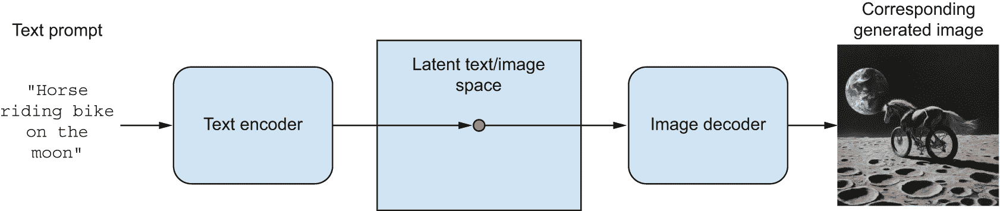

图 17.2：语言引导的图像生成

当然，仍然存在需要克服的挑战。与所有深度学习模型一样，潜在空间并没有编码一个一致的物理世界模型，所以你可能会偶尔看到多指的手、不连贯的照明或混乱的物体。生成的图像的连贯性仍然是一个活跃的研究领域。在图 17.2 的情况下，尽管已经看到了成千上万张人们骑自行车的图片，但模型并没有以人类的方式理解骑自行车的含义——比如踩踏、转向或保持直立平衡等概念。这就是为什么你的骑自行车的马不太可能以可信的方式描绘出用后腿踩踏，就像人类艺术家会画的那样。

学习图像表示的潜在空间有多种不同的策略，每种策略都有其自身的特点。最常见的图像生成模型类型包括

+   扩散模型

+   变分自编码器 (VAEs)

+   生成对抗网络 (GANs)

虽然此书的先前版本涵盖了生成对抗网络（GANs），但近年来它们已经逐渐过时，几乎被扩散模型所取代。在本版中，我们将涵盖 VAEs 和扩散模型，并跳过 GANs。在我们自己构建的模型中，我们将专注于无条件的图像生成——从潜在空间中采样图像而不需要文本条件。然而，你还将学习如何使用预训练的文本到图像模型以及如何探索其潜在空间。

### 变分自编码器

VAEs（变分自编码器），由 Kingma 和 Welling 于 2013 年 12 月^([[1]](#footnote-1))和 Rezende、Mohamed 和 Wierstra 于 2014 年 1 月^([[2]](#footnote-2))同时发现，是一种特别适合通过概念向量进行图像编辑的生成模型。它们是一种*自编码器*——一种旨在将输入编码到低维潜在空间并解码回原始输入的网络——它结合了深度学习和贝叶斯推理的思想。

VAEs 已经存在十多年了，但它们至今仍然相关，并继续在最近的研究中被使用。虽然 VAEs 永远不会是生成高保真图像的首选——在这方面扩散模型表现更佳——但它们仍然是深度学习工具箱中的一个重要工具，尤其是在可解释性、对潜在空间的控制和数据重建能力至关重要的场合。它也是你第一次接触自编码器的概念，了解这一点是有用的。VAEs 完美地展示了这类模型背后的核心思想。

经典的图像自编码器通过编码器模块将图像映射到潜在向量空间，然后通过解码器模块将其解码回与原始图像相同维度的输出（见图 17.3）。它通过使用与输入图像相同的图像作为目标数据进行训练，这意味着自编码器学习重建原始输入。通过对代码（编码器的输出）施加各种约束，可以使自编码器学习到数据更有趣或更少的潜在表示。最常见的是，将代码约束为低维和稀疏（主要是零），在这种情况下，编码器充当将输入数据压缩成更少信息位的方式。

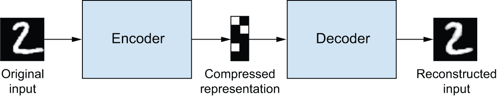

图 17.3：自动编码器：将输入`x`映射到压缩表示，然后解码回`x'`

在实践中，这种经典的自动编码器并没有导致特别有用或结构良好的潜在空间。它们在压缩方面也不太有用。因此，它们在很大程度上已经过时。然而，VAE 通过一点统计魔法增强了自动编码器，迫使它们学习连续、高度结构的潜在空间。它们已经证明是图像生成的一个强大工具。

相反，变分自编码器（VAE）不是将其输入图像压缩到潜在空间中的固定代码，而是将图像转换为统计分布的参数：均值和方差。本质上，这意味着我们假设输入图像是由统计过程生成的，并且在这个过程中应该考虑随机性。VAE 然后使用均值和方差参数随机采样分布中的一个元素，并将该元素解码回原始输入（见图 17.4）。这个过程的不确定性提高了鲁棒性，并迫使潜在空间在各个地方编码有意义的表示：潜在空间中采样的每个点都被解码为有效的输出。

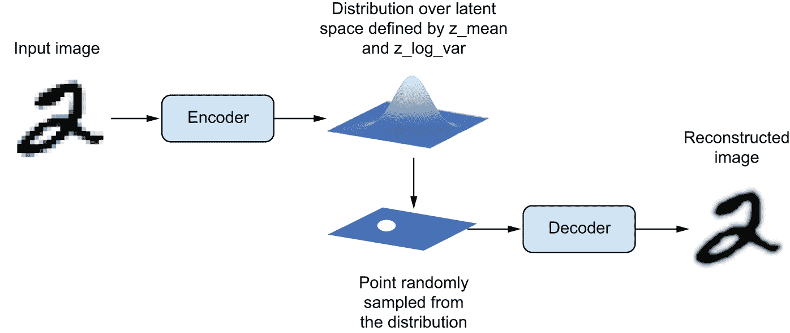

图 17.4：VAE 将图像映射到两个向量`z_mean`和`z_log_sigma`，这些向量定义了潜在空间上的概率分布，用于采样一个潜在点进行解码。

在技术术语上，以下是 VAE 的工作原理：

1.  编码器模块将输入样本`input_img`转换到表示的潜在空间中的两个参数，`z_mean`和`z_log_variance`。

1.  您从假设生成输入图像的潜在正态分布中随机采样一个点`z`，通过`z = z_mean + exp(z_log_variance) * epsilon`，其中`epsilon`是一个包含小值的随机张量。

1.  解码器模块将潜在空间中的这个点映射回原始输入图像。

因为`epsilon`是随机的，这个过程确保了每个接近你编码`input_img`（`z-mean`）的潜在位置的点都可以解码成类似于`input_img`的东西，从而迫使潜在空间具有连续的有意义性。潜在空间中任何两个接近的点都会解码成高度相似的画面。连续性，加上潜在空间低维度的特性，迫使潜在空间中的每个方向都编码了数据的有意义变化轴，使得潜在空间非常结构化，因此非常适合通过概念向量进行操作。

VAE 的参数通过两个损失函数进行训练：一个*重建损失*，它迫使解码样本与初始输入相匹配，以及一个*正则化损失*，它有助于学习均匀的潜在分布并减少对训练数据的过度拟合。从示意图上看，这个过程看起来是这样的：

```py
# Encodes the input into a mean and variance parameter
z_mean, z_log_variance = encoder(input_img)
# Draws a latent point using a small random epsilon
z = z_mean + exp(z_log_variance) * epsilon
# Decodes z back to an image
reconstructed_img = decoder(z)
# Instantiates the autoencoder model, which maps an input image to its
# reconstruction
model = Model(input_img, reconstructed_img) 
```

然后，您可以使用重建损失和正则化损失来训练模型。对于正则化损失，我们通常使用一个表达式（Kullback–Leibler 散度），其目的是将编码器输出的分布推向一个以 0 为中心的均匀分布。这为编码器提供了对其建模的潜在空间结构的合理假设。

现在我们来看一下在实践中实现 VAE 是什么样的！

### 使用 Keras 实现 VAE

我们将实现一个可以生成 MNIST 数字的 VAE。它将包含三个部分：

+   一个将真实图像转换为潜在空间中的均值和方差的编码网络

+   一个采样层，它接受这样的均值和方差，并使用它们从潜在空间中采样一个随机点

+   一个解码器网络，它将潜在空间中的点转换回图像

以下列表显示了您将使用的编码器网络，它将图像映射到潜在空间上概率分布的参数。它是一个简单的卷积神经网络，将输入图像`x`映射到两个向量，`z_mean`和`z_log_var`。一个重要的细节是我们使用步长进行特征图的下采样，而不是最大池化。我们上次这样做是在第十一章的图像分割示例中。回想一下，通常来说，对于任何关心*信息位置*（即图像中的*哪里*有东西）的模型，步长比最大池化更可取，因为这个模型确实需要产生一个可以用来重建有效图像的图像编码。

```py
import keras
from keras import layers

# Dimensionality of the latent space: a 2D plane
latent_dim = 2

image_inputs = keras.Input(shape=(28, 28, 1))
x = layers.Conv2D(32, 3, activation="relu", strides=2, padding="same")(
    image_inputs
)
x = layers.Conv2D(64, 3, activation="relu", strides=2, padding="same")(x)
x = layers.Flatten()(x)
x = layers.Dense(16, activation="relu")(x)
# The input image ends up being encoded into these two parameters.
z_mean = layers.Dense(latent_dim, name="z_mean")(x)
z_log_var = layers.Dense(latent_dim, name="z_log_var")(x)
encoder = keras.Model(image_inputs, [z_mean, z_log_var], name="encoder") 
```

列表 17.1：VAE 编码器网络

它的总结看起来是这样的：

```py
>>> encoder.summary()
Model: "encoder"
┏━━━━━━━━━━━━━━━━━━━━━━━┳━━━━━━━━━━━━━━━━━━━┳━━━━━━━━━━━━━┳━━━━━━━━━━━━━━━━━━━━┓
┃ Layer (type)          ┃ Output Shape      ┃     Param # ┃ Connected to       ┃
┡━━━━━━━━━━━━━━━━━━━━━━━╇━━━━━━━━━━━━━━━━━━━╇━━━━━━━━━━━━━╇━━━━━━━━━━━━━━━━━━━━┩
│ input_layer           │ (None, 28, 28, 1) │           0 │ -                  │
│ (InputLayer)          │                   │             │                    │
├───────────────────────┼───────────────────┼─────────────┼────────────────────┤
│ conv2d (Conv2D)       │ (None, 14, 14,    │         320 │ input_layer[0][0]  │
│                       │ 32)               │             │                    │
├───────────────────────┼───────────────────┼─────────────┼────────────────────┤
│ conv2d_1 (Conv2D)     │ (None, 7, 7, 64)  │      18,496 │ conv2d[0][0]       │
├───────────────────────┼───────────────────┼─────────────┼────────────────────┤
│ flatten (Flatten)     │ (None, 3136)      │           0 │ conv2d_1[0][0]     │
├───────────────────────┼───────────────────┼─────────────┼────────────────────┤
│ dense (Dense)         │ (None, 16)        │      50,192 │ flatten[0][0]      │
├───────────────────────┼───────────────────┼─────────────┼────────────────────┤
│ z_mean (Dense)        │ (None, 2)         │          34 │ dense[0][0]        │
├───────────────────────┼───────────────────┼─────────────┼────────────────────┤
│ z_log_var (Dense)     │ (None, 2)         │          34 │ dense[0][0]        │
└───────────────────────┴───────────────────┴─────────────┴────────────────────┘
 Total params: 69,076 (269.83 KB)
 Trainable params: 69,076 (269.83 KB)
 Non-trainable params: 0 (0.00 B)
```

接下来是使用`z_mean`和`z_log_var`，即假设产生`input_img`的统计分布的参数，来生成一个潜在空间点`z`的代码。

```py
from keras import ops

class Sampler(keras.Layer):
    def __init__(self, **kwargs):
        super().__init__(**kwargs)
        # We need a seed generator to use functions from keras.random
        # in call().
        self.seed_generator = keras.random.SeedGenerator()
        self.built = True

    def call(self, z_mean, z_log_var):
        batch_size = ops.shape(z_mean)[0]
        z_size = ops.shape(z_mean)[1]
        epsilon = keras.random.normal(
            # Draws a batch of random normal vectors
            (batch_size, z_size), seed=self.seed_generator
        )
        # Applies the VAE sampling formula
        return z_mean + ops.exp(0.5 * z_log_var) * epsilon 
```

列表 17.2：潜在空间采样层

以下列表展示了解码器的实现。我们将向量 `z` 调整为图像的维度，然后使用几个卷积层来获得最终图像输出，其维度与原始 `input_img` 相同。

```py
# Input where we'll feed z
latent_inputs = keras.Input(shape=(latent_dim,))
# Produces the same number of coefficients we had at the level of the
# Flatten layer in the encoder
x = layers.Dense(7 * 7 * 64, activation="relu")(latent_inputs)
# Reverts the Flatten layer of the encoder
x = layers.Reshape((7, 7, 64))(x)
# Reverts the Conv2D layers of the encoder
x = layers.Conv2DTranspose(64, 3, activation="relu", strides=2, padding="same")(
    x
)
x = layers.Conv2DTranspose(32, 3, activation="relu", strides=2, padding="same")(
    x
)
# The output ends up with shape (28, 28, 1).
decoder_outputs = layers.Conv2D(1, 3, activation="sigmoid", padding="same")(x)
decoder = keras.Model(latent_inputs, decoder_outputs, name="decoder") 
```

列表 17.3：VAE 解码器网络，将潜在空间点映射到图像

其摘要如下：

```py
>>> decoder.summary()
Model: "decoder"
┏━━━━━━━━━━━━━━━━━━━━━━━━━━━━━━━━━━━┳━━━━━━━━━━━━━━━━━━━━━━━━━━┳━━━━━━━━━━━━━━━┓
┃ Layer (type)                      ┃ Output Shape             ┃       Param # ┃
┡━━━━━━━━━━━━━━━━━━━━━━━━━━━━━━━━━━━╇━━━━━━━━━━━━━━━━━━━━━━━━━━╇━━━━━━━━━━━━━━━┩
│ input_layer_1 (InputLayer)        │ (None, 2)                │             0 │
├───────────────────────────────────┼──────────────────────────┼───────────────┤
│ dense_1 (Dense)                   │ (None, 3136)             │         9,408 │
├───────────────────────────────────┼──────────────────────────┼───────────────┤
│ reshape (Reshape)                 │ (None, 7, 7, 64)         │             0 │
├───────────────────────────────────┼──────────────────────────┼───────────────┤
│ conv2d_transpose                  │ (None, 14, 14, 64)       │        36,928 │
│ (Conv2DTranspose)                 │                          │               │
├───────────────────────────────────┼──────────────────────────┼───────────────┤
│ conv2d_transpose_1                │ (None, 28, 28, 32)       │        18,464 │
│ (Conv2DTranspose)                 │                          │               │
├───────────────────────────────────┼──────────────────────────┼───────────────┤
│ conv2d_2 (Conv2D)                 │ (None, 28, 28, 1)        │           289 │
└───────────────────────────────────┴──────────────────────────┴───────────────┘
 Total params: 65,089 (254.25 KB)
 Trainable params: 65,089 (254.25 KB)
 Non-trainable params: 0 (0.00 B)
```

现在，让我们创建 VAE 模型本身。这是您第一个不是进行监督学习的模型示例（自编码器是 *自监督* 学习的一个例子，因为它使用其输入作为目标）。每当您偏离经典监督学习时，通常都会子类化 `Model` 类并实现自定义的 `train_step()` 来指定新的训练逻辑，这是您在第七章中学到的。我们在这里可以轻松做到这一点，但这种方法的一个缺点是 `train_step()` 的内容必须是后端特定的——您会使用 TensorFlow 的 `GradientTape`，您会使用 PyTorch 的 `loss.backward()`，等等。自定义训练逻辑的一个更简单的方法是仅实现 `compute_loss()` 方法，并保留默认的 `train_step()`。`compute_loss()` 是内置 `train_step()` 调用的关键可微分逻辑。由于它不涉及直接操作梯度，因此很容易保持其与后端无关。

其签名如下：

`compute_loss(x, y, y_pred, sample_weight=None, training=True)`

其中 `x` 是模型的输入；`y` 是模型的输出（在我们的案例中，它是 `None`，因为我们使用的数据集只有输入，没有目标）；而 `y_pred` 是 `call()` 的输出——即模型的预测。在任何监督训练流程中，您都会基于 `y` 和 `y_pred` 计算损失。在我们的案例中，由于 `y` 是 `None` 且 `y_pred` 包含潜在参数，我们将使用 `x`（原始输入）和从 `y_pred` 导出的 `reconstruction` 来计算损失。

该方法必须返回一个标量，即要最小化的损失值。您还可以使用 `compute_loss()` 来更新您的指标状态，这是我们在这个案例中想要做的。

现在，让我们用自定义的 `compute_loss()` 方法来编写我们的 VAE。它适用于所有后端，无需更改代码！

```py
class VAE(keras.Model):
    def __init__(self, encoder, decoder, **kwargs):
        super().__init__(**kwargs)
        self.encoder = encoder
        self.decoder = decoder
        self.sampler = Sampler()
        # We'll use these metrics to keep track of the loss averages
        # over each epoch.
        self.reconstruction_loss_tracker = keras.metrics.Mean(
            name="reconstruction_loss"
        )
        self.kl_loss_tracker = keras.metrics.Mean(name="kl_loss")

    def call(self, inputs):
        return self.encoder(inputs)

    def compute_loss(self, x, y, y_pred, sample_weight=None, training=True):
        # Argument x is the model's input.
        original = x
        # Argument y_pred is the output of call().
        z_mean, z_log_var = y_pred
        # This is our reconstructed image.
        reconstruction = self.decoder(self.sampler(z_mean, z_log_var))

        # We sum the reconstruction loss over the spatial dimensions
        # (axes 1 and 2) and take its mean over the batch dimension.
        reconstruction_loss = ops.mean(
            ops.sum(
                keras.losses.binary_crossentropy(x, reconstruction), axis=(1, 2)
            )
        )
        # Adds the regularization term (Kullback–Leibler divergence)
        kl_loss = -0.5 * (
            1 + z_log_var - ops.square(z_mean) - ops.exp(z_log_var)
        )
        total_loss = reconstruction_loss + ops.mean(kl_loss)

        # Updates the state of our loss-tracking metrics
        self.reconstruction_loss_tracker.update_state(reconstruction_loss)
        self.kl_loss_tracker.update_state(kl_loss)
        return total_loss 
```

列表 17.4：具有自定义 `compute_loss()` 方法的 VAE 模型

最后，您已经准备好实例化模型并在 MNIST 数字上对其进行训练。因为 `compute_loss()` 已经处理了损失，所以在编译时不需要指定外部损失（`loss=None`），这反过来意味着您在训练期间不会传递目标数据（如您所见，在 `fit` 中您只向模型传递 `x_train`）。

```py
import numpy as np

(x_train, _), (x_test, _) = keras.datasets.mnist.load_data()
# We train on all MNIST digits, so we concatenate the training and test
# samples.
mnist_digits = np.concatenate([x_train, x_test], axis=0)
mnist_digits = np.expand_dims(mnist_digits, -1).astype("float32") / 255

vae = VAE(encoder, decoder)
# We don't pass a loss argument in compile(), since the loss is already
# part of the train_step().
vae.compile(optimizer=keras.optimizers.Adam())
# We don't pass targets in fit(), since train_step() doesn't expect
# any.
vae.fit(mnist_digits, epochs=30, batch_size=128) 
```

列表 17.5：训练 VAE

一旦模型训练完成，您就可以使用 `decoder` 网络将任意的潜在空间向量转换为图像。

```py
import matplotlib.pyplot as plt

# We'll display a grid of 30 × 30 digits (900 digits total).
n = 30
digit_size = 28
figure = np.zeros((digit_size * n, digit_size * n))

# Samples points linearly on a 2D grid
grid_x = np.linspace(-1, 1, n)
grid_y = np.linspace(-1, 1, n)[::-1]

# Iterates over grid locations
for i, yi in enumerate(grid_y):
    for j, xi in enumerate(grid_x):
        # For each location, samples a digit and adds it to our figure
        z_sample = np.array([[xi, yi]])
        x_decoded = vae.decoder.predict(z_sample)
        digit = x_decoded[0].reshape(digit_size, digit_size)
        figure[
            i * digit_size : (i + 1) * digit_size,
            j * digit_size : (j + 1) * digit_size,
        ] = digit

plt.figure(figsize=(15, 15))
start_range = digit_size // 2
end_range = n * digit_size + start_range
pixel_range = np.arange(start_range, end_range, digit_size)
sample_range_x = np.round(grid_x, 1)
sample_range_y = np.round(grid_y, 1)
plt.xticks(pixel_range, sample_range_x)
plt.yticks(pixel_range, sample_range_y)
plt.xlabel("z[0]")
plt.ylabel("z[1]")
plt.axis("off")
plt.imshow(figure, cmap="Greys_r") 
```

列表 17.6：从 2D 潜在空间中采样点网格并将它们解码为图像

样本数字的网格（见图 17.5）显示了不同数字类别的完全连续分布，当你沿着潜在空间中的路径移动时，一个数字会逐渐变成另一个数字。这个空间中的特定方向具有意义：例如，有一个“四”的方向，“一”的方向，等等。

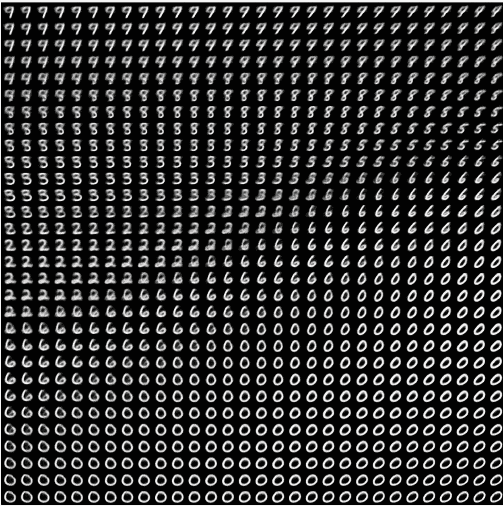

图 17.5：从潜在空间解码的数字网格

在下一节中，我们将详细介绍生成图像的另一项主要工具：扩散模型，这是今天几乎所有商业图像生成服务背后的架构。

## 扩散模型

自动编码器的一个长期应用是*去噪*：将包含少量噪声的输入（例如，低质量的 JPEG 图像）输入到模型中，并得到相同输入的清理版本。这是自动编码器擅长的一项任务。在 2010 年代后期，这个想法催生了非常成功的*图像超分辨率*模型，能够接受低分辨率、可能包含噪声的图像，并输出高质量、高分辨率的版本（见图 17.6）。这些模型在过去几年中已成为每个主要智能手机相机应用的一部分。

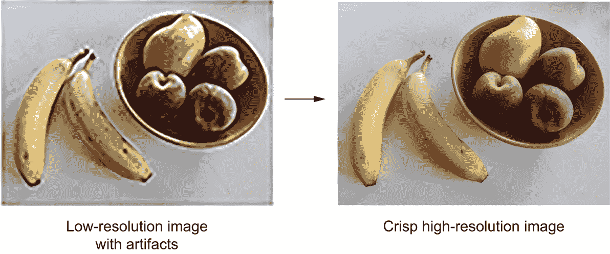

图 17.6：图像超分辨率

当然，这些模型并不是像《银翼杀手》（1982 年）中的“增强”场景那样神奇地恢复输入中隐藏的丢失细节。相反，它们是在对图像应该看起来像什么做出有根据的猜测——它们正在*幻觉*出一个清理过的、更高分辨率的版本。这可能会导致一些有趣的意外。例如，使用一些 AI 增强相机，你可以拍摄一个看起来有点像月亮的东西（例如严重模糊的月亮图像的打印件），你会在你的相机胶卷中得到一张清晰的月亮陨石坑的图片。许多在打印件中根本不存在的细节被相机直接幻觉出来，因为使用的超分辨率模型过度拟合了月亮摄影图像。所以，绝对不要像 Rick Deckard 那样使用这项技术进行法医鉴定！

图像去噪的早期成功使研究人员产生了令人震惊的想法：既然你可以使用自动编码器从图像中去除少量噪声，那么重复这个过程多次，循环去除大量噪声当然也是可能的。最终，你能去除由*纯噪声*组成的图像的噪声吗？

事实上，你可以做到这一点。通过这样做，你可以有效地从无中生有地创造出全新的图像，就像图 17.7 所示的那样。这是扩散模型背后的关键洞察，这些模型更准确地应该被称为*逆向扩散*模型，因为“扩散”指的是逐渐向图像添加噪声直到其消散成无的过程。

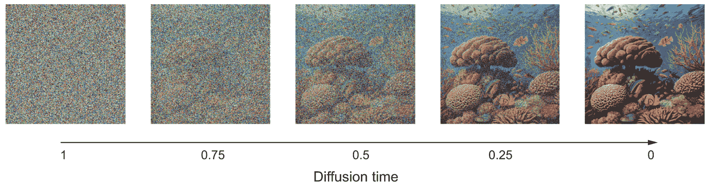

图 17.7：反向扩散：通过重复去噪将纯噪声转换为图像

扩散模型本质上是一个循环中的去噪自动编码器，能够将纯噪声转换为清晰、逼真的图像。你可能知道米开朗基罗的这句诗意名言：“每一块石头里都有一尊雕像，雕塑家的任务就是发现它”——同样，每一块白色噪声中都有一个图像，扩散模型的任务就是发现它。

现在，让我们用 Keras 构建一个模型。

### 牛津花卉数据集

我们将要使用的数据集是牛津花卉数据集（[`www.robots.ox.ac.uk/~vgg/data/flowers/102/`](https://www.robots.ox.ac.uk/~vgg/data/flowers/102/))，这是一个包含 102 个不同物种的 8,189 张花卉图片的集合。

让我们获取数据集存档并提取它：

```py
import os

fpath = keras.utils.get_file(
    origin="https://www.robots.ox.ac.uk/~vgg/data/flowers/102/102flowers.tgz",
    extract=True,
) 
```

`fpath`现在是提取目录的本地路径。图像包含在该目录下的`jpg`子目录中。让我们使用`image_dataset_from_directory()`将它们转换为可迭代的数据集。

我们需要将图像调整到固定大小，但不想扭曲它们的纵横比，因为这会负面影响我们生成图像的质量，所以我们使用`crop_to_aspect_ratio`选项来提取最大尺寸且未扭曲的裁剪图像，尺寸为（128 × 128）：

```py
batch_size = 32
image_size = 128
images_dir = os.path.join(fpath, "jpg")
dataset = keras.utils.image_dataset_from_directory(
    images_dir,
    # We won't need the labels, just the images.
    labels=None,
    image_size=(image_size, image_size),
    # Crops images when resizing them to preserve their aspect ratio
    crop_to_aspect_ratio=True,
)
dataset = dataset.rebatch(
    # We'd like all batches to have the same size, so we drop the last
    # (irregular) batch.
    batch_size,
    drop_remainder=True,
) 
```

这里是一个示例图像（图 17.8）：

```py
from matplotlib import pyplot as plt

for batch in dataset:
    img = batch.numpy()[0]
    break
plt.imshow(img.astype("uint8")) 
```

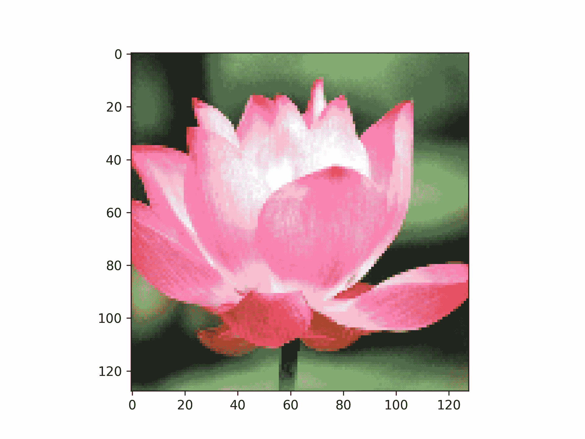

图 17.8：牛津花卉数据集的一个示例图像

### 一个 U-Net 去噪自动编码器

相同的去噪模型在扩散去噪过程的每次迭代中都会被重复使用，每次消除一点噪声。为了使模型的工作更容易，我们告诉它对于给定的输入图像应该提取多少噪声——这就是`noise_rates`输入。我们让模型输出一个预测的噪声掩码，我们可以从输入中减去它来实现去噪。

对于我们的去噪模型，我们将使用 U-Net——一种最初为图像分割而开发的卷积神经网络。它看起来像图 17.9。

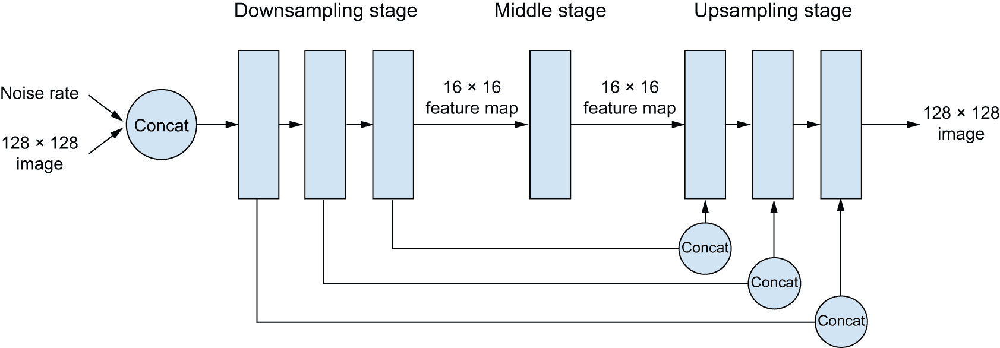

图 17.9：我们的 U-Net 风格的去噪自动编码器架构

这个架构有三个阶段：

1.  一个*下采样阶段*，由几个卷积层块组成，其中输入从原始的 128 × 128 大小下采样到一个更小的尺寸（在我们的例子中，是 16 × 16）。

1.  一个*中间阶段*，其中特征图具有恒定的尺寸。

1.  一个*上采样阶段*，其中特征图被上采样回 128 × 128。

下采样阶段和上采样阶段的块之间存在 1:1 的映射：每个上采样块是下采样块的逆。重要的是，该模型具有从每个下采样块到相应上采样块的连接性，这些连接性有助于避免在连续的下采样和上采样操作中丢失图像细节信息。

让我们使用 Functional API 来组装模型：

```py
# Utility function to apply a block of layers with a residual
# connection
def residual_block(x, width):
    input_width = x.shape[3]
    if input_width == width:
        residual = x
    else:
        residual = layers.Conv2D(width, 1)(x)
    x = layers.BatchNormalization(center=False, scale=False)(x)
    x = layers.Conv2D(width, 3, padding="same", activation="swish")(x)
    x = layers.Conv2D(width, 3, padding="same")(x)
    x = x + residual
    return x

def get_model(image_size, widths, block_depth):
    noisy_images = keras.Input(shape=(image_size, image_size, 3))
    noise_rates = keras.Input(shape=(1, 1, 1))

    x = layers.Conv2D(widths[0], 1)(noisy_images)
    n = layers.UpSampling2D(image_size, interpolation="nearest")(noise_rates)
    x = layers.Concatenate()([x, n])

    skips = []
    # Dowsampling stage
    for width in widths[:-1]:
        for _ in range(block_depth):
            x = residual_block(x, width)
            skips.append(x)
        x = layers.AveragePooling2D(pool_size=2)(x)

    # Middle stage
    for _ in range(block_depth):
        x = residual_block(x, widths[-1])

    # Upsampling stage
    for width in reversed(widths[:-1]):
        x = layers.UpSampling2D(size=2, interpolation="bilinear")(x)
        for _ in range(block_depth):
            x = layers.Concatenate()([x, skips.pop()])
            x = residual_block(x, width)

    # We set the kernel initializer for the last layer to "zeros,"
    # making the model predict only zeros after initialization (that
    # is, our default assumption before training is "no noise").
    pred_noise_masks = layers.Conv2D(3, 1, kernel_initializer="zeros")(x)

    # Creates the functional model
    return keras.Model([noisy_images, noise_rates], pred_noise_masks) 
```

你可以用类似 `get_model(image_size=128, widths=[32, 64, 96, 128], block_depth=2)` 的方式实例化模型。`widths` 参数是一个列表，包含每个连续下采样或上采样阶段的 `Conv2D` 层大小。我们通常希望随着输入的下采样（从 32 到 128 个单位）而层的大小增加，然后在上采样时减小（从 128 回到 32 个单位）。

### 扩散时间和扩散计划的概念

扩散过程是一系列步骤，其中我们将我们的去噪自动编码器应用于从图像中消除少量噪声，从纯噪声图像开始，以纯信号图像结束。循环中当前步骤的索引称为 *扩散时间*（见图 17.7）。在我们的情况下，我们将使用介于 1 和 0 之间的连续值作为此索引的值——1 表示过程的开始，此时噪声量最大，信号量最小，而 0 表示过程的结束，此时图像几乎全部是信号而没有噪声。

当前扩散时间与图像中存在的噪声和信号量之间的关系称为 *扩散计划*。在我们的实验中，我们将使用余弦计划来平滑地从扩散过程开始的高信号率（低噪声）过渡到结束时的低信号率（高噪声）。

```py
def diffusion_schedule(
    diffusion_times,
    min_signal_rate=0.02,
    max_signal_rate=0.95,
):
    start_angle = ops.cast(ops.arccos(max_signal_rate), "float32")
    end_angle = ops.cast(ops.arccos(min_signal_rate), "float32")
    diffusion_angles = start_angle + diffusion_times * (end_angle - start_angle)
    signal_rates = ops.cos(diffusion_angles)
    noise_rates = ops.sin(diffusion_angles)
    return noise_rates, signal_rates 
```

列表 17.7：扩散计划

这个 `diffusion_schedule()` 函数接受一个 `diffusion_times` 张量作为输入，它表示扩散过程的进展，并返回相应的 `noise_rates` 和 `signal_rates` 张量。这些比率将被用来指导去噪过程。使用余弦计划的逻辑是保持关系 `noise_rates ** 2 + signal_rates ** 2 == 1`（见图 17.10）。

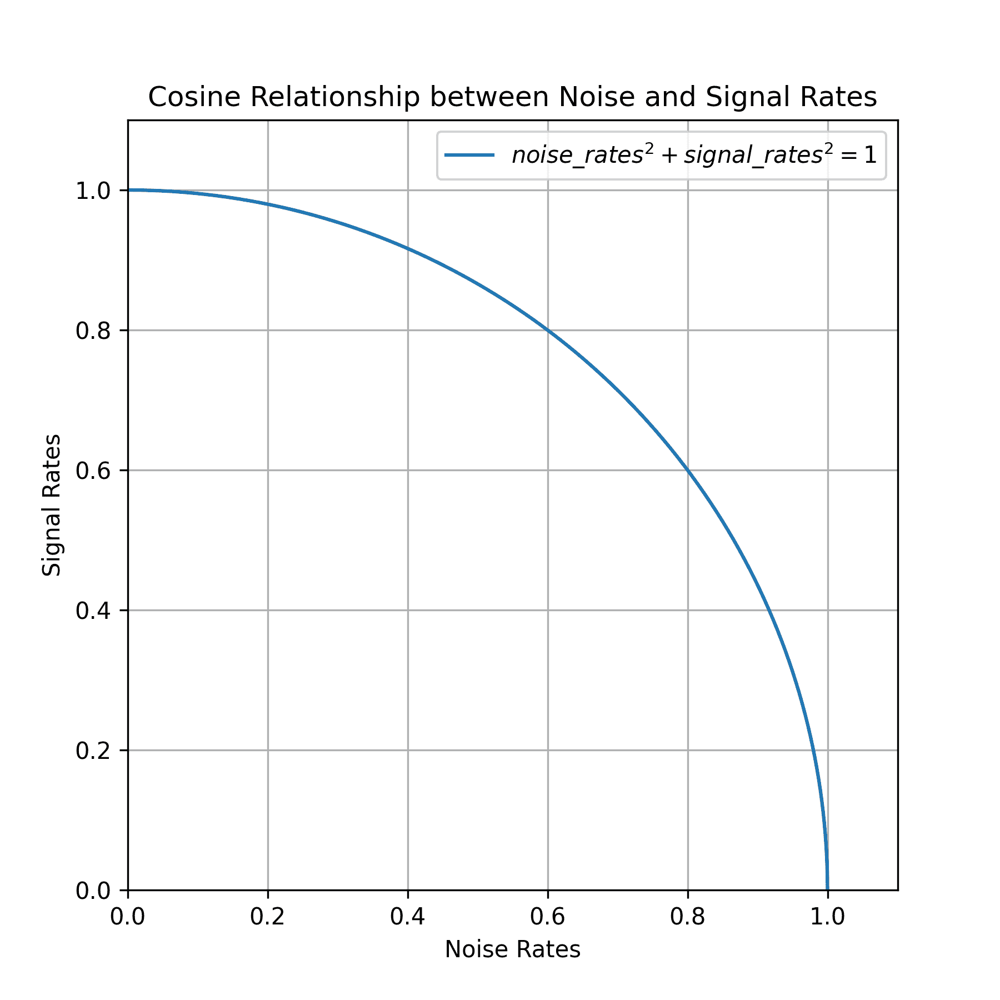

图 17.10：噪声率和信号率之间的余弦关系

让我们绘制这个函数如何将扩散时间（介于 0 和 1 之间）映射到特定的噪声率和信号率（见图 17.11）：

```py
diffusion_times = ops.arange(0.0, 1.0, 0.01)
noise_rates, signal_rates = diffusion_schedule(diffusion_times)

# These lines are only necessary if you're using PyTorch, in which case
# tensor conversion to NumPy is no longer trivial.
diffusion_times = ops.convert_to_numpy(diffusion_times)
noise_rates = ops.convert_to_numpy(noise_rates)
signal_rates = ops.convert_to_numpy(signal_rates)

plt.plot(diffusion_times, noise_rates, label="Noise rate")
plt.plot(diffusion_times, signal_rates, label="Signal rate")

plt.xlabel("Diffusion time")
plt.legend() 
```

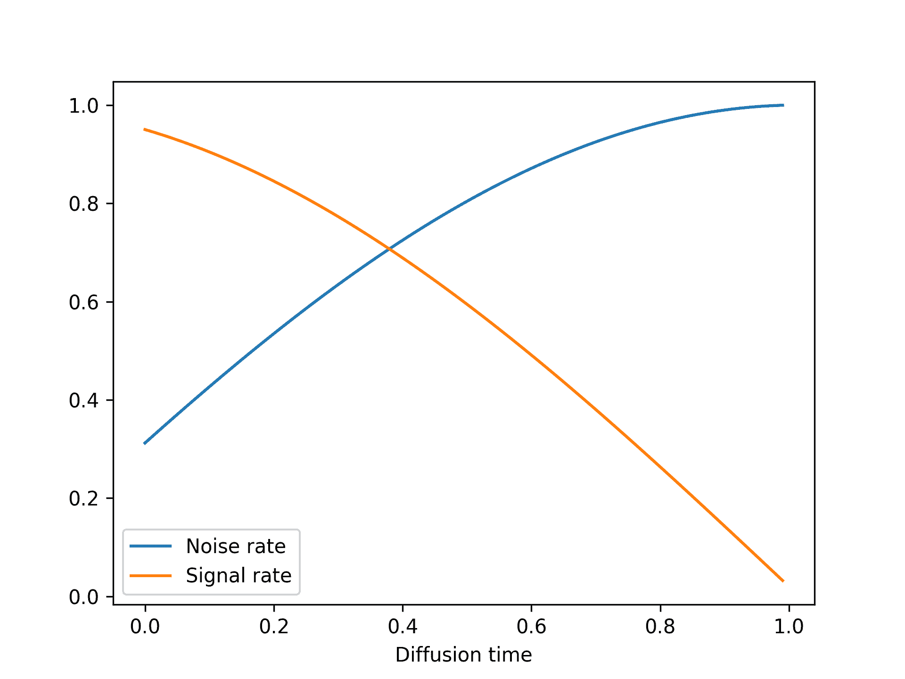

图 17.11：我们的余弦扩散计划

### 训练过程

让我们创建一个 `DiffusionModel` 类来实现训练过程。它将包含我们的去噪自动编码器作为其属性之一。我们还需要一些其他的东西：

+   *损失函数* — 我们将使用平均绝对误差作为我们的损失，也就是说 `mean(abs(real_noise_mask - predicted_noise_mask))`。

+   *图像归一化层* — 我们将添加到图像中的噪声将具有单位方差和零均值，因此我们希望我们的图像也以这种方式归一化，以便噪声的值范围与图像的值范围相匹配。

让我们先编写模型构造函数：

```py
class DiffusionModel(keras.Model):
    def __init__(self, image_size, widths, block_depth, **kwargs):
        super().__init__(**kwargs)
        self.image_size = image_size
        self.denoising_model = get_model(image_size, widths, block_depth)
        self.seed_generator = keras.random.SeedGenerator()
        # Our loss function
        self.loss = keras.losses.MeanAbsoluteError()
        # We'll use this to normalize input images.
        self.normalizer = keras.layers.Normalization() 
```

我们首先需要的方法是去噪方法。它简单地调用去噪模型以检索一个预测的噪声掩码，并使用它来重建一个去噪图像：

```py
 def denoise(self, noisy_images, noise_rates, signal_rates):
        # Calls the denoising model
        pred_noise_masks = self.denoising_model([noisy_images, noise_rates])
        # Reconstructs the predicted clean image
        pred_images = (
            noisy_images - noise_rates * pred_noise_masks
        ) / signal_rates
        return pred_images, pred_noise_masks 
```

接下来是训练逻辑。这是最重要的部分！就像在 VAE 示例中一样，我们将实现一个自定义的`compute_loss()`方法来保持我们的模型后端无关。当然，如果你坚持使用一个特定的后端，你也可以编写一个带有相同逻辑的自定义`train_step()`，以及后端特定的梯度计算和权重更新逻辑。

由于`compute_loss()`接收`call()`的输出作为输入，我们将去噪前向传递放在`call()`中。我们的`call()`接受一批干净的输入图像，并执行以下步骤：

1.  对图像进行归一化

1.  样本随机的扩散时间（去噪模型需要在扩散时间的全谱上训练）

1.  计算相应的噪声率和信号率（使用扩散计划）

1.  在干净的图像上添加随机噪声（基于计算出的噪声率和信号率）

1.  对图像进行去噪

它返回

+   预测的去噪图像

+   预测的噪声掩码

+   实际应用的噪声掩码

这两个量随后在`compute_loss()`中使用，以计算模型在噪声掩码预测任务上的损失：

```py
 def call(self, images):
        images = self.normalizer(images)
        # Samples random noise masks
        noise_masks = keras.random.normal(
            (batch_size, self.image_size, self.image_size, 3),
            seed=self.seed_generator,
        )
        # Samples random diffusion times
        diffusion_times = keras.random.uniform(
            (batch_size, 1, 1, 1),
            minval=0.0,
            maxval=1.0,
            seed=self.seed_generator,
        )
        noise_rates, signal_rates = diffusion_schedule(diffusion_times)
        # Adds noise to the images
        noisy_images = signal_rates * images + noise_rates * noise_masks
        # Denoises them
        pred_images, pred_noise_masks = self.denoise(
            noisy_images, noise_rates, signal_rates
        )
        return pred_images, pred_noise_masks, noise_masks

    def compute_loss(self, x, y, y_pred, sample_weight=None, training=True):
        _, pred_noise_masks, noise_masks = y_pred
        return self.loss(noise_masks, pred_noise_masks) 
```

### 生成过程

最后，让我们实现图像生成过程。我们从纯随机噪声开始，并反复应用`denoise()`方法，直到我们得到高信号、低噪声的图像。

```py
 def generate(self, num_images, diffusion_steps):
        noisy_images = keras.random.normal(
            # Starts from pure noise
            (num_images, self.image_size, self.image_size, 3),
            seed=self.seed_generator,
        )
        step_size = 1.0 / diffusion_steps
        for step in range(diffusion_steps):
            # Computes appropriate noise rates and signal rates
            diffusion_times = ops.ones((num_images, 1, 1, 1)) - step * step_size
            noise_rates, signal_rates = diffusion_schedule(diffusion_times)
            # Calls denoising model
            pred_images, pred_noises = self.denoise(
                noisy_images, noise_rates, signal_rates
            )
            # Prepares noisy images for the next iteration
            next_diffusion_times = diffusion_times - step_size
            next_noise_rates, next_signal_rates = diffusion_schedule(
                next_diffusion_times
            )
            noisy_images = (
                next_signal_rates * pred_images + next_noise_rates * pred_noises
            )
        # Denormalizes images so their values fit between 0 and 255
        images = (
            self.normalizer.mean + pred_images * self.normalizer.variance**0.5
        )
        return ops.clip(images, 0.0, 255.0) 
```

### 使用自定义回调可视化结果

我们没有合适的度量标准来评判我们生成的图像质量，所以你将需要在训练过程中自己可视化生成的图像来判断你的模型是否有所进展。一个简单的方法是使用自定义回调。以下回调在每一个 epoch 结束时使用`generate()`方法来显示一个 3 × 6 的生成图像网格：

```py
class VisualizationCallback(keras.callbacks.Callback):
    def __init__(self, diffusion_steps=20, num_rows=3, num_cols=6):
        self.diffusion_steps = diffusion_steps
        self.num_rows = num_rows
        self.num_cols = num_cols

    def on_epoch_end(self, epoch=None, logs=None):
        generated_images = self.model.generate(
            num_images=self.num_rows * self.num_cols,
            diffusion_steps=self.diffusion_steps,
        )

        plt.figure(figsize=(self.num_cols * 2.0, self.num_rows * 2.0))
        for row in range(self.num_rows):
            for col in range(self.num_cols):
                i = row * self.num_cols + col
                plt.subplot(self.num_rows, self.num_cols, i + 1)
                img = ops.convert_to_numpy(generated_images[i]).astype("uint8")
                plt.imshow(img)
                plt.axis("off")
        plt.tight_layout()
        plt.show()
        plt.close() 
```

### 是时候开始了！

终于到了在牛津花卉数据集上训练我们的扩散模型的时候了。让我们实例化模型：

```py
model = DiffusionModel(image_size, widths=[32, 64, 96, 128], block_depth=2)
# Computes the mean and variance necessary to perform normalization —
# don't forget it!
model.normalizer.adapt(dataset) 
```

我们将使用`AdamW`作为我们的优化器，并启用一些实用的选项来帮助稳定训练并提高生成图像的质量：

+   *学习率衰减* — 我们在训练过程中通过`InverseTimeDecay`计划逐渐降低学习率。

+   *模型权重的指数移动平均*——也称为 Polyak 平均。这种技术在整个训练过程中维护模型权重的运行平均值。每 100 个批次，我们用这个平均权重量覆模型的权重。这有助于在损失景观嘈杂的情况下稳定模型的表示。

代码如下

```py
model.compile(
    optimizer=keras.optimizers.AdamW(
        # Configures the learning rate decay schedule
        learning_rate=keras.optimizers.schedules.InverseTimeDecay(
            initial_learning_rate=1e-3,
            decay_steps=1000,
            decay_rate=0.1,
        ),
        # Turns on Polyak averaging
        use_ema=True,
        # Configures how often to overwrite the model's weights with
        # their exponential moving average
        ema_overwrite_frequency=100,
    ),
) 
```

让我们拟合模型。我们将使用`VisualizationCallback`回调在每个 epoch 后绘制生成图像的示例，并使用`ModelCheckpoint`回调保存模型的权重：

```py
model.fit(
    dataset,
    epochs=100,
    callbacks=[
        VisualizationCallback(),
        keras.callbacks.ModelCheckpoint(
            filepath="diffusion_model.weights.h5",
            save_weights_only=True,
            save_best_only=True,
        ),
    ],
) 
```

如果你正在 Colab 上运行，你可能会遇到错误：“缓冲数据在达到输出大小限制后截断。” 这是因为`fit()`的日志包括图像，它们占用了大量空间，而单个笔记本单元允许的输出是有限的。为了解决这个问题，你可以在五个连续的单元中简单地链式调用五个`model.fit(..., epochs=20)`，这相当于一个单独的`fit(..., epochs=100)`调用。

经过 100 个 epoch（在 T4 上大约需要 90 分钟，免费的 Colab GPU），我们得到了像这样的相当生成性的花朵（见图 17.12）。

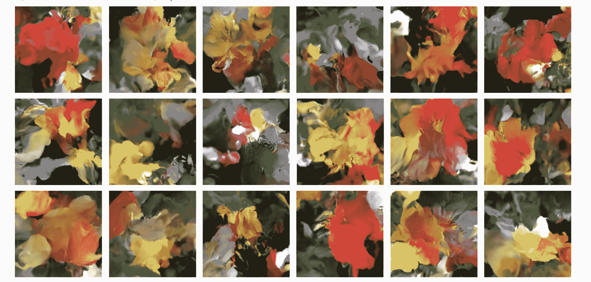

图 17.12：生成的花朵示例

你可以继续训练更长的时间，并得到越来越逼真的结果。

所以这就是扩散图像生成的工作原理！现在，下一步是解锁它们的潜力，添加*文本条件*，这将导致一个文本到图像模型，能够生成与给定文本标题匹配的图像。

## 文本到图像模型

我们可以使用相同的基本扩散过程来创建一个将文本输入映射到图像输出的模型。为此，我们需要一个预训练的文本编码器（例如第十五章中的 RoBERTa 这样的 transformer 编码器），它可以映射文本到连续嵌入空间中的向量。然后我们可以在`(prompt, image)`对上训练扩散模型，其中每个提示是输入图像的简短文本描述。

我们可以以前同样的方式处理图像输入，将噪声输入映射到去噪输出，逐渐接近我们的输入图像。关键的是，我们可以通过也将嵌入的文本提示传递给去噪模型来扩展这个设置。因此，我们的去噪模型不仅接受`noisy_images`输入，还将接受两个输入：`noisy_images`和`text_embeddings`。这使我们训练的先前花朵去噪器有了优势。模型不是在没有额外信息的情况下学习从图像中去除噪声，而是可以使用最终图像的文本表示来帮助指导去噪过程。

训练完成后，事情会变得更有趣。因为我们已经训练了一个可以将纯噪声映射到某些文本的向量表示的图像的条件上的模型，现在我们可以输入纯噪声和从未见过的提示，并将其去噪成图像。

让我们试试这个。在这本书中，我们实际上不会从头开始训练这样的模型——你已经有了所有需要的成分，但训练一个效果良好的文本到图像扩散模型既昂贵又耗时。相反，我们将使用 KerasHub 中一个流行的预训练模型 Stable Diffusion（图 17.13）。Stable Diffusion 是由一家名为 Stability AI 的公司制作的，该公司专门制作图像和视频生成的开源模型。我们只需几行代码就可以在 KerasHub 中使用他们图像生成模型的第三个版本：

```py
import keras_hub

height, width = 512, 512
task = keras_hub.models.TextToImage.from_preset(
    "stable_diffusion_3_medium",
    image_shape=(height, width, 3),
    # A trick to keep memory usage down. More details in chapter 18.
    dtype="float16",
)
prompt = "A NASA astraunaut riding an origami elephant in New York City"
task.generate(prompt) 
```

列表 17.8：创建一个稳定扩散文本到图像模型


图 17.13：我们的稳定扩散模型的一个示例输出

与我们在上一章中介绍的 `CausalLM` 任务类似，`TextToImage` 任务是一个高级类，用于根据文本输入进行图像生成。它将标记化和扩散过程封装成一个高级的生成调用。

稳定扩散模型实际上为其模型添加了一个第二个“负提示”，可以用来将扩散过程引导远离某些文本输入。这里没有什么魔法。要添加一个负提示，你可以简单地训练一个三元组模型：`(image, positive_prompt, negative_prompt)`，其中正提示是对图像的描述，而负提示是一系列不描述图像的词语。通过将正负文本嵌入输入到去噪器中，去噪器将学习引导噪声向与正提示匹配的图像，并远离与负提示匹配的图像（图 17.14）。让我们尝试从我们的输入中移除颜色蓝色：

```py
task.generate(
    {
        "prompts": prompt,
        "negative_prompts": "blue color",
    }
) 
```


图 17.14：使用负提示将模型引导远离蓝色

与我们在上一章中使用的文本模型的 `generate()` 方法类似，我们有一些额外的参数可以传递给模型以控制生成过程。让我们尝试向我们的模型传递一个可变的扩散步骤数，以查看去噪过程（图 17.15）的实际操作：

```py
import numpy as np
from PIL import Image

def display(images):
    return Image.fromarray(np.concatenate(images, axis=1))

display([task.generate(prompt, num_steps=x) for x in [5, 10, 15, 20, 25]]) 
```

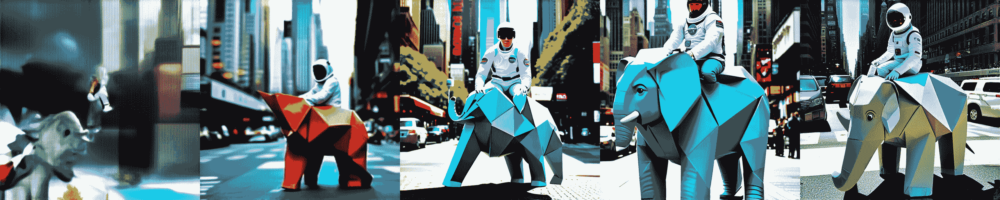

图 17.15：控制扩散步骤的数量

### 探索文本到图像模型的潜在空间

没有比文本扩散模型更好地看到深度神经网络插值性质的方法了。我们模型使用的文本编码器将学习一个平滑、低维流形来表示我们的输入提示。它是连续的，这意味着我们学习了一个空间，我们可以从一个提示的文本表示走到另一个提示的文本表示，每个中间点都将具有语义意义。我们可以将这一点与我们的扩散过程相结合，通过简单地用文本提示描述每个端状态来在两个图像之间进行形态变化。

在我们能够做到这一点之前，我们需要将我们的高级`generate()`函数分解成其组成部分。让我们试试看。

```py
from keras import random

def get_text_embeddings(prompt):
    token_ids = task.preprocessor.generate_preprocess([prompt])
    # We don't care about negative prompts here, but the model expects
    # them.
    negative_token_ids = task.preprocessor.generate_preprocess([""])
    return task.backbone.encode_text_step(token_ids, negative_token_ids)

def denoise_with_text_embeddings(embeddings, num_steps=28, guidance_scale=7.0):
    # Creates pure noise to denoise into an image
    latents = random.normal((1, height // 8, width // 8, 16))
    for step in range(num_steps):
        latents = task.backbone.denoise_step(
            latents,
            embeddings,
            step,
            num_steps,
            guidance_scale,
        )
    return task.backbone.decode_step(latents)[0]

# Rescales our images back to [0, 255]
def scale_output(x):
    x = ops.convert_to_numpy(x)
    x = np.clip((x + 1.0) / 2.0, 0.0, 1.0)
    return np.round(x * 255.0).astype("uint8")

embeddings = get_text_embeddings(prompt)
image = denoise_with_text_embeddings(embeddings)
scale_output(image) 
```

列表 17.9：分解`generate()`函数

我们生成过程有三个不同的步骤：

1.  首先，我们获取提示，对它们进行分词，并使用我们的文本编码器将它们嵌入。

1.  第二步，我们获取文本嵌入和纯噪声，并逐步将噪声“去噪”成图像。这与我们刚刚构建的花朵模型相同。

1.  最后，我们将模型输出从`[-1, 1]`映射回`[0, 255]`，这样我们就可以渲染图像。

这里有一点需要注意，我们的文本嵌入实际上包含四个不同的张量：

```py
>>> [x.shape for x in embeddings]
[(1, 154, 4096), (1, 154, 4096), (1, 2048), (1, 2048)]
```

与仅将最终的嵌入文本向量传递给去噪模型不同，Stable Diffusion 的作者选择传递最终的输出向量和文本编码器学习到的整个标记序列的最后表示。这实际上为我们去噪模型提供了更多的工作信息。作者对正向和负向提示都这样做，所以我们这里总共有四个张量：

+   正向提示的编码序列

+   负向提示的编码序列

+   正向提示的编码向量

+   负向提示的编码向量

将我们的`generate()`函数分解后，我们现在可以尝试在两个文本提示之间的潜在空间中行走。为了做到这一点，让我们构建一个在模型输出的文本嵌入之间进行插值的函数。

```py
from keras import ops

def slerp(t, v1, v2):
    v1, v2 = ops.cast(v1, "float32"), ops.cast(v2, "float32")
    v1_norm = ops.linalg.norm(ops.ravel(v1))
    v2_norm = ops.linalg.norm(ops.ravel(v2))
    dot = ops.sum(v1 * v2 / (v1_norm * v2_norm))
    theta_0 = ops.arccos(dot)
    sin_theta_0 = ops.sin(theta_0)
    theta_t = theta_0 * t
    sin_theta_t = ops.sin(theta_t)
    s0 = ops.sin(theta_0 - theta_t) / sin_theta_0
    s1 = sin_theta_t / sin_theta_0
    return s0 * v1 + s1 * v2

def interpolate_text_embeddings(e1, e2, start=0, stop=1, num=10):
    embeddings = []
    for t in np.linspace(start, stop, num):
        embeddings.append(
            (
                # The second and fourth text embeddings are for the
                # negative prompt, which we do not use.
                slerp(t, e1[0], e2[0]),
                e1[1],
                slerp(t, e1[2], e2[2]),
                e1[3],
            )
        )
    return embeddings 
```

列表 17.10：一个用于插值文本嵌入的函数

你会注意到我们使用了一个特殊的插值函数，称为`slerp`，在文本嵌入之间行走。这代表*球面线性插值*——这是一个在计算机图形学中使用了数十年的函数，用于在球体上插值点。

不要过于担心数学问题；对于我们这个例子来说，它并不重要，但理解动机是很重要的。如果我们想象我们的文本流形是一个球体，我们的两个提示是这个球体上的随机点，那么直接在这两点之间进行线性插值将会让我们落在球体内部。我们不再处于其表面。我们希望保持在由我们的文本嵌入学习到的光滑流形的表面上——这就是嵌入点对我们去噪模型有意义的所在。见图 17.16。

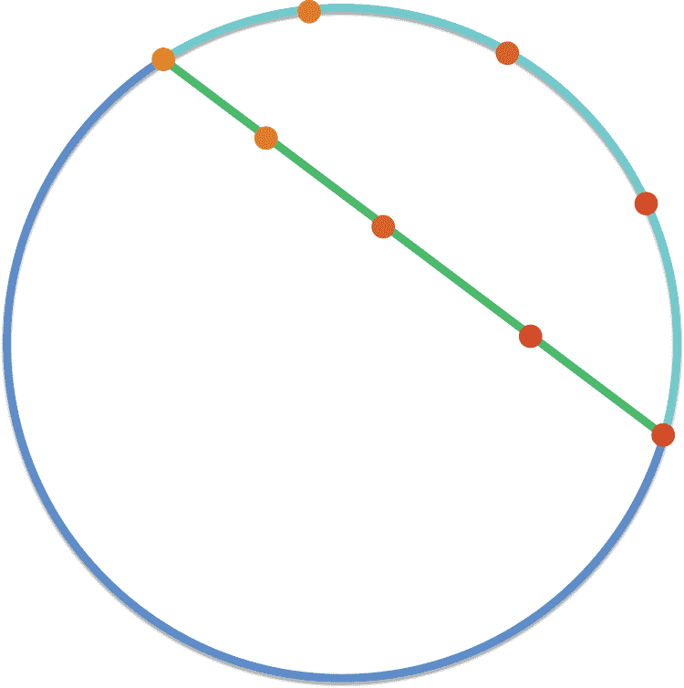

图 17.16：球面插值使我们接近流形的表面。

当然，我们文本嵌入模型学习到的流形实际上并不是球形的。但它是一个具有相同粗糙大小的数字的平滑表面——它是*球形的*，如果我们假设我们处于一个球体上，那么通过球面插值比如果我们假设我们处于一条线上进行插值要更好。

定义了我们的插值后，让我们尝试在两个提示之间的文本嵌入之间行走，并在每个插值输出处生成一个图像。我们将从 0.5 运行到 0.6（在 0 到 1 之间），以便在“形态”在视觉上变得明显时放大插值的中间部分（图 17.17）：

```py
prompt1 = "A friendly dog looking up in a field of flowers"
prompt2 = "A horrifying, tentacled creature hovering over a field of flowers"
e1 = get_text_embeddings(prompt1)
e2 = get_text_embeddings(prompt2)

images = []
# Zooms in to the middle of the overall interpolation from [0, 1]
for et in interpolate_text_embeddings(e1, e2, start=0.5, stop=0.6, num=9):
    image = denoise_with_text_embeddings(et)
    images.append(scale_output(image))
display(images) 
```

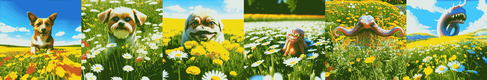

图 17.17：在两个提示之间进行插值并生成输出

第一次尝试时，这可能会感觉像魔法，但其中并没有什么魔法——插值是深度神经网络学习方式的基础。这将是我们在书中最后要讨论的实质性模型，它是一个很好的视觉隐喻来结束。深度神经网络是插值机器；它们将复杂、现实世界的概率分布映射到低维流形上。我们可以利用这一事实，即使对于像人类语言这样复杂的输入和像自然图像这样复杂的输出也是如此。

## 摘要

+   使用深度学习进行图像生成是通过学习捕获图像数据集统计信息的潜在空间来完成的。通过从潜在空间中采样和解码点，你可以生成从未见过的图像。为此有三个主要工具：VAEs、扩散模型和 GANs。

+   VAEs 导致高度结构化的、连续的潜在表示。因此，它们非常适合在潜在空间中进行各种图像编辑：人脸交换、将皱眉的脸变成微笑的脸等等。它们也适合进行基于潜在空间的动画，例如在潜在空间的横截面上进行行走动画，显示起始图像以连续的方式缓慢地变成不同的图像。

+   扩散模型产生非常逼真的输出，并且是目前图像生成的主要方法。它们通过从纯噪声开始反复去噪图像来工作。它们可以很容易地根据文本标题进行条件化，以创建文本到图像模型。

+   Stable Diffusion 3 是一个最先进的预训练文本到图像模型，你可以用它来创建你自己的高度逼真的图像。

+   这种文本到图像扩散模型学习的视觉潜在空间本质上是插值的。你可以通过在用于扩散过程的文本嵌入之间进行插值，并实现输出图像之间的平滑插值来看到这一点。

### 脚注

1.  Diederik P. Kingma 和 Max Welling, “Auto-Encoding Variational Bayes,” arXiv (2013), [`arxiv.org/abs/1312.6114`](https://arxiv.org/abs/1312.6114). [[↩]](#footnote-link-1)

1.  Danilo Jimenez Rezende, Shakir Mohamed, 和 Daan Wierstra, “Stochastic Backpropagation and Approximate Inference in Deep Generative Models,” arXiv (2014), [`arxiv.org/abs/1401.4082`](https://arxiv.org/abs/1401.4082). [[↩]](#footnote-link-2)
