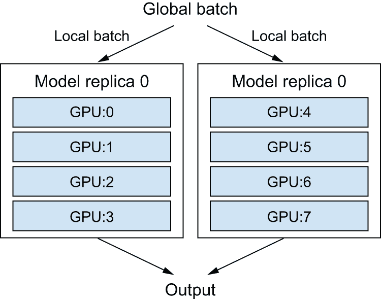

# 现实世界的最佳实践

> [`deeplearningwithpython.io/chapters/chapter18_best-practices-for-the-real-world`](https://deeplearningwithpython.io/chapters/chapter18_best-practices-for-the-real-world)

自从这本书的开头以来，你已经取得了很大的进步。你现在可以训练图像分类模型、图像分割模型、对向量数据进行分类或回归的模型、时间序列预测模型、文本分类模型、序列到序列模型，甚至是文本和图像的生成模型。你已经涵盖了所有的基础。

然而，你迄今为止的所有模型都是在小规模上训练的——在小型数据集上，使用单个 GPU——并且它们通常没有达到我们所查看的每个数据集上所能达到的最佳性能。毕竟，这本书是一本入门书。如果你要进入现实世界并在全新的问题上取得最先进的结果，你仍然需要跨越一段不小的鸿沟。

本章旨在弥合这一差距，并为你从机器学习学生成长为一名合格的机器学习工程师提供最佳实践。我们将回顾系统性地提高模型性能的必要技术：超参数调整和模型集成。然后，我们将探讨如何通过多 GPU 和 TPU 训练、混合精度和量化来加速和扩展模型训练。

## 充分发挥你的模型潜力

如果你只需要一个过得去的东西，那么盲目尝试不同的架构配置已经足够好了。在本节中，我们将通过一套必须掌握的技术的快速指南，从“过得去”提升到“表现卓越并赢得机器学习竞赛”。

### 超参数优化

当构建一个深度学习模型时，你必须做出许多看似随意的决定：你应该堆叠多少层？每一层应该有多少个单元或过滤器？你应该使用`relu`作为激活函数，还是使用不同的函数？你应该在给定的层之后使用`BatchNormalization`吗？你应该使用多少 dropout？等等。这些架构级别的参数被称为*超参数*，以区分它们与通过反向传播训练的模型的*参数*。

在实践中，经验丰富的机器学习工程师和研究人员随着时间的推移对什么有效，什么无效有了直觉——他们发展了超参数调整技能。但没有正式的规则。如果你想达到给定任务可以实现的极限，你不能满足于这样的任意选择。你的初始决策几乎总是次优的，即使你非常有直觉。你可以通过手动调整并重复训练模型来细化你的选择——这就是机器学习工程师和研究人员大部分时间在做的事情。但整天调整超参数不应是你的工作——这最好留给机器。

因此，你需要以原则性的方式自动和系统地探索可能的决策空间。你需要搜索架构空间，并经验性地找到表现最佳的模型。这正是自动超参数优化领域的主题：这是一个完整的研究领域，也是一个重要的领域。

优化超参数的过程通常如下所示：

1.  选择一组超参数（自动）。

1.  构建相应的模型。

1.  将其拟合到你的训练数据，并在验证数据上衡量性能。

1.  选择下一组要尝试的超参数（自动）。

1.  重复。

1.  最终，在你的测试数据上衡量性能。

这个过程的关键是分析验证性能与各种超参数值之间关系的算法，以选择下一组要评估的超参数。可能有许多不同的技术：贝叶斯优化、遗传算法、简单的随机搜索等等。

训练模型的权重相对容易：你在一个数据的小批量上计算损失函数，然后使用反向传播将权重移动到正确的方向。另一方面，更新超参数则提出了独特的挑战。考虑以下情况：

+   超参数空间通常由离散决策组成，因此不是连续的或可微分的。因此，你通常不能在超参数空间中进行梯度下降。相反，你必须依赖无梯度优化技术，这些技术自然比梯度下降效率低得多。

+   计算这个优化过程的反馈信号（这组超参数是否会导致在这个任务上表现良好的模型？）可能非常昂贵：它需要从头开始创建和训练一个新的模型。

+   反馈信号可能存在噪声：如果一次训练运行提高了 0.2%，这是否是因为更好的模型配置，还是因为你初始权重值运气好？

幸运的是，有一个工具可以使超参数调整更简单：KerasTuner。让我们来看看它。

#### 使用 KerasTuner

让我们从安装 KerasTuner 开始：

```py
!pip install keras-tuner -q 
```

KerasTuner 建立在其核心思想之上，即让你用一系列可能的选择，如 `Int(name="units", min_value=16, max_value=64, step=16)`，来替换硬编码的超参数值，如 `units=32`。在给定模型中，这样的选择集合被称为超参数调优过程的 *搜索空间*。

要指定搜索空间，定义一个模型构建函数（参见下一列表）。它接受一个 `hp` 参数，你可以从中采样超参数范围，并返回一个编译好的 Keras 模型。

```py
import keras
from keras import layers

def build_model(hp):
    # Sample hyperparameter values from the hp object. After sampling,
    # these values (such as the "units" variable here) are just regular
    # Python constants.
    units = hp.Int(name="units", min_value=16, max_value=64, step=16)
    model = keras.Sequential(
        [
            layers.Dense(units, activation="relu"),
            layers.Dense(10, activation="softmax"),
        ]
    )
    # Different kinds of hyperparameters are available: Int, Float,
    # Boolean, Choice.
    optimizer = hp.Choice(name="optimizer", values=["rmsprop", "adam"])
    model.compile(
        optimizer=optimizer,
        loss="sparse_categorical_crossentropy",
        metrics=["accuracy"],
    )
    # The function returns a compiled model.
    return model 
```

列表 18.1：一个 KerasTuner 模型构建函数

如果你想要采用更模块化和可配置的方法来构建模型，你也可以从 `HyperModel` 类中派生出一个子类，并定义一个 `build` 方法。

```py
import keras_tuner as kt

class SimpleMLP(kt.HyperModel):
    # Thanks to the object-oriented approach, we can configure model
    # constants as constructor arguments (instead of hardcoding them in
    # the model-building function).
    def __init__(self, num_classes):
        self.num_classes = num_classes

    # The build method is identical to our prior build_model standalone
    # function.
    def build(self, hp):
        units = hp.Int(name="units", min_value=16, max_value=64, step=16)
        model = keras.Sequential(
            [
                layers.Dense(units, activation="relu"),
                layers.Dense(self.num_classes, activation="softmax"),
            ]
        )
        optimizer = hp.Choice(name="optimizer", values=["rmsprop", "adam"])
        model.compile(
            optimizer=optimizer,
            loss="sparse_categorical_crossentropy",
            metrics=["accuracy"],
        )
        return model

hypermodel = SimpleMLP(num_classes=10) 
```

列表 18.2：一个 KerasTuner `HyperModel`

下一步是定义一个“调谐器”。从概念上讲，你可以将调谐器视为一个 `for` 循环，它将反复

+   选择一组超参数值

+   使用这些值调用模型构建函数以创建一个模型

+   训练模型并记录其指标

KerasTuner 有几个内置的调谐器可用——`RandomSearch`、`BayesianOptimization` 和 `Hyperband`。让我们尝试 `BayesianOptimization`，这是一个尝试根据先前选择的成果来智能预测哪些新的超参数值可能表现最佳的调谐器：

```py
tuner = kt.BayesianOptimization(
    # Specifies the model-building function (or hypermodel instance)
    build_model,
    # Specifies the metric that the tuner will seek to optimize. Always
    # specify validation metrics, since the goal of the search process
    # is to find models that generalize!
    objective="val_accuracy",
    # Maximum number of different model configurations ("trials") to
    # try before ending the search
    max_trials=20,
    # To reduce metrics variance, you can train the same model multiple
    # times and average the results. executions_per_trial is how many
    # training rounds (executions) to run for each model configuration
    # (trial).
    executions_per_trial=2,
    # Where to store search logs
    directory="mnist_kt_test",
    # Whether to overwrite data in the directory to start a new search.
    # Set this to True if you've modified the model-building function
    # or to False to resume a previously started search with the same
    # model-building function.
    overwrite=True,
) 
```

你可以通过 `search_space_summary()` 显示搜索空间的概述：

```py
>>> tuner.search_space_summary()
Search space summary
Default search space size: 2
units (Int)
{"default": None,
 "conditions": [],
 "min_value": 128,
 "max_value": 1024,
 "step": 128,
 "sampling": None}
optimizer (Choice)
{"default": "rmsprop",
 "conditions": [],
 "values": ["rmsprop", "adam"],
 "ordered": False}
```

最后，让我们启动搜索。别忘了传递验证数据，并确保不要使用测试集作为验证数据——否则，你很快就会开始对测试数据过拟合，而且你将无法再信任你的测试指标：

```py
(x_train, y_train), (x_test, y_test) = keras.datasets.mnist.load_data()
x_train = x_train.reshape((-1, 28 * 28)).astype("float32") / 255
x_test = x_test.reshape((-1, 28 * 28)).astype("float32") / 255
# Reserves these for later
x_train_full = x_train[:]
y_train_full = y_train[:]
# Sets aside a validation set
num_val_samples = 10000
x_train, x_val = x_train[:-num_val_samples], x_train[-num_val_samples:]
y_train, y_val = y_train[:-num_val_samples], y_train[-num_val_samples:]
callbacks = [
    # Uses a large number of epochs (you don't know in advance how many
    # epochs each model will need) and uses an EarlyStopping callback
    # to stop training when you start overfitting
    keras.callbacks.EarlyStopping(monitor="val_loss", patience=5),
]
# This takes the same arguments as fit() (it simply passes them down to
# fit() for each new model).
tuner.search(
    x_train,
    y_train,
    batch_size=128,
    epochs=100,
    validation_data=(x_val, y_val),
    callbacks=callbacks,
    verbose=2,
) 
```

由于我们只查看几个可能的选择，并且在 MNIST 上进行训练，所以前面的例子只需几分钟就能运行。然而，在典型的搜索空间和数据集上，你通常会发现自己让超参数搜索运行一整夜，甚至几天。如果你的搜索过程崩溃，你总是可以重新启动它——只需在调谐器中指定 `overwrite=False`，这样它就可以从存储在磁盘上的试验日志中恢复。

一旦搜索完成，你可以查询最佳超参数配置，这些配置可以用来创建高性能模型，然后你可以重新训练这些模型。

```py
top_n = 4
# Returns a list of HyperParameters objects, which you can pass to the
# model-building function
best_hps = tuner.get_best_hyperparameters(top_n) 
```

列表 18.3：查询最佳超参数配置

通常，当你重新训练这些模型时，你可能希望将验证数据作为训练数据的一部分，因为你不会进行任何进一步的超参数更改，因此你将不再在验证数据上评估性能。在我们的例子中，我们将使用原始 MNIST 训练数据的全部来训练这些最终模型，而不保留验证集。

在我们能够对全部训练数据进行训练之前，尽管如此，我们还需要解决最后一个参数：训练的最佳轮数。通常，你希望对新模型进行比搜索期间更长时间的训练：在`EarlyStopping`回调中使用激进的`patience`值可以在搜索过程中节省时间，但可能会导致模型欠拟合。只需使用验证集来找到最佳的轮数：

```py
def get_best_epoch(hp):
    model = build_model(hp)
    callbacks = [
        keras.callbacks.EarlyStopping(
            # Note the very high patience value.
            monitor="val_loss", mode="min", patience=10
        )
    ]
    history = model.fit(
        x_train,
        y_train,
        validation_data=(x_val, y_val),
        epochs=100,
        batch_size=128,
        callbacks=callbacks,
    )
    val_loss_per_epoch = history.history["val_loss"]
    best_epoch = val_loss_per_epoch.index(min(val_loss_per_epoch)) + 1
    print(f"Best epoch: {best_epoch}")
    return best_epoch 
```

最后，由于你正在训练更多的数据——在这个例子中是 20%更多的数据——所以你需要在这个轮数的基础上再训练一段时间：

```py
def get_best_trained_model(hp):
    best_epoch = get_best_epoch(hp)
    model = build_model(hp)
    model.fit(
        x_train_full, y_train_full, batch_size=128, epochs=int(best_epoch * 1.2)
    )
    return model

best_models = []
for hp in best_hps:
    model = get_best_trained_model(hp)
    model.evaluate(x_test, y_test)
    best_models.append(model) 
```

如果你不太担心稍微低一点的性能，你可以采取一个捷径：只需使用调整器重新加载在超参数搜索期间保存的最佳权重下的顶级性能模型，而无需从头开始重新训练新模型：

```py
best_models = tuner.get_best_models(top_n) 
```

#### 构建正确搜索空间的艺术

总体而言，超参数优化是一种强大的技术，对于在任何任务上达到最先进的模型或赢得机器学习竞赛来说是绝对必要的。想想看：曾经，人们手工制作了浅层机器学习模型中的特征。那是非常低效的。现在深度学习自动化了层次特征工程的任务——特征是通过反馈信号学习的，而不是手工调整的，这就是应该的方式。同样，你不应该手工制作你的模型架构；你应该以原则性的方式优化它们。

然而，进行超参数调整并不能取代熟悉模型架构的最佳实践：随着选择数量的增加，搜索空间呈组合式增长，因此将所有内容都变成超参数并让调整器处理它将非常昂贵。你需要聪明地设计合适的搜索空间。超参数调整是自动化，而不是魔法：你使用它来自动化你本应手动运行的实验，但你仍然需要手动选择有潜力产生良好指标的实验配置。

好消息是：通过使用超参数调整，你必须做出的配置决策从微观决策（我该为这一层选择多少个单元？）升级到更高层次的架构决策（我是否应该在整个模型中使用残差连接？）。虽然微观决策特定于某个模型和某个数据集，但更高层次的决策在不同任务和数据集上具有更好的泛化能力：例如，几乎每个图像分类问题都可以通过相同类型的搜索空间模板来解决。

按照这个逻辑，KerasTuner 试图提供与广泛问题类别相关的*预先准备好的搜索空间*——例如图像分类。只需添加数据，运行搜索，就能得到一个相当不错的模型。你可以尝试超模型`kt.applications.HyperXception`和`kt.applications.HyperResNet`，它们实际上是 Keras Applications 模型的可调整版本。

### 模型集成

在一个任务上获得最佳可能结果的一种强大技术是*模型集成*。集成包括将一组不同模型的预测汇总起来以产生更好的预测。如果你查看机器学习竞赛——特别是在 Kaggle 上——你会发现赢家使用非常大的模型集成，这不可避免地会击败任何单个模型，无论其多么优秀。

集成依赖于这样的假设：独立训练的不同表现良好的模型可能因不同的原因而表现良好：每个模型查看数据的不同方面来做出预测，获得部分“真相”但不是全部。你可能熟悉古老的寓言《盲人摸象》：一群盲人第一次遇到大象，试图通过触摸它来理解大象是什么。每个盲人都触摸到大象身体的不同部分——只触摸一部分，比如鼻子或腿。然后盲人们向彼此描述大象是什么：“它像一条蛇”，“像一根柱子或一棵树”，等等。盲人们本质上是在尝试从自己的视角、使用自己的假设（由模型的独特架构和独特的随机权重初始化提供）来理解训练数据的机器学习模型。每个模型都获得了数据的一部分真相，但不是全部真相。通过汇总他们的视角，你可以得到对数据的更准确描述。大象是各个部分的组合：没有哪个盲人能完全正确地描述它，但当他们一起接受采访时，他们可以讲述一个相当准确的故事。

让我们以分类为例。将一组分类器的预测（即*集成分类器*）进行汇总的最简单方法是在推理时平均它们的预测：

```py
# Uses four different models to compute initial predictions
preds_a = model_a.predict(x_val)
preds_b = model_b.predict(x_val)
preds_c = model_c.predict(x_val)
preds_d = model_d.predict(x_val)
# This new prediction array should be more accurate than any of the
# initial ones.
final_preds = 0.25 * (preds_a + preds_b + preds_c + preds_d) 
```

然而，这只有在分类器大致相同的情况下才会有效。如果其中之一明显比其他分类器差得多，最终的预测可能不会像该组中最好的分类器那样好。

一种更智能的集成分类器的方式是进行加权平均，其中权重是在验证数据上学习的——通常，表现更好的分类器会得到更高的权重，而表现较差的分类器会得到较低的权重。为了寻找一组好的集成权重，你可以使用随机搜索或简单的优化算法，例如 Nelder-Mead 算法：

```py
preds_a = model_a.predict(x_val)
preds_b = model_b.predict(x_val)
preds_c = model_c.predict(x_val)
preds_d = model_d.predict(x_val)
# These weights (0.5, 0.25, 0.1, 0.15) are assumed to be learned
# empirically.
final_preds = 0.5 * preds_a + 0.25 * preds_b + 0.1 * preds_c + 0.15 * preds_d 
```

有许多可能的变体：例如，你可以对预测的指数进行平均。一般来说，在验证数据上优化的简单加权平均提供了一个非常强大的基线。

使集成有效果的关键是分类器集的*多样性*。多样性是力量。如果所有盲人只触摸大象的鼻子，他们会同意大象像蛇一样，他们将永远不知道大象的真实情况。多样性是使集成工作起来的因素。在机器学习的术语中，如果你的所有模型都以相同的方式有偏差，那么你的集成将保留这种相同的偏差。如果你的模型以*不同的方式*有偏差，偏差将相互抵消，集成将更加稳健和准确。

因此，你应该集成尽可能好且尽可能不同的模型。这通常意味着使用非常不同的架构，甚至使用不同的机器学习方法的品牌。一件在很大程度上不值得做的事情是集成多次独立训练的相同网络，从不同的随机初始化开始。如果你的模型之间唯一的区别是它们的随机初始化以及它们接触训练数据的顺序，那么你的集成将缺乏多样性，并且只会对任何单个模型提供微小的改进。

我在实践中发现了一件事效果很好——但这并不适用于每个问题领域——那就是使用基于树的多种方法的集成（例如随机森林或梯度提升树）和深度神经网络。2014 年，我和安德烈·科列夫在 Kaggle（www.kaggle.com/c/higgs-boson）的希格斯玻色子衰变检测挑战中获得了第四名，我们使用了各种基于树的模型和深度神经网络的集成。令人惊讶的是，集成中的一个模型来自与其他不同的方法（它是一个正则化贪婪森林），并且比其他模型得分显著更低。不出所料，它在集成中被分配了很小的权重。但令我们惊讶的是，它最终通过其与其他模型如此不同而大幅提高了整体集成的性能：它提供了其他模型无法获得的信息。这正是集成的目的。这不仅仅关乎你的最佳模型有多好；这关乎你候选模型集的多样性。

## 使用多设备扩展模型训练

回想一下我们在第七章中介绍的“进步循环”概念：你想法的质量是它们经过多少次精炼循环的函数（见图 18.1）。而你对一个想法进行迭代的速度取决于你设置实验的速度、运行实验的速度，以及最终分析结果数据的能力。


图 18.1：进步循环

随着你对 Keras API 的专长发展，你编写深度学习实验的速度将不再是这个进步周期的瓶颈。下一个瓶颈将变成你训练模型的速度。快速训练基础设施意味着你可以在 10 或 15 分钟内得到结果，因此你可以每天进行数十次迭代。更快的训练直接提高了你的深度学习解决方案的*质量*。

在本节中，你将了解如何通过使用多个 GPU 或 TPU 来扩展你的训练运行。

### 多 GPU 训练

虽然 GPU 每年都在变得更强大，但深度学习模型也在变得越来越庞大，需要更多的计算资源。在单个 GPU 上训练对移动速度的速度设定了一个硬限制。解决方案？你可以简单地添加更多的 GPU 并开始进行*多 GPU 分布式训练*。

在多个设备上分配计算有两种方式：*数据并行*和*模型并行*。

使用数据并行，单个模型在多个设备或多个机器上被复制。每个模型副本处理不同的数据批次，然后合并他们的结果。

使用模型并行，单个模型的不同部分在不同的设备上运行，同时处理单个数据批次。这对于具有自然并行架构的模型效果最好，例如具有多个分支的模型。在实践中，模型并行仅在模型太大而无法适应任何单个设备的情况下使用：它不是用作加速常规模型训练的方法，而是用作训练更大模型的方法。

然后，当然，你也可以混合使用数据并行和模型并行：单个模型可以跨多个设备（例如，4 个）分割，并且分割后的模型可以在多个设备组（例如，两次，总共使用 2 * 4 = 8 个设备）。

让我们详细看看它是如何工作的。

#### 数据并行：在每个 GPU 上复制你的模型

数据并行是分布式训练中最常见的形式。它基于一个简单的原则：分而治之。每个 GPU 接收整个模型的副本，称为*副本*。传入的数据批次被分成*N*个子批次，每个子批次由一个模型副本并行处理。这就是为什么它被称为*数据并行*：不同的样本（数据点）是并行处理的。例如，如果有两个 GPU，大小为 128 的批次将被分成两个大小为 64 的子批次，由两个模型副本处理。然后

+   *在推理* — 我们将检索每个子批次的预测并将它们连接起来以获得整个批次的预测。

+   *在训练过程中*——我们会检索每个子批次的梯度，计算平均值，并根据梯度平均值更新所有模型副本。然后，模型的状态将与你在 128 个样本的全批次上训练时相同。这被称为*同步*训练，因为所有副本都保持同步——它们的权重在所有时间点都有相同的值。存在非同步的替代方案，但它们效率较低，并且在实践中不再使用。

数据并行是一种简单且高度可扩展的方式来加速你的模型训练。如果你获得更多设备，只需增加你的批次大小，你的训练吞吐量就会相应增加。然而，它有一个限制：它要求你的模型能够适应你的某个设备。然而，现在训练具有数十亿参数的基础模型是很常见的，这些模型无法适应任何单个 GPU。

#### 模型并行：将你的模型分割到多个 GPU 上

这就是*模型并行*的作用所在。虽然数据并行是通过将你的数据批次分割成子批次并在并行处理子批次来工作的，但模型并行是通过将你的模型分割成子模型，并在不同的设备上并行运行每个子模型来工作的。例如，考虑以下模型。

```py
model = keras.Sequential(
    [
        keras.layers.Input(shape=(16000,)),
        keras.layers.Dense(64000, activation="relu"),
        keras.layers.Dense(8000, activation="sigmoid"),
    ]
) 
```

列表 18.4：一个大型密集连接模型

每个样本有 16,000 个特征，并通过两个`Dense`层被分类到 8,000 个可能重叠的类别中。这些层很大——第一个大约有 10 亿个参数，最后一个大约有 5.12 亿个参数。如果你使用的是两个小设备，你将无法使用数据并行，因为你无法将模型拟合到单个设备上。你可以做的是将单个模型实例分割到多个设备上。这通常被称为*分片*或*分区*模型。在设备间分割模型主要有两种方式：水平分区和垂直分区。

在水平分区中，每个设备处理模型的不同层。例如，在之前的模型中，一个 GPU 会处理第一个`Dense`层，而另一个 GPU 会处理第二个`Dense`层。这种方法的缺点主要是可能会引入通信开销。例如，第一层的输出需要在第二层处理之前被复制到第二个设备上。这可能会成为瓶颈，尤其是如果第一层的输出很大——你可能会冒着让 GPU 闲置的风险。

在垂直分区中，每一层都分布在所有可用设备上。由于层通常是用 `matmul` 或 `convolution` 操作实现的，这些操作高度可并行化，因此在实践中实现这种策略很容易，并且几乎总是大型模型的最佳选择。例如，在先前的模型中，你可以将第一个 `Dense` 层的内核和偏置分成两半，这样每个设备只接收形状为 `(16000, 32000)` 的内核（沿其最后一个轴分割）和形状为 `(32000,)` 的偏置。你将使用这个半内核和半偏置对每个设备进行 `matmul(inputs, kernel) + bias` 计算，然后通过以下方式连接两个输出：

```py
half_kernel_0 = kernel[:, :32000]
half_bias_0 = bias[:32000]

half_kernel_1 = kernel[:, 32000:]
half_bias_1 = bias[32000:]

with keras.device("gpu:0"):
    half_output_0 = keras.ops.matmul(inputs, half_kernel_0) + half_bias_0

with keras.device("gpu:1"):
    half_output_1 = keras.ops.matmul(inputs, half_kernel_1) + half_bias_1 
```

实际上，你将想要混合数据并行性和模型并行性。你将把你的模型分布在，比如说，四个设备上，然后你将在多个两组设备中复制那个分割的模型——比如说两组——每组并行处理一个子批次的数据。然后你将有两个副本，每个副本在四个设备上运行，总共使用八个设备（图 18.2）。



图 18.2：将模型分布在八个设备上：两个模型副本，每个由四组设备处理

### 实践中的分布式训练

现在我们来看看如何在实践中实现这些概念。我们只会涵盖 JAX 后端，因为它是各种 Keras 后端中最高效和最可扩展的，远远超过其他后端。如果你在进行任何类型的大规模分布式训练，而你没有使用 JAX，那么你正在犯一个错误——并且浪费你的美元，消耗了比你实际需要的计算资源多得多的计算。

#### 获取两个或更多 GPU

首先，你需要获取几个 GPU 的访问权限。到目前为止，Google Colab 只允许你使用单个 GPU，所以你需要做以下两件事之一：

+   获取两个到八个 GPU，将它们安装在一台机器上（这将需要一个强大的电源），并安装 CUDA 驱动程序、cuDNN 等。对大多数人来说，这不是最佳选择。

+   在 Google Cloud、Azure 或 AWS 上租用多 GPU 虚拟机（VM）。你将能够使用预安装驱动程序和软件的 VM 镜像，并且设置开销非常小。这可能是对那些不是全天候训练模型的人来说的最佳选择。

我们不会详细介绍如何启动多 GPU 云虚拟机，因为这样的说明相对短暂，并且这些信息在网上很容易找到。

#### 在 JAX 中使用数据并行性

在 Keras 和 JAX 中使用数据并行性非常简单：在构建你的模型之前，只需添加以下代码行：

```py
keras.distribution.set_distribution(keras.distribution.DataParallel()) 
```

就这些。

如果你想要更细粒度的控制，你可以指定你想要使用的设备。你可以通过以下方式列出可用设备：

```py
keras.distribution.list_devices() 
```

它将返回一个字符串列表——你的设备名称，例如 `"gpu:0"`、`"gpu:1"` 等等。然后你可以将这些传递给 `DataParallel` 构造函数：

```py
keras.distribution.set_distribution(
    keras.distribution.DataParallel(["gpu:0", "gpu:1"])
) 
```

在理想的世界里，在*N*个 GPU 上训练将导致加速因子为*N*。然而，在实践中，分布引入了一些开销——特别是，合并来自不同设备的权重变化需要一些时间。你获得的有效加速是所用 GPU 数量的函数：

+   使用两个 GPU 时，加速保持在 2×左右。

+   使用四个时，加速大约为 3.8×。

+   使用八个时，大约为 7.3×。

这假设你使用足够大的全局批次大小，以保持每个 GPU 的满负荷运行。如果你的批次大小太小，本地批次大小将不足以保持 GPU 忙碌。

#### 使用 JAX 进行模型并行

Keras 还提供了强大的工具，可以完全自定义你想要如何进行分布式训练，包括模型并行训练以及你可以想象的数据并行和模型并行训练的任何混合。让我们深入了解。

##### DeviceMesh API

首先，你需要理解**设备网格**的概念。设备网格简单地说就是设备网格。考虑以下示例，有八个 GPU：

```py
gpu:0   |   gpu:4
--------|---------
gpu:1   |   gpu:5
--------|---------
gpu:2   |   gpu:6
--------|---------
gpu:3   |   gpu:7 
```

主要思想是将设备分为组，沿着轴组织。通常，一个轴将负责数据并行，另一个轴将负责模型并行（如图 18.2 所示，你的设备形成一个网格，其中水平轴处理数据并行，垂直轴处理模型并行）。

设备网格不必是二维的——它可以是你想要的任何形状。然而，在实践中，你只会看到一维和二维网格。

让我们在 Keras 中创建一个 2×4 的设备网格：

```py
device_mesh = keras.distribution.DeviceMesh(
    # We assume eight devices, organized as a 2 × 4 grid.
    shape=(2, 4),
    # It's convenient to give your axes meaningful names!
    axis_names=["data", "model"],
) 
```

请注意，你也可以明确指定你想要使用的设备：

```py
devices = [f"gpu:{i}" for i in range(8)]
device_mesh = keras.distribution.DeviceMesh(
    shape=(2, 4),
    axis_names=["data", "model"],
    devices=devices,
) 
```

如您从`axis_names`参数中猜到的，我们打算使用轴 0 上的设备进行数据并行，轴 1 上的设备进行模型并行。由于轴 0 上有两个设备，轴 1 上有四个，我们将把模型计算分配到四个 GPU 上，并将我们的分割模型复制两次，并行地在不同子批次的数据上运行。

现在我们有了网格，我们需要告诉 Keras 如何将不同的计算部分分配到我们的设备上。为此，我们将使用`LayoutMap` API。

##### LayoutMap API

为了指定不同的计算部分应该在何处进行，我们使用**变量**作为我们的参考框架。我们将分割或复制变量到我们的设备上，并将所有与该变量部分相关的计算移动到相应的设备上。

考虑一个变量。它的形状是，比如说，`(32, 64)`。你可以对这个变量做两件事：

+   你可以在网格的轴上**复制**（复制）它，这样沿着该轴的每个设备都能看到相同的值。

+   你可以在网格的轴上**分割**（拆分）它——例如，你可以将其分割成四个形状为`(32, 16)`的块——这样沿着该轴的每个设备都能看到不同的块。

现在，请注意我们的变量有两个维度。重要的是，“分片”或“复制”是你可以独立为变量的每个维度做出的决定。

你将用来告诉 Keras 这些决定的 API 是`LayoutMap`类。`LayoutMap`类似于字典。它将模型变量（例如，你模型中第一个密集层的核变量）映射到关于该变量如何在设备网格上复制或分片的一些信息。具体来说，它将一个*变量路径*映射到一个元组，该元组有与变量维度一样多的条目，其中每个条目指定了对该变量维度的操作。它看起来像这样：

```py
{
    # None means "replicate the variable along this dimension."
    "sequential/dense_1/kernel": (None, "model"),
    # "model" means "shard the variable along this dimension across the
    # devices of the model axis of the device mesh."
    "sequential/dense_1/bias": ("model",),
    ...
} 
```

这是你第一次遇到*变量路径*的概念——它只是一个看起来像`"sequential/dense_1/kernel"`的字符串标识符。这是一个在不保留实际变量实例的情况下引用变量的有用方式。

这是你可以打印模型中所有变量路径的方法：

```py
for v in model.variables:
    print(v.path) 
```

在列表 18.4 的示例模型中，我们得到的结果如下：

```py
sequential/dense/kernel
sequential/dense/bias
sequential/dense_1/kernel
sequential/dense_1/bias 
```

现在，让我们分片和复制这些变量。对于这样一个简单的模型，你的变量分片的基本规则应该是这样的：

+   沿着`"model"`网格轴分片变量的最后一个维度。

+   将所有其他维度保持为复制状态。

简单吧？就像这样：

```py
layout_map = keras.distribution.LayoutMap(device_mesh)
layout_map["sequential/dense/kernel"] = (None, "model")
layout_map["sequential/dense/bias"] = ("model",)
layout_map["sequential/dense_1/kernel"] = (None, "model")
layout_map["sequential/dense_1/bias"] = ("model",) 
```

最后，我们通过设置分布配置来告诉 Keras 在实例化变量时参考这个分片布局，如下所示：

```py
model_parallel = keras.distribution.ModelParallel(
    layout_map=layout_map,
    # This argument tells Keras to use the mesh axis named "data" for
    # data parallelism.
    batch_dim_name="data",
)
keras.distribution.set_distribution(model_parallel) 
```

一旦设置了分布配置，你就可以创建你的模型并使用`fit()`函数来拟合它。你的代码的其他部分不会改变——你的模型定义代码和训练代码都是相同的。这适用于你使用内置的 API 如`fit()`和`evaluate()`，或者使用你自己的训练逻辑。假设你为你的变量有了正确的`LayoutMap`，你刚才看到的简短代码片段就足以分配任何大型语言模型训练运行的计算——它可以扩展到你拥有的任何数量的设备，以及任意大小的模型。

要检查你的变量是如何分片的，你可以检查`variable.value.sharding`属性，如下所示：

```py
>>> model.layers[0].kernel.value.sharding
NamedSharding(
    mesh=Mesh("data": 2, "model": 4),
    spec=PartitionSpec(None, "model")
)
```

你甚至可以通过 JAX 实用工具`jax.debug.visualize_sharding`来可视化它：

```py
import jax

value = model.layers[0].kernel.value
jax.debug.visualize_sharding(value.shape, value.sharding) 
```

### TPU 训练

除了 GPU 之外，在深度学习领域，通常有一个趋势是将工作流程转移到为深度学习工作流程专门设计的越来越专业的硬件上；这样的专用芯片被称为 ASIC（应用特定集成电路）。大小各种公司都在开发新的芯片，但今天在这一领域最突出的努力是谷歌的 Tensor Processing Unit (TPU)，它可在谷歌云和谷歌 Colab 上使用。

在 TPU 上训练确实需要跳过一些障碍。但这是值得的：TPU 真的非常快。在 Colab 上可用的 TPU v2（NVIDIA P100 GPU）上训练通常比训练快 15 倍。对于大多数模型，TPU 训练的平均成本效益比 GPU 训练高 3 倍。

你实际上可以在 Colab 中免费使用 TPU v2。在 Colab 菜单中，在“Runtime”选项卡下，在“Change Runtime Type”选项中，你会注意到除了 GPU 运行时之外，你还可以访问 TPU 运行时。对于更严肃的训练运行，Google Cloud 还提供了从 v3 到 v5 的 TPU，它们甚至更快。

当在启用 TPU 的笔记本上使用 JAX 后端运行 Keras 代码时，你不需要做任何更多的事情，只需调用`keras.distribution.set_distribution(distribution)`并传入一个`DataParallel`或`ModelParallel`分布实例即可开始使用你的 TPU 核心。确保在创建模型之前调用它！

#### 使用步骤融合来提高 TPU 利用率

由于 TPU 拥有大量的计算能力，你需要使用非常大的批次来保持 TPU 核心忙碌。对于小型模型，所需的批次大小可能会非常大——每个批次超过 10,000 个样本。当处理巨大的批次时，你应该确保相应地增加你的优化器学习率：你将进行的权重更新会更少，但每次更新将更准确（因为梯度是使用更多的数据点计算的）；因此，你应该在每次更新中通过更大的幅度移动权重。

然而，有一个简单的技巧可以在保持合理大小的批次的同时，维持 TPU 的完全利用率：*步骤融合*。其思路是在每个 TPU 执行步骤中运行多个训练步骤。基本上，在虚拟机内存与 TPU 之间往返两次之间做更多的工作。要做到这一点，只需在`compile()`函数中指定`steps_per_execution`参数——例如，`steps_per_execution=8`表示在每个 TPU 执行中运行八个训练步骤。对于未充分利用 TPU 的小型模型，这可以带来显著的加速：

```py
model.compile(..., steps_per_execution=8) 
```

## 使用低精度计算加速训练和推理

如果我告诉你有一个简单的技巧，你可以用它来加速几乎任何模型的训练和推理，速度提高高达 2 倍，基本上是免费的？这听起来太好了，但确实存在这样的技巧。要了解它是如何工作的，首先，我们需要看看计算机科学中“精度”的概念。

#### 理解浮点精度

精度对数字的重要性就像分辨率对图像的重要性。因为计算机只能处理 1 和 0，所以任何被计算机看到的数字都必须被编码为二进制字符串。例如，你可能熟悉`uint8`整数，这些整数是八位编码的整数：`00000000`在`uint8`中表示`0`，而`11111111`表示 255。要表示超过 255 的整数，你需要添加更多的位——八位是不够的。大多数整数都是 32 位存储的，我们可以用它们来表示从-2147483648 到 2147483647 的带符号整数。

浮点数也是一样。在数学中，实数构成一个连续的轴：在任意两个数字之间有无限多个点。你总是可以放大实数轴。在计算机科学中，这并不成立：例如，在 3 和 4 之间只有有限数量的中间点。有多少个？这取决于你工作的**精度**：存储数字所使用的位数。你只能放大到一定的分辨率。

你通常会使用三个级别的精度：

+   半精度，或`float16`，其中数字存储在 16 位上

+   单精度，或`float32`，其中数字存储在 32 位上

+   双精度，或`float64`，其中数字存储在 64 位上

你甚至可以提高到`float8`，稍后你将看到。

考虑浮点数的分辨率的方法是考虑两个任意数字之间你可以安全处理的最小距离。在单精度中，这大约是 1e-7。在双精度中，这大约是 1e-16。而在半精度中，只有 1e-3。

#### Float16 推理

在这本书中你迄今为止看到的每一个模型都使用了单精度数字：它将状态存储为`float32`权重变量，并在`float32`输入上运行其计算。这种精度足以运行模型的正向和反向传播而不会丢失任何信息——特别是在涉及小的梯度更新时（回想一下，通常的学习率是 1e-3，权重更新的量级通常为 1e-6）。

现代 GPU 和 TPU 具有专门的硬件，可以比等效的 32 位操作更快地运行 16 位操作，并且使用更少的内存。通过尽可能使用这些低精度操作，你可以显著加快这些设备上的训练速度。你可以在 Keras 中将默认的浮点精度设置为`float16`：

```py
import keras

keras.config.set_dtype_policy("float16") 
```

注意，这应该在定义你的模型之前完成。这样做将为模型推理（例如，通过`model.predict()`）带来很好的加速效果。你应该期望在 GPU 和 TPU 上获得近 2 倍的速度提升。

对于某些设备，特别是 TPU，还有`float16`的替代方案：`bfloat16`。`bfloat16`也是一种 16 位精度的浮点数类型，但它与`float16`在结构上有所不同：它使用 8 位指数位而不是 5 位，7 位尾数位而不是 10 位（见表 18.1）。这意味着它可以覆盖更广泛的值范围，但在这个范围内的“分辨率”较低。与`float16`相比，一些设备对`bfloat16`进行了更好的优化，所以尝试两者之前选择最快的选项可能是个好主意。

| 数据类型 | `float16` | `bfloat16` |
| --- | --- | --- |
| 指数位 | 5 | 8 |
| 尾数位 | 10 | 7 |
| 符号位 | 1 | 1 |

表 18.1：`float16`和`bfloat16`之间的差异

#### 混合精度训练

将默认浮点精度设置为 16 位是加快推理速度的好方法。现在，当涉及到训练时，有一个显著的复杂性。梯度下降过程在`float16`或`bfloa16`中不会顺利运行，因为我们无法表示大约 1e-5 或 1e-6 的小梯度更新，这在实践中相当常见。

然而，你可以使用一种混合方法：这就是*混合精度训练*的含义。其思路是在精度不是问题的地方使用 16 位计算，而在其他地方使用 32 位值以保持数值稳定性——特别是在处理梯度变量更新时。通过在完全精度下保持模型中精度敏感的部分，你可以在不显著影响模型质量的情况下，获得 16 位计算的大部分速度优势。

你可以这样开启混合精度：

```py
import keras

keras.config.set_dtype_policy("mixed_float16") 
```

通常，模型的正向传播的大部分操作将在`float16`（除了像 softmax 这样的数值不稳定操作）中完成，而模型的权重将存储和更新在`float32`中。你的`float16`梯度在更新`float32`变量之前将被转换为`float32`。

Keras 层有`variable_dtype`和`compute_dtype`属性。默认情况下，这两个都设置为`float32`。当你开启混合精度时，大多数层的`compute_dtype`将切换到`float16`。因此，这些层将把它们的输入转换为`float16`并在`float16`（使用半精度权重副本）中进行计算。然而，由于它们的`variable_dtype`仍然是`float32`，它们的权重将能够从优化器接收准确的`float32`更新，而不是半精度更新。

一些操作在`float16`中可能数值不稳定（特别是 softmax 和交叉熵）。如果你需要为特定层退出混合精度，只需将`dtype="float32"`参数传递给该层的构造函数即可。

#### 使用混合精度进行损失缩放

在训练过程中，梯度可能会变得非常小。当使用混合精度时，你的梯度保持在`float16`（与前向传递相同）。因此，可表示数字的有限范围可能导致小梯度被舍入为零。这会阻止模型有效地学习。

梯度值与损失值成比例，因此为了鼓励梯度更大，一个简单的技巧是将损失乘以一个大的标量因子。你的梯度将不太可能被舍入为零。

Keras 使这变得简单。如果你想使用一个固定的损失缩放因子，你只需像这样将`loss_scale_factor`参数传递给你的优化器即可：

```py
optimizer = keras.optimizers.Adam(learning_rate=1e-3, loss_scale_factor=10) 
```

如果你希望优化器自动确定正确的缩放因子，你也可以使用`LossScaleOptimizer`包装器：

```py
optimizer = keras.optimizers.LossScaleOptimizer(
    keras.optimizers.Adam(learning_rate=1e-3)
) 
```

使用`LossScaleOptimizer`通常是你的最佳选择：正确的缩放值可以在训练过程中改变！

#### 超越混合精度：`float8`训练

如果你以 16 位精度运行前向传递会产生如此整洁的性能优势，你可能想知道：我们能更低吗？8 位精度怎么样？四位，也许？两位？答案是，这很复杂。

使用`float16`进行前向传递的混合精度训练是“刚好工作”的最后一个精度级别——`float16`精度有足够的位来表示所有中间张量（除了梯度更新，这就是为什么我们为那些使用`float32`）。如果你降低到`float8`精度，这就不再成立了：你只是丢失了太多的信息。在某些计算中使用`float8`仍然是可能的，但这需要你对前向传递进行相当大的修改。你将**不能**简单地设置你的`compute_dtype`为`float8`并运行。

Keras 框架为`float8`训练提供了内置实现。因为它专门针对 Transformer 用例，所以它只覆盖了一组受限的层：`Dense`、`EinsumDense`（`MultiHeadAttention`层使用的`Dense`版本）和`Embedding`层。它的工作方式并不简单——它跟踪过去的激活值，以便在每一步重新缩放激活值，以便利用`float8`可表示值的全部范围。它还需要覆盖反向传播的一部分，以便对梯度值做同样的处理。

重要的是，这种额外的开销有计算成本。如果你的模型太小或如果你的 GPU 不够强大，这种成本将超过在`float8`中执行某些操作的好处，你将看到减速而不是加速。`float8`训练仅适用于非常大的模型（通常超过 50 亿参数）和大型、最新的 GPU，如 NVIDIA H100。在实践中，`float8`很少使用，除了在基础模型训练运行中。

### 使用量化的更快推理

在`float16`——甚至`float8`——下运行推理将给你的模型带来不错的加速效果。但还有一个你可以使用的技巧：*`int8`量化*。主要思路是将一个已经训练好的、权重为`float32`的模型转换为更低精度的数据类型（通常是`int8`），同时尽可能保留前向传递的数值正确性。

如果你想要从头实现量化，数学原理很简单：一般思路是将所有`matmul`输入张量按某个因子缩放，使得它们的系数适合用`int8`表示的范围，即`[-127, 127]`——总共 256 个可能的值。在缩放输入后，将它们转换为`int8`，并以`int8`精度执行`matmul`操作，这应该比`float16`快得多。最后，将输出转换回`float32`，并除以输入缩放因子的乘积。由于`matmul`是线性操作，最终的取消缩放会抵消初始缩放，你应该得到与使用原始值相同的结果——任何精度损失仅来自将输入转换为`int8`时的值舍入。

让我们用一个例子来具体说明。假设你想执行`matmul(x, kernel)`，以下是一些值：

```py
from keras import ops

x = ops.array([[0.1, 0.9], [1.2, -0.8]])
kernel = ops.array([[-0.1, -2.2], [1.1, 0.7]]) 
```

如果你未经缩放就天真地将这些值转换为`int8`，那将会非常破坏性——例如，你的`x`会变成`[[0, 0], [1, 0]]`。所以让我们应用“绝对最大值”缩放方案，该方案将每个张量的值分散到`[-127, 127]`范围内：

```py
def abs_max_quantize(value):
    # Max of absolute value of the tensor
    abs_max = ops.max(ops.abs(value), keepdims=True)
    # Scale is max of int range divided by max of tensor (1e-7 is to
    # avoid dividing by 0).
    scale = ops.divide(127, abs_max + 1e-7)
    # Scales the value
    scaled_value = value * scale
    # Rounding and clipping first is more accurate than directly
    # casting.
    scaled_value = ops.clip(ops.round(scaled_value), -127, 127)
    # Casts to int8
    scaled_value = ops.cast(scaled_value, dtype="int8")
    return scaled_value, scale

int_x, x_scale = abs_max_quantize(x)
int_kernel, kernel_scale = abs_max_quantize(kernel) 
```

现在我们可以执行更快的`matmul`操作并取消输出缩放：

```py
int_y = ops.matmul(int_x, int_kernel)
y = ops.cast(int_y, dtype="float32") / (x_scale * kernel_scale) 
```

它有多准确？让我们将我们的`y`与`float32` `matmul`的输出进行比较：

```py
>>> y
array([[ 0.9843736,  0.3933239],
       [-1.0151455, -3.1965137]])
>>> ops.matmul(x, kernel)
array([[ 0.98      ,  0.40999997],
       [-1\.        , -3.2       ]])
```

非常准确！对于大的`matmul`，这样做可以为你节省大量的计算，因为`int8`计算可以比`float16`计算快得多，而你只需向计算图中添加相对快速的逐元素操作——`abs`、`max`、`clip`、`cast`、`divide`、`multiply`。

现在，当然，我不期望你手动实现量化——那将非常不切实际。与`float8`类似，`int8`量化直接集成到特定的 Keras 层中：`Dense`、`EinsumDense`和`Embedding`。这为基于 Transformer 的任何模型解锁了`int8`推理支持。以下是使用任何包含此类层的 Keras 模型的方法：

```py
# Instantiates a model (or any quantizable layer)
model = ...
# Boom!
model.quantize("int8")
# Now predict() and call() will run (partially) in int8!
predictions = model.predict(...) 
```

## 摘要

+   你可以使用超参数调整和 KerasTuner 来自动化寻找最佳模型配置的繁琐工作。但要注意验证集过拟合！

+   一组多样化的模型通常可以显著提高你预测的质量。

+   为了进一步扩展你的工作流程，你可以使用*数据并行*在多个设备上训练模型，只要模型足够小，可以适应单个设备。

+   对于更大的模型，您还可以使用*模型并行*来将您的模型变量和计算分散到多个设备上。

+   您可以通过开启混合精度来加速在 GPU 或 TPU 上的模型训练——您通常可以在几乎不付出任何代价的情况下获得不错的速度提升。

+   您也可以通过使用`float16`精度或甚至`int8`量化来加速推理。
