## 第一部分。基础

第一部分 由五章组成，教授深度强化学习最基本的内容。阅读完第一部分后，你将能够以任何顺序理解第二部分中的章节。

第一章 从对深度强化学习的高级介绍开始，解释其主要概念和用途。在第二章 chapter 2 中，我们将开始构建展示强化学习基本思想的实际项目。在第三章 chapter 3 中，我们将实现一个深度 Q 网络——与 DeepMind 著名地用于在超级人类水平上玩 Atari 游戏的算法相同。

第四章 和 第五章 总结了最常见的强化学习算法，即策略梯度方法和演员-评论家方法。我们将比较这些方法与深度 Q 网络的优缺点。

## 第一章。什么是强化学习？

*本章涵盖*

+   机器学习简述

+   将强化学习引入作为一个子领域

+   强化学习的基本框架

> *未来的计算机语言将更多地关注目标，而不是程序员指定的程序。*
> 
> *马文·明斯基，1970 年 ACM 图灵奖演讲*

如果你正在阅读这本书，你可能熟悉深度神经网络如何用于图像分类或预测（如果不熟悉，请继续阅读；附录中我们也有一个深度学习速成课程）。*深度强化学习*（DRL）是机器学习的一个子领域，它利用深度学习模型（即神经网络）在强化学习（RL）任务中（将在 1.2 节中定义）。在图像分类中，我们有一系列与一组离散类别相对应的图像，例如不同种类的动物图像，我们希望机器学习模型解释图像并分类图像中的动物种类，如图 1.1 所示。

##### 图 1.1。图像分类器是一个函数或学习算法，它接受一个图像并返回一个类别标签，将图像分类为有限数量的可能类别或类别之一。

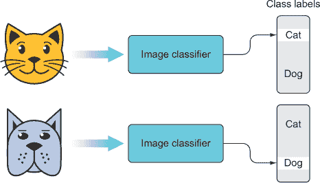

### 1.1. 深度强化学习中的“深度”

深度学习模型只是我们可以用来对图像进行分类的许多种机器学习模型之一。一般来说，我们只需要某种函数，该函数接受一个图像并返回一个类别标签（在这种情况下，标签用于识别图像中描绘的是哪种动物），通常这个函数有一个固定的可调整的*参数*集——我们称这类模型为*参数化*模型。我们从参数初始化为随机值的参数化模型开始——这将为输入图像生成随机的类别标签。然后我们使用*训练*过程来调整参数，使函数在正确分类图像方面不断变得更好。在某个时刻，参数将达到最优的值集，这意味着模型在分类任务上不能再变得更好。参数化模型也可以用于*回归*，其中我们尝试将模型拟合到一组数据，以便对未见数据做出预测（图 1.2）。如果它有更多的参数或更好的内部架构，更复杂的方法可能会表现得更好。

##### 图 1.2。也许最简单的机器学习模型是形式为 *f(x) = mx + b* 的简单线性函数，其中参数 *m*（斜率）和 *b*（截距）。由于它有可调整的参数，我们称之为参数化函数或模型。如果我们有一些二维数据，我们可以从一个随机初始化的参数集开始，例如 [m = 3.4, b = 0.3]，然后使用训练算法来优化参数以拟合训练数据，在这种情况下，最优的参数集接近 [m = 2, b = 1]。

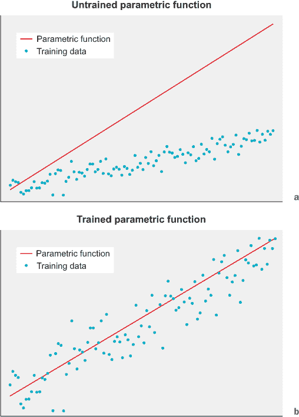

深度神经网络之所以受欢迎，是因为在许多情况下，它们是针对特定任务（如图像分类）最准确的参数化机器学习模型。这很大程度上归因于它们表示数据的方式。深度神经网络有许多层（因此称为“深度”），这促使模型学习输入数据的分层表示。这种分层表示是一种*组合性*，意味着复杂的数据块被表示为更基本组件的组合，而这些组件可以进一步分解成更简单的组件，依此类推，直到达到原子单位。

人类语言是组合性的（图 1.3）。例如，一本书由章节组成，章节由段落组成，段落由句子组成，以此类推，直到你得到单个单词，它们是意义的最小单位。然而，每个单独的层次都传达意义——整本书旨在传达意义，其各个段落旨在传达更小的观点。深度神经网络同样可以学习数据的组合表示——例如，它们可以将图像表示为原始轮廓和纹理的组合，这些轮廓和纹理组合成基本形状，等等，直到你得到完整的、复杂的图像。这种用组合表示处理复杂性的能力在很大程度上使得深度学习变得如此强大。

##### 图 1.3. 一个像“John hit the ball”这样的句子可以被分解成越来越简单的部分，直到我们得到单个单词。在这种情况下，我们可以将句子（表示为 S）分解为主语名词（N）和动词短语（VP）。VP 可以进一步分解为动词“hit”和名词短语（NP）。然后，NP 可以分解为单个单词“the”和“ball”。

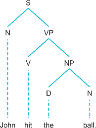

### 1.2. 强化学习

区分问题和它们的解决方案，或者说，区分我们希望解决的问题和设计来解决这些问题的算法，是很重要的。深度学习算法可以应用于许多问题类型和任务。图像分类和预测任务是深度学习的常见应用，因为深度学习之前的自动化图像处理非常有限，考虑到图像的复杂性。但还有许多其他类型的任务我们可能希望自动化，例如驾驶汽车或平衡股票和其他资产的投资组合。驾驶汽车包括一定量的图像处理，但更重要的是算法需要学习如何*行动*，而不仅仅是分类或预测。这类问题，其中必须做出决策或必须执行某些行为，统称为*控制任务*。

*强化学习*是一个表示和解决控制任务的通用框架，但在这个框架内，我们可以自由选择我们想要应用于特定控制任务的算法（图 1.4）。深度学习算法是自然的选择，因为它们能够有效地处理复杂数据，这就是为什么我们将关注*深度*强化学习，但本书中你将学习到的大部分内容是控制任务的通用强化框架（参见图 1.5）。然后我们将探讨如何设计一个合适的深度学习模型来适应框架并解决问题。这意味着你将学习很多关于强化学习的内容，你可能会学到一些关于深度学习的东西，你之前可能不太了解。

##### 图 1.4\. 与图像分类器不同，强化学习算法与数据的交互是动态的。它持续消耗数据并决定采取什么行动——这些行动将改变随后呈现给它的数据。视频游戏屏幕可能是一个强化学习算法的输入数据，然后它使用游戏控制器决定采取什么行动，这会导致游戏更新（例如，玩家移动或开火）。

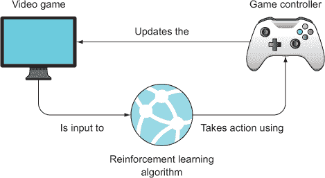

##### 图 1.5\. 深度学习是机器学习的一个子领域。深度学习算法可以用于增强 RL 方法来解决控制任务。

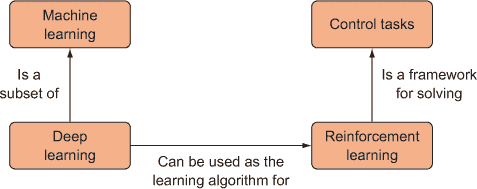

从图像处理转向控制任务领域的一个额外复杂性是时间的增加。在图像处理中，我们通常在固定的图像数据集上训练深度学习算法。经过足够的训练后，我们通常得到一个高性能的算法，可以部署到一些新的、未见过的图像上。我们可以将数据集视为数据的“空间”，在这个抽象空间中，相似的图像彼此更近，不同的图像则更远（图 1.6）。

##### 图 1.6\. 这个在二维空间中描绘单词的图形表示将每个单词表示为一个彩色点。相似的单词聚集在一起，不相似的单词则彼此更远。数据自然存在于某种“空间”中，相似的数据彼此更近。标签 A、B、C 和 D 指向一些共享某些语义的单词簇。

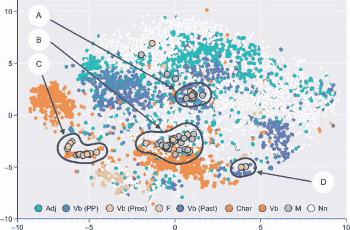

在控制任务中，我们同样有一个数据处理的空间，但每一条数据也具有时间维度——数据存在于时间和空间中。这意味着算法在某一时刻的决定会受到之前发生事件的影响。这并不是普通图像分类和类似问题的情况。时间使得训练任务动态化——算法训练的数据集不一定固定，而是根据算法做出的决策而变化。

普通图像分类等任务属于**监督学习**的范畴，因为算法是通过给出正确答案来训练如何正确分类图像的。起初，算法会进行随机猜测，然后通过迭代修正直到它学会图像中与适当标签相对应的特征。这要求我们事先知道正确答案是什么，这可能很繁琐。如果你想训练一个深度学习算法来正确分类各种植物种类的图像，你必须费力地获取数千张这样的图像，并手动将类别标签与每一张图像关联起来，并准备成机器学习算法可以操作的数据格式，通常是一种矩阵类型。

相比之下，在强化学习中，我们不知道在每一步确切应该做什么。我们只需要知道最终目标是什么以及要避免做什么。你是如何教狗一个把戏的？你必须给它美味的奖励。同样，正如其名所示，我们通过激励强化学习算法去完成某些高级目标，并可能从做我们不希望它做的事情中减少激励。在自动驾驶汽车的情况下，高级目标可能是“从起点 A 到达点 B 而不发生碰撞。”如果它完成了任务，我们就奖励它，如果它发生碰撞，我们就惩罚它。我们会在模拟器中这样做，而不是在真正的道路上，这样我们就可以让它反复尝试并失败，直到它学会并获得奖励。

| |
| --- |

##### 小贴士

在自然语言中，“奖励”总是指积极的事物，而在强化学习术语中，它是一个需要优化的数值量。因此，奖励可以是正的也可以是负的。当它是正数时，它映射到自然语言中该术语的使用，但当它是负值时，它映射到自然语言中的“惩罚”一词。

| |
| --- |

该算法有一个单一目标——最大化其奖励——为了实现这一点，它必须学习更多基本的技能来实现主要目标。我们还可以在算法选择做我们不希望做的事情时提供负奖励，并且由于它试图最大化其奖励，它会学会避免导致负奖励的行动。这就是为什么它被称为*强化学习*：我们通过奖励信号（见图 1.7）要么正要么负地强化某些行为。这与动物的学习方式非常相似：它们学会做让自己感觉良好或满意的事情，并避免导致痛苦的事情。

##### 图 1.7. 在强化学习框架中，某种学习算法决定对控制任务（例如，驾驶机器人吸尘器）采取哪些行动，而行动的结果将产生正或负的奖励，这将正或负地强化该行动，从而训练学习算法。

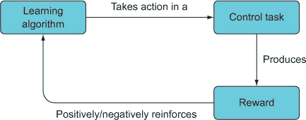

### 1.3. 动态规划与蒙特卡洛方法

你现在知道，你可以通过将任务的完成赋予高奖励（即正强化）以及负强化我们不希望它做的事情来训练一个算法完成某些高级任务。让我们来具体说明一下。假设高级目标是训练一个机器人吸尘器从房子的一个房间移动到厨房的码头，它有四个动作：向左、向右、向前和倒退。在每一个时间点，机器人都需要决定采取这四个动作中的哪一个。如果它到达了码头，它会获得+100 的奖励，如果在路上撞到任何东西，它会获得-10 的负面奖励。假设机器人拥有房子的完整 3D 地图，并且知道码头的精确位置，但它仍然不知道确切的动作序列来到达码头。

解决这个问题的方法之一被称为*动态规划*（DP），最早由理查德·贝尔曼在 1957 年提出。动态规划可能更准确地被称为*目标分解*，因为它通过将复杂的高级问题分解成越来越小的子问题，直到找到一个可以不依赖更多信息就能解决的简单子问题。

而不是让机器人尝试想出一连串原始动作来达到码头，它首先可以将问题分解为“待在这个房间”与“离开这个房间”。由于它拥有整个房子的完整地图，它知道它需要离开房间，因为码头在厨房。然而，它仍然不知道什么动作序列能让它离开房间，所以它进一步将问题分解为“朝向门口移动”或“远离门口移动”。由于门口离码头更近，并且从门口到码头有一条路径，机器人知道它需要朝向门口移动，但再次它不知道什么原始动作序列能将它引向门口。最后，它需要决定是向左、向右、向前还是倒退。它可以看到门就在它面前，所以它向前移动。它继续这个过程，直到它离开房间，这时它必须进行更多的目标分解，直到到达码头。

这就是动态规划的本质。它是一种通用的方法，用于解决可以分解为子问题和子子问题的某些类型的问题，并且它在许多领域都有应用，包括生物信息学、经济学和计算机科学。

为了应用贝尔曼的动态规划，我们必须能够将问题分解成我们已知如何解决的子问题。但即使在现实世界中，这个看似无害的假设也很难实现。你如何将自动驾驶汽车的高层次目标“从 A 点安全到达 B 点”分解成小的非碰撞子目标？一个孩子是通过首先解决简单的子行走问题来学习走路的吗？在强化学习（RL）中，我们经常遇到可能包含一些随机元素的情况，我们无法像贝尔曼所描述的那样精确地应用动态规划。实际上，动态规划可以被视为一系列问题解决技术的一个极端，另一端则是随机尝试和错误。

另一种看待这个学习连续体的方式是，在某些情况下，我们对环境的了解最多，而在其他情况下，我们对环境的了解最少，因此我们需要在每个情况下采用不同的策略。如果你需要在你自己的家里使用洗手间，你确切地知道（至少是无意识地）一系列肌肉运动将如何从任何起始位置带你到洗手间（即动态规划式的）。这是因为你非常了解你的房子——你在心中有一个或多或少完美的*模型*。如果你去一个你从未去过的人家参加派对，你可能需要四处寻找直到自己找到洗手间（即尝试和错误），因为你没有那个人的房子的良好模型。

尝试和错误策略通常属于**蒙特卡洛方法**的范畴。蒙特卡洛方法本质上是从环境中进行随机采样。在许多现实世界的问题中，我们至少对环境的工作方式有一些了解，因此我们最终采用了一种混合策略，即一部分尝试和错误，另一部分利用我们对环境的现有知识直接解决容易的子目标。

混合策略的一个愚蠢的例子是，如果你被蒙上眼睛，放在你家里的一个未知位置，并被告诉通过扔小石子并听声音来找到洗手间。你可能首先将高层次目标（找到洗手间）分解成一个更易达到的子目标：弄清楚你现在在哪个房间里。为了解决这个子目标，你可能随机向各个方向扔几块小石子，并评估房间的大小，这可能会给你足够的信息来推断你所在的房间——比如说卧室。然后你需要转向另一个子目标：到达门口以便进入走廊。然后你又开始扔小石子，但由于你记得上次随机扔石子的结果，你可以将投掷目标对准更不确定的区域。通过迭代这个过程，你最终可能会找到洗手间。在这种情况下，你将应用动态规划的子目标分解和蒙特卡洛方法的随机采样。

### 1.4. 强化学习框架

理查德·贝尔曼将动态规划引入作为一种解决某些类型控制或决策问题的通用方法，但它占据了强化学习连续体的极端末端。可以说，贝尔曼更重要的贡献是帮助发展强化学习问题的标准框架。强化学习框架本质上是一组核心术语和概念，每个强化学习问题都可以用这些术语和概念来表述。这不仅为与其他工程师和研究人员沟通提供了一个标准化的语言，还迫使我们以适合动态规划类似的问题分解的方式来表述我们的问题，这样我们就可以迭代优化局部子问题，并朝着实现全局高级目标迈进。幸运的是，这也很简单。

为了具体说明框架，让我们考虑构建一个强化学习算法的任务，该算法可以学习最小化大型数据中心的能源消耗。为了良好运行，计算机需要保持冷却，因此大型数据中心可能会因冷却系统而产生显著成本。保持数据中心冷却的简单方法可能是始终开启空调，使其保持在不会让任何服务器过热的水平；这不需要任何复杂的机器学习。但这是低效的，你可以做得更好，因为不太可能所有服务器在中心同时运行过热，而且数据中心的使用水平总是相同的。如果你将冷却集中在最需要的地方和时间，你可以在更少的成本下实现相同的结果。

框架的第一步是定义你的总体目标。在这种情况下，我们的总体目标是尽量减少用于冷却的费用，同时约束条件是中心内的任何服务器温度都不能超过某个阈值。尽管这似乎是两个目标，但我们可以将它们捆绑成一个新的复合**目标函数**。这个函数返回一个错误值，表示在当前成本和服务器温度数据的情况下，我们偏离两个目标有多远。我们的目标函数返回的实际数字并不重要；我们只想让它尽可能低。因此，我们需要我们的强化学习算法最小化这个目标（错误）函数的返回值，相对于某些输入数据，这肯定包括运行成本和温度数据，但也可能包括其他有助于算法预测数据中心使用的有用上下文信息。

输入数据是由*环境*生成的。一般来说，RL（或控制）任务的环境是任何产生与实现我们目标相关的数据的动态过程。尽管我们使用“环境”作为一个技术术语，但它并没有脱离日常用法太远。作为一个非常先进的 RL 算法的实例，你总是处于某种环境中，你的眼睛和耳朵不断地消耗环境产生的信息，以便你实现日常目标。由于环境是一个*动态过程*（时间的函数），它可能会产生大小和类型各异的连续数据流。为了使事情对算法友好，我们需要将这个环境数据打包成离散的数据包，我们称之为*状态*（环境的状态），然后将其在算法的每个离散时间步中交付。状态反映了我们在某个特定时间对环境的了解，就像数字相机在某个时间捕捉场景的离散快照（并产生格式一致的图像）一样。

总结到目前为止，我们定义了一个目标函数（通过优化温度来最小化成本），它是环境状态（当前成本，当前温度数据）的函数（数据中心及其相关过程）。我们模型的最后一部分是 RL 算法本身。这可以是*任何*可以学习数据以通过修改其参数来最小化或最大化某些目标函数的参数化算法。它不需要是深度学习算法；RL 是一个独立的领域，与任何特定学习算法的关注点无关。

正如我们之前提到的，RL（或控制任务通常）与普通监督学习之间的一个关键区别是，在控制任务中，算法需要做出决策并采取行动。这些行动将对未来的事件产生因果影响。采取行动是框架中的一个关键词，它的意思大致是你所期望的。然而，每个采取的行动都是分析当前环境状态并基于该信息做出最佳决策的结果。

RL 框架中的最后一个概念是，在采取每个动作之后，算法会得到一个*奖励*。奖励是（局部）信号，表明学习算法在实现全局目标方面的表现如何。奖励可以是积极的信号（即，做得好，继续努力）或消极的信号（即，不要这样做），尽管我们称这两种情况为“奖励”。

奖励信号是学习算法在更新自身以期望在环境下一个状态中表现更好的唯一线索。在我们的数据中心示例中，每当它的行动减少错误值时，我们可能会给算法一个+10（一个任意值）的奖励。或者更合理的是，我们可能会给予一个与错误减少程度成比例的奖励。如果它增加了错误，我们会给它一个负奖励。

最后，让我们给我们的学习算法起一个更炫酷的名字，称它为**智能体**。智能体是任何强化学习问题中的行动或决策学习算法。我们可以像图 1.8 中所示的那样将这些内容全部组合起来。

##### 图 1.8\. 强化学习算法的标准框架。智能体在环境中采取行动，例如移动棋子，这随后会更新环境的状态。对于它采取的每一个行动，它会收到一个奖励（例如，赢得游戏时+1，输掉游戏时-1，否则为 0）。强化学习算法重复这个过程，目的是在长期内最大化奖励，并最终学会环境是如何运作的。

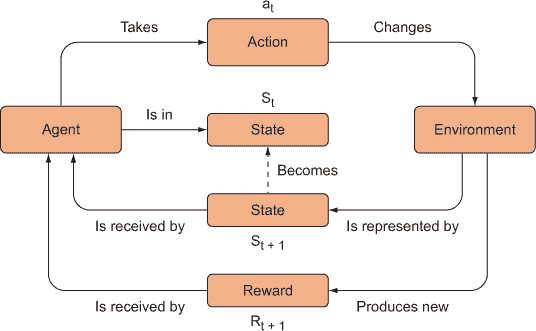

在我们的数据中心示例中，我们希望我们的智能体学会如何降低我们的冷却成本。除非我们能提供给它对环境的完整知识，否则它将不得不采用一定程度的试错法。如果我们幸运的话，智能体可能会学得很好，以至于它可以在与最初训练的环境不同的环境中使用。由于智能体是学习者，它被实现为某种学习算法。而且，由于这是一本关于**深度**强化学习的书，我们的智能体将使用**深度学习**算法（也称为**深度神经网络**，见图 1.9）来实现。但请记住，强化学习更多地关乎问题的类型和解决方案，而不是任何特定的学习算法，你当然可以使用深度神经网络的替代方案。实际上，在第三章中，我们将首先使用一个非常简单的非神经网络算法，并在本章结束时用神经网络替换它。

##### 图 1.9\. 输入数据（在某个时间点的环境状态）被输入到智能体（在本书中实现为深度神经网络）中，然后智能体评估这些数据以采取行动。这个过程比这里展示的要复杂一些，但这里捕捉了其本质。

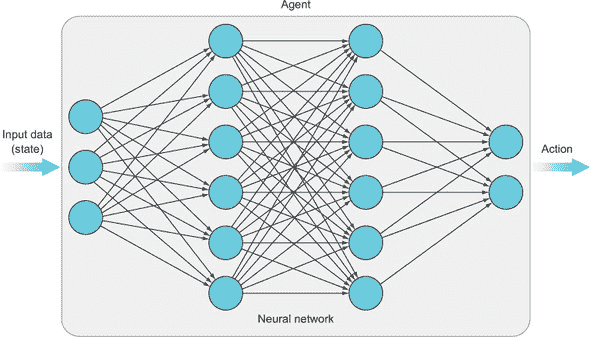

代理的唯一目标是最大化其长期预期奖励。它只是重复这个循环：处理状态信息，决定采取什么行动，看看是否获得奖励，观察新的状态，采取另一个行动，等等。如果我们正确设置所有这些，代理最终将学会理解其环境并在每一步做出可靠的正确决策。这种通用机制可以应用于自动驾驶汽车、聊天机器人、机器人技术、自动化股票交易、医疗保健等领域。我们将在下一节及本书的其余部分探讨一些这些应用。

在本书中，你大部分的时间将花在学习如何在我们标准模型中构建问题以及如何实现足够强大的学习算法（代理）来解决困难问题。对于这些示例，你不需要构建环境——你将连接到现有的环境（例如游戏引擎或其他 API）。例如，OpenAI 发布了一个 Python Gym 库，为我们提供了一系列环境和用于我们的学习算法与之交互的直观界面。图 1.10 左侧的代码显示了设置和使用这些环境是多么简单——一个赛车游戏只需要五行代码。

```
import gym
env = gym.make('CarRacing-v0')
env.reset()
env.step(action)
env.render()
```

##### 图 1.10\. OpenAI 的 Python 库附带了许多环境和用于学习算法与交互的易于使用的界面。只需几行代码，我们就能加载一个赛车游戏。

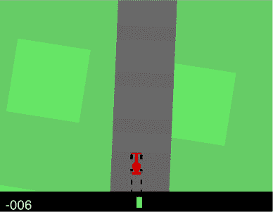

### 1.5\. 我可以用强化学习做什么？

我们本章开始时回顾了普通监督机器学习算法的基本知识，例如图像分类器，尽管监督学习最近的成功很重要且有用，但监督学习并不能带我们达到人工通用智能（AGI）。我们最终寻求的是可以应用于多个问题且需要最小到没有监督的通用学习机器，其技能库可以在不同领域之间转移。大型数据丰富的公司可以从监督方法中受益，但较小的公司和组织可能没有资源来利用机器学习的力量。通用学习算法将为每个人提供一个公平的竞争环境，而强化学习是目前实现此类算法最有希望的方法。

强化学习的研究和应用仍在成熟，但近年来已经取得了许多令人兴奋的进展。谷歌的 DeepMind 研究小组展示了令人印象深刻的结果，并引起了国际关注。第一个是在 2013 年，一个能够以超人类水平玩一系列 Atari 游戏的算法。之前尝试创建解决这些游戏的代理涉及调整底层算法以理解游戏的特定规则，通常称为*特征工程*。这些特征工程方法对于特定的游戏可能效果很好，但它们无法将任何知识或技能转移到新的游戏或领域。DeepMind 的深度 Q 网络（DQN）算法足够稳健，可以在七款游戏中工作，而不需要任何针对特定游戏的调整（见图 1.11）。它只有屏幕上的原始像素作为输入，并且只是被告知要最大化得分，然而该算法学会了如何超越专家人类水平玩游戏。

##### 图 1.11\. DeepMind 的 DQN 算法成功地学会了如何仅使用原始像素作为输入，并以玩家的得分作为最大化的目标来玩七款 Atari 游戏。之前的算法，如 IBM 的 Deep Blue，需要调整以玩特定的游戏。

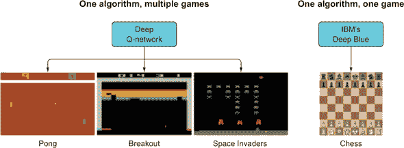

最近，DeepMind 的 AlphaGo 和 AlphaZero 算法在古老的围棋游戏中击败了世界最佳选手。专家们认为，至少还需要十年时间，人工智能才能在围棋中具有竞争力，因为这款游戏具有算法通常处理不好的特点。玩家在任何时刻都不知道最佳走法，只有在游戏结束时才能收到对动作的反馈。许多高级玩家将自己视为艺术家而不是计算策略家，并将获胜的走法描述为美丽或优雅。由于有超过 10¹⁷⁰种合法的棋盘位置，蛮力算法（IBM 的 Deep Blue 曾用来赢得象棋比赛）是不可行的。AlphaGo 通过玩数百万次模拟的围棋游戏，并学习哪些动作最大化了游戏的奖励来实现这一壮举。与 Atari 案例类似，AlphaGo 只能访问与人类玩家相同的信息：棋盘上棋子的位置。

虽然能够比人类玩得更好的游戏算法令人瞩目，但强化学习的承诺和潜力远不止于制作更好的游戏机器人。DeepMind 能够创建一个模型，将谷歌数据中心冷却成本降低了 40%，这是我们在此章前面作为例子探讨的内容。自动驾驶汽车使用强化学习来学习哪些动作序列（加速、转弯、刹车、打信号）能使乘客准时到达目的地，并学习如何避免事故。研究人员正在训练机器人完成各种任务，例如学习跑步，而不需要明确编程复杂的运动技能。

许多这些例子都是高风险的，比如开车。你不能仅仅让学习机器通过试错来学习如何开车。幸运的是，越来越多的例子表明，让学习机器在无害的模拟器中自由探索，一旦它们掌握了模拟器，就可以让它们在现实世界中尝试真实的硬件。在这本书中，我们将探讨的一个例子是算法交易。所有股票交易中，相当大的一部分是由几乎没有人类操作员输入的计算机执行的。这些算法交易员大多由管理数十亿美元的大对冲基金操控。然而，在过去的几年里，我们看到了越来越多的个人交易者对构建交易算法的兴趣。事实上，Quantopian 提供了一个平台，个人用户可以在其中用 Python 编写交易算法并在一个安全、模拟的环境中测试它们。如果算法表现良好，它们可以用来进行真实交易。许多交易者通过简单的启发式和基于规则的算法取得了相对的成功。然而，股票市场是动态且不可预测的，因此，一个持续学习的强化学习算法具有能够实时适应市场变化条件的优势。

在本书的早期，我们将解决的一个实际问题是如何放置广告。许多网络企业从广告中获得了显著的收入，而广告收入通常与广告能够获得的点击次数相关。将广告放置在能够最大化点击的地方有很大的激励。然而，唯一的方法是利用对用户的知识来显示最合适的广告。我们通常不知道哪些用户特征与正确的广告选择相关，但我们可以采用强化学习技术取得一些进展。如果我们给强化学习算法一些关于用户可能有用的信息（我们称之为环境或环境状态），并告诉它最大化广告点击次数，它将学会如何将其输入数据与其目标相关联，并最终学会哪些广告会从特定用户那里获得最多的点击。

### 1.6. 为什么是深度强化学习？

我们已经为强化学习做出了辩护，但为什么是深度强化学习？强化学习在深度学习流行之前就已经存在了。事实上，一些最早的方法（我们将为了学习目的来探讨它们）仅仅涉及将经验存储在查找表中（例如，Python 字典），并在算法的每次迭代中更新该表。想法是让智能体在环境中自由探索，看看会发生什么，并将它发生的情况存储在某种数据库中。过了一段时间，你可以回顾这个知识库，观察什么有效，什么无效。没有神经网络或其他复杂的算法。

对于非常简单的环境，这实际上工作得相当好。例如，在井字棋中，有 255,168 个有效的棋盘位置。*查找表*（也称为*记忆表*）将包含那么多条目，它们将每个状态映射到特定的动作（如图 1.12 所示）和观察到的奖励（未展示）。在训练期间，算法可以学习哪种移动会导致更有利的位置，并更新记忆表中的条目。

##### 图 1.12. 井字棋的动作查找表，只有三个条目，其中“玩家”（一个算法）玩 X。当玩家得到一个棋盘位置时，查找表将指示他们下一步应该采取的行动。对于游戏中的每个可能状态，都会有一个条目。

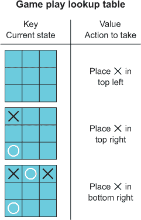

一旦环境变得更加复杂，使用记忆表就变得难以处理。例如，视频游戏的每个屏幕配置都可以被视为不同的状态（图 1.13）。想象一下试图在一个视频游戏中存储屏幕上显示的每个可能的有效像素值的组合！DeepMind 的 DQN 算法在玩 Atari 时，每一步都提供了四个 84 × 84 的灰度图像，这将导致 256²⁸²²⁸个独特的游戏状态（每个像素 256 种不同的灰色，4*84*84=28228 像素）。这个数字比可观测宇宙中的原子数量还要大，肯定不会适合计算机内存。而且这是在将图像缩小到减少其大小从原始的 210 × 160 像素彩色图像之后。

##### 图 1.13. 《Breakout》的三帧画面。每个帧中球的位置略有不同。如果你使用查找表，这相当于在表中存储三个独特的条目。由于要存储的游戏状态太多，查找表将不切实际。

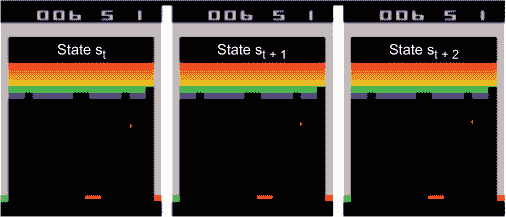

存储所有可能的状态是不可能的，但我们可以尝试限制可能性。在《Breakout》游戏中，你控制屏幕底部的球拍，可以左右移动；游戏的目标是反弹球并打破屏幕顶部的方块。在这种情况下，我们可以定义约束条件——只有在球返回球拍时才查看状态，因为我们等待球在屏幕顶部时，我们的动作并不重要。或者我们可以提供自己的特征——不是提供原始图像，而是只提供球、球拍和剩余方块的位置。然而，这些方法需要程序员理解游戏背后的策略，并且它们不会推广到其他环境。

这就是深度学习的作用。深度学习算法可以学会抽象掉特定像素排列的细节，并学会状态的重要特征。由于深度学习算法具有有限数量的参数，我们可以用它将任何可能的状态压缩成我们可以高效处理的东西，然后使用这种新的表示来做出决策。由于使用了神经网络，Atari DQN 只有 1792 个参数（16 个 8×8 的卷积滤波器，32 个 4×4 的卷积滤波器，以及一个 256 节点的全连接隐藏层），而不是存储整个状态空间所需的 256²⁸²²⁸个键/值对。

在 Breakout 游戏的情况下，一个深度神经网络可能能够自己学习识别程序员在查找表方法中必须手动工程化的相同高级特征。也就是说，它可能学会如何“看到”球、挡板、方块，并识别球的方向。考虑到它只被提供了原始像素数据，这已经很令人惊讶了。更有趣的是，学习到的高级特征可能可以转移到其他游戏或环境中。

深度学习是使 RL 最近的成功成为可能的关键因素。没有其他算法类别能够展现出深度神经网络的表征能力、效率和灵活性。此外，神经网络实际上相当简单！

### 1.7\. 我们的教具：弦图

强化学习（RL）的基本概念已经确立了几十年，但这个领域发展非常迅速，所以任何特定的新结果都可能很快过时。这就是为什么这本书侧重于教授技能，而不是那些寿命短的细节。我们确实涵盖了一些领域中的最新进展，这些进展在不久的将来肯定会被取代，但我们这样做只是为了构建新的技能，而不是因为我们所涵盖的特定主题必然是经过时间考验的技术。我们相信，即使我们的一些例子变得过时，你学到的技能不会过时，你将准备好长期应对 RL 问题。

此外，RL 是一个巨大的领域，有很多东西要学习。我们不可能希望在这本书中涵盖所有内容。我们不是要成为 RL 的详尽参考或全面课程，我们的目标是教授 RL 的基础知识，并采样该领域一些最激动人心的最新发展。我们期望你能够将在这里学到的知识应用到 RL 的许多其他领域，并迅速掌握。此外，我们在第十一章（kindle_split_021.html#ch11）中有一个部分，为你提供了一个在完成这本书后你可能想要检查的领域的路线图。

本书不仅注重教学的质量，而且注重严谨性。强化学习和深度学习在本质上都是数学性的。如果你阅读了这些领域的任何原始研究文章，你将遇到可能不熟悉的数学符号和方程。数学使我们能够对什么是真实的以及事物之间如何相关做出精确的陈述，并为事物如何以及为什么工作提供严谨的解释。我们可以不使用任何数学知识来教授强化学习，而只用 Python，但这种方法会阻碍你对未来进步的理解。

因此，我们认为数学很重要，但正如我们的编辑所指出的，出版界有一句俗语：“书中每增加一个公式，读者人数就减半”，这句话可能有一定的道理。除非你是整天阅读和撰写数学公式的专业数学家，否则在解读复杂的数学方程时不可避免地会有认知上的负担。面对既要对强化学习（DRL）进行严谨的阐述以给读者提供高质量的理解，又要尽可能触及更多人，我们提出了我们认为这本书的一个非常独特的特点。结果证明，即使是专业数学家也开始厌倦了传统的数学符号体系，在被称为*范畴论*的先进数学的一个特定分支中，数学家们已经发展出一种纯图形语言，称为*弦图*。弦图看起来非常类似于流程图和电路图，它们具有相当直观的意义，但它们与基于希腊和拉丁符号的传统数学符号一样严谨和精确。

图 1.14 展示了一种弦图的简单示例，它从高层次上描述了一个具有两层神经网络的图。机器学习（尤其是深度学习）涉及大量的矩阵和向量运算，弦图特别适合用图形方式描述这类运算。弦图也非常适合描述复杂的过程，因为我们可以在不同的抽象级别上描述这个过程。图 1.14 的顶部面板显示了代表神经网络两层的两个矩形，但我们可以“放大”（查看框内）第一层以更详细地了解它的作用，这在图 1.14 的底部面板中显示。

##### 图 1.14\. 一个两层神经网络的弦图。从左到右阅读，顶部的弦图表示一个接受维度为 *n* 的输入向量的神经网络，将其乘以一个维度为 *n x m* 的矩阵，返回一个维度为 *m* 的向量。然后对 m 维向量中的每个元素应用非线性 sigmoid 激活函数。这个新的向量随后通过层 2 中的相同步骤序列，产生神经网络的最终输出，这是一个 *k*-维向量。

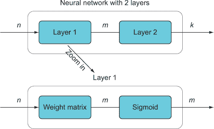

我们将在整本书中频繁使用字符串图来传达从复杂的数学方程到深度神经网络架构的各种内容。我们将在下一章中描述这种图形语法，并在整本书的其余部分继续对其进行精炼和构建。在某些情况下，这种图形符号对我们试图解释的内容来说可能过于复杂，因此我们将结合使用清晰的散文和 Python 或伪代码。我们还将大多数情况下包含传统的数学符号，这样你就可以以某种方式学习底层数学概念，无论是图表、代码还是常规的数学符号，哪种方式最能与你产生共鸣。

### 1.8. 接下来是什么？

在下一章中，我们将直接深入到 RL 的真正核心内容，涵盖许多核心概念，例如探索与利用之间的权衡、马尔可夫决策过程、价值函数和政策（这些术语很快就会变得有意义）。但在下一章的开头，我们将介绍我们将在整本书中采用的一些教学方法。

书的其余部分将涵盖核心的深度强化学习算法，这些算法是许多最新研究的基础，从深度 Q 网络开始，接着是策略梯度方法，然后是基于模型的算法。我们将主要利用 OpenAI 的 Gym（前面提到过）来训练我们的算法，使其理解非线性动力学，控制机器人和玩游戏（图 1.15）。

##### 图 1.15。围棋棋盘的描绘，这是一种古老的中国游戏，谷歌 DeepMind 将其用作其 AlphaGo 强化学习算法的测试平台。职业围棋选手李世石在五场比赛中只赢了一场，这标志着强化学习的一个转折点，因为长期以来人们认为围棋对算法推理的抵抗力与棋类游戏不同。来源：[`mng.bz/DNX0`](http://mng.bz/DNX0)。


在每一章中，我们将以一个主要问题或项目开始，我们将用它来展示该章节的重要概念和技能。随着每一章的进展，我们可能会增加问题的复杂性和细微差别，以深入探讨某些原则。例如，在第二章中，我们将从最大化赌场老虎机奖励的问题开始，通过解决这个问题，我们将涵盖 RL 的大部分基础。后来，我们将增加该问题的复杂性，并将环境从赌场改为需要最大化广告点击量的企业，这将使我们能够完善一些更多的核心概念。

虽然这本书是为那些已经具备深度学习基础知识的人准备的，但我们期望不仅教你有趣和有用的 RL 技术，而且还要磨练你的深度学习技能。为了解决一些更具挑战性的项目，我们需要采用一些深度学习的最新进展，例如生成对抗网络、进化方法、元学习和迁移学习。再次强调，所有这些都符合我们以技能为中心的教学模式，因此这些进展的细节并不重要。

### 概述

+   强化学习是机器学习的一个子类。RL 算法通过在某些环境中最大化奖励来学习，当问题涉及做出决策或采取行动时，它们是有用的。原则上，RL 算法可以使用任何统计学习模型，但使用深度神经网络变得越来越流行和有效。

+   智能体是任何强化学习问题的焦点。它是强化学习算法中处理输入以确定采取哪个行动的部分。在这本书中，我们主要关注作为深度神经网络实现的智能体。

+   环境是智能体操作的潜在动态条件。更普遍地说，环境是生成智能体输入数据的任何过程。例如，我们可能有一个在飞行模拟器中驾驶飞机的智能体，因此模拟器就是环境。

+   状态是智能体可以访问并用于做出决策的环境快照。环境通常是不断变化的条件集合，但我们可以从环境中采样，这些特定时间点的样本就是我们提供给智能体的环境状态信息。

+   行动是智能体在其环境中做出的决策，导致环境发生变化。移动特定的棋子是一个行动，在汽车中踩油门也是如此。

+   奖励是环境在智能体采取行动后给出的正面或负面信号。奖励是智能体收到的唯一学习信号。强化学习算法（即智能体）的目标是最大化奖励。

+   强化学习算法的一般流程是一个循环，其中智能体接收输入数据（环境的当前状态），智能体评估这些数据并从给定其当前状态的可能行动集中选择一个行动，该行动改变环境，然后环境向智能体发送奖励信号和新状态信息。然后循环重复。当智能体作为深度神经网络实现时，每个迭代根据奖励信号评估损失函数，并通过反向传播来提高智能体的性能。

## 第二章\. 建模强化学习问题：马尔可夫决策过程

*本章涵盖*

+   字符串图和我们的教学方法

+   PyTorch 深度学习框架

+   解决*n*-armed bandit 问题

+   平衡探索与利用

+   将问题建模为马尔可夫决策过程（MDP）

+   实现神经网络以解决广告选择问题

本章涵盖了强化学习中一些最基本的概念，它将成为本书其余部分的基础。但在我们深入探讨之前，我们首先想回顾一下本书中将采用的一些常见教学方法——最值得注意的是，我们上章提到的字符串图。

### 2.1. 字符串图和我们的教学方法

根据我们的经验，当大多数人试图教授一些复杂的内容时，他们往往会按照该主题本身发展的相反顺序来教授。他们会给你一大堆定义、术语、描述，也许还有定理，然后他们会说，“太好了，现在我们已经涵盖了所有理论，让我们来回顾一些实践问题。”在我们看来，这正是应该呈现内容的相反顺序。大多数好想法都是作为解决现实世界问题或至少想象中的问题的解决方案出现的。问题解决者在偶然发现一个潜在解决方案后，对其进行测试、改进，然后最终将其形式化和可能数学化。术语和定义是在问题解决方案开发之后出现的。

我们认为，当你扮演那个最初的想法创造者，思考如何解决特定问题时，学习是最有动力和最有效的。只有在解决方案明确之后，才值得进行形式化，这确实是必要的，以便确立其正确性，并忠实地将其传达给该领域的其他人。

有一种强烈的冲动想要采用这种倒序的时间顺序教学模式，但我们将尽力抵制它，并随着讨论的进行逐步展开。本着这种精神，我们将根据需要引入新术语、定义和数学符号。例如，我们将使用如下“提示”：


##### 定义

*神经网络*是一种由多个“层”组成的机器学习模型，这些层执行矩阵-向量乘法，然后应用一个非线性“激活”函数。神经网络的矩阵是模型的可学习参数，通常被称为神经网络的“权重”。


你将只在每个术语中看到一次这些提示，但我们将经常以不同的方式在文本中重复定义，以确保你真正理解和记住它。这是一门强化学习课程，而不是教科书或参考书，所以当我们认为某些内容值得记住时，我们不会回避重复。

每当我们需要介绍一些数学内容时，我们通常会使用一个显示数学公式和相同基本概念的伪 Python 版本的框。有时从代码或数学的角度思考更容易，我们认为熟悉两者都是有益的。作为一个非常简单的例子，如果我们正在介绍直线的方程，我们会这样做：

##### 表 2.1.本书中使用的并列数学和伪代码示例

| 数学 | 伪代码 |
| --- | --- |
| *y* = *mx* + *b* |

```
def line(x,m,b):
  return m*x + b
```

|

我们还将包括大量的内联代码（简短片段）、代码列表（较长的代码示例）以及完整项目的代码。书中所有的代码都提供在 GitHub 仓库的 Jupyter Notebooks 中，按章节分类（[`mng.bz/JzKp`](http://mng.bz/JzKp)）。如果您正在积极跟随本书的文本并构建项目，我们强烈建议您遵循这个相关 GitHub 仓库中的代码，而不是复制文本中的代码——我们将保持 GitHub 代码的更新和错误修正，而书中的代码可能会因为 Python 库的更新而稍微过时。GitHub 代码也更加完整（例如，展示如何生成我们包含的视觉化效果），而文本中的代码则尽可能保持最小化，以专注于基本概念。

由于强化学习涉及许多相互连接的概念，当仅使用文字时可能会变得令人困惑，因此我们将包含大量不同类型的图表和图形。我们将使用最重要的一种图形是*字符串图*。这个名字可能有些奇怪，但它是一个非常简单的想法，并源自我们第一章节中提到的数学的一个分支——范畴论，在那个分支中他们倾向于使用很多图表来补充或替代传统的符号表示法。

您在图 2.1 中已经看到了字符串图，当时我们在第一章中介绍了强化学习的一般框架。figure 2.1 的思路是，方框包含名词或名词短语，而箭头则标注着动词或动词短语。它与典型的流程图略有不同，但这使得将字符串图翻译成英文散文以及反过来都非常容易。箭头在功能上*做什么*也非常清晰。这种特定的字符串图也被称为*本体论日志*或*olog*（“哦-log”）。如果您想了解更多，可以查阅它们。

##### 图 2.1.标准的强化学习模型，其中智能体在一个不断变化的环境中采取行动，该环境产生奖励以强化智能体的行动。

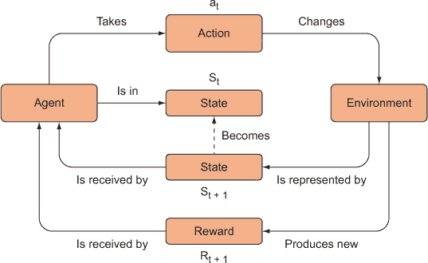

更普遍地，字符串图解（有时在其他来源中被称为 *布线图解*）是类似于流线的图解，表示类型化的数据沿着字符串（即有向或无向箭头）流向过程（计算、函数、转换、过程等），这些过程以框的形式表示。与您可能看到的类似外观的其他流图相比，字符串图解的一个重要区别是，所有字符串上的数据都是显式类型化的（例如，形状为 `[10, 10]` 的 numpy 数组，或者可能是一个浮点数），并且图解是完全组合的。通过组合，我们指的是我们可以放大或缩小图解，以看到更大的更抽象的图景，或者深入到计算细节。

如果我们展示的是更高层次的描述，处理框可能只是用单词或短语标记，表明发生的处理类型，但我们也可以展示该处理框的放大视图，揭示其所有内部细节，这些细节由其自己的子字符串和子过程组成。这些图解的组合性质也意味着我们可以将一个图解的某些部分插入到另一个图解中，形成更复杂的图解，只要所有字符串的类型都是兼容的。例如，这里是一个神经网络单层的字符串图解：

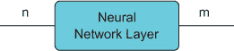

从左到右阅读，我们看到类型为 `n` 的某些数据流入一个称为神经网络层的处理框，并产生类型为 `m` 的输出。由于神经网络通常以向量作为输入并产生向量作为输出，这些类型分别指输入和输出向量的维度。也就是说，这个神经网络层接受长度或维度为 *n* 的向量，并产生维度为 *m* 的向量。对于某些神经网络层，*n* 可能等于 *m*。

这种对字符串的 *类型化* 方法被简化了，我们只在从上下文中可以清楚地知道类型含义时才这样做。在其他情况下，我们可能使用数学符号，如 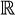 表示所有实数的集合，这在编程语言中基本上等同于浮点数。因此，对于维度为 *n* 的浮点数向量，我们可以这样表示字符串：

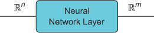

现在打字更加丰富，我们不仅知道输入和输出向量的维度，我们还知道它们是实数/浮点数。虽然这几乎总是这种情况，但有时我们可能正在处理整数或二进制数。无论如何，我们的神经网络层处理框仍然是一个黑盒；我们不知道里面具体发生了什么，除了它将一个向量转换成另一个可能不同维度的向量。我们可以决定深入这个过程，看看具体发生了什么：

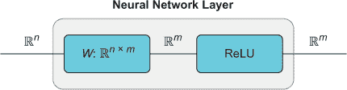

现在，我们可以看到原始进程框的内部，它由其自己的子进程集组成。我们可以看到，我们的*n*维向量被一个*n* × *m*维度的矩阵相乘，从而产生一个*m*维度的向量乘积。这个向量随后通过一个称为“ReLU”的进程，你可能认识它作为标准神经网络激活函数，即线性整流单元。如果我们想的话，可以继续放大 ReLU 子子进程。任何值得称为*弦图*的东西都必须能够在任何抽象级别上被仔细检查，并且在任何级别上都能保持*良好类型化*（意味着进入和离开进程的数据类型必须兼容且有意义——一个本应生成排序列表的进程不应该连接到另一个期望整数的进程）。

只要字符串类型正确，我们就可以将多个进程组合成一个复杂的系统。这使得我们能够一次性构建组件，并在任何类型匹配的地方重复使用它们。在某种程度上，我们可以这样描述一个简单的双层循环神经网络（RNN）：

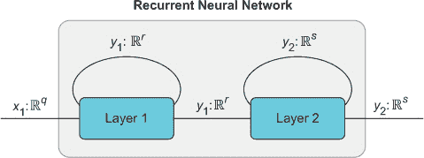

这个 RNN 接受一个*q*向量并产生一个*s*向量。然而，我们可以看到内部进程。有两个层次，每个层次在功能上看起来完全相同。它们各自接受一个向量并产生一个向量，除了输出向量被复制并作为输入的一部分反馈到层进程中，因此产生了递归。

字符串图是一种非常通用的图；除了绘制神经网络外，我们还可以用它们来绘制如何烘焙蛋糕。*计算图*是一种特殊的字符串图，其中所有进程都代表计算机可以执行的具体计算，或者可以用某种编程语言（如 Python）描述。如果你曾经在 TensorFlow 的 TensorBoard 中可视化过计算图，你就会知道我们的意思。一个好的字符串图的目标是，我们可以从高层次查看算法或机器学习模型，以获得整体图景，然后逐渐放大，直到我们的字符串图足够详细，以至于我们可以几乎仅基于我们对图的知识来实现算法。

在这本书中，我们将展示数学、简单的 Python 代码和字符串图，你应该没有问题理解如何实现一些相当高级的机器学习模型。

### 2.2. 解决多臂老虎机问题

我们现在可以开始解决一个真正的强化学习问题，并在解决问题的过程中查看相关的概念和技能。但在我们变得过于复杂，构建类似 AlphaGo 的东西之前，让我们先考虑一个简单的问题。假设你在一个赌场，面前有 10 台老虎机，一个闪亮的标志写着“免费玩！最高支付 $10！”哇，不错！好奇之下，你问一位员工发生了什么事，因为这听起来太好了，她回答说：“这真的是真的，你想玩多久就玩多久，免费的。每台老虎机都保证给你 $0 到 $10 之间的奖励。哦，顺便说一下，保密，但这 10 台老虎机每台的平均支付都不同，所以试着找出哪一台的平均奖励最高，你将赚很多钱！”

这是什么样的赌场？谁在乎呢，我们只要找出如何赚最多的钱！顺便说一句，这里有一个笑话：老虎机的另一个名字是什么？一个独臂强盗！明白了吗？它有一个手臂（杠杆）并且通常偷你的钱。我们可以把我们的情况称为 10 臂强盗问题，或者更一般地称为 *n* 臂强盗问题，其中 *n* 是老虎机的数量。虽然这个问题听起来到目前为止相当离奇，但你会在后面看到这些 *n* 臂强盗（或多臂强盗）问题确实有一些非常实际的应用。

让我们更正式地重述我们的问题。我们有 *n* 种可能的行为（这里 *n* = 10），其中一种行为意味着拉动特定老虎机的臂或杠杆，并且每次游戏（*k*）中我们都可以选择拉动一个杠杆。在采取行动（*a*）后，我们将获得奖励，*R[k]*（第 *k* 次游戏的奖励）。每个杠杆都有独特的支付（奖励）概率分布。例如，如果我们有 10 台老虎机并玩很多次游戏，老虎机 #3 可能的平均奖励为 $9，而老虎机 #1 的平均奖励仅为 $4。当然，由于每次游戏的奖励是概率性的，有可能杠杆 #1 在单次游戏中偶然给我们 $9 的奖励。但如果我们玩很多次游戏，我们预计老虎机 #1 的平均奖励将低于 #3。

我们的战略应该是先玩几次，选择不同的杠杆，并观察每次行动的奖励。然后我们只想选择观察到的平均奖励最大的杠杆。因此，我们需要一个基于我们之前游戏的概念，即采取行动（*a*）的预期奖励。我们将这个预期奖励称为 *Q[k]*(*a*)，数学上可以这样表示：你给这个函数一个行动（假设我们在第 *k* 次游戏中），它返回采取该行动的预期奖励。这在这里被正式展示：

##### 表 2.2\. 数学与伪代码中的预期奖励计算

| 数学 | 伪代码 |
| --- | --- |
| 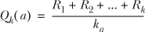 |

```
def exp_reward(action, history):
  rewards_for_action = history[action]
  return sum(rewards_for_action) /
     len(rewards_for_action)
```

|

也就是说，动作 *a* 在游戏 *k* 时的预期奖励是所有之前我们为采取动作 *a* 收到的奖励的算术平均值。因此，我们的先前动作和观察结果会影响我们的未来动作。我们甚至可以说，我们的一些先前动作*强化*了我们的当前和未来动作，但我们会稍后回到这一点。函数 *Q[k]*(*a*) 被称为*价值函数*，因为它告诉我们某物的价值。特别是，它是一个*动作-价值函数*，因为它告诉我们采取特定动作的价值。由于我们通常用符号 *Q* 表示这个函数，它也经常被称为*Q 函数*。我们稍后会回到价值函数，并给出一个更复杂的定义，但这对现在来说已经足够了。

#### 2.2.1. 探索和利用

当我们刚开始玩游戏时，我们需要玩游戏并观察我们为各种机器获得的奖励。我们可以称这种策略为*探索*，因为我们实际上是在随机探索我们动作的结果。这与我们可以采用的不同策略形成对比，这种策略被称为*利用*，这意味着我们使用我们对哪个机器似乎产生最多奖励的当前知识，并继续玩那个机器。我们的整体策略需要包括一些利用（根据我们目前所知选择最佳杠杆）和一些探索（选择随机杠杆以便我们了解更多）。利用和探索的正确平衡对于最大化我们的奖励非常重要。

我们如何想出一个算法来确定哪个老虎机的平均回报率最高？嗯，最简单的算法就是选择与最高 Q 值相关的动作：

##### 表 2.3. 根据预期奖励计算最佳动作

| 数学 | 伪代码 |
| --- | --- |
| ∀*a**[i]* ∈ *A[k]* |

```
def get_best_action(actions, history):
  exp_rewards = [exp_reward(action, history) for action in
                actions]
```

|

| *a** = arg*max**[a]**Q[k]*(*a**[i]*) |
| --- |

```
  return argmax(exp_rewards)
```

|

以下列表显示了它作为合法的 Python 3 代码。

##### 列表 2.1. 根据 Python 3 中的预期奖励找到最佳动作

```
def get_best_action(actions):
    best_action = 0
    max_action_value = 0
    for i in range(len(actions)):                          *1*
        cur_action_value = get_action_value(actions[i])    *2*
        if cur_action_value > max_action_value:
            best_action = i
            max_action_value = cur_action_value
    return best_action
```

+   ***1*** 遍历所有可能的动作

+   ***2*** 获取当前动作的值

我们在我们的上述函数 *Q[k]*(*a*) 上对所有可能的动作进行操作，并选择返回最大平均奖励的动作。由于 *Q[k]*(*a*) 依赖于我们先前动作及其相关奖励的记录，这种方法将不会评估我们尚未探索的动作。因此，我们可能之前尝试过杠杆 #1 和 #3，并注意到杠杆 #3 给我们更高的奖励，但使用这种方法，我们永远不会想到尝试另一个杠杆，比如说 #6，而我们不知道的是，它实际上给出了最高的平均奖励。这种方法简单地选择我们目前所知的最佳杠杆被称为*贪婪*（或利用）方法。

#### 2.2.2. Epsilon-greedy 策略

我们需要探索其他杠杆（其他老虎机）以发现最佳动作。对我们之前的算法的一个简单修改是将它改为 ε(epsilon)-贪婪算法，这样我们就会以概率 ε 随机选择一个动作 *a*，其余时间（概率 1 – ε）我们将根据我们从过去的游戏中了解的情况选择最佳杠杆。大多数时候我们会玩贪婪，但有时我们会冒险选择一个随机杠杆看看会发生什么。结果当然会影响我们未来的贪婪动作。让我们看看我们能否用 Python 代码解决这个问题。

##### 列表 2.2\. ε-贪婪策略的动作选择

```
import numpy as np
from scipy import stats
import random
import matplotlib.pyplot as plt

n = 10                         *1*
probs = np.random.rand(n)      *2*
eps = 0.2                      *3*
```

+   ***1*** 臂的数量（老虎机的数量）

+   ***2*** 每个臂相关的隐藏概率

+   ***3*** ε-贪婪动作选择的 ε 值

在这个赌场示例中，我们将解决一个 10-臂老虎机问题，所以 *n* = 10。我们还定义了一个长度为 *n* 的 numpy 数组，其中填充了随机浮点数，这些数可以理解为概率。`probs` 数组中的每个位置对应一个臂，即一个可能的动作。例如，第一个元素的位置索引为 0，因此动作 0 是臂 0。每个臂都有一个与之相关的概率，该概率决定了它支付的奖励量。

我们选择实现每个臂的奖励概率分布的方式是这样的：每个臂将有一个概率，例如，0.7，最大奖励是 $10。我们将设置一个 `for` 循环，直到 `10`，在每次迭代中，如果随机浮点数小于臂的概率，它将奖励增加 `1`。因此，在第一次循环中，它生成一个随机浮点数（例如，0.4）。0.4 小于 0.7，所以 `reward += 1`。在下一次迭代中，它生成另一个随机浮点数（例如，0.6），这也小于 0.7，所以 `reward += 1`。这会一直持续到我们完成 10 次迭代，然后我们返回最终的累计奖励，这可能是 0 到 10 之间的任何值。在臂概率为 0.7 的情况下，对无限次进行此操作的 *平均* 奖励将是 7，但在任何单次游戏中它可能会更多或更少。

##### 列表 2.3\. 定义奖励函数

```
def get_reward(prob, n=10):
    reward = 0
    for i in range(n):
        if random.random() < prob:
            reward += 1
    return reward
```

你可以通过运行它来检查：

```
>>> np.mean([get_reward(0.7) for _ in range(2000)])
7.001
```

这个输出显示，以 0.7 的概率运行此代码 2,000 次确实给出了接近 7 的平均奖励（参见 图 2.2 的直方图）。

##### 图 2.2\. 模拟 n-臂老虎机的奖励分布。

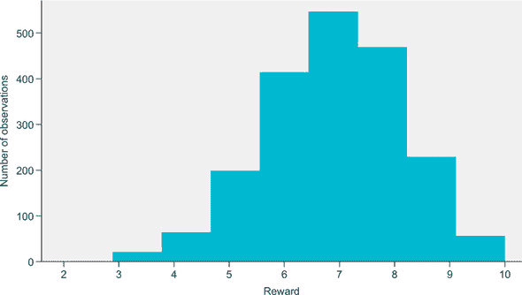

我们接下来要定义的函数是我们选择最佳臂的贪婪策略。我们需要一种方法来跟踪哪些臂被拉动以及相应的奖励是什么。天真地，我们只需有一个列表，并将观察结果（臂，奖励）如（2，9）附加到列表中，例如，表示我们选择了臂 2 并获得了奖励 9。随着我们玩游戏，这个列表会变得越来越长。

然而，有一个更简单的方法，因为我们实际上只需要跟踪每个臂的平均奖励——我们不需要存储每个观察结果。回想一下，为了计算数字列表的平均值，*x[i]*（由*i*索引），我们只需要将所有的*x[i]*值加起来，然后除以*x[i]*的数量，我们将这个数量表示为*k*。平均值通常用希腊字母μ（mu）表示。

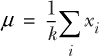

希腊大写符号Σ（sigma）用于表示求和操作。下方的*i*表示我们求和每个元素，*x[i]*。它基本上是数学上与`for`循环等价的：

```
sum = 0
x = [4,5,6,7]
for j in range(len(x)): 
    sum = sum + x[j]
```

如果我们已经有了一个特定臂的平均奖励μ，当我们得到一个新的奖励时，我们可以通过重新计算平均值来更新这个平均值。我们基本上需要撤销平均并重新计算。为了撤销它，我们将μ乘以总值的数量，*k*。当然，这只会给我们总和，而不是原始的值集——你不能撤销一个总和。但总数是我们需要用新值重新计算平均值的。我们只需将这个总和加到新值上，然后除以*k* + 1，即新的总值数量。

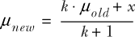

我们可以使用这个方程式在收集新数据时不断更新每个臂观察到的平均奖励，这样我们只需要为每个臂跟踪两个数字：*k*，观察到的值数，和μ，当前运行的平均值。我们可以很容易地将这些存储在一个 10 × 2 的 numpy 数组中（假设我们有 10 个臂）。我们将这个数组称为`record`。

```
>>> record = np.zeros((n,2))
array([[0., 0.],
       [0., 0.],
       [0., 0.],
       [0., 0.],
       [0., 0.],
       [0., 0.],
       [0., 0.],
       [0., 0.],
       [0., 0.],
       [0., 0.]])
```

这个数组的第 1 列将存储每个臂被拉动的次数，第 2 列将存储运行平均奖励。让我们编写一个函数来更新记录，给定一个新的动作和奖励。

##### 列表 2.4\. 更新奖励记录

```
def update_record(record,action,r):
    new_r = (record[action,0] * record[action,1] + r) / (record[action,0] +
     1)
    record[action,0] += 1
    record[action,1] = new_r
    return record
```

这个函数接受`record`数组、一个动作（这是臂的索引值）和一个新的奖励观察结果。为了更新平均奖励，它只是简单地实现了我们之前描述的数学函数，然后增加记录该臂被拉动次数的计数器。

接下来我们需要一个函数来选择拉动哪个臂。我们希望它选择与最高平均奖励相关的臂，所以我们只需要找到`record`数组中第 1 列值最大的行。我们可以很容易地使用 numpy 的内置`argmax`函数来完成这个任务，该函数接受一个数组，找到数组中的最大值，并返回其索引位置。

##### 列表 2.5\. 计算最佳动作

```
def get_best_arm(record):
    arm_index = np.argmax(record[:,1],axis=0)     *1*
    return arm_index
```

+   ***1*** 在记录数组的第 1 列使用 numpy 的 argmax

现在我们可以进入玩**n**臂老虎机游戏的主循环。如果随机数大于 epsilon 参数，我们就使用`get_best_arm`函数计算最佳动作并采取该动作。否则，我们采取随机动作以确保一定程度的探索。选择臂之后，我们使用`get_reward`函数并观察奖励值。然后我们使用这个新的观察结果更新`record`数组。我们重复这个过程多次，它将不断更新`record`数组。具有最高奖励概率的臂最终应该被选择得最频繁，因为它会给出最高的平均奖励。

我们在下面的列表中将其设置为玩 500 次，并显示平均奖励与游戏次数的`matplotlib`散点图。希望我们会看到随着游戏次数的增加，平均奖励会增加。

##### 列表 2.6\. 解决**n**臂老虎机问题

```
fig, ax = plt.subplots(1,1)
ax.set_xlabel("Plays")
ax.set_ylabel("Avg Reward")
record = np.zeros((n,2))                              *1*
probs = np.random.rand(n)                             *2*
eps = 0.2
rewards = [0]
for i in range(500):
    if random.random() > eps:                             *3*
        choice = get_best_arm(record)
    else:
        choice = np.random.randint(10)
    r = get_reward(probs[choice])                     *4*
    record = update_record(record,choice,r)           *5*
    mean_reward = ((i+1) * rewards[-1] + r)/(i+2)     *6*
    rewards.append(mean_reward)
ax.scatter(np.arange(len(rewards)),rewards)
```

+   ***1*** 将记录数组初始化为零

+   ***2*** 随机初始化每个臂的奖励概率

+   ***3*** 以 0.8 的概率选择最佳动作，否则随机选择

+   ***4*** 计算选择臂的奖励

+   ***5*** 使用这个臂的新计数和奖励观察结果更新记录数组

+   ***6*** 跟踪奖励的运行平均值以评估整体性能

正如你在图 2.3 中看到的，平均奖励确实在多次游戏后有所提高。我们的算法正在**学习**；它通过之前的良好游戏得到加强！然而，它是一个非常简单的算法。

##### 图 2.3\. 这个图显示，每次老虎机游戏的平均奖励随时间增加，表明我们成功地学会了如何解决 n 臂老虎机问题。


我们在这里考虑的问题是**静态**问题，因为臂的潜在奖励概率分布不会随时间改变。我们当然可以考虑这种情况下不成立的问题的变体——非静态问题。在这种情况下，一个简单的修改就是允许新的奖励观察结果以偏斜的方式更新记录中存储的平均奖励值，使其成为一个加权平均，偏向于最新的观察结果。这样，如果随着时间的推移事情发生变化，我们就能在一定程度上跟踪它们。我们在这里不会实现这个稍微复杂一点的变体，但在本书的后面我们会遇到非静态问题。

#### 2.2.3\. Softmax 选择策略

想象另一种类型的投币机问题：一位新晋医生专门治疗患有心脏病发作的患者。她有 10 种治疗方案可供选择，每次只能选择其中一种来治疗她看到的每位患者。出于某种原因，她只知道这 10 种治疗方案在治疗心脏病发作方面有不同的有效性和风险特征——她不知道哪一个是最好的。我们可以使用前一个解决方案中的*n*-armed bandit 算法，但我们可能想要重新考虑偶尔随机选择治疗方案的ε-greedy 策略。在这个新问题中，随机选择治疗方案可能会导致患者死亡，而不仅仅是损失一些钱。我们确实想确保我们不会选择最差的治疗方案，但我们仍然想有一些能力来探索我们的选项以找到最好的一个。

这就是 softmax 选择可能最合适的地方。在探索过程中，我们不是随机选择一个动作，而是 softmax 给我们提供了一个关于我们选项的概率分布。概率最大的选项将等同于前一个解决方案中的最佳臂动作，但它也会给我们一些关于哪些是第二和第三好动作的想法，例如。这样我们就可以随机选择探索其他选项，同时避免选择最差的选项，因为它们将被分配极小的概率或甚至 0。以下是 softmax 方程：

##### 表格 2.4\. softmax 方程

| 数学 | 伪代码 |
| --- | --- |
| 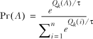 |

```
def softmax(vals, tau):
      softm = pow(e, vals / tau) / sum( pow(e, vals / tau))
      return softm
```

|

Pr(*A*)是一个接受动作值向量（数组）的函数，并返回一个关于动作的概率分布，其中值较高的动作具有更高的概率。例如，如果你的动作值数组有四个可能的动作，并且它们目前都具有相同的值，比如说`A = [10, 10, 10, 10]`，那么`Pr(A) = [0.25, 0.25, 0.25, 0.25]`。换句话说，所有概率都是相同的，并且必须总和为 1。

分数的分子将动作值数组除以参数τ进行指数化，得到与输入相同大小（即长度）的向量。分母对每个单独的动作值除以τ的指数化求和，得到一个单一的数字。

τ是一个称为*温度*的参数，它缩放动作的概率分布。高温会导致概率非常相似，而低温会夸大动作之间概率的差异。为这个参数选择一个值需要有一定的猜测和一些试错。数学指数*e^x*是 numpy 中`np.exp(...)`的函数调用。它将在输入向量上逐元素应用该函数。以下是我们如何在 Python 中实际编写 softmax 函数。

##### 列表 2.7\. softmax 函数

```
def softmax(av, tau=1.12):
    softm = np.exp(av / tau) / np.sum( np.exp(av / tau) ) 
    return softm
```

当我们使用`softmax`实现前 10 臂老虎机问题时，不再需要`get_best_arm`函数。因为`softmax`会在我们的可能动作上产生一个加权的概率分布，我们可以根据它们的相对概率随机选择动作。也就是说，最佳动作将被更频繁地选择，因为它将具有最高的`softmax`概率，但其他动作的选择频率将较低。

要实现这一点，我们只需要在`record`数组的第二列（列索引 1）上应用`softmax`函数，因为那是存储每个动作当前平均奖励（动作值）的列。它将把这些动作值转换成概率。然后我们使用`np.random.choice`函数，它接受一个任意输入数组*x*和一个参数*p*，它是一个与*x*中的每个元素相对应的概率数组。由于我们的记录初始化为全零，`softmax`最初将在所有臂上返回一个均匀分布，但这个分布将迅速偏向与最高奖励相关的动作。以下是一个使用`softmax`和随机选择函数的示例：

```
>>> x = np.arange(10)
>>> x
array([0, 1, 2, 3, 4, 5, 6, 7, 8, 9])
>>> av = np.zeros(10)
>>> p = softmax(av)
>>> p
array([0.1, 0.1, 0.1, 0.1, 0.1, 0.1, 0.1, 0.1, 0.1, 0.1])
>>> np.random.choice(x,p=p)
3
```

我们使用 numpy 的`arange`函数创建一个从 0 到 9 的数组，对应于每个臂的索引，因此随机选择函数将根据提供的概率向量返回一个臂索引。我们可以使用之前相同的训练循环；我们只需要更改臂选择部分，使其使用`softmax`而不是`get_best_arm`，并且我们需要去除 epsilon-greedy 策略中的一部分随机动作选择。

##### 列表 2.8\. 对于*n*-臂老虎机的 softmax 动作选择

```
n = 10
probs = np.random.rand(n)
record = np.zeros((n,2))

fig,ax = plt.subplots(1,1)
ax.set_xlabel("Plays")
ax.set_ylabel("Avg Reward")
fig.set_size_inches(9,5)
rewards = [0]
for i in range(500):
    p = softmax(record[:,1])                        *1*
    choice = np.random.choice(np.arange(n),p=p)     *2*
    r = get_reward(probs[choice])
    record = update_record(record,choice,r)
    mean_reward = ((i+1) * rewards[-1] + r)/(i+2)
    rewards.append(mean_reward)
ax.scatter(np.arange(len(rewards)),rewards)
```

+   ***1*** 计算每个臂相对于其当前动作值的 softmax 概率

+   ***2*** 随机选择一个臂，但根据 softmax 概率进行加权

从图 2.4 中可以看出，softmax 动作选择似乎比 epsilon-greedy 方法对此问题表现更好；它看起来像它更快地收敛到最优策略。softmax 的缺点是需要手动选择*τ*参数。这里的 softmax 对*τ*非常敏感，需要花一些时间调整以找到合适的值。显然，在 epsilon-greedy 中我们必须设置 epsilon 参数，但选择该参数要直观得多。

##### 图 2.4\. 在 softmax 策略下，n-臂老虎机算法倾向于更快地收敛到最大平均奖励。

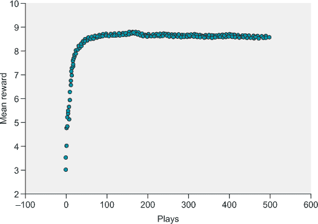

### 2.3\. 将老虎机应用于优化广告投放

槽机示例可能不是一个特别真实世界的问题，但如果我们添加一个元素，它就变成了一个实际的商业问题，一个很大的例子就是广告投放。每次你访问带有广告的网站时，放置广告的公司都希望最大化你点击它们的概率。

假设我们管理着 10 个电子商务网站，每个网站专注于销售不同的大类零售商品，如电脑、鞋子、珠宝等。我们希望通过将购物于我们网站之一的客户推荐到他们可能感兴趣的另一个网站来增加销售额。当客户在我们的网络中的某个特定网站上结账时，我们将展示我们其他网站中的一个广告，希望他们能去那里购买其他商品。或者，我们可以在同一网站上放置另一个产品的广告。我们的问题是不知道我们应该将用户推荐到哪个网站。我们可以尝试随机放置广告，但我们怀疑可能有一种更精准的方法。

#### 2.3.1\. 上下文老虎机

也许你能看出这仅仅给我们在本章开头讨论的**n**臂老虎机问题增加了一层复杂性。在游戏的每一次玩（每次客户在特定网站上结账）时，我们有**n** = 10 种可能采取的行动，对应于我们可以放置的 10 种不同类型的广告。转折在于，放置的最佳广告可能取决于当前客户所在的网络中的哪个网站。例如，在我们的珠宝网站上结账的客户可能更愿意购买一双新鞋子来搭配他们新买的钻石项链，而不是购买一台新笔记本电脑。因此，我们的问题是如何确定特定网站与特定广告之间的关系。

这引导我们进入**状态空间**。我们最初讨论的**n**臂老虎机问题有一个**n**元素的**动作空间**（所有可能动作的空间或集合），但没有状态的概念。也就是说，环境中没有信息能帮助我们选择一个好的臂。我们能确定哪些臂是好的唯一方法是通过试错。在广告问题中，我们知道用户在特定网站上购买东西，这可能给我们一些关于用户偏好的信息，并可能帮助我们决定放置哪个广告。我们称这种上下文信息为**状态**，并将这类新问题称为**上下文老虎机**（见图 2.5）。

##### 图 2.5\. 广告放置的上下文老虎机概述。代理（这是一个神经网络算法）接收状态信息（在这种情况下，用户当前所在的网站），它使用这些信息来选择在结账步骤放置几个广告中的哪一个。用户会点击广告或不点击，从而产生奖励信号，这些信号被传回代理以供学习。

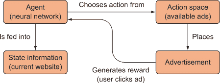

| |
| --- |

##### 定义

游戏中（或更普遍地说，在强化学习问题中）的**状态**是环境中可用于做出决策的信息集合。

| |
| --- |

#### 2.3.2\. 状态、动作、奖励

在我们继续之前，让我们巩固一下我们迄今为止介绍的一些术语和概念。强化学习算法试图以计算机可以理解和计算的方式模拟世界。特别是，RL 算法将世界模拟为仅涉及一组*状态，S*（状态空间），这是关于环境的特征集合，一组*动作，A*（动作空间），在给定状态下可以采取的动作，以及*奖励，r*，在特定状态下采取动作时给出的奖励。当我们提到在特定状态下采取特定动作时，我们通常称之为*状态-动作对*（*s*，*a*）。


##### 注意

任何 RL 算法的目标是在整个剧集过程中最大化奖励。


由于我们的原始*n*-armed bandit 问题没有状态空间，只有动作空间，我们只需要学习动作和奖励之间的关系。我们通过使用查找表来存储我们对特定动作获得奖励的经验来学习这种关系。我们存储动作-奖励对（*a[k]*，*r[k]*），其中在游戏*k*中获得的奖励是所有与采取动作*a[k]*相关的过去游戏的平均值。

在我们的*n*-armed bandit 问题中，我们只有 10 个动作，所以一个 10 行的查找表是非常合理的。但是当我们引入具有上下文的 bandit 状态空间时，我们开始得到可能的州-动作-奖励元组的组合爆炸。例如，如果我们有一个包含 100 个状态的州空间，并且每个状态都与 10 个动作相关联，我们就需要存储和重新计算 1,000 种不同的数据。在本书中我们将考虑的大多数问题中，状态空间是难以处理的，所以简单的查找表是不可行的。

这就是深度学习发挥作用的地方。当它们得到适当的训练时，神经网络擅长学习抽象，去除无价值细节。它们可以学习数据中的可组合模式和规律性，从而有效地压缩大量数据同时保留重要信息。因此，神经网络可以用来学习状态-动作对和奖励之间的复杂关系，而无需我们将所有这些经验作为原始记忆存储。我们通常称 RL 算法中基于某些信息做出决策的部分为*代理*。为了解决我们一直在讨论的上下文 bandit 问题，我们将使用神经网络作为我们的代理。

首先，我们将花一点时间介绍 PyTorch，这是我们将在整本书中使用来构建神经网络的深度学习框架。

### 2.4\. 使用 PyTorch 构建网络

目前有许多深度学习框架可供选择，TensorFlow、MXNet 和 PyTorch 可能是最受欢迎的。我们选择使用 PyTorch 编写本书，因为它简单易用。它允许你编写看起来像原生 Python 代码，同时还能获得良好框架的所有优点，如自动微分和内置优化。在这里，我们将快速介绍 PyTorch，但随着我们的深入，我们将提供更多解释。如果你需要复习基本深度学习知识，请参阅附录，其中我们对深度学习进行了相当详细的回顾，并对 PyTorch 进行了更全面的介绍。

如果你熟悉 numpy 多维数组，你可以用 PyTorch 替换几乎所有用 numpy 做的事情。例如，这里我们在 numpy 中实例化一个 2 × 3 的矩阵：

```
>>> import numpy

>>> numpy.array([[1, 2, 3], [4, 5, 6]])
array([[1, 2, 3],
       [4, 5, 6]])
```

以下是使用 PyTorch 实例化相同矩阵的方法：

```
>>> import torch

>>> torch.Tensor([[1, 2, 3], [4, 5, 6]])
1  2  3
4  5  6
[torch.FloatTensor of size 2x3]
```

PyTorch 代码基本上与 numpy 版本相同，只是在 PyTorch 中我们称多维数组为 *张量*。不出所料，这也是 TensorFlow 和其他框架中使用的术语，所以请习惯看到多维数组被称为张量。我们可以并且确实会提到 *张量阶数*，这基本上是指张量有多少个索引维度。这有点令人困惑，因为有时我们谈论向量的维度，在这种情况下，我们指的是向量的长度。但当我们谈论张量的阶数时，我们指的是它有多少个索引。一个向量有一个索引，这意味着每个元素都可以通过单个索引值“寻址”，因此它是一个阶数为 1 的张量或简称为 1-tensor。一个矩阵有两个索引，每个维度一个，因此它是一个 2-tensor。更高阶的张量可以称为 *k-张量*，其中 *k* 是阶数，一个非负整数。另一方面，一个单独的数字是一个 0-tensor，也称为 *标量*，因为它没有索引。

#### 2.4.1\. 自动微分

PyTorch 中我们需要且 numpy 不提供的重要特性是自动微分和优化。假设我们想要设置一个简单的线性模型来预测一些感兴趣的数据。我们可以很容易地使用普通的 numpy-like 语法定义模型：

```
>>> x = torch.Tensor([2,4]) #input data
>>> m = torch.randn(2, requires_grad=True) #parameter 1
>>> b = torch.randn(1, requires_grad=True) #parameter 2
>>> y = m*x+b #linear model
>>> loss = (torch.sum(y_known - y))**2 #loss function
>>> loss.backward() #calculate gradients
>>> m.grad
tensor([  0.7734, -90.4993])
```

你只需将 `requires_grad=True` 参数提供给 PyTorch 张量，你想要计算其梯度，然后在对计算图中的最后一个节点调用 `backward()` 方法，这将通过所有带有 `requires_grad=True` 的节点反向传播梯度。然后你可以使用自动计算的梯度进行梯度下降。

#### 2.4.2\. 构建模型

在本书的大部分内容中，我们不会直接处理自动计算的梯度。相反，我们将使用 PyTorch 的 `nn` 模块轻松设置前馈神经网络模型，然后使用内置的优化算法自动训练神经网络，而无需手动指定反向传播和梯度下降的机制。以下是一个简单两层神经网络，其中设置了优化器：

```
model = torch.nn.Sequential(
    torch.nn.Linear(10, 150),
    torch.nn.ReLU(),
    torch.nn.Linear(150, 4),
    torch.nn.ReLU(),
)

loss_fn = torch.nn.MSELoss()
optimizer = torch.optim.Adam(model.parameters(), lr=0.01)
```

我们已经设置了一个两层模型，使用`ReLU`（修正线性单元）激活函数，定义了一个均方误差损失函数，并设置了一个优化器。在给定一些标记的训练数据的情况下，我们只需要启动一个训练循环来训练这个模型：

```
for step in range(100):
    y_pred = model(x)
    loss = loss_fn(y_pred, y_correct)
       optimizer.zero_grad()
       loss.backward()
       optimizer.step()
```

`x`变量是模型的输入数据。`y_correct`变量是一个表示标记的正确输出的张量。我们使用模型进行预测，计算损失，然后使用计算图中的最后一个节点（几乎总是损失函数）的`backward()`方法计算梯度。然后我们只需在优化器上运行`step()`方法，它将执行一次梯度下降的单步。如果我们需要构建比顺序模型更复杂的神经网络架构，我们可以编写自己的 Python 类，从 PyTorch 的模块类继承，并使用它代替：

```
from torch.nn import Module, Linear

class MyNet(Module):
   def __init__(self):
       super(MyNet, self).__init__()
       self.fc1 = Linear(784, 50)
       self.fc2 = Linear(50, 10)

   def forward(self, x):
       x = F.relu(self.fc1(x))
       x = F.relu(self.fc2(x))
       return x

model = MyNet()
```

目前，你需要了解的 PyTorch 知识仅此而已，以便能够高效地使用它。随着我们通过本书的进展，我们将讨论一些其他的功能和特性。

### 2.5. 解决上下文无关赌博机问题

我们已经为上下文无关赌博机构建了一个模拟环境。模拟器包括状态（一个从 0 到 9 的数字，代表网络中的 10 个网站之一）、奖励生成（广告点击）以及选择动作的方法（要展示哪个广告）。以下列表显示了上下文无关赌博机环境的代码，但请不要花太多时间思考它，因为我们想展示如何使用它，而不是如何编写它。

##### 列表 2.9. 上下文无关赌博机环境

```
class ContextBandit:
    def __init__(self, arms=10):
        self.arms = arms
        self.init_distribution(arms)
        self.update_state()

    def init_distribution(self, arms):                  *1*
        self.bandit_matrix = np.random.rand(arms,arms)

    def reward(self, prob):
        reward = 0
        for i in range(self.arms):
            if random.random() < prob:
                reward += 1
        return reward

    def get_state(self):
        return self.state

    def update_state(self):
        self.state = np.random.randint(0,self.arms)

    def get_reward(self,arm):
        return self.reward(self.bandit_matrix[self.get_state()][arm])

    def choose_arm(self, arm):                         *2*
        reward = self.get_reward(arm)
        self.update_state()
        return reward
```

+   ***1*** 状态数量 = 臂的数量，以保持简单。每一行代表一个状态，每一列代表一个臂。

+   ***2*** 选择一个臂会返回一个奖励并更新状态。

以下代码片段演示了如何使用环境。我们唯一需要构建的部分是智能体，这通常是任何强化学习问题的核心，因为构建环境通常只是设置一些数据源或连接到现有的 API 的输入/输出。

```
env = ContextBandit(arms=10)
state = env.get_state()
reward = env.choose_arm(1)
print(state)
>>> 2
print(reward)
>>> 8
```

模拟器由一个简单的 Python 类`ContextBandit`组成，可以初始化为特定的臂的数量。为了简单起见，状态的数量等于臂的数量，但在一般情况下，状态空间通常比动作空间大得多。该类有两个方法：一个是`get_state()`，它不需要任何参数，将返回从均匀分布中随机采样的状态。在大多数问题中，你的状态将来自一个更复杂的分布。调用另一个方法`choose_arm(...)`将模拟放置广告，并返回一个奖励（例如，与广告点击数成比例）。我们需要始终按顺序调用`get_state`和`choose_arm`，以不断获取新的数据来学习。

`ContextBandit` 模块还包括一些辅助函数，例如 `softmax` 函数和一个 *one-hot encoder*。一个 one-hot 编码向量是一个除了 1 个元素外其余都设置为 0 的向量。唯一的非零元素被设置为 1，并指示状态空间中的一个特定状态。

与我们最初的单臂老虎机问题不同，上下文老虎机模拟器为每个状态设置了不同的奖励分布，而不是使用单一的静态奖励概率分布来覆盖 *n* 个动作。也就是说，我们将为每个 *n* 个状态拥有 *n* 个不同的 softmax 奖励分布。因此，我们需要学习状态与其相应奖励分布之间的关系，然后学习在给定状态下哪个动作的概率最高。

与本书中我们所有的项目一样，我们将使用 PyTorch 来构建神经网络。在这种情况下，我们将构建一个使用 ReLU（修正线性单元）作为激活函数的两层前馈神经网络。第一层接受一个 10 个元素的 one-hot（也称为 1-of-K，其中除了一个元素外所有元素都是 0）编码的状态向量，而最终层返回一个 10 个元素的向量，表示给定状态下每个动作的预测奖励。

图 2.6 展示了我们描述的算法的前向传递。与查找表方法不同，我们的神经网络代理将学会预测给定状态下每个动作将产生的奖励。然后我们使用 softmax 函数来给出动作的概率分布，并从这个分布中采样以选择一个臂（广告）。选择一个臂将给我们一个奖励，我们将使用这个奖励来训练我们的神经网络。

##### 图 2.6。一个简单的 10 臂上下文老虎机的计算图。`get_state()` 函数返回一个状态值，该值被转换成一个 one-hot 向量，成为两层神经网络的输入数据。神经网络的输出是每个可能动作的预测奖励，这是一个密集向量，通过 softmax 来从动作的概率分布中采样一个动作。所选动作将返回一个奖励并更新环境的状态。θ[1] 和 θ[2] 代表每层的权重参数。符号 、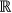 和 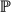 分别表示自然数（0, 1, 2, 3, ...）、实数（一个浮点数，对我们来说）和一个概率。上标表示向量的长度，因此 ¹⁰ 表示一个 10 个元素的向量，其中每个元素是一个概率（这样所有元素的总和为 1）。

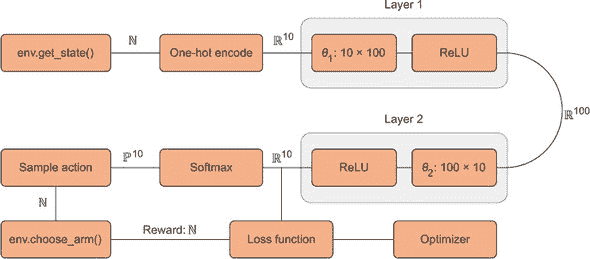

初始时，我们的神经网络将在状态 0 时产生一个随机向量，例如`[1.4, 50, 4.3, 0.31, 0.43, 11, 121, 90, 8.9, 1.1]`。我们将对这个向量运行 softmax 并采样一个动作，最可能的选择是动作 6（从动作 0 到 9），因为这是示例向量中的最大数字。选择动作 6 将产生一个奖励，比如 8。然后我们训练我们的神经网络产生向量`[1.4, 50, 4.3, 0.31, 0.43, 11, 8, 90, 8.9, 1.1]`，因为这是我们为动作 6 收到的真实奖励，其余的值保持不变。下一次当神经网络看到状态 0 时，它将为动作 6 产生一个更接近 8 的奖励预测。随着我们在许多状态和动作上不断这样做，神经网络最终将学会根据状态预测每个动作的准确奖励。因此，我们的算法将能够每次选择最佳动作，最大化我们的奖励。

以下代码导入必要的库并设置了一些*超参数*（用于指定模型结构的参数）：

```
import numpy as np
import torch

arms = 10
N, D_in, H, D_out = 1, arms, 100, arms
```

在前面的代码中，`N`是批量大小，`D_in`是输入维度，`H`是隐藏维度，`D_out`是输出维度。

现在我们需要设置我们的神经网络模型。它是一个简单的顺序（前馈）神经网络，与我们之前描述的一样，包含两层。

```
model = torch.nn.Sequential(
    torch.nn.Linear(D_in, H),
    torch.nn.ReLU(),
    torch.nn.Linear(H, D_out),
    torch.nn.ReLU(),
)
```

在这里，我们将使用均方误差损失函数，但其他函数也可能适用。

```
loss_fn = torch.nn.MSELoss()
```

现在，我们通过实例化`ContextBandit`类并为其构造函数提供臂的数量来设置一个新的环境。记住，我们已经设置了环境，使得臂的数量将与状态的数量相等。

```
env = ContextBandit(arms)
```

算法的`main`循环将与我们的原始*n*-armed bandit 算法非常相似，但我们增加了一步，即运行一个神经网络并使用其输出选择一个动作。我们将定义一个名为`train`的函数（如代码清单 2.10 所示），该函数接受我们之前创建的环境实例、我们想要训练的 epoch 数和学习率。

在函数中，我们将为当前状态设置一个 PyTorch 变量，我们需要使用`one_hot(...)`编码函数对其进行 one-hot 编码：

```
def one_hot(N, pos, val=1):
    one_hot_vec = np.zeros(N)
    one_hot_vec[pos] = val
    return one_hot_vec
```

一旦我们进入主训练`for`循环，我们将使用随机初始化的当前状态向量运行我们的神经网络模型。它将返回一个表示其对每个可能动作值猜测的向量。最初，由于没有经过训练，模型将输出一些随机值。

我们将在模型的输出上运行 softmax 函数，以生成一个关于动作的概率分布。然后我们将使用环境的 `choose_arm(...)` 函数选择一个动作，该函数将返回执行该动作产生的奖励；它还将更新环境的当前状态。我们将奖励（它是一个非负整数）转换为一个 one-hot 向量，我们可以将其用作我们的训练数据。然后我们将使用我们给模型的当前状态运行一个反向传播步骤，给定这个奖励向量。由于我们使用神经网络模型作为我们的动作值函数，我们不再有任何存储“记忆”的动作值数组；一切都被编码在神经网络的权重参数中。整个 `train` 函数如下所示。

##### 列表 2.10\. 主要训练循环

```
def train(env, epochs=5000, learning_rate=1e-2):
    cur_state = torch.Tensor(one_hot(arms,env.get_state()))             *1*
    optimizer = torch.optim.Adam(model.parameters(), lr=learning_rate)
    rewards = []
    for i in range(epochs):
        y_pred = model(cur_state)                                       *2*
        av_softmax = softmax(y_pred.data.numpy(), tau=2.0)              *3*
        av_softmax /= av_softmax.sum()                                  *4*
        choice = np.random.choice(arms, p=av_softmax)                   *5*
        cur_reward = env.choose_arm(choice)                             *6*
        one_hot_reward = y_pred.data.numpy().copy()                     *7*
        one_hot_reward[choice] = cur_reward                             *8*
        reward = torch.Tensor(one_hot_reward)
        rewards.append(cur_reward)
        loss = loss_fn(y_pred, reward)
        optimizer.zero_grad()
        loss.backward()
        optimizer.step()
        cur_state = torch.Tensor(one_hot(arms,env.get_state()))         *9*
    return np.array(rewards)
```

+   ***1*** 获取环境当前状态；将其转换为 PyTorch 变量

+   ***2*** 运行神经网络正向以获取奖励预测

+   ***3*** 将奖励预测转换为 softmax 概率分布

+   ***4*** 归一化分布以确保其总和为 1

+   ***5*** 以概率选择新的动作

+   ***6*** 执行动作，接收奖励

+   ***7*** 将 PyTorch 张量数据转换为 numpy 数组

+   ***8*** 更新 one_hot_reward 数组以用作标记的训练数据

+   ***9*** 更新当前环境状态

运行这个函数。当我们对这个网络训练 5,000 个周期时，我们可以绘制训练时间内获得的奖励的移动平均值（见图 2.7；我们省略了生成此类图表的代码）。我们的神经网络确实学会了关于状态、动作和奖励之间关系的一个相当好的理解，对于这个上下文赌博。任何一次游戏的最高奖励支付为 10，我们的平均值大约为 8.5，这接近于这个特定赌博的数学最优值。我们的第一个深度强化学习算法起作用了！好吧，这不是一个非常深的网络，但仍然！

##### 图 2.7\. 使用两层神经网络作为动作值函数，展示使用上下文赌博模拟器玩游戏的平均奖励的训练图。我们可以看到，在训练时间内平均奖励迅速增加，这表明我们的神经网络正在成功学习。

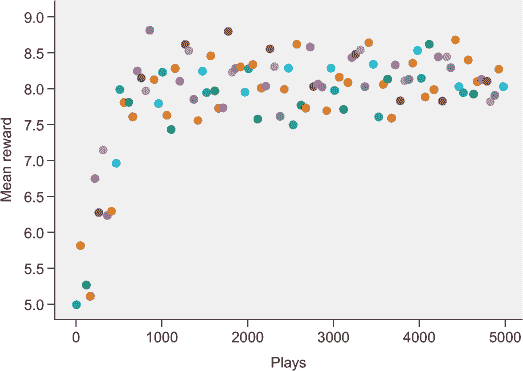

### 2.6\. 马尔可夫性质

在我们的上下文赌博问题中，我们的神经网络引导我们根据当前状态选择最佳动作，而不参考任何其他先前状态。我们只给它当前状态，它就为每个可能的动作产生了预期的奖励。这是强化学习中一个重要的性质，称为*马尔可夫性质*。如果一个游戏（或任何其他控制任务）表现出马尔可夫性质，那么它被称为*马尔可夫决策过程*（MDP）。在 MDP 中，当前状态本身就包含了足够的信息来选择最优动作以最大化未来的奖励。将控制任务建模为 MDP 是强化学习中的一个关键概念。

MDP 模型极大地简化了强化学习问题，因为我们不需要考虑所有先前的状态或动作——我们不需要记忆，我们只需要分析当前的情况。因此，我们总是试图将问题建模为（至少是近似地）马尔可夫决策过程。纸牌游戏 21 点（也称为 21 点）是一个 MDP，因为我们只需要知道我们的当前状态（我们有什么牌，以及庄家的明牌）就能成功玩游戏。

为了测试你对马尔可夫性质的理解，考虑以下列表中的每个控制问题或决策任务，看看它是否具有马尔可夫性质：

+   驾驶汽车

+   决定是否投资股票

+   为患者选择治疗方案

+   诊断患者的疾病

+   预测哪支足球队会在足球比赛中获胜

+   选择到某个目的地的最短路线（按距离）

+   用枪瞄准射击远距离目标

好的，让我们看看你的表现。以下是我们的答案和简要解释：

+   驾驶汽车通常可以被认为是具有马尔可夫性质的，因为你不需要知道 10 分钟前发生了什么，就能最优地驾驶你的车。你只需要知道现在一切的位置以及你想去的地方。

+   决定是否投资股票并不符合马尔可夫性质的准则，因为你需要了解股票的过去表现来做出决定。

+   为患者选择治疗方案似乎具有马尔可夫性质，因为你不需要知道一个人的生平就能为他们现在的疾病选择一个好的治疗方案。

+   相比之下，*诊断*（而不是治疗）肯定需要了解过去的状态。了解患者症状的历史过程对于做出诊断通常非常重要。

+   预测哪支足球队会赢并不具有马尔可夫性质，因为，就像股票的例子一样，你需要了解足球队过去的性能来做出良好的预测。

+   选择到目的地的最短路线具有马尔可夫性质，因为你只需要知道不同路线到目的地的距离，这并不取决于昨天发生了什么。

+   用枪瞄准射击远距离目标也具有马尔可夫性质，因为你只需要知道目标在哪里，以及可能的风速和你的枪的细节。你不需要知道昨天的风速。

我们希望你能理解，对于一些例子，你可以为它是否具有马尔可夫属性提出论点。例如，在诊断患者时，你可能需要知道他们症状的近期历史，但如果这些信息记录在他们的病历中，并且我们将完整的病历视为我们的当前状态，那么我们就有效地诱导了马尔可夫属性。这一点很重要：许多问题可能并不 *自然地* 具有马尔可夫属性，但通常我们可以通过将更多信息纳入状态来诱导它。

DeepMind 的深度 Q 学习（或深度 Q 网络）算法通过仅使用原始像素数据和当前得分来学习玩 Atari 游戏。Atari 游戏具有马尔可夫属性吗？并不完全如此。在 Pacman 游戏中，如果我们当前的状态是当前帧的原始像素数据，我们就无法知道几格之外的敌人是向我们靠近还是远离我们，而这会强烈影响我们选择采取的行动。这就是为什么 DeepMind 的实现实际上输入了最后四帧的游戏画面，有效地将一个非 MDP 转换成了一个 MDP。有了最后四帧，智能体可以访问所有玩家的方向和速度。

图 2.8 给出了一个轻松的例子，展示了如何使用我们迄今为止讨论的所有概念来构建马尔可夫决策过程。你可以看到有三个元素的状态空间 `S = {哭泣的婴儿，睡着的婴儿，微笑的婴儿}` 和一个两个元素的动作空间 `A = {喂食，不喂食}`。此外，我们还标注了转移概率，这些是从动作到结果状态概率的映射（我们将在下一节中再次讨论这一点）。当然，在现实生活中，作为 *智能体* 的你并不知道这些转移概率。如果你知道了，你将拥有环境的 *模型*。正如你将学到的，有时智能体确实可以访问环境的模型，有时则不行。在智能体无法访问模型的情况下，我们可能希望我们的智能体学习环境的模型（这可能只是对真实、潜在模型的近似）。

##### 图 2.8. 一个具有三个状态和两个动作的简化 MDP 图。在这里，我们模拟了照顾婴儿的育儿决策过程。如果婴儿在哭泣，我们可以选择喂食或不喂食，并且有一定概率婴儿会过渡到新的状态，我们将会收到 -1、+1 或 +2（根据婴儿的满意度）的奖励。

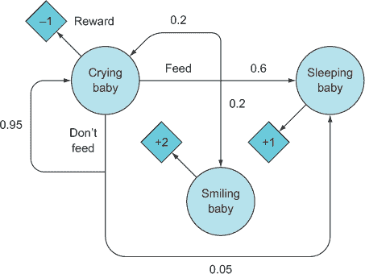

### 2.7. 预测未来奖励：值函数和策略函数

信不信由你，我们实际上已经在前面的章节中巧妙地融入了很多知识。我们对 n 臂老虎机和上下文老虎机问题的解决方案是标准的强化学习方法，因此，我们所做的一切背后有一整套已建立的术语和数学。我们已经介绍了一些术语，例如状态空间和动作空间，但我们主要只是用自然语言描述了这些内容。为了让你理解最新的强化学习研究论文，以及让我们将未来的章节写得更加简洁，了解这些术语和数学是非常重要的。

让我们回顾和形式化你到目前为止所学的知识（总结在图 2.9 中）。强化学习算法本质上构建了一个**代理**，它在某个**环境**中行动。环境通常是游戏，但更一般地说，是任何产生状态、动作和奖励的过程。代理可以访问环境的当前状态，这是在特定时间点关于环境的所有数据，即 s[t] ε *S*。使用这些状态信息，代理采取一个动作，a[t] ε *A*，这个动作可能确定性地或以概率改变环境，使其处于新状态，s[t] [+1]。

##### 图 2.9. 强化学习算法的一般过程。环境产生状态和奖励。代理在时间 t 给定状态 s[t]时采取一个动作 a[t]，并接收一个奖励 r[t]。代理的目标是通过学习在给定状态下采取最佳动作来最大化奖励。

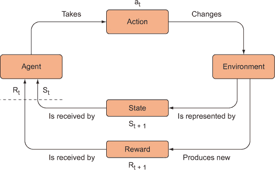

通过采取一个动作将一个状态映射到新状态的概率称为**转移概率**。代理在状态 s[t]中采取动作 a[t]，导致新状态 s[t] [+1]，从而获得奖励 r[t]。我们知道代理（我们的强化学习算法）的最终目标是最大化其奖励。实际上产生奖励的是状态转移，即 s[t] → s[t] [+1]，而不是动作本身，因为动作可能以概率导致一个坏状态。如果你在一场动作电影中（无意中用了双关语）从屋顶跳到另一座屋顶，你可能优雅地落在另一座屋顶上，或者完全错过并摔下来——你的危险（两种可能的结果状态）比你跳了（动作）更重要。

#### 2.7.1. 策略函数

我们究竟如何使用当前状态信息来决定采取什么动作？这正是**值函数**和**策略函数**的关键概念发挥作用的地方，我们对这些概念已经有一些经验了。让我们首先解决策略问题。

用话来说，策略，π，是智能体在某个环境中的策略。例如，黑杰克游戏中庄家的策略是始终抽牌直到达到 17 点或更高。这是一个简单的固定策略。在我们的 *n*-armed bandit 问题中，我们的策略是ε-贪婪策略。一般来说，策略是一个将状态映射到该状态下可能动作的概率分布的函数。

##### 表 2.5\. 策略函数

| 数学 | 英语 |
| --- | --- |
| π; *s* → *Pr*(*A* | *s*), 其中 *s* ∈ *S* | 策略，π，是从状态到该状态下（概率上）最佳动作的映射。 |

在数学符号中，*s* 是一个状态，*Pr*(*A* | *s*) 是给定状态 *s* 的动作集合 *A* 的概率分布。分布中每个动作的概率是该动作产生最大奖励的概率。

#### 2.7.2\. 最优策略

策略是我们强化学习算法的一部分，它根据当前状态选择动作。然后我们可以制定*最优策略*——它是最大化奖励的策略。

##### 表 2.6\. 最优策略

| 数学 | 英语 |
| --- | --- |
| *π** = arg*max E*(*R* | *π*), | 如果我们知道遵循任何可能策略，*π*，的期望奖励，那么最优策略，*π**，是一个策略，当遵循时，会产生最大可能的奖励。 |

记住，特定的策略是一个映射或函数，因此我们有一组可能的政策；最优策略只是这个可能政策集上的一个 `argmax`（它选择最大值），作为它们期望奖励的函数。

再次，强化学习算法（我们的智能体）的整体目标是为了选择能够导致最大期望奖励的动作。但我们可以通过两种方式来训练我们的智能体实现这一目标：

+   ***直接方式——*** 我们可以教会智能体学习在给定状态下哪些动作是最好的。

+   ***间接方式——*** 我们可以教会智能体学习哪些状态最有价值，然后采取导致最有价值状态的行动。

这种间接方法引导我们产生了价值函数的概念。

#### 2.7.3\. 价值函数

*价值函数*是将状态或状态-动作对映射到*期望值*（期望奖励）的函数。你可能还记得从统计学中，期望奖励只是处于某个状态或采取某个动作后收到的奖励的长期平均值。当我们提到*价值函数*时，我们通常指的是状态价值函数。

##### 表 2.7\. 状态价值函数

| 数学 | 英语 |
| --- | --- |
| *V**[π]*: *s* → *E*(*R* | *s*,*π*), | 价值函数，*V**[π]*，是一个将状态，*s*，映射到期望奖励的函数，前提是我们从状态 *s* 开始，并遵循某种策略，*π*。 |

这是一个接受状态*s*并返回从该状态开始并按照我们的策略*π*采取行动的预期奖励的函数。可能不会立即明显为什么值函数依赖于策略。考虑在我们的情境式老虎机问题中，如果我们的策略是完全随机选择行动（即从均匀分布中采样行动），那么状态的价值（预期奖励）可能相当低，因为我们肯定不是选择最佳可能的行动。相反，我们希望使用一个不是行动上的均匀分布的策略，而是当采样时会产生最大奖励的概率分布。也就是说，策略决定了观察到的奖励，而值函数是观察到的奖励的反映。

在我们第一个*n*-armed 老虎机问题中，你被介绍到了状态-行动值函数。这些函数通常被称为*Q 函数*或*Q 值*，这就是深度 Q 学习的来源，因为正如你将在下一章中看到的，深度学习算法可以用作 Q 函数。

##### 表 2.8. 行动-值（Q）函数

| 数学 | 英语 |
| --- | --- |
| *Q**[π]*: (*s* | *a*) → *E*(*R* | *a*,*s*,*π*)， | *Q**[π]*是一个函数，它将状态*s*和行动*a*的配对映射到在状态*s*采取行动*a*的预期奖励，假设我们使用策略（或“策略”）*π*。 |

实际上，我们实现了一个深度 Q 网络来解决我们的情境式老虎机问题（尽管它是一个非常浅层的神经网络），因为它本质上充当了一个 Q 函数。我们训练它产生给定状态采取行动的预期奖励的准确估计。我们的策略函数是神经网络输出的 softmax 函数。

我们仅仅通过使用*n*-armed 和情境式老虎机作为例子，就已经涵盖了强化学习中的许多基础概念。在本章中，我们也尝试了深度强化学习。在下一章中，我们将实现一个类似于 DeepMind 用于在超级人类水平上玩 Atari 游戏的算法的全功能深度 Q 网络。这将是我们在这里所涵盖内容的自然扩展。

### 摘要

+   状态空间是系统可能处于的所有可能状态的集合。在象棋中，这将是一组所有有效的棋盘配置。一个行动是将状态*s*映射到新状态*s*′的函数。一个行动可能是随机的，这样它就将以概率将状态*s*映射到新状态*s*′。可能存在一个概率分布，它覆盖了可能的新状态的集合，从中选择一个。行动空间是特定状态的所有可能行动的集合。

+   环境是状态、行动和奖励的来源。如果我们正在构建一个用于玩游戏的游戏 RL 算法，那么游戏就是环境。环境模型是对状态空间、行动空间和转移概率的近似。

+   奖励是环境产生的信号，表示在给定状态下采取行动的相对成功。预期奖励是一个统计概念，非正式地指代随机变量 *X*（在我们的案例中，是奖励）的长期平均价值，表示为 *E*[*X*]。例如，在 *n*-臂老虎机案例中，*E*[*R*|*a*]（给定行动 *a* 的预期奖励）是采取每个 *n*-个行动的长期平均奖励。如果我们知道行动 *a* 的概率分布，那么我们可以计算出 *N* 次游戏预期奖励的精确值，如 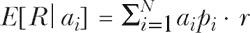 所示，其中 *N* 是游戏的次数，*p[i]* 指的是行动 *a[i]* 的概率，而 *r* 指的是可能的最大奖励。

+   代理是一种 RL 算法，它学会在给定环境中以最佳方式行为。代理通常实现为深度神经网络。代理的目标是最大化预期奖励，或者等价地，导航到价值最高的状态。

+   政策是一种特定的策略。正式地说，它是一个函数，要么接受一个状态并产生一个要采取的行动，要么在给定状态的情况下，在动作空间上产生一个概率分布。一个常见的策略是ε-贪婪策略，其中以概率ε我们在动作空间中采取一个随机行动，以概率ε – 1 我们选择我们迄今为止所知的最佳行动。

+   通常，价值函数是任何返回给定相关数据的预期奖励的函数。在没有额外上下文的情况下，它通常指的是状态价值函数，这是一个接受一个状态并返回从该状态开始并按照某些策略采取行动的预期奖励的函数。Q 值是在给定状态-动作对的情况下给出的预期奖励，Q 函数是在给定状态-动作对的情况下产生 Q 值的函数。

+   马尔可夫决策过程是一种决策过程，通过它可以在不参考先前状态历史的情况下做出最佳决策。

## 第三章\. 预测最佳状态和行动：深度 Q 网络

*本章涵盖*

+   将 Q 函数实现为神经网络

+   使用 PyTorch 构建深度 Q 网络来玩 Gridworld

+   使用经验回放对抗灾难性遗忘

+   使用目标网络提高学习稳定性

在本章中，我们将从深度强化学习革命开始的地方开始：DeepMind 的深度 Q 网络，它学会了玩 Atari 游戏。我们目前不会使用 Atari 游戏作为我们的测试平台，但我们将构建 DeepMind 所构建的几乎相同的系统。我们将使用一个简单的基于控制台的游戏 Gridworld 作为我们的游戏环境。

网格世界实际上是一系列类似的游戏，但它们通常都涉及一个网格板、一个玩家（或智能体）、一个目标方块（“目标”），以及可能的一个或多个特殊方块，这些方块可能是障碍物或可能提供负面或正面的奖励。玩家可以向上、向下、向左或向右移动，游戏的目标是将玩家移动到目标方块，在那里玩家将获得正面的奖励。玩家不仅必须到达目标方块，而且必须遵循最短路径，他们可能需要通过各种障碍。

### 3.1\. Q 函数

我们将使用一个非常简单的网格世界引擎，该引擎包含在本书的 GitHub 仓库中。您可以在第三章文件夹中下载它：[`mng.bz/JzKp`](http://mng.bz/JzKp)。

图 3.1 中所示的网格世界游戏显示了我们将从其开始的简单版本的网格世界；我们将逐步解决游戏的更复杂变体。我们的初始目标是训练一个深度强化学习智能体，使其能够每次都遵循最有效的路线导航网格世界板到目标。但在我们深入之前，让我们回顾一下前一章中的关键术语和概念，我们将在本章继续使用它们。

##### 图 3.1\. 这是一个简单的网格世界游戏设置。智能体（A）必须沿着最短路径导航到目标方块（+），并避免掉入陷阱（–）。

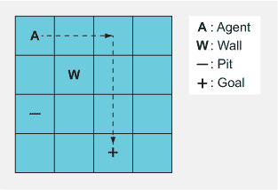

*状态* 是我们的智能体接收并用于决定采取什么行动的信息。它可能是视频游戏的原始像素，自动驾驶汽车的传感器数据，或者在网格世界的情况下，表示网格上所有对象位置的张量。

*策略*，表示为 *π*，是智能体在给定状态时遵循的策略。例如，在二十一点中，策略可能是查看我们的手牌（状态）并随机出牌或停留。虽然这会是一个糟糕的策略，但需要强调的重要一点是，策略决定了我们采取哪些行动。一个更好的策略可能是始终出牌直到我们拥有 19 点。

*奖励* 是智能体采取行动后获得的反馈，导致我们进入新的状态。对于棋类游戏，当智能体采取导致对方被将死的行动时，我们可以奖励智能体 +1，而对于导致智能体被将死的行动，则奖励 -1。其他所有状态都可以奖励 0，因为我们不知道智能体是否获胜。

我们的智能体根据其策略 *π* 采取一系列行动，并重复此过程直到剧集结束，从而我们得到一系列状态、行动和相应的奖励。


我们将遵循从起始状态 *S* 的策略得到的奖励加权和称为该状态的价值，或状态价值。我们可以用 *值函数 V**[π]*(*s*) 来表示，它接受一个初始状态并返回期望的总奖励。

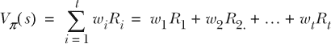

系数 *w*[1]，*w*[2]，等等，是我们对奖励进行求和之前应用的权重。例如，我们通常希望更近期的奖励比远期奖励更重要。这个加权总和是一个期望值，在许多定量领域中是一个常见的统计量，通常简记为 *E*[*R* |*π*,*s*]，读作“给定策略 *π* 和起始状态 *s* 的期望奖励。”同样，还有一个 *动作值函数，Q**[π]*(*s*,*a*)，它接受一个状态 *S* 和一个动作 *A*，并返回在给定该状态下采取该动作的价值；换句话说，*E*[*R* |*π*,*s,a*]。一些 RL 算法或实现将使用其中一个。

重要的是，如果我们基于学习状态值（而不是动作值）的算法，我们必须记住状态的价值完全取决于我们的策略，*π*。以 21 点为例，如果我们处于拥有 20 点牌的总数的状态，并且有两个可能的行为，击牌或停牌，这个状态的价值只有在我们的策略说在拥有 20 点时停牌时才高。如果我们的策略说在拥有 20 点时击牌，我们可能会爆牌并输掉游戏，因此这个状态的价值就会低。换句话说，状态的价值等同于在该状态下采取的最高动作的价值。

### 3.2. 使用 Q 学习导航

2013 年，DeepMind 发表了一篇题为“使用深度强化学习玩 Atari”的论文，概述了他们对旧算法的新方法，这使得他们能够以创纪录的水平玩六款中的七款 Atari 2600 游戏。关键的是，他们使用的算法仅依赖于分析游戏的原始像素数据，就像人类一样。这篇论文真正开启了深度强化学习的领域。

他们修改的旧算法被称为 *Q 学习*，它已经存在了几十年。为什么需要这么长时间才取得如此显著的进步？很大一部分原因是由于几年前，随着 GPU 的使用，人工神经网络（深度学习）得到了普遍的推动，这使得训练更大的网络成为可能。但很大一部分原因是由于 DeepMind 实施的一些特定新颖功能，以解决强化学习算法所面临的某些其他问题。我们将在本章中涵盖所有内容。

#### 3.2.1. 什么是 Q 学习？

你问什么是 Q 学习？如果你猜到它与之前描述的动作值函数 *Q**[π]*(*s*,*a*) 有关，你就对了，但这只是故事的一小部分。Q 学习是学习最优动作值的一种特定方法，但还有其他方法。也就是说，价值函数和动作值函数是强化学习中的通用概念，出现在许多地方；Q 学习是使用这些概念的特定算法。

信不信由你，我们在上一章构建神经网络以优化广告放置问题时，实际上已经实现了一种 Q-learning 算法。Q-learning 的主要思想是，你的算法预测状态-动作对的价值，然后你将这个预测与在某个较晚时间观察到的累积奖励进行比较，并更新你的算法参数，以便下次它能做出更好的预测。这正是我们在上一章所做的事情，当时我们的神经网络预测了给定状态下每个动作的预期奖励（价值），观察到了实际奖励，并相应地更新了网络。这是一个特定且简单的 Q-learning 算法实现，它属于以下更新规则描述的更广泛类别：

##### 表 3.1\. Q-learning 更新规则

| **数学** |
| --- |
| 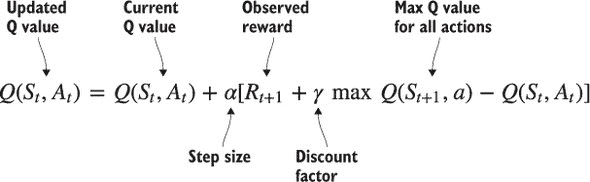 |
| **伪代码** |

|

```
def get_updated_q_value(old_q_value, reward, state, step_size, discount):
     term2 = (reward + discount * max([Q(state, action) for action in
              actions])
     term2 = term2 – old_q_value
     term2 = step_size * term2
     return (old_q_value + term2)
```

|

| **英文** |
| --- |
| 在时间 *t* 的 Q 值更新为当前的预测 Q 值加上我们期望在未来的价值量，前提是我们从当前状态进行最优操作。 |

#### 3.2.2\. 解决 Gridworld

你现在已经看到了 Q-learning 的公式。让我们退一步，将这个公式应用于我们的 Gridworld 问题。本章的目标是训练一个神经网络从零开始玩一个简单的 Gridworld 游戏。代理将能够访问的信息与人类玩家一样，即游戏板的外观；算法没有信息优势。此外，我们从一个未训练的算法开始，所以它实际上对世界一无所知。它对游戏如何运作没有任何先验信息。我们将提供的是达到目标时的奖励。能够从零开始教会算法学习玩游戏的事实实际上相当令人印象深刻。

与我们人类生活在看似连续的时间流中不同，算法生活在离散的世界中，因此在每个离散时间步都需要发生某些事情。在时间步 1，算法将“查看”游戏板并决定采取什么行动。然后游戏板将被更新，依此类推。

现在我们来详细描述这个过程的细节。以下是 Gridworld 游戏的事件序列。

1.  我们从某个称为 *S[t]* 的状态开始游戏。状态包括我们拥有的关于游戏的所有信息。对于我们的 Gridworld 示例，游戏状态表示为一个 4 × 4 × 4 张量。当我们实现算法时，我们将详细介绍关于游戏板的详细信息。

1.  我们将 *S[t]* 数据和一个候选动作输入到一个深度神经网络（或某些其他复杂的机器学习算法）中，它会产生一个预测，即在该状态下采取该动作的价值（参见图 3.2）。

    ##### 图 3.2\. Q 函数可以是接受状态和动作并返回该动作在给定状态下价值的任何函数。

    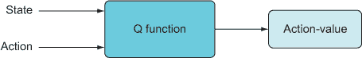

    记住，算法并不是预测采取特定动作后我们将获得的奖励；它预测的是期望值（期望奖励），这是我们采取一个状态中的动作并继续根据我们的策略 *π* 行为时将获得的长期平均奖励。我们为此状态中我们可以采取的几个（也许所有）可能动作做这件事。

1.  我们采取一个动作，可能是因为我们的神经网络预测它是最高价值的动作，或者我们随机采取一个动作。我们将这个动作标记为 *A[t]*。我们现在处于游戏的新状态，我们将称之为 *S[t]*[+1]，并且我们收到或观察到奖励，标记为 *R[t]*[+1]。我们希望更新我们的学习算法，以反映我们采取它预测为最佳动作后实际收到的奖励。也许我们得到了一个负奖励或一个非常大的奖励，我们希望提高算法预测的准确性（参见图 3.3）。

    ##### 图 3.3\. 使用 Gridworld 的 Q-learning 概念图。Q 函数接受一个状态和一个动作，并返回该状态-动作对的预测奖励（价值）。采取动作后，我们观察到奖励，并使用更新公式，我们使用这个观察结果来更新 Q 函数，使其做出更好的预测。

    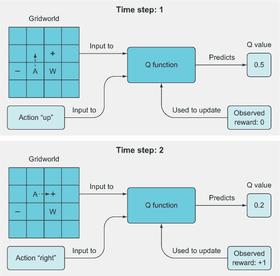

1.  现在我们使用 *S[t]*[+1] 作为输入运行算法，并找出我们的算法预测具有最高价值的动作。我们将这个值称为 *Q*(*S[t]*[+1],*a*)。为了清楚起见，这是一个单一的价值，它反映了给定我们的新状态和所有可能动作的最高预测 *Q* 值。

1.  现在我们已经拥有了更新算法参数所需的所有部件。我们将使用一些损失函数，例如均方误差，进行一次训练迭代，以最小化我们算法预测值与目标预测值 *Q*(*S[t]*,*A[t]*) + *α**[*R[t]*[+1] + *γ**max*Q*(*S[t]*[+1],*A*) – *Q*(*S[t]*,*A[t]*) 之间的差异。

#### 3.2.3\. 超参数

参数 *γ* 和 *α* 被称为 *超参数*，因为它们是影响算法学习但不在实际学习过程中涉及的参数。参数 α 是 *学习率*，它与训练许多机器学习算法时使用的相同超参数相同。它控制我们希望算法从每次移动中学习的速度：小值意味着它将在每一步只进行小的更新，而大值意味着算法可能会进行大的更新。

#### 3.2.4\. 折现因子

参数 γ，即 *折现因子*，是一个介于 0 和 1 之间的变量，它控制我们的代理在做出决策时对未来奖励的折现程度。让我们举一个简单的例子。我们的代理面临一个选择：选择一个导致 0 奖励然后 +1 奖励的动作，或者选择一个导致 +1 然后是 0 奖励的动作（参见图 3.4）。

##### 图 3.4. 一个动作轨迹的插图，展示了导致相同总奖励但可能被不同地评估的情况，因为最近的奖励通常比遥远的奖励更有价值。

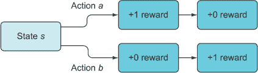

在之前，我们将轨迹的价值定义为期望奖励。图 3.4 中的两个轨迹虽然都提供了+1 的总奖励，但哪个动作序列算法应该优先考虑？我们如何打破这种平局？嗯，如果折现因子γ小于 1，我们将比即时奖励更多地折现未来奖励。在这个简单的情况下，尽管两条路径都导致总奖励为+1，但动作*b*获得+1 奖励的时间晚于动作*a*，而且由于我们会对未来的动作进一步折现，所以我们更喜欢动作*a*。我们将动作*b*中的+1 奖励乘以一个小于 1 的权重因子，这样就将奖励从+1 降低到 0.8 左右，因此动作的选择就变得清晰了。

折现因子不仅在现实生活而且在强化学习（RL）中都会出现。假设有人现在给你 100 美元，或者一个月后给你 110 美元。大多数人更愿意现在就拿到钱，因为我们多少会折现未来，这是有道理的，因为未来是不确定的（如果给你钱的人两周后去世怎么办？）。你现实生活中的折现因子将取决于一个人必须给你多少一个月后的钱，才能让你对选择那个选项和现在拿到 100 美元无动于衷。如果你只愿意在一个月后接受 200 美元，而现在是 100 美元，那么你的折现因子将是 100/200 = 0.5（每月）。这意味着，如果有人要在两个月后给你 400 美元，你才会选择那个选项而不是现在拿到 100 美元，因为我们会对 1 个月折现 0.5，然后对下一个月再折现 0.5，即 0.5 × 0.5 = 0.25，而 100 = 0.25*x*，所以*x* = 400。也许你可能会发现折现随时间呈指数级变化的模式。具有折现因子*γ*（0,1)）的某物在时间*t*的价值是*γ**^t*。

折现因子需要介于 0 和 1 之间，我们不应该将其恰好设置为 1，因为如果我们完全不进行折现，我们就必须考虑未来奖励无限期地延伸到未来，这在实践中是不可能的。即使我们以 0.99999 进行折现，也终将到来一个时间点，在此之后我们不再考虑任何数据，因为它们将被折现到 0。

在 Q 学习（Q-learning）中，我们面临相同的决策：在预测 Q 值时，我们考虑未来观察到的奖励有多少？遗憾的是，对此没有明确的答案，或者对设置我们能够控制的几乎所有超参数都没有明确的答案。我们只能对这些旋钮进行实验，看看什么在经验上效果最好。

值得指出的是，大多数游戏都是**分集式**的，这意味着在游戏结束之前有多次采取行动的机会，而像棋类游戏这样的游戏通常不会对除了赢得或输掉游戏之外的其他任何事情分配分数。因此，这些游戏中的奖励信号是稀疏的，这使得基于试错的学习难以可靠地学习任何东西，因为它需要频繁地看到奖励。

在 Gridworld 中，我们设计游戏的方式是，任何没有赢得游戏的移动都会得到-1 的奖励，赢得游戏的移动会得到+10 的奖励，而输掉游戏的移动会得到-10 的奖励。实际上，只有在游戏的最后一步，算法才能说“啊哈！我现在明白了！”由于 Gridworld 游戏的每一局可以在相当少的移动次数内赢得，稀疏奖励问题并不是太严重，但在其他游戏中，这是一个如此严重的问题，以至于即使是最先进的强化学习算法也还没有达到人类水平的性能。一种处理这个问题的方法是停止依赖最大化预期奖励的目标，而是指导算法寻求新颖性，通过这种方式，它将了解其环境，这是我们将在[第八章中讨论的内容。

#### 3.2.5. 构建网络

让我们深入了解我们将如何构建这个游戏的深度学习算法。回想一下，神经网络具有特定的架构或网络拓扑。当你构建一个神经网络时，你必须决定它应该有多少层，每层有多少参数（层的“宽度”），以及层是如何连接的。Gridworld 足够简单，我们不需要构建任何复杂的东西。我们可以使用只有几层的相当直接的馈前神经网络，使用典型的 ReLU 激活单元。唯一需要更多思考的部分是我们将如何表示我们的输入数据，以及我们将如何表示输出层。

我们首先讨论输出层。在我们对 Q 学习的讨论中，我们说 Q 函数是一个函数，它接受一些状态和一些动作，并计算该状态-动作对的价值，即*Q*(*s*,*a*)。这就是 Q 函数最初是如何定义的（图 3.5）。正如我们在上一章中指出的，还有一个状态值函数，通常表示为*V**[π]*(*s*)，它计算在遵循特定策略*π*的情况下某个状态的价值。

##### 图 3.5。原始的 Q 函数接受一个状态-动作对，并返回该状态-动作对的价值——一个单一的数字。DeepMind 使用了一个修改过的向量值 Q 函数，它接受一个状态并返回一个状态-动作值向量，每个可能的动作对应输入状态的一个值。向量值 Q 函数更高效，因为你只需要为所有动作计算一次函数。

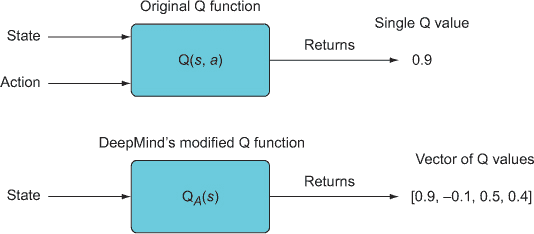

通常，我们希望使用 Q 函数，因为它可以告诉我们处于某个状态时采取某个动作的价值，因此我们可以选择具有最高预测价值的动作。但是，考虑到 Q 函数最初是这样定义的，即使对于每个可能的动作单独计算 Q 值会相当浪费。一个更有效的方法，也是 DeepMind 在其深度 Q 学习实现中采用的方法，是将 Q 函数重新定义为向量值函数，这意味着它将计算给定某个状态的所有动作的 Q 值，并返回所有这些 Q 值的向量。因此，我们可以将这个新版本的 Q 函数表示为 *Q[A]*(*s*)，其中下标 *A* 表示所有可能动作的集合（图 3.5）。

现在很容易将神经网络作为我们的 *Q[A]*(*s*) 版本的 Q 函数；最后一层将简单地输出一个 Q 值向量——每个可能的动作对应一个。在 Gridworld 的情况下，只有四种可能的动作（上、下、左、右），所以输出层将产生 4 维向量。然后我们可以直接使用神经网络的输出，通过某种动作选择程序来决定采取什么动作，例如简单的 ε-greedy 方法或 softmax 选择策略。在本章中，我们将使用 ε-greedy 方法（图 3.6），并且与上一章使用静态的 ε 值不同，我们将它初始化为一个较大的值（即 1，因此我们将从完全随机的动作选择开始），然后我们将逐渐减少它，使得经过一定次数的迭代后，ε 值将停留在某个较小的值。这样，我们将在开始时允许算法探索和学习很多，但随后它将利用所学知识最大化奖励。希望我们能够设置递减过程，使其不会过度探索或不足探索，但这需要通过实验来验证。

##### 图 3.6。在 ε-greedy 动作选择方法中，我们将 ε 参数设置为某个值，例如 0.1，并且以这个概率我们将随机选择一个动作（完全忽略预测的 Q 值）或者以 1 – ε = 0.9 的概率，我们将选择与最高预测 Q 值相关的动作。一个额外的有用技术是开始时使用一个高的 ε 值，例如 1，然后在训练迭代中逐渐减少它。

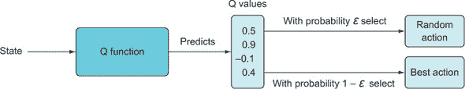

我们已经搞定了输出层——现在要解决剩下的部分。在本章中，我们将构建一个只有三层，宽度分别为 164（输入层）、150（隐藏层）、4（你已经看到的输出层）的网络。欢迎并鼓励你添加更多的隐藏层或尝试调整隐藏层的大小——你可能会通过更深层次的网络获得更好的结果。我们选择在这里实现一个相对较浅的网络，这样你就可以使用自己的 CPU 来训练模型（在我们的 MacBook Air 1.7 GHz Intel Core i7，8 GB RAM 的电脑上，训练只需要几分钟）。

我们已经讨论了为什么输出层的宽度是 4，但还没有谈到输入层。在我们这样做之前，我们需要介绍我们将要使用的 Gridworld 游戏引擎。我们为这本书开发了一个 Gridworld 游戏，它包含在本章的 GitHub 仓库中。

#### 3.2.6. 介绍 Gridworld 游戏引擎

在本章的 GitHub 仓库中，你可以找到一个名为 Gridworld.py 的文件。将此文件复制并粘贴到你将要工作的文件夹中。你可以通过运行`from Gridworld import *`将其包含在你的 Python 会话中。Gridworld 模块包含一些类和辅助函数，用于运行 Gridworld 游戏实例。要创建一个 Gridworld 游戏实例，请运行以下列表中的代码。

##### 列表 3.1. 创建 Gridworld 游戏

```
from Gridworld import Gridworld
game = Gridworld(size=4, mode='static')
```

Gridworld 棋盘始终是正方形，所以大小指的是一边的维度——在这种情况下，将创建一个 4×4 的网格。有三种初始化棋盘的方法。第一种是静态初始化，如列表 3.1 所示，这样棋盘上的对象就会初始化在相同的预定位置。第二种，你可以设置`mode='player'`，这样玩家就会在棋盘上的随机位置初始化。最后，你可以使用`mode='random'`来初始化，这样所有对象都会随机放置（这对算法的学习来说更困难）。我们最终会使用这三种选项。

现在我们已经创建了游戏，让我们来玩一玩。调用`display`方法来显示棋盘，调用`makeMove`方法来进行移动。移动用单个字母编码：*u*代表向上，*l*代表向左，等等。每次移动后，你应该显示棋盘以查看效果。此外，在每次移动后，你还将想要通过调用`reward`方法来观察移动的奖励/结果。在 Gridworld 中，每个非获胜移动都会得到-1 的奖励。获胜移动（达到目标）得到+10 的奖励，而失败移动（掉入陷阱）得到-10 的奖励。

```
>>> game.display()
array([['+', '-', ' ', 'P'],
       [' ', 'W', ' ', ' '],
       [' ', ' ', ' ', ' '],
       [' ', ' ', ' ', ' ']], dtype='<U2')

>>> game.makeMove(‘d’)
>>> game.makeMove(‘d’)
>>> game.makeMove(‘l’)
>>> game.display()
array([['+', '-', ' ', ' '],
       [' ', 'W', ' ', ' '],
       [' ', ' ', 'P', ' '],
       [' ', ' ', ' ', ' ']], dtype='<U2')
>>> game.reward()
-1
```

现在我们来看看游戏状态是如何实际表示的，因为我们需要将其输入到我们的神经网络中。运行以下命令：

```
>>> game.board.render_np()
array([[[0, 0, 0, 0],
        [0, 0, 0, 0],
        [0, 0, 1, 0],
        [0, 0, 0, 0]],

       [[1, 0, 0, 0],
        [0, 0, 0, 0],
        [0, 0, 0, 0],
        [0, 0, 0, 0]],

       [[0, 1, 0, 0],
        [0, 0, 0, 0],
        [0, 0, 0, 0],
        [0, 0, 0, 0]],

       [[0, 0, 0, 0],
        [0, 1, 0, 0],
        [0, 0, 0, 0],
        [0, 0, 0, 0]]], dtype=uint8)

>>> game.board.render_np().shape
(4, 4, 4)
```

状态被表示为一个 4 × 4 × 4 的张量，其中第一个维度索引一组四个 4 × 4 大小的矩阵。你可以将其解释为具有*帧*、*高度*和*宽度*的维度。每个矩阵是一个 4 × 4 的全零网格和一个单独的 1，其中 1 表示特定对象的位臵。每个矩阵编码四个对象中的一个的位置：玩家、目标、坑和墙壁。如果你将`display`的结果与游戏状态进行比较，你可以看到第一个矩阵编码了玩家的位臵，第二个矩阵编码了目标的位臵，第三个矩阵编码了坑的位臵，最后一个矩阵编码了墙壁的位臵。

换句话说，这个 3 张量的第一个维度被划分为四个独立的网格平面，其中每个平面代表每个元素的位臵。图 3.7 展示了一个示例，其中玩家位于网格位臵(2,2)，目标位于(0,0)，坑位于(0,1)，墙壁位于(1,1)，其中平面是(行，列)。所有其他元素都是 0。

##### 图 3.7\. 这是如何将 Gridworld 棋盘表示为一个 numpy 数组的。它是一个 4 x 4 x 4 的张量，由 4 个 4 x 4 网格的“切片”组成。每个网格切片代表棋盘上单个对象的位臵，并包含一个单独的 1，其余元素为 0。1 的位置表示该切片对象的位臵。

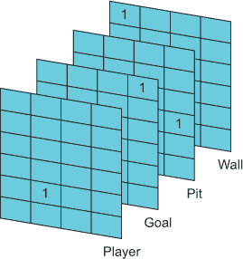

虽然原则上我们可以构建一个可以在 4 × 4 × 4 张量上操作的神经网络，但将其展平成一个 1 张量（一个向量）更容易。一个 4 × 4 × 4 张量有 4³ = 64 个总元素，因此我们神经网络的输入层必须相应地形状。神经网络将不得不学习这些数据的意义以及它与最大化奖励的关系。记住，算法一开始将一无所知。

#### 3.2.7\. 将神经网络作为 Q 函数

让我们构建一个将作为我们的 Q 函数的神经网络。正如你所知，在这本书中，我们使用 PyTorch 来构建所有的深度学习模型，但如果你更熟悉 TensorFlow 或 MXNet 等其他框架，将模型移植应该相当直接。

图 3.8 展示了我们将要构建的模型的一般架构。图 3.9 以字符串图的形式展示了它，其中包含类型化的字符串。

##### 图 3.8\. 我们将用于玩 Gridworld 的神经网络模型。该模型有一个可以接受 64 位游戏状态向量的输入层，一些隐藏层（我们使用一个，但为了普遍性，展示了两个），以及一个输出层，根据状态为每个动作生成一个 4 位的 Q 值向量。

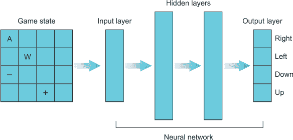

##### 图 3.9\. 我们的 DQN 的字符串图。输入是一个 64 位的布尔向量，输出是一个 4 位的 Q 值实向量。

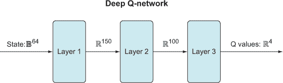

要使用 PyTorch 实现这一点，我们将使用`nn`模块，它是 PyTorch 的高级接口，类似于 TensorFlow 的 Keras。

##### 列表 3.2. 神经网络 Q 函数

```
import numpy as np
import torch
from Gridworld import Gridworld
import random
from matplotlib import pylab as plt

l1 = 64
l2 = 150
l3 = 100
l4 = 4

model = torch.nn.Sequential(
    torch.nn.Linear(l1, l2),
    torch.nn.ReLU(),
    torch.nn.Linear(l2, l3),
    torch.nn.ReLU(),
    torch.nn.Linear(l3,l4)
)
loss_fn = torch.nn.MSELoss()
learning_rate = 1e-3
optimizer = torch.optim.Adam(model.parameters(), lr=learning_rate)

gamma = 0.9
epsilon = 1.0
```

到目前为止，我们所做的一切只是设置了神经网络模型，定义了一个损失函数和学习率，设置了一个优化器，并定义了一些参数。如果这是一个简单的分类神经网络，我们几乎就完成了。我们只需要设置一个`for`循环来迭代运行优化器，以最小化模型误差。在强化学习中，这要复杂得多，这可能是你阅读这本书的原因。我们很早就详细介绍了主要步骤，但让我们再深入一点。

列表 3.3 实现了算法的主要循环。大致来说，这是它所做的事情：

1.  我们为 epoch 的数量设置了一个`for`循环。

1.  在循环中，我们设置了一个`while`循环（当游戏进行时）。

1.  我们运行 Q 网络的前向传播。

1.  我们使用 epsilon-greedy 实现，所以在时间 *t*，以概率ε我们将选择一个随机动作。以概率 1 – ε，我们将选择与我们的神经网络中最高 Q 值相关的动作。

1.  执行上一步确定的动作 *a*，并观察新的状态 s′ 和奖励 *r[t]*[+1]。

1.  使用 s′运行网络的前向传播。存储最高的 Q 值，我们将其称为 max Q。

1.  我们训练网络的目的是 *r[t]*[+1] + *γ**max*Q[A]*(*S[t]*[+1])，其中γ（伽马）是介于 0 和 1 之间的参数。如果在采取动作 *a[t]* 后游戏结束，就没有合法的 *s[t]*[+1]，因此 *γ**max*Q[A]*(*S[t]*[+1]) 是无效的，我们可以将其设置为 0。目标就变成了 *r[t]*[+1]。

1.  由于我们只有四个输出，而我们只想更新（即训练）我们刚刚采取的动作相关的输出，因此我们的目标输出向量与第一次运行时的输出向量相同，除了我们将与我们的动作相关的那个输出更改为我们使用 Q 学习公式计算出的结果。

1.  在这个样本上训练模型。然后重复步骤 2–9。

为了清楚起见，当我们第一次运行我们的神经网络并得到这样的动作值输出时，

```
array([[-0.02812552, -0.04649779, -0.08819015, -0.00723661]])
```

我们在一次迭代中的目标向量可能看起来像这样：

```
array([[-0.02812552, -0.04649779, 1, -0.00723661]])
```

在这里，我们只更改了一个条目到我们想要更新的值。

在我们继续之前，我们还需要在代码中包含另一个细节。Gridworld 游戏引擎的`makeMove`方法期望一个字符，如*u*来执行动作，但我们的 Q 学习算法只知道如何生成数字，因此我们需要一个简单的从数字键到动作字符的映射：

```
action_set = {
    0: 'u',
    1: 'd',
    2: 'l',
    3: 'r',
}
```

好的，让我们开始编写主要训练循环的代码。

##### 列表 3.3. Q 学习：主要训练循环

```
epochs = 1000
losses = []                                            *1*
for i in range(epochs):                                *2*
    game = Gridworld(size=4, mode='static')            *3*
    state_ = game.board.render_np().reshape(1,64) \ 
             + np.random.rand(1,64)/10.0               *4*
    state1 = torch.from_numpy(state_).float()          *5*
    status = 1                                         *6*
    while(status == 1):                                *7*
        qval = model(state1)                           *8*
        qval_ = qval.data.numpy()
        if (random.random() < epsilon):                *9*
            action_ = np.random.randint(0,4)
        else:
            action_ = np.argmax(qval_)

        action = action_set[action_]                   *10*
        game.makeMove(action)                          *11*
        state2_ = game.board.render_np().reshape(1,64) +
     np.random.rand(1,64)/10.0
        state2 = torch.from_numpy(state2_).float()     *12*
        reward = game.reward()
        with torch.no_grad():
            newQ = model(state2.reshape(1,64))
        maxQ = torch.max(newQ)                         *13*
        if reward == -1:                               *14*
            Y = reward + (gamma * maxQ)
        else:
            Y = reward
        Y = torch.Tensor([Y]).detach()
        X = qval.squeeze()[action_]                    *15*
        loss = loss_fn(X, Y)
        optimizer.zero_grad()
        loss.backward()
        losses.append(loss.item())
        optimizer.step()
        state1 = state2
        if reward != -1:                               *16*
            status = 0
    if epsilon > 0.1:                                  *17*
        epsilon -= (1/epochs)
```

+   ***1*** 创建一个列表来存储损失值，以便我们可以在以后绘制趋势图

+   ***2*** 主要训练循环

+   ***3*** 对于每个 epoch，我们开始一个新的游戏。

+   ***4*** 在我们创建游戏后，我们提取状态信息并添加少量噪声。

+   ***5*** 将 NumPy 数组转换为 PyTorch 张量，然后转换为 PyTorch 变量

+   ***6*** 使用状态变量来跟踪游戏是否仍在进行中

+   ***7*** 在这个游戏仍在进行时，玩到完成并然后开始一个新的 epoch

+   ***8*** 运行 Q 网络以获取其对所有动作的预测 Q 值

+   ***9*** 使用 epsilon-greedy 方法选择动作

+   ***10*** 将数值动作转换为我们的 Gridworld 游戏期望的动作字符之一

+   ***11*** 在使用 epsilon-greedy 方法选择动作后，采取该动作

+   ***12*** 在做出移动后，获取游戏的新状态

+   ***13*** 从新状态中找到预测的最大 Q 值

+   ***14*** 计算目标 Q 值

+   ***15*** 创建 qval 数组的副本，然后更新与所采取的动作相对应的一个元素

+   ***16*** 如果奖励是-1，则游戏尚未结束或失败，仍在进行中

+   ***17*** 每个 epoch 递减 epsilon 值


##### 注意

为什么我们在游戏状态中添加噪声？这有助于防止“死神经元”，这在使用 ReLU 作为我们的激活函数时可能会发生。基本上，因为我们的游戏状态数组中的大多数元素都是 0，它们不会很好地与 ReLU 配合，ReLU 在 0 处技术上不可微分。因此，我们添加了一点点噪声，以确保状态数组中的任何值都不是正好为 0。这也有助于防止*过拟合*，即模型通过记住数据中的虚假细节来学习，而没有学习数据的抽象特征，最终阻止它泛化到新数据。


有几点需要指出，你可能之前没有见过。首先，是新引入的`torch.no_grad()`上下文在计算下一个状态 Q 值时的使用。每次我们用一些输入运行 PyTorch 模型时，它都会隐式地创建一个计算图。每个 PyTorch 张量不仅存储了张量数据，还跟踪了产生它的计算过程。通过使用`torch.no_grad()`上下文，我们告诉 PyTorch 不要为上下文内的代码创建计算图；这将在我们不需要计算图时节省内存。当我们计算`state2`的 Q 值时，我们只是将其用作训练的目标。我们不会通过如果没有使用`torch.no_grad`而本应创建的计算图进行反向传播。我们只想通过当我们调用`model(state1)`时创建的计算图进行反向传播，因为我们想根据`state1`而不是`state2`来训练参数。

这里有一个简单的线性模型示例：

```
>>> m = torch.Tensor([2.0])
>>> m.requires_grad=True
>>> b = torch.Tensor([1.0])
>>> b.requires_grad=True
>>> def linear_model(x,m,b):
>>>    y = m @ x + b
>>>    return y
>>> y = linear_model(torch.Tensor([4.]), m,b)
>>> y
tensor([9.], grad_fn=<AddBackward0>)
>>> y.grad_fn
<AddBackward0 at 0x128dfb828>
>>> with torch.no_grad():
>>>    y = linear_model(torch.Tensor([4]),m,b)
>>> y
tensor([9.])
>>> y.grad_fn
None
```

我们通过将 `requires_grad` 属性设置为 `True` 来创建两个可训练参数 `m` 和 `b`，这意味着 PyTorch 将这些参数视为计算图中的节点，并将存储它们的计算历史。使用 `m` 和 `b` 创建的任何新张量，例如本例中的 `y`，也将 `requires_grad` 设置为 `True`，因此也会保留它们的计算历史。你可以看到，当我们第一次调用线性模型并打印 `y` 时，它给我们一个包含数值结果的张量，并显示一个属性，`grad_fn=<AddBackward0>`。我们也可以通过打印 `y.grad_fn` 直接看到这个属性。这表明这个张量是由加法操作创建的。它被称为 `AddBackward`，因为它实际上存储了加法函数的导数。

如果你给这个函数提供一个输入，它将返回两个输出，就像加法的相反操作一样，它接受两个输入并返回一个输出。由于我们的加法函数是两个变量的函数，因此存在关于第一个输入的偏导数和关于第二个输入的偏导数。关于 *y* = *a* + *b* 的偏导数相对于 *m* 是 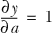 和 。或者如果 *y* = *a* × *b*，那么 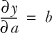 和 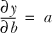。这些只是求导的基本规则。当我们从给定的节点进行反向传播时，我们需要它返回所有偏导数，这就是为什么 `AddBackward0` 梯度函数返回两个输出的原因。

我们可以通过在 `y` 上调用反向方法来验证 PyTorch 是否确实按照预期计算梯度：

```
>>> y = linear_model(torch.Tensor([4.]), m,b)
>>> y.backward()
>>> m.grad
tensor([4.])
>>> b.grad
tensor([1.])
```

这正是我们从头脑中或在纸上计算这些简单的偏导数所能得到的结果。为了有效地进行反向传播，PyTorch 会跟踪所有正向计算并存储它们的导数，这样当我们对计算图的输出节点调用 `backward()` 方法时，它将通过这些梯度函数逐节点反向传播直到输入节点。这就是我们如何得到模型中所有参数的梯度。

注意我们还在`Y`张量上调用了`detach()`方法。这实际上是不必要的，因为我们计算`newQ`时使用了`torch.no_grad()`，但我们还是包含了它，因为将节点从计算图中分离出来将在本书的其余部分变得普遍，而且不正确地分离节点是训练模型时常见的错误来源。如果我们调用`loss.backward(X,Y)`，并且`Y`与其自己的计算图有关联的可训练参数，我们就会反向传播到`Y`和`X`，训练过程会学习通过更新`X`图和`Y`图中的可训练参数来最小化损失，而我们的目标只是更新`X`图。我们通过从图中分离`Y`节点，使其仅作为数据使用，而不是作为计算图节点。你不需要太深入地思考细节，但你确实需要关注你实际上反向传播到图中的哪些部分，并确保你没有反向传播到错误的节点。

你可以继续运行训练循环——1000 个 epoch 将绰绰有余。一旦完成，你可以绘制损失图来查看训练是否成功以及模型是否收敛。损失应该在训练时间内或多或少地下降并趋于平稳。我们的图显示在图 3.10 中。

##### 图 3.10\. 我们第一个 Q 学习算法的损失图，在训练 epoch 中明显呈下降趋势。

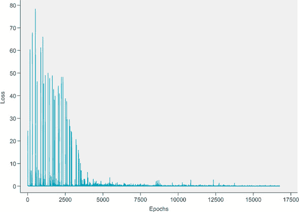

损失图相当嘈杂，但移动平均线明显趋向于零。这让我们有信心训练是成功的，但我们永远不知道直到我们测试它。我们编写了一个简单的函数，在列表 3.4 中，允许我们在单场比赛上测试模型。

##### 列表 3.4\. 测试 Q 网络

```
def test_model(model, mode='static', display=True):
    i = 0
    test_game = Gridworld(mode=mode)
    state_ = test_game.board.render_np().reshape(1,64) + np.random.rand(1,64)/10.0
    state = torch.from_numpy(state_).float()
    if display:
        print("Initial State:")
        print(test_game.display())
    status = 1
    while(status == 1):                *1*
        qval = model(state)
        qval_ = qval.data.numpy()
        action_ = np.argmax(qval_)     *2*
        action = action_set[action_]
        if display:
            print('Move #: %s; Taking action: %s' % (i, action))
        test_game.makeMove(action)
        state_ = test_game.board.render_np().reshape(1,64) + np.random.rand(1,64)/10.0
        state = torch.from_numpy(state_).float()
        if display:
            print(test_game.display())
        reward = test_game.reward()
        if reward != -1:
            if reward > 0:
                status = 2
                if display:
                    print("Game won! Reward: %s" % (reward,))
            else:
                status = 0
                if display:
                    print("Game LOST. Reward: %s" % (reward,))
        i += 1
        if (i > 15):
            if display:
                print("Game lost; too many moves.")
            break
    win = True if status == 2 else False
    return win
```

+   ***1*** 游戏仍在进行时

+   ***2*** 执行具有最高 Q 值的动作

测试函数基本上与训练循环中的代码相同，只是我们不进行任何损失计算或反向传播。我们只是运行网络前向以获取预测。让我们看看它是否学会了如何玩 Gridworld！

```
>>> test_model(model, 'static')
Initial State:
[['+' '-' ' ' 'P']
 [' ' 'W' ' ' ' ']
 [' ' ' ' ' ' ' ']
 [' ' ' ' ' ' ' ']]
Move #: 0; Taking action: d
[['+' '-' ' ' ' ']
 [' ' 'W' ' ' 'P']
 [' ' ' ' ' ' ' ']
 [' ' ' ' ' ' ' ']]
Move #: 1; Taking action: d
[['+' '-' ' ' ' ']
 [' ' 'W' ' ' ' ']
 [' ' ' ' ' ' 'P']
 [' ' ' ' ' ' ' ']]
Move #: 2; Taking action: l
[['+' '-' ' ' ' ']
 [' ' 'W' ' ' ' ']
 [' ' ' ' 'P' ' ']
 [' ' ' ' ' ' ' ']]
Move #: 3; Taking action: l
[['+' '-' ' ' ' ']
 [' ' 'W' ' ' ' ']
 [' ' 'P' ' ' ' ']
 [' ' ' ' ' ' ' ']]
Move #: 4; Taking action: l
[['+' '-' ' ' ' ']
 [' ' 'W' ' ' ' ']
 ['P' ' ' ' ' ' ']
 [' ' ' ' ' ' ' ']]
Move #: 5; Taking action: u
[['+' '-' ' ' ' ']
 ['P' 'W' ' ' ' ']
 [' ' ' ' ' ' ' ']
 [' ' ' ' ' ' ' ']]
Move #: 6; Taking action: u
[['+' '-' ' ' ' ']
 [' ' 'W' ' ' ' ']
 [' ' ' ' ' ' ' ']
 [' ' ' ' ' ' ' ']]
Reward: 10
```

我们能为我们这里的 Gridworld 玩家鼓掌吗？显然它知道自己在做什么；它直接冲向了目标！

但我们不要太过兴奋；那只是游戏的静态版本，实际上非常简单。如果你使用我们的测试函数并设置`mode='random'`，你可能会感到失望：

```
>>> testModel(model, 'random')
Initial State:
[[' ' '+' ' ' 'P']
 [' ' 'W' ' ' ' ']
 [' ' ' ' ' ' ' ']
 [' ' ' ' '-' ' ']]
Move #: 0; Taking action: d
[[' ' '+' ' ' ' ']
 [' ' 'W' ' ' 'P']
 [' ' ' ' ' ' ' ']
 [' ' ' ' '-' ' ']]
Move #: 1; Taking action: d
[[' ' '+' ' ' ' ']
 [' ' 'W' ' ' ' ']
 [' ' ' ' ' ' 'P']
 [' ' ' ' '-' ' ']]
Move #: 2; Taking action: l
[[' ' '+' ' ' ' ']
 [' ' 'W' ' ' ' ']
 [' ' ' ' 'P' ' ']
 [' ' ' ' '-' ' ']]
Move #: 3; Taking action: l
[[' ' '+' ' ' ' ']
 [' ' 'W' ' ' ' ']
 [' ' 'P' ' ' ' ']
 [' ' ' ' '-' ' ']]
Move #: 4; Taking action: l
[[' ' '+' ' ' ' ']
 [' ' 'W' ' ' ' ']
 ['P' ' ' ' ' ' ']
 [' ' ' ' '-' ' ']]
Move #: 5; Taking action: u
[[' ' '+' ' ' ' ']
 ['P' 'W' ' ' ' ']
 [' ' ' ' ' ' ' ']
 [' ' ' ' '-' ' ']]
Move #: 6; Taking action: u
[['P' '+' ' ' ' ']
 [' ' 'W' ' ' ' ']
 [' ' ' ' ' ' ' ']
 [' ' ' ' '-' ' ']]
Move #: 7; Taking action: d
[[' ' '+' ' ' ' ']
 ['P' 'W' ' ' ' ']
 [' ' ' ' ' ' ' ']
 [' ' ' ' '-' ' ']]

# we omitted the last several moves to save space

Game lost; too many moves.
```

这真的很有趣。仔细观察网络所做的动作。玩家一开始只在目标右侧两格的位置。如果它**真的**知道如何玩游戏，它就会选择最短路径到达目标。相反，它开始向下和向左移动，就像在静态游戏模式中一样。看起来这个模型只是记住了它训练过的特定棋盘，而没有进行任何泛化。

也许我们只需要用随机模式训练它，然后它就会真正学会？试试看。用随机模式重新训练它。也许你比我们幸运，但图 3.11 显示了我们的随机模式损失图和 1,000 个 epoch。这看起来并不好。没有任何迹象表明随机模式下有任何显著的学习发生。（我们不会展示这些结果，但模型*似乎*学会了如何用“玩家”模式玩游戏，在这种模式下，只有玩家被随机放置在网格上。）

##### 图 3.11。随机模式下的 Q 学习损失图，没有显示出任何收敛的迹象。

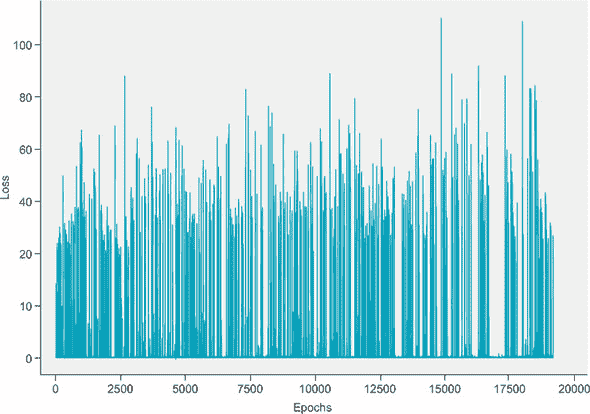

这是一个大问题。如果强化学习只能学会如何记忆或弱学习，那么它将毫无价值。但这是 DeepMind 团队面临的问题，也是他们解决的问题。

### 3.3. 防止灾难性遗忘：经验重放

我们正在逐步提升我们的技能，并希望我们的算法能够在游戏难度更高的变体上进行训练，在这个变体中，每局新游戏时所有棋盘上的棋子都会随机放置在网格上。算法不能像以前那样仅仅记住一系列步骤。它需要能够找到通向目标的最短路径（而不踏入陷阱），无论初始的棋盘配置是什么。它需要发展出对其环境的更复杂表示。

#### 3.3.1. 灾难性遗忘

在上一节中，当我们尝试在随机模式下训练我们的模型时遇到的主要问题有一个名字：*灾难性遗忘*。这实际上是与基于梯度下降的训练方法相关的非常重要的问题，尤其是在*在线*训练中。在线训练就是我们一直在做的事情：我们在玩游戏时每走一步都进行反向传播。

想象一下，我们的算法正在训练（学习图 3.12 中游戏 1 的 Q 值）。玩家被放置在陷阱和目标之间，使得目标在右边，陷阱在左边。使用ε-贪婪策略，玩家随机移动，并偶然向右移动并击中目标。太好了！算法将尝试通过更新其权重，使输出更接近目标值（即通过反向传播）来学习这个状态-动作对与高值相关联。

##### 图 3.12。灾难性遗忘的想法是，当两个游戏状态非常相似但导致非常不同的结果时，Q 函数会“困惑”，无法学习应该做什么。在这个例子中，灾难性遗忘发生是因为 Q 函数从游戏 1 中学习到向右移动会导致+1 的奖励，但在看起来非常相似的游戏 2 中，向右移动后得到的是-1 的奖励。结果，算法忘记了它之前关于游戏 1 学到的内容，导致几乎没有显著的学习。


现在，游戏 2 已初始化，玩家再次位于目标和坑之间，但这次目标是*左边*，坑在右边。也许对我们这个简单的算法来说，状态 *看起来*与上一局游戏非常相似。由于上次向右移动给出了一个很好的正奖励，玩家选择再次向右迈出一步，但这次它最终掉进了坑里，得到了-1 的奖励。玩家在想，“发生了什么事？我以为根据我的先前经验，向右走是最好的决定。”它可能再次进行反向传播来更新其状态-行动值，但由于这个状态-行动与上次学习的状态-行动非常相似，它可能会覆盖其先前学习的权重。

这就是灾难性遗忘的本质。在非常相似的状态-行动（但具有不同的目标）之间存在推拉，这导致无法正确学习任何东西。我们通常在监督学习领域没有这个问题，因为我们进行随机批量学习，在我们迭代通过一些随机子集的训练数据并计算批次的梯度总和或平均值之前，我们不更新我们的权重。这平均了目标并稳定了学习。

#### 3.3.2\. 经验回放

对于我们游戏的第一个变体，可能不需要担心灾难性遗忘的问题，因为目标总是静止的，而且模型确实成功地学会了如何玩。但是，在随机模式下，这是一个我们需要考虑的问题，这就是为什么我们需要实现一种称为*经验回放*的功能。经验回放基本上在在线学习方案中为我们提供了批量更新。实现它并不是什么大问题

这就是经验回放的工作原理 (图 3.13)：

1.  在状态 *s* 中，采取行动 *a*，并观察新的状态 *s[t]*[+1] 和奖励 *r[t]*[+1]。

1.  将 (*s*, *a*, *s[t]*[+1], *r[t]*[+1]) 作为元组存储在列表中。

1.  继续将每个经验存储在这个列表中，直到你将列表填充到特定的长度（这由你定义）。

1.  一旦经验回放内存已满，随机选择一个子集（同样，你需要定义子集大小）。

1.  迭代这个子集并计算每个子集的价值更新；将这些存储在目标数组（如 *Y*）中，并将每个记忆的状态 *s* 存储在 *X* 中。

1.  使用 *X* 和 *Y* 作为批量训练的迷你批次。对于后续的周期，当数组已满时，只需覆盖经验回放内存数组中的旧值。

##### 图 3.13\. 这是经验回放的一般概述，这是一种减轻在线训练算法主要问题的方法：灾难性遗忘。其想法是通过存储过去经验并使用这些经验的随机子集来更新 Q 网络，而不是仅使用最近的单一经验。


因此，除了学习你刚刚采取的动作的动作值之外，你还将使用过去经验的一个随机样本进行训练，以防止灾难性遗忘。

列表 3.5 显示了与列表 3.4 相同的训练算法，除了添加了经验重放。记住，这次我们在游戏的更难变体上进行训练，其中所有棋盘上的棋子都是随机放置在网格上的。

##### 列表 3.5\. 带有经验重放的 DQN

```
from collections import deque
epochs = 5000
losses = []
mem_size = 1000                                                                *1*
batch_size = 200                                                               *2*
replay = deque(maxlen=mem_size)                                                *3*
max_moves = 50                                                                 *4*
h = 0
for i in range(epochs):
    game = Gridworld(size=4, mode='random')
    state1_ = game.board.render_np().reshape(1,64) + np.random.rand(1,64)/100.0
    state1 = torch.from_numpy(state1_).float()
    status = 1
    mov = 0
    while(status == 1): 
        mov += 1
        qval = model(state1)                                                   *5*
        qval_ = qval.data.numpy()
        if (random.random() < epsilon):                                        *6*
            action_ = np.random.randint(0,4)
        else:
            action_ = np.argmax(qval_)

        action = action_set[action_]
        game.makeMove(action)
        state2_ = game.board.render_np().reshape(1,64) + np.random.rand(1,64)/100.0
        state2 = torch.from_numpy(state2_).float()
        reward = game.reward()
        done = True if reward > 0 else False
        exp =  (state1, action_, reward, state2, done)                         *7*
        replay.append(exp)                                                     *8*
        state1 = state2

        if len(replay) > batch_size:                                           *9*
            minibatch = random.sample(replay, batch_size)                      *10*
            state1_batch = torch.cat([s1 for (s1,a,r,s2,d) in minibatch])      *11*
            action_batch = torch.Tensor([a for (s1,a,r,s2,d) in minibatch])
            reward_batch = torch.Tensor([r for (s1,a,r,s2,d) in minibatch])
            state2_batch = torch.cat([s2 for (s1,a,r,s2,d) in minibatch])
            done_batch = torch.Tensor([d for (s1,a,r,s2,d) in minibatch])

            Q1 = model(state1_batch)                                           *12*
            with torch.no_grad():
                Q2 = model(state2_batch)                                       *13*

            Y = reward_batch + gamma * ((1 - done_batch) * torch.max(Q2,dim=1)[0])                                                   *14*
            X = \
            Q1.gather(dim=1,index=action_batch.long().unsqueeze(dim=1)).squeeze()
            loss = loss_fn(X, Y.detach())
            optimizer.zero_grad()
            loss.backward()
            losses.append(loss.item())
            optimizer.step()

        if reward != -1 or mov > max_moves:                                    *15*
            status = 0
            mov = 0
losses = np.array(losses)
```

+   ***1*** 设置经验重放内存的总大小

+   ***2*** 设置小批量大小

+   ***3*** 将记忆重放作为一个 deque 列表创建

+   ***4*** 设置游戏结束前的最大移动次数

+   ***5*** 使用ε-贪婪策略选择一个动作

+   ***6*** 从输入状态计算 Q 值以选择一个动作

+   ***7*** 将状态、奖励、动作和下一个状态作为一个元组创建经验

+   ***8*** 将经验添加到经验重放列表中

+   ***9*** 如果重放列表的长度至少与小批量大小相同，则开始小批量训练

+   ***10*** 随机从重放列表中抽取一个子集

+   ***11*** 将每个经验的不同组成部分分离成单独的小批量张量

+   ***12*** 重新计算状态小批量的 Q 值以获取梯度

+   ***13*** 计算下一个状态小批量的 Q 值，但不计算梯度

+   ***14*** 计算 DQN 想要学习的目标 Q 值

+   ***15*** 如果游戏结束，重置状态和移动次数

为了存储代理的经验，我们在 Python 内置的 collections 库中使用了名为*deque*的数据结构。它基本上是一个可以设置最大大小的列表，所以如果你尝试向列表中添加内容而它已经满了，它将移除列表中的第一个项目，并将新项目添加到列表的末尾。这意味着新的经验会替换最老的经验。这些经验本身是`(state1, reward, action, state2, done)`的元组，我们将它们追加到`replay` deque 中。

与经验重放训练的主要区别在于，当我们的重放列表已满时，我们使用数据的小批量进行训练。我们从重放中随机选择一个经验子集，并将单个经验组件分离成`state1_batch`、`reward_batch`、`action_batch`和`state2_batch`。例如，`state1_batch`的维度是`batch_size` × 64，或者在这个例子中是 100 × 64。而`reward_batch`只是一个 100 个长度的整数向量。我们遵循与之前完全在线训练相同的训练公式，但现在我们处理的是小批量。我们使用张量`gather`方法通过动作索引对`Q1`张量（一个 100 × 4 的张量）进行子集选择，以便我们只选择与实际选择的动作相关的 Q 值，从而得到一个 100 长度的向量。

注意，目标 Q 值 `Y = reward_batch + gamma * ((1 - done_batch) * torch.max(Q2,dim=1)[0])` 使用 `done_batch` 来设置如果游戏结束，右侧为 0。记住，如果采取行动后游戏结束，我们称之为*终止状态*，就没有下一个状态来取最大 Q 值，所以目标就变成了奖励，*r[t]*[+1]。`done` 变量是一个布尔值，但我们可以像对 0 或 1 整数进行算术运算一样对其进行算术运算，所以我们只需取 `1 - done`，这样如果 `done = True`，则 `1 - done = 0`，并将右侧项设置为 0。

这次我们训练了 5,000 个周期，因为这是一个更难的游戏，但除此之外，Q 网络模型与之前相同。当我们测试算法时，它似乎大多数游戏都玩得正确。我们编写了一个额外的测试脚本，以查看在 1,000 次游戏中它赢得了多少百分比。

##### 列表 3.6\. 使用经验回放测试性能

```
max_games = 1000
wins = 0
for i in range(max_games):
    win = test_model(model, mode='random', display=False)
    if win:
        wins += 1
win_perc = float(wins) / float(max_games)
print("Games played: {0}, # of wins: {1}".format(max_games,wins))
print("Win percentage: {}".format(win_perc))
```

当我们在训练了 5,000 个周期的模型上运行列表 3.6 时，我们得到了大约 90% 的准确率。你的准确率可能略好或略差。这确实表明它已经学会了*一些*关于如何玩游戏的知识，但如果我们认为算法真的知道它在做什么，这并不是我们预期的（尽管你可能会通过更长的训练时间来提高准确率）。一旦你实际上知道如何玩游戏，你应该能够赢得每一场比赛。

有一个小的警告，一些初始化的游戏实际上可能根本无法获胜，所以胜率可能永远达不到 100%；没有逻辑可以防止目标在角落，卡在墙壁和坑里，使游戏无法获胜。Gridworld 游戏引擎确实阻止了大多数不可能的棋盘配置，但仍然有一小部分可以穿过。这不仅意味着我们无法赢得每一场比赛，而且这也意味着学习将受到轻微的破坏，因为它将尝试遵循通常可以工作但无法在无法获胜的游戏中失败的策略。我们想要保持游戏逻辑简单，以便专注于说明概念，所以我们没有编写确保 100% 可获胜游戏的复杂逻辑。

还有另一个原因让我们无法达到 95% + 的准确率。让我们看看我们的损失图，如图 图 3.14 所示，显示我们的运行平均损失（你的可能差异很大）。

##### 图 3.14\. 实施经验回放后的 DQN 损失图，显示了明显下降的损失，但仍然非常嘈杂。


在图 3.14 中的损失中，你可以看到它确实呈下降趋势，但看起来相当不稳定。这种图表在监督学习问题中可能会让你有些惊讶，但在裸 DRL 中却很常见。经验回放机制通过减少灾难性遗忘来帮助训练稳定，但还有其他相关的不稳定来源。

### 3.4. 改进稳定性使用目标网络

到目前为止，我们已经成功训练了一个深度强化学习算法，使其能够学习和玩 Gridworld，无论是使用确定性静态初始化，还是在玩家每次游戏时随机放置在板上的稍微困难版本。不幸的是，尽管算法看起来学会了如何玩游戏，但它很可能只是在记忆所有可能的板面配置，因为在一个 4×4 的板上并没有那么多。游戏中难度最大的变体是玩家、目标、坑和墙在每次游戏中都随机初始化，这使得算法记忆起来更加困难。这应该会强制执行一定程度的实际学习，但正如你所看到的，我们在学习这个变体时仍然遇到了困难；我们得到了非常嘈杂的损失图。为了解决这个问题，我们将在更新规则中添加另一个维度，以平滑价值更新。

#### 3.4.1. 学习不稳定性

DeepMind 在发布他们的深度 Q 网络论文时确定的一个潜在问题是，如果你在每次移动后都更新 Q 网络的参数，你可能会引起不稳定性。想法是，由于奖励可能很稀疏（我们只在赢得或输掉游戏时给予显著的奖励），在大多数步骤中不会得到任何显著奖励的情况下，每一步都进行更新可能会使算法开始表现出异常行为。

例如，Q 网络可能在某些状态下预测“向上”动作具有高价值；如果它向上移动并且偶然落在目标上并获胜，我们将更新 Q 网络以反映它获得了+10 的奖励。然而，在下一场比赛中，它认为“向上”是一个非常好的动作，并预测了一个高的 Q 值，但随后它向上移动并得到了-10 的奖励，所以我们更新后，它认为“向上”并不那么好。然后，几场比赛后向上移动又导致获胜。你可以看到这可能导致一种振荡行为，其中预测的 Q 值永远不会稳定在一个合理的值上，而只是不断地被拉扯。这与灾难性遗忘问题非常相似。

这不仅仅是一个理论问题——这是 DeepMind 在他们的训练中观察到的问题。他们设计的解决方案是将 Q 网络复制成两个副本，每个副本都有自己的模型参数：一个是“常规”Q 网络，另一个是称为*目标网络*的副本（符号表示为-network，读作“Q hat”）。目标网络在开始训练之前与 Q 网络相同，但其参数在更新方面落后于常规 Q 网络。

让我们再次回顾一下事件序列，这次有目标网络参与（我们将省略经验重放的细节）：

1.  使用参数（权重）*θ**[Q]*（读作“theta Q”）初始化 Q 网络。

1.  将目标网络初始化为 Q 网络的副本，但具有单独的参数*θ**[T]*（读作“theta T”），并将*θ**[T]* = *θ**[Q]*。

1.  使用 Q 网络的 Q 值以 epsilon-greedy 策略选择动作*a*。

1.  观察奖励和新状态*r[t]*[+1]，*s[t]*[+1]。

1.  如果剧集刚刚结束（即游戏赢了或输了），则将目标网络的 Q 值设置为*r[t]*[+1]，否则设置为*r[t]*[+1] + *γ*max*Q**[θ]**[r]*(*S[t]*[+1])（注意这里使用了目标网络）。

1.  通过 Q 网络（而不是目标网络）反向传播目标网络的 Q 值。

1.  每*C*次迭代，将*θ**[T]* = *θ**[Q]*（即，将目标网络的参数设置为 Q 网络的参数）。

从图 3.15 中可以看出，我们唯一使用目标网络的时间是计算反向传播通过 Q 网络的目标 Q 值。想法是我们更新主 Q 网络的参数在每个训练迭代中，但我们减少最近更新对动作选择的影响，希望提高稳定性。

##### 图 3.15。这是具有目标网络的 Q 学习的总体概述。它是对正常 Q 学习算法的一个相当直接的扩展，除了你还有一个名为目标网络的第二个 Q 网络，其预测的 Q 值用于反向传播并通过训练主 Q 网络。目标网络的参数不进行训练，但它们会定期与 Q 网络的参数同步。这个想法是使用目标网络的 Q 值来训练 Q 网络将提高训练的稳定性。


代码现在有点长，既有经验回放又有目标网络，所以我们在这里只看完整代码的一部分。我们将留给你去检查 GitHub 仓库中的书籍，在那里你可以找到本章的所有代码。

以下代码与列表 3.5 完全相同，除了添加了目标网络功能的一些行。

##### 列表 3.7。目标网络

```
import copy

model = torch.nn.Sequential(
    torch.nn.Linear(l1, l2),
    torch.nn.ReLU(),
    torch.nn.Linear(l2, l3),
    torch.nn.ReLU(),
    torch.nn.Linear(l3,l4)
)

model2 = model2 = copy.deepcopy(model)        *1*
model2.load_state_dict(model.state_dict())    *2*
sync_freq = 50                                *3*

loss_fn = torch.nn.MSELoss()
learning_rate = 1e-3
optimizer = torch.optim.Adam(model.parameters(), lr=learning_rate)

                                              *4*
```

+   ***1*** 通过创建原始 Q 网络模型的相同副本来创建第二个模型

+   ***2*** 复制原始模型的参数

+   ***3*** 同步频率参数；每 50 步我们将模型参数复制到 model2

+   ***4***（代码省略）使用与列表 3.5 相同的其他设置

目标网络只是主 DQN 的滞后副本。每个 PyTorch 模型都有一个`state_dict()`方法，它返回所有参数组织在字典中。我们使用 Python 内置的 copy 模块来复制 PyTorch 模型数据结构，然后我们使用`load_state_dict`方法在`model2`上确保它已复制主 DQN 的参数。

接下来我们包括完整的训练循环，它基本上与列表 3.5 相同，只是在计算下一个状态的最大 Q 值时使用`model2`。我们还包括了几行代码，每 50 次迭代就将主模型的参数复制到`model2`。

##### 列表 3.8\. 带有经验回放和目标网络的 DQN

```
from collections import deque
epochs = 5000
losses = []
mem_size = 1000
batch_size = 200
replay = deque(maxlen=mem_size)
max_moves = 50
h = 0
sync_freq = 500                                    *1*
j=0
for i in range(epochs):
    game = Gridworld(size=4, mode='random')
    state1_ = game.board.render_np().reshape(1,64) + np.random.rand(1,64)/100.0
    state1 = torch.from_numpy(state1_).float()
    status = 1
    mov = 0
    while(status == 1): 
        j+=1
        mov += 1
        qval = model(state1)
        qval_ = qval.data.numpy()
        if (random.random() < epsilon):
            action_ = np.random.randint(0,4)
        else:
            action_ = np.argmax(qval_)

        action = action_set[action_]
        game.makeMove(action)
        state2_ = game.board.render_np().reshape(1,64) + np.random.rand(1,64)/100.0
        state2 = torch.from_numpy(state2_).float()
        reward = game.reward()
        done = True if reward > 0 else False
        exp =  (state1, action_, reward, state2, done)
        replay.append(exp) 
        state1 = state2

        if len(replay) > batch_size:
            minibatch = random.sample(replay, batch_size)
            state1_batch = torch.cat([s1 for (s1,a,r,s2,d) in minibatch])
            action_batch = torch.Tensor([a for (s1,a,r,s2,d) in minibatch])
            reward_batch = torch.Tensor([r for (s1,a,r,s2,d) in minibatch])
            state2_batch = torch.cat([s2 for (s1,a,r,s2,d) in minibatch])
            done_batch = torch.Tensor([d for (s1,a,r,s2,d) in minibatch])
            Q1 = model(state1_batch) 
            with torch.no_grad():
                Q2 = model2(state2_batch)        *2*
            Y = reward_batch + gamma * ((1-done_batch) * \
            torch.max(Q2,dim=1)[0])
            X = Q1.gather(dim=1,index=action_batch.long() \
            .unsqueeze(dim=1)).squeeze()
            loss = loss_fn(X, Y.detach())
            print(i, loss.item())
            clear_output(wait=True)
            optimizer.zero_grad()
            loss.backward()
            losses.append(loss.item())
            optimizer.step()

            if j % sync_freq == 0:               *3*
                model2.load_state_dict(model.state_dict())
        if reward != -1 or mov > max_moves:
            status = 0
            mov = 0

losses = np.array(losses)
```

+   ***1*** 设置同步目标模型参数到主要 DQN 的更新频率

+   ***2*** 使用目标网络获取下一个状态的最大 Q 值

+   ***3*** 将主要模型参数复制到目标网络

当我们绘制带有经验回放的目标网络方法的损失图（图 3.16），我们仍然得到一个有噪声的损失图，但它明显噪声更少，并且明显呈下降趋势。你应该尝试调整超参数，例如经验回放缓冲区大小、批量大小、目标网络更新频率和学习率。性能对这些超参数可能非常敏感。

##### 图 3.16\. 包含目标网络以稳定训练后的 DQN 损失图。这显示了比没有目标网络时更快的训练收敛速度，但目标网络与主要 DQN 同步时会出现明显的错误峰值。


当我们在 1,000 场比赛中测试训练好的模型时，与没有目标网络的训练相比，胜率提高了大约 3%。我们达到了大约 95%的顶级准确率，我们认为这可能是考虑到这个环境（即无法获胜的状态的可能性）的限制下的最大准确率。我们只训练到 5,000 个 epoch，其中每个 epoch 代表一场游戏。可能的比赛配置数量（状态空间的大小）大约是 16 × 15 × 14 × 13 = 43,680（因为代理在 4 × 4 网格中可能有 16 个可能的位置，然后是 15 个可能的墙壁配置，因为代理和墙壁在空间上不能重叠等），所以我们只采样了的总可能起始游戏状态数。如果模型可以成功玩从未见过的游戏，那么我们有信心它已经泛化。如果你在 4 × 4 的棋盘上得到好的结果，你应该尝试训练一个代理在 5 × 5 的棋盘或更大的棋盘上玩游戏，通过在创建 Gridworld 游戏实例时更改大小参数来实现：

```
>>> game = Gridworld(size=6, mode='random')
>>> game.display()

array([[' ', '+', ' ', ' ', ' ', ' '],
       [' ', ' ', ' ', ' ', ' ', ' '],
       [' ', ' ', 'W', ' ', ' ', ' '],
       [' ', '-', ' ', ' ', ' ', ' '],
       [' ', ' ', ' ', ' ', 'P', ' '],
       [' ', ' ', ' ', ' ', ' ', ' ']], dtype='<U2')
```


**DeepMind 的深度 Q 网络**

信不信由你，但在这个章节中，我们基本上构建了 DeepMind 在 2015 年引入的深度 Q 网络（DQN），并且它学会了以超人类的表现水平玩古老的 Atari 游戏。DeepMind 的 DQN 使用了ε-贪婪动作选择策略、经验回放和目标网络。当然，我们实现的细节是不同的，因为我们正在玩一个定制的网格世界游戏，而 DeepMind 是在真实视频游戏的原始像素上训练的。例如，一个值得注意的差异是他们实际上将游戏的最后 4 帧输入到他们的 Q 网络中。这是因为视频游戏中的单帧信息不足以确定游戏对象的速度和方向，这在决定采取什么动作时很重要。

你可以通过搜索他们的论文“通过深度强化学习实现人类水平控制”来了解更多关于 DeepMind 的 DQN 的具体信息。有一点需要注意，他们使用了一个由两个卷积层和两个全连接层组成的神经网络架构。在我们的情况下，我们使用了三个全连接层。构建一个包含卷积层并尝试在网格世界中训练它的模型将是一个有价值的实验。卷积层的一个巨大优势是它们与输入张量的大小无关。例如，当我们使用全连接层时，我们必须将第一维设置为 64——我们使用了 64 × 164 参数矩阵的第一层。然而，卷积层可以应用于任何长度的输入数据。这将允许你在 4 × 4 的网格上训练一个模型，并看看它是否足够泛化，能够在 5 × 5 或更大的网格上玩游戏。试试看吧！


### 3.5\. 复习

在本章中，我们涵盖了大量的内容，并且再次引入了许多基本的强化学习概念。我们本可以一开始就向你们展示一大堆学术定义，但我们抵制了诱惑，决定尽可能快地开始编码。让我们回顾一下我们已经取得的成果，并填补一些术语上的空白。

在本章中，我们介绍了一种名为 Q 学习的特定强化学习算法。Q 学习本身与深度学习或神经网络无关；它是一个抽象的数学结构。Q 学习指的是通过学习一个称为 Q 函数的函数来解决控制任务。你给 Q 函数一个状态（例如，游戏状态），它预测在给定输入状态下你可以采取的所有可能动作的价值，我们称这些价值预测为 Q 值。你决定如何处理这些 Q 值。你可能决定采取与最高 Q 值相对应的动作（贪婪方法），或者你可能选择一个更复杂的决策过程。正如你在第二章中学到的，你必须平衡探索（尝试新事物）与利用（采取已知最佳动作）。在本章中，我们使用了标准的ε-贪婪方法来选择动作，其中我们最初采取随机动作以进行探索，然后逐步将我们的策略转向采取价值最高的动作。

Q 函数必须从数据中学习。Q 函数必须学习如何准确预测状态的价值。Q 函数可以是任何东西——从无智能数据库到复杂的深度学习算法。由于深度学习是我们目前拥有的最佳学习算法类别，我们采用了神经网络作为我们的 Q 函数。这意味着“学习 Q 函数”等同于使用反向传播训练神经网络。

关于 Q 学习的一个重要概念，我们一直推迟到今天才介绍，那就是它是一个**离线策略**算法，与**在线策略**算法相对。你从上一章已经知道什么是策略：它是算法用来最大化随时间奖励的策略。如果人类在学习玩网格世界，他们可能会采用一种策略，首先侦察所有通向目标的可能路径，然后选择最短的那条。另一种策略可能是随机采取动作，直到你到达目标。

类似于 Q 学习的离线强化学习算法意味着策略的选择不会影响学习准确 Q 值的能力。确实，如果我们在随机选择动作，我们的 Q 网络可以学习到准确的 Q 值；最终它会经历许多输赢游戏，并推断出状态和动作的价值。当然，这非常低效，但策略只有在它帮助我们用最少的数据进行学习时才有意义。相比之下，在线算法将明确依赖于策略的选择，或者将直接从数据中学习策略。换句话说，为了训练我们的 DQN，我们需要从环境中收集数据（经验），我们可以使用任何策略来做这件事，所以 DQN 是离线的。相比之下，在线算法在学习策略的同时，同时使用相同的策略来收集用于训练自己的经验。

我们一直保留到现在的另一个关键概念是“基于模型”与“无模型”算法的概念。为了理解这一点，我们首先需要了解什么是模型。我们非正式地使用这个术语来指代神经网络，它通常用来指代任何类型的统计模型，其他包括线性模型或贝叶斯图模型。在另一个上下文中，我们可能会说模型是“现实世界”中某物如何工作的心理或数学表示。如果我们确切地了解某物是如何工作的（即它由什么组成以及这些组件如何相互作用），我们不仅能够解释我们已经看到的数据，而且能够预测我们尚未看到的数据。

例如，天气预报员构建了非常复杂的气候模型，这些模型考虑了许多相关变量，并且他们不断地测量现实世界的数据。他们可以使用他们的模型在一定程度上预测天气。有一个几乎成了陈词滥调的统计学格言：“所有模型都是错误的，但有些是有用的”，这意味着不可能构建一个 100%符合现实的模型；我们总会遗漏一些数据或关系。尽管如此，许多模型捕捉了我们感兴趣的系统中的足够真相，以至于它们对于解释和预测是有用的。

如果我们能够构建一个能够弄清楚 Gridworld 如何工作的算法，它就会推断出一个 Gridworld 的模型，并且能够完美地玩它。在 Q-learning 中，我们给 Q 网络提供的只是一个 numpy 张量。它没有 Gridworld 的先验模型，但它仍然通过试错学会了如何玩。我们没有要求 Q 网络弄清楚 Gridworld 是如何工作的；它的唯一任务是预测预期的奖励。因此，Q-learning 是一个无模型算法。

作为算法的人类建筑师，我们可能能够将一些关于问题的领域知识作为模型嵌入到我们的问题中，以优化我们的问题。然后我们可以将这个模型提供给学习算法，让它弄清楚细节。这将是一个基于模型的算法。例如，大多数下棋算法都是基于模型的；它们知道棋的规则以及采取某些移动的结果将会是什么。唯一未知的部分（我们希望算法能够弄清楚）是赢得游戏的移动序列。有了模型在手，算法可以制定长期计划以实现其目标。

在许多情况下，我们希望使用能够从无模型到基于模型进行规划的算法。例如，一个学习如何行走的机器人可能一开始是通过试错（无模型）来学习的，但一旦它掌握了行走的基础，它就可以开始推断其环境的模型，然后规划一系列步骤从 A 点到 B 点（基于模型）。我们将在本书的其余部分继续探讨按策略、离策略、基于模型和无模型算法。在下一章中，我们将探讨一个可以帮助我们构建可以近似策略函数的网络算法。

### 概述

+   一个 *状态空间* 是环境可能处于的所有可能状态的集合。通常，状态被编码为张量，因此状态空间可能是一个类型为 *^n* 的向量或一个类型为 *^n*^×*^m* 的矩阵。

+   *动作空间* 是给定一个状态时所有可能动作的集合；例如，棋盘游戏的动作空间将是给定某些游戏状态的所有合法移动的集合。

+   一个 *状态值* 是给定一个状态并遵循某些策略时，期望的折现奖励的总和。如果一个状态具有高的状态值，这意味着从这个状态开始很可能会带来高的奖励。

+   一个 *动作值* 是在特定状态下采取一个动作的期望奖励。它是状态-动作对的值。如果你知道一个状态下所有可能动作的动作值，你可以决定采取动作值最高的动作，并且你预期会获得最高的奖励。

+   一个 *策略函数* 是一个将状态映射到动作的函数。它是“决定”给定输入状态采取哪些动作的函数。

+   *Q 函数* 是一个函数，它接受一个状态-动作对并返回动作值。

+   *Q 学习* 是一种强化学习方法，我们试图建模 Q 函数；换句话说，我们试图学习如何预测给定状态下每个动作的期望奖励。

+   一个 *深度 Q 网络 (DQN)* 简单来说就是我们在 Q 学习中使用深度学习算法作为模型。

+   *离策略学习* 是当我们使用不同的策略收集数据的同时学习一个策略。

+   *按策略学习* 是当我们学习一个策略的同时，也同时使用它来收集学习数据。

+   *灾难性遗忘* 是机器学习算法在每次使用小批量数据训练时面临的一个大问题，其中新学习的数据会擦除或损坏已学习的老信息。

+   *经验回放* 是一种机制，允许批量训练强化学习算法，以减轻灾难性遗忘并允许稳定训练。

+   一个 *目标网络* 是主 DQN 的一个副本，我们使用它来稳定主 DQN 的训练更新规则。

## 第四章\. 学习选择最佳策略：策略梯度方法

*本章涵盖*

+   将策略函数实现为神经网络

+   介绍 OpenAI Gym API

+   在 OpenAI CartPole 问题中应用 REINFORCE 算法

在上一章中，我们讨论了深度 Q 网络，这是一种离策略算法，它使用神经网络来近似 Q 函数。Q 网络的输出是对应于给定状态的每个动作的 Q 值（图 4.1）；回想一下，Q 值是奖励的期望（加权平均值）。

##### 图 4.1\. Q 网络接受一个状态并返回每个动作的 Q 值（动作值）。我们可以使用这些动作值来决定采取哪些动作。


给定 Q 网络预测的这些 Q 值，我们可以使用某种策略来选择执行的动作。我们在上一章中采用的战略是ε-贪婪方法，其中我们以概率ε随机选择一个动作，以概率 1 – *ε*选择与最高 Q 值相关的动作（Q 网络根据其经验预测的最佳动作）。我们可以遵循无数其他策略，例如在 Q 值上使用 softmax 层。

如果我们跳过在 DQN 之上选择策略，而是训练一个神经网络直接输出动作，会怎样呢？如果我们这样做，我们的神经网络最终会成为一个**策略函数**，或者一个**策略网络**。记得从第三章中，策略函数π*State* → *P*(*Action*|*State*)接受一个状态并返回最佳动作。更精确地说，它将返回一个动作的概率分布，我们可以从这个分布中采样以选择动作。如果你对概率分布这个概念不熟悉，不要担心。我们将在本章和整本书中进一步讨论它。

### 4.1\. 使用神经网络的策略函数

在本章中，我们将介绍一类算法，这些算法允许我们近似策略函数 *π*(*s*)，而不是值函数 *V**[π]* 或 *Q*。也就是说，我们不是训练一个输出动作值的网络，而是训练一个输出（动作的概率）的网络。

#### 4.1.1\. 神经网络作为策略函数

与 Q 网络相比，策略网络告诉我们给定我们当前的状态应该做什么。不需要进一步的决策。我们只需要从概率分布 *P*(*A*|*S*) 中随机采样，我们就得到一个要采取的动作（图 4.2）。最有可能带来益处的动作将有最高的被随机采样的机会，因为它们被分配了最高的概率。

##### 图 4.2\. 策略网络是一个函数，它接受一个状态并返回可能动作的概率分布。


将概率分布 *P*(*A*|*S*) 想象成一个装满了写有动作的小纸条的罐子。在一个有四种可能动作的游戏中，会有标有 1–4（或者在 Python 中是索引的话是 0–3）的纸条。如果我们的策略网络预测动作 2 最有可能带来最高的奖励，它就会在这个罐子里放入很多标有 2 的小纸条，而标有 1、3 和 4 的纸条则较少。为了选择一个动作，我们只需闭上眼睛从罐子里随机抽取一张纸条。我们最有可能选择动作 2，但有时我们会抽到另一个动作，这给了我们探索的机会。使用这个类比，每当环境状态发生变化时，我们就将状态提供给我们的策略网络，它会使用这些信息来填充一个包含不同比例标签纸条的新罐子，代表不同的动作。然后我们从罐子里随机抽取。

这类算法被称为 *策略梯度方法*，它与 DQN 算法有几个重要的不同点；我们将在本章中探讨这些不同点。策略梯度方法相对于像 DQN 这样的值预测方法有一些优势。其中之一是，正如我们之前讨论的，我们不再需要担心设计一个动作选择策略，如 epsilon-greedy；相反，我们直接从策略中采样动作。记住，我们花费了很多时间来想出提高我们训练 DQN 稳定性的方法——我们不得不使用经验回放和目标网络，学术文献中还有许多其他方法我们可以使用。策略网络往往简化了这些复杂性。

#### 4.1.2\. 随机策略梯度

随机策略方法有很多不同的变种。我们将从 *随机策略梯度* 方法（图 4.3）开始，这正是我们刚刚描述的。在随机策略梯度中，我们神经网络的输出是一个动作向量，它代表一个概率分布。

##### 图 4.3\. 随机策略函数。策略函数接受一个状态并返回一个动作的概率分布。它是随机的，因为它返回一个动作的概率分布，而不是返回一个确定性的单一动作。


我们将遵循的策略是从这个概率分布中选择一个动作。这意味着如果我们的智能体两次处于相同的状态，我们可能不会每次都采取相同的动作。在 图 4.3 中，我们向函数输入状态，它是 (1,2)，输出是一个对应于每个动作的概率向量。例如，如果这是一个网格世界智能体，智能体向上移动的概率是 0.50，向下移动的概率是 0，向左移动的概率是 0.25，向右移动的概率也是 0.25。

如果环境是平稳的，即状态和奖励的分布是恒定的，并且我们使用确定性策略，我们预计概率分布最终会收敛到一个*退化的概率分布*，如图 4.4 所示。退化的概率分布是一个将所有概率质量分配给单个潜在结果的分布。当我们处理这本书中的离散概率分布时，所有概率的总和必须为 1，所以退化的分布是所有结果都被分配了 0 概率，除了一个被分配了 1。

##### 图 4.4. 一个确定性策略函数，通常用希腊字母π表示，它接受一个状态并返回一个特定的行为，这与随机策略不同，随机策略返回一个关于行为的概率分布。


在训练的早期，我们希望分布相对均匀，以便我们可以最大化探索，但在训练过程中，我们希望分布收敛到给定状态下的最优行为。如果一个状态只有一个最优行为，我们预计会收敛到一个退化的分布，但如果有两个同样好的行为，那么我们预计分布将有两个*模式*。概率分布的模式就是“峰值”的另一种说法。


**我忘记了...什么是概率分布？**

在网格世界中，我们有四种可能的行为：向上、向下、向左和向右。我们称这为我们的动作集或动作空间，因为我们可以用数学方式描述它，例如，*A* = {*向上,向下,向左,向右*}，其中花括号表示一个集合。（在数学中，集合只是一个具有某些操作定义的抽象无序事物集合。）那么，在这个动作集合上应用概率分布意味着什么呢？

概率实际上是一个非常丰富甚至有争议的话题。关于概率的确切含义，存在不同的哲学观点。对一些人来说，概率意味着，如果你要反复抛掷一枚硬币很多次（理想情况下是无限次，从数学上讲）公平硬币出现正面的概率等于无限长序列中正面的比例。也就是说，如果我们抛掷一枚公平硬币 1000000 次，我们预计大约一半的抛掷会是正面，另一半是反面，所以概率等于这个比例。这是概率的频率主义解释，因为概率被解释为某些事件重复多次的长期频率。

另一种思想流派只将概率解释为信念程度，即根据他们目前拥有的知识对事件进行主观评估的程度。这种信念程度通常被称为 *信念度*。公平硬币出现正面的概率是 0.5 或 50%，因为，根据我们对硬币的了解，我们没有理由预测正面比反面多，或者反面比正面多，所以我们平均分配我们的信念在两种可能的结果上。因此，任何我们不能确定预测（即，概率为 0 或 1，之间没有其他东西）的东西，都是由于知识不足。

你可以自由地按照自己的意愿解释概率，因为这不会影响我们的计算，但在这本书中，我们倾向于隐含地使用概率的信念解释。就我们的目的而言，在网格世界动作集 *A* = {*上，下，左，右*} 上应用概率分布意味着我们正在为集合中的每个动作分配一个信念程度（一个介于 0 和 1 之间的实数），使得所有概率之和等于 1。我们将这些概率解释为在特定状态下，一个动作是最佳动作以最大化预期奖励的概率。 

具体来说，我们动作集 *A* 上的概率分布用 *P*(*A*) 表示：*A[i]* → [0,1]，这意味着 *P*(*A*) 是一个从集合 *A* 到 0 到 1 之间实数集合的映射。特别是，每个元素 *a[i]* ∈ *A* 都映射到一个 0 到 1 之间的单个数字，使得每个动作的所有这些数字之和等于 1。我们可以将这个映射表示为我们的网格世界动作集的向量，其中我们将向量中的每个位置与动作集中的元素相对应，例如 [上，下，左，右] → [0.25, 0.25, 0.10, 0.4]。这个映射被称为 *概率质量函数* (PMF)。

我们刚才描述的实际上是一个 *离散* 概率分布，因为我们的动作集是离散的（有限数量的元素）。如果我们的动作集是无限的，即像速度这样的连续变量，我们就会称这为 *连续* 概率分布，并且我们需要定义一个 *概率密度函数* (PDF)。

PDF 最常见的例子是正态分布（也称为高斯分布，或简称钟形曲线）分布。如果我们有一个具有连续动作的概率，比如说一个需要控制汽车速度从 0 到某个最大值的游戏，这是一个连续变量，我们如何用策略网络来实现呢？好吧，我们可以放弃概率分布的想法，只训练网络产生它预测的最佳速度值，但这样我们就有可能探索不足（并且训练这样的网络是困难的）。一点随机性就能带来很多力量。我们在本书中使用的神经网络只产生向量（或更一般地说，张量）作为输出，因此它们不能产生连续的概率分布——我们必须更聪明一些。像正态分布这样的 PDF 由两个参数定义，即均值和方差。一旦我们有了这些，我们就有了一个可以从中采样的正态分布。所以我们可以训练一个神经网络来产生均值和标准差值，然后我们可以将这些值插入到正态分布方程中并从中采样。

如果现在这一切还没有完全明白，请不要担心。我们会一遍又一遍地继续讲解，因为这些概念在强化学习和更广泛的机器学习中无处不在。


#### 4.1.3\. 探索

回想一下上一章，我们需要的策略包括一些随机性，这样我们才能在训练过程中访问新的状态。对于 DQNs，我们遵循了ε-贪婪策略，这意味着我们有可能不会选择导致最大预测奖励的动作。如果我们总是选择导致最大预测奖励的动作，我们就永远不会发现我们可用的甚至更好的动作和状态。对于随机策略梯度方法，因为我们的输出是一个概率分布，应该有很小一部分机会去探索所有空间；只有经过足够的探索，动作分布才会收敛到产生单个最佳动作，一个退化的分布。或者如果环境本身有一些随机性，概率分布将保留一些概率质量到每个动作上。当我们最初初始化我们的模型时，我们的智能体选择每个动作的概率应该是大致相等或均匀的，因为模型对哪个动作更好没有任何信息。

政策梯度算法中有一个变体称为 *确定性策略梯度*（DPG），其中有一个单一输出，智能体将始终遵循（如图 4.4 所示）。例如，在 Gridworld 的情况下，它将产生一个 4 维的二进制向量，对于要采取的动作有一个 1，其他动作有 0。如果智能体总是遵循输出，那么它将无法正确地探索，因为动作选择中没有随机性。由于离散动作集的确定性策略函数的输出将是离散值，因此很难以我们习惯的深度学习方式完全可微分地实现这一点，所以我们将专注于随机策略梯度。将不确定性的概念（例如，使用概率分布）构建到模型中通常是件好事。

### 4.2. 强化良好动作：策略梯度算法

从上一节中，你了解到有一类算法试图创建一个输出动作概率分布的函数，并且这个策略函数 *π*(*s*) 可以用神经网络实现。在本节中，我们将深入探讨如何实际实现这些算法并训练（即优化）它们。

#### 4.2.1. 定义目标函数

回想一下，神经网络需要一个关于网络权重（参数）可微分的目标函数。在上一章中，我们使用最小化均方误差（MSE）损失函数来训练深度 Q 网络，该损失函数与预测的 Q 值和目标 Q 值相关。由于 Q 值只是平均奖励（即期望值），所以我们有一个基于观察到的奖励计算目标 Q 值的公式，因此这并不比我们通常训练监督深度学习算法的方式有太大不同。

我们如何训练一个策略网络，使其在给定状态的情况下给出动作的概率分布，即 *P*(*A*|*S*)？将观察到的奖励映射到更新 *P*(*A*|*S*) 上并没有明显的途径。训练 DQN 与解决监督学习问题并没有太大的不同，因为我们的 Q 网络生成了一组预测的 Q 值向量，然后我们通过一个公式生成了目标 Q 值向量。然后我们只需最小化 Q 网络输出向量与我们的目标向量之间的误差。

使用策略网络，我们直接预测动作，没有方法来生成一个目标动作向量，即我们应该采取的动作，给定奖励。我们所知道的是动作是否导致了正面的或负面的奖励。实际上，最佳动作的秘密取决于一个价值函数，但使用策略网络我们试图避免直接计算这些动作值。

让我们通过一个例子来看一下我们如何优化我们的策略网络。我们首先从一些符号开始。我们的策略网络用*π*表示，并由一个向量*θ*参数化，它代表神经网络的所有参数（权重）。正如你所知，神经网络有多个权重矩阵形式的参数，但为了便于符号和讨论，通常将所有网络参数视为一个单一的、较长的向量，我们用*θ*（theta）表示。

每当我们运行策略网络时，参数向量*θ*是固定的；变量是输入到策略网络中的数据（即状态）。因此，我们将参数化的策略表示为*π[θ]*。每当我们要表示函数的某个输入是固定的，我们将它包括为下标，而不是像*π*(*x*,*θ*)这样的显式输入，其中*x*是某些输入数据（即游戏的状态）。像*π*(*x*,*θ*)这样的符号表明*θ*是一个随着*x*变化的变量，而*π[θ]*则表明*θ*是函数的固定参数。

假设我们给最初未训练的策略网络*π[θ]*一些 Gridworld 的初始游戏状态，表示为*s*，并通过计算*π[θ]*(*s*)来运行它。它返回一个关于四个可能动作的概率分布，例如[0.25, 0.25, 0.25, 0.25]。我们从这个分布中采样，由于这是一个均匀分布，我们最终采取了一个随机动作（图 4.5）。我们继续通过从产生的动作分布中采样来采取动作，直到我们达到分段的结束。

##### 图 4.5。具有四个可能离散动作的环境的策略梯度的概述。首先，我们将状态输入到策略网络中，它产生一个关于动作的概率分布，然后我们从这个分布中采样以采取一个动作，这会产生一个新的状态。


记住，一些游戏如 Gridworld 是分段的，这意味着游戏的一个分段有一个明确的开始和结束点。在 Gridworld 中，我们从某个初始状态开始游戏，直到我们触碰到坑洞、达到目标或移动次数过多。因此，一个分段是从初始状态到终端状态（我们赢得或输掉游戏的状态）的一系列状态、动作和奖励。我们将这个分段表示为

| ε = (*S*[0],*A*[0],*R*[1]),(*S*[1],*A*[1],*R*[2]) ... (*S[t]*[–1],*A[t]*[–1],*R[t]*) |
| --- |

每个元组是 Gridworld 游戏（或更一般地说，马尔可夫决策过程）的一个时间步。在我们达到时间*t*的分段结束时，我们已经收集了大量关于刚刚发生的事情的历史数据。假设我们偶然在经过策略网络决定的三个移动后达到了目标。我们的分段看起来是这样的：

| ε = (*S*[0],3,–1),(*S*[1],1,–1),(*S*[2],3,+10) |
| --- |

我们已经将动作编码为从 0 到 3 的整数（指动作向量的数组索引），并且我们用符号表示状态，因为它们实际上是 64 长度的向量。在这个场景中我们能学到什么？嗯，我们赢得了游戏，这由最后一个元组中的+10 奖励表示，所以我们的动作在某种程度上必须是“好的”。鉴于我们所处的状态，我们应该鼓励我们的策略网络在下一次更可能地采取这些动作。我们希望强化那些导致良好正面奖励的动作。我们将在本节稍后讨论我们的智能体输掉游戏（收到终端奖励-10）的情况，但在此同时，我们将专注于正强化。

#### 4.2.2. 动作强化

我们希望对我们的梯度进行小而平滑的更新，以鼓励网络在将来为这些获胜动作分配更多的概率。让我们专注于场景中的最后一个经验，状态 *S*[2]。记住，我们假设我们的策略网络产生了动作概率分布 [0.25, 0.25, 0.25, 0.25]，因为它尚未训练，并且在最后一个时间步中我们采取了动作 3（对应于动作概率数组中的元素 4），这导致我们以+10 的奖励赢得了游戏。我们希望对状态 *S*[2] 下的这个动作进行正强化，这样每当策略网络遇到 *S*[2] 或非常相似的状态时，它将更有信心预测动作 3 为最高概率的动作采取。

一种简单的方法可能是创建一个目标动作分布，[0, 0, 0, 1]，这样我们的梯度下降就会将概率从 [0.25, 0.25, 0.25, 0.25] 移动到 [0, 0, 0, 1] 附近，也许最终会变成 [0.167, 0.167, 0.167, 0.5]（见图 4.6）。这在监督学习领域是经常做的事情，当我们训练一个基于 softmax 的图像分类器时。但在那种情况下，对于一张图片来说，有一个正确的分类，并且每个预测之间没有时间关联。在我们的强化学习案例中，我们希望对这些更新有更多的控制。首先，我们希望进行小而平滑的更新，因为我们希望在我们的动作采样中保持一些随机性，以便充分探索环境。其次，我们希望能够权衡我们对每个动作赋予的信用度，对于早期的动作。在深入探讨这两个问题之前，让我们回顾一些更多的符号。

##### 图 4.6。一旦从策略网络的概率分布中采样到一个动作，它会产生一个新的状态和奖励。奖励信号用于强化所采取的动作，也就是说，如果奖励是正的，它会增加该动作在给定状态下的概率，或者如果奖励是负的，它会减少该概率。请注意，我们只收到了关于动作 3（元素 4）的信息，但由于概率必须总和为 1，我们必须降低其他动作的概率。


记住，当我们正向运行策略网络时，通常用 *π[θ]* 表示，因为我们认为网络参数 *θ* 是固定的，而输入状态是变化的。因此，对于某个状态 *s*，调用 *π[θ]*(*s*) 将返回一个概率分布，表示在给定一组固定参数的情况下可能采取的动作。当我们训练策略网络时，我们需要相对于一个固定的输入来改变参数，以找到一组参数，这组参数可以优化我们的目标（即最小化损失或最大化效用函数），这个函数是 *π[s]*(*θ*)。

| |
| --- |

##### 定义

在给定策略网络的参数的情况下，动作的概率表示为 *π[s]*(*a*|*θ*)。这清楚地表明，动作的概率 *a* 明确依赖于策略网络的参数化。一般来说，我们用一个 *条件概率* 表示 *P*(*x* | *y*)，读作“给定 *y* 的 *x* 的概率分布。”这意味着我们有一个函数，它接受一个参数 *y* 并返回另一个参数 *x* 的概率分布。

| |
| --- |

为了强化动作 3，我们希望修改策略网络参数 *θ*，使得我们增加 *π[s]*(*a*[3]|*θ*)。我们的目标函数只需要最大化 *π[s]*(*a*[3]|*θ*)，其中 *a*[3] 是我们例子中的动作 3。在训练之前，*π[s]*(*a*[3]|*θ*) = 0.25，但我们需要修改 *θ*，使得 *π[s]*(*a*[3]|*θ*) > 0.25。因为所有的概率必须加起来等于 1，最大化 *π[s]*(*a*[3]|*θ*) 将会最小化其他动作的概率。记住，我们更喜欢设置目标函数为最小化而不是最大化，因为这样与 PyTorch 内置的优化器配合得更好——我们应该告诉 PyTorch 最小化 1 – *π[s]*(*a*|*θ*)。这个损失函数当 *π[s]*(*a*|*θ*) 接近 1 时趋近于 0，因此我们鼓励梯度最大化我们采取的动作的 *π[s]*(*a*|*θ*)。我们将随后省略下标 *a*[3]，因为从上下文中应该很清楚我们指的是哪个动作。

#### 4.2.3. 对数概率

从数学上来说，我们所描述的是正确的。但由于计算精度问题，我们需要对此公式进行调整以稳定训练。一个问题是由于定义，概率被限制在 0 和 1 之间，因此优化器可以操作的范围有限且较小。有时概率可能非常小或非常接近 1，这会在有限数值精度的计算机上进行优化时遇到数值问题。如果我们改用一个替代目标函数，即 –log*π**[s]*(*a*|*θ*)（其中 log 是自然对数），我们有一个比原始概率空间具有更大“动态范围”的目标，因为概率空间的对数范围从（–∞,0），这使得对数概率更容易计算。此外，对数有一个很好的性质，即 log(*a* × *b*) = log(*a*) + log(*b*)，这意味着当我们乘以对数概率时，我们可以将这个乘法转换成加法，这比乘法更数值稳定。如果我们将我们的目标设置为 –log*π**[s]*(*a*|*θ*)而不是 1 – *π**[s]*(*a*|*θ*)，我们的损失仍然遵循损失函数随着 *π**[s]*(*a*|*θ*) 接近 1 而趋近于 0 的直观。我们的梯度将被调整以尝试将 *π**[s]*(*a*|*θ*) 增加到 1，在我们的运行示例中，*a* = 动作 3。

#### 4.2.4. 信用分配

我们的目标函数是 –log*π**[s]*(*a*|*θ*)，但这会给我们的情节中的每个动作分配相同的权重。产生最后一个动作的网络中的权重将按照与第一个动作相同的程度进行更新。为什么不应该这样呢？好吧，在奖励之前的最后一个动作比情节中的第一个动作赢得游戏的信用更多是有道理的。就我们所知，第一个动作实际上是次优的，但后来我们进行了反击并达到了目标。换句话说，我们对每个动作“好”的信心随着我们离奖励点的距离越来越远而减弱。在棋类游戏中，我们给最后一个动作的信用比第一个动作多。我们非常确信直接导致我们获胜的动作是一个好动作，但随着我们回溯得越来越远，我们的信心就会减弱。五步之前的动作对获胜贡献了多少？我们不太确定。这就是信用分配的问题。

我们通过将更新幅度的量乘以折扣因子来表示这种不确定性，这个折扣因子你在第三章中学过，其范围在 0 到 1 之间。在情节结束前的动作将具有折扣因子 1，这意味着它将接收完整的梯度更新，而较早的动作将被按比例折扣，例如 0.5，因此梯度步长会更小。

让我们将这些添加到我们的目标（损失）函数中。我们将告诉 PyTorch 最小化的最终目标函数是 –γ*[t]* * *G[t]* * log*π**[s]*(*a*|*θ*）。记住，γ*[t]*是折现因子，下标*t*告诉我们它的值将取决于时间步*t*，因为我们希望对较远动作的折现要多于对较近动作的折现。参数*G[t]*被称为*t*时刻的*总回报*或*未来回报*。它是我们从时间步*t*到游戏结束期望收集的回报，可以通过将游戏期间某个状态到游戏结束的奖励相加来近似。

| *G[t]* = *r[t]* + *r[t]* [+1] ... + *r[T]* [–1] + *r[T]* |
| --- |

与接收奖励时间较远的动作相比，应该对接近奖励的动作赋予更低的权重。如果我们赢得了 Gridworld 游戏，从开始到终端状态之间的折现奖励序列可能看起来像[0.970, 0.980, 0.99, 1.0]。最后一个动作导致了+1 的获胜状态，并且没有进行任何折现。前一个动作通过将终端奖励乘以γ*[t]*[–1]折现因子来分配一个缩放后的奖励，我们将该因子设置为 0.99。

折现以指数方式衰减到 1，，这意味着时间*t*的折现是起始折现（此处为 0.99）的整数时间距离的指数。游戏长度（总时间步数）表示为*T*，特定动作的局部时间步为*t*。对于*T* – *t* = 0，*γ**[T]*[–][0] = 0.99⁰ = 1。对于*T* – *t* = 2，γ*[T]*[–2] = 0.99² = 0.9801，依此类推。每向后一步，折现因子都会指数化到终端步骤的距离，这导致折现因子随着动作与奖励结果的距离增加而指数衰减。

例如，如果智能体处于状态*S*[0]（即时间步*t* = 0）并采取动作*a*[1]，并获得奖励*r[t]*[+1] = –1，目标更新将是 –*γ*⁰(–1)log*π*(*a*[1]|*θ*,*S*[0]) = log*π*(*a*[1]|*θ*,*S*[0])，这是策略网络（参见图 4.7）的输出对数概率。

##### 图 4.7。用于训练 Gridworld 策略网络的弦图。策略网络是一个由θ（权重）参数化的神经网络，它接受一个 64 维向量作为输入状态。它产生一个关于动作的离散 4 维概率分布。样本动作框从分布中采样一个动作，并产生一个整数作为动作，该动作被提供给环境（以产生新的状态和奖励）以及损失函数，这样我们就可以强化该动作。奖励信号也输入到损失函数中，我们试图通过策略网络参数来最小化它。


### 4.3. 使用 OpenAI Gym

为了说明策略梯度的工作原理，我们一直使用 Gridworld 作为例子，因为它在上一个章节中已经对你很熟悉了。然而，我们应该使用不同的问题来实际实现策略梯度算法，这不仅是为了多样性，也是为了介绍 OpenAI Gym。

OpenAI Gym 是一个开源的环境套件，具有通用的 API，非常适合测试强化学习算法。如果你想出了一些新的 DRL 算法，在 Gym 中的几个环境中测试它是一个很好的方法，可以了解它的性能如何。Gym 包含各种环境，从可以用简单线性回归“解决”的简单环境，到几乎需要复杂 DRL 方法的环境（参见图 4.8）。这里有游戏、机器人控制和其它类型的环境。可能有一些你会感兴趣的环境。

##### 图 4.8。OpenAI Gym 提供的环境的两个示例。OpenAI Gym 提供了数百个环境，可以测试你的强化学习算法。


OpenAI 在其网站上列出了其目前支持的所有环境：[`gym.openai.com/envs/`](https://gym.openai.com/envs/)。在撰写本文时，它们被分为七个类别：

+   算法

+   Atari

+   Box2D

+   经典控制

+   MuJoCo

+   机器人技术

+   玩具文本

你也可以使用以下代码在 Python shell 中查看 OpenAI 注册表中环境的完整列表。

##### 列表 4.1。列出 OpenAI Gym 环境

```
from gym import envs
envs.registry.all()
```

可供选择的环境有数百种（v0.9.6 版本中有 797 种）。不幸的是，其中一些环境需要许可证（MuJoCo）或外部依赖项（Box2D、Atari），因此将需要一些设置时间。我们将从一个简单的例子开始，CartPole（图 4.9），以避免任何不必要的复杂性，并立即开始编码。

##### 图 4.9。OpenAI Gym 中 CartPole 游戏环境的截图。有一个可以左右滚动的车，车顶上有一个可以旋转的杆。目标是小心地移动车，使杆保持垂直。


#### 4.3.1. CartPole

CartPole 环境属于 OpenAI 的经典控制部分，它有一个非常简单的目标——不要让杆倒下。这是试图用手指尖平衡铅笔的游戏等效物。为了成功平衡杆，你必须对车施加恰到好处的微小左右移动。在这个环境中，只有两个动作，对应于向左或向右轻微推动。

在 OpenAI Gym API 中，具有离散动作空间的环境都将动作表示为从 0 到特定环境动作总数之间的整数，因此 CartPole 中的可能动作是 0 和 1，分别表示向左或向右推。状态由长度为 4 的向量表示，指示小车位置、小车速度、杆子角度和杆子速度。每当杆子没有倒下时，我们都会收到 +1 的奖励，这发生在杆子角度超过中心 12° 或小车位置在窗口外时。因此，CartPole 的目标是最大化连续动作的长度，因为每一步都会返回一个正的 +1 奖励。更多信息可以在 OpenAI Gym GitHub 页面找到([`github.com/openai/gym/wiki/CartPole-v0`](https://github.com/openai/gym/wiki/CartPole-v0))。请注意，并非每个后续问题都有像 CartPole 那样好的规范页面，但我们在所有后续章节中都会事先定义问题的范围。

#### 4.3.2\. OpenAI Gym API

OpenAI Gym 的构建旨在极其易于使用，你将经常使用的不过寥寥数种方法。你已经在列表 4.1 中看到了其中之一，我们列出了所有可用的环境。另一个重要的方法是创建一个环境。

##### 列表 4.2\. 在 OpenAI Gym 中创建环境

```
import gym
env = gym.make('CartPole-v0')
```

从现在起，我们将仅与这个 `env` 变量进行交互。我们需要一种方法来观察环境的当前状态，然后与之交互。你只需要两种方法来做这件事。

##### 列表 4.3\. 在 CartPole 中采取行动

```
state1 = env.reset()
action = env.action_space.sample()
state, reward, done, info = env.step(action)
```

`reset` 方法初始化环境并返回第一个状态。在这个例子中，我们使用了 `env.action_space` 对象的 `sample` 方法来采样一个随机动作。不久之后，我们将从训练好的策略网络中采样动作，该网络将充当我们的强化学习代理。

初始化环境后，我们可以通过 `step` 方法自由地与之交互。`step` 方法返回四个重要的变量，我们的训练循环需要访问这些变量才能运行。第一个参数，`state`，代表采取行动后的下一个状态。第二个参数，`reward`，是当时步骤的奖励，对于我们的 CartPole 问题，除非杆子倒下，否则奖励为 1。第三个参数，`done`，是一个布尔值，表示是否达到了终端状态。对于我们的 CartPole 问题，这始终会返回 `false`，直到杆子倒下或小车移出窗口。最后一个参数，`info`，是一个包含可能对调试有用的诊断信息的字典，但我们将不会使用它。这就是你需要的所有知识，以便在 OpenAI Gym 中将大多数环境启动并运行。

### 4.4\. REINFORCE 算法

现在你已经了解了如何创建 OpenAI Gym 环境，并且可能已经对策略梯度算法有了直觉，让我们深入探讨实现一个工作版本。上一节中我们对策略梯度的讨论集中在一种存在了几十年的特定算法上（就像大多数深度学习和强化学习一样），称为 REINFORCE（是的，它总是全部大写）。我们将整合之前讨论的内容，将其形式化，然后将其转换为 Python 代码。让我们为 CartPole 示例实现 REINFORCE 算法。

#### 4.4.1\. 创建策略网络

我们将构建并初始化一个作为策略网络的神经网络。策略网络将接受状态向量作为输入，并生成关于可能动作的（离散）概率分布。你可以将智能体视为围绕策略网络的一个薄包装，它从概率分布中采样以采取一个动作。记住，强化学习中的智能体是任何接收状态并返回将在环境中执行的具体动作的函数或算法。

让我们用代码来表示这一点。

##### 列表 4.4\. 设置策略网络

```
import gym
import numpy as np
import torch

l1 = 4                          *1*
l2 = 150                        *2*
l3 = 2                          *3*

model = torch.nn.Sequential(
    torch.nn.Linear(l1, l2),
    torch.nn.LeakyReLU(),
    torch.nn.Linear(l2, l3),
    torch.nn.Softmax()          *4*
)

learning_rate = 0.0009
optimizer = torch.optim.Adam(model.parameters(), lr=learning_rate)
```

+   ***1*** 输入数据长度为 4（“l1”是层 1 的简称）

+   ***2*** 中间层生成一个长度为 150 的向量

+   ***3*** 输出是一个表示左右动作的 2 长度向量

+   ***4*** 输出是动作的 softmax 概率分布

到目前为止，这一切对你来说应该都很熟悉。这个模型只有两层：第一层使用带泄漏的 ReLU 激活函数，最后一层使用`Softmax`函数。我们选择带泄漏的 ReLU 是因为它在经验上表现更好。你之前在第二章中见过`Softmax`函数；它只是将一个数字数组压缩到 0 到 1 的范围内，并确保它们的总和为 1，基本上将任何不是概率的数字列表转换为一个离散概率分布。例如，`softmax([-1,2,3]) = [0.0132, 0.2654, 0.7214]`。不出所料，`Softmax`函数会将较大的数字转换为较大的概率。

#### 4.4.2\. 智能体与环境交互

智能体消耗状态并概率地采取动作*a*。更具体地说，状态被输入到策略网络中，然后根据其当前参数和状态生成动作的概率分布*P*(*A*|*θ*,*S[t]*)。注意，大写*A*指的是给定状态的所有可能动作的集合，而小写*a*通常指的是特定的一个动作。

政策网络可能会以向量的形式返回一个离散概率分布，例如 CartPole 中我们两个可能动作的[0.25, 0.75]。这意味着政策网络预测动作 0 有 25%的概率是最佳选择，动作 1 有 75%的概率（或信心）是最佳选择。我们称这个数组为`pred`。

##### 列表 4.5\. 使用政策网络采样动作

```
pred = model(torch.from_numpy(state1).float())                    *1*
action = np.random.choice(np.array([0,1]), p=pred.data.numpy())   *2*
state2, reward, done, info = env.step(action)                     *3*
```

+   ***1*** 调用政策网络模型以产生预测动作概率

+   ***2*** 从政策网络产生的概率分布中采样一个动作

+   ***3*** 执行动作并接收新的状态和奖励。信息变量由环境产生，但无关紧要。

环境对动作做出响应，产生新的状态 *s*[2] 和奖励 *r*[2]。我们将这些存储到两个数组（`states` 数组和 `actions` 数组）中，以便在剧集结束后更新我们的模型。然后我们将新状态插入到我们的模型中，得到新的状态和奖励，存储这些，并重复直到剧集结束（杆子倒下，游戏结束）。

#### 4.4.3\. 训练模型

我们通过更新参数以最小化目标（即损失）函数来训练政策网络。这涉及三个步骤：

1.  计算在每个时间步实际采取的动作的概率。

1.  将概率乘以折现回报（奖励的总和）。

1.  使用这个概率加权的回报来进行反向传播并最小化损失。

我们将依次查看这些内容。

##### 计算采取动作的概率

计算采取动作的概率是足够的简单。我们可以使用存储的过去转换来使用政策网络重新计算概率分布，但这次我们只提取实际采取的动作的预测概率。我们将这个量表示为 *P*(*a[t]*|*θ*,*s[t]*)；这是一个单一的概率值，例如 0.75。

为了具体说明，假设当前状态是 *S*[5]（第 5 个时间步的状态）。我们将它输入到策略网络中，它返回 *P**[θ]*(*A*|*s*[5]) = [0.25,0.75]。我们从这个分布中进行采样，并采取动作 *a* = 1（动作数组中的第二个元素），然后杆子倒下，场景结束。场景的总持续时间为 *T* = 5。对于这 5 个时间步中的每一个，我们都根据 *P**[θ]*(*A*|*s[t]*) 采取动作，并将实际采取的动作的具体概率 *P**[θ]*(*a*|*s[t]*）存储在一个数组中，这可能看起来像 `[0.5, 0.3, 0.25, 0.5, 0.75]`。我们只需将这些概率乘以折扣奖励（下一节中解释），然后将总和乘以 -1，这就是该场景的整体损失。与 Gridworld 不同，在 CartPole 中，最后一个动作是导致场景失败的动作；我们对其折扣最大，因为我们想对最差的动作进行最重的惩罚。在 Gridworld 中，我们会做相反的事情，对场景中的第一个动作进行最大的折扣，因为它对赢得或输掉比赛的责任最小。

最小化这个目标函数往往会增加那些加权折扣奖励的 *P**[θ]*(*a*|*s[t]*) 概率。因此，在每次场景中，我们倾向于增加 *P**[θ]*(*a*|*s[t]*)，但对于一个特别长的场景（如果我们玩游戏表现良好并且获得大的场景结束回报），我们将以更大的程度增加 *P**[θ]*(*a*|*s[t]*)。因此，在许多场景的平均值中，我们将加强好的动作，而坏的动作将被留下。由于概率必须加起来为 1，如果我们增加一个好动作的概率，那么这会自动从其他可能不太好的动作中窃取概率质量。如果没有这种概率的再分配性质，这个方案就不会起作用（即，好和坏的动作都会倾向于增加）。

##### 计算未来奖励

我们将 *P*(*a[t]*|*θ*,*s[t]*) 乘以在此状态后收到的总奖励（也称为回报）。如前文所述，我们可以通过简单地累加奖励（在 CartPole 中等于该场景持续的时间步数）来获得总奖励，并创建一个以场景持续时间为起始值，递减至 1 的回报数组。如果场景持续了 5 个时间步，则回报数组将是 `[5,4,3,2,1]`。这很有道理，因为我们的第一个动作应该得到最多的奖励，因为它对杆子倒下和场景失败的责任最小。相反，杆子倒下前的动作是最差的动作，它应该得到最小的奖励。但这是一个线性递减——我们希望指数衰减奖励。

为了计算折扣奖励，我们通过将γ参数（例如可能设置为 0.99）进行指数化，并根据剧集结束的距离来计算它，来创建一个γ*[t]*的数组。例如，我们开始时是`gamma_t = [0.99, 0.99, 0.99, 0.99, 0.99]`，然后创建另一个指数数组`exp = [1,2,3,4,5]`，并计算`torch.power(gamma_t, exp)`，这将给我们`[1.0, 0.99, 0.98, 0.97, 0.96]`。

##### 损失函数

现在我们有了折扣回报，我们可以使用这些来计算损失函数以训练策略网络。正如我们之前讨论的，我们将损失函数定义为给定状态的行动的对数似然，并按奖励回报进行缩放。在 PyTorch 中，这被定义为`-1 * torch.sum(r * torch.log(preds))`。我们使用我们收集的剧集数据来计算损失，并运行`torch`优化器以最小化损失。让我们通过一些实际的代码来运行。

##### 列表 4.6. 计算折扣奖励

```
def discount_rewards(rewards, gamma=0.99):
    lenr = len(rewards)
    disc_return = torch.pow(gamma,torch.arange(lenr).float()) * rewards   *1*
    disc_return /= disc_return.max()                                      *2*
    return disc_return
```

+   ***1*** 计算指数衰减奖励

+   ***2*** 将奖励归一化到[0,1]区间以提高数值稳定性

在这里，我们定义一个特殊函数来计算给定奖励数组的折扣奖励，如果剧集持续了 50 个时间步，则这些奖励将看起来像`[50,49,48,47,...]`。它基本上将这个奖励的线性序列转换成指数衰减的奖励序列（例如，`[50.0000, 48.5100, 47.0448, 45.6041, ...]`），然后除以最大值以将值限制在区间[0,1]内。

进行归一化步骤的原因是为了提高学习效率和稳定性，因为它无论原始回报有多大，都保持回报值在相同的范围内。如果训练开始时的原始回报是 50，但到训练结束时达到 200，梯度将几乎改变一个数量级，这会阻碍稳定性。即使不进行归一化也可以工作，但可靠性不高。

##### 反向传播

现在我们已经将所有变量放入我们的目标函数中，我们可以计算损失并进行反向传播以调整参数。以下列表显示了损失函数，它只是我们之前描述的数学的 Python 翻译。

##### 列表 4.7. 定义损失函数

```
def loss_fn(preds, r):                              *1*
    return -1 * torch.sum(r * torch.log(preds))     *2*
```

+   ***1*** 损失函数期望一个动作概率数组，用于已采取的动作和折扣奖励。

+   ***2*** 计算概率的对数，乘以折扣奖励，将它们全部相加，并翻转符号。

#### 4.4.4. 完整训练循环

初始化、收集经验、从这些经验中计算损失、反向传播，并重复。以下列表定义了我们的 REINFORCE 代理的完整训练循环。

##### 列表 4.8. REINFORCE 训练循环

```
MAX_DUR = 200
MAX_EPISODES = 500
gamma = 0.99
score = []                                                                 *1*
for episode in range(MAX_EPISODES):
        curr_state = env.reset()
        done = False
        transitions = []                                                   *2*

        for t in range(MAX_DUR):                                           *3*
        act_prob = model(torch.from_numpy(curr_state).float())             *4*
        action = np.random.choice(np.array([0,1]), p=act_prob.data.numpy())*5*
        prev_state = curr_state
        curr_state, _, done, info = env.step(action)                       *6*
        transitions.append((prev_state, action, t+1))                      *7*
        if done:                                                           *8*
            break

        ep_len = len(transitions)                                          *9*
        score.append(ep_len)
        reward_batch = torch.Tensor([r for (s,a,r) in
        transitions]).flip(dims=(0,))                                      *10*
        disc_rewards = discount_rewards(reward_batch)                      *11*
        state_batch = torch.Tensor([s for (s,a,r) in transitions])         *12*
        action_batch = torch.Tensor([a for (s,a,r) in transitions])        *13*
        pred_batch = model(state_batch)                                    *14*
        prob_batch = pred_batch.gather(dim=1,index=action_
        batch.long().view(-1,1)).squeeze()                                 *15*
        loss = loss_fn(prob_batch, disc_rewards)
        optimizer.zero_grad()
        loss.backward()
        optimizer.step()
```

+   ***1*** 一个用于在训练时间内跟踪剧集长度的列表

+   ***2*** 状态、动作、奖励的列表（但我们忽略了奖励）

+   ***3*** 在剧集进行时

+   ***4*** 获取动作概率

+   ***5*** 随机选择一个动作

+   ***6*** 在环境中采取动作

+   ***7*** 存储这个转换

+   ***8*** 如果游戏失败，则退出循环

+   ***9*** 存储回合长度

+   ***10*** 将回合中的所有奖励收集到一个单独的张量中

+   ***11*** 计算奖励的折现版本

+   ***12*** 将回合中的状态收集到一个单独的张量中

+   ***13*** 将回合中的动作收集到一个单独的张量中

+   ***14*** 重新计算回合中所有状态的动作概率

+   ***15*** 对实际采取的动作相关的动作概率进行子集

我们开始一个回合，使用策略网络来采取行动，并记录我们观察到的状态和动作。然后，一旦我们退出一个回合，我们必须重新计算用于损失函数的预测概率。由于我们在每个回合中记录所有转换为一个元组的列表，一旦我们退出回合，我们可以将每个转换的每个组件（状态、动作和奖励）分别分离成单独的张量，以便一次训练一批数据。如果你运行这段代码，你应该能够绘制出回合持续时间与回合编号的关系图，你可能会看到一条稳步上升的趋势，就像图 4.10 一样。

##### 图 4.10\. 在将策略网络训练到 500 个回合后，我们得到了一个展示代理真正学会如何玩 CartPole 的图表。请注意，这是一个窗口为 50 的移动平均图，用于平滑图表。


代理学会了如何玩 CartPole！这个例子很棒的地方在于，它应该能在你的笔记本电脑上仅用 CPU 在一分钟内完成训练。CartPole 的状态只是一个 4 维向量，我们的策略网络只有两层很小，所以它比我们为玩 Gridworld 创建的 DQN 训练得快得多。OpenAI 的文档表示，如果代理能够玩一个超过 200 个时间步的回合，则认为游戏已被“解决”。尽管图表看起来在约 190 步时达到顶峰，但这是因为它是一个移动平均图。有许多回合达到了 200 步，但有时它会在早期随机失败，使平均数略有下降。此外，我们将回合持续时间限制在 200 步，所以如果你增加限制，它将能够玩得更久。

#### 4.4.5\. 章节结论

REINFORCE 是一种有效且非常简单的训练策略函数的方法，但它有点过于简单。对于 CartPole 来说，由于状态空间非常小，只有两种动作，所以它工作得非常好。如果我们处理的是一个有许多可能动作的环境，那么在每个回合中强化所有这些动作，并希望平均来说只会强化好的动作，这种方法变得越来越不可靠。在接下来的两个章节中，我们将探讨更复杂的训练代理的方法。

### 摘要

+   *概率* 是在不可预测过程中对不同可能结果分配信念程度的一种方式。每个可能的结果都被分配一个在区间 [0,1] 内的概率，使得所有结果的概率总和为 1。如果我们认为某个结果比另一个结果更有可能发生，我们就给它分配更高的概率。如果我们收到新的信息，我们可以改变我们对概率的分配。

+   *概率分布*是对可能结果分配概率的完整描述。概率分布可以被视为一个函数 *P*:*O* → [0,1]，它将所有可能的结果映射到区间 [0,1] 内的实数，使得该函数在所有结果上的总和为 1。

+   *退化的概率分布* 是一种只有 1 个结果可能发生的概率分布（即，它有 1 的概率，其他所有结果都有 0 的概率）。

+   *条件概率* 是在假设你有一些额外信息（被条件化的信息）的情况下，对一个结果分配的概率。

+   *策略* 是一个函数，π*S* → *A*，它将状态映射到动作，通常实现为一个概率函数，π*P*(*A*|*S*)，它根据状态创建一个动作的概率分布。

+   *回报*是环境中一个场景中折现奖励的总和。

+   *策略梯度方法* 是一种强化学习方法，它试图通过通常使用参数化函数作为策略函数（例如，神经网络）并对其进行训练来直接学习策略，以增加基于观察到的奖励的动作概率。

+   *REINFORCE* 是策略梯度方法的最简单实现；它本质上最大化了采取该动作后观察到的奖励乘以该动作的概率，使得每个动作的概率（给定一个状态）根据观察到的奖励的大小进行调整。

## 第五章\. 使用 actor-critic 方法解决更复杂的问题

*本章涵盖*

+   REINFORCE 算法的局限性

+   引入一个 *评价者* 来提高样本效率和降低方差

+   使用优势函数来加速收敛

+   通过并行化训练来加速模型

在上一章中，我们介绍了一种名为 REINFORCE 的 vanilla 版本的策略梯度方法。这个算法对于简单的 CartPole 示例来说效果不错，但我们希望能够将强化学习应用于更复杂的环境。你已经看到，当动作空间是离散的时候，深度 Q 网络可以非常有效，但它有一个缺点，就是需要一个单独的策略函数，比如 epsilon-greedy。在本章中，你将学习如何结合 REINFORCE 和 DQN 的优点，创建一类称为 actor-critic 模型的算法。这些算法在许多领域已经证明了其最先进的结果。

REINFORCE 算法通常被实现为一个*事件算法*，这意味着我们只在智能体完成整个事件（并在过程中收集奖励）之后更新我们的模型参数。回想一下，策略是一个函数，*πS* → *P*(*a*)。也就是说，它是一个接受状态并返回动作概率分布的函数（图 5.1）。

##### 图 5.1\. 策略函数接受一个状态并返回一个动作的概率分布，其中更高的概率表示更有可能产生最高奖励的动作。


然后，我们从这个分布中采样以获得一个动作，使得最可能的动作（“最佳”动作）最有可能被采样。在事件结束时，我们计算事件的*回报*，这实际上是事件中折现奖励的总和。回报的计算如下


游戏结束后，该事件的回报是所有获得奖励的总和，乘以各自的折现率，其中*γ**[t]*作为时间的函数指数衰减。例如，如果动作 1 在状态*A*中被采取并产生了+10 的回报，那么给定状态*A*的动作 1 的概率将略有增加，而如果动作 2 在状态*A*中被采取并产生了–20 的回报，那么给定状态*A*的动作 2 的概率将减少。本质上，我们最小化这个损失函数：

| 损失 = –*log*(*P*(*a* | *S*)) × *R* |
| --- | --- |

这意味着“最小化给定状态*S*的动作*a*的概率的对数乘以回报*R*。”如果奖励是一个大的正数，例如，*P*(*a*[1]|*S[A]*) = 0.5，那么最小化这个损失将涉及增加这个概率。所以，在 REINFORCE 中，我们只是持续地从智能体和环境采样事件（或更一般地说，轨迹），并定期通过最小化这个损失来更新策略参数。


##### 注意

记住，我们只对概率应用对数，因为概率被限制在 0 和 1 之间，而对数概率被限制在–∞（负无穷大）和 0 之间。鉴于数字是由有限数量的位表示的，我们可以表示非常小（接近 0）或非常大（接近 1）的概率，而不会导致计算机数值精度的下溢或溢出。对数还具有更吸引人的数学性质，我们不会在这里介绍，但这就是为什么你几乎总是会在算法和机器学习论文中看到使用对数概率，尽管我们在概念上对原始概率本身感兴趣。


通过采样一个完整剧集，我们可以很好地了解一个动作的真实价值，因为我们可以看到其下游效果，而不仅仅是其即时效果（这可能会由于环境中的随机性而具有误导性）；这种完整的剧集采样属于蒙特卡洛方法。但并非所有环境都是剧集式的，有时我们希望能够以增量或*在线*的方式更新，即在环境发生什么情况无关的情况下定期进行更新。我们的深度 Q 网络在非剧集设置中表现良好，它可以被认为是一个在线学习算法，但它需要一个经验重放缓冲区才能有效地学习。

重放缓冲区是必要的，因为在每次动作之后进行参数更新的真正在线学习由于环境固有的方差而不稳定。一次采取的动作可能偶然导致很大的负奖励，但在期望（平均长期奖励）中，它可能是一个好的动作——在单个动作之后更新可能会导致错误的参数更新，这最终会阻止适当的学习。

在本章中，我们将介绍一种名为*分布式优势演员-评论家*(DA2C)的新政策梯度方法，它将具有 DQN 的在线学习优势，而不需要重放缓冲区。它还将具有策略方法的优点，其中我们可以直接从动作的概率分布中采样动作，从而消除选择策略（如 epsilon-greedy 策略）的需求，这在 DQN 中是必需的。

### 5.1\. 结合值函数和策略函数

Q 学习的优点是它直接从环境中的可用信息中学习，这些信息是奖励。它基本上是学习预测奖励，我们称之为值。如果我们使用 DQN 来玩弹球，它将学习预测两个主要动作的值——操作左挡板和右挡板。然后我们可以自由地使用这些值来决定采取哪个动作，通常选择与最高值相关的动作。

策略梯度函数与*强化*的概念更直接相关，因为我们对导致正奖励的动作进行正强化，对导致负奖励的动作进行负强化。因此，策略函数以更隐蔽的方式学习哪些动作是最好的。在弹球游戏中，如果我们击打左挡板并获得大量分数，那么这个动作将得到正强化，在下一次游戏处于类似状态时更有可能被选中。

换句话说，Q-learning（如 DQN）使用一个可训练的函数来直接模拟给定状态的动作价值（期望奖励）。这是一种解决马尔可夫决策过程（MDP）的非常直观的方法，因为我们只观察到状态和奖励——预测奖励然后只采取具有高预测奖励的动作是有意义的。另一方面，我们看到了直接策略学习（如策略梯度）的优势。也就是说，我们得到了一个关于动作的真正条件概率分布*P*(*a*|*S*)，我们可以直接从中采样来采取一个动作。自然地，有人决定将这两种方法结合起来可能是一个好主意，以获得两者的优势。

在构建这样的联合值策略学习算法时，我们将从策略学习器作为基础开始。我们想要克服两个挑战以提高策略学习器的鲁棒性：

+   我们希望通过更频繁地更新来提高样本效率。

+   我们希望减少我们用于更新我们模型的奖励的方差。

这些问题相关，因为奖励方差取决于我们收集了多少样本（更多的样本导致方差更小）。联合值策略算法背后的想法是使用值学习器来减少用于训练策略的奖励中的方差。也就是说，我们不是最小化包含对一幕中观察到的回报*R*的直接引用的 REINFORCE 损失，而是添加一个基线值，使得损失现在变为：


在这里，*V*(*S*)是状态*S*的价值，它是状态价值函数（状态的函数）而不是动作价值函数（状态和动作的函数），尽管也可以使用动作价值函数。这个量，*V*(*S*) – *R*，被称为*优势*。直观地说，优势量告诉你一个动作相对于你预期的有多好。


##### 注意

记住，价值函数（状态价值或动作价值）隐式地依赖于策略的选择，因此我们应该写*V**[π]*(*S*)来使其明确；然而，为了符号简单，我们省略了*π*下标。策略对价值的影响至关重要，因为始终采取随机动作的策略会导致所有状态的价值大致相等且较低。


想象一下，我们正在训练一个策略，用于具有离散动作和较小离散状态空间的 Gridworld 游戏，这样我们就可以使用一个向量，其中向量的每个位置代表一个独特的状态，元素是访问该状态后观察到的平均奖励。这个查找表将是*V*(*S*)。我们可能从策略中采样动作 1 并观察到奖励+10，但然后我们会使用我们的值查找表并看到在访问这个状态后平均得到+4，所以给定这个状态的行动 1 的优势是 10 – 4 = +6。这意味着当我们采取动作 1 时，我们得到的奖励比基于过去从该状态获得的奖励预期的要好得多，这表明这是一个好动作。将此与这种情况进行比较，我们采取动作 1 并收到奖励+10，但我们的值查找表表示我们预计会看到+15，所以优势是 10 – 15 = –5。这表明尽管我们得到了相当大的正奖励，但这个动作相对较差。

我们将不会使用查找表，而将使用某种参数化模型，例如可以训练来预测给定状态的预期奖励的神经网络。因此，我们希望同时训练策略神经网络和状态值或动作值神经网络。

这种类型的算法被称为*演员-评论家*方法，其中“演员”指的是策略，因为动作是在那里生成的，而“评论家”指的是值函数，因为它（部分）告诉演员其动作有多好。由于我们使用*R* – *V*(*S*)来训练策略而不是仅仅*V*(*S*)，这被称为*优势演员-评论家*(图 5.2)。

##### 图 5.2\. Q 学习属于值方法类别，因为我们试图学习动作值，而像 REINFORCE 这样的策略梯度方法则直接试图学习采取的最佳动作。我们可以将这两种技术结合成所谓的演员-评论家架构。


##### 注意

我们迄今为止所描述的不会被一些人视为真正的演员-评论家方法，因为我们只使用值函数作为基线，并没有使用它根据当前状态对未来的状态做出预测来“自举”。你很快就会看到自举是如何发挥作用的。


策略网络有一个敏感的损失函数，它取决于在游戏结束时收集到的奖励。如果我们天真地尝试用错误类型的环境进行在线更新，我们可能永远学不到任何东西，因为奖励可能太稀疏。

在我们第三章中介绍的 Gridworld 中，除了游戏结束时的奖励是 1 之外，每次移动的奖励都是-1。原始策略梯度方法不知道应该强化哪个动作，因为大多数动作的结果都是相同的奖励-1。相比之下，一个 Q 网络即使在奖励稀疏的情况下也能学习到合理的 Q 值，因为它*自举*。当我们说一个算法自举时，我们的意思是它可以从预测中做出预测。

如果我们问你两天后的气温会怎样，你可能首先预测明天的气温，然后基于这个预测来做出两天的预测（图 5.3）。你正在进行自举。如果你的第一个预测不准确，第二个预测可能会更糟，因此自举引入了*偏差*。偏差是指对某物真实值的系统性偏离，在这种情况下是从真实 Q 值中偏离。另一方面，从预测中做出预测引入了一种自我一致性，这导致*方差*降低。方差就是其字面意思：预测的不精确性，这意味着预测变化很大。在气温的例子中，如果我们根据第一天的预测来做出第二天的气温预测，它可能不会太偏离第一天的预测。

##### 图 5.3。从左到右阅读，原始数据被输入到一个预测气温的模型中，该模型预测第二天的气温。然后，这个预测被用于另一个预测模型，预测第二天的气温。我们可以一直这样做，但初始错误会累积，我们的预测对于远期预测将变得不准确。


偏差和方差是所有机器学习（而不仅仅是深度学习或深度强化学习）相关的关键概念（图 5.4）。一般来说，如果你减少偏差，你会增加方差，反之亦然（图 5.5）。例如，如果我们要求你预测明天的温度和第二天的温度，你可以给我们一个具体的温度：“2 天的温度预报是 20.1 摄氏度和 20.5 摄氏度。”这是一个高精度的预测——你已经给我们提供了一个精确到十分之一的温度预测！但你没有水晶球，所以你的预测几乎肯定会有系统性偏差，偏向于你的预测程序所涉及的任何因素。或者你也可以告诉我们，“2 天的温度预报是 15-25 摄氏度和 18-27 摄氏度。”在这种情况下，你的预测有很大的波动，或者说方差，因为你给出了相当宽的范围，但偏差较低，这意味着你有一个很好的机会，实际温度会落在你的区间内。这种波动可能是因为你的预测算法没有对用于预测的任何变量给予过分的权重，所以它不是特别偏向任何方向。实际上，机器学习模型通常在训练过程中通过惩罚参数的大小来进行正则化；即，惩罚那些显著大于或小于 0 的参数。正则化本质上意味着以减轻过拟合的方式修改你的机器学习过程。

##### 图 5.4\. 偏差-方差权衡是机器学习的一个基本概念，它表明任何机器学习模型都将对真实数据分布有一定的系统性偏差和一定的方差。你可以尝试减少你模型的方差，但这也将不可避免地导致偏差的增加。


##### 图 5.5\. 偏差-方差权衡。增加模型复杂度可以减少偏差，但会增加方差。减少方差会增加偏差。


我们希望将可能具有高偏差、低方差的价值预测与可能具有低偏差、高方差的政策预测相结合，以获得具有适度偏差和方差的结果——这种结果在在线设置中会表现得很好。评论员（critic）的作用可能开始变得清晰。演员（actor，即策略网络）将采取行动，但评论员（critic，即状态-价值网络）将告诉演员这个动作是好是坏，而不仅仅是使用来自环境的可能稀疏的原始奖励信号。因此，评论员将成为演员损失函数中的一个项。评论员，就像 Q-learning 一样，将直接从环境中的奖励信号中学习，但奖励的序列将取决于演员采取的行动，因此演员也会影响评论员，尽管这种影响更为间接（图 5.6）。

##### 图 5.6\. 动作-评论家模型的一般概述。首先，动作预测最佳动作并选择要采取的动作，这会生成一个新的状态。评论家网络计算旧状态和新状态的价值。*S[t+1]*的相对价值称为其优势，这是用来加强动作的信号。


动作部分是通过使用来自评论家的信号来训练的，但我们究竟如何训练状态-价值函数，而不是我们更习惯的动作-价值（Q）函数呢？对于动作价值，我们计算了给定状态-动作对的期望回报（未来折扣奖励的总和）。因此，我们可以预测一个状态-动作对是否会得到一个很好的正奖励，一个糟糕的负奖励，或者介于两者之间。但回想一下，在我们的 DQN 中，我们的 Q 网络为每个可能的不连续动作返回了单独的动作价值，所以如果我们采用像 epsilon-greedy 这样的合理策略，状态价值将基本上是最高动作价值。因此，状态-价值函数只是计算这个最高动作价值，而不是为每个动作分别计算动作价值。

### 5.2\. 分布式训练

正如我们在引言中提到的，我们在这章的目标是实现一个名为分布式优势动作-评论家（DA2C）的模型，我们已经从概念上讨论了名称中的“优势动作-评论家”部分。现在让我们也来讨论“分布式”部分。

对于几乎所有深度学习模型，我们都进行*批量训练*，即将我们的训练数据的一个随机子集组合在一起，我们在进行反向传播和梯度下降之前计算整个批次的损失。这是必要的，因为如果一次只训练单个数据，梯度会有很大的方差，参数永远不会收敛到它们的最佳值。我们需要在批量数据中平均噪声，以在更新模型参数之前获得真实的信号。

例如，如果你正在训练一个图像分类器来识别手绘数字，并且你一次只用一个图像来训练它，那么算法就会认为背景像素和前景中的数字一样重要；它只能在与其他图像平均后才能看到信号。同样的概念也适用于强化学习，这就是为什么我们不得不使用带有 DQN 的经验回放缓冲区的原因。

拥有一个足够大的重放缓冲区需要大量的内存，在某些情况下，重放缓冲区是不切实际的。当你的强化学习环境和代理算法遵循马尔可夫决策过程的严格标准，特别是马尔可夫属性时，重放缓冲区是可能的。回想一下，马尔可夫属性说，对于状态 *S[t]* 的最佳动作可以在不参考任何先前状态 *S[t]*[–1] 的情况下计算；没有必要保留先前访问过的状态的历史。对于简单的游戏，这是这种情况，但对于更复杂的环境，可能需要记住过去以便现在选择最佳选项。

的确，在许多复杂的游戏中，通常使用循环神经网络（RNNs），如长短期记忆（LSTM）网络或门控循环单元（GRU）。这些 RNNs 可以保持一个内部状态，可以存储过去的痕迹（图 5.7）。它们在自然语言处理（NLP）任务中特别有用，在这些任务中，跟踪前面的单词或字符对于能够编码或解码句子至关重要。除非重放缓冲区存储整个轨迹或完整的事件，否则经验重放与 RNN 不兼容，因为 RNN 被设计来处理序列数据。

##### 图 5.7\. 一个通用的循环神经网络（RNN）层通过结合其先前的输出和新输入来处理一系列数据。左侧的输入以及先前的输出被送入一个 RNN 模块，然后产生一个输出。该输出在下一个时间步被送回 RNN，并且可能被送入另一个层。由于 RNN 需要处理一系列经验，因此在经验重放缓冲区中使用单个经验将无法使 RNN 正常工作。


使用 RNN 而不进行经验重放的一种方法是在并行运行多个代理的副本，每个代理都有独立的环境实例化。通过在不同 CPU 进程中分配多个独立的代理（图 5.8），我们可以收集一系列不同的经验，因此可以得到一个可以平均的梯度样本，从而得到一个较低的方差均值梯度。这消除了对经验重放的需求，并允许我们以完全在线的方式训练算法，只访问环境中出现的状态一次。

##### 图 5.8\. 训练深度学习模型最常见的形式是将一批数据一起输入模型以返回一批预测。然后我们计算每个预测的损失，并在反向传播和更新模型参数之前平均或求和所有损失。这平均了所有经验中存在的可变性。或者，我们可以运行多个模型，每个模型只取一个经验并做出一个预测，通过每个模型进行反向传播以获取梯度，然后在做出任何参数更新之前求和或平均梯度。


| |
| --- |

**多处理与多线程**

现代台式机和笔记本电脑具有多核心的中央处理单元（CPU），这些核心是能够同时运行计算的独立处理单元。因此，如果你可以将一个计算分解成可以单独计算并在之后组合的片段，你就可以获得显著的速度提升。操作系统软件将物理 CPU 处理器抽象为虚拟进程和线程。一个进程包含自己的内存空间，线程在单个进程中运行。存在两种并行计算形式，*多线程*和*多处理*，只有在后一种形式中，计算才是真正同时进行的。在多处理中，计算是在多个物理上不同的处理单元上同时进行的，例如 CPU 或 GPU 核心。


进程是操作系统创建的对底层 CPU 硬件的抽象。如果你有两个 CPU，你可以运行两个同时的进程。然而，操作系统会允许你生成超过两个虚拟进程，并且它会找出如何在它们之间进行多任务处理。每个进程都有自己的内存地址空间，并且可以拥有多个线程（任务）。当一个线程正在等待外部进程完成（例如输入/输出操作）时，操作系统可以让另一个线程运行。这最大化了你对任何 CPU 的使用。

多线程就像人们同时处理多项任务一样：他们一次只能专注于一件事情，但在其他任务空闲时会在不同任务之间切换。因此，在多线程中，任务并不是真正地同时执行；它是一种软件级别的机制，用于提高运行多个计算时的效率。当你的任务需要大量的输入/输出操作时，如读取和写入硬盘上的数据，多线程特别有效。当数据从硬盘读入 RAM 时，CPU 的计算处于空闲状态，因为它在等待所需的数据，操作系统可以利用这段空闲的 CPU 时间来处理不同的任务，并在 I/O 操作完成后切换回来。

机器学习模型通常不需要 I/O 操作；机器学习受限于计算速度，因此从多处理中真正同时计算中受益。

| |
| --- |

大型机器学习模型几乎都需要图形处理单元（GPU）来高效运行，但在某些情况下，多个 CPU 上的分布式模型可以具有竞争力。Python 提供了一个名为“multiprocessing”的库，使得多处理变得非常简单。此外，PyTorch 封装了这个库，并提供了一种方法，允许模型的参数在多个进程之间共享。让我们看看多处理的一个简单示例。

作为一种人为的简单示例，假设我们有一个包含数字 0, 1, 2, 3 ... 64 的数组，并且我们想要对每个数字进行平方。由于平方一个数字不依赖于数组中的任何其他数字，我们可以轻松地将其并行化到多个处理器上。

##### 代码列表 5.1\. 多进程简介

```
import multiprocessing as mp
import numpy as np
def square(x):                                                *1*
return np.square(x)
x = np.arange(64)                                             *2*
>>> print(x)
array([ 0,  1,  2,  3,  4,  5,  6,  7,  8,  9, 10, 11, 12, 13, 14, 15, 16,
       17, 18, 19, 20, 21, 22, 23, 24, 25, 26, 27, 28, 29, 30, 31, 32, 33,
       34, 35, 36, 37, 38, 39, 40, 41, 42, 43, 44, 45, 46, 47, 48, 49, 50,
       51, 52, 53, 54, 55, 56, 57, 58, 59, 60, 61, 62, 63])
>>> mp.cpu_count()
    8
pool = mp.Pool(8)                                             *3*
squared = pool.map(square, [x[8*i:8*i+8] for i in range(8)])  *4*
>>> squared
[array([ 0,  1,  4,  9, 16, 25, 36, 49]),
 array([ 64,  81, 100, 121, 144, 169, 196, 225]),
 array([256, 289, 324, 361, 400, 441, 484, 529]),
 array([576, 625, 676, 729, 784, 841, 900, 961]),
 array([1024, 1089, 1156, 1225, 1296, 1369, 1444, 1521]),
 array([1600, 1681, 1764, 1849, 1936, 2025, 2116, 2209]),
 array([2304, 2401, 2500, 2601, 2704, 2809, 2916, 3025]),
 array([3136, 3249, 3364, 3481, 3600, 3721, 3844, 3969])]
```

+   ***1*** 此函数接受一个数组并对每个元素进行平方。

+   ***2*** 设置一个包含数字序列的数组

+   ***3*** 设置一个包含 8 个进程的多进程处理器池

+   ***4*** 使用池的映射函数将平方函数应用于列表中的每个数组，并将结果以列表形式返回

在这里，我们定义了一个函数`square`，它接受一个数组并将其平方。这是将被分配到多个进程的函数。我们创建了一些示例数据，简单地是 0 到 63 的数字列表，而不是在单个进程中顺序平方它们，我们将数组分成 8 个部分，并在不同的处理器上独立计算每个部分的平方（图 5.9）。

##### 图 5.9\. 一个简单的多进程示例。我们希望更有效地对数组中的所有数字进行平方。而不是逐个平方每个元素，我们可以将数组分成两部分，并将每一部分发送到不同的处理器，这些处理器将同时平方它们。然后我们可以将这些部分重新组合成一个单一的数组。


你可以通过使用`mp.cpu_count()`函数来查看你的计算机有多少个硬件处理器。在代码列表 5.1 中，你可以看到我们有 8 个。许多现代计算机可能有 4 个独立的硬件处理器，但它们将通过称为*超线程*的技术拥有两倍数量的“虚拟”处理器。超线程是一些处理器使用的一种性能技巧，可以使两个进程在单个物理处理器上几乎同时运行。重要的是不要创建比你机器上的 CPU 更多的进程，因为额外的进程将基本上作为线程运行，CPU 将不得不在进程之间快速切换。

在代码列表 5.1 中，我们使用`mp.Pool(8)`设置了 8 个进程的处理器池，然后我们使用`pool.map`将平方函数分配到 8 个数据片段。你可以看到我们得到了一个包含所有元素平方的 8 个数组的列表，正如我们想要的。进程将在完成时立即返回，因此返回列表中元素的顺序可能不一定与映射的顺序相同。

我们将需要比处理器池允许的更多控制我们的进程，因此我们将手动创建和启动大量进程。

##### 代码列表 5.2\. 手动启动单个进程

```
def square(i, x, queue):
    print("In process {}".format(i,))
queue.put(np.square(x))
processes = []                         *1*
queue = mp.Queue()                     *2*
x = np.arange(64)                      *3*
for i in range(8):                     *4*
    start_index = 8*i
    proc = mp.Process(target=square,args=(i,x[start_index:start_index+8],
                     queue)) 
    proc.start()
    processes.append(proc)

for proc in processes:                 *5*
    proc.join()

for proc in processes:                 *6*
proc.terminate()
results = []
while not queue.empty():               *7*
    results.append(queue.get())
>>> results
[array([ 0,  1,  4,  9, 16, 25, 36, 49]),
 array([256, 289, 324, 361, 400, 441, 484, 529]),
 array([ 64,  81, 100, 121, 144, 169, 196, 225]),
 array([1600, 1681, 1764, 1849, 1936, 2025, 2116, 2209]),
 array([576, 625, 676, 729, 784, 841, 900, 961]),
 array([1024, 1089, 1156, 1225, 1296, 1369, 1444, 1521]),
 array([2304, 2401, 2500, 2601, 2704, 2809, 2916, 3025]),
 array([3136, 3249, 3364, 3481, 3600, 3721, 3844, 3969])]
```

+   ***1*** 设置一个列表以存储每个进程的引用

+   ***2*** 设置一个多进程队列，这是一个可以在进程间共享的数据结构

+   ***3*** 设置一些示例数据，一个数字序列

+   ***4*** 以平方函数为目标，启动 8 个进程，每个进程处理一个单独的数据块

+   ***5*** 在返回主线程之前等待每个进程完成

+   ***6*** 终止每个进程

+   ***7*** 将多进程队列转换为列表

这段代码更多，但从功能上讲，与之前我们用`Pool`做的相同。现在，我们可以使用多进程库中的特殊可共享数据结构轻松地在进程之间共享数据，并且我们对进程有更多的控制。

我们稍微修改了`square`函数，使其接受一个表示进程 ID 的整数、一个要平方的数组以及一个名为`queue`的共享全局数据结构，我们可以使用`.get()`方法将数据放入该结构并从中提取数据。

为了运行代码，我们首先设置一个列表来保存进程实例，创建了共享队列对象，并像之前一样创建了样本数据。然后我们定义一个循环来创建（在我们的例子中）8 个进程，并使用`.start()`方法启动它们。我们将它们添加到进程列表中，以便稍后访问。接下来，我们遍历进程列表，调用每个进程的`.join()`方法；这让我们等待所有进程完成后再返回任何内容。然后我们调用每个进程的`.terminate()`方法以确保它们被终止。最后，我们将队列的所有元素收集到一个列表中并打印出来。

结果看起来与进程池相同，只是它们的顺序是随机的。这就是在多个 CPU 处理器上分配函数的全部内容。

### 5.3\. 优势演员-评论家

现在我们知道了如何在进程之间分配计算，我们可以回到真正的强化学习。在本节中，我们将组装完整的分布式优势演员-评论家模型的各个部分。为了允许快速训练并将结果与上一章进行比较，我们再次使用 CartPole 游戏作为测试环境。如果你选择的话，你可以轻松地将算法适应到更困难的游戏，如 OpenAI Gym 中的 Pong；你可以在本章的 GitHub 页面上找到这样的实现：[`mng.bz/JzKp`](http://mng.bz/JzKp)。

到目前为止，我们将演员和评论家作为两个单独的函数来介绍，但我们可以将它们合并成一个具有两个输出“头部”的单个神经网络。这就是我们在以下代码中要做的。与返回单个向量的普通神经网络不同，它可以返回两个不同的向量：一个用于策略，一个用于价值。这允许策略和价值之间进行一些参数共享，从而提高效率，因为计算价值所需的一些信息对预测策略的最佳行动也很有用。但如果双头神经网络现在看起来太奇特，你可以继续编写两个单独的神经网络——它仍然可以正常工作。让我们看看算法的伪代码。然后我们将将其翻译成 Python。

##### 列表 5.3。在线优势演员-评论家伪代码

```
gamma = 0.9
for i in epochs:                                           *1*
    state = environment.get_state()                        *2*
    value = critic(state)                                  *3*
    policy = actor(state)                                  *4*
    action = policy.sample()                               *5*
    next_state, reward = environment.take_action(action)
    value_next = critic(next_state)                        *6*
    advantage = reward + (gamma * value_next – value)      *7*
    loss = -1 * policy.logprob(action) * advantage         *8*
    minimize(loss)
```

+   ***1*** 遍历时代

+   ***2*** 获取环境的当前状态

+   ***3*** 预测状态的价值

+   ***4*** 在给定状态下预测动作的概率分布

+   ***5*** 从策略的动作分布中采样一个动作

+   ***6*** 预测下一个状态的价值

+   ***7*** 计算优势为奖励加上下一个状态价值与当前状态价值之间的差异

+   ***8*** 根据优势强化刚刚采取的动作

这是非常简化的伪代码，但它传达了主要思想。需要指出的重要部分是优势计算。考虑这种情况，我们采取一个动作，获得奖励+10，价值预测为+5，下一个状态的价值预测为+7。由于未来的预测总是比当前观察到的奖励价值低，我们通过伽马折扣因子对下一个状态的价值进行折扣。我们的`advantage = 10 + 0.9*7 – 5 = 10 + (6.3 – 5) = 10 + 1.3 = +11.3`。由于下一个状态的价值和当前状态的价值之间的差异是正的，它增加了我们刚刚采取的动作的整体价值，因此我们将更多地强化它。注意，优势函数*bootstraps*，因为它基于对未来状态的预测来计算当前状态和动作的价值。

在本章中，我们将再次使用我们的 DA2C 模型在 CartPole 上，它属于周期性任务，因此如果我们进行完整的蒙特卡洛更新，在完整周期结束后更新，`value_next`对于最后一步将始终为 0，因为没有下一个状态。在这种情况下，优势项实际上简化为`advantage = reward – value`，这是我们在本章开头讨论的价值基线。当我们进行在线或*N*步学习时，使用完整的优势表达式*A* = *r[t]*[+1] + *γ***v*(*s[t]*[+1]) – *v*(*s[t]*)。


*N*步学习介于完全在线学习和在更新前等待完整周期之间（即蒙特卡洛）。正如其名所示，我们在*N*步内累积奖励，然后计算我们的损失并进行反向传播。步数可以从 1 开始，这相当于完全在线学习，到周期中的最大步数，即蒙特卡洛。通常我们选择两者之间的某个值以获得两者的优势。我们首先展示周期性演员-评论家算法，然后我们将它调整为*N*步，其中*N*设置为 10。

图 5.10 展示了演员-评论家算法的总体概述。演员-评论家模型需要生成状态价值和动作概率。我们使用动作概率来选择一个动作并接收一个奖励，我们将它与状态价值进行比较以计算优势。优势是我们最终用来强化动作和训练模型的。

##### 图 5.10\. 一个演员-评论家模型产生状态值和动作概率，这些用于计算优势值，这是训练模型所使用的量，而不是像仅使用*Q*-学习时的原始奖励。


考虑到这一点，让我们编写一个演员-评论家模型来玩 CartPole。以下是步骤序列。

1.  设置我们的演员-评论家模型，一个双头模型（或者你也可以设置两个独立的演员和评论家网络）。该模型接受 CartPole 状态作为输入，这是一个由 4 个实数组成的向量。演员头就像上一章中的策略网络（演员），因此它输出一个二维向量，表示对两个可能动作的离散概率分布。评论家输出一个表示状态值的单个数字。评论家表示为*v*(*s*)，演员表示为*π*(*s*)。记住*π*(*s*)返回每个可能动作的对数概率，在我们的情况下是 2 个动作。

1.  当我们在当前回合中时

    1.  定义超参数：*γ*（gamma，折扣因子）。

    1.  从初始状态*s[t]*开始一个新的回合。

    1.  计算值*v*(*s[t]*)并将其存储在列表中。

    1.  计算*π*(*s[t]*)，将其存储在列表中，进行采样，并采取动作*a[t]*。接收新的状态*s[t]*[+1]和奖励*r[t]*[+1]。将奖励存储在列表中。

1.  训练

    1.  初始化*R* = 0。以相反的顺序遍历奖励以生成回报：*R* = *r[i]* + *γ***R*。

    1.  最小化演员损失：-1 * *γ**[t]* * (*R – v*(*s[t]*)) * *π*(*a*|*s*).

    1.  最小化评论家损失：(*R* – *v*)²。

1.  为新的回合重复。

以下列表使用 Python 实现了这些步骤。

##### 列表 5.4\. CartPole 演员-评论家模型

```
import torch
from torch import nn
from torch import optim
import numpy as np
from torch.nn import functional as F
import gym
import torch.multiprocessing as mp                        *1*
class ActorCritic(nn.Module):                             *2*
    def __init__(self):
        super(ActorCritic, self).__init__()
        self.l1 = nn.Linear(4,25)
        self.l2 = nn.Linear(25,50)
        self.actor_lin1 = nn.Linear(50,2)
        self.l3 = nn.Linear(50,25)
        self.critic_lin1 = nn.Linear(25,1)
    def forward(self,x):
        x = F.normalize(x,dim=0)
        y = F.relu(self.l1(x))
        y = F.relu(self.l2(y))
        actor = F.log_softmax(self.actor_lin1(y),dim=0)   *3*
        c = F.relu(self.l3(y.detach()))
        critic = torch.tanh(self.critic_lin1(c))          *4*
        return actor, critic                              *5*
```

+   ***1*** PyTorch 包装 Python 的内置多进程库，API 是相同的。

+   ***2*** 定义了一个演员和评论家的单一组合模型

+   ***3*** 演员头返回 2 个动作的对数概率。

+   ***4*** 评论家返回一个介于-1 和+1 之间的单个数字。

+   ***5*** 返回演员和评论家结果作为元组

对于 CartPole，我们有一个相当简单的神经网络，除了有两个输出头之外。在列表 5.4 中，我们首先规范化输入，使状态值都在相同的范围内；然后规范化后的输入通过前两层，这两层是具有 ReLU 激活函数的普通线性层。然后我们将模型分成两条路径。

第一条路径是演员头，它接受第 2 层的输出并应用另一个线性层，然后是`log_softmax`函数。`log_softmax`在逻辑上等同于执行`log(softmax(...)))`，但组合函数在数值上更稳定，因为如果你单独计算函数，你可能会在`softmax`之后得到溢出或下溢的概率。

第二条路径是评论家头，它对第 2 层的输出应用线性层和 ReLU，但请注意，我们调用了 `y.detach()`，这将 `y` 节点从图中断开，这样评论家的损失就不会反向传播并修改第 1 和第 2 层的权重（图 5.11）。只有演员会导致这些权重被修改。这防止了当演员和评论家试图对早期层进行相反的更新时，演员和评论家之间的冲突。在双头模型中，通常有道理使一个头占主导地位，并允许它通过从第一几个层断开另一个头来控制大多数参数。最后，评论家应用另一个带有 tanh 激活函数的线性层，该函数将输出限制在区间（–1,1）内，这对于 CartPole 来说是完美的，因为奖励是 +1 和 –1。

##### 图 5.11\. 这是我们双头演员-评论家模型架构的概述。它有两个共享的线性层和一个分支点，其中前两个层的输出被发送到演员头的 log-softmax 层，同时也发送到评论家头的 ReLU 层，最后通过一个 tanh 层，这是一个限制输出在 –1 和 1 之间的激活函数。此模型返回一个包含两个张量的 2-元组，而不是单个张量。注意，评论家头是断开的（由虚线表示），这意味着我们不会从评论家头反向传播到演员头或模型的开始部分。只有演员会通过模型的开始部分进行反向传播。


在以下列表中，我们开发了将多个演员-评论家模型的实例分布到不同进程所需的代码。

##### 列表 5.5\. 分布式训练

```
MasterNode = ActorCritic()                                               *1*
MasterNode.share_memory()                                                *2*
processes = []                                                           *3*
params = {
    'epochs':1000,
    'n_workers':7,
}
counter = mp.Value('i',0)                                                *4*
for i in range(params['n_workers']):
    p = mp.Process(target=worker, args=(i,MasterNode,counter,params))    *5*
    p.start() 
    processes.append(p)
for p in processes:                                                      *6*
    p.join()
for p in processes:                                                      *7*
    p.terminate()

print(counter.value,processes[1].exitcode)                               *8*
```

+   ***1*** 创建一个全局、共享的演员-评论家模型

+   ***2*** `shared_memory()` 方法将允许模型的参数在进程间共享，而不是复制。

+   ***3*** 设置一个列表来存储实例化的进程

+   ***4*** 使用 multiprocessing 内置的共享对象共享全局计数器。参数 `i` 表示类型为整数。

+   ***5*** 启动一个新的进程来运行工作函数

+   ***6*** “连接”每个进程，等待其完成后再返回主进程

+   ***7*** 确保每个进程都已终止

+   ***8*** 打印全局计数器的值和第一个进程的退出代码（应该是 0）

这正是我们在演示如何将数组拆分到多个进程时所使用的相同设置，但这次我们将运行一个名为 `worker` 的函数，该函数将运行我们的 CartPole 强化学习算法。

接下来，我们将定义工作函数，该函数将在 CartPole 环境的一个实例中运行单个智能体。

##### 列表 5.6\. 主要训练循环

```
def worker(t, worker_model, counter, params):
    worker_env = gym.make("CartPole-v1")
    worker_env.reset()
    worker_opt = optim.Adam(lr=1e-4,params=worker_model.parameters())     *1*
    worker_opt.zero_grad()
    for i in range(params['epochs']):
        worker_opt.zero_grad()
        values, logprobs, rewards = run_episode(worker_env,worker_model)  *2*
        actor_loss,critic_loss,eplen = update_params(worker_opt,values,logprobs,rewards)                    *3*
        counter.value = counter.value + 1                                 *4*
```

+   ***1*** 每个进程运行自己的隔离环境和优化器，但共享模型。

+   ***2*** `run_episode` 函数播放游戏的一个场景，并在过程中收集数据。

+   ***3*** 我们使用 `run_episode` 收集的数据运行一个参数更新步骤。

+   ***4*** 计数器是所有运行进程之间全局共享的计数器。

`worker` 函数是每个个体进程将单独运行的函数。每个工作进程（即进程）将创建自己的 CartPole 环境，以及自己的优化器，但会共享演员-评论家模型，该模型作为函数的参数传入。由于模型是共享的，因此每当工作进程更新模型参数时，所有工作进程的参数都会更新。这在图 5.12 中以高级形式展示。

##### 图 5.12\. 在每个进程中，使用共享模型运行游戏的场景。损失在每个进程中计算，但优化器作用于更新每个进程使用的共享演员-评论家模型。


由于每个工作进程是在具有自己内存的新进程中生成的，因此工作进程需要的所有数据都应该明确作为函数的参数传入。这也防止了错误。 

在列表 5.7 中，我们定义了一个函数，用于在 CartPole 环境中运行演员-评论家模型的单个实例，通过一个场景。

##### 列表 5.7\. 运行一个场景

```
def run_episode(worker_env, worker_model):
    state = torch.from_numpy(worker_env.env.state).float()           *1*
    values, logprobs, rewards = [],[],[]                             *2*
    done = False
    j=0
    while (done == False):                                           *3*
        j+=1
        policy, value = worker_model(state)                          *4*
        values.append(value)
        logits = policy.view(-1)
        action_dist = torch.distributions.Categorical(logits=logits)
        action = action_dist.sample()                                *5*
        logprob_ = policy.view(-1)[action]
        logprobs.append(logprob_)
        state_, _, done, info = worker_env.step(action.detach().numpy())
        state = torch.from_numpy(state_).float()
        if done:                                                     *6*
            reward = -10
            worker_env.reset()
        else:
            reward = 1.0
        rewards.append(reward)
return values, logprobs, rewards
```

+   ***1*** 将环境状态从 numpy 数组转换为 PyTorch 张量

+   ***2*** 创建列表来存储计算的状态值（评论家）、动作的日志概率（演员）和奖励

+   ***3*** 继续玩游戏，直到场景结束

+   ***4*** 计算状态值和动作的日志概率

+   ***5*** 使用演员的动作日志概率，创建并从分类分布中进行采样以获取一个动作

+   ***6*** 如果最后一个动作导致场景结束，则将奖励设置为 -10 并重置环境

`run_episode` 函数只是运行 CartPole 的单个场景，并收集评论家计算的状态值、演员的动作日志概率和环境奖励。我们将这些存储在列表中，并使用它们来计算我们的损失函数。由于这是一个演员-评论家方法，而不是 Q-learning，我们通过直接从策略中采样来采取行动，而不是像 Q-learning 中的 epsilon-greedy 那样任意选择策略。这个函数中没有太多不寻常的地方，所以让我们继续更新函数。

##### 列表 5.8\. 计算和最小化损失

```
def update_params(worker_opt,values,logprobs,rewards,clc=0.1,gamma=0.95):
        rewards = torch.Tensor(rewards).flip(dims=(0,)).view(-1)          *1*
        logprobs = torch.stack(logprobs).flip(dims=(0,)).view(-1)
        values = torch.stack(values).flip(dims=(0,)).view(-1)
        Returns = []
        ret_ = torch.Tensor([0])
        for r in range(rewards.shape[0]):                                 *2*
            ret_ = rewards[r] + gamma * ret_
            Returns.append(ret_)
        Returns = torch.stack(Returns).view(-1)
        Returns = F.normalize(Returns,dim=0)
        actor_loss = -1*logprobs * (Returns - values.detach())            *3*
        critic_loss = torch.pow(values - Returns,2)                       *4*
        loss = actor_loss.sum() + clc*critic_loss.sum()                   *5*
        loss.backward()
        worker_opt.step()
        return actor_loss, critic_loss, len(rewards)
```

+   ***1*** 我们反转奖励、logprobs 和 values_ 数组的顺序，并调用 .view(-1) 以确保它们是平的。

+   ***2*** 对于每个奖励（按反向顺序），我们计算回报值并将其追加到回报数组中。

+   ***3*** 我们需要从图中分离值张量，以防止通过评论家头部反向传播。

+   ***4*** 评论家试图学习预测回报。

+   ***5*** 我们将演员和评论家损失相加以获得总体损失。我们通过 clc 因子缩小评论家损失。

`update_params`函数是所有动作发生的地方，这也是它将分布式优势演员-评论家算法与其他我们之前学过的算法区分开来的地方。首先，我们将奖励、对数概率和状态值的列表转换为 PyTorch 张量。然后，我们反转它们的顺序，因为我们想首先考虑最近的行为，并确保通过调用`.view(-1)`方法将它们转换为展平的 1D 数组。

`actor_loss`的计算方式如本节前面所述，使用优势（技术上讲是基线，因为没有回溯）而不是原始奖励。关键的是，当我们使用`actor_loss`时，我们必须从图中断开值张量，否则我们会通过演员和评论家头部进行反向传播，而我们只想更新演员头部。评论家损失是状态值和回报之间的简单平方误差，我们确保在这里不进行断开，因为我们想更新评论家头部。然后我们将演员和评论家损失相加得到整体损失。我们将评论家损失乘以 0.1 以缩小其规模，因为我们想让演员比评论家学得更快。我们返回个别损失和奖励张量的长度（这表示剧集的持续时间），以监控它们在训练过程中的进展。

在这里我们设置的方式中，每个工作进程将在完成一个剧集的运行后异步地更新共享模型参数。我们本来可以设计成等待所有工作进程完成一个剧集的运行，然后将它们的梯度相加并同步更新共享参数，但这会更复杂，而且异步方法在实践中效果很好。

将所有这些放在一起运行，你将在现代计算机上仅用几个 CPU 核心在一分钟内得到一个训练好的 CartPole 代理。如果你为这个过程绘制损失随时间的变化图，它可能不会像你希望的那样是一个漂亮的下降趋势线，因为演员和评论家是相互竞争的（图 5.13）。评论家被激励去尽可能好地模拟回报（回报取决于演员的行为），但演员被激励去超越评论家的期望。如果演员的改进速度快于评论家，评论家的损失会很高，反之亦然，因此两者之间存在着某种对抗性关系。

##### 图 5.13。演员和评论家之间有一定的对抗性关系，因为代理采取的行动会影响评论家的损失，而评论家对状态值的预测会被纳入回报，从而影响演员的训练损失。因此，尽管代理的确在提高性能，但整体损失图可能看起来很混乱。


这种对抗性训练在机器学习的许多领域都是一个非常强大的技术，而不仅仅是强化学习。例如，生成对抗网络（GANs）是一对类似演员和评论家的模型的无监督方法，用于从训练数据集中生成看起来真实的合成数据样本。实际上，我们将在第八章构建一个更复杂的对抗性模型。第八章。

这里要记住的是，如果你使用的是对抗性模型，损失将大部分是无信息的（除非它降到 0 或爆炸到无穷大，在这种情况下可能出了问题）。你必须依赖于实际评估你关心的目标，在我们的案例中，是代理在游戏中的表现如何。图 5.14 展示了前 120 个 epoch（大约 45 秒）训练期间平均回合长度的曲线图。

##### 图 5.14\. 训练时间内的平均回合长度，展示的是我们的蒙特卡洛分布式优势演员-评论家模型。这个模型不被视为真正的评论家，因为评论家在训练期间没有进行自举。因此，训练性能的方差较高。


### 5.4\. N 步演员-评论家

在最后一节中，我们实现了分布式优势演员-评论家，但我们在蒙特卡洛模式下进行训练——在更新模型参数之前运行一个完整的回合。虽然这对像 CartPole 这样的简单游戏来说是有意义的，但通常我们希望能够更频繁地更新。我们之前简要提到了*N*步学习，但为了重申，这意味着我们在*N*步之后简单地计算损失并更新参数，其中*N*是我们选择的任何值。如果*N*是 1，这是完全在线学习；如果*N*非常大，它将再次是蒙特卡洛。最佳点位于两者之间。

在蒙特卡洛全回合学习中，我们没有利用自举，因为没有东西可以自举。我们在在线学习中进行了自举，就像我们在 DQN 中做的那样，但使用 1 步学习，自举可能会引入很多偏差。这种偏差如果推动我们的参数向正确方向移动可能无害，但在某些情况下，偏差可能偏离得如此之远，以至于我们永远不会向正确方向移动。

这就是为什么*N*步学习通常比 1 步（在线）学习要好——评论家的目标值更准确，因此评论家的训练将更稳定，并且能够产生更少偏差的状态值。通过自举，我们从一个预测中进行预测，所以如果你在做出预测之前能够收集到更多数据，预测将更好。我们喜欢自举，因为它提高了样本效率；在参数正确方向更新之前，你不需要看到那么多数据（例如，游戏中的帧）。

让我们修改我们的代码以进行*N*-步学习。我们需要修改的唯一函数是`run_episode`。我们需要将其修改为只运行*N*步，而不是等待情节结束。如果情节在*N*步之前结束，最后一个返回值将被设置为 0（因为游戏结束时没有下一个状态），就像在蒙特卡洛案例中一样。然而，如果在*N*步之前情节尚未结束，我们将使用最后一个状态值作为我们预测继续玩游戏将得到的返回值的预测——这就是自举发生的地方。没有自举，评论家只是在尝试从一个状态预测未来的回报，并且它将实际回报作为训练数据。有了自举，它仍然在尝试预测未来的回报，但它部分是通过使用自己对未来回报的预测来做到的（因为训练数据将包括自己的预测）。

##### 列表 5.9\. 使用 CartPole 的*N*-步训练

```
def run_episode(worker_env, worker_model, N_steps=10):
    raw_state = np.array(worker_env.env.state)
    state = torch.from_numpy(raw_state).float()
    values, logprobs, rewards = [],[],[]
    done = False
    j=0
    G=torch.Tensor([0])                       *1*
    while (j < N_steps and done == False):    *2*
        j+=1
        policy, value = worker_model(state)
        values.append(value)
        logits = policy.view(-1)
        action_dist = torch.distributions.Categorical(logits=logits)
        action = action_dist.sample()
        logprob_ = policy.view(-1)[action]
        logprobs.append(logprob_)
        state_, _, done, info = worker_env.step(action.detach().numpy())
        state = torch.from_numpy(state_).float()
        if done:
            reward = -10
            worker_env.reset()
        else:                                 *3*
            reward = 1.0
            G = value.detach()
        rewards.append(reward)
    return values, logprobs, rewards, G
```

+   ***1*** 变量 G 指的是回报。我们将其初始化为 0。

+   ***2*** 游戏直到*N*步或情节结束

+   ***3*** 如果情节未结束，将回报设置为最后一个状态值

我们唯一改变的是`while`循环的条件（通过*N*步退出），并且我们将返回值设置为最后一步的状态值，如果情节未结束，从而实现自举。这个新的`run_episode`函数明确返回`G`，即返回值，因此为了让它工作，我们需要对`update_params`函数和`worker`函数进行一些小的更新。

首先，将`G`参数添加到`update_params`函数的定义中，并更改`ret_ = G`：

```
def update_params(worker_opt,values,logprobs,rewards,G,clc=0.1,gamma=0.95):
    rewards = torch.Tensor(rewards).flip(dims=(0,)).view(-1)
    logprobs = torch.stack(logprobs).flip(dims=(0,)).view(-1)
    values = torch.stack(values).flip(dims=(0,)).view(-1)
    Returns = []
    ret_ = G
        ...
```

函数的其余部分与之前完全相同，此处省略。

在`worker`函数中，我们只需要捕获新返回的`G`数组并将其传递给`update_params`：

```
def worker(t, worker_model, counter, params):
    worker_env = gym.make("CartPole-v1")
    worker_env.reset()
    worker_opt = optim.Adam(lr=1e-4,params=worker_model.parameters())
    worker_opt.zero_grad()
    for i in range(params['epochs']):
        worker_opt.zero_grad()
        values, logprobs, rewards, G = run_episode(worker_env,worker_model)
        actor_loss,critic_loss,eplen = update_params(worker_opt,values,logprobs,rewards, G)
        counter.value = counter.value + 1
```

你可以像以前一样再次运行训练算法，除了性能更好之外，一切应该都一样。你可能会对*N*-步学习有多高效感到惊讶。图 5.15 显示了该模型训练前 45 秒的情节长度的图表。

##### 图 5.15\. 具有真实*N*-步自举的分布式优势演员-评论家性能图。与我们的先前的蒙特卡洛算法相比，由于评论家更稳定，性能更加平滑。


注意在图 5.15 中，*N*-步模型立即开始变得更好，并在 45 秒后达到 300 个情节长度（相比之下，蒙特卡洛版本只有大约 140 个），也请注意这个图表比蒙特卡洛图表要平滑得多。自举减少了评论家的方差，并允许它比蒙特卡洛更快地学习。

作为具体例子，想象一下这种情况：在第一幕中，你获得了[1,1,-1]的 3 步奖励，然后在第二幕中获得了[1,1,1]的奖励。第一幕的整体回报是 0.01（γ = 0.99），第二幕是 1.99；仅基于训练早期幕的随机结果，回报就有两个数量级的差异。这有很多方差。将此与（模拟的）自助法相同的案例进行比较，这样每个幕的回报也包括自助预测回报。假设两个状态相似，自助回报预测为 1.0，计算出的回报是 0.99 和 2.97，比没有自助法时要接近得多。你可以使用以下代码重现这个例子。

##### 列表 5.10. 有无自助法的回报

```
#Simulated rewards for 3 steps
r1 = [1,1,-1]
r2 = [1,1,1]
R1,R2 = 0.0,0.0
#No bootstrapping
for i in range(len(r1)-1,0,-1): 
    R1 = r1[i] + 0.99*R1
for i in range(len(r2)-1,0,-1):
    R2 = r2[i] + 0.99*R2
print("No bootstrapping")
print(R1,R2)
#With bootstrapping
R1,R2 = 1.0,1.0
for i in range(len(r1)-1,0,-1):
    R1 = r1[i] + 0.99*R1
for i in range(len(r2)-1,0,-1):
    R2 = r2[i] + 0.99*R2
print("With bootstrapping")
print(R1,R2)
>>> No bootstrapping
0.010000000000000009 1.99
With bootstrapping
0.9901 2.9701
```

总结一下，在前一章的简单策略梯度方法中，我们只训练了一个策略函数，该函数会在所有动作上输出一个概率分布，使得预测的最佳动作被分配最高的概率。与学习目标值的 Q-learning 不同，策略函数直接根据奖励来增强或减少采取动作的概率。通常，同一个动作可能会在奖励方面产生相反的结果，导致训练中的高方差。

为了减轻这种情况，我们引入了一个评论家模型（或在本章中我们使用了一个单一的双头模型），通过直接建模状态值来减少策略函数更新的方差。这样，如果演员（策略）采取一个动作并获得一个异常大或小的奖励，评论家可以调节这个大幅波动，防止策略参数更新异常大（可能是破坏性的）。这也导致了优势的概念，而不是基于原始回报（平均累积奖励）来训练策略，而是基于动作相对于评论家预测的好坏来训练。这很有帮助，因为如果两个动作都导致相同的正回报，我们可能会天真地认为它们是等效的，但如果我们将它们与我们预期的结果进行比较，并且一个回报的表现远好于预期，那么这个动作应该得到更多的强化。

与其他深度学习方法一样，我们通常必须使用数据批次来有效地训练。一次只使用一个示例进行训练会引入太多的噪声，并且训练可能永远不会收敛。为了引入 Q 学习的批次训练，我们使用了一个可以随机选择先前经验批次的经验回放缓冲区。我们本来可以使用经验回放与 actor-critic 结合，但更常见的是使用 actor-critic 的分布式训练（并且，为了明确起见，Q 学习也可以分布式）。在 actor-critic 模型中，分布式训练更为常见，因为我们经常希望在需要或有助于实现目标的情况下，将循环神经网络（RNN）层作为我们强化学习模型的一部分。但 RNN 需要一个时间相关的示例序列，而经验回放依赖于一个独立的经验批次。我们可以在回放缓冲区中存储整个轨迹（经验序列），但这只会增加复杂性。相反，通过分布式训练和每个进程运行自己的环境，模型可以轻松地结合 RNN。

我们在这里没有涵盖，但除了分布式训练之外，还有另一种训练在线 actor-critic 算法的方法：简单地利用多个环境副本，然后将每个独立环境的州批量组合在一起，将其输入到一个 actor-critic 模型中，该模型将为每个环境产生独立的预测。当环境运行成本不高时，这是一种可行的分布式训练替代方案。如果你的环境是一个复杂、高内存和计算密集型的模拟器，那么在单个进程中运行多个副本可能会非常慢，所以在这种情况下，分布式方法更好。

我们现在已经涵盖了我们认为今天强化学习最基础的部分。你现在应该对强化学习作为马尔可夫决策过程（MDP）的基本数学框架感到舒适，你应该能够实现 Q 学习、普通策略梯度以及 actor-critic 模型。如果你一直跟随着，你应该有很好的基础去应对许多其他的强化学习领域。

在本书的其余部分，我们将介绍更多高级的强化学习方法，目的是以直观的方式教你一些最近时期最先进的 RL 算法。

### 摘要

+   Q-learning 学习在给定状态和动作的情况下预测折扣奖励。

+   策略方法学习在给定状态的情况下动作的概率分布。

+   Actor-critic models combine a Q-learner with a policy learner.

+   动态优势演员-评论家通过比较动作的期望值与实际观察到的奖励来学习计算优势，因此如果一个动作预期会产生-1 的奖励但实际上产生了+10 的奖励，其优势将高于预期产生+9 并实际产生+10 的动作。

+   多进程是在多个不同的处理器上同时独立运行代码，这些处理器可以同时操作。

+   多线程类似于多任务处理；它通过让操作系统快速在这些任务之间切换，允许你更快地运行多个任务。当一个任务空闲（可能是在等待文件下载）时，操作系统可以继续处理另一个任务。

+   分布式训练通过同时运行多个环境实例和一个共享的 DRL 模型实例来实现；在每一步之后，我们计算每个单独模型的损失，收集每个模型副本的梯度，然后将它们相加或平均以更新共享参数。这使得我们可以在没有经验重放缓冲区的情况下进行小批量训练。

+   *N*-步学习介于完全在线学习和完全蒙特卡洛学习之间，完全在线学习一次训练一步，而完全蒙特卡洛学习只在情节结束时训练。因此，*N*-步学习具有两者的优点：1 步学习的效率和蒙特卡洛的准确性。
