## 第二部分。超越

在掌握深度强化学习基础知识第一部分之后，第二部分深入探讨各种更高级的技术，并应对更复杂的环境。本部分中的章节可以大致按任何顺序进行，因为它们之间并不相互依赖。然而，每个章节通常比前一个章节更复杂，因此按顺序进行可能仍然更好。

在第六章中，我们将介绍一个使用来自生物科学思想的替代框架来训练神经网络的方案。特别是，我们将将查尔斯·达尔文的自然选择进化理论应用于机器学习。

在第七章中，我们将展示大多数强化学习方法的不足之处在于它们如何表示环境的状态，我们将通过建模完整的概率分布来解决这个问题。在第八章中，我们将向您展示如何赋予强化学习代理类似人类的求知欲。在第九章中，我们将扩展我们训练单个强化学习代理所学的知识，以应对数十或数百个代理相互作用的场景。

在第十章中，我们将实施一个最后的主要项目，以实现一个具有粗糙形式符号推理的机器学习模型。这将使我们能够检查神经网络的内部行为，并使模型更具可解释性。最后，第十一章简要回顾了本书的核心概念，并为进一步学习提供了路线图。

## 第六章。替代优化方法：进化算法

*本章涵盖*

+   用于解决优化问题的进化算法

+   与先前算法相比，进化方法的优缺点

+   不使用反向传播解决 CartPole 游戏

+   为什么进化策略可以比其他算法扩展得更好

神经网络松散地受到真实生物大脑的启发，卷积神经网络也受到视觉生物机制的启发。技术进步和工程发展的长期传统是由生物体激发的。自然通过自然选择的过程，以优雅和高效的方式解决了许多问题。自然地，人们想知道进化本身是否可以被借鉴并在计算机上实现，以生成问题的解决方案。正如您将看到的，我们确实可以利用进化来解决问题，并且它出奇地有效，并且相对容易实现。

在自然进化中，生物特性通过某些特性赋予生存和繁殖优势而改变，这些优势使得这些生物能够在下一代中产生更多基因副本。一个基因的生存优势完全取决于环境，环境通常是不可预测和动态的。我们用于模拟进化的用例要简单得多，因为我们通常希望最大化或最小化一个单一的数字，例如在训练神经网络时的损失。

在本章中，你将学习如何使用模拟进化算法来训练神经网络，用于强化学习，而不使用反向传播和梯度下降。

### 6.1。强化学习的一种不同方法

我们为什么会考虑放弃反向传播呢？嗯，在 DQN 和策略梯度方法中，我们创建了一个代理，其策略依赖于一个神经网络来近似 Q 函数或策略函数。如图 6.1 所示，代理与环境交互，收集经验，然后使用反向传播来提高其神经网络的准确性，从而提高其策略的准确性。我们需要仔细调整多个超参数，从选择正确的优化器函数、批量大小和学习率，以确保训练稳定且成功。由于 DQN 和策略梯度算法的训练都依赖于随机梯度下降，正如其名称所暗示的，它依赖于噪声梯度，因此无法保证这些模型能够成功学习（即收敛到一个好的局部或全局最优）。

##### 图 6.1。对于之前我们讨论的算法，我们的代理与环境交互，收集经验，然后从这些经验中学习。我们重复进行相同的过程，直到代理停止学习。

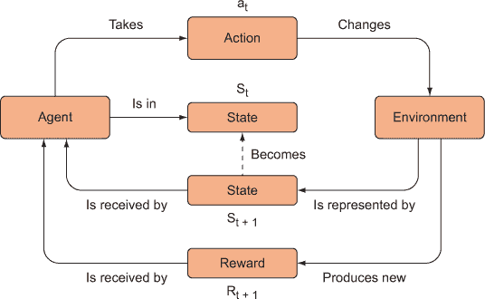

根据环境和网络的复杂性，创建具有正确超参数的代理可能非常困难。此外，为了使用梯度下降和反向传播，我们需要一个可微分的模型。当然，你可以构建一些有趣和有用的模型，但由于缺乏可微分性，可能无法使用梯度下降进行训练。

而不是创建一个代理并改进它，我们可以从查尔斯·达尔文那里学习，并使用（非）自然选择进行进化。我们可以生成具有不同参数（权重）的多个不同代理，观察哪个表现最好，然后“繁殖”最佳代理，以便后代能够继承父母的优良特性——就像在自然选择中一样。我们可以使用算法来模拟生物进化。我们不需要努力调整超参数并等待多个 epoch 来查看代理是否“正确”地学习。我们只需选择已经表现更好的代理（如图 6.2 所示）。

##### 图 6.2\. 进化算法与基于梯度的优化技术不同。在进化策略中，我们生成代理，并将最有利的权重传递给后续代理。

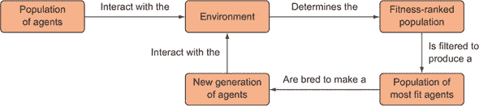

这类算法不需要单个代理进行学习。它不依赖于梯度下降，因此被称为*无梯度算法*。但仅仅因为单个代理没有被直接推向某个目标，并不意味着我们依赖于纯粹的偶然。著名的进化生物学家理查德·道金斯曾经说过：“自然选择绝非随机。”同样，在我们构建或更准确地说*发现*最佳代理的过程中，我们不会依赖于纯粹的偶然。我们将从具有性状差异的种群中选择最适应的个体。

### 6.2\. 使用进化策略的强化学习

在本节中，我们将讨论适应度如何影响进化策略，并简要介绍选择最适应代理的任务。接下来，我们将研究如何将这些代理重新组合成新的代理，并展示当我们引入突变时会发生什么。这种进化是一个多代过程，因此我们将讨论这一点，并回顾完整的训练循环。

#### 6.2.1\. 理论上的进化

如果你还记得你高中生物课的内容，自然选择会从每一代中选出“最适应”的个体。在生物学中，这代表着那些具有最大繁殖成功的个体，因此将他们的遗传信息传递给了下一代。那些能够从树上获取种子的喙形鸟类会有更多的食物，因此更有可能生存下来，并将这种喙形基因传递给他们的子女和孙子女。但记住，“最适应”是相对于环境而言的。北极熊适应了北极冰盖，但在亚马逊雨林中就会非常不适应。你可以把环境看作是确定一个目标或适应度函数，该函数根据个体在该环境中的表现为其分配适应度分数；他们的表现完全由他们的遗传信息决定。

在生物学中，每一次突变都会非常微妙地改变生物体的特征，以至于可能难以区分一代与另一代。然而，允许这些突变和变异在多代中积累，可以产生可感知的变化。例如，在鸟类喙的进化中，一个鸟群的喙形状最初可能大致相同。但随着时间的推移，种群中引入了随机突变。这些突变中的大多数可能对鸟类没有任何影响，甚至可能产生有害效果，但有了足够大的种群和足够多的代数，随机突变发生了，这些突变对喙形状产生了有利影响。拥有更适合喙的鸟类在获取食物方面会优于其他鸟类，因此它们有更高的可能性将基因传给下一代。因此，下一代会有更多有利形状的喙基因频率。

在*进化强化学习*中，我们正在选择那些能使我们的智能体在特定环境中获得最高奖励的特质，而当我们提到*特质*时，我们指的是模型参数（例如，神经网络的权重）或整个模型结构。一个强化学习智能体的适应性可以通过它在环境中表现时预期获得的奖励来决定。

假设智能体 A 玩 Atari 游戏 Breakout 并能够达到平均分数 500 分，而智能体 B 只能获得 300 分。我们会说智能体 A 比智能体 B 更适应，我们希望我们的最优智能体与 A 更相似而不是 B。记住，智能体 A 比智能体 B 更适应的唯一原因是它的模型参数对环境的优化略好。

进化强化学习的目标与基于反向传播和梯度下降的训练目标完全相同。唯一的区别在于我们使用这种进化过程，通常被称为*遗传算法*，来优化模型参数，例如神经网络（图 6.3）。

##### 图 6.3。在进化算法方法中，强化学习的智能体在环境中竞争，适应性更强的智能体（产生更多奖励的智能体）被优先复制以产生后代。经过多次迭代这个过程，只剩下最适应的智能体。

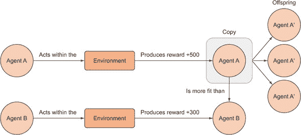

这个过程相当简单，但让我们更详细地回顾一下遗传算法的步骤。假设我们有一个神经网络，我们想将其用作智能体来玩 Gridworld，并想使用遗传算法来训练它。记住，*训练*一个神经网络只是指迭代更新其参数，使其性能提高。还请记住，给定一个固定的神经网络架构，参数完全决定了其行为，因此要复制一个神经网络，我们只需要复制其参数。

这是使用遗传算法（如图 6.4 所示）训练此类神经网络的方法：

1.  我们生成一个由随机参数向量组成的初始种群。我们将种群中的每个参数向量称为一个“个体”。假设这个初始种群有 100 个个体。

1.  我们通过这个种群，并通过对每个个体使用该参数向量在 Gridworld 中运行模型并记录奖励来评估每个个体的适应度。每个个体根据其获得的奖励分配一个适应度得分。由于初始种群是随机的，它们的表现可能都非常差，但仅凭偶然，会有一些个体的表现优于其他个体。

1.  我们从种群中随机抽取一对个体（“父母”），根据它们的相对适应度得分进行加权（适应度更高的个体有更高的被选中概率）以创建一个“繁殖种群”。

    |  |
    | --- |

    ##### 注意

    选择下一代“父母”的方法有很多种。一种方法是将选择概率简单地映射到每个个体，基于它们的相对适应度得分，然后从这个分布中进行抽样。这样，最适应的个体将被最频繁地选中，但仍有小概率选中表现不佳的个体。这有助于维持种群多样性。另一种方法是将所有个体进行排名，并选择前*N*个个体，然后使用这些个体进行交配以填充下一代。几乎任何优先选择表现最好的个体进行交配的方法都能工作，但有些方法比其他方法更好。在选择最佳表现者和减少种群多样性之间有一个权衡——这与强化学习中的探索与利用权衡非常相似。

    |  |
    | --- |

    ##### 图 6.4\. 用于强化学习的神经网络遗传算法优化。一组初始神经网络（强化学习代理）在环境中进行测试，获得奖励。每个个体代理根据其获得的奖励进行标记，这基于其适应度。个体根据其适应度被选中用于下一代；适应度更高的个体更有可能被包含在下一代中。选中的个体“交配”并“变异”以增加遗传多样性。

    

1.  培育种群中的个体将“交配”以产生“后代”，从而形成一个由 100 个个体组成的新完整种群。如果个体仅仅是实数参数向量，那么向量 1 与向量 2 的交配涉及从向量 1 中取一个子集，并将其与向量 2 的一个互补子集结合，以形成一个相同维度的新的后代向量。例如，假设你有一个向量 1: [1 2 3] 和向量 2: [4 5 6]。向量 1 与向量 2 交配产生 [1 5 6] 和 [4 2 3]。我们只是随机配对培育种群中的个体，并将它们重新组合以产生两个新的后代，直到我们填满一个新的种群。这创造了新的“遗传”多样性，并保留了最佳表现者。

1.  现在，我们有一个新的种群，其中包含上一代的最优解，以及新的后代解。在这个时候，我们将迭代我们的解，并随机突变其中的一些，以确保我们向每一代引入新的遗传多样性，以防止过早收敛到局部最优。突变只是意味着向参数向量添加一点随机噪声。如果这些是二进制向量，那么突变意味着随机翻转几个比特；否则我们可能会添加一些高斯噪声。突变率需要相当低，否则我们可能会破坏已经存在的良好解。

1.  我们现在有一代新的突变后代。我们将用新的种群重复这个过程，进行*N*代或直到我们达到*收敛*（即平均种群适应度不再显著提高）。

#### 6.2.2. 实践中的进化

在我们深入强化学习应用之前，我们将为了说明目的在一个示例问题上运行一个超级简单的遗传算法。我们将创建一个随机的字符串种群，并尝试将它们进化成我们选择的特定目标字符串，例如“Hello World！”

我们初始的随机字符串种群将看起来像“gMIgSkybXZyP”和“adlBOM XIrBH。”我们将使用一个函数来告诉我们这些字符串与目标字符串的相似度，以给出适应度分数。然后我们将根据它们的相对适应度分数从种群中采样父母对，使得适应度分数较高的个体更有可能被选中成为父母。接下来我们将这些父母（也称为*交叉*或*重组*）交配以产生两个后代字符串，并将它们添加到下一代。我们还将通过在字符串中随机翻转一些字符来突变后代。我们将迭代这个过程，并期望种群将富含接近我们目标的字符串；可能至少有一个会完全命中我们的目标（此时我们将停止算法）。字符串的这种进化过程在图 6.5 中展示。

##### 图 6.5\. 一个字符串图，概述了将一组随机字符串进化到目标字符串的遗传算法的主要步骤。我们从一个随机字符串种群开始，将每个字符串与目标字符串进行比较，并根据每个字符串与目标字符串的相似度分配一个适应度分数。然后我们选择高适应度父母进行“交配”（或重新组合）以产生后代，然后我们突变后代以引入新的遗传变异。我们重复选择父母和产生后代的过程，直到下一代满员（其大小与起始种群相同）。

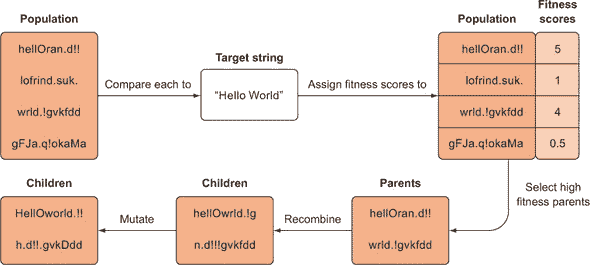

这可能是一个愚蠢的例子，但它是遗传算法最简单的演示之一，而且这些概念将直接转移到我们的强化学习任务中。列表 6.1 到 6.4 展示了代码。

在 列表 6.1 中，我们首先设置函数以实例化一个初始的随机字符串种群，并定义一个可以计算两个字符串之间相似度分数的函数，我们最终将使用它作为我们的适应度函数。

##### 列表 6.1\. 进化字符串：设置随机字符串

```
import random
from matplotlib import pyplot as plt

alphabet = "abcdefghijklmnopqrstuvwxyzABCDEFGHIJKLMNOPQRSTUVWXYZ,.! "   *1*
target = "Hello World!"                                                 *2*

class Individual:                                                       *3*
    def __init__(self, string, fitness=0):
        self.string = string
        self.fitness = fitness

from difflib import SequenceMatcher

def similar(a, b):                                                      *4*
    return SequenceMatcher(None, a, b).ratio()

def spawn_population(length=26,size=100):                               *5*
    pop = []
    for i in range(size):
        string = ''.join(random.choices(alphabet,k=length))
        individual = Individual(string)
        pop.append(individual)
       return pop
```

+   ***1*** 我们从中采样以生成随机字符串的字符列表

+   ***2*** 我们试图从随机种群中进化的字符串

+   ***3*** 设置一个简单的类来存储关于种群每个成员的信息

+   ***4*** 计算两个字符串之间的相似度指标，给出适应度分数

+   ***5*** 生成一个初始的随机字符串种群

上述代码创建了一个初始个体种群，这些个体是包含字符串字段和适应度分数字段的类对象。然后它通过从字母字符列表中采样来创建随机字符串。一旦我们有了种群，就需要评估每个个体的适应度。对于字符串，我们可以使用一个名为 `SequenceMatcher` 的内置 Python 模块来计算相似度指标。

在 列表 6.2 中，我们定义了两个函数，`recombine` 和 `mutate`。正如它们的名称所暗示的，前者将接受两个字符串并将它们重新组合成两个新的字符串，而后者将通过随机翻转字符串中的字符来突变它们。

##### 列表 6.2\. 进化字符串：重新组合和突变

```
def recombine(p1_, p2_):               *1*
    p1 = p1_.string
    p2 = p2_.string
    child1 = []
    child2 = []
    cross_pt = random.randint(0,len(p1))
    child1.extend(p1[0:cross_pt])
    child1.extend(p2[cross_pt:])
    child2.extend(p2[0:cross_pt])
    child2.extend(p1[cross_pt:])
    c1 = Individual(''.join(child1))
    c2 = Individual(''.join(child2))
    return c1, c2

def mutate(x, mut_rate=0.01):          *2*
    new_x_ = []
    for char in x.string:
        if random.random() < mut_rate:
            new_x_.extend(random.choices(alphabet,k=1))
        else:
            new_x_.append(char)
    new_x = Individual(''.join(new_x_))
    return new_x
```

+   ***1*** 将两个父字符串重新组合成两个新的后代

+   ***2*** 通过随机翻转字符来突变字符串

上述重新组合函数接受两个父字符串，如“hello there”和“fog world”，并通过生成一个随机整数（长度不超过字符串长度）来随机重新组合它们，取父 1 的第一部分和父 2 的第二部分来创建一个后代，例如，如果分割发生在中间，则生成“fog there”和“hello world”。如果我们进化了一个包含我们想要的部分的字符串，如“hello”，另一个字符串包含我们想要的其他部分，如“world”，那么重新组合过程可能会给我们所有我们想要的东西。

突变过程会从一个像“hellb”这样的字符串开始，并且以一定的概率（突变率）将字符串中的一个字符替换为随机字符。例如，如果突变率为 20%（0.2），那么在“hellb”中的 5 个字符中至少有一个可能会突变成随机字符。如果目标是“hello”，那么它可能会突变成“hello”。突变的目的在于将新的信息（变异性）引入种群。如果我们只进行重组，那么种群中的个体可能会迅速变得过于相似，我们也就找不到我们想要的解决方案，因为如果没有突变，信息会在每一代中丢失。请注意，突变率是至关重要的。如果太高，最适应的个体可能会因为突变而失去其适应性；如果太低，我们可能不会有足够的变异性来找到最优个体。不幸的是，你必须通过经验来找到合适的突变率。

在列表 6.3 中，我们定义了一个函数，该函数将遍历字符串种群中的每个个体，计算其适应度分数，并将其与该个体关联起来。我们还定义了一个函数，该函数将创建下一代。

##### 列表 6.3\. 进化字符串：评估个体并创建新的一代

```
def evaluate_population(pop, target):                           *1*
    avg_fit = 0
    for i in range(len(pop)):
        fit = similar(pop[i].string, target)
        pop[i].fitness = fit
        avg_fit += fit
    avg_fit /= len(pop)
    return pop, avg_fit

def next_generation(pop, size=100, length=26, mut_rate=0.01):   *2*
    new_pop = []
    while len(new_pop) < size:
        parents = random.choices(pop,k=2, weights=[x.fitness for x in pop])
        offspring_ = recombine(parents[0],parents[1])
        child1 = mutate(offspring_[0], mut_rate=mut_rate)
        child2 = mutate(offspring_[1], mut_rate=mut_rate)
        offspring = [child1, child2]
        new_pop.extend(offspring)
    return new_pop
```

+   ***1*** 为种群中的每个个体分配适应度分数

+   ***2*** 通过重组和突变生成新的一代

这些是我们需要完成的最后两个函数，以完成进化过程。我们有一个函数可以评估种群中的每个个体，并为其分配一个适应度分数，这仅仅表示个体的字符串与目标字符串的相似程度。适应度分数将根据给定问题的目标而变化。最后，我们有一个函数可以通过采样当前种群中最适应的个体，将它们重新组合以产生后代，并对它们进行突变来生成新的种群。

在列表 6.4 中，我们将所有内容组合在一起，并对前几步进行迭代，直到达到最大代数。也就是说，我们从一个初始种群开始，通过评估个体适应度并创建新的后代种群的过程，然后重复这一序列多次。经过足够多的代数后，我们期望最终种群中会包含与目标字符串非常接近的字符串。

##### 列表 6.4\. 进化字符串：将所有内容组合在一起

```
num_generations = 150
population_size = 900
str_len = len(target)
mutation_rate = 0.00001                                       *1*

pop_fit = []
pop = spawn_population(size=population_size, length=str_len)  *2*
for gen in range(num_generations):
    pop, avg_fit = evaluate_population(pop, target)
    pop_fit.append(avg_fit)                                   *3*
    new_pop = next_generation(pop, \
    size=population_size, length=str_len, mut_rate=mutation_rate)
    pop = new_pop
```

+   ***1*** 将突变率设置为 0.001%

+   ***2*** 创建初始随机种群

+   ***3*** 记录训练时间内的种群平均适应度

如果你运行该算法，它应该在现代 CPU 上花费几分钟。你可以按照以下方式找到种群中排名最高的个体：

```
>>> pop.sort(key=lambda x: x.fitness, reverse=True) #sort in place, highest fitness first
>>> pop[0].string
"Hello World!"
```

成功了！你还可以在图 6.6 中看到每一代种群的平均适应度水平都在增加。实际上，使用进化算法优化这个问题更困难，因为字符串空间不是连续的；由于最小的步骤是翻转一个字符，因此很难在正确的方向上采取小的增量步骤。因此，如果你尝试制作一个更长的目标字符串，进化将需要更多的时间和资源。

##### 图 6.6。这是平均种群适应度随代数变化的图。平均种群适应度相当单调地增加，然后达到平台期，这看起来很有希望。如果图非常锯齿状，变异率可能太高或种群规模太小。如果图收敛得太快，变异率可能太低。

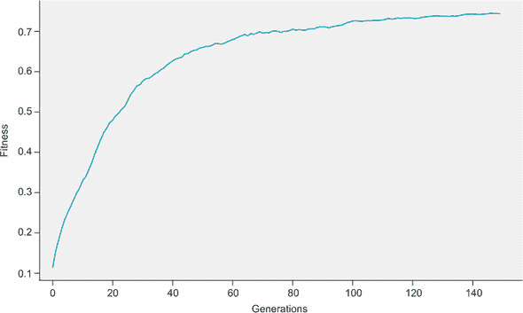

当我们在模型中优化实值参数时，即使是很小的值增加也可能提高适应度，我们可以利用这一点，这使得优化更快。但是，尽管离散值个体在进化算法中更难优化，但它们使用传统的梯度下降和反向传播方法是*不可能*进行优化的，因为它们是不可微分的。

### 6.3. CartPole 的遗传算法

让我们看看这种进化策略在一个简单的强化学习示例中的工作方式。我们将使用进化过程来优化一个智能体来玩 CartPole，这是我们第四章中介绍的环境，其中智能体会因为保持杆竖直而获得奖励（图 6.7）。

##### 图 6.7。我们将使用 CartPole 环境来测试我们的智能体。智能体通过保持杆竖直获得奖励，并且它可以左右移动小车。

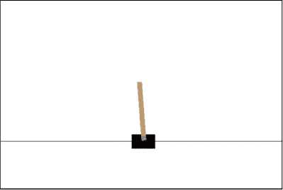

我们可以将一个智能体表示为一个近似策略函数的神经网络——它接受一个状态并输出一个动作，或者更典型的是输出动作的概率分布。以下列表展示了三层网络的一个示例。

##### 列表 6.5。定义一个智能体

```
import numpy as np
import torch

def model(x,unpacked_params):
    l1,b1,l2,b2,l3,b3 = unpacked_params          *1*
    y = torch.nn.functional.linear(x,l1,b1)      *2*
    y = torch.relu(y)                            *3*
    y = torch.nn.functional.linear(y,l2,b2)
    y = torch.relu(y)
    y = torch.nn.functional.linear(y,l3,b3)
    y = torch.log_softmax(y,dim=0)               *4*
    return y
```

+   ***1*** 将参数向量解包成单个层矩阵

+   ***2*** 一个简单的带偏置的线性层

+   ***3*** 一个修正线性单元激活函数

+   ***4*** 最后一层将输出动作的对数概率。

列表 6.5 中的函数定义了一个三层神经网络。前两层使用修正线性单元激活函数，而最后一层使用 log-softmax 激活函数，以便我们得到作为最终输出的动作的对数概率。请注意，这个函数期望一个输入状态`x`和一个`unpacked_params`，它是一个元组，包含每个层中使用的单个参数矩阵。

为了使重组和变异过程更容易，我们将创建一个参数向量（1-张量）的种群，然后我们必须将其“解包”或分解成单个参数矩阵，以便在神经网络的每一层中使用。

##### 列表 6.6。解包参数向量

```
def unpack_params(params, layers=[(25,4),(10,25),(2,10)]):  *1*
    unpacked_params = []                                    *2*
    e = 0
    for i,l in enumerate(layers):                           *3*
        s,e = e,e+np.prod(l)
        weights = params[s:e].view(l)                       *4*
        s,e = e,e+l[0]
        bias = params[s:e]
        unpacked_params.extend([weights,bias])              *5*
    return unpacked_params
```

+   ***1*** 层参数指定了每个层矩阵的形状。

+   ***2*** 存储每个单独的层张量

+   ***3*** 遍历每一层

+   ***4*** 将单个层解包成矩阵形式

+   ***5*** 将解包的张量添加到列表中

前面的函数接受一个平面参数向量作为`params`输入，以及它包含的层的规范作为`layers`输入，这是一个元组的列表；它将参数向量解包成一系列单个层矩阵和偏置向量，这些向量存储在一个列表中。`layers`的默认设置指定了一个 3 层神经网络，因此它由 3 个维度为 25 × 4、10 × 25 和 2 × 10 的权重矩阵以及维度为 1 × 25、1 × 10 和 1 × 2 的 3 个偏置向量组成，总共在平面参数向量中有 407 个参数。

我们添加使用扁平参数向量和解包它们的复杂性的唯一原因是我们想要能够突变和重新组合整个参数集，这最终使得整个过程更简单，并且与我们对字符串的处理方式相匹配。另一种方法是，将每个层的神经网络视为一个单独的染色体（如果你记得生物学中的概念）——只有匹配的染色体才会重新组合。使用这种方法，你将只重新组合来自同一层的参数。这将防止后续层的信息破坏早期层。我们鼓励你在熟悉我们这里的方法后，尝试使用这种“染色体”方法作为挑战。你需要遍历每一层，分别重新组合和突变它们。

接下来，让我们添加一个函数来创建一个代理种群。

##### 列表 6.7\. 生成种群

```
def spawn_population(N=50,size=407):         *1*
    pop = []
    for i in range(N):
        vec = torch.randn(size) / 2.0        *2*
        fit = 0
        p = {'params':vec, 'fitness':fit}    *3*
        pop.append(p)
    return pop
```

+   ***1*** N 是种群中个体的数量；大小是参数向量的长度。

+   ***2*** 创建一个随机初始化的参数向量

+   ***3*** 创建一个字典来存储参数向量和其关联的适应度分数

每个代理将是一个简单的 Python 字典，存储该代理的参数向量和该代理的适应度分数。

接下来，我们实现一个函数，该函数将重新组合两个父代代理以产生两个新的子代代理。

##### 列表 6.8\. 遗传重组

```
def recombine(x1,x2):                          *1*
    x1 = x1['params']                          *2*
    x2 = x2['params']
    l = x1.shape[0]
    split_pt = np.random.randint(l)            *3*
    child1 = torch.zeros(l)
    child2 = torch.zeros(l)
    child1[0:split_pt] = x1[0:split_pt]        *4*
    child1[split_pt:] = x2[split_pt:]
    child2[0:split_pt] = x2[0:split_pt]
    child2[split_pt:] = x1[split_pt:]
    c1 = {'params':child1, 'fitness': 0.0}     *5*
    c2 = {'params':child2, 'fitness': 0.0}
    return c1, c2
```

+   ***1*** x1 和 x2 是代理，它们是字典。

+   ***2*** 仅提取参数向量

+   ***3*** 随机产生一个分割或交叉点

+   ***4*** 第一个子代是通过取父代 1 的第一个片段和父代 2 的第二个片段产生的。

+   ***5*** 通过将新的参数向量打包成字典来创建新的子代代理

此函数接受两个作为父母的智能体，并产生两个子女或后代。它是通过取一个随机的分割或交叉点，然后取父母 1 的第一部分与父母 2 的第二部分结合，同样结合父母 1 的第二部分和父母 2 的第一部分来完成的。这正是我们之前用于重组字符串的相同机制。

那是填充下一代的第一阶段；第二阶段是以相当低的概率变异个体。变异是每一代中新的遗传信息的唯一来源——重组只是重新排列已存在的信息。

##### 列表 6.9\. 修改参数向量

```
def mutate(x, rate=0.01):                                                 *1*
    x_ = x['params']
    num_to_change = int(rate * x_.shape[0])                               *2*
    idx = np.random.randint(low=0,high=x_.shape[0],size=(num_to_change,))
    x_[idx] = torch.randn(num_to_change) / 10.0                           *3*
    x['params'] = x_
    return x
```

+   ***1*** 速率是变异率，其中 0.01 是 1% 的变异率。

+   ***2*** 使用变异率来决定要变异的参数向量中的元素数量

+   ***3*** 随机重置参数向量中选定的元素

我们基本上遵循与字符串相同的程序；我们随机更改参数向量的一些元素。变异率参数控制我们更改的元素数量。我们需要仔细控制变异率，以平衡创建可用于改进现有解决方案的新信息与破坏旧信息。

接下来，我们需要通过在实际环境中测试每个智能体（在我们的案例中是 CartPole）来评估每个智能体的适应性。

##### 列表 6.10\. 测试环境中的每个智能体

```
import gym
env = gym.make("CartPole-v0")

def test_model(agent):
    done = False
    state = torch.from_numpy(env.reset()).float()
    score = 0
    while not done:                                                     *1*
        params = unpack_params(agent['params'])
        probs = model(state,params)                                     *2*
        action = torch.distributions.Categorical(probs=probs).sample()  *3*
        state_, reward, done, info = env.step(action.item())
        state = torch.from_numpy(state_).float()
        score += 1                                                      *4*
    return score
```

+   ***1*** 游戏未失败时

+   ***2*** 使用智能体的参数向量从模型中获取动作概率

+   ***3*** 通过从分类分布中进行采样以概率选择动作

+   ***4*** 将游戏未失败的时间步数作为得分跟踪

`test_model` 函数接受一个 *智能体*（一个参数向量和其适应性值的字典）并在 CartPole 环境中运行它，直到游戏失败并返回其持续的时间步数作为其得分。我们希望培育出在 CartPole 中可以持续更长时间（因此获得高分）的智能体。

我们需要为种群中的所有智能体执行此操作。

##### 列表 6.11\. 评估种群中的所有智能体

```
def evaluate_population(pop):
    tot_fit = 0                         *1*
    lp = len(pop)
    for agent in pop:                   *2*
        score = test_model(agent)       *3*
        agent['fitness'] = score        *4*
        tot_fit += score
    avg_fit = tot_fit / lp
    return pop, avg_fit
```

+   ***1*** 该种群的总适应性；用于稍后计算种群的平均适应性

+   ***2*** 遍历种群中的每个智能体

+   ***3*** 在环境中运行智能体以评估其适应性

+   ***4*** 存储适应性值

`evaluate_population` 函数遍历种群中的每个智能体，并在它们上运行 `test_model` 以评估其适应性。

我们还需要的主要函数是列表 6.12 中的`next_generation`函数。与之前我们的基于字符串的遗传算法不同，在之前的算法中，我们根据适应性分数以概率选择父母，而在这里，我们采用不同的选择机制。*概率选择机制*类似于我们在策略梯度方法中选择动作的方式，并且在那里效果很好，但选择遗传算法中的父母时，它往往会导致过快的收敛。遗传算法比基于梯度下降的方法需要更多的探索。在这种情况下，我们将使用一种称为*锦标赛式选择*（图 6.8）的选择机制。

##### 图 6.8。在锦标赛选择中，我们像往常一样评估种群中所有个体的适应性，然后随机选择整个种群的一个子集（在此图中为 4 个中的 2 个），然后选择该子集中的顶级个体（通常是 2 个），将它们配对产生后代并对其进行变异。我们重复此选择过程，直到填满下一代。

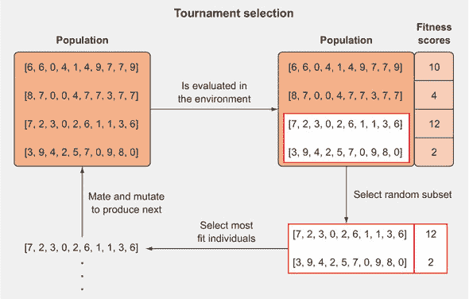

在锦标赛式选择中，我们从整个种群中随机选择一个子集，然后选择该子集的前两名个体作为父母。这确保我们不会总是选择相同的两个顶级父母，但最终我们会更频繁地选择表现更好的代理。

我们可以通过改变*锦标赛大小*（随机子集的大小）来控制我们偏好在当前一代中选择最佳代理的程度，这可能会失去遗传多样性。在极端情况下，我们可以将锦标赛大小设置为与种群大小相等，在这种情况下，我们只会选择种群中的前两个个体。在另一个极端情况下，我们可以将锦标赛大小设置为 2，这样我们就是随机选择父母。

在这个例子中，我们将锦标赛大小设置为种群大小的百分比。经验表明，大约 20%的锦标赛大小似乎效果相当好。

##### 列表 6.12。创建下一代

```
def next_generation(pop,mut_rate=0.001,tournament_size=0.2):
    new_pop = []
    lp = len(pop)
    while len(new_pop) < len(pop):                         *1*
        rids = np.random.randint(low=0,high=lp, \
        size=(int(tournament_size*lp)))                    *2*
        batch = np.array([[i,x['fitness']] for \ 
        (i,x) in enumerate(pop) if i in rids])             *3*
        scores = batch[batch[:, 1].argsort()]              *4*
        i0, i1 = int(scores[-1][0]),int(scores[-2][0])     *5*
        parent0,parent1 = pop[i0],pop[i1]
        offspring_ = recombine(parent0,parent1)            *6*
        child1 = mutate(offspring_[0], rate=mut_rate)      *7*
        child2 = mutate(offspring_[1], rate=mut_rate)
        offspring = [child1, child2]
        new_pop.extend(offspring)
    return new_pop
```

+   ***1*** 当新种群尚未满员时

+   ***2*** 从整个种群中选择一定百分比的个体作为子集

+   ***3*** 将种群划分为一批代理，并将每个代理与原始种群中的索引值相匹配

+   ***4*** 按分数递增顺序对这一批次进行排序

+   ***5*** 在排序批次中，最后几个代理具有最高的分数；选择前两个作为父母。

+   ***6*** 将父母重新组合以获得后代

+   ***7*** 在将子代放入下一代之前对其进行变异

`next_generation` 函数创建一个随机索引列表，用于索引种群列表并创建一个用于锦标赛批次的子集。我们使用 `enumerate` 函数来跟踪子集中每个代理的索引位置，以便我们可以在主种群中回溯它们。然后我们按升序排序批次的适应度分数，并取列表中的最后两个元素作为该批次的前两名个体。我们查找它们的索引，并从原始种群列表中选取整个代理。

将所有这些放在一起，我们只需几代就能训练一个种群来玩 CartPole。你应该尝试突变率、种群大小和代数等超参数。

##### 列表 6.13\. 训练模型

```
num_generations = 25                                                       *1*
population_size = 500                                                      *2*
mutation_rate = 0.01
pop_fit = []
pop = spawn_population(N=population_size,size=407)                         *3*
for i in range(num_generations):
    pop, avg_fit = evaluate_population(pop)                                *4*
    pop_fit.append(avg_fit)
    pop = next_generation(pop, mut_rate=mutation_rate,tournament_size=0.2) *5*
```

+   ***1*** 进化的代数数量

+   ***2*** 每一代中的个体数量

+   ***3*** 初始化种群

+   ***4*** 评估种群中每个代理的适应度

+   ***5*** 填充下一代

第一代开始于随机参数向量的种群，但出于偶然，其中一些会比其他的好，我们优先选择这些进行交配并产生下一代的后代。为了保持遗传多样性，我们允许每个个体发生轻微的变异。这个过程一直重复，直到我们拥有在玩 CartPole 方面特别出色的个体。你可以在图 6.9 中看到，每一代进化的分数都在稳步增加。

##### 图 6.9\. 用于训练代理玩 CartPole 的遗传算法中，每一代种群的平均分数。

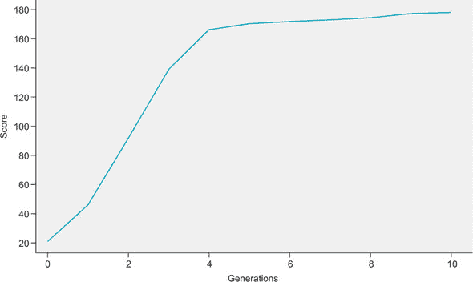

### 6.4\. 进化算法的优缺点

本章实现的算法与我们在这本书中使用的先前方法略有不同。在某些情况下，进化方法效果更好，例如在那些从探索中获益更多的问题中；在其他情况下，它可能不切实际，例如在收集数据成本高昂的问题中。在本节中，我们将讨论进化算法的优点和缺点，以及你可能在哪些情况下从使用它们而不是梯度下降中受益。

#### 6.4.1\. 进化算法探索更多

无梯度方法的优点是它们倾向于比基于梯度的方法探索更多。DQN 和策略梯度都遵循了类似的策略：收集经验和引导代理采取导致更大奖励的行动。正如我们讨论的，这往往会使得代理在偏好某个动作时放弃探索新状态。我们通过在 DQN 中结合 epsilon-greedy 策略来解决此问题，这意味着代理即使有首选动作，也有一定几率采取随机动作。在随机策略梯度中，我们依赖于从我们的模型输出的动作概率向量中抽取各种动作。

与之相反，遗传算法中的代理（agents）不会被推向任何方向。我们在每一代中产生大量的代理，由于它们之间有如此多的随机变异，大多数代理将具有与彼此不同的策略。在进化策略中仍然存在探索与利用的问题，因为过少的变异可能导致过早收敛，整个种群被几乎完全相同的个体填满，但与基于梯度的算法相比，通常更容易确保遗传算法有足够的探索。

#### 6.4.2\. 进化算法对样本的需求极其密集

正如你可能从本章的代码中看到的那样，我们需要将种群中的每个代理 500 个通过环境运行以确定它们的适应性。这意味着在我们能够对种群进行更新之前，我们需要执行 500 次主要计算。进化算法通常比基于梯度的方法更“样本密集”，因为我们不是战略性地调整代理的权重；我们只是创建大量的代理，并希望我们引入的随机变异和重组是有益的。我们将说进化算法比 DQN 或 PG 方法“数据效率”更低。

假设我们想要减小种群的大小以使算法运行得更快。如果我们减小种群大小，在挑选两个父母时可供选择的代理就少了。这将使得适应性较低的个体更有可能进入下一代。我们依赖于产生大量的代理，希望找到一种组合，从而带来更好的适应性。此外，正如在生物学中一样，变异通常具有负面影响并导致适应性变差。拥有更大的种群增加了至少有少数变异是有益的概率。

如果收集数据成本高昂，例如在机器人技术或自动驾驶车辆中，数据效率低下是一个问题。让机器人收集一次数据通常需要几分钟，而且我们知道从我们过去的算法中，训练一个简单的代理需要数百次甚至数千次数据。想象一下自动驾驶车辆需要探索其状态空间（世界）需要多少次数据。除了需要更多时间外，使用物理代理进行训练的成本也更高，因为你需要购买机器人并考虑任何维护费用。如果能不给他们提供物理身体就能训练这样的代理那就太理想了。

#### 6.4.3\. 模拟器

模拟器解决了上述问题。我们不必使用昂贵的机器人或构建带有必要传感器的汽车，而可以使用计算机软件来模拟环境提供的体验。例如，在训练智能体驾驶自动驾驶汽车时，我们不必在汽车上配备必要的传感器并在物理汽车上部署模型，而只需在软件环境中训练智能体，例如驾驶游戏《侠盗猎车手》。智能体将接收其周围环境的图像作为输入，并训练输出驾驶动作，以尽可能安全地将车辆开到预定目的地。

不仅模拟器在训练智能体时成本显著更低，而且由于智能体可以比现实生活中更快地与模拟环境交互，它们能够更快地进行训练。如果你需要观看并理解一部两小时的电影，这将需要你两小时的时间。如果你更加专注，可能可以将播放速度提高两到三倍，将所需时间缩短到一小时或更少。另一方面，电脑可以在你观看第一幕之前就完成。例如，一台 8 GPU 的电脑（可以从云服务中租用）运行 ResNet-50，这是一个用于图像分类的成熟深度学习模型，每秒可以处理超过 700 张图像。在一部每秒 24 帧（好莱坞标准）的两小时电影中，需要处理 172,800 帧。这将需要四分钟来完成。我们还可以通过跳过每几个帧来有效地提高我们深度学习模型的播放速度，这将使我们的处理时间缩短到两分钟以下。我们还可以投入更多的电脑来增加处理能力。作为一个更近期的强化学习例子，OpenAI Five 机器人每天能够玩 180 年的 Dota 2 游戏。你明白了——电脑的处理速度比我们快，这就是为什么模拟器有价值。

### 6.5. 进化算法作为可扩展的替代方案

如果有模拟器可用，使用进化算法收集样本的时间和财务成本就不再是问题。事实上，使用进化算法产生一个可行的智能体有时可能比基于梯度的方法更快，因为我们不需要通过反向传播来计算梯度。根据网络的复杂度，这可以将计算时间减少大约 2-3 倍。但进化算法的另一个优势是它们可以非常有效地进行并行化，这允许它们比梯度算法训练得更快。我们将在本节中详细讨论这一点。

#### 6.5.1. 扩展进化算法

OpenAI 发布了一篇由 Tim Salimans 等人撰写的论文，名为“Evolutionary Strategies as a Scalable Alternative to Reinforcement Learning”（2017 年），其中他们描述了通过增加更多机器来快速且高效地训练代理。在一台拥有 18 个 CPU 核心的单台机器上，他们能够在 11 小时内让一个 3D 类人生物学会走路。但使用 80 台机器（1,440 个 CPU 核心）的情况下，他们能够在 10 分钟内产生一个代理。

你可能认为这是显而易见的——他们只是投入了更多的机器和金钱来解决这个问题。但实际上，这比听起来要复杂得多，其他基于梯度的方法在扩展到那么多机器时都遇到了困难。

让我们先看看他们的算法与之前我们所做的是如何不同的。“进化算法”是一个总称，涵盖了从生物进化中汲取灵感的广泛算法，这些算法通过从大量种群中迭代选择略微更好的解决方案来优化解决方案。我们用来玩 CartPole 的算法更具体地被称为“遗传算法”，因为它更接近生物基因通过重组和突变从一代到下一代“更新”的方式。

另有一类被称为“进化策略”（ES）的进化算法，其名称令人困惑，它采用了一种不太准确的生物进化形式，如图 6.10 所示。

##### 图 6.10。在进化策略中，我们通过反复向一个父个体添加少量随机噪声来生成多个父个体的变体，从而创建一个个体种群。然后我们通过在环境中测试每个变体来为每个变体分配适应度分数，然后通过取所有变体的加权平均来获得一个新的父个体。

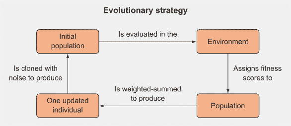

如果我们使用 ES 算法来训练神经网络，我们从一个单一的参数向量 *θ**[t]* 开始，采样一系列大小相等的噪声向量（通常来自高斯分布），例如 *e[i]* ~ *N*(*μ*,*σ*), 其中 *N* 是具有均值向量 *μ* 和标准差 *σ* 的高斯分布。然后我们创建一个参数向量种群，这些参数向量是 *θ**[t]* 的突变版本，通过 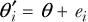 来实现。我们在环境中测试每个突变参数向量，并根据它们在环境中的表现分配给它们适应度分数。最后，我们通过取每个突变向量的加权平均来获得一个更新的参数向量，其中权重与它们的适应度分数成正比 (图 6.11)。

##### 图 6.11。在进化策略中，在每一个时间步，我们通过将旧参数向量与噪声向量的加权平均相加来获得一个更新的参数向量，其中权重与适应度分数成正比。


这种进化策略算法比我们之前实现的遗传算法简单得多，因为没有配对步骤。我们只执行变异，重组步骤不涉及从不同父母交换部分，而只是一个简单的加权求和，这很容易实现且计算速度快。正如我们将看到的，这种方法也更容易并行化。

#### 6.5.2\. 并行与串行处理

当我们使用遗传算法来训练代理玩 CartPole 时，我们必须按顺序迭代每个代理，并让每个代理玩 CartPole 直到它失败，以便在开始下一次运行之前确定每一代的最佳代理。如果代理运行环境需要 30 秒，而我们正在为 10 个代理确定适应度，这将需要 5 分钟。这被称为*串行*运行程序（图 6.12）。

##### 图 6.12\. 确定代理的适应度通常是训练循环中最慢的一步，需要我们让代理在环境中运行（可能多次）。如果我们在一个计算机上做这件事，我们将按顺序进行——我们必须等待一个代理完成环境中的运行，然后我们才能开始确定第二个代理的适应度。运行此算法所需的时间是代理数量和单个代理运行环境所需时间的函数。

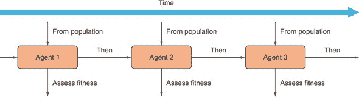

确定每个代理的适应度通常将是进化算法中运行时间最长的任务，但每个代理可以独立于其他代理评估自己的适应度。但没有任何理由我们需要等待代理 1 完成环境中的游戏，然后才开始评估代理 2。我们可以在多个计算机上同时运行这一代中的每个代理。每个 10 个代理将在 10 台机器上运行，我们可以同时确定它们的适应度。这意味着在 10 台机器上完成一代将需要大约 30 秒，而在一台机器上则需要 5 分钟，速度提升了 10 倍。这被称为在*并行*中运行过程（图 6.13）。

##### 图 6.13\. 如果我们有多个机器可供使用，我们可以并行地确定每个代理在其自己的机器上的适应度。我们不必等待一个代理完成环境中的运行，然后再开始下一个代理。如果我们正在训练具有长事件长度的代理，这将提供巨大的速度提升。现在你可以看到，这个算法只取决于评估单个代理适应度所需的时间，而不是我们正在评估的代理数量。

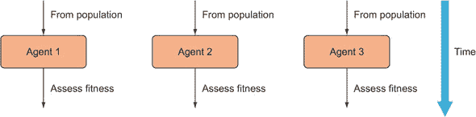

#### 6.5.3\. 缩放效率

现在我们可以向问题投入更多的机器和资金，而且我们不必等待那么长时间。在之前的假设例子中，我们增加了 10 台机器并获得了 10 倍的速度提升——扩展效率为 1.0。*扩展效率*是一个术语，用来描述随着更多资源投入而提高的特定方法，可以按照以下方式计算：

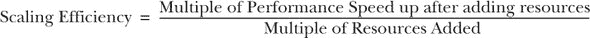

在现实世界中，流程的扩展效率永远不会是 1。增加更多机器总会有一些额外的成本，这会降低效率。更现实的情况是，增加 10 台机器只会给我们带来 9 倍的速度提升。使用之前的扩展效率方程，我们可以计算出扩展效率为 0.9（这在现实世界中已经相当不错了）。

最终我们需要结合评估每个代理的适应度结果，以便我们可以重新组合和变异它们。因此，我们需要使用真正的并行处理，然后进行一段时间的顺序处理。这更一般地被称为*分布式计算*（图 6.14），因为我们从一个处理器（通常称为*主节点*）开始，将任务分配给多个处理器并行运行，然后将结果收集回主节点。

##### 图 6.14. 分布式计算的一般示意图。主节点将任务分配给工作节点；工作节点执行这些任务，然后将结果发送回主节点（未显示）。

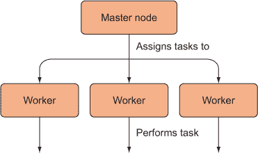

每一步都需要一点网络时间来在机器之间进行通信，这是如果我们把所有事情都在单个机器上运行时不会遇到的情况。此外，如果有一台机器比其他机器慢，其他工作节点将需要等待。为了获得最大的扩展效率，我们希望尽可能减少节点之间的通信量，无论是节点需要发送数据的次数，还是它们发送的数据量。

#### 6.5.4. 节点间的通信

OpenAI 的研究人员为分布式计算开发了一种巧妙策略，其中每个节点只向其他节点发送一个数字（而不是整个向量），从而消除了需要单独主节点的需求。这个想法是每个工作节点首先被初始化为相同的父参数向量。然后每个工作节点向其父节点添加一个噪声向量，以创建一个略微不同的子向量（图 6.15）。然后每个工作节点将子向量通过环境运行以获取其适应度分数。每个工作节点的适应度分数被发送给所有其他工作节点，这仅仅涉及发送一个数字。由于每个工作节点都有相同的随机种子集，每个工作节点都可以重新创建所有其他工作节点使用的噪声向量。最后，每个工作节点创建相同的新父向量，然后过程重复。

##### 图 6.15\. 从 OpenAI 分布式 ES 论文中推导出的架构。每个工作节点通过向父节点添加噪声来从父节点创建一个子参数向量。然后它评估子节点的适应度并将适应度分数发送给所有其他智能体。使用共享随机种子，每个智能体可以重建用于从其他工作节点创建其他向量的噪声向量，而无需发送整个向量。最后，通过执行子向量的加权求和来创建新的父向量，加权系数根据其适应度分数确定。

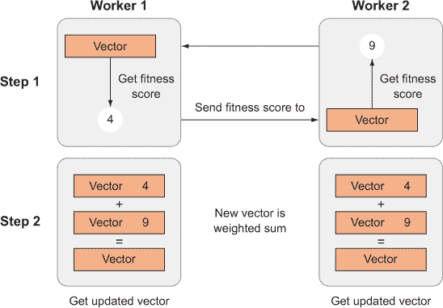

设置随机种子允许我们每次都能一致地生成相同的随机数，即使在不同的机器上也是如此。如果您运行 列表 6.14 中的代码，您将得到显示的输出，尽管这些数字应该是“随机”生成的。

##### 列表 6.14\. 设置随机种子

```
import numpy as np
np.random.seed(10)
np.random.rand(4)
>>> array([0.77132064, 0.02075195, 0.63364823, 0.74880388])

np.random.seed(10)
np.random.rand(4)
>> array([0.77132064, 0.02075195, 0.63364823, 0.74880388])
```

种子设置很重要；它允许涉及随机数的实验可以被其他研究人员重现。如果您不提供明确的种子，系统时间或某种其他类型的变量数将被使用。如果我们提出了一种新的强化学习算法，我们希望其他人能够在自己的机器上验证我们的工作。我们希望另一个实验室生成的智能体与我们的智能体完全相同，以消除任何错误来源（以及因此产生的怀疑）。这就是为什么我们提供尽可能多的关于我们算法的详细信息很重要的原因——架构、使用的超参数，有时甚至是使用的随机种子。然而，我们希望我们已经开发出了一种鲁棒的算法，并且生成的特定随机数集对算法的性能没有影响。

#### 6.5.5\. 线性缩放

由于 OpenAI 研究人员减少了节点间传输的数据量，增加节点并没有对网络产生显著影响。他们能够线性扩展到超过一千个工作节点。

*线性缩放*意味着对于每增加一台机器，我们获得的性能提升与增加前一台机器时获得的提升大致相同。这在性能与资源的关系图上表示为一条直线，如图 图 6.16 所示。

##### 图 6.16\. 从 OpenAI “进化策略作为可扩展强化学习替代方案”论文中重新创建的图。该图表明，随着更多计算资源的增加，时间改进保持恒定。

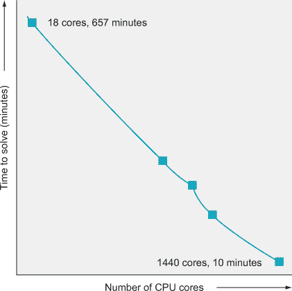

#### 6.5.6\. 缩放基于梯度的方法

基于梯度的方法也可以在多台机器上训练。然而，它们的扩展性远不如 ES。目前，大多数基于梯度的分布式训练涉及在每个工作器上训练代理，然后将梯度发送回中央机器进行汇总。每个 epoch 或更新周期都必须传递所有梯度，这需要大量的网络带宽并对中央机器造成压力。最终，网络会饱和，增加更多的工作器也不会提高训练速度（图 6.17）。

##### 图 6.17。当前基于梯度的方法的表现如下。一开始，由于网络尚未饱和，因此呈现出一种看似线性的趋势。但最终，随着资源的增加，性能提升越来越少。


与此同时，进化方法不需要反向传播，因此它们不需要向中央服务器发送梯度更新。并且，通过像 OpenAI 开发的那种智能技术，它们可能只需要发送一个数字。

### 摘要

+   进化算法为我们提供了更强大的工具。基于生物进化，我们

    +   产生个体

    +   从当前一代中选择最佳者

    +   打乱基因

    +   通过变异引入一些变化

    +   将它们配对以创建下一代的种群

+   进化算法通常比基于梯度的方法更“数据饥渴”且数据效率更低；在某些情况下这可能没问题，特别是如果你有一个模拟器。

+   进化算法可以优化非可微或甚至离散的函数，而基于梯度的方法无法做到。

+   进化策略（ES）是进化算法的一个子类，它不涉及类似生物的交配和重组，而是使用带噪声的复制和加权求和来从种群中创建新的个体。

## 第七章。分布式 DQN：全面了解

*本章涵盖*

+   为什么完整的概率分布比单个数字更好

+   将普通深度 Q 网络扩展到输出 Q 值的完整概率分布

+   实现 DQN 的分布变体以玩 Atari Freeway

+   理解普通贝尔曼方程及其分布变体

+   优先考虑经验回放以提高训练速度

我们在第三章中介绍了 Q 学习，作为一种确定给定状态下每个可能动作的价值的方法；这些值被称为动作值或 Q 值。这使得我们可以将这些动作值应用于策略，并选择与最高动作值相关的动作。在本章中，我们将扩展 Q 学习，不仅确定动作值的点估计，而且确定每个动作的整个动作值分布；这被称为“分布式 Q 学习”。分布式 Q 学习已被证明在标准基准测试中表现出显著更好的性能，并且它还允许进行更细致的决策，正如您将看到的。分布式 Q 学习算法，结合本书中介绍的一些其他技术，目前被认为是强化学习中的一个最先进的进展。

我们希望应用强化学习的大多数环境都涉及一些随机性或不可预测性，其中观察到的给定状态-动作对的奖励存在一些变异性。在普通的 Q 学习中，我们可能称之为“期望值 Q 学习”，我们只学习观察到的噪声奖励集的平均值。但通过取平均值，我们丢弃了关于环境动态的有价值信息。在某些情况下，观察到的奖励可能比围绕单个值聚集的更复杂的模式。对于给定的状态-动作，可能有两个或更多不同奖励值的奖励簇；例如，有时相同的状态-动作会导致大的正奖励，有时会导致大的负奖励。如果我们只取平均值，我们将会得到接近 0 的值，而这在这个情况下永远不会是观察到的奖励。

分布式 Q 学习试图获得观察到的奖励分布的更准确图景。实现这一目标的一种方法是对给定状态-动作对观察到的所有奖励进行记录。当然，这需要大量的内存，对于高维度的状态空间来说，这在计算上是不切实际的。这就是为什么我们必须做出一些近似。但首先，让我们更深入地探讨一下期望值 Q 学习缺少了什么，以及分布式 Q 学习提供了什么。

### 7.1. Q-learning 有什么问题？

我们所熟悉的期望值类型的 Q 学习是有缺陷的，为了说明这一点，我们将考虑一个现实世界的医学例子。想象一下，我们是一家医疗公司，我们想要构建一个算法来预测患有高血压（高血压）的患者对名为 Drug X 的新抗高血压药物 4 周疗程的反应。这将帮助我们决定是否给个别患者开这种药。

我们通过进行一项随机临床试验来收集大量临床数据，在这个试验中，我们选取了一群患有高血压的患者，并将他们随机分配到治疗组（将接受真实药物的患者）和对照组（将接受安慰剂，一种非活性药物）。然后，我们在每个组的患者服用各自药物的过程中记录血压随时间的变化。最后，我们可以看到哪些患者对药物有反应，以及与安慰剂相比，他们的改善程度如何（图 7.1）。

##### 图 7.1. 在一项药物的随机对照试验中，我们研究某种治疗与安慰剂（一种非活性物质）相比的结果。我们希望隔离我们试图治疗的效应，所以我们选取了一个具有某种条件的人群，并将他们随机分为两组：治疗组和对照组。治疗组接受我们正在测试的实验药物，对照组接受安慰剂。一段时间后，我们可以测量两组患者的结果，并看到治疗组的平均反应是否比安慰剂组更好。

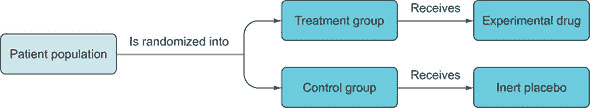

一旦我们收集了数据，我们就可以绘制治疗组和对照组在服用药物四周后血压变化的直方图。我们可能会看到图 7.2 中的结果。

##### 图 7.2. 模拟随机对照试验中对照组和治疗组的测量血压变化直方图。x 轴是从开始（治疗前）到治疗后的血压变化。我们希望血压下降，所以负数是好的。我们计算具有每个血压变化值的患者的数量，因此对照组中-3 的峰值意味着大多数患者血压下降了 3 毫米汞柱。你可以看到治疗组中有两个患者亚组：一个组血压显著下降，另一个组几乎没有效果。我们称这种分布为双峰分布，其中“峰”是分布中“峰值”的另一种说法。

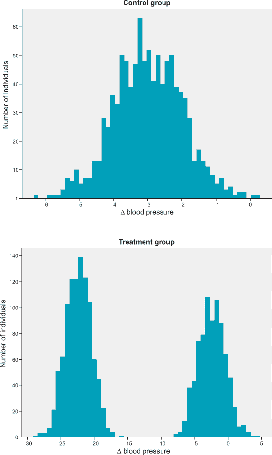

如果你首先查看图 7.2 中的对照组直方图，它看起来像是一个以-3.0 毫米汞柱（压力的单位）为中心的正常分布，这是一个相当不显著的血压降低，正如你从安慰剂中预期的。我们的算法正确地预测，对于任何接受安慰剂的患者，他们的平均血压变化将是-3.0 毫米汞柱，尽管个别患者的血压变化可能大于或小于这个平均值。

现在看看治疗组的直方图。血压变化的分布是双峰的，这意味着有两个峰值，就像我们结合了两个单独的正态分布一样。最右侧的峰值位于-2.5 mmHg，与对照组非常相似，这表明这个治疗组内的子组与安慰剂相比没有从药物中获益。然而，最左侧的峰值位于-22.3 mmHg，这是血压的显著降低。事实上，它比目前任何现有的抗高血压药物都要好。这再次表明，治疗组内存在一个子组，而这个子组强烈地从药物中获益。

如果你是一名医生，并且一位患有高血压的患者走进你的办公室，在其他条件相同的情况下，你应该给他们开这种新药吗？如果你取治疗组分布的期望值（平均值），你只会得到大约-13 mmHg 的血压变化，这位于分布的两个峰值之间。与安慰剂相比，这仍然是有意义的，但比市场上许多现有的抗高血压药物都要差。按照这个标准，新药看起来并不非常有效，尽管相当数量的患者从中获得了巨大的益处。此外，-13 mmHg 的期望值并不能很好地代表分布，因为实际上很少有患者的血压降低到那个水平。患者要么对药物几乎没有反应，要么有非常强烈的反应；很少有患者有适度的反应。

图 7.3 说明了期望值与观察完整分布相比的局限性。如果你使用每种药物血压变化的期望值，并且只选择血压变化期望值最低的药物（忽略患者特定的复杂性，如副作用），你将在群体层面上做出最优决策，但在个体层面上则不一定。

##### 图 7.3。在这里，我们比较模拟的药物 A 与药物 X，看看哪个能降低血压最多。药物 A 的平均（期望）值为-15.5 mmHg，标准差更低，但药物 X 是双峰分布，一个峰值位于-22.5 mmHg。请注意，对于药物 X，几乎没有患者的血压变化接近平均值。

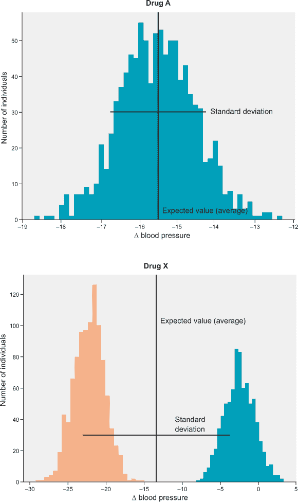

那么，这与深度强化学习有什么关系呢？嗯，正如你所学的，Q-learning 给我们提供了预期的（平均、时间折扣）状态-动作值。正如你可能想象的那样，这可能导致我们在药物案例中讨论过的相同限制，即多模态分布。学习状态-动作值的完整概率分布将比仅仅学习期望值（如普通 Q-learning 中那样）给我们带来更多的能力。有了完整的分布，我们可以看到状态-动作值中是否存在多模态，以及分布中有多少方差。图 7.4 模型了三种不同动作的动作值分布，你可以看到有些动作的方差比其他动作大。有了这些额外信息，我们可以采用风险敏感策略——这些策略不仅旨在最大化预期奖励，而且还要控制我们这样做所承担的风险量。

##### 图 7.4\. 顶部：一个普通的 Q 函数接受一个状态-动作对并计算相关的 Q 值。中部：一个分布 Q 函数接受一个状态-动作对并计算所有可能的 Q 值的概率分布。概率被限制在区间[0,1]内，因此它返回一个所有元素都在[0,1]区间内且它们的和为 1 的向量。底部：对于某个状态，分布 Q 函数为三个不同的动作产生的示例 Q 值分布。动作 A 可能导致平均奖励为-5，而动作 B 可能导致平均奖励为+4。

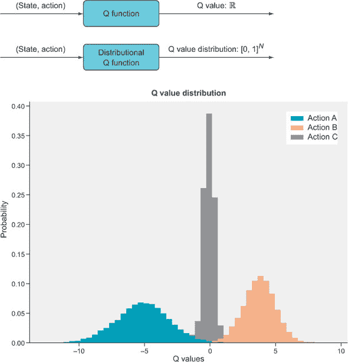

最有说服力的是，进行了一项实证研究，评估了原始 DQN 算法的几个流行变体和改进，包括 DQN 的分布变体，以查看哪些单独最有效，哪些在组合中最为重要（“Rainbow: Combining Improvements in Deep Reinforcement Learning” by Hessel et al., 2017）。结果发现，在所有他们测试的 DQN 的个别改进中，分布 Q-learning 是整体表现最好的算法。他们将所有技术结合在一起，形成了一个“Rainbow” DQN，这被证明比任何单一技术都更有效。然后他们测试了哪些组件对 Rainbow 的成功最为关键，结果是分布 Q-learning、多步 Q-learning（在第五章中介绍）和优先级重放（将在第 7.7 节中简要介绍）对 Rainbow 算法的性能最为重要。

在这一章中，你将学习如何实现一个分布式深度 Q 网络（Dist-DQN），它为给定状态下的每个可能动作输出一个状态-动作值的概率分布。我们在第四章中看到了一些概率概念，在那里我们使用深度神经网络作为策略函数，直接输出动作的概率分布，但我们将回顾这些概念，并在这里进行更深入的探讨，因为这些概念对于实现 Dist-DQN 至关重要。我们关于概率和统计的讨论可能一开始看起来有点过于学术，但很快就会清楚为什么我们需要这些概念来进行实际的应用。

这章是整本书中最概念上最难的一章，因为它包含了许多在最初难以掌握的概率概念。这里的数学内容也比其他任何章节都要多。通过这一章是一个巨大的成就；你将学习或复习许多机器学习和强化学习的基本主题，这将使你对这些领域有更深入的理解。

### 7.2. 概率和统计回顾

虽然概率理论的数学基础是一致的且无争议的，但关于说“公平硬币出现正面的概率是 0.5”这样的简单陈述的含义，实际上是有争议的。两个主要阵营被称为*频率主义者*和*贝叶斯主义者*。

频率主义者认为，硬币出现正面的概率是如果可以无限次抛硬币，观察到的正面比例。一系列的硬币抛掷可能会得到高达 0.8 的正面比例，但随着你继续抛掷，它将趋向于 0.5，在无限极限中。

因此，概率只是事件发生的频率。在这种情况下，有两种可能的结果，正面或反面，每种结果发生的概率是在无限次试验（抛硬币）后该结果的频率。这就是为什么概率的值在 0（不可能）和 1（必然）之间，并且所有可能结果的概率之和必须等于 1。

这是一个简单直接的概率方法，但它有显著的局限性。在频率主义设定中，对于像“简·多伊被选为市议会成员的概率是多少？”这样的问题，在实践中和理论上都很难理解，因为这样的选举不可能发生无限次。频率主义概率对于这类一次性事件并没有太多意义。我们需要一个更强大的框架来处理这些情况，这正是贝叶斯概率所提供的。

在贝叶斯框架中，概率代表了对各种可能结果的信念程度。你当然可以相信某件只能发生一次的事情，比如选举，你的信念关于可能发生的事情可以取决于你对特定情况了解多少，新信息将导致你更新你的信念（见表 7.1）。

##### 表 7.1\. 经验概率与贝叶斯概率

| 经验主义 | 贝叶斯 |
| --- | --- |
| 概率是单个结果的频率 | 概率是信念程度 |
| 计算给定模型的数据概率 | 计算给定数据模型的概率 |
| 使用假设检验 | 使用参数估计或模型比较 |
| 计算简单 | 计算通常困难 |

概率论的基本数学框架由一个**样本空间**Ω组成，它是特定问题的所有可能结果的集合。例如，在选举的情况下，样本空间是所有有资格被选为候选人的集合。存在一个概率分布（或测度）函数，*P*：Ω → [0,1]，其中*P*是从样本空间到 0 到 1 之间的实数的函数。你可以插入*P*(*候选人 A*)，它将输出一个介于 0 和 1 之间的数字，表示候选人 A 赢得选举的概率。


##### 注意

概率论比我们在这里阐述的要复杂得多，它涉及到一个称为**测度理论**的数学分支。就我们的目的而言，我们不需要比我们已经有的更深入地研究概率论。我们将坚持一个非正式且数学上非严格的概率概念介绍。


概率分布的**支撑集**是我们将使用的另一个术语。支撑集仅仅是分配了非零概率的子集。例如，温度不能低于 0 开尔文，所以负温度会被分配概率 0；温度概率分布的支撑集将从 0 到正无穷。由于我们通常不关心不可能发生的结果，你经常会看到“支撑集”和“样本空间”被互换使用，尽管它们可能并不相同。

#### 7.2.1\. 先验和后验

如果我们不指定候选人是谁或选举的内容，而问你“在四选一的比赛中有多少候选人获胜的概率？”你可能会拒绝回答，理由是信息不足。如果我们真的坚持要你回答，你可能会说，由于你一无所知，每个候选人都有 1/4 的获胜机会。有了这个答案，你就建立了一个**先验概率分布**，它在候选人中是均匀的（每个可能的结果都有相同的概率）。

在贝叶斯框架中，概率代表信念，而在新信息可能成为可用的情况中，信念总是试探性的，因此先验概率分布就是在接收到一些新信息之前开始的分布。在你接收到新信息，例如关于候选人的某些传记信息后，你可能会根据这些新信息更新你的先验分布——这个更新后的分布现在被称为你的*后验概率分布*。先验分布和后验分布之间的区别是情境性的，因为你的后验分布将在你接收到另一组新信息之前立即成为新的先验分布。你的信念会不断更新，从一系列先验分布到后验分布（参见图 7.5），这个过程通常被称为*贝叶斯推断*。

##### 图 7.5\. 贝叶斯推断是从先验分布开始，接收一些新信息，并使用这些信息将先验分布更新为一个新的、更信息的分布，称为后验分布。

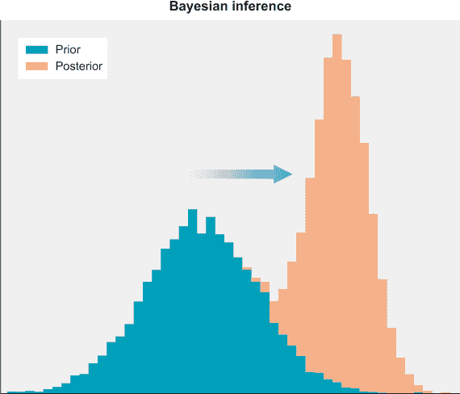

#### 7.2.2\. 期望和方差

我们可以向概率分布提出许多问题。我们可以询问单个“最可能”的结果是什么，这通常被认为是分布的*均值*或*平均值*。你可能熟悉均值的计算，即取所有结果的和，然后除以结果的数量。例如，[18, 21, 17, 17, 21]°C 的 5 天温度预报的均值是[18 + 21 + 17 + 17 + 21]/5 = 94/5 = 18.8°C。这是美国伊利诺伊州芝加哥 5 天样本的平均预测温度。

考虑一下，如果我们请了五个人预测明天芝加哥的温度，并且他们恰好给出了相同的数字，[18, 21, 17, 17, 21]°C。如果我们想得到明天的平均温度，我们会遵循相同的程序，将数字相加，然后除以样本数量（五个）来得到预测的平均温度。但如果第一个人是一位气象学家，而我们对其预测的信心比在街上随机调查的其他四个人要高得多呢？我们可能会希望将气象学家的预测权重高于其他人。假设我们认为他们的预测有 60%的可能性是正确的，而其他四个人只有 10%的可能性是正确的（注意 0.6 + 4 * 0.10 = 1.0），这是一个*加权平均*；它是通过将每个样本乘以其权重来计算的。在这种情况下，计算结果如下：[(0.6 * 18) + 0.1 * (21 + 17 + 17 + 21)] = 18.4°C。

每个温度都是明天的可能结果，但在这个情况下，并非所有结果的可能性都相同，因此我们乘以每个可能结果的概率（权重），然后求和。如果所有权重都相等且总和为 1，我们得到一个普通的平均计算，但很多时候并不如此。当权重不相等时，我们得到一个加权平均，称为分布的*期望值*。

概率分布的期望值是其“质心”，即平均情况下最可能出现的值。给定一个概率分布*P*(*x*)，其中*x*是样本空间，离散分布的期望值计算如下。

##### 表 7.2\. 从概率分布计算期望值

| 数学 | Python |
| --- | --- |
| 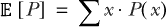 |

```
>>> x = np.array([1,2,3,4,5,6])
>>> p = np.array([0.1,0.1,0.1,0.1,0.2,0.4])
>>> def expected_value(x,p):
>>>     return x @ p
>>> expected_value(x,p)
4.4
```

|

期望值算子（其中*算子*是*函数*的另一种说法）表示为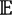，它是一个接收概率分布并返回其期望值的函数。它通过取一个值*x*，乘以其关联的概率*P*(*x*)，并对所有可能的*x*值求和来实现。

在 Python 中，如果将概率密度函数*P*(*x*)表示为一个包含概率的 numpy 数组`probs`，以及另一个包含`outcomes`（样本空间）的 numpy 数组，期望值可以这样计算：

```
>>> import numpy as np
>>> probs = np.array([0.6, 0.1, 0.1, 0.1, 0.1])
>>> outcomes = np.array([18, 21, 17, 17, 21])
>>> expected_value = 0.0
>>> for i in range(probs.shape[0]):
>>>        expected_value += probs[i] * outcomes[i]

>>> expected_value
18.4
```

或者，期望值可以通过`probs`数组与`outcomes`数组之间的内积（点积）来计算，因为内积做的是同样的事情——它将两个数组中对应元素相乘并求和。

```
>>> expected_value = probs @ outcomes
>>> expected_value
18.4
```

离散概率分布意味着其样本空间是一个有限集，换句话说，只有有限数量的可能结果可以发生。例如，抛硬币的结果只有两种可能。

然而，明天的温度可以是任何实数（或者如果以开尔文为单位测量，它可以是 0 到无穷大的任何实数），因为实数或任何实数的子集是无限的，因为我们可以不断地将它们除以：1.5 是一个实数，1.500001 也是一个实数，以此类推。当样本空间是无限的时候，这就是一个*连续概率分布*。

在连续概率分布中，分布并不告诉你特定结果的概率，因为可能的结果是无限的，每个单独的结果必须具有无限小的概率，以便总和为 1。因此，连续概率分布告诉你特定可能结果周围的*概率密度*。概率密度是围绕某个值的小区间内的概率之和——它是结果落在某个小区间内的概率。离散分布和连续分布之间的区别在图 7.6 中展示。现在我们就说这么多关于连续分布的内容，因为在这本书中，我们实际上只处理离散概率分布。

##### 图 7.6。左：离散分布类似于与另一个结果值数组关联的概率数组。存在有限个概率和结果。右：连续分布代表无限多个可能的结果，y 轴是概率密度（即结果在微小区间内取值的概率）。

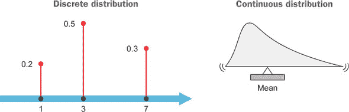

我们可以向概率分布提出另一个问题，即其范围或*方差*。我们对某事的信念可能更加或更少自信，因此概率分布可以是狭窄的或宽泛的。方差的计算使用期望运算符，定义为 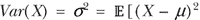]，但不必担心记住这个方程——我们将使用内置的 numpy 函数来计算方差。方差可以用 *Var*(*X*) 或 *σ*²（sigma squared）表示，其中 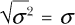 是标准差，因此方差是标准差的平方。此方程中的 *μ* 是均值的常用符号，它再次是 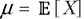，其中 *X* 是感兴趣的*随机变量*。

随机变量只是使用概率分布的另一种方式。随机变量与概率分布相关联，而概率分布可以产生随机变量。我们可以为明天的温度创建一个随机变量 *T*。由于它是一个未知值，因此它是一个随机变量，但它只能取与它所依赖的概率分布有效的特定值。我们可以在可能使用正常确定性变量的任何地方使用随机变量，但如果我们将随机变量与确定性变量相加，我们将得到一个新的随机变量。

例如，如果我们认为明天的温度只是今天的温度加上一些随机噪声，我们可以将此建模为 *T* = *t*[0] + *e*，其中 *e* 是噪声的随机变量。噪声可能具有以 0 为中心、方差为 1 的*正态（高斯）分布*。因此 *T* 将是一个新的正态分布，均值为 *t*[0]（今天的温度），但它仍然具有方差为 1。正态分布是熟悉的钟形曲线。

表 7.3 展示了一些常见的分布。正态分布的宽度或窄度取决于方差参数，但就任何一组参数而言，其外观都是相同的。相比之下，贝塔分布和伽马分布的外观可能会因参数的不同而大相径庭——每种分布都展示了两种不同的版本。

##### 表 7.3。常见概率分布

| 正态分布 | 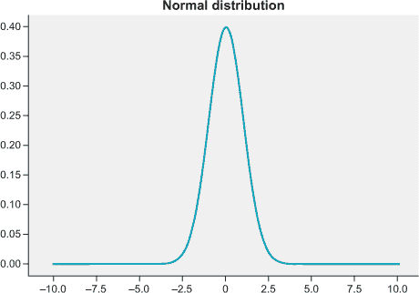 |
| --- | --- |
| 贝塔分布 | 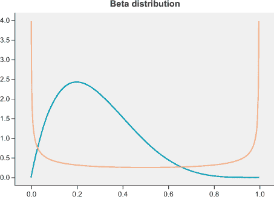 |
| 伽马分布 | 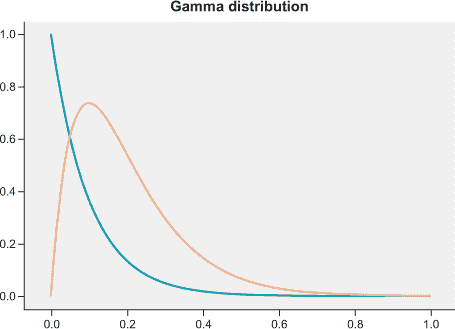 |

随机变量通常用大写字母表示，如 *X*。在 Python 中，我们可能使用 numpy 的 `random` 模块设置一个随机变量：

```
>>> t0 = 18.4
>>> T = lambda: t0 + np.random.randn(1)
>>> T()
array([18.94571853])
>>> T()
array([18.59060686])
```

在这里，我们将*T*设为一个无参数的匿名函数，每次调用时只将一个小的随机数加到 18.4 上。*T*的方差为 1，这意味着*T*返回的大多数值将在 18.4 度以内。如果方差是 10，可能的温度范围就会更广。通常我们从一个具有高方差的先验分布开始，随着我们获得更多信息，方差会减小。然而，如果得到的信息非常意外并且让我们变得不太确定，新信息可能会增加后验的方差。

### 7.3. 贝尔曼方程

我们在第一章中提到了理查德·贝尔曼，但在这里我们将讨论贝尔曼方程，它是强化学习的基础。贝尔曼方程在强化学习的文献中无处不在，但如果你只想用 Python 编写代码，你可以在不了解贝尔曼方程的情况下做到这一点。本节是可选的；它是为那些对更多数学背景感兴趣的人准备的。

如你所回忆，Q 函数告诉我们状态-动作对的价值，价值被定义为时间折扣奖励的期望总和。例如，在 Gridworld 游戏中，*Q**[π]*(*s*,*a*)告诉我们如果我们采取动作*a*处于状态*s*并从那时起遵循策略*π*，我们将获得的平均奖励。最优 Q 函数表示为*Q*^*，是完美准确的 Q 函数。当我们第一次用随机初始化的 Q 函数开始玩游戏时，它将给出非常不准确的 Q 值预测，但目标是迭代更新 Q 函数，直到它接近最优的*Q*^*。

贝尔曼方程告诉我们如何在观察到奖励时更新 Q 函数，

| *Q**[π]*(*s[t]*,*a[t]*) ← *r[t]* + *γ* × *V**[π]*(*s[t]*[+1]), |
| --- |

其中 *V**[π]*(*s[t]*[+1]) = *max*[*Q**[π]*(*s[t]*[+1],*a*)]

因此，当前状态的 Q 值，*Q**[π]*(*s[t]*,*a*), 应该更新为观察到的奖励*r[t]*加上下一个状态的价值*V**[π]*(*s[t]*[+1])乘以折扣因子*γ*（方程中的左向箭头表示“将右侧的值赋给左侧的变量”）。下一个状态的价值仅仅是下一个状态的最高 Q 值（因为我们对每个可能的动作都会得到不同的 Q 值）。

如果我们使用神经网络来近似 Q 函数，我们尝试通过更新神经网络的参数来最小化贝尔曼方程左侧预测的*Q**[π]*(*s[t]*,*a[t]*)与右侧数量的误差。

#### 7.3.1. 分布式贝尔曼方程

贝尔曼方程隐含地假设环境是确定性的，因此观察到的奖励也是确定性的（即，如果你在相同的状态下采取相同的行动，观察到的奖励将始终相同）。在某些情况下这是真的，但在其他情况下则不是。我们使用和将要使用的所有游戏（除了网格世界）都至少涉及一些随机性。例如，当我们对游戏的帧进行下采样时，原本不同的两个状态将被映射到相同的下采样状态，导致观察到的奖励存在一些不可预测性。

在这种情况下，我们可以将确定性的变量 *r[t]* 转换为具有某些潜在概率分布的随机变量 *R*(*s[t]*,*a*)。如果状态如何演变到新状态存在随机性，那么 Q 函数也必须是随机变量。原始的贝尔曼方程现在可以表示为

| 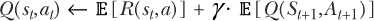 |
| --- |

再次强调，Q 函数是一个随机变量，因为我们把环境解释为具有随机转换。采取一个行动可能不会导致相同的下一个状态，因此我们得到下一个状态和动作的概率分布。下一个状态-动作对的期望 Q 值是最可能的 Q 值，给定最可能的下一个状态-动作对。

如果我们去掉期望算子，我们得到一个完整的分布贝尔曼方程：

| *Z*(*s[t]*,*a[t]*) ← *R*(*s[t]*,*a[t]*) + *γ* · *Z*(*S[t]*[+1],*A[t]*[+1]) |
| --- |

在这里，我们用 *Z* 表示分布 Q 值函数（我们也将称之为 *值分布*）。当我们使用原始贝尔曼方程进行 Q 学习时，我们的 Q 函数将学习值分布的期望值，因为这是它能做的最好的，但在这章中，我们将使用一个稍微复杂一点的神经网络，它将返回一个值分布，因此可以学习观察到的奖励的分布，而不仅仅是期望值。这很有用，正如我们在第一部分所描述的原因——通过学习分布，我们有一种方法来利用风险敏感策略，这些策略考虑了分布的方差和可能的多个模态。

### 7.4. 分布式 Q 学习

我们现在已经涵盖了实现分布深度 Q 网络（Dist-DQN）所需的所有预备知识。如果你没有完全理解前几节的所有材料，不要担心；当我们开始编写代码时，它将变得更加清晰。

在本章中，我们将使用 OpenAI Gym 中最简单的 Atari 游戏之一，Freeway (图 7.7)，这样我们就可以在笔记本电脑 CPU 上训练算法。与本章的其他章节不同，我们还将使用游戏的 RAM 版本。如果你查看[`gym.openai.com/envs/#atari`](https://gym.openai.com/envs/#atari)上可用的游戏环境，你会看到每个游戏都有两个版本，其中一个被标记为“RAM”。

##### 图 7.7\. 来自 Atari 游戏 Freeway 的屏幕截图。目标是移动小鸡穿过高速公路，避免迎面而来的交通。

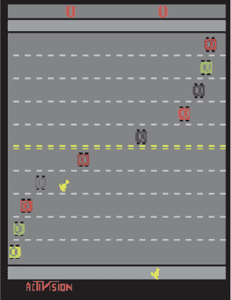

Freeway 是一款游戏，你可以通过 UP、DOWN 或 NO-OP（“无操作”或什么都不做）等动作来控制小鸡。目标是移动小鸡穿过高速公路，避免迎面而来的交通，到达另一边，在那里你会得到+1 的奖励。如果你在有限的时间内没有把所有三只小鸡都带到路上，你就输了游戏，并得到一个负奖励。

在本书的大多数情况下，我们使用游戏的原始像素表示来训练我们的 DRL 智能体，因此在我们的神经网络中使用卷积层。然而，在这种情况下，我们通过引入分布式 DQN 来引入新的复杂性，因此我们将避免使用卷积层，以保持对当前主题的关注并保持训练效率。

每个游戏的 RAM 版本实际上是游戏的一种压缩表示形式，形式为一个 128 个元素的向量（每个游戏角色的位置和速度等）。128 个元素的向量足够小，可以通过几个全连接（密集）层进行处理。一旦你熟悉了我们在这里使用的简单实现，你就可以使用游戏的像素版本，并将 Dist-DQN 升级以使用卷积层。

#### 7.4.1\. 在 Python 中表示概率分布

如果你没有阅读可选的第 7.3 节，你错过的重要信息是，我们不是使用神经网络来表示 Q 函数，即*Q**[π]*(*s*,*a*)，它返回一个单一的 Q 值，而是可以表示一个值分布，*Z**[π]*(*s*,*a*)，它表示给定一个状态-动作对的 Q 值随机变量。这种概率形式包含了我们在前几章中使用过的确定性算法，因为确定性结果总可以通过一个*退化的*概率分布来表示(图 7.8)，其中所有概率都分配给单个结果。

##### 图 7.8\. 这是一个退化的分布，因为除了一个值外，所有可能的值都被分配了 0 概率。未被分配 0 概率的输出值被称为概率分布的支持。退化的分布有一个只有一个元素的支持（在这种情况下，值 0）。

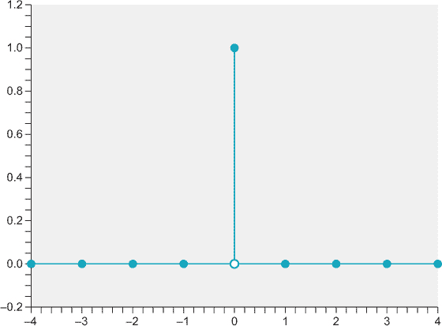

让我们先从如何表示和操作值分布开始。正如我们在概率理论章节中所做的那样，我们将使用两个 numpy 数组来表示奖励上的离散概率分布。一个 numpy 数组将表示可能的结果（即分布的支持），另一个将是一个大小相等的数组，存储每个相关结果的概率。回想一下，如果我们取支持数组和概率数组的内积，我们得到分布的期望奖励。

我们表示值分布的方式存在一个问题，即*Z*(*s*,*a*)，因为我们的数组大小是有限的，所以我们只能表示有限数量的结果。在某些情况下，奖励通常被限制在某个固定的有限范围内，但在股市等例子中，你可以赚或亏的钱在理论上是没有限制的。使用我们的方法，我们必须选择一个可以表示的最小值和最大值。这个问题在 Dabney 等人后续的论文中得到了解决，“基于分位数回归的分布强化学习”（2017 年）。我们将在本章末尾简要讨论他们的方法。

对于 Freeway，我们将支持范围限制在-10 到+10 之间。所有非终端时间步（即不导致赢或输的状态）都会给予-1 的奖励，以惩罚花费太多时间穿越道路。如果小鸡成功穿越道路，则奖励+10；如果游戏失败（如果小鸡在计时器耗尽之前没有穿越道路），则奖励-10。当小鸡被车撞到时，游戏不一定失败；小鸡只是被推离目标。

我们的 Dist-DQN 将接受一个状态，这是一个 128 个元素的向量，并将返回 3 个大小相同但独立的张量，表示在给定输入状态的情况下，每个 3 个可能动作（UP，DOWN，NO-OP）的支持概率分布。我们将使用 51 个元素的支持，因此支持和概率张量将是 51 个元素。

如果我们的智能体以随机初始化的 Dist-DQN 开始游戏，执行向上（UP）动作，并获得奖励-1，我们如何更新我们的 Dist-DQN？目标分布是什么，我们如何计算两个分布之间的损失函数？嗯，我们使用 Dist-DQN 返回的后续状态*s[t]*[+1]的分布作为先验分布，并使用观察到的单个奖励*r[t]*更新先验分布，使得分布的一部分在观察到的*r[t]*周围重新分配。

如果我们从一个均匀分布开始，并观察到*r[t]* = –1，后验分布不再应该是均匀的，但它仍然应该非常接近（图 7.9）。只有当我们反复观察到*r[t]* = –1 对于相同的状态时，分布才开始在-1 周围强烈峰值。在正常的 Q 学习中，折现率γ（伽马）控制了预期未来奖励对当前状态价值的影响程度。在分布 Q 学习中，γ参数控制了我们更新先验分布以接近观察到的奖励的程度，从而实现了类似的功能（图 7.10）。

##### 图 7.9。我们创建了一个函数，该函数接受一个离散分布并根据观察到的奖励更新它。这个函数通过将先验分布更新为后验分布来执行一种近似贝叶斯推理。从一个均匀分布（顶部）开始，我们观察到一些奖励，我们得到一个峰值分布在 0（中间所示），然后我们观察到更多的奖励（所有都是零），分布变成一个狭窄的、类似正态的分布（如底部所示）。

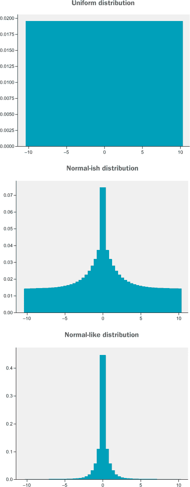

##### 图 7.10。此图展示了当 gamma（折扣因子）的值较低或较高时，均匀分布如何变化。

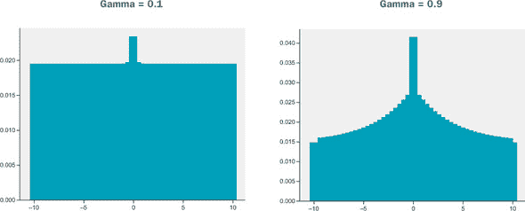

如果我们大量折现未来，后验分布将强烈地集中在最近观察到的奖励周围。如果我们弱化折现未来，观察到的奖励只会轻微地更新先验分布，*Z*(*S[t]*[+1],*A[t]*[+1])。由于 Freeway 在开始时具有稀疏的正奖励（因为我们需要采取许多行动才能观察到我们的第一次胜利），我们将设置 gamma，以便我们只对先验分布进行小更新。

在列表 7.1 中，我们设置了一个初始的均匀离散概率分布，并展示了如何绘制它。

##### 列表 7.1。在 numpy 中设置离散概率分布

```
import torch
import numpy as np
from matplotlib import pyplot as plt

vmin,vmax = -10.,10\.                     *1*
nsup=51                                  *2*
support = np.linspace(vmin,vmax,nsup)    *3*
probs = np.ones(nsup)
probs /= probs.sum()
z3 = torch.from_numpy(probs).float()
plt.bar(support,probs)                   *4*
```

+   ***1*** 设置分布支持的最小值和最大值

+   ***2*** 设置支持元素的数量

+   ***3*** 创建支持张量，一个从–10 到+10 的等间距值的张量

+   ***4*** 将分布绘制为条形图

我们已经定义了一个均匀概率分布；现在让我们看看我们如何更新分布。我们想要一个函数，`update_dist(z, reward)`，它接受一个先验分布和一个观察到的奖励，并返回一个后验分布。我们将分布的支持表示为一个从–10 到 10 的向量：

```
>>> support
array([-10\. ,  -9.6,  -9.2,  -8.8,  -8.4,  -8\. ,  -7.6,  -7.2,  -6.8,
        -6.4,  -6\. ,  -5.6,  -5.2,  -4.8,  -4.4,  -4\. ,  -3.6,  -3.2,
        -2.8,  -2.4,  -2\. ,  -1.6,  -1.2,  -0.8,  -0.4,   0\. ,   0.4,
         0.8,   1.2,   1.6,   2\. ,   2.4,   2.8,   3.2,   3.6,   4\. ,
         4.4,   4.8,   5.2,   5.6,   6\. ,   6.4,   6.8,   7.2,   7.6,
         8\. ,   8.4,   8.8,   9.2,   9.6,  10\. ])
```

我们需要能够找到与观察到的奖励最接近的支持向量元素。例如，如果我们观察到*r[t]* = –1，我们希望将其映射到–1.2 或–0.8，因为那些是最接近的（同样接近）的支持向量元素。更重要的是，我们想要这些支持向量元素的索引，以便我们可以在概率向量中获取它们对应的概率。支持向量是静态的——我们从不更新它。我们只更新相应的概率。

你可以看到每个支持元素距离其最近邻居有 0.4 的距离。numpy 的`linspace`函数创建了一个等间距元素序列，间距由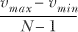给出，其中*N*是支持元素的数量。如果你将 10、-10 和*N* = 51 代入该公式，你会得到 0.4。我们称这个值为*dz*（delta Z），我们使用它通过方程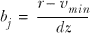来找到最接近的支持元素索引值，其中*b[j]*是索引值。由于*b[j]*可能是一个分数数，而索引需要是非负整数，我们只需将值四舍五入到最接近的整数，使用`np.round(...)`。我们还需要剪辑任何超出最小和最大支持范围的值。例如，如果观察到的*r[t]* = -2，那么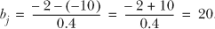。你可以看到索引为 20 的支持元素是-2，在这种情况下，它正好对应于观察到的奖励（不需要四舍五入）。然后我们可以使用索引找到-2 支持元素的对应概率。

一旦我们找到对应于观察奖励的支持元素的索引值，我们希望将一部分概率质量重新分配到该支持和附近的支撑元素。我们必须注意，最终的概率分布是一个真实分布，并且总和为 1。我们将简单地从左右邻居那里取一些概率质量，并将其添加到对应于观察奖励的元素。然后这些最近的邻居将从他们的最近邻居那里窃取一些概率质量，依此类推，如图图 7.11 所示。窃取的概率质量量将随着我们远离观察奖励而指数级减小。

##### 图 7.11。`update_dist`函数将概率从邻居重新分配到观察奖励值。

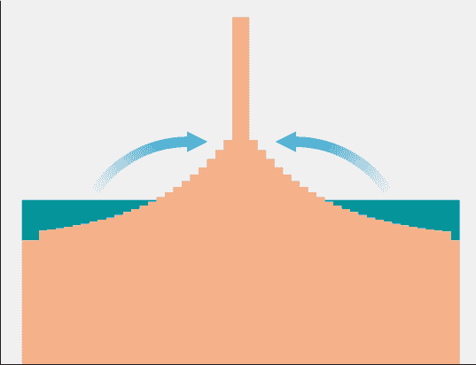

在列表 7.2 中，我们实现了这样一个函数，它接受一组支持集、相关的概率和一个观察值，并通过将概率质量重新分配到观察值来返回一个更新的概率分布。

##### 列表 7.2。更新概率分布

```
def update_dist(r,support,probs,lim=(-10.,10.),gamma=0.8):
    nsup = probs.shape[0]
    vmin,vmax = lim[0],lim[1]
    dz = (vmax-vmin)/(nsup-1.)            *1*
    bj = np.round((r-vmin)/dz)            *2*
    bj = int(np.clip(bj,0,nsup-1))        *3*
    m = probs.clone()
    j = 1
    for i in range(bj,1,-1):              *4*
        m[i] += np.power(gamma,j) * m[i-1]
        j += 1
    j = 1
    for i in range(bj,nsup-1,1):          *5*
        m[i] += np.power(gamma,j) * m[i+1]
        j += 1
    m /= m.sum()                          *6*
    return m
```

+   ***1*** 计算支持间距值

+   ***2*** 计算观察奖励在支持中的索引值

+   ***3*** 通过四舍五入值以确保它是一个有效的支持索引值

+   ***4*** 从紧邻的左侧开始，窃取其部分概率

+   ***5*** 从紧邻的右侧开始，窃取其部分概率

+   ***6*** 通过除以总和来确保总和为 1

让我们通过其工作原理来了解它是如何工作的。我们从一个均匀先验分布开始：

```
>>> probs
array([0.01960784, 0.01960784, 0.01960784, 0.01960784, 0.01960784,
       0.01960784, 0.01960784, 0.01960784, 0.01960784, 0.01960784,
       0.01960784, 0.01960784, 0.01960784, 0.01960784, 0.01960784,
       0.01960784, 0.01960784, 0.01960784, 0.01960784, 0.01960784,
       0.01960784, 0.01960784, 0.01960784, 0.01960784, 0.01960784,
       0.01960784, 0.01960784, 0.01960784, 0.01960784, 0.01960784,
       0.01960784, 0.01960784, 0.01960784, 0.01960784, 0.01960784,
       0.01960784, 0.01960784, 0.01960784, 0.01960784, 0.01960784,
       0.01960784, 0.01960784, 0.01960784, 0.01960784, 0.01960784,
       0.01960784, 0.01960784, 0.01960784, 0.01960784, 0.01960784,
       0.01960784])
```

你可以看到每个支持的概率大约是 0.02。我们观察到 *r[t]* = -1，并计算出 *b[j]* ≈ 22。然后我们找到最近的左右邻居，分别表示为索引 21 和 23。我们将 *m[l]* 乘以 γ*^j*，其中 *j* 是我们从 1 开始递增的值，所以我们得到一系列指数递减的 γ：γ¹,γ², . . . γ*^j*。记住，γ 必须是一个介于 0 和 1 之间的值，所以如果 γ = 0.5，则 γ 的序列将是 0.5, 0.25, 0.125, 0.0625。因此，最初我们从左右邻居那里取出 0.5 * 0.02 = 0.01 并将其添加到现有的概率 *b[j]* = 22，该概率也是 0.02。所以 *b[j]* = 22 的概率将变为 0.01 + 0.01 + 0.02 = 0.04。

现在，左邻居 *m[l]* 从其自己的索引 20 的左侧邻居那里窃取概率质量，但由于我们乘以 γ²，所以窃取的量较少。右邻居 *m[r]* 通过从其右侧邻居那里窃取来做同样的事情。每个元素依次从其左侧或右侧邻居那里窃取，直到我们到达数组的末尾。如果 γ 接近 1，例如 0.99，则大量概率质量将被重新分配到接近 *r[t]* 的支持区域。

让我们测试我们的分布更新函数。我们将从一个均匀分布开始，给它一个观察到的奖励 -1。

##### 列表 7.3\. 单次观察后重新分配概率质量

```
ob_reward = -1
Z = torch.from_numpy(probs).float()
Z = update_dist(ob_reward,torch.from_numpy(support).float(), \
Z,lim=(vmin,vmax),gamma=0.1)
plt.bar(support,Z)
```

你可以在图 7.12 中看到，分布仍然相当均匀，但现在有一个以 -1 为中心的明显“隆起”。我们可以通过折现因子 γ 来控制这个隆起的大小。自己尝试改变 γ，看看它是如何改变更新的。

##### 图 7.12\. 这是观察单个奖励后更新初始均匀概率分布的结果。一些概率质量被重新分配到对应于观察到的奖励的支持元素。

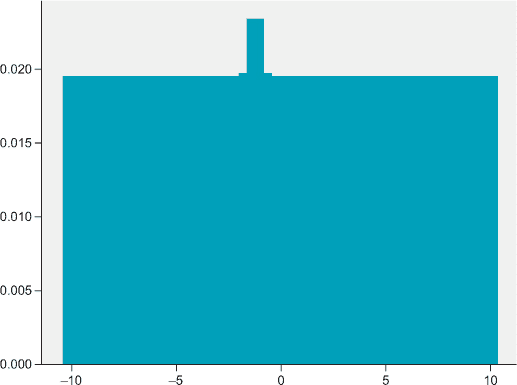

现在让我们看看当我们观察一个变化奖励的序列时，分布是如何变化的。（我们刚刚编造了这个奖励序列；它们并不来自高速公路游戏。）我们应该能够观察到多模态性。

##### 列表 7.4\. 使用观察序列重新分配概率质量

```
ob_rewards = [10,10,10,0,1,0,-10,-10,10,10]
for i in range(len(ob_rewards)):
    Z = update_dist(ob_rewards[i], torch.from_numpy(support).float(), Z, \
                    lim=(vmin,vmax), gamma=0.5)
plt.bar(support, Z)
```

你可以在图 7.13 中看到，现在有四个不同高度的峰值，对应于观察到的四种不同类型的奖励，即 10, 0, 1 和 -10。最高的峰值（分布的众数）对应于 10，因为这是观察到的最频繁的奖励。

##### 图 7.13\. 这是观察一系列不同奖励后更新初始均匀概率分布的结果。分布中的每个“峰值”对应于一个观察到的奖励。

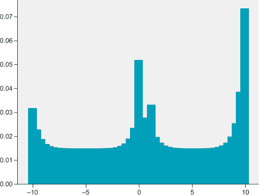

现在让我们看看如果我们多次观察相同的奖励，从均匀先验开始，方差会如何降低。

##### 列表 7.5\. 相同奖励序列下的方差降低

```
ob_rewards = [5, 5, 5, 5, 5, 5, 5, 5, 5, 5, 5, 5, 5, 5, 5, 5, 5, 5, 5, 5]
for i in range(len(ob_rewards)):
    Z = update_dist(ob_rewards[i], torch.from_numpy(support).float(), \
                          Z, lim=(vmin,vmax), gamma=0.7)
plt.bar(support, Z)
```

你可以在图 7.14 中看到，均匀分布转换成一个以 5 为中心、方差较低的类似正态分布。我们将使用这个函数来生成我们希望 Dist-DQN 学习逼近的目标分布。现在让我们构建 Dist-DQN。

##### 图 7.14\. 观察相同奖励多次后更新初始均匀概率分布的结果。均匀分布收敛到一个类似正态的分布。

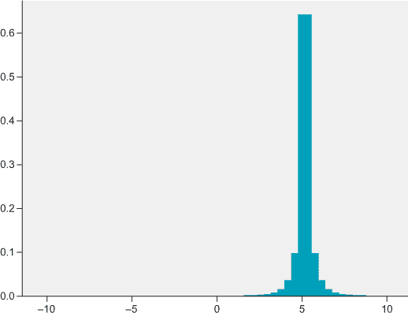

#### 7.4.2\. 实现 Dist-DQN

正如我们之前简要讨论的，Dist-DQN 将接受一个 128 个元素的向量状态，通过几个密集的前馈层传递，然后它将使用一个`for`循环将最后一层乘以 3 个不同的矩阵，以获得 3 个独立的分布向量。最后，我们将应用 softmax 函数以确保它是一个有效的概率分布。结果是具有 3 个不同输出“头部”的神经网络。我们将这 3 个输出分布收集到一个 3 × 51 的矩阵中，并将其作为 Dist-DQN 的最终输出。因此，我们可以通过索引输出矩阵的特定行来获取特定动作的个别动作值分布。图 7.15 显示了整体架构和张量转换。在列表 7.6 中，我们定义了实现 Dist-DQN 的函数。

##### 图 7.15\. Dist-DQN 接受一个 128 个元素的向量状态，并产生 3 个独立的 51 个元素的概率分布向量，然后这些向量被堆叠成一个 3 × 51 的矩阵。

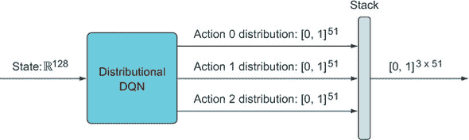

##### 列表 7.6\. Dist-DQN

```
def dist_dqn(x,theta,aspace=3):                    *1*
    dim0,dim1,dim2,dim3 = 128,100,25,51            *2*
    t1 = dim0*dim1
    t2 = dim2*dim1
    theta1 = theta[0:t1].reshape(dim0,dim1)        *3*
    theta2 = theta[t1:t1 + t2].reshape(dim1,dim2)
    l1 = x @ theta1                                *4*
    l1 = torch.selu(l1)
    l2 = l1 @ theta2                               *5*
    l2 = torch.selu(l2)
    l3 = []
    for i in range(aspace):                        *6*
        step = dim2*dim3
        theta5_dim = t1 + t2 + i * step
        theta5 = theta[theta5_dim:theta5_dim+step].reshape(dim2,dim3)
        l3_ = l2 @ theta5                          *7*
        l3.append(l3_)
    l3 = torch.stack(l3,dim=1)                     *8*
    l3 = torch.nn.functional.softmax(l3,dim=2)
    return l3.squeeze()
```

+   ***1*** x 是 128 个元素的向量状态，theta 是参数向量，aspace 是动作空间的大小。

+   ***2*** 定义层维度，以便我们可以将 theta 解包成适当大小的矩阵

+   ***3*** 将 theta 的第一个部分解包到第一个层矩阵中

+   ***4*** 这个计算的维度是 B × 128 × 128 × 100 = B × 100，其中 B 是批量大小。

+   ***5*** 这个计算的维度是 B × 100 × 100 × 25 = B × 25。

+   ***6*** 遍历每个动作以生成每个动作值分布

+   ***7*** 这个计算的维度是 B × 25 × 25 × 51 = B × 51。

+   ***8*** 最后层的维度是 B × 3 × 51。

在本章中，我们将手动进行梯度下降，为了使这个过程更容易，我们让 Dist-DQN 接受一个名为`theta`的单个参数向量，我们将将其解包并重塑成多个适当大小的单独层矩阵。这样做更容易，因为我们只需对单个向量而不是多个单独实体进行梯度下降。我们还将使用一个单独的目标网络，就像我们在第三章中做的那样，所以我们只需要保留`theta`的一个副本，并将其传递给相同的`dist_dqn`函数。

这里的另一个新特性是多个输出头。我们习惯于神经网络返回一个单一的输出向量，但在这个案例中，我们希望它返回一个矩阵。为了做到这一点，我们设置了一个循环，将 `l2` 乘以三个单独的层矩阵中的每一个，从而得到三个不同的输出向量，我们将它们堆叠成一个矩阵。除此之外，它是一个非常简单的神经网络，总共有五个密集层。

现在我们需要一个函数，它将接收我们 Dist-DQN 的输出、一个奖励和一个行动，并生成我们希望我们的神经网络接近的目标分布。这个函数将使用我们之前使用的 `update_dist` 函数，但它只想更新与实际采取的行动相关的分布。此外，正如你在第三章中学到的，当我们达到终端状态时，我们还需要一个不同的目标。在终端状态，期望奖励是观察到的奖励，因为根据定义没有未来的奖励。这意味着贝尔曼更新简化为 *Z*(*s[t]*,*a[t]*) ← *R*(*S[t]*,*A[t]*)。由于我们只观察到单个奖励，并且没有先验分布需要更新，目标就变成了所谓的 *退化分布*。这只是一个术语，指的是所有概率质量都集中在单个值上的分布。

##### 列表 7.7. 计算目标分布

```
def get_target_dist(dist_batch,action_batch,reward_batch,support,lim=(- \
        10,10),gamma=0.8):
    nsup = support.shape[0]
    vmin,vmax = lim[0],lim[1]
    dz = (vmax-vmin)/(nsup-1.)
    target_dist_batch = dist_batch.clone()
    for i in range(dist_batch.shape[0]):                                 *1*
        dist_full = dist_batch[i]
        action = int(action_batch[i].item())
        dist = dist_full[action]
        r = reward_batch[i]
        if r != -1:                                                      *2*
            target_dist = torch.zeros(nsup)
            bj = np.round((r-vmin)/dz)
            bj = int(np.clip(bj,0,nsup-1))
            target_dist[bj] = 1.
        else:                                                            *3*
            target_dist = update_dist(r,support,dist,lim=lim,gamma=gamma)
        target_dist_batch[i,action,:] = target_dist                      *4*

    return target_dist_batch
```

+   ***1*** 遍历批次维度

+   ***2*** 如果奖励不是 –1，则表示终端状态，目标是一个在奖励值上的退化分布。

+   ***3*** 如果状态是非终端的，目标分布是先验的贝叶斯更新，基于奖励。

+   ***4*** 只更改采取的行动的分布

`get_target_dist` 函数接收一个形状为 *B* × 3 × 51 的数据批次，其中 *B* 是批次维度，并返回一个大小相等的张量。例如，如果我们批次中只有一个示例，即 1 × 3 × 51，并且智能体采取了行动 1 并观察到奖励为 –1，那么这个函数将返回一个 1 × 3 × 51 的张量，除了与索引 1（维度 1）相关联的 1 × 51 分布将根据 `update_dist` 函数使用观察到的奖励 –1 进行更改。如果观察到的奖励是 10，那么与行动 1 相关的 1 × 51 分布将被更新为一个退化的分布，其中除了与奖励 10（索引 50）相关联的元素外，所有元素的概率均为 0。

### 7.5. 比较概率分布

现在我们已经有了 Dist-DQN 和生成目标分布的方法，我们需要一个损失函数来计算预测的动作值分布与目标分布之间的差异；然后我们可以像往常一样进行反向传播和梯度下降，以更新 Dist-DQN 参数，使其在下一次更加准确。当我们试图最小化两个标量或向量批次之间的距离时，我们通常使用均方误差（MSE）损失函数，但这不是两个概率分布之间的适当损失函数。但是，在概率分布之间有许多可能的损失函数选择。我们想要一个函数来衡量两个概率分布之间的差异或距离，并最小化那个距离。

在机器学习中，我们通常试图训练一个参数模型（例如，神经网络）来预测或产生与某些数据集的经验数据密切匹配的数据。从概率的角度思考，我们可以将神经网络视为生成合成数据并尝试训练神经网络产生越来越真实的数据——类似于某些经验数据集的数据。这就是我们训练*生成*模型（生成数据的模型）的方式；我们更新它们的参数，使得它们生成的数据看起来非常接近某些训练（经验）数据集。

例如，假设我们想要构建一个生成模型，该模型可以生成名人脸部的图像（图 7.16）。为了做到这一点，我们需要一些训练数据，因此我们使用了包含数十万张各种名人（如威尔·史密斯和布兰妮·斯皮尔斯）高质量照片的免费 CelebA 数据集。让我们称我们的生成模型为*P*，这个经验数据集为*Q*。

##### 图 7.16\. 生成模型可以是一个概率模型，通过最大化生成与某些经验数据集相似的样本的概率来进行训练。训练发生在迭代循环中，其中经验数据被提供给生成模型，该模型试图最大化经验数据的概率。在训练之前，生成模型将给从训练数据集中取出的示例分配低概率，目标是为生成模型分配高概率给从数据集中抽取的示例。经过足够多的迭代后，生成模型将给经验数据分配高概率，然后我们可以从这个分布中采样以生成新的、合成的数据。

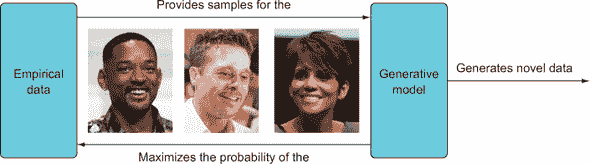

数据集 *Q* 中的图像是从现实世界中抽取的，但它们只是无限多张照片中的一部分，这些照片已经存在但不在数据集中，或者可能被拍摄但未被拍摄。例如，数据集中可能只有一张威尔·史密斯的头像照片，但另一张从不同角度拍摄的威尔·史密斯的照片也可能同样容易成为数据集的一部分。一张威尔·史密斯头顶上有一只小象的照片，虽然不是不可能，但不太可能包含在数据集中，因为它不太可能存在（谁会在头上放一只小象呢？）。

明星的照片自然有更多或更少的可能性，所以现实世界对名人照片有一个概率分布。我们可以用 *Q*(*x*) 表示这个真实概率分布，其中 *x* 是某个任意图像，*Q*(*x*) 告诉我们该图像在世界上存在的概率。如果 *x* 是数据集 *Q* 中的一个特定图像，那么 *Q*(*x*) = 1.0，因为该图像肯定存在于现实世界中。然而，如果我们插入一个不在数据集中但可能存在于现实世界中的图像，那么 *Q*(*x*) 可能等于 0.9。

当我们随机初始化我们的生成模型 *P* 时，它将输出看起来像白色噪声的随机图像。我们可以将我们的生成模型视为一个随机变量，每个随机变量都有一个相关的概率分布，我们用 *P*(*x*) 表示，因此我们也可以询问我们的生成模型在当前参数集下特定图像的概率。当我们第一次初始化它时，它会认为所有图像的可能性大致相同，并且都会被分配一个相当低的概率。所以如果我们询问 *P*(“威尔·史密斯照片”)，它将返回一个非常小的概率，但如果我们询问 *Q*(“威尔·史密斯照片”)，我们将得到 1.0。

为了训练我们的生成模型 *P*，使其能够使用数据集 *Q* 生成逼真的名人照片，我们需要确保生成模型对 *Q* 中的数据以及不在 *Q* 中但可能存在的数据进行高概率分配。从数学上讲，我们希望最大化这个比率：

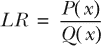

我们称这为 *P*(*x*) 和 *Q*(*x*) 之间的 *似然比* (LR)。在这个上下文中，“似然”只是“概率”的另一个说法。

以威尔·史密斯存在于 *Q* 中的一个示例图像为例，如果我们使用未经训练的 *P* 来计算其比率，我们可能会得到

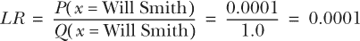

这是一个很小的比率。我们希望将反向传播输入到我们的生成模型中，并进行梯度下降来更新其参数，以使这个比率最大化。这个似然比是我们想要最大化的目标函数（或者最小化其负值）。

但我们不想只为单一图像做这件事；我们希望生成模型最大化数据集 *Q* 中所有图像的总概率。我们可以通过取所有单个示例的乘积来找到这个总概率（因为当 *A* 和 *B* 独立且来自同一分布时，*A and B* 的概率是 *A* 的概率乘以 *B* 的概率）。因此，我们的新目标函数是数据集中每个数据点的似然比的乘积。我们将出现几个数学方程，但我们只是用它们来解释潜在的概率概念；不要花时间试图记住它们。

##### 表 7.4. 数学与 Python 中的似然比

| 数学 | Python |
| --- | --- |
| 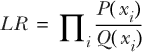 |

```
p = np.array([0.1,0.1])
q = np.array([0.6,0.5])
def lr(p,q):
     return np.prod(p/q)
```

|

这个目标函数的一个问题是，计算机很难乘以许多概率，因为它们是微小的浮点数，当它们相乘时会产生更小的浮点数。这导致数值不准确，并最终导致数值下溢，因为计算机可以表示的数字范围是有限的。为了改善这种情况，我们通常使用对数概率（等价于对数似然），因为对数函数将微小的概率转换为从负无穷大到最大 0（当概率为 1）的较大数字。

对数还有一个很好的性质，即 log(*a* × *b*) = log(*a*) + log(*b*)，因此我们可以将乘法转换为加法，而计算机可以更好地处理这一点，而不会冒着数值不稳定性或溢出的风险。我们可以将先前的乘积对数似然比方程转换为这个：

##### 表 7.5. 数学与 Python 中的对数似然比

| 数学 | Python |
| --- | --- |
| 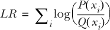 |

```
p = np.array([0.1,0.1])
q = np.array([0.6,0.5])
def lr(p,q):
     return np.sum(np.log(p/q))
```

|

这个方程的对数概率版本更简单，更适合计算，但另一个问题是，我们希望对不同的样本进行不同的加权。例如，如果我们从数据集中采样威尔·史密斯的图像，它应该比一些不太出名的名人的图像有更高的概率，因为不太出名的名人可能被拍摄的照片更少。我们希望我们的模型更加重视学习在现实世界中更可能出现的图像，换句话说，与经验分布 *Q*(*x*) 相比。我们将根据 *Q*(*x*) 的概率对每个对数似然比进行加权。

##### 表 7.6. 数学与 Python 中的加权对数似然比

| 数学 | Python |
| --- | --- |
| 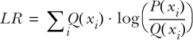 |

```
p = np.array([0.1,0.1])
q = np.array([0.6,0.5])
def lr(p,q):
     x = q * np.log(p/q)
     x = np.sum(x)
     return x
```

|

我们现在有一个目标函数，它衡量从生成模型中采样的样本相对于现实世界数据分布的可能性，并按样本在现实世界中的可能性进行加权。

最后还有一个小问题。这个目标函数必须最大化，因为我们希望对数似然比很高，但为了方便和惯例，我们更喜欢将目标函数作为误差或损失函数来最小化。我们可以通过添加负号来解决这个问题，这样高的似然比就变成了小的误差或损失。

##### 表 7.7\. Kullback-Leibler 散度

| 数学 | Python |
| --- | --- |
| 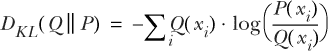 |

```
p = np.array([0.1,0.1])
q = np.array([0.6,0.5])
def lr(p,q):
     x = q * np.log(p/q)
     x = -1 * np.sum(x)
     return x
```

|

你可能注意到我们用一些奇怪的符号替换了 *LR*：*D[KL]*(*Q* ‖*P*)。实际上，我们刚才创建的目标函数在所有机器学习中都非常重要；它被称为 *Kullback-Leibler 散度*（简称 KL 散度）。KL 散度是概率分布之间的一种误差函数；它告诉你两个概率分布有多不同。

通常我们试图最小化模型生成的概率分布与真实数据中的某些经验分布之间的距离，因此我们希望最小化 KL 散度。正如你刚才看到的，最小化 KL 散度等价于最大化生成数据与经验数据联合对数似然比。需要注意的是，KL 散度不是对称的，即 *D[KL]*(*Q* ‖*P*) ≠ *D[KL]*(*P* ‖*Q*)，这应该从其数学定义中清楚看出。KL 散度包含一个比率，没有任何比率可以等于其倒数，除非两者都是 1，即  除非 *a* = *b*。

虽然 KL 散度可以构成一个完美的目标函数，但为了我们的目的，我们可以稍微简化一下。回想一下，在一般情况下，log(*a*/*b*) = log(*a*) – log(*b*)。因此，我们可以将 KL 散度重写为

| *D[KL]*(*Q* ‖*P*) = *–*Σ*[i]**Q*(*x*) × log(*P*(*x[i]*)) – log(*Q*(*x[i]*)) |
| --- |

注意，在机器学习中，我们只想优化模型（更新模型的参数以减少误差）；我们不能改变经验分布 *Q*(*x*)。因此，我们真正关心的是左侧的加权对数概率：

| *H*(*Q*,*P*) = *–*Σ*[i]**Q*(*x*) × log(*P*(*x[i]*)) |
| --- |

这种简化的版本被称为交叉熵损失，表示为 *H*(*Q*,*P*)。这是我们将在本章中使用以获取预测动作值分布与目标（经验）分布之间误差的实际损失函数。

在 列表 7.8 中，我们将交叉熵损失实现为一个函数，该函数接受一批动作值分布并计算该分布与目标分布之间的损失。

##### 列表 7.8\. 交叉熵损失函数

```
def lossfn(x,y):                     *1*
    loss = torch.Tensor([0.])
    loss.requires_grad=True
    for i in range(x.shape[0]):      *2*
        loss_ = -1 *  torch.log(x[i].flatten(start_dim=0)) @
    y[i].flatten(start_dim=0)        *3*
        loss = loss + loss_
    return loss
```

+   ***1*** 预测分布 x 和目标分布 y 之间的损失

+   ***2*** 在批量维度上循环

+   ***3*** 沿动作维度展开以获得分布的连接序列

`lossfn`函数接受一个维度为*B* × 3 × 51 的预测分布`x`和一个维度相同的目标分布`y`，然后它将分布展平到动作维度以获得一个*B* × 153 的矩阵。然后它遍历矩阵中的每个 1 × 153 行，并计算 1 × 153 预测分布和 1 × 153 目标分布之间的交叉熵。我们不需要显式地对`x`和`y`的乘积求和，我们可以通过使用内积运算符`@`将这两个操作结合起来，并在一次操作中获取结果。

我们可以选择仅计算所采取动作的具体动作值分布之间的损失，但我们计算了所有三个动作值分布的损失，这样 Dist-DQN 就能学会保持未采取的两个动作不变；它只更新所采取的动作值分布。

### 7.6\. 在模拟数据上使用 Dist-DQN

让我们使用模拟的目标分布来测试到目前为止的所有部分，看看我们的 Dist-DQN 是否能够成功学会匹配目标分布。在列表 7.9 中，我们取一个初始均匀分布，通过我们的 Dist-DQN 运行它，并使用两个奖励观察的合成向量来更新它。

##### 列表 7.9\. 使用模拟数据测试

```
aspace = 3                                                              *1*
tot_params = 128*100 + 25*100 + aspace*25*51                            *2*
theta = torch.randn(tot_params)/10\.                                     *3*
theta.requires_grad=True
theta_2 = theta.detach().clone()                                        *4*

vmin,vmax= -10,10
gamma=0.9
lr = 0.00001
update_rate = 75                                                        *5*
support = torch.linspace(-10,10,51)
state = torch.randn(2,128)/10\.                                          *6*
action_batch = torch.Tensor([0,2])                                      *7*
reward_batch = torch.Tensor([0,10])                                     *8*
losses = [] 
pred_batch = dist_dqn(state,theta,aspace=aspace)                        *9*
target_dist = get_target_dist(pred_batch,action_batch,reward_batch, \
                                 support, lim=(vmin,vmax),gamma=gamma)  *10*

plt.plot((target_dist.flatten(start_dim=1)[0].data.numpy()),color='red',label='target')
plt.plot((pred_batch.flatten(start_dim=1)[0].data.numpy()),color='green',label='pred')
plt.legend()
```

+   ***1*** 定义动作空间的大小为 3

+   ***2*** 根据层大小定义 Dist-DQN 的总参数数

+   ***3*** 随机初始化 Dist-DQN 的参数向量

+   ***4*** 复制 theta 以用作目标网络

+   ***5*** 每 75 步同步主网络和目标 Dist-DQN 参数

+   ***6*** 随机初始化两个测试状态

+   ***7*** 创建合成动作数据

+   ***8*** 创建合成奖励数据

+   ***9*** 初始化一个预测批次

+   ***10*** 初始化一个目标批次

上述代码的目的是测试 Dist-DQN 学习两个合成数据样本分布的能力。在我们的合成数据中，动作 0 与奖励 0 相关联，动作 2 与奖励 10 相关联。我们期望 Dist-DQN 学会状态 1 与动作 1 相关联，状态 2 与动作 2 相关联，并学习分布。您可以在图 7.17 中看到，使用随机初始化的参数向量，所有三个动作的预测分布（记住，我们在动作维度上进行了展平）几乎是一个均匀分布，而目标分布则在动作 0 内有一个峰值（因为我们只绘制了第一个样本）。经过训练后，预测分布和目标分布应该相当匹配。

##### 图 7.17。这显示了未训练的 Dist-DQN 生成的预测动作值分布和观察奖励后的目标分布。有三个独立的动作值分布，长度为 51 个元素，但在这里它们被连接成一个长向量，以说明预测和目标之间的整体拟合。前 51 个元素对应于 NO-OP 操作的动作值分布，接下来的 51 个元素对应于 UP 动作的动作值分布，最后的 51 个元素对应于 DOWN 分布。你可以看到预测对于所有三个动作都是完全平坦（均匀）的分布，而目标分布对于动作 0 有一个模态（一个峰值），对于其他两个动作有一些噪声峰值。目标是使预测与目标分布相匹配。


在 Dist-DQN 中，为什么目标网络如此重要是非常清晰的。记住，目标网络只是我们在一段时间滞后后更新的主模型的一个副本。我们使用目标网络的预测来创建学习目标，但我们只使用主模型参数来进行梯度下降。这稳定了训练过程，因为没有目标网络，目标分布会在每次参数更新后从梯度下降中改变。

然而，梯度下降试图将参数移动到更好地匹配目标分布的方向，因此存在一个循环（因此不稳定），这可能导致目标分布由于 Dist-DQN 的预测和目标分布之间的这种舞蹈而剧烈变化。通过使用 Dist-DQN 预测的滞后副本（通过参数的滞后副本，即目标网络），目标分布不会在每个迭代中改变，并且不会立即受到主 Dist-DQN 模型持续更新的影响。这显著稳定了训练。如果你将 `update_rate` 减少到 1 并尝试训练，你会看到目标演变成为完全错误的东西。现在让我们看看如何训练 Dist-DQN。

##### 列表 7.10。在合成数据上训练 Dist-DQN

```
for i in range(1000):
    reward_batch = torch.Tensor([0,8]) + torch.randn(2)/10.0               *1*
    pred_batch = dist_dqn(state,theta,aspace=aspace)                       *2*
    pred_batch2 = dist_dqn(state,theta_2,aspace=aspace)                    *3*
    target_dist = get_target_dist(pred_batch2,action_batch,reward_batch, \
                                 support, lim=(vmin,vmax),gamma=gamma)     *4*
    loss = lossfn(pred_batch,target_dist.detach())                         *5*
    losses.append(loss.item())
    loss.backward()
    # Gradient Descent
    with torch.no_grad():
        theta -= lr * theta.grad
    theta.requires_grad = True

    if i % update_rate == 0:                                               *6*
        theta_2 = theta.detach().clone()

fig,ax = plt.subplots(1,2)
ax[0].plot((target_dist.flatten(start_dim=1)[0].data.numpy()),color='red',label='target')
ax[0].plot((pred_batch.flatten(start_dim=1)[0].data.numpy()),color='green',label='pred')
ax[1].plot(losses)
```

+   ***1*** 向奖励中添加一些随机噪声以减轻过拟合

+   ***2*** 使用主模型 Dist-DQN 进行分布预测

+   ***3*** 使用目标网络 Dist-DQN 进行分布预测（使用滞后参数）

+   ***4*** 使用目标网络的分布来创建学习目标分布

+   ***5*** 在损失函数中使用主模型的分布预测

+   ***6*** 将目标网络参数与主模型参数同步

图 7.18 顶部的图形显示，经过训练后，Dist-DQN 的目标和预测现在几乎完全匹配（你可能甚至看不到两个重叠的分布 anymore）。它成功了！图 7.18 底部的损失图显示了每次目标网络同步到主模型和目标分布突然变化时的峰值，导致该时间步的损失高于正常水平。我们还可以查看批量中每个样本的每个动作的学习分布。以下列表显示了如何做到这一点。

##### 图 7.18\. 顶部：训练后所有三个动作的连接动作值分布。底部：训练时间上的损失图。基线损失正在下降，但我们看到持续增加的峰值。


##### 列表 7.11\. 可视化学习到的动作值分布

```
tpred = pred_batch
cs = ['gray','green','red']
num_batch = 2
labels = ['Action {}'.format(i,) for i in range(aspace)]
fig,ax = plt.subplots(nrows=num_batch,ncols=aspace)

for j in range(num_batch):                 *1*
    for i in range(tpred.shape[1]):        *2*
        ax[j,i].bar(support.data.numpy(),tpred[j,i,:].data.numpy(),\
                label='Action {}'.format(i),alpha=0.9,color=cs[i])
```

+   ***1*** 通过批量遍历经验

+   ***2*** 遍历每个动作

在图 7.19 中，你可以看到在第一个样本中，与动作 0 相关的左侧分布已经塌缩到 0 的退化解分布，就像模拟数据一样。然而，其他两个动作的分布仍然相当均匀，没有明显的峰值。同样，在批量中的第二个样本中，动作 2（向下）的分布是一个退化解分布，值为 10，因为数据也是退化的（一系列相同的样本），其他两个动作的分布仍然相当均匀。

##### 图 7.19\. 每一行包含单个状态的动作值分布，每行中的每一列分别是动作 0、1 和 2 的分布。


这个 Dist-DQN 测试几乎包含了我们在 Atari Freeway 真实实验中将要使用的一切。在我们开始玩 Freeway 之前，我们只需要两个函数。一个将预处理来自 OpenAI Gym 环境的返回状态。我们将得到一个包含 0 到 255 之间元素的 128 元素 numpy 数组，我们需要将其转换为 PyTorch 张量，并将值归一化到 0 到 1 之间，以调节梯度的规模。

我们还需要一个策略函数，它根据预测的动作值分布来决定采取哪些动作。有了动作值的完整概率分布的访问权限，我们可以利用更复杂的风险敏感策略。在本章中，我们将使用一个简单的策略，根据动作的期望值来选择动作，以将复杂性保持在最低。尽管我们正在学习完整的概率分布，但我们仍将根据期望值来选择动作，就像在普通的 Q-learning 中一样。

##### 列表 7.12\. 预处理状态和选择动作

```
def preproc_state(state):
    p_state = torch.from_numpy(state).unsqueeze(dim=0).float()
    p_state = torch.nn.functional.normalize(p_state,dim=1)                   *1*
    return p_state

def get_action(dist,support):
    actions = []
    for b in range(dist.shape[0]):                                           *2*
        expectations = [support @ dist[b,a,:] for a in range(dist.shape[1])] *3*
        action = int(np.argmax(expectations))                                *4*
        actions.append(action)
    actions = torch.Tensor(actions).int()
    return actions
```

+   ***1*** 将状态值归一化到 0 到 1 之间

+   ***2*** 遍历分布的批量维度

+   ***3*** 计算每个动作值分布的期望值

+   ***4*** 计算与最高期望值相关的动作

回想一下，我们可以通过简单地计算支持张量与概率张量的内积来计算离散分布的期望值（或期望）。我们对所有三个动作都这样做，并选择具有最高期望值的动作。一旦你熟悉了这里的代码，你可以尝试提出一个更复杂的策略，也许是一个考虑每个动作值分布方差的策略。

### 7.7\. 使用分布式 Q 学习来玩 Freeway

我们终于准备好使用 Dist-DQN 算法来玩 Atari 游戏 Freeway 了。除了我们已经描述的功能外，我们不需要其他任何主要功能。我们将有一个主要的 Dist-DQN 模型和一个副本——目标网络，用于稳定训练。我们将使用一个随着 epoch 减少的 epsilon 值进行 epsilon-greedy 策略：以概率 epsilon，动作选择将是随机的，否则动作将由`get_action`函数选择，该函数基于最高的期望值进行选择。我们还将使用与普通 DQN 相同的经验回放机制。

我们还将介绍一种非常基本的**优先回放**形式。在正常经验回放中，我们将智能体所经历的所有经验存储在一个固定大小的内存缓冲区中，新的经验会随机替换旧的经验；然后我们从这个内存缓冲区中随机抽取一批数据进行训练。然而，在像 Freeway 这样的游戏中，几乎所有的动作都会导致-1 的奖励，我们很少得到+10 或-10 的奖励，经验回放内存将主要由说同样事情的数据所主导。这对智能体来说并不很有信息量，真正重要的经验，比如赢得或输掉游戏，会被严重稀释，从而显著减缓学习速度。

为了解决这个问题，每当我们的动作导致游戏赢得或输掉的状态（即当我们得到-10 或+10 的奖励时），我们将这个经验的多个副本添加到回放缓冲区中，以防止它被所有-1 奖励经验稀释。因此，我们**优先**某些高度信息性的经验，而不是其他信息量较少的经验，因为我们真的希望我们的智能体学习哪些动作会导致成功或失败，而不仅仅是游戏的持续。

如果你在这个书的 GitHub 上访问本章的代码[`mng.bz/JzKp`](http://mng.bz/JzKp)，你会找到我们用来记录训练期间实时游戏画面的代码。我们还记录了动作值分布的实时变化，这样你可以看到游戏如何影响预测分布，反之亦然。我们在这里的书中不包括那段代码，因为它会占用太多空间。在列表 7.13 中，我们初始化了 Dist-DQN 算法所需的超参数和变量。

##### 列表 7.13\. Dist-DQN 玩 Freeway，初步

```
import gym
from collections import deque
env = gym.make('Freeway-ram-v0')
aspace = 3
env.env.get_action_meanings()

vmin,vmax = -10,10
replay_size = 200
batch_size = 50
nsup = 51
dz = (vmax - vmin) / (nsup-1)
support = torch.linspace(vmin,vmax,nsup)

replay = deque(maxlen=replay_size)             *1*
lr = 0.0001                                    *2*
gamma = 0.1                                    *3*
epochs = 1300
eps = 0.20                                     *4*
eps_min = 0.05                                 *5*
priority_level = 5                             *6*
update_freq = 25                               *7*

#Initialize DQN parameter vector
tot_params = 128*100 + 25*100 + aspace*25*51   *8*
theta = torch.randn(tot_params)/10\.            *9*
theta.requires_grad=True
theta_2 = theta.detach().clone()               *10*

losses = []
cum_rewards = []                               *11*
renders = []
state = preproc_state(env.reset())
```

+   ***1*** 使用 deque 数据结构的经验回放缓冲区

+   ***2*** 学习率

+   ***3*** 折扣因子

+   ***4*** epsilon-greedy 策略的起始 epsilon

+   ***5*** 结束/最小 epsilon

+   ***6*** 优先回放；在回放中重复这么多次数高度信息丰富的经验

+   ***7*** 每 25 步更新一次目标网络

+   ***8*** Dist-DQN 的总参数数量

+   ***9*** 随机初始化 Dist-DQN 的参数

+   ***10*** 初始化目标网络的参数

+   ***11*** 将每次胜利（成功的公路穿越）作为列表中的 1 存储

在进入主训练循环之前，这些都是我们需要的所有设置和起始对象。所有这些都大致与我们为模拟测试所做的相同，只是我们有一个优先回放设置，该设置控制我们应该添加多少个高度信息丰富的经验（如胜利）的副本到回放中。我们还使用 epsilon-greedy 策略，我们将从初始的高 epsilon 值开始，在训练过程中将其降低到最小值，以保持最小的探索量。

##### 列表 7.14。主训练循环

```
from random import shuffle
for i in range(epochs):
    pred = dist_dqn(state,theta,aspace=aspace)
    if i < replay_size or np.random.rand(1) < eps:         *1*
        action = np.random.randint(aspace)
    else:
        action = get_action(pred.unsqueeze(dim=0).detach(),support).item()
    state2, reward, done, info = env.step(action)          *2*
    state2 = preproc_state(state2)
    if reward == 1: cum_rewards.append(1) 
    reward = 10 if reward == 1 else reward                 *3*
    reward = -10 if done else reward                       *4*
    reward = -1 if reward == 0 else reward                 *5*
    exp = (state,action,reward,state2)                     *6*
    replay.append(exp)                                     *7*

    if reward == 10:                                       *8*
        for e in range(priority_level):
            replay.append(exp)

    shuffle(replay)
    state = state2

    if len(replay) == replay_size:                         *9*
        indx = np.random.randint(low=0,high=len(replay),size=batch_size)
        exps = [replay[j] for j in indx]
        state_batch = torch.stack([ex[0] for ex in exps],dim=1).squeeze()
        action_batch = torch.Tensor([ex[1] for ex in exps])
        reward_batch = torch.Tensor([ex[2] for ex in exps])
        state2_batch = torch.stack([ex[3] for ex in exps],dim=1).squeeze()
        pred_batch = dist_dqn(state_batch.detach(),theta,aspace=aspace)
        pred2_batch = dist_dqn(state2_batch.detach(),theta_2,aspace=aspace)
        target_dist = get_target_dist(pred2_batch,action_batch,reward_batch, \
                                     support, lim=(vmin,vmax),gamma=gamma)
        loss = lossfn(pred_batch,target_dist.detach())
        losses.append(loss.item())
        loss.backward()
        with torch.no_grad():                              *10*
            theta -= lr * theta.grad
        theta.requires_grad = True

    if i % update_freq == 0:                              *11*
        theta_2 = theta.detach().clone()

    if i > 100 and eps > eps_min:                         *12*
        dec = 1./np.log2(i)
        dec /= 1e3
        eps -= dec

    if done:                                              *13*
        state = preproc_state(env.reset())
        done = False
```

+   ***1*** epsilon-greedy 动作选择

+   ***2*** 在环境中采取选定的动作

+   ***3*** 如果环境产生了 1 的奖励（成功的公路穿越），则将奖励更改为+10

+   ***4*** 如果游戏结束（长时间后没有穿越），则将奖励更改为-10

+   ***5*** 如果原始奖励是 0（游戏仍在继续），则将奖励更改为-1，以惩罚无所作为

+   ***6*** 将经验作为起始状态、观察到的奖励、采取的动作和后续状态的元组准备

+   ***7*** 将经验添加到回放内存中

+   ***8*** 如果奖励是 10，这表示成功穿越，我们希望放大这种体验。

+   ***9*** 一旦回放缓冲区已满，开始训练

+   ***10*** 梯度下降

+   ***11*** 将目标网络参数同步到主模型参数

+   ***12*** 将 epsilon 作为 epoch 数量的函数递减

+   ***13*** 如果游戏结束，则重置环境

几乎所有这些都是我们之前几章中使用的普通 DQN 的相同类型的代码。唯一的区别是我们处理的是 Q 分布而不是单个 Q 值，并且我们使用优先回放。如果你绘制损失图，你应该得到类似于图 7.20 的东西。

##### 图 7.20。在 Atari 游戏 Freeway 上训练 Dist-DQN 的损失图。损失逐渐下降，但由于周期性目标网络更新，具有显著的“尖峰”。


图 7.20 中的损失图通常呈下降趋势，但由于目标网络的更新，具有“尖峰”，就像我们在模拟示例中看到的那样。如果你调查`cum_rewards`列表，你应该得到一个包含 1 的列表[1, 1, 1, 1, 1, 1]，表示成功穿越的次数。如果你得到四个或更多，这表明代理已经成功训练。

图 7.21 展示了训练过程中的游戏截图以及相应的预测动作-价值分布（再次，参考 GitHub 代码了解如何实现这一点）。

##### 图 7.21. 左：Atari Freeway 实时游戏截图。右：每个动作对应的动作-价值分布叠加。右边的尖峰对应向上动作，左边的尖峰主要对应无操作动作。由于右边的尖峰更大，因此智能体更有可能采取向上动作，这在这种情况下似乎是正确的。难以看到的是，向上动作在左边的无操作尖峰上方也有一个尖峰，因此向上动作的价值分布是双峰的，这表明采取向上动作可能会导致-1 奖励或+10 奖励，但由于尖峰更高，+10 奖励的可能性更大。


在图 7.21 中，您可以看到向上动作的动作-价值分布有两个模式（峰值）：一个在-1，另一个在+10。这个分布的期望值远高于其他动作，因此这个动作将被选中。

图 7.22 展示了经验回放缓冲区中的一些学习到的分布，以便您更好地了解分布情况。每一行是从与单个状态相关的回放缓冲区中抽取的样本。每一行中的每个图分别表示无操作、向上和向下动作的动作-价值分布。每个图的上方是该分布的期望值。您可以看到，在所有样本中，向上动作的期望值最高，并且有两个清晰的峰值：一个在-1，另一个在+10。其他两个动作的分布有更多的变异性，因为一旦智能体学会向上是获胜的最佳方式，使用其他两个动作的经验就会越来越少，因此它们保持相对均匀。如果我们继续训练更长的时间，它们最终会收敛到一个峰值在-1，可能还有一个较小的峰值在-10，因为 epsilon 贪婪策略我们仍然会采取一些随机动作。

##### 图 7.22. 每一列显示了给定状态（行）特定动作的动作-价值分布。每个图上方的数字是该分布的期望值，即该分布的加权平均值。从直观上看，分布看起来相当相似，但期望值足够不同，以至于导致显著不同的动作选择。


分布式 Q 学习是过去几年中 Q 学习最大的改进之一，并且仍在积极研究中。如果你将 Dist-DQN 与普通 DQN 进行比较，你应该会发现你使用 Dist-DQN 可以获得更好的整体性能。Dist-DQN 表现如此之好的原因尚不清楚，尤其是考虑到我们只是根据期望值来选择动作，但可能有几个原因。其中一个原因是，同时训练神经网络来预测多个事物已被证明可以提高泛化能力和整体性能。在本章中，我们的 Dist-DQN 学会了预测三个完整的概率分布，而不是单个行为值，因此这些辅助任务迫使算法学习更鲁棒的模式。

我们还讨论了我们在实现 Dist-DQN 时存在的一个重大限制，即我们使用具有有限支持点的离散概率分布，因此我们只能表示从-10 到 10 的非常小的范围内的行为值。我们可以通过增加更多的计算处理来使这个范围更广，但使用这种方法我们永远无法表示任意小或大的值。我们实现它的方式是使用一组固定的支持点，但学习与之相关联的概率集。

解决这个问题的一个方法是改用一组固定的概率覆盖一个可变（学习得到的）支持集。例如，我们可以将我们的概率张量固定在 0.1 到 0.9 的范围内，例如`array([0.1, 0.2, 0.3, 0.4, 0.5, 0.6, 0.7, 0.8, 0.9])`，然后我们让 Dist-DQN 预测这些固定概率的关联支持集。也就是说，我们要求 Dist-DQN 学习支持值具有 0.1、0.2 等概率。这被称为*分位数回归*，因为这些固定的概率最终代表了分布的分位数（图 7.23）。我们学习位于并低于第 50 个百分位（概率 0.5）、第 60 个百分位等处的支持点。

##### 图 7.23。在分位数回归中，我们不是学习分配给一组固定支持的概率，而是学习一组与一组固定概率（分位数）相对应的支持。在这里，你可以看到中位数是 1，因为它位于第 50 个百分位。


采用这种方法，我们仍然有一个离散的概率分布，但现在我们可以表示任何可能的行为值——它可以任意小或大，我们没有固定的范围。

### 摘要

+   分布式 Q 学习的优势包括改进的性能和一种利用风险敏感策略的方法。

+   优先回放可以通过增加经验回放缓冲区中高度信息性经验的比例来加速学习。

+   Bellman 方程为我们提供了一种精确的方式来更新 Q 函数。

+   OpenAI Gym 包含了产生 RAM 状态的替代环境，而不是原始视频帧。由于 RAM 状态通常具有远低的维度，因此它们更容易学习。

+   随机变量是可能根据潜在的概率分布以一定权重取一组结果的变量。

+   概率分布的熵描述了它包含多少信息。

+   KL 散度和交叉熵可以用来衡量两个概率分布之间的损失。

+   概率分布的支持集是具有非零概率的值的集合。

+   分位数回归是一种通过学习支持集而不是概率集来学习高度灵活的离散分布的方法。

## 第八章\. 好奇心驱动的探索

*本章涵盖*

+   理解稀疏奖励问题

+   理解好奇心如何作为内在奖励

+   在 OpenAI Gym 中玩超级马里奥兄弟

+   在 PyTorch 中实现内在好奇心模块

+   训练一个深度 Q 网络智能体，在不使用奖励的情况下成功玩超级马里奥兄弟

我们迄今为止研究的基本强化学习算法，如深度 Q 学习和策略梯度方法，在许多情况下是非常强大的技术，但在其他环境中却表现不佳。2013 年，Google 的 DeepMind 在使用深度 Q 学习训练智能体以在超级人类性能水平上玩多个 Atari 游戏时，开创了深度强化学习的领域。但智能体的性能在不同类型的游戏中高度可变。在一种极端情况下，他们的 DQN 智能体在玩 Atari 游戏 Breakout 时远远优于人类，但在另一种极端情况下，DQN 在玩 Montezuma 的复仇（图 8.1）时比人类差得多，在那里它甚至无法通过第一关。

##### 图 8.1\. Montezuma 的复仇 Atari 游戏的截图。玩家必须在获得任何奖励之前通过障碍物来获取钥匙。


| |
| --- |

##### 注意

2015 年，Volodymyr Mnih 和 Google DeepMind 的同事们发表的论文“通过深度强化学习实现人类水平控制”引起了深度强化学习领域的广泛关注。这篇论文相当易读，并包含了复制他们结果所需的详细信息。

| |
| --- |

什么差异导致了这些性能差异的环境？DQN 在所有成功的游戏中都提供了相对频繁的奖励，并且不需要显著的长期规划。另一方面，Montezuma’s Revenge 只有在玩家在房间里找到钥匙后才会给予奖励，这个房间还包含了许多障碍和敌人。使用普通的 DQN，智能体基本上是随机探索的。它会采取随机行动并等待观察奖励，这些奖励会强化在给定环境中采取的最佳行动。但在 Montezuma’s Revenge 的情况下，智能体通过这种随机探索策略找到钥匙并获得奖励的可能性极低，因此它将永远不会观察到奖励，也永远不会学习。

这个问题被称为*稀疏奖励问题*，因为环境中的奖励分布得非常稀疏（图 8.2）。如果智能体没有观察到足够的奖励信号来强化其行动，它就无法学习。

##### 图 8.2\. 在密集奖励的环境中，奖励在训练时间内相对频繁地获得，这使得强化行动变得容易。在稀疏奖励环境中，奖励可能只有在完成许多子目标之后才会获得，这使得智能体仅基于奖励信号学习变得困难或不可能。


动物和人类的学习为我们提供了唯一自然存在的智能系统例子，我们可以从中获得灵感。确实，试图解决这个稀疏奖励问题的研究人员注意到，人类不仅最大化外在奖励（来自环境的奖励），如食物和性，而且表现出内在的好奇心，一种仅仅为了理解事物如何运作以及减少对环境不确定性的探索动机。

在本章中，我们将学习使用人类智能的原则，特别是我们天生的好奇心，来成功训练稀疏奖励环境中的强化学习智能体的方法。您将看到好奇心如何推动智能体发展基本技能，这些技能可以帮助智能体完成子目标并找到稀疏奖励。特别是，您将看到好奇心驱动的智能体如何玩 Atari 游戏超级马里奥兄弟，并仅通过好奇心学习如何导航动态地形。

| |
| --- |

##### 注

本章的代码位于本书 GitHub 仓库的第八章文件夹中：[`mng.bz/JzKp`](http://mng.bz/JzKp)。

| |
| --- |

### 8.1\. 使用预测编码解决稀疏奖励问题

在神经科学的世界里，尤其是在计算神经科学中，有一个用于理解神经系统的框架，称为**预测编码模型**。在这个模型中，理论认为，从单个神经元到大型神经网络的所有神经网络都在运行一个试图预测输入的算法，因此试图最小化它期望体验和实际体验之间的**预测误差**。所以从高层次来看，当你忙于日常事务时，你的大脑正在从环境中吸收大量的感官信息，并且正在训练预测这些感官信息将如何演变。它试图领先于实际传入的原始数据。

如果发生一些令人惊讶（即意外）的事情，你的大脑会经历一个大的预测误差，然后可能进行一些参数更新以防止再次发生。例如，你可能在和刚认识的人交谈，你的大脑会不断尝试预测那个人在说出下一句话之前会说什么。由于你并不了解这个人，你的大脑可能有一个相对较高的平均预测误差，但如果你成为最好的朋友，你可能会非常擅长完成他们的句子。这不是你试图做的事情；无论你愿不愿意，你的大脑都在试图减少其预测误差。

好奇心可以被视为一种减少你环境中不确定性（从而减少预测误差）的欲望。如果你是一名软件工程师，并且看到了一些关于这个有趣领域机器学习的在线帖子，你想要阅读这样一本书的好奇心将基于减少你对机器学习不确定性的目标。

试图赋予强化学习智能体好奇心感的第一种尝试涉及使用预测误差机制。想法是，除了试图最大化外部（即环境提供的）奖励外，智能体还会尝试根据其动作预测环境的下一个状态，并且它会尝试减少其预测误差。在环境非常熟悉的部分，智能体会学习它的工作方式，并且会有一个低的预测误差。通过使用这种预测误差作为另一种奖励信号，智能体将受到激励去访问环境中的新颖和未知区域。也就是说，预测误差越高，状态越令人惊讶，因此智能体应该被激励去访问这些高预测误差状态。图 8.3 展示了这种方法的框架。

##### 图 8.3\. 预测误差与外部环境奖励相加，供智能体使用。


想法是将预测误差（我们将称之为*内在奖励*）与外在奖励相加，并使用这个总和作为环境的新奖励信号。现在代理不仅被激励去找出如何最大化环境奖励，而且对环境保持好奇心。预测误差的计算方式如图 8.4 所示。

##### 图 8.4. 预测模块接收一个状态，*S[t]*（以及未显示的动作 *a[t]*）并产生对后续状态 *Š[t+1]*（发音为“S hat t+1”，其中帽子符号表示近似）的预测。这个预测，连同真实下一个状态，被传递到一个均方误差函数（或某些其他误差函数），它产生预测误差。


内在奖励是基于环境中状态的预测误差。这在第一次尝试中效果相当好，但人们最终意识到它遇到了另一个问题，通常被称为“噪声电视问题”(图 8.5)。结果发现，如果你在一个有恒定随机源的环境中训练这些代理，比如播放随机噪声的电视屏幕，代理将会有一个持续的高预测误差，并且无法降低它。它只是无限期地盯着噪声电视看，因为它高度不可预测，因此提供了持续的内在奖励来源。这不仅仅是一个学术问题，因为许多现实世界环境有类似的随机源（例如，风中树叶的沙沙声）。

##### 图 8.5. 噪声电视问题是一个理论和实践问题，其中具有天真好奇感的强化学习代理会着迷于噪声电视，永远盯着它看。这是因为它本质上被不可预测性所奖励，而白噪声是非常不可预测的。


在这一点上，预测误差似乎有很大的潜力，但噪声电视问题是一个很大的缺陷。也许我们不应该关注绝对预测误差，而应该关注预测误差的变化率。当代理过渡到一个不可预测的状态时，它会经历一个短暂的预测误差激增，然后它就会消失。同样，如果代理遇到噪声电视，最初它是非常不可预测的，因此具有很高的预测误差，但高预测误差被维持，所以变化率为零。

这个公式更好，但仍然存在一些潜在问题。想象一下，一个智能体在外面看到一棵树叶在风中飘动的树。树叶随机地飘动，因此这是一个高预测误差。当风停止吹动时，预测误差下降，因为树叶不再移动。然后风又开始吹动，预测误差上升。在这种情况下，即使我们使用预测误差率，该比率也会随着风的波动而波动。我们需要更稳健的东西。

我们想要使用这个预测误差的想法，但不想让它对环境中无关紧要的随机性或不可预测性过于敏感。我们如何将“无关紧要”的约束添加到预测误差模块中？好吧，当我们说某件事无关紧要时，我们的意思是它不会影响我们，或者可能无法控制。如果树叶在风中随机飘动，智能体的动作不会影响树叶，树叶也不会影响智能体的动作。结果我们发现，我们可以将这个想法作为一个独立的模块来实现，除了状态预测模块——这就是本章的主题。本章基于阐明和实现 Deepak Pathak 等人撰写的论文中的想法，该论文题为“通过自监督预测驱动的探索”（2017 年），该论文成功地解决了我们一直在讨论的问题。

我们将非常关注这篇论文，因为它是对解决稀疏奖励问题的一大贡献，这篇论文也引发了一系列相关研究。此外，这篇论文还描述了在这个领域众多算法中，最容易实现的一个算法。此外，本书的一个目标不仅是教授你强化学习的基础知识和技能，而且要给你一个足够的数学背景，以便能够阅读和理解强化学习论文，并自己实现它们。当然，有些论文需要高级数学，这些内容超出了本书的范围，但该领域的许多最大论文只需要一些基本的微积分、代数和线性代数——如果你已经走到这一步，你很可能已经知道这些。唯一的真正障碍是克服数学符号，我们希望在这里使它更容易理解。正如俗话所说，我们想要教会你如何钓鱼，而不是仅仅给你鱼。

### 8.2. 逆动力学预测

我们已经描述了如何将预测误差用作好奇心信号。上一节的预测误差模块实现为一个函数，*f*:(*S[t]*,*a[t]*) → *Ŝ**[t]*[+1]，它接受一个状态和采取的动作，并返回预测的下一个状态（图 8.6）。它正在预测环境的未来（正向）状态，所以我们称它为*正向预测模型*。

##### 图 8.6\. 前向预测模块函数 *f:(S[t],a[t]) → Š[t+1]* 的示意图，它将当前状态和动作映射到一个预测的下一个状态。


记住，我们只想预测状态中真正重要的方面，而不是琐碎或噪声的部分。我们将“不重要”的约束添加到预测模型中的方法是通过添加另一个称为*逆模型*的模型，*g*:(*S[t]*,*S[t]*[+1]) → *â**[t]*。这是一个函数，*g*，它接受一个状态和下一个状态，然后返回一个预测，即导致从 *s[t]* 到 *s[t]*[+1] 的转换所采取的动作，如图 8.7 所示。

##### 图 8.7\. 逆模型接受两个连续的状态并试图预测执行了哪个动作。


单独来看，这个逆模型并不真正有用；还有一个与逆模型紧密耦合的附加模型，称为*编码器模型*，表示为φ。编码器函数，，接受一个状态并返回一个编码后的状态，使得的维度显著低于原始状态 *S[t]* (图 8.8)。原始状态可能是一个具有高度、宽度和通道维度的 RGB 视频帧，φ将这个状态编码成一个低维向量。例如，一个帧可能是 100 像素×100 像素×3 个颜色通道，总共 30,000 个元素。其中许多像素可能是冗余的，没有用，因此我们希望我们的编码器将这个状态编码成一个 200 个元素的向量，包含高级非冗余特征。

##### 图 8.8\. 编码器模型接受一个高维状态表示，例如 RGB 数组，并将其编码为一个低维向量。


##### 注意

在变量上方带有波浪线符号，例如，表示底层变量的某种转换版本，它可能具有不同的维度。在变量上方带有帽子符号，例如，表示底层状态的近似（或预测），并且具有相同的维度。


编码器模型是通过逆模型进行训练的，因为我们实际上使用的是编码后的状态作为前向和逆模型 *f* 和 *g* 的输入，而不是原始状态。也就是说，前向模型变成了一个函数，，其中指的是对编码状态的预测，而逆模型变成了一个函数， (图 8.9)。符号 *P*:*a* × *b* → *c* 表示我们定义了一个函数 *P*，它接受一对 (*a*,*b*) 并将其转换成一个新的对象 *c*。

##### 图 8.9\. 前向预测模块实际上使用的是编码后的状态，而不是原始状态。编码后的状态表示为φ(*St*)*) 或 

编码模型不是直接训练的——它**不是**一个自动编码器。它仅通过逆模型进行训练。逆模型试图使用编码状态作为输入来预测从一种状态转换到下一个状态所采取的动作，并且为了最小化其自身的预测错误，其错误将反向传播到编码模型以及自身。然后，编码模型将学会以对逆模型任务有用的方式编码状态。重要的是，尽管前向模型也使用编码状态作为输入，但我们**不**从前向模型反向传播到编码模型。如果我们这样做，前向模型会迫使编码模型将所有状态映射到单个固定的输出，因为那将是最容易预测的。

图 8.10 展示了整体的图结构：组件的前向传递以及反向（反向传播）传递以更新模型参数。值得重复的是，逆模型反向传播回编码模型，并且编码模型仅与逆模型一起训练。我们必须使用 PyTorch 的 `detach()` 方法将前向模型从编码器中分离出来，这样它就不会反向传播到编码器。编码器的目的不是为了给我们一个低维输入以改善性能，而是学会使用仅包含与预测动作相关的信息的表示来编码状态。这意味着那些随机波动且对代理动作没有影响的状态方面将从这种编码表示中去除。理论上，这应该可以避免噪声电视问题。

##### 图 8.10. 好奇心模块。首先，编码器将状态 *S[t]* 和 *S[t+1]* 编码成低维向量，分别记为 φ(*S[t]*) 和 φ(*S[t+1]*)。这些编码后的状态被传递到前向和逆模型。请注意，逆模型反向传播到编码模型，从而通过其自身的错误来训练它。前向模型通过其自身的错误函数进行反向传播来训练，但它不像逆模型那样反向传播到编码器。这确保了编码器学会产生仅对预测采取的动作有用的状态表示。黑色圆圈表示一个复制操作，它复制编码器的输出并将副本传递到前向和逆模型。


注意，对于前向和逆模型，我们需要访问完整转换的数据，即我们需要 (*S[t]*, *a[t]*, *S[t+1]*)。当我们使用经验回放记忆时，这不是一个问题，正如我们在第三章（关于深度 Q 学习的[kindle_split_012.html#ch03]）中所述，因为记忆将存储大量这类元组。

### 8.3. 设置超级马里奥兄弟。

Together, the forward, inverse, and encoder models form the *intrinsic curiosity module* (ICM), which we will discuss in detail later in this chapter. The components of the ICM function together for the sole purpose of generating an intrinsic reward that drives curiosity in the agent. The ICM generates a new intrinsic reward signal based on information from the environment, so it is independent of how the agent model is implemented. The ICM can be used for any type of environment, but it will be most useful in sparse reward environments.

We could use whatever agent model implementation we want, such as a distributed actor-critic model (covered in chapter 5). In this chapter we will use a Q-learning model to keep things simple and focus on implementing the ICM. We will use Super Mario Bros. as our testbed.

Super Mario Bros. does not really suffer from the sparse reward problem. The particular environment implementation we will use provides a reward in part based on forward progress through the game, so positive rewards are almost continuously provided. However, Super Mario Bros. is still a great choice to test the ICM because we can choose to “turn off” the extrinsic (environment-provided) reward signal; we can see how well the agent explores the environment just based on curiosity, and we can see how well correlated the extrinsic and intrinsic rewards are.

The implementation of Super Mario Bros. we will use has 12 discrete actions that can be taken at each time step, including a NO-OP (no-operation) action. Table 8.1 lists all the actions.

##### Table 8.1\. Super Mario Bros.中的动作

| Index | Action |
| --- | --- |
| --- | --- |
| 0 | NO-OP / 不做任何操作 |
| 1 | 右 |
| 2 | 右 + 跳跃 |
| 3 | 右 + 跑 |
| 4 | 右 + 跳跃 + 跑 |
| 5 | 跳跃 |
| 6 | 左 |
| 7 | 左 + 跑 |
| 8 | 左 + 跳跃 |
| 9 | 左 + 跳跃 + 跑 |
| 10 | 下 |
| 11 | 上 |

You can install Super Mario Bros. by itself with `pip`:

```
>>> pip install gym-super-mario-bros
```

After it is installed, you can test the environment (e.g., try running this code in a Jupyter Notebook) by playing a random agent and taking random actions. To review how to use the OpenAI Gym, please refer back to chapter 4. In the following listing we instantiate the Super Mario Bros. environment and test it by taking random actions.

##### Listing 8.1\. 设置 Super Mario Bros.环境

```
import gym
from nes_py.wrappers import JoypadSpace                                    *1*
import gym_super_mario_bros
from gym_super_mario_bros.actions import SIMPLE_MOVEMENT, COMPLEX_MOVEMENT *2*
env = gym_super_mario_bros.make('SuperMarioBros-v0')
env = JoypadSpace(env, COMPLEX_MOVEMENT)                                   *3*

done = True
for step in range(2500):                                                   *4*
    if done:
        state = env.reset()
    state, reward, done, info = env.step(env.action_space.sample())
    env.render()
env.close()
```

+   ***1*** 此封装模块将通过组合动作来减小动作空间。

+   ***2*** 我们可以导入两组动作空间：一组包含 5 个动作（简单）和一组包含 12 个动作（复杂）。

+   ***3*** 将环境动作空间封装为 12 个离散动作

+   ***4*** 通过随机动作测试环境

如果一切顺利，应该会弹出一个显示超级马里奥兄弟的小窗口，但它将随机行动，不会在关卡中取得任何进展。到本章结束时，你将训练出一个能够持续向前推进并学会避开或跳过敌人的智能体。这仅使用基于内在好奇心的奖励。

在 OpenAI Gym 接口中，环境作为一个名为 `env` 的类对象实例化，你需要使用的主要方法是它的 `step(...)` 方法。`step` 方法接受一个表示要采取的动作的整数。与所有 OpenAI Gym 环境一样，在每次动作后，它返回 `state`、`reward`、`done` 和 `info` 数据。`state` 是一个维度为 (240, 256, 3) 的 numpy 数组，表示一个 RGB 视频帧。`reward` 介于 –15 和 15 之间，基于前进的距离。`done` 变量是一个布尔值，表示游戏是否结束（例如，马里奥是否死亡）。`info` 变量是一个包含 表 8.2 中列出的元数据的 Python 字典。

##### 表 8.2\. 在 `info` 变量中每次动作后返回的元数据（来源：[`github.com/Kautenja/gym-super-mario-bros`](https://github.com/Kautenja/gym-super-mario-bros))

| Key | Type | 描述 |
| --- | --- | --- |
| coins | int | 收集到的金币数量 |
| flag_get | bool | 如果马里奥到达了旗帜或斧头，则为 True |
| life | int | 剩余生命值，即 {3, 2, 1} |
| score | int | 游戏中的累积得分 |
| stage | int | 当前阶段，即 {1, ..., 4} |
| status | str | 马里奥的状态，即 {'small', 'tall', 'fireball'} |
| time | int | 剩余时间 |
| world | int | 当前世界，即 {1, ..., 8} |
| x_pos | int | 马里奥在舞台中的 *x* 位置 |

我们只需要使用 `x_pos` 键。除了获取调用 `step` 方法后的状态外，还可以通过调用 `env.render ("rgb_array")` 在任何时刻检索状态。这基本上就是你需要了解的环境信息，以便训练一个能够玩游戏的智能体。

### 8.4\. 预处理和 Q 网络

原始状态是一个维度为 (240, 256, 3) 的 RGB 视频帧，这是不必要的维数高，并且对于没有优势的情况来说计算成本很高。我们将这些 RGB 状态转换为灰度，并调整大小为 42 × 42，以便我们的模型能够更快地训练。

##### 列表 8.2\. 下采样状态并转换为灰度

```
import matplotlib.pyplot as plt
from skimage.transform import resize                                   *1*
import numpy as np

def downscale_obs(obs, new_size=(42,42), to_gray=True):
    if to_gray:
        return resize(obs, new_size, anti_aliasing=True).max(axis=2)   *2*
    else:
        return resize(obs, new_size, anti_aliasing=True)
```

+   ***1*** scikit-image 库内置了一个图像缩放功能。

+   ***2*** 要转换为灰度，我们只需取通道维度的最大值以获得良好的对比度。

`downscale_obs`函数接受状态数组（`obs`），一个表示新高度和宽度的元组，以及一个布尔值，表示是否转换为灰度。我们默认将其设置为`True`，因为这正是我们想要的。我们使用 scikit-image 库的`resize`函数，所以如果您还没有安装它，可能需要安装（请访问[`scikit-image.org/`](https://scikit-image.org/)的下载页面）。这是一个非常有用的库，用于处理以多维数组形式存在的图像数据。

您可以使用 matplotlib 可视化状态的一帧：

```
>>> plt.imshow(env.render("rgb_array"))
>>> plt.imshow(downscale_obs(env.render("rgb_array")))
```

下采样后的图像看起来会很模糊，但它仍然包含足够的信息来玩游戏。

我们需要构建一些其他数据处理函数，将这些原始状态转换为有用的形式。我们不仅将单个 42 × 42 帧传递给我们的模型；我们还将游戏的最后三个帧（本质上是在添加一个通道维度）传递，因此状态将是一个 3 × 42 × 42 张量（图 8.11）。使用最后三个帧使我们的模型能够访问速度信息（即物体移动的速度和方向），而不仅仅是位置信息。

##### 图 8.11。代理接收到的每个状态都是游戏中最近三个（灰度）帧的拼接。这是必要的，以便模型不仅可以访问物体的位置，还可以访问它们的运动方向。


当游戏一开始，我们只能访问第一帧，因此通过将相同状态拼接三次来准备初始状态，以获得 3 × 42 × 42 的初始状态。在此初始状态之后，我们可以用环境中最新的帧替换状态中的最后一帧，用旧的最后一帧替换第二帧，用旧的第二帧替换第一帧。基本上，我们有一个固定长度的先进先出数据结构，向右追加，而左侧自动弹出。Python 在`collections`库中有一个内置的数据结构`deque`，当`maxlen`属性设置为`3`时，它可以实现这种行为。

我们将使用三个函数来准备原始状态，使其符合我们的代理和编码器模型所需的形式。`prepare_state`函数调整图像大小，转换为灰度，从 numpy 转换为 PyTorch 张量，并使用`.unsqueeze(dim=)`方法添加批量维度。`prepare_multi_state`函数接收维度为`Batch x Channel x Height x Width`的张量，并更新通道维度以包含新帧。此函数仅在训练模型的测试期间使用；在训练过程中，我们将使用`deque`数据结构来持续追加和弹出帧。最后，`prepare_initial_state`函数在游戏开始时准备状态，此时我们还没有两个先前帧的历史记录。此函数将一个帧复制三次以创建一个`Batch x 3 x Height x Width`张量。

##### 列表 8.3. 准备状态

```
import torch
from torch import nn
from torch import optim
import torch.nn.functional as F
from collections import deque

def prepare_state(state):                           *1*
    return torch.from_numpy(downscale_obs(state, to_gray=True)).float().unsqueeze(dim=0)

def prepare_multi_state(state1, state2):            *2*
    state1 = state1.clone()
    tmp = torch.from_numpy(downscale_obs(state2, to_gray=True)).float()
    state1[0][0] = state1[0][1]
    state1[0][1] = state1[0][2]
    state1[0][2] = tmp
    return state1

def prepare_initial_state(state,N=3):               *3*
    state_ = torch.from_numpy(downscale_obs(state, to_gray=True)).float()
    tmp = state_.repeat((N,1,1))
    return tmp.unsqueeze(dim=0)
```

+   ***1*** 将状态降维并转换为灰度，转换为 PyTorch 张量，并最终添加一个批处理维度

+   ***2*** 给定现有的 3 帧状态 1 和一个新的单个帧 2，将最新帧添加到队列中

+   ***3*** 创建一个包含三个相同帧的状态并添加一个批处理维度

### 8.5. 设置 Q 网络和策略函数

正如我们提到的，我们将使用深度 Q 网络（DQN）作为智能体。回想一下，DQN 接受一个状态并产生动作值，即对采取每个可能动作的预期奖励的预测。我们使用这些动作值来确定动作选择策略。对于这个特定的游戏，有 12 个离散动作，所以我们的 DQN 输出层将产生一个长度为 12 的向量，其中第一个元素是采取动作 0 的预测值，以此类推。

记住，动作值（在一般情况下）在任一方向上都是无界的；如果奖励可以是正的或负的（在这个游戏中确实如此），它们可以是正的或负的，所以我们不在最后一层应用任何激活函数。DQN 的输入是一个形状为`Batch x 3 x 42 x 42`的张量，记住，通道维度（`3`）是最近三个游戏帧。

对于 DQN，我们使用由四个卷积层和两个线性层组成的架构。在每个卷积层和第一个线性层之后使用指数线性单元（ELU）激活函数，但在最后一个线性层之后没有激活函数。架构在图 8.12 中进行了说明。作为练习，你可以添加一个*长短期记忆*（LSTM）或*门控循环单元*（GRU）层，这可以使智能体能够从长期时间模式中学习。

##### 图 8.12. 我们将使用的 DQN 架构。状态张量是输入，它通过四个卷积层，然后是两个线性层。在第一层到第五层之后应用了 ELU 激活函数，但在输出层没有应用，因为输出需要能够产生任意缩放的 Q 值。


我们的 DQN 将学习预测给定状态（即动作值或 Q 值）的每个可能动作的预期奖励，我们使用这些动作值来决定采取哪个动作。直观地，我们应该只采取与最高值相关的动作，但我们的 DQN 在开始时不会产生准确的动作值，因此我们需要有一个允许某些探索的策略，以便 DQN 可以学习更好的动作值估计。

之前我们讨论了使用ε-贪婪策略，其中我们以概率ε随机采取一个动作，以概率（1 – ε）采取值最高的动作。我们通常将ε设置为一个合理的较小概率，如 0.1，并且我们通常会在训练过程中逐渐减小ε，使其越来越有可能选择值最高的动作。

我们还讨论了将 softmax 函数作为我们的策略进行采样。softmax 函数本质上接受一个包含任意实数的向量输入，并输出一个相同大小的向量，其中每个元素都是一个概率，因此所有元素的总和为 1。因此，它创建了一个离散概率分布。如果输入向量是一组动作值，softmax 函数将根据它们的动作值返回一个动作的离散概率分布，使得具有最高动作值的动作将被分配最高的概率。如果我们从这个分布中进行采样，具有最高值的动作将被更频繁地选择，但其他动作也会被选择。这种方法的缺点是，如果最佳动作（根据动作值）仅略优于其他选项，则较差的动作仍然会以相当高的频率被选择。例如，在以下示例中，我们取五个动作的动作值张量，并应用 PyTorch 功能模块中的 softmax 函数。

```
>>> torch.nn.functional.softmax(th.Tensor([3.6, 4, 3, 2.9, 3.5]))
tensor([0.2251, 0.3358, 0.1235, 0.1118, 0.2037])
```

如您所见，最佳动作（索引 1）仅略优于其他动作，因此所有动作都有相当高的概率，并且这种策略与均匀随机策略没有太大区别。我们将使用一个以 softmax 策略开始的策略来鼓励探索，并在固定数量的游戏步骤后切换到 epsilon-greedy 策略，这将继续给我们一些探索能力，但主要只是采取最佳动作。

##### 列表 8.4\. 策略函数

```
def policy(qvalues, eps=None):                                                  *1*
    if eps is not None:
        if torch.rand(1) < eps:
            return torch.randint(low=0,high=7,size=(1,))
        else:
            return torch.argmax(qvalues)
    else:
        return torch.multinomial(F.softmax(F.normalize(qvalues)), num_samples=1)*2*
```

+   ***1*** 策略函数接受一个动作值向量和 epsilon（eps）参数。

+   ***2*** 如果未提供 eps，则使用 softmax 策略。我们使用多项式函数从 softmax 中进行采样。

对于 DQN，我们还需要另一个重要组件，即 *经验回放内存*。基于梯度的优化在每次只传递一个数据样本时效果不佳，因为梯度太嘈杂。为了平均这些嘈杂的梯度，我们需要取足够大的样本（称为批或小批）并平均或对所有样本的梯度进行求和。由于我们在玩游戏时每次只能看到一个数据样本，因此我们将在“内存”存储中存储经验，然后从内存中采样小批进行训练。

我们将构建一个经验回放类，该类包含一个用于存储经验元组的列表，其中每个元组的形式为 (*S[t]*,*a[t]*,*r[t]*,*S[t]*[+1])。该类还将具有添加内存和采样小批的方法。

##### 列表 8.5\. 经验回放

```
from random import shuffle
import torch
from torch import nn
from torch import optim
import torch.nn.functional as F

class ExperienceReplay:
    def __init__(self, N=500, batch_size=100):
        self.N = N                                  *1*
        self.batch_size = batch_size                *2*
        self.memory = [] 
        self.counter = 0

    def add_memory(self, state1, action, reward, state2):
        self.counter +=1 
        if self.counter % 500 == 0:                 *3*
            self.shuffle_memory()

        if len(self.memory) < self.N:               *4*
            self.memory.append( (state1, action, reward, state2) )
        else:
            rand_index = np.random.randint(0,self.N-1)
            self.memory[rand_index] = (state1, action, reward, state2)

    def shuffle_memory(self):                       *5*
        shuffle(self.memory)

    def get_batch(self):                            *6*
        if len(self.memory) < self.batch_size:
            batch_size = len(self.memory)
        else:
            batch_size = self.batch_size
        if len(self.memory) < 1:
            print("Error: No data in memory.")
            return None
                                                    *7*
        ind = np.random.choice(np.arange(len(self.memory)), \
   batch_size,replace=False)
        batch = [self.memory[i] for i in ind] #batch is a list of tuples
        state1_batch = torch.stack([x[0].squeeze(dim=0) for x in batch],dim=0)
        action_batch = torch.Tensor([x[1] for x in batch]).long()
        reward_batch = torch.Tensor([x[2] for x in batch])
        state2_batch = torch.stack([x[3].squeeze(dim=0) for x in batch],dim=0)
        return state1_batch, action_batch, reward_batch, state2_batch
```

+   ***1*** N 是内存列表的最大大小。

+   ***2*** batch_size 是使用 get_batch(...) 方法从内存中生成的样本数量。

+   ***3*** 每添加 500 次内存后，将内存列表进行洗牌，以促进更随机的采样

+   ***4*** 如果内存未满，则添加到列表中；否则用新的随机内存替换

+   ***5*** 使用 Python 的内置 shuffle 函数对记忆列表进行洗牌

+   ***6*** 从记忆列表中随机抽取一个迷你批次

+   ***7*** 创建一个表示索引的随机整数数组

经验回放类本质上是一个具有额外功能的列表包装器。我们希望能够将元组添加到列表中，但数量有限，并且我们希望能够从列表中采样。当我们使用`get_batch(...)`方法采样时，我们创建一个表示记忆列表中索引的随机整数数组。我们使用这些索引索引记忆列表，检索一个随机的记忆样本。由于每个样本都是一个元组，(*S[t]*,*a[t]*,*r[t]*,*S[t]*[+1])，我们希望分离出不同的组件并将它们堆叠在一起形成一个 *S[t]* 张量，*a[t]* 张量，等等，其中数组的第一个维度是批大小。例如，我们希望返回的 *S[t]* 张量应该是维度为 batch_size × 3（通道）× 42（高度）× 42（宽度）。PyTorch 的`stack(...)`函数将单个张量列表连接成一个单一的张量。我们还使用了`squeeze(...)`和`unsqueeze(...)`方法来移除和添加尺寸为`1`的维度。

在所有这些设置完成后，除了训练循环本身之外，我们几乎拥有了训练一个原始 DQN（vanilla DQN）所需的一切。在下一节中，我们将实现内在好奇心模块（intrinsic curiosity module）。

### 8.6\. 内在好奇心模块

正如我们之前所描述的，内在好奇心模块（ICM）由三个独立的神经网络模型组成：前向模型（forward model）、逆向模型（inverse model）和编码器（encoder）（图 8.13）。前向模型被训练来预测给定当前（编码）状态和动作的下一个（编码）状态。逆向模型被训练来预测在两个连续（编码）状态，*φ*(*S[t]*) 和 *φ*(*S[t]*[+1]) 下所采取的动作。编码器简单地将原始的三通道状态转换成一个单维低维向量。逆向模型间接地训练编码器以编码状态，只保留与预测动作相关的信息。

##### 图 8.13\. 内在好奇心模块（ICM）的高级概述。ICM 有三个组成部分，每个都是独立的神经网络。编码器模型将状态编码成低维向量，并通过逆向模型间接训练，逆向模型试图根据两个连续状态预测所采取的动作。前向模型预测下一个编码状态，其误差用作内在奖励。


ICM 每个组件的输入和输出类型在图 8.14 中展示。前向模型是一个简单的两层神经网络，具有线性层。前向模型的输入是通过将状态*φ*(*S[t]*)与动作*a[t]*连接而成的。编码后的状态*φ*(*S[t]*)是一个维度为*B* × 288 的张量，动作*a[t]* : *B* × 1 是一个表示动作索引的整数批，因此我们创建一个大小为 12 的向量，并将相应的*a[t]*索引设置为 1。然后我们将这两个张量连接起来，创建一个维度为批 × 288 + 12 = 批 × 300 的张量。我们在第一层后使用修正线性单元（ReLU）激活单元，但在输出层后不使用激活函数。输出层产生一个*B* × 288 的张量。

##### 图 8.14。此图显示了 ICM 每个组件的输入和输出的类型和维度。


逆模型也是一个简单的两层神经网络，具有线性层。输入是两个编码后的状态，*S[t]*和*S[t]*[+1]，连接形成一个维度为批 × 288 + 288 = 批 × 576 的张量。我们在第一层后使用 ReLU 激活函数。输出层通过应用 softmax 函数产生一个维度为批 × 12 的张量，从而得到一个关于动作的离散概率分布。当我们训练逆模型时，我们计算这个关于动作的离散分布与真实动作的 one-hot 编码向量之间的误差。

编码器是一个由四个卷积层（与 DQN 具有相同的架构）组成的神经网络，每个层后都跟一个 ELU 激活函数。最终输出被展平，得到一个 288 维度的向量输出。

ICM（集成控制模型）的整个目的就是产生一个单一的量，即前向模型预测误差（图 8.15）。我们实际上是将损失函数产生的误差用作我们 DQN 的内生奖励信号。我们可以将这个内生奖励添加到外在奖励中，以获得最终的奖励信号，*r[t]* = *r[i]* + *r[e]*。我们可以调整内生或外在奖励的规模，以控制总奖励的比例。

##### 图 8.15。DQN 和 ICM 共同贡献于一个单一的总体损失函数，该函数被提供给优化器，以最小化 DQN 和 ICM 参数。DQN 的 Q 值预测与观察到的奖励进行比较。然而，观察到的奖励与 ICM 的预测误差相加，以得到新的奖励值。


图 8.16 更详细地展示了 ICM，包括代理模型（DQN）。让我们看看 ICM 组件的代码。

##### 图 8.16\. 包含 ICM 的整体算法的完整视图。我们首先从经验回放内存中生成 B 个样本，并使用这些样本进行 ICM 和 DQN。我们运行 ICM 前向生成预测误差，然后将其提供给 DQN 的误差函数。DQN 学习预测反映不仅外部（环境提供）奖励，而且还反映内在（基于预测误差）奖励的动作值。


##### 列表 8.6\. ICM 组件

```
class Phi(nn.Module):                                       *1*
    def __init__(self):
        super(Phi, self).__init__()
        self.conv1 = nn.Conv2d(3, 32, kernel_size=(3,3), stride=2, padding=1)
        self.conv2 = nn.Conv2d(32, 32, kernel_size=(3,3), stride=2, padding=1)
        self.conv3 = nn.Conv2d(32, 32, kernel_size=(3,3), stride=2, padding=1)
        self.conv4 = nn.Conv2d(32, 32, kernel_size=(3,3), stride=2, padding=1)

    def forward(self,x):
        x = F.normalize(x)
        y = F.elu(self.conv1(x))
        y = F.elu(self.conv2(y))
        y = F.elu(self.conv3(y))
        y = F.elu(self.conv4(y)) #size [1, 32, 3, 3] batch, channels, 3 x 3
        y = y.flatten(start_dim=1) #size N, 288
        return y

class Gnet(nn.Module):                                      *2*
    def __init__(self):
        super(Gnet, self).__init__()
        self.linear1 = nn.Linear(576,256)
        self.linear2 = nn.Linear(256,12)

    def forward(self, state1,state2):
        x = torch.cat( (state1, state2) ,dim=1)
        y = F.relu(self.linear1(x))
        y = self.linear2(y)
        y = F.softmax(y,dim=1)
        return y

class Fnet(nn.Module):                                      *3*
    def __init__(self):
        super(Fnet, self).__init__()
        self.linear1 = nn.Linear(300,256)
        self.linear2 = nn.Linear(256,288)

    def forward(self,state,action):
        action_ = torch.zeros(action.shape[0],12)           *4*
        indices = torch.stack( (torch.arange(action.shape[0]), action.squeeze()), dim=0)
        indices = indices.tolist()
        action_[indices] = 1.
        x = torch.cat( (state,action_) ,dim=1)
        y = F.relu(self.linear1(x))
        y = self.linear2(y)
        return y
```

+   ***1*** Phi 是编码器网络。

+   ***2*** Gnet 是逆模型。

+   ***3*** Fnet 是前向模型。

+   ***4*** 动作以整数形式存储在回放内存中，因此我们将其转换为独热编码向量。

这些组件中没有任何一个具有复杂的架构。它们相当普通，但组合在一起就形成了一个强大的系统。现在我们需要包含我们的 DQN 模型，它是一组简单的卷积层。

##### 列表 8.7\. 深度 Q 网络

```
class Qnetwork(nn.Module):
    def __init__(self):
        super(Qnetwork, self).__init__()
        self.conv1 = nn.Conv2d(in_channels=3, out_channels=32,
    kernel_size=(3,3), stride=2, padding=1)
        self.conv2 = nn.Conv2d(32, 32, kernel_size=(3,3), stride=2, padding=1)
        self.conv3 = nn.Conv2d(32, 32, kernel_size=(3,3), stride=2, padding=1)
        self.conv4 = nn.Conv2d(32, 32, kernel_size=(3,3), stride=2, padding=1)
        self.linear1 = nn.Linear(288,100)
        self.linear2 = nn.Linear(100,12)

    def forward(self,x):
        x = F.normalize(x)
        y = F.elu(self.conv1(x))
        y = F.elu(self.conv2(y))
        y = F.elu(self.conv3(y))
        y = F.elu(self.conv4(y))
        y = y.flatten(start_dim=2)
        y = y.view(y.shape[0], -1, 32)
        y = y.flatten(start_dim=1)
        y = F.elu(self.linear1(y))
        y = self.linear2(y)            *1*
        return y
```

+   ***1*** 输出的形状为 N x 12。

我们已经介绍了 ICM 组件；现在让我们将它们组合起来。我们将定义一个函数，该函数接受 (*S[t]*,*a[t]*,*S[t]*[+1]) 并返回前向模型预测误差和逆模型误差。前向模型误差不仅用于反向传播和训练前向模型，还作为 DQN 的内在奖励。逆模型误差仅用于反向传播和训练逆模型和编码器模型。首先，我们将查看超参数设置和模型的实例化。

##### 列表 8.8\. 超参数和模型实例化

```
params = {
    'batch_size':150,
    'beta':0.2,
    'lambda':0.1,
    'eta': 1.0,
    'gamma':0.2,
    'max_episode_len':100,
    'min_progress':15,
    'action_repeats':6,
    'frames_per_state':3
}
replay = ExperienceReplay(N=1000, batch_size=params['batch_size'])
Qmodel = Qnetwork()
encoder = Phi()
forward_model = Fnet()
inverse_model = Gnet()
forward_loss = nn.MSELoss(reduction='none')
inverse_loss = nn.CrossEntropyLoss(reduction='none')
qloss = nn.MSELoss()
all_model_params = list(Qmodel.parameters()) + list(encoder.parameters())  *1*
all_model_params += list(forward_model.parameters()) + list(inverse_model.parameters())
opt = optim.Adam(lr=0.001, params=all_model_params)
```

+   ***1*** 我们可以将每个模型的参数添加到一个单独的列表中，并将其传递给单个优化器。

`params` 字典中的一些参数看起来可能很熟悉，例如 `batch _size`，但其他参数可能不熟悉。我们将介绍它们，但首先让我们看一下整体损失函数。

这是所有四个模型（包括 DQN）的整体损失公式：

| *minimize*[λ × *Q[loss]* + (1 – β)*F[loss]* + β × *G[loss]*] |
| --- |

此公式将 DQN 损失添加到前向和逆模型损失中，每个损失都按系数缩放。DQN 损失有一个自由缩放参数 λ，而前向和逆模型损失共享一个缩放参数 β，这样它们就成反比。这是我们唯一反向传播的损失函数，因此在每个训练步骤中，我们从单个损失函数开始反向传播所有四个模型。

`max_episode_len` 和 `min_progress` 参数用于设置马里奥必须做出的最小前进量，否则我们将重置环境。有时马里奥会卡在障碍物后面，并且会一直执行相同的动作，所以如果马里奥在合理的时间内没有足够的前进，我们就假设他卡住了。

在训练过程中，如果策略函数指示采取行动 3（例如），我们将重复该动作六次（根据`action_repeats`参数设置），而不是仅仅一次。这有助于 DQN 更快地学习动作的价值。在测试期间（即推理），我们只采取一次动作。gamma 参数与 DQN 章节中的相同 gamma 参数。在训练 DQN 时，目标值不仅仅是当前奖励*r[t]*，而是下一个状态的最高预测动作值，因此完整的目标是*r[t]* + γ × max(*Q*(*S[t]*[+1])). 最后，`frames_per_state`参数设置为`3`，因为每个状态是游戏播放的最后三个帧。

##### 列表 8.9。损失函数和重置环境

```
def loss_fn(q_loss, inverse_loss, forward_loss):
    loss_ = (1 - params['beta']) * inverse_loss
    loss_ += params['beta'] * forward_loss
    loss_ = loss_.sum() / loss_.flatten().shape[0]
    loss = loss_ + params['lambda'] * q_loss
    return loss

def reset_env():
    """
    Reset the environment and return a new initial state
    """
    env.reset()
    state1 = prepare_initial_state(env.render('rgb_array'))
    return state1
```

最后，我们到达实际的 ICM 函数。

##### 列表 8.10。ICM 预测误差计算

```
def ICM(state1, action, state2, forward_scale=1., inverse_scale=1e4):
    state1_hat = encoder(state1)                                           *1*
    state2_hat = encoder(state2)
    state2_hat_pred = forward_model(state1_hat.detach(), action.detach())  *2*
    forward_pred_err = forward_scale * forward_loss(state2_hat_pred, \
                        state2_hat.detach()).sum(dim=1).unsqueeze(dim=1)
    pred_action = inverse_model(state1_hat, state2_hat)                    *3*
    inverse_pred_err = inverse_scale * inverse_loss(pred_action, \
                                        action.detach().flatten())
                                   .unsqueeze(dim=1)
    return forward_pred_err, inverse_pred_err
```

+   ***1*** 使用编码器模型对 state1 和 state2 进行编码

+   ***2*** 使用编码的状态运行前向模型，但我们将其从图中分离

+   ***3*** 逆模型返回一个关于动作的 softmax 概率分布。

重复强调在运行 ICM 时正确分离图节点的重要性。回想一下，PyTorch（以及几乎所有其他机器学习库）构建了一个计算图，其中节点是*操作*（计算），而节点之间的*连接*（也称为边）是流向和流出单个操作的张量。通过调用`.detach()`方法，我们断开张量与计算图之间的连接，并像处理原始数据一样对待它；这防止 PyTorch 通过该边进行反向传播。如果我们不在运行前向模型及其损失时分离`state1_hat`和`state2_hat`张量，前向模型将反向传播到编码器，并损坏编码器模型。

我们现在已经接近主要的训练循环。记住，由于我们使用经验回放，只有在从回放缓冲区采样时才会进行训练。我们将设置一个从回放缓冲区采样并计算单个模型误差的函数。

##### 列表 8.11。使用经验回放进行的小批量训练

```
def minibatch_train(use_extrinsic=True):
    state1_batch, action_batch, reward_batch, state2_batch = replay.get_batch() 
    action_batch = action_batch.view(action_batch.shape[0],1)               *1*
    reward_batch = reward_batch.view(reward_batch.shape[0],1)

    forward_pred_err, inverse_pred_err = ICM(state1_batch, action_batch, state2_batch)                                                          *2*
    i_reward = (1\. / params['eta']) * forward_pred_err                      *3*
    reward = i_reward.detach()                                              *4*
    if use_explicit:                                                        *5*
        reward += reward_batch 
    qvals = Qmodel(state2_batch)                                            *6*
    reward += params['gamma'] * torch.max(qvals)
    reward_pred = Qmodel(state1_batch)
    reward_target = reward_pred.clone()
    indices = torch.stack( (torch.arange(action_batch.shape[0]), \          *7*
    action_batch.squeeze()), dim=0)
    indices = indices.tolist()
    reward_target[indices] = reward.squeeze()
    q_loss = 1e5 * qloss(F.normalize(reward_pred), \
    F.normalize(reward_target.detach()))
    return forward_pred_err, inverse_pred_err, q_loss
```

+   ***1*** 将这些张量重塑以添加一个维度，使其与模型兼容。

+   ***2*** 运行 ICM

+   ***3*** 使用 eta 参数缩放前向预测误差

+   ***4*** 开始累计奖励；确保分离 i_reward 张量

+   ***5*** use_explicit 布尔变量让我们决定是否在内在奖励之外使用显式奖励。

+   ***6*** 计算下一个状态的动作值

+   ***7*** 由于 action_batch 是一个动作索引的整数张量，我们将其转换为 one-hot 编码向量的张量。

现在，让我们处理主要的训练循环，如列表 8.12 所示。我们使用之前定义的`prepare_initial_state(...)`函数初始化第一个状态，该函数只是将第一帧重复三次沿通道维度。我们还设置了一个`deque`实例，我们将逐帧将其附加到该实例。`deque`设置为`maxlen`为`3`，因此只存储最近的三个帧。我们在将其传递到 Q 网络之前，将`deque`首先转换为列表，然后转换为维度为 1 × 3 × 42 × 42 的 PyTorch 张量。

##### 列表 8.12。训练循环

```
epochs = 3500
env.reset()
state1 = prepare_initial_state(env.render('rgb_array'))
eps=0.15
losses = []
episode_length = 0
switch_to_eps_greedy = 1000
state_deque = deque(maxlen=params['frames_per_state'])
e_reward = 0.
last_x_pos = env.env.env._x_position                             *1*
ep_lengths = []
use_explicit = False
for i in range(epochs):
    opt.zero_grad()
    episode_length += 1
    q_val_pred = Qmodel(state1)                                  *2*
    if i > switch_to_eps_greedy:                                 *3*
        action = int(policy(q_val_pred,eps))
    else:
        action = int(policy(q_val_pred))
    for j in range(params['action_repeats']):                    *4*
        state2, e_reward_, done, info = env.step(action)
        last_x_pos = info['x_pos']
        if done:
            state1 = reset_env()
            break
        e_reward += e_reward_
        state_deque.append(prepare_state(state2))
    state2 = torch.stack(list(state_deque),dim=1)                *5*
    replay.add_memory(state1, action, e_reward, state2)          *6*
    e_reward = 0
    if episode_length > params['max_episode_len']:               *7*
        if (info['x_pos'] - last_x_pos) < params['min_progress']:
            done = True
        else:
            last_x_pos = info['x_pos']
    if done:
        ep_lengths.append(info['x_pos'])
        state1 = reset_env()
        last_x_pos = env.env.env._x_position
        episode_length = 0
    else:
        state1 = state2
    if len(replay.memory) < params['batch_size']:
        continue
    forward_pred_err, inverse_pred_err, q_loss = minibatch_train(use_extrinsic=False)                        *8*
    loss = loss_fn(q_loss, forward_pred_err, inverse_pred_err)   *9*
    loss_list = (q_loss.mean(), forward_pred_err.flatten().mean(),\
                      inverse_pred_err.flatten().mean())
    losses.append(loss_list)
    loss.backward()
    opt.step()
```

+   ***1*** 我们需要跟踪最后 x 位置，以便在没有前进进度的情况下重置。

+   ***2*** 运行 DQN 以获取动作值预测

+   ***3*** 在前 1,000 个 epoch 之后，切换到 epsilon-greedy 策略

+   ***4*** 重复执行策略指定的任何动作 6 次，以加快学习速度

+   ***5*** 将 deque 对象转换为张量

+   ***6*** 将单个经验添加到重放缓冲区

+   ***7*** 如果马里奥没有取得足够的向前进度，重新开始游戏并再次尝试

+   ***8*** 从重放缓冲区获取一个数据小批次的错误

+   ***9*** 计算总体损失

虽然这个训练循环有点长，但它相当简单。我们只是准备一个状态，输入到 DQN 中，获取动作值（Q 值），输入到策略中，获取要采取的动作，然后调用`env.step(action)`方法执行该动作。然后我们获取下一个状态和一些其他元数据。我们将整个经验作为一个元组(*S[t]*,*a[t]*,*r[t]*,*S[t]*[+1])添加到经验重放内存中。大部分动作发生在我们之前已经覆盖的小批量训练函数中。

这就是构建用于在超级马里奥兄弟上训练的端到端 DQN 和 ICM 所需的主要代码。让我们通过训练 5,000 个 epoch 来测试它，这大约需要 30 分钟的时间，在运行没有 GPU 的 MacBook Air 上。我们在小批量函数中使用`use_extrinsic=False`进行训练，因此它只从内在奖励中学习。你可以使用以下代码绘制每个 ICM 组件和 DQN 的单独损失。我们将对损失数据进行对数变换，以保持它们在相似的尺度上。

```
>>> losses_ = np.array(losses)
>>> plt.figure(figsize=(8,6))
>>> plt.plot(np.log(losses_[:,0]),label='Q loss')
>>> plt.plot(np.log(losses_[:,1]),label='Forward loss')
>>> plt.plot(np.log(losses_[:,2]),label='Inverse loss')
>>> plt.legend()
>>> plt.show()
```

如图 8.17 所示，DQN 损失最初下降，然后缓慢增加并趋于平稳。前向损失似乎缓慢下降，但相当嘈杂。逆模型看起来有点平坦，但如果你放大查看，它似乎确实随着时间的推移而非常缓慢地下降。如果你设置`use_extrinsic=True`并使用外部奖励，损失图看起来会更好。但不要因为损失图而感到失望。如果我们测试训练好的 DQN，你会看到它的表现比损失图所暗示的要好得多。这是因为 ICM 和 DQN 像对抗性动态系统一样表现，因为前向模型试图降低其预测误差，而 DQN 试图通过将智能体引导到环境中的不可预测状态来最大化预测误差（图 8.18）。

##### 图 8.17。这是 ICM 和 DQN 的各个组件的损失。损失并没有像我们习惯的单个监督神经网络那样平滑地下降，因为 DQN 和 ICM 是进行对抗性训练的。


##### 图 8.18。DQN 智能体和前向模型试图优化对抗性目标，因此形成了一个对抗性对。


如果你查看*生成对抗网络*（GAN）的损失图，生成器和判别器的损失看起来与我们的 DQN 和前向模型损失`use_extrinsic=False`时有些相似。损失并没有像你训练单个机器学习模型时那样平滑地下降。

对整体训练进展的更好评估是跟踪随时间变化的场景长度。如果智能体正在学习如何更有效地通过环境，场景长度应该会增加。在我们的训练循环中，每当场景结束时（即，当`done`变量变为`True`，因为智能体死亡或没有足够的向前进展时），我们将当前的`info['x_pos']`保存到`ep_lengths`列表中。我们预计最大场景长度会随着训练时间的推移而越来越长。

```
>>> plt.figure()
>>> plt.plot(np.array(ep_lengths), label='Episode length')
```

在图 8.19 中，我们可以看到，一开始最大的峰值达到 150（即游戏中的 x 位置），但随着训练时间的推移，智能体能够达到的最远距离（由峰值的高度表示）稳步增加，尽管有一些随机性。

##### 图 8.19。训练时间在 x 轴上，场景长度在 y 轴上。我们看到随着训练时间的推移，峰值越来越大，这正是我们所期望的。


集剧长度图看起来很有希望，但让我们渲染一个我们训练的智能体玩超级马里奥兄弟的视频。如果您在自己的计算机上运行此代码，OpenAI Gym 提供了一个渲染函数，该函数将打开一个新窗口，显示实时游戏。不幸的是，如果您使用远程机器或云虚拟机，这将不起作用。在这种情况下，最简单的替代方案是运行一个游戏循环，将每个观察帧保存到列表中，一旦循环终止，就将其转换为 numpy 数组。然后您可以将这个视频帧的 numpy 数组保存为视频，并在 Jupyter Notebook 中播放。

```
>>> import imageio; 
>>> from IPython.display import Video; 
>>> imageio.mimwrite('gameplay.mp4', renders, fps=30); 
>>> Video('gameplay.mp4')
```

在列表 8.13 中，我们使用内置的 OpenAI Gym 渲染方法来实时查看游戏。

##### 列表 8.13\. 测试训练好的智能体

```
eps=0.1
done = True
state_deque = deque(maxlen=params['frames_per_state'])
for step in range(5000):
    if done:
        env.reset()
        state1 = prepare_initial_state(env.render('rgb_array'))
    q_val_pred = Qmodel(state1)
    action = int(policy(q_val_pred,eps))
    state2, reward, done, info = env.step(action)
    state2 = prepare_multi_state(state1,state2)
    state1=state2
    env.render()
env.close()
```

如果您遵循了训练循环，这里就没有太多需要解释的；我们只是提取了运行网络前向传播并采取行动的部分。请注意，我们仍然使用 epsilon-greedy 策略，其中 epsilon 设置为 0.1。即使在推理过程中，智能体也需要一点随机性以避免陷入停滞。一个值得注意的差异是，在测试（或推理）模式下，我们只执行一次动作，而不是像训练中那样执行六次。假设您得到的结果与我们相同，您的训练智能体应该会有相当一致的前进进度，并且能够跳过障碍物（图 8.20）。恭喜！

##### 图 8.20\. 仅从内在奖励训练的马里奥智能体成功跳过了一个深渊。这表明它已经学会了基本的技能，而无需任何明确的奖励来做这件事。使用随机策略，智能体甚至无法向前移动，更不用说学会跳过障碍物了。


如果您没有得到相同的结果，尝试更改超参数，特别是学习率、小批量大小、最大剧集长度和最小前进进度。使用内在奖励进行 5,000 个时期的训练是有效的，但根据我们的经验，它对这些超参数很敏感。当然，5,000 个时期并不长，所以进行更长时间的训练将导致更有趣的行为。

| |
| --- |

**在其他环境中这将如何工作？**

我们在一个环境中使用基于 ICM 的奖励训练了我们的 DQN 智能体，这个环境是超级马里奥兄弟，但 Yuri Burda 等人于 2018 年发表的论文“Curiosity-Driven Learning 的大规模研究”展示了仅使用内在奖励本身可以多么有效。他们使用基于好奇心的奖励在多个游戏中进行了一系列实验，发现一个好奇的智能体可以在超级马里奥兄弟中通过 11 个关卡，并且可以学会玩乒乓球等游戏。他们基本上使用了我们刚刚构建的相同 ICM，但他们使用了一个更复杂的演员-评论家模型，称为**近端策略优化**（PPO），而不是 DQN。

你可以尝试的一个实验是将编码器网络替换为**随机投影**。随机投影仅仅意味着将输入数据乘以一个随机初始化的矩阵（例如，一个固定且未训练的随机初始化神经网络）。Burda 等人 2018 年的论文证明了随机投影的效果几乎与训练过的编码器一样好。

| |
| --- |

### 8.7. 替代内在奖励机制

在本章中，我们描述了 RL 代理在稀疏奖励环境中面临的严重问题。我们认为解决方案是赋予代理一种好奇心，并实施了 Pathak 等人 2017 年论文中的方法，这是近年来强化学习研究中最广泛引用的论文之一。我们选择展示这种方法，不仅因为它很受欢迎，而且因为它建立在前面章节学到的内容之上，而没有引入太多新概念。基于好奇心的学习（有多个名称）是一个非常活跃的研究领域，有许多替代方法，其中一些我们认为比 ICM 更好。

许多其他令人兴奋的方法使用贝叶斯推理和信息论来提出新的机制来驱动好奇心。我们在本章中使用的预测误差（PE）方法只是更广泛的 PE 伞下的一种实现。正如你现在所知，基本思想是代理想要减少其 PE（或者说，其对环境的不确定性），但它必须通过积极寻求新异来做到这一点，以免被意外之事所惊吓。

另一个概念伞是**代理赋能**。与其寻求最小化预测误差并使环境更加可预测，赋能策略优化代理以最大化其对环境的控制（图 8.21）。这一领域的一篇论文是 Shakir Mohamed 和 Danilo Jimenez Rezende 于 2015 年发表的“Variational Information Maximisation for Intrinsically Motivated Reinforcement Learning”。我们可以将关于最大化对环境控制的非正式陈述转化为一个精确的数学陈述（我们在这里只做近似）。

##### 图 8.21. 使用类似好奇心的方法解决稀疏奖励问题的两种主要方法是预测误差方法，如我们本章所使用的，和赋能方法。赋能方法的目标不是试图最大化给定状态和下一个预测状态之间的预测误差，而是试图最大化代理的动作和下一个状态之间的互信息（MI）。如果代理的动作和下一个状态之间的 MI 很高，这意味着代理对产生的下一个状态有很高的控制水平（或力量）（即如果你知道代理采取了哪个动作，你可以很好地预测下一个状态）。这激励代理学习如何最大限度地控制环境。


前提依赖于称为 *互信息*（MI）的量。我们在这里不对其进行数学定义，但非正式地说，MI 衡量两个称为 *随机变量* 的数据源之间共享了多少信息（因为我们通常处理具有一些随机性或不确定性的数据）。另一种不那么冗长的定义是，MI 衡量在给定另一个量 *y* 的情况下，你对一个量 *x* 的不确定性减少了多少。

信息论最初是为了解决现实世界的通信问题而开发的，其中一个问题是如何在可能存在噪声的通信信道上最佳地编码消息，以便接收到的消息是最少被破坏的（图 8.22）。假设我们有一个原始消息 *x*，我们希望将其通过一个有噪声的通信线路（例如，使用无线电波）发送出去，并且我们希望最大化 *x* 和接收到的消息 *y* 之间的互信息。我们通过开发一种方法来编码 *x*，这可能是一篇文本文档，将其编码成一种无线电波模式，以最小化数据被噪声破坏的概率。一旦有人接收并解码了消息 *y*，他们可以确信他们接收到的消息非常接近原始消息。

##### 图 8.22。克劳德·香农开发了通信理论，这一理论源于在噪声通信信道上高效且鲁棒地编码消息的需求，如图所示。目标是编码消息，使得接收到的消息与发送的消息之间的互信息最大化。


在我们的例子中，*x* 和 *y* 都是某种形式的书面消息，但 *x* 和 *y* 不一定是相同类型的量。例如，我们可以询问一家公司一年股价历史和其年度收入之间的互信息是多少：如果我们对一家公司的年度收入有一个非常不确定的估计，然后我们学习了该公司的股价历史一年，我们的不确定性减少了多少？如果减少了很多，那么互信息就很高。

那个例子涉及不同的量，但两者都使用了美元单位——这也不一定需要。我们可以询问每日温度和冰淇淋店销售额之间的互信息是多少。

在强化学习中，代理赋能的目标是最大化动作（或动作序列）与结果未来状态（或状态）之间的互信息。最大化这一目标意味着如果你知道代理执行了什么动作，你将高度确信结果状态是什么。这意味着代理对环境有高度的控制力，因为它可以可靠地通过其动作达到状态。因此，一个完全赋能的代理具有最大的自由度。

这与预测误差方法不同，因为最小化 PE 直接鼓励探索，而最大化权能可能通过学习赋予技能作为探索行为的手段，但只是间接的。考虑一个年轻女性，莎拉，她决定环游世界并尽可能多地探索。她正在减少对世界的不确定性。将她与比尔·盖茨进行比较，他通过非凡的财富，拥有很高的权力。他可能不像莎拉那样对旅行感兴趣，但如果有需要，他可以，而且无论何时何地，他都可以去他想去的地方。

权能和好奇心目标都有其用例。基于权能的目标已被证明在训练智能体获取复杂技能而无需任何外在奖励（例如，机器人任务或体育游戏）时很有用，而基于好奇心的目标则更适用于探索（例如，超级马里奥兄弟等游戏，其目标是通过关卡）。无论如何，这两个指标比它们的不同之处更为相似。

### 摘要

+   稀疏奖励问题是指环境很少产生有用的奖励信号，这严重挑战了普通深度强化学习尝试学习的方式。

+   通过创建我们称之为好奇心奖励的合成奖励信号可以解决稀疏奖励问题。

+   好奇心模块根据环境下一状态的不确定性创建合成奖励，鼓励智能体探索环境中的更多不可预测的部分。

+   内在好奇心模块（ICM）由三个独立的神经网络组成：一个前向预测模型、一个逆模型和一个编码器。

+   编码器将高维状态编码成具有高级特征的低维向量（这消除了噪声和琐碎的特征）。

+   前向预测模型预测下一个编码状态，其误差提供好奇心信号。

+   逆模型通过取两个连续编码状态并预测所采取的动作来训练编码器。

+   权能是与基于好奇心学习密切相关但替代的方法。在权能中，智能体被激励去学习如何最大化其对环境的控制量。

## 第九章\. 多智能体强化学习

*本章涵盖*

+   为什么普通 Q 学习在多智能体设置中会失败

+   如何处理多个智能体时的“维度诅咒”

+   如何实现能够感知其他智能体的多智能体 Q 学习模型

+   如何通过使用平均场近似来扩展多智能体 Q 学习

+   如何使用 DQNs 在多智能体物理模拟和游戏中控制数十个智能体

到目前为止，我们介绍的强化学习算法——Q 学习、策略梯度法和演员-评论家算法——都应用于控制环境中的单个代理。但当我们想要控制可以相互交互的多个代理时怎么办呢？这个最简单的例子就是两人游戏，其中每个玩家都是一个强化学习代理。但还有其他情况，我们可能想要模拟数百或数千个相互作用的个体代理，例如交通模拟。在本章中，你将学习如何通过实现一个名为*平均场 Q 学习*（MF-Q）的算法来将你迄今为止学到的知识应用到这种多代理场景中，该算法最早在 Yaodong Yang 等人于 2018 年发表的论文《平均场多代理强化学习》中描述。

### 9.1. 从单一代理到多个代理

在游戏的情况下，环境可能包含我们无法控制的其它代理，通常被称为*非玩家角色*（NPCs）。例如，在第八章中，我们训练了一个代理来玩超级马里奥兄弟，其中有许多 NPC。这些 NPC 由一些看不见的游戏逻辑控制，但它们可以并且经常与主要玩家互动。从我们的深度 Q 网络（DQN）代理的角度来看，这些 NPC 不过是环境中随时间变化的模式。我们的 DQN 并不直接意识到其他玩家的行为。这不是问题，因为这些 NPC 不会学习；它们有固定的策略。正如你将在本章中看到的，有时我们想要超越仅仅 NPC，实际上模拟许多相互学习的代理的行为（图 9.1），这需要对你在本书中迄今为止学到的基本强化学习框架进行一些重新表述。

##### 图 9.1。在多代理设置中，每个代理的行为不仅影响环境的演变，还影响其他代理的策略，导致高度动态的代理交互。环境将产生状态和奖励，每个代理 1 到 j 使用它们自己的策略来采取行动。然而，每个代理的策略将影响所有其他代理的策略。


例如，想象一下，我们直接想要使用深度强化学习算法来控制某些环境中许多相互作用的代理的行为。例如，有一些游戏有多名玩家组成团队，我们可能想要开发一个算法，可以玩一个团队对抗另一个团队。或者我们可能想要控制数百个模拟汽车的行为来模拟交通模式。或者也许我们是经济学家，我们想要在一个经济模型中模拟数千个代理的行为。这与 NPC 的情况不同，因为，与 NPC 不同，这些其他代理都在学习，并且他们的学习相互影响。

将我们已知的内容扩展到多智能体设置的最直接方法是为各种智能体实例化多个 DQN（或某些其他类似算法），并且每个智能体都按照其所见的环境采取行动。如果我们试图控制的智能体都使用相同的策略，这在某些情况下是一个合理的假设（例如，在多玩家游戏中，每个玩家都是相同的），那么我们甚至可以重用一个 DQN（即一组参数）来模拟多个智能体。

这种方法被称为*独立 Q 学习*（IL-Q），它工作得相当好，但它忽略了智能体之间的交互会影响每个智能体的决策这一事实。在使用 IL-Q 算法的情况下，每个智能体完全不知道其他智能体在做什么以及其他智能体的动作可能如何影响自己。每个智能体只得到环境的状态表示，其中包括每个其他智能体的当前状态，但它本质上将环境中其他智能体的活动视为噪声，因为其他智能体的行为最多只能部分预测（图 9.2）。

##### 图 9.2. 在独立 Q 学习中，智能体不会直接感知其他智能体的动作，而是假装它们是环境的一部分。这是一个近似，因为它失去了在单智能体设置中 Q 学习所具有的收敛保证，因为其他智能体使得环境变得非平稳。


在我们迄今为止所进行的普通 Q 学习中，环境中只有一个智能体，我们知道 Q 函数将收敛到最优值，因此我们将收敛到最优策略（从数学上保证在长期内收敛）。这是因为单智能体设置中，环境是*平稳的*，意味着在给定状态下给定动作的奖励分布始终相同（图 9.3）。在多智能体设置中，这种平稳特性被违反，因为单个智能体收到的奖励不仅取决于其自身的动作，还取决于其他智能体的动作。这是因为所有智能体都是通过经验学习的强化学习智能体；他们的策略会随着环境的变化而不断变化。如果我们在这个非平稳环境中使用 IL-Q，我们将失去收敛保证，这可能会严重影响独立 Q 学习的性能。

##### 图 9.3。在稳定环境中，给定状态随时间变化的期望（即平均）值将保持恒定（稳定）。任何特定的状态转移可能有一个随机成分，因此时间序列看起来有噪声，但时间序列的均值是恒定的。在非稳定环境中，给定状态转移的期望值会随时间变化，这在时间序列中表现为随时间变化的均值或基线。Q 函数试图学习状态-动作的期望值，并且只有当状态-动作值是稳定的时候，它才能收敛。但在多智能体设置中，由于其他智能体策略的演变，期望状态-动作值可能会随时间变化。


正常的 Q 函数是一个函数 *Q*(*s*,*a*): *S* × *A* → *R* (图 9.4)；它是一个从状态-动作对到奖励（某个实数）的函数。我们可以通过创建一个稍微复杂一些的 Q 函数来修复 IL-Q 的问题，该函数结合了其他智能体动作的知识，*Q[j]*(*s*,*a[j],a[–j]*): *S* × *A[j]* × *A[–j]* → *R*。这是一个针对索引为 *j* 的智能体的 Q 函数，它接受一个状态、智能体 *j* 的动作以及所有其他智能体的动作（表示为 –*j*，发音为“非 *j*”）的元组，并预测这个元组的奖励（再次，只是一个实数）。已知这种类型的 Q 函数能够恢复收敛保证，即它最终会学习到最优值和策略函数，因此这个修改后的 Q 函数能够表现得更好。

##### 图 9.4。Q 函数接受一个状态并产生状态-动作值（Q 值），然后这些值被策略函数用来产生一个动作。或者，我们也可以直接训练一个策略函数，该函数在状态上操作并返回一个动作的概率分布。


不幸的是，当智能体数量很大时，这个新的 Q 函数是不可处理的，因为联合动作空间 *a[–j]* 非常大，并且随着智能体数量的增加而呈指数增长。还记得我们如何编码动作吗？我们使用一个长度等于动作数量的向量。如果我们想要编码一个单独的动作，我们将其编码为一个 *one-hot 向量*，其中所有元素都是 0，除了对应于动作的位置，该位置被设置为 1。例如，在 Gridworld 环境中，智能体有四个动作（上、下、左、右），因此我们将动作编码为一个长度为 4 的向量，其中 [1,0,0,0] 可以编码为“上”，[0,1,0,0] 可以编码为“下”，依此类推。

记住，策略*π*(*s*):*S* → *A*是一个函数，它接受一个状态并返回一个行动。如果它是一个确定性策略，它必须返回这些 one-hot 向量中的一个；如果它是一个随机策略，它返回一个关于行动的概率分布，例如，[0.25,0.25,0.2,0.3]。指数增长是由于如果我们想要明确编码一个联合行动——例如，Gridworld 中两个代理的联合行动，每个代理有四个动作——那么我们必须使用一个 4² = 16 长度的一热向量，而不是一个 4 长度的向量。这是因为两个具有 4 个动作的代理之间有 16 种不同的行动组合可能：[代理 1：行动 1，代理 2：行动 4]，[代理 1：行动 3，代理 2：行动 3]等等（参见图 9.5)。

##### 图 9.5. 如果每个代理的动作空间大小为 4（即由一个 4 元素的一热向量表示），两个代理的联合行动空间是 4² = 16，或者 4*N*，其中*N*是代理的数量。这意味着联合行动空间的增长是随着代理数量的指数增长的。右边的图显示了具有单个动作空间大小为 2 的代理的联合行动空间大小。即使只有 25 个代理，联合行动空间也变成了一个包含 33,554,432 个元素的 one-hot 向量，这在计算上是不切实际的。


如果我们要模拟 3 个代理的联合行动，我们必须使用一个 4³ = 64 长度的向量。所以，对于 Gridworld 来说，我们通常需要使用一个 4*N*长度的向量，其中*N*是代理的数量。对于任何环境，联合行动向量的大小将是|*A*|*^N*，其中|*A*|指的是动作空间的大小（即离散动作的数量）。这是一个随着代理数量的指数增长的向量，对于任何大量的代理来说，这是不切实际且难以处理的。指数增长总是件坏事，因为它意味着你的算法无法扩展。这个指数级大的联合行动空间是*多代理强化学习*（MARL）带来的主要新复杂性，也是我们将在这章中解决的问题。

### 9.2. 邻域 Q 学习

你可能会想知道是否有更高效、更紧凑的方式来表示行动和联合行动，从而可能绕过这个不切实际的大的联合行动空间问题，但不幸的是，没有一种明确的方式来使用更紧凑的编码表示一个行动。试着想想你如何能够用一个单一的数字无歧义地传达一组代理所采取的行动，你就会意识到你无法做得比指数级增长的数字更好。

在这一点上，多智能体强化学习（MARL）似乎不太实用，但我们可以通过对此理想化的联合行动 Q 函数进行一些近似来改变这一点。一个选择是认识到，在大多数环境中，只有彼此靠近的智能体之间才会产生任何显著的影响。我们不一定需要模拟环境中所有智能体的联合行动；我们可以通过仅模拟同一*邻域*内智能体的联合行动来近似这一点。从某种意义上说，我们将完整的联合行动空间划分为一组重叠的子空间，并且只为这些小得多的子空间计算 Q 值。我们可能将这种方法称为*邻域 Q 学习*或*子空间 Q 学习*(图 9.6)。

##### 图 9.6。在邻域 MARL 中，每个智能体都有一个视野（FOV）或邻域，并且它只能看到此邻域内其他智能体的行动。然而，它可能仍然会获得关于环境的完整状态信息。


通过限制邻域的大小，我们阻止联合行动空间以我们为邻域设置的固定大小进行指数增长。如果我们有一个包含 4 个行动的每个智能体和总共 100 个智能体的多智能体网格世界，完整的联合行动空间是 4¹⁰⁰，这是一个无法处理的大小；没有任何计算机能够计算（甚至存储）如此大的向量。然而，如果我们使用联合行动空间的子空间，并将每个子空间（邻域）的大小设置为 3（因此每个子空间的大小是 4³ = 64），这将比单个智能体大得多，但我们确实可以计算它。在这种情况下，如果我们正在计算智能体 1 的 Q 值，我们会找到距离智能体 1 最近的 3 个智能体，并为这 3 个智能体构建一个长度为 64 的联合行动 one-hot 向量。这就是我们提供给 Q 函数的内容(图 9.7)。因此，对于这 100 个智能体中的每一个，我们都会构建这些子空间联合行动向量，并使用它们来计算每个智能体的 Q 值。然后，我们会使用这些 Q 值来像往常一样采取行动。

##### 图 9.7。智能体 j 的邻域 Q 函数接受当前状态和其邻域内其他智能体的联合行动向量（或视野），表示为*a[–j]*。它产生传递给选择采取行动的策略函数的 Q 值。


让我们编写一些伪代码来说明它是如何工作的。

##### 列表 9.1。邻域 Q 学习的伪代码，第一部分

```
# Initialize actions for all agents

   for j in agents:                                  *1*
       state = environment.get_state()               *2*
       neighbors = get_neighbors(j, num=3)           *3*
       joint_action = get_joint_action(neighbors)    *4*
       q_values = Q(state, joint_action)             *5*
       j.action = policy(q_values)                   *6*
       environment.take_action(j.action) 
       reward = environment.get_reward()
```

+   ***1*** 遍历环境中存储在列表中的所有智能体

+   ***2*** 获取当前环境状态

+   ***3*** 此函数将找到距离智能体 j 最近的 3 个智能体。

+   ***4*** 此函数将返回智能体 j 邻居的联合行动。

+   ***5*** 根据状态和智能体 j 邻居的联合行动获取每个行动的 Q 值

+   ***6*** 此函数将使用 Q 值返回一个离散行动。

列表 9.1 中的伪代码显示，我们需要一个函数，它接受当前代理*j*并找到其最近的三个邻居，然后我们需要另一个函数，它将使用这三个最近的邻居构建联合动作。在这个阶段，我们遇到了另一个问题：我们如何在不知道其他代理动作的情况下构建联合动作？为了计算代理*j*的 Q 值（从而采取行动），我们需要知道代理-*j*正在采取的动作（我们使用-*j*来表示不是代理*j*的代理，但在这个情况下只有最近的邻居）。然而，为了弄清楚代理-*j*的动作，我们需要计算它们的所有 Q 值，然后似乎我们陷入了一个无限循环，永远无法前进。

为了避免这个问题，我们首先随机初始化所有代理的动作，然后我们可以使用这些随机动作来计算联合动作。但如果我们只做这些，使用联合动作并不会有多大帮助，因为它们是随机的。在列表 9.2 中的伪代码中，我们通过重复执行这个过程几次来解决该问题（这就是`for m in range(M)`部分，其中`M`是像 5 这样的小数字）。第一次运行时，联合动作将是随机的，但随后所有代理都将根据它们的 Q 函数采取行动，因此第二次将稍微不那么随机，如果我们再这样做几次，初始的随机性将足够稀释，我们就可以在真实环境中采取这个迭代末尾的动作。

##### 列表 9.2\. 邻域 Q 学习的伪代码，第二部分

```
# Initialize actions for all agents

for m in range(M):                         *1*
    for j in agents:
        state = environment.get_state()
        neighbors = get_neighbors(j, num=3)
        joint_actions = get_joint_action(neighbors)
        q_values = Q(state, joint_actions)
        j.action = policy(q_values)

for j in agents:                         *2*
    environment.take_action(j.action)
    reward = environment.get_reward()
```

+   ***1*** 通过迭代计算联合动作和 Q 值几次来稀释初始随机性

+   ***2*** 需要再次遍历代理以采取前一个循环中计算的最终动作

列表 9.1 和 9.2 展示了我们将如何实现邻域 Q 学习的基本结构，但我们遗漏的一个细节是确切地如何构建邻近智能体的联合动作空间。我们通过使用线性代数中的外积运算从一组个别动作构建联合动作。表达这个的最简单方法是将一个普通向量“提升”为一个矩阵。例如，我们有一个长度为 4 的向量，我们可以将其提升为一个 4 × 1 的矩阵。在 PyTorch 和 numpy 中，我们可以通过在张量上使用`reshape`方法来实现这一点，例如，`torch.Tensor([1,0,0,0]).reshape(1,4)`。当我们相乘两个矩阵时得到的结果取决于它们的维度以及我们乘法的顺序。如果我们取一个*A*: 1 × 4 的矩阵并将其与另一个矩阵*B*: 4 × 1 相乘，那么我们得到一个 1 × 1 的结果，这是一个*标量*（一个单独的数字）。这将是两个向量（提升为矩阵）的*内积*，因为最大的维度被夹在两个单维维度之间。外积只是这个过程的逆过程，其中两个大维度在外部，两个单维维度在内部，结果是一个 4 × 1 ⊗ 1 × 4 = 4 × 4 的矩阵。

如果我们在 Gridworld 中有两个具有个别动作[0,0,0,1]（“向右”）和[0,0,1,0]（“向左”）的智能体，它们的联合动作可以通过这些向量的外积来计算。以下是在 numpy 中如何操作的示例：

```
>>> np.array([[0,0,0,1]]).T @ np.array([[0,1,0,0]])
array([[0, 0, 0, 0],
       [0, 0, 0, 0],
       [0, 0, 0, 0],
       [0, 1, 0, 0]])
```

结果是一个 4 × 4 的矩阵，总共有 16 个元素，正如我们在上一节讨论中所期望的那样。两个矩阵外积的结果维度是 dim(*A*) * dim(*B*)，其中*A*和*B*是向量，“dim”指的是向量的大小（维度）。外积是联合动作空间指数增长的原因。通常，我们需要我们的神经网络 Q 函数在输入为向量的输入上操作，因此由于外积给我们一个矩阵结果，我们只需将其展平为一个向量：

```
>>> z = np.array([[0,0,0,1]]).T @ np.array([[0,1,0,0]])
>>> z.flatten()
array([0, 0, 0, 0, 0, 0, 0, 0, 0, 0, 0, 0, 0, 1, 0, 0])
```

希望你能理解，邻域 Q 学习的方法并不比普通 Q 学习复杂多少。我们只需要给它一个额外的输入，即每个智能体最近邻的联合动作向量。让我们通过解决一个实际问题来弄清楚细节。

### 9.3. 一维伊辛模型

在本节中，我们将应用多智能体强化学习（MARL）来解决一个真实物理问题，这个问题最初在 20 世纪 20 年代初由物理学家维尔纳·伦茨和他的学生恩斯特·伊辛描述。但首先，让我们简要地回顾一下物理学。物理学家试图通过数学模型来理解像铁这样的磁性材料的性质。你可以用手拿的一块铁是由通过金属键结合在一起的铁原子组成的。一个原子由带正电的质子（正电荷）、不带电的中子以及带负电的外层“壳”电子组成。电子，像其他基本粒子一样，有一个叫做自旋的属性，它是量子化的，这意味着电子在任何时候只能向上自旋或向下自旋（图 9.8）。

##### 图 9.8。电子是围绕每个原子核的带负电的基本粒子。它们有一个叫做自旋的属性，可以是向上自旋或向下自旋。由于它们是带电粒子，它们会产生磁场，它们旋转的方向决定了磁场的极（北或南）的方向。


自旋属性可以想象成电子要么顺时针旋转，要么逆时针旋转；这虽然不是字面上的真实情况，但对于我们的目的来说已经足够了。当一个带电物体旋转时，它会创造一个磁场，所以如果你拿一个气球，通过在地毯上摩擦给它一个静电电荷，然后让它旋转，你就有了一个气球磁铁（尽管是一个非常微弱的磁铁）。电子同样通过它们的自旋和电荷创造磁场，所以电子实际上是非常微小的磁铁，因为所有铁原子都有电子，如果所有电子都沿着相同方向排列（即所有向上或所有向下），整个铁块就可以变成一个大磁铁。

物理学家试图研究电子是如何“决定”对齐自己的，以及铁的温度如何影响这个过程。如果你加热一个磁铁，在某个时刻，对齐的电子将开始随机交替它们的自旋，这样材料就会失去其净磁场。物理学家知道单个电子会产生磁场，而微小的磁场会影响附近的电子。如果你曾经玩过两个条形磁铁，你会注意到它们会自然地沿着一个方向排列或相反方向排斥。电子也是这样做的。电子试图对齐以使自旋方向相同是有道理的（图 9.9）。

##### 图 9.9。当电子聚集在一起时，它们倾向于使它们的自旋方向一致，因为这比它们的自旋反方向时能量更低，而所有物理系统都倾向于向低能量状态发展（其他条件相同）。


尽管如此，还存在一个额外的复杂性。尽管单个电子有自行对齐的倾向，但足够大的一组对齐电子实际上变得不稳定。这是因为随着对齐电子数量的增加，磁场增强并在材料上产生一些内部应力。所以真正发生的事情是，电子将形成称为“区域”的簇，其中所有电子都是对齐的（要么自旋向上，要么向下），但也会形成其他区域。例如，可能有一个由 100 个电子组成的自旋向上的区域紧挨着一个由 100 个电子组成的自旋向下的区域。所以在非常局部层面上，电子通过对齐来最小化它们的能量，但当对齐的电子太多且磁场太强时，系统的整体能量增加，导致电子只对齐到相对较小的区域。

据推测，大量材料中万亿个电子之间的相互作用会导致电子复杂地组织成区域，但很难模拟这么多相互作用。因此，物理学家做出了一个简化的假设，即一个给定的电子只受其最近邻的影响，这与我们在邻里 Q 学习（图 9.10）中做出的假设完全相同。

##### 图 9.10。这是一个高分辨率的伊辛模型，其中每个像素代表一个电子。较亮的像素表示自旋向上，黑色表示自旋向下。你可以看到电子组织成区域，其中区域内的所有电子都是对齐的，但相邻区域中的电子与第一个区域是反对齐的。这种组织降低了系统的能量。


令人惊讶的是，我们可以使用多智能体强化学习来模拟许多电子的行为，并观察大规模的涌现组织。我们所需做的只是将电子的能量解释为其“奖励”。如果一个电子改变其自旋以与其邻居对齐，我们将给予它正奖励；如果它决定反对齐，我们给予它负奖励。当所有电子都试图最大化它们的奖励时，这等同于尝试最小化它们的能量，我们将得到物理学家在使用基于能量的模型时得到的结果。

你可能会想知道，如果电子因为对齐而获得正奖励，为什么这些模拟的电子不会全部朝同一方向对齐，而不是像真实磁铁那样形成区域。我们的模型并不完全现实，但它最终形成了区域，因为随着电子数量的足够大，考虑到过程中存在一些随机性，所有电子都朝同一方向对齐变得越来越不可能（图 9.11）。

##### 图 9.11。这是电子自旋的二维伊辛模型的描述，其中+表示自旋向上，-表示自旋向下。有一个所有电子自旋向下的电子域（用黑色突出显示），并且这些电子被自旋向上的电子壳层包围。


正如你所看到的，我们还可以通过改变探索和利用的量来模拟系统的温度。记住，探索涉及随机选择动作，高温也涉及随机变化。它们非常相似。

模拟电子自旋的行为可能看起来并不重要，但用于电子的相同基本建模技术可以用于解决遗传学、金融、经济学、植物学和社会学等领域的问题。这也恰好是测试多智能体强化学习（MARL）的最简单方法之一，因此这是我们在这里的主要动机。

创建伊辛模型所需做的唯一事情是创建一个二进制数字的网格，其中 0 表示自旋向下，1 表示自旋向上。这个网格可以是任何维度。我们可以有一个一维网格（向量）、二维网格（矩阵）或某些高阶张量。

在接下来的几个代码列表中，我们首先解决一维伊辛模型，因为它如此简单，以至于我们不需要使用任何像经验回放或分布式算法这样的复杂机制。我们甚至不会使用 PyTorch 的内置优化器——我们将在几行代码中手动编写梯度下降。在列表 9.3 中，我们将定义一些函数来创建电子网格。

##### 列表 9.3。一维伊辛模型：创建网格并产生奖励

```
import numpy as np
import torch
from matplotlib import pyplot as plt

def init_grid(size=(10,)):
    grid = torch.randn(*size)
    grid[grid > 0] = 1
    grid[grid <= 0] = 0
    grid = grid.byte()    *1*
    return grid

def get_reward(s,a):      *2*
    r = -1
    for i in s:
        if i == a:
            r += 0.9
    r *= 2.
    return r
```

+   ***1*** 将浮点数转换为字节对象以使其二进制化

+   ***2*** 此函数将 s 中的邻居与代理 a 进行比较；如果它们匹配，则奖励更高。

在列表 9.3 中，我们有两个函数；第一个通过首先创建一个从标准正态分布中抽取数字的网格来创建一个随机初始化的一维网格（向量）。然后我们将所有负数设置为 0，所有正数设置为 1，这样在网格中我们将得到大约相同数量的 1 和 0。我们可以使用 matplotlib 可视化网格：

```
>>> size = (20,)
>>> grid = init_grid(size=size)
>>> grid
tensor([1, 0, 0, 0, 0, 1, 0, 0, 1, 0, 0, 1, 0, 0, 0, 1, 0, 1, 0, 0],
       dtype=torch.uint8)

>>> plt.imshow(np.expand_dims(grid,0))
```

如图 9.12 所示，1 被轻微着色，0 被深色着色。我们必须使用`np.expand_dims(...)`函数将向量转换为矩阵，通过添加单维来做到这一点，因为`plt.imshow`只适用于矩阵或 3 张量。

##### 图 9.12。这是一个表示单行排列的电子自旋的一维伊辛模型。


列表 9.3 中的第二个函数是我们的奖励函数。它接受一个二进制数字列表`s`和一个单独的二进制数字`a`，然后比较`s`中有多少个值与`a`匹配。如果所有值都匹配，则奖励最大，如果没有一个值匹配，则奖励为负。输入`s`将是邻居列表。在这种情况下，我们将使用最近的两个邻居，因此对于给定的代理，其邻居将是网格上其左右两侧的代理。如果一个代理位于网格的末端，其右侧邻居将是网格的第一个元素，因此我们将循环回到开始。这使得网格成为一个环形网格。

网格中的每个元素（要么是 1 要么是 0）代表一个自旋向上或自旋向下的电子。在强化学习术语中，电子是环境中的个体*代理*。代理需要具有价值函数和政策，因此它们不能仅仅是一个二进制数。网格上的二进制数代表代理的动作，选择自旋向上或自旋向下。因此，我们需要使用神经网络来模拟我们的代理。我们将使用 Q 学习方法而不是策略梯度方法。在列表 9.4 中，我们定义了一个函数，该函数将创建用于神经网络的参数向量。

##### 列表 9.4\. 一维伊辛模型：生成神经网络参数

```
def gen_params(N,size):         *1*
    ret = []
    for i in range(N):
        vec = torch.randn(size) / 10.
        vec.requires_grad = True
        ret.append(vec)
    return ret
```

+   ***1*** 此函数生成用于神经网络的参数向量列表。

由于我们将使用神经网络来模拟 Q 函数，我们需要为其生成参数。在我们的情况下，我们将为每个代理使用一个单独的神经网络，尽管这并非必需；每个代理都有相同的策略，因此我们可以重用相同的神经网络。我们将这样做只是为了展示它是如何工作的；对于后面的示例，我们将为具有相同策略的代理使用共享的 Q 函数。

由于一维伊辛模型非常简单，我们将手动编写神经网络，通过指定所有矩阵乘法而不是使用 PyTorch 的内置层。我们需要创建一个 Q 函数，该函数接受状态向量和参数向量，并在函数体中将参数向量展开成多个矩阵，这些矩阵形成网络的每一层。

##### 列表 9.5\. 一维伊辛模型：定义 Q 函数

```
def qfunc(s,theta,layers=[(4,20),(20,2)],afn=torch.tanh):
    l1n = layers[0] 
    l1s = np.prod(l1n)                          *1*
    theta_1 = theta[0:l1s].reshape(l1n)         *2*
    l2n = layers[1]
    l2s = np.prod(l2n)
    theta_2 = theta[l1s:l2s+l1s].reshape(l2n)
    bias = torch.ones((1,theta_1.shape[1]))
    l1 = s @ theta_1 + bias                     *3*
    l1 = torch.nn.functional.elu(l1)
    l2 = afn(l1 @ theta_2)                      *4*
    return l2.flatten()
```

+   ***1*** 从 layers 中的第一个元组中取出这些数字，将它们相乘以获取用作第一个层的 theta 向量子集

+   ***2*** 将 theta 向量子集重塑为矩阵，用作神经网络的第一个层

+   ***3*** 这是第一层计算。输入`s`是一个维度为(4,1)的联合动作向量。

+   ***4*** 我们还可以输入用于最后一层的激活函数；默认为 tanh，因为我们的奖励范围是[-1,1]。

这是由简单两层神经网络实现的 Q 函数（图 9.13）。它期望一个状态向量 `s`，这是一个表示邻居状态的二进制向量，以及一个参数向量 theta。它还需要一个关键字参数 `layers`，它是一个形式为 `[(s1,s2),(s3,s4)...]` 的列表，表示每层的参数矩阵的形状。所有 Q 函数都为每个可能的行为返回 Q 值；在这种情况下，它们是向下或向上（两种行为）。例如，它可能返回向量 `[-1,1]`，表示将自旋改变为向下时的预期奖励为 -1，将自旋改变为向上时的预期奖励为 +1。

##### 图 9.13\. 代理 *j* 的 *Q* 函数接受一个参数向量和代理 *j* 邻居的 one-hot 编码联合动作向量。


使用单个参数向量的优点是，它很容易将多个神经网络的参数存储为向量的列表。我们只需让神经网络将向量解包为层矩阵。我们使用 `tanh` 激活函数，因为其输出在区间 [-1,1] 内，而我们的奖励在区间 [-2,2] 内，所以 +2 的奖励将强烈推动 Q 值输出向 +1。然而，我们希望能够将这个 Q 函数用于我们后面的项目，因此我们提供了激活函数作为可选的关键字参数 `afn`。在 列表 9.6 中，我们定义了一些辅助函数，用于从环境（即网格）生成状态信息。

##### 列表 9.6\. 1D 伊辛模型：获取环境的状态

```
def get_substate(b):                                         *1*
    s = torch.zeros(2) 
    if b > 0:                                                *2*
        s[1] = 1
    else:
        s[0] = 1
    return s

def joint_state(s):                                          *3*
    s1_ = get_substate(s[0])                                 *4*
    s2_ = get_substate(s[1])
    ret = (s1_.reshape(2,1) @ s2_.reshape(1,2)).flatten()    *5*
    return ret
```

+   ***1*** 将单个二进制数转换为类似 [0,1] 的 one-hot 编码动作向量。

+   ***2*** 如果输入是 0（向下），动作向量是 [1,0]；否则它是 [0,1]。

+   ***3*** s 是一个包含 2 个元素的向量，其中 s[0] = 左邻居，s[1] = 右邻居。

+   ***4*** 获取 s 中每个元素的动作向量

+   ***5*** 使用外积创建联合动作空间，然后将其展平为向量

列表 9.6 中的函数是我们为 Q 函数准备状态信息所需的两个辅助函数。`get_substate` 函数接受一个单独的二进制数（`0` 表示自旋向下，`1` 表示自旋向上）并将其转换为 one-hot 编码的动作向量，其中 `0` 变为 `[1,0]`，`1` 变为 `[0,1]`，动作空间为 [向下，向上]。网格只包含一系列表示每个代理自旋的二进制数字，但我们需要将这些二进制数字转换为动作向量，然后进行外积以获得 Q 函数的联合动作向量。在 列表 9.7 中，我们将我们制作的一些部分组合在一起，创建了一个新的网格和一组参数向量，实际上构成了网格上代理的集合。

##### 列表 9.7\. 1D 伊辛模型：初始化网格

```
plt.figure(figsize=(8,5))
size = (20,)                                           *1*
hid_layer = 20                                         *2*
params = gen_params(size[0],4*hid_layer+hid_layer*2)   *3*
grid = init_grid(size=size)
grid_ = grid.clone()                                   *4*
print(grid)
plt.imshow(np.expand_dims(grid,0))
```

+   ***1*** 将网格的总大小设置为 20 长度的向量

+   ***2*** 设置隐藏层的大小。我们的 Q 函数只是一个两层神经网络，所以只有一个隐藏层。

+   ***3*** 生成一组参数向量，这些向量将参数化 Q 函数

+   ***4*** 创建网格的克隆（原因将在主训练循环中变得清晰）。

如果你运行列表 9.7 代码，你应该得到类似于图 9.14 的结果，但你的看起来会不同，因为它是随机初始化的。

```
tensor([0, 0, 1, 0, 0, 1, 1, 0, 1, 0, 0, 1, 0, 0, 1, 0, 1, 0, 1, 0],
       dtype=torch.uint8)
```

##### 图 9.14\. 一个由单行电子排列的 1D 伊辛模型。


你会注意到自旋在向上（1）和向下（0）之间分布得相当随机。当我们训练我们的 Q 函数时，我们期望自旋会自行对齐到同一方向。它们可能不会*全部*对齐到同一方向，但它们至少应该聚集成所有对齐的域。现在我们已经定义了所有必要的函数，让我们进入主要的训练循环。

##### 列表 9.8\. 1D 伊辛模型：训练循环

```
epochs = 200
lr = 0.001                                                   *1*
losses = [[] for i in range(size[0])]                        *2*
for i in range(epochs):
    for j in range(size[0]):                                 *3*
        l = j - 1 if j - 1 >= 0 else size[0]-1               *4*
        r = j + 1 if j + 1 < size[0] else 0                  *5*
        state_ = grid[[l,r]]                                 *6*
        state = joint_state(state_)                          *7*
        qvals = qfunc(state.float().detach(),params[j],
        layers=[(4,hid_layer),(hid_layer,2)])
        qmax = torch.argmax(qvals,dim=0).detach().item()     *8*
        action = int(qmax)
        grid_[j] = action                                    *9*
        reward = get_reward(state_.detach(),action)
        with torch.no_grad():                                *10*
            target = qvals.clone()
            target[action] = reward
        loss = torch.sum(torch.pow(qvals - target,2))
        losses[j].append(loss.detach().numpy())
        loss.backward()
        with torch.no_grad():                                *11*
            params[j] = params[j] - lr * params[j].grad
        params[j].requires_grad = True
    with torch.no_grad():                                    *12*
        grid.data = grid_.data
```

+   ***1*** 学习率

+   ***2*** 由于我们处理多个智能体，每个智能体由一个单独的 Q 函数控制，我们必须跟踪多个损失。

+   ***3*** 遍历每个智能体

+   ***4*** 获取左侧邻居；如果到达开始，则循环到末尾

+   ***5*** 获取右侧邻居；如果到达末尾，则循环到开始

+   ***6*** state_ 是表示左右邻居自旋的两个二进制位。

+   ***7*** state 是一个由两个二进制位组成的向量，表示两个智能体的动作；将其转换为

+   ***8*** 策略是采取与最高 Q 值相关的动作。

+   ***9*** 我们在我们的临时网格副本中采取动作，grid_，并且只有当所有智能体都采取动作后，我们才将它们复制到主网格中。

+   ***10*** 目标值是将采取的动作的 Q 值替换为观察到的奖励的 Q 值向量。

+   ***11*** 手动梯度下降

+   ***12*** 将临时网格 _ 的内容复制到主网格向量中。

在主训练循环中，我们遍历所有 20 个智能体（代表电子），对于每个智能体，我们找到它的左右邻居，获取它们的联合动作向量，并使用该向量计算两个可能的动作（自旋向下和自旋向上）的 Q 值。我们设置的 1D 伊辛模型不仅仅是一行网格单元，而是一个环形网格单元链，这样所有智能体都有一个左右邻居（图 9.15）。

##### 图 9.15\. 我们用一个单二进制向量表示 1D 伊辛模型，但实际上它是一个环形网格，因为我们把最左边的电子视为紧挨着最右边的电子。


每个智能体都有一个与其关联的参数向量，我们用它来参数化 Q 函数，因此每个智能体由一个独立的深度 Q 网络（尽管它只是一个 2 层神经网络，所以并不真正“深”）控制。再次强调，由于每个智能体都有相同的最佳策略，即以与其邻居相同的方式对齐，我们本可以使用单个 DQN 来控制它们。我们将在后续项目中使用这种方法，但我们认为展示如何单独建模每个智能体是很有用的。在其他环境中，如果智能体可能有不同的最佳策略，你需要为每个智能体使用单独的 DQN。

我们简化了这个主要训练函数，以避免干扰（图 9.16）。首先，请注意我们使用的策略是贪婪策略。智能体每次都采取具有最高 Q 值的动作；没有 epsilon-greedy 策略，其中我们有时会采取随机动作。一般来说，某种探索策略是必要的，但这个问题如此简单，它仍然有效。在下一节中，我们将在一个正方形网格上解决 2D 伊辛模型，在这种情况下，我们将使用 softmax 策略，其中温度参数将模拟我们试图模拟的电子系统的实际物理温度。

##### 图 9.16。这是主训练循环的字符串图。对于每个智能体，j，相应的 Q 函数接受一个参数向量和智能体 j 的联合动作向量，表示为 a–j。Q 函数输出一个 2 个元素的 Q 值向量，该向量输入到策略函数中，并选择一个动作（一个二进制数字），然后存储在网格环境的镜像（克隆）中。在所有智能体都选择动作后，镜像网格与主网格同步。为每个智能体生成奖励，并将其传递给损失函数，该函数计算损失并将损失反向传播到 Q 函数，最终更新参数向量。


我们做出的另一个简化是，目标 Q 值被设置为*r[t]*[+1]（采取动作后的奖励）。通常它会是*r[t]*[+1] + γ * *V*(*S[t]*[+1])，其中最后一项是折扣因子 gamma 乘以采取动作后的状态值。*V*(*S[t]*[+1])是通过简单地计算后续状态*S[t]*[+1]的最大 Q 值来计算的。这是我们 DQN 章节中学到的自举项。我们将在本章后面的 2D 伊辛模型中包含这个项。

如果你运行训练循环并再次绘制网格，你应该会看到类似这样的：

```
>>> fig,ax = plt.subplots(2,1)
>>> for i in range(size[0]):
       ax[0].scatter(np.arange(len(losses[i])),losses[i])
>>> print(grid,grid.sum())
>>> ax[1].imshow(np.expand_dims(grid,0))
```

图 9.17 中的第一个图是每个代理（每种颜色代表不同的代理）在每个时代损失值的散点图。你可以看到所有损失值都在大约 30 个时代时下降并达到平台期。底部的图是我们的伊辛模型网格，当然，你可以看到它已经组织成两个完全相互对齐的域。中间较亮的部分是一组向上（`1`）方向对齐的代理，其余的则向下（`0`）方向对齐。这比我们最初随机分布的要好得多，所以我们的多智能体强化学习算法在解决这个一维伊辛模型方面肯定有效。

##### 图 9.17。顶部：每个代理在训练时代中的损失。你可以看到它们都在大约 30 个时代时下降并达到最小值。底部：最大化奖励（最小化能量）后的 1D 伊辛模型。你可以看到所有电子都聚集在一起，形成所有电子方向相同的域。


我们已经成功地“解决了”一维伊辛模型。让我们通过转向二维伊辛模型来增加一些复杂性。除了解决我们已做的简化之外，我们还将引入一种新的邻域 Q 学习方法，称为*平均场 Q-学习*。

### 9.4. 平均场 Q 学习和二维伊辛模型

你刚刚看到了邻域 Q 学习方法是如何能够快速解决一维伊辛模型的。这是因为，我们并没有使用完整的联合动作空间，这将是一个 2²⁰ = 1,048,576 个元素的联合动作向量，这是难以处理的，我们只是使用了每个代理的左右邻居。这把大小减少到了一个 2² = 4 个元素的联合动作向量，这是非常容易管理的。

在一个二维网格中，如果我们想做同样的事情，只是获取一个代理的直接邻居的联合动作空间，有 8 个邻居，所以联合动作空间是一个 2⁸ = 256 个元素的向量。用 256 个元素的向量进行计算是可行的，但如果在一个 20 × 20 的网格中使用 400 个代理，这将会变得成本高昂。如果我们想使用三维伊辛模型，直接邻居的数量将是 2⁶，联合动作空间是 2²⁶ = 67,108,864；现在我们又回到了难以处理的地带。

如你所见，邻域方法比使用完整的联合动作空间要好得多，但面对更复杂的环境，即使当邻居数量较多时，直接邻居的联合动作空间也太大。我们需要做出更大的简化近似。记住，邻域方法在伊辛模型中之所以有效，是因为电子的磁矩最受其最近邻磁场的影响。磁场强度与磁场源距离的平方成比例减少，因此忽略远距离电子是合理的。

我们可以通过注意到当两个磁铁放在一起时，产生的磁场是这两种磁铁的一种总和（图 9.18）。我们可以用有一个磁场是两个分量之和的磁铁的近似来代替存在两个单独磁铁的知识。不是最近的电子的个别磁场那么重要，而是它们的总和，所以，而不是给我们的 Q 函数每个邻近电子的旋转信息，我们可以给出它们的旋转总和。例如，在 1D 网格中，如果左边的邻居有一个动作向量为[1,0]（向下）而右边的邻居有一个动作向量为[0,1]（向上），总和将是[1,0] + [0,1] = [1,1]。

##### 图 9.18\. 左：一根条形磁铁及其磁场线。回想一下，磁铁有两个磁极，通常称为北（N）和南（S）。右：将两个条形磁铁放在一起，它们的组合磁场要复杂一些。当我们模拟电子在 2D 或 3D 网格中的自旋行为时，我们关心的是由一个区域内所有电子的贡献产生的整体磁场；我们不需要知道每个单个电子的磁场是什么。


当数据在[0,1]这样的固定范围内归一化时，机器学习算法的表现更好，部分原因是激活函数只输出有限输出范围（*陪域*）内的数据，并且它们可以被过大或过小的输入“饱和”。例如，`tanh`函数的陪域（它可以输出的值的范围）在区间[–1,+1]内，所以如果你给它两个非常大但非相等的数字，它将输出非常接近 1 的数字。由于计算机的精度有限，输出值可能最终都四舍五入到 1，尽管它们基于不同的输入。如果我们把这些输入归一化到[–1,1]内，例如，`tanh`可能对一个输入返回 0.5，对另一个输入返回 0.6，这是一个有意义的差异。

因此，我们不会只是把个别动作向量的总和给我们的 Q 函数，而是给它总和除以所有元素的总值，这将使结果向量中的元素归一化到[0,1]之间。例如，我们将计算[1,0] + [0,1] = [1,1]/2 = [0.5,0.5]。这个归一化向量将总和为 1，每个元素将在[0,1]之间，这让你想起了什么？一个概率分布。本质上，我们将计算最近邻动作的概率分布，并将这个向量给我们的 Q 函数。


**计算平均场动作向量**

通常，我们用这个公式来计算平均场动作向量，


其中 *a[–j]* 是对智能体 *j* 周围邻居的平均场的表示，而 *a[i]* 指的是智能体 *i* 的动作向量，它是智能体 *j* 的邻居之一。因此，我们计算智能体 *j* 邻居大小为 *N* 的所有动作向量之和，然后除以邻居的大小以归一化结果。如果你对数学不熟悉，你很快就会在 Python 中看到它是如何工作的。

| |
| --- |

这种方法被称为*平均场近似*，或者在我们的情况下，*平均场 Q 学习*（MF-Q）。其想法是，我们计算围绕每个电子的一种平均磁场，而不是提供每个邻居的单独磁场（图 9.19）。这种方法的好处是，平均场向量与单个动作向量一样长，无论我们的邻居大小是多少，或者我们有多少个总智能体。

##### 图 9.19。一对电子自旋的联合动作是它们各自动作向量的外积，这是一个 4 个元素的独热向量。我们不是使用这个确切的联合动作，而是通过取这两个动作向量的平均值来近似它，这被称为平均场近似。对于两个电子，一个自旋向上，另一个自旋向下，平均场近似将这个双电子系统简化为一个具有不确定自旋[0.5,0.5]的“虚拟”电子。


这意味着我们每个智能体的平均场向量将只是一个 2 个元素的向量，对于一维伊辛模型，以及二维和更高维度的伊辛模型。我们的环境可以是任意复杂和高度复杂的，并且计算上仍然容易。

让我们看看平均场 Q 学习（MF-Q）在二维伊辛模型上的工作原理。二维伊辛模型与一维版本完全相同，只是现在它是一个二维网格（即矩阵）。左上角的智能体将把右上角的智能体作为其左侧邻居，而其上方的邻居将是左下角的智能体，因此网格实际上是围绕球面展开的（图 9.20）。

##### 图 9.20。我们将二维伊辛模型表示为一个二维正方形网格（即矩阵），但我们设计它使得没有边界，那些看似在边界上的智能体实际上是与网格另一侧的智能体立即相邻的。因此，二维网格实际上是围绕球面展开的二维网格。


##### 列表 9.9。平均场 Q 学习：策略函数

```
from collections import deque                                        *1*
from random import shuffle                                           *2*

def softmax_policy(qvals,temp=0.9):                                  *3*
    soft = torch.exp(qvals/temp) / torch.sum(torch.exp(qvals/temp))  *4*
    action = torch.multinomial(soft,1)                               *5*
    return action
```

+   ***1*** 我们将使用双端队列（deque）数据结构作为经验回放存储列表，因为它可以被设置为具有最大容量。

+   ***2*** 我们将使用洗牌函数来洗牌经验回放缓冲区。

+   ***3*** 这个策略函数接受一个 Q 值向量并返回一个动作，要么是 0（向下）要么是 1（向上）。

+   ***4*** 这是 softmax 函数的定义。

+   ***5*** Softmax 函数将 Q 值转换为动作的概率分布。我们使用多项式函数根据概率随机选择一个动作。

我们将要为 2D Ising 模型使用的第一个新函数是 softmax 函数。你之前在第二章中见过这个函数，当时我们介绍了策略函数的概念。策略函数是一个函数，*π*:*S* → *A*，从状态空间映射到动作空间。换句话说，你给它一个状态向量，它就会返回一个要采取的动作。在第四章中，我们使用神经网络作为策略函数，并直接训练它输出最佳动作。在 Q-learning 中，我们有一个中间步骤，首先计算给定状态的行动值（Q 值），然后使用这些行动值来决定采取哪个动作。因此，在 Q-learning 中，策略函数接收 Q 值并返回一个动作。

| |
| --- |

##### 定义

Softmax 函数的数学定义如下


其中 *P[t]*(*a*) 是动作的概率分布，*q[t]*(*a*) 是一个 Q 值向量，*τ* 是温度参数。

| |
| --- |

作为提醒，softmax 函数接收一个包含任意数字的向量，然后“归一化”这个向量成为一个概率分布，使得所有元素都是正数，并且总和为 1，并且变换后的每个元素与变换前的元素成比例（即如果一个元素在向量中是最大的，它将被分配最大的概率）。softmax 函数还有一个额外的输入，即温度参数，用希腊字母 tau，τ 表示。

如果温度参数较大，它将最小化元素之间的概率差异，如果温度较小，输入之间的差异将被放大。例如，向量 `softmax([10,5,90], temp=100) = [0.2394, 0.2277, 0.5328]` 和 `softmax([10,5,90], temp=0.1) = [0.0616, 0.0521, 0.8863]`。在高温下，尽管最后一个元素，90，是第二大元素，10 的 9 倍，但结果概率分布只分配给它 0.53 的概率，这仅是第二大概率的两倍左右。当温度趋近于无穷大时，概率分布将是均匀的（即所有概率都相等）。当温度趋近于 0 时，概率分布将变成一个 *退化的分布*，其中所有概率质量都集中在单个点上。通过将其用作策略函数，当 τ → ∞ 时，动作将被完全随机选择，当 τ → 0 时，策略变为 `argmax` 函数（我们在上一节中使用 1D Ising 模型时使用过）。

这个参数被称为“温度”的原因是因为 softmax 函数在物理学中也被用来模拟物理系统，例如电子系统的自旋，其中温度会改变系统的行为。物理学和机器学习之间有很多交叉融合。在物理学中，它被称为 *玻尔兹曼分布*，其中它“给出了系统处于某种状态的概率，这取决于该状态的能量和系统的温度”（维基百科）。在一些强化学习学术论文中，你可能会看到 softmax 政策被称为玻尔兹曼政策，但现在你知道它们是同一件事。

我们正在使用强化学习算法来解决一个物理学问题，因此 softmax 函数的温度参数实际上对应于我们正在模拟的电子系统的温度。如果我们把系统的温度设置得非常高，电子将随机自旋，它们对齐邻居的倾向将被高温所克服。如果我们把温度设置得太低，电子将陷入停滞，无法进行太多变化。在 列表 9.10 中，我们介绍了一个函数来查找代理的坐标，另一个函数来生成新 2D 环境中的奖励。

##### 列表 9.10\. 均场 Q 学习：坐标和奖励函数

```
def get_coords(grid,j):                                     *1*
    x = int(np.floor(j / grid.shape[0]))                    *2*
    y = int(j - x * grid.shape[0])                          *3*
    return x,y

def get_reward_2d(action,action_mean):                      *4*
    r = (action*(action_mean-action/2)).sum()/action.sum()  *5*
    return torch.tanh(5 * r)                                *6*
```

+   ***1*** 从展平的网格中取一个单一索引值并将其转换回 [x,y] 坐标

+   ***2*** 查找 x 坐标

+   ***3*** 查找 y 坐标

+   ***4*** 这是 2D 网格的奖励函数。

+   ***5*** 奖励基于动作与平均场动作的差异程度。

+   ***6*** 使用 tanh 函数将奖励缩放到 [–1,+1] 范围内

使用 [x,y] 坐标来引用 2D 网格中的代理是不方便的。我们通常使用基于将 2D 网格展平为向量的单一索引值来引用代理，但我们需要能够将这个扁平索引转换为 [x,y] 坐标，这正是 `get_coords` 函数所做的事情。`get_reward_2d` 函数是我们为 2D 网格的新奖励函数。它计算动作向量与平均场向量的差异。例如，如果平均场向量是 [0.25,0.75]，动作向量是 [1,0]，则奖励应该低于如果动作向量是 [0,1] 的情况：

```
>>> get_reward_2d(torch.Tensor([1,0]),torch.Tensor([0.25, 0.75]))
tensor(-0.8483)

>>> get_reward_2d(torch.Tensor([0,1]),torch.Tensor([0.25, 0.75]))
tensor(0.8483)
```

现在我们需要创建一个函数，该函数将找到代理的最近邻居，然后计算这些邻居的平均场向量。

##### 列表 9.11\. 均场 Q 学习：计算平均动作向量

```
def mean_action(grid,j):
    x,y = get_coords(grid,j)                         *1*
    action_mean = torch.zeros(2)                     *2*
    for i in [-1,0,1]:                               *3*
        for k in [-1,0,1]:
            if i == k == 0:
                continue
            x_,y_ = x + i, y + k
            x_ = x_ if x_ >= 0 else grid.shape[0] - 1
            y_ = y_ if y_ >= 0 else grid.shape[1] - 1
            x_ = x_ if x_ <  grid.shape[0] else 0
            y_ = y_ if y_ < grid.shape[1] else 0
            cur_n = grid[x_,y_]
            s = get_substate(cur_n)                  *4*
            action_mean += s
    action_mean /= action_mean.sum()                 *5*
    return action_mean
```

+   ***1*** 将向量化的索引 j 转换为网格坐标 [x,y]，其中 [0,0] 是左上角

+   ***2*** 这将是我们将要添加的动作均值向量。

+   ***3*** 两个循环允许我们找到代理 j 的 8 个最近邻居。

+   ***4*** 将每个邻居的二进制自旋转换为动作向量

+   ***5*** 将动作向量归一化为概率分布

此函数接受一个智能体索引 j（一个整数，基于展平网格的索引）并返回该智能体在网格上的八个最近（周围）邻居的平均动作。我们通过获取智能体的坐标，例如 [5,5]，然后只是添加所有 [x,y] 的组合，其中 *x*, *y* ∈ {0,1}。所以我们将做 [5,5] + [1,0] = [6,5] 和 [5,5] + [-1,1] = [4,6]，等等。

这些都是我们需要用于 2D 情况的附加函数。我们将重新使用之前提到的 `init_grid` 函数和 `gen_params` 函数。让我们初始化网格和参数。

```
>>> size = (10,10)
>>> J = np.prod(size) 
>>> hid_layer = 10
>>> layers = [(2,hid_layer),(hid_layer,2)]
>>> params = gen_params(1,2*hid_layer+hid_layer*2)
>>> grid = init_grid(size=size)
>>> grid_ = grid.clone()
>>> grid__ = grid.clone()
>>> plt.imshow(grid)
>>> print(grid.sum())
```

我们从一个 10 × 10 的网格开始，以便使其运行更快，但你应该尝试使用更大的网格尺寸。你可以在图 9.21 中看到，自旋在初始网格上是随机分布的，所以我们希望运行我们的多智能体强化学习算法后，它将看起来更有组织——我们希望看到对齐的电子簇。我们将隐藏层的大小减少到 10，以进一步降低计算成本。请注意，我们只生成一个参数向量；我们将使用单个 DQN 来控制所有 100 个智能体，因为它们具有相同的最佳策略。我们正在创建主网格的两个副本，原因将在训练循环中变得清晰。

##### 图 9.21\. 这是一个随机初始化的 2D 伊辛模型。每个网格方块代表一个电子。浅色网格方块代表自旋向上的电子，深色方块是自旋向下的。


对于这个例子，我们将添加一些我们在 1D 情况中省略的复杂性，因为这是一个更难的问题。我们将使用经验回放机制来存储经验，并在这些经验的迷你批次上进行训练。这减少了梯度的方差并稳定了训练。我们还将使用正确的目标 Q 值，*r[t]*[+1] + γ * *V*(*S[t]*[+1])，因此我们需要在每个迭代中计算 Q 值两次：一次决定采取哪个动作，然后再次获取 *V*(*S[t]*[+1])。在列表 9.12 中，我们跳入了 2D 伊辛模型的主要训练循环。

##### 列表 9.12\. 平均场 Q 学习：主要训练循环

```
epochs = 75
lr = 0.0001
num_iter = 3                                                              *1*
losses = [ [] for i in range(size[0])]                                    *2*
replay_size = 50                                                          *3*
replay = deque(maxlen=replay_size)                                        *4*
batch_size = 10                                                           *5*
gamma = 0.9                                                               *6*
losses = [[] for i in range(J)]

for i in range(epochs): 
    act_means = torch.zeros((J,2))                                        *7*
    q_next = torch.zeros(J)                                               *8*
    for m in range(num_iter):                                             *9*
        for j in range(J):                                                *10*
            action_mean = mean_action(grid_,j).detach()
            act_means[j] = action_mean.clone()
            qvals = qfunc(action_mean.detach(),params[0],layers=layers)
            action = softmax_policy(qvals.detach(),temp=0.5)
            grid__[get_coords(grid_,j)] = action
            q_next[j] = torch.max(qvals).detach()
        grid_.data = grid__.data
    grid.data = grid_.data
    actions = torch.stack([get_substate(a.item()) for a in grid.flatten()])
    rewards = torch.stack([get_reward_2d(actions[j],act_means[j]) for j in range(J)])
    exp = (actions,rewards,act_means,q_next)                              *11*
    replay.append(exp)
    shuffle(replay)
    if len(replay) > batch_size:                                          *1*@
        ids = np.random.randint(low=0,high=len(replay),size=batch_size)   *13*
        exps = [replay[idx] for idx in ids]
        for j in range(J):
            jacts = torch.stack([ex[0][j] for ex in exps]).detach()
            jrewards = torch.stack([ex[1][j] for ex in exps]).detach()
            jmeans = torch.stack([ex[2][j] for ex in exps]).detach()
            vs = torch.stack([ex[3][j] for ex in exps]).detach()
            qvals = torch.stack([
                    qfunc(jmeans[h].detach(),params[0],layers=layers) \
                                 for h in range(batch_size)])
            target = qvals.clone().detach()
            target[:,torch.argmax(jacts,dim=1)] = jrewards + gamma * vs
            loss = torch.sum(torch.pow(qvals - target.detach(),2))
            losses[j].append(loss.item())
            loss.backward()
            with torch.no_grad():
                params[0] = params[0] - lr * params[0].grad
            params[0].requires_grad = True
```

+   ***1*** num_iter 控制我们迭代多少次以消除平均场动作的初始随机性。

+   ***2*** 创建一个列表的列表来存储每个智能体的损失

+   ***3*** replay_size 控制我们在经验回放列表中存储的总经验数。

+   ***4*** 经验回放是一个双端队列集合，基本上是一个具有最大大小的列表。

+   ***5*** 将批大小设置为 10，因此我们从回放中获取一个随机的 10 个经验样本并使用它进行训练

+   ***6*** 折扣因子

+   ***7*** 存储所有智能体的平均场动作

+   ***8*** 存储采取动作后的下一个状态的 Q 值

+   ***9*** 由于平均场是随机初始化的，我们迭代几次以稀释初始随机性。

+   ***10*** 遍历网格中的所有代理

+   ***11*** 收集经验并将其添加到经验重放缓冲区

+   ***12*** 当经验重放缓冲区中的经验比批大小参数多时，开始训练

+   ***13*** 生成一个随机索引列表以子集重放缓冲区

这段代码很多，但比我们之前用于 1D 伊辛模型的代码复杂不了多少。首先要注意的是，由于每个代理的均值场依赖于其邻居，而邻居的磁矩是随机初始化的，因此所有均值场一开始也将是随机的。为了帮助收敛，我们首先允许每个代理根据这些随机均值场选择一个动作，并将这个动作存储在临时的网格副本`grid__`中，这样主网格就不会改变，直到所有代理都做出了关于要采取哪个动作的最终决定。在每个代理在`grid__`中做出试探性动作之后，我们更新第二个临时的网格副本`grid_`，这是我们用来计算均值场的。在下一个迭代中，均值场将发生变化，我们允许代理更新他们的试探性动作。我们这样做几次（由`num_iter`参数控制），以允许动作根据当前版本的 Q 函数稳定在接近最优值。然后我们更新主网格并收集所有的动作、奖励、均值场和`q_next`值（*V*(*S[t]*[+1]）并将它们添加到经验重放缓冲区。

一旦重放缓冲区中的经验比批大小参数多，我们就可以开始对经验的小批量进行训练。我们生成一个随机索引值的列表，并使用这些索引值从重放缓冲区中选取一些随机经验。然后我们像往常一样运行一步梯度下降。让我们运行训练循环，看看我们得到什么。

```
>>> fig,ax = plt.subplots(2,1)
>>> ax[0].plot(np.array(losses).mean(axis=0))
>>> ax[1].imshow(grid)
```

这成功了！你可以从图 9.22 中看到，除了三个电子（代理）之外的所有电子（代理）的磁矩都朝同一方向对齐，这最小化了系统的能量（并最大化了奖励）。损失图看起来很混乱，部分原因是我们使用单个 DQN 来模拟每个代理，所以当某个代理试图与其邻居对齐时，而其邻居却试图与另一个代理对齐，DQN 似乎是在与自己战斗。可能会发生一些不稳定。

##### 图 9.22。顶部图是 DQN 的损失图。损失看起来并不像是在收敛，但我们确实可以看到它确实学会了在整个底部面板中整体最小化系统的能量（最大化奖励）。


在下一节中，我们将通过解决一个更难的问题，即两个团队在游戏中相互对抗，来将我们的多智能体强化学习技能提升到下一个水平。

### 9.5. 混合合作-竞争游戏

如果你将伊辛模型想象成一个多人游戏，那么它将被视为一个纯粹的协作多人游戏，因为所有代理都有相同的目标，并且当它们一起协作并朝相同方向对齐时，它们的奖励最大化。相比之下，象棋将是一个纯粹的竞争游戏，因为当一个玩家获胜时，另一个玩家就会失败；这是一个零和游戏。基于团队的游戏，如篮球或足球，被称为*混合协作-竞争游戏*，因为同一团队的代理需要协作以最大化他们的奖励，但当整个团队获胜时，另一队必须失败，因此在团队对团队层面上它是一个竞争游戏。

在本节中，我们将使用一个开源的基于网格世界的游戏，该游戏专门设计用于测试在协作、竞争或混合协作-竞争场景中的多智能体强化学习算法（图 9.23）。在我们的案例中，我们将设置一个混合协作-竞争场景，其中有两个可以移动并在网格中移动的 Gridworld 代理团队，并且它们还可以攻击对方团队的代理。每个代理开始时都有 1 个“健康点”（HP），当它们被攻击时，HP 会逐渐减少，直到达到 0，此时代理死亡并被从网格中清除。代理通过攻击和杀死对方团队的代理获得奖励。

##### 图 9.23。MAgent 多人网格世界游戏的截图，其中有两个对立的 Gridworld 代理团队。目标是每个团队杀死对方。


由于一个团队上的所有代理都有相同的目标和最优策略，我们可以使用单个 DQN 来控制一个团队上的所有代理，并使用不同的 DQN 来控制另一队的代理。这基本上是两个 DQN 之间的战斗，所以这将是一个尝试不同类型的神经网络并查看哪个更好的完美机会。然而，为了保持简单，我们将为每个团队使用相同的 DQN。

您需要按照 readme 页面上的说明安装 MAgent 库[`github.com/geek-ai/MAgent`](https://github.com/geek-ai/MAgent)。从这一点开始，我们将假设您已经安装了它，并且可以在您的 Python 环境中成功运行`import magent`。

##### 列表 9.13。创建 MAgent 环境

```
import magent 
import math
from scipy.spatial.distance import cityblock           *1*

map_size = 30
env = magent.GridWorld("battle", map_size=map_size)    *2*
env.set_render_dir("MAgent/build/render")              *3*

team1, team2 = env.get_handles()                       *4*
```

+   ***1*** 从 scipy 导入 cityblock 距离函数来计算网格上代理之间的距离

+   ***2*** 在“战斗”模式下设置一个 30 x 30 网格的环境

+   ***3*** 设置我们在训练后查看游戏的能力

+   ***4*** 初始化两个团队对象

MAgent 非常可定制，但我们将使用内置配置“战斗”来设置一个双团队战斗场景。MAgent 有一个类似于 OpenAI Gym 的 API，但有一些重要的区别。首先，我们必须为两个团队中的每一个设置“句柄”。这些是具有与每个团队相关的方法和属性的对象，`team1`和`team2`。我们通常将这些句柄传递给环境对象的方法`env`。例如，要获取团队 1 中每个代理的坐标列表，我们使用`env.get_pos(team1)`。

我们将使用与之前解决二维伊辛模型相同的技术来解决这个环境，但这次使用两个深度 Q 网络（DQN）。我们将使用 softmax 策略和经验回放缓冲区。由于代理在训练过程中可能会死亡并被从网格中移除，因此代理的数量会随训练而变化，所以事情会变得有些复杂。

在伊辛模型中，环境的状况是联合动作；没有额外的状态信息。在 MAgent 中，我们还有代理的位置和健康点作为状态信息。Q 函数将是*Q[j]*(*s[t]*,*a[–j]*)，其中*a[–j]*是代理*j*的视野（FOV）或邻域内的平均场。默认情况下，每个代理都有一个 13 × 13 网格的视野，围绕自身。因此，每个代理将有一个显示其他代理位置的 13 × 13 二进制 FOV 网格的状态。然而，MAgent 将 FOV 矩阵按团队分开，所以每个代理有两个 13 × 13 的 FOV 网格：一个用于自己的团队，一个用于其他团队。我们需要通过展平和连接它们来将这些合并成一个单一的状态向量。MAgent 还提供了 FOV 中代理的健康点，但为了简单起见，我们不会使用这些。

我们已经初始化了环境，但还没有初始化网格上的代理。现在我们必须决定每个团队有多少代理，以及它们在网格上的位置。

##### 列表 9.14\. 添加代理

```
hid_layer = 25
in_size = 359
act_space = 21
layers = [(in_size,hid_layer),(hid_layer,act_space)]
params = gen_params(2,in_size*hid_layer+hid_layer*act_space)               *1*
map_size = 30
width = height = map_size
n1 = n2 = 16                                                               *2*
gap = 1                                                                    *3*
epochs = 100
replay_size = 70
batch_size = 25

side1 = int(math.sqrt(n1)) * 2
pos1 = []
for x in range(width//2 - gap - side1, width//2 - gap - side1 + side1, 2): *4*
    for y in range((height - side1)//2, (height - side1)//2 + side1, 2):
        pos1.append([x, y, 0])

side2 = int(math.sqrt(n2)) * 2
pos2 = []
for x in range(width//2 + gap, width//2 + gap + side2, 2):                 *5*
    for y in range((height - side2)//2, (height - side2)//2 + side2, 2):
        pos2.append([x, y, 0])

env.reset()
env.add_agents(team1, method="custom", pos=pos1)                           *6*
env.add_agents(team2, method="custom", pos=pos2)
```

+   ***1*** 生成两个参数向量来参数化两个 DQN

+   ***2*** 将每个团队的代理数量设置为 16

+   ***3*** 设置每个团队代理之间的初始间隙距离

+   ***4*** 循环将团队 1 的代理定位在网格的左侧

+   ***5*** 循环将团队 2 的代理定位在网格的右侧

+   ***6*** 使用我们刚刚创建的位置列表将代理添加到团队 1 的网格中

在这里，我们已经设置了基本参数。我们创建了一个 30 × 30 的网格，每个团队有 16 个代理以保持计算成本低，但如果你有 GPU，你可以自由地创建一个更大的网格，并添加更多的代理。我们初始化了两个参数向量，每个团队一个。我们再次只使用简单的两层神经网络作为 DQN。现在我们可以可视化网格了。

```
>>> plt.imshow(env.get_global_minimap(30,30)[:,:,:].sum(axis=2))
```

团队 2 位于左侧，团队 1 位于右侧（图 9.24）。所有代理都以正方形模式初始化，团队之间仅隔一个网格方块。每个代理的动作空间是一个 21 个长度的向量，如图 9.25 所示。在列表 9.15 中，我们介绍了一个函数来找到特定代理的邻近代理。

##### 图 9.24\. MAgent 环境中两个代理团队的起始位置。浅色方块是单个代理。


##### 图 9.25\. 这描绘了 MAgent 库中代理的动作空间。每个代理可以朝 13 个不同的方向移动或在其周围 8 个方向立即攻击。默认情况下，转向动作被禁用，因此动作空间为 13 + 8 = 21。


##### 列表 9.15\. 寻找邻居

```
def get_neighbors(j,pos_list,r=6):        *1*
    neighbors = []
    pos_j = pos_list[j]
    for i,pos in enumerate(pos_list):
        if i == j:
            continue
        dist = cityblock(pos,pos_j)
        if dist < r:
            neighbors.append(i)
    return neighbors
```

+   ***1*** 给定 pos_list 中所有代理的[x,y]位置，返回在代理 j 半径范围内的代理索引

我们需要这个函数来找到每个代理视野中的邻居，以便能够计算平均动作向量。我们可以使用`env.get_pos(team1)`来获取团队 1 中每个代理的坐标列表，然后我们可以将此传递给`get_neighbors`函数，并附带一个索引`j`，以找到代理`j`的邻居。

```
>>> get_neighbors(5,env.get_pos(team1))
[0, 1, 2, 4, 6, 7, 8, 9, 10, 13]
```

因此，代理`5`在其 13 × 13 视野范围内有 10 个团队 1 的代理。

现在，我们需要创建一些其他辅助函数。环境接受的和返回的动作是 0 到 20 的整数，因此我们需要能够将此转换为 one-hot 动作向量和返回到整数形式。我们还需要一个函数来获取代理周围邻居的平均场向量。

##### 列表 9.16\. 计算平均场动作

```
def get_onehot(a,l=21):                                           *1*
    x = torch.zeros(21)
    x[a] = 1
    return x

def get_scalar(v):                                                *2*
    return torch.argmax(v)

def get_mean_field(j,pos_list,act_list,r=7,l=21):                 *3*
    neighbors = get_neighbors(j,pos_list,r=r)                     *4*
    mean_field = torch.zeros(l)
    for k in neighbors:
        act_ = act_list[k]
        act = get_onehot(act_)
        mean_field += act
    tot = mean_field.sum()
    mean_field = mean_field / tot if tot > 0 else mean_field      *5*
    return mean_field
```

+   ***1*** 将动作的整数表示转换为 one-hot 向量表示

+   ***2*** 将 one-hot 向量动作转换为整数表示

+   ***3*** 获取代理 j 的平均场动作；pos_list 是 env.get_pos(team1)返回的，l 是动作空间维度

+   ***4*** 使用 pos_list 找到代理的所有邻居

+   ***5*** 确保我们不会除以零

`get_mean_field`函数首先调用`get_neighbors`函数来获取代理 j 的所有代理的坐标。然后`get_mean_field`函数使用这些坐标来获取代理的动作向量，将它们相加，并除以代理总数以归一化。`get_mean_field`函数期望相应的动作向量`act_list`（基于整数的动作列表），其中`pos_list`和`act_list`中的索引与同一代理匹配。参数`r`指的是我们想要包括为邻居的代理 j 周围的网格方块半径，而`l`是动作空间的大小，即 21。

与伊辛模型示例不同，我们将为每个智能体创建单独的函数来选择动作并进行训练，因为这是一个更复杂的环境，我们希望进行更多的模块化。在环境中的每一步之后，我们同时为所有智能体获得一个观察张量。

`env.get_observation(team1)` 返回的观察实际上是一个包含两个张量的元组。第一个张量显示在 图 9.26 的顶部部分。它是一个复杂的高阶张量，而元组中的第二个张量包含一些我们将忽略的额外信息。从现在开始，当我们说 *观察* 或 *状态* 时，我们指的是 图 9.26 中所示的第一个张量。

##### 图 9.26\. 观察张量的结构。它是一个 *N* x 13 x 13 x 7 的张量，其中 *N* 是团队中的智能体数量。


图 9.26 显示，这个观察张量是按切片排列的。观察是一个 *N* × 13 × 13 × 7 的张量，其中 *N* 是智能体的数量（在我们的案例中是 16）。单个智能体的张量切片（13 × 13）显示了视野中的墙壁位置（切片 0）、团队 1 的智能体（切片 1）、团队 1 智能体的生命值（切片 2）等等。我们只将使用切片 1 和 4 来确定团队 1 和团队 2 在视野中的智能体位置。因此，单个智能体的观察张量将是 13 × 13 × 2，我们将将其展平成一个 338 长度的状态向量。然后我们将这个状态向量与长度为 21 的平均场向量连接起来，得到一个 338 + 21 = 359 长度的向量，这个向量将被提供给 Q 函数。使用像我们在 第七章 中所做的那样具有两个头部的神经网络将是理想的。这样，一个头部可以处理状态向量，另一个可以处理平均场动作向量，然后我们可以在后续的层中重新组合处理过的信息。我们没有在这里这样做是为了简单起见，但这是一个很好的练习，你可以尝试。在列表 9.27 中，我们定义了一个函数来选择智能体的动作，给定它的观察（其邻近智能体的平均场）。

##### 列表 9.17\. 选择动作

```
def infer_acts(obs,param,layers,pos_list,acts,act_space=21,num_iter=5,temp=0.5):
    N = acts.shape[0]                                               *1*
    mean_fields = torch.zeros(N,act_space)
    acts_ = acts.clone()                                            *2*
    qvals = torch.zeros(N,act_space)

    for i in range(num_iter):                                       *3*
        for j in range(N):                                          *4*
            mean_fields[j] = get_mean_field(j,pos_list,acts_)

        for j in range(N):                                          *5*
            state = torch.cat((obs[j].flatten(),mean_fields[j]))
            qs = qfunc(state.detach(),param,layers=layers)
            qvals[j,:] = qs[:]
            acts_[j] = softmax_policy(qs.detach(),temp=temp)
    return acts_, mean_fields, qvals

def init_mean_field(N,act_space=21):                                *6*
    mean_fields = torch.abs(torch.rand(N,act_space))
    for i in range(mean_fields.shape[0]):
        mean_fields[i] = mean_fields[i] / mean_fields[i].sum()
    return mean_fields
```

+   ***1*** 获取智能体的数量

+   ***2*** 复制动作向量以避免原地更改

+   ***3*** 几次交替以收敛到动作

+   ***4*** 遍历智能体并计算它们的邻域平均场动作向量

+   ***5*** 使用平均场动作和状态来计算 Q 值并使用 softmax 策略选择动作

+   ***6*** 随机初始化平均场向量

这是我们将在获得观察后用于为每个智能体选择所有动作的函数。它利用由 `param` 和 `layers` 参数化的平均场 Q 函数，使用 softmax 策略为所有智能体采样动作。`infer_acts` 函数接受以下参数（每个向量的维度用括号括起来）：

+   `obs` 是观察张量，*N* × 13 × 13 × 2。

+   `mean_fields` 是包含每个智能体的所有均值场动作的张量，*N* × 21。

+   `pos_list` 是每个智能体返回的 `env.get_pos(...)` 的位置列表。

+   `acts` 是每个智能体的整数表示的动作向量（N,）。

+   `num_iter` 是在动作采样和政策更新之间交替的次数。

+   `temp` 是 softmax 策略温度，用于控制探索率。

函数返回一个元组：

+   `acts_` 是从策略中采样得到的整数动作向量（N,）。

+   `mean_fields_` 是每个智能体的均值场向量张量（N,21）。

+   `qvals` 是每个智能体每个动作的 Q 值张量（N,21）。

最后，我们需要一个执行训练的函数。我们将向这个函数提供我们的参数向量和经验回放缓冲区，并让它执行迷你批次的随机梯度下降。

##### 列表 9.18\. 训练函数

```
def train(batch_size,replay,param,layers,J=64,gamma=0.5,lr=0.001):
    ids = np.random.randint(low=0,high=len(replay),size=batch_size)  *1*
    exps = [replay[idx] for idx in ids]                              *2*
    losses = []
    jobs = torch.stack([ex[0] for ex in exps]).detach()              *3*
    jacts = torch.stack([ex[1] for ex in exps]).detach()             *4*
    jrewards = torch.stack([ex[2] for ex in exps]).detach()          *5*
    jmeans = torch.stack([ex[3] for ex in exps]).detach()            *6*
    vs = torch.stack([ex[4] for ex in exps]).detach()                *7*
    qs = []
    for h in range(batch_size):                                      *8*
        state = torch.cat((jobs[h].flatten(),jmeans[h]))
        qs.append(qfunc(state.detach(),param,layers=layers))         *9*
    qvals = torch.stack(qs)
    target = qvals.clone().detach()
    target[:,jacts] = jrewards + gamma * torch.max(vs,dim=1)[0]      *10*
    loss = torch.sum(torch.pow(qvals - target.detach(),2))
    losses.append(loss.detach().item())
    loss.backward()
    with torch.no_grad():                                            *11*
        param = param - lr * param.grad
    param.requires_grad = True
    return np.array(losses).mean()
```

+   ***1*** 生成一个随机索引列表来划分经验回放

+   ***2*** 将经验回放缓冲区划分为迷你批次的数据子集

+   ***3*** 将迷你批次的全部状态收集到一个单独的张量中

+   ***4*** 将迷你批次的全部动作收集到一个单独的张量中

+   ***5*** 将迷你批次的全部奖励收集到一个单独的张量中

+   ***6*** 将迷你批次的全部均值场动作收集到一个单独的张量中

+   ***7*** 将迷你批次的全部状态值收集到一个单独的张量中

+   ***8*** 遍历迷你批次中的每个经验

+   ***9*** 计算回放中每个经验的经验值

+   ***10*** 计算目标 Q 值

+   ***11*** 随机梯度下降

这个函数基本上与我们在 列表 9.12 中的 2D Ising 模型中执行的经验回放的方式相同，但状态信息更复杂。

`train` 函数使用经验回放缓冲区中存储的经验来训练单个神经网络。它有以下输入和输出：

+   输入：

    +   `batch_size` (`int`)

    +   `replay`, 包含元组的列表 `(obs_1_small, acts_1, rewards1, act_means1, qnext1)`

    +   `param` (`vector`) 神经网络参数向量

    +   `layers` (`list`) 包含神经网络层的形状

    +   `J` (`int`) 该团队中的智能体数量

    +   `gamma` (`float` in `[0,1]`) 折扣因子

    +   `lr` (`float`) 用于随机梯度下降的学习率

+   返回：

    +   `loss` (`float`)

我们现在已经设置了环境，为两个团队设置了智能体，并定义了几个函数，让我们能够训练我们用于均值场 Q 学习的两个 DQN。现在我们进入游戏的主循环。警告，接下来的几个列表中有大量的代码，但其中大部分只是样板代码，对于理解整体算法并不关键。

让我们先设置我们的初步数据结构，比如回放缓冲区。我们需要为团队 1 和团队 2 分别设置回放缓冲区。实际上，我们需要为团队 1 和团队 2 几乎所有东西都是分开的。

##### 列表 9.19\. 初始化动作

```
N1 = env.get_num(team1)                                    *1*
N2 = env.get_num(team2)
step_ct = 0
acts_1 = torch.randint(low=0,high=act_space,size=(N1,))    *2*
acts_2 = torch.randint(low=0,high=act_space,size=(N2,))

replay1 = deque(maxlen=replay_size)                        *3*
replay2 = deque(maxlen=replay_size)

qnext1 = torch.zeros(N1)                                   *4*
qnext2 = torch.zeros(N2)

act_means1 = init_mean_field(N1,act_space)                 *5*
act_means2 = init_mean_field(N2,act_space)

rewards1 = torch.zeros(N1)                                 *6*
rewards2 = torch.zeros(N2)

losses1 = []
losses2 = []
```

+   ***1*** 存储每个团队中的智能体数量

+   ***2*** 初始化所有智能体的动作

+   ***3*** 使用 deque 数据结构创建重放缓冲区

+   ***4*** 创建张量以存储 Q(s’）值，其中 s’是下一个状态

+   ***5*** 为每个代理初始化均值场

+   ***6*** 创建张量以存储每个代理的奖励

列表 9.19 中的变量使我们能够跟踪每个代理的动作（整数）、均值场动作向量、奖励和下一个状态的 Q 值，以便我们可以将这些打包成经验并添加到经验重放系统中。在列表 9.20 中，我们定义了一个函数来代表特定团队的代理执行动作，以及另一个函数来将经验存储在重放缓冲区中。

##### 列表 9.20\. 执行团队步骤并添加到重放

```
def team_step(team,param,acts,layers):
    obs = env.get_observation(team)                                   *1*
    ids = env.get_agent_id(team)                                      *2*
    obs_small = torch.from_numpy(obs[0][:,:,:,[1,4]])                 *3*
    agent_pos = env.get_pos(team)                                     *4*
    acts, act_means, qvals = infer_acts(obs_small,\
                                       param,layers,agent_pos,acts)   *5*
    return acts, act_means, qvals, obs_small, ids

def add_to_replay(replay,obs_small, acts,rewards,act_means,qnext):    *6*
    for j in range(rewards.shape[0]):                                 *7*
        exp = (obs_small[j], acts[j],rewards[j],act_means[j],qnext[j])
        replay.append(exp)

    return replay
```

+   ***1*** 从团队 1 获取观察张量，这是一个 16 x 13 x 13 x 7 的张量

+   ***2*** 获取仍然存活的代理的索引列表

+   ***3*** 将观察张量子集化，仅获取代理的位置

+   ***4*** 获取团队中每个代理的坐标列表

+   ***5*** 使用 DQN 为每个代理决定采取哪些动作

+   ***6*** 分别将每个代理的经验添加到重放缓冲区中

+   ***7*** 遍历每个代理

`team_step` 函数是主循环的工作核心。我们使用它来收集环境中的所有数据并运行 DQN 以决定采取哪些动作。`add_to_replay` 函数接受观察张量、动作张量、奖励张量、动作均值场张量和下一个状态 Q 值张量，并将每个代理的单独经验分别添加到重放缓冲区中。

代码的其余部分都在一个巨大的 `while` 循环中，因此我们将将其分解成几个部分，但请记住，它们都是同一个循环的一部分。同时，请记住，所有这些代码都集中在这个书的 GitHub 页面上的 Jupyter Notebooks 中，网址为[`mng.bz/JzKp`](http://mng.bz/JzKp)。它包含了我们用来创建可视化效果的代码以及更多的注释。我们最终到达算法的主训练循环，见列表 9.21。

##### 列表 9.21\. 训练循环

```
for i in range(epochs):
    done = False
    while not done:                                                        *1*
        acts_1, act_means1, qvals1, obs_small_1, ids_1 = \
        team_step(team1,params[0],acts_1,layers)                           *2*
        env.set_action(team1, acts_1.detach().numpy().astype(np.int32))    *3*

   acts_2, act_means2, qvals2, obs_small_2, ids_2 = \
   team_step(team2,params[0],acts_2,layers)
        env.set_action(team2, acts_2.detach().numpy().astype(np.int32))

        done = env.step()                                                  *4*

        _, _, qnext1, _, ids_1 = team_step(team1,params[0],acts_1,layers)  *5*
        _, _, qnext2, _, ids_2 = team_step(team2,params[0],acts_2,layers)

        env.render()                                                       *6*

        rewards1 = torch.from_numpy(env.get_reward(team1)).float()         *7*
        rewards2 = torch.from_numpy(env.get_reward(team2)).float()
```

+   ***1*** 当游戏未结束时

+   ***2*** 使用团队步骤方法收集环境数据并使用 DQN 为代理选择动作

+   ***3*** 在环境中实例化选定的动作

+   ***4*** 在环境中执行一步，这将生成新的观察结果和奖励

+   ***5*** 将团队步骤应用于获取环境中下一状态的质量值

+   ***6*** 将环境渲染出来以便稍后查看

+   ***7*** 将每个代理的奖励收集到一个张量中

`while`循环会一直运行，直到游戏没有结束；当一队所有智能体死亡时，游戏结束。在`team_step`函数中，我们首先获取观察张量，并像之前描述的那样子集我们想要的 部分，结果得到一个 13 × 13 × 2 的张量。我们还得到`ids_1`，这是团队 1 中仍然存活的智能体的索引。我们还需要获取每个团队中每个智能体的坐标位置。然后我们使用我们的`infer_acts`函数为每个智能体选择动作并在环境中实例化它们，最后进行环境步骤，这将生成新的观察和奖励。让我们继续在`while`循环中。

##### 列表 9.22\. 在回放中添加（仍在`while loop`中，来自列表 9.21）

```
        replay1 = add_to_replay(replay1, obs_small_1,
        acts_1,rewards1,act_means1,qnext1)                            *1*
        replay2 = add_to_replay(replay2, obs_small_2,
        acts_2,rewards2,act_means2,qnext2)     
        shuffle(replay1)                                              *2*
        shuffle(replay2)

        ids_1_ = list(zip(np.arange(ids_1.shape[0]),ids_1))           *3*
        ids_2_ = list(zip(np.arange(ids_2.shape[0]),ids_2))

        env.clear_dead()                                              *4*

        ids_1  = env.get_agent_id(team1)                              *5*
        ids_2  = env.get_agent_id(team2)

        ids_1_ = [i for (i,j) in ids_1_ if j in ids_1]                *6*
        ids_2_ = [i for (i,j) in ids_2_ if j in ids_2]

        acts_1 = acts_1[ids_1_]                                       *7*
        acts_2 = acts_2[ids_2_]

        step_ct += 1
        if step_ct > 250:
            break

        if len(replay1) > batch_size and len(replay2) > batch_size:   *8*
            loss1 = train(batch_size,replay1,params[0],layers=layers,J=N1)
            loss2 = train(batch_size,replay2,params[1],layers=layers,J=N1)
            losses1.append(loss1)
            losses2.append(loss2)
```

+   ***1*** 添加到经验回放

+   ***2*** 打乱回放缓冲区

+   ***3*** 构建一个 ID 的压缩列表，以跟踪哪些智能体死亡并将从网格中清除

+   ***4*** 清除网格上的死亡智能体

+   ***5*** 现在已清除死亡的智能体，获取新的智能体 ID 列表

+   ***6*** 根据哪些智能体仍然存活，将旧 ID 列表划分为子集

+   ***7*** 根据仍然存活的智能体，将动作列表划分为子集

+   ***8*** 如果回放缓冲区足够满，开始训练

在代码的最后一部分，我们只是将所有数据收集到一个元组中，并将其追加到经验回放缓冲区以进行训练。MAgent 的一个复杂性是，随着智能体的死亡，智能体的数量会随时间减少，因此我们需要对我们的数组进行一些维护，以确保我们随着时间的推移保持数据与正确的智能体匹配。

如果你只运行几个 epoch 的训练循环，由于我们使网格非常小，并且每个队伍只有 16 个智能体，智能体将开始在战斗中展示一些技能。你可以通过以下说明观看记录的游戏视频：[`mng.bz/aRdz`](http://mng.bz/aRdz)。你应该会看到智能体相互冲撞，并在视频结束时有一些被杀死。图 9.27 是我们视频末尾的截图，显示了其中一个队伍通过在角落攻击对方队伍明显击败了另一个队伍。

##### 图 9.27\. 使用平均场 Q 学习训练后的 MAgent 战斗游戏的截图。暗色队伍迫使浅色队伍进入角落并对其进行攻击。


### 摘要

+   在多智能体设置中，普通 Q 学习效果不佳，因为随着智能体学习新策略，环境变得非平稳。

+   非平稳环境意味着奖励的期望值会随时间变化。

+   为了处理这种非平稳性，Q 函数需要访问其他智能体的联合动作空间，但这个联合动作空间随着智能体数量的指数级增长，对于大多数实际问题来说变得难以处理。

+   邻域 Q 学习可以通过仅计算给定代理的即时邻居的联合动作空间来减轻指数级扩展，但如果邻居数量很大，这仍然可能太大。

+   均场 Q 学习（MF-Q）与代理数量成线性关系，因为我们只计算一个平均动作而不是完整的联合动作空间。

## 第十章\. 可解释的强化学习：注意力和关系模型

*本章涵盖*

+   使用流行的自注意力模型实现关系强化算法

+   通过可视化注意力图来更好地解释 RL 代理的推理

+   关于模型不变性和等价性的推理

+   将双 Q 学习融入以提升训练的稳定性

希望到这一点，你已经开始欣赏深度学习和强化学习结合在一起解决以前被认为是人类专属领域任务的强大力量。深度学习是一类强大的学习算法，能够理解和推理复杂模式和数据，而强化学习是我们用来解决控制问题的框架。

在整本书中，我们一直使用游戏作为实验强化学习算法的实验室，因为它们允许我们在一个非常受控的环境中评估这些算法的能力。当我们构建一个 RL 代理，使其学会玩好游戏时，我们通常对我们的算法是有效的感到满意。当然，强化学习在游戏之外还有许多应用；在这些其他领域，如果不知道算法是如何做出决策的，那么使用某些指标（例如，某些任务上的准确率百分比）的原始性能是没有用的。

例如，在医疗决策中使用的机器学习算法需要是可解释的，因为患者有权知道他们为什么被诊断出患有特定疾病，或者为什么被推荐特定的治疗方案。尽管传统的深度神经网络可以被训练以实现非凡的成就，但通常不清楚是什么过程在驱动它们的决策。

在本章中，我们将介绍一种新的深度学习架构，它有助于解决这一问题。此外，它不仅提供了可解释性的提升，而且在许多情况下也带来了性能的提升。这一类模型被称为*注意力模型*，因为它们学习如何*关注*（或聚焦于）输入中的显著方面。更具体地说，对于我们的案例，我们将开发一个*自注意力模型*，这是一种允许输入中的每个特征学习关注输入中其他各种特征的模型。这种注意力形式与被称为*图神经网络*的神经网络类别密切相关，这些神经网络是专门设计用于在图结构数据上操作的。

### 10.1\. 基于注意力和关系偏好的机器学习可解释性

*图*（也称为网络）是由一组*节点*和节点之间的*边*（连接）组成的**数据结构**（图 10.1）。节点可以代表任何事物：社交网络中的人，出版物引用网络中的出版物，由高速公路连接的城市，甚至图像，其中每个像素是一个节点，相邻像素通过边连接。图是一种非常通用的结构，用于表示具有关系结构的数据，这在实践中我们看到的所有数据几乎都是这样的。而**卷积神经网络**旨在处理网格状数据，如图像，**循环神经网络**则非常适合处理序列数据，图神经网络在这一点上更为通用，因为它们可以处理任何可以表示为图的数据。图神经网络为机器学习开辟了一整套新的可能性，它们是研究的热点领域（图 10.2）。

##### 图 10.1. 一个简单的图。图由节点（编号的圆圈）和节点之间的边（线条）组成，这些边代表节点之间的关系。某些数据自然可以用这种类型的图结构表示，而传统的神经网络架构无法处理这种数据。另一方面，图神经网络（GNNs）可以直接在图结构数据上操作。


##### 图 10.2. 图神经网络可以直接在图上操作，对节点和边进行计算，并返回一个更新后的图。在这个例子中，图神经网络决定移除连接底部两个节点的边。这是一个抽象的例子，但节点可以代表现实世界的变量，而箭头代表因果关系，因此算法将学习推断变量之间的因果关系。


*自注意力模型*（SAMs）可以用来构建图神经网络，但我们的目标不是在显式图结构数据上操作；我们将像往常一样处理图像数据，但我们将使用自注意力模型来学习图像内部特征的一个图表示。从某种意义上说，我们希望 SAM 将原始图像转换为图结构，并且它构建的图结构将具有一定的可解释性。例如，如果我们在一组打篮球的人的图像上训练一个 SAM，我们可能希望它学会将人关联到球，将球关联到篮筐。也就是说，我们希望它学会球是一个节点，篮筐是一个节点，球员是节点，并学习节点之间适当的边。这种表示将比传统的卷积神经网络或类似的结构给我们提供更多关于我们机器学习模型机制的了解。

不同的神经网络架构，如卷积、循环或注意力，具有不同的**归纳偏见**，当这些偏见准确时可以改善学习。**归纳推理**是你观察一些数据并从中推断出更普遍的模式或规则的时候。**演绎推理**是我们做数学时从一些前提开始，通过遵循被认为是真实的逻辑规则，我们可以做出确定性结论的时候。

例如，三段论“所有行星都是圆的。地球是一颗行星。因此，地球是圆的”是一种演绎推理的形式。如果我们假设前提是真的，那么结论就没有不确定性。

另一方面，归纳推理只能导致概率性的结论。当你玩象棋这样的游戏时，你无法推断出对手将要做什么；你必须依靠可用的证据并做出推断。偏见本质上是你看到任何数据之前的期望。如果你总是期望你的对手，无论他是谁，都会做出特定的开局走法，那么这将是一个强烈的（归纳）偏见。

偏见通常被带有贬义地谈论，但在机器学习中，架构偏见是至关重要的。正是组合性的归纳偏见，即复杂数据可以以分层的方式分解成越来越简单的组件，使得深度学习一开始就如此强大。如果我们知道数据是网格状结构的图像，我们可以使我们的模型偏向于学习局部特征，就像卷积神经网络所做的那样。如果我们知道我们的数据是关系性的，具有关系归纳偏见的神经网络将提高性能。

#### 10.1.1\. 不变性和等变性

偏见是我们对希望学习的数据结构的先验知识，这使得学习过程变得更快。但偏见不仅仅是偏见。使用卷积神经网络（CNN）时，偏见倾向于学习局部特征，但 CNNs 也具有**平移不变性**的特性。当一个函数对它输入的特定变换不改变输出时，我们说这个函数对该变换是不变的。例如，加法函数对输入顺序是不变的，即`add(x, y) = add(y, x)`，而减法运算符则不具备这种顺序不变性（这个特定的不变性质有自己的特殊名称：**交换律**）。一般来说，一个函数$f(x)$相对于其输入$x$的某个变换$g(x)$是不变的，当$f(g(x)) = f(x)$。CNNs 是那种即使图像中的对象发生平移（向上、向下、向左或向右移动）也不会影响 CNN 分类器行为的函数；它对平移是不变的（图 10.3 的上面板）。

##### 图 10.3. 不变性：旋转不变性是函数的一个属性，即输入的旋转变换不会改变函数的输出。等变性：对于一个函数，当将平移应用于输入时，结果与在函数已经对未改变输入执行平移之后应用平移时相同，这被称为平移等变性。


如果我们使用 CNN 来检测图像中物体的位置，它就不再对平移保持不变，而是**等变**（图 10.3 的底部面板）。**等变性**是指对于某个变换函数**g**，有**f**(g(*x*)) = **g**(f(*x*)）。这个方程表示，如果我们取一个中心有脸的图像，应用一个平移使脸现在在左上角，然后通过 CNN 人脸检测器运行，结果与如果我们只是将原始居中的图像通过人脸检测器运行然后将输出平移到左上角是相同的。这种区别很微妙，通常不变性和等变性被互换使用，因为它们是相关的。

理想情况下，我们希望我们的神经网络架构对输入数据可能遭受的许多种类的变换保持不变。在图像的情况下，我们通常希望我们的机器学习模型对平移、旋转、平滑变形（例如，拉伸或挤压）和噪声保持不变。CNNs 只对平移保持不变或等变，但并不一定对旋转或平滑变形具有鲁棒性。

为了获得我们想要的这种不变性，我们需要一个**关系模型**——一个能够识别对象并将它们相互关联的模型。如果我们有一张桌子上放着一杯咖啡的图片，并且我们训练一个 CNN 来识别杯子，它将表现得很好。但是如果我们把图片旋转 90 度，它很可能会失败，因为它不是旋转不变的，而且我们的训练数据中没有包含旋转的图片。然而，一个（纯粹地）关系模型在原则上应该没有问题，因为它可以学习进行关系推理。它可以学习到“杯子在桌子上”，这种关系描述不依赖于特定的视角。因此，具有关系推理能力的机器学习模型可以建模对象之间强大而通用的关系。**注意力模型**是实现这一目标的一种方法，也是本章的主题。

### 10.2. 带有注意力的关系推理

实现关系模型有许多可能的方法。我们知道我们想要什么：一个可以学习输入数据中对象之间关系的模型。我们还想让模型学习这些对象的高级特征，就像 CNN 一样。我们还想保持普通深度学习模型的组合性，这样我们就可以堆叠多个层（如 CNN 层）来学习更多更抽象的特征。也许最重要的是，我们需要这个模型在计算上高效，这样我们就可以在大量数据上训练这个关系模型。

一个名为 *自注意力* 的一般模型满足了所有这些要求，尽管它比我们之前看到的其他模型的可扩展性要低。正如其名所示，自注意力涉及一种注意力机制，模型可以学习关注输入数据的一个子集。但在我们讨论自注意力之前，让我们先谈谈普通的注意力。

#### 10.2.1\. 注意力模型

注意力模型在某种程度上受到了人类和动物注意力形式的影响。在人类视觉中，我们无法看到或关注我们面前整个视野；我们的眼睛会进行快速、跳跃的运动来扫描视野，并且我们可以有意识地决定关注视野中的某个特别显著的区域。这使我们能够关注处理场景的相关方面，这是一种有效利用资源的方式。此外，当我们进行思考和推理时，我们一次只能关注几件事情。我们还说“他比她年纪大”或“门在我身后关上了”之类的话时，我们自然会使用关系推理；我们将世界上某些对象的属性或行为与另一些对象联系起来。的确，人类语言中的词语通常只有在与其他词语相关时才有意义。在许多情况下，没有绝对的参考框架；我们只能描述事物与我们所知的其他事物之间的关系。

*绝对*（非关系性）的注意力模型旨在像我们的眼睛一样工作，即它们试图学习如何为了效率和可解释性（你可以在模型做出决策时看到模型正在学习关注哪些内容）仅提取输入数据的相关部分，而我们在这里将要构建的自注意力模型是一种将关系推理引入模型的方法；目标不一定是从数据中提取精华。

对于图像分类器来说，最简单的绝对注意力形式是一个主动裁剪图像的模型，从图像中选择子区域并只处理这些子区域（图 10.4）。模型必须学习关注什么，但这将告诉我们它使用图像的哪些部分来进行分类。这很难实现，因为裁剪是不可微分的。为了裁剪一个 28 × 28 像素的图像，我们需要我们的模型产生整数值坐标，这些坐标形成一个矩形子区域以进行子集，但整数值函数是非连续的，因此不可微分，这意味着我们不能应用基于梯度的训练算法。

##### 图 10.4. 绝对注意力的一种示例，其中函数可能只是查看图像的子区域，并且一次只处理这些子区域。这可以显著减少计算负担，因为每个段落的维度远小于整个图像。


我们可以使用遗传算法来训练这样的模型，正如你在第六章中学到的，或者我们可以使用强化学习。在强化学习的情况下，模型将生成一组整数坐标，根据这些坐标裁剪图像，处理子区域，并做出分类决策。如果它分类正确，它将获得正奖励，或者如果分类错误，它将获得负奖励。这样，我们可以使用你之前学到的 REINFORCE 算法来训练模型执行其他情况下不可微分的函数。这一过程在 Volodymyr Mnih 等人撰写的论文“Recurrent Models of Visual Attention”（2014 年）中有所描述。这种形式的注意力被称为*硬*注意力，因为它不可微分。

此外，还有*软*注意力，这是一种可微分的注意力形式，它通过将图像中的每个像素乘以介于 0 和 1 之间的软注意力值来简单地应用过滤器，以最小化或保持图像中的某些像素。注意力模型可以学习将某些像素设置为 0 或保持某些相关像素（图 10.5）。由于注意力值是实数而不是整数，这种形式的注意力是可微分的，但它失去了硬注意力模型的效率，因为它仍然需要处理整个图像而不是图像的一部分。

##### 图 10.5. 软注意力的一种示例，其中模型会学习保留哪些像素以及忽略哪些像素（即设置为 0）。与硬注意力模型不同，软注意力模型需要一次性处理整个图像，这可能在计算上要求较高。


在自注意力模型（SAM）中，过程相当不同且更复杂。记住，SAM 的输出本质上是一个图，除了每个节点仅限于与其他少数节点连接（因此有“注意力”这一方面）。

#### 10.2.2. 关系推理

在我们深入探讨自注意力机制的细节之前，让我们首先概述一下一个通用的*关系推理模块*应该如何工作。任何机器学习模型通常以向量的形式提供一些原始数据，或者更高阶的张量，或者可能是这些张量的序列，如语言模型。让我们用一个来自语言建模的例子，或者说是*自然语言处理*（NLP），因为它比处理原始图像更容易理解。让我们考虑将一个简单的英文句子翻译成中文的任务。

| 英语 | 中文 |
| --- | --- |
| 我吃了食物。 |  |

英语中的每个单词，*w[i]*，都被编码为一个固定长度的独热向量，，其维度为*n*。维度决定了最大词汇量。例如，如果*n* = 10，则模型总共只能处理 10 个单词的词汇量，所以通常它要大得多，例如*n* ≈ 40000。同样，中文中的每个单词也被编码为固定长度的向量。我们希望构建一个可以将每个英语单词翻译成中文的翻译模型。

解决这个问题的最初方法是基于循环神经网络，它们本质上是有序模型，因为它们能够存储每个输入的数据。在高级别上，循环神经网络是一个函数，它维护一个内部状态，该状态会随着它看到的每个输入而更新（图 10.6）。

##### 图 10.6。循环神经网络（RNN）能够维护一个内部状态，该状态会随着每个新输入的接收而更新。这使得 RNN 能够模拟序列数据，如时间序列或语言。


大多数 RNN 语言模型通过首先使用一个编码器模型来处理单个英语单词，一旦完成，就将其内部状态向量发送给不同的解码器 RNN，解码器 RNN 逐个输出目标句子中的单词，直到它停止。RNN 的问题在于它们不容易并行化，因为你必须维护一个内部状态，这取决于序列长度（图 10.7）。如果输入和输出的序列长度不同，你必须同步所有序列，直到它们完成处理。

##### 图 10.7。RNN 语言模型的示意图。使用两个独立的 RNN，一个编码器和一个解码器。编码器逐个处理输入句子中的单词，一旦完成，就将它的内部状态发送给解码器 RNN，解码器 RNN 产生目标句子中的每个单词，直到它停止。


虽然许多人认为语言模型需要递归才能很好地工作，因为语言具有自然的序列性质，但研究人员发现，一个相对简单的没有递归的注意力模型甚至可以表现得更好，并且可以轻易地并行化，这使得训练更快，并且可以使用更多的数据。这些就是所谓的*转换器模型*，它们依赖于自注意力。我们不会深入探讨它们的细节——我们在这里只是概述基本机制。

想法是，一个中文词，*c[i]*，可以翻译为英文词的加权组合的上下文，*e[i]*的函数。上下文简单地是一个固定长度的单词集合，这些单词与给定的英文词相邻。给定句子“我的狗 Max 追逐了一只松鼠上树，并对它吠叫”，对于单词“松鼠”的上下文将是子句“Max 追逐了一只松鼠上树”（即，我们包括目标词两侧的三个词）。

对于图 10.7 中的英文短语“我吃了食物”，我们会使用所有三个词。第一个中文词将通过取句子中所有英文词的加权总和来生成：*c[i]* = *f*(Σ*a[i]* · *[e[i]]*), 其中 *a[i]* 是（注意力）权重，它是一个介于 0 和 1 之间的数字，使得 Σ*a[i]* = 1。函数 *f* 将是一个神经网络，例如一个简单的前馈神经网络。整个函数需要学习 *f* 中的神经网络权重以及注意力权重，*a[i]*。注意力权重将由某个其他神经网络函数产生。

在成功训练后，我们可以检查这些注意力权重，并查看在翻译为给定的中文词时，哪些英文词被关注。例如，当生成中文词  时，英文词“我”将与一个高注意力权重相关联，而其他词则大部分被忽略。

这个一般过程被称为 *核回归*。为了举一个更简单的例子，假设我们有一个看起来像图 10.8 的数据集，我们想要构建一个机器学习模型，该模型可以接受未见的 *x* 并根据这个训练数据预测适当的 *y*。有两种广泛的方法来做这件事：*非参数* 和 *参数* 方法。

##### 图 10.8. 我们可能想要在上面训练回归算法的非线性数据集的散点图。


神经网络是 *参数模型*，因为它们有一个固定的可调整参数集。一个简单的多项式函数，如 *f*(*x*) = *ax*³ + *bx*² + *c*，是一个参数模型，因为我们有三个参数 (*a*,*b*,*c*) 可以训练以适应这个函数。

一个 *非参数模型* 是一个要么没有可训练参数，要么能够根据训练数据动态调整其参数数量的模型。核回归是预测的非参数模型的一个例子；核回归的最简单版本是简单地找到训练数据中，*X* 中与某个新输入，*x* 最接近的 *x[i]* 点，然后返回训练数据中相应的 *y* ∈ *Y*，它是平均值 (图 10.9)。

##### 图 10.9. 预测新 x 值的 y 分量的一种非参数核回归方法是找到训练数据中最相似的（即最接近的）x 值，然后取它们各自的 y 分量的平均值。


然而，在这种情况下，我们必须选择有多少个点可以被认为是输入 *x* 的最近邻，这是一个问题，因为所有这些最近邻对结果贡献是相等的。理想情况下，我们可以根据它们与输入的相似程度对数据集中的所有点进行加权（或关注），然后取它们相应的 *y[i]* 的加权总和来进行预测。我们需要一个函数，*f*:*X* → *A*：一个函数，它接受一个输入 *x* ∈ *X* 并返回一个我们可以用来执行此加权总和的注意力权重集 *a* ∈ *A*。这个程序本质上就是我们将在注意力模型中做的事情，只是困难在于决定如何有效地计算注意力权重。

通常，一个 *自注意力模型*试图通过注意力权重学习一组对象之间的关系。在图论中，一个图是一个数据结构，*G* = (*N*,*E*)，即节点集合，*N*，以及节点之间的边（连接或关系），*E*。集合，*N*，可能只是一个节点标签的集合，如{0,1,2,3,...}，或者每个节点可能包含数据，因此每个节点可能由某个特征向量表示。在后一种情况下，我们可以将我们的节点集合存储为一个矩阵 *N*：*^n*^×*^f*，其中 *f* 是特征维度，这样每一行都是该节点的特征向量。

边的集合，*E*，可以用一个邻接矩阵，E*：*^n*^×*^n*，来表示，其中每一行和每一列都是节点，这样特定的行 2，列 3 中的值就代表了节点 2 和节点 3 之间关系的强度（图 10.10 的右侧面板）。这是图的基本设置，但图可以变得更加复杂，甚至边都有与它们关联的特征向量。我们在这里不会尝试那样做。

##### 图 10.10。左边的图结构可以用一个节点特征矩阵来定量表示，该矩阵编码了单个节点特征，以及一个邻接矩阵来编码节点之间的边（即连接或箭头）。在 b 列的 a 行中的 1 表示节点 a 有一个从 a 到 b 的边。节点特征可能是 RGBA 值，如果节点代表像素的话。


自注意力模型通过从一个节点集合开始，*N*:*^n*^×*^f*，然后计算所有节点对之间的注意力权重。实际上，它创建了一个边矩阵 *E*:*^n*^×*^n*。在创建边矩阵后，它将更新节点特征，使得每个节点似乎与其他它关注的节点混合在一起。从某种意义上说，每个节点向它最关注的其他节点发送消息，当节点从其他节点接收消息时，它们会更新自己。我们将这一步过程称为*关系模块*，之后我们得到一个更新的节点矩阵，*N*:*^n*^×*^f*，我们可以将其传递给另一个关系模块，该模块将执行相同的事情（图 10.11）。通过检查边矩阵，我们可以看到哪些节点在关注哪些其他节点，这给我们提供了神经网络推理的线索。

##### 图 10.11. 在最高级别上，关系模块处理节点矩阵，，并输出一个新的、更新的节点矩阵，，其中节点特征的维度可能不同。


在一个*自注意力语言模型*中，一种语言中的每个词都在关注另一种语言上下文中的所有词，但注意力权重（或边）表示每个词关注（即与）其他词的程度。因此，自注意力语言模型可以揭示翻译的中文词相对于英语句子中词的意义。例如，中文词的意思是“吃”，所以这个中文词会对“吃”有较大的注意力权重，但只会对其他词有微弱的关注。

自注意力在语言模型中使用时更有直观意义，但在这本书中，我们主要处理的是在视觉数据上操作的机器学习模型，例如视频帧中的像素。然而，视觉数据并不是自然地结构化为我们可以直接传递到关系模块中的对象或节点集合。我们需要一种方法将大量像素转换为一组对象。一种方法是将每个单独的像素称为一个对象。为了提高计算效率，并能够将图像处理成更有意义的对象，我们首先可以将原始图像通过几个卷积层，这将返回一个具有(*C*,*H*,*W*)维度的张量，用于通道、高度和宽度。这样，我们可以将卷积图像中的对象定义为跨通道维度的向量，即每个对象是一个维度为 *C* 的向量，将有 *N* = *H* * *W* 个对象（图 10.12）。

##### 图 10.12. 卷积层返回一系列存储在形状为通道（即，滤波器的数量）× 高度 × 宽度的 3 张量中的卷积“滤波器”。我们可以通过沿通道维度切片来将其转换为节点集，其中每个节点是一个通道长度向量，总共有高度乘以宽度的节点数。我们将这些节点打包到一个新的 N × C 维度的矩阵中，其中 N 是节点数，C 是通道维度。


在原始图像经过几个训练好的 CNN 层处理后，我们预计特征图中的每个位置都对应于底层图像中的特定显著特征。例如，我们希望 CNN 能够学会检测图像中的对象，然后我们可以将其传递到我们的关系模块中处理对象之间的关系。每个卷积滤波器学习每个空间位置的一个特定特征，因此对于图像中特定(*x*, *y*)网格位置的所有这些学习到的特征，我们得到一个编码了所有学习特征的单一向量。我们可以对所有网格位置执行此操作，收集图像中一组假定的对象，我们可以将这些对象表示为图中的节点，但我们还不知道节点之间的连接性。这正是我们的关系推理模块将尝试做的事情。

#### 10.2.3. 自注意力模型

建立关系模块有许多可能的方法，但正如我们讨论的，我们将基于自注意力机制实现一个。我们已经从高层次描述了这个想法，但现在是我们深入了解实现细节的时候了。我们将构建的模型基于 DeepMind 的 Vinicius Zambaldi 等人（2019 年）在论文“具有关系归纳偏好的深度强化学习”中描述的模型。

我们已经讨论了节点矩阵 *N*:*^n*^×*^f* 和边矩阵 *E*:*^n*^×*^n* 的基本框架，并讨论了将原始图像处理成节点矩阵的需要。就像核回归一样，我们需要一种方法来计算两个节点之间的距离（或相反，相似度）。没有单一的选择，但一种常见的方法是简单地取两个节点特征向量的**内积**（也称为**点积**）作为它们的相似度。

两个等长向量的点积是通过将每个向量中对应元素相乘，然后将结果相加来计算的。例如，向量 *a* = (1,–2,3) 和 *b* = (–1,5,–2) 的内积表示为 <*a*,*b*>，并计算为 <*a*,*b*> = S*a[i]b[i]*，在这个例子中是 1 × –1 + –2 × 5 + 3 × –2 = –1 – 10 – 6 = –17。*a* 和 *b* 中每个元素的符号是相反的，所以结果的内积是一个负数，表示这两个向量之间存在强烈的分歧。相比之下，如果 *a* = (1,–2,3)，*b* = (2,–3,2)，那么 <*a*,*b*> = 14，这是一个很大的正数，因为这两个向量在元素上更相似。因此，点积为我们提供了一种简单的方法来计算一对向量之间的相似度，例如我们节点矩阵中的节点。这种方法导致所谓的（缩放）*点积注意力*；缩放部分将在稍后发挥作用。

一旦我们在节点矩阵 *N* 中有了初始节点集，我们将把这个矩阵投影到三个新的单独的节点矩阵中，这些矩阵被称为 *keys, queries* 和 *values*。在核回归的例子中，查询是我们想要预测对应 *y* 值的新 *x*，这个值就是我们要找的。查询是 *x*，*y* 是值。为了找到这个值，我们必须在训练数据中找到最近的 *x[i]*，这就是关键。我们测量查询和关键之间的相似度，找到与查询最相似的关键，然后返回这些关键的平均值。

这正是我们在自注意力中将要做的，只不过查询、关键和值都将来自同一个来源。我们将原始节点矩阵乘以三个不同的投影矩阵，以产生查询矩阵、关键矩阵和值矩阵。投影矩阵将在训练过程中学习，就像模型中的任何其他参数一样。在训练过程中，投影矩阵将学习如何产生查询、关键和值，这将导致最优的注意力权重（图 10.13）。

##### 图 10.13. 基于自注意力关系模块的高级视图。关系模块的输入是一个节点矩阵 N：..n×f，其中 n 个节点每个都有一个 f 维特征向量。关系模块随后将这个矩阵复制三次，并通过一个没有激活函数的简单线性层将每个矩阵投影到一个新的矩阵中，从而创建独立的查询、键和值矩阵。查询和键矩阵输入到一个兼容性函数中，该函数是任何计算每个节点与其他节点兼容性（以某种方式相似）的函数，从而得到一组未归一化的注意力权重，。然后通过 softmax 函数对矩阵的行进行归一化，使得每一行的值之和为 1。然后，值矩阵和归一化注意力矩阵相乘，。关系模块的输出通常通过一个或多个线性层（未展示）。


让我们以一对节点为例来具体说明。假设我们有一个节点（它是一个特征向量），*a*:¹⁰，以及另一个节点，*b*:¹⁰。为了计算这两个节点的自注意力，我们首先通过一些投影矩阵将这些节点投影到一个新的空间中，即*a[Q] = a^TQ*，*a[K] = a^TK*，*a[V] = a^TV*，其中上标*T*表示转置，使得节点向量现在是一个列向量，例如*a^T*:¹^×¹⁰，相应的矩阵是*Q*:¹⁰^×*^d*，使得*a[Q]= a^TQ*:*^d*。我们现在有了三个新的*a*版本，它们可能具有与输入不同的维度，例如*a[Q]*，*a[K]*，*a[V]*:²⁰。我们对节点*b*也做同样的处理。我们可以通过（通过内积）将查询和键相乘来首先计算*a*与自身的相关性。记住，我们计算节点之间的所有成对交互，包括自交互。不出所料，对象很可能与自身相关，尽管不一定，因为相应的查询和键（在投影后）可能不同。

在我们将查询和键值相乘以获取对象 *a* 之后，我们得到一个未归一化的注意力权重，*w[a,a]* = <*a[Q]*,*a[K]*>，这是一个表示 *a* 与 *a*（自身）之间的自注意力的单个标量值。然后我们对 *a* 和 *b*、*b* 和 *a*、*b* 和 *b* 之间的成对交互做同样的处理，因此我们得到总共四个注意力权重。这些可能是不规则的小或大数字，因此我们使用 softmax 函数对所有注意力权重进行归一化，你可能还记得，这个函数接受一组数字（或向量）并将所有值归一化到 [0,1] 区间内，并使它们之和为 1，从而形成一个合适的离散概率分布。这种归一化迫使注意力机制只关注任务绝对必要的部分。没有这种归一化，模型可能会轻易地关注一切，这将使其难以解释。

一旦我们有了归一化的注意力权重，我们可以将它们收集到一个注意力权重矩阵中。在我们的简单示例中，有两个对象 *a* 和 *b*，这将是一个 2 × 2 的矩阵。然后我们可以将注意力矩阵与每个值向量相乘，这将根据注意力权重增加或减少每个向量中的元素。这将给我们一组新的和更新的节点向量。每个节点都是基于其与其他节点的关联强度进行更新的。

我们可以不是逐个相乘向量，而是将整个节点矩阵相乘。实际上，我们可以有效地将键查询乘法（形成注意力矩阵）、注意力矩阵与值矩阵乘法以及最终归一化的三个步骤结合起来，进行高效的矩阵乘法。


其中 ，其中 *n* 是节点的数量，*f* 是节点特征向量的维度，*Q* 是查询矩阵，*K* 是键矩阵，*V* 是值矩阵。

你可以看到，*QK^T* 的结果将是一个 *n* × *n* 维的矩阵，这就像我们之前描述的邻接矩阵，但在这个上下文中我们称之为注意力（权重）矩阵。每一行和每一列代表一个节点。如果第 0 行和第 1 列的值很高，我们知道节点 0 强烈关注节点 1。归一化的注意力（即邻接）权重矩阵 *A* = *softmax*(*QK^T*)：*^n*^×*^n* 告诉我们节点之间的所有成对交互。然后我们将其与值矩阵相乘，这将根据节点与其他节点的交互更新每个节点的特征向量，使得最终结果是更新后的节点矩阵，。然后我们可以将这个更新后的节点矩阵通过一个线性层，以对节点特征进行额外的学习，并应用非线性函数来模拟更复杂的功能。我们称这个过程为 *关系模块* 或 *关系块*。我们可以按顺序堆叠这些关系模块来学习更高阶和更复杂的关联。

在大多数情况下，我们神经网络模型的最终输出需要是一个小向量，例如在 DQN 中的 Q 值。在通过一个或多个关系模块处理输入之后，我们可以通过执行 MaxPool 操作或 AvgPool 操作将矩阵降低到向量。对于一个节点矩阵 ，在这 *n* 维上应用这两种池化操作中的任何一种都会得到一个 *f*-维向量。MaxPool 只取 *n* 维上的最大值。然后我们可以运行这个池化向量通过一个或多个线性层，在返回最终结果作为我们的 Q 值之前。

### 10.3\. 实现用于 MNIST 的自注意力

在我们深入探讨强化学习的困难之前，让我们尝试构建一个简单的自注意力网络来分类 MNIST 数字。著名的 MNIST 数据集是 60,000 张手绘数字图像，每个图像是 28 × 28 像素的灰度图。图像根据所绘制的数字进行标记。目标是训练一个机器学习模型，以准确分类数字。

这个数据集很容易学习，即使是一个简单的单层神经网络（线性模型）也可以。多层 CNN 可以达到 99% 的准确率。虽然容易，但它是一个很好的数据集，可以用作“理智检查”，只是为了确保你的算法可以学习任何东西。

我们将首先在 MNIST 上测试我们的自注意力模型，但我们的最终计划是将其用作游戏中的深度 Q 网络，因此 DQN 和图像分类器之间的唯一区别是输入和输出的维度将不同——中间的一切都可以保持不变。

#### 10.3.1\. 转换后的 MNIST

在我们构建模型本身之前，我们需要准备数据和创建一些预处理数据的函数，以便它以适合我们模型的形式存在。首先，原始的 MNIST 图像是灰度像素数组，其值从 0 到 255，因此我们需要将这些值归一化到 0 到 1 之间，否则训练过程中的梯度将过于变化，训练将不稳定。由于 MNIST 非常简单，我们还可以通过添加噪声和随机扰动图像（例如，随机平移和旋转）来稍微增加我们模型的压力。这将使我们能够评估平移和旋转不变性。这些预处理函数定义在下面的列表中。

##### 列表 10.1\. 预处理函数

```
import numpy as np
from matplotlib import pyplot as plt
import torch
from torch import nn
import torchvision as TV

mnist_data = TV.datasets.MNIST("MNIST/", train=True, transform=None,\
                                        target_transform=None, download=True)*1*
mnist_test = TV.datasets.MNIST("MNIST/", train=False, transform=None,\
                                        target_transform=None, download=True)*2*

def add_spots(x,m=20,std=5,val=1):                                           *3*
    mask = torch.zeros(x.shape)
    N = int(m + std * np.abs(np.random.randn()))
    ids = np.random.randint(np.prod(x.shape),size=N)
    mask.view(-1)[ids] = val
    return torch.clamp(x + mask,0,1)

def prepare_images(xt,maxtrans=6,rot=5,noise=10):                            *4*
    out = torch.zeros(xt.shape)
    for i in range(xt.shape[0]):
        img = xt[i].unsqueeze(dim=0)
        img = TV.transforms.functional.to_pil_image(img)
        rand_rot = np.random.randint(-1*rot,rot,1) if rot > 0 else 0
        xtrans,ytrans = np.random.randint(-maxtrans,maxtrans,2)
        img = TV.transforms.functional.affine(img, rand_rot, (xtrans,ytrans),1,0)
        img = TV.transforms.functional.to_tensor(img).squeeze()
        if noise > 0:
            img = add_spots(img,m=noise)
        maxval = img.view(-1).max()
        if maxval > 0:
            img = img.float() / maxval
        else:
            img = img.float()
        out[i] = img
    return out
```

+   ***1*** 下载并加载 MNIST 训练数据

+   ***2*** 下载并加载 MNIST 测试数据以进行验证

+   ***3*** 向图像中添加随机点

+   ***4*** 预处理图像并执行随机旋转和平移变换

`add_spots` 函数接受一个图像并向其添加随机噪声。这个函数被 `prepare_images` 函数使用，该函数将图像像素归一化到 0 到 1 之间，并执行随机的小型变换，例如添加噪声、平移（移动）图像和旋转图像。

图 10.14 展示了原始和扰动后的 MNIST 数字的示例。你可以看到图像被向上和向右平移，并撒上随机点。这使得学习任务更加困难，因为我们的模型必须学习平移、噪声和旋转不变特征，才能成功分类。`prepare_images`函数有参数可以调整图像的扰动程度，因此你可以控制问题的难度。

##### 图 10.14\. 左：数字“5”的原始 MNIST 数字。右：转换后的版本，被平移到右上角，并撒上随机噪声。


#### 10.3.2\. 关系模块

现在我们可以深入探讨关系神经网络本身。到目前为止，本书中的所有项目都是为了说明一个重要概念而设计的，既具有吸引力，又足够简单，可以在没有 GPU 的现代笔记本电脑上运行。然而，自注意力模块的计算需求比本书中我们构建的任何其他模型都要大得多。你仍然可以在你的笔记本电脑上尝试运行这个模型，但如果你有一个支持 CUDA 的 GPU，它将运行得更快。如果你没有 GPU，你可以轻松地使用 Amazon SageMaker、Google Cloud 或 Google Colab（截至本文写作时是免费的）启动基于云的 Jupyter Notebook。


##### 注意

本书展示的代码将不包括在 GPU 上运行所需的（但非常微小）修改。请参阅本书的 GitHub 页面[`mng.bz/JzKp`](http://mng.bz/JzKp)，了解如何使代码在 GPU 上运行，或者查阅 PyTorch 文档[`pytorch.org/docs/stable/notes/cuda.html`](https://pytorch.org/docs/stable/notes/cuda.html)。


在列表 10.2 中，我们定义了一个类，即关系模块。这是一个单一但复杂的神经网络，包括一组初始卷积层，随后是关键、查询和值矩阵乘法。

##### 列表 10.2\. 关系模块

```
class RelationalModule(torch.nn.Module):
    def __init__(self):
        super(RelationalModule, self).__init__()
        self.ch_in = 1
        self.conv1_ch = 16                                                 *1*
        self.conv2_ch = 20
        self.conv3_ch = 24
        self.conv4_ch = 30
        self.H = 28                                                        *2*
        self.W = 28
        self.node_size = 36                                                *3*
        self.lin_hid = 100
        self.out_dim = 10
        self.sp_coord_dim = 2
        self.N = int(16**2)                                                *4*

        self.conv1 = nn.Conv2d(self.ch_in,self.conv1_ch,kernel_size=(4,4))
        self.conv2 = nn.Conv2d(self.conv1_ch,self.conv2_ch,kernel_size=(4,4))
        self.conv3 = nn.Conv2d(self.conv2_ch,self.conv3_ch,kernel_size=(4,4))
        self.conv4 = nn.Conv2d(self.conv3_ch,self.conv4_ch,kernel_size=(4,4))

        self.proj_shape = (self.conv4_ch+self.sp_coord_dim,self.node_size)  *5*
        self.k_proj = nn.Linear(*self.proj_shape)
        self.q_proj = nn.Linear(*self.proj_shape)
        self.v_proj = nn.Linear(*self.proj_shape)

        self.norm_shape = (self.N,self.node_size)
        self.k_norm = nn.LayerNorm(self.norm_shape, elementwise_affine=True)*6*
        self.q_norm = nn.LayerNorm(self.norm_shape, elementwise_affine=True)
        self.v_norm = nn.LayerNorm(self.norm_shape, elementwise_affine=True)

        self.linear1 = nn.Linear(self.node_size, self.node_size)
        self.norm1 = nn.LayerNorm([self.N,self.node_size],
     elementwise_affine=False)
        self.linear2 = nn.Linear(self.node_size, self.out_dim)
```

+   ***1*** 定义了每个卷积层的通道数

+   ***2*** self.H 和 self.W 分别是输入图像的高度和宽度。

+   ***3*** 经过关系模块后的节点维度

+   ***4*** 物体或节点的数量，这仅仅是经过卷积后的像素数

+   ***5*** 每个节点向量的维度是最后一个卷积层的通道数加上 2 个空间维度。

+   ***6*** 层归一化提高了学习稳定性。

我们模型的基本设置是一个由四个卷积层组成的初始块，我们使用它来预处理原始像素数据，将其转换为更高级别的特征。我们理想的关联模型应该对旋转和平滑变形完全不变，通过包含这些仅对平移不变的卷积层，我们的整个模型现在对旋转和变形的鲁棒性降低。然而，CNN 层比关联模块计算效率更高，所以在实践中使用 CNN 进行一些预处理通常效果很好。

在 CNN 层之后，我们有三个线性投影层，将一组节点投影到更高维的特征空间。我们还有一些 `LayerNorm` 层（将在稍后详细讨论），以及几个线性层在最后。总的来说，这不是一个复杂的架构，但细节在模型的正向传播中。

##### 列表 10.3\. 前向传播（从 列表 10.2 继续）

```
def forward(self,x):
        N, Cin, H, W = x.shape
        x = self.conv1(x) 
        x = torch.relu(x)
        x = self.conv2(x) 
        x = x.squeeze() 
        x = torch.relu(x) 
        x = self.conv3(x)
        x = torch.relu(x)
        x = self.conv4(x)
        x = torch.relu(x)

        _,_,cH,cW = x.shape
        xcoords = torch.arange(cW).repeat(cH,1).float() / cW               *1*
        ycoords = torch.arange(cH).repeat(cW,1).transpose(1,0).float() / cH
        spatial_coords = torch.stack([xcoords,ycoords],dim=0)
        spatial_coords = spatial_coords.unsqueeze(dim=0)
        spatial_coords = spatial_coords.repeat(N,1,1,1) 
        x = torch.cat([x,spatial_coords],dim=1)
        x = x.permute(0,2,3,1)
        x = x.flatten(1,2)

        K = self.k_proj(x)                                                 *2*
        K = self.k_norm(K) 

        Q = self.q_proj(x)
        Q = self.q_norm(Q) 

        V = self.v_proj(x)
        V = self.v_norm(V) 
        A = torch.einsum('bfe,bge->bfg',Q,K)                               *3*
        A = A / np.sqrt(self.node_size)
        A = torch.nn.functional.softmax(A,dim=2) 
        with torch.no_grad():
            self.att_map = A.clone()
        E = torch.einsum('bfc,bcd->bfd',A,V)                               *4*
        E = self.linear1(E)
        E = torch.relu(E)
        E = self.norm1(E)  
        E = E.max(dim=1)[0]
        y = self.linear2(E)  
        y = torch.nn.functional.log_softmax(y,dim=1)
        return y
```

+   ***1*** 将每个节点的 (x,y) 坐标添加到其特征向量中，并将其归一化到区间 [0, 1]

+   ***2*** 将输入节点矩阵投影到键、查询和值矩阵

+   ***3*** 批量矩阵乘以查询和键矩阵

+   ***4*** 批量矩阵乘以注意力权重矩阵和值矩阵

让我们看看这个前向传播如何对应于 图 10.13 中的电路图。在这段代码中使用了几个新颖的技术，这些技术在本书的其他地方没有出现过，你可能还不知道。其中一个是 PyTorch 中 `LayerNorm` 层的使用，它不出所料地代表 *层归一化*。

`LayerNorm` 是神经网络归一化的一种形式；另一种流行的称为 *批量归一化*（或简称 `BatchNorm`）。未归一化的神经网络的问题在于，神经网络中每一层的输入幅值可以变化很大，输入值的范围可以从一批到另一批发生变化。这增加了训练期间梯度的可变性，并导致不稳定性，这可能会显著减慢训练速度。归一化的目的是将所有输入保持在计算过程中的每个主要步骤的相对固定、狭窄的范围内（即，具有某些常数均值和方差）。这使梯度更加稳定，可以使训练速度大大提高。

正如我们一直在讨论的，自注意力（以及更广泛的关联或图）模型能够完成普通前馈模型由于数据关联的归纳偏差而难以完成的壮举。不幸的是，因为模型中涉及中间的 softmax，这可能会使训练不稳定且困难，因为 softmax 限制了输出在一个非常狭窄的范围内，如果输入太大或太小，这个范围可能会饱和。因此，包括归一化层以减少这些问题是至关重要的，在我们的实验中，正如预期的那样，`LayerNorm` 显著提高了训练性能。

#### 10.3.3\. 张量收缩与爱因斯坦符号

这段代码的另一个新特性是使用了 `torch.einsum` 函数。Einsum 是指 *爱因斯坦求和*（也称为 *爱因斯坦符号*）；它是由阿尔伯特·爱因斯坦提出的一种新的符号，用于表示某些类型的张量操作。虽然我们可以不使用 Einsum 就写出相同的代码，但使用它会更简单，我们鼓励在提供更好的代码可读性时使用它。

要理解它，你必须回忆起张量（在机器学习意义上，它们只是多维数组）可能有 0 或更多维度，这些维度通过相应的索引来访问。回忆一下，标量（单个数字）是 0 张量，向量是 1 张量，矩阵是 2 张量，依此类推。数字对应于每个张量有多少个索引。向量有一个索引，因为向量中的每个元素都可以通过一个非负整数索引值来访问和定位。矩阵元素通过两个索引来访问，其行和列位置。这推广到任意维度。

如果你已经读到这儿，你对两个向量之间的内积（点积）和矩阵乘法（无论是用一个矩阵乘以一个向量还是另一个矩阵）等操作已经很熟悉了。将这些操作推广到任意阶的张量（例如，两个 3 张量的“乘法”）称为 *张量收缩*。爱因斯坦符号使得表示和计算任何任意张量收缩变得容易，并且随着自注意力机制的应用，我们试图收缩两个 3 张量（稍后是两个 4 张量），因此有必要使用 Einsum，否则我们就必须将 3 张量重塑为矩阵，进行常规的矩阵乘法，然后再将其重塑回 3 张量（这比直接使用 Einsum 要难读得多）。

这是两个矩阵张量收缩的通用公式：


左侧的输出，*C[i,k]*，是矩阵 *A*:*i* × *j* 和 *B*:*j* × *k*（其中 *i*,*j*,*k* 是维度）相乘的结果矩阵，使得每个矩阵的维度 *j* 大小相同（我们知道这是进行矩阵乘法所必需的）。这告诉我们，例如，元素 *C*[0,0] 等于 Σ*A*[0,*j*]*B[j]*[,0] 对于所有 *j*。输出矩阵 *C* 的第一个元素是通过取 *A* 的第一行中的每个元素，将其与 *B* 的第一列中的每个元素相乘，然后将这些相加得到的。我们可以通过在两个张量之间的特定 *共享索引* 上进行求和的过程来找出 *C* 的每个元素。这个共享索引上的求和过程是张量收缩的过程，因为我们从，例如，每个具有两个索引的两个输入张量（总共四个索引）开始，输出有两个索引，因为其中的两个被收缩掉了。如果我们对两个 3 张量进行张量收缩，结果将是一个 4 张量。


**张量收缩：示例**

让我们解决一个具体的张量合并例子；我们将使用 Einstein 符号合并两个矩阵。


矩阵 *A* 是一个 2 × 3 的矩阵，矩阵 *B* 是 3 × 2。我们将使用任意字符标记这些矩阵的维度。例如，我们将标记矩阵 *A* 为 *i* × *j*，维度为 (索引) *i* 和 *j*，矩阵 *B* 为 *j* × *k*，索引为 *j* 和 *k*。我们本可以用任何字符来标记索引，但因为我们想要合并 *A[j]* = *B[j]* = 3 的共享维度，所以我们用相同的字符来标记它们。


这个 *C* 矩阵代表输出。我们的目标是找出 *x* 的值，这些值通过它们的索引位置进行标记。使用之前的张量合并公式，我们可以通过找到矩阵 *A* 的第 0 行和矩阵 *B* 的第 0 列来找出 *x*[0,0]：*A*[0,*j*] = [1,–2,4] 和 *B[j]*[,0] = [–3,5,0]*^T*。现在我们遍历 *j* 索引，将 *A*[0,*j*] 的每个元素与 *B[j]*[,0] 相乘，然后将它们相加得到一个单一的数字，这个数字将是 *x*[0,0]。在这种情况下，*x*[0,0] = Σ*A*[0,*j*] × *B[j]*[,0] = (1 × –3) + (–2 × 5) + (4 × 0) = –3 – 10 = –13。这只是输出矩阵中的一个元素的计算，即元素 *C*[0,0]。我们对 *C* 中的所有元素都进行同样的过程，并得到所有值。当然，我们永远不会手动这样做，但这就是当我们进行张量合并时在底层发生的事情，这个过程可以推广到比矩阵更高阶的张量。

大多数时候，你会看到没有求和符号的 Einstein 符号，其中假设我们对共享的索引进行求和。也就是说，我们通常不会明确写出 *C[i,k]* = Σ*A[i]*[,*j*] × *B[j]*[,*k*]，我们通常只写 *C[i,k]* = *A[i]*[,*j*]*B[j]*[,*k*] 并省略求和。


Einstein 符号也可以轻松表示一个批量矩阵乘法，其中我们有两个矩阵集合，我们想要将前两个矩阵相乘，然后是后两个矩阵，等等，直到我们得到一个新的乘积矩阵集合。

这是批量矩阵乘法的 Einsum 方程，


在这里，*b* 维度是批量维度，我们只是在共享的 *j* 维度上进行合并。我们将使用 Einsum 符号来进行批量矩阵乘法，但当我们使用比矩阵更高阶的张量时，我们也可以用它一次性合并多个索引。

在列表 10.3 中，我们使用了 `A = torch.einsum('bfe,bge->bfg',Q,K)` 来计算 *Q* 和 *K* 矩阵的批处理矩阵乘法。Einsum 接受一个包含要收缩的索引指令的字符串，然后是将被收缩的张量。与张量 *Q* 和 *K* 相关的字符串 `'bfe,bge->bfg'` 意味着 *Q* 是一个具有三个维度标记的张量，`bfe`，而 *K* 是一个具有三个维度标记的张量，`bge`，并且我们想要收缩这些张量以获得一个具有三个维度标记的输出张量，`bfg`。我们只能收缩相同大小且标记相同的维度，因此在这种情况下，我们在 `e` 维度上收缩，这是节点特征维度，留下两个节点维度的副本，这就是为什么输出维度为 *b* × *n* × *m*。当使用 Einsum 时，我们可以用任何字母字符标记每个张量的维度，但我们必须确保要收缩的维度在两个张量中都有相同的标记。

在批矩阵乘法之后，我们得到了未归一化的邻接矩阵，我们执行了 `A = A / np.sqrt(self.node_size)` 来重新缩放矩阵，以减少过大的值并提高训练性能；这就是为什么我们之前将其称为*缩放*点积注意力。

为了获取*Q*、*K*和*V*矩阵，正如我们之前讨论的，我们取了最后一个卷积层的输出，它是一个维度为批 × 通道 × 高 × 宽的张量，并将高度和宽度维度合并为一个维度为（高度 × 宽度 = *n*）的单个维度，对于节点数量，因为每个像素位置都可能成为节点矩阵中的一个潜在节点或对象。因此，我们得到了一个初始节点矩阵 *N*:*b* × *c* × *n*，并将其重塑为 *N*:*b* × *n* × *c*。

通过将空间维度合并为一个维度，节点的空间排列被打乱，网络将难以发现某些节点（原本是附近的像素）在空间上相关。这就是为什么我们在节点合并之前添加了两个额外的通道维度来编码每个节点的 (*x*, *y*) 位置。我们将位置归一化到区间 [0, 1]，因为归一化几乎总是有助于性能。

将这些绝对空间坐标添加到每个节点特征向量的末尾有助于保持空间信息，但这种方法并不理想，因为这些坐标是相对于外部坐标系而言的，这意味着我们在理论上削弱了关系模块应具有的一些对空间变换的不变性。一个更稳健的方法是使用相对于其他节点的*相对*位置进行编码，这将保持空间不变性。然而，这种方法更复杂，但我们仍然可以通过绝对编码实现良好的性能和可解释性。

我们然后将这个初始节点矩阵通过三个不同的线性层传递，将其投影到三个具有不同通道维度的不同矩阵中（从现在起我们将称之为*节点特征维度*），如图 10.15 所示图 10.15。

##### 图 10.15\. 自注意力中的投影步骤。输入节点通过简单的矩阵乘法被投影到一个（通常是）更高维的特征空间。


一旦我们乘以查询和键矩阵，我们得到一个未归一化的注意力权重矩阵，*A*:*b* × *n* × *n*，其中*b* = 批次和*n* = 节点数。然后我们通过在行（维度 1，从 0 开始计数）上应用 softmax 来归一化它，使得每一行之和为 1。这迫使每个节点只关注少数其他节点，或者将其注意力非常稀疏地分散在许多节点上。

然后，我们将注意力矩阵与值矩阵相乘，以得到更新的节点矩阵，使得每个节点现在都是所有其他节点的加权组合。所以如果节点 0 对节点 5 和 9 给予强烈的关注但忽略其他节点，一旦我们将注意力矩阵与值矩阵相乘，节点 0 将被更新为节点 5 和 9（以及它自己，因为节点通常会对自身给予一些关注）的加权组合。这种一般操作被称为*消息传递*，因为每个节点向其连接的节点发送消息（即，它自己的特征向量）。

一旦我们有了更新的节点矩阵，我们可以通过在节点维度上平均或最大池化来将其降低到单个向量，得到一个单*d*-维向量，该向量应该总结整个图。我们可以在得到最终输出之前通过几个普通的线性层传递它，最终输出只是一个 Q 值的向量。因此，我们正在构建一个关系深度 Q 网络（Rel-DQN）。

#### 10.3.4\. 训练关系模块

你可能已经注意到代码中的最后一个函数调用实际上是`log_softmax`，这不是我们会用于 Q-learning 的东西。但在我们到达 Q-learning 之前，我们将测试我们的关系模块在分类 MNIST 数字上的表现，并将其与传统的非关系卷积神经网络进行比较。鉴于我们的关系模块能够以简单卷积神经网络无法做到的方式模拟长距离关系，我们预计我们的关系模块在面对强烈变换时将表现得更好。让我们看看它的表现如何。

##### 列表 10.4\. MNIST 训练循环

```
agent = RelationalModule()                                    *1*
epochs = 1000
batch_size=300
lr = 1e-3
opt = torch.optim.Adam(params=agent.parameters(),lr=lr)
lossfn = nn.NLLLoss()
for i in range(epochs):
    opt.zero_grad()
    batch_ids = np.random.randint(0,60000,size=batch_size)    *2*
    xt = mnist_data.train_data[batch_ids].detach()
    xt = prepare_images(xt,rot=30).unsqueeze(dim=1)           *3*
    yt = mnist_data.train_labels[batch_ids].detach()
    pred = agent(xt)
    pred_labels = torch.argmax(pred,dim=1)                    *4*
    acc_ = 100.0 * (pred_labels == yt).sum() / batch_size     *5*
    correct = torch.zeros(batch_size,10)
    rows = torch.arange(batch_size).long()
    correct[[rows,yt.detach().long()]] = 1.
    loss = lossfn(pred,yt)
    loss.backward()
    opt.step()
```

+   ***1*** 创建我们的关系模块的一个实例

+   ***2*** 随机选择 MNIST 图像的一个子集

+   ***3*** 使用我们创建的`prepare_images`函数扰动批次中的图像，最大旋转为 30 度

+   ***4*** 预测的图像类别是输出向量的 argmax。

+   ***5*** 计算批次内的预测准确度

这是一个相当直接的训练循环，用于训练我们的 MNIST 分类器。我们省略了存储损失以便稍后可视化的代码，但完整的代码可以在本书的 GitHub 仓库中找到。我们告诉 `prepare_images` 函数随机旋转图像，最多 30 度，这是一个相当大的角度。

图 10.16 展示了关系模块在经过 1,000 个 epoch（这还不足以达到最大准确率）后的表现。图表看起来不错，但这只是训练数据上的性能。

##### 图 10.16。关系模块在分类 MNIST 数字时，训练 epoch 中的损失和准确率。


要真正了解其性能如何，我们需要在测试数据上运行模型，这是一个模型之前从未见过的独立数据集。我们将运行测试数据中的 500 个示例来计算其准确率。

##### 列表 10.5。MNIST 测试准确率。

```
def test_acc(model,batch_size=500):
    acc = 0.
    batch_ids = np.random.randint(0,10000,size=batch_size)
    xt = mnist_test.test_data[batch_ids].detach()
    xt = prepare_images(xt,maxtrans=6,rot=30,noise=10).unsqueeze(dim=1)
    yt = mnist_test.test_labels[batch_ids].detach()
    preds = model(xt)
    pred_ind = torch.argmax(preds.detach(),dim=1)
    acc = (pred_ind == yt).sum().float() / batch_size
    return acc, xt, yt

acc2, xt2, yt2 = test_acc(agent)
print(acc2)
>>> 0.9460
```

在经过 1,000 个 epoch 的测试后，使用关系模块我们得到了近 95%的准确率。再次强调，1,000 个 epoch，批次大小为 300，还不足以达到最大准确率。任何 decent 神经网络在（未受干扰的）MNIST 上的最大准确率应该在大约 98-99%左右。但在这里我们并不是追求最大准确率；我们只是确保它能够工作，并且其性能优于具有相似参数数量的卷积神经网络。

我们使用以下简单的 CNN 作为基线，它有 88,252 个可训练参数，而关系模块有 85,228 个。实际上，CNN 比我们的关系模块多出大约 3,000 个参数，因此它有一定的优势。

##### 列表 10.6。MNIST 的卷积神经网络基线。

```
class CNN(torch.nn.Module):
    def __init__(self):
      super(CNN, self).__init__()
      self.conv1 = nn.Conv2d(1,10,kernel_size=(4,4))      *1*
      self.conv2 = nn.Conv2d(10,16,kernel_size=(4,4))
      self.conv3 = nn.Conv2d(16,24,kernel_size=(4,4))
      self.conv4 = nn.Conv2d(24,32,kernel_size=(4,4))
      self.maxpool1 = nn.MaxPool2d(kernel_size=(2,2))     *2*
      self.conv5 = nn.Conv2d(32,64,kernel_size=(4,4))
      self.lin1 = nn.Linear(256,128)
      self.out = nn.Linear(128,10)                        *3*
    def forward(self,x):
      x = self.conv1(x)
      x = nn.functional.relu(x)
      x = self.conv2(x)
      x = nn.functional.relu(x)
      x = self.maxpool1(x)
      x = self.conv3(x)
      x = nn.functional.relu(x)
      x = self.conv4(x)
      x = nn.functional.relu(x)
      x = self.conv5(x)
      x = nn.functional.relu(x)
      x = x.flatten(start_dim=1)
      x = self.lin1(x)
      x = nn.functional.relu(x)
      x = self.out(x)
      x = nn.functional.log_softmax(x,dim=1)              *4*
      return x
```

+   ***1*** 架构总共由 5 个卷积层组成。

+   ***2*** 在前 4 个卷积层之后，我们使用 MaxPool 来降低维度。

+   ***3*** 最后一个层是在将 CNN 的输出展平后的线性层。

+   ***4*** 最后，我们将 log_softmax 函数应用于对数字进行概率分类。

实例化这个 CNN，并在之前的训练循环中将其替换为关系模块，以比较其性能。使用这个 CNN，我们得到了仅 87.80%的测试准确率，这表明我们的关系模块在控制参数数量的情况下优于 CNN 架构。此外，如果你提高变换级别（例如，添加更多噪声，旋转更多），关系模块将保持比 CNN 更高的准确率。正如我们之前提到的，我们特定的关系模块实现并不对旋转和变形具有实际上的不变性，部分原因是我们添加了绝对坐标位置；它并不完全是关系性的，但它具有计算图像中特征之间长距离关系的能力，而 CNN 只能计算局部特征。

我们想要引入关系模块，不仅仅是因为它们可能在某些数据集上获得更高的准确率，还因为它们比传统的神经网络模型更具可解释性。我们可以检查注意力权重矩阵中学习到的关系，以查看关系模块正在使用输入的哪些部分来分类图像或预测 Q 值，如图 10.17 图所示。

##### 图 10.17。左侧列：原始输入 MNIST 图像（转换后）。右侧列：相应的自注意力权重，显示了模型最关注的输入部分。


我们通过将注意力图重塑为方形图像来可视化这个注意力图：

```
>>> plt.imshow(agent.att_map[0].max(dim=0)[0].view(16,16))
```

注意力权重矩阵是一个 *批处理* × *n* × *n* 矩阵，其中 *n* 是节点的数量，在我们的例子中，由于卷积层后的空间范围从原始的 28 × 28 减少，所以 *n* 是 16² = 256。注意在图 10.17 的前两个例子中，注意力图突出了数字的轮廓，但在某些部分具有更强的强度。如果你查看多个这样的注意力图，你会注意到模型倾向于最关注数字的拐点和交叉点。对于数字 8，它只需关注 8 的中心和底部部分，就能成功地将这个图像分类为数字 8。你还可以注意到，在所有例子中，注意力都没有分配给输入中添加的噪声点；注意力只分配给图像的真实数字部分，这表明模型正在学会在很大程度上将信号与噪声分离。

### 10.4. 多头注意力和关系 DQN

我们已经证明，我们的关系模型在分类 MNIST 数字的简单任务上表现良好，并且通过可视化学习到的注意力图，我们可以了解模型在做出决策时所使用的数据。如果训练好的模型持续错误地分类某个特定图像，我们可以检查其注意力图，看看它是否可能被一些噪声分散了注意力。

我们目前使用的自注意力机制的一个问题是，由于 softmax 的存在，它严重限制了可以传输的数据量。如果输入有数百或数千个节点，模型只能对其中非常小的一部分节点分配注意力权重，这可能是不够的。我们希望模型能够偏向于学习关系，softmax 有助于促进这一点，但我们不希望必然限制可以通过自注意力层传输的数据量。

实际上，我们需要一种方法来增加自注意力层的带宽，而不改变其基本行为。为了解决这个问题，我们将允许我们的模型拥有多个注意力**头**，这意味着模型学习多个独立操作的注意力图，这些图随后被组合(图 10.18)。一个注意力头可能专注于输入的特定区域或特征，而另一个头则可能专注于其他地方。这样我们就可以通过注意力层增加带宽，同时仍然保持可解释性和关系学习。事实上，多头注意力可以提高可解释性，因为在每个注意力头中，每个节点可以更强烈地关注其他节点的一个更小的子集，而不是需要更分散地分配其注意力。因此，多头注意力可以让我们更好地了解哪些节点之间关系紧密。

##### 图 10.18\. 多头点积注意力(MHDPA)。我们不是使用单个注意力矩阵，而是可以拥有多个称为头的注意力矩阵，这些矩阵可以独立地关注输入的不同方面。唯一的区别是向查询、键和值张量添加一个新的头维度。


在多头注意力中，Einsum 的效用变得更加明显，因为我们将在 4 维张量上操作，其维度为*批处理* × *头* × *节点数* × *特征*。对于 MNIST 来说，多头注意力不会特别有用，因为输入空间已经足够小且稀疏，单个注意力头就有足够的带宽和可解释性。因此，现在是介绍本章强化学习任务的好时机。由于关系模块是我们迄今为止在本书中实现的最计算密集型的模型，我们希望使用一个简单但仍然能够展示关系推理和可解释性在强化学习中的力量的环境。

我们将回到起点，回到我们在第三章中首次遇到的 Gridworld 环境。但本章我们将使用的 Gridworld 环境要复杂得多。我们将使用 GitHub 上找到的 MiniGrid 库[`github.com/maximecb/gym-minigrid`](https://github.com/maximecb/gym-minigrid)；它被实现为一个 OpenAI Gym 环境。它包括各种不同复杂性和难度的 Gridworld 环境。其中一些 Gridworld 环境非常困难（很大程度上是由于稀疏奖励），只有最前沿的强化学习算法才能取得进展。使用`pip`安装该包：

```
>>> pip3 install gym-minigrid
```

我们将使用一个相对困难的环境，在这个环境中，Gridworld 智能体必须导航到钥匙，捡起它，使用它来打开门，然后导航到目标柱子以获得正奖励（图 10.19）。在看到奖励之前，它需要完成很多步骤，因此我们将遇到稀疏奖励问题。这实际上是一个应用基于好奇心的学习的好机会，但我们将限制自己使用网格的最小版本，即 MiniGrid，这样即使是随机智能体最终也能找到目标，因此我们可以成功训练而不需要好奇心。对于这个环境的更大网格变体，好奇心或相关方法几乎是必要的。

##### 图 10.19。MiniGrid-DoorKey 环境。在这个环境中，智能体（三角形）必须首先导航到钥匙，捡起它，导航到门（空心正方形），打开它，然后导航到实心正方形。每个游戏都会随机初始化网格上的对象，而智能体只能看到它周围的突出区域所指示的网格的部分视图。


MiniGrid 环境集还有一些其他复杂性。其中一个是它们是部分可观察环境，这意味着智能体无法看到整个网格，而只能看到围绕它的小区域。另一个是智能体不仅简单地左右上下移动，还具有方向性。智能体只能向前移动、左转或右转；它总是面向特定方向，并且在向后移动之前必须转身，例如。智能体对环境的部分视图是**以自我为中心**的，意味着智能体将网格视为它面对的样子。当智能体改变方向而不改变位置时，其视图会改变。我们从环境中接收到的状态是一个 7 × 7 × 3 的张量，因此智能体只能看到它前面的 7 × 7 子区域的网格；状态的最后一个（通道）维度编码了在该位置是否存在某个对象（如果有的话）。

这个 Gridworld 环境是我们关系模块的良好测试平台，因为为了成功学习如何玩游戏，智能体必须学习如何将钥匙与锁相关联，将锁与能够访问目标相关联，这些都是关系推理的形式。此外，游戏自然地表示为一组对象（或节点），因为网格中的每个“像素”位置实际上都是一个真实对象，这与 MNIST 示例不同。这意味着我们可以确切地看到智能体正在关注哪些对象。我们可能希望它学会最关注钥匙、门和目标正方形，并且钥匙与门相关联。如果这种情况发生，这表明智能体学习的方式并不太不同于人类学习如何将网格上的对象相关联的方式。

总体来说，我们将重新使用我们之前为 MNIST 示例创建的关系模块作为关系 DQN，所以我们实际上只需要将输出更改为正常的激活函数，而不是我们用于分类的 `log_softmax`。但首先，让我们回到实现多头注意力的实现。随着对高阶张量的操作变得更加复杂，我们将从扩展 PyTorch 内置 Einsum 函数功能的 Einops 包中获得帮助。你可以使用 `pip` 安装它：

```
>>> pip install einops
>>> from einops import rearrange
```

这个包中只有两个重要的函数（`rearrange` 和 `reduce`），我们将只使用一个，即 `rearrange` 函数。`rearrange` 函数基本上让我们能够比内置的 PyTorch 函数更容易、更清晰地重塑高阶张量的维度，并且它的语法类似于 Einsum。例如，我们可以这样重新排列张量的维度：

```
>>> x = torch.randn(5,7,7,3)
>>> rearrange(x, "batch h w c -> batch c h w").shape
torch.Size([5, 3, 7, 7])
```

或者，如果我们把节点维度 *h* 和 *w* 收缩成一个单一的维度 *N*，我们可以撤销这个操作：

```
>>> x = torch.randn(5,49,3)
>>> rearrange(x, "batch (h w) c -> batch h w c", h=7).shape
torch.Size([5, 7, 7, 3])
```

在这种情况下，我们告诉它输入有三个维度，但第二个维度实际上是两个维度（*h*，*w*）被合并了，并且我们希望将它们提取出来作为单独的维度。我们只需要告诉它 *h* 或 *w* 的大小，它就可以推断出其他维度的大小。

多头注意力的主要变化在于，当我们把初始节点矩阵 *N*:*^b*^×*^n*^×*^f* 投影到键、查询和值矩阵时，我们增加了一个额外的头维度：*Q*、*K*、*V*:*^b*^×*^h*^×*^n*^×*^d*，其中 *b* 是批处理维度，*h* 是头维度。在这个例子中，我们将（任意地）将头数设置为 3，因此 *h* = 3，*n* = 7 * 7 = 49，*d* = 64，其中 *n* 是节点的数量（这仅仅是视图中网格位置的总数），*d* 是节点特征向量的维度，这仅仅是我们根据经验选择的 64，但较小的或较大的值也可能同样有效。

我们需要在查询和键张量之间进行张量收缩以获得一个注意力张量 *A*:*^b*^×*^h*^×*^n*^×*^n*，通过 softmax 传递它，与值张量进行收缩，将头维度与最后一个 *n* 维度合并，然后将最后一个（合并的）维度与一个线性层进行收缩以获得我们的更新节点张量 *N*:*^b*^×*^n*^×*^d*，然后我们可以将其通过另一个自注意力层，或者将所有节点合并成一个向量并通过一些线性层传递到最终输出。我们将对所有示例坚持使用单个注意力层。

首先，我们将讨论一些与单头注意力模型不同的代码中的特定行；完整模型在列表 10.7 中重现。为了使用 PyTorch 的内置线性层模块（这只是一个矩阵乘法加上一个偏置向量），我们将创建一个线性层，其中最后一个维度的尺寸通过注意力头的数量扩展。

```
>>> self.proj_shape = (self.conv4_ch+self.sp_coord_dim,self.n_heads * self.node_size)
>>> self.k_proj = nn.Linear(*self.proj_shape)
>>> self.q_proj = nn.Linear(*self.proj_shape)
>>> self.v_proj = nn.Linear(*self.proj_shape)
```

我们创建了三个独立的、普通的线性层，就像我们在单头注意力模型中所做的那样，但这次我们将最后一个维度通过乘以注意力头的数量来扩展。这些投影层的输入是一个批次的初始节点矩阵*N*:*^b*^×*^n*^×*^c*，其中*c*维度等于最后一个卷积层的输出通道维度加上我们附加的两个空间坐标。因此，线性层在通道维度上收缩，给我们查询、键和值矩阵*Q*、*K*、*V*:*^b*^×*^n*^(×()*^h*^×*^d*^)，因此我们将使用 Einops 的`rearrange`函数将最后一个维度展开成头和*d*维度。

```
>>> K = rearrange(self.k_proj(x), "b n (head d) -> b head n d", head=self.n_heads)
```

我们将提取出单独的头和*d*维度，并同时重新排列维度，使得头维度位于批处理维度之后。如果没有 Einops，这将需要更多的代码，并且可读性远不如现在。

在这个例子中，我们还将放弃点积（内积）作为兼容函数（回想一下，这是确定查询和键之间相似性的函数），而改用一种称为*加性注意力*的东西（图 10.20）。点积注意力可以很好地工作，但我们想说明它不是唯一的一种兼容函数，而加性函数实际上更加稳定和表达能力强。

##### 图 10.20。兼容函数计算每个键和查询向量之间的相似性，从而得到一个邻接矩阵。


在点积注意力中，我们通过简单地取每个向量之间的点积来计算每个查询和键之间的兼容性（即相似性）。当两个向量在元素级别上相似时，点积将产生一个大的正值，而当它们不相似时，可能产生接近零或很大的负值。这意味着（点积）兼容函数的输出在两个方向上都是无界的，我们可以得到任意大或小的值。当我们将其通过 softmax 函数时，这可能会变得有问题，因为 softmax 函数很容易饱和。当我们说*saturate*时，我们的意思是，当输入向量中的一个特定值显著大于向量中的其他值时，softmax 可能会将所有的概率质量分配给那个单一值，将所有其他值设为零，反之亦然。这可能会使我们的梯度对于特定值过大或过小，从而不稳定训练。

加性注意力可以通过引入额外的参数来解决这个问题。我们不会简单地相乘 *Q* 和 *K* 张量，而是将它们都通过独立的线性层，然后相加，并应用激活函数，随后通过另一个线性层 (图 10.21)。这允许 *Q* 和 *K* 之间有更复杂的交互，同时风险较小，因为加法不会像乘法那样夸大数值差异。首先，我们需要为加性注意力添加三个新的线性层。

##### 图 10.21\. 加性注意力是点积注意力的一种替代方案，它可以更稳定。我们不是将查询和键相乘，而是首先将它们独立地通过线性层，然后相加，应用非线性函数，并通过另一个线性层改变维度。


```
>>> self.k_lin = nn.Linear(self.node_size, self.N)
>>> self.q_lin = nn.Linear(self.node_size, self.N)
>>> self.a_lin = nn.Linear(self.N, self.N)
```

在前向方法中，我们定义了加性注意力的实际计算步骤：

```
>>> A = torch.nn.functional.elu(self.q_lin(Q) + self.k_lin(K))
>>> A = self.a_lin(A)
>>> A = torch.nn.functional.softmax(A, dim=3)
```

如您所见，我们将 *Q* 通过一个线性层，将 *K* 通过其自己的线性层，然后相加，并应用非线性激活函数。然后我们通过另一个线性层，最后在节点行上应用 softmax，最终得到注意力权重张量。

现在我们和之前一样，将注意力张量与 *V* 张量在最后一个 *n* 维度上收缩，得到一个尺寸为 *b* × *h* × *n* × *d* 的张量，这是一个多头节点矩阵。

```
>>> E = torch.einsum('bhfc,bhcd->bhfd',A,V)
```

在自注意力模块的末尾，我们希望得到一个尺寸为 *b* × *n* × *d* 的更新节点矩阵，因此我们将头维度和 *d* 维度连接或折叠，然后通过一个线性层将维度降低到 *d* 的大小。

```
>>> E = rearrange(E, 'b head n d -> b n (head d)')
>>> E = self.linear1(E)
>>> E = torch.relu(E)
>>> E = self.norm1(E)
```

现在这个形状现在是 *b* × *n* × *d*，这正是我们想要的。由于我们只将使用一个自注意力模块，我们希望将这个 3 张量减少到一个 2 张量，仅包含一个批次的向量，因此我们将对 *n* 维度进行 maxpool 操作，然后将结果通过一个最终的线性层，这代表了 Q 值。

```
>>> E = E.max(dim=1)[0]
>>> y = self.linear2(E)
>>> y = torch.nn.functional.elu(y)
```

就这样。我们刚刚走过了所有核心代码行，但让我们一起看看并测试一下。

##### 列表 10.7\. 多头关系模块

```
class MultiHeadRelationalModule(torch.nn.Module):
    def __init__(self):
        super(MultiHeadRelationalModule, self).__init__()
        self.conv1_ch = 16 
        self.conv2_ch = 20
        self.conv3_ch = 24
        self.conv4_ch = 30
        self.H = 28
        self.W = 28
        self.node_size = 64
        self.lin_hid = 100
        self.out_dim = 5
        self.ch_in = 3
        self.sp_coord_dim = 2
        self.N = int(7**2)
        self.n_heads = 3

        self.conv1 =
     nn.Conv2d(self.ch_in,self.conv1_ch,kernel_size=(1,1),padding=0)     *1*
        self.conv2 =
     nn.Conv2d(self.conv1_ch,self.conv2_ch,kernel_size=(1,1),padding=0)
        self.proj_shape = (self.conv2_ch+self.sp_coord_dim,self.n_heads *
     self.node_size)
        self.k_proj = nn.Linear(*self.proj_shape)
        self.q_proj = nn.Linear(*self.proj_shape)
        self.v_proj = nn.Linear(*self.proj_shape)

        self.k_lin = nn.Linear(self.node_size,self.N)                    *2*
        self.q_lin = nn.Linear(self.node_size,self.N)
        self.a_lin = nn.Linear(self.N,self.N)

        self.node_shape = (self.n_heads, self.N,self.node_size)
        self.k_norm = nn.LayerNorm(self.node_shape, elementwise_affine=True)
        self.q_norm = nn.LayerNorm(self.node_shape, elementwise_affine=True)
        self.v_norm = nn.LayerNorm(self.node_shape, elementwise_affine=True)

        self.linear1 = nn.Linear(self.n_heads * self.node_size, self.node_size)
        self.norm1 = nn.LayerNorm([self.N,self.node_size],
            elementwise_affine=False)
        self.linear2 = nn.Linear(self.node_size, self.out_dim)

    def forward(self,x):
        N, Cin, H, W = x.shape
        x = self.conv1(x) 
        x = torch.relu(x)
        x = self.conv2(x) 
        x = torch.relu(x) 
        with torch.no_grad(): 
            self.conv_map = x.clone()                                   *3*
        _,_,cH,cW = x.shape
        xcoords = torch.arange(cW).repeat(cH,1).float() / cW
        ycoords = torch.arange(cH).repeat(cW,1).transpose(1,0).float() / cH
        spatial_coords = torch.stack([xcoords,ycoords],dim=0)
        spatial_coords = spatial_coords.unsqueeze(dim=0)
        spatial_coords = spatial_coords.repeat(N,1,1,1)
        x = torch.cat([x,spatial_coords],dim=1)
        x = x.permute(0,2,3,1)
        x = x.flatten(1,2)
        K = rearrange(self.k_proj(x), "b n (head d) -> b head n d",
            head=self.n_heads)
        K = self.k_norm(K) 
        Q = rearrange(self.q_proj(x), "b n (head d) -> b head n d",
            head=self.n_heads)
        Q = self.q_norm(Q) 
        V = rearrange(self.v_proj(x), "b n (head d) -> b head n d",
            head=self.n_heads)
        V = self.v_norm(V) 
        A = torch.nn.functional.elu(self.q_lin(Q) + self.k_lin(K))     *4*
        A = self.a_lin(A)
        A = torch.nn.functional.softmax(A,dim=3) 
        with torch.no_grad():
            self.att_map = A.clone()                                   *5*
        E = torch.einsum('bhfc,bhcd->bhfd',A,V)                        *6*
        E = rearrange(E, 'b head n d -> b n (head d)')                 *7*
        E = self.linear1(E)
        E = torch.relu(E)
        E = self.norm1(E)
        E = E.max(dim=1)[0]
        y = self.linear2(E)
        y = torch.nn.functional.elu(y)
        return y
```

+   ***1*** 我们使用 1 × 1 卷积来保留网格中对象的空间组织。

+   ***2*** 为加性注意力设置线性层

+   ***3*** 保存了卷积后的输入副本以供后续可视化

+   ***4*** 加性注意力

+   ***5*** 保存了注意力权重的副本以供后续可视化

+   ***6*** 批量矩阵乘法将注意力权重矩阵与节点矩阵相乘，以获得更新的节点矩阵。

+   ***7*** 将头维度与特征维度 *d* 折叠

### 10.5\. 双重 Q 学习

现在我们来训练它。因为这个 Gridworld 环境有稀疏的奖励，我们需要尽可能使我们的训练过程平滑，尤其是因为我们没有使用基于好奇心的学习。

记得在第三章中我们引入 Q 学习和目标网络来稳定训练吗？如果不记得，那么这个想法是在普通的 Q 学习中，我们用这个方程来计算目标 Q 值：

| *Q[new]* = *r[t]* + γ × max(*Q*(*s[t]*[+1])) |
| --- |

这个问题在于，每次我们根据这个方程更新我们的 DQN，使其预测更接近这个目标时，*Q*(*s[t]*[+1])都会发生变化，这意味着下一次我们去更新我们的 Q 函数时，即使是相同的状态，目标*Q[new]*也会不同。这是问题所在，因为当我们训练 DQN 时，它的预测是在追逐一个移动的目标，导致训练非常不稳定和性能不佳。为了稳定训练，我们创建了一个名为*目标函数*的副本 Q 函数，我们可以用*Q*′表示，我们使用*Q′*(*s[t]*[+1])的值来插入方程并更新主 Q 函数。

| *Q[new]* = *r[t]* + γ × max(*Q*′(*s[t]*[+1])) |
| --- |

我们只训练（因此反向传播到）主 Q 函数，但每隔 100（或任何其他任意数量的）epoch，我们将主 Q 函数的参数复制到目标 Q 函数，*Q*′。这极大地稳定了训练，因为主 Q 函数不再追逐一个不断移动的目标，而是一个相对固定的目标。

但这个简单的更新方程的问题还不止这些。因为它涉及到最大函数，即我们选择下一个状态的最大预测 Q 值，这会导致我们的智能体高估动作的 Q 值，这可能会在训练初期对训练产生重大影响。如果 DQN 采取动作 1 并学习到一个错误的高 Q 值，这意味着动作 1 在后续的 epoch 中将被更频繁地选择，这进一步导致它被高估，这又会导致训练不稳定和性能不佳。

为了减轻这个问题并获得 Q 值的更准确估计，我们将实现双 Q 学习，它通过将动作值估计与动作选择分离来解决这个问题，正如你将看到的。一个*双深度 Q 网络*（DDQN）涉及对正常 Q 学习的简单修改，并使用目标网络。像往常一样，我们使用主 Q 网络通过ε-贪婪策略选择动作。但是当计算*Q[new]*的时候，我们首先找到 Q 的 argmax（主 Q 网络）。假设 argmax(*Q*(*s[t]*[+1])) = 2，这意味着动作 2 与主 Q 函数给出的下一个状态的最高动作值相关联。然后我们使用这个值来索引目标网络，*Q*′，以获取我们在更新方程中使用的动作值。

| *a* = argmax(*Q*(*s[t]*[+1])) *x* = *Q*′(*s[t]*[+1])[*a*]

*Q[new]* = *r[t]* + γ × *x* |

我们仍然使用目标网络的 Q 值，*Q*′，但我们不选择 *Q*′ 中的最高 Q 值；我们根据与主 Q 函数中最高 Q 值相关联的动作在 *Q*′ 中选择 Q 值。在代码中：

```
>>> state_batch, action_batch, reward_batch, state2_batch, done_batch = get_minibatch(replay, batch_size)
>>> q_pred = GWagent(state_batch)
>>> astar = torch.argmax(q_pred,dim=1)
>>> qs = Tnet(state2_batch).gather(dim=1,index=astar.unsqueeze(dim=1)).squeeze()
>>> targets = get_qtarget_ddqn(qs.detach(),reward_batch.detach(),gamma,done_batch)
```

`get_qtarget_ddqn` 函数仅计算 *Q[new]* = *r[t]* + γ × *x*:

```
>>> def get_qtarget_ddqn(qvals,r,df,done):
>>>     targets = r + (1-done) * df * qvals
>>>     return targets
```

我们提供了 `done`，这是一个布尔值，因为如果游戏的回合结束，就没有下一个状态来计算 *Q*(*s[t]*[+1])，所以我们只训练 *r[t]* 并将方程的其余部分设置为 0。

双重 Q-learning 的内容仅此而已；这只是另一种简单的方法来提高训练的稳定性和性能。

### 10.6\. 训练和注意力可视化

我们现在已经有了大部分组件，但在训练之前，我们还需要一些其他辅助函数。

##### 列表 10.8\. 预处理函数

```
import gym
from gym_minigrid.minigrid import *
from gym_minigrid.wrappers import FullyObsWrapper, ImgObsWrapper
from skimage.transform import resize

def prepare_state(x):                          *1*
    ns = torch.from_numpy(x).float().permute(2,0,1).unsqueeze(dim=0)#
    maxv = ns.flatten().max()
    ns = ns / maxv
    return ns

def get_minibatch(replay,size):                *2*
    batch_ids = np.random.randint(0,len(replay),size)
    batch = [replay[x] for x in batch_ids] #list of tuples
    state_batch = torch.cat([s for (s,a,r,s2,d) in batch],)
    action_batch = torch.Tensor([a for (s,a,r,s2,d) in batch]).long()
    reward_batch = torch.Tensor([r for (s,a,r,s2,d) in batch])
    state2_batch = torch.cat([s2 for (s,a,r,s2,d) in batch],dim=0)
    done_batch = torch.Tensor([d for (s,a,r,s2,d) in batch])
    return state_batch,action_batch,reward_batch,state2_batch, done_batch

def get_qtarget_ddqn(qvals,r,df,done):         *3*
    targets = r + (1-done) * df * qvals
    return targets
```

+   ***1*** 标准化状态张量并将其转换为 PyTorch 张量

+   ***2*** 从经验回放内存中获取随机的小批量数据

+   ***3*** 计算目标 Q 值

这些函数只是准备状态观察张量，生成小批量数据，并计算我们之前讨论过的目标 Q 值。

在 代码列表 10.9 中，我们定义了我们将使用的损失函数以及一个更新经验回放的功能。

##### 列表 10.9\. 损失函数和更新回放

```
def lossfn(pred,targets,actions):           *1*
    loss = torch.mean(torch.pow(\
                                targets.detach() -\
                                pred.gather(dim=1,index=actions.unsqueeze(dim=1)).squeeze()\
                                ,2),dim=0)
    return loss

def update_replay(replay,exp,replay_size):  *2*
  r = exp[2]
  N = 1
  if r > 0:
      N = 50
  for i in range(N):
      replay.append(exp)
  return replay

action_map = {                              *3*
    0:0, 
    1:1,
    2:2,
    3:3,
    4:5,
}
```

+   ***1*** 损失函数

+   ***2*** 将新的经验添加到经验回放内存中；如果奖励是正的，我们添加 50 个该内存的副本。

+   ***3*** 将 DQN 的动作输出映射到环境中的动作子集

`update_replay` 函数在经验回放未满时添加新的记忆；如果已满，它将用新的记忆替换随机的记忆。如果记忆导致了正奖励，我们添加 50 个该记忆的副本，因为正奖励的记忆很少见，我们希望用这些更重要的记忆丰富经验回放。

所有 MiniGrid 环境都有七个动作，但在这章我们将使用的环境中，我们只需要使用七个动作中的五个，所以我们使用一个字典将 DQN 的输出转换为环境中的适当动作，这些动作是 {0,1,2,3,5}。

MiniGrid 的动作名称和相应的动作编号如下所示：

```
[<Actions.left: 0>,
 <Actions.right: 1>,
 <Actions.forward: 2>,
 <Actions.pickup: 3>,
 <Actions.drop: 4>,
 <Actions.toggle: 5>,
 <Actions.done: 6>]
```

在 代码列表 10.10 中，我们进入算法的主训练循环。

##### 列表 10.10\. 主训练循环

```
from collections import deque
env = ImgObsWrapper(gym.make('MiniGrid-DoorKey-5x5-v0'))                   *1*
state = prepare_state(env.reset()) 
GWagent = MultiHeadRelationalModule()                                      *2*
Tnet = MultiHeadRelationalModule()                                         *3*
maxsteps = 400                                                             *4*
env.max_steps = maxsteps
env.env.max_steps = maxsteps

epochs = 50000
replay_size = 9000
batch_size = 50
lr = 0.0005
gamma = 0.99
replay = deque(maxlen=replay_size)                                         *5*
opt = torch.optim.Adam(params=GWagent.parameters(),lr=lr)
eps = 0.5
update_freq = 100
for i in range(epochs):
    pred = GWagent(state)
    action = int(torch.argmax(pred).detach().numpy())
    if np.random.rand() < eps:                                             *6*
        action = int(torch.randint(0,5,size=(1,)).squeeze())
    action_d = action_map[action]
    state2, reward, done, info = env.step(action_d)
    reward = -0.01 if reward == 0 else reward                              *7*
    state2 = prepare_state(state2)
    exp = (state,action,reward,state2,done)

    replay = update_replay(replay,exp,replay_size)
    if done:
        state = prepare_state(env.reset())
    else:
        state = state2
    if len(replay) > batch_size:

        opt.zero_grad()

        state_batch,action_batch,reward_batch,state2_batch,done_batch =
     get_minibatch(replay,batch_size)

        q_pred = GWagent(state_batch).cpu()
        astar = torch.argmax(q_pred,dim=1)
        qs =
     Tnet(state2_batch).gather(dim=1,index=astar.unsqueeze(dim=1)).squeeze()

        targets =
     get_qtarget_ddqn(qs.detach(),reward_batch.detach(),gamma,done_batch)

        loss = lossfn(q_pred,targets.detach(),action_batch)
        loss.backward()
        torch.nn.utils.clip_grad_norm_(GWagent.parameters(), max_norm=1.0) *8*
        opt.step()
    if i % update_freq == 0:                                               *9*
        Tnet.load_state_dict(GWagent.state_dict())
```

+   ***1*** 设置环境

+   ***2*** 创建主关系 DQN

+   ***3*** 创建目标 DQN

+   ***4*** 设置游戏结束前的最大步数

+   ***5*** 创建经验回放内存

+   ***6*** 使用 ε-贪婪策略进行动作选择

+   ***7*** 将奖励重新缩放，使非终端状态略微为负

+   ***8*** 剪裁梯度以防止梯度过大

+   ***9*** 每 100 步同步主 DQN 和目标 DQN

我们的自注意力双 DQN 强化学习算法在大约 10,000 个 epoch 后将会学会如何玩得相当好，但可能需要达到 50,000 个 epoch 才能达到最大准确度。

图 10.22 显示了我们所得到的对数损失图，我们还绘制了平均剧集长度。随着代理学习玩游戏，它应该能够在更少的步骤中解决问题。

##### 图 10.22\. 顶部：训练过程中的对数损失图。损失在开始时迅速下降，然后略有上升，然后非常缓慢地再次开始下降。底部：平均剧集长度。这让我们更好地了解了代理的性能，因为我们可以在训练过程中清楚地看到它正在用更短的步骤解决剧集。


如果你测试训练好的算法，它应该能够在最大步数限制内解决≥94%的剧集。我们在训练过程中甚至记录了视频帧，当你在实时观看时，代理显然知道它在做什么。我们省略了大量的辅助代码以保持文本清晰；请参阅 GitHub 仓库以获取完整代码。

#### 10.6.1\. 最大熵学习

我们使用的是ε-贪婪策略，其中ε设置为 0.5，因此代理有 50%的时间采取随机行动。我们使用不同的ε水平进行了测试，但发现 0.5 大约是最好的。如果你用ε值从 0.01 到 0.1，再到 0.2，一直到最后 0.95 的高值来训练代理，你会注意到训练性能遵循一个倒 U 曲线，其中ε值太低会导致由于缺乏探索而学习效果差，而ε值太高会导致由于缺乏利用而学习效果差。

即使代理有一半的时间在随机行动，它如何表现得如此出色？通过将ε设置得尽可能高，直到性能下降，我们正在利用最大熵原理的近似，即*最大熵学习*。

我们可以将代理策略的熵视为它所表现出的随机性量，结果发现，直到它开始变得适得其反，最大化熵实际上会导致更好的性能和泛化。如果一个代理即使在采取大量随机行动的情况下也能成功实现目标，它必须有一个非常稳健的策略，对随机变换不敏感，因此它将能够处理更困难的环境。

#### 10.6.2\. 课程学习

我们只在这个 Gridworld 环境的 5 × 5 版本上训练了这个代理，这样它就有很小几率随机达到目标并获得奖励。也存在更大的环境，包括一个 16 × 16 的环境，这使得随机获胜几乎不可能。好奇心学习的替代方案（或补充）是使用一种称为*课程学习*的过程，即我们首先在一个问题的简单变体上训练一个代理，然后在一个稍微困难一点的变体上重新训练，并继续在问题越来越困难的版本上重新训练，直到代理能够成功完成一个最初可能过于困难的任务。我们可以通过首先在 5 × 5 网格上训练以达到最大精度，然后重新在 6 × 6 网格上训练，接着在 8 × 8 网格上训练，最后在 16 × 16 网格上训练，来尝试解决 16 × 16 网格而无需好奇心。

#### 10.6.3. 可视化注意力权重

我们知道我们可以在这个相对困难的 Gridworld 任务上成功训练一个关系型 DQN，但我们本可以使用一个不那么花哨的 DQN 来完成同样的任务。然而，我们也关心可视化注意力权重，以了解代理在玩游戏时究竟学会了关注什么。一些结果是令人惊讶的，而一些是我们预期的。

为了可视化注意力权重，我们在模型每次向前运行时保存注意力权重的副本，我们可以通过调用`GWagent.att_map`来访问它，它返回一个*批次* × *头* × *高度* × *宽度*张量。我们所需做的只是在一个状态上运行模型，选择一个注意力头，选择一个节点进行可视化，然后将张量重塑为 7 × 7 网格并使用`plt.imshow`进行绘图。

```
>>> state_ = env.reset()
>>> state = prepare_state(state_)
>>> GWagent(state)
>>> plt.imshow(env.render('rgb_array'))
>>> plt.imshow(state[0].permute(1,2,0).detach().numpy())
>>> head, node = 2, 26
>>> plt.imshow(GWagent.att_map[0][head][node].view(7,7))
```

我们决定查看钥匙节点、门节点和代理节点的注意力权重，以了解哪些对象彼此相关。我们通过计数网格单元来找到对应于网格中节点的注意力权重中的节点，因为注意力和原始状态都是一个 7 × 7 网格。我们故意设计关系模块，使得原始状态和注意力权重矩阵具有相同的维度性；否则，将注意力权重映射到状态上会变得困难。图 10.23 显示了随机初始状态下的原始完整网格视图和相应的准备状态。

##### 图 10.23. 左：环境的完整观察。右：代理能够访问的相应部分状态视图。


部分视图一开始有点令人困惑，因为它是一个以自我为中心的视图，所以我们用代理（A）、钥匙（K）和门（D）的位置对其进行了标注。因为代理的部分视图总是 7 × 7，而完整网格的大小仅为 5 × 5，所以部分视图总是包括一些空白空间。现在让我们可视化这个状态对应的注意力权重。

在图 10.24 中，每一列都标注为特定节点的注意力权重（即它所关注的节点），我们只关注代理、关键和门节点，总共 7 × 7 = 49 个节点中的部分。每一行代表一个注意力头，从头 1 到头 3，从上到下。有趣的是，注意力头 1 似乎没有专注于任何明显有趣的事物；事实上，它专注于空空间中的网格单元。请注意，尽管我们只看了 49 个节点中的 3 个，即使查看所有节点后，注意力权重仍然非常稀疏；最多只有少数几个网格单元被分配了任何显著的关注。但也许这并不令人惊讶，因为注意力头似乎在专业化。

##### 图 10.24\. 每一行对应一个注意力头（例如，第 1 行对应注意力头 1）。左侧列：代理的自我注意力权重，显示了代理最关注的对象。中间列：关键的自我注意力权重，显示了关键最关注的对象。右侧列：门的自我注意力权重。


注意力头 1 可能正在关注环境中的一些地标的小子集，以了解位置和方向。它只需使用几个网格单元就能做到这一点，这很令人印象深刻。

注意力头 2 和 3（图 10.24 中的第 2 和第 3 行）更有趣，并且几乎做了我们预期的事情。看看代理节点的注意力头 2：它强烈关注着关键（几乎不关注其他任何事物），这正是我们希望看到的，因为在初始状态下，它的首要任务是拿起关键。反过来，关键也在关注代理，这表明从代理到关键和从关键到代理之间存在双向关系。门也最强烈地关注着代理，但同时也给予关键和门前面直接的空间一小部分关注。

代理的注意力头 3 正在关注几个地标网格单元，再次，这可能是为了建立位置和方向感。关键点的注意力头 3 正在关注门，而门也在相互关注着关键。

将所有这些放在一起，我们得到代理与关键相关，而关键与门相关。如果目标方块在视野中，我们可能会看到门也与目标相关。虽然这是一个简单的环境，但它具有我们可以用关系神经网络学习的结构，我们可以检查它所学习的关联。注意力分配得如此稀疏很令人感兴趣。每个节点更喜欢强烈关注另一个节点，有时还会弱关注几个其他节点。

由于这是一个网格世界，将状态划分为离散对象很容易，但在许多情况下，例如在 Atari 游戏中，状态是一个大的 RGB 像素数组，而我们想要关注的是这些像素的集合。在这种情况下，将注意力权重映射回视频帧中的特定对象变得困难，但我们可以看到关系模块整体上使用哪些图像部分来做出决策。我们在 Atari 游戏《外星人》上测试了类似的架构（我们只是使用了 4×4 核卷积而不是 1×1，并添加了一些最大池化层），我们可以看到（在图 10.25 中）它确实学会了关注视频帧中的显著对象（代码未展示）。

##### 图 10.25. 左：DQN 接收到的预处理状态。中：原始视频帧。右：状态上的注意力图。我们可以看到注意力图集中在屏幕底部中央的外星人、中央的玩家以及顶部的奖励，这些是游戏中最显著的对象。


使用自注意力机制的关系模块是机器学习工具箱中的强大工具，当我们需要了解它们如何做出决策时，它们非常有用。正如我们讨论的那样，自注意力是执行图上消息传递的一种机制，它是更广泛的图神经网络领域的一部分，我们鼓励你进一步探索。有许多图神经网络（GNNs）的实现，但在此章之后对我们特别相关的是*图注意力网络*，它使用了与我们刚刚实现的相同的自注意力机制，但增加了在更通用的图结构数据上操作的能力。

### 概述

+   图神经网络是操作在图结构数据上的机器学习模型。图是由一组对象（称为节点）和对象之间的关系（称为边）组成的数据结构。一种自然的图类型是社交网络，其中节点是个人，节点之间的边代表友谊。

+   邻接矩阵是一个维度为 *A*:*N* × *N* 的矩阵，其中 *N* 是图中节点数，它编码了每对节点之间的连通性。

+   消息传递是一种通过迭代聚合节点邻居的信息来计算节点特征更新的算法。

+   归纳偏差是我们对某些数据集的先验信息；我们使用它们来约束我们的模型，使其学习某些类型的模式。在本章中，我们采用了关系归纳偏差，例如。

+   当函数的输出在输入首先经过变换 *g* 后保持不变时，我们说函数 *f* 对某种变换 *g* 是不变的：*f*(*g*(*x*)) = *f*(*x*)。

+   当我们将变换应用于输入与应用于输出相同，我们说一个函数，*f*，对某个变换，*g*，是等变的：*f*(*g*(*x*)) = *g*(*f*(*x*))。

+   注意力模型旨在通过迫使模型只“看”（关注）输入数据的一个子集来增加机器学习模型的可解释性和性能。通过检查模型学习关注的内容，我们可以更好地了解它是如何做出决策的。

+   自注意力模型在输入中建模对象（或节点）之间的注意力，而不仅仅是模型关注输入的不同部分。这自然导致了一种图神经网络的形式，因为注意力权重可以解释为节点之间的边。

+   多头自注意力允许模型具有独立的注意力机制，每个机制可以关注输入数据的不同子集。这使我们仍然可以得到可解释的注意力权重，但增加了模型中可以流动的信息带宽。

+   关系推理是一种基于对象及其之间关系的推理形式，而不是使用绝对参考框架。例如，“一本书在顶部”将书与桌子联系起来，而不是说书在位置 10，桌子在位置 8（一个绝对参考框架）。

+   内积（点积）是两个向量之间的乘积，结果是一个单一的标量值。

+   外积是两个向量之间的乘积，结果是一个矩阵。

+   爱因斯坦符号或 Einsum 允许我们使用基于标记张量索引的简单语法来描述广义张量-张量乘积，称为张量收缩。

+   双 Q 学习通过分离动作选择和动作值更新来稳定训练。

## 第十一章。总结：回顾和路线图

在本章的最后，我们将花一点时间简要回顾我们已经学到的内容，突出和提炼我们认为最重要的技能和概念。我们已经涵盖了**强化学习**的基础，如果你已经走到这一步并且参与了项目，你将能够实施许多其他算法和技术。

本书是一本关于**深度强化学习**基础的**课程**，而不是教科书或参考书。这意味着我们不可能介绍所有关于 DRL 的知识，我们必须在保留什么和舍弃什么之间做出艰难的选择。在 DRL 中有许多激动人心的主题我们希望包括在内，也有一些主题，尽管是“行业标准”，但不适于包含在这本以项目为导向的入门书中。然而，我们希望给你留下一条路线图，以便你利用新技能继续前进。

在本章的第二部分，我们将从高层次介绍一些在 DRL 领域值得了解的主题、技术和算法。我们没有涵盖这些领域，因为其中大部分涉及高级数学，我们并不期望本书的读者熟悉这些数学，而且我们没有足够的空间来教授更多的数学。

### 11.1. 我们学到了什么？

深度强化学习是深度学习和强化学习的结合。强化学习是一个解决 *控制任务* 的框架，在这些任务中，一个 *代理* 可以采取导致正面或负面奖励的行动，给定某个 *环境*。环境是代理行动的宇宙。代理可以完全访问环境的当前状态，或者它可能只能部分访问环境的当前状态，这被称为 *部分可观测性*。环境根据某些动力学规则在离散时间步中演变，在每个时间步，代理采取一个可能影响下一个状态的动作。在采取每个动作后，代理会收到以奖励信号形式提供的反馈。我们描述了这种数学形式，称为 *马尔可夫决策过程*（MDP）。

MDP 是一个数学结构，包括环境可能处于的一组状态 *S* 和代理可以采取的一组动作 *A*，这些动作可能取决于环境的特定状态。存在一个 *奖励函数*，*R*(*s[t]*,*a[t]*,*s[t]*[+1])，它根据从当前状态到下一个状态的转换和代理的动作产生 *奖励信号*。环境可能以确定性或随机性演变，但在任何情况下，代理最初都不知道环境的动力学规则，因此所有状态转换都必须从代理的角度以概率形式描述。

因此，我们有一个条件概率分布，用于预测下一个状态 *s[t]*[+1]，这是基于当前状态和代理在当前时间步采取的动作，表示为 Pr(*S[t]*[+1]|*s[t]*,*a[t]*)。代理遵循某种策略 *π*，这是一个函数，它将当前状态 *s[t]* 给定的动作的概率分布映射到 *A*：*π*:*S* → Pr(*A*)。代理的目标是采取最大化时间折扣累积奖励的行动，在某个时间范围内。时间折扣累积奖励被称为 *回报*（通常用字符 *G* 或 *R* 表示），等于


在时间 *t* 的回报 *G[t]* 等于直到剧集结束（对于剧集环境）或直到非剧集环境的序列收敛为止的每个时间步的折现奖励之和。γ 因子是区间 (0,1) 内的参数，是决定序列将如何收敛以及未来将如何折现的折现率。接近 1 的折现率意味着未来的奖励与即时奖励具有相似的权重（长期优化），而低折现率会导致只偏好短期时间范围。

从这个基本的 MDP 框架中衍生出的一个概念是 *价值函数*。价值函数将值分配给状态或状态-动作对（即，在给定状态中采取动作的值），前者被称为 *状态价值函数*（或通常只是价值函数），后者是 *动作价值* 或 *Q 函数*。状态的价值是给定代理从该状态开始并遵循某些策略 *π* 的期望回报，因此价值函数隐式地依赖于策略。同样，状态-动作对的动作价值或 *Q 价值* 是给定代理在该状态下采取动作并遵循策略 *π* 直到结束的期望回报。例如，将代理置于接近赢得游戏的位置的状态将被分配一个较高的状态价值，假设基本策略是合理的。我们用 *V**[π]*(*s*) 表示价值函数，下标 *π* 表示价值对基本策略的依赖性，Q 函数表示为 *Q**[π]*(*s*,*a*)，尽管我们经常为了方便省略 *π* 下标。

目前，我们将函数 *Q**[π]*(*s*,*a*) 理解为某种黑盒，它告诉我们状态 *s* 中动作 *a* 的确切期望奖励，但当然，我们没有访问这样一个无所不知的函数；我们必须估计它。在这本书中，我们使用了 *神经网络* 来估计价值函数和政策函数，尽管任何合适的函数都可以工作。在基于神经网络的 *Q**[π]*(*s*,*a*) 的情况下，我们训练神经网络来预测期望奖励。价值函数被定义和递归近似，使得 *Q**[π]*(*s*,*a*) 如下更新

| *V**[π]*(*s*) = *r[t]* + γ*V**[π]*(*s*′) |
| --- |

其中 *s*′ 指的是下一个状态，或 *s[t]*[+1]。例如，在 Gridworld 中，落在目标格子上得到 +10，落在陷阱上得到 –10，以及输掉游戏，所有其他非终端移动都受到 –1 的惩罚。如果代理距离获胜的目标格子还有两步之遥，最终状态将简化为 *V**[π]*(*s*[3]) = 10。然后，如果 γ = 0.9，前一个状态的价值为 *V**[π]*(*s*[2]) = *r*[2] + 0.9*V**[π]*(*s*[3]) = –1 + 9 = 8。之前的移动必须为 *V**[π]*(*s*[1]) = *r*[1] + 0.9*V**[π]*(*s*[2]) = –1 + 0.8 × 8 = 5.4。正如你所看到的，离获胜状态越远的州价值越低。

因此，训练一个强化学习智能体，本质上就是成功训练一个神经网络来近似价值函数（这样智能体将选择导致高价值状态的动作）或者通过观察动作后的奖励并基于收到的奖励来强化动作，直接近似策略函数。这两种方法都有其优缺点，但通常我们会结合学习策略和价值函数，这被称为*演员-评论家算法*，其中演员指的是策略，评论家指的是价值函数。

### 11.2\. 深度强化学习中的未探索主题

我们刚刚详细讨论的马尔可夫决策过程框架以及价值和策略函数在第二章–第五章中进行了介绍。然后，我们用本书的其余部分来实现更复杂的技巧，以在困难环境中（例如，具有稀疏奖励的环境）和具有多个交互智能体的环境中成功训练价值和策略函数。不幸的是，有许多激动人心的事情我们没有空间涵盖，所以我们将在本书的最后简要游览一些你可能想要探索的深度强化学习其他领域。我们只会对一些我们认为值得进一步探索的主题进行简要介绍，并希望你自己能更深入地研究这些领域。

#### 11.2.1\. 优先经验回放

在本书中，当我们决定将相同经验添加到回放记忆中，如果这种经验导致获胜状态时，我们简要提到了*优先回放*的概念。由于获胜状态很少见，而我们希望我们的智能体能够从这些信息性事件中学习，我们认为添加多个副本可以确保每个训练周期都包含一些这些获胜事件。这是一种非常简单的基于经验在回放中的信息性来优先处理的方法。

术语*优先经验回放*通常指的是由 Tom Schaul 等人（2015 年）在名为“Prioritized Experience Replay”的学术论文中引入的一种特定实现，它使用了一种更复杂的机制来优先处理经验。在他们实现中，所有经验只记录一次，与我们的方法不同，但他们不是完全随机（即均匀）地从回放中选择一个迷你批次，而是优先选择更有信息量的经验。他们将信息量丰富的经验定义为不仅仅是那些导致胜利状态的情况，而是那些 DQN 在预测奖励时存在高误差的情况。本质上，模型优先在最令人惊讶的经验上进行训练。然而，随着模型训练的进行，曾经令人惊讶的经验变得不再令人惊讶，偏好会持续重新加权。这导致训练性能显著提高。这种优先经验回放是基于价值的强化学习中的标准做法，而基于策略的强化学习仍然倾向于依赖于使用多个并行化的代理和环境。

#### 11.2.2. 近端策略优化（PPO）

我们在这本书中主要实现了*深度 Q 网络*（DQN），而不是策略函数，这有很好的理由。我们在第四章和第五章中实现的（深度）策略函数相当简单，对于更复杂的环境不太适用。问题不在于策略网络本身，而在于训练算法。我们使用的简单 REINFORCE 算法相当不稳定。当奖励因动作而显著变化时，REINFORCE 算法不会导致稳定的结果。我们需要一个训练算法，该算法强制对策略网络进行更平滑、更受约束的更新。

*近端策略优化*（PPO）是一种更先进的策略方法训练算法，它允许进行更稳定的训练。它是由 John Schulman 等人（2017 年）在 OpenAI 发表的论文“Proximal Policy Optimization Algorithms”中引入的。我们没有在这本书中涵盖 PPO，因为虽然算法本身相对简单，但要理解它需要超出本入门书籍范围的数学工具。使深度 Q 学习更稳定只需要进行一些直观的升级，比如添加目标网络和实现双重 Q 学习，所以我们更倾向于在这本书中使用价值学习而不是策略方法。然而，在许多情况下，直接学习策略函数比学习价值函数更有优势，例如对于具有连续动作空间的环境，因为我们不能为每个动作创建返回无限多个 Q 值的 DQN。

#### 11.2.3. 层次强化学习和选项框架

当一个孩子学习走路时，他们不会考虑激活哪些单个肌肉纤维以及持续多长时间，或者当一位商业人士与同事讨论商业决策时，他们不会考虑需要发出哪些单个声音序列以便其他人理解他们的商业策略。我们的行为存在于各种抽象层次上，从移动单个肌肉到宏伟的计划。这就像注意到一个故事由单个字母组成，但这些字母被组合成单词，单词又组合成句子和段落等等。作家可能会考虑故事中的下一个场景，只有当这个场景确定后，他们才会真正开始打字单个字母。

本书中所实现的全部智能体在某种程度上都是在打字单个字符的层面上操作的；它们无法进行更高层次的思考。**分层强化学习**是解决此问题的一种方法，它允许智能体从较低层次构建起更高层次的动作。而不是我们的 Gridworld 智能体一次决定下一步要做什么，它可能会审视棋盘并决定一个更高层次的动作序列。它可能会学习可重用的序列，例如“一直向上移动”或“绕过障碍物”，这些序列可以在各种游戏状态下实现。

深度学习在强化学习中的成功归功于其能够以高级状态表示的层次结构来表示复杂的高维状态。在分层强化学习中，目标是扩展这种表示方法以分层地表示状态和动作。对此问题的一种流行方法是称为**选项框架**。

以 Gridworld 为例，它有向上、向右、向左和向下四种基本动作，每个动作持续一个时间步。在选项框架中，有选项而不是仅仅基本动作。选项是由一个**选项策略**（它像常规策略一样接受一个状态并返回一个关于动作的概率分布）、一个**终止条件**和一个**输入集**（它是状态的子集）的组合。其想法是，当智能体遇到选项输入集中的状态时，特定的选项会被触发，并且该选项的策略会一直运行，直到满足终止条件，此时可以选择不同的选项。这些选项策略可能比我们在本书中实现的单一、大型、深度神经网络策略要简单。但通过智能地选择这些高级选项，可以通过不必为每个基本步骤使用计算量更大的策略来提高效率。

#### 11.2.4\. 基于模型的规划

我们已经在两个上下文中讨论了强化学习中**模型**的概念。在第一个上下文中，模型仅仅是近似函数（如神经网络）的另一个术语。我们有时直接将我们的神经网络称为模型，因为它近似或模拟了价值函数或策略函数。

另一个上下文是我们提到**基于模型**与**无模型学习**。在这两种情况下，我们都是使用神经网络作为价值函数或策略的模型，但在这个情况下，基于模型意味着代理是基于对环境本身动态的显式构建的模型来做出决策，而不是仅仅基于其价值函数。在无模型学习中，我们唯一关心的是学习准确预测奖励，这可能或可能不需要对环境实际工作方式的深入了解。在基于模型的学习中，我们实际上想要了解环境是如何工作的。比喻来说，在无模型学习中，我们满足于知道存在一种称为重力的事物使物体下落，并利用这一现象，但在基于模型的学习中，我们想要实际近似重力的定律。

我们的模型自由 DQN 工作得非常出色，尤其是在结合其他进步（如好奇心）时，那么明确学习环境模型的优势是什么？有了明确且准确的环境模型，代理可以学习制定长期计划，而不仅仅是决定下一步采取什么行动。通过使用其环境模型来预测几个时间步的未来，它可以评估其即时行动的长期后果，这可以导致学习速度更快（由于样本效率的提高）。这与我们讨论的分层强化学习相关，但不一定是同一件事，因为分层强化学习不一定依赖于环境模型。但有了环境模型，代理可以规划一系列基本动作以实现某些高级目标。

训练环境模型最简单的方法是拥有一个独立的深度学习模块来预测未来的状态。实际上，我们在第八章基于好奇心的学习中就是这样做的，但我们没有使用环境模型来规划或展望未来；我们只是用它来探索令人惊讶的状态。但是，如果我们有一个模型，记为*M*(*s[t]*)，它接受一个状态并返回预测的下一个状态，*s[t]*[+1]，然后我们可以将那个预测的下一个状态反馈到模型中，以获取预测的状态 *s[t]*[+2]，依此类推。我们可以预测的未来距离取决于环境的固有随机性和模型的准确性，但即使我们只能准确预测到几个时间步的未来，这也会非常有用。

#### 11.2.5. 蒙特卡洛树搜索（MCTS）

许多游戏都有有限的动作集合和有限的游戏长度，例如国际象棋、围棋和井字棋。IBM 开发的用于下国际象棋的 Deep Blue 算法根本不使用机器学习；它是一个使用树搜索形式的穷举算法。考虑一下井字棋。这是一款两人游戏，通常在一个 3 × 3 的方形网格上进行，玩家 1 放置 X 形标记，玩家 2 放置 O 形标记。游戏的目标是第一个将你的三个标记排成一行、一列或对角线。

这款游戏非常简单，以至于人类策略通常也只涉及有限的树搜索。如果你是玩家 2，并且网格上已经有一个对手的标记，你可以考虑所有可能的回应，针对你所有可能的开阔空间，并且你可以一直这样做，直到游戏结束。当然，即使对于 3 × 3 的棋盘，第一手有九种可能的行动，玩家 2 有八种可能的行动，然后玩家 1 又有七种可能的行动，所以可能的轨迹（游戏树）变得相当庞大，但这样的穷举搜索在对手不使用相同方法的情况下，可以保证在井字棋中获胜。

对于像国际象棋这样的游戏，游戏树太大，无法使用完全的穷举搜索；必须必然限制要考虑的可能移动的数量。Deep Blue 使用了一种比穷举搜索更有效的树搜索算法，但仍然不涉及学习。它仍然相当于搜索可能的轨迹，并计算哪些轨迹导致了获胜状态。

另一种方法是*蒙特卡洛树搜索*，其中你使用某种机制随机采样一组潜在的动作，并从那里扩展树，而不是考虑*所有*可能的动作。DeepMind 开发的用于下围棋的 AlphaGo 算法使用深度神经网络来评估哪些动作值得进行树搜索，并决定所选移动的价值。因此，AlphaGo 结合了穷举搜索和深度神经网络，以获得两者的最佳效果。这类组合算法目前是国际象棋和围棋类游戏的顶尖技术。

### 11.3\. 结束

感谢您阅读我们的书籍！我们真心希望您已经对深度强化学习有了令人满意的了解。如果您有任何问题或评论，请通过[Manning.com](http://Manning.com)论坛联系我们。我们期待着您的回复。
