## 附录。数学、深度学习、PyTorch

本附录提供了对深度学习、本书中使用的相关数学以及如何在 PyTorch 中实现深度学习模型的快速回顾。我们将通过演示如何在 PyTorch 中实现一个深度学习模型来对著名的手写数字 MNIST 数据集的图像进行分类来涵盖这些主题。

*深度学习算法*，也称为*人工神经网络*，是相对简单的数学函数，主要只需要理解向量和矩阵。然而，训练一个神经网络却需要理解微积分的基础，即导数。因此，应用深度学习的基础知识只需要知道如何乘以向量和矩阵，以及如何求多元函数的导数，这些内容我们将在下面进行回顾。*理论机器学习*是指严格研究机器学习算法的性质和行为，并产生新的方法和算法的领域。理论机器学习涉及高级研究生水平的数学，涵盖了广泛的各种数学学科，这些学科超出了本书的范围。在这本书中，我们只利用非正式的数学来达到我们的实际目标，而不是基于严格证明的数学。

## A.1\. 线性代数

*线性代数*是线性变换的研究。一个*线性变换*是一种变换（例如，一个函数），其中两个输入分别变换的和，例如 *T*(*a*) 和 *T*(*b*)，与将两个输入相加后再一起变换的和相同，即 *T*(*a + b*) = *T*(*a*) + *T*(*b*)。线性变换还具有这样的性质：*T*(*a* × *b*) = *a* × *T*(*b*)。由于你可以在线性变换之前或之后应用这些操作，并且结果相同，因此线性变换被称为保持加法和乘法运算。

一种非正式的想法是，线性变换没有“规模经济”。例如，将线性变换想象成将货币作为输入转换为其他资源，比如黄金，这样 *T*($100) = 1 *单位黄金*。无论你投入多少货币，黄金的单位价格都将保持不变。相比之下，非线性变换可能会给你“批量折扣”，即如果你购买 1000 单位或更多的黄金，每单位的价格将低于购买少于 1000 单位的情况。

另一种思考线性变换的方法是将其与微积分联系起来（我们将在稍后更详细地回顾）。一个函数或变换接受一些输入值*x*，并将其映射到某个输出值*y*。特定的输出*y*可能比输入*x*大或小，或者更一般地说，输入*x*周围的*邻域*将被映射到输出*y*周围的更大或更小的*邻域*。在这里，*邻域*指的是任意接近*x*或*y*的点的集合。对于一个单变量函数如*f*(*x*) = 2*x* + 1，邻域实际上是一个区间。例如，输入点*x* = 2 周围的邻域将包括所有任意接近 2 的点，如 2.000001 和 1.99999999。

在一个点上函数的导数可以看作是围绕该点的输出区间的长度与围绕输入点的输入区间长度的比率。线性变换对于所有点都将始终有一个输出到输入区间的恒定比率，而非线性变换将有一个变化的比率。

线性变换通常表示为*矩阵*，即数字的矩形网格。矩阵编码了多元线性函数的系数，例如

| *f^x*(*x*,*y*) = *Ax* + *By* *f^y*(*x*,*y*) = *Cx* + *Dy* |
| --- |

虽然这看起来像是两个函数，但实际上这是一个将二维点(*x*,*y*)映射到新的二维点(*x*′,*y*′)的单个函数，使用系数*A*，*B*，*C*，*D*。要找到*x*，你使用*f^x*函数，要找到*y*′，你使用*f^y*函数。我们也可以将其写为单行：

| *f*(*x*,*y*) = (*Ax* + *By*, *Cx* + *Dy*) |
| --- |

这使得输出是一个 2 元组或二维向量的概念更加清晰。无论如何，将这个函数视为两个独立的部分是有用的，因为*x*和*y*分量的计算是独立的。

虽然向量的数学概念非常通用和抽象，但在机器学习中，向量只是一个数字的一维数组。这个线性变换将一个 2 向量（具有 2 个元素）转换成另一个 2 向量，为此它需要四条独立的数据，即四个系数。*Ax* + *By*这样的线性变换与*Ax* + *By + C*这样的东西不同，后者添加了一个常数；后者称为*仿射变换*。在实践中，我们在机器学习中使用仿射变换，但在这个讨论中我们将坚持只讨论线性变换。

矩阵是存储这些系数的便捷方式。我们可以将这些数据打包成一个 2x2 的矩阵：

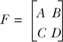

线性变换现在完全由这个矩阵表示，假设你理解如何使用它，我们将讨论这一点。我们可以通过将矩阵与向量并列来应用这个线性变换，例如，*Fx*。

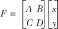

我们通过将矩阵 *F* 的每一行与矩阵 *x* 的每一列（这里只有一列）相乘来计算这个变换的结果。如果你这样做，你会得到上面显式函数定义的相同结果。矩阵不必是方阵，可以是任何矩形形状。

我们可以将矩阵图形化表示为两端各伸出两条带有标记索引的字符串的盒子：

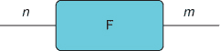

我们称这为弦图。*n* 代表输入向量的维度，而 *m* 是输出向量的维度。你可以想象一个向量从左侧流入线性变换，并在右侧产生一个新的向量。对于本书中使用的实际深度学习，你只需要理解这么多线性代数，即通过矩阵乘以向量的原则。任何额外的数学将在相应的章节中介绍。

## A.2\. 微积分

*微积分* 实质上是微分和积分的研究。在深度学习中，我们实际上只需要使用微分。*微分* 是获取函数导数的过程。

我们已经介绍了一个导数的概念：输出区间与输入区间的比率。它告诉你输出空间被拉伸或压缩了多少。重要的是，这些区间是有方向的区间，因此可以是负数或正数，因此比率可以是负数或正数。

例如，考虑函数 *f*(*x*) = *x*²。取一个点 *x* 和其邻域 (*x –* ε*,x +* ε)，其中 ε 是某个任意小的值，我们得到一个围绕 *x* 的区间。具体来说，让 *x* = 3，*ε* = 0.1；围绕 *x* = 3 的区间是 (2.9,3.1)。这个区间的长度（和方向）是 3.1 – 2.9 = +0.2，这个区间被映射到 *f*(2.9) = 8.41 和 *f*(3.1) = 9.61。这个输出区间是 (8.41,9.61) 并且其长度是 9.61 – 8.41 = 1.2。正如你所看到的，输出区间仍然是正的，所以比率 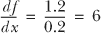，这是函数 *f* 在 *x* = 3 处的导数。

我们用 *df*/*dx* 表示函数 *f* 关于输入变量 *x* 的导数，但这并不是要将其视为一个实际的分数；它只是一个符号。我们不需要在点的两侧都取一个区间；只要区间足够小，一侧的区间就可以，即我们可以定义一个区间为 (*x*,*x* + ε)，区间的长度只是 ε，而输出区间的长度是 *f*(*x* + ε) – *f*(*x*)。

只使用像我们之前那样具体的值通常只能得到近似值；要得到绝对值，我们需要使用无限小的区间。我们可以通过想象 ε 是一个无限小的数，它大于 0 但小于我们数系中的任何其他数来符号化地做到这一点。现在微分变成了一个代数问题。

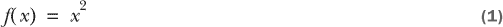

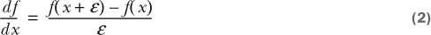

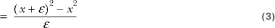

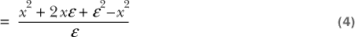

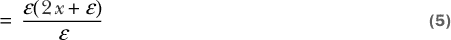

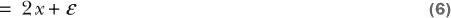

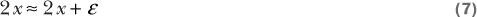

在这里，我们简单地取输出区间与输入区间的比率，这两个区间都是无穷小，因为ε是一个无穷小的数。我们可以将表达式代数地简化为 2*x* + ε，由于ε是无穷小的，2*x* + ε无限接近于 2*x*，我们将其视为原始函数*f*(*x*) = *x*²的真实导数。记住，我们正在取有方向的区间的比率，这些区间可以是正的或负的。我们不仅想知道函数如何拉伸（或压缩）输入，而且还想知道它是否改变了区间的方向。有许多高级数学理论来证明所有这些（参见非标准分析或光滑无穷小分析），但这个过程对于实际目的来说完全适用。

为什么微分在深度学习中是一个有用的概念？嗯，在机器学习中，我们试图**优化**一个函数，这意味着找到函数的输入点，使得函数的输出在所有可能的输入中达到最大值或最小值。也就是说，给定某个函数，*f*(*x*)，我们希望找到一个*x*，使得*f*(*x*)小于任何其他*x*的选择；我们通常用*argmin*(*f*(*x*))来表示这个。通常我们有一个损失函数（或成本或误差函数），它接受一些输入向量、目标向量和参数向量，并返回预测输出和真实输出之间的误差程度，我们的目标是找到使这个误差函数最小化的参数集。有许多可能的方法可以最小化这个函数，但并非所有方法都依赖于使用导数，但在大多数情况下，在机器学习中优化损失函数最有效和最有效的方法是使用导数信息。

由于深度学习模型是非线性的（即，它们不保持加法和标量乘法），导数不像在线性变换中那样是常数。从输入到输出点的压缩或拉伸的量和方向各不相同。从另一个角度来看，它告诉我们函数的哪个方向是弯曲的，因此我们可以沿着曲线向下到最低点。深度学习模型这样的多元函数不仅仅有一个导数，而是一组偏导数，这些偏导数描述了函数相对于每个单独输入组件的曲率。这样我们就可以找出哪些深度神经网络的参数集会导致最小的误差。

使用导数信息最小化函数的最简单例子是看看它对一个简单的组合函数是如何工作的。我们将尝试找到最小值的函数是：

| *f*(*x*) = log(*x*⁴ + *x*³ + 2) |
| --- |

图形显示在图 A.1。你可以看到这个函数的极小值似乎在-1 左右。这是一个组合函数，因为它包含一个多项式表达式“包裹”在对数中，因此我们需要使用微积分中的链式法则来计算导数。我们想要这个函数相对于 *x* 的导数。这个函数只有一个“山谷”，所以它只有一个极小值；然而，深度学习模型是高维和高度组合的，往往有多个极小值。理想情况下，我们希望找到全局最小值，即函数中的最低点。全局或局部极小值是函数上的点，在这些点上，斜率（即导数）为 0。对于某些函数，如这个简单例子，我们可以通过代数方法计算极小值。深度学习模型通常过于复杂，无法进行代数计算，我们必须使用迭代技术。

##### 图 A.1\. 简单组合函数的输出，*f(x)* = log(*x*⁴ + *x*³ + 2)

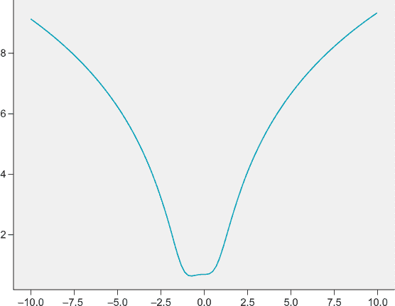

微积分中的链式法则为我们提供了一种通过分解它们来计算组合函数导数的方法。如果你听说过*反向传播*，它基本上就是链式法则应用于神经网络，并添加了一些技巧以提高其效率。对于我们的示例情况，让我们将之前的函数重写为两个函数：

| *h*(*x*) = *x*⁴ + *x*³ + 2 |
| --- |
| *f*(*x*) = log(*h*(*x*)) |

我们首先计算“外层”函数的导数，即 *f*(*x*) = log(*h*(*x*))，但这只给我们 *df*/*dh*，而我们真正想要的是 *df*/*dx*。你可能已经学过自然对数的导数

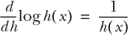

内层函数 *h*(*x*) 的导数是

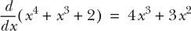

要得到组合函数的完整导数，我们注意到

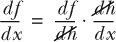

也就是说，我们想要的导数 *df*/*dx* 是通过将外层函数相对于其输入的导数与内层函数（多项式）相对于 *x* 的导数相乘得到的。


你可以将这个导数设为 0，通过代数方法计算极小值：4*x*² + 3*x* = 0。这个函数在 *x* = 0 和 *x* = –3/4 = –0.75 处有两个极小值。但只有 *x* = –0.75 是全局最小值，因为 *f*(–0.75) = 0.638971，而 *f*(0) = 0.693147，后者略大。

让我们看看如何使用*梯度下降*来解决这个问题，这是一种迭代算法，用于寻找函数的极小值。其思想是，我们从一个随机的 *x* 作为起始点开始。然后我们计算这个点的函数导数，这告诉我们这个点的曲率的大小和方向。然后我们根据旧的 *x* 点、其导数和一个步长参数来选择一个新的 *x* 点，以控制我们移动的速度。也就是说，

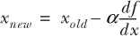

让我们看看如何在代码中实现这一点。

##### 列表 A.1\. 梯度下降

```
import numpy as np

def f(x):                      *1*
    return np.log(np.power(x,4) + np.power(x,3) + 2)

def dfdx(x):                   *2*
    return (4*np.power(x,3) + 3*np.power(x,2)) / f(x)

x = -9.41                      *3*
lr = 0.001                     *4*
epochs = 5000                  *5*
for i in range(epochs):
    deriv = dfdx(x)            *6*
    x = x - lr * deriv         *7*
```

+   ***1*** 原始函数

+   ***2*** 导数函数

+   ***3*** 随机起始点

+   ***4*** 学习率（步长）

+   ***5*** 优化迭代的次数

+   ***6*** 计算当前点的导数

+   ***7*** 更新当前点

如果你运行这个梯度下降算法，你应该得到 *x* = –0.750000000882165，这（如果四舍五入）正是你通过代数计算得到的结果。这个简单的过程就是我们训练深度神经网络时所使用的方法，只不过深度神经网络是多变量组合函数，所以我们使用偏导数。偏导数并不比普通导数复杂。

考虑多变量函数 *f*(*x*,*y*) = *x*⁴ + *y*²。由于它有两个输入变量，这个函数不再只有一个导数。我们可以对 *x* 或 *y* 或两者同时求导。当我们对多变量函数的所有输入求导并将这些导数打包成一个向量时，我们称之为梯度，用 nabla 符号 ∇ 表示，即 ∇*f*(*x*) = [*df*/*dx*,*df*/*dy*]。要计算 *f* 对 *x* 的偏导数，即 *df*/*dx*，我们只需将另一个变量 *y* 设为常数，然后像往常一样求导。在这种情况下，*df*/*dx =* 4*x*³ 和 *df*/*dy =* 2*y*。所以梯度 ∇*f*(*x*) = [4*x*³,2*y*]，这是偏导数的向量。然后我们可以像往常一样运行梯度下降，但现在我们找到与深度神经网络错误函数最低点相关的向量。

## A.3\. 深度学习

深度神经网络简单地说就是由多个称为 *layers* 的简单函数组成的组合。每个层函数由矩阵乘法后跟一个非线性 *激活函数* 组成。最常用的激活函数是 *f*(*x*) = max(0,*x*)，如果 *x* 为负则返回 0，否则返回 *x*。

一个简单的神经网络可能如下所示

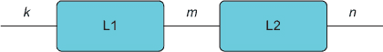

从左到右阅读这个图，就像数据从左边流入 L1 函数然后是 L2 函数，最后在右边输出。符号 *k*，*m*，和 *n* 指的是向量的维度。一个 *k*-长度的向量输入到函数 L1，它产生一个 *m*-长度的向量，然后传递给 L2，最终产生一个 *n*-维度的向量。

现在我们来看看每个 L 函数都在做什么。

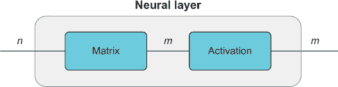

一个神经网络的层，一般由两部分组成：矩阵乘法和激活函数。一个 *n*-长度的向量从左边进入，并与一个矩阵（通常称为参数或权重矩阵）相乘，这可能会改变输出向量的维度。输出向量，现在长度为 *m*，通过一个非线性激活函数，这个函数不会改变向量的维度。

深度神经网络只是将这些层堆叠在一起，我们通过在权重矩阵上应用梯度下降来训练它，这些权重矩阵是神经网络的参数。以下是一个简单的 2 层神经网络，使用 Numpy 实现。

##### 列表 A.2\. 一个简单的神经网络

```
def nn(x,w1,w2):
    l1 = x @ w1                *1*
    l1 = np.maximum(0,l1)      *2*
    l2 = l1 @ w2
    l2 = np.maximum(0,l2)
    return l2

w1 = np.random.randn(784,200)  *3*
w2 = np.random.randn(200,10)
x = np.random.randn(784)       *4*
nn(x,w1,w2)

array([326.24915523,   0\.        ,   0\.        , 301.0265272 ,
       188.47784869,   0\.        ,   0\.        ,   0\.        ,
         0\.        ,   0\.        ])
```

+   ***1*** 矩阵乘法

+   ***2*** 非线性激活函数

+   ***3*** 权重（参数）矩阵，随机初始化

+   ***4*** 随机输入向量

在下一节中，你将学习如何使用 PyTorch 库自动计算梯度以轻松训练神经网络。

## A.4\. PyTorch

在前面的章节中，你学习了如何使用梯度下降来找到函数的最小值，但要做到这一点，我们需要梯度。在我们的简单例子中，我们可以用纸和笔来计算梯度。对于深度学习模型来说，这是不切实际的，所以我们依赖于像 PyTorch 这样的库，它提供了 *自动微分* 功能，这使得计算梯度变得容易得多。

基本思想是，在 PyTorch 中，我们创建一个 *计算图*，类似于我们在前面章节中使用的图表，其中输入、输出以及不同函数之间的连接关系被明确表示并跟踪，这样我们就可以轻松地自动应用链式法则来计算梯度。幸运的是，从 numpy 切换到 PyTorch 很简单，大多数时候我们只需将 `numpy` 替换为 `torch`。让我们将上面的神经网络翻译成 PyTorch。

##### 列表 A.3\. PyTorch 神经网络

```
import torch

def nn(x,w1,w2):
    l1 = x @ w1                                 *1*
    l1 = torch.relu(l1)                         *2*
    l2 = l1 @ w2
    return l2

w1 = torch.randn(784,200,requires_grad=True)    *3*
w2 = torch.randn(200,10,requires_grad=True)
```

+   ***1*** 矩阵乘法

+   ***2*** 非线性激活函数

+   ***3*** 权重（参数）矩阵，跟踪梯度

这几乎与 numpy 版本相同，除了我们使用 `torch.relu` 而不是 `np.maximum`，但它们是同一个函数。我们还向权重矩阵设置中添加了 `requires_grad=True` 参数。这告诉 PyTorch 这些是我们想要跟踪梯度的可训练参数，而 `x` 是一个输入，不是一个可训练参数。我们还去掉了最后一个激活函数，原因将在后面变得清晰。在这个例子中，我们将使用著名的 MNIST 数据集，它包含从 0 到 9 的手写数字图像，例如 图 A.2 中的那个。

##### 图 A.2\. MNIST 数据集中手绘数字的一个示例图像。

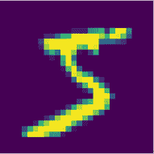

我们希望训练我们的神经网络来识别这些图像并将它们分类为 0 到 9 的数字。PyTorch 有一个相关的库，允许我们轻松下载这个数据集。

##### 列表 A.4\. 使用神经网络对 MNIST 进行分类

```
mnist_data = TV.datasets.MNIST("MNIST", train=True, download=False)          *1*

lr = 0.001
epochs = 2000
batch_size = 100
lossfn = torch.nn.CrossEntropyLoss()                                         *2*
for i in range(epochs):
    rid = np.random.randint(0,mnist_data.train_data.shape[0],size=batch_size)*3*
    x = mnist_data.train_data[rid].float().flatten(start_dim=1)              *4*
    x /= x.max()                                                             *5*
    pred = nn(x,w1,w2)                                                       *6*
    target = mnist_data.train_labels[rid]                                    *7*
    loss = lossfn(pred,target)                                               *8*
    loss.backward()                                                          *9*
    with torch.no_grad():                                                    *10*
        w1 -= lr * w1.grad                                                   *11*
        w2 -= lr * w2.grad
```

+   ***1*** 下载并加载 MNIST 数据集

+   ***2*** 设置损失函数

+   ***3*** 获取一组随机索引值

+   ***4*** 将数据子集并展平 28 x 28 图像为 784 向量

+   ***5*** 将向量归一化到 0 到 1 之间

+   ***6*** 使用神经网络进行预测

+   ***7*** 获取真实图像标签

+   ***8*** 计算损失

+   ***9*** 反向传播

+   ***10*** 在此块中不计算梯度

+   ***11*** 在参数矩阵上进行梯度下降

你可以通过观察损失函数在训练时间内的稳步下降来判断神经网络是否成功训练（图 A.3）。这段简短的代码片段训练了一个完整的神经网络，以大约 70%的准确率成功分类 MNIST 数字。我们只是以与我们的简单对数函数 *f*(*x*) = log(*x*⁴ + *x*³ + 2)相同的方式实现了梯度下降，但 PyTorch 为我们处理了梯度。由于神经网络参数的梯度依赖于输入数据，每次我们用新的随机图像样本运行神经网络“正向”时，梯度都会不同。因此，我们用数据的一个随机样本运行神经网络正向，PyTorch 跟踪发生的计算，当我们完成时，我们在最后一个输出上调用`backward()`方法；在这种情况下通常是损失。`backward()`方法使用自动微分来计算所有`requires_grad=True`设置的 PyTorch 变量的所有梯度。然后我们可以使用梯度下降更新模型参数。我们将实际的梯度下降部分包装在`torch.no_grad()`上下文中，因为我们不希望它跟踪这些计算。

##### 图 A.3\. 在 MNIST 数据集上训练的神经网络的损失函数。

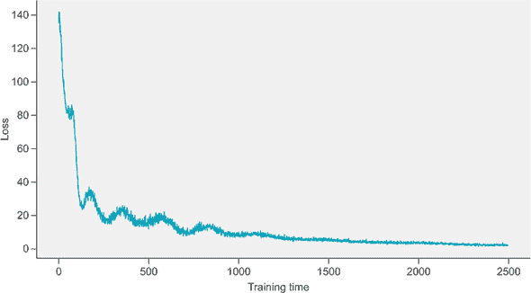

通过使用梯度下降的更复杂版本改进训练算法，我们可以轻松实现超过 95%的准确率。在列表 A.4 中，我们实现了自己的随机梯度下降版本，*随机*部分是因为我们从数据集中随机抽取子集并基于此计算梯度，这给出了给定完整数据集的真实梯度的噪声估计。

PyTorch 包括内置的优化器，其中之一是随机梯度下降（SGD）。最受欢迎的替代方案称为 Adam，它是 SGD 的一个更复杂的版本。我们只需要用模型参数实例化优化器。

##### 列表 A.5\. 使用 Adam 优化器

```
mnist_data = TV.datasets.MNIST("MNIST", train=True, download=False)

lr = 0.001
epochs = 5000
batch_size = 500
lossfn = torch.nn.CrossEntropyLoss()            *1*
optim = torch.optim.Adam(params=[w1,w2],lr=lr)  *2*
for i in range(epochs):
    rid = np.random.randint(0,mnist_data.train_data.shape[0],size=batch_size)
    x = mnist_data.train_data[rid].float().flatten(start_dim=1)
    x /= x.max()
    pred = nn(x,w1,w2) 
    target = mnist_data.train_labels[rid]
    loss = lossfn(pred,target) 
    loss.backward()                             *3*
    optim.step()                                *4*
    optim.zero_grad()                           *5*
```

+   ***1*** 设置损失函数

+   ***2*** 设置 ADAM 优化器

+   ***3*** 反向传播

+   ***4*** 更新参数

+   ***5*** 重置梯度

你可以看到，使用 Adam 优化器后，图 A.4 中的损失函数现在要平滑得多，并且它显著提高了我们神经网络分类器的准确率。

##### 图 A.4\. 使用内置的 PyTorch 优化器 Adam 在 MNIST 上训练的神经网络的损失图。


