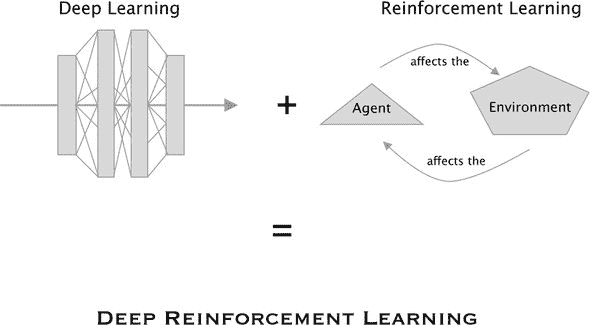

## 参考文献列表

我们尽力在各个章节中引用了我们使用的项目和论文，但许多我们使用的方法和想法都受到了这里列出的来源的启发，即使它们没有被直接使用。例如，我们使用了大量的字符串图，这些图并非来自任何一个单一来源，而是受到了这里列出的几篇论文的启发，包括一篇关于量子力学的论文（Coecke 和 Kissinger, 2017）。虽然我们主要包含这个参考文献列表是为了给予应有的认可，但你可能会在深入研究深度强化学习和相关领域时发现这些参考文献很有用。

+   Andrew, A.M. 1998\. “强化学习：简介.” *Kybernetes* 27\. [`doi.org/10.1108/k.1998.27.9.1093.3`](https://doi.org/10.1108/k.1998.27.9.1093.3).

+   Battaglia, P.W., J.B. Hamrick, V. Bapst, A. Sanchez-Gonzalez, V. Zambaldi, M. Malinowski, A. Tacchetti 等人. 2018\. “关系归纳偏差，深度学习和图网络.” [`arxiv.org/abs/1806.01261`](http://arxiv.org/abs/1806.01261).

+   Bellemare, M.G., Y. Naddaf, J. Veness, 和 M. Bowling. 2013\. “街机学习环境：通用代理的评价平台.” *人工智能研究杂志* 47:253–279\. [`doi.org/10.1613/jair.3912`](https://doi.org/10.1613/jair.3912).

+   Bonchi, F., J. Holland, R. Piedeleu, P. Sobociński, 和 F. Zanasi. 2019\. “图代数：从线性到并发系统.” *ACM 程序语言会议论文集* 3:1–28\. [`doi.org/10.1145/3290338`](https://doi.org/10.1145/3290338).

+   Bonchi, F., R. Piedeleu, P. Sobocinski, 和 F. Zanasi. 2019\. “图形仿射代数.” *2019 年第 34 届 ACM/IEEE 计算机科学逻辑年会*. [`doi.org/10.1109/LICS.2019.8785877`](https://doi.org/10.1109/LICS.2019.8785877).

+   Brockman, G., V. Cheung, L. Pettersson, J. Schneider, J. Schulman, J. Tang, 和 W. Zaremba. 2016\. “OpenAI Gym.” [`arxiv.org/abs/1606.01540`](http://arxiv.org/abs/1606.01540).

+   Coecke, B., 和 A. Kissinger. 2017\. *描绘量子过程：量子理论和图推理的第一课程*. 剑桥大学出版社.

+   Hessel, M., J. Modayil, H. Van Hasselt, T. Schaul, G. Ostrovski, W. Dabney, D. Horgan, 等人. 2018\. “Rainbow：结合深度强化学习的改进.” *第 32 届 AAAI 人工智能会议，AAAI 2018*，3215–3222.

+   Kaiser, L., M. Babaeizadeh, P. Milos, B. Osinski, R.H. Campbell, K. Czechowski, D. Erhan, 等人. 2019\. “基于模型的 Atari 强化学习.” [`arxiv.org/abs/1903.00374`](http://arxiv.org/abs/1903.00374).

+   Kulkarni, T.D., K.R. Narasimhan, A. Saeedi, 和 J.B. Tenenbaum. 2016\. “分层深度强化学习：整合时间抽象和内在动机.” *神经信息处理系统进展* 29 (NIPS 2016): 3682–3690.

+   Kumar, N.M. 2018\. “使用互信息估计驱动的探索。” [`arxiv.org/abs/1810.05533`](http://arxiv.org/abs/1810.05533).

+   Mnih, V., A.P. Badia, L. Mirza, A. Graves, T. Harley, T.P. Lillicrap, D. Silver, et al. 2016\. “异步深度强化学习方法。” *第 33 届国际机器学习会议* (ICML 2016) 4:2850–2869.

+   Mnih, V., K. Kavukcuoglu, D. Silver, A.A. Rusu, J. Veness, M.G. Bellemare, A. Graves, et al. (2015). “通过深度强化学习实现人类水平控制。” *自然* 518:529–533\. [`doi.org/10.1038/nature14236`](https://doi.org/10.1038/nature14236).

+   Mott, A., D. Zoran, M. Chrzanowski, D. Wierstra, 和 D.J. Rezende. 2019\. “使用注意力增强代理实现可解释强化学习。” [`arxiv.org/abs/1906.02500`](http://arxiv.org/abs/1906.02500).

+   Mousavi, S.S., M. Schukat, and E. Howley. 2018\. “深度强化学习：概述。” *网络与系统讲义* 16:426–440\. [`doi.org/10.1007/978-3-319-56991-8_32`](https://doi.org/10.1007/978-3-319-56991-8_32).

+   Nardelli, N., P. Kohli, G. Synnaeve, P.H.S. Torr, Z. Lin, and N. Usunier. 2019\. “值传播网络。” *第 7 届国际学习表示会议，ICLR 2019*。[`arxiv.org/abs/1805.11199`](http://arxiv.org/abs/1805.11199).

+   Oh, J., S. Singh, and H. Lee. 2017\. “值预测网络。” 在 I. Guyon, U.V. Luxburg, S. Bengio, H. Wallach, R. Fergus, S. Vishwanathan, 和 R. Garnett (编)，*神经信息处理系统 30 卷进展* (NIPS 2017): 6119–6129\. [`papers.nips.cc/paper/7192-value-prediction-network.pdf`](http://papers.nips.cc/paper/7192-value-prediction-network.pdf).

+   Pathak, D., P. Agrawal, A.A. Efros, 和 T. Darrell. 2017\. “通过自监督预测驱动的探索。” *2017 IEEE 计算机视觉与模式识别会议 workshops (CVPRW)*, 488–489\. [`doi.org/10.1109/CVPRW.2017.70`](https://doi.org/10.1109/CVPRW.2017.70).

+   Salimans, T., J. Ho, X. Chen, S. Sidor, 和 I. Sutskever. 2017\. “进化策略作为强化学习的可扩展替代方案。” [`arxiv.org/abs/1703.03864`](http://arxiv.org/abs/1703.03864).

+   Schaul, T., J. Quan, I. Antonoglou, 和 D. Silver. 2016\. “优先经验回放。” *第 4 届国际学习表示会议，ICLR 2016—会议论文集*。[`arxiv.org/abs/1511.05952`](http://arxiv.org/abs/1511.05952).

+   Schulman, J., F. Wolski, P. Dhariwal, A. Radford, and O. Klimov. 2017\. “近端策略优化算法。” [`arxiv.org/abs/1707.06347`](http://arxiv.org/abs/1707.06347).

+   Silver, D. 2015\. “讲座 1：强化学习概述。” [`www0.cs.ucl.ac.uk/staff/d.silver/web/Teaching_files/intro_RL.pdf`](http://www0.cs.ucl.ac.uk/staff/d.silver/web/Teaching_files/intro_RL.pdf).

+   Spivak, D., and R. Kent. 2011\. “Ologs：知识表示的范畴框架.” [`arxiv.org/abs/1102.1889`](https://arxiv.org/abs/1102.1889).

+   Stolle, M., and D. Precup. 2002\. “强化学习中的选项学习.” *《计算机科学讲座笔记（包括子系列讲座笔记在人工智能和生物信息学中）* 2371:212–223\. [`doi.org/10.1007/3-540-45622-8_16`](https://doi.org/10.1007/3-540-45622-8_16).

+   Vaswani, A., N. Shazeer, N. Parmar, J. Uszkoreit, L. Jones, A.N. Gomez, L. Kaiser, et al. 2017\. “注意力即一切.” *第 31 届神经信息处理系统会议 (NIPS 2017)*. [`papers.nips.cc/paper/7181-attention-is-all-you-need.pdf`](http://papers.nips.cc/paper/7181-attention-is-all-you-need.pdf).

+   Weng, L. 2018\. “注意力？注意力！” *《小日志》* (2018 年 6 月 24 日). [`lilianweng.github.io/lil-log/2018/06/24/attention-attention.html`](https://lilianweng.github.io/lil-log/2018/06/24/attention-attention.html).

+   Wu, Z., S. Pan, F. Chen, G. Long, C. Zhang, and P.S. Yu. 2019\. “图神经网络综述.” [`arxiv.org/abs/1901.00596`](http://arxiv.org/abs/1901.00596).

+   Yang, Y., R. Luo, M. Li, M. Zhou, W. Zhang, and J. Wang. 2018\. “平均场多智能体强化学习.” *第 35 届国际机器学习会议 (ICML 2018)* 12:8869–8886.

+   Zambaldi, V., D. Raposo, A. Santoro, V. Bapst, Y. Li, I. Babuschkin, K. Tuyls, et al. 2018\. “关系深度强化学习.” [`arxiv.org/abs/1806.01830`](http://arxiv.org/abs/1806.01830).

+   Zambaldi, V., D. Raposo, A. Santoro, V. Bapst, Y. Li, I. Babuschkin, K. Tuyls, et al. 2019\. “具有关系归纳偏好的深度强化学习.” *第 7 届国际学习表示会议，ICLR 2019*.

+   Zhang, Z., P. Cui, and W. Zhu. 2018\. “图上的深度学习：综述.” [`arxiv.org/abs/1812.04202`](http://arxiv.org/abs/1812.04202).

+   Zhou, M., Y. Chen, Y. Wen, Y. Yang, Y. Su, W. Zhang, D Zhang, et al. 2019\. “大规模多智能体系统的分解 Q 学习.” [`doi.org/10.1145/3356464.3357707`](https://doi.org/10.1145/3356464.3357707).

+   Ziegel, E.R. 2003\. “统计学习的要素.” *《技术计量学》* 45\. [`doi.org/10.1198/tech.2003.s770`](https://doi.org/10.1198/tech.2003.s770).

