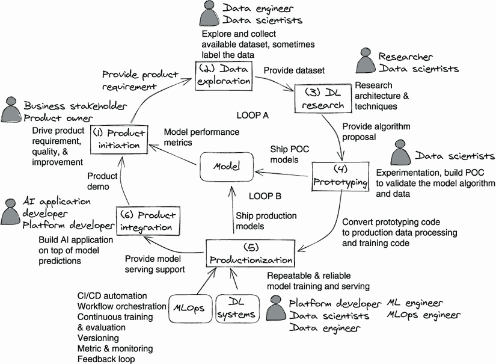
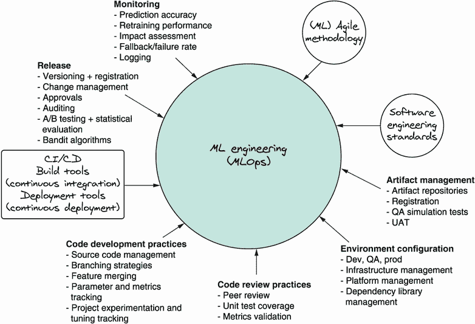
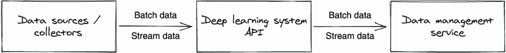
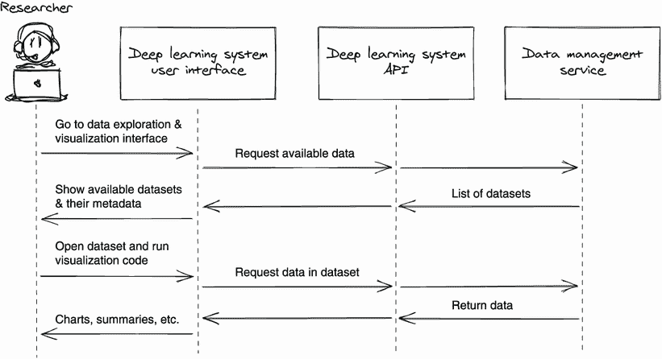

# 第一章：深度学习系统简介

本章内容包括

+   定义深度学习系统

+   产品开发周期及深度学习系统如何支持其

+   基本深度学习系统及其组成部分概述

+   搭建深度学习系统与开发模型之间的差异

本章将为您提供一个深度学习系统的全貌思维模型。我们将回顾一些定义，并提供一个参考系统架构设计和该架构的完整示例实现。我们希望这个思维模型能够让您看到其他章节如何详细介绍每个系统组件，并将其融入整体图景。

在开始本章之前，我们将讨论一个超越深度学习系统的更大图景：我们称之为*深度学习开发周期*。这个周期概述了基于深度学习的产品推向市场所涉及的各种角色和阶段。模型和平台并不是孤立存在的；它们受产品管理、市场调研、生产和其他阶段的影响，也会影响这些阶段。我们相信，当工程师了解这个周期以及每个团队的工作内容和所需时，他们设计的系统会更好。

在 1.2 节中，我们将从典型系统的示例架构开始讨论深度学习系统设计。本节描述的组件将在各自的章节中进行更详细的探讨。最后，我们将强调开发模型与开发深度学习系统之间的区别。这种区别常常是一个让人困惑的焦点，所以我们想要立即澄清。

在阅读完这个入门章节之后，您将对深度学习的概况有了扎实的理解。您还将能够开始创建自己的深度学习系统设计，并理解现有设计以及如何使用和扩展它们，这样您就不必从头开始构建一切。随着您继续阅读本书，您将看到一切是如何连接和共同作为一个深度学习系统运作的。

术语

在我们继续本章（以及本书的其余部分）之前，让我们定义和澄清本书中始终使用的一些术语。

深度学习与机器学习的比较

深度学习是机器学习的一种，但被认为是机器学习的一种演变。机器学习按定义是人工智能的一种应用，包括解析数据、从数据中学习，然后应用所学内容做出明智决策的算法。深度学习是机器学习的一种特殊形式，它使用可编程神经网络作为算法，从数据中学习并做出准确的决策。

尽管本书主要关注于教授如何构建系统或基础设施来促进深度学习开发（所有示例都是神经网络算法），但我们讨论的设计和项目开发概念在机器学习中也适用。因此，在本书中，我们有时将术语*深度学习*和*机器学习*互换使用。例如，本章介绍的深度学习开发周期和第二章介绍的数据管理服务也适用于机器学习上下文。

深度学习用例

深度学习用例是指利用深度学习技术解决问题的场景，换句话说，是您想使用深度学习解决的问题。例如：

+   *聊天机器人*—用户可以在客户支持网站上与虚拟代理进行基于文本的对话。虚拟代理使用深度学习模型理解用户输入的句子，并像真正的人类一样与用户进行对话。

+   *自动驾驶汽车*—驾驶员可以将汽车置于辅助驾驶模式，根据道路标线自动转向。车载多个摄像头捕捉标线，利用基于深度学习的计算机视觉技术形成对道路的感知。

模型、预测和推断，以及模型服务

这三个术语的描述如下：

+   *模型*—深度学习模型可以被视为包含算法（模型架构）和进行预测所需数据的可执行程序。

+   *预测和推断*—模型预测和模型推断都是指使用给定数据执行模型以获得一组输出。由于在模型服务的上下文中广泛使用预测和推断，它们在本书中可以互换使用。

+   *模型服务*（预测服务）—本书将模型服务描述为在 Web 应用程序（在云端或本地）中托管机器学习模型，并允许深度学习应用程序通过 API 将模型功能集成到其系统中。模型服务 Web 程序通常称为预测服务或模型服务。

深度学习应用

深度学习应用是利用深度学习技术解决问题的软件。它通常不执行任何计算密集型任务，例如数据处理、深度学习模型训练和模型服务（除了在边缘托管模型，例如自动驾驶汽车）。例如：

+   提供 UI 或 API 以接受用户的自然句子作为输入，解释它们，采取行动并向用户提供有意义的响应的*聊天机器人应用程序*。基于深度学习系统中计算的模型输出（来自模型服务），聊天机器人做出响应并采取行动。

+   *自动驾驶软件*从多个传感器接收输入，如视频摄像头、接近传感器和激光雷达，借助深度学习模型形成对汽车周围环境的感知，并相应地驾驶汽车。

平台 vs. 系统 vs. 基础设施

在本书中，术语 *深度学习平台*、*深度学习系统* 和 *深度学习基础设施* 具有相同的含义：为高效构建深度学习应用程序提供所有必要支持的基础系统。我们倾向于最常使用 *系统*，但在本书的上下文中，所有三个术语都具有相同的含义。

现在我们对术语有了共识，让我们开始吧！

## 1.1 深度学习开发周期

正如我们所说，深度学习系统是深度学习 *项目开发* 高效进行所必需的基础设施。因此，在深入探讨深度学习系统的结构之前，审视一下深度学习系统所启用的开发范式是明智的。我们称这个范式为 *深度学习开发周期*。

你可能会想，在一本技术书中，为什么我们要强调像产品开发这样与技术无关的东西。事实上，大多数深度学习工作的目标最终是将产品或服务推向市场。然而，许多工程师并不熟悉产品开发的其他阶段，就像许多产品开发者不了解工程或建模一样。从我们构建深度学习系统的经验中，我们已经了解到，说服公司中多个角色的人员采用系统主要取决于该系统是否实际上能解决他们的特定问题。我们相信，概述深度学习开发周期中的各个阶段和角色有助于表达、解决、沟通和最终解决每个人的痛点。

了解这一周期也能解决其他一些问题。在过去的十年里，许多新的深度学习软件包已经被开发出来，以解决不同的领域。其中一些处理模型训练和服务，而另一些处理模型性能跟踪和实验。数据科学家和工程师每次需要解决特定应用程序或用例时都会组合这些工具；这被称为 MLOps（机器学习运维）。随着这些应用程序数量的增长，为新的应用程序每次从头开始组合这些工具变得重复和耗时。同时，随着这些应用程序的重要性增长，对其质量的期望也在增加。这两个问题都需要一种一致的方法来快速可靠地开发和交付深度学习功能。这种一致的方法始于所有人都在同一深度学习开发范式或周期下工作。

深度学习*系统*如何适应深度学习*周期*？一个良好构建的深度学习系统应该支持产品开发周期，并使执行周期变得轻松、快速和可靠。理想情况下，数据科学家可以使用深度学习系统作为基础设施完成整个深度学习周期，而无需学习底层复杂系统的所有工程细节。

因为每个产品和组织都是独特的，对系统构建者来说，理解各种角色的独特需求以构建成功的系统至关重要。所谓的“成功”，是指帮助利益相关者高效协作，快速交付深度学习特性的系统。在本书中，当我们讨论深度学习系统的设计原则，并查看每个组件的工作方式时，你对利益相关者需求的理解将帮助你调整这些知识，形成自己的系统设计。在讨论技术细节时，我们将指出在设计系统时需要注意某些类型的利益相关者。深度学习开发周期将作为指导框架，帮助我们考虑深度学习系统的每个组件的设计要求。

让我们从一张图片开始。图 1.1 展示了典型周期的样貌。它展示了机器学习（特别是深度学习）的开发进度逐个阶段的过程。正如你所见，跨职能协作几乎在每一步都发生。我们将在接下来的两个部分讨论此图中涉及的每个阶段和角色。

图 1.1 将深度学习从研究带入产品的典型场景。我们称之为*深度学习开发周期*。

### 1.1.1 深度学习产品开发周期中的阶段

深度学习开发周期通常从一个业务机会开始，并由产品计划及其管理驱动。之后，周期通常经历四个阶段：数据探索、原型制作、产品化（投入生产）和应用集成。让我们逐一查看这些阶段。然后我们将查看所有涉及的角色（在图 1.1 中以人物图标表示）。

注意：每个后续小节旁边括号中的数字与图 1.1 中的相同数字对应。

产品启动（1）

首先，业务利益相关者（产品所有者或项目经理）分析业务，并确定可以通过机器学习解决的潜在业务机会或问题。

数据探索（2）

当数据科学家清楚了解业务需求时，他们开始与数据工程师合作，尽可能收集、标记数据并构建数据集。数据收集可以包括搜索公开可用数据和探索内部来源。数据清理也可能会发生。数据标记可以外包或在内部执行。

与以下阶段相比，数据探索的早期阶段是非结构化的，通常是随意进行的。它可能是一个 Python 脚本或 shell 脚本，甚至是数据的手动复制。数据科学家经常使用基于 Web 的数据分析应用程序，例如 Jupyter Notebook（开源；[`jupyter.org`](https://jupyter.org)）、Amazon SageMaker Data Wrangler（[`aws.amazon.com/sagemaker/data-wrangler`](https://aws.amazon.com/sagemaker/data-wrangler)）和 Databricks（[www.databricks.com](http://www.databricks.com)）来分析数据。不需要构建正式的数据收集管道。

数据探索不仅重要，而且对深度学习项目的成功至关重要。可用的相关数据越多，建立有效和高效深度学习模型的可能性就越高。

研究和原型设计（3, 4）

原型设计的目标是找到最可行的算法/方法，以解决给定数据的业务需求（来自产品所有者）。在此阶段，数据科学家可以与 AI 研究人员合作，提出并评估来自前期数据探索阶段构建的不同训练算法。数据科学家通常在此阶段尝试多种想法，并构建概念验证（POC）模型来评估它们。

尽管新发布的算法通常会受到考虑，但大多数算法都不会被采纳。算法的准确性不是唯一要考虑的因素；在评估算法时还必须考虑计算资源需求、数据量和算法实现成本。最实用的方法通常是获胜者。

请注意，由于资源限制，研究人员并不总是参与原型设计阶段。经常情况下，数据科学家既做研究工作，又构建 POC。

您还可能注意到，在图 1.1 中，大型开发周期中有一个内部循环（循环 A）：产品启动 > 数据探索 > 深度学习研究 > 原型设计 > 模型 > 产品启动。该循环的目的是通过构建 POC 模型在早期阶段获得产品反馈。我们可能会多次执行此循环，直到所有利益相关者（数据科学家、产品所有者）就将用于满足业务需求的算法和数据达成一致意见。

多次痛苦的教训最终教会了我们，在开始昂贵的生产过程——构建生产数据和训练管道以及托管模型之前，我们必须与产品团队或客户（甚至更好）审查解决方案。深度学习项目的目的与任何其他软件开发项目并无不同：解决业务需求。在早期阶段与产品团队审查方法将防止在后期重新制定方法的昂贵和令人沮丧的过程。

生产化（也称为 MLOps）（5）

生产化，也称为“投入生产”，是使产品具备生产价值并准备好被用户消费的过程。生产价值通常定义为能够服务客户请求，承受一定程度的请求负载，并优雅地处理诸如格式错误的输入和请求超载等不利情况。生产价值还包括后期工作，如持续的模型指标监控和评估、反馈收集和模型重新训练。

生产化是开发周期中最需要工程投入的部分，因为我们将把原型实验转化为严肃的生产流程。生产化的非详尽待办事项列表可以包括

+   建立一个数据管道，重复从不同的数据源中提取数据，并使数据集版本化和更新。

+   建立数据管道对数据集进行预处理，例如数据增强或增强和与外部标记工具集成。

+   重构和将原型代码 docker 化为生产质量的模型训练代码。

+   通过版本控制和跟踪输入和输出使训练和服务代码的结果可再现。例如，我们可以使训练代码报告训练元数据（训练日期和时间、持续时间、超参数）和模型元数据（性能指标、使用的数据和代码），以确保对每次模型训练运行的完全可追溯性。

+   设置持续集成（Jenkins、GitLab CI）和持续部署以自动化代码构建、验证和部署。

+   建立连续的模型训练和评估管道，以便模型训练可以自动使用最新的数据集，并以可重复、可审计和可靠的方式生成模型。

+   建立一个模型部署管道，自动发布通过质量门的模型，以便模型服务组件可以访问它们；根据业务需求可以执行`async`或实时模型预测。模型服务组件托管模型并通过 Web API 公开它。

+   建立持续监控管道，定期评估数据集、模型和模型服务性能，以检测数据集的潜在特征漂移（数据分布变化）或模型性能下降（概念漂移）并警告开发人员或重新训练模型。

如今，生产化步骤有一个新的热门别名：MLOps（机器学习运营），这是一个模糊的术语，对研究人员和专业人员的定义模糊不清。我们解释 MLOps 的含义是弥合模型开发（实验）和生产环境运营（Ops）之间的鸿沟，以促进机器学习项目的生产化。例如，简化将机器学习模型推向生产的过程，然后对其进行监视和维护。

MLOps 是一种根植于 DevOps 原则的范式，应用了类似的原则到软件开发中。它利用了三个学科：机器学习、软件工程（特别是运维）和数据工程。查看图 1.2，了解通过 MLOps 视角看深度学习。

图 1.2 MLOps 在深度学习的产品化阶段应用了 DevOps 方法，当模型被推向生产时。（来源：*Machine Learning Engineering in Action*，作者 Ben Wilson，Manning 出版社，2022 年，图 2.7）

因为这本书是关于构建支持 ML 运营的机器学习系统，所以我们不会详细介绍图 1.2 中所示的实践。但是，正如你所看到的，支持将机器学习模型开发到生产环境中的工程工作量是巨大的。与数据科学家在数据探索和模型原型阶段所做的工作相比，工具（软件）、工程标准和流程已经发生了巨大变化，并变得更加复杂。

为什么将模型部署到生产环境很困难？

庞大的基础设施（工具、服务、服务器）和团队间的密集合作是将模型部署到生产环境的两个最大障碍。这个关于产品化（又称 MLOps）的部分建立在一个事实上，即数据科学家需要与数据工程师、平台开发人员、DevOps 工程师和机器学习工程师一起工作，并且要了解庞大的基础设施（深度学习系统），才能将算法/模型从原型推向生产。难怪产品化模型需要花费如此多的时间。

为了解决这些挑战，我们需要在设计和构建深度学习系统时，将复杂性从数据科学家那里抽象出来。就像建造汽车一样，我们希望让数据科学家坐在驾驶座上，但不要求他们对汽车本身了解太多。

现在，回到开发周期，你可能会注意到图 1.1 中还有一个*另一个*内部循环（循环 B），从产品化（方框 5）到模型到产品启动（方框 1）。这是在我们将模型推理与 AI 应用集成之前与产品团队进行的第二次审查。

我们的第二次审查（循环 B）在原型和生产之间比较模型和数据。我们要确保模型性能和可扩展性（例如，模型服务容量）符合业务需求。

注意：以下两篇论文是推荐的；如果你想了解更多关于 MLOps 的内容，它们是很好的起点：“Operationalizing Machine Learning: An Interview Study”（arXiv:2209.09125）和“Machine Learning Operations (MLOps): Overview, Definition, and Architecture”（arXiv:2205.02302）。

应用集成（6）

产品开发周期的最后一步是将模型预测集成到 AI 应用中。常见的模式是将模型托管在深度学习系统的模型服务服务中，并通过互联网发送模型预测请求将业务应用逻辑与模型集成。

作为一个示例用户场景，一个聊天机器人用户通过键入或发声问题与聊天机器人用户界面进行交互。当聊天机器人应用程序接收到来自客户的输入时，它调用远程模型服务服务来运行模型预测，然后根据模型预测结果采取行动或回应客户。

除了将模型服务与应用逻辑集成外，此阶段还涉及评估对产品重要的指标，如点击率和流失率。良好的 ML 特定指标（良好的精确度-召回率曲线）并不总是能保证满足业务需求。因此，业务利益相关者通常在此阶段进行客户访谈和产品指标评估。

### 1.1.2 开发周期中的角色

因为您现在对典型开发周期中的每个步骤有了清晰的了解，让我们来看看在这个周期中合作的关键角色。每个角色的定义、职称和职责可能因组织而异。所以确保您澄清了您的组织中谁做什么，并相应调整您系统的设计。

业务利益相关者（产品所有者）

许多组织将利益相关者角色分配给多个职位，如产品经理、工程经理和高级开发人员。业务利益相关者定义产品的业务目标，并负责产品开发周期的沟通和执行。以下是他们的责任：

+   从深度学习研究中获得灵感，讨论在产品中应用深度学习特性的潜在应用，并驱动推动模型开发的产品需求

+   拥有产品！与客户沟通，确保工程解决方案符合业务需求并产生结果

+   协调不同角色和团队之间的跨职能协作

+   运行项目开发执行；在整个开发周期内提供指导或反馈，以确保深度学习特性为产品的客户提供真正的价值

+   评估产品指标（如用户流失率和功能使用情况）—而不是模型指标（精度或准确性）—并推动模型开发、产品化或产品集成的改进

研究人员

机器学习研究人员研究和开发新颖的神经网络架构。他们还开发提高模型准确性和训练模型效率的技术。这些架构和技术可以在模型开发过程中使用。

注：机器学习研究员角色通常与 Google、Microsoft 和 Salesforce 等大型科技公司相关联。在许多其他公司，数据科学家扮演相同的角色。

数据科学家

数据科学家可能会扮演研究员的角色，但大多数情况下，他们会将业务问题转化为机器学习问题，并使用机器学习方法来实现。数据科学家受产品需求的驱动，并将研究技术应用于生产数据，而不是标准基准数据集。除了研究模型算法外，数据科学家的职责还可能包括

+   将不同研究中的多个深度学习神经网络架构和/或技术结合到一个解决方案中。有时，他们除了纯深度学习外还应用其他机器学习技术。

+   探索可用数据，确定哪些数据是有用的，并决定如何在供训练之前对其进行预处理。

+   原型不同方法（编写实验性代码）来解决业务问题。

+   将模型原型代码转换为生产代码，并进行工作流自动化。

+   遵循工程流程，通过使用深度学习系统将模型部署到生产环境。

+   根据需要迭代可能有助于模型开发的任何额外数据。

+   在生产环境中持续监控和评估数据和模型性能。

+   排查与模型相关的问题，如模型退化。

数据工程师

数据工程师帮助收集数据，并建立连续数据摄入和处理的数据管道，包括数据转换、丰富和标记。

MLOps 工程师/ML 工程师

MLOps 工程师在多个领域扮演多种角色，包括数据工程师、DevOps（运维）工程师、数据科学家和平台工程师。除了设置和运行机器学习基础设施（系统和硬件），他们还管理自动化管道以创建数据集并训练和部署模型。MLOps 工程师还监控 ML 基础设施和用户活动，如训练和服务。

如你所见，MLOps 很困难，因为它需要人们掌握一套跨越软件开发、运维、维护和机器学习开发的实践方法。MLOps 工程师的目标是确保机器学习模型的创建、部署、监控和维护高效可靠。

深度学习系统/平台工程师

深度学习系统工程师构建和维护机器学习基础设施的主要组件——本书的主要关注点——以支持数据科学家、数据工程师、MLOps 工程师和 AI 应用的所有机器学习开发活动。机器学习系统的组成部分包括数据仓库、计算平台、工作流编排服务、模型元数据和工件存储、模型训练服务、模型服务等。

应用工程师

应用工程师构建面向客户的应用程序（前端和后端），以满足给定的业务需求。应用程序逻辑将根据给定客户请求的模型预测做出决策或采取行动。

注意：未来，随着机器学习系统（基础设施）的成熟，深度学习开发周期中涉及的角色将合并为越来越少。最终，数据科学家将能够独自完成整个周期。

### 1.1.3 深度学习开发周期步骤详解

通过给出一个例子，我们可以以更具体的方式展示角色和过程。假设你被分配了构建一个关于公司产品线自动回答问题的客户支持系统的任务。以下步骤将指导您完成将该产品推向市场的过程：

1.  产品要求是构建一个客户支持应用程序，提供一个菜单，让客户可以浏览以找到常见问题的答案。随着问题数量的增加，菜单变得越来越大，有许多层次的导航。分析显示，许多客户在尝试找到答案时对导航系统感到困惑，并放弃了浏览菜单。

1.  拥有该产品的产品经理（PM）受到改善用户保留率和体验（快速找到答案）的动机。在与客户进行了一些研究后，产品经理发现，大多数客户希望在不复杂的菜单系统中获得答案，最好是像在他们的自然语言中提问一样简单。

1.  产品经理联系机器学习研究人员寻求潜在解决方案。结果表明，深度学习可能会有所帮助。专家认为这项技术已经足够成熟，可以用于这个用例，并建议几种基于深度学习模型的方法。

1.  产品经理编写产品规格，指示应用程序一次从客户那里接收一个问题，从问题中识别意图，并与相关答案匹配。

1.  数据科学家收到产品需求并开始原型化符合需求的深度学习模型。他们首先开始数据探索，收集可用的训练数据，并与研究人员商讨算法的选择。然后数据科学家开始编写原型代码以生成实验模型。最终，他们得到了一些数据集、几种训练算法和多个模型。经过仔细评估，从各种实验中选择了一个自然语言处理模型。

1.  然后，项目经理组建了一个平台工程师、MLOps 工程师和数据工程师团队，与数据科学家一起工作，将在第 5 步中创建的原型代码投入生产。这项工作包括构建连续的数据处理管道和连续的模型训练、部署和评估管道，以及设置模型服务功能。项目经理还确定了每秒预测次数和所需的延迟。

1.  一旦生产设置完成，应用工程师将客户支持服务的后端与模型服务服务（在第 6 步中构建）集成起来，因此当用户输入问题时，服务将根据模型预测返回答案。项目经理还定义了产品指标，例如平均查找答案所花费的时间，以评估最终结果，并将其用于推动下一轮改进。

### 1.1.4 项目开发的扩展

正如您在 1.1.2 节中所看到的，我们需要填补七种不同的角色才能完成一个深度学习项目。这些角色之间的跨职能协作几乎在每一个步骤都会发生。例如，数据工程师、平台开发人员和数据科学家共同致力于将项目投入生产。任何参与过需要许多利益相关方的项目的人都知道，为了推动这样一个项目前进，需要多少沟通和协调。

这些挑战使得深度学习开发难以扩展，因为我们要么没有资源来填补所有所需角色，要么由于沟通成本和减速而无法满足产品时间表。为了减少巨大的运营工作量、沟通和跨团队协调成本，公司正在投资于机器学习基础设施，并减少构建机器学习项目所需的人员数量和知识范围。深度学习基础设施堆栈的目标不仅是自动化模型构建和数据处理，还要使技术角色合并为可能，使数据科学家能够在项目中独立地处理所有这些功能。

深度学习系统的一个关键成功指标是看模型投产过程能否顺利进行。有了良好的基础设施，不会期望数据科学家突然成为专家级的 DevOps 或数据工程师，他们应该能够以可扩展的方式实现模型、建立数据管道，并独立地在生产环境中部署和监控模型。

通过使用高效的深度学习系统，数据科学家将能够以最小的额外开销完成开发周期——需要较少的沟通和等待他人的时间，并专注于最重要的数据科学任务，如理解数据和尝试算法。扩展深度学习项目开发能力是深度学习系统的真正价值所在。

## 1.2 深度学习系统设计概述

在考虑到第 1.1 节的背景下，让我们深入了解本书的重点：深度学习系统本身。设计一个系统——任何系统——都是在一组对你的情况独特的约束条件下实现目标的艺术。深度学习系统也不例外。例如，假设你有几个需要同时提供服务的深度学习模型，但是你的预算不允许你运行一台具有足够内存同时容纳所有模型的机器。你可能需要设计一个缓存机制来在内存和磁盘之间交换模型。然而，交换会增加推断延迟。这种解决方案是否可行将取决于延迟要求。另一个可能性是为每个模型运行多个较小的机器，如果你的模型大小和预算允许的话。

或者，举个例子，想象一下你公司的产品必须符合某些认证标准。它可能会规定数据访问政策，对希望访问公司产品收集的数据的任何人施加重大限制。你可能需要设计一个框架，以符合标准地允许数据访问，以便研究人员、数据科学家和数据工程师可以在你的深度学习系统中解决问题并开发需要这种数据访问的新模型。

正如你所看到的，有许多可以调整的旋钮。达到尽可能满足多个要求的设计肯定是一个迭代的过程。但为了缩短迭代过程，最好从尽可能接近最终状态的设计开始。

在本节中，我们首先提出了一个仅具有基本组件的深度学习系统设计，然后解释了每个组件的责任和用户工作流程。根据我们设计和定制深度学习系统的经验，几个关键组件在不同的设计中是共同的。我们认为它们可以作为你设计的合理起点。我们称之为 *参考系统架构*。

你可以为你的设计项目制作一份此参考副本，列出你的目标和约束条件，然后开始识别每个组件中可以根据需要调整的旋钮。因为这不是一个权威的体系结构，所以你还应该评估是否所有组件都真的是必需的，并根据需要添加或删除组件。

### 1.2.1 参考系统架构

图 1.3 显示了参考深度学习系统的高层概述。深度学习系统有两个主要部分。第一个是系统的应用程序编程接口（API；盒子 A），位于图表中间。第二个是深度学习系统的组件集合，由所有矩形框表示，位于大框内，用虚线轮廓标出，占据图表的下半部分。这些框每个代表一个系统组件：

+   API（框 A）

+   数据集管理器（框 B）

+   模型训练器（框 C）

+   模型服务（框 D）

+   元数据和工件存储（框 E）

+   工作流编排（框 F）

+   交互式数据科学环境（框 G）

在本书中，我们假设这些系统组件是*微服务*。

图 1.3 典型深度学习系统的概览，包括支持深度学习开发周期的基本组件。这个参考架构可以作为一个起点，进行进一步的定制。在后面的章节中，我们将详细讨论每个组件，并解释它们如何融入这一大局。

定义：对于微服务，没有单一的定义。在这里，我们将使用该术语来指代使用 HTTP 或 gRPC 协议与网络通信的进程。

这一假设意味着我们可以合理地期望这些组件能够安全地支持具有不同角色的多个用户，并且可以方便地通过网络或互联网访问。（然而，本书将不涵盖微服务的所有工程方面的设计或构建。我们将重点讨论与深度学习系统相关的具体内容。）

注意：你可能会想知道，你是否需要自己设计、构建和托管所有深度学习系统组件。实际上，有开源（Kubeflow）和托管的替代方案（Amazon SageMaker）可供选择。我们希望在你学习了每个组件的基本知识、它们如何融入整体架构以及不同角色如何使用后，你能为你的使用场景做出最佳决策。

### 1.2.2 关键组件

现在让我们详细介绍我们认为对基本深度学习系统至关重要的关键组件，如图 1.3 所示。你可能希望根据自己的需求添加其他组件或进一步简化。

应用程序编程接口

我们深度学习系统的入口点（图 1.3 中的框 A）是一个通过网络访问的 API。我们选择 API 是因为系统不仅需要支持研究人员、数据科学家、数据工程师等使用的图形用户界面，还需要支持应用程序和可能来自合作伙伴组织的数据仓库等其他系统。

虽然在概念上 API 是系统的唯一入口点，但完全有可能将 API 定义为每个组件提供的所有 API 的总和，而没有额外的层将所有内容聚合在单一服务端点下。在本书中，我们将直接使用每个组件提供的所有 API 的总和，并跳过聚合以简化问题。

注意您应该使用集中式还是分布式深度学习系统 API？在参考架构（图 1.3）中，深度学习系统 API 显示为一个单独的框。应该将其解释为深度学习系统 API 的完整集合的逻辑容器，无论它是在单个（例如，代理所有组件的 API 网关）还是多个服务端点（直接与每个组件交互）上实现的。每种实现都有其优点和缺点，您应该与团队合作找出哪种方法最有效。如果从一个小的用例和团队开始，直接与每个组件交互可能会更容易。

数据集管理器

深度学习是基于数据的。毫无疑问，数据管理组件是深度学习系统的核心组成部分。每个学习系统都是垃圾进，垃圾出的系统，因此确保良好的数据质量对于学习至关重要。良好的数据管理组件应该提供解决此问题的解决方案。它使收集、组织、描述和存储数据成为可能，从而使数据可以被探索、标记和用于训练模型。

在图 1.3 中，我们至少可以看到数据管理器（盒子 B）与其他方面的四种关系：

+   数据收集器将原始数据推送到数据集管理器以创建或更新数据集。

+   工作流编排服务（盒子 F）执行数据处理管道，从数据管理器中提取数据以增强训练数据集或转换数据格式，并将结果推送回去。

+   数据科学家、研究人员和数据工程师使用 Jupyter Notebook（盒子 G）从数据管理器中提取数据进行数据探索和检查。

+   模型训练服务（盒子 C）从数据管理器中提取训练数据进行模型训练。

在第二章中，我们将深入讨论数据集管理。在整本书中，我们使用术语*数据集*作为可能相关的收集数据的单位。

模型训练器

模型训练器（又称模型训练服务；盒子 C）响应以提供基础计算资源，如 CPU、RAM 和 GPU，并提供作业管理逻辑来运行模型训练代码并生成模型文件。在图 1.3 中，我们可以看到工作流编排服务（盒子 F）告诉模型训练器执行模型训练代码。训练器从数据集管理器（盒子 B）获取输入训练数据并生成模型。然后，它将模型与训练指标和元数据一起上传到元数据和工件存储（盒子 E）中。

通常需要对大型数据集进行密集计算，以产生可以进行准确预测的高质量深度学习模型。采用新的算法和训练库/框架也是关键要求。这些要求在几个层面上产生挑战：

+   *减少模型训练时间的能力*——尽管训练数据的规模和模型架构的复杂性不断增长，但训练系统必须保持训练时间合理。

+   *水平扩展性*——一个有效的生产训练系统应该能够同时支持来自不同应用程序和用户的多个训练请求。

+   *采用新技术的成本*——深度学习社区充满活力，不断更新和改进算法和工具（SDK、框架）。训练系统应该足够灵活，能够轻松地适应新的创新，而不会干扰现有的工作负载。

在第三章中，我们将研究解决上述问题的不同方法。我们不会在本书中深入探讨训练算法的理论方面，因为它们不会影响我们如何设计系统。在第四章中，我们将研究如何分发训练以加速该过程。在第五章中，我们将探讨几种不同的方法来优化训练超参数。

模型服务

模型可以在各种设置中使用，例如用于实时预测的在线推理或用于批量预测的离线推理，使用大量的输入数据。这就是模型服务的地方—当系统托管模型、接受输入预测请求、运行模型预测并将预测返回给用户时。有几个关键问题需要回答：

+   您的推理请求是来自网络？还是来自需要本地服务的传感器？

+   什么是可接受的延迟？推理请求是临时的还是流式的？

+   有多少模型正在提供服务？每个模型是单独提供某种推理请求，还是一组模型这样做？

+   模型的大小有多大？您需要预算多少内存容量？

+   需要支持哪些模型架构？是否需要 GPU？您需要多少计算资源才能生成推断？是否有其他支持服务的组件—例如嵌入、归一化、聚合等？

+   是否有足够的资源保持模型在线？还是需要一种置换策略（例如在内存和磁盘之间移动模型）？

从图 1.3 中，模型服务的主要输入和输出（方框 D）分别是推理请求和返回的预测。为了生成推理，模型是从元数据和工件存储中检索出来的（方框 E）。一些请求及其响应可能会被记录并发送到模型监控和评估服务（图 1.3 中未显示或本书未涉及），该服务从这些数据中检测异常并生成警报。在第六章和第七章中，我们将深入探讨模型服务架构，探讨这些关键方面，并讨论它们的解决方案。

元数据和工件存储

想象一下作为一个人的团队在一个简单的深度学习应用上工作，你只需处理几个数据集并训练并部署一种类型的模型。你可能可以追踪数据集、训练代码、模型、推理代码和推理之间的关系。这些关系对于模型开发和故障排除至关重要，因为你需要能够将某些观察追溯到原因。

现在想象增加更多应用、更多人员和更多模型类型。这些关系的数量将呈指数级增长。在一个为多种用户服务的深度学习系统中，这些用户在不同阶段处理多个数据集、代码和模型，存在对一个跟踪关系网络的组件的需求。深度学习系统中的元数据和工件存储正是为此而设计。工件包括训练模型和生成推理的代码，以及任何生成的数据，如训练模型、推理和指标。元数据是描述工件或工件之间关系的任何数据。一些具体的例子是

+   训练代码的作者和版本

+   经过训练的模型的输入训练数据集和训练环境的参考

+   经过训练的模型的训练指标，例如训练日期和时间、持续时间以及训练任务的所有者

+   特定于模型的指标，如模型版本、模型血统（训练中使用的数据和代码）以及性能指标

+   用于生成某一推断的模型、请求和推理代码

+   工作流历史，跟踪模型训练和数据处理流水线的每个步骤

这些只是基准元数据和工件存储可以帮助跟踪的一些例子。你应该根据你的团队或组织的需求来定制这个组件。

图 1.3 中生成元数据和工件的每一个其他组件都会流入元数据和工件存储（箱体 E）。该存储在模型服务中也扮演着重要角色，因为它提供模型文件及其元数据给模型服务服务（箱体 D）。虽然图中未显示，但通常在用户界面层构建自定义工具来追踪血统和故障排除，这些工具由元数据和工件存储提供动力。

当我们在第八章进行时，我们将会查看一个基准元数据和工件存储。这个存储通常是深度学习系统用户界面的核心组件。

工作流协调

工作流编排（图 1.3，框 F）在许多系统中是无处不在的，它有助于根据编程条件自动启动计算任务。在机器学习系统的上下文中，工作流编排是所有在深度学习系统内运行的自动化的驱动力。它允许人们定义工作流程或管道—有向无环图（DAGs）—将单个任务以执行顺序粘合在一起。工作流编排组件编排这些工作流的任务执行。一些典型的示例是

+   在构建新数据集时启动模型训练

+   监控上游数据源，增补新数据，转换其格式，通知外部标记者，并将新数据合并到现有数据集中

+   如果通过了一些可接受的标准，则将训练好的模型部署到模型服务器

+   持续监控模型性能指标并在检测到性能下降时提醒开发人员

您将学习如何在第九章中构建或设置工作流编排系统。

交互式数据科学环境

由于合规性和安全性原因，无法从生产环境将客户数据和模型下载到本地工作站。为了让数据科学家交互式地探索数据，在工作流编排中排查管道执行问题以及调试模型，需要一个位于深度学习系统内的远程交互式数据科学环境（图 1.3，框 G）。

公司通常会使用开源 Jupyter Notebooks ([`jupyter.org/`](https://jupyter.org/)) 或利用云供应商的基于 JupyterLab 的解决方案，如 Amazon SageMaker Studio ([`aws.amazon.com/sagemaker/studio/`](https://aws.amazon.com/sagemaker/studio/)) 来建立自己的可信数据科学环境。

典型的交互式数据科学环境应提供以下功能：

+   *数据探索*—为数据科学家提供对客户数据的便捷访问，但保持其安全和合规性；没有数据泄漏，并且任何未经授权的数据访问将被拒绝。

+   *模型原型*—为数据科学家提供了必要的工具，可以在深度学习系统内快速开发 POC 模型。

+   *故障排除*—使工程师能够调试发生在深度学习系统内的任何活动，例如下载模型并对其行为进行分析，或者检查失败管道中的所有输入/输出工件（中间数据集或配置）。

### 1.2.3 主要用户场景

为了更好地理解深度学习系统在开发周期中的使用方式（图 1.1），我们准备了说明它们如何被使用的示例场景。让我们从编程消费者开始，如图 1.4 所示。将数据推送到系统的数据收集器通常会通过 API 最终到达数据管理服务，该服务收集和组织原始数据用于模型训练。

图 1.4 数据从来源或收集器推送，通过 API 到数据管理服务，数据在那里进一步组织和存储为更适合模型训练的格式。

深度学习应用通常会访问模型推断服务，从训练模型中获取推理结果，这些结果被用于支持最终用户消费的深度学习功能。图 1.5 显示了这种交互的顺序。脚本，甚至是完整的管理服务，也可以是程序化的消费者。因为它们是可选的，我们简化了图表，没有将它们包括在内。

图 1.5 深度学习应用通过 API 请求推理。模型推断服务接受并处理对训练模型的请求，并产生返回给应用程序的推理结果。

人类消费者和 API 之间通常还有一个额外的层——用户界面。界面可以是基于 web 的，也可以是基于命令行的。一些高级用户甚至可以跳过这个界面直接使用 API。让我们逐个角色讨论一下。

研究人员使用系统的典型场景如图 1.6 所示。研究人员可以查找可用数据来尝试他们的新建模技术。他们访问用户界面，并访问数据探索和可视化部分，从数据管理服务中提取数据。可能会涉及大量手动数据处理，将其处理成可以被新的训练技术使用的形式。一旦研究人员确定了一种技术，他们可以将其打包为库供其他人使用。

图 1.6 研究人员使用场景序列，他对查看可用于研究和开发新建模技术的数据感兴趣。研究人员与 API 和幕后的数据管理支持的用户界面进行交互。

数据科学家和工程师可以通过首先查看可用数据来研究用例，类似于上一段中研究人员最初要做的事情。这将得到数据管理服务的支持。他们做出假设，并将数据处理和训练技术组合成代码。这些步骤可以结合成一个工作流，使用工作流管理服务。

当工作流管理服务执行工作流的运行时，它联系数据管理服务和模型训练服务来执行实际任务并跟踪它们的进展。每个服务和训练代码都将超参数、代码版本、模型训练度量和测试结果存储到元数据和工件存储中。

通过用户界面，数据科学家和工程师可以比较实验运行并推断出训练模型的最佳方法。前述场景如图 1.7 所示。

图 1.7 数据科学家定义模型训练工作流程、运行它并审查结果的使用序列

产品经理还可以通过用户界面查看和查询整个系统的各种指标。指标数据可以由元数据和工件存储提供。

### 1.2.4 推导您自己的设计

现在，我们已经讨论了参考系统架构的所有方面，让我们讨论一些定制您自己版本的指南。

收集目标和需求

设计任何成功系统设计的第一步是具有一组清晰的目标和要求，以便进行工作。这些理想情况下应该来自您系统的用户，直接或间接通过产品管理团队或工程管理团队。这个简短的目标和要求清单将帮助您形成您的系统将会是什么样子的愿景。这个愿景，反过来又应该是您在系统设计和开发阶段的指导方针。

注意 有时工程师被要求开发一个支持一个或多个已经存在的深度学习应用程序的系统。在这种情况下，您可以首先确定这些应用程序中的一组共同需求，以及您的系统如何设计来快速为这些应用程序带来创新。

要收集系统的目标和需求，您需要确定系统的不同类型的用户和利益相关者，或者系统的*人物角色*。（这是一个通用概念，可以应用于大多数系统设计问题。）毕竟，是用户将帮助您阐明系统的目标和需求。

我们的建议是，如果您不确定一个好的起点，请从用例或应用需求开始。以下是一些示例问题，您可以向用户提出：

+   *给数据工程师和产品经理*—系统是否允许应用程序收集用于训练的数据？系统是否需要处理流输入数据？正在收集多少数据？

+   *给数据科学家和工程师*—我们如何处理和标记数据？系统是否需要为外部供应商提供标注工具？我们如何评估模型？我们如何处理测试数据集？数据科学工作是否需要交互式笔记本用户界面？

+   *给研究人员和数据科学家*—模型训练需要多大量的数据？模型训练的平均时间是多少？研究和数据科学需要多少计算和数据容量？系统应该支持哪些实验？需要收集哪些元数据和指标来评估不同的实验？

+   *给产品经理和软件工程师*—模型服务是在远程服务器上完成还是在客户端上完成的？它是实时模型推断还是脱机批量预测？是否有延迟要求？

+   *对产品经理* ——我们在组织中试图解决什么问题？我们的商业模式是什么？我们将如何评估我们的实施效果？

+   *对安全团队* ——您的系统需要什么级别的安全性？数据访问是完全开放还是严格限制/隔离？是否有审计要求？是否有一定级别的合规性或认证（例如，通用数据保护条例，系统和组织控制 2 等）需要系统达到？

定制参考架构

设计要求和范围明确后，我们可以开始定制图 1.3 中的参考架构。首先，我们可以决定是否需要添加或删除任何组件。例如，如果需求仅仅是在远程服务器群中管理模型训练，我们可以删除工作流管理组件。如果数据科学家想要有效评估生产数据的模型性能，他们也可以添加一个实验管理组件。这个组件允许数据科学家使用系统中已经存在的全量数据进行训练和验证，并对生产流量进行在线 A/B 测试，使用以前未见过的数据。

第二步是根据您的特定需求设计和实现每个关键组件套件。根据要求，您可能会从数据集管理服务中排除数据流 API，并添加分布式训练支持，如果训练速度是一个问题的话。您可以从头开始构建每个关键组件，也可以使用开源软件。在本书的其余部分，我们涵盖了每个关键组件的这两种选项，以确保您知道该做什么。

提示 保持系统设计简单和用户友好。创建如此庞大的深度学习系统的目的是提高深度学习开发的生产力，所以请记住这一点。我们希望使数据科学家能够构建高质量的模型，而不需要了解底层系统的运行情况。

### 1.2.5 在 Kubernetes 之上构建组件

我们已经介绍了一系列实现为服务的关键组件。有了这么多服务，您可能希望在基础架构层面使用一个复杂的系统来管理它们，例如 Kubernetes。

Kubernetes 是一个用于自动化部署、扩展和管理容器化应用程序的开源系统，这些应用程序在隔离的运行时环境中运行，例如 docker 容器。我们已经看到了一些构建在 Kubernetes 之上的深度学习系统。一些人学习如何使用 Kubernetes，却从未知道为什么要用它来运行深度学习服务，所以我们想解释它背后的思想。如果您熟悉 Kubernetes，请随意跳过本节。

注意 Kubernetes 是一个复杂的平台，需要一本书的篇幅来进行教学，所以我们只讨论它在深度学习系统中的优点。如果你想学习 Kubernetes，我们强烈推荐你阅读 *Kubernetes in Action*（Manning，2018），作者是 Marko Lukša。

管理计算资源的挑战

在远程服务器上执行一个 Docker 容器似乎是一个简单的任务，但在 30 个不同的服务器上运行 200 个容器就是另外一回事了。存在许多挑战，例如监视所有远程服务器以确定在哪个上运行容器，需要将容器故障转移到健康的服务器，当容器卡住时重新启动容器，跟踪每个容器运行并在完成时收到通知等。为了解决这些挑战，我们必须自己监视硬件、操作系统进程和网络。这不仅在技术上具有挑战性，而且工作量巨大。

Kubernetes 如何帮助

Kubernetes 是一个开源的容器编排平台，用于调度和自动化部署、管理和扩展容器化应用程序。一旦你设置了 Kubernetes 集群，你的服务器组的操作（部署、打补丁、更新）和资源就变得可管理了。这里有一个部署示例：你可以告诉 Kubernetes 运行一个带有 16GB 内存和 1 个 GPU 的 Docker 镜像，Kubernetes 将为你分配资源来运行这个 Docker 镜像。

这对软件开发人员来说是一个巨大的好处，因为并不是每个人都有丰富的硬件和部署经验。通过 Kubernetes，我们只需要声明集群的最终状态，Kubernetes 就会实际完成工作以达到我们的目标。

除了容器部署的好处之外，以下是一些其他关键的 Kubernetes 功能，对于管理我们的训练容器至关重要：

+   *自动缩放功能* — 根据工作负载，Kubernetes 自动调整集群中节点的数量。这意味着如果有突然的用户请求增加，Kubernetes 将自动增加容量，这被称为 *弹性计算管理*。

+   *自愈能力* — 当 Pod 失败或节点死亡时，Kubernetes 会重新启动、替换或重新调度 Pod。它还会终止不响应用户定义的健康检查的 Pod。

+   *资源利用和隔离* — Kubernetes 负责计算资源饱和；它确保每个服务器都得到充分利用。在内部，Kubernetes 在 *Pod* 中启动应用程序容器。每个 Pod 都是一个带有计算资源保证的隔离环境，并且运行一个功能单元。在 Kubernetes 中，只要多个 Pod 的组合资源需求（CPU、内存、磁盘）不超过节点的限制，多个 Pod 就可以在一个节点（服务器）中，因此服务器可以轻松地被不同的功能单元共享，并保证隔离。

+   *命名空间*——Kubernetes 支持将物理集群划分为不同的虚拟集群。这些虚拟集群称为*命名空间*。您可以为每个命名空间定义资源配额，这使您可以通过将它们分配给不同的命名空间来为不同的团队隔离资源。

另一方面，这些好处是有代价的——它们也会消耗资源。当您运行一个 Kubernetes pod 时，pod 本身会占用一定量的系统资源（CPU、内存）。这些资源是在运行 pod 内部的容器所需资源之上消耗的。在许多情况下，Kubernetes 的开销似乎是合理的；例如，根据 Lally Singh 和 Ashwin Venkatesan（2021 年 2 月）在文章“我们如何将 Kubernetes 的开销最小化在我们的作业系统中”中发表的实验，每个 pod 的 CPU 开销约为每秒 10 毫秒。

注意我们建议您查看附录 B，了解现有深度学习系统与本章介绍的概念之间的关系。在该附录中，我们将 1.2.1 节描述的参考架构与 Amazon SageMaker、Google Vertex AI、Microsoft Azure Machine Learning 和 Kubeflow 进行了比较。

## 1.3 构建深度学习系统与开发模型

在我们开始之前的最后一项准备工作是：我们认为强调*构建深度学习系统*和*开发深度学习模型*之间的区别至关重要。在本书中，我们将*开发深度学习模型的实践*定义为解决问题的过程

+   探索可用数据以及如何将其转换为训练数据

+   确定用于解决问题的有效训练算法

+   训练模型并开发推理代码以针对未见数据进行测试

请记住，深度学习系统不仅应支持模型开发所需的所有任务，还应支持其他角色执行的任务，并使这些角色之间的协作无缝。在构建深度学习系统时，您不是在开发深度学习模型；您正在构建一个支持深度学习模型开发的系统，使该过程更加高效和可扩展。

我们发现已有大量关于构建模型的材料发布。但是，我们几乎没有看到有关设计和构建支持这些模型的平台或系统的资料。这就是为什么我们写了这本书。

## 摘要

+   典型的机器学习项目开发经历以下循环：产品启动、数据探索、模型原型制作、生产化和生产集成。

+   深度学习项目开发涉及七种不同的角色：产品经理、研究人员、数据科学家、数据工程师、MLOps 工程师、机器学习系统工程师和应用工程师。

+   深度学习系统应该降低深度学习开发周期中的复杂性。

+   在深度学习系统的帮助下，数据科学家不需要突然成为专业的 DevOps 或数据工程师，但应该能够以可扩展的方式实现模型，建立数据管道，独立地部署和监控模型。

+   高效的深度学习系统应该让数据科学家专注于有趣且重要的数据科学任务。

+   高层次的参考架构（如图 1.3 所示）可以帮助您快速开始一个新的设计。首先，复制一份并收集目标和需求。最后，根据需要添加、修改或减少组件及其关系。

+   基础的深度学习系统由以下关键组件组成：数据集管理器、模型训练器、模型服务、元数据和存储容器、工作流编排和数据科学环境。

+   数据管理组件帮助收集、组织、描述和存储数据作为可用于训练的数据集。它还支持数据探索活动并跟踪数据集之间的血统。第二章将详细讨论数据管理。

+   模型训练组件负责处理多个训练请求，并在给定有限的计算资源的情况下高效地运行它们。第三章和第四章将回顾模型训练组件。

+   模型服务组件处理传入的推断请求，使用模型生成推断结果，并将其返回给请求者。章节 6 和 7 将介绍这部分内容。

+   元数据和存储容器组件记录元数据并存储来自系统其余部分的工件。系统产生的任何数据都可以视为工件。其中大多数将是模型，其附带的元数据将存储在同一组件中。这提供了完整的血统信息，以支持实验和故障排除。我们将在第八章中讨论这个组件。

+   工作流管理组件存储链式定义，连接数据处理和模型训练的不同步骤。它负责触发周期性工作流运行，并跟踪正在其他组件上执行的每个运行步骤的进度—例如，在模型训练服务上执行的模型训练步骤。在第九章中，我们将介绍该组件的实例。

+   深度学习系统应支持深度学习开发周期，并使多个角色之间的协作变得简单。

+   构建深度学习系统与开发深度学习模型是不同的。系统是支持深度学习模型开发的基础设施。
