# 第二章：数据集管理服务

本章包括

+   理解数据集管理

+   使用设计原则构建数据集管理服务

+   构建一个样本数据集管理服务

+   使用开源方法进行数据集管理

在我们对深度学习系统做一般讨论之后，我们已经准备好了章节的其他部分，这些部分专注于这些系统中的特定组件。我们首先介绍数据集管理，不仅因为深度学习项目是数据驱动的，还因为我们希望提醒您在构建其他服务之前考虑数据管理有多重要。

在深度学习模型开发过程中，数据集管理（DM）往往被忽视，而数据处理、模型训练和服务则吸引了最多的注意力。数据工程中的一个普遍观点是，好的数据处理流程，比如 ETL（抽取、转换和加载）流程，已经足够了。但是，如果在项目进行过程中避免管理数据集，你的数据收集和数据集消耗逻辑将变得越来越复杂，模型性能改进会变得困难，最终整个项目也会变慢。一个好的 DM 系统可以通过解耦训练数据的收集和消耗加快模型的开发；它还可以通过对训练数据进行版本控制来实现模型的可重复性。

我们保证您将感谢自己明智的决定，构建或至少设置一个数据集管理组件，以补充现有的数据处理流程。并且在着手训练和服务组件之前构建它。您的深度学习项目开发将会更快，长远来看可以产生更好的结果和更简单的模型。因为 DM 组件将上游数据的复杂性屏蔽在您的模型训练代码之外，您的模型算法开发和数据开发可以并行运行。

本章涉及为您的深度学习项目构建数据集管理功能。由于深度学习算法、数据流程和数据源的多样性，数据集管理是深度学习行业中经常讨论的话题。目前还没有统一的方法，而且似乎永远不会有一个。因此，为了在实践中对您有益，我们将专注于教授设计原则，而不是倡导单一方法。我们在本章构建的样本数据集管理服务展示了实施这些原则的一种可能方法。

在第 2.1 节，您将了解到为什么需要数据集管理，它应该解决哪些挑战以及它在深度学习系统中所扮演的关键角色。我们还将介绍其关键设计原则，为下一节的具体示例做好准备。

在第 2.2 节中，我们将基于第 2.1 节介绍的概念和设计原则演示一个数据集管理服务。首先，我们将在您的本地机器上设置该服务并进行实验。其次，我们将讨论内部数据集存储和数据模式、用户场景、数据摄取 API 和数据集提取 API，以及提供设计和用户场景的概述。在这个过程中，我们还将讨论在服务设计中作出的一些重要决策的优点和缺点。

在第 2.3 节，我们将看两种开源方法。如果你不想要自行构建的数据集管理服务，你可以使用已经构建好、可用和可适应的组件。例如，如果您的现有数据流水线是基于 Apache Spark 构建的，您可以使用 Delta Lake 与 Petastorm 进行数据集管理。或者，如果您的数据直接来自于云对象存储，例如 AWS 简单存储服务（S3）或 Azure Blob，您可以选择采用 Pachyderm。我们以图像数据集准备为例，展示这两种方法如何在实践中处理非结构化数据。在本章结束时，您将对数据集管理的内在特性和设计原则有深入的了解，这样您可以自己构建数据集管理服务或改进工作中的现有系统。

## 2.1 理解数据集管理服务

数据集管理组件或服务是一个专门的数据存储，用于组织数据以支持模型训练和模型性能故障排除。它处理来自上游数据源的原始数据，并以一种明确定义的结构（数据集）返回用于模型训练的训练数据。图 2.1 显示了数据集管理服务提供的核心价值。在图中，我们可以看到数据集管理组件将原始数据转换为有利于模型训练的一致的数据格式，因此下游模型训练应用程序只需关注算法开发。

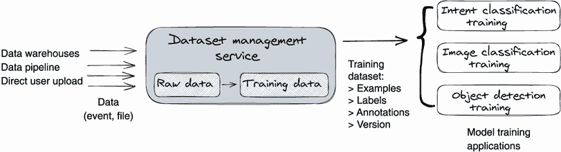

图 2.1 数据集管理服务是一个专门的数据存储；它使用自己的原始数据格式将数据导入其内部存储。在训练期间，它将原始数据转换为一致的数据格式，以便于模型训练。

### 2.1.1 深度学习系统为什么需要数据集管理

在我们开始查看示例数据集管理服务之前，让我们花一点时间解释为什么 DM 是任何深度学习系统的重要组成部分。这一部分很重要，因为根据我们的经验，除非你完全理解*为什么*，否则无法设计解决实际问题的系统。

对于为什么这个问题，有两个答案。第一，DM 可以通过将训练数据的*收集*与*使用*分离来加快模型的开发。第二，一个设计良好的 DM 服务通过对训练数据集进行版本跟踪来支持模型的可复现性。让我们详细讨论这两个观点。

解耦训练数据收集与消费

如果你完全独自开发深度学习项目，项目开发工作流程是以下步骤的迭代循环：数据收集、数据集预处理、训练和评估（见图 2.2）。虽然如果你在数据收集组件中更改数据格式，可能会破坏下游数据集预处理代码或训练代码，但这不是一个大问题。因为你是唯一的代码所有者，你可以自由更改；没有其他人受到影响。

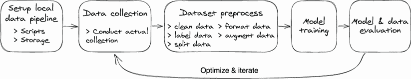

图 2.2 单人深度学习项目开发的工作流程是一系列线性步骤的迭代循环。

当我们正在构建一个面向数十个不同深度学习项目并向多人和团队开放的严肃深度学习平台时，简单的数据流程图将迅速扩张到令人困惑的 3D 图（图 2.3）。

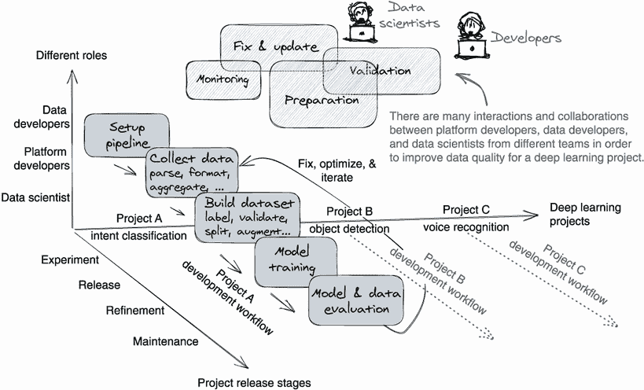

图 2.3 企业中的深度学习模型开发在多个维度上运行。多个团队合作以在不同阶段完成项目。每个团队专注于工作流程的一个步骤，同时还在多个项目上工作。

图 2.3 显示了企业深度学习开发环境的复杂性。在这种情况下，每个人只负责一个步骤而不是整个工作流程，并且他们为多个项目开发他们的工作。理想情况下，这个过程是有效的，因为人们通过专注于一个特定问题来建立他们的专业知识。但这里有个问题：通信成本经常被忽视。

当我们将工作流程的步骤（图 2.2）分配给多个团队时，需要数据模式进行握手。没有数据合同，下游团队不知道如何读取上游团队发送的数据。让我们回到图 2.3。想象一下，如果有四个团队并行开发的 10 个项目，尤其是每个团队处理工作流程的不同步骤，我们需要多少数据模式来在团队之间进行通信。

现在，如果我们想要向训练数据集添加一个新特征或属性（如文本语言），我们需要召集每个团队，在新数据格式上达成共识，并实施更改。这是一项巨大的工作，因为公司内部的跨团队协作是复杂的。通常需要几个月的时间来做出一个小改变；因为每个团队都有自己的优先事项，你必须等待他们的待办事项清单。

更糟糕的是，深度学习模型开发是一个迭代过程。它要求不断调整训练数据集（包括上游数据管道）以提高模型准确性。这需要数据科学家、数据开发人员和平台开发人员高频率地进行交互，但由于跨团队工作流程的设置，数据迭代发生缓慢，这是在生产环境中模型开发如此缓慢的原因之一。

另一个问题是，当我们同时开发多种类型的项目（图像、视频和文本）时，数据模式的数量将会激增。如果让每个团队自由定义新的数据模式，并且不进行适当管理，那么保持系统向后兼容几乎是不可能的。新数据的更新将变得越来越困难，因为我们必须花费额外的时间来确保新数据更新不会破坏过去构建的项目。因此，项目开发速度将会显著减慢。

为解决迭代缓慢和数据模式管理问题，我们可以构建一个数据集管理服务。让我们看一下图 2.4，以帮助确定引入数据集管理服务后项目开发工作流程的变化。

在图 2.4 中，我们看到一个数据集管理服务将模型开发工作流程分成了两个独立的空间：数据开发者空间和数据科学家空间。长迭代循环（图 2.2）现在被分成了两个小循环（图 2.4），每个循环由一个团队拥有，因此数据开发者和数据科学家可以分别迭代数据收集和模型训练；因此，深度学习项目可以更快地迭代。

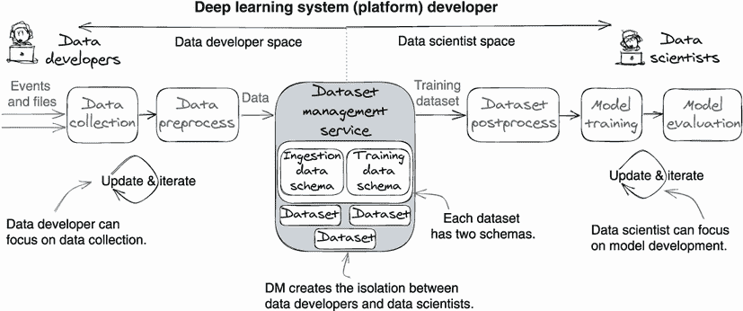

图 2.4 一个数据集管理组件通过为训练数据收集和消耗定义强类型模式，为两者之间创建了良好的分离，这使得数据开发和模型算法开发可以在自己的循环中迭代，从而加快了项目的开发速度。

你可能也注意到，现在我们把所有的数据模式都放在了一个地方：一个数据集管理服务，它管理着两种强类型的数据模式——每种类型的数据集都有一个摄取数据模式和一个训练数据模式。通过在数据转换过程中在 DM 内部进行数据摄取和训练的两个单独的数据模式，你可以确保上游数据收集中的数据更改不会破坏下游的模型训练。由于数据模式是强类型的，未来的数据升级可以轻松地保持向后兼容。

为项目定义强类型数据集可能并不是一个好主意，因为我们仍在探索各种数据选项。因此，我们还建议定义一种特殊的无模式数据集类型，例如`GENERIC`类型，它没有强类型模式限制。对于此数据集类型中的数据，DM 只接受原样数据，并且不执行数据验证和转换（有关详细示例，请参见第 2.2.6 节）。从数据处理管道中收集的数据可以直接由训练流程使用。虽然整个工作流程可能会很脆弱，但自由数据集类型满足了在早期阶段项目需要灵活性的需求。一旦项目成熟，我们可以创建强类型模式并为它们定义数据集类型。

总结本节，管理数据集类型的两个数据架构是解耦数据科学家和数据开发者的秘密武器。在第 2.2.6 节，我们将展示如何在我们的示例数据集管理服务中实现这些架构。

实现模型可重现性

一个设计良好的数据集管理服务通过在训练数据集上进行版本跟踪来支持模型可重现性，例如，使用版本字符串来获取在以前模型训练运行中使用的确切训练文件。相对于数据科学家（模型算法开发），模型可重现性的优势在于，你可以重复在某个数据集上运行深度学习算法（例如 NLP 中的自注意力变换器），并获得相同或相似质量的结果。这被称为*算法可重现性*。

从深度学习系统开发者的角度来看，模型可重现性是算法可重现性的超集。它要求数据集管理系统能够复现其输出物件（数据集）。例如，我们需要获取确切的训练数据和训练配置来复现过去训练过的模型。

模型可重现性对于机器学习项目至关重要，有两个主要原因。第一个是信任。可重现性为生成模型的系统创造了信任和可信度。对于任何系统，如果输出无法复现，人们简单地不会信任该系统。这在机器学习项目中非常相关，因为应用程序将根据模型输出做出决策——例如，聊天机器人将根据用户意图预测将用户呼叫转接到适当的服务部门。如果我们无法复现模型，构建在模型之上的应用程序是不确定性的和不可信的。

第二个原因是模型可重现性有助于性能故障排除。在检测到模型性能退化时，人们首先想要找出训练数据集和训练算法代码发生了什么变化。如果不支持模型可重现性，性能故障排除将非常困难。

### 2.1.2 数据集管理设计原则

在我们开始构建之前，我们想要概述 DM 的五个设计原则。

注意：我们认为这五个原则是本章最重要的元素。对于数据应用程序，我们在设计中遵循的原则比实际设计更重要。因为数据可能是任何形式的任何东西，在一般情况下，没有适用于所有数据处理用例的数据存储范式，也没有适用于所有数据处理用例的标准设计。因此，在实践中，我们通过遵循某些通用原则来构建我们自己的数据应用程序。因此，这些原则至关重要。

这里的五个原则将为您建立新的 DM 服务或改进现有的 DM 服务提供明确的设计目标。

原则 1：支持数据集可重现性以重现模型

数据集的可重现性意味着 DM 总是返回过去返回的完全相同的训练示例。例如，当训练团队开始训练模型时，DM 提供了一个带有版本字符串的数据集。每当训练团队——或任何其他团队——需要检索相同的训练数据时，它都可以使用此版本字符串查询 DM 以检索相同的训练数据。

我们相信所有的 DM 系统都应该支持数据集的可重现性。更好的是还能提供数据差异功能，这样我们就可以轻松地看到两个不同数据集版本之间的数据差异。这对故障排除非常方便。

原则 2：在不同类型的数据集上提供统一的 API

深度学习的数据集可能是结构化的（文本，如销售记录或用户对话的文字稿）或非结构化的（图像、语音记录文件）。无论 DM 系统如何在内部处理和存储这些不同形式的数据，它都应该为上传和获取不同类型的数据集提供统一的 API 接口。API 接口还将数据源与数据使用者抽象出来；无论发生什么情况，比如数据解析更改和内部存储格式更改，下游使用者都不应受到影响。

因此，我们的用户，包括数据科学家和数据开发人员，只需要学习一个 API 就能处理所有不同类型的数据集。这使系统简单易用。此外，由于我们只公开一个公共 API，代码维护成本将大大降低。

原则 3：采用强类型数据模式

强类型数据模式是避免由数据更改引起的意外故障的关键。通过数据模式强制执行，DM 服务可以保证其摄取的原始数据和生成的训练数据与我们的规范一致。

强类型数据模式充当安全防护，以确保下游模型训练代码不受上游数据收集更改的影响，并确保 DM 的上游和下游客户的向后兼容性。如果没有数据模式保护，则数据集使用者——下游模型训练代码——很容易受到上游数据更改的影响。

数据模式也可以进行版本控制，但这会增加管理的复杂性。另一个选项是每个数据集只有一个模式。在引入新的数据更改时，确保模式更新是向后兼容的。如果新的数据需求需要破坏性更改，则创建一个具有新模式的新数据集类型，而不是更新现有的数据集。

原则 4：确保 API 一致性并在内部处理扩展

深度学习领域的当前趋势是，随着数据集不断增大，模型架构也变得越来越复杂。例如，GPT-3（一个用于语言理解的生成预训练转换器语言模型）使用超过 250 TB 的文本材料，其中包含数百亿个单词；在特斯拉中，自动驾驶模型消耗了海量的数据，达到了 PB 级。另一方面，对于一些简单的窄领域任务（如客户支持工单分类），我们仍然使用小型数据集（约 50 MB）。数据集管理系统应该在内部解决数据扩展的挑战，并且向用户（数据开发者和数据科学家）提供的 API 对于大型和小型数据集应该是一致的。

原则 5：保证数据持久性

理想情况下，用于深度学习训练的数据集应该以不可变的方式存储，以便复现训练数据和进行故障排查。数据删除应该是软删除，只有极少数例外情况才需要进行硬删除，例如当客户选择退出或取消账户时永久删除客户数据。

### 2.1.3 数据集的矛盾性

为了结束我们关于数据集管理的概念讨论，我们想要澄清数据集一个模糊的方面。我们见过许多设计不良的数据集管理系统在这一点上失败。

数据集具有矛盾的特性：它既是动态的又是静态的。从数据科学家的角度来看，数据集是静态的：它是一组带有注释（也称为标签）的固定文件。从数据开发者的角度来看，数据集是动态的：它是一个远程存储中的文件保存目的地，我们不断向其添加数据。

因此，从数据管理的角度来看，数据集应该是一个逻辑文件组，同时满足数据收集和数据训练的需求。为了帮助您对数据集的动态和静态特性有具体的理解，让我们看一下图 2.5。

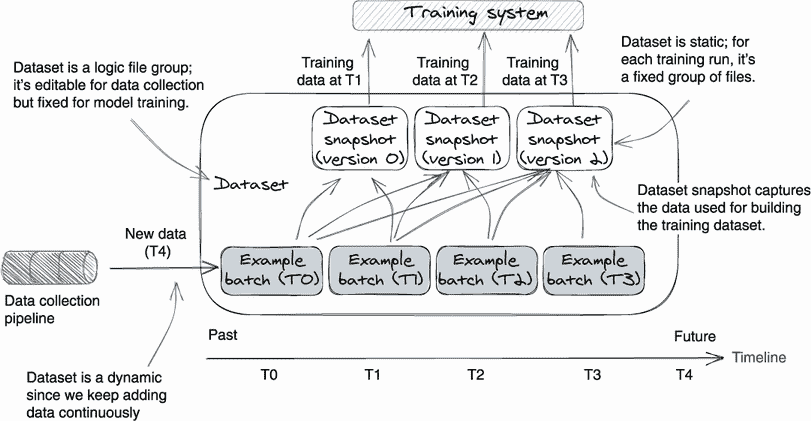

图 2.5 数据集是一个逻辑文件组：它既是动态的又是静态的，对于数据收集来说是可编辑的，但对于模型训练来说是固定的。

我们可以从数据摄入和数据获取两个角度来阅读图 2.5。首先，从数据摄入的角度来看，我们看到数据收集管道（图中左侧）不断地注入新数据，例如文本话语和标签。例如，在时间 T0，数据集中创建了一个示例数据批次（示例批次 T0）——T1、T2 和 T3 时间也是如此；随着时间的推移，我们总共创建了四个数据批次。因此，从数据开发者的角度来看，这个数据集是可变的，因为管道不断向其中添加数据。

其次，在训练数据获取方面（从图的顶部），我们可以看到在获取训练数据时，DM 同时读取数据集中的所有当前数据。我们可以看到数据以静态的版本快照方式返回，该快照具有一个版本字符串，用于唯一标识从数据集中选择的实际数据。例如，当我们从时间点 T2 的数据集中获取训练数据时，数据集有三个数据批次（批次 T0、批次 T1 和批次 T2）。我们将这三个数据批次打包成一个快照，分配一个版本字符串（“version1”）并将其作为训练数据返回。

从模型训练的角度来看，从 DM 获取的数据集是数据集的静态快照——一个经过时间过滤和客户逻辑过滤的数据集。静态快照对于模型的可复制性至关重要，因为它代表了训练过程中使用的确切训练文件。当我们需要重新构建模型时，我们可以使用快照版本字符串来找到过去模型训练中使用的快照。

我们对理论介绍已经进行了全面的介绍，您应该能够掌握数据集管理组件的需求、目标和独特特性。下一节是如何设计数据集管理服务的具体示例。

## 2.2 浏览示例数据集管理服务

在本节中，我们将带您了解一个示例 DM 服务。我们构建了这个示例，以便让您了解第 2.1.2 节中介绍的原理如何实施。我们首先在本地运行服务，与之互动，然后查看其 API 设计和内部实现。

### 2.2.1 与示例服务交互

为了方便您操作，我们构建了七个 shell 脚本来自动化整个 DM 实验室。这些 shell 脚本是本节演示场景的推荐方式，因为它们不仅自动配置本地服务，还会处理环境变量设置、准备示例数据和初始化本地网络。

您可以在[`github.com/orca3/MiniAutoML/tree/main/scripts`](https://github.com/orca3/MiniAutoML/tree/main/scripts)找到这些脚本，从搜索词“dm”开始。我们 GitHub 仓库中的“功能演示”文档([`github.com/orca3/MiniAutoML/tree/main/data-management`](https://github.com/orca3/MiniAutoML/tree/main/data-management))提供了完成实验以及这些脚本的示例输出的详细说明。

在运行功能演示之前，请确保已满足系统要求。请参考[`github.com/orca3/MiniAutoML#system-requirements`](https://github.com/orca3/MiniAutoML#system-requirements)。

这个实验室分为三个部分：首先，运行示例数据集管理服务；其次，创建一个数据集并上传数据；再次，从刚创建的数据集中获取训练数据。

在本地设置服务

示例服务是用 Java 11 编写的。它使用 MinIO 作为文件 Blob 服务器来模拟云对象存储（如 Amazon S3），因此我们可以在本地运行而无需任何远程依赖。如果您在附录 A 中设置了实验，您可以在终端中的脚本文件夹的根目录运行以下命令（列表 2.1）来启动服务。

注意在运行 DM demo 脚本之前，强烈建议从干净的设置开始。您可以执行 `./scripts/lab-999-tear-down.sh` 来清除之前的实验。

列表 2.1 在本地启动服务

```py
# (1) Start minio server
./scripts/dm-001-start-minio.sh     

# (2) start dataset management service, it will build 
➥ the dm image and run the container.
./scripts/dm-002-start-server.sh
```

为了保持服务的最简设置，我们将所有数据集记录保存在内存中，以避免使用数据库。请注意，如果重新启动数据集管理服务，你将丢失所有数据集。

创建和更新语言意图数据集

我们的示例 DM 服务为用户提供了三种 API 方法来创建/更新数据集并检查结果。这些 API 方法是 `CreateDataset`、`UpdateDataset` 和 `GetDatasetSummary`。我们将在接下来的几节中详细讨论它们。

在此示例场景中，我们首先调用数据管理服务上的 `CreateDataset` API 方法来创建一个新的语言意图数据集；然后我们使用 `UpdateDataset` API 方法向数据集追加更多数据。最后，我们使用 `GetDatasetSummary` API 方法获取数据集的统计信息和提交（数据更改）历史记录。

注意脚本 dm-003-create-dataset.sh 和 dm-004-add-commits.sh 自动化了之前的步骤。请使用它们来运行演示场景。请注意，以下代码列表仅供说明目的。

现在让我们运行实验。首先，我们将使用以下列表创建一个数据集。

列表 2.2 创建语言意图数据集

```py
mc -q cp data-management/src/test/resources/datasets/test.csv  ❶
➥ myminio/"${MINIO_DM_BUCKET}"/upload/001.csv

grpcurl -v -plaintext \                                        ❷
 -d '{"name": "dataset-1", \
      "dataset_type": "LANGUAGE_INTENT", \                     ❸
      "bucket": "mini-automl", \                               ❹
      "path": "{DATA_URL_IN_MINIO}"}' \                        ❹
 ${DM_SERVER}:${DM_PORT} \
 data_management.DataManagementService/CreateDataset           ❺
```

❶ 将原始数据（upload/001.csv）上传到云存储

❷ 创建数据集的 gRPC 请求

❸ 数据集类型

❹ MinIO 中原始数据的数据 URL，例如，upload/001.csv

❺ API 名称

应注意，`CreateDataset` API 预期用户在 gRPC 请求中提供可下载的 URL，而不是实际数据，这就是为什么我们首先将 001.csv 文件上传到本地 MinIO 服务器的原因。数据集创建完成后，`CreateDataset` API 将返回一个包含数据摘要和数据集历史提交的 JSON 对象。以下是一个示例结果：

```py
{
 "datasetId": "1", 
  "name": "dataset-1",
 "dataset_type": "TEXT_INTENT",
  "last_updated_at": "2021-10-09T23:44:00",
  "commits": [                                ❶
    {       
      "dataset_id": "1",
      "commit_id": "1",                       ❷
      "created_at": "2021-10-09T23:44",
 "commit_message": "Initial commit",
      "tags": [                               ❸
        {
          "tag_key": "category",
          "tag_value": "test set"
        }
      ],
      "path": "dataset/1/commit/1",
      "statistics": {                         ❹
        "numExamples": "5500",
        "numLabels": "151"
      }
    }
  ]
}
```

❶ 提交是数据集更新的快照。

❷ 提交 ID；此提交捕获了来自 upload/001.csv 的数据。

❸ 提交标签用于在构建训练数据集时过滤提交。

❹ 提交的数据摘要

创建数据集后，你可以通过追加更多数据来持续更新它；请参见以下的数据集更新 gRPC 请求。

列表 2.3 更新语言意图数据集

```py
mc -q cp data-management/src/test/resources/datasets/train.csv  myminio/"${MINIO_DM_BUCKET}"/upload/002.csv        ❶

grpcurl -v -plaintext \                                 ❷
 -d '{"dataset_id": "1", \                              ❸
      "commit_message": "More training data", \
      "bucket": "mini-automl", \                        ❹
      "path": "upload/002.csv", \                       ❹
      "tags": [{ \
        "tag_key": "category", \
        "tag_value": "training set\"}]}' \ 
${DM_SERVER}:${DM_PORT} \
data_management.DataManagementService/UpdateDataset     ❺
```

❶ 将原始数据（upload/002.csv）上传到云存储

❷ 请求追加更多数据（upload/002.csv）

❸ 用从 CreateDataset API 返回的值替换数据集 ID。

❹ 原始数据的数据 URL，由原始数据上传创建

❺ 更新数据集的 API 名称

一旦数据集更新完成，`UpdateDataset` API 会以与 `CreateDataset` API 相同的方式返回一个数据摘要 JSON 对象；请参考以下示例响应对象：

```py
{
  "datasetId": "1",
  "name": "dataset-1",
  "dataset_type": "TEXT_INTENT",
  "last_updated_at": "2021-10-09T23",
  "commits": [
    {
      "commit_id": "1",        ❶
       .. .. ..
    },
    {
      "dataset_id": "1",
      "commit_id": "2",        ❷
      "created_at": "2021-10-09T23:59:17",
      "commit_message": "More training data",
      "tags": [
        {
          "tag_key": "category",     
          "tag_value": "training set" 
        }
      ],
      "path": "dataset/1/commit/2",
      "statistics": {
        "numExamples": "7600",
        "numLabels": "151"
      }
    }
  ]
}
```

❶ 由创建数据集请求创建的提交

❷ 提交 ID；此提交捕获来自 upload/002.csv 的数据。

你还可以使用 `GetDatasetSummary` API 来获取数据集的数据摘要和提交历史。请参考以下示例的 gRPC 请求：

```py
grpcurl -v -plaintext 
  -d '{"datasetId": "1"}' \     ❶
${DM_SERVER}:${DM_PORT} \
data_management.DataManagementService/GetDatasetSummary
```

❶ 要查询的数据集的 ID

获取训练数据集

现在我们已经创建了一个数据集（ID = 1），包含原始数据；让我们尝试从中构建一个训练数据集。在我们的示例服务中，这是一个两步骤的过程。

我们首先调用 `PrepareTrainingDataset` API 开始数据集构建过程。然后，我们使用 `FetchTrainingDataset` API 查询数据集准备进度，直到请求完成。

注意，脚本 dm-005-prepare-dataset.sh、dm-006-prepare-partial-dataset.sh 和 dm-007-fetch-dataset-version.sh 自动化了接下来的步骤。请尝试使用它们来运行代码清单 2.4 和 2.5 中的示例数据集获取演示。

要使用 `PrepareTrainingDataset` API，我们只需提供一个数据集 ID。如果你只想让部分数据进入训练数据集，你可以在请求中使用 `tag` 作为过滤器。请参考以下的示例请求。

清单 2.4 准备训练数据集

```py
grpcurl -plaintext \                   ❶
 -d “{“dataset_id”: “1”}” \            ❶
 ${DM_SERVER}:${DM_PORT} \             ❶
data_management.DataManagementService/PrepareTrainingDataset

grpcurl -plaintext \                   ❷
 -d “{“dataset_id”: “1”, \             ❷
 “Tags”:[ \                            ❷
   {“tag_key”:”category”, \            ❸
    “tag_value”:”training set”}]}” \   ❸
 ${DM_SERVER}:${DM_PORT} data_management.DataManagementService/PrepareTrainingDataset
```

❶ 准备包含所有数据提交的训练数据集的请求

❷ 通过定义过滤标签，准备包含部分数据提交的训练数据集的请求

❸ 数据过滤器

一旦数据准备的 gRPC 请求成功，它将返回一个如下的 JSON 对象：

```py
{
  "dataset_id": "1",
  "name": "dataset-1",
  "dataset_type": "TEXT_INTENT",
  "last_updated_at": "2021-10-09T23:44:00",
  "version_hash": "hashDg==",     ❶
  "commits": [
    {                             ❷
      "commit_id": "1",           ❷
      .. .. ..                    ❷
    },                            ❷
    {                             ❷
      "commit_id": "2",           ❷
      .. .. ..                    ❷
    }                             ❷
  ]
}
```

❶ 训练数据集快照的 ID

❷ 原始数据集的选定数据提交

`PrepareTrainingDataset` API 返回的数据中包含 `"version_hash"` 字符串。它用于识别该 API 生成的数据快照。使用这个哈希作为 ID，我们可以调用 `FetchTrainingDatasetc` API 来跟踪训练数据集建立的进度；请参考以下示例。

清单 2.5 检查数据集准备进度

```py
grpcurl -plaintext \
 -d "{"dataset_id": "1", \
      "version_hash":          ❶
      "hashDg=="}" \           ❶
${DM_SERVER}:${DM_PORT} 
data_management.DataManagementService/FetchTrainingDataset
```

❶ 训练数据集快照的 ID

`FetchTrainingDatasetc` API 返回一个描述训练数据集的 JSON 对象。它告诉我们背景数据集构建过程的状态：`RUNNING`、`READY` 或 `FAILED`。如果训练数据已准备好供使用，响应对象将显示训练数据的可下载 URL 列表。在这个演示中，URL 指向本地的 MinIO 服务器。请参考以下的示例响应：

```py
{
  "dataset_id": "1",
  "version_hash": "hashDg==",
  "state": "READY",                                          ❶
  "parts": [
    {                                                        ❷
      "name": "examples.csv",                                ❷
      "bucket": "mini-automl-dm",                            ❷
      "path": "versionedDatasets/1/hashDg==/examples.csv"    ❷
    },                                                       ❷
    {                                                        ❷
      "name": "labels.csv",                                  ❷
      "bucket": "mini-automl-dm",                            ❷
      "path": "versionedDatasets/1/hashDg==/labels.csv"      ❷
    }                                                        ❷
  ],                                                         ❷
  "statistics": {
    "numExamples": "16200",
    "numLabels": "151"
  }
}
```

❶ 训练数据集的状态

❷ 训练数据的数据 URL

做得好！你刚刚体验了我们示例数据集管理服务提供的所有主要数据 API。通过尝试自己上传数据和构建训练数据集，我们希望你能感受到这项服务的用途。在接下来的几个部分，我们将查看用户场景、服务架构概览以及我们的示例数据集管理服务的代码实现。

如果在运行上述脚本时遇到任何问题，请参考我们 GitHub 仓库中“function demo”文档中的说明。另外，如果您想尝试第三章和第四章的实验，请保持容器运行，因为它们是模型训练实验的先决条件。

### 2.2.2 用户、用户场景和整体情况

在设计后端服务时，我们发现非常有用的方法是从外部到内部思考。首先，弄清楚用户是谁，服务将提供什么价值，以及客户将如何与服务进行交互。然后，内部逻辑和存储布局应该自然而然地出现。对于浏览此示例 DM 服务，我们将使用相同的方法展示给您。因此，让我们首先看看我们的用户和用户场景。

注意我们之所以首先考虑用例，是因为我们认为任何系统设计都应该最大程度地考虑用户。如果我们确定了客户如何使用系统，那么我们的效率和可扩展性的方法将自然而然地出现。如果设计是以相反的顺序进行的（首先考虑技术，其次考虑可用性），那么系统通常很难使用，因为它是为技术而设计的，而不是为客户设计的。

用户和用户场景

我们的示例 DM 服务是为两个虚构用户而构建的：建国，一名数据工程师，和朱莉娅，一名数据科学家。他们共同合作训练语言意图分类模型。

建国负责训练数据收集。他不断地从不同的数据源（如解析用户活动日志和进行客户调查）中收集数据并对其进行标记。建国使用 DM 数据摄取 API 创建数据集，将新数据附加到现有数据集中，并查询数据集的摘要和状态。

朱莉娅使用建国构建的数据集来训练意图分类模型（通常使用 PyTorch 或 TensorFlow 编写）。在训练时，朱莉娅的训练代码将首先调用 DM 服务的获取训练数据 API 从 DM 获取训练数据集，然后开始训练过程。

服务的整体架构

我们的示例 DM 服务分为三层：数据摄取层、数据集获取层和数据集内部存储层。数据摄取 API 集是为了让建国能够上传新的训练数据并查询数据集状态而构建的。数据集获取 API 是为了让朱莉娅能够获取训练数据集。有关整体情况，请参见图 2.6 和图 2.7。

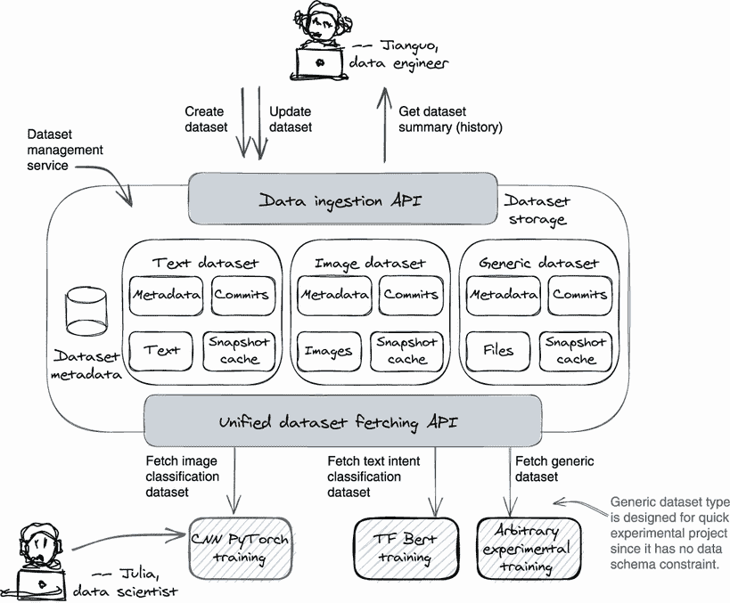

图 2.6 示例数据集管理服务的系统概述。该示例服务包含三个主要组件，即数据摄取 API、内部存储和数据集获取 API。

图 2.6 的中心大框显示了我们样本数据集管理服务的整体设计。它有一个内部数据集存储系统和两个面向公众的接口：一个用于数据摄入的数据摄入 API 和一个用于数据集获取的数据集获取 API——一个用于数据摄入，另一个用于数据集获取。该系统支持强类型架构数据集（文本和图像类型）和非架构数据集（`GENERIC`类型）。

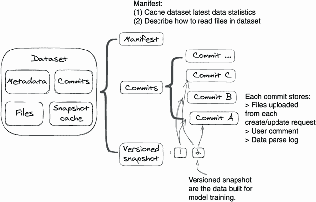

图 2.7 用于存储数据集的内部存储结构

图 2.7 显示了样本 DM 服务用于存储数据集的整体数据结构。提交是由数据摄入 API 创建的，版本化的快照是由数据获取 API 创建的。提交和版本化快照的概念被引入以应对数据集的动态和静态特性。我们将在第 2.2.5 节详细讨论存储。

在接下来的小节中，我们将逐个详细介绍前两个图表中的每个细节，从 API 开始，然后转向内部存储和数据架构。

### 2.2.3 数据摄入 API

数据摄入 API 允许在样本数据集管理服务中创建、更新和查询数据集。图 2.8 中的灰色框显示了数据摄入层中支持将数据摄入到 DM 中的四种服务方法的定义。它们的名称不言自明；让我们在列表 2.6 中查看它们的 gRPC 方法定义。

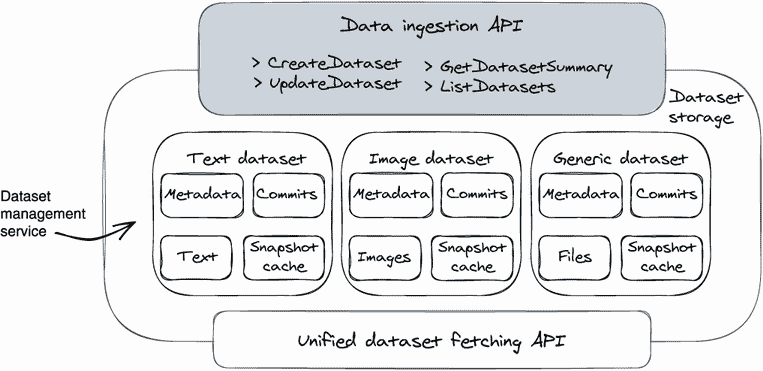

图 2.8 支持数据摄入的四种方法：创建数据集、更新数据集、获取数据集摘要和列出数据集

注意：为了减少样板代码，我们选择了 gRPC 来实现样本 DM 服务的公共接口。这并不意味着 gRPC 是数据集管理服务的最佳方法，但与 RESTful 接口相比，gRPC 的简洁编码风格非常适合演示我们的想法，而不会让您接触到不必要的 Spring 框架细节。

数据摄入方法定义

让我们看看我们的样本数据摄入 API 是什么样子的。

列表 2.6 数据摄入 API 服务定义

```py
# create a new dataset and save data into it
rpc CreateDataset (CreateDatasetRequest) returns (DatasetSummary);

# add new data to an existing dataset 
rpc UpdateDataset (CreateCommitRequest) returns (DatasetSummary);

# get summary and history of a given dataset
rpc GetDatasetSummary (DatasetPointer) returns (DatasetSummary);

# list all existing datasets’ summary
rpc ListDatasets (ListQueryOptions) returns (stream DatasetSummary);

message CreateDatasetRequest {
 string name = 1;
 string description = 2;
 DatasetType dataset_type = 3;   ❶
 string bucket = 4;              ❷
 string path = 5;                ❷
 repeated Tag tags = 6;          ❸
}
```

❶ 定义数据集类型，为"TEXT_INTENT"或"GENERIC"

❷ 定义了在 MinIO 服务器中上传数据的文件 URL。

❸ 通过使用标签设置数据过滤器。

注意：本示例服务不涵盖数据删除和修改的主题，但该服务可以轻松扩展以支持这些功能。

数据 URL 与数据流

在我们的 API 设计中，您可能会注意到我们要求用户提供数据 URL 作为原始数据输入，而不是直接将文件上传到我们的服务。在第 2.2.4 节中，我们还选择将数据 URL 作为训练数据集返回，而不是通过流式传输端点直接返回文件。主要原因是我们希望将文件传输工作卸载到云对象存储服务（如 Amazon S3 或 Azure Blob）。这样做有两个好处：首先，它节省了网络带宽，因为客户端和服务之间没有实际的文件传递；其次，它降低了代码复杂性，因为在文件较大且 API 使用量较高时，保持数据流工作的高可用性可能会更加复杂。

创建新的数据集

让我们来看看 gRPC `CreateDataset` 方法是如何实现的。在调用 DM（`createDataset` API）创建数据集之前，用户（Jianguo）需要准备一个可下载的 URL，用于上传他们想要的数据（步骤 1 和 2）；这个 URL 可以是云对象存储服务中的可下载链接，如 Amazon S3 或 Azure Blob。在我们的示例服务中，我们使用 MinIO 服务器在本地模拟 Amazon S3。Jianguo 还可以在数据集创建请求中命名数据集并分配标签。清单 2.7 突出显示了代码（`dataManagement/DataManagementService .java`）的关键部分，它实现了图 2.9 中所示的工作流程。

清单 2.7 是新数据集创建的实现

```py
public void createDataset(CreateDatasetRequest request) {

  int datasetId = store.datasetIdSeed.incrementAndGet();      ❶

  Dataset dataset = new Dataset(                              ❷
    datasetId, request.getName(),                             ❷
    request.getDescription(),                                 ❷
    request.getDatasetType());                                ❷
  int commitId = dataset.getNextCommitId();                   ❷

  CommitInfo.Builder builder = DatasetIngestion               ❸
    .ingest(minioClient, datasetId, commitId,                 ❸
    request.getDatasetType(), request.getBucket(),            ❸
    request.getPath(), config.minioBucketName);               ❸

  store.datasets.put(Integer.toString(datasetId), dataset);   ❹
  dataset.commits.put(commitId, builder                       ❹
    .setCommitMessage("Initial commit")                       ❹
    .addAllTags(request.getTagsList()).build());              ❹

  responseObserver.onNext(dataset.toDatasetSummary());        ❺
  responseObserver.onCompleted();                             ❺
}
```

❶接收数据集创建请求（步骤 3）

❷使用用户请求中的元数据创建数据集对象（步骤 4a）

❸从 URL 下载数据并将其上传到 DM 的云存储（步骤 4b）

❹将具有下载数据的数据集保存为初始提交（步骤 5）

❺将数据集摘要返回给客户端（步骤 6 和 7）

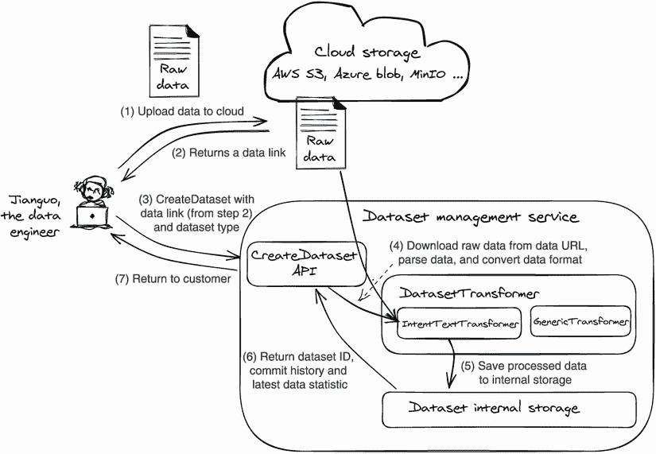

图 2.9 是创建新数据集的七个步骤的高级概述：（1）将数据上传到云对象存储；（2）获取数据链接；（3）调用`createDataset` API，并将数据链接作为有效负载；（4）DM 首先从数据链接下载数据，然后找到正确的数据集转换器（`IntentTextTransformer`）来进行数据解析和转换；（5）DM 保存转换后的数据；（6 和 7）DM 将数据集摘要（ID，提交历史，数据统计）返回给用户。

`DatasetIngestion.ingest()`的具体实现细节将在第 2.2.5 节中讨论。

更新现有数据集

深度学习模型的开发是一个持续的过程。一旦我们为模型训练项目创建了一个数据集，数据工程师（比如 Jianguo）将继续向其中添加数据。为了满足这个需求，我们提供了`UpdateDataset` API。

要使用`UpdateDataset` API，我们需要为新数据准备一个数据 URL。我们还可以传递提交消息和一些客户标签来描述数据的更改；这些元数据对于数据历史记录和数据过滤非常有用。

数据集更新工作流程与数据集创建工作流程几乎相同（图 2.9）。它使用给定数据创建一个新的提交，并将提交附加到数据集的提交列表中。唯一的区别是数据集更新工作流程不会创建新的数据集，而是在现有数据集上工作。请参阅以下代码清单。

注意 每次数据集更新都保存为提交，如果建国错误地将一些标记错误的数据上传到数据集中，我们可以很容易地使用一些数据集管理 API 删除或软删除这些提交。由于空间限制，这些管理 API 没有讨论。

列表 2.8 数据集更新实现

```py
public void updateDataset(CreateCommitRequest request) {

  String datasetId = request.getDatasetId();   ❶

  Dataset dataset = store.datasets             ❷
    .get(datasetId);                           ❷
  String commitId = Integer.toString(dataset   ❷
    .getNextCommitId());                       ❷

 // the rest code are the same as listing 2.7
  .. .. .. 
}
```

❶ 接收数据集创建请求（步骤 3）

❷ 查找现有数据集并创建新的提交对象（步骤 4a）

在第 2.2.3 节，我们将更多地讨论提交的概念。目前，你只需知道每个数据集更新请求都会创建一个新的提交对象。

注意 为什么要将数据更新保存在提交中？我们能否将新数据与当前数据合并，以便只存储最新状态？在我们的更新数据集实现中，每次调用`UpdateDataset` API 时，我们都会创建一个新的提交。我们要避免就地数据合并有两个原因：首先，就地数据合并可能导致不可逆转的数据修改和悄悄的数据丢失。其次，为了重现过去使用的训练数据集，我们需要确保 DM 接收的数据批次是不可变的，因为它们是我们随时用来创建训练数据集的源数据。

列出数据集并获取数据集摘要

除了`CreateDataset`和`UpdateDataset` API 外，我们的用户还需要方法来列出现有数据集并查询数据集的概述，例如数据集的示例数和标签数以及其审计历史记录。为满足这些需求，我们构建了两个 API：`ListDatasets`和`GetDatasetSummary`。第一个 API 可以列出所有现有的数据集，而第二个 API 提供了有关数据集的详细信息，例如提交历史记录、示例和标签计数以及数据集 ID 和类型。这两个 API 的实现很简单；你可以在我们的 Git 仓库中找到它们（`miniAutoML/DataManagementService.java)`。

### 2.2.4 训练数据集获取 API

在本节中，我们将看一下数据集获取层，它在图 2.10 中被标记为灰色方框。为了构建训练数据，我们设计了两个 API。数据科学家（朱莉娅）首先调用`PrepareTrainingDataset` API 发出训练数据准备请求；我们的 DM 服务将启动一个后台线程来开始构建训练数据，并返回一个版本字符串作为训练数据的参考句柄。接下来，朱莉娅可以调用`FetchTrainingDataset` API 来获取训练数据，如果后台线程已完成。

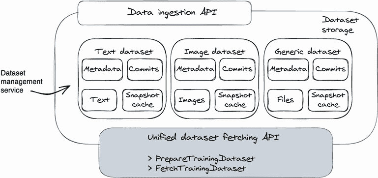

图 2.10 数据集获取层中支持数据集获取的两种方法：`PrepareTrainingDataset`和`FetchTrainingDataset`

数据集获取方法的定义

首先，让我们看一下 gRPC 服务方法定义（`grpc-contract/src/main/proto/ data_management.proto`）中的两个数据集获取方法——`PrepareTrainingDataset` 和 `FetchTrainingDataset`。

列表 2.9 训练数据集获取服务定义

```py
rpc PrepareTrainingDataset (DatasetQuery)     ❶
  returns (DatasetVersionHash);               ❶

rpc FetchTrainingDataset (VersionHashQuery)   ❷
  returns (VersionHashDataset);               ❷

message DatasetQuery {                        ❸
 string dataset_id = 1;                       ❹
 string commit_id = 2;                        ❺
 repeated Tag tags = 3;                       ❻
}

message VersionHashQuery {                    ❼
 string dataset_id = 1; 
 string version_hash = 2;                     ❽
}
```

❶ 准备训练数据集 API

❷ 获取训练数据集 API

❸ 数据集准备 API 的有效载荷

❹ 指定要构建训练数据的数据集

❺ 指定要构建训练数据的数据集的提交，可选

❻ 按提交标签过滤数据，可选

❼ 训练数据集获取 API 的有效载荷

❽ 版本哈希字符串代表训练数据集快照。

为什么我们需要两个 API（两个步骤）来获取数据集

如果我们只发布一个用于获取训练数据的 API，则调用者需要在后端数据准备完成后等待 API 调用，以获取最终的训练数据。如果数据准备需要很长时间，则此请求将超时。

深度学习数据集通常很大（以 GB 为单位）；进行网络 I/O 数据传输和本地数据聚合可能需要几分钟或几小时。因此，获取大型数据的常见解决方案是提供两个 API——一个用于提交数据准备请求，另一个用于查询数据状态，并在请求完成时拉取结果。通过这种方式，数据集获取 API 的性能始终如一，无论数据集的大小如何。

发送准备训练数据集请求

现在让我们看一下 `PrepareTrainingDataset` API 的代码工作流程。图 2.11 显示了我们的示例服务如何处理 Julia 的准备训练数据集请求。

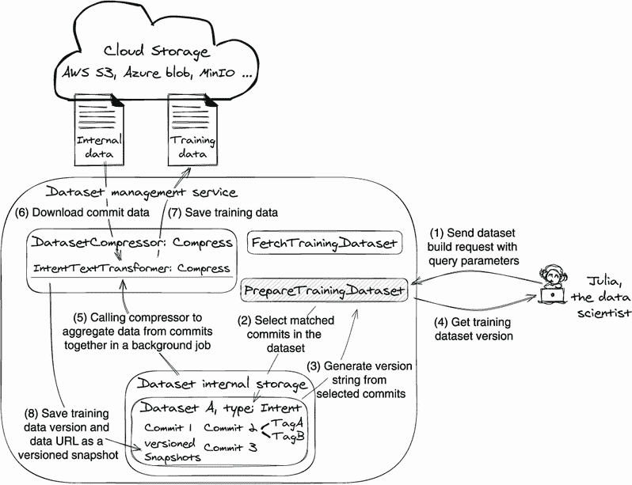

图 2.11 对应数据集构建请求的八个步骤的高层概述：（1）用户提交具有数据过滤器的数据集准备请求；（2）DM 从满足数据过滤器的提交中选择数据；（3 和 4）DM 生成表示训练数据的版本字符串；以及（5-8）DM 启动后台作业以生成训练数据。

当 DM 收到数据集准备请求（图 2.11，步骤 1）时，它执行三个动作：

+   尝试使用给定的数据集 ID 在其存储中查找数据集。

+   将给定的数据过滤器应用于从数据集中选择提交。

+   创建 `versionedSnapshot` 对象以跟踪内部存储中的训练数据（`versionHashRegistry`）。`versionedSnapshot` 对象的 ID 是从所选提交的 ID 列表生成的哈希字符串。

`versionedSnapshot` 对象是 Julia 想要的训练数据集；它是从所选提交中的不可变静态文件组成的。在步骤 3 返回哈希字符串（快照 ID）后，Julia 可以使用它来查询数据集准备状态，并在训练数据集准备好时获取数据可下载的 URL。使用此版本字符串，Julia 可以始终从将来的任何时间获取相同的训练数据（`versionedSnapshot`），这就是支持数据集可重现性的方式。

`versionedSnapshot`的一个副产品是它可以在不同的`PrepareTrainingDataset` API 调用之间用作缓存。如果快照 ID（一系列提交的哈希字符串）已经存在，我们将返回现有的`versionedSnapshot`而不重建相同的数据，这可以节省计算时间和网络带宽。

注意 在我们的设计中，数据过滤发生在提交级别，而不是在个别示例级别；例如，在准备请求中使用过滤标记`"DataType=Training"`表明用户只希望从标记为`"DataType=Training"`的提交中获取数据。

第 3 步之后，DM 将生成一个后台线程来构建训练数据集。在后台作业中，DM 将从 MinIO 服务器下载每个数据集提交的文件到本地，将其聚合并压缩成一个预定义格式的文件，并将其上传回 MinIO 服务器的不同存储桶中（步骤 6 和 7）。接下来，DM 将在`versionedSnapshot`对象中放置实际训练数据的数据 URL，并将其状态更新为`"READY"`（步骤 8）。现在 Julia 可以从返回的`versionedSnapshot`对象中找到数据 URL 并开始下载训练数据。

我们还没有涉及的是数据模式。在数据集管理服务中，我们将摄取的数据（`commit`）和生成的训练数据（`versionedSnapshot`）保存在两种不同的数据格式中。数据合并操作（图 2.11，步骤 6 和 7）将原始摄取的数据（所选提交）聚合并将其转换为意图分类训练数据模式中的训练数据。我们将在 2.2.6 节详细讨论数据模式。列表 2.10 突出显示了图 2.11 中实现的代码。

列表 2.10 准备训练数据请求 API

```py
public void prepareTrainingDataset(DatasetQuery request) {
 # step 1, receive dataset preparation request
  Dataset dataset = store.datasets.get(datasetId);
  String commitId;
  .. .. ..
  # step 2, select data commits by checking tag filter
  BitSet pickedCommits = new BitSet();
  List<DatasetPart> parts = Lists.newArrayList();
  List<CommitInfo> commitInfoList = Lists.newLinkedList();
  for (int i = 1; i <= Integer.parseInt(commitId); i++) {
    CommitInfo commit = dataset.commits.get(Integer.toString(i));
    boolean matched = true;
    for (Tag tag : request.getTagsList()) {
      matched &= commit.getTagsList().stream().anyMatch(k -> k.equals(tag));
    }
    if (!matched) {
      continue;
    }
    pickedCommits.set(i);
    commitInfoList.add(commit);
    .. .. ..
  }

 # step 3, generate version hash from the selected commits list
  String versionHash = String.format("hash%s", 
    Base64.getEncoder().encodeToString(pickedCommits.toByteArray()));

  if (!dataset.versionHashRegistry.containsKey(versionHash)) {
    dataset.versionHashRegistry.put(versionHash,      ❶
      VersionedSnapshot.newBuilder()                  ❶
        .setDatasetId(datasetId)                      ❶
        .setVersionHash(versionHash)                  ❶
        .setState(SnapshotState.RUNNING).build());    ❶

 # step 5,6,7,8, start a background thread to aggregate data 
 # from commits to the training dataset     
    threadPool.submit(
      new DatasetCompressor(minioClient, store, datasetId,
        dataset.getDatasetType(), parts, versionHash, config.minioBucketName));
   }

 # step 4, return hash version string to customer
  responseObserver.onNext(responseBuilder.build());
  responseObserver.onCompleted();
}
```

❶ 创建 VersionedSnapshot 对象以表示训练数据集

获取训练数据集

一旦 DM 服务收到了`prepareTrainingDataset` API 上的训练数据准备请求，它将生成一个后台作业来构建训练数据，并返回一个`version_hash`字符串用于跟踪目的。Julia 可以使用`FetchTrainingDataset` API 和`version_hash`字符串来查询数据集构建进度，并最终获取训练数据。图 2.12 展示了 DM 中如何处理数据集获取请求。

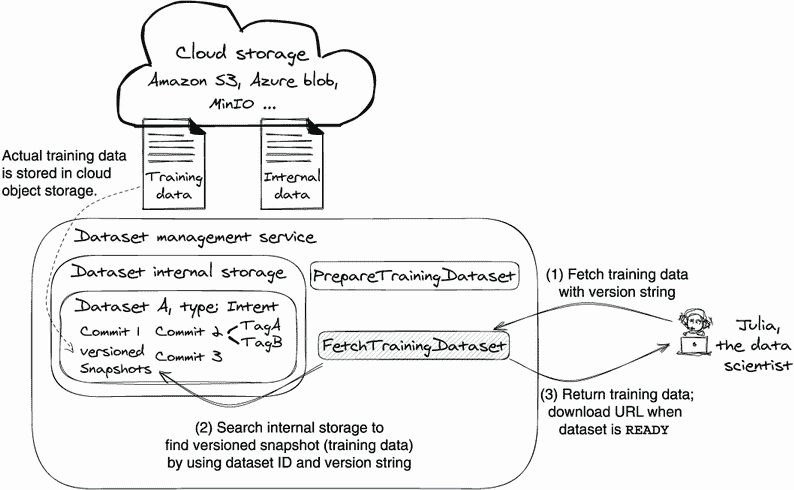

图 2.12 数据集获取请求服务的三个步骤的高级概述：（1）用户使用数据集 ID 和版本字符串调用`FetchTrainingDataset` API；（2）DM 将在其内部存储中搜索数据集的`versionHashRegistry`并返回一个`versionedSnapshot`对象；（3）当数据准备作业完成时，`versionedSnapshot`对象将具有一个下载 URL。

获取训练数据集本质上是查询训练数据准备请求的状态。对于每个数据集，DM 服务都会创建一个`versionedSnapshot`对象来跟踪`prepareTrainingDataset`请求生成的每个训练数据集。

当用户发送获取数据集查询时，我们只需在请求中使用哈希字符串来搜索其对应的`versionedSnapshot`对象在数据集的训练快照（`versionHashRegistry`）中是否存在，如果存在则将其返回给用户。`versionedSnapshot`对象将由后台训练数据处理作业（图 2.11，步骤 5–8）不断更新。当作业完成时，它将训练数据 URL 写入`versionedSnapshot`对象；因此，用户最终获取训练数据。请参见以下清单中的代码实现。

清单 2.11 准备训练数据请求 API

```py
public void fetchTrainingDataset(VersionQuery request) {
  String datasetId = request.getDatasetId(); 
  Dataset dataset = store.datasets.get(datasetId); 

  if (dataset.versionHashRegistry.containsKey(   ❶
      request.getVersionHash())) {               ❶

    responseObserver.onNext(

      dataset.versionHashRegistry.get(           ❷
 request.getVersionHash()));                ❷
    responseObserver.onCompleted();
  } 
  .. .. .. 
}
```

❶ 在数据集的训练快照中搜索`versionedSnapshot`

❷ 返回`versionedSnapshot`；其中包含了数据集准备的最新进展。

### 2.2.5 内部数据集存储

示例服务的内部存储仅是一组内存中的数据集对象。之前我们讨论了数据集既可以是动态的又可以是静态的。一方面，数据集是一个逻辑文件组，随着不断地从各种来源吸收新数据而动态变化。另一方面，它是静态的且可重现的用于训练。

为了展示这个概念，我们设计了每个数据集，其中包含提交列表和版本化快照列表。提交代表动态摄入的数据：通过数据摄入调用（`CreateDataset` 或 `UpdateDataset`）添加的数据；提交还具有标签和注释目的的消息。版本化快照代表静态训练数据，由准备训练数据集请求（`PrepareTrainingDataset`）产生，从所选提交列表转换而来。每个快照都与一个版本相关联；一旦构建了训练数据集，您可以使用该版本字符串随时获取相应的训练数据（`FetchTrainingDataset`）以供重用。图 2.13 可视化了数据集的内部存储结构。

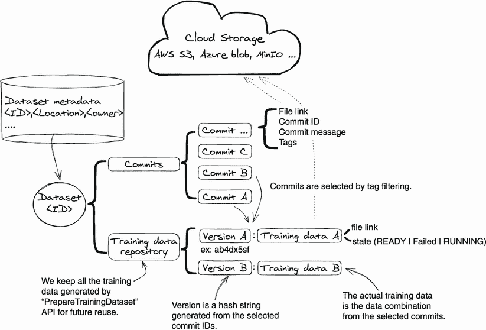

图 2.13 内部数据集存储概述。数据集存储两种类型的数据：用于摄入原始数据的提交和用于训练数据集的版本快照。数据集元数据和数据 URL 存储在数据集管理服务中，实际数据存储在云对象存储服务中。

注意虽然不同类型的数据集的各个训练示例可以采用不同的形式，例如图像、音频和文本句子，但数据集的操作（创建、更新和查询数据集摘要）以及其动态/静态特性是相同的。由于我们在所有数据集类型上设计了统一的 API 集，我们可以使用统一的存储结构来存储所有不同类型的数据集。

在我们的存储中，实际文件（提交数据、快照数据）存储在云对象存储（如 Amazon S3）中，我们只在我们的 DM 系统中保留数据集元数据（稍后解释）。通过卸载文件存储工作并仅跟踪文件链接，我们可以专注于组织数据集并跟踪其元数据，例如编辑历史、数据统计、训练快照和所有权。

数据集元数据

我们将数据集元数据定义为除了实际数据文件以外的所有内容，例如数据集 ID、数据所有者、变更历史（审计）、训练快照、提交、数据统计等等。

为了演示目的，我们将数据集的元数据存储在一个内存字典中，以 ID 作为键，并将所有数据文件放入 MinIO 服务器。但您可以扩展它以使用数据库或 NoSQL 数据库来存储数据集的元数据。

到目前为止，我们已经讨论了数据集存储概念，但实际的数据集写入和读取是如何工作的呢？我们如何序列化不同数据集类型（例如`GENERIC`和`TEXT_INTENT`类型）的提交和快照？

在存储后端实现中，我们使用简单的继承概念来处理不同数据集类型的文件操作。我们定义了一个`DatasetTransformer`接口如下：`ingest()`函数将输入数据保存到内部存储作为提交，`compress()`函数将来自选定提交的数据合并为版本快照（训练数据）。

更具体地说，对于“`TEXT_INTENT`”类型的数据集，我们有`IntentTextTransformer`来应用文件转换的强类型模式。对于“`GENERIC`”类型的数据集，我们有`GenericTransformer`将数据保存在原始格式中，没有任何检查或格式转换。图 2.14 说明了这些。

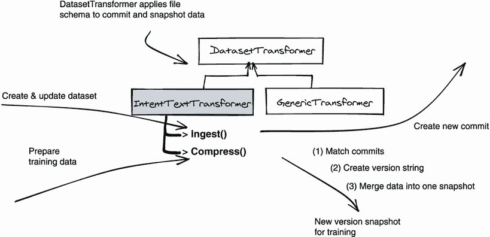

图 2.14 实现`DatasetTransformer`接口来处理不同的数据集类型；实现 ingest 函数将原始输入数据保存为提交；实现 compress 函数将提交数据聚合为训练数据。

从图 2.14 可以看出，通过数据摄取 API（第 2.2.3 节）保存的原意图分类数据由`IntentTextTransformer:Ingest()`保存为提交；通过训练数据集提取 API（第 2.2.4 节）生成的意图分类训练数据由`IntentTextTransformer:Compress()`保存为版本化的快照。因为它们是纯 Java 代码，我们留给您自己去发现；您可以在我们的 Git 存储库中找到实现代码（org/orca3/miniAutoML/dataManagement/transformers/IntentTextTransformer.java）。

### 2.2.6 数据模式

到目前为止，我们已经看到了所有的 API、工作流程和内部存储结构。现在让我们来考虑 DM 服务中的数据是什么样子的。对于每一种强类型数据集，例如“`TEXT_INTENT`”数据集，我们定义了两种数据模式：一种用于数据摄取，一种用于训练数据提取（图 2.15）。

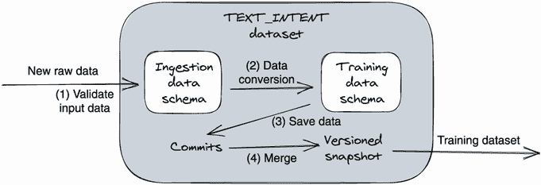

图 2.15 每一种类型的数据集都有两个数据模式：摄取数据模式和训练数据模式。这两个模式将确保我们接受的数据和我们生成的数据都遵循我们的数据规范。

图 2.15 显示了 DM 服务如何使用两个数据模式来实现其数据合同。步骤 1 使用摄取数据模式验证原始输入数据；步骤 2 使用训练数据模式将原始数据转换为训练数据格式；步骤 3 将转换后的数据保存为一个提交；步骤 4 在构建训练数据集时将选定的提交合并为一个版本化的快照，但仍然遵循训练数据模式。

这两个不同的数据模式是 DM 服务提供给我们两个不同用户（Jianguo 和 Julia）的数据合同。无论 Jianguo 如何收集数据，它都需要转换为摄入数据格式以插入到 DM 中。或者，由于 DM 保证输出的训练数据遵循训练数据模式，Julia 可以放心地使用数据集，而不用担心 Jianguo 所做的数据收集更改会影响到她。

一个数据摄入模式

我们已经了解了数据模式的概念，现在让我们来看看我们为`TEXT_INTENT`数据集定义的摄入数据模式：

```py
>> TEXT_INTENT dataset ingestion data schema
<text utterance>, <label>,<label>,<label>, ...
```

为了简化起见，我们的数据摄入模式要求`TEXT_INTENT`数据集的所有输入数据必须以 CSV 文件格式提供。第一列是文本话语，其余列是标签。请参考以下示例 CSV 文件：

```py
“I am still waiting on my credit card”, activate_my_card      ❶
➥ ;card_arrival                                              ❶
“I couldn’t purchase gas in Costco”, card_not_working
```

❶ 标签

训练数据集的模式

对于`TEXT_INTENT`训练数据，我们的模式将输出数据定义为一个包含两个文件的压缩文件：examples.csv 和 labels.csv。labels.csv 定义了标签名称到标签 ID 的映射，而 examples.csv 定义了训练文本（话语）到标签 ID 的映射。请参考以下示例：

```py
examples.csv: <text utterance>, <label_id>,<label_id>, ...
“I am still waiting on my credit card”, 0;1
“I couldn’t purchase gas in Costco”, 2

Labels.csv: <label_id>, <label_name>
0, activate_my_card
1, card_arrival
2, card_not_working
```

为什么我们使用自定义的数据结构

我们使用自定义的数据模式来构建`TEXT_INTENT`，而不是使用 PyTorch 或 Tensorflow 数据集格式（如 TFRecordDataset）来创建与模型训练框架的抽象。

选择一个特定于框架的数据集格式，你的训练代码也需要用该框架编写，这并不理想。引入自定义的中间数据集格式可以使 DM 框架中立，因此不需要特定于框架的训练代码。

一个数据集中有两个强类型的数据模式的好处

通过在数据集中使用两个强类型的数据模式，并且让 DM 将数据从摄取的数据格式转换为训练数据格式，我们可以并行开发数据收集和训练代码开发。例如，当 Jianguo 想要向`TEXT_INTENT`数据集添加一个新特征——“文本语言”时，他可以与 DM 服务开发人员合作更新数据摄入模式以添加一个新的数据字段。

Julia 不会受到影响，因为训练数据模式没有改变。当 Julia 有带宽来消费她训练代码中的新功能时，她可能会后来向我们更新训练数据模式。关键是，Jianguo 和 Julia 不必同步工作来引入新的数据集增强；他们可以独立工作。

注意：为了简单起见和演示目的，我们选择使用 CSV 文件来存储数据。使用纯 CSV 文件的问题在于它们缺乏向后兼容性支持和数据类型验证支持。在生产环境中，我们建议使用 Parquet、Google protobuf 或 Avro 来定义数据模式和存储数据。它们带有一组用于数据验证、数据序列化和模式向后兼容性支持的库。

通用数据集：没有模式的数据集

尽管我们在多个地方强调定义强类型数据集模式对数据集管理服务是基础性的，但在这里我们将例外情况添加了一个自由格式的数据集类型——`GENERIC`数据集。与强类型 TEXT_ INENT 数据集不同，`GENERIC`类型数据集没有数据模式验证。我们的服务将任何原始输入数据保存原样，并在构建训练数据时，服务只是将所有原始数据按其原始格式打包到训练数据集中。

一个`GENERIC`数据集类型听起来可能不是一个好主意，因为我们基本上将来自上游数据源的任何数据传递给下游训练应用程序，这很容易破坏训练代码中的数据解析逻辑。这绝对不是一个生产选项，但它为实验项目提供了所需的灵活性。

尽管强类型数据模式提供了良好的数据类型安全保护，但需要付出维护的代价。当您不得不在 DM 服务中频繁进行模式更改以采用新的实验所需的新数据格式时，这是相当烦人的。

在深度学习项目开始时，有很多事情是不确定的，比如哪种深度学习算法效果最好，我们可以收集到什么样的数据，以及我们应该选择什么样的数据模式。为了解决所有这些不确定性，我们需要一种灵活的方式来处理任意数据，以启用模型训练实验。这就是`GENERIC`数据集类型设计的目的。

一旦业务价值得到证明，并选择了深度学习算法，我们现在清楚了训练数据的样子；然后是时候在数据集管理服务中定义一个强类型数据集了。在接下来的部分中，我们将讨论如何添加一个新的强类型数据集。

### 2.2.7 添加新的数据集类型（IMAGE_CLASS）

让我们假设有一天，朱莉娅（平台开发者之一）要求我们将她的实验性图像分类项目提升为正式项目。朱莉娅和她的团队正在使用 `GENERIC` 数据集开发图像分类模型，并且因为他们取得了良好的结果，现在他们想要定义一个强类型数据集（`IMAGE_CLASS`）来稳定原始数据收集和训练数据消费的数据模式。这将保护训练代码免受未来数据集更新的影响。

要添加一个新的数据集类型——`IMAGE_CLASS`，我们可以按照三个步骤进行。首先，我们必须定义训练数据格式。在与朱莉娅讨论后，我们决定由 `FetchTrainingDataset` API 生成的训练数据将是一个 zip 文件；它将包含以下三个文件：

```py
>> examples.csv: <image filename>,<label id>
“imageA.jpg”, 0
“imageB.jpg”, 1
“imageC.jpg”, 0

>> labels.csv: <label id>,<label name>
0, cat
1, dog

>> examples/ - folder
imageA.jpg
imageB.jpg
imageC.jpg
```

examples.csv 和 labels.csv 文件是定义每个训练图像标签的清单文件。实际图像文件存储在 examples 文件夹中。

其次，定义摄取数据格式。我们需要与收集图像并为其标记标签的数据工程师建国讨论摄取数据架构。我们一致同意，每个 `CreateDataset` 和 `UpdateDataset` 请求的有效负载数据也是一个 zip 文件；其目录如下所示：zip 文件应该是只包含子目录的文件夹。根文件夹下的每个子目录代表一个标签；其下的图像属于此标签。子目录应只包含图像，而不包含任何嵌套目录：

```py
├── cat
│   ├── catA.jpg
│   ├── catB.jpg
│   └── catC.jpg
└── dog
    ├── dogA.jpg
    ├── dogB.jpg
    └── dogC.jpg
```

最后一步是代码更改。在心中有两种数据模式之后，我们需要创建一个实现了 `DatasetTransformer` 接口的 `ImageClassTransformer` 类来构建数据读取和写入逻辑。

我们首先实现 `ImageClassTransformer.ingest()` 函数。逻辑需要使用第 2 步中定义的输入数据格式来解析数据集创建和更新请求中的输入数据，然后将输入数据转换为训练数据格式并将其保存为数据集的提交。

然后，我们实现 `ImageClassTransformer.compress()` 函数，它首先通过匹配数据过滤器选择提交，然后将匹配的提交合并为单个训练快照。最后一步，我们将 `ImageClassTransformer.ingest()` 函数注册到 `DatasetIngestion.ingestion()` 函数中，类型为 `IMAGE_CLASS`，并将 `ImageClassTransformer.compress()` 注册到 `DatasetCompressor.run()` 函数中，类型为 `IMAGE_CLASS`。

如你所见，通过合适的数据集结构，我们只需添加几个新的代码片段就能支持新的数据集类型。现有的数据集类型和公共数据摄取及获取 API 不会受到影响。

### 2.2.8 服务设计总结

让我们回顾一下这个示例数据集管理服务是如何满足第 2.1.2 节介绍的五项设计原则的：

+   *原则 1*—支持数据集可重现性。我们的示例 DM 服务将所有生成的训练数据保存为带有版本哈希字符串的版本化快照，用户可以随时应用该版本字符串来获取训练数据快照。

+   *原则 2*—为不同的数据集类型提供统一的体验。数据摄取 API 和训练数据获取 API 对所有数据集类型和大小的工作方式相同。

+   *原则 3*—采用强类型数据架构。我们的示例 TEXT_INENT 类型和 `IMAGE_CLASS` 类型数据集对原始摄取数据和训练数据都应用自定义数据架构。

+   *原则 4*—确保 API 一致性并在内部处理扩展。尽管我们在示例代码中将所有数据集的元数据保存在内存中（为了简单起见），但我们可以轻松地在云对象存储中实现数据集存储结构；理论上，它具有无限的容量。此外，我们要求数据 URL 用于发送数据和返回数据，因此无论数据集有多大，我们的 API 都保持一致。

+   *原则 5*—保证数据持久性。每个数据集创建请求和更新请求都会创建一个新的提交；每个训练数据准备请求都会创建一个版本化的快照。提交和快照都是不可变的，并且不受数据到期限制的持久存在。

注意 我们从示例数据集管理服务中删除了许多重要功能，以保持简单性。管理 API，例如允许您删除数据，还原数据提交以及查看数据审计历史记录。欢迎 fork 该存储库并尝试实现它们。

## 2.3 开源方法

如果您有兴趣采用开源方法来设置数据集管理功能，我们为您选择了两种方法：Delta Lake 和 Pachyderm。让我们分别来看看它们。

### 2.3.1 Delta Lake 和 Petastorm 与 Apache Spark 家族

在这种方法中，我们建议将数据保存在 Delta Lake 表中，并使用 Petastorm 库将表数据转换为 PyTorch 和 Tensorflow 数据集对象。数据集可以在训练代码中无缝消耗。

Delta Lake

Delta Lake 是一个存储层，为 Apache Spark 和其他云对象存储（例如 Amazon S3）带来可扩展的、ACID（原子性、一致性、隔离性、持久性）事务。Delta Lake 由 Databricks，一个备受尊敬的数据和人工智能公司，作为开源项目开发。

云存储服务，例如 Amazon S3，是 IT 行业中最具可扩展性和成本效益的存储系统之一。它们是构建大型数据仓库的理想场所，但其键值存储设计使得难以实现 ACID 事务和高性能。元数据操作（例如列出对象）昂贵，并且一致性保证有限。

Delta Lake 的设计旨在填补前面讨论的空白。它作为一个文件系统工作，将批处理和流处理数据存储在对象存储中（例如亚马逊 S3）。此外，Delta Lake 管理表结构和模式强制执行的元数据、缓存和索引。它提供了 ACID 属性、时间旅行和针对大型表格数据集的显著更快的元数据操作。请参见图 2.16 了解 Delta Lake 概念图。

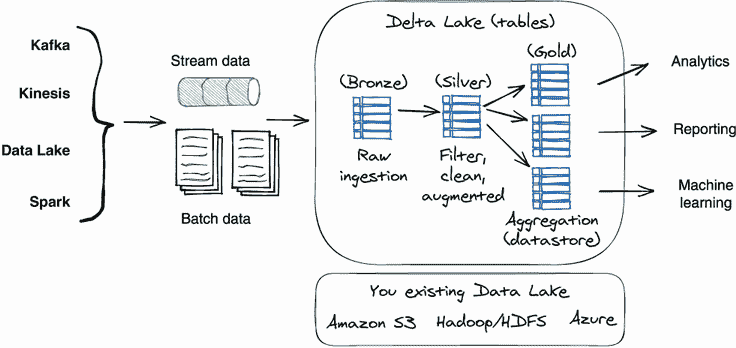

图 2.16 Delta Lake 数据摄入和处理工作流程。流数据和批数据都可以保存为 Delta Lake 表，并且 Delta Lake 表存储在云对象存储中，例如亚马逊 S3。

Delta Lake 表是系统的核心概念。在使用 Delta Lake 时，您通常正在处理 Delta Lake 表。它们就像 SQL 表一样；您可以查询、插入、更新和合并表内容。Delta Lake 中的模式保护是其优势之一。它支持在表写入时对模式进行验证，从而防止数据污染。它还跟踪表历史，因此您可以将表回滚到其过去的任何阶段（称为时间旅行）。

对于构建数据处理管道，Delta Lake 建议将表命名为三个类别：铜（bronze）、银（silver）和金（gold）。首先，我们使用铜表存储来自不同来源的原始输入（其中一些可能不太干净）。然后，数据不断从铜表流向银表，经过数据清洗和转换（ETL）。最后，我们执行数据过滤和净化，并将结果保存到金表中。每个表都处于机器学习状态；它们是可重现的，并且类型安全。

为什么 Delta Lake 是深度学习数据集管理的良好选择

以下是使 Delta Lake 成为管理深度学习项目数据集的良好选择的三个功能。

首先，Delta Lake 支持数据集的可重现性。它具有“时间旅行”功能，可以使用数据版本控制查询数据在特定时间点的状态。想象一下，您已经设置了一个持续运行的 ETL 管道来保持您的训练数据集（gold table）的最新状态。因为 Delta Lake 将表更新跟踪为快照，每个操作都会被自动版本化，当管道写入数据集时。这意味着所有训练数据的快照都是免费的，您可以轻松浏览表更新历史并回滚到过去的阶段。以下列表提供了一些示例命令。

列表 2.12 Delta Lake 时间旅行命令

```py
pathToTable = "/my/sample/text/intent/dataset/A"

deltaTable = DeltaTable.forPath(spark, pathToTable)    ❶
fullHistoryDF = deltaTable.history()                   ❷
lastOperationDF = deltaTable.history(1)                ❸

df = spark.read.format("delta")                        ❹
       .option("timestampAsOf", "2021-07-01")          ❹
       .load(pathToTable)                              ❹

df = spark.read.format("delta")                        ❺
      .option("versionAsOf", "12")                     ❺
      .load(pathToTable)                               ❺
```

❶ 在 Delta Lake 中查找数据集

❷ 列出数据的完整历史

❸ 获取数据集上的最后一个操作

❹ 根据时间戳回滚数据集

❺ 根据版本回滚数据集

其次，Delta Lake 支持持续的流式数据处理。它的表可以无缝处理来自历史和实时流数据源的连续数据流。例如，数据管道或流数据源可以在查询数据表的同时不断向 Delta Lake 表中添加数据。这样可以节省编写代码将新数据与现有数据合并的额外步骤。

其次，Delta Lake 提供模式强制执行和演化功能。它在写入时应用模式验证。它将确保新的数据记录与表的预定义模式匹配；如果新数据与表的模式不兼容，Delta Lake 将引发异常。在写入时进行数据类型验证要比在读取时进行更好，因为如果数据被污染，清理数据将变得困难。

除了强大的模式强制执行功能之外，Delta Lake 还允许您在现有数据表中添加新列而不会引起破坏性更改。对于深度学习项目来说，数据集模式强制执行和调整（演化）能力至关重要。这些功能可以保护训练数据免受意外数据写入污染，并提供安全的数据更新。

Petastorm

Petastorm 是 Uber ATG（高级技术组）开发的开源数据访问库。它可以直接从 Apache Parquet 格式的数据集中单机或分布式进行深度学习模型的训练和评估。（Apache Parquet 是一种为高效数据存储和检索而设计的数据文件格式。）

Petastorm 可以轻松地将 Delta Lake 表转换为 Tensorflow 和 PyTorch 格式的数据集，并且还支持分布式训练数据分区。使用 Petastorm，可以简单地从 Delta Lake 表中消耗训练数据，而不必担心特定训练框架的数据转换细节。它还在数据集格式和训练框架（Tensorflow、PyTorch 和 PySpark）之间创建了良好的隔离。图 2.17 可视化了数据转换过程。

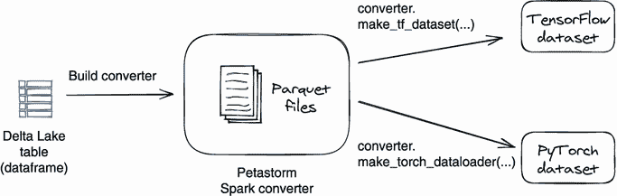

图 2.17 Petastorm 将 Delta Lake 表转换为可以被 PyTorch 或 Tensorflow 框架读取的数据集。

图 2.17 描述了 Petastorm 的数据转换工作流。您可以创建一个 Petastorm spark 转换器，将 Delta Lake 表作为 Parquet 文件读取到其缓存中，并生成 Tensorflow 或 Pytorch 数据集。

例子：为花朵图像分类准备训练数据

现在我们对 Delta Lake 和 Petastorm 有了一个大致的了解，让我们看一个具体的模型训练示例。接下来的代码片段——代码列表 2.13 和 2.14——展示了一个端到端的图像分类模型训练工作流程的两个步骤。首先，它们定义了一个图像处理 ETL 管道，将一组图像文件解析为 Delta Lake 表作为图像数据集。然后，它们使用 Petastorm 将 Delta Lake 表转换为可以直接加载到 PyTorch 框架中进行模型训练的数据集。

让我们首先查看代码清单 2.13 中的四步 ETL 数据处理管道。您还可以在 [`mng.bz/JVPz`](http://mng.bz/JVPz) 找到完整的代码。

在管道的开始步骤中，我们将图像从文件夹 `flower_photos` 加载到 Spark 中作为二进制文件。其次，我们定义提取函数以从每个图像文件中获取元数据，如标签名称、文件大小和图像大小。第三，我们使用提取函数构建数据处理管道，然后将图像文件传递给管道，管道将生成一个数据框。数据框的每一行代表一个图像文件及其元数据，包括文件内容、标签名称、图像大小和文件路径。在最后一步中，我们将此数据框保存为 Delta Lake 表—`gold_table_training_dataset`。您还可以在以下代码清单的末尾查看此 Delta Lake 表的数据模式。

清单 2.13 Delta Lake 中创建图像数据集的 ETL

```py
## Step 1: load all raw images files
path_labeled_rawdata = “datacollablab/flower_photos/”

images = spark.read.format("binary")                     ❶
 .option("recursiveFileLookup", "true")                  ❶
 .option("pathGlobFilter", "*.jpg")                      ❶
 .load(path_labeled_rawdata)                             ❶
 .repartition(4)                                         ❶

## Step 2: define ETL extract functions
def extract_label(path_col):                             ❷
 """Extract label from file path using built-in SQL functions."""
 return regexp_extract(path_col, "flower_photos/([^/]+)", 1)

def extract_size(content):                               ❸
 """Extract image size from its raw content."""
 image = Image.open(io.BytesIO(content))
 return image.size 

@pandas_udf("width: int, height: int")
def extract_size_udf(content_series):                    ❸
 sizes = content_series.apply(extract_size)
 return pd.DataFrame(list(sizes))
## Step 3: construct and execute ETL to generate a data frame 
## contains label, image, image size and path for each image. 
df = images.select(
 col("path"),
 extract_size_udf(col("content")).alias("size"),
 extract_label(col("path")).alias("label"),
 col("content"))

## Step 4: save the image dataframe produced 
# by ETL to a Delta Lake table
gold_table_training_dataset = “datacollablab.flower_train_binary”
spark.conf.set("spark.sql.parquet.compression.codec", "uncompressed")
df.write.format(“delta”).mode(“overwrite”)
  .saveAsTable(gold_table_training_dataset)

>>> 
ColumnName: path: string                                ❹
ColumnName: label: string                               ❹
ColumnName: labelIndex: bigint                          ❹
ColumnName: size: struct<width:int, length:int>         ❹
ColumnName: content: binary                             ❹
```

❶ 将图像作为 binaryFile 读取

❷ 从图像的子目录名称提取标签

❸ 提取图像尺寸

❹ Delta Lake 表—gold_table_training_dataset 的数据模式

注意：演示中使用的原始数据是 TensorFlow 团队的 flowers 数据集。它包含存储在五个子目录下的花朵照片，每个子目录对应一个类别。子目录名称是其中包含的图像的标签名称。

现在我们在 Delta Lake 表中构建了一个图像数据集，我们可以开始使用 Petastorm 的帮助来训练一个 PyTorch 模型。在代码清单 2.14 中，我们首先读取由代码清单 2.13 中定义的 ETL 管道生成的 Delta Lake 表 `gold_table_training_dataset`，然后将数据分成两个数据框架：一个用于训练，一个用于验证。接下来，我们将这两个数据框加载到两个 Petastorm Spark 转换器中；数据将在转换器内转换为 Parquet 文件。最后，我们使用 Petastorm API `make_torch_dataloader` 从 PyTorch 中读取训练示例以进行模型训练。请参阅以下代码以了解整个三步过程。您还可以在以下链接找到完整的示例代码：[`mng.bz/wy4B`](http://mng.bz/wy4B)。

清单 2.14 使用 Petastorm 在 PyTorch 中消耗 Delta Lake 图像数据集

```py
## Step 1: Read dataframe from Delta Lake table
df = spark.read.format("delta")
  .load(gold_table_training_dataset) 
 .select(col("content"), col("label_index")) 
 .limit(100)
num_classes = df.select("label_index").distinct().count()

df_train, df_val = df                                         ❶
  .randomSplit([0.9, 0.1], seed=12345)                        ❶

## (2) Load dataframes into Petastorm converter 
spark.conf.set(SparkDatasetConverter.PARENT_CACHE_DIR_URL_CONF,  
  "file:///dbfs/tmp/petastorm/cache")
converter_train = make_spark_converter(df_train)
converter_val = make_spark_converter(df_val)

## (3) Read training data in PyTorch by using 
## Petastorm converter
def train_and_evaluate(lr=0.001):
 device = torch.device("cuda")
  model = get_model(lr=lr)
    .. .. .. 

  with converter_train.make_torch_dataloader(                 ❷
         transform_spec=get_transform_spec(is_train=True),
         batch_size=BATCH_SIZE) as train_dataloader,
 converter_val.make_torch_dataloader(                   ❷
         transform_spec=get_transform_spec(is_train=False),
         batch_size=BATCH_SIZE) as val_dataloader:

 train_dataloader_iter = iter(train_dataloader)
   steps_per_epoch = len(converter_train) // BATCH_SIZE

 val_dataloader_iter = iter(val_dataloader)
   validation_steps = max(1, len(converter_val) // BATCH_SIZE)

   for epoch in range(NUM_EPOCHS):
     .. .. 
     train_loss, train_acc = train_one_epoch(
        model, criterion, optimizer,  
        exp_lr_scheduler,
 train_dataloader_iter,                                ❸
        steps_per_epoch, epoch,device)

     val_loss, val_acc = evaluate(
        model, criterion, 
 val_dataloader_iter,                                  ❸
        validation_steps, device)
 return val_loss
```

❶ 将 Delta Lake 表数据分成两个数据框：训练和验证

❷ 使用 Petastorm 转换器创建 PyTorch 数据加载器进行训练和评估

❸ 在训练迭代中使用训练数据

何时使用 Delta Lake

有关 Delta Lake 的一个普遍误解是，它只能处理结构化文本数据，如销售记录和用户配置文件。但前面的示例表明它也可以处理像图像和音频文件这样的非结构化数据；您可以将文件内容作为字节列写入带有其他文件属性的表中，并从中构建数据集。

如果您已经使用 Apache Spark 构建数据管道，那么 Delta Lake 是进行数据集管理的绝佳选择；它支持结构化和非结构化数据。而且它也是经济实惠的，因为 Delta Lake 将数据存储在云对象存储中（例如 Amazon S3、Azure Blob），Delta Lake 的数据架构强制执行和实时数据更新表支持机制简化了您的 ETL 管道的开发和维护。最重要的是，时间旅行功能会自动跟踪所有表更新，因此您可以放心地进行数据更改并回滚到以前版本的训练数据集。

Delta Lake 的局限性

使用 Delta Lake 的最大风险是技术锁定和其陡峭的学习曲线。Delta Lake 将表存储在其自己的机制中：基于 Parquet 的存储、事务日志和索引的组合，这意味着它只能由 Delta 集群写入/读取。您需要使用 Delta ACID API 进行数据摄入和使用 Delta JDBC 运行查询；因此，如果将来决定远离 Delta Lake，数据迁移成本将会很高。另外，由于 Delta Lake 需要与 Spark 配合使用，如果您是 Spark 的新手，那么您将需要大量的学习时间。

关于数据摄入性能，Delta Lake 将数据存储到底层的云对象存储中，当使用对象存储操作（例如表创建和保存）时，很难实现低延迟流式处理（毫秒级）。此外，Delta Lake 需要为每个 ACID 事务更新索引；与一些执行仅追加数据写入的 ETL 相比，它还引入了延迟。但在我们看来，深度学习项目的数据摄入延迟在秒级并不是一个问题。如果您不熟悉 Spark，并且不想要设置 Spark 和 Delta Lake 集群的重任，我们为您提供了另一种轻量级方法——Pachyderm。

### 2.3.2 使用云对象存储的 Pachyderm

在这一部分，我们想提出一个基于轻量级 Kubernetes 的工具——Pachyderm——来处理数据集管理。我们将向您展示如何使用 Pachyderm 来完成图像数据处理和标记的两个示例。但在此之前，让我们先了解一下 Pachyderm 是什么。

Pachyderm

Pachyderm 是一个用于构建版本控制、自动化、端到端数据科学数据管道的工具。它运行在 Kubernetes 上，并由您选择的对象存储支持（例如 Amazon S3）。您可以编写自己的 Docker 镜像用于数据爬取、摄入、清理、整理和处理，并使用 Pachyderm 管道将它们链接在一起。一旦定义了管道，Pachyderm 将处理管道的调度、执行和扩展。

Pachyderm 提供了数据集版本控制和来源追溯（数据血统）管理。它将每个数据更新（创建、写入、删除等）视为一个提交，并且还跟踪生成数据更新的数据源。因此，您不仅可以查看数据集的变更历史，还可以将数据集回滚到过去的版本，并查找更改的数据来源。图 2.18 展示了 Pachyderm 的工作原理的高级视图。

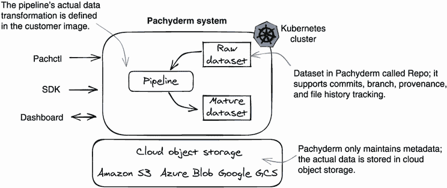

图 2.18 Pachyderm 平台由两种对象组成——管道和版本控制数据。管道是计算组件，数据是版本控制基元。在“原始数据集”中的数据更改可能会触发管道作业，以处理新数据并将结果保存到“成熟数据集”中。

在 Pachyderm 中，数据以 Git 风格进行版本控制。每个数据集在 Pachyderm 中都是一个仓库（repo），它是最高级别的数据对象。一个仓库包含提交、文件和分支。Pachyderm 仅在内部保留元数据（例如审计历史和分支），并将实际文件存储在云对象存储中。

Pachyderm 管道执行各种数据转换。管道执行用户定义的代码片段，例如一个 Docker 容器，以执行操作并处理数据。每个执行都称为一个作业。清单 2.15 显示了一个简单的管道定义。这个“edges”管道监视一个“images”数据集。当在图像数据集中添加了新的图像时，管道将启动一个作业，运行 `"pachyderm/opencv"` Docker 镜像解析图像，并将其边缘图片保存到 edges 数据集中。

清单 2.15 Pachyderm 管道定义

```py
{
  "pipeline": {
    "name": "edges"        ❶
  },
  "description": "A pipeline that performs image \
     edge detection by using the OpenCV library.",
  "transform": {
    "cmd": [ "python3", "/edges.py" ],
    "image": "pachyderm/opencv"
  },
  "input": {
    "pfs": {
      "repo": "images",    ❷
      "glob": "/*"
    }
  }
}
```

❶ 一个 Pachyderm 管道

❷ 一个 Pachyderm 数据集

版本和数据来源

在 Pachyderm 中，对数据集和管道所做的任何更改都会自动进行版本管理，您可以使用 Pachyderm 命令工具 `pachctl` 连接到 Pachyderm 工作区，查看文件历史记录，甚至还可以回滚这些更改。查看以下示例，了解如何使用 `pachctl` 命令来查看 edges 数据集的变更历史和变更来源。首先，我们运行 `pachctl` 的 `list` 命令来列出 edges 数据集的所有提交。在我们的示例中，对 edges 数据集进行了三次变更（提交）：

```py
$ pachctl list commit edges #A
REPO  BRANCH COMMIT                           FINISHED
edges master 0547b62a0b6643adb370e80dc5edde9f 3 minutes ago 
edges master eb58294a976347abaf06e35fe3b0da5b 3 minutes ago 
edges master f06bc52089714f7aa5421f8877f93b9c 7 minutes ago 
```

要获取数据更改的来源，我们可以使用 `pachctl inspect` 命令来检查提交情况。例如，我们可以使用以下命令来检查提交的数据来源。

```py
“eb58294a976347abaf06e35fe3b0da5b”. 
$ pachctl inspect commit edges@eb58294a976347abaf06e35fe3b0da5b \
       --full-timestamps
```

从以下回应中，我们可以看到 edges 数据集的提交 `eb58294a976347abaf06e35fe3b0da5b` 是由 images 数据集的提交 `66f4ff89a017412090dc4a542d9b1142` 计算得出的：

```py
Commit: edges@eb58294a976347abaf06e35fe3b0da5b
Original Branch: master
Parent: f06bc52089714f7aa5421f8877f93b9c
Started: 2021-07-19T05:04:23.652132677Z
Finished: 2021-07-19T05:04:26.867797209Z
Size: 59.38KiB
Provenance:  __spec__@91da2f82607b4c40911d48be99fd3031 (edges)  ❶
images@66f4ff89a017412090dc4a542d9b1142 (master)                ❶
```

❶ 数据来源

数据来源功能非常适用于数据集的可重现性和故障排除，因为您始终可以找到过去使用的确切数据以及创建它的数据处理代码。

示例：使用 Pachyderm 对图像数据集进行标注和训练

看完了 Pachyderm 是如何工作的，现在让我们看一个设计提案，使用 Pachyderm 来构建一个自动化目标检测训练管道。对于目标检测模型训练，我们首先需要通过在每个图像上用一个边界框标记目标对象来准备训练数据集，然后将数据集——边界框标签文件和图像——发送给训练代码开始模型训练。图 2.19 展示了使用 Pachyderm 自动化这一工作流程的过程。

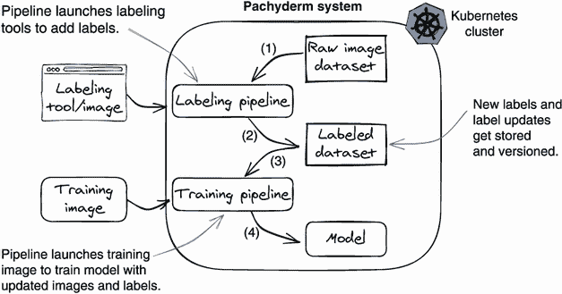

图 2.19 在 Pachyderm 中自动化的目标检测模型训练。当标记了新图像时，训练过程会自动开始。

在此设计中，我们使用了两个流水线，标记流水线和训练流水线，以及两个数据集来构建这个训练工作流程。在第 1 步，我们将图像文件上传到“原始图像数据集”。在第 2 步中，我们启动标记流水线，启动一个标记应用程序，为用户打开一个 UI 界面，通过在图像上绘制边界框来标记对象；这些图像是从原始图像数据集中读取的。一旦用户完成了标记工作，图像和生成的标签数据将被保存到“标记数据集”。在第 3 步中，我们向已标记的数据集添加新的训练数据，这将触发训练流水线启动训练容器并开始模型训练。在第 4 步中，我们保存模型文件。

除了自动化之外，包括原始图像数据集、标记数据集和模型文件在内的所有数据都会被 Pachyderm 自动进行版本控制。此外，通过利用数据溯源功能，我们可以确定任何给定模型文件使用的标记数据集的版本，以及用于训练此训练数据的原始图像数据集的版本。

什么时候使用 Pachyderm

Pachyderm 是一个轻量级的方法，帮助您轻松构建数据工程流水线，并提供类似 Git 的数据版本支持。它以数据科学家为中心，易于使用。Pachyderm 基于 Kubernetes，并使用云对象存储作为数据存储，因此对于小团队来说成本效益高，设置简单，易于维护。我们建议数据科学团队拥有自己基础设施的情况下使用 Pachyderm，而不要使用 Spark。Pachyderm 在处理非结构化数据（如图像和音频文件）方面表现非常出色。

Pachyderm 的局限性

Pachyderm 缺少的是模式保护和数据分析效率。Pachyderm 将所有东西都视为文件；它为每个文件版本保留快照，但不关心文件内容。在数据写入或读取时没有数据类型验证；它完全依赖于管道来保护数据一致性。

缺乏模式意识和保护为任何持续运行的深度学习训练流水线引入了很多风险，因为在上游数据处理代码中做任何代码更改可能会破坏下游数据处理或训练代码。此外，没有了解数据的模式，实现数据集比较就变得很困难。

## 总结

+   数据集管理的主要目标是持续从各种数据源接收新鲜数据，并在支持训练可重现性（数据版本跟踪）的同时，向模型训练交付数据集。

+   拥有数据集管理组件可以通过将模型算法开发和数据工程开发并行化来加速深度学习项目的开发。

+   设计数据集管理服务的原则如下：支持数据集可重现性；采用强类型数据模式；设计统一的 API，并保持 API 在不同数据集类型和大小上的一致行为；保证数据持久性。

+   数据集管理系统至少应支持（训练）数据集版本控制，这对模型的可重现性和性能故障排除至关重要。

+   数据集是深度学习任务的逻辑文件组；从模型训练的角度来看是静态的，从数据收集的角度来看是动态的。

+   示例数据集管理服务由三层组成——数据摄入层、内部数据集存储层和训练数据集获取层。

+   在示例数据集管理服务中，我们为每种数据集类型定义了两种数据模式，一种用于数据摄入，一种用于数据集获取。每次数据更新都被存储为一个提交，而每个训练数据集都被存储为一个带版本的快照。用户可以使用版本哈希字符串随时获取相关的训练数据（数据集可重现性）。

+   示例数据集管理服务支持一种特殊的数据集类型——`GENERIC`数据集。`GENERIC`数据集没有模式和数据验证，并且用户可以自由上传和下载数据，因此非常适合原型化新算法。一旦训练代码和数据集要求变得成熟，数据集格式就可以升级为强类型数据集。

+   Delta Lake 和 Petastorm 可以共同用于为基于 Spark 的深度学习项目建立数据集管理服务。

+   Pachyderm 是一个基于 Kubernetes 的轻量级数据平台，支持类似 Git 的数据版本控制，并允许轻松设置流水线。流水线由 Docker 容器组成；它可以用于自动化数据处理工作流程和深度学习项目的训练工作流程。
