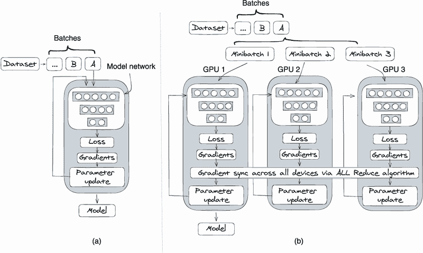
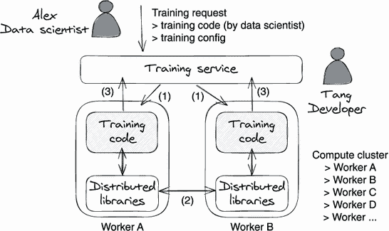
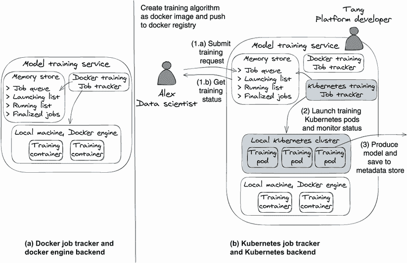
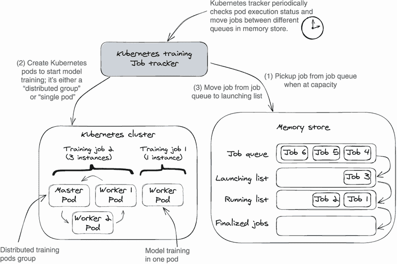
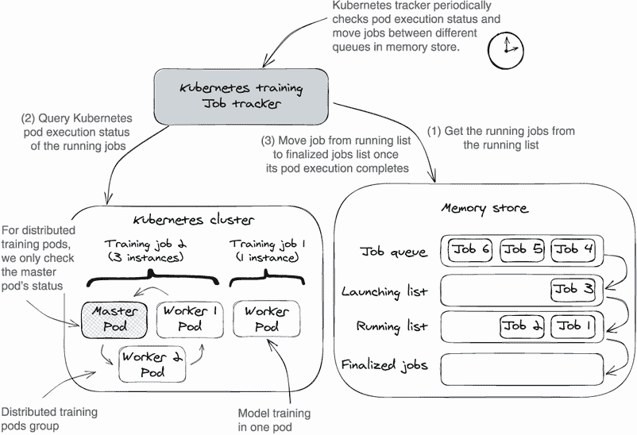
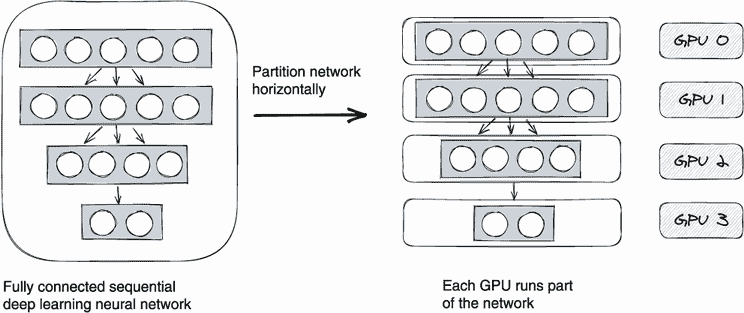
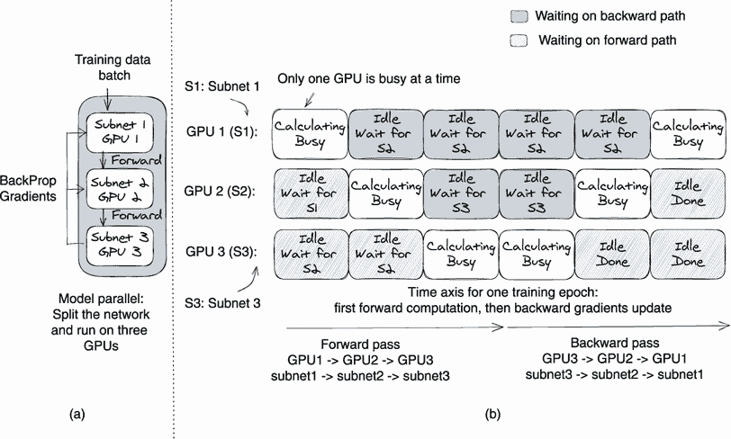
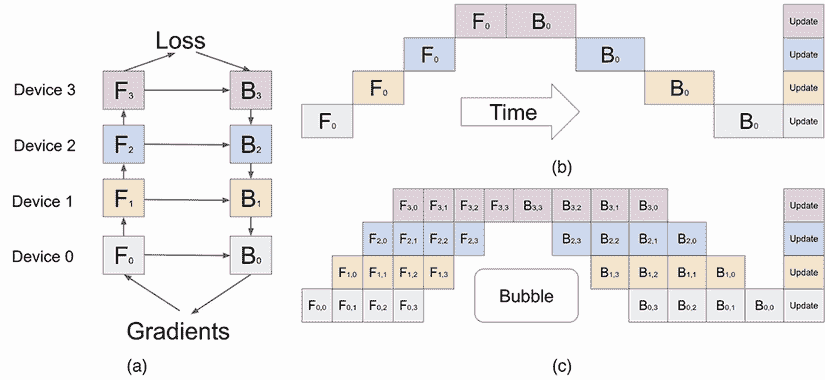

# 第四章：分布式训练

本章内容包括

+   理解数据并行、模型并行和流水线并行

+   使用支持 Kubernetes 中数据并行训练的示例训练服务

+   使用多个 GPU 训练大型模型

在深度学习研究领域明显的一个趋势是通过更大的数据集和更大的模型以及越来越复杂的架构来提高模型性能。但更多的数据和更庞大的模型也会带来一些后果：它们会减慢模型训练过程以及模型开发过程。在计算中，性能常常与速度相抵触。例如，使用单个 GPU 训练一个 BERT（双向编码器表示转换器）自然语言处理模型可能需要几个月的时间。

为了解决数据集和模型参数规模不断增长的问题，研究人员创造了各种分布式训练策略。而主要的训练框架，如 TensorFlow 和 PyTorch，提供了实现这些训练策略的 SDK。借助这些训练 SDK，数据科学家可以编写跨多个设备（CPU 或 GPU）并行运行的训练代码。

在本章中，我们将从软件工程师的角度探讨如何支持分布式训练。具体来说，我们将看到如何编写一个训练服务来在一组机器上执行不同的分布式训练代码（由数据科学家开发）。

阅读完本章后，你将全面了解分布式训练如何从数据科学家和开发者的角度进行工作。你将了解到几种分布式训练策略和分布式训练代码模式，以及训练服务如何促进不同的分布式训练代码。

## 4.1 分布式训练方法的类型

有三种主要类型的分布式训练方法：模型并行、数据并行和流水线并行。*模型并行* 是一种将神经网络拆分为多个顺序子网络并在不同设备上运行每个子网络的策略。通过这种方式，我们可以使用一组 GPU 训练大型模型。

*流水线并行* 是模型并行的高级版本。模型并行的一个主要问题是在训练过程中只有一个 GPU 处于活动状态；其他 GPU 处于空闲状态。通过将每个训练示例批次划分为小的微批次，流水线并行可以在层之间重叠计算，以最大化 GPU 性能。这允许不同的 GPU 同时处理各种微批次。GPU 的训练吞吐量和设备利用率得到提高，从而比模型并行更快地进行模型训练。

*数据并行* 将数据集分成较小的部分，并让每个设备单独训练这些子数据集。因为现在每个设备训练的是较小的数据集，所以训练速度得到了提高。

将单设备训练代码转换为模型并行化或流水线并行化训练需要进行大量的代码改动，包括将神经网络分割为多个子网络，在不同的 GPU 上运行子网络，并将子网络的计算输出复制到不同的 GPU 上。这些改动的数量之多以及复杂性使得它们难以处理和调试。每个模型算法可能具有截然不同的模型架构，因此没有标准化的方法可以用于模型并行化或流水线并行化的模型分割。数据科学家必须逐个案例构建代码。

相反，数据并行化仅需要在单设备训练代码上进行最少的代码改动。而且，有标准化的模式可以将非分布式训练代码转换为数据并行化，而无需更改模型算法或架构。此外，数据并行化代码相对易于理解和调试。这些优点使得数据并行化成为我们分布式训练的首选。

尽管数据并行化有很多优点，模型并行化和流水线并行化也各自具有自己的优势和用途。例如，当您有无法适应一个 GPU 的大型模型时，它们是最佳的分布式解决方案。我们将在第 4.4 节中更详细地讨论它们。

## 4.2 数据并行化

在本节中，我们将研究数据并行化理论及其并行执行的挑战，以及 PyTorch、TensorFlow 和 Horovod 中的示例训练代码。

### 4.2.1 理解数据并行化

数据并行化涉及到一组训练设备在一个大数据集上一起工作。通过让每个设备处理数据集的一个子集，我们可以大大减少训练时间。

同步数据并行化是最常采用的数据并行化方法。它将模型网络复制到训练组中的每个设备上，无论是 GPU 还是 CPU。数据集被分割成小批量，并在所有设备上（再次是 CPU 或 GPU）上分发这些批量。训练步骤同时进行，每个设备上使用不同的小批量；因此，设备充当自己的数据分区。在计算梯度以更新神经网络时，算法通过从每个设备聚合梯度来计算最终梯度。然后，它将聚合梯度分发回每个设备，以更新其本地神经网络。虽然每个设备上的训练数据集是不同的，但这些设备上的本地神经网络是相同的，因为它们在每个训练迭代中都是由相同的梯度更新的。因此，这个过程被称为同步数据并行化。

您可以在图 4.1 中可视化这个过程。该图比较了在单个 GPU 上进行深度学习训练的过程（左侧的图(a)）与使用三个 GPU 进行同步数据并行训练的设置（右侧的图(b)）。



图 4.1 同步数据并行概念图。（a）在单 GPU 上进行深度学习训练。（b）使用三个 GPU 进行同步数据并行训练。

通过比较图（a）和（b），您会发现与单设备训练相比，同步数据并行引入了两个额外步骤。第一个额外步骤是将一个训练批次分成三个小批次，这样每个设备就可以处理自己的小批次。第二步是同步来自所有机器的聚合梯度，以便它们在更新本地模型时都使用相同的梯度。

注意：为了聚合不同工作者计算的梯度，您可以使用算法 all-reduce。这是一种流行的算法，它独立地将所有进程的数据数组组合成一个单一数组。在“使用 PyTorch 编写分布式应用程序”（[`pytorch.org/tutorials/intermediate/dist_tuto.html`](https://pytorch.org/tutorials/intermediate/dist_tuto.html)）中，您可以找到 PyTorch 支持 all-reduce 算法的示例。

从实现的角度来看，数据并行只需要对单设备模型训练过程进行最少的更改。其主要开销是添加了梯度聚合的步骤。

模型参数更新：同步 vs.异步

对于在数据并行中跨工作者聚合梯度有两种思路：同步更新和异步更新。让我们分别看看它们是如何工作的，以及它们的优点和缺点，这样您就可以自行选择：

+   *同步模型更新*—如图 4.1 所示，同步模型更新在梯度同步步骤暂停训练迭代，直到所有设备接收到聚合梯度。然后它继续下一步，更新模型参数。通过这种方式，所有设备在同一时间获得相同的梯度更新，从而确保每个工作者的模型在每个训练迭代中都是一致的。同步模型更新的问题是显而易见的：当梯度在工作者之间同步时，训练迭代被阻塞，因此没有一个工作者可以开始处理下一个数据小批次。如果存在一些慢机器或网络问题，则整个分布式工作组都会受阻，而较快的工作者则处于空闲状态。

+   *异步模型更新* — 与之相反，异步模型更新方法不强制每个训练设备或工作器等待接收来自其他设备的梯度。相反，每当一个设备完成梯度计算后，它立即更新本地模型而无需检查其他设备。每个设备都独立工作，尽管它的梯度仍然需要复制到每个其他设备，但这些更新的同步不是必要的。异步方法可能看起来很吸引人；它简单，并且可以比同步方法每分钟运行更多的训练步骤。异步方法的缺点是训练时间较长，并且产生的模型比同步模型更新方法产生的模型不准确。

当我们使用异步方法时，梯度在不同设备上独立计算。一些机器运行速度更快，而其他机器运行速度较慢；因此，这些梯度可以来自每个设备的不同训练迭代。因此，无法保证聚合的梯度将指向最佳方向。例如，假设来自慢速机器的梯度是从训练迭代 5 计算的，而其他更快的机器已经移动到训练迭代 20。当我们聚合所有工作器的梯度时，低迭代的梯度会应用于高迭代的梯度；这会降低梯度质量。

此外，异步方法通常收敛速度较慢，并且比同步方法有更高的准确度损失。因此，今天大多数数据并行库都在执行同步模型更新。在本章中，当我们提到数据并行和其代码实现时，我们指的是同步数据并行。

数据集和模型的内存约束

在深度学习中，数据集和模型在训练过程中消耗计算实例的大部分内存。如果训练数据或神经网络（模型）超出了本地设备的内存限制，训练过程将被终止，出现内存不足（OOM）错误。数据并行旨在提高训练速度，但不能解决内存约束问题。

对于由加载数据集引起的 OOM，我们可以减少训练数据的批量大小，因此训练过程在每个训练循环中加载较小量的数据到本地内存中。在数据并行背景下，我们需要确保小批量训练数据可以适合每个工作器设备的内存。

对于由模型大小引起的 OOM，我们需要采用模型并行或管道并行（见 4.4 节）。当神经网络（模型）的大小超过单个设备的内存限制时，数据并行简单地无法工作。

### 4.2.2 多工作器训练挑战

容错性和带宽饱和是我们作为软件开发者在执行训练服务中的数据并行代码时需要解决的两个挑战。 解决这两个挑战对于降低运营成本和改善数据并行性训练的性能至关重要。

容错性

我们不希望整个分布式训练组因为一个工作节点意外失败而全部失败。 这不仅会导致服务可用性问题，还会增加我们的训练成本，因为如果一个节点失败，所有其他节点的工作都会被浪费。

为了提高容错性，我们可以在每个工作节点的远程文件系统中保留每个训练步骤（即模型参数）的训练状态。 然后，如果一个工作节点失败或花费太长时间来完成一个训练迭代，我们可以重新启动该工作节点并加载其最近的先前状态。

TensorFlow 和 PyTorch 框架都具有备份和恢复功能。 作为训练服务开发者，我们可以设置远程磁盘或备份存储系统，并将访问配置传递给训练容器。 然后，在训练过程中，训练代码可以使用外部文件系统来备份或恢复状态。

带宽饱和

向分布式训练组添加更多的 GPU 和更多的机器并不总是会提高性能。 无论我们使用同步还是异步模型更新，算法都必须在每个训练迭代结束时在训练节点之间通信梯度或模型参数。 在 GPU RAM 和网络之间移动数据所花费的时间最终将超过通过分割训练工作负载获得的加速。

因此，在数据并行达到最佳性能之前，可以并行发生多少个实例存在上限。 这一限制由模型参数的数量和模型的密度（模型权重中的非零值有多少）确定。 如果是一个大型、密集的模型，有大量的参数和梯度需要传输，那么它的饱和度就比较大，大于一个较小的模型或一个大型的稀疏模型。

有一些推荐的并行实例数，例如，对于神经机器翻译，在 8 个 GPU 上可以实现 6 倍的加速，对于 ImageNet 模型，在 50 个 GPU 上可以实现 32 倍的加速。 但是，我们需要通过我们自己的实验来确定最佳实验点，因为 GPU 和模型架构都在快速发展，标准推荐很快就会过时。 作为平台开发者，除了选择最佳的并行工作节点数量外，我们还有三种额外的方法来减轻带宽饱和。

首先，我们可以将并行工作者（即容器或 Pod）分组到更少的机器中，以减少网络跳数。例如，在 Kubernetes 中，您可以设置具有亲和性和反亲和性规则的`nodeSelector`（[`mng.bz/qo76`](http://mng.bz/qo76)），以在一些选择的具有更好网络和更多计算能力的服务器上提供训练实例（Kubernetes Pod）。

第二个选择是始终将训练映像升级为使用训练框架的最新版本。诸如 PyTorch、TensorFlow 等流行框架不断发展，以减少网络中传输的数据量以进行分布式训练。注意发布说明并利用这些改进。

最后，不要低估初始化分布式组时进行微小调整可能带来的收益。例如，考虑使用 PyTorch。PyTorch 数据并行库将神经网络参数梯度分区为桶，然后在梯度同步步骤期间将桶发送到工作进程中。桶的大小决定了一次在不同设备之间传输多少数据。因此，通过选择合适的桶大小，我们可以确定设备饱和和网络饱和之间的最佳训练速度的甜蜜点。桶的大小可以在 PyTorch 分布式数据并行（DDP）组件的构造函数中配置（[`mng.bz/7ZB7`](http://mng.bz/7ZB7)）。

### 4.2.3 为不同的训练框架编写分布式训练（数据并行性）代码

在本节中，您将看到一些用于数据并行分布式训练的训练代码片段，涵盖了三个训练框架：TensorFlow、PyTorch 和 Horovod。如果这里的代码示例难以解析，不用担心。目的是体验数据科学家如何处理分布式训练。这将让您了解训练服务如何实现分布式训练。

PyTorch

PyTorch 框架具有 DDP 库，该库在模块级别实现数据并行性。DDP 包装模型对象，使其可以在多台机器上无缝运行。其训练进程可以放置在同一台机器上，也可以分布在多台机器上。

要将单设备/进程训练代码转换为数据并行-分布式训练代码，我们需要进行以下两个修改。首先，我们必须通过允许每个训练进程向主进程注册自己来初始化训练组。其中一个进程声称自己是主进程，而其他进程声称自己是工作进程。每个训练进程将在此注册阶段等待，直到所有工作进程加入分布式组。

要注册一个进程，我们需要知道总的训练进程数（`world_size`），该进程的唯一 ID（`rank`）以及主进程的地址（在环境变量中定义`MASTER_ADDR`和`MASTER_PORT`）。如下所示查看代码示例：

```py
def setup(rank, world_size):
  os.environ['MASTER_ADDR'] = 'xxxx'
  os.environ['MASTER_PORT'] = 'xxx'

  # initialize the process group, "gloo" is one of the communication 
  # backends Pytorch supports, it also supports MPI and NCCL. 
  # rank is the process’s rank, it's a globally unique id 
  # for this process. rank=0 means  master process.
  # world_size is the total number of processes in this training group.
  dist.init_process_group("gloo", rank=rank, world_size=world_size)

def cleanup():
  dist.destroy_process_group()
```

其次，我们使用 DDP 类来包装模型对象。PyTorch DDP 类将处理分布式数据通信、梯度聚合和本地模型参数更新：

```py
import torch.distributed as dist
from torch.nn.parallel import DistributedDataParallel as DDP

# create model and move it to GPU
model = DpModel().to(device)

# wrap the model with DDP
ddp_model = DDP(model, device_ids=[rank])
outputs = ddp_model(data)                    ❶

# compute the loss and sync gradient with other workers.
# when 'backward' function returns, the param.grad already 
# contains synchronized gradient tensor
loss_fn(outputs, labels).backward()
```

❶ DDP 包装器负责分布式训练的执行。

对于高级用例，PyTorch 库提供了 API，因此您可以在较低的级别实现自己的梯度同步函数。您可以在官方教程“使用 Pytorch 编写分布式应用程序”([`mng.bz/m27W`](http://mng.bz/m27W)) 中查看详细信息。

TensorFlow/Keras

TensorFlow 支持与 PyTorch 非常相似的分布式训练方式；它首先定义分布式训练策略（例如 `MultiWorkerMirroredStrategy`），然后使用该策略初始化模型。为了让策略识别分布式组中的工作节点，我们需要在每个训练进程中定义 `TF_CONFIG` 环境变量。`TF_CONFIG` 包含一个工作节点的唯一 ID 和组中所有其他工作节点的地址。请参阅以下代码：

```py
# Step 1: define 'TF_CONFIG' environment variable to describe
# the training group and the role for the process.
# The worker array defines the IP addresses and ports of 
# all the TensorFlow servers used in this training.  
tf_config = {
  'cluster': {
    'worker': ['192.168.4.53:12345', '192.168.4.55:23456']
  },

  # A 'task' provides information of the current task and is 
  # different for each worker. It specifies the 'type' and
  # 'index' of that worker.
  'task': {'type': 'worker', 'index': 0}
}

os.environ['TF_CONFIG'] = json.dumps(tf_config)

# Step 2: define distributed training strategy,
# the MultiWorkerMirroredStrategy takes 
# care of the synchronous data parallel distributed training.
strategy = tf.distribute.MultiWorkerMirroredStrategy()

global_batch_size = per_worker_batch_size * num_workers
multi_worker_dataset = mnist.mnist_dataset(global_batch_size)

# Step 3: start the distributed training.
with strategy.scope():
  # Model building/compiling need to be within 'strategy.scope()'.
  multi_worker_model = mnist.build_and_compile_cnn_model()

multi_worker_model.fit(multi_worker_dataset, 
  epochs=3, steps_per_epoch=70)
```

Horovod

Horovod 是一个单一目的的分布式框架。与可以用于一系列任务的 TensorFlow 和 PyTorch 相比，例如数据处理、模型训练和模型服务，Horovod 只能专注于一个任务：使分布式深度学习训练变得快速且易于使用。

Horovod 最大的优势在于它可以与不同的训练框架一起使用，例如 TensorFlow、Keras、PyTorch 和 Apache MXNet。因此，我们可以以一种方式（Horovod 方式）配置我们的训练集群，以运行 PyTorch、TensorFlow 和其他框架的分布式训练。这里，我们只列出了两个代码片段，用于使用 TensorFlow 和 PyTorch 与 Horovod，但您可以在 Horovod 的网站上查看其他框架的示例。

让我们看看 TensorFlow 的示例。为了设置数据并行 ism-分布式训练，首先我们初始化 Horovod 训练组，它将自动找到集群中的其他 Horovod 节点。接下来，我们将 rank 0（主工作节点）的初始变量状态广播到所有其他进程。这将确保所有工作节点的一致初始化。然后我们将梯度磁带包装在分布式梯度磁带中，这将对所有工作节点上的梯度进行平均。其余的代码只是普通的 TensorFlow 训练代码。因此，请参阅以下代码([`github.com/horovod/horovod/blob/master/examples`](https://github.com/horovod/horovod/blob/master/examples))：

```py
hvd.init()                                       ❶
.. .. ..

@tf.function
def training_step(images, labels, first_batch):
   with tf.GradientTape() as tape:
       probs = mnist_model(images, training=True)
       loss_value = loss(labels, probs)

   # Wrap tape with Horovod Distributed GradientTape. 
   # This gradient tape averages gradients from all 
   # workers by using allreduce or allgather, and then 
   # applies those averaged gradients back to the local model.
   tape = hvd.DistributedGradientTape(tape)

   grads = tape.gradient(loss_value, mnist_model.trainable_variables)
   opt.apply_gradients(zip(grads, mnist_model.trainable_variables))

   # Broadcast initial variable states 
   # from rank 0 to all other processes.
   if first_batch:
       hvd.broadcast_variables(mnist_model.variables, root_rank=0)
       hvd.broadcast_variables(opt.variables(), root_rank=0)

   return loss_value

for batch, (images, labels) in \                ❷
  enumerate(dataset.take(10000 / hvd.size())): 
   loss_value = training_step(images, labels, batch == 0)
   .. .. ..

# save checkpoints only on worker 0 to 
# prevent other workers from corrupting it.
if hvd.rank() == 0:
   checkpoint.save(checkpoint_dir)
```

❶ 初始化 Horovod

❷ 根据 GPU 数量调整步数

以下代码是使用 PyTorch 与 Horovod 的示例。一些 PyTorch Horovod API 与 TensorFlow 不同，例如 `hvd.DistributedOptimizer` 与 `hvd.DistributedGradientTape`。但是这些 API 来自相同的 Horovod SDK 并在幕后共享相同的工作节点机制。让我们看看 PyTorch 代码片段：

```py
# Horovod: initialize Horovod.
import torch
import horovod.torch as hvd

# Initialize Horovod
hvd.init()
.. .. .. 

# Build model...
model = ...
optimizer = optim.SGD(model.parameters())

# Add Horovod Distributed Optimizer, this is equal
# to hvd.DistributedGradientTape(tape) 
# for Tensorflow2 
optimizer = hvd.DistributedOptimizer(optimizer,
  named_parameters=model.named_parameters())

# Broadcast parameters from rank 0 to 
#all other processes.
hvd.broadcast_parameters(model.state_dict(),
  root_rank=0)

for epoch in range(100):
   for batch_idx, (data, target) in enumerate(train_loader):
       optimizer.zero_grad()
       output = model(data)
       loss = F.nll_loss(output, target)
       loss.backward()
       optimizer.step()
   .. .. ..
```

尽管模型在两个不同的框架中定义——TensorFlow 2 和 PyTorch——但从这两个代码片段我们可以看出它们都使用同样的 Horovod SDK 来运行分布式训练。这里的好处在于我们可以使用一个标准方法（即 Horovod 方式）在我们的训练集群中设置分布式工作组，并且它仍然可以用于不同训练框架中编写的训练代码。

关于训练代码的两个要点

如果你在阅读这些训练代码片段时感到困惑，那没关系。作为训练服务开发人员，你不需要编写这些代码片段。我们想要从这次讨论中强调两点：

+   尽管本节中的代码示例使用不同框架和不同 API 实现分布式训练，但代码遵循第 4.2.1 节中描述的相同数据并行范式。也就是说，代码始终（1）为每个并行训练进程设置通信组，（2）配置模型对象以在所有工作节点上聚合梯度。因此，作为开发人员，我们可以使用统一的方法为不同的训练框架设置和管理分布式训练进程。

+   将模型训练代码从单设备训练扩展到数据并行分布式训练的工作相对较为琐碎。如今，分布式训练框架/SDK 非常强大，我们不需要实现数据并行的每一个细节，比如同步梯度，它会在整个网络中同步梯度。训练框架和 SDK 处理这些过程，使它们运行无缝。分布式数据并行训练代码几乎与单设备训练代码相同，除了配置训练组时。

### 4.2.4 数据并行分布式训练中的工程努力

那么在生产环境中启用数据并行分布式训练的工作是什么样子的呢？首先，它需要数据科学家和服务开发人员的联合工程努力。对于数据科学家来说，他们需要升级单设备训练代码以分布式运行，使用类似前一节中的代码片段。与此同时，服务开发人员必须增强训练服务，以自动设置分布式工作组，以允许进行分布式训练。

为了使训练服务用户友好，服务应该整合不同分布式训练框架的设置细节。因此，数据科学家只需定义他们在训练中所需的并行实例数。

让我们以 TensorFlow 分布式训练为例。从我们在第 4.2.3 节中的讨论中可以看出，每个设备上的 TensorFlow 训练代码必须将`tf_config`（见下面的示例）设置为环境变量。这样，在训练过程中底层的 TensorFlow 分布式库就知道如何与其他训练进程通信了：

```py
tf_config = {
  'cluster': {
    'worker': ['192.168.4.53:12345', '192.168.4.55:23456']
  },

  # A 'task' provides information of the current task 
  # and is different for each worker. It specifies 
  # the 'type' and 'index' of that worker.
  'task': {'type': 'worker', 'index': 0}
}
```

从可用性的角度来看，我们不能指望数据科学家为每个分布式训练进程找出设置值——服务器 IP 地址和任务索引，特别是如果整个训练组都是动态分配的。一个训练服务应该自动为分布式训练请求创建一组计算资源，用正确的 IP 地址初始化分布式训练库，并启动训练进程。

图 4.2 是支持分布式训练的训练服务的概念图。从图中可以看到，数据科学家 Alex 发送了一个训练请求来启动分布式训练任务。然后服务（由服务开发者 Tang 构建）生成两个工作机器并分布式执行训练代码。除了准备训练代码外，Alex 还可以为训练任务指定配置，例如并行工作进程的数量和分布式训练框架的类型（TensorFlow、PyTorch 或 Horovod）。



图 4.2 分布式训练系统概览

让我们缓慢地浏览一下这张图，以更好地了解系统是如何设置的，以及谁做了什么工作。我们看到，作为工程师的 Tang 需要进行三项增强——在图 4.2 中编号为 1、2 和 3——来将训练服务从单设备训练器（正如我们在第三章中所见）转变为数据并行的分布式训练器。

第一步是更新训练服务，以在运行时按需构建分布式训练组。当服务收到分布式训练请求时，它从训练集群中为训练任务分配多个工作进程，并将训练代码分发给每个工作进程。

第二步是以编程方式为每个训练进程初始化正确的服务器 IP、端口号和训练进程 ID。这确保了分布式库（通常称为框架，比如 TensorFlow）具有足够的信息来为训练组建立内部工作进程之间的通信。正如我们在前一节中看到的，对于每个分布式训练框架，设置配置都有所不同。训练服务应该知道如何为各种框架建立内部工作进程之间的通信，这样数据科学家就可以专注于算法开发，而不用担心底层基础架构。

第三步是为每个工作节点提供远程存储，以备份和恢复其训练状态。在分布式训练中，如果一个工作节点失败，整个训练组失败，并且将浪费大量计算资源。因此，在发生硬件故障或网络问题时，使分布式训练组能够恢复是至关重要的。通过提供远程存储和备份 API，分布式训练进程可以在每个训练迭代后保存其训练状态（神经网络）。当训练过程在训练中间发生故障时，可以恢复其先前的状态并重新开始，整个训练组也将继续进行。

注意：如果你想了解更多关于数据并行的知识，你可以从以下两篇文章开始：来自 O'Reilly 的博客文章“Distributed TensorFlow: Reduce both experimentation time and training time for neural networks by using many GPU servers” by Jim Dowling([www.oreilly.com/content/distributed-tensorflow/](http://www.oreilly.com/content/distributed-tensorflow/))，以及来自 Google Brain 的一篇论文“Revisiting Distributed Synchronous SGD” by Chen et al.([`arxiv.org/pdf/1604.00981.pdf`](https://arxiv.org/pdf/1604.00981.pdf))。

## 4.3 支持数据并行-分布式训练的示例服务

在本节中，我们将扩展上一章（第 3.3 节）介绍的示例服务，以支持数据并行-分布式训练。

### 4.3.1 服务概述

与第 3.3 节讨论的单设备训练相比，用户工作流程保持不变。数据科学家 Alex 首先构建模型训练代码，并向训练服务发送训练请求。然后，服务运行实际训练，并在最后生成模型。

不过，有一些关键区别。首先，Alex 升级了意图分类训练代码，使其能够适用于单设备和多设备。其次，服务开发者 Tang 修改了训练服务 API，提供了一个新的参数`PARALLEL_INSTANCES`。该参数允许 Alex 为分布式训练设置工作组的大小。

要正确管理服务器集群，我们需要 Kubernetes 的帮助。Kubernetes 可以在工作资源分配和工作节点通信方面为我们节省大量努力。因此，我们引入了一个新组件——*Kubernetes 作业追踪器*，用于在 Kubernetes 中管理训练作业。你可以在图 4.3 中看到更新后的服务设计图和用户工作流程。



图 4.3(a)：之前在图 3.5 中介绍的训练服务设计；(b) 在 Kubernetes 上具备分布式训练支持的更新服务设计

图 4.3 (a) 重复了我们在第 3.3 节讨论的训练服务的系统图，该系统使用 Docker 作业跟踪器在 Docker 引擎中运行训练作业。图 4.3 (b) 可视化了现在支持分布式训练的更新后的训练服务，包括 Kubernetes 和 Docker 引擎后端。Kubernetes 作业跟踪器被添加以在 Kubernetes 集群中运行分布式训练作业。该组件通过启动 Kubernetes pod 来执行训练作业，并监视和更新内存存储中的作业执行状态。

我们还对意图分类 PyTorch 训练代码进行了一些更改，以便可以分布式运行。我们将在稍后的第 4.3.5 节中简要回顾这一点。

一个很好的时间节省者是，我们不需要更改已经创建的服务 API 接口（第 3.3.3 节）。我们的用户可以简单地使用相同的 API 在 Docker 引擎和 Kubernetes 集群中训练模型。这符合我们在第三章中介绍的训练服务原则之一（第 3.1.2 节）：使用统一的 API 并使其在后端实现上保持不可知性。

### 4.3.2 与服务交互

首先，让我们使用 Kubernetes 后端运行训练服务；请参见以下命令（`scripts/ts-001-start-server-kube.sh`）：

```py
$ docker build -t orca3/services:latest -f services.dockerfile .
$ docker run --name training-service -v \
    $HOME/.kube/config:/.kube/config --env \     ❶
    APP_CONFIG=config-kube.properties \
    --network orca3 --rm -d -p 
  "${TS_PORT}":51001 
  orca3/services:latest training-service.jar
```

❶ 本地 Kubernetes 配置

注意 本节仅包含运行示例服务所需的主要步骤和关键命令。因此，可以清晰地演示概念，而不需要冗长的代码页和执行输出。如果您想在本节运行实验，请按照 orca3/MiniAutoML 存储库中的 “Distributed trainer training demo”（[github.com/orca3/MiniAutoML/blob/main/training-service/distributed_trainer_demo.md](http://github.com/orca3/MiniAutoML/blob/main/training-service/distributed_trainer_demo.md)）文档中的说明进行操作。

一旦训练服务容器正在运行，我们就可以提交一个训练 gRPC 请求。尽管服务现在在 Kubernetes 后端运行，但训练 API 仍然保持不变。与我们发送给 Docker 后端演示的训练请求（请参见第 3.3.1 节）相比，请求有效负载中仅添加了一个额外参数 — `PARALLEL_INSTANCES=3`。这告诉训练服务创建一个包含三个工作节点的分布式训练组来训练模型。如果我们将此参数设置为 1，则是单设备训练请求。查看以下代码片段以提交一个包含三个并行实例的分布式训练请求（`scripts/ts-004-start-parallel-run.sh 1`）：

```py
# submit a distributed training request
$ grpcurl -plaintext -d "{ "metadata": 
  { "algorithm":"intent-classification",
    "dataset_id":"1",
    "Name":"test1",
    "train_data_version_hash":"hashBA==",
    "Parameters":{
      "LR":"4","EPOCHS":"15",
      "PARALLEL_INSTANCES":"3",         ❶
    "BATCH_SIZE":"64","FC_SIZE":"128"}}
  }" 
 ${TS_SERVER}:${TS_PORT} 
training.TrainingService/Train 
```

❶ 需要一个包含三个工作节点的训练组

要检查训练执行的进度，我们可以使用 `GetTrainingStatus` API：

```py
grpcurl -plaintext -d "{"job_id": "$1"}"    ❶
 ${TS_SERVER}:"${TS_PORT}" 
training.TrainingService/GetTrainingStatus 
```

❶ 提供作业 ID 以查询状态

除了查询训练服务 API 以获取作业执行状态外，我们还可以在 Kubernetes 中检查训练进度。使用 Kubernetes 命令`kubectl get all`，我们可以看到在本地 Kubernetes 环境中创建了三个工作 Pod。其中一个是主工作 Pod，另外两个是普通工作 Pod。还创建了一个 Kubernetes 服务对象 `intent-classification-1-master-service` 用于主工作 Pod，它使主 Pod 和工作 Pod 之间具有网络连接性。代码段如下：

```py
# check Kubernetes resources status. 
# We could see a distributed training group contains 
# with three pods and one service are created in Kubernetes
$ kubectl get all -n orca3
NAME                                   READY   STATUS
pod/intent-classification-1-1-worker   0/1     Completed          ❶
pod/intent-classification-1-2-worker   0/1     Completed
pod/intent-classification-1-master     0/1     Completed          ❷

NAME                                             TYPE       .. ..   
service/intent-classification-1-master-service   ClusterIP        ❸
```

❶ 工作 Pod 的其中之一

❷ 控制训练 Pod

❸ 用于训练 Pod 通信的 Kubernetes 服务

### 4.3.3 启动训练作业

现在，让我们来看看使用 Kubernetes 后端启动训练作业的工作流程。当接收到训练请求时，将该请求添加到作业队列中。同时，Kubernetes 作业跟踪器会监视作业队列。当跟踪器发现等待的作业并且系统具有可用的容量时，它将开始处理这些作业。

要启动一个 PyTorch 分布式训练作业，跟踪器首先创建所需数量的 Kubernetes Pod。每个 Pod 托管一个训练进程。跟踪器还向每个 Pod 传递独立的参数，然后将作业从作业队列移动到启动列表（图 4.4）。



图 4.4 显示了在 Kubernetes 中启动训练作业的工作流程：第 1 步，在作业队列中检测等待的作业；第 2 步，创建 Kubernetes Pod 来运行训练；第 3 步，将作业从作业队列移动到启动列表。

在图 4.4 中，Kubernetes 作业跟踪器可以处理单设备训练和分布式训练。它为单设备训练创建一个 Kubernetes Pod，并为分布式训练创建多个 Pod。

一个 Kubernetes 作业跟踪器类似于一个 Docker 作业跟踪器，运行一个训练 Pod。它将所有用户定义的参数封装在环境变量中，并将它们传递到 Kubernetes Pod。

要使用多个 Pod 设置 PyTorch 分布式训练，该服务处理两个功能。首先，它创建一个 Kubernetes 服务对象来与主 Pod 通信。从 PyTorch 分布式训练算法部分（4.2.3）我们知道，每个 PyTorch 训练过程都需要主过程（Pod）的 IP 地址来初始化分布式训练组。例如，在训练逻辑开始之前，每个 PyTorch 代码需要具有以下代码片段：

```py
def setup(rank, world_size):
    os.environ['MASTER_ADDR'] = 'xxx xxx xxx xxx'
    os.environ['MASTER_PORT'] = '12356'
    dist.init_process_group("gloo",       ❶
      rank=rank, world_size=world_size)   ❶
```

❶ 加入到分布式组中的当前进程，通过寻找主 Pod

但是在 Kubernetes 中，pod 是一个短暂的资源，所以我们不能依赖 pod 的 IP 地址来定位一个 pod。相反，我们使用 Kubernetes 域名服务 (DNS) 作为永久地址来定位 pod。即使 pod 在不同节点被销毁和重建，IP 不同，我们仍然可以使用相同的 DNS 来达到它。所以，为了启用训练组的初始化，我们首先为主 pod 创建一个 Kubernetes 服务，然后将 DNS 传递给所有工作节点作为主 pod 地址。

其次，它向每个 pod 传递了四个环境变量。每个训练 pod 需要的四个变量是 `WORLD_SIZE`、`RANK`、`MASTER_ADDR` 和 `MASTER_PORT`：

+   `WORLD_SIZE` 表示训练组中包括主节点和工作节点在内的总 pod 数。

+   `RANK` 是一个训练过程的唯一 ID；主进程的 rank 必须为 0。

+   `MASTER_ADDR` 和 `MASTER_PORT` 定义了主进程的主机地址和端口号，因此每个工作节点可以用它们来达到主 pod。

举例来说，当使用三个实例进行分布式训练时，我们为每个 pod 创建三个环境变量（一个主节点，两个工作节点）：

```py
Master Pod: 
  WORLD_SIZE:3; RANK:0, 
  MASTER_ADDR: intent-classification-1-master-service, 
  MASTER_PORT: 12356
Worker Pod 1: 
  WORLD_SIZE:3; RANK:1, 
  MASTER_ADDR: intent-classification-1-master-service, 
  MASTER_PORT: 12356
Worker Pod 2: 
  WORLD_SIZE:3; RANK:2, 
  MASTER_ADDR: intent-classification-1-master-service, 
  MASTER_PORT: 12356
```

综合以上各种解释，让我们一起来看看实际代码是如何实现的。以下列表突出了在 Kubernetes 中如何实现启动分布式训练。

列表 4.1 启动分布式训练作业

```py
protected List<String> launchTrainingPods(
  int jobId, int worldSize, TrainingJobMetadata metadata, .. ..) {
  .. .. ..

  // It's a distributed training if the worldSize is greater than 1.
  if (worldSize > 1) {                                              ❶
    // .. .. .. 
    api.createNamespacedService(                                    ❷
      config.kubeNamespace, serviceBody,                            ❷
      null, null, null);                                            ❷

    serviceTracker.add(masterServiceName);
    logger.info(String.format("Launched master service %s", masterServiceName));
       .. .. ..
  }

  // create training pods definition
  for (int rank = 0; rank < worldSize; rank++) {
    envs.put("WORLD_SIZE", Integer.toString(worldSize));            ❸
    // RANK 0 is master
    envs.put("RANK", Integer.toString(rank));                       ❸
    envs.put("MASTER_ADDR", masterPodDnsName);                      ❸
    envs.put("MASTER_PORT", Integer.toString(masterPort));          ❸

    V1PodSpec podSpec = new V1PodSpec()                             ❹
      .restartPolicy("Never")                                       ❹
      .addContainersItem(new V1Container()                          ❹
        .image(algorithmToImage(                                    ❹
           metadata.getAlgorithm()))                                ❹
        .env(envVarsToList(envs)) .. .. ..

    String workerPodName = rank == 0 ? masterPodName :
      String.format("job-%d-%d-%s-worker-%d", jobId, 
        now, metadata.getName(), rank);
    V1Pod workerPodBody = new V1Pod();
    workerPodBody.apiVersion("v1");
       .. .. ..

    // (3) 
    api.createNamespacedPod(config.kubeNamespace,                   ❺
      workerPodBody, null, null, null);                             ❺
       .. .. ..
  }
  return podNames;
}
```

❶ World size >1: 表示这是一个分布式训练

❷ 创建一个 Kubernetes 服务，并指向主 pod

❸ 设置与分布式训练相关的配置作为环境变量

❹ 定义 pod 配置；将训练参数作为环境变量传递

❺ 创建实际的训练 pod

**RANK** 值不一定一一对应于 pod

`RANK` 是分布式训练中的一个棘手变量。请注意，`RANK` 是训练过程的唯一 ID，而不是一个 pod。如果一个 pod 拥有多个 GPU，则可以运行多个训练过程。在这个示例中，因为我们每个 pod 运行一个训练过程，所以我们为每个 pod 分配一个不同的 `RANK` 值。

当我们在一个 pod 中运行多个训练过程时，我们需要为一个 pod 分配多个 `RANK` 值。例如，当我们在一个 pod 中运行两个进程时，这个 pod 需要两个 `RANK` 值，一个用于每个进程。

您可能注意到，此示例中创建的 Kubernetes pod 和服务是针对 PyTorch 分布式训练库进行定制的。实际上，该示例服务并不局限于 PyTorch。为了支持使用其他框架编写的训练代码，例如 TensorFlow 2，我们可以扩展 Kubernetes 作业跟踪器以支持 TensorFlow 分布式训练的设置。

例如，我们可以收集所有工作 pod 的 IP 或 DNS，并将它们放在一起，然后将它们广播回每个工作 pod。在广播期间，我们将工作组信息设置为每个 pod 中的`TF_CONFIG`环境变量，以启动分布式训练组。`TF_CONFIG`环境变量是 TensorFlow 分布式库的特殊要求。

### 4.3.4 更新和获取作业状态

创建训练 pod 后，Kubernetes 作业跟踪器将继续查询 pod 执行状态，并在其状态更改时将作业移动到其他作业列表中。例如，如果 pod 成功创建并开始运行，则跟踪器将作业从启动列表移动到运行列表。如果 pod 执行完成，则跟踪器将作业从运行列表移动到已完成作业列表。图 4.5 描绘了这个过程。



图 4.5 跟踪 Kubernetes 训练作业状态：第 1 步，获取运行列表中的作业；第 2 步，查询运行在 Kubernetes 集群中的每个作业的 pod 执行状态；第 3 步，如果 pod 执行完成（成功或失败），则将作业移动到已完成作业列表中。

当用户提交作业状态查询时，训练服务将在内存存储中的所有四个作业队列中搜索作业 ID 并返回作业对象。有趣的是，尽管有多个训练 pod，我们只需要检查主 pod 的状态来跟踪分布式训练的进度。这是因为，在同步数据并行训练中，所有工作节点在每个训练周期都必须相互同步，因此主 pod 可以代表其他工作节点。

查询和更新作业执行状态的代码与我们在第 3.3.5 节中看到的 Docker 作业跟踪器非常相似。唯一的区别是，我们查询 Kubernetes 集群而不是 Docker 引擎来获取训练状态。我们将代码留给您去探索；您可以在`KubectlTracker`类的`updateContainerStatus`方法中找到它。

### 4.3.5 将训练代码转换为分布式运行

我们对我们的意图分类训练代码（在上一章节，第 3.3.6 节中介绍）进行了两处更改，以支持分布式模式和单设备模式。

第一次更改：初始化训练组

我们使用`WORLD_SIZE`环境变量来检查训练代码是否应在分布式训练中运行。如果 world size 等于 1，则我们使用与第 3.3.6 节中看到的相同的单设备训练代码。

但如果值大于 1，我们将初始化训练过程以加入分布式组。还请注意，从训练服务（Kubernetes 作业跟踪器）传递给每个 pod 的唯一`RANK`值，这对于分布式组的初始化是必需的。在自注册到分布式组后，我们还将模型和数据采样器声明为分布式。参见以下代码的更改：

```py
def should_distribute():
   return dist.is_available() and config.WORLD_SIZE > 1

def is_distributed():
   return dist.is_available() and dist.is_initialized()

if should_distribute():
   # initialize the distributed process group, 
   # wait until all works are ready. 
   dist.init_process_group("gloo", 
     rank=config.RANK, world_size=config.WORLD_SIZE)

if is_distributed():
   # wrap the model with DistributedDataParallel (DDP) 
   # package to enable data parallel training. 
   model = DDP(model)

if is_distributed():
   # restricts data loading to a subset of the dataset 
   # exclusive to the current process
   train_sampler = DistributedSampler(
     dataset=split_train_, num_replicas=config.WORLD_SIZE,
     rank=config.RANK)
```

第二个改变：只从主节点上传最终模型

在第二个改变中，我们只允许主节点（rank = 0）上传最终模型。这是为了防止每个工作节点多次上传相同的模型：

```py
if config.RANK == 0:                       ❶
   accu_test = evaluate(test_dataloader)
   .. .. ..
   # upload model to metadata store. 
   artifact = orca3_utils.create_artifact(
     config.MODEL_BUCKET, config.MODEL_OBJECT_NAME)
   .. .. .. 
```

❶ Rank 0 是主节点。

### 4.3.6 改进

如果我们继续将这个示例服务推向生产就绪状态的路径，我们可以遵循第 4.2.2 节中的思路，努力改进容错性并减少网络带宽饱和度。我们还可以扩展 Kubernetes 作业跟踪器以支持 TensorFlow 和 Horovod 分布式训练。从训练服务的角度来看，它们并没有太大的区别，因为训练服务传递给训练代码的配置非常通用；这些信息对于所有框架都是必需的，但名称不同。只要训练服务和训练代码之间的协议清晰稳定，我们仍然可以将训练代码视为黑盒，在分布式环境中甚至可以这样处理。

## 4.4 不能在单个 GPU 上加载的大型模型训练

在研究领域，神经网络大小（由参数数量定义）正在迅速增长，我们不能忽视这一趋势。以 ImageNet 挑战为例，2014 年的获胜者（GoogleNet）有 400 万个参数；2017 年的获胜者（Squeeze-and-Excitation Networks）有 1.458 亿个参数；当前领先的方法有超过 10 亿个参数。

尽管我们的神经网络大小增长了近 300 倍，但 GPU 内存仅增加了 4 倍。将来我们会更频繁地遇到无法训练模型的情况，因为它无法加载到单个 GPU 上。

在本节中，我们将讨论训练大型模型的常见策略。与第 4.2 节中描述的数据并行策略不同，这里介绍的方法需要在训练代码上付出努力。

注意：虽然本节介绍的方法通常由数据科学家实现，但我们希望您仍然能够理解它们。了解这些训练技术背后的策略对于设计训练服务和训练代码之间的通信协议非常有帮助。它还为在训练服务中进行故障排除或微调训练性能提供了洞察力。为了简单起见，我们只会在概念级别上描述算法，并侧重于工程角度上的必要工作。

### 4.4.1 传统方法：节省内存

假设您的数据科学团队想要训练一个可以加载到您训练集群中最大 GPU 的模型；例如，他们想要在一个 10 GB 内存的 GPU 上训练一个 24 GB 的 BERT 模型。团队可以使用几种节省内存的技术来在这种情况下训练模型，包括梯度累积和内存交换。这项工作通常由数据科学家实现。作为平台开发人员，您只需了解这些选项。我们将简要描述它们，这样您就会知道何时建议使用它们中的每一种。

注意还有其他几种节省内存的方法，例如 OpenAI 的梯度检查点（[`github.com/cybertronai/gradient-checkpointing`](https://github.com/cybertronai/gradient-checkpointing)）和 NVIDIA 的 vDNN（[`arxiv.org/abs/1602.08124`](https://arxiv.org/abs/1602.08124)），但由于本书不涉及深度学习算法，我们将它们留给独立研究。

梯度累积

在深度学习训练中，数据集被分成批次。在每个训练步骤中，用于损失计算、梯度计算和模型参数更新，我们将整个批次的示例（训练数据）加载到内存中，并一次处理所有计算。

我们可以通过减小批量大小来减轻内存压力，例如将批次中的示例数量从 32 减少到 16。但是减小批量大小可能会导致模型收敛速度大大降低。这就是梯度累积可以帮助的地方。

梯度累积将批量示例分成可配置数量的小批量，然后在每个小批量之后计算损失和梯度。但是，它不会更新模型参数，而是等待并累积所有小批量的梯度。然后，最终，根据累积梯度更新模型参数。

让我们看一个示例，了解这如何加快流程。想象一下，由于 GPU 内存限制，我们无法使用批量大小为 32 进行训练。使用梯度累积，我们可以将每个批次分成四个小批次，每个小批次大小为 8。因为我们累积所有四个小批次的梯度，并且仅在所有四个小批次完成后更新模型，所以该过程几乎等同于使用批量大小为 32 进行训练。不同之处在于，我们一次只在 GPU 中计算 8 个示例，而不是 32 个，因此成本比使用批量为 32 的情况慢 4 倍。

内存交换（GPU 和 CPU）

内存交换方法非常简单：它在 CPU 和 GPU 之间来回复制激活。如果您不习惯深度学习术语，请将*激活*想象为神经网络每个节点的计算输出。其思想是仅在 GPU 中保留当前计算步骤所需的数据，并将计算结果交换到 CPU 内存以供将来使用。

在此基础上，一种名为 L2L（层到层）的新的中继式执行技术将仅在 GPU 上保留正在执行的层和中转缓冲区。整个模型和保存状态的优化器都存储在 CPU 空间中。L2L 可以大大提高 GPU 吞吐量，并允许我们在价格合理的设备上开发大型模型。如果您对此方法感兴趣，可以查阅普迪佩迪等人撰写的论文“使用新的执行算法在恒定内存中训练大型神经网络”（[`arxiv.org/abs/2002.05645`](https://arxiv.org/abs/2002.05645)），该论文在 GitHub 上还有一个 PyTorch 实现。

梯度累积和内存交换都是在较小的 GPU 上训练大模型的有效方法。但是，像大多数事情一样，它们会降低训练速度。由于这个缺点，我们通常只在原型设计时使用它们。

为了获得可行的训练速度，我们真的需要在多个 GPU 上分布式地训练模型。因此，在下一节中，我们将介绍一种更接近生产的方法：管道并行。它可以以令人印象深刻的训练速度分布式训练大型模型。

### 4.4.2 管道模型并行

在第 4.2 节中，我们讨论了最常用的分布式训练方法：数据并行。这种方法在每个设备上保留整个模型的副本，并将数据划分为多个设备。然后它聚合梯度并在每个训练步骤中更新模型。整个数据并行的方法效果很好，只要整个模型可以加载到一个 GPU 上。然而，正如我们在本节中看到的那样，我们并不总是能够做到这一点。这就是管道并行的用处所在。在本节中，我们将学习管道并行，这是一种在多个 GPU 上分布式训练大型模型的训练方法。

要理解管道并行，让我们先简要了解模型并行。这个小插曲将使我们更容易转向管道并行。

模型并行

模型并行的思想是将神经网络分割成较小的子网并在不同的 GPU 上运行每个子网。图 4.6 说明了模型并行的方法。



图 4.6 将四层全连接深度学习网络分为四个子群组；每个群组有一层，每个子群组在一个 GPU 上运行。

图 4.6 展示了模型并行的过程。首先，它将神经网络（四层）转换为四个子神经网络（单层），然后为每个单层网络分配一个专用的 GPU。通过这样做，我们在四个 GPU 上分布式地运行模型。

模型并行的概念很简单，但实际实现可能会有些棘手；它取决于网络的架构。为了让您有一个概念，下面的代码片段是一个在两个 GPU 上运行网络的虚构的 PyTorch 代码片段。

列表 4.2 是在 PyTorch 中实现模型并行的示例代码

```py
gpu1 = 1
gpu2 = 2

class a_large_model(nn.Module):
  def __init__(self):
    super().__init__()

    # initialize the network as two subnetworks.
    self.subnet1 = ...
    self.subnet2 = ...

    # put subnetwork 1 and 2 to two different GPUs 
    self.subnet1.cuda(gpu1)
    self.subnet2.cuda(gpu2)

  def forward(x):
    # load data to GPU 1 and calculate output for 
    # subnet 1, GPU 2 is idle at the moment.
    x = x.cuda(gpu1)
    x = self.subnet1(x)

    # move the output of subnet 1 to GPU 2 and calculate
    # output for subnet 2\. GPU 1 is idle
    x = x.cuda(gpu2)
    x = self.sub_network2(x)
    return x
```

如列表 4.2 所示，在`__init__`函数中初始化了两个子网络并将其分配到两个 GPU 上，然后在`forward`函数中将它们连接起来。由于深度学习网络结构的多样性，不存在一种通用方法（范式）来拆分网络。我们必须逐个实现模型并行。

模型并行的另一个问题是严重浪费 GPU 资源。由于训练组中的所有设备都有顺序依赖性，一次只能有一个设备工作，这会浪费大量的 GPU 时钟周期。图 4.7 显示了使用三个 GPU 进行模型并行训练时的 GPU 利用情况。



图 4.7 模型并行训练可能导致 GPU 利用率严重下降。在这种方法中，网络被分为三个子网并在三个 GPU 上运行。由于三个 GPU 之间的顺序依赖关系，每个 GPU 在训练时间的 66%空闲。

让我们通过这张图来看看为什么 GPU 使用率如此之低。在左边，图 4.7（a）中，我们看到了模型并行设计。我们将模型网络分成三个子网络，并让每个子网络在不同的 GPU 上运行。在每个训练迭代中，当运行正向传播时，我们首先计算子网 1，然后计算子网 2 和子网 3；当运行反向传播时，梯度更新则发生在相反的顺序中。

在图 4.7（b）中，右边，你可以看到在训练过程中三个 GPU 的资源利用情况。时间轴分为两部分：正向传播和反向传播。正向传播意味着模型推断的计算，从 GPU 1 到 GPU 2 和 GPU3，而反向传播意味着模型权重更新的反向传播，从 GPU 3 到 GPU 2 和 GPU 1。

如果你在时间条上垂直观察，无论是正向传播还是反向传播，你都只能看到一个 GPU 在工作。这是因为每个子网之间存在顺序依赖关系。例如，在正向传播中，子网 2 需要等待子网 1 的输出来完成自己的正向计算，因此在 GPU 1 完成计算之前，GPU 2 将在正向传播中空闲。

无论你添加多少个 GPU，一次只能有一个 GPU 工作，这是一种巨大的浪费。这时就轮到管道并行 ism 派上用场了。管道并行 ism 通过消除这种浪费并充分利用 GPU 来使模型训练更加高效。让我们看看它是如何工作的。

管道并行 ism

管道并行 ism 本质上是模型并行 ism 的改进版本。除了将网络划分到不同的 GPU 中，它还将每个训练示例批次分成小的微批次，并在层之间重叠这些微批次的计算。通过这样做，它使所有 GPU 大部分时间都保持忙碌，从而提高了 GPU 的利用率。

这种方法有两个主要的实现：PipeDream（微软）和 GPipe（谷歌）。我们在这里使用 GPipe 作为演示示例，因为它优化了每个训练步骤中的梯度更新，并且具有更好的训练吞吐量。你可以从“GPipe：使用微批量管道并行 ism 轻松扩展”的 Huang 等人的论文中找到有关 GPipe 的更多细节（[`arxiv.org/abs/1811.06965`](https://arxiv.org/abs/1811.06965)）。让我们在图 4.8 中，以高层次来看一下 GPipe 是如何工作的。



图 4.8（a）显示了一个具有顺序层的示例神经网络被分区到四个加速器上。 F[k] 是第 *k* 个单元的组合前向计算函数。 Bk 是反向传播函数，它依赖于来自上一层的 B[k+1] 和 F[k]。 （b）naive 模型并行 ism 策略由于网络的顺序依赖关系而导致严重的利用不足。（c）流水线并行 ism 将输入 minibatch 划分为更小的微批次，使不同的加速器可以同时处理不同的微批次。 梯度在最后同步应用。 （来源：图 2，“GPipe：使用微批次管道并行 ism 轻松扩展”，Huang 等人，2019 年，arXiv:1811.06965）

图 4.8（a）描述了一个由四个子网络组成的神经网络； 每个子网络都加载在一个 GPU 上。 F 表示前向传递，B 表示后向传递，而 F[k] 和 B[k] 则在 GPUk 上运行。 训练顺序首先是前向传递，F[0] -> F[1] -> F[2] -> F[3]，然后是后向传递，F[3] -> (B[3], F[2]) -> (B[2], F[2]) -> (B[1], F[1]) -> B[0]。

图 4.8（b）显示了 naive 模型并行 ism 的训练流程。 我们可以看到 GPU 严重未被利用； 在前向传递和后向传递中只有一个 GPU 被激活； 因此，每个 GPU 有 75% 的空闲时间。

图 4.8（c）显示了 GPipe 在训练操作序列中的改进。 GPipe 首先将每个训练示例批次划分为四个相等的微批次，并通过四个 GPU 进行管道处理。 图中的 F[(0,2)] 表示在 GPU 0 上使用 minibatch 2 进行前向传递计算。 在后向传递期间，基于用于前向传递的相同模型参数计算每个微批次的梯度。 关键在于它不会立即更新模型参数； 相反，它会累积每个微批次的所有梯度。 在每个训练批次结束时，我们使用来自所有四个微批次的累积梯度来更新所有四个 GPU 上的模型参数。

通过比较图 4.8（b）和（c），我们可以看到 GPU 利用率大大提高； 现在每个 GPU 有 47% 的空闲时间。 让我们看一个使用 PyTorch GPipe 实现来在两个 GPU 上训练一个 transformer 模型的代码示例（请参见下面的清单）。 为了清楚地演示这个想法，我们只保留与管道相关的代码，并将它们分成四部分。 您可以查看由 Pritam Damania 撰写的教程“使用流水线并行 ism 训练 transformer 模型的 PyTorch”来获取完整的代码（[`mng.bz/5mD8`](http://mng.bz/5mD8)）。

清单 4.3 使用流水线并行 ism 训练 transformer 模型

```py
## Part One: initialize remote communication 
# for multiple machines 
rpc.init_rpc(
  name="worker",
  # set rank number to this node, rank is the global 
  # unique id of a node, 0 is the master, 
  # other ranks are observers
  rank=0,

  # set the number of workers in the group
  world_size=1,
    .. .. ..
)

.. .. ..

## Part Two: split model to 2 subnetworks, load 
# to different GPUs and initialize the pipeline.

num_gpus = 2
partition_len = ((nlayers - 1) // num_gpus) + 1

# Add all the necessary transformer blocks.
for i in range(nlayers):
  transformer_block = TransformerEncoderLayer(emsize, 
    nhead, nhid, dropout)
    .. .. ..

  # Load first half encoder layers to GPU 0 and second hard encoder layers to GPU 1.
  device = i // (partition_len)
  tmp_list.append(transformer_block.to(device))

# Load decoder to GPU 1.
tmp_list.append(Decoder(ntokens, emsize).cuda(num_gpus - 1))
module_list.append(nn.Sequential(*tmp_list))

## Part Three: Build up the pipeline.
chunks = 8 # Set micro-batches number to 8.
model = Pipe(torch.nn.Sequential(*module_list), chunks = chunks)

.. .. ..

## Part 4: Train with pipeline
def train():
  model.train() # Turn on the train mode
    .. .. ..

  for batch, i in enumerate(range(0, nbatches, bptt)):
    data, targets = get_batch(train_data, i)
    optimizer.zero_grad()

    # Compute pipeline output,by following the pipeline setup,
    # the Pytorch framework will coordinate the network computation 
    # between GPU 0 and GPU 1.
    # Since the Pipe is only within a single host and process the "RRef"
    # returned by forward method is local to this node and can simply
    # retrieved via "RRef.local_value()".
    output = model(data).local_value()

    # Compute the loss on GPU 1.
    # Need to move targets to the device where the output of the
    # pipeline resides.
    loss = criterion(output.view(-1, ntokens), targets.cuda(1))

    # Backprop and model parameters update are the same as single GPU training.
    # The Pytorch framework hides all the details of micro-batches 
    # computation and model parameters update. 
    loss.backward()
    torch.nn.utils.clip_grad_norm_(model.parameters(), 0.5)
    optimizer.step()

.. .. ..     
```

如我们从清单 4.3 中看到的，流水线并行代码比分布式数据并行 ism 复杂得多。 除了设置通信组之外，我们还需要考虑如何划分我们的模型网络并在工作进程间传输梯度和激活（对子网络的前向输出建模）。

### 4.4.3 软件工程师如何支持流水线并行 ism

你可能注意到我们在本节中讨论的所有方法都是用于编写训练代码的技术。因为数据科学家通常编写训练代码，所以你可能想知道作为软件开发人员，我们能做些什么来支持流水线并行训练。

首先，我们可以着手构建训练服务来自动化流水线训练的执行，并提高资源利用率（例如，始终保持 GPU 忙碌）。这种自动化包括分配工作资源，启用工作节点间的通信，以及将流水线训练代码和相应的初始化参数分发给每个工作节点（例如，工作节点 IP 地址，进程 ID，GPU ID 和工作节点组大小）。

第二，我们可以向数据科学家团队介绍新的分布式训练选项。有时候数据科学家团队对能够改善模型训练体验的新工程方法并不了解，所以在这里沟通非常重要。我们可以与团队成员合作，引导对流水线并行方法进行实验。

第三，我们可以着手改善模型训练的可用性。在 4.2.4 节中，我们讨论了分布式训练的脆弱性；它要求每个工作节点表现一致。如果一个工作节点失败，整个训练集也会失败，这是对时间和预算的巨大浪费。数据科学家会非常感激我们在训练过程监控、故障转移和故障恢复上所付出的努力。

数据并行还是流水线并行？

现在我们知道有两种主要的分布式训练策略：数据并行和流水线并行。你可能对这些概念有所了解，但可能仍然不确定何时使用它们。

我们建议始终从单个机器上进行模型训练。如果你有一个大型数据集并且训练时间很长，那么考虑分布式训练。我们总是更喜欢使用数据并行而不是流水线并行，仅仅因为数据并行的实现更简单，我们可以更快地得到结果。如果模型太大无法加载到一个 GPU 中，那么流水线并行是正确的选择。

## 摘要

+   分布式训练有两种思路：数据并行和模型并行。流水线并行是模型并行的改进版。

+   如果一个模型可以加载到一个 GPU 中，数据并行是实现分布式训练的主要方法；它易于使用并提供了很大的速度改进。

+   使用 Kubernetes 来管理计算集群可以大大减少计算资源管理的复杂性。

+   尽管每个训练框架（TensorFlow、PyTorch）提供了不同的配置和 API 来编写分布式训练代码，但它们的代码模式和执行流程非常相似。因此，训练服务可以采用统一的方法支持各种分布式训练代码。

+   在封装各种训练框架的设置配置后，即使在分布式训练环境中，训练服务仍然可以将训练代码视为黑盒处理。

+   要获取数据并行训练的进展/状态，您只需检查主工作器，因为所有工作器始终彼此同步。此外，为避免在训练工作完成后从所有工作器保存重复的模型，您可以设置训练代码，以确保仅在主工作器执行时保存模型和检查点文件。

+   Horovod 是一个优秀的分布式训练框架。它提供了一种统一的方法来运行在各种框架（如 PyTorch、TensorFlow、MXNet 和 PySpark）中编写的分布式训练代码。如果训练代码使用 Horovod 实现分布式训练，训练服务可以使用一种方法（Horovod 方法）来执行它，而不管它是用哪个训练框架编写的。

+   可用性、弹性和故障恢复是分布式训练的重要工程问题。

+   针对无法放入一个 GPU 的模型，有两种训练策略：节省内存的方法和模型并行的方法。

+   节省内存的方法每次只将模型的一部分或小批量数据加载到 GPU 上——例如，梯度累积和内存交换。这些方法易于实施，但会减慢模型的训练过程。

+   模型并行的方法将一个大型模型划分为一组子神经网络，并将它们分布到多个 GPU 上。这种方法的缺点是 GPU 利用率较低。为了克服这个问题，发明了流水线模型并行。
