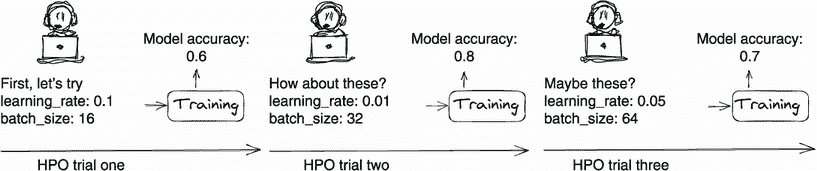
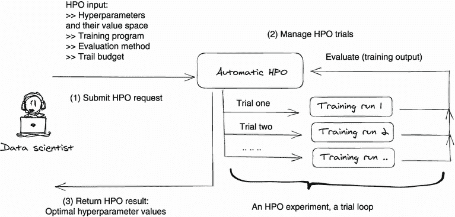
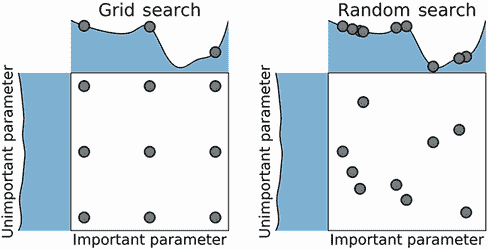
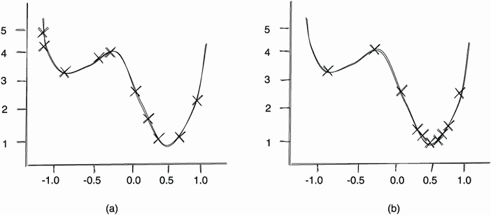
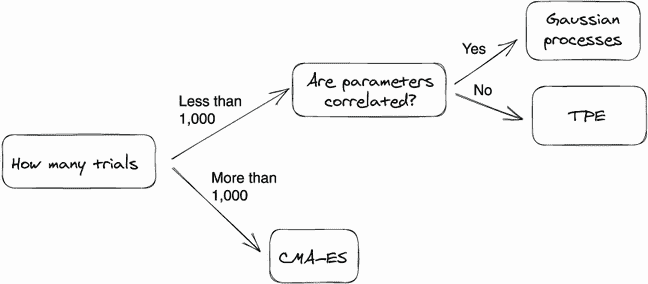
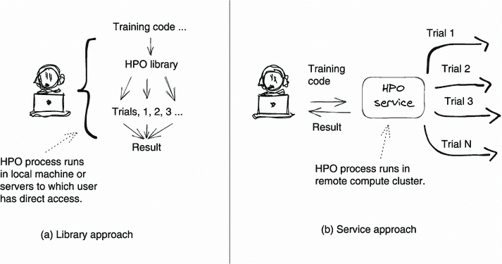
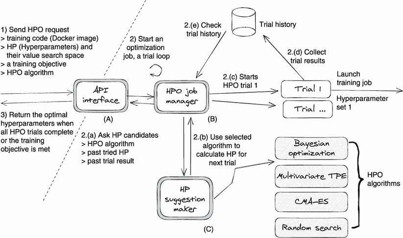
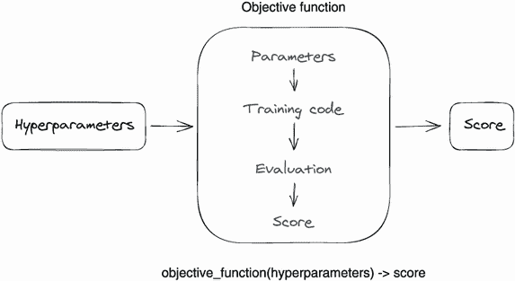
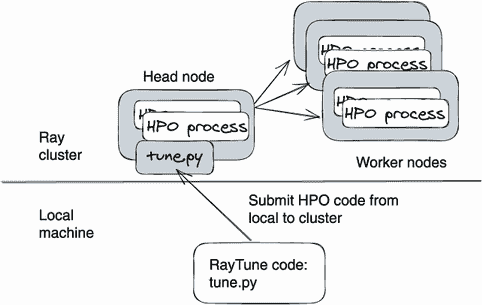

# 第五章：超参数优化服务

本章内容包括

+   超参数及其重要性

+   超参数优化（HPO）的两种常见方法

+   设计一个 HPO 服务

+   三个流行的 HPO 库：Hyperopt、Optuna 和 Ray Tune

在前两章中，我们看到了模型是如何训练的：一个训练服务管理着远程计算集群中的训练过程，并提供给定的模型算法。但模型算法和训练服务并不是模型训练的全部。还有一个组成部分我们尚未讨论过——超参数优化（HPO）。数据科学家经常忽视这样一个事实，即超参数选择可以显着影响模型训练结果，特别是当这些决策可以使用工程方法自动化时。

超参数是必须在模型训练过程开始之前设置其值的参数。学习率、批量大小和隐藏层数量都是超参数的示例。与模型参数的值（例如权重和偏置）不同，超参数在训练过程中不能被学习。

研究表明，超参数的选择值可以影响模型训练的质量以及训练算法的时间和内存要求。因此，必须调整超参数以使其对模型训练最优。如今，HPO 已经成为深度学习模型开发过程中的标准步骤。

作为深度学习组件之一，HPO 对软件工程师非常重要。这是因为 HPO 不需要对深度学习算法有深入的理解，所以工程师经常被分配到这项任务。大多数情况下，HPO 可以像黑盒子一样运行，训练代码不需要修改。此外，工程师有能力构建一个自动 HPO 机制，使 HPO 成为可能。由于要调整的超参数（学习率、epoch 数量、数据批量大小等）以及要尝试的值太多，手动调整每个超参数值是不现实的。软件工程师非常适合创建一个自动化系统，因为他们在微服务、分布式计算和资源管理方面有着丰富的经验。

在本章中，我们将重点介绍自动 HPO 的工程。我们首先介绍了与使用 HPO 工作所需的背景信息。我们深入了解超参数及其调整或优化过程。我们还将遇到一些流行的 HPO 算法，并比较了两种自动化 HPO 的常见方法：使用库和构建服务。

然后我们将开始设计。我们将看看如何设计一个 HPO 服务，包括创建 HPO 服务的五个设计原则，以及在此阶段特别重要的一个通用设计提案。最后，我们向您展示三个流行的开源 HPO 框架，如果您想在本地优化训练代码，这些框架将是完美的选择。

不同于之前的章节，本章我们不会构建一个全新的示例服务。相反，我们建议您使用开源的 Kubeflow Katib（见附录 C 中讨论）。Katib 是一个设计良好、可扩展且高度可移植的 HPO 服务，几乎可以用于任何 HPO 项目。因此，如果对您来说这是一个低成本的解决方案，我们就不需要再构建一个了。

本章应该为您提供 HPO 领域的全面视角，同时还为您提供了如何针对您的具体需求运行 HPO 的实用理解。无论您决定使用远程服务还是在本地机器上使用 Hyperopt、Optuna 或 Ray Tune 等库/框架来运行 HPO，我们都可以为您提供支持。

## 5.1 理解超参数

在我们学习如何调整超参数之前，让我们更清晰地了解一下超参数是什么以及它们为什么重要。

### 5.1.1 什么是超参数？

训练深度学习模型的过程使用两种类型的参数或数值：*模型参数*和*超参数*。模型参数是可训练的，也就是说，在模型训练过程中它们的值是学习到的，并且随着模型的迭代而改变。相比之下，超参数是静态的；这些配置在训练开始之前就已经被定义和设置好了。例如，我们可以在输入参数中将训练时期设置为 30，并将神经网络的激活函数设置为 ReLU（修正线性单元）来启动模型训练过程。

换句话说，任何影响模型训练性能但无法从数据中估计的模型训练配置都是超参数。一个模型训练算法中可能有数百个超参数，包括例如模型优化器的选择—ADAM（见“Adam: A Method for Stochastic Optimization,” by Diederik P. Kingma and Jimmy Ba; [`arxiv.org/abs/1412.6980`](https://arxiv.org/abs/1412.6980))或 RMSprop（见“A Look at Gradient Descent and RMSprop Optimizers,” by Rohith Gandhi; [`mng.bz/xdZX`](http://mng.bz/xdZX)）—神经网络中的层数、嵌入维度、小批量大小和学习率。

### 5.1.2 超参数为什么重要？

超参数的值选择对模型训练结果有巨大影响。通常手动设置，这些值控制着训练算法执行的行为，并确定模型训练的速度和模型的准确度。

要亲自看到这种效果，您可以通过在 TensorFlow playground（[`playground.tensorflow.org`](https://playground.tensorflow.org)）中运行模型训练来尝试不同的超参数值。在这个在线游乐场中，您可以设计自己的神经网络，并训练它以识别四种类型的图案。通过设置不同的超参数，比如学习率、正则化方法、激活函数、神经网络层数和神经元数量，您不仅会看到模型性能的变化，还会看到学习行为的变化，比如训练时间和学习曲线。要在这个游乐场中训练一个能够识别复杂数据模式（如螺旋形）的模型，我们需要非常小心地选择超参数。例如，尝试将隐藏层数量设置为 6，每层神经元数量设置为 5，激活函数设置为`ReLU`，数据批量大小设置为 10，正则化方法设置为`L1`。经过近 500 个 epochs 的训练，您会发现该模型可以对螺旋形图表进行准确的分类预测。

在研究领域，超参数选择对模型性能的影响早已有据可查。以自然语言处理嵌入训练为例。一篇论文，“Improving Distributional Similarity with Lessons Learned from Word Embeddings,”由 Levy 等人（[`aclanthology.org/Q15-1016.pdf`](https://aclanthology.org/Q15-1016.pdf)）撰写，揭示了词嵌入的许多性能增益都归因于某些系统设计选择以及 HPO（Hyperparameter Optimization，超参数优化）而不是嵌入算法本身。在 NLP 嵌入训练中，这些作者发现超参数的选择比训练算法的选择更具影响力！因为超参数选择对模型训练性能非常关键，所以超参数调整现在已经成为模型训练过程中的标准步骤。

## 5.2 理解超参数优化

现在您已经对超参数是什么以及它们为何对模型训练如此重要有了坚实的理解，让我们转向优化这些超参数的过程。在本节中，我们将为您介绍 HPO 的步骤。我们还将看看用于优化超参数的 HPO 算法，以及执行 HPO 的常见方法。

### 5.2.1 什么是 HPO？

HPO，或调整，是发现一组产生最佳模型的超参数的过程。这里的最佳意味着在给定数据集上最小化预定义损失函数的模型。在图 5.1 中，您可以看到 HPO 在模型训练过程中的通用工作流程的高级视图。


图 5.1 这个 HPO 工作流程的高级视图显示，该过程本质上是一个实验，旨在找到最佳的超参数值。

从图 5.1. 可以看出，HPO 工作流程可以被可视化为一个由四个步骤构成的循环。它向我们展示了 HPO 过程是一个重复的模型训练过程，只是每次神经网络都会使用不同的超参数集进行训练。在这个过程中将发现最优的超参数集。我们通常将每次模型训练的运行称为“试验”。整个 HPO 实验是一个试验循环，在此循环中我们运行一个试验接着运行另一个试验，直到满足结束条件。

注意为了公正评估，每个 HPO 试验都使用相同的数据集。

每次试验分为四个步骤，如图 5.1. 所示。第一步是使用一组超参数值训练神经网络。第二步是评价训练输出（模型）。

在第 3 步中，HPO 过程检查是否已满足结束条件，例如是否已用完试验预算，或者是否在此试验中产生的模型已达到我们的性能评估目标。如果试验结果满足结束条件，则试验循环中断，实验结束。产生最佳模型评估结果的超参数值被视为最优超参数。

如果未满足结束条件，则过程进入步骤 4：HPO 过程将产生一组新的超参数值，并通过触发模型训练运行来开始一个新的试验。每个试验中使用的超参数值可以通过手动或自动由 HPO 算法生成。让我们在接下来的两个部分中更详细地看看这两种方法和 HPO 算法。

手动 HPO

作为数据科学家，我们经常手动选择超参数值来运行图 5.1. 中的 HPO 过程。尽管，可以承认的是，手动选择最佳超参数值更像是即兴表演而不是科学。但是我们也在借鉴我们的经验以及从其中获得的直觉。我们通常会使用经验性的超参数值开始模型训练，例如在相关的已发表论文中使用的值，然后进行一些微小的调整并测试模型。经过几次试验后，我们手动比较模型性能并从这些试验中选择表现最佳的模型。图 5.2. 演示了这个工作流程。



图 5.2. 手动选择超参数值可能会很繁琐且耗时。

手动 HPO 的最大问题在于我们不知道我们的超参数值是否最佳，因为我们只是选择一些经验值并对其进行微调。为了获得最优值，我们需要尝试所有可能的超参数值，也就是搜索空间。在图 5.2 的示例中，我们想要优化两个超参数：学习速率和数据集批处理大小。在 HPO 过程中，目标是找到产生最佳模型的 `batch_size` 和 `learning_rate` 对。假设我们将 `batch_size` 的搜索空间定义为 {8, 16, 32, 64, 128, 256}，并将 `learning_rate` 的另一个搜索空间定义为 {0.1, 0.01, 0.001, 0.5, 0.05, 0.005}。那么我们需要验证的超参数值的总数是 36（62）。

因为我们要手动运行 HPO，我们必须运行模型训练过程（HPO 试验）36 次，并记录每个试验中使用的模型评估结果和超参数值。完成所有 36 次试验并比较结果后，通常是模型准确率，我们找到了最佳的 `batch_size` 和 `learning_rate`。

手动运行整个超参数搜索空间的 HPO 可能会耗时、容易出错且繁琐，正如你所见。此外，深度学习超参数通常具有复杂的配置空间，通常由连续、分类和条件超参数的组合以及高维度组成。目前，深度学习行业正在向自动 HPO 迈进，因为手动 HPO 简单不可行。

自动 HPO

自动 HPO 是利用计算能力和算法自动找到训练代码的最佳超参数的过程。这一想法是使用高效的搜索算法在没有人类干预的情况下发现最佳超参数。

我们还希望自动 HPO 以黑盒方式运行，因此它对其正在优化的训练代码无知，因此我们可以轻松地将现有的模型训练代码引入到 HPO 系统中。图 5.3 显示了自动化的 HPO 工作流程。



图 5.3 自动化的 HPO 工作流程

在第 1 步，数据科学家向自动 HPO 系统提交 HPO 请求，该系统以黑盒方式运行 HPO 过程（图 5.3）。他们将要优化的超参数及其值搜索空间输入黑盒（图 5.3 中的“自动 HPO”框）--例如，学习速率的搜索空间可能是 [0.005, 0.1]，数据集批处理大小的搜索空间可能是 {8, 16, 32, 64, 128, 256}。数据科学家还需要配置训练执行，例如训练代码；评估方法；退出目标；以及试验预算，比如这次实验总共 24 次试验。

一旦用户提交了 HPO 请求，HPO 实验（步骤 2）就会开始。HPO 系统安排所有试验并管理其训练执行；它还运行 HPO 算法为每个试验生成超参数值（从搜索空间中挑选值）。当试验预算用完或达到训练目标时，系统会返回一组最优的超参数值（步骤 3）。

自动 HPO 依赖于两个关键组件：HPO 算法和试验训练执行管理。使用高效的 HPO 算法，我们可以使用更少的计算资源找到最优的超参数值。通过使用复杂的训练管理系统，数据科学家可以在整个 HPO 过程中无需手动操作。

注意：由于手动 HPO 的低效性，自动 HPO 是主流方法。为了简洁起见，在本章的其余部分中，我们将使用术语 *HPO* 来指代“自动超参数优化”。

### 5.2.2 流行的 HPO 算法

大多数 HPO 算法可以归类为三个桶：无模型优化、贝叶斯优化和多途径优化。

注意：因为本章的主要目标是教授 HPO 工程，所以这里讨论的 HPO 算法将保持在高级别。本节的目标是为您提供足够的 HPO 算法背景知识，以便能够构建或设置 HPO 系统。如果您想了解算法背后的数学推理，请查看 *AutoML: Methods, Systems, Challenges* 一书的第一章“Hyperparameter Optimization”，作者是 Matthias Feurer 和 Frank Hutter ([`mng.bz/AlGx`](http://mng.bz/AlGx))，以及 Bergstra 等人的论文“Algorithms for Hyper-Parameter Optimization” ([`mng.bz/Zo9A`](http://mng.bz/Zo9A))。

无模型优化方法

在无模型方法中，数据科学家不对训练代码做任何假设，并忽略 HPO 试验之间的相关性。网格搜索和随机搜索是最常用的方法。

在网格搜索中，用户为每个超参数指定了一组有限的值，然后从这些值的笛卡尔积中选择试验超参数。例如，我们可以首先指定学习率的值集（搜索空间）为{0.1, 0.005, 0.001}，数据批量大小为{10, 40, 100}，然后用这些集合的笛卡尔积（作为网格值）构建网格，例如 (0.1, 10)，(0.1, 40)，和 (0.1, 100)。构建网格后，我们可以使用网格值开始 HPO 试验。

当超参数数量变大或参数的搜索空间变大时，网格搜索会遇到困难，因为在这种情况下所需的评估数量会呈指数增长。网格搜索的另一个问题是其效率低下。因为网格搜索将每组超参数候选视为相等，所以它会在非最优配置空间浪费大量计算资源，而在最优空间上则没有足够的计算资源。

随机搜索通过在超参数配置空间中随机采样，直到搜索的某个预算用尽为止来工作。例如，我们可以将学习速率的搜索空间设置为[0.001, 0.1]，数据批量大小设置为[10, 100]，然后将搜索预算设置为 100，这意味着它将运行总共 100 次 HPO 试验。在每次试验中，会在 0.001 和 0.1 之间随机选择一个值作为学习速率，并在 10 和 100 之间随机选择一个值作为数据批量大小。

此方法比网格搜索有两个优点。首先，随机搜索可以评估每个超参数的更多值，这增加了找到最优超参数集的机会。其次，随机搜索具有更简单的并行化要求；因为所有评估工作者可以完全并行运行，它们无需彼此通信，并且失败的工作者不会在搜索空间中留下空缺。但是在网格搜索中，失败的工作者可以跳过分配给 HPO 工作者的试验超参数。

随机搜索的缺点是不确定性；不能保证在有限的计算预算内找到最优的超参数集。理论上，如果我们允许足够的资源，随机搜索可以在搜索中添加足够的随机点，因此它将如预期地找到最优超参数集。在实践中，随机搜索被用作基线。



图 5.4 网格搜索和随机搜索的比较，以最小化具有一个重要参数和一个不重要参数的函数。（来源：Matthias Feurer 和 Frank Hutter 的“超参数优化”的图 1.1。在*AutoML: Methods, Systems, Challenges*中，由 Frank Hutter，Lars Kotthoff 和 Joaquin Vanschoren 编辑; Springer, 2019. [www.automl.org/wp-content/uploads/2019/05/AutoML_Book_Chapter1.pdf](http://www.automl.org/wp-content/uploads/2019/05/AutoML_Book_Chapter1.pdf)）

图 5.4 展示了网格搜索和随机搜索之间的比较。网格搜索中的试验超参数候选项（黑色点）是重要参数值（行中）和不重要值点（列中）的笛卡尔积。它们的分布可以看作是搜索空间中的一个网格（白色方形画布）。随机搜索算法从搜索空间中随机获取超参数候选项。当给定足够的搜索预算时，其搜索点更有可能接近最优位置。

基于模型的贝叶斯优化

贝叶斯优化是一种用于全局优化昂贵黑箱函数的最先进的优化框架。它广泛应用于各种问题设置，例如图像分类，语音识别和神经语言建模。

贝叶斯优化方法可以使用不同的采样器，例如高斯过程回归 (见“高斯过程回归的直观教程”，Jie Wang; [`arxiv.org/abs/2009.10862`](https://arxiv.org/abs/2009.10862)) 和基于树结构的 Parzen 估计方法 (TPE)，来计算搜索空间中的超参数候选。简单来说，贝叶斯优化方法使用统计方法根据过去试验中使用的值及其评估结果计算新的超参数值建议。

注意 为什么叫贝叶斯优化？贝叶斯分析 ([`www.britannica.com/science/Bayesian-analysis`](https://www.britannica.com/science/Bayesian-analysis)) 是一种广泛使用的统计推断方法，以英国数学家托马斯·贝叶斯 ([`www.britannica.com/biography/Thomas-Bayes`](https://www.britannica.com/biography/Thomas-Bayes)) 命名，它允许您将有关总体参数的先验信息与样本中包含的信息的证据相结合，以指导统计推断过程。基于这种方法，乔纳斯·莫库斯 (Jonas Mockus) 在他在 1970 年代和 1980 年代的全局优化工作中引入了贝叶斯优化 (见“贝叶斯线性回归”，布鲁娜·温德瓦尔德; [`www.researchgate.net/publication/333917874_Bayesian_Linear_Regression`](https://www.researchgate.net/publication/333917874_Bayesian_Linear_Regressionin)) 这个术语。

贝叶斯优化方法背后的概念是，如果算法能够从过去的试验中学习，那么寻找最佳超参数的过程将更加高效。在实践中，贝叶斯优化方法可以通过较少的评估运行（试验）找到最佳超参数集，并且比其他搜索方法更稳定。图 5.5 显示了随机搜索和贝叶斯方法之间的数据采样差异。



图 5.5 随机搜索 (a) 和贝叶斯方法 (b) 的数据采样器比较，使用 10 次试验

假设最佳超参数值在 (x,y) = (0.5, 1)，我们试图使用随机搜索和贝叶斯搜索找到它。在图 5.5 (a) 中，我们看到数据在搜索空间中随机抽样，其中 x := [–1.0, 1.0]，y := [1, 5]。在图 5.5 (b) 中，我们看到数据在区域 (x := [0.3, 0.7]，y := [1,1.5]) 中密集抽样，最佳值位于该区域。这种比较表明，在给定的搜索空间中，贝叶斯搜索更有可能找到最佳超参数，并且在有限的执行预算下，选择的（抽样的）超参数值在搜索过程中的每次实验后越来越接近最佳值。

还有其他先进的超参数优化算法，例如 Hyperband（[`mng.bz/Rlwv`](http://mng.bz/Rlwv)）、TPE（[`mng.bz/2a6a`](http://mng.bz/2a6a)）和协方差矩阵适应进化策略（CMA-ES；[`mng.bz/1M5q`](http://mng.bz/1M5q)）。尽管它们不完全遵循与贝叶斯-高斯过程方法相同的数学理论，但它们共享相同的超参数选择策略：通过考虑历史评估结果来计算下一个建议的值。

多信度优化

多信度方法提高了无模型和贝叶斯优化方法的效率。如今，在大型数据集上调整超参数可能需要几个小时甚至几天。为了加速超参数优化，开发了多信度方法。采用这种方法，我们使用实际损失函数的所谓低信度近似来最小化损失函数。因此，在超参数优化过程中我们可以跳过很多计算。

在机器学习的背景下，损失函数（[`www.datarobot.com/blog/introduction-to-loss-functions/`](https://www.datarobot.com/blog/introduction-to-loss-functions/)）是评估训练算法对数据集建模效果的一种方法。如果模型输出（预测）与期望结果相差很远，损失函数应该输出较高的数字；否则，应该输出较低的数字。损失函数是机器学习算法开发的关键组成部分；损失函数的设计直接影响模型准确性。

尽管这种近似方法在优化性能和运行时间之间引入了一种权衡，但在实践中，加速往往超过了近似误差。有关更多详细信息，请参阅 Matthias Feurer 和 Frank Hutter 的“超参数优化”（[www.automl.org/wp-content/uploads/2019/05/AutoML_Book_Chapter1.pdf](http://www.automl.org/wp-content/uploads/2019/05/AutoML_Book_Chapter1.pdf)）。

贝叶斯式超参数优化算法为什么有效？

Michael McCourt 的博客文章“高斯过程背后的直觉”（[`sigopt.com/blog/intuition-behind-gaussian-processes/`](https://sigopt.com/blog/intuition-behind-gaussian-processes/)）对为什么贝叶斯优化算法可以在不检查搜索空间中的每个可能值的情况下找到最佳超参数集提供了很好的解释。在某些情况下，我们观察到的实验是独立的，例如抛硬币 50 次；一个的知识并不意味着对其他的了解。但是，幸运的是，许多情况具有更有用的结构，从中以往的观察结果能够提供对未观察到的结果的见解。

在机器学习的背景下，我们假设历史实验（训练试验）结果与未来实验结果之间存在某种关系。更具体地说，我们相信存在一个数学模型来描述这种关系。虽然使用贝叶斯方法——例如，高斯过程——来建模这种关系是一个非常强的假设，但我们得到了强大的力量来做出可证明的最优预测。一个额外的好处是，我们现在有一种处理模型预测结果不确定性的方法。

注意 如果您有兴趣将贝叶斯优化应用于深度学习项目，Quan Nguyen 的书籍 *贝叶斯优化实战*（Manning, 2022; [`www.manning.com/books/bayesian-optimization-in-action`](https://www.manning.com/books/bayesian-optimization-in-action)）是一个很好的资源。

哪种 HPO 算法效果最好？

没有单一的 HPO 算法最好。不同的优化算法可能适用于不同的调优任务，在不同的约束条件下。其中一些变量可能包括搜索空间的外观（例如，超参数类型、值范围）、试验预算的外观以及目标是什么（最终最优性或随时最优性能）。图 5.6 显示了来自 Optuna ([`optuna.org/`](https://optuna.org/)) HPO 框架的 HPO 算法选择指南。



图 5.6 来自 Optuna HPO 框架的 HPO 算法选择备忘单

在图 5.6 中，我们看到一个关于何时使用以下三种 HPO 算法的决策图：高斯过程、TPE 和 CMA-ES。由于 HPO 是一个快速发展的领域，新的高效算法随时可能被发布，因此像这样的算法选择备忘单将很快过时。例如，FLAML ([`github.com/microsoft/FLAML`](https://github.com/microsoft/FLAML)) 是一个新开发的 Python HPO 库，它在 HPO 过程中检查超参数之间的相关性；它绝对值得一试。因此，请咨询您的数据科学团队以获取最新的 HPO 算法选择指南。

注意 HPO 算法不是 HPO 工程的主要关注点。HPO 算法背后的数学可能会让人望而生畏，但幸运的是，这不是工程师的重点。通常，确定要为某个特定训练任务使用哪种 HPO 算法是数据科学家的工作。作为工程师，我们的角色是构建一个灵活、可扩展的黑盒式 HPO 系统，以便数据科学家可以轻松地使用任意 HPO 算法运行其模型训练代码。

### 5.2.3 常见的自动 HPO 方法

幸运的是，今天已经存在许多成熟的框架和系统用于进行 HPO。根据使用情况，它们分为两种不同的类别：HPO 库方法和 HPO 服务方法。图 5.7 说明了这两种方法。现在让我们逐一讨论它们。

HPO 库方法

在图 5.7（a）中，库方法，我们看到数据科学家自己管理 HPO 过程，从编码到执行。他们使用 HPO 库（例如 Hyperopt——一个开源的 Python HPO 库）编写整个 HPO 流程，并将其与训练代码一起集成到一个训练应用程序中。接下来，数据科学家在本地计算机或直接访问的服务器上运行此应用程序。应用程序内的 HPO 库将执行我们在图 5.3 中看到的 HPO 工作流。



图 5.7 两种不同的 HPO 方法：库 vs 服务。（a）HPO 库可以在本地计算机或经过预配置的服务器组上运行 HPO 实验（训练）；（b）HPO 服务可以以完全远程和自动化的方式运行 HPO 实验。

灵活性和敏捷性是库方法的最大优势；你可以选择任何你喜欢的 HPO 算法/库，将它们集成到你的训练代码中，立即开始 HPO 过程，因为一切（训练加上超参数计算）都发生在你的本地计算机上。一些 HPO 库——例如 Ray Tune（5.4.3 节）——也支持并行分布式执行，但不是完全自动化的。这需要设置一个具有特定软件的分布式计算组，允许跨计算机通信，并且需要在每台服务器上手动启动并行过程。

库方法面临的最大挑战是可扩展性、可重用性和稳定性。HPO 需要大量的计算资源来执行其试验，因此单个服务器通常无法执行 HPO。即使具有分布功能，它仍然无法扩展。想象一下，我们想要使用 20 台服务器进行需要 10,000 次试验的 HPO 任务；我们需要在 20 台服务器上手动设置 HPO 过程，并在每次训练或 HPO 代码更改时重新设置。此外，如果 20 个并行工作中的 1 个失败，整个 HPO 工作组都会停止。为了解决这些问题，引入了 HPO 服务方法。

HPO 服务方法

现在让我们更仔细地看看 HPO 服务方法；我们为清晰起见重复图 5.7，这里呈现为图 5.8。在图 5.8（b）中，服务方法，我们看到 HPO 发生在一个远程计算集群中，由一个服务——HPO 服务管理。数据科学家只向服务提供训练代码和选定的 HPO 算法配置，并启动 HPO 作业。该服务管理计算资源分配和 HPO 工作流程（图 5.3）的执行；它跟踪每个试验的结果（模型性能指标，例如准确性），并在所有试验完成时向数据科学家返回最终的最佳超参数。


图 5.8 两种不同的 HPO 方法：库 vs 服务

该服务方法提供了真正的黑盒体验。数据科学家无需担心管理自己的服务器、设置试验工作者，以及学习如何修改训练代码以适应不同的 HPO 算法。HPO 服务会处理所有这些任务。作为 HPO 服务的用户，我们只需将参数传递给服务，然后服务会自动运行 HPO 并在最后返回最优超参数。该服务还负责自动缩放和失败试验作业的故障恢复。由于这些优点，服务方法现在是深度学习生产环境中的主导 HPO 方法。由于您现在熟悉了 HPO 的概念和方法，让我们在接下来的两节中看看如何设计 HPO 服务以及如何使用 HPO 库。

注意 HPO *不是*一次性工作。如果使用不同的数据集进行训练，即使模型架构没有改变，您也需要重新进行 HPO。如果数据集发生变化，最优模型权重集也会发生变化，因此您需要进行新的 HPO 搜索工作。

## 5.3 设计一个 HPO 服务

现在你已经对 HPO 库方法有了很好的理解，让我们来回顾一下 HPO 服务方法。在这一节中，我们将看看如何设计一个 HPO 服务，以支持对任意模型训练进行自动和黑盒方式的 HPO。

### 5.3.1 HPO 设计原则

在我们查看具体的设计方案之前，让我们先来了解一下构建 HPO 服务的五个设计原则。

原则 1：训练代码不可知

HPO 服务需要对训练代码和模型训练框架保持不可知。除了支持像 TensorFlow、PyTorch 和 MPI 这样的任意机器学习框架之外，我们希望该服务能够调整任何编程语言编写的训练代码的超参数。

原则 2：在支持不同 HPO 算法方面具有可扩展性和一致性

从第 5.2.2 节的 HPO 算法讨论中，我们知道超参数搜索算法是 HPO 过程的核心。超参数搜索的效率决定了 HPO 的性能。一个好的 HPO 算法可以在少量试验中找到大量超参数和任意搜索空间的最优超参数。

由于 HPO 算法研究是一个活跃的领域，每隔几个月就会发表一个新的有效算法。我们的 HPO 服务需要轻松集成这些新算法，并将它们作为算法选项暴露给客户（数据科学家）。此外，新添加的算法在用户体验方面应该与现有算法保持一致。

原则 3：可扩展性和容错性

除了 HPO 算法之外，HPO 服务的另一个重要责任是管理用于 HPO 的计算资源——具有各种超参数值的模型训练。从 HPO 实验的角度来看，我们希望在实验级别和试验级别进行分布式执行。更具体地说，我们不仅希望以分布式和并行的方式运行试验，还希望能够以分布式方式运行单个训练试验——例如，在一个试验中进行模型训练的分布式训练。从资源利用的角度来看，系统需要支持自动缩放，以使计算集群大小能够根据当前工作负载自动调整，从而不会出现资源的过度或不足利用。

容错性也是 HPO 试验执行管理的另一个重要方面。容错性很重要，因为一些 HPO 算法需要按顺序执行试验。例如，试验 2 必须在试验 1 之后进行，因为算法需要过去的超参数值和结果来推断下一个试验开始前的超参数。在这种情况下，当一个试验意外失败——例如，由于节点重新启动或网络问题——整个 HPO 过程都会失败。系统应自动从之前的故障中恢复。常见的方法是记录每个试验的最新状态，这样我们就可以从上次记录的检查点继续恢复。

原则 4：多租户性

HPO 过程本质上是一组模型训练执行。与模型训练类似，HPO 服务必须为各种用户或组提供资源隔离。这将确保不同的用户活动保持在其边界内。

原则 5：可移植性

如今，“云中立”概念变得非常流行。人们希望在不同的环境中运行他们的模型训练工作——亚马逊网络服务、谷歌云平台和 Azure——因此我们构建的 HPO 服务需要与基础架构解耦。在这里，使用 Kubernetes 运行 HPO 服务是一个不错的选择。

### 5.3.2 一般 HPO 服务设计

因为 HPO 工作流程（图 5.3）非常标准且变化不大，所以 HPO 服务系统设计（图 5.9）可以应用于大多数 HPO 场景。它由三个主要组件组成：API 接口、HPO 作业管理器和超参数（HP）建议生成器。（它们在图 5.9 中分别标记为 A、B 和 C。）


图 5.9 HPO 服务的一般系统设计

API 接口（组件 A）是用户提交 HPO 作业的入口点。要启动 HPO 实验，用户向接口提交 API 请求（步骤 1）；请求提供模型训练代码，如 Docker 镜像；超参数及其搜索空间；以及 HPO 算法。

HP 建议制定者（组件 C）是不同 HPO 算法的包装器/适配器。它为用户运行每个不同的 HPO 算法提供了一个统一的接口，因此用户可以选择算法而不必担心执行细节。要添加新的 HPO 算法，必须在此建议制定者组件中注册它，以成为用户的算法选项。

HPO 作业管理器（组件 B）是 HPO 服务的核心组件；它管理客户请求的 HPO 实验。对于每个 HPO 请求，作业管理器启动一个 HPO 试验循环（步骤 2）。在循环中，它首先调用 HP 建议制定者来获得建议的超参数值集合（步骤 2.a），然后创建一个试验以使用这些超参数值运行模型训练（步骤 2.b 和 2.c）。

对于每个训练试验，HPO 作业管理器都会创建一个试验对象。该对象有两个职责：首先，它收集试验执行的输出，例如训练进度、模型指标、模型准确性和尝试的超参数；其次，它管理训练过程。它处理训练过程的启动、分布式训练设置和失败恢复。

HPO 服务的端到端执行流程

让我们按照图 5.9 显示的端到端用户工作流程来走一遍。为了方便起见，我们重复了图 5.9 并将其显示为图 5.10。



图 5.10 HPO 服务的一般系统设计

首先，用户向 API 接口提交 HPO 请求（步骤 1）。该请求定义了训练代码、超参数及其值搜索空间的列表、训练目标和一个 HPO 算法。然后，HPO 作业管理器为该请求启动 HPO 试验循环（步骤 2）。该循环启动一组试验来确定哪组超参数值最好。最后，当试算预算用尽或一次试验达到训练目标时，试验循环会中断，最优超参数会被返回（步骤 3）。

在试验循环中，作业管理器首先查询 HP 建议制定者以推荐超参数候选项（步骤 2.a）。制定者将运行所选的 HPO 算法来计算一组超参数值，并将其返回给作业管理器（步骤 2.b）。然后，作业管理器创建一个试验对象，以使用建议的超参数值启动模型训练过程（步骤 2.c）。试验对象还将监视训练过程，并继续向试验历史数据库报告训练指标，直到训练完成（步骤 2.d）。当作业管理器注意到当前试验已完成时，它将拉取试验历史记录（试验指标和用于过去试验的超参数值）并将其传递给 HP 建议制定者以获得新的 HP 候选项（步骤 2.e）。

因为 HPO 的使用案例非常标准和通用，并且已经有多个开源的 HPO 项目可以直接使用，我们认为学习如何使用它们比重新构建一个没有附加值的新系统更好。因此，在附录 C 中，我们将介绍一个功能强大且高度可移植的基于 Kubernetes 的 HPO 服务——Kubeflow Katib。

## 5.4 开源 HPO 库

对于一个小型数据科学家团队来说，HPO 服务可能会显得太过繁重，特别是如果他们所有的模型都是在他们自己管理的几台服务器上训练的话。在这种情况下，在本地机器或托管集群（小规模，1-10 台服务器）上使用 HPO 库来优化模型训练是一个更好的选择。

在这一部分，我们将介绍三个有用的 HPO 开源库：Optuna、Hyperopt 和 Ray Tune。它们都作为 HPO 库运行，而且易于学习和简单使用。因为 Optuna、Hyperopt 和 Ray Tune 都有明确的入门文档和合适的示例，我们将重点放在一般概述和功能介绍上，这样你就可以根据自己的情况决定使用哪一个。

在接下来关于不同的 HPO 库的讨论中，特别是在“如何使用”部分，你会经常看到术语 *目标函数*。什么是目标函数？图 5.11 展示了这个过程。

对于 HPO 算法（例如贝叶斯搜索）来说，为了生成一个超参数建议，使得下一个试验效果更好，它需要知道上一个 HPO 试验的表现如何。因此，HPO 算法要求我们定义一个函数来评分每个训练试验，并在随后的试验中继续最小化或最大化函数的返回值（分数）。我们将其命名为目标函数。

在图 5.11 中，我们看到一个目标函数接收超参数作为输入，并返回一个浮点值，或者分数。目标函数使用给定的超参数执行模型训练，并在训练完成时评估输出模型。



图 5.11 一个目标函数接收超参数作为输入，并返回一个分数。

### 5.4.1 Hyperopt

Hyperopt ([`hyperopt.github.io/hyperopt/#getting-started`](http://hyperopt.github.io/hyperopt/#getting-started)) 是一个轻量级且易于使用的 Python 库，用于串行和并行 HPO。随机搜索、TPE 和自适应 TPE 是 Hyperopt 中实现的三种 HPO 算法。贝叶斯优化算法（基于高斯过程）和回归树已经设计用于适应，但在书写本书时尚未实现。

如何使用

假设你想知道哪种分类器对你的深度学习案例效果最好。我们可以使用 Hyperopt 在三个步骤中得到答案。

首先，我们创建一个目标函数，基本上是实际训练代码的包装函数，但从`args`变量中读取超参数值。其次，我们为选定的超参数定义搜索空间。第三，我们选择一个 HPO 算法，该算法从搜索空间中选择超参数值，并将它们传递给目标函数以启动优化过程。列表 5.1 实现了这个场景。

在这个例子中，我们想确定哪个分类器能够产生最佳的模型准确性，因此我们选择在三个候选项中优化`classifier_type`超参数：`naive_bayes`、`svm`和`dtree`。你可能还注意到每个分类器都有自己的值搜索空间，比如对于`svm`分类器，有`hp.lognormal('svm_rbf_width', 0, 1)`。在`fmin`函数中（在步骤 3 中），我们将 TPE 指定为 HPO 算法，最大试验数为 10，并将目标函数和搜索空间作为必需参数传入。

列表 5.1 Hyperopt 入门

```py
# Step 1: define an objective function
def objective(args):
  model = train(args)                                   ❶
  return evaluate(model)                                ❶

# Step 2 define search space for hyperparameters 
space = hp.choice('classifier_type', [                  ❷
  {
    'type': 'naive_bayes',
  },
  {
    'type': 'svm',
    'C': hp.lognormal('svm_C', 0, 1),                   ❸
    'kernel': hp.choice('svm_kernel', [                 ❸
      {'ktype': 'linear'},                              ❸
      {'ktype': 'RBF',                                  ❸
       'width': hp.lognormal('svm_rbf_width', 0, 1)},   ❸
    ]),
  },
  {
    'type': 'dtree',
    'criterion': hp.choice('dtree_criterion', 
      ['gini', 'entropy']),
    'max_depth': hp.choice('dtree_max_depth',
      [None, hp.qlognormal('dtree_max_depth_int', 3, 1, 1)]),
    'min_samples_split': hp.qlognormal(
      'dtree_min_samples_split', 2, 1, 1),
  },
  ])

# Step 3 start the hpo process execution 
best = fmin(objective, space, algo=tpe.suggest,
 ➥ max_evals=100)                            ❹
```

❶ 用传入的超参数训练模型并评估结果

❷ 声明了三个分类器候选项

❸ 为 SVM 分类器的参数定义了搜索空间

❹ fmin 函数在选择的算法上最小化目标函数的空间。

并行化

尽管 Hyperopt 是一个独立的库，但我们可以在一组机器的集群中并行运行它。基本思想是在不同的机器上运行 Hyperopt 工作者，并让它们与一个中央数据库进行通信以协调工作。Hyperopt 也可以使用 Spark 计算来并行运行 HPO。您可以查看以下两篇文章以获取更多详细信息：“On Using Hyperopt: Advanced Machine Learning” by Tanay Agrawal ([`mng.bz/PxwR`](http://mng.bz/PxwR)) 和 “Scaling Out Search with Apache Spark” ([`hyperopt.github.io/hyperopt/scaleout/spark/`](http://hyperopt.github.io/hyperopt/scaleout/spark/))。

何时使用

Hyperopt 是小型或早期模型训练项目的一个不错的选择。首先，它易于使用。您可以在本地机器上或直接访问的服务器上运行 HPO 的三个步骤。其次，它对修改友好。由于采用了库方法，HPO 代码与训练代码放置在同一个代码项目中。因此，尝试不同的优化方案，比如选择不同的超参数进行调整，非常方便。

### 5.4.2 Optuna

与 Hyperopt 类似，Optuna 也是一个轻量级的 Python 库，旨在自动化超参数搜索。它支持大空间搜索和在不被看好的试验中进行早期修剪，以及在多个线程或进程上并行执行而无需修改代码。

在我们看来，Optuna 是 Hyperopt 的一个高级版本，其可视化能力要好得多。通过在图表中检查参数之间的相互作用，超参数搜索中的可视化能够为您提供大量见解，因此您可以轻松确定哪些参数比其他参数更有效。Optuna 的可视化效果美观且交互性强。

Optuna 在文档方面也优于 Hyperopt。Optuna 的文档非常出色。除了详细的 API 文档和良好组织的教程外，它还具有维护良好的源代码。如果您查看其 GitHub 项目的问题部分，您将会发现一个非常活跃且不断增长的社区，还有许多出色的功能和 GitHub 拉取请求即将推出。

如何使用

图 5.2 展示了如何快速使用 Optuna 的三个步骤示例：步骤 1，定义目标函数；步骤 2，创建一个表示 HPO 过程的研究对象；步骤 3，启动具有最大试验配额的 HPO 过程。

与 Hyperopt 相比，Optuna 要求大部分 HPO 逻辑在目标函数中定义。通用的代码模式如下。首先，定义搜索空间，并通过`trial.suggest_xxx`函数生成超参数值。接下来，使用采样的超参数值开始模型训练。然后运行评估方法来计算模型性能并返回目标值。在下面的示例中，评估分数由`mean_squared_error`计算。您可以在[`github.com/optuna/optuna-examples`](https://github.com/optuna/optuna-examples)找到更多 Optuna 示例。

图 5.2 使用 Optuna 入门

```py
# Step 1: define an objective function
def objective(trial):

  regressor_name = trial.suggest_categorical(                  ❶
    'classifier', ['SVR', 'RandomForest'])                     ❶
  if regressor_name == 'SVR':
    svr_c = trial.suggest_float(                               ❷
      'svr_c', 1e-10, 1e10, log=True)                          ❷
    regressor_obj = sklearn.svm.SVR(C=svr_c)                   ❷
  else:
    rf_max_depth = trial.suggest_int('rf_max_depth', 2, 32)    ❸
    regressor_obj = sklearn.ensemble
      .RandomForestRegressor(max_depth=rf_max_depth)

  X_train, X_val, y_train, y_val = \
    sklearn.model_selection.train_test_split(X, y, random_state=0)

  regressor_obj.fit(X_train, y_train)                          ❹
  y_pred = regressor_obj.predict(X_val)

  error = sklearn.metrics
    .mean_squared_error(y_val, y_pred)                         ❺
  return error                                                 ❺

# Step 2: Set up HPO by creating a new study.
study = optuna.create_study() 

# Step 3: Invoke HPO process 
study.optimize(objective, n_trials=100)  
```

❶ 设置分类器候选项

❷ 调用 suggest_XXX 方法生成超参数

❸ 在 2 和 32 范围内选择 max_depth

❹ 使用 Optuna 回归器运行模型训练

❺ 将均方误差设置为目标值，并链接到试验对象

并行化

我们可以使用 Optuna 在一台机器或一组机器上运行分布式 HPO。分布式执行设置非常简单，可以分为三个步骤：首先，启动一个关系型数据库服务器，例如 MySQL；其次，创建一个带有存储参数的研究；第三，将研究分享给多个节点和进程。与 Hyperopt 相比，Optuna 的分布式执行设置更简单，可以从单台机器扩展到多台机器而无需修改代码。

何时使用

Optuna 可以被视为 Hyperopt 的继任者；它具有更好的文档、可视化和并行执行。对于任何可以在一个或多个机器上运行的深度学习模型训练项目，您都可以使用 Optuna 来找到最佳的超参数。

Optuna 在支持大型数据科学团队或多个 HPO 项目时会受到限制，因为它需要管理一个中央机器集群来提供计算资源。但是 Optuna 的并行/分布式执行是手动的；人们需要将代码分发到每个服务器并一次在一个服务器上执行它，手动操作。为了以自动和编程方式管理分布式计算作业，我们可以使用 Kubeflow Katib（附录 C）或 Ray Tune。

### 5.4.3 Ray Tune

Ray ([`docs.ray.io/en/latest/index.html`](https://docs.ray.io/en/latest/index.html)) 提供了一个简单、通用的构建分布式应用程序的 API。Ray Tune ([`docs.ray.io/en/latest/tune/index.html`](https://docs.ray.io/en/latest/tune/index.html)) 是建立在 Ray 之上的 Python 库，用于任何规模的 HPO。

Ray Tune 库支持几乎所有机器学习框架，包括 PyTorch、XGBoost、MXNet 和 Keras。它还支持最先进的 HPO 算法，如基于种群的训练（PBT）、BayesOptSearch 和 HyperBand/ASHA。此外，Tune 提供了一种机制，用于集成来自其他 HPO 库的 HPO 算法，如 Hyperopt 集成。

使用 Ray 作为其分布式执行支持，我们可以用几行代码启动一个多节点的 HPO 实验。Ray 将负责代码分发、分布式计算管理和容错。

如何使用

使用 Ray Tune 执行 HPO 任务非常简单。首先，定义一个目标函数。在函数中，从`config`变量读取超参数值，开始模型训练，并返回评估分数。其次，定义超参数及其值搜索空间。第三，通过将目标函数和搜索空间链接起来，启动 HPO 执行。图 5.3 实现了上述三个步骤。

图 5.3 使用 Ray Tune 入门

```py
# Step 1: define objective_function
def objective_function(config):
  model = ConvNet()                                      ❶
  model.to(device)

  optimizer = optim.SGD(                                 ❷
    model.parameters(), lr=config["lr"],                 ❷
    momentum=config["momentum"])                         ❷
  for i in range(10):
    train(model, optimizer, train_loader)                ❸
    acc = test(model, test_loader)

    tune.report(mean_accuracy=acc)                       ❹

# Step 2: define search space for each hyperparameter
search_space = {
   "lr": tune.sample_from(lambda spec: 
      10**(-10 * np.random.rand())),
   "momentum": tune.uniform(0.1, 0.9)                    ❺
}

# Uncomment this to enable distributed execution
# `ray.init(address="auto")`

# Step 3: start the HPO execution
analysis = tune.run(
   objective_function,
   num_samples=20,
   scheduler=ASHAScheduler(metric="mean_accuracy", mode="max"),
   config=search_space)

# check HPO progress and result
# obtain a trial dataframe from all run trials 
# of this `tune.run` call.
dfs = analysis.trial_dataframes
```

❶ ConvNet 是一个自定义的神经网络。

❷ 从输入配置中读取超参数值

❸ 开始模型训练

❹ 将评估结果（准确率）发送回 Tune

❺ 从 0.1 到 0.9 均匀地采样一个浮点值作为“动量”

在第 3 步中，你可能注意到一个调度器对象，`ASHAScheduler`，被传递给`train.run`函数。ASHA ([`mng.bz/JlwZ`](http://mng.bz/JlwZ)) 是一个用于原则性提前停止的可扩展算法（参见“Massively Parallel Hyperparameter Optimization,” by Liam Li; [`mng.bz/wPZ5`](http://mng.bz/wPZ5)）。在高层次上，ASHA 终止了不太有前途的试验，并为更有前途的试验分配时间和资源。通过适当调整参数`num_samples`，搜索可以更加高效，并支持更大的搜索空间。

并行化

相比于 Optuna，Ray Tune 的最大优势就是分布式执行。Ray Tune 允许你透明地在多个 GPU 和多个节点上并行执行（请参阅[Ray 文档](http://mng.bz/qdRx)）。Tune 甚至具备无缝的容错和云支持。与 Optuna 和 Hyperopt 不同，我们不需要手动设置分布式环境，并逐台执行工作脚本。Ray Tune 会自动处理这些步骤。图 5.12 展示了 Ray Tune 如何将 HPO Python 代码分发到一组机器上。



图 5.12 Ray Tune 在一组机器上运行分布式 HPO

首先，我们用命令`"ray  up tune-cluster.yaml"`建立了一个 Ray 集群；`tune-cluster.yaml`是一个声明集群计算资源的集群配置。然后，我们运行以下命令将 HPO 代码从本地机器提交到集群的 head 节点：`"ray submit tune-cluster.yaml tune_ script.py --start -- --ray-address={server_address}"`。接下来，Ray 分配资源，将 HPO 代码复制到服务器，并启动分布式执行。更多详情，请参见“Tune Distributed Experiments” ([`mng.bz/71QQ`](http://mng.bz/71QQ))。

除了分布式 HPO 执行，Ray Tune 还支持单次试验的分布式训练，自动检查点管理和 TensorBoard 日志记录。这些功能为 Ray Tune 增添了巨大的价值，因为它们具有高容错性和简单的故障排除能力。

什么时候使用

与其他 HPO 库相比，Ray Tune 是否是进行 HPO 的最佳选择？暂时是的。在撰写本书时，Ray 提供了底层训练框架（如 TensorFlow 和 PyTorch）与最新的 HPO 算法（例如贝叶斯搜索和 TPE），以及提前停止（ASHA）的集成。它允许我们以简单且可靠的方式分布式地运行 HPO 搜索。

对于大多数数据科学团队，不希望拥有 HPO 服务的情况下，Ray Tune 是建议的方法。它使用简单，并且几乎满足每个模型训练项目的 HPO 需求：丰富的文档，最新的 HPO 算法，高效且简单的分布式执行管理。

注意：我们推荐使用 Ray Tune 而不是其他 HPO 库，理由如下：(1) 使用简单；(2) 文档和示例丰富；(3) 其分布式执行是自动和程序化的；(4) Ray Tune 支持单次试验的分布式训练；(5) Ray Tune 具有调度程序功能（例如，`ASHAScheduler`），可以通过提前终止不太被看好的试验大大降低计算成本。

Ray Tune 的局限性

当我们需要在一个共享的 HPO 系统中支持不同团队和不同的深度学习项目时，Ray Tune 和其他 HPO 库将受到限制。Ray Tune 缺乏计算隔离，这导致了两个大问题。

首先，不同训练代码的包版本可能会导致 Ray workers 之间的冲突。在 Ray Tune 中执行分布式 HPO 时，我们将 HPO 代码提交到 Ray 集群的 head 服务器，然后在集群 workers 中并行运行此代码。这意味着每个 Ray worker 服务器都需要安装每个它需要运行的训练代码的依赖库。想象一下，当您需要在一个 Ray 集群中运行 10 个不同的 HPO 任务时，工作机器需要为这 10 个不同的训练代码安装数百个包，并解决它们的版本冲突时，我们如何管理包安装和潜在的版本冲突。其次，Ray Tune 不强制执行用户隔离。在 Ray Tune 中为不同的数据科学团队建立虚拟边界以限制其计算资源使用是非常困难的。

### 5.4.4 后续步骤

当您遇到 HPO 库的上述问题时，是时候转向 HPO 服务了。我们强烈建议您在考虑构建自己的 HPO 之前阅读附录 C。它介绍了一个坚实的开源 HPO 服务，名为 Kubeflow Katib，这是一个设计良好的通用 HPO 服务。

## 摘要

+   超参数是用于控制学习过程的参数值。这种类型的参数在模型训练中不可学习；因此，我们需要调整它。

+   HPO 是一个发现一组超参数的过程，该组超参数产生了一个最优模型，该模型在给定数据集上最小化了预定义的损失函数。

+   自动 HPO 是使用计算资源和算法（HPO 算法）来自动找到训练代码的最佳超参数的过程。

+   自动 HPO 现在是模型训练的标准步骤。

+   大多数 HPO 算法可以归类为三种类型之一：无模型优化、贝叶斯优化或多态优化。

+   没有单一最佳的 HPO 算法。不同的优化算法可能适用于不同约束条件下的不同 HPO 任务。

+   HPO 可以在库中运行，也可以在远程服务中运行。库方法简单、灵活，适用于小团队和原型阶段的项目，而服务方法适用于大型组织和生产用例。

+   HPO 服务方法提供了一个完全自动的黑盒 HPO 体验，包括计算资源管理；因此，如果您正在为大型团队构建深度学习系统，我们建议采用服务方法。

+   构建 HPO 服务的五个设计原则是训练代码不可知、高可扩展性、高可扩展性和可靠性、HPO 执行和资源消耗隔离，以及高可移植性。

+   为了加速 HPO 实验，我们可以并行训练不同试验的训练执行，引入分布式训练，并及早停止不太有希望的试验。

+   我们鼓励您采用 Kubeflow Katib 作为您的 HPO 服务，而不是自己构建一个新的服务。

+   在三个常用的开源 HPO（超参数优化）库中——Optuna、Hyperopt 和 Ray Tune 中，到目前为止，Ray Tune 被证明是最好的。
