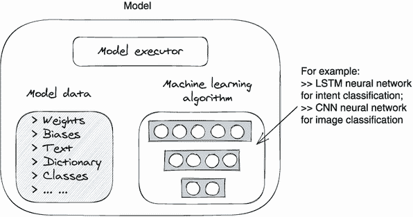
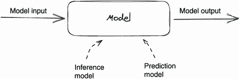
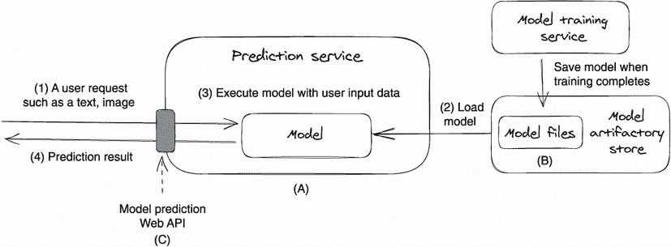
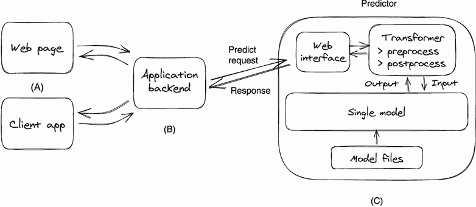
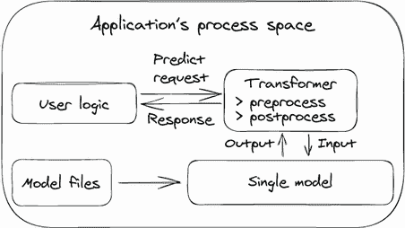
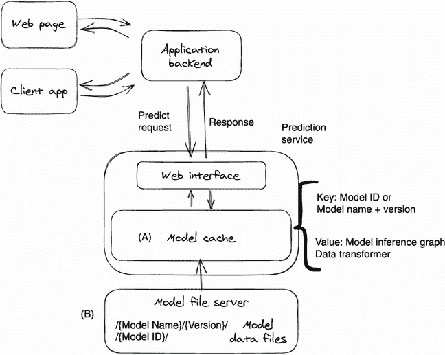
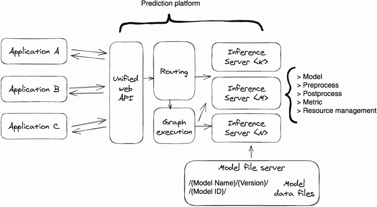

# 第六章：模型服务设计

本章涵盖

+   定义模型服务

+   常见模型服务挑战和方法

+   设计不同用户场景下的模型服务系统

*模型服务*是使用用户输入数据执行模型的过程。在深度学习系统中的所有活动中，模型服务是最接近最终客户的活动。在完成了数据集准备、训练算法开发、超参数调整和测试结果生成模型的所有辛勤工作之后，这些模型由模型服务服务呈现给客户。

以语音翻译为例。在为语音翻译训练了一个序列到序列模型之后，团队准备向世界展示它。为了让人们远程使用这个模型，通常会将模型托管在 Web 服务中，并通过 Web API 公开。然后我们（客户）可以通过 Web API 发送我们的语音音频文件，并获得一个翻译后的语音音频文件。所有模型加载和执行都发生在 Web 服务后端。包括在这个用户工作流程中的一切——服务、模型文件和模型执行——都被称为*模型服务*。

构建模型服务应用程序是另一个特殊的深度学习领域，软件工程师特别适合这个领域。模型服务使用请求延迟、可伸缩性、可用性和可操作性——所有这些都是工程师内外熟知的领域。通过一些深度学习模型服务概念的介绍，有一些分布式计算经验的开发人员可以在构建模型服务元素方面发挥重要作用。

将模型在生产中提供服务可能很具有挑战性，因为模型是由各种框架和算法训练的，因此执行模型的方法和库各不相同。此外，模型服务领域使用的术语令人困惑，有太多不同的术语，如*模型预测*和*模型推理*，听起来不同但在服务上下文中意思相同。此外，有许多模型服务选项可供选择。一方面，我们有像 TensorFlow Serving、TorchServe 和 NVIDIA Triton 推理服务器等黑盒解决方案。另一方面，我们有像构建自己的预测服务或直接将模型嵌入应用程序中这样的定制方法。这些方法看起来都非常相似且功能强大，因此很难选择其中一个。因此，如果您对这个领域还不熟悉，您可能会很快迷失方向。

我们的目标是帮助你找到自己的方向。我们希望能赋予你设计和构建最适合你情况的模型服务解决方案的能力。为了实现这个目标，我们有很多内容需要介绍，包括模型服务的概念理解、服务设计考虑因素、具体示例和模型部署工作流程。为了避免让你阅读超长的一章内容，我们将这部分内容分成了两章：第六章重点关注概念、定义和设计，第七章将这些概念付诸实践，包括构建一个样本预测服务，介绍开源工具以及部署和监控模型生产。

在本章中，我们首先澄清术语，并为模型服务中使用的元素提供我们自己的定义。我们还描述了我们在模型服务领域面临的主要挑战。然后我们将转向设计方面，解释模型服务的三种常见策略，并设计一个适合不同用例的模型服务系统。

通过阅读本章，你不仅会对模型服务的工作原理有扎实的理解，还会了解到可以应对大多数模型服务用例的常见设计模式。随着概念和术语在你脑海中变得清晰，你应该可以自如地参与任何与模型服务相关的讨论，或者阅读关于这个主题的文章和论文。当然，本章也为你在下一章介绍的实际工作奠定了基础。

## 6.1 解释模型服务

在模型服务的工程中，术语是一个主要问题。例如，*模型*、*模型架构*、*推理图*、*预测*和*推理*等术语被人们使用时没有清晰地定义它们，因此它们可以具有相同的含义，也可以根据上下文（模型服务或模型训练）而指代不同的概念。当我们与数据科学家合作构建模型服务解决方案时，模型服务术语的混淆会导致很多交流不畅。在本节中，我们将从工程角度解释模型服务的核心概念，并对常用术语进行解释，以帮助你避免陷入术语陷阱。

### 6.1.1 什么是机器学习模型？

在学术界对机器学习模型有多种定义，从对数据集学习的精简表达到基于以前未见过的信息识别特定模式或做出决策的数学表达。然而，作为模型服务开发人员，我们可以简单地将模型理解为在训练过程中产生的一组文件的集合。

模型的概念很简单，但很多人误解模型只是静态文件。虽然模型被保存为文件，但它们并不是静态的，它们实质上是可执行的程序。

让我们分解这个语句并确定其含义。一个模型由机器学习算法、模型数据和模型执行器组成。*模型执行器*是机器学习算法的封装代码；它接收用户输入并运行算法来计算和返回预测结果。*机器学习算法*是指模型训练中使用的算法，有时也称为*模型架构*。再以语音翻译为例，如果翻译模型是由序列到序列网络作为其训练算法，则模型中的机器学习算法就是相同的序列到序列网络。*模型数据*是运行机器学习算法所需的数据，例如神经网络的学习参数（权重和偏差）、嵌入和标签类别等。图 6.1 展示了一个通用的模型结构。

图 6.1 一个模型由机器学习算法、模型执行器和模型数据组成。

注意 在本章中，我们经常简称机器学习算法为*模型算法*。

本节中最重要的要点是，模型训练执行的输出，也就是模型，并不仅仅只是一组静态数据。相反，深度学习模型是可执行程序，包括机器学习算法及其依赖的数据，因此模型可以根据运行时的输入数据进行预测。

注意 模型不仅仅包括权重和偏差。有时数据科学家将神经网络的训练参数（权重和偏差）保存到一个文件中，并命名为“模型文件”。这会让人们误以为模型只是一个只包含权重和偏差的数据文件。权重和偏差是模型的*数据*，但我们还需要算法和封装代码来运行预测。

### 6.1.2 模型预测和推断

学术界可能认为模型推断和预测是两个不同的概念。模型推断可以指学习数据是如何生成的、理解其原因和影响，而模型预测则可能指对未来事件的预测。

一个样本模型预测的场景可能包括使用销售记录来训练一个模型，以预测哪些个体可能会对下一次营销活动做出回应。而一个样本模型推断的场景将包括使用销售记录来训练一个模型，从产品价格和客户收入的角度理解销售效果。对于模型推断来说，之前未见过的数据上的预测准确性并不是非常重要，因为主要关注的是学习数据生成过程。模型训练的目的是拟合整个数据集。

从工程的角度来看，模型预测和模型推断意味着相同。虽然模型可以被建立和用于不同的目的，但是在模型服务的上下文中，模型预测和模型推断指的是同样的行为：使用给定的数据点执行模型以获得一组输出值。图 6.2 展示了预测模型和推断模型的模型服务工作流程；正如你所见，它们之间没有区别。

图 6.2 模型预测和模型推断在模型服务工程中是相同的。

为了简化本章中插图中的文本，从图 6.2 开始，我们使用 *模型* 一词来表示模型数据、模型执行者和机器学习 (模型) 算法。这不仅是为了保持文本简洁，也强调了机器学习模型是可执行程序。

### 6.1.3 什么是模型服务？

*模型服务* 意味着简单地使用输入数据执行模型进行预测，这包括获取预期的模型、设置模型的执行环境、使用给定的数据点执行模型进行预测，并返回预测结果。模型服务最常用的方法是在 Web 服务中托管模型，并通过 Web API 公开模型的预测功能。

假设我们构建了一个目标检测模型，用于检测海岸图片中的鲨鱼；我们可以构建一个网络服务来托管这个模型，并公开一个鲨鱼检测的 Web API。然后，世界上任何海滨酒店都可以使用这个 Web API 来检测他们自己海岸图片中的鲨鱼。在传统上，我们称模型服务的网络服务为预测服务。

预测服务中的典型模型预测工作流程有四个步骤：接收用户请求；从工件存储加载模型到内存或 GPU；执行模型的算法；最后返回预测结果。图 6.3 展示了这个工作流程。

图 6.3 预测服务中的典型模型预测工作流程

除了四步预测工作流程之外，图 6.3 还提到了模型服务的三个主要组件：预测服务 (A)、模型工件存储 (B) 和预测 Web API (C)。模型工件存储 (组件 B) 包含模型训练生成的所有模型。Web API (组件 C) 接收预测请求。预测服务 (组件 A) 响应预测请求，从工件存储加载模型，运行模型，并返回预测结果。

虽然预测工作流程的四个步骤通常适用于所有类型的模型，但步骤的实际实现取决于业务需求、模型训练算法和模型训练框架。我们将在第 6.3 节讨论预测服务的设计选项，并在第七章中介绍两个示例预测服务。

模型服务以特殊模式运行机器学习算法。

模型训练和模型服务使用相同的机器学习算法，但是有两种不同的模式：学习模式和评估模式。

在学习模式中，我们以*开环*的方式运行算法，这意味着在每个训练迭代中，我们首先对神经网络（算法）运行一个输入数据样本来计算预测结果。根据预测结果与预期结果之间的差异，网络的参数（权重和偏差）会被更新以更接近数据集。

在评估模式中，神经网络（算法）在闭环中运行，这意味着网络的参数不会被更新。神经网络仅用于获取预测结果。因此从代码实现的角度来看，模型服务本质上是以评估模式运行机器学习算法（神经网络）。

### 6.1.4 模型服务的挑战

构建一个成本效益高的网络服务以服务模型比在我们的笔记本电脑上本地运行模型要复杂得多。以下是为网络服务提供模型所面临的六个常见挑战。

模型预测 API 根据模型算法而异。不同的深度学习算法（如循环神经网络和卷积神经网络 [CNN]）需要不同的输入数据格式，其输出格式也可能不同。在设计 Web 预测 API 时，设计一个满足每种模型算法输入数据要求的统一 Web API 是非常具有挑战性的。

模型执行环境因训练框架而异。模型可以在不同的框架中进行训练，例如 TensorFlow 和 PyTorch。而每个训练框架都有其特殊的设置和配置来执行其模型。预测服务应该在其后端封装模型执行环境的设置，这样客户就可以专注于使用模型预测 API，而不是该模型所训练的框架。

有太多的模型服务工具、库和系统可供选择。如果我们决定使用现有的开源模型服务方法，那么立即出现的问题就是我们应该选择哪种方法。有 20 多种不同的选择，比如 TorchServe、TensorFlow Serving、NVIDIA Triton Inference Server、Seldon Core 和 KFServing。我们如何知道哪种方法最适合我们的情况？

没有通用的、最具成本效益的模型服务设计；我们需要量身定制适合我们自己用例的模型服务方法。与模型训练和超参数调整服务不同，它们都有一种适用于所有情况的方法——预测服务的设计严重依赖于具体的用户场景。例如，设计一个仅支持一个模型的预测服务，比如花卉识别模型，与设计一个支持 10 种不同类型模型的预测服务，比如 PDF 扫描、文本意图分类和图像分类，是完全不同的。

在保持资源饱和度的同时减少模型预测延迟。从成本效益的角度来看，我们希望我们的计算资源完全饱和于模型预测工作负载。此外，我们希望为客户提供实时的模型预测体验，因此我们不希望由于严格的基础设施预算而导致预测延迟下降。为了实现这一目标，我们需要创新地减少预测工作流的每个步骤的时间成本，比如更快地加载模型或在提供服务之前预热模型。

模型部署和部署后模型监控是我们在第一天就应该考虑的事情。模型部署——将模型从训练推进到生产——对于成功的模型开发至关重要。我们希望快速将模型推进到生产环境，并且我们希望在生产环境中有多个模型版本，这样我们可以快速评估不同的训练算法并选择最佳模型。部署后的模型监控可以帮助检测模型性能退化；这是欺诈检测和贷款批准等模型的关键保护机制。

好消息是，这些六个挑战都是工程问题，所以你能够处理它们！我们将在这里和下一章讨论如何解决它们。

### 6.1.5 模型服务术语

随着我们继续阅读本章，我们希望提醒你模型服务术语。许多术语在学术界有不同的定义，但在实践中讨论模型服务时是可以互换的。以下定义应该帮助你和你的同事在提到它们时避免混淆。

+   *模型服务*、*模型评分*、*模型推断*和*模型预测*在深度学习的上下文中是可以互换的术语。它们都指的是使用给定数据点执行模型。在本书中，我们将使用*模型服务*。

+   *预测服务*、*评分服务*、*推断服务*和*模型服务*是可以互换的；它们指的是允许远程执行模型的网络服务。在本书中，我们使用预测服务。

+   在模型服务的上下文中，*预测*和*推断*是可以互换的；它们是与运行模型算法相关的入口函数。在本书中，我们使用*预测*。

+   *预测请求*、*评分请求* 和 *推断请求* 是可以互换的；它们指的是执行模型以进行预测的 Web API 请求。在本书中，我们使用 *预测请求*。

+   *机器学习算法*、*训练算法* 和 *模型算法* 是可以互换的，正如我们在第 6.1.3 节中所述；在模型训练和服务中运行的算法是相同的机器学习算法（相同的神经网络），但处于不同的执行模式。

+   *模型部署* 和 *模型发布* 是可以互换的；它们指的是将经过训练的模型（文件）部署/复制到业务运行的生产环境中，以便客户可以从这个新模型中受益。通常，这指的是将模型文件加载到预测服务中。

## 6.2 常见的模型服务策略

在我们审查第 6.3 节中的具体模型服务用例和预测服务设计之前，让我们先了解三种常见的模型服务策略：直接模型嵌入、模型服务和模型服务器。无论你的具体用例需要做什么，通常可以采用以下三种方法之一来构建你的预测服务。

### 6.2.1 直接模型嵌入

直接模型嵌入意味着在用户应用程序的进程内加载模型并运行模型预测。例如，一个花卉识别的手机应用可以直接在其本地进程中加载图像分类模型，并从给定的照片中预测植物身份。整个模型加载和服务都发生在本地模型应用程序内（在手机上），而不需要与其他进程或远程服务器进行通信。

大多数用户应用程序，如手机应用程序，都是用 Go、Java 和 C# 等强类型语言编写的，但大多数深度学习建模代码是用 Python 编写的。因此，将模型代码嵌入应用程序代码是很困难的，即使你这样做了，这个过程也可能需要一段时间。为了在非 Python 进程中促进模型预测，PyTorch 和 TensorFlow 等深度学习框架提供了 C++ 库。此外，TensorFlow 还提供了 Java ([`github.com/tensorflow/java`](https://github.com/tensorflow/java)) 和 JavaScript ([`github.com/tensorflow/tfjs`](https://github.com/tensorflow/tfjs)) 库，用于直接从 Java 或 JavaScript 应用程序加载和执行 TensorFlow 模型。

直接嵌入的另一个缺点是资源消耗。如果模型在客户端设备上运行，没有高端设备的用户可能会有不好的体验。运行大型深度学习模型需要大量的计算，这可能导致应用程序变慢。

最后，直接嵌入涉及将模型服务代码与应用程序业务逻辑混合在一起，这对向后兼容性构成了挑战。因此，因为它很少被使用，我们只简要描述它。

### 6.2.2 模型服务

*模型服务* 指的是在服务器端运行模型服务。对于每个模型、每个模型的版本或每种类型的模型，我们都为其构建一个专用的 Web 服务。这个 Web 服务通过 HTTP 或 gRPC 接口公开模型预测 API。

模型服务管理模型服务的全部生命周期，包括从模型制品存储库中获取模型文件、加载模型、为客户请求执行模型算法以及卸载模型以回收服务器资源。以文档分类用例为例，为了自动按照内容对图像和 PDF 中的文档进行分类，我们可以训练一个用于光学字符识别（OCR）的 CNN 模型来提取文档图像或 PDF 中的文本。为了在模型服务方法中为这个模型提供服务，我们为这个 CNN 模型专门构建一个 Web 服务，并且 Web API 仅设计用于这个 CNN 模型的预测函数。有时我们为每个主要模型版本更新构建一个专用的 Web 服务。

模型服务的常见模式是将模型执行逻辑构建到 Docker 镜像中，并使用 gRPC 或 HTTP 接口公开模型的预测函数。对于服务设置，我们可以托管多个服务实例，并使用负载均衡器将客户的预测请求分发到这些实例。

模型服务方法的最大优势是简单性。我们可以很容易地将模型的训练容器转换为模型服务容器，因为本质上，模型预测执行涉及运行经过训练的模型神经网络。模型训练代码可以通过添加 HTTP 或 gRPC 接口并设置神经网络为评估模式快速转换为预测 Web 服务。我们将在第 6.3.1 和 6.3.2 节中看到模型服务的设计和用例，并在第七章中看到一个具体的代码示例。

因为模型服务针对模型算法具体化，所以我们需要为不同的模型类型或版本构建单独的服务。如果您有多个不同的模型需要提供服务，这种一模型一服务的方法可能会产生许多服务，并且维护这些服务的工作——如打补丁、部署和监控——可能会很辛苦。如果您面临这种情况，模型服务器方法是正确的选择。

### 6.2.3 模型服务器

模型服务器方法旨在以黑盒方式处理多种类型的模型。无论模型算法和模型版本如何，模型服务器都可以使用统一的 Web 预测 API 操作这些模型。模型服务器是下一阶段；我们不再需要为新型模型或模型新版本进行代码更改或部署新服务。这从模型服务方法中节省了许多重复的开发和维护工作。

然而，模型服务器方法比模型服务方法更加复杂，实现和管理起来更加困难。在一个服务和一个统一的 API 中处理各种类型模型的模型服务是复杂的。模型算法和模型数据是不同的；它们的预测函数也是不同的。例如，图像分类模型可以用 CNN 网络训练，而文本分类模型可以用长短期记忆（LSTM）网络训练。它们的输入数据不同（文本 vs 图像），它们的算法也不同（CNN vs LSTM）。它们的模型数据也不同；文本分类模型需要嵌入文件来编码输入文本，而 CNN 模型不需要嵌入文件。这些差异给找到一个低维护、低成本和统一的服务方法带来了许多挑战。

虽然构建模型服务器方法很困难，但绝对可行。许多开源模型服务库和服务，如 TensorFlow Serving、TorchServe 和 NVIDIA Triton 推理服务器，提供了模型服务器解决方案。我们只需要构建定制的集成逻辑，将这些工具整合到我们现有系统中以解决业务需求，例如将 TorchServe 集成到我们的模型存储、监控和警报系统中。

从模型部署的角度来看，模型服务器采用黑盒方法。只要我们按照模型服务器的标准保存模型文件，当我们通过其管理 API 将模型上传到模型服务器时，模型预测应该正常工作。模型服务实现和维护的复杂性可以大大降低。我们将在第 6.3.3 节看到模型服务器的设计和用例，并在第七章看到使用 TorchServe 的代码示例。

注意我们是否总是应该考虑模型服务器方法？并不总是。如果我们不考虑服务开发成本和维护成本，模型服务器方法是最强大的，因为它设计用来覆盖所有类型的模型。但如果我们关心模型服务的成本效益——而我们应该关心！——那么理想的方法取决于用例。在下一节中，我们将讨论常见的模型服务用例和应用设计。

## 6.3 设计预测服务

在软件系统设计中一个常见的错误是试图构建一个无所不能的系统，而不考虑具体的用户场景。过度设计会将我们的注意力从即时的客户需求转移到未来可能有用的功能上。结果，系统要么需要花费不必要的时间来构建，要么难以使用。这对于模型服务尤其如此。

深度学习是一项昂贵的业务，无论是人力资源还是计算资源。我们应该只构建必需品，尽快将模型投入生产，并尽量减少操作成本。为此，我们需要从用户场景开始。

在本节中，我们将介绍三种典型的模型服务场景，从简单到复杂。对于每个用例，我们解释场景并说明一个适合的高级设计。通过按顺序阅读以下三个小节，您将看到当用例变得越来越复杂时，预测服务的设计如何演变。

注意 预测服务设计的目标不是构建适用于各种模型的强大系统，而是以成本效益的方式构建适合环境的系统。

### 6.3.1 单模型应用

想象一下构建一个可以在两张图片之间交换人脸的移动应用程序。消费者期望应用程序 UI 能够上传照片，选择源图片和目标图片，并执行一个 deepfake 模型（[`arxiv.org/abs/1909.11573`](https://arxiv.org/abs/1909.11573)）来交换所选图片之间的人脸。对于只需要与一个模型一起工作的应用程序，服务方法可以是模型服务（6.2.2）或直接模型嵌入（6.2.1）。

模型服务方法

从 6.2.2 节的讨论中可以看出，模型服务方法包括为每个模型构建一个 Web 服务。因此，我们可以使用以下三个组件构建换脸模型应用程序：在手机上运行的前端 UI 应用程序（组件 A）；用于处理用户操作的应用后端（组件 B）；以及用于托管 deepfake 模型并公开 Web API 以执行每个换脸请求的后端服务，或*预测器*（组件 C）。

当用户在移动应用程序上上传源图片和目标图片，并点击换脸按钮时，移动后端应用程序将接收请求并调用预测器的 Web API 进行换脸。然后，预测器对用户请求数据（图片）进行预处理，执行模型算法，并对模型输出（图片）进行后处理，然后将其发送到应用后端。最终，移动应用程序将显示源图片和目标图片，并交换它们的人脸。图 6.4 描述了适用于换脸用例的一般设计。

图 6.4 在客户端/服务器设置中的单模型预测器设计

如果我们放大预测器（组件 C），我们会发现模型服务逻辑与我们在图 6.3 中介绍的一般模型预测工作流程相同。预测器（模型服务服务）从模型仓库中加载模型文件并运行模型以响应通过 Web 接口收到的请求。

图 6.4 中的设计通常适用于具有 Web 后端和只有一个模型的任何应用程序。该设计的关键组件是预测器；它是一个 Web 服务，通常作为 Docker 容器运行。我们可以快速实现这个方法，因为预测器容器可以从构建模型的训练容器中轻松转换。将训练容器转换为预测器容器的两个主要工作项是 Web 预测 API 和训练神经网络中的评估模式。我们将在第 7.1 节中介绍一个具体的预测器容器示例。

直接模型嵌入方法

构建单一模型应用的另一种设计方法是将模型执行代码与应用的用户逻辑代码结合起来。没有后端服务器，所有操作都在用户的计算机或手机上本地完成。以换脸应用为例，深度伪造模型文件在应用部署包中，当应用启动时，模型被加载到应用的进程空间中。图 6.5 展示了这个概念。

图 6.5 在直接模型嵌入设计中，模型在应用逻辑的同一进程中执行。

模型服务不一定要在独立的服务中运行。在图 6.5 中，我们可以看到模型服务代码（单一模型框）和数据转换代码可以与用户逻辑代码在同一个应用中运行。现在，很多深度学习框架都提供了在非 Python 应用中运行模型的库。例如，TensorFlow 提供了 Java、C++和 JavaScript 的 SDK 来加载和执行模型。借助 SDK 的帮助，我们可以直接在 Java/C++/JavaScript 应用中训练和执行模型。

注意为什么应该考虑直接模型嵌入？通过使用模型嵌入，我们可以直接将模型服务逻辑与应用逻辑集成并在同一个进程空间中运行它们。这相对于图 6.4 中的预测器服务方法有两个优势。首先，它减少了一次网络跳转；没有对预测器的 Web 请求，模型执行在本地进行。其次，它提高了服务的调试能力，因为我们可以将应用作为一个整体在本地运行。

为什么模型服务方法更受欢迎？

虽然直接模型嵌入方法看起来简单并且可以节省一次网络跳转，但它仍然不是构建模型服务的常见选择。以下是四个原因：

+   模型算法必须在不同的语言中重新实现。模型的算法和执行代码通常是用 Python 编写的。如果我们选择模型服务方法，将模型服务实现为 Web 服务（图 6.4 中的预测器），我们可以重用大部分训练代码并快速构建它。但是，如果我们选择将模型服务嵌入非 Python 应用程序中，我们必须在应用程序的语言中（如 Java 或 C ++）重新实现模型加载、模型执行和数据处理逻辑。这项工作并不简单，而且没有多少开发人员具备重写训练算法的深度知识。

+   所有权边界变得模糊。将模型嵌入应用程序时，业务逻辑代码可能会与服务代码混合在一起。当代码库变得复杂时，很难在服务代码（由数据科学家拥有）和其他应用程序代码（由开发人员拥有）之间划定界限。当数据科学家和开发人员来自两个不同的团队，但在同一个代码仓库上工作时，交叉团队的代码审查和部署时间会比平常长得多。

+   客户设备可能出现性能问题。通常，应用程序在客户的手机、平板电脑或低端笔记本电脑上运行。在这些设备上，从原始用户数据中捕获特征，然后预处理模型输入数据并运行模型预测可能会导致性能问题，如 CPU 使用率飙升、应用程序减速和内存使用量高。

+   内存泄漏很容易发生。例如，在 Java 中执行 TensorFlow 模型时，算法执行和输入/输出参数对象都是在本地空间中创建的。这些对象不会被 Java GC（垃圾收集）自动回收；我们必须手动释放它们。很容易忽视模型所声明的本地资源的回收，并且由于 Java 堆中不跟踪本地对象的内存分配，它们的内存使用量很难观察和测量。所以内存泄漏可能会发生，并且很难修复。

注意：为了排除本地内存泄漏，Jemalloc ([`github.com/jemalloc/jemalloc/wiki/Background`](https://github.com/jemalloc/jemalloc/wiki/Background)) 是一个非常方便的工具。您可以查看我的博客文章“在您的 Java 应用程序中修复内存问题” ([`mng.bz/lJ8o`](http://mng.bz/lJ8o)) 获取更多详情。

出于前述原因，我们强烈建议您采用模型服务方法来处理单一模型应用用例。

### 6.3.2 多租户应用程序

我们将以聊天机器人应用程序作为示例来解释多租户用例。首先，让我们设定一下背景。*租户*是一家公司或组织（例如学校或零售店），他们使用聊天机器人应用程序与其客户进行沟通。租户使用相同的软件/服务-聊天机器人应用程序，但具有单独的带有其数据隔离的账户。*聊天用户*是租户的客户，使用聊天机器人与租户进行业务交流。

按设计，聊天机器人应用程序依靠意图分类模型从对话中识别用户的意图，然后将用户请求重定向到租户的正确服务部门。目前，该聊天机器人采用单一模型应用的方法，这意味着它为每个用户和租户使用单一的意图分类模型。

现在，由于租户反馈单一意图分类模型预测准确度低，我们决定让租户使用我们的训练算法，使用他们自己的数据集构建自己的模型。这样，模型可以更好地适应每个租户的业务情况。对于模型服务，我们将让租户使用自己的模型进行意图分类预测请求。当一个聊天机器人用户与聊天机器人应用程序交互时，应用程序将找到租户的特定模型来回答用户的问题。聊天机器人被改为多租户应用程序。

在这个聊天机器人多租户使用案例中，虽然这些模型属于不同的租户并使用不同的数据集进行训练，但它们属于相同类型的模型。因为这些模型使用相同的算法进行训练，它们的模型算法和预测函数都是相同的。我们可以通过添加模型缓存来扩展图 6.4 中的模型服务设计，以支持多租户。通过将模型图和其相关数据缓存在内存中，我们可以在一个服务中执行多租户模型服务。图 6.6 说明了这个概念。

与图 6.4 中的模型服务设计相比，图 6.6 中的设计增加了一个模型缓存（组件 A）和一个模型文件服务器（组件 B）。因为我们希望在一个服务中支持多个模型，所以我们需要一个内存中的模型缓存来托管和执行不同的模型。模型文件服务器存储可以加载到预测服务模型缓存中的模型文件。模型服务器也可以在预测服务实例之间共享。

要构建一个良好的模型缓存，我们需要考虑模型缓存管理和内存资源管理。对于模型缓存，我们需要分配一个唯一的模型 ID 作为缓存键，以识别缓存中的每个模型。例如，我们可以使用模型训练运行 ID 作为模型 ID；好处是，对于缓存中的每个模型，我们都可以追踪到是哪个训练运行生成了它。另一种更灵活的构建模型 ID 的方式是结合模型名称（自定义字符串）和模型版本。无论我们选择哪种模型 ID 样式，ID 必须是唯一的，并且必须在预测请求中提供。

图 6.6 面向多租户应用的模型缓存预测服务

对于内存资源管理，因为每台服务器的内存和 GPU 资源都是有限的，我们无法将所有所需的模型都加载到内存中。因此，我们需要构建模型交换逻辑到模型缓存中。当资源容量达到时——例如，进程即将耗尽内存时——需要从模型缓存中将一些模型驱逐出去，为新的模型预测请求释放一些资源。像 LRU（最近最少使用）算法和模型在不同实例之间的分区可以帮助减少缓存未命中率（请求的模型不在缓存中），并使模型交换更少地造成中断。我们在第 7.1 节中构建的样本意图分类预测服务演示了模型缓存的概念；你可以在那里探索详细信息。

我们可以将模型缓存设计扩展到多个模型类型吗？

我们不建议将模型缓存设计扩展到多个模型类型。各种模型类型的输入/输出数据格式和数据处理逻辑，如图像分类模型和意图分类模型，都非常不同，因此很难在同一个模型缓存中托管和执行不同类型的模型。为此，我们需要为每种模型类型构建单独的 Web 接口以及单独的数据预处理和后处理代码。在这一点上，你会发现为每种模型类型构建单独的预测服务更容易一些——每个服务都有自己的 Web 接口类型和数据处理逻辑，并管理其自己模型类型的模型缓存。例如，我们可以为这两种不同类型的模型分别构建图像分类预测服务和意图分类预测服务。

当你只有少量模型类型时，每种模型类型一个服务的方法效果很好。但如果你有 20 多种模型类型，那么它就无法扩展。构建和维护 Web 服务，比如设置 CI/CD 管道、网络和部署，成本很高。此外，监控服务的工作也不容易；我们需要建立监控和报警机制，以确保服务 24/7 运行。如果我们按照这种设计支持整个公司的 100+模型类型，考虑到入职和维护工作的成本。为了扩展规模并在一个系统中提供多种不同的模型类型，我们需要采取模型服务器方法（第 6.2.3 节），我们将在下一节进一步讨论。

### 6.3.3 在一个系统中支持多个应用程序

你已经成功地构建了多个模型服务以支持不同的应用程序，比如多租户聊天机器人、换脸、花卉识别和 PDF 文档扫描。现在，你又有两个任务：（1）为使用语音识别模型的新应用程序构建模型服务支持；（2）减少所有应用程序的模型服务成本。

到目前为止，所有的模型服务实现都是采用模型服务方法构建的。从前面第 6.3.1 节和第 6.3.2 节的讨论中，我们知道当我们有越来越多的模型类型时，这种方法无法扩展。当许多产品和应用程序都有模型服务需求时，最好只构建一个集中的预测服务来解决所有的服务需求。我们将这种类型的预测服务称为*预测平台*。它采用了模型服务器方法（第 6.2.3 节），并在一个地方处理所有类型的模型服务。对于多个应用程序情况来说，这是最具成本效益的方法，因为模型入职和维护成本仅限于一个系统，远远低于每个应用程序一种预测服务方法（第 6.2.2 节）。

要构建这样一个全能的模型服务系统，我们需要考虑很多因素，比如模型文件格式、模型库、模型训练框架、模型缓存、模型版本控制、模型流执行、模型数据处理、模型管理，以及适合所有模型类型的统一预测 API。图 6.7 展示了预测平台的设计和工作流程。

图 6.7 中的预测平台设计比图 6.6 中的模型服务方法复杂得多。这是因为我们需要组合多个组件和服务来支持任意模型。让我们来看看系统的每个组件，然后是模型预测工作流程。

图 6.7 通用的预测服务（平台）设计，适用于任意模型类型

统一的 Web API

为了支持任意模型，我们希望公共预测 API 是通用的。无论调用哪个模型，API 的规范——例如预测请求和响应的有效载荷模式——都应该足够通用，以满足模型的算法需求。这种统一 API 的一个示例是 KFServing 的预测协议（[`mng.bz/BlB2`](http://mng.bz/BlB2)），该协议旨在为任何模型和各种预测后端标准化预测协议。

Web API 也应该简单易懂，这样我们就能减少客户的接入和维护工作量。预测 API 可以分为三种类型：模型预测请求 API、模型元数据获取 API 和模型部署 API。模型元数据获取 API 和部署 API 非常有用，因为它们对于它们所提供的模型是无所不知的。我们需要这些方法来检查模型元数据，例如模型版本和算法信息，以及检查模型部署状态。

路由组件

通常，每种类型的服务后端只能处理几种类型的模型。为了支持任意模型，我们需要有不同种类的服务后端，例如 TensorFlow Serving 后端用于 TensorFlow 模型，TorchServe 后端用于 PyTorch 模型。当接收到模型预测请求时，系统需要知道哪个后端可以处理它。这是通过路由组件来完成的。

路由组件负责将预测请求路由到正确的后端推理服务器。对于给定的请求，路由组件首先获取模型的元数据；元数据包括模型算法名称和版本、模型版本和训练框架。然后，通过将模型元数据与路由配置进行匹配，确定应该将预测请求路由到哪个推理后端。

图执行组件

图执行组件处理需要执行一系列模型预测的预测类型。例如，为了自动化抵押贷款批准流程，我们必须按照以下三个模型的顺序运行贷款批准预测请求：一个 PDF 扫描模型来解析贷款申请的文本，一个命名实体识别模型来识别关键词，以及一个贷款评分模型来评分贷款申请。为了支持这种需求，我们可以定义一个有向无环图（DAG）来描述模型执行链，并构建一个图执行引擎以一次性执行。

推理服务器

推理（模型）服务器通过管理模型缓存和模型预测执行来执行实际的模型预测工作。它类似于图 6.6 中显示的预测服务，但更加复杂，因为它需要支持任意模型算法。除了预测 API 之外，推理服务器还应该提供模型管理 API，以实现注册新模型和通过编程方式删除模型的功能。

构建推理服务器比构建预测器服务复杂得多；很少有工程师愿意尝试。但幸运的是，有多个黑盒开源方法可以直接使用，例如 TensorFlow Serving、TorchServe 和 NVIDIA Triton Inference Server。在实践中，我们经常重用这些现有的开源推理服务器，并将它们集成到我们自己的路由组件和图执行组件中。我们将在第七章中更多地讨论开源模型服务器工具。

应用场景

在图 6.7 中，我们看到应用程序 A、B 和 C 共享同一模型服务后端。不同应用程序的模型服务发生在同一地方。与图 6.6 中的模型服务设计相比，预测平台更具可扩展性和更具成本效益，因为添加新应用程序 D 几乎没有任何入职成本。

例如，如果我们想要引入新的应用程序 D——一个语音转文本脚本应用程序——我们只需将语音脚本模型上传到模型文件服务器，然后让该应用程序使用预测平台的统一预测 web API。对于支持新应用程序，预测平台端不需要进行任何代码更改。

模型预测工作流程

在解释每个关键组件之后，让我们看一个典型的模型预测工作流程（图 6.7）。首先，我们将我们的模型文件发布到模型文件服务器，并更新路由组件中的配置，使路由组件知道应该将这种类型的模型的预测请求路由到哪个推理服务器。其次，应用程序向预测系统的 web API 发送预测请求，然后路由组件将请求路由到正确的推理服务器。第三，推理服务器将从模型文件服务器加载模型，将请求载荷转换为模型输入，运行模型算法，并以后处理方式返回预测结果。

注意 预测平台设计并不总是最佳的服务方法！理论上，图 6.7 中的设计可以适用于任何模型，但它确实带来了一些额外的成本。它的设置、维护和调试比模型服务方法要复杂得多。这种设计对于第 6.3.1 节和第 6.3.2 节中介绍的情景来说是过度的。因为每种设计都有其优点，我们建议不要坚持一个服务方法，而是根据实际用户场景选择服务方法。

### 6.3.4 常见的预测服务需求

尽管我们声明设计预测服务应该从具体的用例开始，但不同的情况会导致不同的设计。所有模型服务设计中存在三个共同的要求：

+   *模型部署安全性*——无论我们选择什么样的模型部署策略和版本策略，我们都必须有一种方法将模型回滚到先前的状态或版本。

+   *延迟* — 网络请求延迟是许多在线业务成功的关键因素。一旦我们建立了模型服务支持，下一步就是尽力减少平均预测响应时间。

+   *监控和警报* — 模型服务是深度学习系统中最关键的服务；如果它停止运行，业务也会停止。请记住，实际业务是实时运行在模型预测之上的。如果服务停止或服务延迟增加，客户会立即受到影响。在监控和警报方面，预测服务应该是其他深度学习服务中配备最齐全的服务。

在本章中，我们回顾了模型服务的概念、定义和抽象的高级系统设计。我们希望您能清楚地了解什么是模型服务以及在设计模型服务系统时要考虑什么。在下一章中，我们将演示两个样本预测服务，并讨论常用的预测开源工具。这些示例将展示本章中的设计概念如何应用于实际生活中。

## 摘要

+   一个模型可以是几个文件；它由三个元素组成：机器学习算法、模型执行器（包装器）和模型数据。

+   模型预测和模型推断在模型服务环境中具有相同的含义。

+   直接模型嵌入、模型服务和模型服务器是模型服务策略的三种常见类型。

+   模型服务方法涉及为每个模型、每个模型版本或每种类型的模型构建一个预测服务。

+   模型服务器方法包括仅构建一个预测服务，但它可以运行使用不同算法和框架训练的模型，并且可以运行每个模型的不同版本。

+   在设计模型服务系统时，首先要了解的是使用情况，这样我们就可以决定哪种服务方法最合适。

+   成本效益是设计模型服务系统的主要目标；成本包括服务部署、维护、监控、基础设施和服务开发。

+   对于单一模型应用程序，我们建议采用模型服务方法。

+   对于多租户应用程序，我们建议采用带有内存模型缓存的模型服务方法。

+   对于支持具有不同类型模型的多个应用程序，模型服务器和预测平台是最合适的方法。它们包括统一的预测 API、路由组件、图执行组件和多个模型服务器后端。
