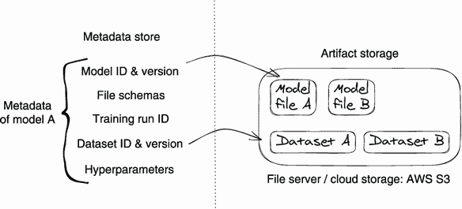
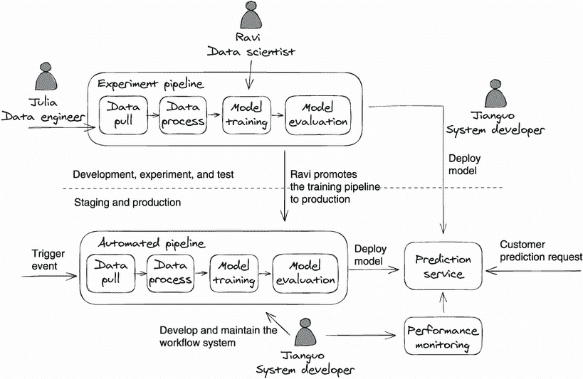
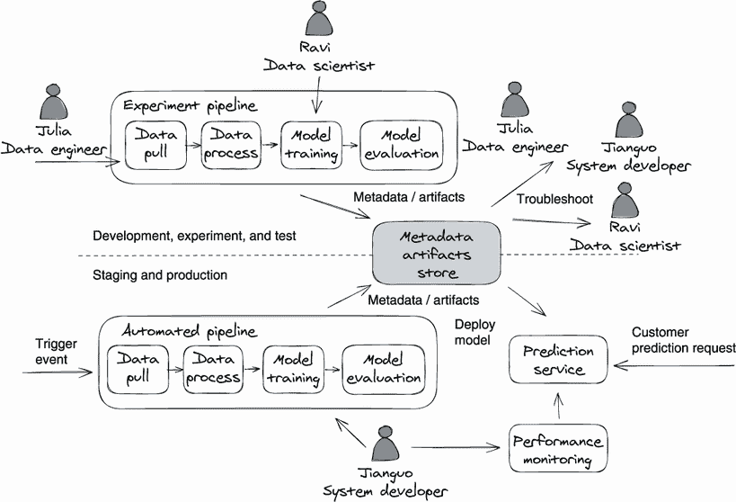
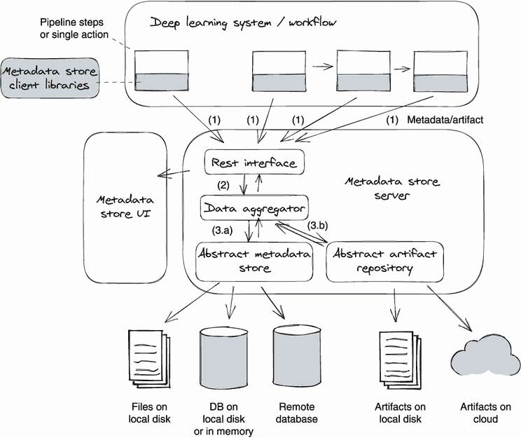
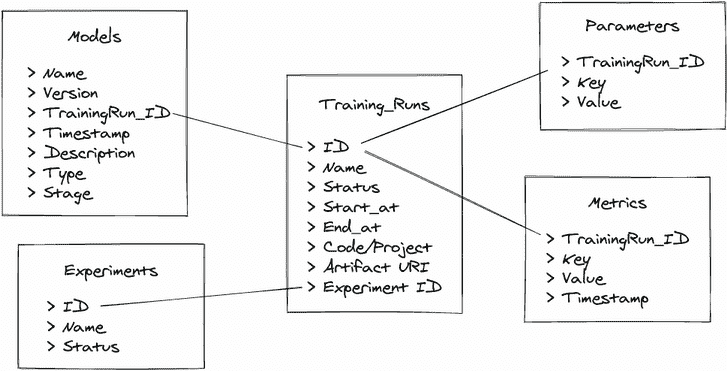
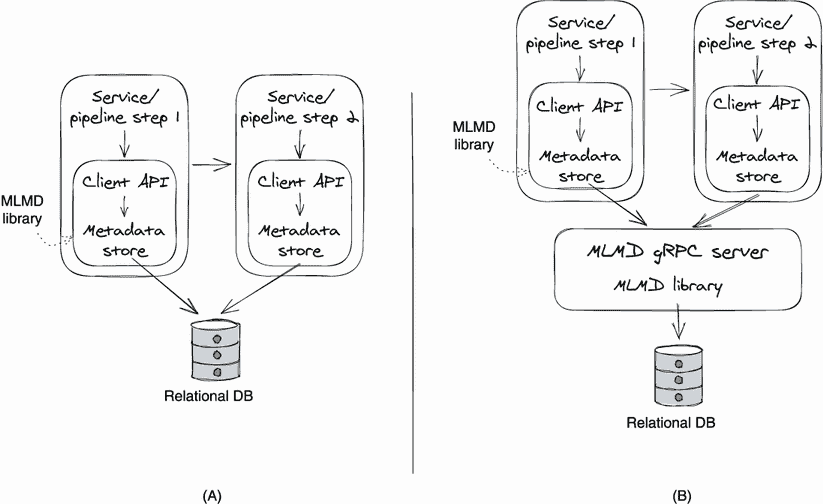
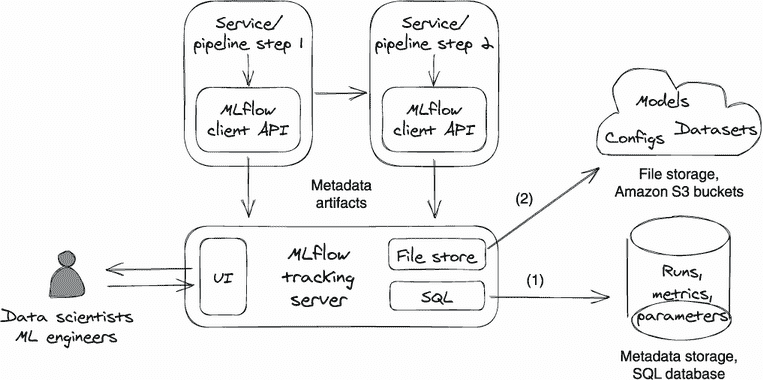

# 第八章：元数据和工件存储

本章内容包括：

+   在深度学习背景下理解和管理元数据。

+   设计一个元数据和工件存储来管理元数据

+   介绍两个开源的元数据管理工具：ML Metadata 和 MLflow。

要生成符合业务需求的高质量模型，数据科学家需要尝试各种数据集、数据处理技术和训练算法。为了构建和发布最佳模型，他们花费了大量时间进行这些实验。

模型训练实验产生了各种*工件*（数据集和模型文件）和*元数据*。元数据可能包括模型算法、超参数、训练指标和模型版本等，这些对分析模型性能非常有帮助。为了有用，这些数据必须是持久的和可检索的。

当数据科学家需要调查模型性能问题或比较不同的训练实验时，作为工程师，我们是否有什么可以做的来促进这些努力呢？例如，我们是否可以使模型的再现和实验比较更容易？

答案是肯定的。作为工程师，我们可以构建一个系统，保留数据科学家需要再现和比较模型的实验元数据和工件。如果我们设计这个存储和检索系统得当，并进行适当的元数据管理，数据科学家可以轻松地从一系列实验中选择最佳模型，或者快速找出模型退化的根本原因，而不需要深入了解元数据系统。

在前几章中，我们已经学习了设计服务来生成和提供模型。在这里，我们将注意力转向元数据和工件管理系统，这个系统有助于两个更重要的操作：故障排除和比较实验。

我们将从介绍*工件*和*元数据*开始这一章，并讨论这些概念在深度学习背景下的含义。然后我们将通过示例和强调设计原则来向您展示如何设计元数据管理系统。最后，我们将讨论两个开源的元数据管理系统：MLMD（ML Metadata）和 MLflow。通过阅读本章，您将清楚地了解如何管理元数据和工件，以便促进实验比较和模型故障排除。

## 8.1 介绍工件

人们经常假设在深度学习中，工件是模型训练过程产生的模型文件。这在某种程度上是正确的。工件实际上是组成模型训练过程中组件的输入和输出的文件和对象。这是一个关键的区别，如果你想设计一个支持模型再现性的系统，记住这个更广泛的定义是很重要的。

在这个定义下，工件可以包括用于深度学习项目的数据集、模型、代码或任何其他数量的对象。例如，原始输入训练数据、通过标记工具生成的带标签数据集以及数据处理流水线的结果数据都被认为是工件。

此外，为了进行性能比较、可重现性和故障排除，必须将工件与描述其事实和血统的元数据一起保存。在实践中，工件以原始文件的形式存储在文件服务器或云存储服务（例如 Amazon Simple Storage Service 或 Azure Blob Storage）上。我们将工件与其元数据关联在一个独立的存储服务上的*元数据存储*中。请参见图 8.1，了解此安排通常的外观。

图 8.1 显示了管理工件的常见做法。工件文件保存在文件存储系统中，并将其文件 URL 与其他相关元数据（例如模型训练执行 ID 和模型 ID）一起保存在元数据存储中。这样的设置允许我们 - 或数据科学家 - 在元数据存储中搜索模型，并轻松找到相应模型训练过程的所有输入和输出工件。



图 8.1 工件与其元数据相关联存储在元数据存储中。

## 8.2 深度学习上下文中的元数据

从一般意义上讲，元数据是结构化的参考数据，提供有关其他数据或对象的信息，例如包装食品上的营养事实标签。然而，在机器学习（ML）和深度学习中，元数据更具体地指的是模型的数据；它是描述模型训练执行（运行）、工作流、模型、数据集和其他工件的数据。

对于任何分布式系统，我们通过日志和度量标准以服务级别跟踪服务元数据。例如，我们可能跟踪 CPU 使用率、活跃用户数量和失败的 Web 请求数量等度量标准。我们使用这些度量标准进行系统/服务监控、故障排除和观察。

在深度学习系统中，除了服务级别指标之外，我们还收集用于模型故障排除、比较和重现的元数据。您可以将深度学习元数据视为系统中用于监视和跟踪每个深度学习活动的一种特殊子集的日志和度量标准。这些活动包括数据解析、模型训练和模型服务。

### 8.2.1 常见的元数据类别

虽然我们刚刚定义了元数据，但这个术语在某种程度上实际上是相当任意的；没有关于哪些数据应被视为元数据的固定准则。对于深度学习系统的工程师，我们建议将元数据定义分为以下四个类别：模型训练运行、通用工件、模型文件和编排工作流。为了让您对这些类别有一个具体的感觉，让我们来看看每个类别以及每个类别中包含的一些示例元数据。

模型训练运行的元数据

为了重现模型、分析模型性能并促进模型故障排除，我们需要跟踪模型训练运行的所有输入和输出数据和工件。这包括

+   *数据集 ID 和版本*—用于模型训练的数据集的唯一标识。

+   *超参数*—训练中使用的超参数，例如学习率和 epoch 数。

+   *硬件资源*—分配给训练的 CPU、GPU、TPU、内存和磁盘大小以及这些资源的实际消耗。

+   *训练代码版本*—用于模型训练的训练代码快照的唯一标识。

+   *训练代码配置*—用于重新创建训练代码执行环境的配置，例如 conda.yml、Dockerfile 和 requirement.txt。

+   *训练指标*—显示模型训练进展的指标，例如每个训练 epoch 的损失值。

+   *模型评估指标*—显示模型性能的指标，例如 F 分数和均方根误差（RMSE）。

通用工件的元数据

工件可以是任意文件，例如数据集、模型和预测结果。为了能够在工件存储中找到工件，我们希望跟踪工件的以下元数据：

+   *文件位置*—工件存储位置的路径，例如 Amazon S3 文件路径或内部文件系统路径

+   *文件版本*—用于区分不同文件更新的唯一标识

+   *描述*—用于描述工件文件内容的额外信息

+   *审计历史*—有关谁创建了工件版本、工件何时创建以及如何创建的信息

模型文件的元数据

模型是一种工件，但由于模型是每个深度学习系统的主要产品，我们建议将模型元数据与其他工件分开跟踪。当我们定义模型元数据时，最好考虑两个视角：模型训练和模型服务。

对于模型训练，为了有模型谱系，我们希望保留模型与产生它的模型训练运行之间的映射。模型谱系对于模型比较和重现很重要。例如，当比较两个模型时，通过具有模型训练运行和模型的链接，数据科学家可以轻松确定模型是如何产生的所有细节，包括输入数据集、训练参数和训练指标。模型训练指标对于了解模型性能非常有用。

对于模型服务，我们希望跟踪模型执行数据以用于未来的模型性能分析。这些执行数据，例如模型响应延迟和预测失误率，对于检测模型性能下降非常有用。

除了前述的通用工件元数据之外，以下是一些推荐的模型元数据类别：

+   *资源消耗*—用于模型服务的内存、GPU、CPU 和 TPU 消耗

+   *模型训练运行*——模型训练运行 ID，用于查找创建模型的代码、数据集、超参数和环境

+   *实验*——跟踪在生产环境中的模型实验活动，例如不同模型版本的用户流量分布

+   *生产*——模型在生产环境中的使用，例如每秒查询和模型预测统计

+   *模型性能*——跟踪模型评估指标以检测漂移，如概念漂移和性能漂移

注：不可避免地，一旦模型上线，它们将开始表现得更差。我们称此行为为*模型退化*。随着目标组的统计分布随时间变化，模型预测变得不太准确。例如，新的流行口号可能会影响语音识别的准确性。

用于流水线的元数据

当我们想要自动化多步模型训练任务时，需要使用流水线或工作流程。例如，我们可以使用工作流管理工具，如 Airflow、Kubeflow 或 Metaflow，自动化包含多个功能步骤的模型训练过程：数据收集、特征提取、数据集增强、训练和模型部署。我们将在下一章中详细讨论工作流程。

对于流水线元数据，我们通常会跟踪流水线执行历史和流水线输入输出。这些数据可以为将来的故障排除提供审计信息。

注：深度学习项目差异很大。语音识别、自然语言处理和图像生成的模型训练代码截然不同。项目特定的因素有很多，例如数据集的大小/类型、ML 模型的类型和输入资产。除了先前提到的样本元数据外，我们建议您基于项目定义和收集元数据。当您寻找有助于模型再现和故障排除的数据时，元数据列表将自然而然地出现在您面前。

### 8.2.2 为什么要管理元数据？

由于元数据通常是通过日志或指标的形式进行仪表化或记录的，因此您可能会想知道为什么我们需要单独管理深度学习元数据。我们能否简单地从日志文件中提取深度学习元数据？日志管理系统，如 Splunk（[`www.splunk.com/`](https://www.splunk.com/)）和 Sumo Logic（[`www.sumologic.com/`](https://www.sumologic.com/)），非常方便，因为它们允许开发人员搜索和分析分布式系统生成的日志和事件。

为了更好地解释在深度学习系统中需要专门的元数据管理组件的必要性，我们将讲述一个故事。Julia（数据工程师）、Ravi（数据科学家）和 Jianguo（系统开发人员）一起开发一个深度学习系统，为聊天机器人应用程序开发意图分类模型。Ravi 开发意图分类算法，Julia 负责数据收集和解析，而 Jianguo 则开发和维护深度学习系统。

在项目开发和测试阶段，Julia 和 Ravi 共同合作构建了一个实验性的训练流水线来生成意图模型。模型构建完成后，Ravi 将其传递给 Jianguo，以部署实验模型到预测服务并使用真实客户请求进行测试。

当 Ravi 对实验感到满意时，他会将训练算法从实验性流水线推广到自动化生产训练流水线。该流水线在生产环境中运行，并以客户数据作为输入生成意图模型。该流水线还会自动将模型部署到预测服务。图 8.2 描绘了整个故事背景。



图 8.2 没有元数据管理的模型开发

几周后，当 Ravi 发布了最新的意图分类算法后，一个聊天机器人客户——BestFood 公司向 Ravi 报告了模型性能下降的问题。在调查请求中，BestFood 提到他们的机器人在使用新数据集后的意图分类准确率下降了 10%。

为了排除报告的模型性能下降问题，Ravi 需要验证大量信息。他首先需要检查 BestFood 当前在预测服务中使用的模型版本，然后检查当前模型的模型衍生情况，例如在训练流水线中使用的数据集版本和代码版本。之后，Ravi 还可能需要重新生成模型进行本地调试。他需要比较当前模型和之前的模型，以测试数据分布的影响（当前新数据集 vs. 之前的数据集）。

Ravi 是一个自然语言处理（NLP）专家，但他对于运行其训练代码的深度学习系统了解甚少。为了继续他的调查，他不得不向 Jianguo 和 Julia 请求获取相关的模型、数据集和代码信息。因为每个人对模型训练应用和底层深度学习系统/基础设施的知识只是一知半解，对于每一个模型性能故障排除，Ravi、Julia 和 Jianguo 不得不共同努力来掌握完整的背景，这是耗时且低效的。

当然，这个故事过于简化了。在实践中，深度学习项目开发包含了数据、算法、系统/运行时开发和硬件管理。整个项目由不同的团队负责，并且很少有一个人了解所有内容。在企业环境中依赖跨团队合作来排除与模型相关的问题是不现实的。

在图 8.2 中缺少的关键因素是在一个集中的地方搜索和连接深度学习元数据的有效方法，以便 Julia、Ravi 和 Jianguo 能够轻松获取模型元数据。在图 8.3 中，我们增加了缺失的部分——一个元数据和制品存储（中间的灰色方框）来提高调试能力。



图 8.3 使用元数据管理进行模型故障排除

如果您将图 8.3 与图 8.2 进行比较，您会看到一个新组件（元数据和工件存储）被引入到图 8.3 的中间。我们在第 8.2.1 节中描述的所有深度学习元数据，无论它们来自实验流水线还是生产流水线，都会被收集并存储在此元数据存储中。

元数据存储为深度学习系统中的每个数据科学活动提供了元数据的全面视图。模型、流水线/训练运行和工件的元数据不仅被保存，而且在此存储内部相关联，因此人们可以轻松获取相关信息。例如，由于模型文件和模型训练运行在存储中被链接，人们可以轻松确定给定模型的模型谱系。

现在，数据科学家拉维可以使用元数据存储的用户界面列出系统中的所有模型和训练运行。然后，他可以深入研究元数据存储，找到过去训练运行中使用的输入参数、数据集和训练指标，这对评估模型非常有帮助。更重要的是，拉维可以自行快速完整地检索元数据，而无需了解模型训练和服务的基础架构。

## 8.3 设计一个元数据和工件存储

在本节中，我们将首先讨论构建元数据和工件存储的设计原则，然后介绍一个遵循这些原则的通用设计方案。即使您更喜欢使用开源技术来管理元数据，本节中的讨论仍将使您受益；了解设计需求和解决方案将帮助您选择适合您需求的正确工具。

注意为了简洁起见，我们在本章中将*元数据和工件存储*和*元数据存储*互换使用。当我们提到*元数据存储*时，它包括工件管理。

### 8.3.1 设计原则

元数据和工件存储被设计为便于模型性能故障排除和实验比较。它存储各种元数据并将其聚合到模型和训练运行周围，因此数据科学家可以快速获取任意模型的相关模型谱系和模型训练元数据。一个好的元数据存储应该遵循以下四个原则。

原则 1：显示模型谱系和版本控制

当收到模型名称时，元数据存储应该能够确定该模型的版本和每个模型版本的血统，例如，哪个训练运行生成了该模型，输入参数和数据集是什么。模型版本和血统对于模型故障排除至关重要。当客户报告模型的问题，例如模型性能下降时，我们首先问的问题是：模型是何时生成的？训练数据集是否发生了变化？使用了哪个版本的训练代码，以及我们从哪里可以找到训练指标？我们可以在模型血统数据中找到所有答案。

原则二：确保模型可复现性

元数据存储应跟踪重现模型所需的所有元数据，例如训练管道/运行配置、输入数据集文件和算法代码版本。能够重现模型对于模型实验评估和故障排除至关重要。我们需要一个地方来捕获配置、输入参数和工件，以启动模型训练运行以重现相同的模型。元数据存储是保留此类信息的理想地点。

原则三：方便获取打包的模型

元数据存储应该让数据科学家轻松访问模型文件，而不必理解复杂的后端系统。存储库应该具有手动和程序化两种方法，因为数据科学家需要能够运行手动和自动化的模型性能测试。

例如，通过使用元数据存储，数据科学家可以快速识别当前在生产服务中使用的模型文件，并下载它进行调试。数据科学家还可以编写代码从元数据存储中提取任意版本的模型，以自动比较新旧模型版本。

原则四：可视化模型训练跟踪和比较

良好的可视化可以极大地提高模型故障排除过程的效率。数据科学家依赖于大量的指标来比较和分析模型实验，元数据存储需要配备能够处理所有（或任何类型的）元数据查询的可视化工具。

例如，它需要能够显示一组模型训练运行的模型评估指标的差异和趋势行为。它还需要能够显示最新发布的 10 个模型的模型性能趋势。

### 8.3.2 一个通用的元数据和工件存储设计建议

为了解决第 8.3.1 节中的设计原则，深度学习元数据存储应该是一个度量存储系统，并且需要存储所有类型的元数据及其之间的关系。此类元数据应围绕模型和训练/实验执行聚合，以便在故障排除和性能分析过程中快速找到所有与模型相关的元数据。因此，内部元数据存储的数据架构是元数据存储设计的关键。

尽管元数据存储是一个数据存储系统，但数据扩展通常不是一个问题，因为深度学习系统的元数据量并不高。由于元数据大小取决于模型训练执行和模型的数量，而我们不希望每天进行超过 1,000 次模型训练运行，一个单独的数据库实例应该足够用于元数据存储系统。

为了用户方便，元数据存储应该提供一个 Web 数据摄入接口和日志记录 SDK，这样深度学习元数据就可以以类似应用程序日志和度量的方式被记录。基于设计原则和对系统需求的分析，我们提出了一个示例元数据存储设计供参考。图 8.4 显示了此组件的概述。



图 8.4 通用元数据和工件存储系统设计

在图 8.4 中，示例元数据存储系统由四个组件组成：一个客户端 SDK、一个 Web 服务器、后端存储和一个 Web UI。深度学习工作流程中的每个组件和步骤都使用客户端 SDK 将元数据发送到元数据存储服务器。元数据存储提供一个 RESTful 接口来进行元数据摄入和查询。Web UI 可视化元数据存储服务器的 RESTful 接口。除了基本的元数据和工件组织和搜索外，它还可以可视化各种模型训练运行的模型性能指标和模型差异。

元数据存储服务器位于此设计的中心位置。它有三层——一个 RESTful Web 接口、一个数据聚合器和存储。数据聚合器组件知道元数据如何组织和相互关联，因此它知道在哪里添加新元数据以及如何为不同类型的元数据搜索查询提供服务。在存储方面，我们建议构建一个抽象的元数据和工件存储层。这个抽象层作为一个适配器，封装了实际的元数据和文件存储逻辑。因此，元数据存储可以在不同类型的存储后端上运行，例如云对象存储、本地文件和本地或远程 SQL 服务器。

元数据存储数据模式

现在让我们来看一下元数据存储的数据模式。无论我们是将元数据保存在 SQL 数据库、noSQL 数据库还是纯文件中，我们都需要定义一个数据模式来描述元数据的结构和序列化方式。图 8.4 展示了我们元数据存储的实体关系图。

在图 8.5 中，模型训练运行（`Training_Runs` 对象）处于实体关系图的中心位置。这是因为模型性能故障排除总是从生成模型的过程（训练运行或工作流程）开始的，所以我们希望有一个专用的数据对象来跟踪生成模型文件的训练执行。



图 8.5 元数据存储数据模式的实体关系图

模型训练的详细元数据保存在`Metrics`和`Parameters`对象中。`Parameters`对象存储训练运行的输入参数，例如数据集 ID、数据集版本和训练超参数。`Metrics`对象存储训练期间产生的训练指标，例如模型 F2 分数。

`Experiments`对象用于组织和分组模型训练运行。一个实验可以有多个训练运行。例如，我们可以将意图分类模型开发项目定义为一个训练实验，然后将所有意图分类模型训练执行与该实验关联。然后，在 UI 上，我们可以按不同的实验组织训练执行。

`Models`对象存储模型文件的元数据，例如模型版本、类型和阶段。一个模型可以有多个阶段，例如测试、预生产和生产，所有这些都可以保留。

还要注意的是，图 8.5 中的每个实体都链接（由图中的线表示）到产生它们的特定训练运行，因此它们都将共享一个公共的`training_run_id`。通过利用这个数据链接，你可以从任何训练运行对象开始，找到其输出模型、训练输入数据和模型训练指标。

早些时候，我们说可以将其简称为元数据存储，但也存储工件。那么这个设计中的工件在哪里呢？我们将工件的 URL 作为训练运行的输出存储在`Training_Runs`对象中。如果查询模型或训练执行，则会得到工件的 URL。

模型焦点与流水线焦点

设计元数据系统有两种方法：模型焦点和流水线焦点。模型焦点方法将元数据与模型文件相关联，而流水线焦点方法聚合绕流水线/训练运行的元数据，就像我们在图 8.4 中提议的那样。

我们认为模型焦点和流水线焦点对最终用户（数据科学家）同样有用，它们并不是互斥的。我们可以支持两种焦点。

您可以使用流水线焦点方法实现元数据存储的存储层，类似于图 8.5 中的示例，然后在 Web UI 上构建搜索功能，以支持流水线搜索和模型搜索。

## 8.4 开源解决方案

在本节中，我们将讨论两个广泛使用的元数据管理工具：MLMD 和 MLflow。两个系统都是开源的，可以免费使用。我们首先对每个工具进行概述，然后提供比较，确定哪个工具在什么时候使用。

### 8.4.1 机器学习元数据

MLMD ([`github.com/google/ml-metadata`](https://github.com/google/ml-metadata))是一个轻量级库，用于记录和检索与 ML 开发人员和数据科学家工作流相关的元数据。MLMD 是 TensorFlow Extended（TFX; [`www.tensorflow.org/tfx`](https://www.tensorflow.org/tfx)）的一个组成部分，但是它设计成可以独立使用。例如，Kubeflow ([`www.kubeflow.org/`](https://www.kubeflow.org/))使用 MLMD 来管理其管道和笔记本服务生成的元数据。有关更多详细信息，请参阅 Kubeflow 元数据文档（[`mng.bz/Blo1`](http://mng.bz/Blo1)）。你可以将 MLMD 视为一个日志记录库，并在你的 ML 管道的每个步骤中使用它来记录元数据，以便你可以理解和分析工作流/管道的所有相互连接的部分。

系统概览

使用 MLMD 库进行元数据记录可以设置两种不同的后端：SQL 或 gRPC 服务器。请参阅图 8.6 了解概念。



图 8.6 使用 MLMD 记录元数据的两种不同设置：(A)直接向后端数据库报告元数据，(B)向 gRPC 服务器 DB 报告元数据，数据库。

在图 8.6 中，我们看到 ML 管道/工作流的每个步骤都使用 MLMD 库（MLMD 客户端 API）来记录元数据。在后端，MLMD 将元数据保存在关系型数据库中，例如 mySQL 或 PostgreSQL。

你可以选择让每个 MLMD 库直接与 SQL 服务器通信（图 8.5，A），或者使用 MLMD 库中的服务器设置代码设置一个 gRPC 服务器，让客户端库与服务器通信（图 8.5，B）。方法 A 很简单；你不需要托管一个专用的日志服务器，但是推荐使用方法 B，因为它避免了暴露后端数据库。

您可以查看以下两个文档以获取详细的元数据存储配置：“元数据存储后端和存储连接配置” ([`mng.bz/dJMo`](http://mng.bz/dJMo)) 和 “使用 MLMD 与远程 gRPC 服务器” ([`mng.bz/rd8J`](http://mng.bz/rd8J))。

日志记录 API

MLMD 中的元数据存储使用以下数据结构在存储后端记录元数据。一个*execution*代表工作流程中的一个组件或步骤；一个*artifact*描述了执行中的输入或输出对象；一个*event*是描述工件和执行之间关系的记录。一个*context*是一个逻辑组，用于将工件和执行在同一个工作流中关联在一起。

在这个概念的基础上，让我们来看一些示例元数据记录代码：

```py
# define a dataset metadata
data_artifact = metadata_store_pb2.Artifact()                ❶
data_artifact.uri = 'path/to/data'
data_artifact.properties["day"].int_value = 1
data_artifact.properties["split"].string_value = 'train'
data_artifact.type_id = data_type_id
[data_artifact_id] = store                                   ❷
     .put_artifacts([data_artifact])                         ❷

# define a training run metadata
trainer_run = metadata_store_pb2.Execution()                 ❸
trainer_run.type_id = trainer_type_id
trainer_run.properties["state"].string_value = "RUNNING"
[run_id] = store.put_executions([trainer_run])

# define a model metadata
model_artifact = metadata_store_pb2.Artifact()               ❹
model_artifact.uri = 'path/to/model/file'
model_artifact.properties["version"].int_value = 1
model_artifact.properties["name"].string_value = 'MNIST-v1'
model_artifact.type_id = model_type_id
[model_artifact_id] = store.put_artifacts([model_artifact])

# define an experiment metadata
my_experiment = metadata_store_pb2.Context()                 ❺
my_experiment.type_id = experiment_type_id
# Give the experiment a name
my_experiment.name = "exp1"
my_experiment.properties["note"].string_value = \
   "My first experiment."
[experiment_id] = store.put_contexts([my_experiment])

# declare relationship between model, training run
# and experiment
attribution = metadata_store_pb2.Attribution()
attribution.artifact_id = model_artifact_id
attribution.context_id = experiment_id

association = metadata_store_pb2.Association()
association.execution_id = run_id
association.context_id = experiment_id

# Associate training run and model with the
# same experiment
store.put_attributions_and_associations( \
  [attribution], [association])                             ❻
```

一个数据集被记录为一个工件。

将元数据保存到存储中

记录模型训练运行为一个执行。

[模型](https://github.com/google/ml-metadata)被记录为一个工件。

定义了模型训练元数据的逻辑组

保存元数据之间的关系

查看 MLMD 的“快速入门”文档 ([`mng.bz/VpWy`](http://mng.bz/VpWy)) 以获取详细的代码示例和本地设置说明。

搜索元数据

MLMD 没有提供用于显示其存储的元数据的 UI。因此，要查询元数据，我们需要使用其客户端 API。参见以下代码示例：

```py
artifacts = store.get_artifacts()             ❶

[stored_data_artifact] = store                ❷
   .get_artifacts_by_id([data_artifact_id])

artifacts_with_uri = store                    ❸
   .get_artifacts_by_uri(data_artifact.uri)

artifacts_with_conditions = store 
   .get_artifacts(
      list_options=mlmd.ListOptions(          ❹
        filter_query='uri LIKE "%/data" 
        AND properties.day.int_value > 0'))
```

❶ 查询所有注册的 artifacts

❷ 通过 ID 查询 artifact

❸ 通过 URI 查询 artifact

❹ 使用过滤器查询 artifact

MLMD 的“快速入门”文档 ([`mng.bz/VpWy`](http://mng.bz/VpWy)) 提供了许多用于获取 artifacts、执行和上下文元数据的查询示例。如果您感兴趣，请参阅。

学习 MLMD 的数据模型的最佳方法是查看其数据库模式。您可以首先创建一个 SQLite 数据库并配置 MLMD 元数据存储以使用该数据库，然后运行 MLMD 示例代码。最后，在本地 SQLite 数据库中创建所有实体和表。通过查看表模式和内容，您将深入了解 MLMD 中的元数据是如何组织的，因此您可以自己在其上构建一个漂亮的 UI。以下示例代码显示了如何配置 MLMD 元数据存储以使用本地 SQLite 数据库：

```py
connection_config = metadata_store_pb2.ConnectionConfig()
connection_config.sqlite.filename_uri = 
  '{your_workspace}/mlmd-demo/mlmd_run.db'               ❶
connection_config.sqlite.connection_mode = 3             ❷
store = metadata_store.MetadataStore(connection_config)
```

❶ SQLite 数据库的本地文件路径

❷ 允许读取、写入和创建

### 8.4.2 MLflow

MLflow ([`mlflow.org/docs/latest/tracking.html`](https://mlflow.org/docs/latest/tracking.html)) 是一个开源的 MLOps 平台。它旨在管理 ML 生命周期，包括实验、可重现性、部署和中央模型注册表。

与 MLMD 相比，MLflow 是一个完整的系统，而不是一个库。它由四个主要组件组成：

+   *MLflow 跟踪（元数据跟踪服务器*) — 用于记录和查询元数据

+   *MLflow 项目* — 以可重复使用和可重现的方式打包代码

+   *MLflow 模型* — 用于打包可用于不同模型服务工具的 ML 模型

+   *MLflow 模型注册表* — 用于通过 UI 管理 MLflow 模型的全生命周期，例如模型谱系、模型版本控制、注释和生产推广

在本节中，我们重点关注跟踪服务器，因为这与元数据管理最相关。

系统概述

MLflow 提供了六种不同的设置方法。例如，MLflow 运行（训练管道）的元数据可以记录到本地文件、SQL 数据库、远程服务器或带有代理存储后端访问的远程服务器。有关这六种不同设置方法的详细信息，您可以查看 MLflow 文档“How Runs and Artifacts Are Recorded” ([`mlflow.org/docs/latest/tracking.html#id27`](https://mlflow.org/docs/latest/tracking.html#id27))。

在本节中，我们关注最常用的设置方法：使用代理存储访问的远程服务器。请参见图 8.7 以获取系统概述图。



图 8.7 设置 MLflow 跟踪服务器以进行元数据摄取和查询

从图 8.7 可以看出，深度学习流水线（工作流）的每个步骤/动作都使用 MLflow 客户端将元数据和文物注入到 MLflow 跟踪服务器中。跟踪服务器将度量、参数和标签等元数据保存在指定的 SQL 数据库中；文物，如模型、图像和文档，保存在配置的对象存储中，如 Amazon S3。

MLflow 提供了两种上传文物的方式：（1）直接从客户端上传和（2）通过跟踪服务器进行代理上传。在图 8.6 中，我们说明了后一种方法：利用跟踪服务器作为涉及文物的任何操作的代理服务器。优点是最终用户可以直接访问后端远程对象存储，而无需提供访问凭据。

MLflow 的另一个好处是它提供了一个漂亮的用户界面；数据科学家可以通过托管在跟踪服务器上的网站来检查和搜索元数据。该用户界面不仅允许用户从流水线执行的角度查看元数据，还可以直接搜索和操作模型。

记录 API

将元数据发送到 MLflow 跟踪服务器非常简单。我们可以通过创建一个活动运行作为上下文管理器，然后调用 log 函数来记录文物或单个键值参数、度量和标签。参见以下示例代码：

```py
import mlflow
remote_server_uri = "..."                 ❶
mlflow.set_tracking_uri(remote_server_uri)

mlflow.set_experiment("/my-experiment")

with mlflow.start_run():
  mlflow.log_param("parameter_a", 1)      ❷
  mlflow.log_metric("metric_b", 2)        ❷
  mlflow.log_artifact("features.txt")     ❷
```

❶ 定义 MLflow 服务器 URL

❷ 在 Python 上下文管理器中由 MLflow ActiveRun 对象创建的日志元数据

自动记录日志

如果您厌倦了手动指定大量元数据，MLflow 支持自动记录日志。通过在训练代码之前调用 `mlflow.autolog()` 或特定于库的 autolog 函数，如 `mlflow.tensorflow.autolog()`、`mlflow.keras.autolog()` 或 `mlflow.pytorch.autolog()`，MLflow 将自动记录元数据，甚至文物，而无需显式的日志语句。如果您想了解更多关于 MLflow 记录日志的信息，请查看 MLflow 记录函数文档（[`mng.bz/xd1d`](http://mng.bz/xd1d)）。

搜索元数据

MLflow 跟踪服务器托管的跟踪用户界面允许您可视化、搜索和比较运行，以及下载运行文物或元数据以在其他工具中进行分析。该用户界面包含以下关键功能：基于实验的运行列表和比较，通过参数或度量值搜索运行，可视化运行度量，以及下载运行结果。除了用户界面外，您还可以像以下示例中那样以编程方式实现跟踪用户界面提供的所有操作：

```py
from mlflow.tracking import MlflowClient

client = MlflowClient()                              ❶
.. .. ..

# Fetch the run metadata from the backend store,
# which contains a list of  metadata 
active_run = client.get_run(run_id)
print("run_id: {}; lifecycle_stage: {}"\             ❷
  .format(run_id, active_run.info.lifecycle_stage))

# Retrieve an experiment by 
# experiment_id from the backend store
experiment = client.get_experiment(exp_id)

# Get a specific version of a model
mv = client.get_model_version(model_name, mv_version)
```

❶ 初始化客户端

❷ 打印出运行的执行阶段

编程式元数据访问不仅在使用分析工具（例如 pandas）查询和比较不同训练运行的模型性能时有帮助，而且对于将模型与模型服务系统集成也很有用，因为它允许你从 MLflow 模型注册表中以编程方式获取模型。有关完整的 `MLflowClient` API 用法，请查看 MLflow 跟踪 API 文档 ([`mng.bz/GRzO`](http://mng.bz/GRzO))。

### 8.4.3 MLflow vs. MLMD

从前面章节的描述中，我们可以看到 MLMD 更像是一个轻量级库，而 MLflow 是一个 MLOps 平台。两者都可以独立运行，提供元数据摄取和搜索功能，并基于模型训练运行跟踪元数据。但是 MLflow 提供的功能更加丰富。

除了 MLMD 的功能之外，MLflow 还支持自动元数据记录和设计良好的 UI 以可视化实验元数据（包括实验比较）、模型注册表、工件管理、代码可复现性、模型打包等。

如果你需要向系统引入一个完整的、新的元数据和工件存储，MFflow 将是你的首选。它得到了一个活跃的开源社区的支持，并且涵盖了大多数用户对 ML 元数据管理的需求。作为一个额外的奖励，MLflow 在 MLOps 上有着很好的支持，比如 MLflow 项目管理和模型部署。

如果你已经拥有一个工件注册表和一个度量可视化网站，并且想要将元数据功能集成到现有系统中，那么 MLMD 是一个不错的选择。MLMD 轻量级、易于使用，并且简单易学。例如，Kubeflow ([`www.kubeflow.org/`](https://www.kubeflow.org/)) 深度学习平台将 MLMD 作为元数据跟踪工具集成到其组件中，如 Kubeflow pipeline ([`www.kubeflow.org/docs/components/pipelines/`](https://www.kubeflow.org/docs/components/pipelines/))。

## 总结

+   机器学习元数据可以分为四类：模型训练运行、通用工件、模型工件和流水线。

+   元数据和工件存储设计用于支持模型性能比较、故障排除和复现。

+   一个良好的元数据管理系统可以帮助展示模型血统，实现模型可复现性，并促进模型比较。

+   MLMD 是一个轻量级的元数据管理工具，源自 TensorFlow 流水线，但可以独立使用。例如，Kubeflow 使用 MLMD 在其管道组件中管理 ML 元数据。

+   MLMD 适用于将元数据管理集成到现有系统中。

+   MLflow 是一个 MLOps 平台；它旨在管理机器学习生命周期，包括实验、可复现性、部署和中央模型注册。

+   如果你想要引入一个完全独立的元数据和工件管理系统，那么 MLflow 是适合的选择。
