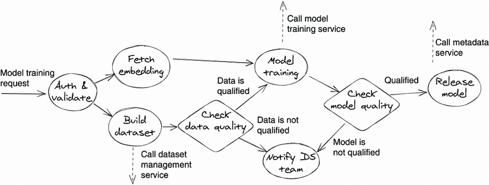
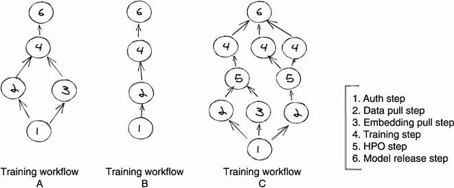
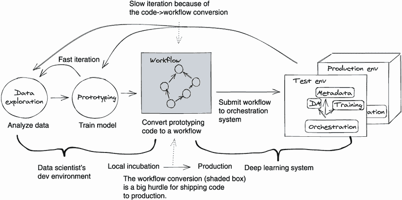
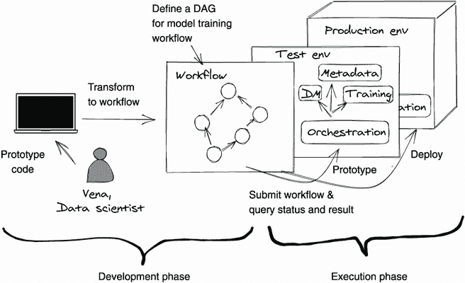
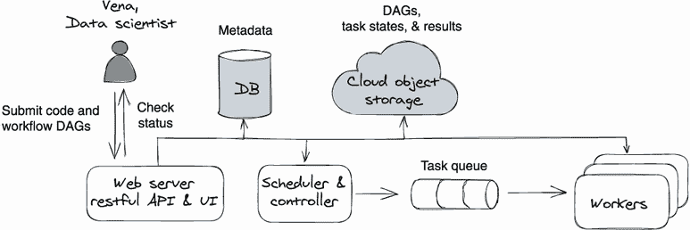
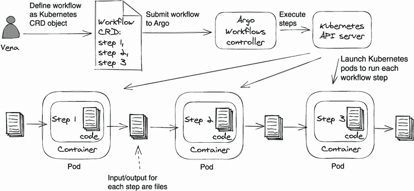
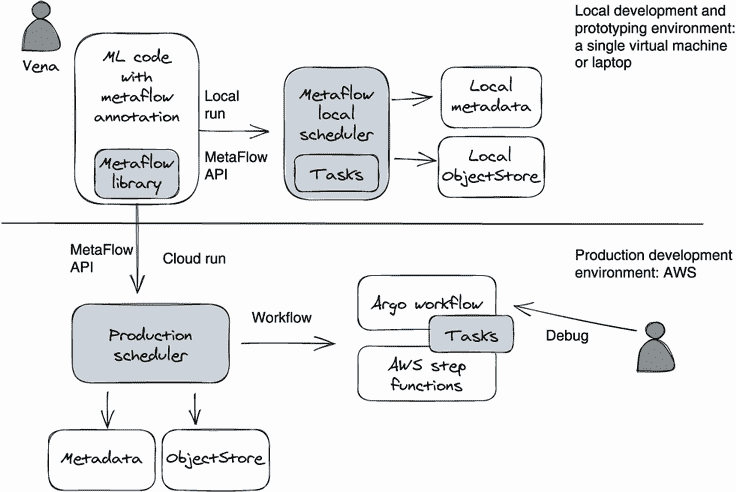
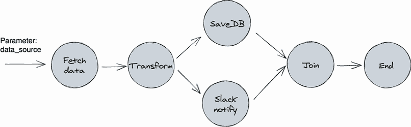

# 第九章：工作流编排

本章涵盖了

+   定义工作流和工作流编排

+   为什么深度学习系统需要支持工作流

+   设计一个通用工作流编排系统

+   引入三个开源编排系统：Airflow、Argo Workflows 和 Metaflow

在本章中，我们将讨论深度学习系统的最后但至关重要的部分：工作流编排——一个管理、执行和监控工作流自动化的服务。工作流是一个抽象且广泛的概念；它本质上是一系列操作，这些操作是某个更大任务的一部分。如果你可以设计一个带有一组任务的计划来完成一项工作，这个计划就是一个工作流。例如，我们可以为训练机器学习（ML）模型定义一个顺序工作流。这个工作流可以由以下任务组成：获取原始数据、重建训练数据集、训练模型、评估模型和部署模型。

因为工作流是一个执行计划，它可以手动执行。例如，数据科学家可以手动完成我们刚刚描述的模型训练工作流的任务。例如，要完成“获取原始数据”任务，数据科学家可以制作网络请求并将其发送到数据集管理（DM）服务以获取数据集——所有这些都不需要工程师的帮助。

然而，手动执行工作流并不理想。我们希望自动化工作流的执行。当针对不同目的开发了大量工作流时，我们需要一个专门的系统来处理工作流执行的复杂性。我们称这种系统为*工作流编排系统*。

工作流编排系统被建立来管理工作流的生命周期，包括工作流的创建、执行和故障排除。它不仅提供了使所有预定代码保持运行的脉搏，还为数据科学家提供了一个控制平面，用于管理深度学习系统中的所有自动化。

在本章中，我们将讨论工作流编排系统的设计以及在深度学习领域中使用的最受欢迎的开源编排系统。通过阅读本章，您不仅将对系统要求和设计选项有扎实的理解，还将了解如何选择最适合您自己情况的正确开源编排系统。

## 9.1 引入工作流编排

在我们深入探讨工作流编排系统设计的细节之前，让我们就工作流编排的基本概念进行快速讨论，特别是关于从深度学习/ML 角度出发的特殊工作流挑战。

注意 由于在深度学习项目和 ML 项目中使用工作流编排的要求几乎相同，因此在本章中我们将深度学习和机器学习这两个词用于交替使用。

### 9.1.1 什么是工作流？

一般来说，工作流是一系列操作，这些操作是某个较大任务的一部分。工作流可以被视为一种步骤的有向无环图（DAG）。

步骤是描述一个动作的最小可恢复计算单元；这个任务可以是获取数据或触发服务等。一个步骤要么成功，要么失败。在本章中，我们将 *任务* 和 *步骤* 这两个词互换使用。

DAG 指定了步骤之间的依赖关系和执行它们的顺序。图 9.1 显示了一个用于训练自然语言处理（NLP）模型的示例工作流。



图 9.1 展示了一个具有多个步骤的示例模型训练工作流的 DAG。椭圆形和菱形都是步骤，但是不同类型。实线箭头表示步骤之间的依赖关系，虚线箭头表示从步骤发送的外部网络请求。

从图 9.1 中的示例 DAG 中，我们看到了一个由许多步骤组成的工作流。每个步骤都依赖于另一个，实线箭头显示了步骤之间的依赖关系。这些箭头和步骤形成了一个没有循环的工作流 DAG。

如果你按照 DAG 中的箭头（从左到右）并完成任务，你可以训练并发布一个 NLP 模型到生产环境。例如，当一个传入的请求触发了工作流时，授权（authorization）步骤将首先被执行，然后数据集构建步骤和嵌入获取步骤将同时被执行。在这两个步骤完成之后，箭头的另一侧的步骤将被执行。

工作流在 IT 行业中随处可见。只要你能够将一个流程定义为单个任务/步骤的 DAG，这个流程就可以被视为工作流。工作流对于深度学习模型的开发至关重要。事实上，在生产环境中，大多数深度学习模型构建活动都被呈现并执行为工作流。

注意：工作流不应该有循环。为了保证工作流在任何情况下都能完成，其执行图必须是一个 DAG，这样可以防止工作流执行陷入死循环。

### 9.1.2 什么是工作流编排？

一旦我们定义了一个工作流，下一步就是运行工作流。运行工作流意味着根据工作流 DAG 中定义的顺序执行工作流步骤。*工作流编排* 是我们用来描述工作流的执行和监视的术语。

工作流编排的目标是自动化执行工作流中定义的任务。在实践中，工作流编排的概念通常扩展到整个工作流管理——即以自动化方式创建、调度、执行和监视多个工作流。

深度学习系统为什么需要工作流编排？理想情况下，我们应该能够将整个深度学习项目编码为一个整体。这正是我们在项目的原型阶段所做的，将所有代码放在一个 Jupyter 笔记本中。那么，为什么我们需要将原型代码转换为工作流，并在工作流编排系统中运行它呢？答案有两个方面：自动化和工作共享。为了理解这些原因，让我们看一下图 9.2 中的三个样本训练工作流。



图 9.2 深度学习工作流由许多可重复使用的任务组成。

使用工作流的一个巨大好处是它将大量代码转换为一组可共享和可重用的组件。在图 9.2 中，我们想象三名数据科学家正在进行三个模型训练项目（A、B 和 C）的工作。由于每个项目的训练逻辑不同，数据科学家开发了三个不同的工作流（A、B 和 C）来自动化他们的模型训练流程。尽管每个工作流具有不同的 DAGs，但每个 DAG 中的步骤高度重叠。总共的六个步骤是可共享和可重用的。例如，auth 步骤（步骤 1）是所有三个工作流的第一步。

具有可重复使用步骤可以极大地提高数据科学家的生产率。例如，要从 DM 服务中提取数据（图 9.2 中的第 2 步），数据科学家需要了解 DM Web API 的工作原理。但是如果有人已经将 DM 数据提取方法构建为一个步骤函数，科学家们就可以在他们的工作流中重复使用这个步骤，而不必学习如何与 DM 服务交互。如果每个人都以工作流的形式编写他们的项目，我们将拥有大量可重用的步骤，这将在组织级别节省大量重复的工作！

另一个适应深度学习开发的工作流的原因是它促进了协作。模型开发需要团队合作；一个专门的团队可能负责数据，而另一个团队负责训练算法。通过在工作流中定义复杂的模型构建过程，我们可以将一个大型复杂项目分解为片段（或步骤）并将其分配给不同的团队，同时仍然保持项目有序和组件正确顺序。工作流 DAG 清楚地显示了所有项目参与者可以看到的任务依赖关系。

简而言之，一个好的工作流编排系统鼓励工作共享，促进团队协作，并自动化复杂的开发场景。所有这些优点使工作流编排成为深度学习项目开发的关键组成部分。

### 9.1.3 深度学习中使用工作流编排的挑战

在前一节中，我们看到工作流系统可以为深度学习项目开发提供许多好处。但有一个注意事项：使用工作流来原型化深度学习算法的想法是很麻烦的。

要了解为什么这样做很麻烦，让我们看一下深度学习开发过程的图表（图 9.3）。这张图表应该为你理解工作流在深度学习背景下提出的挑战奠定基础。



图 9.3 深度学习项目开发的数据科学家视角

在图 9.3 中，我们从数据科学家的角度看到了一个典型的深度学习项目开发过程。该过程可以分为两个阶段：本地孵化阶段和生产阶段。

在本地孵化阶段，数据科学家在本地/开发环境中进行数据探索和模型训练原型。当原型完成并且项目看起来很有前景时，数据科学家开始进行生产上线：将原型代码移到生产系统。

在生产阶段，数据科学家将原型代码转换为工作流程。他们将代码分解为多个步骤，并定义一个工作流 DAG，然后将工作流提交给工作流编排系统。之后，编排系统接管并根据其时间表运行工作流程。

在原型和生产之间存在差距。

如果你问一个在工作流编排系统上工作的工程师他们对图 9.3 中的开发过程的感觉，答案很可能是：还不错！但实际上，这个过程对数据科学家来说是有问题的。

从数据科学家的角度来看，一旦算法在本地测试通过，其原型代码应立即投入生产。但是在图 9.3 中，我们看到原型阶段和生产阶段 *不是* 顺利连接的。将孵化代码部署到生产并不直接；数据科学家必须额外工作来构建一个工作流程来在生产中运行他们的代码。原型代码和生产工作流之间的差距影响了开发速度，原因有两个：

+   *工作流程的构建和调试并不是直接的* —— 数据科学家在编写模型训练工作流程时，通常会面临巨大的学习曲线。学习工作流 DAG 语法、工作流程库、编码范例和故障排除对于数据科学家来说是一个巨大的负担。工作流程的故障排除是最痛苦的部分。大多数编排系统不支持本地执行，这意味着数据科学家必须在远程编排系统中测试他们的工作流程。这很困难，因为工作流环境和工作流执行日志都是远程的，所以数据科学家在工作流程执行出错时无法轻易找出根本原因。

+   *工作流构建并非一次性事件，而是频繁发生*——一种常见的误解是，由于工作流构建只发生一次，所以如果耗时且繁琐也没关系。但事实是，工作流构建是持续不断的，因为深度学习开发是一个迭代过程。正如图 9.3 所示，数据科学家会迭代地进行原型设计和生产实验，因此工作流需要经常更新，以测试从本地到生产环境的新改进。因此，令人不快且耗时的工作流构建会反复发生，这阻碍了开发速度。

平滑地从原型设计过渡到生产环境

尽管存在差异，图 9.3 中的流程是不错的。数据科学家从一个简单的脚本开始在本地进行原型设计，然后继续完善。如果每次迭代后的结果看起来足够令人满意，那么“简单的本地脚本”将被转换为工作流，并在生产环境中在编排系统中运行。

关键的改进是使从原型代码到生产工作流的过渡步骤变得无缝。如果一个编排系统是为深度学习用例设计的，它应该提供工具，帮助数据科学家用最少的工作量从他们的代码构建工作流。例如，Metaflow 是一个开源库，将在 9.3.3 节中讨论，它允许数据科学家通过编写带有 Python 注解的 Python 代码来授权工作流。数据科学家可以直接从他们的原型代码中获得工作流，而不需要进行任何更改。Metaflow 还在本地和云生产环境之间提供了统一的模型执行用户体验。这消除了工作流测试中的摩擦，因为 Metaflow 在本地和生产环境中以相同的方式运行工作流。

深度学习系统应以人为中心

当我们向深度学习系统引入通用工具——如工作流编排时，不要满足于仅仅启用功能。尽量减少系统中人工的时间。总是可以进行定制工作，以帮助我们的用户更加高效。

Metaflow（9.3.3 节）是一个很好的例子，说明当工程师们不满足于仅仅构建一个用于自动化深度学习工作流的编排系统时会发生什么。相反，他们更进一步优化了工作流构建和管理，以解决数据科学家的工作方式。

## 9.2 设计工作流编排系统

在本节中，我们将分三个步骤设计工作流编排系统。首先，我们使用一个典型的数据科学家用户场景，展示编排系统从用户角度的工作方式。第二，我们学习通用编排系统设计。第三，我们总结构建或评估编排系统的关键设计原则。通过阅读本节，您将了解编排系统的一般工作方式，从而可以自信地评估或操作任何编排系统。

### 9.2.1 用户场景

尽管各工作流场景的过程有很大的差异，但数据科学家的用户场景通常非常标准。大多数工作流使用可以分为两个阶段：开发阶段和执行阶段。请参见图 9.4，了解数据科学家（Vena）的工作流用户体验。我们将一步一步地跟随图 9.4 中 Vena 的用户场景。



图 9.4：工作流编排系统的通用深度学习用户场景。

开发阶段

在开发阶段，数据科学家将其训练代码转换为工作流。以下是 Vena 的示例：

1.  数据科学家 Vena 在本地环境中使用 Jupyter notebook 或纯 Python 原型开发其模型训练算法。经过本地测试和评估，Vena 认为是时候将代码部署到生产环境中，进行真正的客户数据在线实验了。

1.  由于生产环境中的所有内容都是工作流，因此 Vena 需要将其原型代码转换为工作流程。所以，Vena 使用编排系统提供的语法，在 YAML（文本配置）文件中将其工作重建为一个任务的 DAG。例如，数据解析->数据增强->数据集构建->训练->[在线评估、离线评估]->模型发布。

1.  然后，Vena 为 DAG 中每个步骤设置输入/输出参数和动作。以训练步骤为例，Vena 将步骤动作设置为 RESTful HTTP 请求。此步将向模型训练服务发送一个 RESTful 请求来启动训练作业。该请求的有效载荷和参数来自步骤输入参数。

1.  一旦定义好工作流，Vena 就在 DAG YAML 文件中设置工作流的执行计划。例如，Vena 可以将工作流安排在每个月的第一天运行，还可以将工作流设置为由外部事件触发。

1.  Vena 运行工作流本地验证，并将工作流提交给编排服务。

为了让您了解工作流在现实中的含义，以下代码显示了 Vena 的伪工作流（在第 9.3 节，我们将讨论实际的工作流系统）：

```py
# define workflow DAG
with DAG( 
  description='Vena’s sample training workflow',
  schedule_interval=timedelta(months=1),
  start_date=datetime(2022, 1, 1),
  ) as dag:                                       ❶

 # define execution logic for each step
  data_parse_step = BashOperator( .. .. ..)
  data_augment_step = BashOperator( .. .. ..)     ❷
  dataset_building_step = BashOperator( .. .. ..)
  training_step = BashOperator( .. .. ..)

 # Declares step dependencies
  data_parse_step >> data_augment_step            ❸
  >> dataset_building_step >> training_step       ❸
```

❶ DAG 定义；定义了工作流的主体，包括步骤和依赖项

❷ 执行数据增强的 bash 命令

❸ 顺序执行流

执行阶段

在执行阶段，编排服务执行模型训练工作流，如 Vena 的示例所示：

1.  一旦 Vena 的工作流被提交，编排服务就会将工作流 DAG 保存到数据库中。

1.  编排服务的调度器组件会检测 Vena 的工作流，并将工作流的任务分派给后端工作者。调度器将确保任务按照工作流 DAG 中定义的顺序执行。

1.  Vena 使用编排服务的 Web UI 实时检查工作流的执行进度和结果。

1.  如果工作流生成了一个好的模型，Vena 可以将其推广到分期和生产环境。如果不是，Vena 就会开始另一个原型的迭代。

判断一个编排系统是否适合深度学习的一个关键指标是将原型代码转换为工作流的难易程度。在图 9.4 中，我们可以看到，每次 Vena 原型化一个新的想法时，她都需要将其训练代码转换为工作流。我们可以想象如果我们减少将深度学习代码转换为工作流的摩擦会节省多少人力时间。

注意 一个工作流应该总是轻量级的。工作流用于自动化一个过程；其目标是将一系列任务分组并连接起来，并按照定义的顺序执行它们。使用工作流的巨大好处是人们可以共享和重复使用这些任务，因此他们可以更快地自动化他们的流程。因此，工作流本身不应进行任何繁重的计算，真正的工作应由工作流的任务完成。

### 9.2.2 一个通用的编排系统设计

现在让我们转向一个通用的工作流编排系统。为了帮助您了解编排系统的工作原理以及如何研究开源编排系统，我们准备了一个高级系统设计。通过放大详细的实现并仅保留核心组件，这个设计适用于大多数编排系统，包括将在第 9.3 节讨论的开源系统。请参见图 9.5 以获取设计方案。



图 9.5 通用工作流编排服务的设计概览

一个工作流编排系统通常由以下五个组件组成：

+   *Web 服务器*—Web 服务器提供了一个 Web 用户界面和一组 Web API，供用户创建、检查、触发和调试工作流的行为。

+   *调度器和控制器*—调度器和控制器组件有两个功能。首先，调度器监视系统中的每个活动工作流，并在合适的时间安排工作流运行。其次，控制器将工作流任务分派给工作者。尽管调度器和控制器是两个不同的功能单元，但它们通常一起实现，因为它们都与工作流执行相关。

+   *元数据数据库* — 元数据数据库存储工作流的配置、DAG、编辑和执行历史，以及任务的执行状态。

+   *工作组* — 工作组提供计算资源来运行工作流任务。工作器抽象了基础架构，并且对正在运行的任务不可知。例如，我们可能有不同类型的工作器，例如 Kubernetes 工作器和 Amazon Elastic Compute Cloud（EC2）工作器，但它们都可以执行相同的任务，尽管在不同的基础架构上。

+   *对象存储* — 对象存储是所有其他组件的共享文件存储；通常建立在云对象存储之上，例如 Amazon Simple Storage Service（S3）。对象存储的一个用途是任务输出共享。当工作器运行任务时，它从对象存储中读取上一个任务的输出值作为任务输入；工作器还将任务输出保存到对象存储中，供后续任务使用。

对象存储和元数据数据库都可以由编排系统的所有组件访问，包括调度程序、Web 服务器和工作器组件。具有集中式数据存储可以解耦核心组件，因此 Web 服务器、调度程序和工作器可以独立工作。

工作流程是如何执行的？

首先，Vena 为工作流定义了 DAG。在 DAG 内部，Vena 声明了一组任务，并定义了任务执行顺序的控制流。对于每个任务，Vena 要么使用系统的默认运算符，例如 Shell 命令运算符或 Python 运算符，要么构建自己的运算符来执行任务。

第二，Vena 通过 Web UI 或命令行将工作流程（具有依赖代码的 DAG）提交给 Web 服务器。工作流程保存在元数据数据库中。

第三，调度程序定期（每隔几秒或几分钟）扫描元数据数据库并检测新的工作流程；然后在预定时间启动工作流程。为了执行工作流程，调度程序调用控制器组件根据 DAG 中定义的任务顺序将工作流程的任务分派到工作器队列中。

第四，工作人员从共享作业队列中挑选一个任务；它从元数据数据库中读取任务定义，并通过运行任务的运算符执行任务。在执行过程中，工作人员将任务的输出值保存到对象存储中，并将任务的执行状态报告回元数据数据库。

最后但同样重要的是，Vena 使用托管在 Web 服务器组件上的 Web UI 来监视工作流程的执行。因为调度程序/控制器组件和工作器实时向元数据数据库报告状态，所以 Web UI 始终显示最新的工作流程状态。

### 9.2.3 工作流程编排设计原则

因为我们已经看到了工作流编排系统在内部和外部的工作方式，现在是时候研究使编排系统在深度学习场景中出色的设计原则了。我们希望您可以将这些原则作为指导，来改进您的系统或评估开源方法。

注意 在深度学习系统中，工作流编排系统是最复杂的组件之一，涉及到大量的工程工作。所以，在最初的几个版本中，不必过于担心使您的系统与这些原则完全匹配。

原则 1：重要性

工作流编排本质上是一种作业调度的挑战，所以任何编排系统的底线都是提供一个可靠的工作流执行体验。一个有效的工作流应该总是能够正确、重复地按计划执行。

原则 2：可用性

在深度学习环境中，编排系统的可用性衡量标准是是否优化了数据科学家的工作效率。在一个编排系统中，数据科学家的大部分交互工作都是工作流的创建、测试和监控。因此，一个用户友好的编排系统应该让用户能够轻松地创建、监控和排除故障。

原则 3：可扩展性

为了适应各种深度学习基础设施，人们应该能够轻松定义自己的任务操作符和执行器，而不用担心它们部署在哪里。编排系统应该提供适合您环境的抽象级别，无论是 Amazon EC2 还是 Kubernetes。

原则 4：隔离性

可能发生两种关键的隔离：工作流创建隔离和工作流执行隔离。工作流创建隔离意味着在创建工作流时，人们不能相互干扰。例如，如果 Vena 提交了一个无效的工作流有向无环图（DAG），或者发布了一个在其他工作流中被引用的共享库的新版本，那么现有的工作流不应受到影响。

工作流执行隔离意味着每个工作流在一个独立的环境中运行。工作流之间不应有资源竞争，并且一个工作流的失败不会影响其他工作流的执行。

原则 5：扩展性

一个好的编排系统应该解决以下两个扩展性问题：处理大量同时运行的工作流以及处理大型扩展性工作流。同时运行的工作流扩展性通常指，给定足够的计算资源 —— 例如，向工作组中添加更多的工作节点 —— 编排系统可以满足无限数量的并发工作流执行。此外，系统应始终为每个工作流保持服务级别协议（SLA）。例如，工作流应在其预定时间执行，且不得晚于 2 秒，无论有多少其他工作流正在执行。

对于单一的大型工作流扩展，系统应该鼓励用户不必担心性能，这样他们就可以专注于可读性强、直接明了的代码和简单的操作。当工作流执行达到限制时——例如，训练运算符执行时间过长——编排系统应该提供一些水平并行运算符，例如分布式训练运算符，以解决单个工作流性能问题。

深度学习编排的主要扩展思想是我们应该在系统级别解决性能问题，并避免要求用户考虑可扩展性编写代码。这可能导致可读性下降、调试困难和操作负担增加。

原则 6：人本支持，既适用于原型设计，也适用于生产环境

连接数据科学家本地原型代码到生产工作流的能力是深度学习特有的要求。这是我们用来评估编排系统是否适合深度学习系统的关键指标。

一个为深度学习设计的编排系统将尊重深度学习项目开发是从原型到生产的迭代持续努力的事实。因此，它将不遗余力地帮助数据科学家将他们的本地原型代码转换为生产工作流。

## 9.3 巡回开源工作流编排系统

在本节中，我们将介绍三种经过实战验证的工作流编排系统：Airflow、Argo Workflows 和 Metaflow。这三个开源系统在 IT 行业得到了广泛应用，并得到了活跃社区的支持。除了一般介绍外，我们还将从深度学习项目开发的角度评估这些工作流系统。

为了进行公正的比较，我们在 Airflow、Argo Workflows 和 Metaflow 中为相同工作流实现伪代码。基本上，如果有新数据，我们首先转换数据并将其保存到数据库的新表中，然后通知数据科学团队。此外，我们希望工作流每天运行。

### 9.3.1 Airflow

Airflow（[`airflow.apache.org/docs/apache-airflow/stable/index.html`](https://airflow.apache.org/docs/apache-airflow/stable/index.html)）于 2014 年在 Airbnb 创建，现在是 Apache 基金会的一部分。Airflow 是一个平台，用于以编程方式编写、调度和监视工作流。Airflow 并不是为深度学习用例设计的；它最初是为了编排越来越复杂的 ETL（抽取、转换、加载）管道（或数据管道）而构建的。但由于 Airflow 具有良好的可扩展性、生产质量和 GUI 支持，它被广泛应用于许多其他领域，包括深度学习。截至本书撰写时，Airflow 是最受欢迎的编排系统。

典型用例

在 Airflow 中构建工作流程需要两个步骤。首先，定义工作流 DAG 和任务。其次，在 DAG 中声明任务之间的依赖关系。Airflow DAG 本质上是 Python 代码。看以下清单，了解我们的示例工作流在 Airflow 中是如何实现的。

清单 9.1 一个示例 Airflow 工作流定义

```py
# declare the workflow DAG. 
with DAG(dag_id="data_process_dag",
        schedule_interval="@daily",
        default_args=default_args,
        template_searchpath=[f"{os.environ['AIRFLOW_HOME']}"],
        catchup=False) as dag:

 # define tasks of the workflow, each code section below is a task 

   is_new_data_available = FileSensor(       ❶
       task_id="is_new_data_available",
       fs_conn_id="data_path",
       filepath="data.csv",
       .. .. ..
   )

 # define data transformation task
   transform_data = PythonOperator( 
       task_id="transform_data",
       python_callable=transform_data        ❷
   )

 # define table creation task
   create_table = PostgresOperator(          ❸
       task_id="create_table",
       sql='''CREATE TABLE IF NOT EXISTS invoices (
               .. .. ..
               );''',
       postgres_conn_id='postgres',
       database='customer_data'
   )

   save_into_db = PythonOperator(
       task_id='save_into_db',
       python_callable=store_in_db
   )

   notify_data_science_team = SlackWebhookOperator(
       task_id='notify_data_science_team',
       http_conn_id='slack_conn',
       webhook_token=slack_token,
       message="Data Science Notification \n"
       .. .. ..
   )

# Step two, declare task dependencies in the workflow
  is_new_data_available >> transform_data
  transform_data >> create_table >> save_into_db
  save_into_db >> notify_data_science_team
  save_into_db >> create_report

# The actual data transformation logic, which is referenced
# in the “transform_data” task.
def transform_data(*args, **kwargs):
   .. .. ..
```

❶ 检查是否有新文件到达

❷ 实际逻辑是在 "transform_data" 函数中实现的。

❸ PostgresOperator 是预定义的 Airflow 运算符，用于与 postgres db 交互。

在代码清单 9.1 中，我们看到示例工作流 DAG 包含多个任务，如 `create_table` 和 `save_into_db`。在 Airflow 中，任务被实现为运算符。有许多预定义和社区管理的运算符，例如 MySqlOperator、SimpleHttpOperator 和 Docker 运算符。

Airflow 的预定义运算符帮助用户实现任务而无需编码。您还可以使用 PythonOperator 运行自定义的 Python 函数。一旦工作流 DAG 被构建并且所有代码被部署到 Airflow，我们可以使用 UI 或以下 CLI 命令来检查工作流执行状态；以下是一些示例 shell 命令：

```py
airflow dags list                             ❶

airflow tasks list data_process_dag           ❷

airflow tasks list data_process_dag --tree    ❸
```

❶ 打印所有活动的 DAG

❷ 打印 "data_process_dag" DAG 中任务的列表

❸ 打印 "data_process_dag" DAG 中任务的层次结构

如果您想了解更多关于 Airflow 的信息，您可以查看其架构概述文档和教程 ([`mng.bz/Blpw`](http://mng.bz/Blpw))。

关键功能

Airflow 提供以下关键功能：

+   *DAGs* — Airflow 通过 **DAGs** 抽象复杂的工作流程，工作流 DAG 是通过 Python 库实现的。

+   *程序化工作流管理* — Airflow 支持动态创建任务，并允许创建复杂的动态工作流。

+   *出色的内置运算符帮助构建自动化* — Airflow 提供了许多预定义的运算符，帮助用户实现任务而无需编码。

+   *可靠的任务依赖性和执行管理* — Airflow 在每个任务中都内置了自动重试策略，并提供了不同类型的传感器来处理运行时依赖关系，例如检测任务完成、工作流运行状态变更和文件存在。

+   *可扩展性* — Airflow 使其传感器、钩子和运算符完全可扩展，这使得它能够从大量社区贡献的运算符中受益。Airflow 还可以通过添加定制运算符轻松集成到不同的系统中。

+   *监控和管理界面* — Airflow 提供了一个强大的用户界面，用户可以快速了解工作流/任务执行状态和历史。用户还可以从界面触发和清除任务或工作流运行。

+   *生产质量* — Airflow 提供了许多有用的工具，用于在生产环境中维护服务，如任务日志搜索、扩展、报警和 restful API。

限制

尽管 Airflow 是一个出色的工作流编排工具，但在深度学习场景中使用时仍然存在一些缺点：

+   *数据科学家入门时的高前期成本* — Airflow 对于实现不受内置运算符支持的任务具有陡峭的学习曲线。此外，没有一种简单的方法进行工作流本地测试。

+   *将深度学习原型代码移至生产环境时的高摩擦力* — 当我们将 Airflow 应用于深度学习时，数据科学家必须将他们的本地模型训练代码转换为 Airflow DAG。这是额外的工作，对于数据科学家来说是一种不愉快的体验，特别是考虑到如果我们直接从模型训练代码构建工作流程 DAG，这是可以避免的。

+   *在 Kubernetes 上操作时的高复杂性* — 在 Kubernetes 上部署和操作 Airflow 并不简单。如果您希望采用一个编排系统在 Kubernetes 上运行，Argo Workflows 是一个更好的选择。

### 9.3.2 Argo Workflows

Argo Workflows 是一个开源的、容器原生的工作流引擎，用于在 Kubernetes 上编排并行工作流程/任务。Argo Workflows 解决了与 Airflow 相同的问题，但采用了不同的方式；它采用了 Kubernetes 本地方法。

Argo Workflows 和 Airflow 之间最大的区别在于 Argo Workflows 在 Kubernetes 上本地构建。更具体地说，Argo Workflows 中的工作流程和任务以 Kubernetes 自定义资源定义（CRD）对象实现，并且每个任务（步骤）都作为 Kubernetes pod 执行。请参阅图 9.6 以获得高级系统概述。



图 9.6 Argo Workflows 中的工作流程及其步骤是作为 Kubernetes pod 执行的。

在图 9.6 中，Vena（数据科学家）首先将工作流程及其步骤/任务定义为 Kubernetes CRD 对象，通常表示为 YAML 文件。然后她将工作流提交到 Argo Workflows，其控制器在 Kubernetes 集群内创建 CRD 对象。接下来，Kubernetes pod 动态启动以按工作流程顺序运行工作流程步骤/任务。

您还可以注意到，每个步骤的执行完全由容器和 pod 隔离；每个步骤使用文件来表示其输入和输出值。Argo Workflows 会自动将依赖文件挂载到步骤的容器中。

Kubernetes pod 创建的任务隔离是 Argo Workflows 的一个巨大优势。简单性也是人们选择 Argo Workflows 的另一个原因。如果您了解 Kubernetes，Argo 的安装和故障排除都很简单。我们可以使用 Argo Workflows 命令或标准的 Kubernetes CLI 命令来调试系统。

典型的使用案例

为了更好地理解，让我们看一个 Argo Workflows 的例子。在本节中，我们使用 Argo Workflows 来自动化我们在之前 Airflow 部分看到的相同数据处理工作。工作流程包括首先检查新数据，转换数据，将其保存到数据库中的新表中，然后通过 Slack 通知数据科学家团队。请参阅以下代码清单以查看 Argo Workflows 的定义。

代码清单 9.2 Argo Workflows 的示例工作流程，包含一系列步骤

```py
apiVersion: argoproj.io/v1alpha1
kind: Workflow                                         ❶
metadata:
 generateName: data-processing-  
spec:
 entrypoint: argo-steps-workflow-example 
 templates:
   - name: argo-steps-workflow-example
     Steps:                                            ❷
       - - name: check-new-data
           template: data-checker                      ❸
       - - name: transform-data
           template: data-converter
           arguments:
             artifacts:
               - name: data-paths                      ❹
                 from: "{{steps.check-new-data.outputs. 
                          artifacts.new-data-paths}}"  ❺
       - - name: save-into-db
           template: postgres-operator
       - - name: notify-data-science-team
           template: slack-messenger

   - name: data-checker                                ❻
     container:
       image: docker/data-checker:latest
       command: [scan, /datastore/ds/]
     outputs:
       artifacts:
         - name: new-data-paths                        ❼
           path: /tmp/data_paths.txt

   - name: data-converter
     inputs:
       artifacts:
         - name: data_paths                            ❽
           path: /tmp/raw_data/data_paths.txt
     container:
       image: docker/data-checker:latest
       command: [data_converter, /tmp/raw_data/data_paths.txt]

   - name: save-into-db
     .. .. ..
   - name: notify-data-science-team
     .. .. ..
```

❶ 将 CRD 对象类型声明为工作流程

❷ 声明工作流程的步骤

❸ 步骤主体被定义为另一个模板，类似于函数。

❹ 声明数据路径工件来自由 check-new-data 步骤生成的新数据路径工件

❺ 这就是步骤传递参数的方式。

❻ 实际步骤定义，类似于函数实现

❼ 声明此步骤的输出工件（生成新的数据路径）；工件来自/tmp/data_paths.txt，该工件也可以是一个目录。

❽ 解压缩数据 _paths 输入工件，并将其放置在/tmp/raw_data/data_paths.txt

Argo Workflows 中最基本的概念是工作流程和模板。工作流程对象代表工作流程的单个实例；它包含工作流程的定义和执行状态。我们应该将工作流程视为一个“活动”对象。模板可以被认为是*函数*；它们定义要执行的指令。`entrypoint`字段定义了主函数是什么，意味着将首先执行的模板。

在代码清单 9.2 中，我们看到了一个四步顺序工作流程：`check-new-data` -> `transform_data` -> `save-into-db` -> `notify-data-science-team`。每个步骤都可以引用一个模板，并且步骤通过工件（文件）传递参数。例如，`check-new-data`引用了`data-checker`模板，该模板定义了用于检查是否有新数据的 Docker 镜像。`data-checker`模板还声明了步骤输出——新到达的数据文件路径——将被保存到`/tmp/data_paths.txt`作为其输出值。

接下来，步骤`transform_data`将`check-new-data`的输出绑定到 data-converter 模板的输入。这就是变量在步骤和模板之间移动的方式。一旦您提交了工作流程——例如，`argo submit -n argo sample_workflow.yaml`——您可以使用 Argo Workflows UI 或以下命令来查看工作流运行的详细信息：

```py
# list all the workflows
argo list -n argo

# get details of a workflow run
argo get -n argo {workflow_name}
```

除了使用`argo`命令之外，我们还可以使用 Kubernetes CLI 命令来检查工作流的执行，因为 Argo Workflows 在 Kubernetes 上原生运行；请参考以下示例：

```py
# list all argo customer resource definitions 
kubectl get crd -n argo

# list all workflows
kubectl get workflows -n argo

# check specific workflow
kubectl describe workflow/{workflow_name} -n argo
```

要了解更多关于 Argo Workflows 的信息，您可以查看 Argo Workflows 用户指南（[`mng.bz/WAG0`](http://mng.bz/WAG0)）和 Argo Workflows 架构图（[`argoproj.github.io/argo-workflows/architecture`](https://argoproj.github.io/argo-workflows/architecture)）。

代码 Docker 化：轻松进行生产部署

Argo Workflows 本质上是一个 Kubernetes Pod（Docker 镜像）调度系统。尽管它强迫人们将其代码编写成一系列 Docker 镜像，但它在编排系统内部创建了极大的灵活性和隔离性。因为代码以 Docker 形式存在，所以可以由任何工作节点执行，而不用担心配置工作节点环境。

Argo Workflows 的另一个优点是生产部署成本低。当您在 Docker 中本地测试代码时，Docker 镜像（原型代码）可以直接在 Argo Workflows 中使用。与 Airflow 不同，Argo Workflows 几乎不需要从原型代码转换为生产工作流程的工作量。

关键特性

Argo Workflows 提供以下关键特性：

+   *安装和维护成本低*—Argo Workflows 在 Kubernetes 上原生运行，因此您可以只使用 Kubernetes 进程来解决任何问题；无需学习其他工具。此外，它的安装非常简单；只需几个 `kubectl` 命令，您就可以在 Kubernetes 环境中运行 Argo Workflows。

+   *稳健的工作流程执行*—Kubernetes pod 为 Argo Workflows 任务执行提供了良好的隔离。Argo Workflows 还支持 cron 工作流程和任务重试。

+   *模板化和可组合性*—Argo Workflows 模板就像函数一样。在构建工作流程时，Argo Workflows 支持组合不同的模板（步骤函数）。这种可组合性鼓励团队之间共享通用工作，从而大大提高了生产率。

+   *完整的 UI 功能*—Argo Workflows 提供了一个方便的 UI 来管理工作流程的整个生命周期，例如提交/停止工作流程、列出所有工作流程和查看工作流程定义。

+   *高度灵活和适用*—Argo Workflows 定义了 REST API 来管理系统和添加新功能（插件），并且工作流程任务定义为 Docker 镜像。这些特性使得 Argo Workflows 在许多领域，如 ML、ETL、批处理/数据处理和 CI/CD（持续集成和持续交付/持续部署）中被广泛使用。

+   *生产质量*—Argo Workflows 设计用于在严肃的生产环境中运行。Kubeflow pipeline 和 Argo CD 是将 Argo Workflows 用于生产环境的绝佳示例。

限制

使用 Argo Workflows 在深度学习系统中的缺点如下：

+   *每个人都将编写和维护 YAML 文件*—Argo Workflows 要求工作流程定义为 YAML 文件中的 Kubernetes CRD。一个项目的短小 YAML 文件可以管理，但一旦工作流程数量增加并且工作流程逻辑变得更加复杂，YAML 文件可能变得冗长和混乱。Argo Workflows 提供了模板以保持工作流程定义简单，但除非您习惯使用 Kubernetes YAML 配置，否则这仍然不太直观。

+   *必须是 Kubernetes 专家*—如果您是 Kubernetes 专家，您会觉得这是司空见惯的。但是初学者可能需要花费相当多的时间学习 Kubernetes 的概念和实践。

+   *任务执行延迟* —— 在 Argo Workflows 中，对于每个新任务，Argo 将启动一个新的 Kubernetes Pod 来执行它。Pod 的启动可能会为每个单独的任务执行引入秒数或分钟，这限制了 Argo 在支持时间敏感的工作流时的能力。例如，Argoflow 不适用于实时模型预测工作流，该工作流以毫秒级 SLA 运行模型预测请求。

### 9.3.3 Metaflow

Metaflow 是一个以人为本的 Python 库，专注于 MLOps。它最初是在 Netflix 开发的，并于 2019 年开源。Metaflow 的特点在于它遵循以人为本的设计；它不仅用于自动化工作流程，还旨在减少在深度学习项目开发中花费的人工时间（操作成本）。

在第 9.1.3 节中，我们指出原型代码转换为生产工作流会在 ML 开发中产生很多摩擦。数据科学家必须为每个模型开发迭代构建和测试新版本的工作流。为了弥合原型和生产之间的差距，Metaflow 进行了两项改进：首先，它简化了工作流程的构建；其次，它统一了本地和生产环境之间的工作流程执行体验（参见图 9.7）。



图 9.7 Metaflow 在原型和生产之间提供了统一的开发体验。

在图 9.7 中，我们可以看到 Metaflow 将原型和生产环境都视为一流的执行环境。由于 Metaflow 库提供了一组统一的 API 来抽象实际的基础设施，一个工作流可以在不同的环境中以相同的方式运行。例如，一个工作流可以在本地调度器和生产调度器上运行而无需任何更改。本地调度器在本地执行工作流，而生产调度器集成到其他生产编排系统中，例如 AWS Step Functions 或 Argo Workflows。

Metaflow 允许用户注释 Python 代码 —— 一个 DAG Python 类 —— 来定义工作流程。然后 Metaflow 库会根据 Python 注释自动创建/打包工作流。使用 Metaflow Python 注释，Vena 可以在不更改任何原型代码的情况下构建工作流程。

除了无缝创建和测试工作流之外，Metaflow 还提供其他一些对模型可重复性至关重要的实用功能，如工作流/步骤版本控制和步骤输入/输出保存。要了解更多关于 Metaflow 的信息，您可以查看 Metaflow 的官方网站（[`docs.metaflow.org/`](https://docs.metaflow.org/)）和一本名为《*Effective Data Science Infrastructure*》的精彩 Metaflow 书籍，作者是 Ville Tuulos（Manning，2022；[`www.manning.com/books/effective-data-science-infrastructure`](https://www.manning.com/books/effective-data-science-infrastructure)）。

典型用例

让我们使用 Metaflow 自动化我们在 9.3.1 和 9.3.2 节中看到的相同的数据处理工作。请参见伪代码清单以下示例。

图 9.3 显示了一个 Metaflow 工作流的示例

```py
# define workflow DAG in a python class
class DataProcessWorkflow(FlowSpec):

  # define "data source" as an input parameter for the workflow 
  data_source = Parameter(
     "datasource_path", help="the data storage location for data process"
     , required=True
  )

  @step
  def start(self):
    # The parameter “self.data_source” are available in all steps.
    self.newdata_path = dataUtil.fetch_new_data(self.data_source)

    self.next(self.transform_data)

  @step
  def transform_data(self):
    self.new_data = dataUtil.convert(self.newdata_path)

    # fan out to two parallel branches after data transfer.
    self.next(self.save_to_db, self.notify_data_science_team)

  @step
  def save_to_db(self):
    dataUtil.store_data(self.new_data)
    self.next(self.join)

  @step
  def notify_data_science_team(self):
    slackUtil.send_notification(messageUtil.build_message(self.new_data))

    self.next(self.join)

  # join the two parallel branches steps: 
  # notify_data_science_team and save_to_db 
  @step
  def join(self, inputs):

    self.next(self.end)

  @step
  def end(self, inputs):
    # end the flow.
    pass

if __name__ == "__main__":
  DataProcessWorkflow()
```

在代码清单 9.3 中，我们看到 Metaflow 通过使用代码注释的新方法构建工作流。通过在函数上注释 `@step` 并使用 `self.next` 函数来连接步骤，我们可以轻松地从我们的原型代码构建一个工作流 DAG（图 9.8）。



图 9.8 显示了从图 9.3 构建的工作流 DAG

这里的一大优势在于，我们不需要在一个单独的系统中定义工作流 DAG 并将代码重新打包到不同的格式（比如 Docker 镜像）中。Metaflow 工作流完全融入我们的代码中。工作流开发和原型代码开发发生在同一地方，并且可以从整个 ML 开发周期的开始到结束一起进行测试。

代码准备就绪后，我们可以在本地验证和运行工作流。参见以下示例命令：

```py
# display workflow DAG
python data_process_workflow.py show

# run the workflow locally
python data_process_workflow.py run
```

一旦我们完成了本地开发和测试，就该将工作流推送到生产环境了，可以通过以下两个命令来实现：

```py
# push the workflow from local to AWS step functions
python data_process_workflow.py --with retry step-functions create

# push the workflow from local to Argo workflows
python data_process_workflow.py --with retry argo-workflows create
```

这些命令将我们在代码清单 9.3 中定义的数据处理工作流导出到 AWS Step Functions 和 Argo Workflows。然后，您还可以在 AWS Step Functions UI 或 Argo Workflows UI 中按名称搜索流程，从而查看导出的流程。

注意 Metaflow 在本地和生产环境之间提供了统一的开发体验。由于 Metaflow 提供的统一 API，我们在本地和生产环境中测试代码和工作流时拥有无缝的体验。无论使用哪种后端工作流编排系统，无论是 Metaflow 本地调度器、Argo Workflows 还是 AWS Step Functions，工作流开发的 Metaflow 用户体验都是相同的！

关键功能

Metaflow 提供以下关键功能：

+   *将代码结构化为工作流* — Metaflow 允许用户通过对 Python 代码进行注释来创建工作流，这极大地简化了工作流的构建。

+   *可重复性* — Metaflow 保留了执行每个工作流步骤所需的数据、代码和外部依赖项的不可变快照。Metaflow 还记录了每个工作流执行的元数据。

+   *版本控制* — Metaflow 通过对工作流中的所有代码和数据进行哈希处理来解决 ML 项目的版本控制要求。

+   *稳健的工作流执行* — 元数据通过使用 @conda 装饰器在工作流级别和步骤级别提供了依赖管理机制。它还提供了任务重试。

+   *ML 的可用性设计* — Metaflow 将原型设计和生产视为同等重要。它提供了一组统一的 API 来抽象基础设施，因此相同的代码可以在原型环境和生产环境中运行而无需任何更改。

+   *无缝扩展性*—Metaflow 集成了 Kubernetes 和 AWS Batch，允许用户轻松定义所需的计算资源，并可以并行执行任意数量的工作流步骤。例如，通过对步骤函数应用像`@batch(cpu=1, memory=500)`这样的注解，Metaflow 将与 AWS Batch 合作分配所需的资源来计算此步骤。

局限性

在深度学习系统中使用 Metaflow 的缺点如下：

+   *没有条件分支支持*—Metaflow 步骤注解不支持条件分支（仅在满足条件时执行步骤）。这不是一个红旗，但是这是一个很好的功能。

+   *没有作业调度程序*—Metaflow 本身不带有作业调度程序，因此无法使用 cron 工作流。这并不是一个大问题，因为 Metaflow 可以与支持作业调度的其他编排系统集成，例如 AWS Step Functions 和 Argo Workflows。

+   *与 AWS 紧密耦合*—Metaflow 的最重要特性与 AWS 紧密耦合，例如，Amazon S3 和 AWS Batch。幸运的是，Metaflow 是一个开源项目，因此可以将其扩展到非 AWS 替代方案。

### 9.3.4 何时使用

如果您正在寻找一种用于自动化非 ML 项目工作流执行的编排系统，Airflow 和 Argo Workflows 都是不错的选择。它们拥有出色的社区支持，并且在 IT 行业被广泛使用。如果您的系统在 Kubernetes 上运行，并且您的团队习惯使用 Docker，那么 Argo Workflows 将是一个很好的选择；否则，Airflow 也不会让您失望。

如果您正在寻找一个能够简化 ML 项目开发流程的系统，Metaflow 强烈推荐。Metaflow 不仅是一个编排工具；它是一个 MLOps 工具，旨在节省数据科学家在 ML 开发周期中的时间。由于 Metaflow 抽象了 ML 项目的后端基础设施部分，数据科学家可以专注于模型开发，而无需担心生产转换和部署。

## 总结

+   工作流是某个更大任务的操作序列。工作流可以看作是步骤的 DAG。步骤是最小的可恢复计算单元，描述了要执行的操作；步骤要么全部成功，要么全部失败。DAG 指定了步骤之间的依赖关系和执行顺序。

+   工作流编排意味着根据工作流的有向无环图（DAG）中定义的顺序执行工作流步骤。

+   采用工作流鼓励工作共享、团队协作和自动化。

+   在深度学习项目中应用工作流的主要挑战是降低工作流构建成本，简化工作流测试和调试。

+   构建/评估工作流编排系统的六个推荐设计原则是关键性、可用性、可扩展性、任务隔离性、可扩展性和以人为中心。

+   在选择非机器学习项目的编排系统时，Airflow 和 Argo Workflows 都是不错的选择。如果项目在 Kubernetes 和 Docker 上运行，Argo Workflows 是更好的选择。

+   在选择机器学习项目的编排系统时，Metaflow 目前是最佳选择。
