# 第十章：生产路径 

本章涵盖 

+   在生产化深度学习模型之前的初步工作和任务 

+   使用深度学习系统生产化深度学习模型 

+   用于生产中实验的模型部署策略 

对于书的结尾章节，我们认为回到高层次视角并连接前几章的所有内容是有意义的。我们现在已经详细讨论了深度学习系统中的每个服务。在本章中，我们将讨论这些服务如何共同支持我们在第一章介绍的深度学习*产品开发周期*。如果你还记得的话，该周期将研究和数据科学的努力一直延伸到生产化，最终产品是客户使用的产品。 

作为提醒，图 10.1 取自第一章，展示了产品开发周期。本章我们的重点将放在该过程末尾发生的三个阶段上：深度学习研究、原型制作和生产化。这意味着我们将忽略实验、测试、训练和探索的循环，并关注如何将最终产品从研究阶段转化为最终产品，使其准备好发布到公众。 

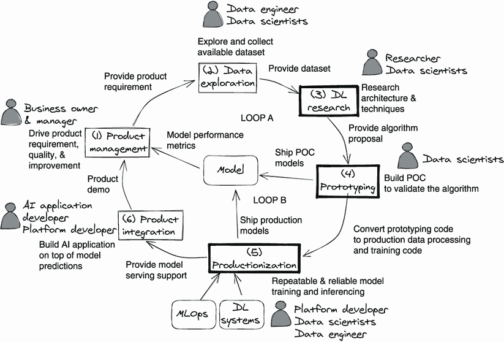

图 10.1 这个深度学习开发周期是将深度学习从研究转化为成品的典型情景。框 (3)、(4) 和 (5) 是本章的重点。 

定义 生产化是生产出一个值得用户消费的产品的过程。生产值得性通常被定义为能够服务于客户请求、承受一定水平的请求负载，并优雅地处理诸如格式不正确的输入和请求过载等不利情况。

正如我们所说，本章重点讨论从研究、原型制作到生产化的生产周期路径。让我们将这三个阶段从图 10.1 所示的典型开发周期中拿出来，以便更详细地查看它们。我们将这些阶段放在下一个图表中，图 10.2，并放大它们，以显示每个阶段内的步骤，以及三个阶段之间的连接方式。不要让这个图表的复杂性吓到你！在本章中，我们将带领你走过每个阶段和每个步骤。 

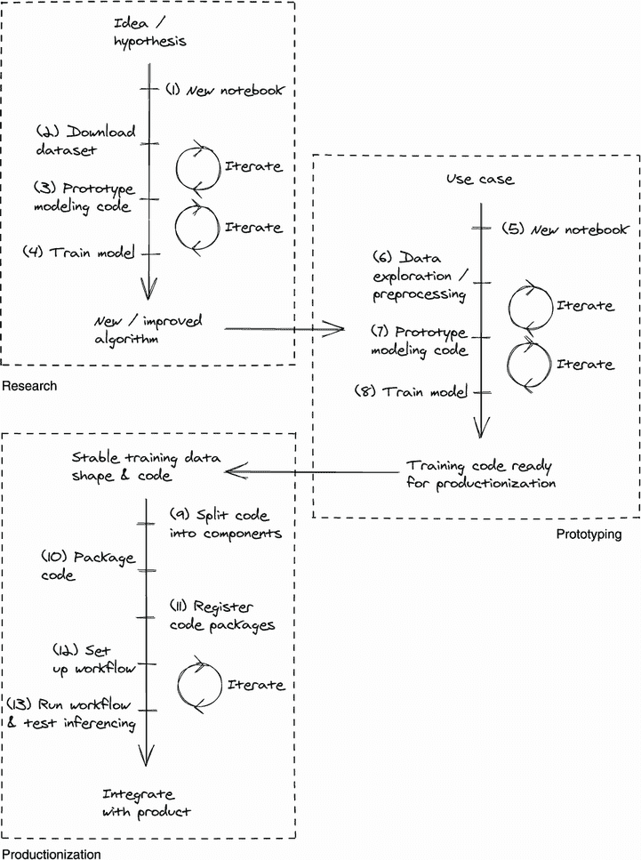

图 10.2 生产样品路径中的三个主要阶段。在生产化之前，研究和原型制作会经历许多迭代。 

让我们简要回顾一下这张图表，因为它将提供本章的预览。图 10.2 中的前两个阶段是研究和原型制作。这两项工作都需要从模型训练和实验中进行快速迭代和周转。这些阶段（步骤 1–8）中的主要交互点是笔记本环境。使用笔记本，研究人员和数据科学家会调用数据集管理服务来跟踪训练数据集（在步骤 2 和 6 中），并可能使用训练服务和超参数优化库/服务来进行模型训练和实验（在步骤 4 和 8 中）。我们在 10.1 节中详细介绍了这些阶段，直到训练数据形状和代码变得相当稳定并且可以进行产品化。换句话说，团队已经提出了更多或更少的最终版本，并且准备通过最后的步骤将其发布给公众。

在 10.2 节中，我们将从上一节开始，介绍模型的产品化，直到模型被提供给生产推断请求流量的点。

定义 *推断请求* 是用户或应用程序针对经过训练的模型生成推断的输入。以视觉识别为例。推断请求可以是一张猫的图片。使用经过训练的视觉识别模型，或者推断，可以生成一个形式为 *猫* 的标签。

这个部分对应于图 10.2 中的第三个也是最后一个阶段。在产品化中，我们系统中的几乎每个服务都会发挥作用。数据集管理服务管理训练数据；工作流管理服务启动和跟踪训练工作流；训练服务执行和管理模型训练作业；元数据和工件存储包含和跟踪代码工件、训练模型及其元数据；模型服务将经过训练的模型提供给推断请求流量。

从产品化转移到部署。在 10.3 节中，我们将研究一些支持在生产中更新模型到新版本的模型部署策略。这些策略还支持在生产中进行实验。这里的主要重点将放在模型服务上，因为这是所有推断请求都被服务的地方。

通过全程跟踪到产品的完整过程，我们希望您能够看到我们在前几章中讨论的第一原则如何影响使用该系统提供深度学习功能的不同方。您从本章中获得的理解应该有助于您将自己的设计适应不同的情况。我们将使用图像识别产品的开发作为示例，以说明所有操作步骤。

## 10.1 准备产品化

在本节中，我们将研究深度学习模型从诞生前到准备投入生产的过程。在图 10.3 中，我们突出显示了深度学习研究和原型设计的阶段，这些阶段来自更大的深度学习开发循环（如图 10.1 所示）。我们将从深度学习研究阶段开始，在这个阶段，模型训练算法诞生。并不是每个组织都进行深度学习研究，有些使用现成的训练算法，如果这种情况不适用于您，请随意跳过这一步。

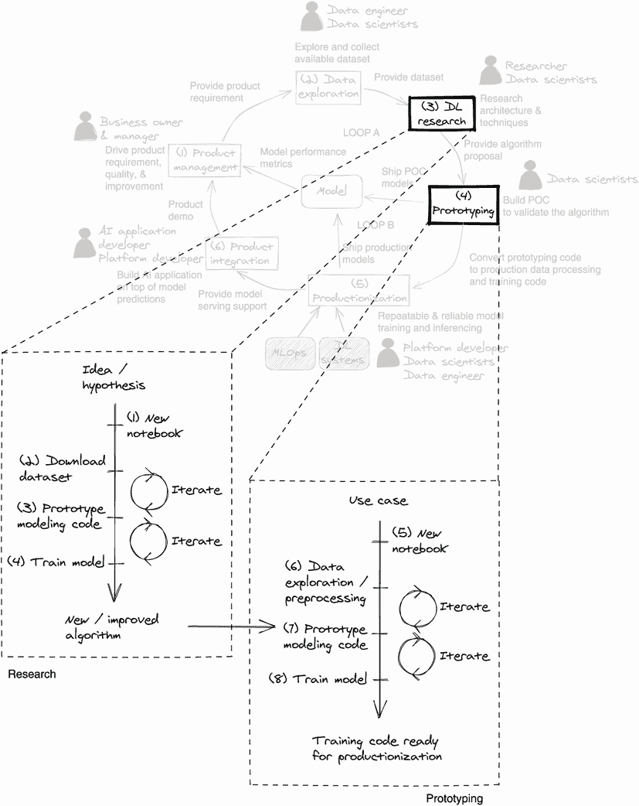

图 10.3 深度学习研究和原型设计阶段通往生产的路径摘录

在深度学习研究之后，我们继续进行原型设计。在此阶段，我们假定算法已经准备好用于训练模型。数据探索和实验模型训练的快速迭代过程构成了这一步骤的核心。这一步的目标是找到适当的训练数据形状，并开发一个稳定的模型训练代码库。

### 10.1.1 研究

通过研究发明了新的深度学习算法，并通过研究改进了现有算法。因为同行评审研究需要可重复的结果，所以模型训练数据需要公开获取。许多公共数据集，例如 ImageNet，都可以供研究团队使用。

笔记本环境，如 JupyterLab，是研究人员原型设计模型培训最流行的选择，因为它的交互性和灵活性。让我们看一下研究人员在模型训练原型设计期间可能采取的一些示例步骤：

1.  深度学习研究员 Alice 正在致力于改进视觉识别算法。经过理论探讨后，她准备开始原型设计。

1.  Alice 在 JupyterLab 中创建了一个新的笔记本。

1.  Alice 想要使用 ImageNet 数据集来训练和基准测试她的算法。她可能

    1.  编写代码将数据集下载到她的笔记本中，并在数据集管理服务中存储它以供重复使用（第二章）。

    1.  发现数据集已经存储在数据集管理服务中，并编写代码来直接使用它。

1.  Alice 开始对现有的视觉识别算法进行改进，直到它能够在笔记本中本地生成实验模型。

1.  Alice 尝试更改一些超参数，训练和测试一些实验模型，并比较它们生成的指标。

1.  Alice 可以进一步使用超参数优化技术（第五章）自动运行更多实验，以确认她确实对现有算法进行了改进。

1.  Alice 发布了她的研究结果，并将她的训练代码改进打包成一个库供他人使用。

通过使用版本化数据集进行训练，爱丽丝确保她所有实验模型训练运行的输入训练数据是相同的。她还使用源控制管理系统，如 Git，以跟踪她的代码，以便所有实验模型都可以追溯到她的代码版本。

注意，在这个阶段，模型训练通常在笔记环境托管的计算节点上进行，因此很有必要为这些节点分配足够的资源。如果训练数据存储在网络上，请确保读取速度不会成为模型训练的瓶颈。

### 10.1.2 原型制作

原型制作是将研究与实际用例联系起来的实践。它是寻找合适的训练数据、算法、超参数和推断支持的正确深度学习特征的实践，以满足产品需求。

在这个阶段，很常见发现笔记环境仍然是数据科学家和工程师的首选，原因是原型制作的快速迭代性质。期望快速交付。让我们走一遍原型制作的一个可能的场景：

1.  模型开发团队收到产品需求，要改善安全摄像头产品的运动检测。

1.  基于需求，团队发现爱丽丝的新视觉识别训练算法可能有助于改善运动检测。

1.  团队创建一个新的笔记本，并开始探索与他们选择的算法集相关的用于模型训练的数据：

    1.  如果团队有已收集的数据与正在解决的问题相匹配，他们可能能够使用现有数据进行模型训练。

    1.  在某些情况下，团队可能需要收集新数据进行训练。

1.  在大多数情况下，这个阶段应用迁移学习，并且团队会选择一个或多个现有模型作为源模型。

1.  团队开发带有算法的建模代码，并使用已收集的数据和源模型训练实验模型。

1.  实验模型经过评估，以查看是否产生令人满意的结果。步骤 3 到 6 会重复进行，直到训练数据形状和代码稳定。

我们称步骤 3 到 6 为探索循环。这个循环对应于图 10.3 中原型制作的放大部分的迭代圈。当原型制作开始时，这个循环会迅速迭代。此阶段的重点是缩小训练数据形状和代码。

一旦训练数据形状和代码稳定，它们将准备好进行进一步的调整和优化。这个阶段的目标是收敛到一个状态，使得模型训练和推断代码可以被打包并部署到生产环境。

### 10.1.3 关键收获

我们已经走过图 10.1 中我们参考的深度学习开发周期中的研究和原型制作阶段。尽管它们有不同的目的，但我们看到它们在如何处理深度学习系统方面有相当大的重叠：

+   笔记本环境是研究和预生产原型设计的常见选择，因为它具有高度的交互性和冗长性。

+   对训练数据的访问应尽可能宽泛和灵活（在合法性和合规性的限制范围内），这有助于加速数据探索过程。

+   应为模型训练分配足够的计算资源，以确保周转时间短。

+   至少使用数据集管理服务和源代码控制管理系统来跟踪实验模型的来源。此外，使用元数据存储来包含指标，并将其与训练数据集和代码关联起来，以进行完整的渊源追踪。

## 10.2 模型生产化

在深度学习模型能够集成到最终产品之前，它们需要经历生产化过程。对于这个术语肯定有很多解释，但基本上是：

+   模型需要为生产推断请求提供服务，无论是来自最终产品还是最终用户。

+   模型服务应满足预定义的服务水平协议，例如在 50 毫秒内响应或可用时间达到 99.999%。

+   与模型相关的生产问题应易于故障排除。

在本节中，我们将看看深度学习模型如何从一个相当动态的环境，比如笔记本，过渡到一个生产环境，在那里它们会受到各种严苛条件的影响。图 10.4 显示了生产化阶段相对于开发周期的其余部分。让我们回顾一下这个阶段的步骤。

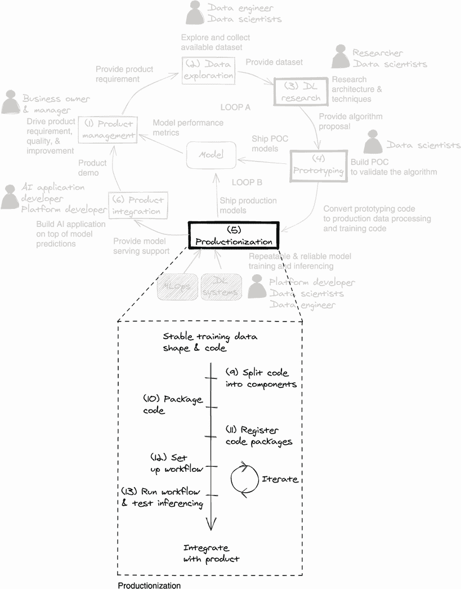

图 10.4 生产化阶段的生产路径摘录

### 10.2.1 代码组件化

如前一节所示，在原型设计期间，常常将训练数据准备、模型训练和推断代码存在于单个笔记本中。为了将它们生产化为一个深度学习系统，我们需要将它们拆分为单独的组件。拆分组件的一种方法，即*代码组件化*，如图 10.5 所示。

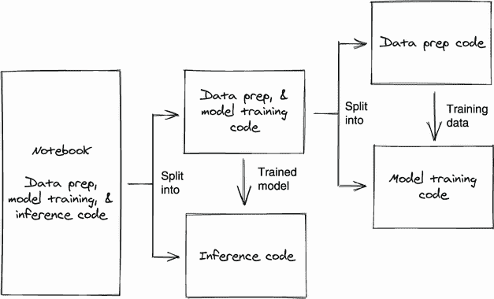

图 10.5 将代码从单个笔记本组件化为可以单独打包的多个部分。第一个分割发生在训练好的模型是输出的地方。可选的第二次分割发生在训练数据是输出的地方。

让我们将图中的流程付诸实施。在代码中划分的第一条分割线是模型是输出的地方。这应该导致两段代码如下所示：

+   输出模型的模型训练代码

+   模型推断代码，以模型和推断请求作为输入，产生推断作为输出

可选择地，模型训练代码可以分为以下几部分：

+   训练数据转换代码，以原始数据作为输入，并输出可被模型训练代码使用的训练数据

+   模型训练代码，它以训练数据作为输入，并训练出一个模型作为输出

如果你有其他受益于相同类型准备好的数据的模型训练代码，将这些代码分离开是个好主意。如果你的数据准备步骤需要以不同的节奏执行模型训练，分离也是一个好主意。

### 10.2.2 代码打包

一旦代码组件被清晰地分离，它们就可以被打包部署。为了能够在训练服务（第三章）、模型服务（第六章）和工作流服务（第九章）上运行它们，我们首先需要确保它们遵循这些服务设置的约定。

模型训练代码应修改为从训练服务设置的环境变量指示的位置获取训练数据。其他组件应遵循类似的约定。

模型推理代码应遵循您选择的模型服务策略的约定：

+   如果你使用直接的模型嵌入，需要与嵌入模型的团队合作，确保你的推理代码可以正常工作。

+   如果你计划使用模型服务来提供模型，确保你的推理代码提供了一个接口，使得模型服务可以进行通信。

+   如果你使用模型服务器，只要模型服务器能够正确地提供模型，你可能就不需要模型推理代码。

我们将这些代码组件打包为 Docker 容器，以便它们可以被它们各自的主机服务启动、访问和跟踪。如何做到这一点的示例可以在附录 A 中找到。如果需要特殊的数据转换，我们可以将数据转换代码集成到数据管理服务中。

### 10.2.3 代码注册

在训练代码和推理代码可以被系统使用之前，它们的包必须被注册并存储到元数据和工件服务中。这提供了训练代码和推理代码之间的必要联系。让我们看看它们是如何相关的（图 10.6）。

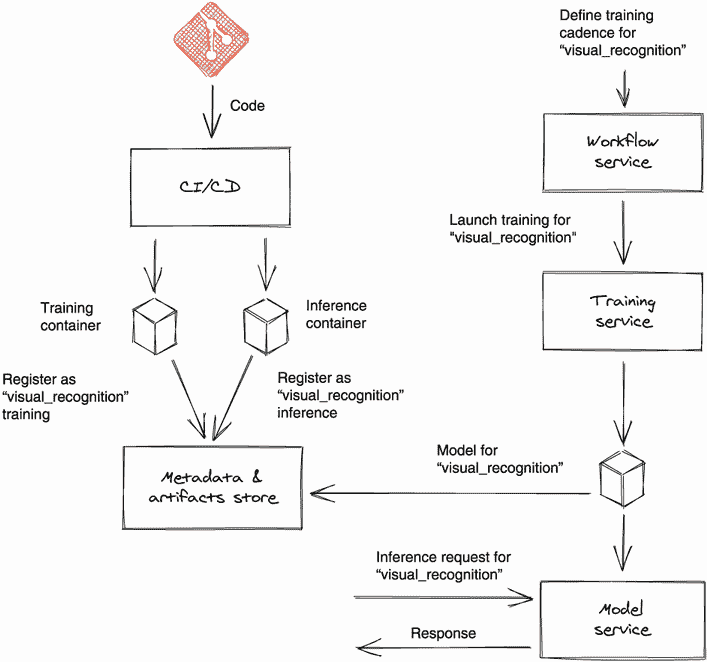

图 10.6 在生产深度学习系统中的简单训练和推理执行流程

一旦训练和推理代码被打包为容器（如图中的训练容器和推理容器），它们可以使用一个共同的句柄（例如`visual_recognition`，就像图 10.6 中所示的示例一样）注册到元数据和工件存储中。这有助于系统服务在接收到提供相同句柄名称的请求时找到并使用正确的代码容器。我们将在接下来的几个部分继续讲解这个图。

### 10.2.4 训练工作流程设置

我们建议即使您不经常训练模型，也要设置训练工作流程。 主要原因是在生产中提供相同模型训练流程的可重复性。 当除您之外的其他人需要训练模型并且可以使用您设置的流程时，这非常有帮助。 在某些情况下，生产环境是隔离的，并且通过在生产环境中设置的工作流程可能是在那里生成模型的唯一方法。 在图 10.7 中，我们已将先前图表的模型训练部分放大，以便您可以看到细节。

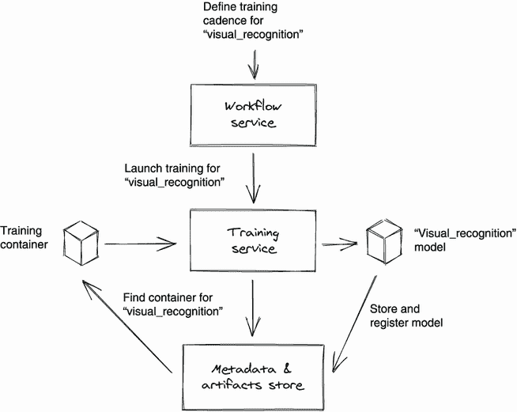

图 10.7 典型的生产模型训练设置。 工作流服务管理训练流程的何时以及如何运行。 训练服务运行模型训练作业。 元数据和工件存储提供训练代码，存储训练过的模型，并将其与元数据关联起来。

参考图 10.7，一旦设置了 `visual_recognition` 的训练工作流程，就可以触发训练到训练服务。 训练服务使用句柄从元数据和工件存储中查找要执行的训练代码容器。 一旦模型训练完成，它会使用句柄名称将模型保存到元数据和工件存储中。

在这个阶段，通常也会发现使用超参数优化技术来在模型训练期间找到最佳训练超参数。 如果使用了 HPO 服务，则工作流程将与 HPO 服务而不是直接与训练服务进行通信。 如果您需要提醒 HPO 服务如何工作，请参阅第五章。

### 10.2.5 模型推理

一旦模型在生产环境中训练并注册，下一步是确保它能够处理系统中进入的推理请求，并在一定的速率内产生推理。 我们可以通过将推理请求发送到模型服务来实现这一点。 当模型服务收到请求时，它会在请求中找到句柄名称 `visual_recognition`，并查询元数据和工件存储以获取匹配的模型推理容器和模型文件。 然后，模型服务可以一起使用这些工件来生成推理响应。 您可以在图 10.8 中看到这个过程，再次强调，这是图 10.6 模型服务部分的放大版本。

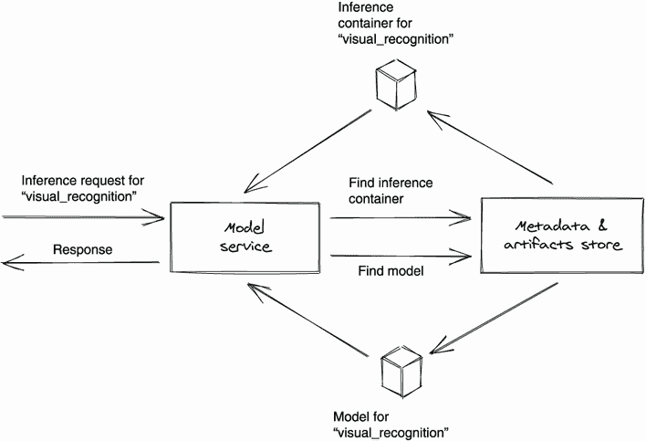

图 10.8 典型的生产模型服务设置。 当推理请求到达模型服务时，服务使用元数据和工件存储查找推理容器和模型，以产生推理响应。

如果您使用模型服务器，可能需要在其前面加上一层薄膜，以便它知道从哪里获取模型文件。 一些模型服务器实现支持自定义模型管理器实现，也可以用于针对元数据和工件存储进行查询以加载正确的模型。

### 10.2.6 产品集成

在从模型服务获得适当的推断响应后，就该将模型服务客户端集成到将使用这些推断的产品中。这是生产化的最后一步，我们在推出给最终客户之前需要确保检查几个问题。因为我们正在改进安全摄像头产品的运动检测，所以我们必须将一个模型服务客户端集成到安全摄像头视频处理后端中，以便从新改进的模型请求推断：

+   确保推断响应可被使用它的产品消耗。

+   通过以接近生产流量的速率发送推断请求来进行压力测试推断。

+   通过使用不规范的推断请求进行测试推断，以确保其不会破坏模型推断代码或模型服务。

这只是一个非常基本的检查项目列表。您的组织可能会定义更多生产准备性标准，您需要在集成之前满足这些标准。除了可以告诉我们模型是否正常提供推断请求的系统指标外，我们还应该设置业务指标，这些指标将告诉我们模型是否有助于实现业务用例。

## 10.3 模型部署策略

在上一节中，我们通过一个从原型设计到生产的示例路径。这个过程假设模型是首次部署，没有现有版本的模型需要替换。一旦模型在生产中使用，除非有维护窗口允许，否则通常需要使用模型部署策略来确保生产推断请求流量不会中断。事实上，这些模型部署策略也可以作为在生产中进行实验的方式，通过使用前一节中设置的业务指标。我们将看下三种策略：金丝雀、蓝绿和多臂赌博机。

### 10.3.1 金丝雀部署

金丝雀部署（类似 A/B 测试）是指在保留旧模型为大多数请求提供服务的同时，将新模型部署到生产推断请求的一小部分上。示例如图 10.9 所示。这需要模型服务支持将一小部分推断请求流量分段和路由到新模型。

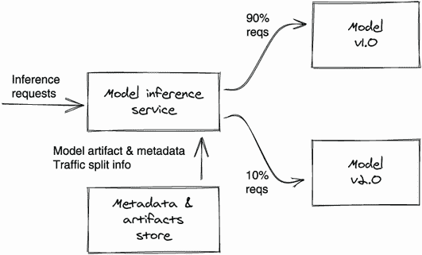

图 10.9 金丝雀部署示例，显示将一小部分流量重定向到新模型的版本

使用这种策略，可能由于部署新模型而产生的任何不利影响都局限在少部分最终用户之内。通过将所有推断请求流量路由回旧模型，回滚变得相当简单。

这种方法的一个缺点是，您只能了解到模型对一小部分最终用户的性能。将新模型发布以服务于所有推断请求流量可能会产生与仅为流量的一小部分提供服务时所观察到的不同效果。

### 10.3.2 蓝绿部署

在我们的上下文中，蓝绿部署意味着部署一个新模型，将所有推理请求流量路由到新模型，并保持旧模型在线，直到我们确信新模型的性能符合预期。在实现上，它是三种策略中最简单的，因为根本没有流量分割。服务所需做的一切就是内部指向新模型以服务所有推理请求。图 10.10 描绘了蓝绿部署。

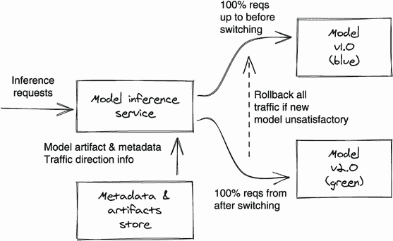

图 10.10 蓝绿部署显示所有流量指向旧（蓝色）或新（绿色）模型的方向

这种策略不仅简单，而且在为所有终端用户提供服务时可以全面了解模型的表现。回滚也很简单。只需将模型服务指向旧模型即可。

这种方法的明显缺点是，如果新模型出现问题，将影响所有终端用户。当您基于新模型开发新产品功能时，这种策略可能是合理的。随着您随时间迭代训练更好的模型，您可能希望摆脱这种策略，因为终端用户会根据稳定的体验建立他们的期望。

### 10.3.3 多臂赌博机部署

多臂赌博机（MAB）是三种策略中最复杂的部署策略。MAB 指的是一种技术，它持续监控多个模型的性能，并随着时间的推移将越来越多的推理请求流量重定向到胜利模型。这使用了模型服务最复杂的实现，因为它要求服务了解模型性能，这取决于您的模型性能指标如何定义。MAB 部署在图 10.11 中说明。

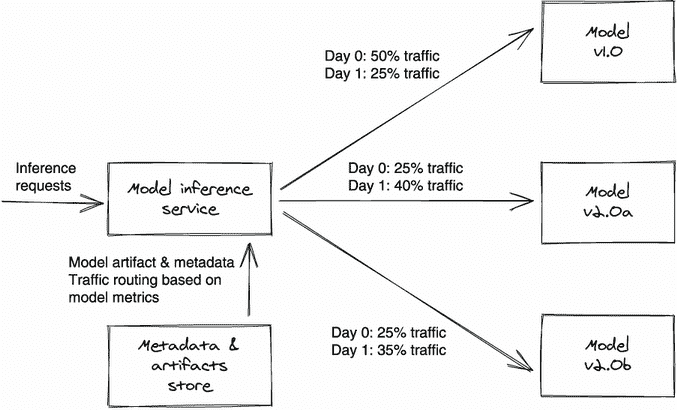

图 10.11 多臂赌博机部署显示了第 0 天和第 1 天的流量模式。注意，模型 v2.0a 在第 1 天的模型性能方面处于领先地位，因为它接收到了最多的流量。

不过，这种策略确实带来了一个优势，因为它在一定的时间范围内最大化了表现最佳模型的利益，而使用金丝雀部署，如果新模型胜过旧模型，您可能只会获得最小的利益。注意，您应确保模型服务报告流量分割随时间的变化。这有助于与模型的性能相关联。

## 摘要

+   深度学习研究团队发明并改进用于训练模型的深度学习算法。

+   模型开发团队利用现有的算法和可用数据来训练帮助解决深度学习用例的模型。

+   研究和原型制作都需要与代码开发、数据探索和可视化的高度互动。笔记本环境是这些团队的流行选择。

+   数据集管理服务可以在研究和原型制作过程中使用，帮助跟踪用于训练实验模型的训练数据。

+   一旦训练数据和代码足够稳定，投入生产的第一步是打包模型训练代码、模型推理代码和任何源模型。

+   所有深度学习系统的服务都可以使用这些软件包来训练、跟踪和提供模型。

+   一旦模型训练工作流程开始运行并获得令人满意的推理响应，就可以开始与最终用户产品的集成。

+   如果提供推理请求不能中断，则需要一个模型部署策略。

+   多种模型部署策略可供选择，它们可以兼作在生产中进行实验。
