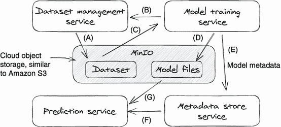
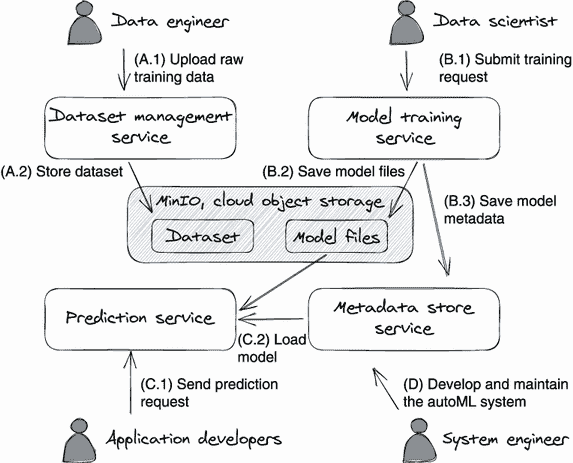

# 附录 A：一个“你好世界”深度学习系统

本书是关于教授构建适合自己情况的深度学习系统的设计原则。但你可能会想知道一个深度学习系统看起来是什么样子。或者人们在实践中如何、为什么以及何时使用这样一个系统。这些都是现阶段很好的问题。

我们相信学习新思想、技能和方法的最佳方法是通过实践——通过获取一些示例并看看你能做些什么。为了帮助你，我们建立了一个迷你深度学习系统和一个代码实验室供你使用。在这个“你好世界”深度学习系统中玩耍应该有助于你建立理解本书介绍的概念和原则的知识库。为了使这个示例系统易于理解，我们侧重于深度学习系统的关键组件，如数据集管理（DM）和模型训练与服务。整个迷你系统可以通过一个 bash 脚本轻松设置在你的本地系统上，并且它的组件在后面的章节中会详细讨论。

在这个附录中，我们将首先参观我们的示例系统，然后进行实验室练习，让你体验深度学习系统中最常见的用户活动，包括数据集摄入、模型训练和模型服务。虽然我们的示例系统非常简化，但它涵盖了深度学习系统的所有基础知识。通过阅读这个附录，你不仅会获得一个关于基本深度学习系统是如何组织和运作的实践理解，而且还会对本书其余部分讨论的示例服务有一个全面的了解。

## A.1 介绍“你好世界”深度学习系统

从用户的角度来理解软件系统的最快方法。因此，在这个介绍部分，我们首先将看看深度学习系统的用户：人物角色及其责任。然后，我们将深入探讨系统设计、主要组件和用户工作流程。

### A.1.1 人物角色

为了将复杂性降到最低，我们的示例迷你深度学习系统只有四个*人物角色*，或*角色*：数据工程师、数据科学家/研究员、系统开发人员和深度学习应用程序开发人员。我们选择了这四个角色，因为它们是保持深度学习系统运行所需的最少人员。在这个“你好世界”系统中，每个角色的角色定义和工作描述在以下各节中列出。

注意 这里描述的角色责任是过于简化的，因为我们想集中在深度学习系统的最基本工作流程上。关于深度学习系统中涉及的人物角色和职责的更详细定义，请参阅第 1.1 节。

### A.1.2 数据工程师

数据工程师负责收集、处理和存储用于深度学习训练的原始数据。在这个小系统中，我们有一个 DM 服务用于存储用于模型训练的数据集。数据工程师将使用此服务上传原始训练数据。在我们的实验中，我们准备了一些意图分类数据集，供您体验此过程。

### A.1.3 数据科学家/研究人员。

数据科学家或研究人员开发具有满足业务要求的模型训练算法和模型。它们是深度学习系统中模型训练基础设施的“客户”。

我们的示例系统包含一个训练服务，用于运行模型训练代码。在实验中，我们为你预先构建了一个意图分类训练代码，以体验模型训练执行。

### A.1.4 系统开发人员。

系统开发人员构建整个深度学习系统并维护它，以确保所有的机器学习活动都正常运行。他们的活动包括数据集上传、模型训练和模型服务。

### A.1.5 深度学习应用开发人员。

深度学习应用开发人员利用深度学习模型构建商业产品，如聊天机器人、自动驾驶软件和人脸识别移动应用程序。这些应用程序是任何深度学习系统的最重要的客户，因为它们为系统产生的模型创造业务影响（收入）。在我们的实验中，你将有机会想象自己是聊天机器人的客户，通过运行脚本向预测服务发送请求并分类你的消息。

### A.1.6 样例系统概述。

我们的小型深度学习系统由四个服务和一个存储系统组成：

+   *数据服务* — 用于存储和获取数据集。

+   *模型训练服务* - 用于运行模型训练代码。

+   *元数据存储服务* — 用于存储模型元数据，如模型名称、模型版本和模型算法。

+   *预测服务* — 设计用于执行模型以处理客户的预测请求。

+   *MinIO 存储* — 旨在在您的本地计算机上运行，作为与 Amazon S3 类似的对象存储。

几乎所有这些服务在本书中都有自己的章节，因此我们将能够更详细地研究它们。现在，我们只想提供你需要理解后面的用户场景和实验的高级概述。图 A.1 说明了样例系统（四个服务和存储系统）的主要组成部分及其相互依赖关系。



图 A.1 所示是样例深度学习系统的设计概述。

除了四个服务和存储（用矩形框表示），你会注意到这些框之间有很多有向箭头。这些箭头显示了样例系统内部服务的相互依赖关系。以下是这些依赖关系的解释：

+   DM 服务将数据集保存到 MinIO 存储中。

+   模型训练服务查询 DM 以准备训练数据集并获取训练数据。

+   模型训练服务从 MinIO 下载训练数据。

+   模型训练服务将模型文件保存到 MinIO。

+   模型训练服务将模型元数据保存到元数据存储服务中。

+   预测服务查询元数据存储以确定使用哪个模型。

+   预测服务从 MinIO 下载模型文件以提供预测请求。

### A.1.7 用户工作流程

现在，我们已经介绍了人物角色和主要服务，让我们来看看用户工作流程。图 A.2 展示了每个角色的用户工作流程。



图 A.2 中的系统实现了 DM、训练、服务和系统维护四种不同的工作流程。

图 A.2 显示了每个角色使用迷你深度学习系统来执行自己的任务，利用图 A.1 中介绍的服务。让我们回顾一下每个工作流程:

+   *场景 A* ——数据工程师调用 DM 服务上传原始数据; DM 将数据摄取并保存到 MinIO 存储中的训练数据集格式中。

+   *场景 B* ——数据科学家首先编写训练代码，然后提交训练请求给训练服务。训练服务执行训练代码并生成模型。然后，它将模型元数据保存到元数据存储中，并将模型文件保存到 MinIO 存储中。

+   *场景 C* ——应用程序开发人员构建应用程序，调用预测服务来使用在场景 B 中训练的模型。

+   *场景 D* ——系统开发人员构建和维护此系统。

## A.2 实验演示

现在是你开始学习的时候了。在这个实验练习中，你将在本地计算机上参与到 A.1.3 节中提到的用户场景中。为了使这个练习更生动，我们介绍了一些角色，这样你不仅会知道如何使用深度学习系统，还会了解谁负责处理每个不同的工作。虚构的角色包括伊万(一名数据科学家)、风(一名数据工程师)、唐(一名系统开发人员)和约翰娜(一名应用程序开发人员)。

### A.2.1 演示步骤

在这个演示场景中，我们将有唐、风、伊万和约翰娜四个人一起合作，训练一个意图分类模型，并使用该模型对任意文本消息进行分类。这个场景模拟了一个典型模型开发工作流程的四个基本步骤:系统设置、数据集构建、模型训练和模型服务。

为了使实验易于运行，我们将所有微服务进行了 Docker 化，并构建了 shell 脚本来自动化实验设置和演示场景。通过按照我们 GitHub 仓库中 README 文件([`github.com/orca3/MiniAutoML#lab`](https://github.com/orca3/MiniAutoML#lab))中的说明，运行四个 shell 脚本，你可以完成实验。

注意：你可以在 [`github.com/orca3/MiniAutoML/tree/main/scripts`](https://github.com/orca3/MiniAutoML/tree/main/scripts) 的 scripts 文件夹中找到实验演示脚本。该文件夹包含了整本书的演示脚本。以 *lab-* 开头的文件用于此演示，例如 `lab-001-start-all.sh`（地址：[`mng.bz/zmv1`](http://mng.bz/zmv1)）可在本地系统上设置。对于未来的更新和成功执行实验脚本，请始终参考 GitHub 仓库中的说明。

*第一步是系统设置*。运行 `scripts/lab-001-start-all.sh` ([`mng.bz/zmv1`](http://mng.bz/zmv1))。

唐（系统开发者）通过运行 `scripts/lab-001-start-all.sh` 脚本启动迷你深度学习系统。该脚本将下载演示服务的预构建 Docker 镜像并执行它们。

当脚本执行完毕后，迷你深度学习系统已经启动并运行。你可以使用以下命令列出所有本地正在运行的 Docker 容器，以验证所有服务都在运行：

```py
$ docker ps --format="table {{.Names}}\t{{.Image}}"
```

提供了用于运行实验的 Docker 容器，见下式。

附录 A.1 确认所有系统组件都在运行

```py
NAMES                                 IMAGE
training-service                      orca3/services:latest
prediction-service                    orca3/services:latest
intent-classification-torch-predictor pytorch/torchserve:0.5.2-cpu
intent-classification-predictor       orca3/intent-classification-predictor
metadata-store                        orca3/services:latest
data-management                       orca3/services:latest
minio                                 minio/minio
```

唐确认所有微服务都在运行后，系统已准备好供使用。他通知伊凡和冯开始他们的工作。

注意：如果你阅读过 `lab-001-start-all.sh` 脚本，你会发现系统中大多数服务（除了预测器）—例如数据管理和模型训练—都被打包到一个 Docker 镜像中（`orca3/services`）。这不是一个推荐的生产用例模式，但由于使用的磁盘空间较少且执行简单，它适用于我们的演示需求。

*第二步是构建训练数据集*。运行 `scripts/lab-002-upload-data.sh` ([`mng.bz/0yqJ`](http://mng.bz/0yqJ))。

冯（数据工程师）首先从互联网上下载原始数据，并进行一些训练的修改（参见 `scripts/prepare_data.py`，地址：[`mng.bz/KlKX`](http://mng.bz/KlKX)）。然后，冯将处理后的数据上传到 DM 服务。数据集上传完成后，DM 服务会返回一个唯一的数据集 ID，以供将来参考。

我们已经将冯的工作自动化在 `scripts/lab-002-upload-data.sh` 脚本中。执行完此脚本后，将创建一个数据集。你可以在终端中看到 DM 服务打印出一个 JSON 对象。此 JSON 对象表示数据集的元数据，请参考以下示例。

附录 A.2 DM 服务中的样本数据集元数据

```py
# DM returns dataset metadata for a newly created dataset
{
 "dataset_id": "1",                                ❶
  "name": "tweet_emotion",                          ❷
  "dataset_type": "TEXT_INTENT",                    ❸
  "last_updated_at": "2022-03-25T01:32:37.493612Z",
  "commits": [                                      ❹
    {                                               ❹
      "dataset_id": "1",                            ❹
      "commit_id": "1",                             ❹
      "created_at": "2022-03-25T01:32:38.919357Z",  ❹
      "commit_message": "Initial commit",           ❹
      "path": "dataset/1/commit/1",                 ❹
      "statistics": {                               ❹
        "numExamples": "2963",                      ❹
        "numLabels": "3"                            ❹
      }                                             ❹
    }                                               ❹
  ]                                                 ❹
}
```

❶ 数据集标识符

❷ 数据集名称

❸ 数据集类型

❹ 数据集审核历史记录

数据集元数据在第二章中有详细讨论。现在，我们可以忽略元数据 JSON 对象的大部分属性，只关注`dataset_id`属性。*数据集 ID*是数据集的唯一标识符；你需要在第 3 步将此 ID 传递给训练服务以进行模型训练。一旦数据集准备好，Feng 就会通知 Ivan 使用`dataset_id="1"`开始模型训练。

*步骤 3 是模型训练。*运行`scripts/lab-003-first-training.sh`（[`mng.bz/vnra`](http://mng.bz/vnra)）。

Ivan（数据科学家）首先构建意图分类训练代码（`training-code/text-classification`位于[`github.com/orca3/MiniAutoML/tree/main/training-code/text-classification`](https://github.com/orca3/MiniAutoML/tree/main/training-code/text-classification)）并将其打包成 Docker 镜像（[`mng.bz/WA5g`](http://mng.bz/WA5g)）。接下来，Ivan 向模型训练服务提交训练请求以创建模型训练作业。在训练请求中，他指定了在训练中使用的数据集（数据集 ID）和训练算法（Docker 镜像名称）。

注意 在本实验中，我们使用了硬编码的数据集 ID `"1"`。要测试其他数据集，请随意将任何其他数据集 ID 设置为训练请求中。

一旦训练服务接收到训练请求，它将启动一个 Docker 容器来运行 Ivan 提供的意图分类训练代码。在我们的演示中，Docker 镜像是`orca3/intent-classification`（[`mng.bz/WA5g`](http://mng.bz/WA5g)）。请运行实验脚本（`scripts/lab-003-first-training.sh`位于[`mng.bz/916j`](http://mng.bz/916j)）来启动模型训练作业，该脚本设置了依赖项和参数。

列表 A.3 向训练服务提交训练作业

```py
# send gRPC request to kick off a model training in training service.
function start_training() {
 grpcurl -plaintext \
   -d "{
   \"metadata\": {
     \"algorithm\":\"intent-classification\",   ❶
     \"dataset_id\":\"1\",                      ❷
     \"name\":\"test1\",  
     \"train_data_version_hash\":$2,            ❸
     \"output_model_name\":\"twitter-model\",   ❹
     \"parameters\": {                          ❹
       \"LR\":\"4\",                            ❹
       \"EPOCHS\":\"15\",                       ❹
       \"BATCH_SIZE\":\"64\",                   ❹
       \"FC_SIZE\":\"128\"                      ❹
     }                                          ❹
   }
 }" \
   localhost:"6003" training.TrainingService/Train
}
```

❶ 训练 Docker 镜像名称

❷ 要训练的数据集的 ID

❸ 数据集版本

❹ 训练超参数

一旦训练作业开始，训练服务将持续监视训练执行状态并返回作业 ID 以便跟踪。有了作业 ID，Ivan 可以通过查询训练服务的`GetTrainingStatus`API 和元数据存储服务的`GetRunStatus`API 获取最新的训练作业状态和训练元数据。查看示例查询请求如下。

列表 A.4 查询模型训练作业状态和模型元数据

```py
# query training job status from training service
grpcurl -plaintext \
 -d "{\"job_id\": \"1\"}" \                                        ❶
 localhost:"6003" training.TrainingService/GetTrainingStatus

# query model training metrics from metadata store.
grpcurl -plaintext \
 -d "{\"run_id\": \"1\"}" \                                        ❶
 localhost:"6002" metadata_store.MetadataStoreService/GetRunStatus
```

❶ 模型 ID，也是训练作业 ID

训练服务可以实时返回训练执行状态；查看示例响应如下：

```py
job 1 is currently in "launch" status, check back in 5 seconds
job 1 is currently in "running" status, check back in 5 seconds
job 1 is currently in "succeed" status            ❶
```

❶ 训练完成

由于训练 Docker 容器在训练执行期间向元数据存储报告实时指标，如训练准确性，因此元数据存储服务可以返回实时训练指标。查看来自元数据存储服务的示例模型训练指标如下：

```py
{
  "run_info": {
    "start_time": "2022-03-25T14:25:44.395619",
    "end_time": "2022-03-25T14:25:48.261595",
    "success": true,                                 ❶
    "message": "test accuracy 0.520",                ❷
    "run_id": "1",                                   ❸
    "run_name": "training job 1",
    "tracing": {
      "dataset_id": "1",                             ❹
      "version_hash": "hashAg==",                    ❹
      "code_version": "231c0d2"
    },
    "epochs": {                                      ❺
      "0-10": {                                      ❺
        "start_time": "2022-03-25T14:25:46.880859",  ❺
        "end_time": "2022-03-25T14:25:47.054872",    ❺
        "run_id": "1",                               ❺
        "epoch_id": "0-10",                          ❺
        "metrics": {                                 ❺
          "accuracy": "0.4925373134328358"           ❺
        }                                            ❺
      },                                             ❺
      .. .. ..
   }
}
```

❶ 训练状态

❷ 训练容器的最后一条消息

❸ 训练作业 ID，以及模型 ID

❹ 数据集标识符

❺ 每个时期的训练度量

训练完成后，Ivan 通知 Johanna 模型已经准备好使用。在我们的实验室中，他将模型 ID（作业 ID = `"1"`）传递给 Johanna，以便她知道要使用哪个模型。

请注意，代码清单 A.3 和 A.4 中描述的所有 API 请求都在 `scripts/lab-003-first-training.sh` 中自动执行；您可以一次性执行它们。在第三章和第四章中，我们会详细讨论训练服务的工作原理。

*步骤 4 是模型服务。* 运行 `scripts/lab-004-model-serving.sh`（[`mng.bz/815K`](http://mng.bz/815K)）。

Johanna（应用程序开发人员）正在构建一个聊天机器人，所以她想要使用新训练的意图分类模型来对客户的问题进行分类。当 Ivan 告诉 Johanna 模型已经准备好使用时，Johanna 向预测服务发送一个预测请求来测试新训练的模型。

在预测请求中，Johanna 指定了模型 ID（`runId`）和文档，其中文档是正在被分类的文本消息。样本预测服务将自动加载预测请求中请求的模型。您可以在以下清单中看到一个样本 gRPC 预测请求。

清单 A.5 一个样本模型预测 gRPC 请求

```py
grpcurl -plaintext \
  -d "{
    \"runId\": \"1\",                                      ❶
    \"document\": \"You can have a certain arrogance, 
      and I think that's fine, but what you should never
      lose is the respect for the others.\"                ❷
  }" \
  localhost:6001 prediction.PredictionService/Predict
```

❶ 模型 ID，以及训练作业 ID

❷ 请求体（文本）

在终端中执行查询（代码清单 A.5）或 `scripts/lab-004-model-serving.sh` 后，您将会看到以下来自模型服务的输出：对于给定文本，意图分类模型预测出的类别（标签）。

```py
{
  "response": "{\"result\": \"joy\"}"   ❶
}
```

❶ 预测的类别是“快乐”。

如果在完成实验过程中遇到任何问题，请查看我们 GitHub 仓库 README 文件的实验部分（[`github.com/orca3/MiniAutoML#lab`](https://github.com/orca3/MiniAutoML#lab)）中的最新说明。如果示例系统被修改，我们会尽量保持这些说明的更新。

### A.2.2 一个自己完成的练习

现在我们已经向您展示了一个完成的模型开发周期，现在是作业时间。想象一下，在成功发布聊天机器人之后，Johanna 的聊天机器人服务需要支持一个新类别，*乐观*。这个新需求意味着当前的意图分类模型需要重新训练以识别乐观类型的文本消息。

Feng 和 Ivan 需要共同合作建立一个新的意图分类模型。Feng 需要收集更多带有“乐观”标签的训练数据并将其添加到当前数据集中。虽然 Ivan 不需要更改训练代码，但他确实需要使用更新的数据集触发训练服务中的训练作业来构建一个新模型。

通过按照第 A.2.1 节中的示例查询和脚本，您应该能够完成 Feng 和 Ivan 的任务。如果您想要检查您的结果或者在完成这些任务时需要帮助，您可以在 `scripts/lab-005-second-training.sh` 文件中找到我们的解决方案。我们鼓励您在检查我们的解决方案之前尝试或者玩弄这个问题。
