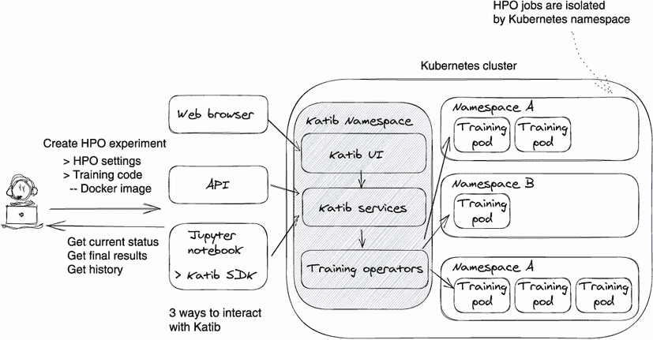
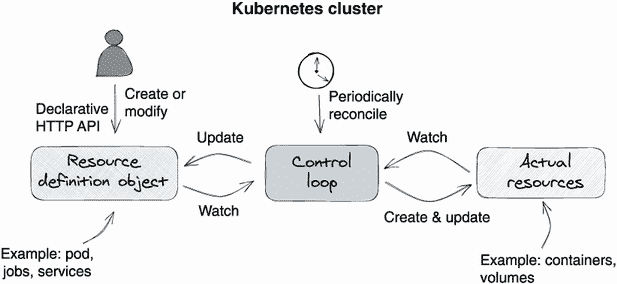
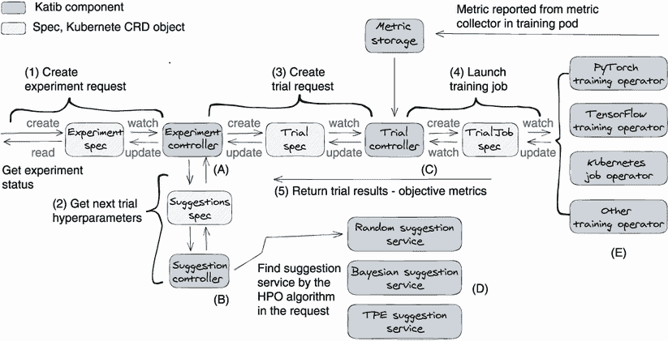
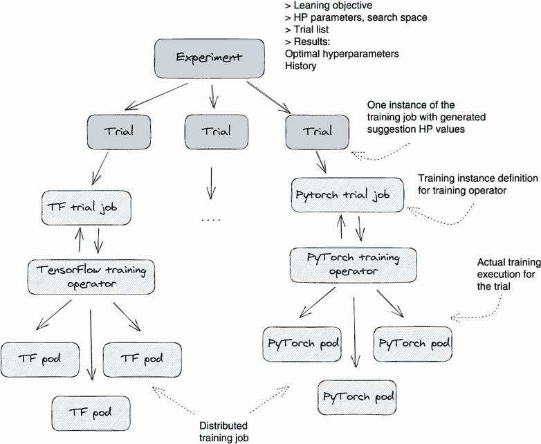

# 附录 C：创建使用 Kubeflow Katib 的 HPO 服务

我们将向您介绍一个开源的超参数优化（HPO）服务——Kubeflow Katib，它满足了我们在第五章讨论的几乎所有 HPO 要求。我们强烈建议您在构建自己的 HPO 服务之前考虑采用 Katib。除了向您展示如何使用 Katib 外，我们还将介绍其系统设计和代码库，以使您对这个开源服务感到舒适。

作为 Kubeflow 家族的一员，Katib 是一个云原生、可扩展且可投入生产的超参数优化系统。此外，Katib 不关心机器学习框架或编程语言。此外，Katib 是用 Go 编写的，采用 Kubernetes 本地方法，可以在 Kubernetes 集群中独立运行。除了支持具有早期停止支持的超参数优化外，Katib 还支持神经架构搜索（NAS）。

Katib 有许多优点，包括其支持多租户和分布式训练的能力、其云原生性以及其可扩展性，所有这些都使其与其他系统有所区别。无论您是在云中还是在本地服务器上使用 Kubernetes 管理服务器集群，Katib 都是最佳选择。在本章中，我们将以以下五个步骤介绍 Katib：Katib 概述、如何使用 Katib、Katib 系统设计和代码阅读、加速 HPO 执行以及向 Katib 添加自定义 HPO 算法。

## C.1 Katib 概览

Katib 以黑盒方式管理 HPO 实验和计算资源，因此 Katib 用户只需要提供训练代码并定义 HPO 执行计划，然后 Katib 就会处理其余事务。图 C.1 显示了 Katib 的系统概述。



图 C.1 Katib 系统概述。Katib 组件作为 Kubernetes 本地服务运行，并且 Katib 支持三种类型的用户界面：UI、API 和 SDK。

在图 C.1 中，我们看到 Katib 为用户的方便性提供了三种类型的用户界面：一个 Web UI，一个 Python SDK，以及一组 API。用户可以通过网页、Jupyter 笔记本、Kubernetes 命令和 HTTP 请求来运行 HPO。

从用户的角度来看，Katib 是一个远程系统。要运行 HPO，用户需要向 Katib 提交一个实验请求，然后 Katib 为他们执行 HPO 实验。要构建实验请求，用户需要做两件事：首先，将训练代码制作成 Docker 镜像，并将要优化的超参数暴露为外部变量；其次，创建一个实验对象，定义 HPO 实验的规范，如 HPO 算法、试验预算或超参数及其值搜索空间。一旦实验对象在 Katib 中创建完成，Katib 将分配计算资源以启动 HPO 执行。

Katib 在 Kubernetes 集群内部运行。Katib 服务本身并不消耗大量内存或磁盘空间；它启动 Kubernetes pod 来运行模型训练作业（HPO 试验）以测试不同的超参数建议。Katib 可以在不同的命名空间为不同的用户运行训练作业，以创建资源隔离。

## C.2 使用 Katib 入门

在本节中，我们将看一下如何操作 Katib。首先，我们在本地安装 Katib，然后解释术语，最后，我们向您展示一个 Katib 的端到端使用案例。

为什么在设计书中谈论 Katib 操作和安装呢？

理想情况下，我们不希望在设计书中包含软件的安装和用户指南，因为这些信息在书出版后可能会过时，并且我们可以在官方网站上找到实时的文档。以下是我们违反规则的两个原因。

首先，因为我们建议您使用 Katib 而不是构建您自己的服务，我们有责任向您展示完整的用户体验，既从 Katib 用户（数据科学家）的角度，又从 Katib 运营者（工程师）的角度。其次，为了理解 Katib 的设计并学习如何阅读其代码库，最好先解释其术语和典型用户工作流程。一旦你理解了 Katib 的工作原理，阅读其代码就会更容易。

### C.2.1 第一步：安装

如果您安装了 Kubeflow 系统 ([`mng.bz/WAp4`](https://mng.bz/WAp4))，那么 Katib 已包含在内。但如果您只对 HPO 感兴趣，您可以单独安装 Katib。Katib 正在积极发展和得到良好维护，所以请查看其官方安装文档 “Getting Started with Katib: Installing Katib” ([`mng.bz/81YZ`](http://mng.bz/81YZ))，获取最新的安装提示。

### C.2.2 第二步：理解 Katib 术语

对于 Katib 用户来说，实验、建议和试验是需要熟悉的三个最重要的实体/概念。定义如下。

实验

一个实验是单一的优化运行；它是一个端到端的 HPO 过程。一个实验配置包含以下主要组件：用于训练代码的 Docker 镜像，一个我们要优化的客观指标（也称为目标值），需要调整的超参数，以及一个值搜索空间和 HPO 算法。

建议

一个建议是一个由 HPO 算法提出的一组超参数值。Katib 创建一个试验作业来评估建议的值集。

试验

试验是实验的一次迭代。一次试验会接受一个建议，执行一个训练过程（一个试验作业）以产生一个模型，并评估模型的性能。

每个实验都运行一个试验循环。实验会持续调度新的试验，直到达到客观目标或者配置的最大试验数。您可以在 Katib 官方文档 “Introduction to Katib” ([`mng.bz/ElBo`](http://mng.bz/ElBo)) 中看到更多的 Katib 概念解释。

### C.2.3 第三步：将训练代码打包为 Docker 镜像

与超参数优化库的方法相比（第 5.4 节），最大的区别在于优化服务方法要求我们将模型训练代码打包成一个 Docker 镜像。这是因为优化服务需要在远程集群中运行优化训练实验，而 Docker 镜像是在远程运行模型训练代码的理想方法。

在准备 Docker 镜像时，有两个需要注意的地方：将超参数定义为训练代码的命令行参数，以及将训练指标报告给 Katib。让我们来看一个例子。

首先，我们在训练代码中将需要优化的超参数定义为命令行参数。因为 Katib 需要为不同的超参数值执行训练代码作为一个 docker 容器，所以训练代码需要从命令行参数中获取超参数值。在下面的代码示例中，我们定义了两个要调整的超参数：lr（学习率）和批量大小。在优化过程中，Katib 将在训练容器启动时传入这些值；请参见以下代码：

```py
def main():
  parser = argparse.ArgumentParser( \
    description="PyTorch MNIST Example")
  parser.add_argument("--batch-size", \              ❶
    type=int, default=64, metavar="N", \
    help="input batch size for training (default: 64)")
  parser.add_argument("--lr", \
    type=float, default=0.01, metavar="LR", \        ❶
    help="learning rate (default: 0.01)") 
```

❶ 从命令行参数解析超参数值

其次，我们让训练代码报告训练指标，尤其是目标指标，给 Katib，这样它就可以跟踪每个试验执行的进度和结果。Katib 可以从以下三个位置收集指标：stdout（操作系统的标准输出位置），任意文件和 TensorFlow 事件。如果你有特殊的指标收集或存储要求，也可以编写自己的指标收集容器。

最简单的选项是将评估（目标）指标打印到训练代码的标准输出（stdout）中，并使用 Katib 的标准指标收集器收集它们。例如，如果我们将目标指标定义为`Validation-accuracy`，并希望优化过程找到最小化此值的最优超参数，我们可以将以下日志写入到 stdout 中。Katib 的标准指标收集器将在 stdout 中检测到`Validation-accuracy=0.924463`，并将解析该值。如下所示是标准输出样本：

```py
2022-01-23T05:19:53Z INFO  Epoch[5] Train-accuracy=0.932769
2022-01-23T05:19:53Z INFO  Epoch[5] Time cost=31.698
2022-01-23T05:19:54Z INFO  Epoch[5] Validation-accuracy=0.924463
2022-01-23T05:19:58Z INFO  Epoch[6] Batch [0-100] Speed: 1749.16 .. 
```

Katib 默认使用的正则表达式格式来解析日志中的目标指标是`([\w|-]+)\s*=\s*([+-]?\d*(\.\d+)?([Ee][+-]?\d+)?)`。您可以在实验配置文件的`.source.filter.metricsFormat`中定义自己的正则表达式格式。更多详细信息，请参阅 Katib 文档“运行实验”的指标收集器部分（[`mng.bz/NmvN`](http://mng.bz/NmvN)）。

为了帮助你入门，Katib 提供了一系列示例训练代码和示例 Docker 镜像文件，以展示如何打包你的训练代码。这些示例是为不同的训练框架编写的，如 TensorFlow、PyTorch、MXNet 等。你可以在 Katib 的 GitHub 仓库中找到这些示例（[`mng.bz/DZln`](http://mng.bz/DZln)）。

### C.2.4 第四步：配置一个实验

现在你已经准备好了训练代码，我们可以开始在 Katib 中准备一个 HPO 实验。我们只需要在 Katib 中创建一个实验 CRD（customer resource definition）对象。

通过使用 Kubernetes API 或`kubectl`命令，我们可以通过指定一个 YAML 配置来创建实验 CRD。以下是一个示例配置。为了便于阅读，我们将示例配置分成了三个部分。我们逐个部分讨论一下。

第一部分：目标

第一部分是定义 HPO 实验的目标，并确定如何衡量每个试验（训练执行）的性能。Katib 使用`objectiveMetric`和`additionalMetric`的值作为目标值，以监控建议的超参数与模型的配合情况。如果一个试验的目标值达到了目标，Katib 将将建议的超参数标记为最佳值，并停止进一步的试验。 

对于以下配置，目标指标被设置为`Validation-accuracy`，目标值为`0.99`：

```py
apiVersion: kubeflow.org/v1beta1
kind: Experiment
metadata:
 namespace: kubeflow
 name: bayesian-optimization
spec:
 Objective:
   type: maximize
   goal: 0.99
   objectiveMetricName: Validation-accuracy    ❶
   additionalMetricNames:
     - Train-accuracy
```

❶ 定义了目标指标

第二部分：HPO 算法和超参数

设置完 HPO 的目标后，我们可以配置 HPO 算法并声明它们的搜索空间以及需要调整的超参数。我们分别来看这些配置。

*algorithm config*指定了我们希望 Katib 在实验中使用的 HPO 算法。在当前的示例中，我们选择了贝叶斯优化算法（[`mng.bz/lJw6`](http://mng.bz/lJw6)）。Katib 支持许多最新的 HPO 算法，你可以在 Katib 官方文档的“Running an Experiment”一节的 Search Algorithm in Detail 中看到它们（[`mng.bz/BlV0`](http://mng.bz/BlV0)）。你还可以将自己的 HPO 算法添加到 Katib 中，我们将在 C.5 节中讨论。

`ParallelTrialCount`、`maxTrialCount`和`maxFailedTrialCount`：根据它们的名称，可以自解释地定义试验如何安排实验。在这个示例中，我们并行运行了三个试验，共进行了 12 个试验。如果有三个试验失败，实验将停止。

*parameters config*定义了要调整的超参数及其值的搜索空间。Katib 根据你指定的超参数调整算法在搜索空间中选择超参数的值。请参考以下代码：

```py
algorithm:
  algorithmName: bayesianoptimization    ❶
  algorithmSettings:
    - name: "random_state"
      value: "10"
parallelTrialCount: 3
maxTrialCount: 12
maxFailedTrialCount: 3
Parameters:                              ❷
   - name: lr
     parameterType: double
     feasibleSpace:
       min: "0.01"
       max: "0.03"
   - name: num-layers
     parameterType: int
     feasibleSpace:
       min: "2"
       max: "5"
   - name: optimizer
     parameterType: categorical
     feasibleSpace:
       list:
         - sgd
         - adam
         - ftrl
```

❶ 使用了 Katib 提供的贝叶斯优化算法

❷ 定义了要优化的超参数及其值的搜索空间

最后一节：试验配置

在这个*trial template config*中，我们定义了要执行的训练代码（Docker 镜像）和要传递给训练代码的超参数。Katib 为几乎每个模型训练框架（如 TensorFlow、PyTorch、MXNet 等）都内置了作业，它负责在 Kubernetes 中执行实际的训练。

例如，如果我们想要在 PyTorch 训练代码的 HPO 试验中运行分布式训练，需要设置一个分布式组，我们可以将试验定义为 PyTorch 作业类型。Katib 将为您运行分布式训练。

在以下示例中，我们将试验定义为默认的作业类型 `Kubernetes Job`。在实验过程中，Katib 将以 Kubernetes Pod 的形式运行试验作业，无需对训练代码进行任何特殊的自定义配置；请参阅以下代码：

```py
 trialTemplate:
   primaryContainerName: training-container
   trialParameters:                          ❶
     - name: learningRate
       description: Learning rate for the training model
       reference: lr
     - name: numberLayers
       description: Number of training model layers
       reference: num-layers
     - name: optimizer
       description: Training model optimizer (sdg, adam or ftrl)
       reference: optimizer
   trialSpec:                                ❷
     apiVersion: batch/v1
     kind: Job
     spec:
       template:
         spec:
           containers:
             - name: training-container
               image: docker.io/kubeflowkatib/mxnet-mnist:latest
               command:                      ❸
                 - "python3"
                 - "/opt/mxnet-mnist/mnist.py"
                 - "--batch-size=64"
                 - "--lr=${trialParameters.learningRate}"
                 - "--num-layers=${trialParameters.numberLayers}"
                 - "--optimizer=${trialParameters.optimizer}"
           restartPolicy: Never
```

❶ 为训练代码声明超参数

❷ 配置训练容器

❸ 配置如何执行训练代码

Katib 为其支持的每个 HPO 算法提供了示例实验配置文件；您可以在 Katib GitHub 仓库中找到它们：`katib/examples/v1beta1/hp-tuning/` ([`mng.bz/dJVN`](http://mng.bz/dJVN))

### C.2.5 步骤 5：开始实验

一旦我们定义了实验配置并将其保存在 YAML 文件中，我们可以运行以下命令来启动实验：

```py
% kubectl apply -f bayesian-optimization.yaml
experiment.kubeflow.org/bayesian-optimization created

% kubectl get experiment -n kubeflow
NAME                    TYPE      STATUS   AGE
bayesian-optimization   Created   True     46s
```

从 `kubectl get experiment -n kubeflow` 的返回消息中，我们看到实验 `bayesian-optimization` 被创建为 Experiment CRD 资源。从现在开始，Katib 将完全拥有 HPO 实验，直到获得结果。

请注意，Katib 完全依赖于 Kubernetes CRD 对象来管理 HPO 实验和试验。它还使用 CRD 对象来存储其 HPO 活动的指标和状态，因此我们说 Katib 是一个 Kubernetes 原生应用程序。

除了上述 `kubectl` 命令之外，我们还可以使用 Katib SDK、其 Web UI 或发送 HTTP 请求来启动实验。

### C.2.6 步骤 6：查询进度和结果

您可以使用以下命令来检查实验的运行状态：

```py
% kubectl describe experiment bayesian-optimization -n kubeflow
```

`kubectl describe` 命令将返回有关实验的所有信息，例如其配置、元数据和状态。从进度跟踪的角度来看，我们主要关注状态部分。请参阅以下示例：

```py
Status:
  Completion Time:  2022-01-23T05:27:19Z
  Conditions:                              ❶
    .. .. .. 
    Message:               Experiment is created
    Type:                  Created
    .. .. ..
    Message:               Experiment is running
    Reason:                ExperimentRunning
    Status:                False
    Type:                  Running
    .. .. ..
    Message:               Experiment has succeeded because max trial count has reached
    Reason:                ExperimentMaxTrialsReached
    Status:                True
    Type:                  Succeeded
  Current Optimal Trial:                   ❷
    Best Trial Name:  bayesian-optimization-9h25bvq9
    Observation:
      Metrics:                             ❸
        Latest:  0.979001
        Max:     0.979001
        Min:     0.955713
        Name:    Validation-accuracy
        Latest:  0.992621
        Max:     0.992621
        Min:     0.906333
        Name:    Train-accuracy
    Parameter Assignments:                 ❹
      Name:    lr
      Value:   0.014183662191100063
      Name:    num-layers
      Value:   3
      Name:    optimizer
      Value:   sgd
  Start Time:  2022-01-23T05:13:00Z
  Succeeded Trial List:                    ❺
    .. .. ..
    bayesian-optimization-5s59vfwc
    bayesian-optimization-r8lnnv48
    bayesian-optimization-9h25bvq9
    .. .. ..
  Trials:            12
  Trials Succeeded:  12 
```

❶ 实验历史

❷ 当前最佳试验的元数据

❸ 当前最佳试验的目标度量

❹ 当前最佳试验中使用的超参数值

❺ 已完成试验列表

以下是对前面示例响应的几点解释：

+   *状态/条件*—显示当前和以前的状态。在前面的示例中，我们看到实验经历了三个状态：创建、运行和成功。从消息中，我们知道实验已完成，因为它用完了训练预算——最大试验计数。

+   *当前最佳试验*—显示当前的“最佳”试验以及试验使用的超参数值。它还显示目标度量的统计信息。随着实验的进行，这些值将不断更新，直到实验中的所有试验都完成，然后我们将 `status.currentOptimalTrial.parameterAssignment`（超参数值分配）作为最终结果。

+   *成功的试验列表/失败的试验列表/试验*—通过列出实验执行的所有试验来显示实验的进展情况。

### C.2.7 步骤 7：故障排除

如果有失败的试验，我们可以运行以下命令来检查失败的试验作业的错误消息。参见以下失败的 HPO 示例：

```py
-> % k describe trial bayesian-optimization-mnist-pytorch-88c9rdjx \
     -n kubeflow
Name:         bayesian-optimization-mnist-pytorch-88c9rdjx
.. .. ..
Kind:         Trial
Spec:
  .. .. ..
  Parameter Assignments:
    Name:                  lr
    Value:                 0.010547476197421666
    Name:                  num-layers
    Value:                 3
    Name:                  optimizer
    Value:                 ftrl

Status:
  Completion Time:  2022-01-23T06:23:50Z
  Conditions:
    .. .. ..
    Message:  Trial has failed. Job message: Job has reached the specified backoff limit
    Reason:   TrialFailed. Job reason: BackoffLimitExceeded     ❶
   .. .. ..
```

❶ 失败消息

从返回的数据中，我们可以看到试验中使用的超参数值以及相关的错误消息。

除了 `describe` 命令的错误消息外，我们还可以通过检查训练容器的日志来找到根本原因。如果选择使用 Katib 标准度量收集器，Katib 将在同一 pod 中的训练代码容器中运行 `metrics-logger-and-collector` 容器。该度量收集器捕获来自训练容器的所有 stdout 日志；您可以使用以下命令检查这些日志：`kubectl logs ${trial_pod} -c metrics-logger-and-collector -n kubeflow`。参见以下示例命令：

```py
% kubectl logs bayesian-optimization-mkqgq6nm--1-qnbtt -c \
 metrics-logger-and-collector -n kubeflow
```

`logs` 命令输出大量有价值的信息，例如训练过程的初始参数，数据集下载结果和模型训练指标。在以下示例日志输出中，我们可以看到 `Validation-accuracy` 和 `Train-accuracy`。Katib 度量收集器将解析这些值，因为它们在实验配置中被定义为目标度量：

```py
Trial Name: bayesian-optimization-mkqgq6nm                                                                ❶
2022-01-23T05:17:17Z INFO  start with arguments Namespace(                                                ❷
add_stn=False, batch_size=64, disp_batches=100,
 dtype='float32', gc_threshold=0.5, gc_type='none', gpus=None, 
image_shape='1, 28, 28', ... warmup_epochs=5,
warmup_strategy='linear', wd=0.0001)
I0123 05:17:20.159784    16 main.go:136] 2022-01-23T05:17:20Z INFO
downloaded http:/ /data.mxnet.io/data/mnist/t10k-labels-idx1-ubyte.gz
➥ into t10k-labels-idx1-ubyte.gz successfully                                                            ❸
.. .. ..
I0123 05:17:26.711552   16 main.go:136] 2022-01-23T05:17:26Z INFO   Epoch[0] Train-accuracy=0.904084      ❹
.. .. ..
I0123 05:17:26.995733   16 main.go:136] 2022-01-23T05:17:26Z INFO   Epoch[0] Validation-accuracy=0.920482 ❺
I0123 05:17:27.576586   16 main.go:136] 2022-01-23T05:17:27Z INFO   Epoch[1] Batch [0-100]  Speed: 20932.09 samples/sec  accuracy=0.926825
I0123 05:17:27.871579   16 main.go:136] 2022-01-23T05:17:27Z INFO   Epoch[1] Batch [100-200]  Speed: 21657.24 samples/sec  accuracy=0.930937
```

❶ 试验名称

❷ 训练试验的初始参数

❸ 数据集下载

❹ 附加度量值

❺ 目标度量值

## C.3 加速 HPO

HPO 是一项耗时且昂贵的操作。Katib 提供了三种方法来加速该过程：并行试验，分布式训练和提前停止。

### C.3.1 并行试验

通过在实验配置中指定 `parallelTrialCount`，您可以并行运行试验。我们应该注意的一件事是，一些 HPO 算法不支持并行试验执行。因为这种类型的算法对试验执行顺序有线性要求，下一个试验需要等到当前试验完成。

### C.3.2 分布式试验（训练）作业

为了更快完成试验作业，Katib 允许我们为运行训练代码启用分布式训练。正如我们在 C.2（步骤 4）中所解释的那样，Katib 为不同的训练框架（如 PyTorch、TensorFlow 和 MXNet）在 `trialTemplate` 中定义了不同的作业类型。

以下是如何为 Katib 实验中的 PyTorch 训练代码启用分布式训练（一个主节点，两个工作节点）的示例：

```py
trialTemplate:
  primaryContainerName: pytorch
  trialParameters:                       ❶
    - name: learningRate
      description: Learning rate for the training model
      reference: lr
   - name: momentum
      description: Momentum for the training model
      reference: momentum
   trialSpec:
      apiVersion: kubeflow.org/v1
      kind: PyTorchJob                   ❷
      spec:
        pytorchReplicaSpecs:
          Master:                        ❸
            replicas: 1                  ❸
            restartPolicy: OnFailure
            template:
              spec:
                containers:
                  - name: pytorch
                    image: docker.io/kubeflowkatib/pytorch-mnist:latest
                    command:
                      - "python3"
                      - "/opt/pytorch-mnist/mnist.py"
                      - "--epochs=1"
                      - "--lr=${trialParameters.learningRate}"
                      - "--momentum=${trialParameters.momentum}"
 Worker:
            replicas: 2                  ❹
            restartPolicy: OnFailure
            template:
              spec:
                containers:
                  - name: pytorch
                    image: docker.io/kubeflowkatib/pytorch-mnist:latest
                    command:
                      - "python3"
                      - "/opt/pytorch-mnist/mnist.py"
                      - "--epochs=1"
                      - "--lr=${trialParameters.learningRate}"
                      - "--momentum=${trialParameters.momentum}"
```

❶ 将学习率和动量声明为超参数

❷ 将试验作业类型设置为 PyTorch

❸ 配置主训练器

❹ 配置工作训练器

在前面的示例中，与第 C.2 节中的非分布式实验配置相比（步骤 4），唯一的区别是 `trialSpec` 部分。作业类型现在变为 `PyTorchJob`，并且具有主训练器和工作训练器的副本数等单独的设置。您可以在以下两个 GitHub 仓库中找到 Katib 训练操作符及其配置示例的详细信息：Kubeflow 训练操作符（[`github.com/kubeflow/training-operator`](https://github.com/kubeflow/training-operator)）和 Katib 操作符配置示例（[`mng.bz/rdgB`](http://mng.bz/rdgB)）。

### C.3.3 早期停止

Katib 提供的另一个有用技巧是早期停止。当试验的目标指标不再改善时，早期停止结束试验。它通过终止不太有希望的试验来节省计算资源并减少执行时间。

在 Katib 中使用早期停止的优点是我们只需要更新实验配置文件，而不需要修改训练代码。只需在 `.spec.algorithm` 部分中定义 `.earlyStopping.algorithmName` 和 `.earlyStopping.algorithmSettings`，您就可以开始使用了。

Katib 当前支持的早期停止算法是中位数停止规则，如果试验的最佳目标值比所有其他已完成试验的目标报告到相同步骤的运行平均值的中位数值更差，则停止试验。请在 Katib 官方文档“使用早期停止”中阅读更多详细信息。

## C.4 Katib 系统设计

最后，我们可以谈谈我们最喜欢的话题——系统设计。通过阅读第 C.2 节和第 C.3 节，您应该对 Katib 如何从用户角度解决 HPO 问题有一个清晰的了解。这为理解 Katib 的系统设计打下了良好的基础。

正如我们所见，Katib 不仅解决了 HPO 问题，而且还以生产质量来解决它。通常，这样一个功能强大的系统具有庞大而复杂的代码库，但是 Katib 是一个例外。因为核心 Katib 组件都是按照一个简单的设计模式——Kubernetes 控制器/操作器模式来实现的，如果您理解一个组件，您几乎就理解了整个系统。通过在本节中阅读我们的介绍，阅读 Katib 源代码对您来说将会很简单。

### C.4.1 Kubernetes 控制器/操作器模式

我们已经在第 3.4.2 节中讨论了控制器设计模式。但是，为了帮助您记住，我们在此将图 3.10 重新发布为图 C.2。如果图 C.2 看起来不太熟悉，请回顾第 3.4.2 节。



图 C.2 Kubernetes 控制器/操作器模式运行一个无限控制循环，监视特定 Kubernetes 资源的实际状态（右侧）和期望状态（左侧），并尝试将其实际状态移动到期望状态。

### C.4.2 Katib 系统设计和工作流程

图 C.2 说明了 Katib 的内部组件及其交互方式。系统有三个核心组件：实验控制器（标记为 A）、建议控制器（标记为 B）和试验控制器（标记为 C）。

实验控制器管理整个 HPO 实验的生命周期，例如为实验安排 HPO 试验并更新其状态。建议控制器运行 HPO 算法，为给定的超参数提供建议值。试验控制器运行给定超参数集的实际模型训练。

从这些核心组件的名称可以知道，它们的实现都遵循 Kubernetes 控制器模式。除了控制器外，Katib 还定义了一组 CRD 对象（spec）来与这三个控制器一起工作。例如，*实验规范* 是一种 CRD 类型，用于定义 HPO 实验的期望状态，并作为输入请求传递给实验控制器。

如图 C.3 所示，数据科学家 Alex 在与 Katib 交互时可能会遵循典型的工作流程。主要步骤列在以下各节中。



图 C.3 显示了 Katib 系统设计图和用户工作流程

第 1 步：创建实验请求

在第 1 步中，Alex 使用客户端工具（如 Katib SDK、Katib web UI 或 `kubectl` 命令）创建了一个实验 CRD 对象。这个实验对象包含了所有 HPO 实验的定义，如训练算法、超参数及其搜索空间、HPO 算法和试验预算。

实验控制器（组件 A）定期扫描所有实验 CRD 对象。对于每个实验 CRD 对象，它创建声明的建议 CRD 对象和试验 CRD 对象。简而言之，实验控制器生成实际资源，以实现实验 CRD 中定义的所需状态。此外，它会在实验 CRD 对象中更新实验的运行状态，因此 Alex 可以实时查看试验超参数和实验的执行状态。

一旦在第 1 步中创建了 Alex 的实验对象，Katib 就会为 Alex 的实验部署一个 HPO 算法建议服务（组件 D），以便运行所需的 HPO 算法。在这个建议服务中，实验 CRD 对象中定义的 HPO 搜索算法（库）被加载并通过 gRPC 接口公开，允许建议控制器与其通信并请求建议的超参数。

第 2 步：获取下一个试验的超参数

当实验控制器在第 2 步中发现了 Alex 的实验 CRD 对象时，它会创建一个建议 CRD 对象作为建议控制器（组件 B）的输入请求。在此建议 CRD 对象中指定了超参数及其值，以及搜索算法和建议的数量。

随后，建议控制器调用在第 1 步创建的建议算法服务来计算建议的超参数值。此外，建议控制器在建议 CRD 对象中维护建议的超参数值的历史记录。

第 3 步：创建试验请求

作为第 3 步的一部分，在建议控制器提供一组试验超参数值后，实验控制器（组件 A）创建一个试验 CRD 对象来启动模型训练试验。试验使用建议服务（组件 D）计算出的超参数值集来训练模型。

第 4 步：启动训练作业

在第 4 步中，试验控制器（组件 C）读取新创建的试验 CRD 对象（在第 3 步创建），并创建一个 TrialJob CRD 对象。有几种类型的 TrialJob CRD 对象，包括 Kubernetes 作业、PyTorch 作业、TF 作业和 MXNet 作业。对于每种作业类型，Kubeflow（[`www.kubeflow.org/docs/components/training/`](https://www.kubeflow.org/docs/components/training/)）提供了一个专用的训练运算符来执行它，如 PyTorch 训练运算符或 TensorFlow 训练运算符（组件 E）。

在检测到其类型中新创建的 TrialJob CRD 对象后，训练运算符（组件 E）会根据试验作业中定义的超参数创建 Kubernetes Pod 来执行训练图像。Alex 的 HPO 实验的训练试验将由 PyTorch 训练运算符运行，因为他的训练代码是用 PyTorch 编写的。

第 5 步：返回试验结果

当模型试训练开始时，度量收集器边车（一个位于 Kubernetes 训练 Pod 中的 Docker 容器）在第 5 步收集训练指标，并将其报告给 Katib 指标存储（一个 MySQL 数据库）。使用这些指标，试验控制器（组件 C）将试验执行状态更新到试验 CRD 对象上。当实验控制器注意到试验 CRD 对象的最新更改时，它读取更改并使用最新的试验执行信息更新实验 CRD 对象，以便实验对象具有最新状态。最新状态以这种方式聚合到实验对象中。

HPO 工作流本质上是一个试验循环。为了在 Katib 上处理 Alex 的 HPO 请求，此工作流中的第 2、3、4 和 5 步会重复进行，直到满足退出标准。Alex 可以在 HPO 执行过程中始终检查实验 CRD 对象，以获取 HPO 的及时执行状态，其中包括已完成或失败的试验数量、模型训练指标和当前最佳超参数值。

注意：使用 CRD 对象存储 HPO 执行数据有两个主要优点：简单性和可靠性。首先，可以轻松访问实验的最新状态信息。例如，你可以使用 Kubernetes 命令，如 `kubectl describe experiment|trial|suggestion`，在几秒钟内获取实验、试验和建议的中间数据和最新状态。其次，CRD 对象有助于提高 HPO 实验的可靠性。当 Katib 服务关闭或训练操作员失败时，我们可以从失败的地方恢复 HPO 执行，因为这些 CRD 对象保留了 HPO 执行历史记录。

### C.4.3 Kubeflow 训练操作员集成分布式训练

Katib 的默认训练操作员——Kubernetes 作业操作员——只支持单 pod 模型训练；它为实验中的每个试验启动一个 Kubernetes pod。为了支持分布式训练，Katib 与 Kubeflow 训练操作员合作（[`www.kubeflow.org/docs/components/training/`](https://www.kubeflow.org/docs/components/training/)）。你可以在图 C.4 中看到这是如何运作的。



图 C.4 Katib 创建不同的试验作业以触发训练操作员为不同的训练框架运行分布式训练。

HPO 实验由试验组成。Katib 为每个试验创建一个试验 CRD 对象和一个 TrialJob CRD 对象。试验 CRD 包含 HPO 试验的元数据，例如建议的超参数值、工作人员数量和退出条件。在 TrialJob CRD 中，试验元数据被重新格式化，以便 Kubeflow 训练操作员能够理解它。

`PyTorchJob` 和 `TFJob` 是两种最常用的 TrialJobs CRD 类型。它们可以被 TensorFlow 训练操作员和 PyTorch 训练操作员处理，每个操作员都支持分布式训练。当 Alex 在实验 CRD 对象中将工作人员数量设置为三时，Katib 会创建一个 PyTorchJob 试验 CRD 对象，PyTorch 训练器可以在这个实验上进行分布式训练。

这个例子还说明了 Kubernetes 控制器模式是多么的灵活和可扩展。如果它们都被实现为控制器，两个应用程序 Katib 和 KubeFlow 训练操作员可以轻松集成。

注意：我们在第 3.4.3 节讨论了 Kubeflow 训练操作员设计，请如果你想了解更多内容，请重新阅读。

### C.4.4 代码阅读

虽然 Katib 有一个庞大的代码库（[`github.com/kubeflow/katib`](https://github.com/kubeflow/katib)），但阅读和调试其代码并不太困难。

从哪里开始阅读代码

所有 Katib 核心组件都采用了控制器模式：`experiment_controller`、`trial_controller`和`suggestion_controller`。控制器的工作是确保对于任何给定的对象，Kubernetes 世界的实际状态与对象中的期望状态相匹配。我们称这个过程为*reconciling*。例如，在`experiment_controller`中的 reconcile 函数会读取实验对象的集群状态，并根据所读取的状态进行更改（建议、试验）。通过遵循这个思路，我们可以从每个控制器类的 reconcile 函数开始理解其核心逻辑。

你可以在`pkg/controller.v1beta1/experiment/experiment_controller.go`找到实验控制器，建议控制器在`pkg/controller.v1beta1/suggestion/suggestion_controller.go`，试验控制器在`pkg/controller.v1beta1/trial/trial_controller.go`。记得从这些文件的 reconcile 函数开始。

调试

Katib 核心应用（katib-controller）作为控制台应用程序运行。这个控制台应用程序中没有 UI 或者 Web 代码，只有纯逻辑代码，因此它的本地调试设置很简单。要调试 Katib，首先设置好你的本地 Kubernetes 集群，然后通过断点在本地运行 katib-controller，接着你可以通过创建一个测试实验请求，例如`kubectl apply -f {test_experiment.yaml}`来启动 HPO 过程。reconcile 函数中的断点会被触发，你可以从那里开始调试和探索代码。

要设置一个本地开发环境，请按照 Katib 的开发者指南操作（[`mng.bz/VpzP`](http://mng.bz/VpzP)）。katib-controller 的入口点在 cmd/katib-controller/v1beta1/main.go。

注意 Katib 是一个生产质量的 HPO 工具。它以高可靠性和稳定性运行。但是要在日常操作中使用它，我们需要阅读其源代码以了解其行为，这样我们就知道在 HPO 执行偏离脚本时该如何引导它。通过遵循图 C.2 中的工作流程并阅读每个控制器的 reconcile 函数，你将在几个小时内对 Katib 有很好的理解。

## C.5 添加新算法

从图 C.2 中我们知道 Katib 将不同的 HPO 算法作为独立的建议/算法服务运行。一旦创建了一个实验，Katib 就会为所选的 HPO 算法创建一个建议服务。这个机制使得向 Katib 添加新算法并让新添加的算法与现有算法一致变得很容易。要向 Katib 添加一个新算法，我们需要执行以下三个步骤。

### C.5.1 第 1 步：用新算法实现 Katib 建议 API

首先，我们需要实现 Katib 的`Suggestion`接口。这个接口在 gRPC 中定义，所以你可以用你喜欢的任何语言来实现它。这个接口的详细定义可以在[`mng.bz/xdzW`](http://mng.bz/xdzW)找到；请看以下代码：

```py
service Suggestion {
  rpc GetSuggestions(GetSuggestionsRequest) 
    returns (GetSuggestionsReply);
  rpc ValidateAlgorithmSettings(ValidateAlgorithmSettingsRequest)
    returns (ValidateAlgorithmSettingsReply);
}
```

以下代码片段是实现 `Suggestion` 接口的一个示例。超参数及其值搜索空间在 `request` 变量中定义。过去的试验及其指标也可以在 `request` 变量中找到，因此您可以运行您的算法来计算下一个建议，方法是在 `GetSuggestions` 方法中使用这些输入数据；请参阅以下代码：

```py
class NewAlgorithmService(                               ❶
  api_pb2_grpc.SuggestionServicer,                       ❶
  HealthServicer):                                       ❶
  def ValidateAlgorithmSettings(self, request, context):
    # Optional, it is used to validate 
    # algorithm settings defined by users.
    Pass

  def GetSuggestions(self, request, context):            ❷
    search_space = HyperParameterSearchSpace.convert(request.experiment)

    trials = Trial.convert(request.trials)               ❸

    # Implement the logic to use your algorithm 
    # to generate new assignments 
    # for the given current request number.
    list_of_assignments = your_logic(search_space,       ❹
      trials, request.current_request_number)            ❹

    return api_pb2.GetSuggestionsReply(
      trials=Assignment.generate(list_of_assignments))
```

❶ 定义一个新的算法服务，并实现 GetSuggestions 接口

❷ Suggestion 函数为每个试验提供超参数。

❸ 获取过去的试验

❹ 实现了实际的 HPO 算法，提供候选值。

### C.5.2 步骤 2：将算法代码作为 GRPC 服务 Docker 化

一旦我们实现了 `Suggestion` 接口，我们需要构建一个 gRPC 服务器来将此 API 暴露给 Katib，并将其 Docker 化，以便 Katib 可以通过发送 gRPC 调用来启动算法服务并获取超参数建议。代码如下所示：

```py
server = grpc.server(futures.ThreadPoolExecutor(max_workers=10))
service = YourNewAlgorithmService()
api_pb2_grpc.add_SuggestionServicer_to_server(service, server)
health_pb2_grpc.add_HealthServicer_to_server(service, server)
server.add_insecure_port(DEFAULT_PORT)
print("Listening...")
server.start()
```

### C.5.3 步骤 3：将算法注册到 Katib

最后一步是将新算法注册到 Katib 的起始配置中。在 Katib 服务配置的 `suggestion` 部分添加一个新条目；以下是一个示例：

```py
suggestion: |-
  {
    "tpe": {
      "image": "docker.io/kubeflowkatib/suggestion-hyperopt"
  },
    "random": {
      "image": "docker.io/kubeflowkatib/suggestion-hyperopt"
  },
+   "<new-algorithm-name>": {
+     "image": "new algorithm image path"
+ }
```

### C.5.4 示例和文档

大部分前文来自 Katib GitHub 仓库（[`github.com/kubeflow/katib`](https://github.com/kubeflow/katib)）的 readme 文件，“关于如何在 Katib 中添加新算法的文档”（[`mng.bz/Alrz`](http://mng.bz/Alrz)）— 这是一份非常详细和写得很好的文档，我们强烈建议您阅读。

因为 Katib 的所有预定义 HPO 算法都遵循相同的 HPO 算法注册模式，您可以将它们用作示例。此示例代码可在 katib/cmd/suggestion（[`mng.bz/ZojP`](http://mng.bz/ZojP)）找到。

## C.6 进一步阅读

恭喜您到达这里！这是需要消化的大量内容，但您已经走了这么远。虽然我们已经涵盖了 Katib 的很大一部分，但由于页面限制，我们仍然没有讨论到一些重要的部分。如果您想进一步进行，我们列出了一些有用的阅读材料供您探索。

+   要了解 Katib 设计背后的思维过程，请阅读“一个可扩展的云原生超参数调整系统”（[`arxiv.org/pdf/2006.02085.pdf`](https://arxiv.org/pdf/2006.02085.pdf)）。

+   要检查功能更新、教程和代码示例，请访问 Katib 官方网站（[`www.kubeflow.org/docs/components/katib/`](https://www.kubeflow.org/docs/components/katib/)）和 Katib GitHub 仓库（[`github.com/kubeflow/katib`](https://github.com/kubeflow/katib)）。

+   要直接从 Jupyter 笔记本中使用 Python SDK 运行 HPO，请阅读 SDK API 文档（[`mng.bz/RlpK`](http://mng.bz/RlpK)）和 Jupyter 笔记本示例（[`mng.bz/2aY0`](http://mng.bz/2aY0)）。

## C.7 使用它的时机

从这次讨论中我们可以看到，Katib 满足了 HPO 服务的所有设计原则。它对训练框架和训练代码是不可知的；它可以扩展以纳入不同的 HPO 算法和不同的指标收集器；并且由于 Kubernetes 的存在，它是可移植和可扩展的。如果你正在寻找一个生产级别的 HPO 服务，Katib 是最佳选择。

对于 Katib 唯一的注意事项是它的前期成本很高。你需要建立一个 Kubernetes 集群，安装 Katib，并将训练代码 Docker 化才能开始。你需要了解 Kubernetes 命令来排查故障。这需要专门的工程师来操作和维护系统，因为这些都是非常重要的任务。

对于生产场景，这些挑战并不是主要问题，因为通常模型训练系统的设置与 Kubernetes 中的 Katib 相同。只要工程师有操作模型训练系统的经验，就可以轻松管理 Katib。但对于小团队或原型项目来说，如果你更喜欢简单的东西，像 Ray Tune 这样的 HPO 库方法更合适。
