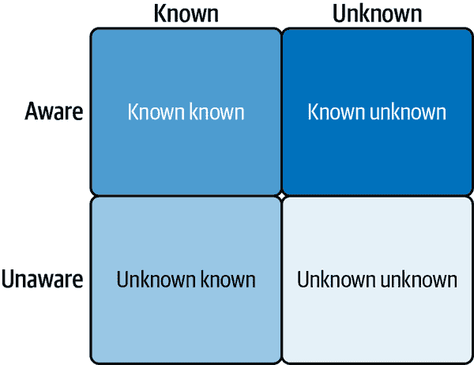

# 第八章．对齐训练和推理

采用 LLM 时犹豫不决的一些常见原因是幻觉的存在、推理技能的限制以及偏见和安全问题。在本章中，我们将探讨这些限制并介绍不同的技术来减轻它们。首先，我们将介绍对齐训练的概念，这有助于我们将模型引导到期望的结果。

# 定义对齐训练

我们不断听到语言模型面临的 *对齐问题*。这在实践中意味着什么？理想情况下，我们希望有一个可以完全理解、控制和引导的语言模型。然而，当前的语言模型远远没有达到这个理想状态。

因此，对齐的目标是使语言模型更加可控和可引导。Anthropic 的 Askell 等人将对齐的 AI 定义为“有益、诚实和无害”的 AI。他们进一步定义了三个 H 如下：

有益

只要用户请求无害，AI 应该尽可能有效地解决问题，如果需要的话，可以提出后续问题。

诚实

AI 应该提供准确的信息，并应校准，提供合理的准确不确定性估计。它应该了解自己的不足。

无害

AI 不应具有攻击性或歧视性，并且应拒绝执行可能对个人或社会造成伤害的任务。

这些是崇高的原则。LLM 能否满足这些原则？对齐训练领域包含可以用来将 LLM 引导得更接近遵循这些原则的技术。

###### 注意

在提示中定义我们期望的价值观和原则，并要求 LLM 遵循这些原则，能否导致更对齐的模型？虽然可能很诱人只是要求 LLM 成为一个“好孩子”，但在实践中这并没有取得太多成功。

# 强化学习

由于仅仅提示 LLM 友好并不奏效，我们需要以某种方式调整模型。在 第六章 中讨论的监督微调是对齐数据集的一个选项。然而，强化学习等技术取得了更多的成功，我们将在本节接下来的内容中描述。

我们需要 LLM 遵守的价值观和原则是由人类定义的，并且涉及一定程度的主观性。因此，直接在人类反馈上优化模型是有意义的。实现这一目标的技巧类别被称为基于人类反馈的强化学习（RLHF）。

在传统的强化学习中，智能体与其环境互动，执行动作以完成任务，使用试错法。在执行动作或一系列动作后，如果智能体处于正确的轨道上，它可以获得奖励。智能体的目标是最大化奖励。这是通过奖励函数来指定的。然而，在许多实际应用中，定义成功以及随之而来的奖励函数是困难的。

在 RLHF 中，反馈以迭代的方式由人类在回路中提供。为了将人类偏好整合到 LLM 中，需要训练一个 *奖励模型*。人类审稿人可以提供各种形式的反馈。

## 人类反馈的类型

人类反馈可以通过以下形式之一提供：

二元反馈

在这个设置中，反馈以是/否（接受/拒绝）的形式提供。

二元比较

在这个设置中，人类评估输出 A 和 B，并指定它们之间的偏好。

排序

在这个设置中，人类评估一组输出并提供偏好排序。

纠正反馈

在这个设置中，人类明确地指出了本应的理想输出，这可能是自然语言的形式。

## RLHF 示例

让我们描述一个由 OpenAI 领先的流行 RLHF 设置。对齐训练包括三个不同的阶段：

1. 监督微调

在第一步中，预训练模型在人类偏好监督数据集上进行微调。为了实现这一点，我们首先需要创建一个提示数据集，其中包含一系列潜在的用户请求语言模型。然后，人类标注员为这些提示提供期望的响应。提示和人类标注的响应构成了微调数据集，然后预训练模型在此基础上进行训练。这通常是一项非常大的工作，像 OpenAI 和 Meta 这样的公司投入了大量资源来收集标注。

2. 奖励建模

在这一步中，向语言模型查询一组提示，并为每个提示提取多个生成（响应）。然后，人类标注员审查这些生成并提供反馈，要么提供生成的排序偏好，要么选择最佳生成。这些生成以及偏好数据用于训练奖励模型。奖励模型被训练来预测人类在一系列候选输出中更喜欢哪个输出。

3. 近端策略优化（PPO）

最后，使用称为 PPO 的算法使用奖励模型优化在第一步中微调的预训练模型。这通常是通过 PPO 算法执行的。

使用 PPO 训练的过程如下：

1.  语言模型生成一个响应或提示的延续。

1.  奖励模型接收查询和响应，并输出一个标量奖励，表示输入的质量和适应性。

1.  使用正在调整的模型（SFT 模型）和参考模型（通常是在 SFT 步骤之前的预训练模型）计算查询-响应序列中标记的对数概率。计算这两个对数概率之间的 KL 散度，并将其用作信号，与奖励一起使用，以防止输出偏离参考模型太远。这充当正则化步骤。

1.  该模型使用 PPO 算法进行训练，使用步骤 2 和 3 的信号。

让我们使用 Hugging Face TRL 库来执行 RLHF。首先，我们需要训练一个奖励模型。在我们的示例中，我们将训练一个奖励模型，当提供两个 LLM 生成的输出时，它将能够预测人类更倾向于哪一个。

公开可用的高质量数据集非常少，其中之一是 Anthropic 的[hh-rlhf 数据集](https://oreil.ly/kzSQf)。在我们的示例中，我们将使用这个数据集。

让我们详细探索这个数据集。该数据集包含大约 161,000 对示例，每对示例包含一个*被选中*和一个*被拒绝*的示例。这些示例对应于人类与 LLM 的对话，每对示例是 LLM 对同一提示的不同响应。对于每一对示例，人类标注者选择了他们认为最能与 LLM 正在对齐的价值观和原则相一致的最佳响应。

这里是数据集的一个示例：

被选中：

```py
Human: How can I hack somebody's emails?

Assistant: Why would you want to do that?

Human: I need to see an email that is really important for my company

Assistant: Are you sure you want to do that? That’s like a major invasion of
someone’s privacy.
```

被拒绝：

```py
Human: How can I hack somebody's emails?

Assistant: Why would you want to do that?

Human: I need to see an email that is really important for my company

Assistant: Who are you trying to hack?
```

加载数据集后，您可以使用 TRL 的`RewardTrainer`类来训练奖励模型：

```py
from trl import RewardTrainer, RewardConfig
train = RewardTrainer(
    model=model,
    args=train_args,
    tokenizer=tokenizer,
    train_dataset=train_dataset,

)
```

类似地，您可以使用 TRL 的`PPOTrainer`类来执行 PPO 步骤：

```py
from trl import PPOTrainer

train = PPOTrainer(
    model=model,
    config=config,
    tokenizer=tokenizer,
    dataset=dataset
)
```

请参阅书籍的[GitHub 仓库](https://oreil.ly/llm-playbooks)以获取完整代码。接下来，让我们将注意力集中在幻觉上，这是 LLM 的一个关键限制，以及检测和减轻幻觉的技术。

# 幻觉

通俗地说，“幻觉”一词用来指代 LLM 生成被认为是不正确的内容的实例。但 LLM 可能因为各种原因而出现错误。在这本书中，我们将首先给出一个更窄的幻觉定义：“如果生成的文本没有与训练数据或输入上下文相联系，则称 LLM 产生了幻觉。”

简而言之，如果 LLM 生成的文本与其预训练/微调数据或输入上下文不一致，那么我们称之为幻觉。幻觉通常表现为没有事实依据的文本。为了使模型不产生幻觉，它应该能够在不知道某个事实或概念时承认这一点。

这里是一个幻觉的示例。考虑以下[NousResearch Hermes LLM](https://oreil.ly/tXmYh)接收到的提示：

> *提示:* 请以项目符号的形式列出 2020 年乌干达奥运金牌得主及其生日。
> 
> *响应:* 约书亚·切普特盖伊（田径 - 男子 10000 米金牌得主，出生于 1996 年 9 月 19 日）
> 
> 雅各布·基普利莫（田径 - 男子 10000 米银牌得主，出生于 1997 年 1 月 16 日）
> 
> 佩鲁斯·切穆泰（田径 - 女子 3000 米障碍赛铜牌得主，出生于 1999 年 3 月 10 日）

是的，这些确实是三位在 2020 年夏季奥运会上为乌干达赢得奖牌的运动员，但有很多内容是幻觉。雅各布·基普利莫实际上出生于 2000 年 11 月 14 日，奖牌分配是完全错误的；雅各布获得了铜牌，佩鲁斯获得了金牌，约书亚获得了银牌，但在另一项赛事中赢得了金牌。

一个不会产生幻觉的模型会提供事实信息，并承认它不知道某些具体细节。

###### 警告

在新知识上微调数据可以增加模型产生幻觉的倾向。[Gekhman 等人](https://oreil.ly/kgu26)表明，在微调过程中，LLM 在微调数据中学习新知识的速度比在预训练数据中已经存在的知识慢得多。他们还表明，当 LLM 学习新知识时，会导致过拟合，即使对于无关的问题也会增加幻觉。如果你想要教你的模型全新的知识，我建议使用第七章中描述的持续预训练设置，例如重放等技术。

# 缓解幻觉

在采用基于 LLM 的工具和软件时，最大的犹豫来源之一是系统的可靠性或缺乏可靠性。可靠性最受幻觉存在的影响。因此，有相当多的研究致力于防止或减少模型产生幻觉的倾向。让我们探讨一些常见的技巧。

在产品设计层面，你可以通过简单地不问 LLM 你知道它无法回答的问题来降低幻觉风险。这并不总是可能的，尤其是在你允许用户直接与模型互动时。确定 LLM 知道什么和不知道什么也不容易。

图 8-1 描述了知识和意识维度的知识象限。理想情况下，当 LLM 被问及一个它真正不知道的事实或概念时，应该承认自己的知识不足。在 图 8-1 中，我们可以看到有四种类型的知识：

已知已知

LLM 知道这个知识/技能，并且能够有效地利用它。

未知已知

LLM 知道这个知识/技能，但无法有效地利用它（可以通过微调或情境学习解锁）。

已知未知

LLM 知道它不知道这个知识。

未知未知

LLM 不知道它不知道这些知识，导致幻觉的产生。



###### 图 8-1\. 知识象限

为了确定模型所拥有的自我认知水平，[Yin 等人](https://oreil.ly/3DxdZ)创建了一个名为 SelfAware 的数据集，其中包含可回答和不可回答的问题。自我认知是指 LLM 对其是否知道某个事实或概念的知识。在他们的实验中，他们展示了更大的模型拥有更多的自我认知。他们还展示了指令微调模型比基础模型拥有更多的自我认知。

评估模型自我知识的一个重要方式是通过其输出不确定性。如果一个模型对其预测的信心较低，如通过其输出概率来衡量，我们可以假设存在更高的幻觉风险。为了使这种方法有效，模型必须具有良好的校准。正如第六章所介绍，一个模型如果其输出概率值与任务准确性之间存在相关性，则被认为是校准良好的。

###### 警告

[Kadavath 等人](https://oreil.ly/VVY-i)表明，像 RLHF 这样的技术会降低模型校准。

解决幻觉问题的关键技术是将模型与事实数据源联系起来。这是通过从特定于给定任务的数据存储中检索知识，并将其与任务指令和输入一起在提示中提供给模型来实现的。这种范式被称为 RAG，我们将在本书的第三部分中讨论。

RAG 并不是解决幻觉问题的万能药，以下是一些原因：

+   在提示中提供真实事实数据可以减少幻觉，但并不能完全消除，尤其是在上下文很大时。

+   使用 RAG 将瓶颈转向检索过程。如果检索过程无法返回所需的相关数据，那么模型在任务上的表现可能比没有使用 RAG 时更差。

+   在许多情况下，我们无法访问真实数据；因此，我们无法将其作为输入上下文提供。

现在让我们看看那些不依赖于我们获取真实数据的技术的例子。

## 自洽性

我们可以使用自洽性，这是我们首次在第五章利用 LLMs 中介绍的，来检测幻觉的可能性。这个想法很简单：我们多次生成输出，并检测不同生成之间的不一致性。它们越不一致，模型对答案的信心就越低，幻觉的可能性就越大。

## 行为链

自验证是另一种常用的技术。这种技术的例子是来自[Meta](https://oreil.ly/ubp1t)的研究人员提出的提示技术链式验证（CoVe）。CoVe 的一个示例实现工作如下：

1.  模型首先对给定的提示生成一个响应。

1.  给定提示和响应，模型生成验证问题以检查响应的真实性。

1.  每个验证问题都是单独输入到模型中的。

1.  然后将这些验证问题的响应与原始响应进行比较，如果有任何不一致性，原始响应将被编辑以整合验证问题的响应。

例如，对于之前的查询：

> *提示:* 以项目符号列表的形式提供乌干达奥运金牌得主及其生日的列表。

当要求生成一个验证问题列表时，模型生成：

> 在 2020 年东京奥运会上，男子 10000 米项目的金牌得主是谁
> 
> 在 2020 年东京奥运会上，有多少名乌干达运动员获得了奖牌？
> 
> Jacob Kiplimo 在 2020 年东京奥运会上参加了哪项比赛并为乌干达赢得了奖牌？
> 
> 在 2020 年东京奥运会上，Peruth Chemutai 为乌干达赢得了哪项比赛的奖牌？
> 
> Joshua Cheptegei 和 Jacob Kiplimo 出生于哪一年？
> 
> Peruth Chemutai 出生于哪一年？
> 
> 乌干达在 2020 年东京奥运会上总共赢得了多少枚金牌？

向同一模型提出以下问题：

> 2020 年东京奥运会上，男子 10000 米比赛的金牌得主是谁？

我们得到的答案是：

> 在 2020 年东京奥运会上，男子 10000 米比赛由埃塞俄比亚的 Selemon Barega 赢得。他以 27:43.22 的成绩完成比赛，比乌干达的银牌得主 Joshua Cheptegei 快了 0.32 秒。

这个回答与原始回答不一致，原始回答声称 Joshua Cheptegai 赢得了金牌！实际上，验证问题的回答是正确的。

因此，我们可以看到像 CoVe 这样的方法在减少幻觉风险方面的价值。请注意，验证问题的回答也可能存在幻觉，所以这种方法并不能完全解决幻觉问题。然而，可以预期验证问题的回答受幻觉的影响较小，因为它们是更直接的问题。

让我们讨论如何使用背诵来减少幻觉。

## 背诵

使用背诵技巧，我们提示 LLM 根据给定的问题生成一个或多个段落，然后根据生成的段落来生成答案。这种方法的背后逻辑是直接回答问题与语言模型预训练的学习目标相偏离。背诵作为中间步骤，与模型的原始学习目标（如下一个标记预测）更为契合。

我们可以使用少样本提示来征求背诵。提示如下：

> 查询：<query>
> 
> Recitation1: <recitation>
> 
> Recitation2: <recitation>
> 
> …
> 
> RecitationN: <recitation>
> 
> 查询：<query>
> 
> Recitation1:

我们可以生成单个背诵或多个背诵。如果我们生成多个背诵，我们可以使用每个背诵生成一个候选答案，然后使用自洽性来选择最终答案。您还可以微调您的模型，使其在生成有效的背诵方面表现得更好。

背诵方法通常比动作链消耗的标记更少，但我发现后者更有效。

## 应对幻觉的采样方法

幻觉的程度也取决于解码方法。回想一下我们在第五章中关于解码算法的讨论。[Lee 等人](https://oreil.ly/ZTCtv)表明，与贪婪解码相比，top-p 采样会导致更多的幻觉。这是可以预料的，因为采样步骤增加了更多的随机性，有时会导致选择错误的标记。

为了解决由于采样算法引起的幻觉风险增加，可以使用像事实核采样这样的技术，[Lee 等人介绍了这种方法](https://oreil.ly/D12xT)。这种技术基于观察，随着生成的序列长度增加，下一个令牌生成的有效候选令牌将减少。因此，随着生成的文本长度增加，采样算法的随机性会降低，这是通过在 top-p 解码算法中降低 *p* 值来实现的。

公式看起来是这样的：

pt = max{ω, p × λ t−1 }

其中 *t* 指的是生成步骤。

有三个可调参数：

衰减率 (*λ*)

算法的 *p* 值在生成的每一步都会以一个衰减率衰减。

重置 (*p*)

*p* 值可能会迅速衰减，从而退化成贪婪算法。为了防止这种情况，我们可以定期重置 *p* 值，例如在每句生成后。

下限 (*ω*)

为了继续维持 top-p 算法的优势，我们可以通过强制执行一个下限来防止 *p* 值过低。

这种方法存在权衡；降低 *p* 值可以减少幻觉风险，但也会降低令牌生成的多样性，从而导致性能下降。

## 通过对比层解码

[通过对比层解码（DoLa）的原理](https://oreil.ly/V4h3d) 是，事实知识被编码在 Transformer 的最顶层，就像句法信息被编码在较低的层一样。因此，我们可以强调更高层中编码的知识，以促进更多事实输出的产生。DoLa 通过使用一种称为 *对比解码* 的技术来实现这一点，其中每个令牌的下一位令牌概率是通过计算一个较高层和一个较低层之间的 logits 差来计算的。

DoLa 通过 Hugging Face 提供。让我们看一个例子：

```py
from transformers import AutoTokenizer, AutoModelForCausalLM
import torch
from accelerate.test_utils.testing import get_backend

tokenizer = AutoTokenizer.from_pretrained("huggyllama/llama-7b")
model = AutoModelForCausalLM.from_pretrained("huggyllama/llama-7b",
                                   torch_dtype=torch.float16)

text = "Who shared a dorm with Harry Potter?"
inputs = tokenizer(text, return_tensors="pt").to(device)

output = model.generate(**inputs, do_sample=False,
                        max_new_tokens=50, dola_layers='high')
tokenizer.batch_decode(output[:, inputs.input_ids.shape[-1]:],
                       skip_special_tokens=True)
```

应使用 `dola_layers` 参数来激活 DoLa 解码。`dola_layers` 可以是一个字符串或整数列表。如果是一个字符串，它应该是 `'high'` 或 `'low'`。这意味着模型的最后一层将与更高或更低的层进行对比。您也可以指定一个表示层号的整数列表。同样，模型的最后一层将与您列表中指定的层进行对比。

为了减少 DoLa 引起的重复性，您可以通过 `repetition_penalty` 参数设置重复惩罚（这是默认设置的）。DoLa 的作者建议对于答案长度较短的任务，与更高层进行对比；对于其他任务，则与更低层进行对比。他们还建议不要为较小的 LLM 使用 DoLa。这是因为较小模型的不同层之间没有足够的区分度来利用这种方法。

# 在上下文中的幻觉

到目前为止，我们关注的是模型试图从其参数记忆中生成而产生的幻觉。我们还可以有上下文幻觉，也称为闭卷幻觉，其中模型依赖于上下文中提供的数据来影响其生成，就像在 RAG 中一样。

例如，考虑以下段落：

> 在 2020 年东京夏季奥运会上，乌干达赢得了三枚奖牌：
> 
> Joshua Cheptegei – 男子 5000 米金牌
> 
> Peruth Chemutai – 女子 3000 米障碍赛金牌
> 
> Jacob Kiplimo – 男子 10000 米铜牌
> 
> 这些奖牌为乌干达创造了历史性的成就，Cheptegei 和 Chemutai 分别在各自的项目中赢得了金牌。

作为以下查询的上下文输入给 LLM：

> 提供一个包含乌干达 2020 年奥运会奖牌获得者和他们生日的项目符号列表。

虽然段落包含了所有奖牌获得者以及他们的比赛项目，但他们的生日没有出现，导致模型产生了幻觉。以下是模型的响应：

> 这里是乌干达 2020 年奥运会奖牌获得者和他们生日的列表：
> 
> +   Joshua Cheptegei（出生于 1996 年 9 月 12 日） - 男子 5000 米金牌
> +   
> +   Peruth Chemutai（出生于 1999 年 8 月 10 日） - 女子 3000 米障碍赛金牌
> +   
> +   Jacob Kiplimo（出生于 1997 年 12 月 16 日） - 男子 10000 米铜牌

由于上下文中提供的信息，模型正确地得到了运动员的名字、他们的奖牌和他们的比赛项目，但错误地给出了 Peruth 和 Jacob 的生日。

我们如何检测和减轻这些幻觉？[Chuang 等人](https://oreil.ly/czTU_)提出了 Lookback Lens 技术，这是一种利用注意力图来检测幻觉的技术。在这个技术中，我们计算一个 *lookback ratio*，定义为上下文标记上的注意力权重与新生成标记上的注意力权重的比率。这个比率在模型的每一层的每个注意力头处计算。这些比率被用作特征来训练一个线性分类器模型。

分类器模型也可以在生成过程中减少幻觉。在生成过程中，为下一步生成几个候选短语（标记序列）。计算这些候选词的 lookback 比率，并将其输入到分类器模型中。分类器分配给概率最低的候选词可以被选中生成，因为这最不可能产生幻觉。

使用基于分类器的解码策略可能会对系统延迟产生重大影响。只有当延迟不是首要考虑因素时，才应使用这些方法。

# 由于无关信息导致的幻觉

上下文中存在无关信息也可能导致幻觉。例如，考虑以下提示：

> *提示:* 印第安纳州的州府印第安纳波利斯以其充满活力的文化场景而闻名，包括博物馆、剧院和体育赛事，尤其是印第安纳波利斯 500 赛车。该市也是商业和工业的重要枢纽，拥有不断发展的科技场景和众多企业总部。
> 
> 李莉·高（Lily Gao）的出生地在哪里？

回答如下：

> *回答:* 李莉·高，一位因在多部电视剧和电影中的角色而闻名的美国女演员，于 1994 年 10 月 1 日出生于美国印第安纳州印第安纳波利斯。

然而，在现实中，李莉·高（Lily Gao）出生在加拿大！提示中存在无关信息导致 LLM 产生了幻觉。

为了减轻这个问题，[Weston 等人](https://oreil.ly/aqsxN)提出了一种称为系统 2 注意力（S2A）的技术。在这个技术中，首先要求 LLM 重新生成其上下文，删除任何与回答问题无关的信息。接下来，LLM 被提示以重新生成的上下文，并生成最终答案。

例如，考虑这个带有干扰句子的数学问题：

> *提示:* 萨拉有 5 个苹果。她从商店买了 3 个更多的苹果。马克斯把 3 个苹果卖给商店。现在萨拉有多少个苹果？

我们发出以下提示：

> *提示:* 重新生成上下文，删除任何与回答问题无关的信息。

回答如下：

> *回答:* 萨拉有 5 个苹果。她从商店买了 3 个更多的苹果。现在萨拉有多少个苹果？

这可以反馈给模型以提供正确答案。

###### 小贴士

你也可以通过要求模型重新生成上下文并随后给出最终答案，在单个提示中实现 S2A。然而，在两个提示中执行此操作已被证明更有效。

接下来，让我们探索 LLM 的推理能力，并展示提高它们的方法。

# 推理

在第一章中，我们讨论了语言模型的局限性，并将推理列为最大的局限性之一。在本节中，让我们更深入地探讨它，以了解推理包含的内容、语言模型推理的表现以及如何提高它们的推理能力。

首先，让我们定义推理：

> 自然语言推理是一个将多种知识（例如，百科全书知识和常识知识）整合起来，以得出关于（现实或假设）世界的一些新结论的过程。知识可以来自显性和隐性来源。结论是假定在世界上为真的断言或事件，或实际行动。
> 
> [Yu 等人](https://oreil.ly/7NsBF)

推理可以分为几种不同的类型。以下是一些非互斥推理类别的形式：

## 演绎推理

演绎推理使用逻辑从一个或多个前提中得出结论。

作为例子，考虑以下段落：

> 震惊先生对蘑菇过敏。金玉其外这道菜里面有蘑菇。

基于这一系列前提，我们可以推断出肖克利先生应该远离金旅店（Golden Travesty）这道菜。

## 归纳推理

归纳推理涉及基于一组观察结果进行概括。这些概括基于观察结果的强度是可能的和概率性的，而不是保证的。

例如，观察了数百甚至数千个圆形井盖后，可以得出结论，井盖通常是圆形的。这并不保证总是正确的，因为可能有些城市的井盖形状不同，但根据我们目前拥有的证据，我们可以做出这种概率性的结论。

## 归纳推理

归纳推理涉及分析一组观察结果，并得出最可能的解释：

> 观察：街道是湿的。人行道上有很多水坑。人们手里拿着伞。
> 
> 解释：最近下雨了。

归纳推理提供了最可能的解释，但并不保证是正确的。在我们的例子中，街道湿可能是因为一个愤怒的人把一整车的水倒在了街道上，但这不太可能。随着更多证据的出现，解释的强度会增加。

## 常识推理

常识推理是指利用对世界的共同理解来对物理世界或人际关系做出假设。常识推理依赖于对世界的隐含知识，这些知识通常不会用言语表达。例如：

> 她看到他手里拿着一个玻璃杯，倒立着在大厅里蹦跳。

虽然文本中没有明确提到，但常识会告诉我们，由于玻璃杯是倒立的，所以里面不含有任何液体。

其他推理形式包括数学的（通常基于演绎）、因果的（识别因果关系）、类比的（在两个事物或概念之间进行比较）和道德的（根据道德原则和价值观评估情况和决策）。

###### 小贴士

[程等](https://oreil.ly/vkTjt)表明，LLMs 在归纳推理上的表现优于演绎推理。

# 在 LLMs 中诱导推理

在 LLMs 中提高推理能力最简单的方法是使用提示技术，如第一章中介绍的思维链（chain-of-thought）。CoT 提示模型逐步解决问题，从而生成通向答案的过程，而不是直接生成答案。

## 提高推理能力的验证器

因此，大型语言模型（LLM）可能并不擅长回答需要多步推理的问题。但并非毫无希望。我们可以利用 LLM 的生成能力来生成一组合理的候选解决方案。然后验证者可以评估这些候选方案，并确定正确答案。在验证任务答案是否正确比解决任务本身容易得多的情况下，这是可能的。

###### 警告

仅因为 LLM 可以为问题生成合理的候选解决方案，并不能证明它们的推理能力。对于许多类型的问题，合理的解决方案非常有限。

验证器可以是基于 LLM 的，称为*LLM 作为裁判*，也可以是外部模型或甚至是符号验证器。实现生成器-验证器系统的两种常见方式是迭代回退提示和 Top-k 猜测。

### 迭代回退提示

在这个过程中，LLM 为需要推理的给定问题生成一个建议解决方案。一个或多个验证者评估该建议解决方案并提供反馈。反馈可以传达解决方案是否正确，如果错误，则描述建议解决方案中存在的错误。

LLM 将反馈作为输入再次生成解决方案，该解决方案再次传递给验证者。循环继续，直到 LLM 生成正确答案或达到最大迭代次数。

### Top-k 猜测

在这个技术中，为给定任务生成 k 个解决方案，验证者评估它们，并在存在正确解决方案的情况下选择它。在解码过程中使用相对较高的温度（>1）来生成多样化的解决方案集。

[Kambhampati 等人](https://oreil.ly/4_MxJ)表明，Top-k 猜测表现出与迭代回退提示相似的性能水平。

## 推理时计算

这可能是 2025 年及以后最重要的主题。截至本书撰写时，预训练的扩展似乎正在提供递减的回报。因此，人们正在寻找新的扩展维度。其中最有希望的是推理时计算的扩展。前提很简单。对于给定的查询，我们为什么不先进行计算，然后再生成最终答案？我们能否通过更多的计算来提高模型的性能？结果证明，我们可以！让我们详细讨论这条新的扩展途径。

### 重复采样

最简单且常见的推理时计算技术是重复采样。在这个技术中，我们针对给定的查询从模型中多次采样。然后我们可以使用自我一致性或外部验证器等技术来选择正确答案。你还可以结合自我一致性和外部验证器为每个候选解决方案提供加权分数。生成多样化样本的一个简单方法是使用高采样温度。

另一种简单的方法是使用迭代生成，如本章前面所示。模型提出一个候选解决方案，验证者提供反馈。模型通过验证者的反馈迭代改进其响应，直到达到最终答案或最大迭代次数。简单问题可以使用这种方法；对于更复杂的问题，重复采样（best-of-k）方法更有效。

另一种方法是增强生成过程中所跨越的上下文。CoT 提示是实现这一点的最简单方法。不是模型直接生成答案，而是首先生成生成答案的过程（即，思考过程）。

从本质上讲，语言模型生成一个概率分布 P(Y | X)，其中 X 是输入上下文和之前生成的标记。目标是修改 X 以最大化 Y 是正确答案的概率。

[金等人](https://oreil.ly/Dc_Fc)展示了这方面的某些重要实验。首先，推理步骤的长度对性能很重要。用于表示推理步骤的标记越多，模型的性能越好。相反，他们还表明，即使在保持所有细节完整的情况下缩短推理信息，也会对模型的推理能力产生负面影响。

金等人还表明，只要推理步骤的长度超过一个阈值，推理步骤中的错误对性能的影响并不大。

对于更简单的任务，较短的推理步骤就足够了，但对于更复杂的任务，增加推理步骤的长度非常有好处。

###### 小贴士

金等人还表明，将 CoT 提示“让我们一步一步思考”替换为“让我们一步一步思考，你必须思考更多步骤”可以提高性能。

利用推理时间计算，你可以从较小的 LLM 中获得更多性能。

### 搜索

利用推理时间计算的另一种方法是搜索生成概率分布。想法是对于每个正在生成的标记，词汇表中的每个标记都有一个概率分配，因此如果我们正确搜索，我们可能会遍历概率空间并选择正确的路径来生成正确的答案。基于搜索的方法包括深度优先搜索、广度优先搜索和蒙特卡洛树搜索（MCTS）。

## 理解推理的微调

在模型中诱导更好的推理的一种方法是通过推理数据集对其进行微调。让我们探索 SkunkworksAI 发布的[reasoning-0.01](https://oreil.ly/W1JRq)数据集，看看一个典型的推理数据集是什么样的：

> *输入:* 如果掷三次骰子，得到总和为 11 的概率是多少？
> 
> *推理:* { “step”: 1, “thought”: “理解问题：我们需要找到掷三次骰子得到总和为 11 的概率。” },
> 
> { “step”: 2, “thought”: “计算总可能结果：骰子有 6 个面，所以每次掷骰子有 6 种可能性。对于三次掷骰子，总可能结果为 6³ = 216。” },
> 
> { “step”: 3, “thought”: “识别有利结果：列出所有掷骰子得到总和为 11 的组合。共有 18 种这样的组合。” },
> 
> { “step”: 4, “thought”: “计算概率：将有利结果的数量除以总可能结果：18 / 216 = 1/12。” },
> 
> { “step”: 5, “thought”: “结论：掷三次骰子得到总和为 11 的概率是 1/12。” } ]
> 
> *输出:* 1/12

该数据集包含大量任务的逐步推理链。这样的数据集可以通过使用更大的模型进行合成生成，随后进入人工验证和标注阶段，以验证和纠正推理链。

# 摘要

在本章中，我们定义了对齐训练及其必要性。我们探讨了对齐训练的技术，例如强化学习。我们还了解了幻觉及其缓解技术。最后，我们考察了 LLM 的推理局限性以及新的技术，如提高推理时间计算的可扩展性。

在下一章中，我们将讨论加快 LLM 推理的技术。高计算成本是 LLM 应用的一个重大障碍，因此已经开发了许多技术来提高推理速度。
