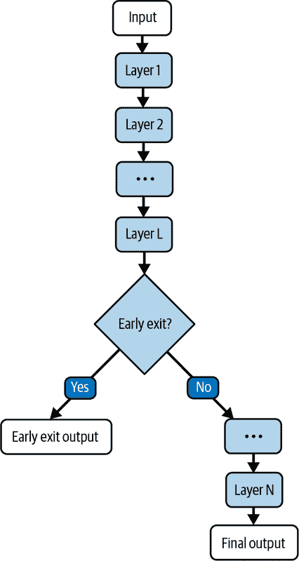
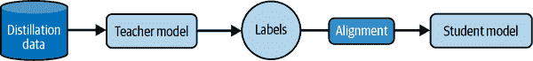
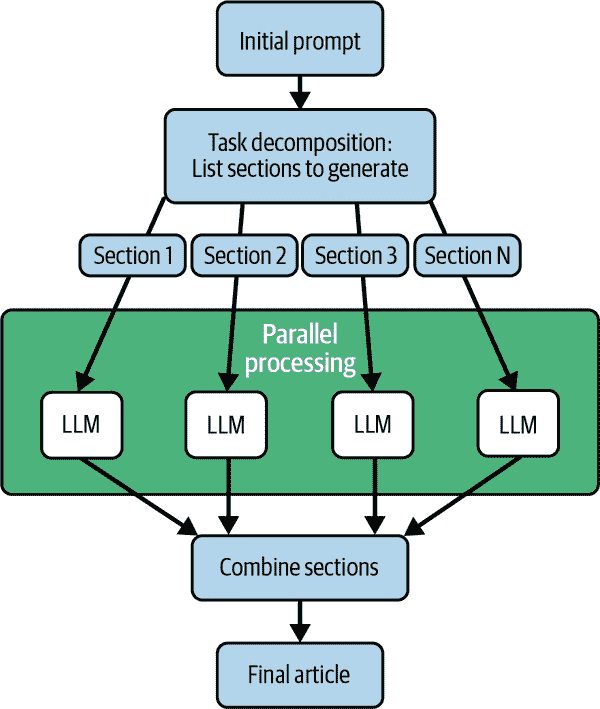
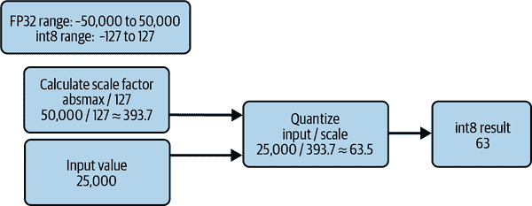

# 第九章\. 推理优化

在过去的几章中，我们学习了多种适应和利用 LLM 来解决特定任务的技术。在本章中，我们将学习如何高效地对它们进行推理，以用于实际应用。LLM 的大尺寸使得部署和推理特别具有挑战性，因为它们对计算、内存和能源需求施加了巨大的压力。这在移动手机等边缘设备上尤其具有挑战性。

在本章的其余部分，我们将专注于推理优化领域，讨论影响 LLM 推理时间的因素。然后，我们将展示包括缓存、知识蒸馏、早期退出、量化、并行和推测解码等多种优化技术。

# LLM 推理挑战

影响 LLM 推理的瓶颈有哪些？众所周知，它们庞大的体积需要大量的计算和内存资源。除此之外，还有两个额外因素加剧了这种情况：

+   如第四章中所示，当代 LLM 主要基于仅解码器模型，这些模型以自回归方式运行。这意味着每个标记都是依次生成的，从而施加了顺序限制。在本章的后面部分，我们将讨论旨在加快解码过程的并行和推测解码技术。

+   随着输入序列长度的增加，所需的计算量呈二次增长。在本章的后面部分，我们将讨论旨在缓解这一瓶颈的 K-V 缓存等技术。

让我们深入了解用于优化推理的技术。

# 推理优化技术

由于这是一个严重影响 LLM 在实际应用场景中部署的问题，因此在主要行业和学术实验室中，对推理优化研究给予了相当大的关注。近年来，已经开发出数十种优化技术，没有这些技术，LLM 的当前普及程度就不会达到。要了解用于优化推理的各种类型技术的近全面调查，请参阅[周等人调查论文](https://oreil.ly/MtzNn)。

我们现在将关注一些在 LLM 部署中使用的一些最有希望和最有效的推理优化技术。虽然你们中的大多数人可能不会亲自实施这些技术，而是依赖第三方工具，但了解优化技术和涉及的权衡可以提供有价值的见解，这有助于你们在各种解决方案中进行选择。

高效推理的技术旨在实现以下三个目标：

减少计算

像缓存、知识蒸馏和早期退出这样的技术，每个都采用不同的策略来减少计算。

加快解码

并行和推测解码的技术旨在提高模型的吞吐量：每秒生成的标记数。

减少存储需求

量化技术旨在通过减少存储模型权重和激活所需的存储空间，将存储数字的空间从 32 位减少到 16 位、8 位甚至 4 位。

# 减少计算的技术

我们可以通过以下方式减少推理过程中所需的计算：

+   通过使用缓存等方法以存储空间换取计算资源。

+   在推理过程中省略某些操作，使用如*早期退出*等方法。

+   通过使用知识蒸馏等技术，从较大的模型中导出较小的模型，同时尽可能保留较大的模型的特征和能力。

下一节将详细介绍这些方法。

## K-V 缓存

如第一章中所述，LLM 没有会话记忆；在 LLM 对话的每个回合中，之前的对话历史都会被添加到输入中。这意味着对 LLM 的每个请求都可能包含大量重复的内容在提示中。对于提示中的重复部分，在推理步骤中会反复执行相同的计算。此外，在自回归解码中，每个标记都是作为整个输入和之前生成的标记的函数生成的。因此，存在大量的重复计算。

缓解这种重复计算的一种方法是在需要时缓存数据并重复使用它们。更具体地说，我们缓存 Transformer 架构中自注意力块的键（K）和值（V），称为 K-V 缓存。回想一下我们在第四章中关于 Transformer 自注意力块中的键和值的讨论。

让我们看看一些例子。考虑分析电影评论情感的任务。你可能有一个长长的提示，提供了关于分析情感所涉及的细微之处的详细说明。这些说明被包含在提供给 LLM 的每个输入评论的提示中。

而不是通过重复处理指令标记来产生不必要的开销，缓存被用来检索这些标记的 K-V 值。

类似地，考虑一个问答助手提供客户支持的例子，该助手通过回答产品手册中的问题来提供支持。在这种情况下，代表产品手册标记的 K-V 值可以被缓存，然后用于任何需要产品手册作为提示部分的请求。

###### 小贴士

缓存还可以使在提示中添加大量少样本示例成为可能。这有时可以成为微调的轻量级替代方案。

主要的 LLM 提供商，如 Google 的 Gemini 和 Anthropic 的 Claude，通过它们的 API 为它们的模型提供缓存支持，称之为上下文缓存。这也大大降低了最终用户的成本，因为缓存的标记只计费一次。

###### 警告

注意，在缓存策略中，我们是以额外的存储空间换取计算资源。K-V 缓存可能会变得非常大，尤其是在较长的序列长度下。

为了控制成本，LLM 提供商通常将缓存的年龄限制在很短的期限内，或者通过缓存持续时间向用户收费。

例如，让我们看看一个请求 Anthropic 的 Claude 模型套件，该套件利用上下文缓存：

```py
{
    "model": "claude-3-5-sonnet",
    "max_tokens": 1024,
    "system": [
      {
        "type": "text",
        "text": "<System Prompt>"
      },
      {
        "type": "text",
        "text": "<Product Manual>",
        "cache_control": {"type": "ephemeral"}
      }
    ],
    "messages": [
      {
        "role": "user",
        "content": "Which battery should I use for the G-8 Ultra?"
      }
    ]
  }'
```

`cache_control`参数用于指定系统提示和产品手册将被缓存。截至本书编写时，Claude 的缓存默认为五分钟。

###### 小贴士

组织你的提示，将可缓存的组件放在提示的开头，即提示前缀。

最终，缓存可以在减少推理时间方面非常有价值，尤其是在指令在大量调用中重复或在上下文窗口包含需要跨多个调用持久化的数据（如 API 文档或 RAG 输出）的情况下。

接下来，我们将探讨用于减少推理时间计算量的早期退出方法。

## 早期退出

如第四章所示，Transformer 架构由重复的块组成，称为层。每一层的输出是一个中间表示，作为输入传递给其上层的层。在推理过程中减少计算的一个简单方法是在中间层退出推理并将其解释为最终输出。这种技术称为早期退出。图 9-1 展示了早期退出的实际应用。



###### 图 9-1\. 实际中的早期退出

早期退出可以在序列级别和标记级别发生。

### 序列级别早期退出

在这种情况下，Transformer 中的前向传递在整个输入序列上停止在特定的层，并将该层的中间表示作为最终输出。退出的层可以预先确定，也可以根据输入序列动态决定。

为了动态决定退出的层，你可以在每个层上训练适配器，如第七章中所示。这些模块可以用来预测是否可以在当前层退出。例如，[FastBERT](https://oreil.ly/GCfpt)在每个层上实现了学习解决二元分类问题（退出或不退出）的模块。

并非所有方法都依赖于添加可训练模块。例如，Sun 等人提出的基于哈希的早期退出方法（HashEE）[`oreil.ly/_JqqH`](https://oreil.ly/_JqqH)使用一组带有其退出层的注释序列作为确定新输入序列退出层的基础。该方法基于假设相似序列应该在相同的层退出。

第二种早期退出选项是标记级别的早期退出。

### 标记级别早期退出

在这种方法中，同一序列的不同标记可以在不同的层退出。这比序列级别的早期退出更复杂。

与序列级早期退出技术类似，你可以实现二元分类器来决定是否在特定层退出，但这是在每个层的每个标记处发生的，而不是整个序列。有关标记级早期退出的更多详细信息，请参阅[Schuster 等人](https://oreil.ly/hfdCd)介绍的技术自信自适应语言建模（CALM），该技术实现了标记级早期退出。

记住，在 Transformer 的自注意力子块中，一个标记的表示是通过使用同一层中序列中所有其他标记的表示来计算的。但如果我们使用标记级早期退出，序列中的一些标记可能在那一层之前就已经退出了。解决这个问题的最简单方法是将退出标记的表示复制到它上面的每一层。

虽然标记级早期退出可能比序列级早期退出更精细和有效，但它比序列级早期退出慢。

###### 注意

在早期退出中，计算量的减少是以性能为代价的。然而，这可以通过学习在最佳层退出来最小化。

动态早期退出属于一类称为 *动态推理* 的技术，其中推理计算是动态确定的，基于输入的特性。一个重要例子是混合专家（MoE）模型类，在第四章中介绍。在 MoE 模型中，一个路由函数会选择一小部分专家模块来运行推理，从而减少所需的计算量。

接下来，让我们探讨如何通过创建一个较小的衍生模型来减少推理时间，同时限制性能下降，使用一种称为知识蒸馏的技术。

## 知识蒸馏

在第五章中，我们简要介绍了模型的蒸馏版本，如[DistilBERT](https://oreil.ly/rgiHZ)。这些是较小的模型，它们近似于从它们蒸馏出来的较大模型的能力，从而实现更快的推理。

近年来，已经开发出几种用于知识蒸馏的技术。关于该领域研究进展的综述，请参阅[Xu 等人](https://oreil.ly/JZQf3)的调查论文。

知识蒸馏的过程可以分为两个步骤：蒸馏数据准备和训练。基本模型被称为教师模型，而蒸馏模型被称为学生模型。

图 9-2 展示了模型蒸馏的过程。



###### 图 9-2\. 知识蒸馏

下面是如何进行蒸馏数据准备和训练步骤的说明。

### 知识蒸馏数据准备

蒸馏数据通常是通过适当查询教师模型并使用教师的输出作为要蒸馏的*知识*来准备的。从教师那里引出相关输出的方法包括：

无监督生成

在这项技术中，教师会收到解决任务的指令和/或示例。教师的回答构成了蒸馏数据集。这种技术通常用于向较小的模型教授像 CoT 或指令遵循这样的能力。为了实现这一点，教师模型被要求对查询做出回应，并展示出达到答案之前的思维过程。

数据增强

在这项技术中，教师被展示一组种子输入-输出示例。基于种子示例，教师生成类似的输入-输出示例，构成蒸馏数据集。请注意，在这种设置中，输入和输出都是由教师模型生成的。这项技术的局限性在于教师无法生成足够多样化的示例。

中间表示

这类技术被称为白盒蒸馏。在这里，蒸馏数据集由模型的中间表示组成，这可能包括激活或输出 logits。这些数据可以用来使学生模型与教师模型对齐。对齐是通过如 KL 散度等方法学习的，这些方法在第四章（ch04.html#chapter_transformer-architecture）中讨论过。

教师反馈

在这类技术中，学生模型的输出由教师模型评估以生成反馈。教师模型可以用来生成偏好数据，即学生输出质量排名。反馈也可以以如何改进给定任务的详细说明的形式给出。使用教师反馈的一种流行技术是 RLAIF，我们在第五章中介绍了它。

自我教学

在这类技术中，教师和学生模型是同一个。学生模型逐步改进其输出，并使用它们作为蒸馏集。自我教学的一种方式是为每个任务生成多个输出，包括推理步骤，并选择最好的一个作为蒸馏集的一部分。

你需要多少个蒸馏示例？也许令人惊讶的是，并不多。[周等人](https://oreil.ly/MuOOj)表明，即使是一千个非常高质量的示例也足以创建一个强大的蒸馏集。

###### 警告

就像微调和持续预训练一样，知识蒸馏容易受到灾难性遗忘问题（在第七章中介绍）的影响。

现在我们已经看到了创建蒸馏数据集的各种方法，让我们转向实际的蒸馏过程。

### 蒸馏

这里列举了一些用于执行蒸馏任务的技术。对于技术的更详细调查，请参阅[Xu 等人](https://oreil.ly/9mbiN)：

监督微调

这是实现知识蒸馏的最简单方法。学生模型使用蒸馏集进行微调，目的是使其预测与教师模型的对齐。这种方法通常用于黑盒知识蒸馏设置，其中蒸馏集不包含任何内部表示。

输出概率的 K-L 散度

在这种方法中，我们的目标函数是最小化教师模型和学生模型的输出概率分布之间的 K-L 散度。

内部表示相似性

相反，你不仅可以最小化差异，还可以最大化教师模型和学生模型各部分的相似性。这可以用来执行分层蒸馏，其中教师模型和学生模型的内部表示在每个层上都对齐。有关分层蒸馏的有效技术，请参阅[Liang 等人](https://oreil.ly/g-C4L)。

强化学习

这涉及使用蒸馏数据训练奖励模型。然后，学生模型被训练以根据奖励模型最大化奖励。回想一下我们在第八章中关于强化学习的讨论。

最终，你选择用于蒸馏模型的技术取决于你是否可以访问教师权重。如果你无法访问教师权重，那么你只能执行监督微调。白盒蒸馏，其中你试图对齐中间表示而不是仅仅输出标记，可能很难实现。请注意，所有知识蒸馏技术都存在能力退化或灾难性遗忘的风险，因此你必须非常仔细地评估学生模型，以量化与教师模型的能力差异。

在本节中，我们讨论了三种在推理过程中减少计算的技术：缓存、提前退出和知识蒸馏。接下来，让我们讨论可以加速解码过程的技术。

# 加速解码的技术

如我们所知，自回归模型一次输出一个标记，下一个生成的标记是输入标记和所有先前生成的标记的函数。这强加了顺序限制，你必须等待当前标记生成后才能生成下一个标记。我们能绕过这个限制吗？最近已经开发出几种技术，如*演示解码*和*并行解码*。让我们详细考察它们。

## 演示解码

演示解码背后的概念很简单。使用一个较小的模型，称为草稿模型，来生成几个后续的候选输出标记。然后，使用主要的大模型一次性计算候选输出标记的条件概率，并据此决定接受哪些标记以及拒绝哪些标记。接受的草稿标记越多，草稿模型越好。

图 9-3 展示了推测解码过程。


###### 图 9-3\. 实际中的推测解码

在推测解码中有两个重要指标：

令牌接受率

这是草稿模型生成的令牌被接受的百分比。通常，这个比例不会达到 1，因为如果达到了，就没有必要使用更大的主要模型。

解码加速

这指的是纯自回归解码模型与使用推测解码的模型之间的延迟减少。

## 并行解码

我们能否同时生成多个令牌？这可以通过使用相同的模型（多令牌解码）或相同模型的多个实例来实现。

对于后者，我们可以通过提示来控制并行生成。例如，假设你正在撰写一篇关于旅游景点的文章，包含如食物、住宿、安全提示等部分。你可以提示 LLM 列出这些部分，并使用特殊令牌标记。然后，这些部分可以并行生成，前提是这些部分之间完全独立。

图 9-4 展示了生成输出部分并行方式的系统工作流程。

现在让我们探索同一个模型如何一次生成多个令牌，这被称为多令牌解码。最近已经提出了几种多令牌解码技术，其中最有前景的是由 Cai 等人提出的 Medusa。[Cai et al.](https://oreil.ly/qT94i)

在 Medusa 中，模型中增加了额外的解码头。这些解码头代表随后要生成的令牌。例如，标准解码头预测序列中的下一个（n + 1）个令牌，而额外的解码头分别预测 n + 2、n + 3 等令牌。有关如何实现的更多详细信息，请参阅 Medusa 论文。

到目前为止，我们已经学习了加速解码过程和减少计算的技术。接下来，让我们深入了解量化，这是一类减少模型所需存储的技术。



###### 图 9-4\. 并行解码工作流程

# 减少存储需求的技术

在第五章和第六章中，我们简要介绍了量化，但承诺稍后会详细介绍。让我们深入探讨！

语言模型的正向传播涉及表示输入、权重和激活的数字。这些数字在内存中是如何表示的？

可用的数值表示格式有多种，例如整数、浮点数等。通常，语言模型中的数字以浮点 32（FP32）表示，也称为单精度浮点数，它指的是由 32 位或 4 字节组成的浮点数。

用 FP32 表示的数字由三部分组成：

+   符号位

+   指数（8 位）

+   尾数/有效数字（23 位）

关于 FP32 如何工作的更多细节，请参阅[“揭秘浮点精度”](https://oreil.ly/uCYYl)。

FP32 可以表示的最大和最小值分别为 3.4028237 × 10³⁸和 1.175494 × 10³⁸。这被称为该格式可以表示的值域。同样，用 float16（FP16）表示的数字，也称为半精度浮点数，由这三个部分组成：

+   一个符号位

+   指数（5 位）

+   尾数/有效数字（10 位）

当你将使用 FP32 表示的数字表示为 FP16 时会发生什么？这相当于有损转换。在这种情况下，范围和精度都会受到影响，因为在 FP16 中，你可以表示的最大数字是 65,504，而 FP32 为 3.4 × 10³⁸。精度也会受到影响，因为 32 位版本提供约 7 位精度，而 16 位版本只提供约 3 位精度。

为了防止 FP16 带来的精度大量损失，Google Brain 发明了 bfloat16（BF16），也称为脑浮点。在 BF16 中，指数有 8 位，尾数有 7 位。这保持了表示的数字范围与 float32 相同，但牺牲了精度。

###### 注意

较旧的 GPU，如 NVIDIA T4，不支持 BF16。

将数字的表示从高精度格式转换为低精度格式的过程称为量化。我们还可以将 32 位值量化为 8 位整数格式。这通过 4 倍减少了内存需求，但以牺牲更多精度为代价。在 8 位量化中，我们可以表示介于-127 和 127 之间的数字，没有小数点。

整数量化可以是对称的也可以是非对称的。

## 对称量化

在此设置中，原始格式中的*0*值映射到整数表示中的*0*值。这意味着当你将 fp32 中表示的 0 量化为 int8 时，值保持为 0。

剩余的值可以使用各种技术进行映射，最常见的是 absmax 量化。在此方法中，如果我们知道或可以估计需要表示的数字的范围，我们可以取该范围的绝对最大值并将其映射到 int8 中的最大数（127），而绝对最大值的负数则映射到 int8 中的最小数（-127）。其余的数字根据比例进行映射。

图 9-5 展示了 absmax 量化在起作用，将 FP32 表示的数字量化为 int8。



###### 图 9-5. Absmax 量化

## 非对称量化

在此设置中，原始格式中的*0*值不一定映射到整数表示中的*0*值。

一种常见的技术是取我们需要表示的最小值和最大值，并将其映射到 int8 可以表示的最小值（-127）和最大值（127）。例如，如果我们想要表示的数字范围是 -23 到 87，那么 -23 就映射到 -127，87 就映射到 127。

###### 小贴士

如果你想要表示的数字范围包括异常值，它们可能会成为破坏者。你可以通过截断来处理异常值，这样所有异常值都将表示为相同的最大/最小值。

在实践中如何使用量化？通常，量化是在训练之后应用的。模型的权重和激活都可以进行量化。

量化权重比量化激活要容易得多。因为我们事先知道权重，所以我们可以计算量化算法所需的范围、异常值、缩放因子等。

对于激活，根据我们能够容忍的延迟量，我们可以进行动态或静态缩放。在动态缩放中，范围、异常值等统计信息在每个层推理期间动态计算。在静态缩放中，我们使用参考校准数据集来估计统计信息。虽然这种方法可以加快推理速度，但它可能导致更多的量化错误。

关于实现量化的更多细节，请参阅 Maarten Grootendorst 撰写的[“量化视觉指南”](https://oreil.ly/bpi3b)。

# 摘要

在本章中，我们讨论了 LLM 推理中瓶颈的原因。我们讨论了多种技术来提高 LLM 推理的效率，包括减少计算需求、减少存储需求以及加速解码过程的技术。我们探讨了缓存、早期退出、知识蒸馏、推测和并行解码技术以及量化等技术。在本书的下一部分和最后一部分，我们将探讨 LLM 应用范式，并讨论构建完整应用程序涉及的细微差别。
