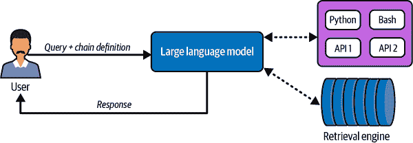
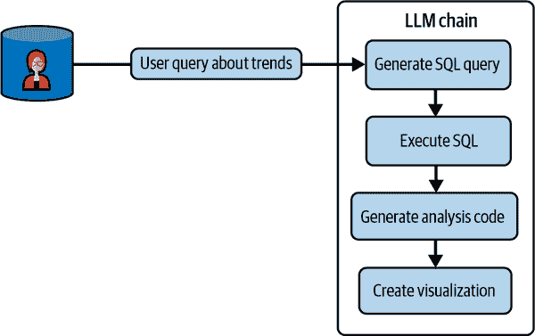
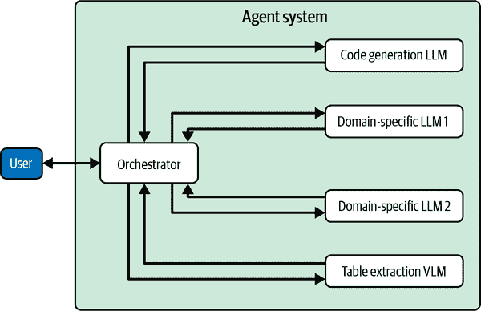

# 第十章\. 与外部工具接口 LLMs

在本书的前两部分中，我们看到了独立的 LLMs 在解决各种任务中的影响。为了有效地利用它们在组织中的全部能力，它们必须集成到现有的数据和软件生态系统中。与传统的软件系统不同，LLMs 可以生成自主动作来与其他生态系统组件交互，带来软件世界中前所未有的灵活性。这种灵活性解锁了一大批之前被认为不可能用例。

我们需要 LLMs 与软件和外部数据交互的另一个原因：正如我们所深知的那样，当前的 LLMs 存在重大限制，其中一些我们在第一章中讨论过。为了回顾一些关键点：

+   由于重新训练 LLMs 或持续更新它们成本高昂，它们有一个知识截止日期，因此对最近的事件没有了解。

+   即使它们随着时间的推移而变得更好，LLMs 也不总是能正确处理数学问题。

+   他们无法提供事实性保证或准确引用其输出的来源。

+   将自己的数据有效地输入给他们是一个挑战；微调并非易事，并且情境学习受限于有效情境窗口的长度。

正如我们在整本书中注意到的那样，巩固效应正引导我们走向一个未来（除非我们遇到技术障碍），在这个未来中，许多上述限制可能可以在模型本身内得到解决。但我们不必 necessarily 等待这一时刻的到来，因为许多这些限制可以通过将任务和子任务卸载到外部工具来解决。

在本章中，我们将定义三种经典的 LLM 交互范式，并提供如何为您的应用程序选择它们的指导。从广义上讲，LLMs 需要与之交互的外部实体有两种类型：数据存储和软件/模型，统称为工具。我们将演示如何将 LLMs 与各种工具（如 API 和代码解释器）接口。我们将展示如何充分利用 LangChain 和 LlamaIndex 等库，这些库极大地简化了 LLM 的集成。我们将探索需要构建的各种脚手架软件，以促进与环境的无缝交互。我们还将通过演示它们可以作为可以做出自主决定的代理来部署，来推动今天 LLMs 的能力极限。 

# LLM 交互范式

假设你有一个想要 LLM 解决的问题。有几种可能的选择：

+   LLM 使用其参数中编码的自身记忆和能力来解决任务。

+   你向 LLM 提供解决任务所需的所有上下文，LLM 使用提供的上下文和其能力来解决它。

+   LLM 没有解决此任务所需的信息或技能，因此您更新模型参数（微调等，如第六章至第八章中详细说明）以使其能够激活解决任务所需的技能和知识。

+   您事先不知道解决任务所需的环境，因此您使用机制自动检索相关环境并将其插入到提示中（被动方法）。

+   您向 LLM 提供明确的指示，说明如何与外部工具和数据存储交互以解决您的任务，LLM 会遵循这些指示（明确方法）。

+   如果需要，LLM 会将任务分解成多个子任务，与其环境交互以收集解决任务所需的信息/知识，并在它没有解决该子任务所需的能力时将子任务委托给外部模型和工具（自主方法）。

如您所见，最后三个涉及 LLM 与其环境交互（被动、明确和自主）。让我们详细探讨这三种交互范例。

## 被动方法

图 10-1 显示了涉及 LLM 被动与数据存储交互的应用程序的典型工作流程。


###### 图 10-1\. 一个 LLM 被动地与数据存储交互

许多用例涉及利用 LLM（大型语言模型）来使用您自己的数据。例如，在您公司的内部知识库上构建一个问答助手，该知识库分布在多个 Notion 文档中，或者是一个能够响应客户关于航班状态或预订政策的查询的航空公司聊天机器人。

为了让 LLM 能够访问外部信息，我们需要两种类型的组件：“数据存储”包含所需信息，以及能够根据查询从数据存储中检索相关数据的检索引擎。检索引擎可以由 LLM 本身提供动力，或者它可能只是一个简单的关键词匹配算法。数据存储可以是数据库、知识图谱、向量数据库，甚至只是一些文本文件的集合。数据存储中的数据以某种形式表示和索引，以提高检索效率。数据表示、索引和检索是足够重要的主题，值得单独成章：我们将推迟对这些问题的详细讨论，直到第十一章。

当用户提出查询时，检索引擎使用查询来找到与回答此查询最相关的文档或文本片段。在确保这些内容适合 LLM 的上下文窗口后，它们将与查询一起被输入到 LLM 中。预计 LLM 将根据提示中提供的相关上下文回答查询。这种方法通常被称为 RAG，尽管如我们在第十二章中将要看到的，RAG 指的是一个更广泛的概念。RAG 是一个重要的范例，值得拥有自己的章节，因此我们将推迟对这一范例的详细讨论到第十二章。

注意，这种范例的显著特征是 LLM 在交互中的被动性质。LLM 只是响应提示并提供答案。它不知道提示内容中内容的来源。这种范例常用于构建需要外部信息来理解对话上下文的 QA 助手或聊天机器人。

###### 注意

从现在开始，我们将把对 LLM 的用户请求称为*查询*，从外部数据存储中检索到的文本单元称为*文档*。文档可以是完整的文档、段落、段落或句子。

## 显式方法

图 10-2 展示了将 LLM 与外部工具接口的显式方法。



###### 图 10-2。显式交互方法在实际操作中的表现

与被动方法不同，LLM 不再是一个被动的参与者。我们向 LLM 提供如何以及何时调用外部数据存储和工具的明确指示。LLM 根据预编程的条件集与其环境进行交互。当交互序列固定、范围有限且最好涉及非常少的步骤时，建议采用这种方法。

对于 AI 数据分析师助手，一个示例交互序列可以是：

1.  用户用自然语言表达查询，要求可视化某些数据趋势

1.  LLM 生成 SQL 以检索解决用户查询所需的数据

1.  在收到数据后，LLM 使用它生成可以由代码解释器运行的代码，以生成统计数据或可视化

图 10-3 展示了一个为 AI 数据分析师实现的固定交互序列。



###### 图 10-3。AI 数据分析师的一个示例工作流程

在这个范例中，交互序列是预先确定和基于规则的。LLM 在决定下一步采取什么行动时没有任何自主权。我建议这种方法用于构建对可靠性要求更严格的应用程序。

## 自主方法

图 10-4 展示了如何将 LLM 转变为一个可以自行解决复杂任务的自主代理。


###### 图 10-4。一个典型的由 LLM 驱动的自主代理工作流程

自主的方法，或者像我喜欢称之为的圣杯方法，将 LLM 变成一个自主智能体，通过与环境交互自行解决任务。以下是一个自主智能体的典型工作流程：

1.  用户以自然语言形式提出他们的需求，可选地提供他们希望 LLM 提供答案的格式。

1.  LLM 将用户查询分解为可管理的子任务。

1.  LLM 同步或异步地解决问题的每个子任务。在可能的情况下，LLM 使用自己的记忆和知识来解决特定的子任务。对于 LLM 无法自行回答的子任务，它从可用工具列表中选择一个工具来调用。在可能的情况下，LLM 使用已执行子任务的解决方案的输出作为其他子任务的输入。

1.  LLM 使用子任务的解决方案综合生成最终答案，并以请求的输出格式生成输出。

这种范式足够通用，可以涵盖几乎所有用例。它也是一个有风险的范式，因为我们正在赋予 LLM 过多的责任和权力。在这个阶段，我不建议将此范式用于任何关键任务应用。

###### 注意

为什么我呼吁在部署智能体时要谨慎？人类往往低估了应用对准确性的要求。对于许多用例来说，99%的时间正确仍然不够好，尤其是在失败不可预测且 1%的失败可能具有潜在灾难性时。99%的问题也是长期以来困扰自动驾驶汽车并阻碍其更广泛采用的问题。这并不意味着我们不能部署自主 LLM 智能体；我们只需要巧妙的产品设计，以保护用户免受其失败的影响。我们还需要强大的人机交互范式。

我们已经多次使用了“智能体”这个词，但没有对其进行定义。让我们纠正这一点，并考虑智能体的含义以及我们如何构建它们。

# 定义智能体

随着基于大型语言模型（LLM）的智能体（agents）的炒作开始升温，智能体的日常定义已经从其传统定义开始扩展。这是因为真正具有智能的系统很难构建，因此存在一种趋势，即调整目标并声称尽最大努力构建的系统已经是智能体，尽管从技术上讲它们可能不符合要求。在这本书中，我们将坚持对智能体更为保守的定义，将其定义为：

> 能够与环境交互并采取自主行动以完成任务的大型语言模型驱动的软件系统。

智能体的关键特征包括：

它们的自主性

执行任务所需的步骤不需要指定给智能体。智能体可以决定执行任何序列的行动，无需人类提示。

它们与环境交互的能力

代理可以连接到外部数据源和软件工具，这使得代理能够检索数据、调用工具、执行代码，并在适当的时候提供指令以解决问题。

###### 注意

许多“代理”的定义并不要求它们是自主的。根据它们的定义，遵循显式范式的应用程序也可以被称为代理（尽管是非自主或半自主代理）。

我们定义的代理范式非常强大且通用。让我们花点时间来欣赏它。如果一个代理接到了一个它不知道如何解决的问题（并且它*知道*它不知道），那么它不会只是放弃，它可以通过在网络上或知识库中搜索线索，甚至通过收集数据并微调一个可以帮助解决问题的模型来学习自己解决问题。

考虑到这些令人羡慕的能力，机器会接管世界吗？在实践中，当前的自主代理在它们能实际实现的事情上有限。它们往往会陷入循环，采取错误的行为，并且无法可靠地自我纠正。构建部分自主代理更为实际，其中 LLM 在其工作流程中得到指导，无论是通过代理编排软件还是通过人工介入。在本章的剩余部分，我们将重点关注构建能够可靠解决更窄任务类别的实用代理。

# 代理工作流程

使用我们对代理的定义，让我们探讨代理在实际中的工作方式。作为一个例子，让我们考虑一个被要求回答这个问题的代理：

> 在过去 10 年中，当苹果的股价处于最低点时，谁是苹果的 CFO？

假设代理拥有解决此任务所需的所有信息。它有权访问网络、包含股价信息的 SQL 数据库以及包含 CFO 任期信息的知识库。它连接到一个代码解释器，以便它可以生成和运行代码，并且它有权访问金融 API。系统提示包含有关 LLM 可以访问的所有工具和数据存储的详细信息。

为了回答给定的查询，LLM 必须执行以下步骤：

1.  为了计算日期范围，它需要当前日期。如果这个信息没有包含在系统提示中，它要么在网络上搜索以找到当前日期，要么生成代码以返回系统时间，然后由代码解释器执行。

1.  使用当前日期，它通过执行一个简单的算术运算或为其生成代码来自己找到日期范围的另一端。步骤 1 和 2 可以合并成一个程序。

1.  它在可用的数据存储列表中找到一个包含股价信息的数据库表。它检索该表的架构，将其插入到提示中，并生成一个 SQL 查询，以找到过去 10 年中股价最低的日期。

1.  拿到日期后，它需要找到那天苹果公司的 CFO。它可以调用搜索引擎 API 来检查那天是否有关于 CFO 的明确提及。

1.  如果搜索引擎查询未能提供结果，它会在其工具列表中找到一个金融 API，并检索并插入 API 文档到其上下文中。然后它生成并调用 API 调用的代码以检索苹果公司 CFO 及其任期的列表。

1.  它利用其算术推理技能找到与最低股价日期相匹配的 CFO 任期。

1.  它生成最终答案。如果有请求的输出格式，它会尽量遵守。

根据实现方式，步骤的顺序可能会有所不同。例如，你可以微调一个模型，使其能够直接生成 API 调用或 SQL 查询的代码，而无需从数据存储或 API 检索模式。

要执行给定的任务序列，模型首先应该理解给定的任务需要分解成一系列子任务。这被称为任务分解。任务分解和规划可以由 LLM 执行，也可以外包给外部工具。

# 代理系统的组件

虽然任何给定代理系统的具体架构在很大程度上取决于它打算支持的使用案例，但每个组件都可以归类为以下类型之一：

+   模型

+   工具

+   数据存储

+   代理循环提示

+   防护栏和验证器

+   编排软件

图 10-5 展示了典型的代理系统及其组件的交互方式。


###### 图 10-5. 一套生产级代理系统

让我们逐一探索这些类型。

## 模型

语言模型是代理系统的骨架，负责其自主性和问题解决能力。一个代理系统可能由多个语言模型组成，每个模型都扮演着不同的角色。

例如，你可以构建一个由两个模型组成的代理；一个模型解决用户任务，另一个模型将其输出转换为用户要求的结构化形式。

###### 小贴士

代理工作流程可能会消耗大量的语言模型令牌，这可能会变得成本高昂。为了控制成本，考虑使用不同大小的多个语言模型，其中较小的（且更便宜的）模型执行更简单的任务。有关如何在这些模型之间完成劳动分工的更多详细信息，请参阅第十三章。

更普遍地，你可以构建专门针对代理工作流程各个部分的代理。例如，代码-LLM 可以用来生成代码，而针对特定任务的微调模型可以用于单个工作流程步骤。这种设置可以解释为*多代理架构*。

图 10-6 展示了由多个 LLM 组成的代理系统。



###### 图 10-6\. 具有多个 LLM 的代理系统

最后，任何类型的模型，包括非 LLM 模型，都可以插入到代理系统中以解决特定任务。例如，规划阶段可以使用[符号规划器](https://oreil.ly/sXPWG)。

## 工具

如前所述，可以被 LLM 调用的软件或模型被称为工具。例如，[LangChain](https://oreil.ly/35Lgu)和[LlamaIndex](https://oreil.ly/WF-d1)等库提供了连接到各种软件接口的连接器，包括代码解释器、搜索引擎、数据库、机器学习模型和各种 API。让我们探讨如何在实践中使用其中的一些。

### 网络搜索

LangChain 为像 Google、Bing 和 DuckDuckGo 这样的主要搜索引擎提供了连接器。让我们尝试使用 DuckDuckGo：

```py
from langchain_community.tools import DuckDuckGoSearchRun

query = "What's the weather today in Toronto?"

search_engine = DuckDuckGoSearchRun()
output = search_engine.run(query)
```

响应可以反馈给语言模型，在那里它将得到进一步处理。

### API 连接器

为了说明调用 API，我们将展示 LangChain 的维基百科 API 包装器：

```py
!pip install wikipedia

from langchain.tools import WikipediaQueryRun
from langchain_community.utilities import WikipediaAPIWrapper
wikipedia = WikipediaQueryRun(api_wrapper=WikipediaAPIWrapper())

output = wikipedia.load("Winter Olympics")
```

`load()`函数在维基百科上运行搜索，并返回前 k 个结果的页面文本和元数据信息。（默认为 top-k = 3）。您也可以使用`run()`函数仅返回前 k 个匹配项的页面摘要。

### 代码解释器

接下来，让我们探索如何调用代码解释器并运行任意代码：

```py
from langchain_experimental.utilities import PythonREPL

python = PythonREPL()
python.run("456 * 345")
```

###### 警告

谨慎运行 LLM 对用户提示生成的代码。用户可以诱导模型生成恶意代码！

### 数据库连接器

最后，让我们看看如何连接到数据库并运行查询：

```py
import sqlalchemy as sa
from langchain_community.utilities import SQLDatabase

DATABASE_URI = <database_uri>

db = SQLDatabase.from_uri(DATABASE_URI)

output = db.run(
    "SELECT * FROM COMPANIES WHERE Name LIKE :comp;",
    parameters={"comp": "Apple%"},
    fetch="all")
```

`run()`函数执行提供的 SQL 查询，并将响应作为字符串返回。将`*DATABASE_URI*`替换为您自己的数据库和查询，并验证响应。

###### 小贴士

为了提高可定制性，您可以分叉 LangChain 连接器并将它们重新用于自己的用途。

接下来，让我们看看如何在代理工作流程中与这些工具接口 LLM。

首先，我们需要让 LLM 知道它有权访问这些工具。实现这一目标的一种方法是通过系统提示向 LLM 提供工具的名称和简短描述，称为*工具列表*。

接下来，LLM 需要能够在工作流程的适当节点选择正确的工具。例如，如果解决任务的下一步是查找今晚芝加哥的天气，则需要调用网络搜索工具而不是维基百科工具。在本章的后面部分，我们将讨论帮助 LLM 选择正确工具的技术。

在底层，工具调用通常是通过 LLM 生成特殊令牌来实现的，这些令牌表示它正在进入工具调用模式，以及表示要调用的工具功能和参数的令牌。实际的工具调用是由代理编排框架执行的。

在 LangChain 中，我们可以使工具对 LLM 可用，并调用它：

```py
from langchain.agents import initialize_agent, Tool
from langchain.agents import AgentType
from langchain_community.tools import DuckDuckGoSearchRun
from langchain_openai import ChatOpenAI
from langchain_core.messages import HumanMessage

search_engine = DuckDuckGoSearchRun()
model = ChatOpenAI(model="gpt-4o")

tools = [
       Tool(
           name="Search",
           func=search_engine.run,
           description="search engine for answer factual queries"
       )
   ]
agent = initialize_agent(tools, model, verbose=True)
agent.run("What are some tourist destinations in North Germany?")
```

一些模型自带工具调用能力。对于没有这种能力的模型，您可以微调基础模型以赋予它们工具调用能力。在开源模型中，Llama 3.1 Instruct (8B/70B/405B)是一个具有原生工具调用支持的模型的例子。以下是 Llama 3.1 中工具调用是如何工作的。

Llama 3.1 自带对三个工具的原生支持：Brave 网络搜索、Wolfram|Alpha 数学引擎和代码解释器。这些工具可以通过在系统提示中定义它们来*激活*。

```py
<|begin_of_text|><|start_header_id|>system<|end_header_id|>
Environment: ipython
Tools: brave_search, wolfram_alpha

Give responses to answers in a concise fashion. <|eot_id|>
```

通过将用户提示附加到系统提示中，让我们向 LLM 提出一个问题：

```py
<|start_header_id|>user<|end_header_id|>

How many medals did Azerbaijan win in the 2024 Summer Olympics?
<|eot_id|><|start_header_id|>assistant<|end_header_id|>
```

Llama 3.1 以如下方式响应工具调用：

```py
<|python_tag|>brave_search.call(query="How many medals did Azerbaijan win in

the 2024 Summer Olympics?")<|eom_id|>
```

`<|python_tag|>`标记是由 Llama 3.1 生成的特殊标记，用于指示它正在进入工具调用模式。`<|eom_id|>`特殊标记表示模型尚未结束其回合，并将等待接收工具调用的结果。

您也可以在提示中提供自己的工具：建议使用 JSON。

###### 小贴士

如果您有很多工具，那么工具的详细描述可以表示在数据存储中，并且只有在选择时才检索。此时，提示信息只需要包含工具的名称和简短描述。

下面是一个工具定义的 JSON 示例，描述了一个可以调用的本地函数：

```py
<|start_header_id|>user<|end_header_id|>

Here is a list of tools available.
While invoking a tool, respond in JSON. The format is as follows:

{"tool_name": tool name, "arguments": dictionary with keys representing

argument names and values representing argument values}.

{
    "type": "local_function",
    "function": {
    "name": "find_citations",
    "description": "Find the citations for any claims made",
    "parameters": {
        "type": "object",
        "properties": {
        "claim_sentence": {
            "type": "string",
            "description": "A sentence in the input representing a claim"
        },
        "model": {
            "type": "string",
            "enum": ["weak", "strong"],
            "description": "The type of citation model to use. A weak model is
            preferred if the claim sentence contains entities and numbers. "
        }
        },
        "required": ["claim_sentence", "model"]
    }
    }
}
```

工具调用由模型以规定的格式在 JSON 中生成。

###### 注意

实际的工具调用是由代理编排软件执行的。Llama 3.1 附带[llama-stack-apps](https://oreil.ly/SSmkI)，这是一个库，它简化了代理工作流程。

有时工具调用可能比仅仅返回函数名称及其参数更复杂。一个例子是查询数据库。为了使 LLM 生成正确的 SQL 查询，您应该在系统提示中提供系统数据库表的架构。如果数据库有太多的表，那么它们的架构可以由 LLM 按需检索。

###### 小贴士

您可以使用一个专门的模型来生成代码和 SQL 查询。一个通用模型可以生成所需结果的文本描述，这可以用来作为输入到代码 LLM 或文本到 SQL 的 LLM 微调。

对于大规模或高风险的应用，您可以微调您的模型以使其在工具使用方面表现得更好。一个值得遵循的良好微调方案是 Qin 等人提出的[ToolLLaMA](https://oreil.ly/Ewlxt)。

## 数据存储

一个典型的代理可能需要与几种类型的数据源交互以完成其任务。常用的数据源包括提示仓库、会话内存和工具数据。

### 提示仓库

提示存储库是一组详细的提示，指导语言模型如何执行特定任务。如果你能预测代理在生产过程中将被要求执行的任务类型，你可以构建提供如何解决这些任务的详细说明的提示。提示甚至可以包括如何推进特定工作流程的指示。让我们通过一个例子来看看。

许多语言模型在基本算术运算上都有困难，即使是像以下这样的简单问题：

```py
Is 9.11 greater than 9.9?
```

直到最近，即使是最先进的语言模型也声称 9.11 大于 9.9。（在这一点局限性在[社交媒体](https://oreil.ly/ztWGW)上广为流传后，它们最近进行了更新以修复这个问题。）

如果你了解与你的用例相关的此类限制，那么你可以通过详细的提示减轻其中一部分。例如，对于数字比较问题：

> *提示:* 如果你被要求使用大于/小于操作比较两个数字，那么请执行以下操作：
> 
> 取这两个数字并确保它们有相同的小数位数。然后，从其中一个减去另一个。如果结果是正数，则第一个数字更大。如果结果是负数，则第二个数字更大。如果结果是零，则两个数字相等。

现在，如果代理需要执行一个包含数字比较的任务，它首先从提示存储库中检索这个提示。这使得它能够克服其固有的限制，因为它将遵循提示中的详细步骤说明。

###### 注意

我们为什么不把这些提示都添加到上下文窗口中，从而避免检索呢？首先，提示可能太多，可能不适合上下文窗口。其次，标记很昂贵，包含可能不与当前任务相关的提示是不高效的。最后，语言模型只能遵循有限数量的并发指令，因此按需检索它们更有效率。

提示还可以包括输入-输出示例，称为少样本学习，如第一章中介绍的那样。代理可以按需检索它们以帮助完成任务。我们将在第十二章中讨论检索相关示例的有效方法。

接下来，让我们探讨代理如何使用会话记忆来实现他们的目标。

### 会话记忆

我们希望存储代理在当前和过去会话中采取的步骤的日志。这些日志还可以通过来自验证过程的反馈进行增强，包括自动和人工的。然后，代理可以检索会话日志以更好地理解上下文，并作为确定当前工作流程中下一步行动的指南。让我们通过一个例子来探讨这个问题：

> *提示:* 明天巴黎的气温会比今天高吗？请用摄氏度提供详细信息。

代理通过一系列步骤来解决这个查询，这些步骤都记录在会话历史中。这个查询的会话历史可能看起来像这样：

> *用户提示*: 明天巴黎会比今天更暖和吗？请以摄氏度提供详细信息。
> 
> *LLM 观察*: 用户偏好摄氏度单位用于温度数据。
> 
> *LLM 输出*: 让我们一步一步地执行这个操作。
> 
> 1.  首先，让我们检索今天的温度。
> 1.  
> 1.  接下来，让我们检索明天的温度。
> 1.  
> 1.  我们计算差异并生成答案。
> 1.  
> *外部验证器*: 任务分解是正确的
> 
> *工具选择:* <WeatherAPI> 被选中
> 
> *工具信息检索*: 检索与查询相关的信息 *从 <WeatherAPI> 查找温度数据*
> 
> *工具调用*: get_temperature_curweek(*Paris*)
> 
> *工具输出* : 天气数据 - 巴黎…
> 
> *LLM 输出*: 今天的温度是 27 摄氏度。明天的天气预报是 23 摄氏度。因此，明天的巴黎不会比今天更暖和。
> 
> *外部验证器*: 算术操作是正确的。
> 
> *代理*: 将 LLM 输出发送给用户
> 
> *用户反馈*: 用户标记此为正确

如我们所见，会话历史可以包含非常丰富的信息，这些信息可以为 LLM 提供有关当前用户的宝贵个性化上下文，并指导模型走向正确的代理工作流程。

在更高级的实现中，可以定义多个日志级别，因此在检索过程中，可以根据指定的日志级别检索会话的所有日志或仅检索重要步骤。

###### 提示

除了会话历史之外，代理还可以获得访问代表正确工作流程的黄金真实训练示例的权限，这些示例可以在测试时间由代理用来指导其轨迹。

会话记忆还可以包括人类与代理系统之间交互的记录。这些可以用来个性化模型。我们将在第十二章 Chapter 12 中进一步讨论这一点。

接下来，让我们探索代理如何与工具数据交互。

### 工具数据

工具数据包括调用工具所需的详细信息的必要信息，例如数据库模式、API 文档、示例 API 调用等等。当代理决定调用工具时，模型从工具数据存储中检索相关的工具信息。

例如，考虑一个用于从数据库中检索数据的 SQL 工具。为了生成正确的 SQL 查询，模型可以从工具的数据存储中检索数据库模式。工具数据包含有关表和列的信息，每个列的描述及其数据类型，以及可选的索引和主/次键信息。

###### 注意

您还可以在代表您数据库的有效 SQL 查询数据集上微调 LLM，这可能会在生成查询之前消除咨询模式的需求。

总结一下，代理可以使用几种方式使用数据存储。他们可以从提示存储库访问提示和少量示例，他们可以通过模型访问之前会话中的代理工作流程历史和中间输出，以更好地实现个性化上下文理解和工作流程指导，他们还可以访问工具文档以正确调用工具。

代理还可以从网络、数据库、知识图谱等外部知识中获取信息。从这些来源检索正确信息是一个完整的子系统。我们将在第十一章和第十二章中讨论检索的机制。

我们现在将讨论代理循环提示，它负责在代理会话期间驱动 LLM 的行为。

## 代理循环提示

回想一下，LLMs 没有会话记忆。但典型的代理工作流程依赖于几个 LLM 调用！我们需要一种机制来提供有关会话状态和 LLM 在会话中任何给定时间的预期角色的信息。这个代理循环由系统提示驱动。

一个简单的代理循环系统提示示例是：

> *提示:* 你是一个正在回答问题的 AI 模型。你可以访问以下工具：{工具描述}。对于每个问题，你可以在必要时调用一个或多个工具来获取信息或执行操作。你可以使用以下格式调用一个工具：<TOOLNAME> <工具参数>。这些工具调用的结果不会提供给用户。当你准备好最终答案时，使用<Answer>标签输出答案。

我发现这样的提示对于大多数用例来说已经足够了。然而，如果你觉得模型推理不正确，你可以尝试 ReAct 提示。

### ReAct

在撰写本文时，ReAct（推理+行动）提示是代理循环中最受欢迎的提示。一个典型的 ReAct 提示如下：

> *提示:* 你是一个能够推理和行动的 AI 助手。对于每个问题，遵循以下流程：
> 
> 1.  思考：反思当前状态并规划你的下一步行动。
> 1.  
> 1.  行动：执行收集信息或调用工具的步骤。
> 1.  
> 1.  观察：记录你行动的结果。
> 1.  
> 1.  最终答案：如果你有答案，提供最终响应。如果没有答案，继续思考 → 行动 → 观察 → 循环，直到你有一个答案。

尽管 ReAct 提示很受欢迎，但它已被证明是[脆弱的](https://oreil.ly/RRZO9)。

### 反思

代理循环可能包括自我验证或纠正步骤。这是由 Shinn 等人通过反思范式开创的。

这里是使用反思技术的[Reflection-Llama-3.1](https://oreil.ly/foB-P)系统提示：

> *提示:* 你是一个世界级的 AI 系统，能够进行复杂的推理和反思。在<思考>标签内推理查询，然后在<输出>标签内提供你的最终回答。如果你在任何时候检测到你的推理中存在错误，请在<反思>标签内纠正自己。

<反思>标签的目的是让模型进行自我反思和自我纠正。我们还可以指定何时激活<反思>标签的条件，例如，当代理连续执行同一动作超过三次（这可能意味着它陷入了循环）时。

###### 警告

反思方法的功效被夸大了。如果它们被频繁调用，可能会造成更多伤害而不是好处，导致模型对解决方案产生怀疑。

接下来，让我们讨论护栏和验证器，这些组件确保代理系统可以在生产中茁壮成长。

## 护栏和验证器

在生产环境中，错误可能是灾难性的。根据用例，代理可能需要遵守事实性、安全性、准确性以及许多其他标准的严格标准。

安全性通过使用护栏来确保，这些组件确保模型在其工作流程过程中不会超出其界限。一些护栏的例子包括有害语言检测器、个人身份信息（PII）检测器、限制用户可以执行的查询类型的输入过滤器，等等。

验证器确保代理系统的质量标准，使得代理能够从错误中恢复并自我纠正。由于代理系统仍处于起步阶段，良好的和位置恰当的验证器的重要性是至关重要的。验证器可以是简单的令牌匹配工具，也可以是微调模型、符号验证器等等。

让我们更多地了解护栏和验证器。

### 安全护栏

从第二章回忆一下，LLMs 主要是在人类生成的网络文本上训练的。不幸的是，人类生成的文本中有相当一部分包含有害、侮辱性、暴力或色情内容。我们不希望我们的 LLM 应用生成违反用户安全的内容，也不希望用户滥用模型生成不安全的内容。虽然我们可以使用对齐训练等技术来降低模型产生有害内容的可能性，但我们不能保证 100%的成功，因此需要建立推理时护栏以确保安全使用。像[Guardrails](https://oreil.ly/F7yax)这样的库和 NVIDIA 的[NeMo-Guardrails](https://oreil.ly/p7Dqz)以及像[Llama Guard](https://oreil.ly/8S08P)这样的模型有助于设置这些护栏。

Guardrails 库提供大量（且不断增长）的数据验证器，以确保 LLM 输入和输出的安全性和有效性。以下是一些重要的例子：

检测 PII

此验证器可用于检测输入和输出文本中的个人身份信息。底层使用[Microsoft Presidio](https://oreil.ly/eG8T1)来执行 PII 识别。

Prompt injection

此验证器可以检测某些类型的对抗性提示，因此可以用来防止用户滥用 LLM。底层使用[Rebuff](https://oreil.ly/nIyE5)库来检测提示注入。

不适合工作场所（NSFW）文本

此验证器检测 LLM 输出中的 NSFW 文本。这包括包含粗俗、暴力和性内容的文本。还有一个*Profanity free*验证器，用于检测文本中的粗俗语言。

礼貌检查

此验证器检查 LLM 输出文本是否足够礼貌。相关验证器是*Toxic language*。

Web sanitization

此验证器检查 LLM 输出中的任何安全漏洞，包括是否包含可以在浏览器中执行的代码。底层使用[Bleach](https://oreil.ly/r3Xrl)库来查找潜在漏洞并清理输出。

如果验证检查失败，并且输入或输出中确实存在有害内容，会发生什么？Guardrails 提供了一些选项：

Re-ask

在此方法中，请求 LLM 重新生成输出，提示包含具体遵守之前输出验证失败的标准。

Fix

在此方法中，库会自行修复输出，而无需请求 LLM 重新生成。修复可能涉及删除或替换输入或输出的某些部分。

Filter

如果使用结构化数据生成，此选项将仅过滤掉验证失败的属性。其余的输出将反馈给用户。

Refrain

在此设置中，输出将直接不返回给用户，用户收到拒绝。

Noop

不采取任何行动，但验证失败将被记录以供进一步检查。

Exception

当验证失败时，这会引发软件异常。可以编写异常处理程序来激活自定义行为。

fix_reask

在此方法中，库会尝试自行修复输出，然后对新输出进行验证。如果验证仍然失败，则请求 LLM 重新生成输出。

以 PII guardrail 为例：

```py
from guardrails import Guard
from guardrails.hub import DetectPII

guard = Guard().use(
    DetectPII, ["EMAIL_ADDRESS", "PHONE_NUMBER"], "reask")

guard.validate("The Nobel prize this year was won by Geoff Hinton,
who can be reached at +1 234 567 8900")
```

接下来，让我们看看验证模块是如何工作的。

### Verification modules

正如我们在整本书中看到的，当前的 LLM（大型语言模型）存在推理限制和幻觉等问题，这些问题严重限制了它们的鲁棒性。然而，生产就绪的应用需要展示一定程度的可靠性才能被用户接受。提高基于 LLM 的系统可靠性的方法之一是使用人工审核，人工可以手动验证输出并提供反馈。然而，在现实世界中，人工审核并不总是期望或可行的。最受欢迎的替代方案是使用外部验证模块作为 LLM 系统的一部分。这些模块可以是从基于规则的程序到更小的微调 LLM 再到符号求解器。还有努力使用 LLM 作为验证器，称为“LLM 作为法官”。

相关组件包括回退模块。当验证过程失败且重试/修复不起作用时，这些模块会被激活。回退模块可以像“很抱歉我无法满足您的请求”这样的简单消息一样简单，也可以是更复杂的流程。

让我们讨论一个例子。考虑一个在金融文档上运行的抽象摘要应用。为了确保生成的摘要的质量和可靠性，我们需要将验证和自我修复嵌入到系统架构中。

我们如何验证抽象摘要的质量？虽然存在单数值指标可以自动量化摘要的质量，但更全面的方法是定义一个良好的摘要应满足的标准列表，并验证每个标准是否得到满足。

###### 注意

存在几个用于评估摘要的单数值量化指标。这些包括像[BLEU, ROUGE](https://oreil.ly/LPlFJ)和[BERTScore](https://oreil.ly/gsOGl)这样的指标。BLEU 和 ROUGE 依赖于标记重叠启发式方法，并且已被证明是[严重不足的](https://oreil.ly/rSzbR)。像 BERTScore 这样的技术，通过应用语义相似性，已被证明更有前景，但最终，现实是摘要具有主观的质量观念，需要更全面的方法进行验证。

对于金融文档摘要应用，以下是一些重要的标准：

事实性

摘要内容真实无误，不基于源文本做出错误假设或结论。

特异性

摘要不*过度总结*；它避免泛泛而谈，提供具体细节，无论是数字还是命名实体。

相关性

也称为精确度，这是计算为摘要中认为相关并因此值得包含在摘要中的句子百分比。

完整性

也称为召回率，这是计算为源文档中包含在摘要中的相关项百分比。

重复性

摘要不应重复，即使源文档中有重复。

一致性

当全文阅读时，摘要应提供对源文档内容的清晰图景，同时最大限度地减少歧义。这是列表中较为主观的标准之一。

**结构**

在定义摘要任务时，我们可能为摘要指定一个结构。例如，摘要可能需要包含一些预定义的部分和小节。生成的摘要应遵循指定的结构。

**格式化**

生成的摘要应遵循适当的格式。例如，如果摘要要生成为一个项目符号列表，那么摘要中的所有条目都应该用项目符号表示。

**排序**

摘要中条目的顺序不应妨碍对摘要内容的理解。我们也可能想要指定摘要的顺序，例如按时间顺序。

**错误处理**

在源文档中发生错误或遗漏的情况下，应有适当的错误处理。

我们如何自动验证一个给定的摘要是否满足所有这些标准呢？我们可以使用基于规则的方法和微调模型相结合。最终，用于验证的方法的严谨性取决于你应用所需的可靠性程度。然而，我们注意到，一旦我们将验证过程的范围缩小到验证单个标准的适用性，而不是整个应用，使用低成本技术进行准确验证就变得更容易了。让我们看看我们如何为抽象摘要任务的每个标准构建验证器：

**事实性**

如果我们没有访问到事实，验证一个由 LLM 生成的陈述是否真实就极其困难。但对于摘要应用，我们确实可以访问到事实。因此，我们可以通过检查摘要中的每一句话，并检查在源文本的条件下，是否可以逻辑上得出摘要中的陈述来进行事实性验证。这可以被视为一个自然语言推理（NLI）问题，这是一个标准的 NLP 任务。

在 NLI 任务中，我们有一个假设和一个前提，目标是检查假设是否逻辑上由前提所蕴含。在我们的例子中，假设是摘要中的一句话，前提是源文本。

训练一个特定于你领域的 NLI 模型可能是一项繁琐的任务。如果你没有访问 NLI 模型，你可以使用标记重叠和类似统计来近似事实性验证。

对于数字和命名实体，可以通过字符串匹配来进行事实性验证。你可以验证摘要中的所有数字和命名实体是否确实存在于源文本中。

**特异性**

摘要具体化的一种方式是在相关的地方包含数字和命名实体。对于摘要中的每个句子，我们可以检查与句子主题相关的源文档中的内容是否包含任何数字和命名实体，以及这些是否在摘要中得到反映。数字和命名实体可以使用正则表达式或像[spaCy](https://oreil.ly/zatAW)这样的库进行标记和检测。

相关性/精确度

我们可以训练一个分类模型，用于检测摘要中的句子是否相关。请注意，这种方法有其局限性。如果这个分类模型足够好，我们就可以直接用它从源文本中选择相关的句子来构建摘要！在实践中，这个分类模型可以用来移除更明显的不相关内容。

回忆/完整性

什么内容值得包含在摘要中是一个难题，尤其是在摘要长度有限的情况下。你可以训练一个排名模型，按重要性对源文档中的句子进行排序，然后验证是否在摘要中包含了排名靠前的句子。你还可以事先指定需要在摘要中呈现的内容类型，并构建一个分类模型来确定源文档中哪些部分包含相关信息。然后，使用嵌入相似度等相似度指标，你可以找到内容是否在摘要中得到充分呈现。

重复性

这可以通过使用字符串差异算法，如[Jaccard 距离](https://oreil.ly/Ny_Ku)或通过计算摘要句子对的嵌入相似度来发现。

一致性

这可能是最难验证的标准之一。解决这一问题的方法之一，尽管成本较高，是构建一个先决条件检测模型。对于摘要中的每个句子，我们检测其前面的所有句子是否是理解正确句子的充分先决条件。有关先决条件检测技术的更多信息，请参阅[Thareja 等人](https://oreil.ly/6JnRs)。

结构

如果我们为摘要指定一个预定的结构（章节和小节），我们可以通过检查摘要中是否存在所需的章节和小节标题来轻松地确定结构是否得到遵守。我们还可以使用嵌入相似度技术来验证章节和小节内的内容是否忠实于章节/小节的标题。

格式化

这涉及到检查内容是否以适当的格式呈现，例如，是否是一个项目符号列表或有效的 JSON 对象。

排序

所需的顺序可以是按时间顺序、按字母顺序、按领域或按特定任务排序。如果它应该是按时间顺序的，你可以通过提取摘要中的日期并检查摘要是否包含按时间顺序的日期来验证。如果排序要求更复杂，那么验证遵守顺序可能变得极其困难。

###### 小贴士

不要期望你的验证过程比你的摘要模型严格得多。如果是这样的话，你就可以使用验证过程来生成摘要了！

我们还可以部署符号验证器，如 [SAT](https://oreil.ly/lOsg_)（布尔可满足性）求解器和逻辑规划器。这类验证超出了本书的范围。

一旦验证模块成为我们系统架构的一部分，我们还需要决定在验证失败时采取什么行动。一个选择是再次从语言模型中重新采样。可以再生整个输出或仅再生验证失败的输出。我们还可以开发具有故障回退功能的抗脆弱架构，我们将在第十三章（ch13.html#ch13）中讨论。

###### 警告

添加更多验证器可以显著增加系统延迟。因此，它们的包含需要在准确性和系统延迟需求之间进行平衡。

最后，让我们讨论连接所有这些组件的代理编排软件。

## 代理编排软件

为了使代理工作流程顺利运行，我们需要连接所有组件的软件。编排软件管理状态；调用工具；启动检索；管道缓冲；并记录中间和最终输出。许多代理框架，包括开源和专有框架，都执行此功能，包括 [LangChain](https://oreil.ly/7vmlY)、[LlamaIndex](https://oreil.ly/uxejK)、[CrewAI](https://oreil.ly/Ntxii)、[AutoGen](https://oreil.ly/tx3qy)、[MetaGPT](https://oreil.ly/HI-Jn)、[XAgent](https://oreil.ly/sA_DR)、[llama-stack-apps](https://oreil.ly/SBGC_) 等。

###### 小贴士

代理是一个相对较新的范式，因此预计所有这些代理框架在接下来的几个月和几年里都会发生很大变化。这些框架以有偏见的方式实现，因此灵活性较低。对于原型设计，我建议选择 LangChain 或 LlamaIndex 以便于使用。对于生产使用，你可能希望从头开始内部构建框架或通过扩展开源框架来构建。本书的 [GitHub 仓库](https://oreil.ly/llm-playbooks) 还包含了一个基本的代理框架。

现在我们已经学习了所有不同的代理系统组件，是时候开始构建了！本书的 [GitHub 仓库](https://oreil.ly/llm-playbooks) 包含了各种类型代理的示例实现。尝试修改它们以适应你的用例，以了解正在做出的权衡。

###### 小贴士

简单至上（KISS）原则可能比任何其他近期范式更适用于代理。除非有充分的理由，否则不要使你的代理架构复杂化。我们将在第十三章（Chapter 13）中进一步讨论这一点。

# 摘要

在本章中，我们讨论了 LLMs 与外部工具交互的不同方式。我们介绍了代理范式，并提供了代理的正式定义。我们详细地确定了代理系统的组成部分，包括模型、工具、数据存储、安全措施和验证器，以及代理编排软件。我们学习了如何定义和实现自己的工具。

在下一章中，我们将探讨数据表示和检索，这是 LLMs 与外部数据接口的关键要素。
