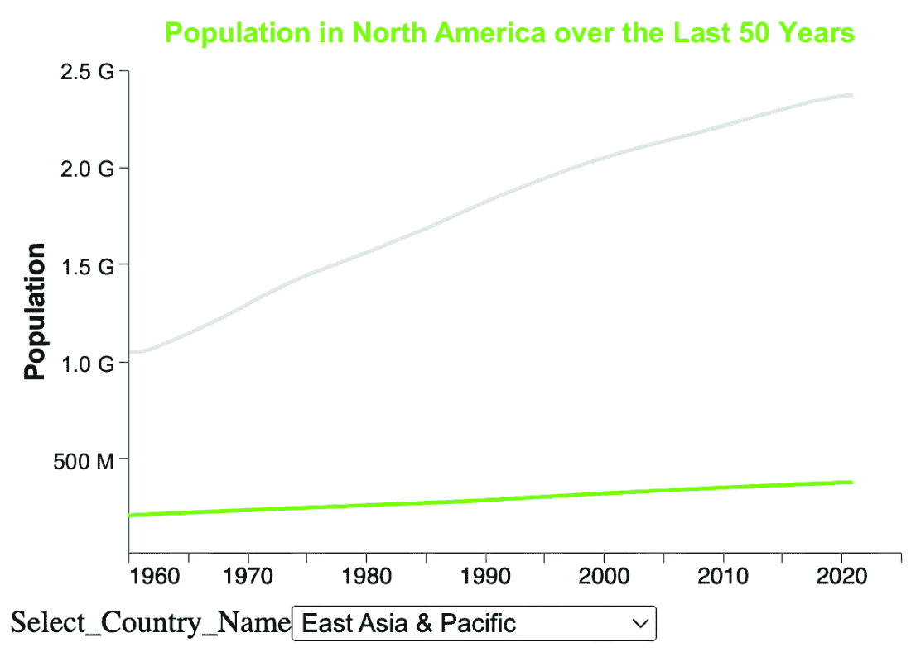
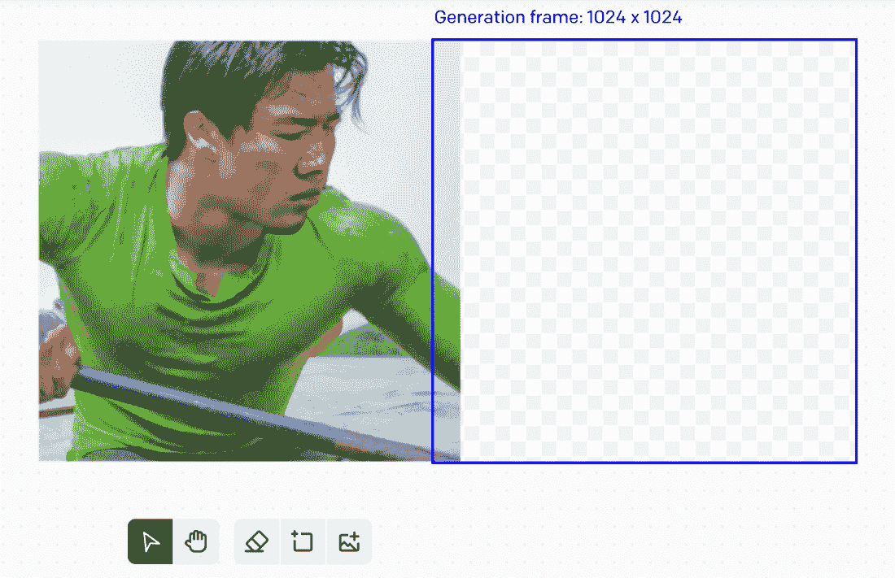
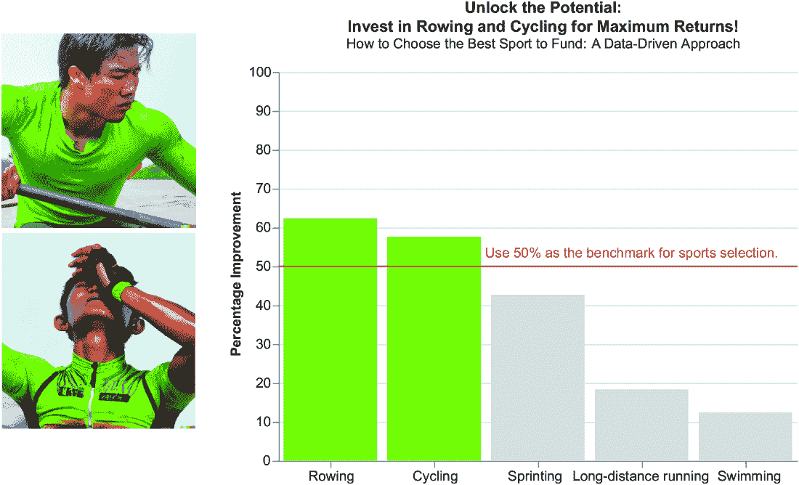
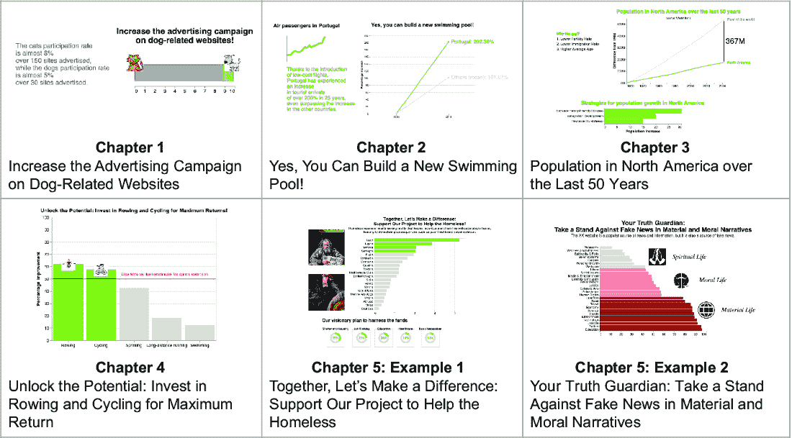
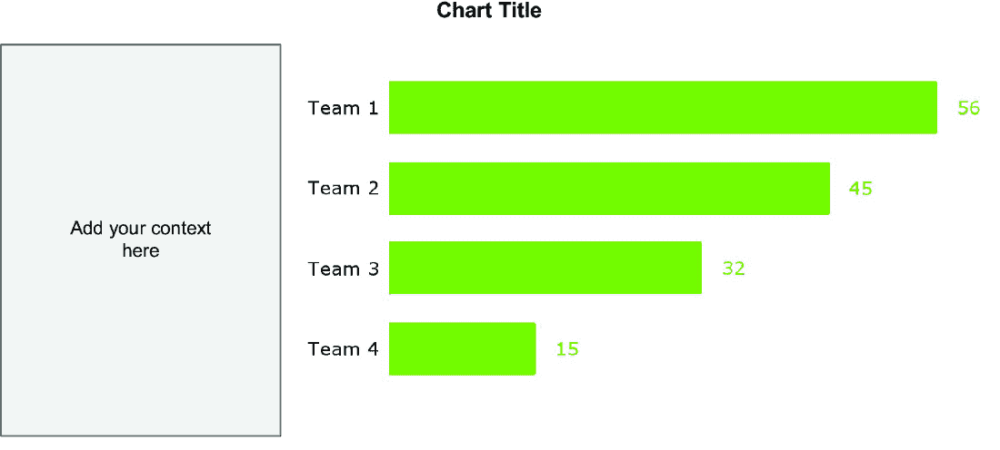
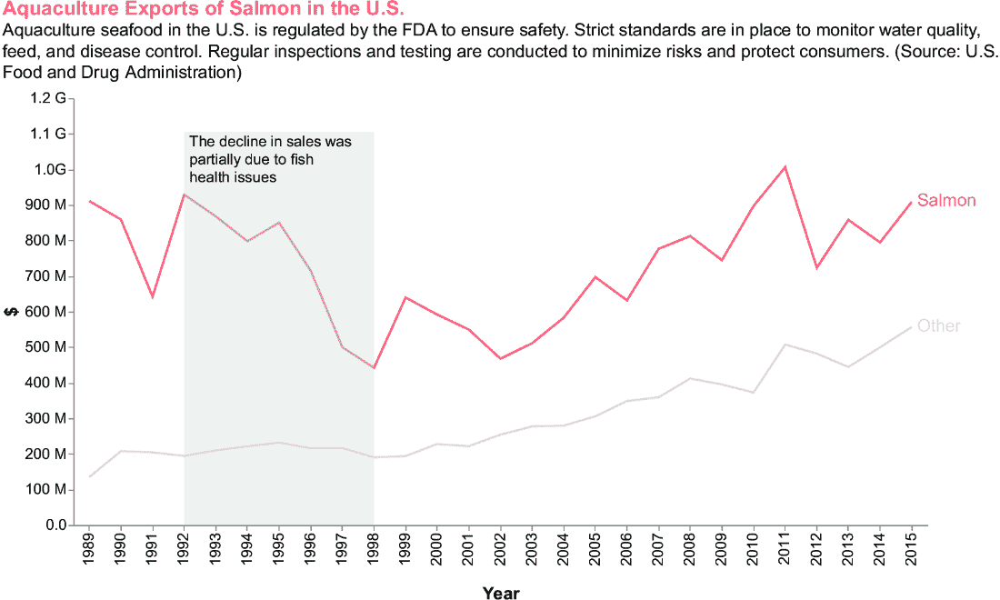
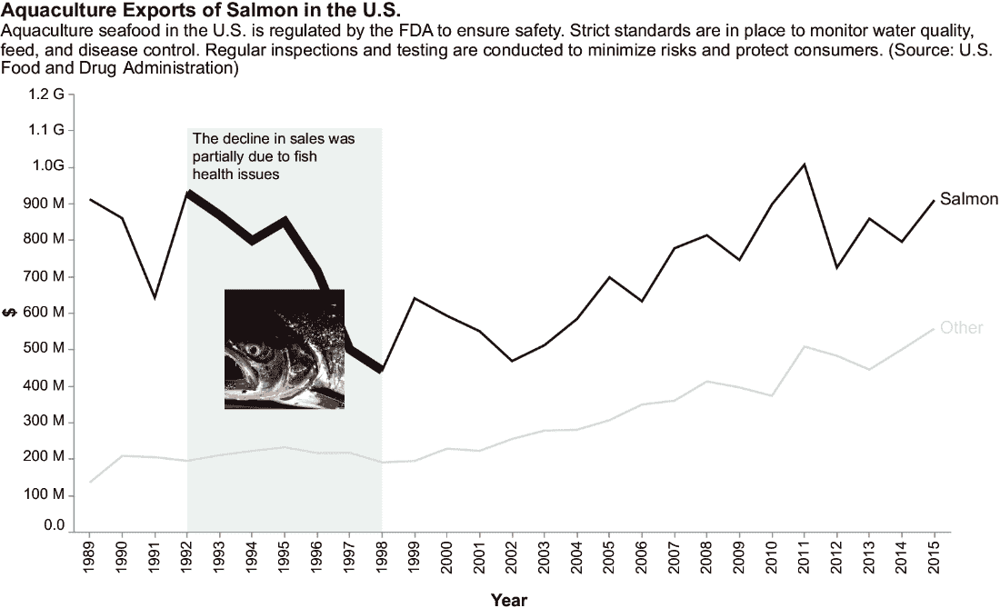
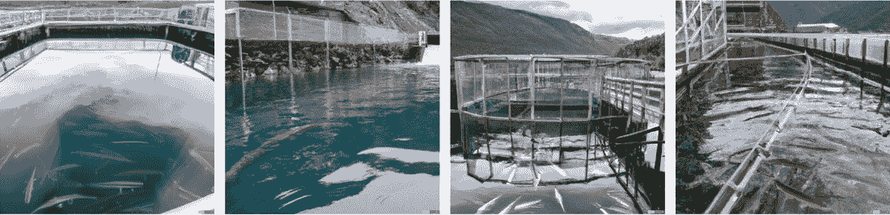

# 第八章：从信息到知识：构建视觉背景

### 本章涵盖

+   情感：视觉背景的基础

+   颜色、大小和交互

+   使用 DALL-E 制作图像

+   文本和视觉背景的战略定位

+   实施示例

通常，看到有趣的事物会唤起一种*情感*，一系列触动人心的感受。当然，书面文字可以唤起情感，而视觉元素产生情感的力量可能更大。那么，为什么不利用情感来使观众更多地参与到我们的数据故事中来呢？在本章中，我们将回顾数据故事中视觉背景的基本概念，重点关注情感。我们将描述如何在数据故事中设置颜色、大小和交互性。接下来，我们将深入探讨如何使用 DALL-E 制作图像。然后，我们将关注如何在图表中放置背景。最后，我们将关注一个实施所述概念的实践案例研究。

## 8.1 情感：视觉背景的基础

我和家人几年前去过自然历史博物馆。那里有许多动物、考古发掘的重建、一些原始人，还有更多。参观结束时，孩子们如此兴奋，以至于他们谈论的只有这件事。几天后，我最小的孩子告诉我，他想要在他祖母的花园里建造一个考古发掘！

我们的故事也应该发生同样的事情：一段时间后，我们的观众仍然在谈论它们。它们应该是难忘的。实现这一目标的一种方法，同时直接涉及我们的观众，是通过唤起*情感*。情感是感知、解释和记忆视觉信息的关键。情感在原始数据和人类理解之间架起桥梁。视觉刺激引发情感反应，影响我们对所看到的感知和参与。*柯林斯词典*（[`mng.bz/9dZl`](https://mng.bz/9dZl)）将情感定义为“一种感觉，如快乐、爱、恐惧、愤怒或仇恨，可能是由你所处的情境或你所与的人引起的。”

情感在视觉传播的有效性中起着至关重要的作用。视觉背景，包括颜色、形状和布局，可以在观众中唤起特定的情感反应。例如，像红色和橙色这样的暖色调可能会唤起兴奋或紧迫感，而像蓝色和绿色这样的冷色调则可以传达平静或信任。有意在视觉元素中使用这些情感线索可以显著影响观众对信息的感知和保留。

在他们的书中，《沟通以影响：如何激发观众的行动》，本和凯利·德克解释说，我们可以通过能量和情绪的双重维度来理解情感，这有助于根据情感的正负程度对各种情感状态进行分类，如图 8.1 所示（德克，2015）。


##### 图 8.1 情绪分类的宏观类别

情绪在这些维度上可能有很大的差异，个体可能会以独特的方式体验和表达情绪，这受到他们个人和文化背景的影响。

考虑到能量轴（x 轴），我们有两种类型的情绪：

+   *高能量情绪*—这些情绪通常与增强的生理唤醒度相关联。它们通常涉及激活身体的“战斗或逃跑”反应。高能量情绪的例子包括兴奋、愤怒和恐惧。这些情绪的特点是心率加快、警觉性提高和紧迫感。高能量情绪通常通过生动的肢体语言、热情的手势和快速的言语表达出来。

+   *低能量情绪*—这些情绪涉及生理唤醒度的降低，以平静和放松为特征。低能量情绪的例子包括满足、宁静和悲伤。经历低能量情绪的人可能会表现出动作缓慢、举止安静和身体紧张度降低。低能量情绪常常导致沉思和内省。

考虑到情绪轴（y 轴），我们有两种类型的情绪：

+   *高落情绪*—这些情绪与积极的价值观相关联，唤起快乐、喜悦和积极情绪。这些情绪营造出乐观的氛围，并常常导致微笑、笑声和普遍的幸福感。例如，快乐、兴奋和爱。

+   *低落情绪*—这些情绪以负面价值为特征，导致悲伤、愤怒或焦虑等感受。这些情绪会营造出更加忧郁的氛围。低落情绪可能导致悲伤的表情、皱眉以及普遍的痛苦感。例如，悲伤、恐惧和愤怒。

我们可以通过情绪和能量组合来生成不同的情绪，如图 8.1 中的表情符号所示。

在选择颜色时，还应考虑使内容对残疾人士可访问和可理解。更多详情请参考网络内容可访问性指南（WCAG，[`wcag.com/`](https://wcag.com/)）网站和 WebAIM（[`webaim.org/articles/contrast/`](https://webaim.org/articles/contrast/)）。

在数据故事中融入情绪并非仅仅是一种审美选择，而是一种传达知识的*战略方法*。通过将情绪与预期的信息相匹配，我们可以将观众被动接收信息转变为主动寻求知识和理解的过程。例如，高能量情绪可以立即吸引注意力并激发好奇心，促使观众更深入地探索视觉内容。相反，低能量情绪可以鼓励反思，使观众能够更深刻地思考内容。

激发情感最快最有效的方式是通过*视觉*。正如我的孩子们在自然历史博物馆被他们所见所吸引一样，我们的观众应该被我们在视觉表现中所见所吸引。通过视觉吸引观众注意力的方式有很多，例如图表颜色、大小、交互性和图像。有大量关于所有这些视觉类型的书籍和资源；因此，本书将只提供一个概述，重点关注如何在 Altair 中配置它们。更多细节，请参考参考文献。此外，本章将重点介绍如何使用生成式 AI，特别是 DALL-E，来生成具有特定情感的图像。让我们从颜色的一般概述及其在 Altair 中的实现方法开始。

## 8.2 颜色

颜色通过设定场景和基调来传达信息。它建立了数据与观众之间的情感联系。颜色由三个主要组成部分构成：

+   *色调*——这指的是主导颜色的波长。它确定了颜色家族或颜色名称（如红色、绿色或紫色）。

+   *饱和度*——这个组件描述了该颜色的强度。它定义了颜色的纯度。

+   *亮度*——这衡量了颜色看起来有多亮或多暗。

在前面的章节中，我们了解到每个数据故事都有一个主要角色和一个对手。在绘制图表时，选择一种主色调来突出主要角色，并在提及他们时始终使用它。为对手使用另一种颜色，但如果你想让对手退居背景，则可以使用灰色调。你可以使用以下调色板之一来选择颜色（请参阅电子书中的全彩图片）：

+   *顺序色调板使用单一颜色在多种渐变或饱和度中组织从高到低的定量数据*。使用此调色板来显示进展而不是对比（图 8.2）。


##### 图 8.2 顺序色调板

+   *对比色调板通过在两端使用两种对比色调以及较浅的混合色调来突出显示中间范围，从而强调定量数据的范围*。对比色调板显示了数据在谱上的位置，例如冷到热（图 8.3）。冷可能代表较低的定量数据值，通常用较冷的色调表示，而热可能指较高的值，通常用较暖的色调表示。


##### 图 8.3 对比色调板

+   *定性色调板* *强调定性类别*。这种调色板类型为每个概念使用不同的色调（图 8.4）。


##### 图 8.4 定性色调板

您可以使用颜色来集中注意力和突出图表想要展示的重要信息。此外，您可以使用颜色来建立关联，例如棕色或绿色代表自然，黄色调代表阳光或蜜蜂。您甚至可以使用颜色来唤起情感，例如红色代表能量，蓝色代表和平。不要使用重叠的颜色来表示不同的概念或使用过多的颜色。

##### 挑战

考虑第五章关于无家可归主题的案例研究。我们在图表中用绿色调着色条形，这应该能在观众中唤起希望。颜色的目的是展示我们的项目将有助于解决无家可归问题。如果我们使用另一种颜色，比如 #6F4E37（咖啡色），传达的信息可能没有使用绿色时那么强烈。

### 8.2.1 在 Altair 中设置颜色

在前面的章节中，我们看到了如何使用颜色通道在 Altair 中设置颜色。在本节中，我们将提供更多细节。以下列表展示了如何在 Altair 中使用颜色的快速提醒。

##### 列表 8.1 在 Altair 中设置颜色

```py
import pandas as pd
import altair as alt

df = pd.DataFrame({
    'Category' : ['A', 'A', 'B', 'B', 'C', 'C', 'C'],
    'Cost' : [12,45,64,23,45,78,72],
    'Sales' : [34,56,45,34,44,23,23],
    'Product' : ['P1','P2','P3','P4','P5','P6','P7']
})

chart = alt.Chart(df).mark_bar().encode(
        x=alt.X('Product:N'),
        y=alt.Y('Cost:Q'),
 color=alt.Color('Category:N')
    )

chart.save('chart.xhtml')
```

注意：使用 `alt.Color()` 通道来设置颜色。

颜色通道可以使用 `scheme` 参数作为输入接收特定的颜色调色板。有关支持的调色板，请参阅 Altair 文档（[`vega.github.io/vega/docs/schemes/`](https://vega.github.io/vega/docs/schemes/)）。此外，您可以使用比例参数来指定颜色的范围和域：

+   *范围参数指定了刻度的输出范围。* 例如，当将定量变量映射到颜色时，使用从蓝色到红色的颜色刻度。指定范围为一个颜色列表或 Altair 的内置颜色方案之一。

+   *域参数指定了刻度的输入域。* 例如，如果你有一个介于 0 到 100 之间的定量变量，将颜色刻度的域设置为 `[0,` `100]`。

### 8.2.2 练习：设置颜色

考虑第三章关于过去 50 年北美人口的案例研究。你可以在本书的 GitHub 仓库中找到这个案例研究的完整代码，位于 CaseStudies/population/population.ipynb。最终的数据故事比较了北美与世界其他地区的人口，并显示有 3670 万人差距。我们使用绿色调来表示北美趋势线。

现在，按照以下步骤进行：

1.  将主图表（即显示与 1960 年差异的图表）的颜色更改为 #963232（一种红色调），同时保持下一步图表（即标题为北美人口增长策略的图表）中的绿色调。

1.  将获得的结果与第三章中实现的图表进行比较。使用不同的颜色是否以任何方式改变了信息？你可能注意到对北美人口增长速度慢于世界其他地区的负面强调。然而，下一步仍然保持乐观。

#### 一种可能的解决方案

获得相同结果的方法有很多。一种可能的解决方案是为每个图表局部设置颜色。例如，你可以为下一步的图表设置颜色。

##### 列表 8.2 在下一步图表中设置颜色

```py
color='#80C11E'

df_cta = pd.DataFrame({
    'Strategy': ['Immigration Development', 'Enhance Family-Friendly Policies', 'Revitalize Rural Areas'],
    'Population Increase': [20, 30, 15]  # Sample population increase percentages
})
# Creating the stacked column chart
cta = alt.Chart(df_cta).mark_bar(color=color).encode(
    x='Population Increase:Q',
    y=alt.Y('Strategy:N', sort='-x', title=None),
    tooltip=['Strategy', 'Population Increase'],    
).properties(
   title=alt.TitleParams(
       text='Strategies for population growth in North America',
       color=color)
)
```

注意：向图表添加局部颜色。使用这种方法，当你配置所有分层图表时，此图表将不会受到全局配置的影响。

这个例子展示了使用颜色传达情感的基本示例。更多细节，请参考关于该主题的特定书籍，例如章节末尾参考文献部分中的那些。现在你已经学会了使用颜色传达情感的基本概念，让我们继续下一步：使用大小。

## 8.3 尺寸

在创建图表时，请考虑*大小*，因为它可以显著影响观众对数据的感知。大小影响你的视觉表示的可读性以及整体影响和效果。选择图表的适当大小取决于多个因素，例如你将在哪里展示它，你想要展示什么类型的内容，以及谁将查看它。确定正确大小的最佳方法是实验；尝试不同的尺寸，直到找到一个看起来足够好的为止。

此外，选择较小或较大的图表大小会影响多少信息可以放入一个框架中而不会杂乱无章或挤压文本。它还影响读者是否可以轻松阅读所有数据点，而不会使眼睛疲劳或迷失在过多的元素中。你可以在图表中配置两种主要类型的尺寸：字体大小和图表大小。

### 8.3.1 字体大小

*字体大小*直接影响数据的可读性和可理解性。字体大小应设置为使读者容易理解并解释图表中呈现的信息。

在设置图表时，你可以为不同的图表组件指定不同的字体大小，如标题、轴标签或刻度标签。一个好的做法是在整个绘图过程中保持它们的一致性，这样它们看起来既视觉上吸引人又井然有序。

默认情况下，Altair 将字体大小设置为 12 px。然而，你可以调整字体大小，使你的图表更易于阅读或与风格相匹配。

要在 Altair 中更改字体大小，确定您想要修改的可视化部分。一旦确定，使用 Altair 的`configure_*()`方法以及`axis`、`title`、`text`或`legend`属性，具体取决于您想要修改的组件。然后，您可以传递如`fontSize`或`labelFontSize`等参数及其期望的值。

在增加字体大小时，不要过度，因为较大的字体可能会导致图表杂乱无章，难以阅读。另一方面，较小的字体可能会导致难以阅读的图表。因此，请始终选择一个合理的字体大小，以很好地补充你的图表，同时不会负面影响可读性。

### 8.3.2 图表大小

设置你的 Altair 图表大小时要考虑的最后一个方面是实际的图表大小。你可以通过在属性中调整宽度和高度参数来调整它。这两个参数都是以像素为单位的。

在确定合适的图表大小时，没有一种适合所有情况的解决方案。它将取决于你计划在哪里显示图表、它代表的数据类型以及你想要包含多少细节等因素。

然而，你可以遵循以下一般性指南：

+   如果你想要创建一个简单的图表用于电子邮件或演示文稿幻灯片，请使用较小的尺寸。

+   如果你想要创建一个复杂的图表，请使用较大的尺寸。

要在 Altair 中设置图表大小，请使用以下方法之一：

+   `properties(width=my_width,` `height=my_height)` 用于单图

+   `configure_view(width=my_width,` `height=my_height)` 用于单图或复合图表。

### 8.3.3 练习：设置大小

考虑第一章中实现的案例研究——增加与狗相关的网站上的广告活动 ([`mng.bz/KZaK`](https://mng.bz/KZaK))：

1.  仅将 x 轴标签的大小更改为 9，如图 8.5 所示。

1.  将获得的结果与原始图表进行比较。图表是否更清晰？


##### 图 8.5 第一章案例研究，9 的值字体大小增加

#### 解决方案

以下列表显示了如何将 `x` 通道编码以仅增加一个轴标签的字体大小。

##### 列表 8.3 设置标签大小

```py
x=alt.X('x:Q', 
        scale=alt.Scale(domain=[0, 10]),
        axis=alt.Axis(tickMinStep = 1,
            grid=False, 
            title=None, 
            orient='bottom',
 labelFontSize=alt.condition(alt.datum.value == 9, 
 alt.value(25),
 alt.value(12)))
        ),
```

注意：使用 `alt.condition()` 方法根据条件设置标签大小。

现在你已经学会了如何在 Altair 中配置大小，让我们继续下一步：交互性。

## 8.4 交互

到目前为止，我们已经实现了静态图表，这些图表向观众呈现一个静态的故事。这种图表类型的优点在于你可以决定故事，并引导观众通过它。换句话说，你不允许观众自主探索数据。

向图表添加交互元素，如按钮、菜单和缩放选项，将静态图表转换为动态图表。在动态图表中，你构建动态数据故事，观众构建自己的故事。在动态图表中，你失去了对观众的掌控和拥有一个集中且精确信息的可能性。观众可以自由探索数据并提取他们的见解，可能导致其他行动呼吁。因此，在设计时，重要的是预先考虑你希望观众根据要传达的信息浏览图表的哪些部分。

当您希望观众动态探索数据或处理大量数据集时，请使用交互式图表。例如，在金融数据或教育环境中，交互式图表允许观众放大特定时间段或悬停在数据点上以获取详细信息。相反，您可能更喜欢静态图表，用于简单的演示或报告，其中数据不需要探索。例如，静态图表可能非常适合展示趋势或比较的印刷年度报告，不需要用户交互。此外，在需要信息直接且一致的情况下，静态图表可能更有效。

例如，考虑第三章中描述的场景的变体。图表包含一个下拉菜单，允许您选择要在图表中显示的参考国家。这种图表类型在数据探索阶段是可行的，但它无法用于构建数据故事，因为它没有焦点。相反，如果您专注于北美，并给观众留下与其他国家进行比较的可能性，您仍然在讲述关于北美人口的故事，同时给观众提供了与其他国家进行比较的自由。

主要有两种交互类型：

+   *被动交互*——这指的是允许观众在不改变图表状态的情况下与图表交互的功能，例如工具提示或悬停效果。

+   *主动交互*——这涉及到根据用户输入更改图表的状态。

在本节的剩余部分，我们将了解如何向 Altair 图表添加工具提示、滑块和下拉菜单。

### 8.4.1 工具提示

*工具提示*是一个当您悬停在某些图表元素上时出现的迷你弹出框，例如数据点或条形。要将工具提示添加到您的 Altair 图表中，指定您希望它出现的元素。在 Altair 中，您可以通过工具提示编码通道使用方括号`[]`来实现，如下所示。以下示例使用第三章中的人口数据集，关注一个完全不同的洞察：2018 年按大陆的人口增长。

##### 列表 8.4 设置工具提示

```py
import pandas as pd
import altair as alt

df = pd.read_csv('data/population.csv')

# [...]

df = df[df['Country Name'].isin(continents)]

color = '#80C11E'

chart = alt.Chart(df).mark_bar(
    color=color
).encode(
        y=alt.Y('Country Name:O', sort='-x', title=''),
        x=alt.X('Population:Q'),
 tooltip=['Country Name', 'Population']
).transform_filter(
    alt.datum.Year == 2018
)  #1

# [...]

chart.save('tooltip.xhtml')
```

#1 创建可视化

注意：使用`tooltip`通道在 Altair 中设置工具提示。

您可以在本书的 GitHub 存储库下的 08/tooltip.py 中找到示例的完整代码。图 8.6 显示了悬停在条上时产生的工具提示快照。现在您已经学会了如何在 Altair 中生成工具提示，让我们继续学习下一个交互元素：滑块。


##### 图 8.6 工具提示示例

### 8.4.2 滑块

*滑块*是一个图形元素，允许用户通过在轨道或条上移动视觉指示器来在指定范围内输入或调整值。要在 Altair 中构建滑块，请按照以下步骤操作：

1.  创建一个`binding_range()`，一个定义滑块可以设置的值范围的对象。

1.  使用 `selection_point()` 方法创建一个选择。选择是一个对象，它定义了滑块如何与图表交互。

1.  使用 `add_params()` 方法将选择添加到图表中。

1.  可选地，将 `transform_filter()` 方法应用到图表上，以仅显示选择。

列表 8.5 展示了滑块使用示例。示例仍然使用第三章中的人口数据集，关注按大洲的人口增长。你可以在本书的 GitHub 仓库中的 08/slider.py 文件下找到完整的代码。列表中只显示了实现滑块的代码。更多细节，请参阅 GitHub 仓库中的代码。

##### 列表 8.5 设置滑块

```py
import pandas as pd
import altair as alt

df = pd.read_csv('data/population.csv')

# [...] 

color = '#80C11E'
slider = alt.binding_range(min=1960, max=2021,step=1)

select_year = alt.selection_point(name="Select", fields=['Year'],
                                   bind=slider)

chart = alt.Chart(df).mark_bar(
    color=color
).encode(
        y=alt.Y('Country Name:O', sort='-x', title=''),
        x=alt.X('Population:Q'),
).add_params(
    select_year
).transform_filter(
    select_year
) 

# [...]

chart.save('slider.xhtml')
```

注意：在导入所需的库后，使用 `binding_range()` 函数为滑块定义一个最小值为 1960、最大值为 2021、步长为 1 的绑定范围。接下来，使用 `selection_point()` 函数创建一个名为 Select 的选择，并指定它应该绑定到的字段（在这种情况下，为 Year）使用滑块。之后，使用 `add_params()` 方法将 Select_year 选择添加到图表中，并使用 `transform_filter()` 方法根据从滑块中选择的年份过滤数据。

图 8.7 显示了结果的静态图表表示。现在你已经学会了如何在 Altair 中生成工具提示，让我们继续到下一个交互元素：下拉菜单。


##### 图 8.7 滑块示例

### 8.4.3 下拉菜单

下拉菜单是一个图形元素，通常以一个小矩形框的形式出现，带有箭头或三角形图标，表示有更多选项或选择可用。当用户点击或悬停在下拉菜单上时，一个可选择的项或选项列表“下拉”或展开在菜单下方或上方。用户可以通过点击来从可用选项中选择。要在 Altair 中创建下拉菜单，请按照以下顺序步骤进行：

1.  首先生成一个 `binding_select()` 对象。此对象定义了分配给下拉菜单的值列表。

1.  使用 `selection_point()` 方法创建一个选择。此选择对象控制下拉菜单与图表之间的交互。

1.  使用 `add_params()` 方法将选择集成到图表中。

1.  应用 `transform_filter()` 方法以仅显示所选数据。

列表 8.6 展示了下拉菜单使用示例。示例使用第三章的人口数据集，关注按大洲的人口增长。下拉菜单允许你选择特定的洲。你可以在本书的 GitHub 仓库中的 08/dropdown.py 文件下找到完整的代码。以下列表只显示了实现滑块的代码。更多细节，请参阅 GitHub 仓库中的代码。

##### 列表 8.6 设置下拉菜单

```py
import pandas as pd
import altair as alt

df = pd.read_csv('data/population.csv')

# [...] 
color = '#80C11E'
input_dropdown = alt.binding_select(options=df['Country Name'].unique())
select_country = alt.selection_point(name='Select',fields=['Country Name'], bind=input_dropdown, value=[{'Country Name': 'Africa Eastern and Southern'}])

# Create visualization
chart = alt.Chart(df).mark_line(
    color=color
).encode(
        y=alt.Y('Population:Q', title=''),
        x=alt.X('Year:O'),
).add_params(
    select_country
).transform_filter(
    select_country
)

# [...]
chart.save('dropdown.xhtml')
```

注意：在导入所需的库后，使用`binding_select()`函数定义下拉菜单的绑定选择。接下来，按照你为滑块所做的方式继续操作。

图 8.8 显示了结果的静态表示。


##### 图 8.8 下拉菜单的示例

现在，是时候练习了。所以让我们继续进行一个练习。

### 8.4.4 练习：设置交互性

考虑第三章中实现的案例研究：过去 50 年北美的人口。您可以在本书的 GitHub 仓库中找到此案例研究的完整代码，位于 CaseStudies/population/population.ipynb：

1.  删除“其他”行，并添加一个动态行，显示可从下拉菜单中选择的大陆，如图 8.9 所示。保持北美行静态。

1.  将获得的结果与原始图表进行比较。这种动态图表最适合哪种类型的听众？

1.  可选地，将所有图表元素适应到动画中。



##### 图 8.9 第三章的案例研究，包含一个用于与北美比较的动态下拉菜单

你可以在本书的 GitHub 仓库中找到练习的解决方案，位于 08/population-exercise.py。现在你已经学会了如何在 Altair 中通过工具提示、滑块和下拉菜单引入交互性，让我们转向下一个元素，图像，专注于 DALL-E。

## 8.5 使用 DALL-E 生成图片

想象阅读一段描述以下场景的文字：*一位有着黑色头发和深色眼睛的美丽小女孩，穿着黄色连衣裙，在满是黄色花朵的绿色草地上奔跑*。你可以发挥你的创造力在脑海中设定这个场景，但这可能需要你大脑的一点点努力。现在，看看图 8.10（使用 DALL-E 实现），它以视觉方式展示了相同的场景。你看到了我们之前描述的内容，但肯定，你在脑海中描绘的场景是不同的。


##### 图 8.10 一位穿着黄色连衣裙的小女孩的图片

当你描述你的数据故事主题时，也会出现相同的情况。如果你不给你的主题赋予一个面孔，只提供一般性的描述，你的听众可以根据他们的背景自由想象主题的各种方式。相反，如果你在你的数据故事中添加一个或多个图片，你将帮助听众对故事的主题有一个清晰的印象。通过图片，尤其是照片，你将把听众带到预期的情感水平，他们将会更愿意倾听你的数据故事。在数据故事中添加图片加强了上下文，并使听众为接受数据故事信息做好准备。

在第四章中，你学习了如何在 DALL-E 中绘制图像并将其插入到图表中。在本节中，你将看到如何使用 DALL-E 生成的图像来唤起情感。我们还将探讨如何保持我们在 DALL-E 中生成的图像的一致性。让我们从情感开始。

### 8.5.1 添加情感

DALL-E 提示词书建议一些关键词，以向图像添加情感。图 8.1 显示了与每个情感类别相关的一些可能的形容词：

+   *高能量，积极情绪*—明亮，充满活力，动态，精神饱满

+   *高能量，消极情绪*—黑暗，威胁，幽灵般，预兆

+   *低能量，积极情绪*—轻柔，平和，宁静，安详

+   *低能量，消极情绪*—柔和，阴郁，葬礼，忧郁

您可以在 DALL-E 提示词书的完整关键词列表中阅读（https:// mng.bz/0GNx）。

使用情感关键词可以使你获得不同的结果。图 8.11 显示了 DALL-E 对以下输入的可能输出：*一位在花园中玩耍的宁静女士，照片*。


##### 图 8.11 一位在花园中宁静的女士的图像

图 8.12 显示了一个完全不同的结果，仅通过将关键词*calm*改为*muted*生成。


##### 图 8.12 一位在花园中柔和的女士的图像

将此类图像融入数据故事有助于观众给你的主要角色赋予一个面孔。你的故事主角可以通过他们的情感和表现力直接与观众沟通。现在你已经学会了如何向 DALL-E 生成的图像添加情感，让我们继续下一步：生成一致图像。

### 8.5.2 生成一致图像

一致图像是一组具有共同特征的图像，例如颜色、风格等。当你想在数据故事中添加多于一张图像时，构建一致图像非常重要。在撰写本书时，DALL-E 没有提供任何明确的方式来构建一致策略。然而，在本节中，你将看到 Tyler Taggart 在他的 YouTube 视频中（Taggart，2023）提出的构建 DALL-E 中一致图像的小技巧。为了做到这一点，我们将使用 DALL-E 提供的编辑工具，该工具在第四章中已介绍。

为了展示所提出策略的工作原理，我们将重新绘制第四章案例研究中与划船和自行车相关的图像：解锁潜力：投资划船和自行车以获得最大回报！想法是在数据故事中插入定制给高管的真实照片，以更好地吸引他们的注意力。

首先，在 DALL-E 中写下以下提示词：*一张展示划船运动员努力的图片。展示汗水与肌肉。运动员穿着绿色夹克*。图 8.13 显示了 DALL-E 可能生成的输出。


##### 图 8.13 DALL-E 可能生成的输出

在四个可用的照片中选择一张，然后点击编辑。现在，点击添加生成框架，并将其插入到图像附近，如图 8.14 所示。



##### 图 8.14 生成框架放置位置

现在，请按照以下方式编辑你的提示：*一张展示自行车运动员努力的照片。展示汗水与肌肉。运动员穿着绿色夹克*。你只是将单词*划船*改为*骑自行车*。DALL-E 将生成四张图片。选择最适合你要求的一张，或者生成新的图片。图 8.15 显示了可能的输出。照片的两个部分（左部和右部）非常相似。例如，它们使用了相同的绿色色调。


##### 图 8.15 DALL-E 生成的输出

如你所见，两张照片相互关联。结果看起来有点奇怪，但你可以通过下载并使用任何图像编辑工具将它们分开（生成两张看起来正常的照片）。

现在你已经获得了两张表现最好的运动项目的照片，你可以将它们替换为第四章案例研究中的图表，如图 8.16 所示。我们还添加了通过微调产生的副标题。故事中的照片突出了运动员为了打破记录所付出的努力，从而邀请高管继续为他们提供资金。



##### 图 8.16 定制给高管观众的最终图表

现在，是时候练习了。让我们继续进行一个练习。

### 8.5.3 练习：生成图像

考虑第一章中的案例研究：增加与狗相关的网站上的广告活动：

+   为一只狗和一只猫生成两张一致的图片，并用生成的图片替换图表中的原始图片。

+   为一只狗（或一只猫）生成一张具有特定情绪（例如愤怒、平静、放松）的新图片。DALL-E 能否为动物生成情绪图片？

我们刚刚完成了使用 DALL-E 为数据故事生成图片的旅程。在本章的最后一步，我们将考虑在数据故事中定位你的图表的技巧。

## 8.6 战略性地放置上下文

在你的数据故事的主要观点之前，应该有上下文。因此，我建议你在你的数据可视化图表的以下三个主要位置之一放置你的上下文：顶部、左侧或图表内部。在本节的剩余部分，我们将分别研究每个上下文位置。作为使用每个上下文位置的例子，我们将关注第一章至第五章中描述的案例研究。为了方便，图 8.17 总结了分析的案例研究。



##### 图 8.17 总结了第一章至第五章中描述的所有示例。

### 8.6.1 顶部放置

在图表顶部添加上下文意味着在标题下方立即添加文本描述，如图 8.18 所示。


##### 图 8.18 图表顶部的上下文位置

使用图表的顶部来描述主题或数据源的概述。您还可以使用图表的顶部部分添加数据源。添加数据源意味着承认图表中使用的信源。这为呈现的信息提供了可信度。当观众看到我们已经正确地注明了数据源时，他们更有可能信任所呈现的信息。

考虑图 8.17 中的案例研究。表 8.1 显示了使用顶级上下文和上下文类型的案例研究。

##### 表 8.1 使用顶部上下文位置的案例研究

| 名称 | 顶部上下文类型 | 文字 |
| --- | --- | --- |
| *第三章:* 过去 50 年北美的人口 | 数据源 | 来源：世界银行 |
| *第五章—示例 1:* 一起，让我们做出改变：支持我们的项目，帮助无家可归者 | 文本描述 | 无家可归是一个令人心碎的现实，它使个人和家庭失去了稳定的家园，导致严重的后果，如健康状况恶化和社会孤立。 |
| *第五章—示例 2:* 你的真理守护者：在物质和道德叙述中对抗假新闻 | 文本描述 | 最新新闻网站是一个流行的新闻和信息来源，但也是一个假新闻的来源。 |

### 8.6.2 左侧放置

在图表左侧添加上下文涉及在标题之前立即添加一个或多个注释，如图 8.19 所示。



##### 图 8.19 图表左侧的上下文位置

使用图表的左侧部分添加初步图表或更深入的细节，例如文本描述、图像或照片，这些可能会影响观众的感受。再次考虑图 8.17 中的案例研究。表 8.2 显示了使用左侧上下文和显示所使用的上下文类型的案例研究。

##### 表 8.2 使用左侧上下文位置的案例研究

| 名称 | 左侧上下文类型 | 文字 |
| --- | --- | --- |
| *第一章*: 在与狗相关的网站上增加广告活动 | 文本描述 | 在 150 个广告网站上，猫的参与率几乎是 8%，而在 30 个广告网站上，狗的参与率几乎是 5%。 |

| *第二章*: 是的，你可以建造一个新的游泳池！ | 次级图表文本描述

| 多亏了低成本航班的引入，葡萄牙在 25 年内游客到访量增长了超过 200%，甚至超过了其他国家。 |
| --- |

| *第三章*: 过去 50 年北美的人口 | 文本描述 | 为什么会有这个差距？1. 生育率下降 |

2. 下降的移民率

3. 较高的平均年龄

|

| *第五章—示例 1*: 一起，让我们做出改变：支持我们的项目，帮助无家可归者 | 图片 | –  |
| --- | --- | --- |

与顶部位置所写的相比，左侧位置的文字包含额外的细节，有时是从其他来源提取的。

### 8.6.3 内部放置

图表中的上下文通过图表注释突出了某些有趣的观点或部分，如图 8.20 所示。


##### 图 8.20 图表中的上下文位置

注释有助于观众关注图表的一些特定部分。注释的例子包括文本、圆圈、基线、图像和箭头。在使用注释时，确保它们不过度且不与图表本身重叠，以免干扰阅读。

再次考虑图 8.17 中的案例研究。表 8.3 显示了使用左侧上下文和上下文类型的案例研究。

##### 表 8.3 使用上下文位置的案例研究

| 名称 | 上下文类型 | 文本 |
| --- | --- | --- |
| *第一章*：增加与狗相关的网站上的广告活动 | 图像 | –  |

| *第三章*：过去 50 年北美的人口 | 文本垂直线

| 367M  |
| --- |

| *第四章*：释放潜力：投资划船和自行车以获得最大回报 | 文本基线

图像

| 使用 50%作为运动选择的标准。 |
| --- |

| *第五章—示例 2*：你的真理守护者：在物质和道德叙述中对抗假新闻 | 图像文本

| 物质生活 道德生活

精神生活

|

与位于顶部和左侧位置所写的文本相比，注释中的文本更加简洁，突出了数据细节。现在你已经学会了如何为你的数据故事添加视觉背景，让我们来实施一个实际案例研究。

## 8.7 案例研究：从信息到知识（第二部分）

在上一章中，我们分析了如何通过水产养殖案例研究中的文本上下文将信息转化为知识。只是为了快速提醒，这个案例研究涉及围绕美国鲑鱼水产养殖中的安全问题构建故事。我们决定绘制鲑鱼水产养殖销售趋势线与其他类型水产养殖的趋势线。作为一个洞见，我们发现自 1998 年以来，销售有所增加，这继 1992 年至 1998 年销售下降之后。我们发现下降期部分是由于鲑鱼水产养殖中的一些健康问题。图 8.21 显示了添加文本上下文将信息转化为知识时产生的图表。



##### 图 8.21 添加文本上下文时产生的图表

下一步是向故事中添加视觉背景。我们将遵循两种不同的场景：

+   传达消极情绪，重点关注消极年份（1992-1998）

+   传达积极的情绪，重点关注趋势增加的年份（从 1998 年开始）。

在这两种情况下，我们将生成图像，设置颜色，并选择与特定情绪相关的尺寸。让我们从第一点开始：传达消极情绪。

### 8.7.1 设置消极情绪

在这个场景中，重点是负面的年份。目的是展示这个时期的恐怖，以在观众中提高确保它永远不会再次发生的紧迫感。我们将生成令人震惊的图片并使用深色。

#### 图片

生成关于鲑鱼的令人震惊的图片（高能量，负面氛围）。让我们使用以下提示的 DALL-E：*一张死鲑鱼的疾病震惊照片*。图 8.22 显示了 DALL-E 生成的图像的可能输出。


##### 图 8.22 DALL-E 根据以下输入产生的输出：一张死鲑鱼的疾病震惊照片

让我们选择照片编号 2 并将其添加到图表中。列表 8.7 显示了 Copilot 生成 Altair 图像的指令。

##### 列表 8.7 Copilot 的指令

```py
# build a DataFrame named img_df with the following columns:
#   - 'url' with the values '../images/deadsalmon.png'
#   - 'x' with the value 1993
#   - 'x2' with the value 1997
#   - 'y' with the value 0  #1

# draw a image with the img_df DataFrame:
# - set x to 'x'
# - set y to 'y'
# - set x2 to 'x2'
```

#1 1 是一个象征性的数字。

注意：首先，指示 Copilot 生成包含所有相关通道的 DataFrame。然后，指定如何使用 Altair 绘制图像。我们已经要求 Copilot 将`y`设置为 0。这是一个初始值。你可以通过查看图像手动调整它。

你可以在 GitHub 仓库中找到这本书的完整代码，在 CaseStudies/from-information-to-knowledge-visual/chart-negative.py 下。

#### 颜色和大小

除了照片，我们还可以使用深色来强调负面情景。例如，我们可以使用深红色调（#460805），这暗示了血液。接下来，我们可以根据 1992-1998 年的年份增加笔触宽度。我们将为这些年份生成另一条线，与原始图表重叠。以下列表显示了生成该线的代码。

##### 列表 8.8 添加一个专注的线条

```py
base = alt.Chart(df
).encode(...)

chart = base.mark_line()

chart_line = base.mark_line(
    strokeWidth=8
).transform_filter(
    (alt.datum.CATEGORY == 'Salmon') & 
    (alt.datum.YEAR_ID >= 1992) &
    (alt.datum.YEAR_ID <= 1998)
)
```

注意：首先，构建一个包含所有编码选项的基础图表。在绘制主要图表之后，绘制另一个专注于选择的图表。使用`transform_filter()`方法仅选择一些数据。

再次，你可以在 GitHub 仓库中找到这本书的完整代码，在 CaseStudies/from-information-to-knowledge-visual/chart-negative.py 下。图 8.23 显示了生成的图表。



##### 图 8.23 添加负面视觉背景后的图表

现在我们已经实现了负面氛围的场景，让我们转向相反的场景：积极的氛围。

### 8.7.2 设置积极的氛围

在这个场景中，重点是正趋势线，始于 1998 年。目标是鼓励观众为了鲑鱼种群继续采用当前策略。在这里，我们不是关注负面影响，而是关注积极情景，仅将负面方面作为可能性提及。我们将使用放松的图片和颜色。

#### 图片

生成放松图像的程序与负面场景类似，不同之处在于使用落在图 8.1 顶部左边的时钟面上的文字（低能量，积极情绪）。以下是对 DALL-E 生成所需图像的提示：*一个宁静的、安全的鲑鱼养殖场*。图 8.24 显示了可能的输出。让我们选择照片编号 1。



##### 图 8.24 DALL-E 根据以下输入生成的输出：一个宁静的、安全的鲑鱼养殖场

#### 颜色和大小

使用和平的颜色（例如，#105473）来表示鲑鱼线。此外，突出显示自 1998 年以来的趋势线。图 8.25 显示了生成的图表。你可以在 GitHub 仓库中找到该书的完整代码，位于 CaseStudies/from-information-to-knowledge-visual/chart-positive.py。


##### 图 8.25 添加积极视觉背景后的图表

我们已经生成了两种类型的图表——负面和正面——但不是同时（比如，在同一张图表中包含两张图片）。这是因为我们不希望出现相互冲突的情感提示，这可能会使观众困惑或削弱我们旨在传达的意图。现在你已经学会了如何向数据故事添加积极或消极的情绪，让我们继续进行一个额外的练习：添加交互性。

### 8.7.3 练习：使图表交互式

修改之前的图表以使其交互式，如下所示：定义一个下拉菜单，包含两个值：正面和负面。当用户选择负面时，图表突出显示 1992 年至 1998 年之间的鲑鱼趋势线。当用户选择正面时，图表突出显示自 1998 年以来的趋势线。你可以在 GitHub 仓库中找到该书的练习解决方案，位于 CaseStudies/from-information-to-knowledge-visual/chart-dropdown.py。

在本章的第一部分，你学习了如何通过向你的数据可视化图表添加视觉背景将信息转化为知识。你看到了如何通过颜色、大小和交互性向图表添加情感。你还学习了如何在 DALL-E 中生成基于情绪且一致的图像。接下来，你学习了在哪里放置图表中的背景。最后，你实施了一个实际案例研究。在下一章中，你将看到如何通过添加行动号召和可能的下一步到图表中，将知识转化为智慧。

## 摘要

+   在你的数据可视化中添加视觉背景对于提升观众的情感至关重要。

+   结合颜色、大小和交互性可以帮助你更好地聚焦你的故事，并针对你的观众进行调整。

+   当你在 DALL-E 中绘制图像时，请使用编辑工具保持一致性。

+   考虑在图表中战略性地定位背景以增强其效果。

## 参考文献

### 使用情感进行沟通

+   Decker, B. 和 Decker, K. (2015). *通过沟通影响他人：如何激发听众采取行动*. McGraw Hill.

+   Abbott, D. (2023). *日常数据可视化*. Manning Publications.

+   Christiansen, J. (2022). *Building Science Graphics: An Illustrated Guide to Communicating Science through Diagrams and Visualizations*. A K Peters/CRC Press.

+   Strachnyi, K. (2022). *ColorWise: A Data Storyteller’s Guide to the Intentional Use of Color*. O’Reilly Media.

### 图片

+   QuantHub. (2023). *Photos and Illustrations in a Visual Narrative.*[`www.quanthub.com/photos-and-illustrations-in-a-visual-narrative/`](https://www.quanthub.com/photos-and-illustrations-in-a-visual-narrative/).

+   *The DALL·E 2 Prompt Book*. (n.d.). [`dallery.gallery/wp-content/uploads/2022/07/The-DALL%C2%B7E-2-prompt-book-v1.02.pdf`](https://dallery.gallery/wp-content/uploads/2022/07/The-DALL%C2%B7E-2-prompt-book-v1.02.pdf).

+   Gemignani, Z. (2021). *Tips for Using Photos in Data Storytelling.* [`www.juiceanalytics.com/writing/tips-for-using-photos-in-data-stories`](https://www.juiceanalytics.com/writing/tips-for-using-photos-in-data-stories).

+   Hang, I. (2023). *How to Create Consistent Characters in Midjourney: EASY Step by Step AI Tutorial for Amazon KDP.* [`www.youtube.com/watch?v=zdSIPkbvsek`](https://www.youtube.com/watch?v=zdSIPkbvsek).

+   Nussbaumer Knaflic, C. (2018). *Using Images.* [`www.storytellingwithdata.com/blog/2018/3/26/using-images`](https://www.storytellingwithdata.com/blog/2018/3/26/using-images).

+   Taggart, T. (2023). *DALL-E 2 Tutorial: How to Get Image Consistency.* [`www.youtube.com/watch?v=MU_yXYsfBR0`](https://www.youtube.com/watch?v=MU_yXYsfBR0).
