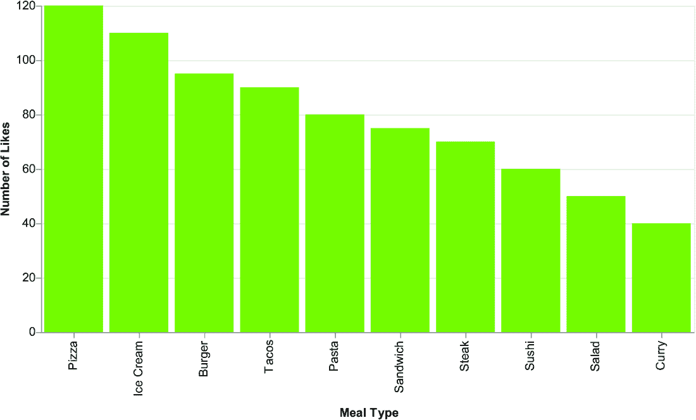
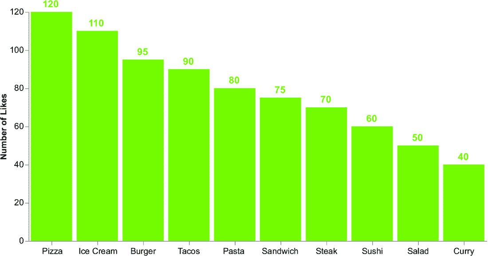
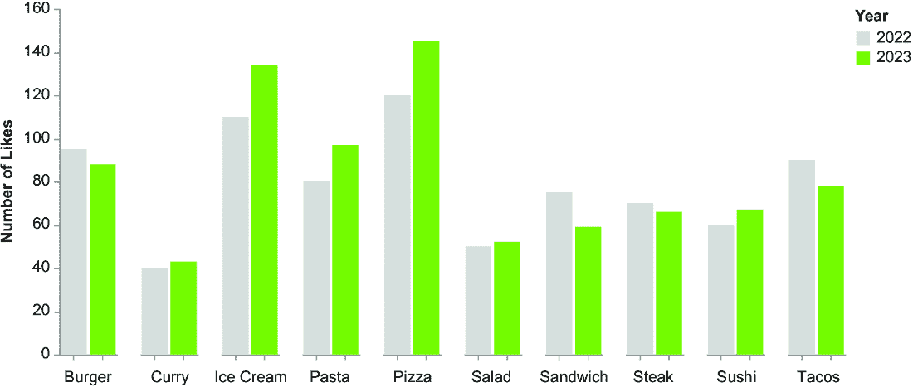
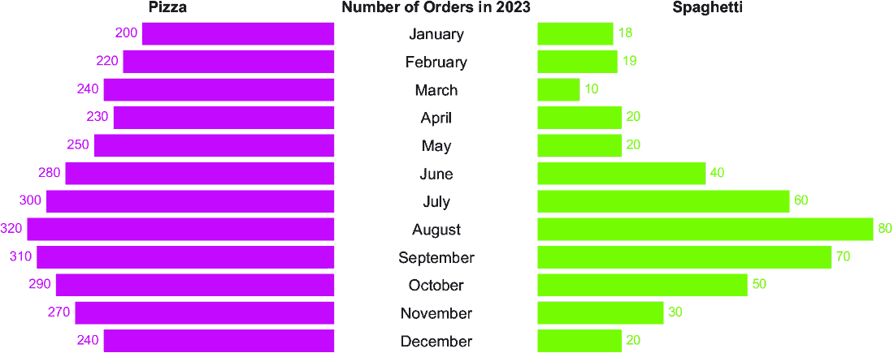
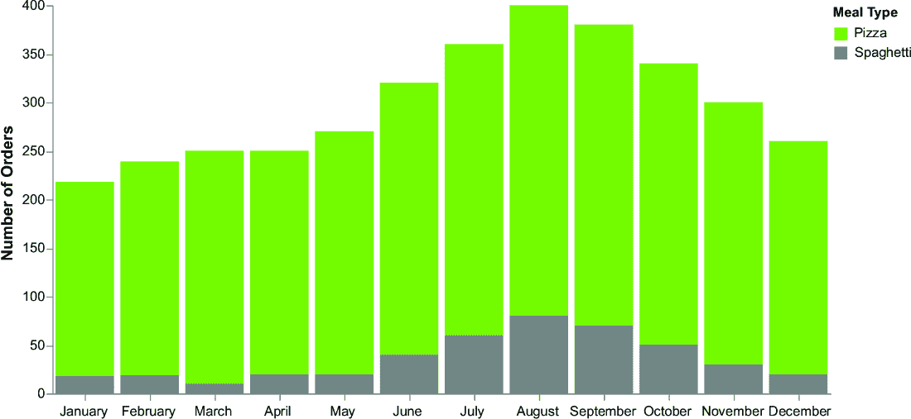
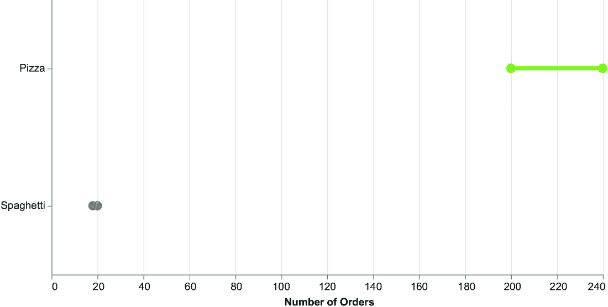

# 附录 C 其他图表类型

本附录描述了第六章未涵盖的一些最流行的图表。如果您想尝试新的图表，请将其作为参考。图表的代码在本书的 GitHub 仓库中描述，位于 06 目录下，此外还有其他不太流行的图表。让我们分别研究每种图表类型，从烹饪图表系列开始。

## C.1 环形图

环形图是一种圆形数据可视化类型，以环形形状显示数据。它与饼图类似，但中心有一个洞，创建了一个不同类别的比例或百分比的视觉表示。

将饼图转换为环形图，只需将 `innerRadius` 和 `outerRadius` 属性添加到 `mark_arc()` 方法中，如下面的列表所示。

##### 列表 C.1 生成环形图的代码

```py
import pandas as pd
import altair as alt

data = {
    'percentage': [0.7,0.3], 
    'label'     : ['70%','30%'], 'color'     : ['#81c01e','lightgray'] **}

df = pd.DataFrame(data)

chart = alt.Chart(df).mark_arc(
    innerRadius=100,
    outerRadius=150
).encode( 
    theta='percentage',
    color=alt.Color('color', scale=None),
    tooltip='label'
).properties(
    width=300,
    height=300
)**
```

****注意  在 Altair 中生成饼图的代码。使用 `innerRadius` 和 `outerRadius` 将饼图转换为环形图。

如果您的环形图比较两个值，并且只想关注其中一个值，请将此值添加到环形图的中心，如图 C.1 所示。


##### 图 C.1 Altair 中的环形图，中心有标签

请 Copilot 生成环形图内的标签。

##### 列表 C.2 生成环形图内标签的提示

```py
# Add text to the center of the donut chart
# - Use df.head(1) to get the first row of the dataframe
# - Use the `label` column for text channel
# - Use the `color` column for color
```

注意  为 Copilot 生成环形图内标签的指令顺序。

下面的列表显示了生成的代码。

##### 列表 C.3 Copilot 生成的代码

```py
text = alt.Chart(df.head(1)).mark_text(
    align='center',
    baseline='middle',
    fontSize=60,
    fontWeight='bold'
).encode(
    text='label',
    color=alt.Color('color', scale=None)
).properties(
    width=300,
    height=300
)
```

注意  更改 `fontSize` 属性以增加或减少标签大小。

从数据故事讲述的角度来看，您可以连接多个环形图，如图 C.2 所示，以显示多个百分比值，例如，关于餐厅顾客喜欢哪些餐点的问卷调查结果。总百分比大于 100%，因为顾客可能喜欢多种餐点。


##### 图 C.2 显示问卷调查输出的多个环形图

在这个场景中，累计总百分比可能不是必需的。然而，值得注意的是，其他业务视角可能需要这样的要求。现在您已经学会了如何在 Altair 和 Copilot 中绘制烹饪图表，让我们继续到下一系列的图表：柱状图系列。

## C.2 柱状图系列

柱状图系列包括柱状图、多系列柱状图、金字塔图、堆积柱状图、100% 堆积柱状图和直方图。让我们更仔细地看看。

### C.2.1 柱状图

柱状图类似于条形图，但轴是倒置的；它在 x 轴上显示类别，在 y 轴上显示值。由于 x 轴也用于表示时间数据，因此您可以使用柱状图将时间段作为类别来描述。下面的列表显示了如何绘制柱状图。同时，将图表宽度增加到 600，为每个柱子留出更多空间。

##### 列表 C.4 创建柱状图的代码

```py
import pandas as pd
import altair as alt

chart = alt.Chart(df).mark_bar(
    color='#81c01e'
).encode(
    x=alt.X('Meal Type', sort='-y'),
    y='Number of Likes'
).properties(
    width=600,
    height=300
)

chart.save('column-chart.xhtml')
```

备注：反转`x`和`y`通道。同时，更改`sort`属性值。

图 C.3 表示生成的柱状图。



##### 图 C.3 柱状图

柱状图的 x 轴显示旋转的标签。此外，x 轴标题是不必要的。让我们开始清理。首先，在 Visual Studio Code 编辑器中格式化代码，然后写上注释`#` `Rotate`，如图 C.4 所示。Copilot 将建议如何完成句子。按 Tab 键，将 45 度改为 0 度，然后按 Enter 键，然后 Copilot 将在你的注释下方的一行添加所需的代码（`axis=alt.Axis(labelAngle=0),`）。


##### 图 C.4 如何在代码中添加注释。Copilot 将建议下一步。

接下来，在`labelAngle=0`后添加一个逗号，并开始写单词`title`。Copilot 会建议`=None`。按 Tab 键确认。这个 Copilot 属性很棒！你可以在代码的任何位置添加注释，并请求 Copilot 为你生成新的代码！由于 Copilot 是一个生成式 AI 工具，可能在你的情况下，建议的提示可能不同。无论如何，你可以轻松地调整 Copilot 建议的代码以满足你的需求。

现在，让我们清理 y 轴。通过将`y='Number' 'of' 'Likes'`通道更改为`y=alt.Y('Number' 'of' 'Likes',axis=alt.Axis(grid=False))`来移除 y 轴。然后，在每根柱子的顶部添加点赞数。让我们使用 Copilot 来完成这项工作。开始写下以下文本：`#` `Add` `a` `text` `mark` `to` `the` `chart` `with` `the` `following` `options:.` Copilot 将建议下一步。通过按 Tab 键和 Enter 键确认。在某个时候，Copilot 将停止建议。按 Enter 键，Copilot 将为你生成代码。测试生成的代码。如果不满足你的要求，请手动更改它，或者再次使用 Copilot。在我的情况下，我不得不稍微改变 Copilot 的注释，以便生成所需的代码。以下列表显示了 Copilot 的指令。

##### 列表 C.5 Copilot 生成的提示并稍作修改

```py
# Add a text mark to the chart with the following options:
# - Use the `Number of Likes` column for y channel
# - Use the `Meal Type` column for x channel and sort by the number of likes
# - Set the color of the text to '#81c01e'
# - Set the text to the `Number of Likes` column
# - Set the font size to 14
# - Set the font weight to 600
# - Set the text baseline to 'center'
# - Set the text align to 'middle'
# - Set the y offset to 10
```

备注：请求 Copilot 生成在每根柱子顶部绘制标签的代码。

以下列表描述了生成的代码。

##### 列表 C.6 Copilot 生成的添加标签的代码

```py
text = alt.Chart(df).mark_text(
    color='#81c01e',
    fontSize=14,
    fontWeight=600,
    baseline='middle',
    align='center',
    dy=-10
).encode(
    x=alt.X('Meal Type',
            sort='-y',
            axis=alt.Axis(labelAngle=0,title=None),
    ),
    y='Number of Likes',
    text='Number of Likes'
)
```

备注：使用`mark_text()`方法在每根柱子顶部添加标签。设置文本属性，包括颜色、字体大小、粗细等。

最后，合并这两个图表。

##### 列表 C.7 合并图表以构建最终图表

```py
# Combine the bar chart and text mark into a single chart.
chart = chart + text

chart = chart.configure_view(
    strokeWidth=0
)

chart.save('column-chart.xhtml')
```

备注：编写提示 Copilot 生成合并图表的代码。

图 C.5 显示了最终的图表。



##### 图 C.5 清理后的柱状图

现在你已经学会了如何在 Altair 和 Copilot 中清理柱状图，让我们继续到下一个图表。在下一节中，我们将介绍具有多个系列的柱状图。

### C.2.2 具有多个系列的柱状图

到目前为止，我们只使用一个数据系列实现了柱状图（以及条形图）。然而，在许多情况下，您可能想要比较两个或多个数据系列。在这种情况下，您必须将 `column` 通道添加到您的图表中。考虑表 C.1 中显示的数据集，描述了 2022 年和 2023 年每种餐食类型的点赞数。

##### 表 C.1 包含两个数据系列的样本数据集，一个用于 2022 年，另一个用于 2023 年

| **餐食类型** | **2022 年点赞数** | **2023 年点赞数** |
| --- | --- | --- |
| **披萨**  | 120  | 145  |
| **汉堡**  | 95  | 88  |
| **意大利面**  | 80  | 97  |
| **寿司**  | 60  | 67  |
| **Salad**  | 50  | 52  |
| **牛排**  | 70  | 66  |
| **Tacos**  | 90  | 78  |
| **冰淇淋**  | 110  | 134  |
| **Curry**  | 40  | 43  |
| **Sandwich**  | 75  | 59  |

下面的列表描述了构建多系列柱状图的代码。

##### 列表 C.8 如何创建多系列柱状图

```py
import pandas as pd
import altair as alt

df = pd.read_csv('data/meals-by-year.csv')        #1

df = df.melt(id_vars=['Meal Type'],var_name='Year',value_name='Number of Likes')

chart = alt.Chart(df).mark_bar(
).encode(
    x=alt.X('Year', 
            # Rotate the labels by 0 degrees
            axis=alt.Axis(title=None, labels=False)
    ),
    y=alt.Y('Number of Likes',axis=alt.Axis(grid=False)),
    column=alt.Column('Meal Type',
                      header=alt.Header(
                          labelOrient='bottom',
                          title=None
                      )),
    color=alt.Color('Year',scale=alt.Scale(range=['lightgray','#81c01e']))
).properties(
    width=50,
    height=300
).configure_view(
    strokeWidth=0
)

chart.save('multiple-column-chart.xhtml')
```

#1 将数据文件 data/meals.csv 载入 pandas DataFrame。

注意：使用 `column` 通道将多个系列添加到您的图表中。默认情况下，柱状图将柱标签添加到图表顶部。要将它们移动到底部，请在 `alt.Column()` 通道中设置 `header` 属性。

图 C.6 显示了生成的图表。现在您已经学会了如何实现具有多个系列的柱状图，让我们继续下一个图表：金字塔图。



##### 图 C.6 具有多个系列的柱状图

### C.2.3 金字塔图

*金字塔图*由两个背靠背的条形图组成，两侧代表对比类别，如男性和女性。水平轴表示数量，垂直轴显示比较的类别——通常是时间段。考虑表 C.2 中显示的数据集，描述了 2023 年 1 月至 12 月披萨和意大利面的订单数量。

##### 表 C.2 2023 年 1 月至 12 月披萨和意大利面的订单数量样本数据集

| **月份** | **披萨** | **意大利面** |
| --- | --- | --- |
| 一月 | 200  | 18  |
| 二月 | 220  | 19  |
| 三月 | 240  | 10  |
| 四月 | 230  | 20  |
| 五月 | 250  | 20  |
| 六月 | 280  | 40  |
| 七月 | 300  | 60  |
| 八月 | 320  | 80  |
| 九月 | 310  | 70  |
| 十月 | 290  | 50  |
| 十一月 | 270  | 30  |
| 十二月 | 240  | 20  |

折线图由三个主要元素组成：左侧部分、中间部分和右侧部分。左侧和右侧部分是条形图，左侧部分是颠倒的。中间部分则包含两个条形图的标签。我们不会为 Copilot 生成代码编写提示。相反，我们将使用它提出的建议，并直接展示生成的代码，而不提供 Copilot 建议的截图。我建议您尝试编写代码以实验 Copilot 的功能。

下面的列表描述了构建金字塔图左侧部分的代码，重点关注披萨。

##### 列表 C.9 如何创建金字塔图的左侧部分

```py
import pandas as pd
import altair as alt

# Load data data/orders.csv as a Pandas dataframe.
df = pd.read_csv('data/orders.csv')

months = [
    "January", "February", "March", "April",
    "May", "June", "July", "August",
    "September", "October", "November", "December"
]

left_base = alt.Chart(df).encode(
    y=alt.Y('Month:N', axis=None, sort=months),
    x=alt.X('Pizza:Q', title='',sort=alt.SortOrder('descending'), axis=None),
)

left =  left_base.mark_bar(
    size=20,
    color='#c01e95'
).properties(
    title='Pizza',
    width=300,
    height=300
)

left_text = left_base.encode(
    text=alt.Text('Pizza:N'),
).mark_text(
    color='#c01e95',
    baseline='middle',
    align='right',
    dx=-10,
)
```

注意：构建基础图表（`left_chart`），然后使用它来构建柱状图和标签。将 `x` 通道中的 `sort` 属性设置为 `descending` 以将柱状图锚定在右侧。此外，在 `mark_text()` 方法中将 `align` 属性设置为 `right`。

现在，让我们构建金字塔图的中间部分。这部分包含标签。以下列表显示了代码。

##### 列表 C.10 如何创建金字塔图的中间部分

```py
middle = alt.Chart(df
).encode(
    y=alt.Y('Month:N', axis=None, sort=months),
    text=alt.Text('Month:N'),
).mark_text(
    size=20,
).properties(
    width=100,
    height=300,
    title='Number of orders in 2023'
)
```

注意：使用 `mark_text()` 设置标签。同时设置 `y` 和 `text` 通道。

最后，让我们绘制金字塔图的右侧部分。使用与左侧图表相同的策略，不排序 `x` 通道。此外，将所有图表组合起来构建最终的图表。以下列表显示了代码。

##### 列表 C.11 如何创建金字塔图的右侧部分

```py
right_base =  alt.Chart(df
).encode(
    y=alt.Y('Month:N', axis=None,sort=months),
    x=alt.X('Spaghetti:Q', title='',axis=None),
)

right = right_base.mark_bar(
    size=20,
    color='#81c01e'
).properties(
    title='Spaghetti',
    width=300,
    height=300
)

right_text = right_base.encode(
    text=alt.Text('Spaghetti:Q')
).mark_text(
    baseline='middle',
    align='left',
    dx=10,
    color='#81c01e'
)

chart = left + left_text | middle | right + right_text

chart = chart.configure_view(
    strokeWidth=0
)
# save chart as 'pyramid-chart.xhtml'
chart.save('pyramid-chart.xhtml')
```

注意：使用 `+` 运算符将每个单独的部分组合起来，使用 `|` 运算符将部分组合在一起。

图 C.7 显示了生成的图表。现在你已经学会了如何构建金字塔图，让我们继续学习下一个图表，即堆叠柱状图。



##### 图 C.7 金字塔图

### C.2.4 堆叠柱状图

*堆叠柱状图* 与传统的柱状图类似，但它们显示了每个数据系列对总值的贡献。使用堆叠柱状图来显示不同因素如何随时间对总值的贡献，或者比较不同数据系列的相对重要性。

让我们使用 Copilot 来绘制一个堆叠柱状图。当然，你已经注意到，当你编写代码时，Copilot 会越来越多地建议与你编程风格相近的代码。因此，当使用 Copilot 时，我们可以尝试一种新的策略：编写通用指令。这种策略假设我们已经使用 Copilot 编写了很多代码。如果我们一开始使用 Copilot 时就使用了通用指令，我们肯定会得到令人失望的结果。以下列表显示了 Copilot 的通用指令。

##### 列表 C.12 Copilot 的通用指令

```py
# Consider the dataset in the file data/orders.csv. 
# The dataset contains information about orders placed by customers in a restaurant. 
# Each row in the dataset represents the number of orders by month. 
# The dataset contains the following columns:
# - `Month`: The month of the year
# - `Pizza`: The number of pizza orders
# - `Spaghetti`: The number of spaghetti orders
# Build a complete stacked column chart in Altair using the dataset.
```

注意：首先，指定数据集结构，然后使用 Copilot 使用描述的数据集构建堆叠柱状图。

以下列表显示了 Copilot 生成的代码。它与之前示例中生成的代码非常相似。

##### 列表 C.13 如何创建堆叠柱状图

```py
import pandas as pd
import altair as alt

# Load data data/orders.csv as a pandas DataFrame.
df = pd.read_csv('data/orders.csv')

df = df.melt(id_vars=['Month'],var_name='Meal Type',value_name='Number of Orders')

# Build a list of months    #1
months = ['January','February','March','April','May','June','July','August',
'September','October','November','December']

chart = alt.Chart(df).mark_bar(
).encode(
    x=alt.X('Month',
            axis=alt.Axis(title=None,
                          labelAngle=0,
            ),
            sort=months
    ),
    y=alt.Y('Number of Orders'),
    color=alt.Color('Meal Type',scale=alt.Scale(range=['#81c01e','gray']))
).properties(
    width=600,
    height=300
).configure_view(
    strokeWidth=0
).configure_axis(
    grid=False
)
chart.save('stacked-column-chart.xhtml')
```

#1 使用此注释告诉 Copilot 构建列表。

注意：在绘制图表之前，使用 `melt()` 方法转换 DataFrame。

图 C.8 显示了生成的图表。现在你已经学会了如何在 Altair 和 Copilot 中构建堆叠柱状图，让我们看看如何将堆叠柱状图转换为 100% 堆叠柱状图。



##### 图 C.8 堆叠柱状图

### C.2.5 100% 堆叠柱状图

一个 *100% 堆积柱状图* 是一个堆积柱状图，其中每个柱子堆叠到 100% 的高度以显示每个类别的比例组成。它用于比较多个数据系列中每个柱子内不同类别的贡献。要将堆积柱状图转换为 100% 堆积柱状图，请在列表 6.4 的 `y` 通道中设置 `normalize=True`：`y=alt.Y('Number of Orders', stack='normalize')`。图 C.9 显示了生成的图表。


##### 图 C.9 一个 100% 堆积柱状图

现在我们已经构建了一个 100% 堆积柱状图。接下来，让我们来介绍条形图家族中的最后一个图表：直方图。

### C.2.6 直方图

一个 *直方图* 表示数值数据的分布，连续数据被分成称为箱子的区间，每个柱子的高度表示落在该箱子内的数据点的频率。使用直方图来可视化数据集的分布并识别模式或异常值。

考虑表 C.3 中描述的样本数据集，显示不同产品的平均评分（评分范围从 1 到 10）。表中只显示了部分产品的值；您可以在本书的 GitHub 仓库中阅读完整数据集，位于 06/bar-charts/data/product-ratings.csv。

##### 表 C.3 具有某些产品平均评分的样本数据集

| **产品 ID** | **评分** |
| --- | --- |
| 产品 _1  | 4.8  |
| 产品 _2  | 5.7  |
| 产品 _3  | 5.3  |
| 产品 _4  | 4.8  |
| 产品 _5  | 5.9  |
| 产品 _6  | 4.0  |
| 产品 _7  | 4.7  |
| 产品 _8  | 5.9  |
| 产品 _9  | 4.0  |

让我们使用 Copilot 绘制一个直方图。思路是指定通用的提示来构建图表框架，然后手动细化图表。以下列表显示了使用的提示。

##### 列表 C.14 构建直方图的通用提示

```py
# Import the required libraries
# Load the 'data/product-ratings.csv' into a dataframe
# Create a histogram of the Rating column using Altair
# Save the chart as a HTML file
```

注意：使用这些提示来加速图表框架的创建。

作为替代，您也可以指定非常详细的提示，就像我们对其他图表所做的那样。在这里，我们想说明生成 Copilot 提示的不同策略。在我们的情况下，生成的代码并不完全正确。我们需要改进它，以产生以下列表中所示的代码。

##### 列表 C.15 构建直方图的代码

```py
chart = alt.Chart(df).mark_bar(
    color='#81c01e'
).encode(
    x=alt.X('Rating:Q',
            bin=alt.Bin(maxbins=10, extent=[1, 10]),    #1
            title='Rating',
            axis=alt.Axis(
                format='d',
            )
    ),
    y=alt.Y('count()', title='Number of Products')
)
```

#1 将 `bin` 属性添加到 Copilot 生成的原始代码中。

注意：使用 `bin` 属性来指定箱子的数量（`maxbins`）及其范围。

为了进行比较，我们可以使用 Altair 提供的 `transform_density()` 方法在我们的数据图表上添加一维核密度估计。

##### 列表 C.16 一维核密度估计

```py
line = alt.Chart(df).transform_density(
    'Rating',
    as_=['rating', 'density'],
).mark_line(
    color='red',
).encode(
    x='rating:Q',
    y=alt.Y('density:Q', axis=None)
)

# Combine the bar chart and the density estimator.
chart = chart + line

chart = chart.resolve_scale(y='independent'
).configure_view(
    stroke=None
).configure_axis(
    grid=False
)

chart.save('histogram.xhtml')
```

注意：使用 `transform_density()` 方法创建核密度估计。此方法接受用于计算的 DataFrame 的 `column` 以及生成的列名（`as_` 属性）。此外，将生成的线与之前的图表结合起来。

图 C.10 显示了生成的图表。


##### 图 C.10 一个直方图

现在，我们已经完成了柱状图家族。接下来，让我们继续前进并分析折线图家族。

## C.3 折线图家族

折线图家族包括面积图、斜率图和哑铃图。以下将依次讨论每个。

### C.3.1 面积图

*面积图*显示了变量随时间累积的趋势。它与折线图类似，但 x 轴和线之间的区域被填充了颜色或图案，以区别于折线图。以下列表显示了如何绘制面积图。

##### 列表 C.17 面积图

```py
import pandas as pd
import altair as alt

# Load data data/orders.csv as a pandas DataFrame.
df = pd.read_csv('data/orders.csv')

df = df.melt(id_vars=['Month'],var_name='Meal Type',value_name='Number of Orders')
# Build a list of months.
months = ['January','February','March','April','May','June','July','August',
'September','October','November','December']

base = alt.Chart(df).encode(
    x=alt.X('Month:N',
            axis=alt.Axis(title=None,
                            labelAngle=0),
            sort=months
    ),
    y=alt.Y('Number of Orders',axis=alt.Axis(offset=-25)),
    color=alt.Color('Meal Type',scale=alt.Scale(range=['#81c01e','gray']),legend=None)
).properties(
    width=600,
    height=300
)

chart = base.mark_area(line=True)

text = base.mark_text(
    fontSize=14,
    baseline='middle',
    align='left',
    dx=10
).encode(
    text=alt.Text('Meal Type:N'),
).transform_filter(
    alt.datum['Month'] == 'December'
)

# Combine the line chart and text mark into a single chart
chart = chart + text

chart = chart.configure_view(
    strokeWidth=0
).configure_axis(
    grid=False
)
chart.save('area-chart.xhtml')
```

注意：与折线图相比，将`base.mark_line()`更改为`base.mark_` `area(line=True)`。使用以下代码将 y 轴转换为与 x 轴对齐：`y=alt.Y('Number of Orders',axis=alt.Axis(offset=-25))`。

图 C.11 显示了生成的图表。在查看面积图之后，让我们来研究斜率图。


##### 图 C.11 面积图

### C.3.2 斜率图

*斜率图*由两组数据点通过一条线连接而成，x 轴代表不同的类别或时期，y 轴代表数据的值。换句话说，斜率图是只有两个点的折线图。以下列表显示了如何构建斜率图。

##### 列表 C.18 斜率图

```py
import pandas as pd
import altair as alt

# Load data data/orders.csv as a pandas DataFrame.
df = pd.read_csv('data/orders.csv')

df = df.melt(id_vars=['Month'],var_name='Meal Type',value_name='Number of Orders')

# Build a list of months.
months = ['January','February','March','April','May','June','July','August',
'September','October','November','December']

base = alt.Chart(df).encode(
    x=alt.X('Month',
            axis=alt.Axis(title=None,labelAngle=0),
            sort=months
    ),
    y=alt.Y('Number of Orders'),
    color=alt.Color('Meal Type',scale=alt.Scale(range=['#81c01e','gray']),legend=None)
).properties(
    width=600,
    height=300
).transform_filter(
    (alt.datum['Month'] == 'December') | (alt.datum['Month'] == 'January')
)

chart = base.mark_line(point=True)

text = base.mark_text(
    fontSize=14,
    baseline='middle',
    align='left',
    dx=10
).encode(
    text=alt.Text('Meal Type:N'),
).transform_filter(
    alt.datum['Month'] == 'December'
)

# Combine the line chart and text mark into a single chart.
chart = chart + text

chart = chart.configure_view(
    strokeWidth=0
).configure_axis(
    grid=False
)
chart.save('slope-chart.xhtml')
```

注意：将`transform_filter()`方法添加到选择系列中第一个和最后一个值。

图 C.12 显示了生成的斜率图。下一张图是哑铃图。让我们继续分析它。


##### 图 C.12 斜率图

### C.3.3 哑铃图

*哑铃图*，或*浮动条形图*，由两个数据点通过一条线连接而成，一个在开始处，一个在结束处。哑铃图类似于斜率图，但通常我们使用哑铃图来比较两个数据点之间的差异。相比之下，我们使用斜率图来比较数据随时间的变化或不同组之间的变化。

图 C.13 显示了哑铃图的示例。你可以在本书的 GitHub 仓库中找到相关的代码。



##### 图 C.13 哑铃图

我们现在已经完成了折线图的回顾。对于其中一些，我们使用了 Copilot，而对于其他一些，我们没有直接指定提示；然而，在所有情况下，Copilot 在编写代码时通过在编写过程中建议新的代码来帮助我们。

注意：折线图最早由苏格兰工程师威廉·普莱费尔在 18 世纪末使用。除了发明折线图外，普莱费尔还引入了其他流行的数据可视化，如柱状图和饼图。他对图形表示的创新使用彻底改变了我们今天展示数据的方式，使他成为数据可视化领域的先驱。

符号

\

[symbol[-]](../Text/chapter-3.xhtml#p118)

100%堆叠柱状图

+运算符, 第二部分

A

add_params() 方法, 第 2 次

受众

Altair, 第 2 次, 第 3 次, 第 4 次, 第 5 次, 第 6 次

案例研究

图表组件

配置, 第 2 次

知识步骤

在 中绘制基本图表

参考文献

回顾基本概念

坐标轴部分

AI (人工智能)

AI (人工智能): 生成式 AI 工具: ChatGPT, 提示结构: 定义任务

AI (人工智能): 生成式 AI 工具: ChatGPT, 提示结构: 扮演角色

坐标轴

Vega

Abela, Stephen

AI (人工智能): 生成式 AI 工具: ChatGPT, 提示结构: 适应受众

alt.condition() 方法

alt.Color() 通道

主动交互

alt.X() 对象

算法偏差

B

binding_range() 方法, 第 2 次

base.mark_line() 方法

带类型

Baer, Michael

条形图

大数据分析

binding_select() 方法, 第 2 次

C

柱状图

configure_axisY() 方法

颜色属性

Comet

资源选项卡

运行按钮

保存 & 缩略图

在 中包含交互式图表

概述

利弊

slider.xhtml 文件

条件, 第 2 次

颜色, 第 2 次

设置

在 Altair 中的设置

角色, 第 2 次

复合图表, 第 2 次

克隆仓库

使用 GitHub Desktop

图表

选择

在 Altair

行动号召

复杂的数据探索分析

configure_axis()方法, 第 2 次, 第 3 次, 第 4 次

烹饪图表系列

chat.completions.create()方法

图表注释

configure_view()方法

上下文

添加

文本

视觉上下文, 第 2 次

configure_*()方法

changeColor 参数

分类, 第 2 次

configure_axisX()方法

configure_title()方法

案例研究

无家可归者

ChatGPT（生成式预训练变换器）

提示结构, 第 2 次

颜色列

确认来源

在 Altair

在主图表下

在下一步骤下

在标题或副标题下

ChatOpenAI()函数

类别列

 choropleth 地图

D

德克，本

描述场景

数据探索

数据集

点密度图

饼图

数据源

DIKW（数据、信息、知识、智慧）金字塔, 第 2 次, 第 3 次, 第 4 次, 第 5 次, 第 6 次, 第 7 次, 第 8 次

使用数据故事制作, 第 2 次, 第 3 次

虚假新闻示例, 第 2 次

信息

模型，添加行动号召

参考文献

将数据转化为信息

将信息转化为知识

div

dt 变量, 第 2 次

数据部分, 2nd

数据叙事

DIKW（数据、信息、知识、智慧）金字塔

概述, 2nd

当 Altair 和生成式 AI 工具不适用时

数据故事

DIKW 金字塔, 2nd

发布, 2nd

在 Altair 中运行

数据可视化，参考资料

点图

发散色板

使用数据叙事创建仪表板

域参数

DALL-E（OpenAI）

数据叙事弧

数据

Vega

Vega-Lite

转化为信息, 2nd

数据偏差

E

练习, 2nd

EDA（探索性数据分析）

参考资料

进入块

编码, 2nd

Vega-Lite

在 Altair 中

嵌入

情感

添加到图像

提取洞察

巧合策略, 2nd

连接策略

矛盾

好奇心

编码部分

encode() 方法

F

字段变量, 2nd

格式参数

虚假新闻案例研究

微调

手动构建

feedparser 库

G

groupby() 方法

地理地图

group_by() 函数

等级列

GitHub Copilot, 2nd, 3rd

计算百分比增长

描述场景, 2nd

安装

加载数据集并清洗

在运行数据故事, 第 2 次

生成式 AI 工具, 第 2 次

DALL-E, 第 2 次

编辑图片工具

人工智能

案例研究, 第 2 次

深度学习

生成式 AI

风景, 第 2 次

机器学习, 第 2 次

使用 Copilot 构建 Altair 图表组件, 第 2 次

生成式 AI（人工智能）

使用时常见问题

引用来源, 第 2 次

使用指南

幻觉、偏见和版权, 第 2 次

纳入 DIKW 金字塔

参考文献

GitHub 仓库, 第 2 次

克隆仓库, 第 2 次

H

直方图

高能量情感

高情绪情感

幻觉

人机交互验证

HYPERLINK \l , 第 2 次, 第 3 次, 第 4 次, 第 5 次, 第 6 次, 第 7 次, 第 8 次

标题属性

水平连接

href 通道

无家可归的故事, 第 2 次, 第 3 次

图表, 第 2 次

图片

演示

副标题

隐藏层

I

交互式图表

innerRadius 属性, 第 2 次

信息

提取见解, 第 2 次

转化为知识, 第 2 次

索引

见解提取, 第 2 次, 第 3 次

图片

使用 DALL-E 进行, 第 2 次

输入层

交互性, 第 2 次, 第 3 次, 第 4 次

Vega-Lite

下拉菜单

设置

isnull() 方法

interactive() 方法

Image.create_edit() 方法

J

JavaScript 代码

K

知识

将信息转化为, 第 2 次, 第 3 次

转化为智慧

Knaflic, Cole Nussbaumer

Klein, Gary

L

低能量情绪

左图

分层

LLMs (大型语言模型)

包装器

层，Vega-Lite

低落情绪

折线图

面积图

哑铃图

分层部分

标签列

M

mark_bar() 方法, 第 2 次

mark_text() 属性

Matplotlib，与 Altair 比较

mark_arc() 函数

mark_arc() 方法

Milligan, Donald

mark_image() 函数, 第 2 次

mark_rule() 方法

mark_text() 方法, 第 2 次, 第 3 次, 第 4 次, 第 5 次, 第 6 次

messages 关键字

多系列柱状图

mark_line() 函数, 第 2 次, 第 3 次

标记部分, 第 2 次

mark_bar() 函数

墨卡托投影地图

melt() 方法

mark_line() 方法, 第 2 次, 第 3 次, 第 4 次

标记, 第 2 次

Vega

在 Altair 中

mark_rule() 函数

标记，Vega-Lite

mark_line() 属性，第 2 次

mark_hex() 方法

mark_text() 函数，第 2 次，第 3 次，第 4 次，第 5 次，第 6 次

测量偏差

mark_geoshape() 标记

melt() 函数

N

消极情绪

颜色和大小

图像

下一步

放置，第 2 次

游泳池案例研究

北美人口案例研究

评论数量列

N-1 行

订单数量列

NLP (自然语言处理)

O

openai.File.create() 方法

OPENAI_API_KEY 环境变量

openai.ChatCompletion.create() 方法

安装 OpenAI API

OpenAIEmbeddings() 对象

输出层

P

pip install <package_name 命令

Python Altair，使用的好处，第 2 次

提示

提示工程

饼图

被动交互

产品类别列

pwd 模块

提示模板

PANDAS MELT() 函数

金字塔图

比例符号地图

properties() 方法，第 2 次，第 3 次

params，第 2 次

pandas DataFrame

从 CSV 文件构建

从字典构建

概述

产品评分列

ppi (每英寸像素)

params 关键字

PromptTemplate() 对象

发布数据故事

Power BI，第 2 次

导出故事

PDFMinerLoader() 函数

Python

安装包

pandas DataFrame, 2nd, 3rd

积极情绪

先决条件

Product_id 列

呈现数据故事

Q

定量数据

定量数据类型

定性颜色调色板

R

参考文献, 2nd, 3rd

嵌入

其他

工具和库

RecursiveCharacterTextSplitter() 对象

RAG (检索增强生成)

添加注释

检索接口

重复图表

repeat() 函数

rect 类型

reset_index() 方法

reset_index() 函数

回归

返回列

resolve_scale() 方法

报告，在 Comet 中

范围参数

S

鲑鱼养殖案例研究, 2nd, 3rd

信号部分

滑块

符号类型

大小, 2nd

图表大小

字体大小

设置

Streamlit

方案参数

主题

堆叠柱状图

分享，案例研究

顺序颜色调色板

strokeWidth 通道

体育学科案例研究

st.Title() 函数

信号关键词

样式

单故事图表

监督学习

刻度部分

通过幻灯片讲述故事

st.slider() 函数

selection_point() 方法, 2nd

斜率图

体育

添加基线

添加强制图像

突出显示前两个

T

transform_filter()方法, 第 2 次, 第 3 次, 第 4 次

文本上下文

调整故事以适应观众, 第 2 次

微调, 第 2 次

检索增强生成, 第 2 次, 第 3 次

使用大型语言模型进行上下文

使用 ChatGPT 进行评论和注释的文本, 第 2 次

文本到文本工具

终端，克隆仓库

Tableau

top P 参数

温度参数

标题属性

文本到图像工具

TitleParams()函数

transform_density()方法, 第 2 次

配置标题

文本到代码工具

技术要求

配置 ChatGPT

配置 DALL-E

安装 Chroma

安装 LangChain

to_file()方法

三幕结构

文本注释

工具提示

标题，下一步

transformers 引用

U

无监督学习

更新属性

UnstructuredHTMLLoader()对象

功利主义

更新块

unique()方法

V

视觉上下文

案例研究, 第 2 次

情感, 第 2 次

战略定位, 第 2 次

VSC (Visual Studio Code)

向量数据库

视图配置

可视化语法, 第 2 次

渲染 Vega 或 Vega-Lite 可视化

Vega-Lite

概述, 第 2 版

Vega

概述, 第 2 版

参考文献

垂直连接

W

撰写报告，使用数据讲故事

智慧

定义, 第 2 版

良好的判断力

将知识转化为, 第 2 版, 第 3 版

将 ChatGPT 作为经验来源使用

福利

WCAG (Web 内容可访问性指南)

X

x 通道, 第 2 版
