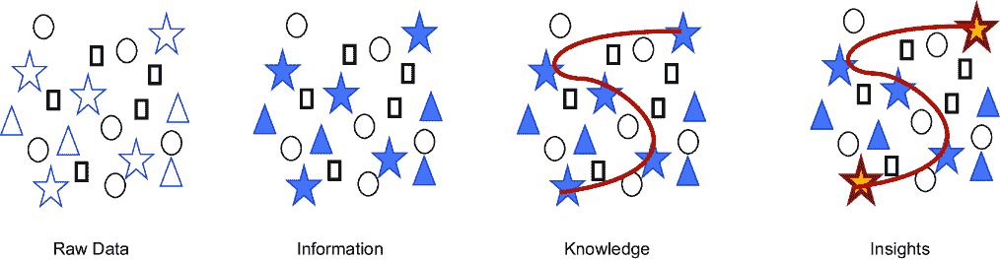
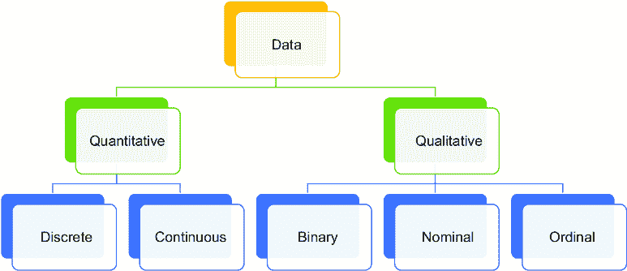
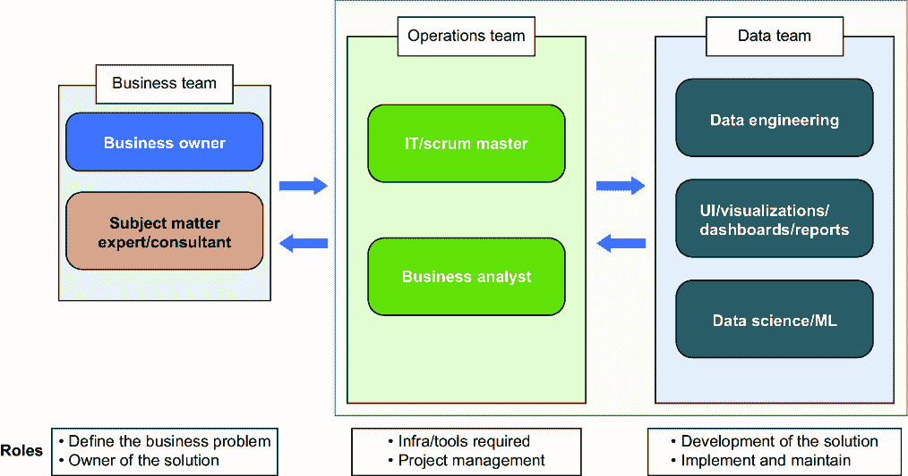
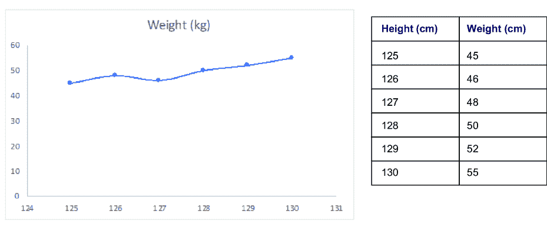
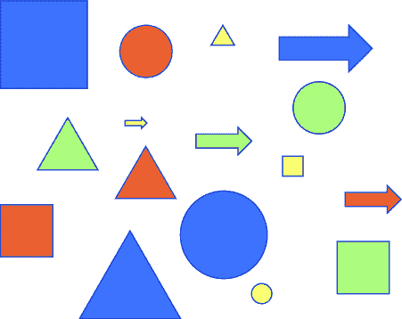
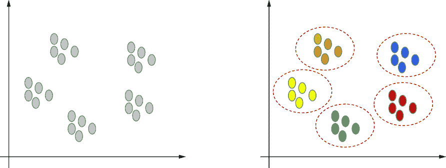
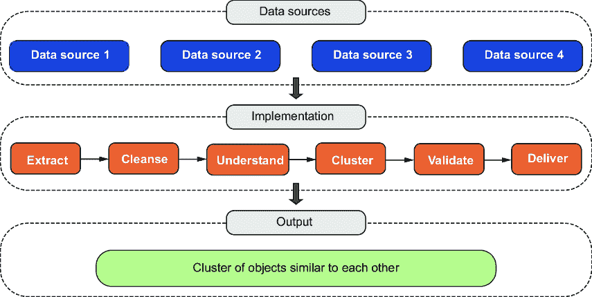
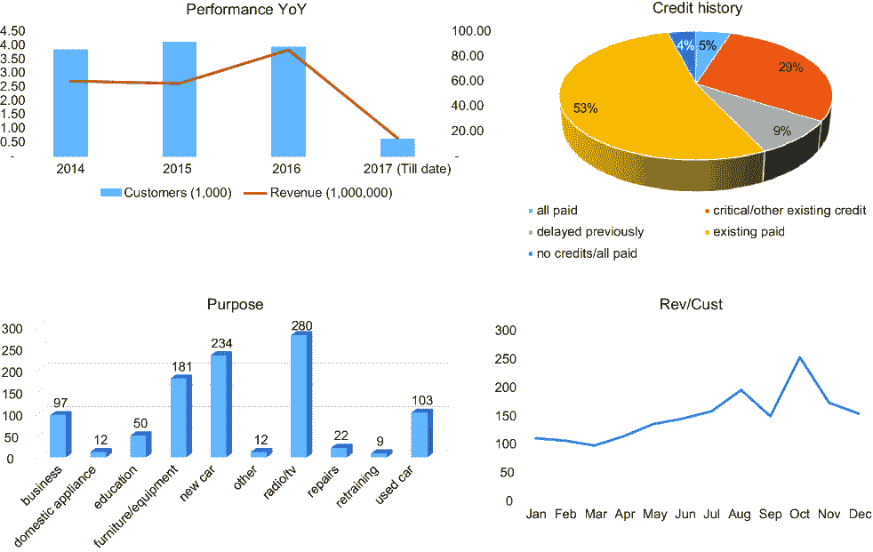
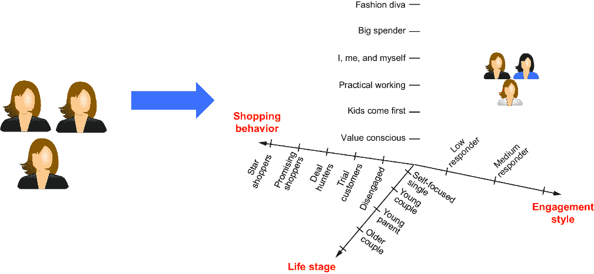

# 第一章：机器学习简介

### 本章涵盖

+   数据、数据集类型、质量和来源的介绍

+   机器学习和机器学习算法类型

+   不同类型算法的概述

> 只存在模式，模式之上的模式，影响其他模式的模式。被模式隐藏的模式。模式中的模式。——查克·帕拉纽克

有一种说法在流传：“数据是新的电力。”数据确实正在改变我们的世界，就像电力一样；没有人能否认这一点。但就像电力一样，我们必须记住，数据必须得到适当的利用才能发挥其价值。我们必须清理数据、分析和可视化它，然后才能从中发展出洞察力。数据科学、机器学习（ML）和人工智能领域正在帮助我们更好地利用数据，提取趋势和模式，以便我们能在我们的活动和业务中做出更深入和平衡的决策。

在这本书中，我们将解开数据的谜团，看看我们如何找到隐藏在其中的模式。我们将研究被称为*无监督学习*的机器学习的一个分支。无监督学习解决方案是最有影响力的方法之一，正在改变行业的面貌。它们被用于银行和金融、零售、保险、制造、航空、医学科学、电信以及几乎每个其他行业。

在整本书中，我们将侧重于无监督学习来讨论机器学习的概念——算法的构建块、它们的细节、后台过程和数学基础。我们将检查概念、研究最佳实践、分析常见错误和陷阱，并采用基于案例研究的方法来补充学习。同时，我们将开发实际的 Python 代码来解决这些问题。所有代码都附有逐步解释和注释。

当你完成这本书时，你将对基于无监督技术的机器学习、各种算法、算法所依赖的数学和统计基础、商业用例、Python 实现和最佳实践有一个非常好的理解。

这第一章旨在介绍机器学习的概念。我们将从讨论所有数据分析与机器学习的基础概念开始：数据本身、数据的管理方式以及构成高质量数据的要素。然后，我们将转向在机器学习和深度学习的背景下讨论数据分析，考虑不同类型的机器学习算法，并以考虑为实际操作本书内容所推荐的工具集来结束。欢迎来到第一章，并祝您一切顺利！

## 1.1 技术工具集

以下工具用于项目的不同方面：

+   *数据工程*——Hadoop、Spark、Scala、Java、C++、SQL、Redshift、Azure、PySpark

+   *数据分析*——SQL、R、Python、Excel

+   *ML*——SQL、R、Python、Excel、Weka、Julia、MATLAB、SPSS、SAS

+   *可视化*——Tableau、Power BI、Qlik、COGNOS

+   *模型部署*—Docker、Flask、Amazon S3

+   *云服务*—Azure、AWS、GCP

在这本书中，我们将使用 Python。建议你在系统上安装 Python 的最新版本。至少建议使用 3.5+版本，尽管截至本书写作时的最新版本是 3.13。我们还将使用 Jupyter Notebook，因此建议你在系统上安装 Anaconda。

注意：所有代码和数据集都将存放在 GitHub 仓库中：[`github.com/vverdhan/DataWithoutLabels`](https://github.com/vverdhan/DataWithoutLabels)。你被期望复制它们并尝试重现结果。

## 1.2 数据、数据类型、数据管理和质量

我们首先介绍本书的主角：*数据*。数据可以被看作是为了执行任何类型的分析或研究而收集的事实和统计数据。但数据也有其自身的特性、属性、质量指标和管理原则。它被存储、导出、加载、转换和度量。从这个意义上说，数据在其自身范围内是一个有形的“东西”，并且必须妥善处理才能正确利用它。为了做到这一点，我们必须正确理解数据。

让我们从基础开始：数据的定义。一旦我们定义了数据，我们将继续讨论不同类型的数据、它们的相应示例以及使数据有用和高质量的数据属性。

### 1.2.1 什么是数据？

数据无处不在。你使用移动网络打电话；在这个过程中，你正在生成数据。你预订即将到来的假期机票和酒店；数据正在被创建。我们日常活动生成的数据可能包括进行银行交易、浏览社交媒体或在网上购物。这些数据从一种形式转换成另一种形式，被存储、清理、管理和分析。那么，它实际上是什么呢？

正式来说，数据是一系列事实、观察、度量、文本、数字、图像和视频的集合。数据集可能是干净的（即，组织得没有错误、不一致和不相关信息）或不干净的，可能是有序的（例如，按字母顺序）或无序的，或者包含混合的数据类型或全部是同一类型。正如提到的，数据本身在没有经过清理、整理、分析和从中提取见解之前是没有用的。我们可以在图 1.1 中可视化从原始数据到更有用形式的转变。

##### 图 1.1 我们如何将原始数据转换为信息、知识，最终成为可用于商业以驱动决策和行动的见解

当我们能在数据中找到区别时，原始数据就转化为信息。当我们关联术语并“连接点”时，同一块信息就变成了知识。洞察力是我们可以找到主要中心和重要点的阶段。一个洞察力应该是可操作的、简洁的、直接的。例如，如果一个电信运营商的客户保留团队被告知，九天未打电话的客户比打电话的客户有 30%更高的流失率，这将是一个他们可以着手解决的有用洞察力。同样，如果一个制造工厂的线路技术人员被告知，使用模具 X 比使用模具 Y 导致 60%更多的缺陷，他们将来将避免使用表现不佳的模具。洞察力对业务团队非常有用，因为他们可以考虑到它并采取纠正措施。

### 1.2.2 各种类型的数据

正如我们之前讨论的，数据是由我们日常生活中的许多活动产生的。我们可以将这些数据大致分为不同的*类型*，如图 1.2 所示。

##### 图 1.2 数据的划分和细分

数据可以分为定量和定性类别，这些类别进一步细分为子类别：

+   *定性数据*是那种无法测量或称重的数据类型——例如，味道、颜色、气味、健康、名称等。它们只能主观地观察。正式地说，当我们对某物进行分类或为其做出分类时，产生的数据就是定性的。例如，彩虹中的颜色、一个国家中的城市、产品的质量、性别等。它们也被称为*分类变量*。定性数据可以进一步细分为二元、名义和有序数据集：

    +   *二元数据*，正如其名所示，只有两个相互排斥的类别。例如，是/否、干/湿、硬/软、好/坏、真/假等。

    +   *名义数据*可以描述为一种类型的数据，尽管被分类，但没有任何顺序或顺序。例如，一个国家中使用的不同语言、彩虹中的颜色、提供给客户的各类服务、一个国家中的城市等。

    +   *有序数据*与名义数据相似，但我们可以在一个序列中对其进行排序。例如，快/中/慢、积极/中性/消极等。

+   *定量数据*是所有可以测量、称重、缩放、记录等的数据点类型。例如，身高、收入、客户数量、需求量、面积、体积等。它们是最常见的数据形式，允许进行数学和统计操作。定量数据进一步细分为离散和连续：

    +   *离散数据*是精确的、直接的，并以整数表示。例如，飞机上的乘客数量或一个城市的总人口不能是小数。

    +   *连续*数据点可以取任何值，通常在一个范围内。例如，身高可以取小数值，或者产品的价格不必是整数。

任何数据点通常都会根据其属性落入这些类别之一。还可以通过来源和使用方式进一步进行一种逻辑分组，这在解决商业问题时非常有意义。这种分组使我们能够设计出针对数据类型的定制化解决方案。

根据来源和使用方式，我们还可以将数据分为两大类：结构化数据和非结构化数据。可以轻松表示为行列结构的数据集是*结构化*数据集。例如，一家零售店五名客户的交易可以像表 1.1 所示那样存储。

##### 表 1.1 一个具有金额、日期、城市、项目等属性的示例结构化数据集。

| 客户 ID | 交易日期 | 金额（$） | 项目数量 | 支付方式 | 城市 |
| --- | --- | --- | --- | --- | --- |
| 1001  | 01-June-2024  | 100  | 5  | 现金  | 新德里  |
| 1002  | 02-June-2024  | 101  | 6  | 卡  | 纽约  |
| 1003  | 03-June-2024  | 102  | 7  | 卡  | 伦敦  |
| 1004  | 04-June-2024  | 103  | 8  | 现金  | 都柏林  |
| 1005  | 05-June-2024  | 104  | 9  | 现金  | 东京  |

在表 1.1 中，对于每个唯一的客户 ID，我们有交易日期、花费的美元金额、购买的项目数量、支付方式和交易发生的城市。这种数据类型可以扩展到员工详情、通话记录、银行交易等。

注意：在分析和模型构建中使用的多数数据是有结构的。结构化数据更容易存储、分析和以图表和图形的形式可视化。

许多算法和技术针对结构化数据——在正常现实世界的语言中，我们主要指的是结构化数据。非结构化数据不容易排序到行列结构中。它可以是有文本、音频、图像或视频。图 1.3 显示了非结构化数据及其相应的来源，以及非结构化数据的主要类型：文本、图像、音频和视频及其示例。

##### 图 1.3 非结构化数据及其各种类型和示例。这类数据通常复杂，通常需要基于深度学习的算法。

计算机和处理器只理解二进制数。因此，这些非结构化数据点仍然需要以数字的形式表示，以便我们可以在其上进行数学和统计计算。例如，一张图片由像素组成。如果是一张彩色图片，每个像素将具有 RGB（红、绿、蓝）值，每个 RGB 可以取值（0–255）。因此，我们可以将图片表示为一个矩阵，可以在其上进行进一步的数学计算。文本、音频和视频可以类似地表示。

注意：一般来说，卷积神经网络（CNN）和循环神经网络（RNN）等基于深度学习的解决方案用于非结构化数据。我们将在本书的后续阶段研究文本，并探讨 CNN 和 RNN。

通过一个例子可以理解非结构化数据：考虑一个吸尘器的图片，如图 1.4 所示。图像的一部分可以表示为一个矩阵，看起来就像图中的矩阵。这个例子只是为了说明目的，并不显示实际值。

##### 图 1.4 如何将非结构化数据表示为矩阵以进行分析的示例。右侧的矩阵仅是示意，并非实际数字。

同样，我们可以有文本、音频或视频数据的表示。由于这类数据通常具有较大的尺寸和大量的维度，这种非结构化数据处理和建模比较复杂，因此，通常基于深度学习的模型可以满足这一需求。

除了我们之前讨论的广泛类型的数据外，我们还可以有更多类别，如比率或刻度，可以用来定义一个变量与另一个变量的关系。所有这些数据点（无论是结构化还是非结构化）都是根据它们在现实生活中的生成方式来定义的。

所有这些数据点都需要被捕捉、存储和管理。有许多工具可用于管理数据，我们将在适当的时候讨论。但在那之前，让我们检查一个最关键但通常讨论较少的主题：*数据质量*。

### 1.2.3 数据质量

“垃圾输入，垃圾输出”——这一原则总结了高质量数据的重要性。如果数据是脏的或错误的，并且变量之间缺乏任何业务关系，我们就无法解决手头的业务问题。但“高质量”的含义是什么？想象一下，你想根据去年的每日降雨量预测今年的降雨量。为此任务，一个高质量的数据集应该是尽可能完整的（非常少的降雨量测量缺失日）。它应该是相关和有效的（例如，覆盖你预测的同一地区），测量应该是准确的，数据应该容易访问和使用，而无需处理权限问题。相反，一个差劲的数据集可能有很多“漏洞”，可能在远离你希望研究地点的地区进行测量（使其相关性降低），或者可能难以访问。正如你可以无疑地推断出的，高质量数据有助于产生高质量的结果，而差的数据质量会积极阻碍你的工作，并可能导致结果不佳。数据质量的主要组成部分如图 1.5 所示。让我们逐一探讨它们。

##### 图 1.5 数据质量至关重要；展示了高质量数据的属性。

良好质量数据的重大属性包括

+   *完整性*—我们希望我们的数据集是完整的，不缺少任何值。例如，如果我们正在处理一年的销售数据，良好的数据将包含所有 12 个月的所有值。然后它将是一个完整的数据源。数据集的完整性确保我们没有遗漏重要的变量或数据点。

+   *有效性*—数据的有效性是指其符合我们在用例中分析存在的属性、特征和变化。有效性表明我们捕获的观察和测量是否可靠和有效。例如，如果研究的范围是 2015-2019 年，那么使用 2014 年的数据将是无效的。

+   *准确性*—准确性是一个关注数据正确性的属性。如果我们有不准确的数据，我们将生成不准确的见解，行动将出错。一个好的做法是在项目开始时生成关键绩效指标（KPIs），并将它们与业务报告的数字进行比较，以检查我们可用的数据的真实性。

+   *代表性*—这是数据最重要的属性之一，通常也是最受忽视的。数据的代表性意味着正在使用的数据真正捕捉到业务需求，并且没有偏见。如果数据集有偏见或代表性不足，生成的模型将无法对新数据和未见数据做出预测，整个努力将付诸东流。

+   *可用性*—数据不可用是我们经常面临的一个挑战。对于商业问题，数据可能不可用，然后我们面临是否继续使用用例的困境。有时我们面临运营挑战，无法访问数据库或存在权限问题，或者由于未捕获，特定变量的数据可能根本不可用。在这种情况下，我们必须使用可用的数据并使用代理变量。例如，假设我们正在处理一个需求生成问题。我们希望预测在即将到来的销售季节中，特定商店可以预期有多少客户。但我们没有记录过去几个月访问的客户数量。然后我们可以使用收入作为代理字段并综合缺失的数据点。

+   *一致性*—在这里，我们检查数据点是否在系统和接口之间保持一致。不应该出现一个系统报告不同的收入数字，而另一个系统显示完全不同的值的情况。面对这样的问题时，我们将根据可用的数据生成相应的 KPIs，并寻求业务团队的指导。

+   *及时性*—及时性简单地说就是我们现在拥有所有所需的数据。如果数据集现在不可用，但将来可能会可用，那么等待可能是明智的。

+   *完整性*——我们所拥有的数据表和变量是相互关联和相互关联的。例如，员工的详细信息可能分布在多个表中，这些表通过员工的 ID 相互链接。数据完整性解决了这一需求，并确保所有此类表与相应实体之间的关系都是一致的。

数据质量至关重要。在务实的日常业务中，我们往往得不到高质量的数据。由于多种挑战，高质量、干净、可访问、一致、具有代表性且完整的数据很少找到。

质量下降可能是由于数据捕获和收集、导出或加载、转换等过程中的挑战。以下是一些可能性：

+   我们可以在一些列中获取整数作为名称，或者像“#$!&”这样的特殊字符，或者某些值可能是空值、空白或非数字（NaN）。

+   记录中可能有重复项。

+   可能会出现异常值。这是我们经常需要处理的一个麻烦。例如，假设一个在线零售商的平均每日交易量是 1,000。有一天，由于服务器问题，没有进行任何交易。这是一个异常情况。或者，有一天，交易量达到了 1,000,000。这又是一个异常的例子。异常值可能会偏颇我们创建的算法。

+   可能存在关于一天中的时间和一周中的日子的季节性变化和移动——所有这些都应该在数据集中有足够的代表性。

+   日期格式的不一致性可能导致我们在尝试合并多个数据源时遇到多个挑战。例如，源 1 可能使用 DD/MM/YYYY，而另一个可能使用 MM/DD/YYYY。这已经在数据加载步骤中得到了处理。

所有这些异常和质量问题都应该得到解决并彻底清理。我们将在整本书中解决这些数据问题，并分享应遵循的最佳实践。

注意：您原始数据的质量以及清理过程中的严谨性直接影响到您最终分析的质量和解决方案的成熟度。

我们现在已经定义了数据的主要属性。接下来，我们将研究用于数据工程和管理的广泛流程和技术。

### 1.2.4 数据工程和管理

强大的数据工程流程和成熟的数据管理实践是成功机器学习模型解决方案的先决条件。无论您来自数据工程还是数据科学背景，两者都相辅相成；数据工程师通过了解数据科学的基础知识将受益匪浅，反之亦然。图 1.6 提供了一个高级概述，说明了工程流程和管理实践可能的样子。数据从捕获、数据管道到加载，直到准备分析的全过程都被描述了。

##### 图 1.6 数据工程为数据分析铺平了道路。它涉及数据加载、转换、丰富、清洗、准备等，从而产生了适合分析的数据。

在数据工程步骤中，数据被清洗、规范、重塑、转换和摄取。通常，我们有一个服务器，最终数据托管在那里，并准备好供访问。最常用的过程是创建一个导出、转换、加载（ETL）过程。然后我们使数据准备好进行分析。我们创建新的变量，处理空值，用方法丰富数据，然后最终进入分析/模型构建阶段。

许多时候，我们发现像数据分析、数据科学、机器学习、数据挖掘、人工智能、商业智能、大数据等术语在商业中经常被互换使用。明确它们是一个好主意，这也是下一节的主题。针对我们讨论的每个相应功能，都有大量的工具可用。我们还将了解软件工程在整个过程中的作用。

## 1.3 数据分析、机器学习、人工智能和商业智能

机器学习（ML）和人工智能（AI）是相对较新的领域，因此，它们的工作范围在标准化和区分上很少。这导致了这些领域的定义和界限不明确。我们考察了这些领域——它们的重叠部分、差异部分以及一个如何增强另一个。每个功能都增强并补充了另一个，如图 1.7 所示。

##### 图 1.7 各个领域如何相互联系以及它们如何相互依赖

在业务问题被正确定义和范围界定之后，我们开始技术流程。数据挖掘和数据工程通过提供分析所需的数据来启动整个过程。它还导出、转换、清洗和加载数据，以便所有相关功能都可以使用。商业智能和可视化使用这些数据生成报告和仪表板。数据分析使用数据生成洞察和趋势。数据科学建立在数据分析、统计学、商业智能、数据可视化、机器学习和数据挖掘的基础上。机器学习创建统计和数学模型，而人工智能进一步扩展了这些能力。

机器学习使用传统的编码。编码是在传统语言（如 Python）中进行的，因此计算机科学和软件工程的逻辑和规则在机器学习中同样有效。机器学习帮助我们理解我们通常无法理解的数据。机器学习最迷人的优势是它能够处理非常复杂和高维度的数据点，如视频、音频、图像、文本或由传感器生成的复杂数据集。它使我们能够超越显而易见的事物。现在，人工智能可以完成以前被认为不可能的壮举。这种模式识别和学习水平导致了自动驾驶汽车、像人类一样交谈的聊天机器人、语音转文本转换和翻译到另一种语言、自动批改论文、照片标题等技术的突破。随着生成式人工智能的出现，使用像 ChatGPT 这样的大型语言模型，我们可以根据用户提供的提示创建图像、视频和文本。而这只是开始！

## 1.4 机器学习的要点

考虑这样一个例子：如果一个孩子需要学习如何开门，我们会多次展示给他确切的步骤。孩子尝试开门但失败了。他们再次尝试，但再次失败。但随着每一次后续尝试，孩子都会改进他们的方法。经过一段时间，孩子就能打开门了。另一个例子是我们学习开车：我们犯错，从错误中学习，并改进。机器学习的工作方式与此类似，其中统计算法分析历史数据，寻找模式和洞察力。算法揭示关系和异常、趋势和偏差、相似性和差异性——然后与我们分享可操作的结果。

正式来说，机器学习（ML）可以称为计算机算法的一个分支或研究领域，它通过分析历史数据来生成洞察力，并帮助进行数据驱动的决策。这些算法基于统计学和数学基础，因此具有坚实的逻辑解释。机器学习算法需要编码，这可以在任何可用的语言和工具中进行，例如 Python、R、SPSS、SAS、MATLAB、Weka、Julia、Java 等。它还需要对业务领域的理解。

无论何时你在网上购物买衣服，网站推荐与之搭配的配饰，或者你预订机票，旅行运营商根据你的需求和计划展示定制套餐，大多数情况下，机器学习在幕后工作。它已经学会了你的偏好，并将它们与你的历史趋势进行比较。它还在寻找与其他行为几乎相同的客户之间的相似性。基于所有这些分析，算法为你做出智能推荐。是不是很神奇？

为什么机器学习在发现模式方面如此出色？我们人类只能同时分析两个或三个维度；例如，我们可以在两个或三个相互作用的变量之间发现模式。但如果所有 50 个不同的变量都在相互作用呢？我们就不会有机会。机器学习算法可以同时处理 50、60 或可能 100 多个维度。它可以处理任何类型的数据，无论是结构化还是非结构化，并且可以帮助自动化任务。因此，它生成的模式和洞察对于人类思维来说相当难以可视化。

机器学习（ML）就像任何其他项目一样，需要一个紧密合作并相互补充技能的专家团队。如图 1.8 所示，一个 ML 项目需要以下角色：

+   *业务团队*—业务利益相关者和领域专家为项目定义业务问题。他们拥有解决方案，对需求有清晰的理解，并有一个明确可衡量的目标。在出现困惑时，他们指导团队进行方向调整，并作为对业务流程和运营有深刻理解的专家。他们是市场营销经理、产品负责人、流程工程师、质量专家、风险分析师、投资组合负责人等。从第一天开始，业务利益相关者必须紧密融入团队。他们帮助调整整体方向。

+   *运营团队*—这个团队包括 Scrum 大师、项目经理、业务分析师等。团队的角色可以与典型的项目管理团队相比较，该团队跟踪进度、维护记录、报告日常活动，并确保整个项目按计划进行。他们创建用户故事，并在业务团队和数据团队之间充当桥梁。

##### 图 1.8 数据科学项目所需的团队及其相互之间的互动——真正是一个团队的努力

+   *数据团队*—创建解决方案、进行编码并以模型、仪表板、报告和洞察的形式生成输出的核心团队是数据团队。它由三个主要支柱组成：数据工程团队、UI/可视化团队和数据科学团队。他们的职能如下：

    +   数据工程团队负责构建、维护、集成和摄取所有数据点。他们进行定期数据刷新，并作为数据的主要保管人。他们使用 ETL、SQL、AWS、Kafka、PySpark 等。

    +   UI/可视化团队负责构建仪表板、报告、交互模块和 Web 应用程序。他们使用 SQL、Tableau、Qlik、Power BI 和其他工具。

    +   数据科学团队负责所有的数据分析建模任务。他们发现模式和见解，测试假设，并生成最终输出，最终将被所有人消费。最终输出可以是一个用于解决业务问题的 ML 模型。在 ML 模型不可能的情况下，团队可能会生成对业务有用的可操作见解。这个团队需要 SQL、Python、R、SAS、SPSS 等来完成他们的工作。

    +   DevOps 团队通常是数据工程团队的一部分，或者它们可以作为一个独立的实体存在。他们专注于 ML 模型的运营化。记住：如果你的 ML 模型没有被使用，它只是放在架子上的一块闪亮的软件。UI/UX 团队将领导最终产品层的开发，其中基于 ML 的输出将呈现给最终用户。用户体验往往被忽视，没有互动和吸引人的用户体验，ML 将无法发挥其全部潜力。

团队有时还有一个测试团队来评估功能、各种用例以及应用程序的整体外观和感觉。

在讨论了数据科学项目的典型团队结构之后，我们现在将检查数据科学项目中涉及的广泛步骤。

数据科学项目就像任何有截止日期、阶段、测试、阶段等的项目一样运行。原材料是数据，它通过各个阶段，被清理、分析并建模。

图 1.9 展示了数据科学项目阶段的一个示意图。它从项目的业务问题定义开始。业务问题必须简洁、清晰、可衡量和可实现。表 1.2 描述了一个不良（定义不明确）和良好的业务问题的例子。

##### 图 1.9 数据科学项目就像任何其他项目一样，有阶段和截止日期、依赖关系和流程。

##### 表 1.2 如何定义业务问题以使其清晰、简洁和可衡量的例子

| 例子 |
| --- |
| 定义不明确的业务问题 | 良好的业务问题 |
| --- | --- |

| 提高产量 降低成本

| 优化各种成本头（A、B、C 和 D）并确定最优化组合，在接下来的六个月内降低 1.2%的成本 |
| --- |

| 在一个月内提高 80%的收益 自动化整个流程

| 从流程中各种缺陷因素（X、Y、Z）中，确定最显著的因素，在接下来的三个月内降低 1.8%的缺陷率 |
| --- |

然后我们进入数据发现阶段，在这个阶段，我们列出所有数据源并将它们托管。所有各种数据集，如客户详情、购买历史、社交媒体数据、投资组合等，都被识别和访问。在此步骤中，确定要使用的数据表，并且大多数情况下，我们会创建一个数据库供我们工作、测试和学习。

然后，我们继续进行数据预处理。这包括清除数据，如删除空值、异常值、重复值、垃圾值等。前一步和这一步可能占项目时间的 60%到 70%。

在探索性数据分析阶段，我们创建了一些报告并生成了初步见解。这些见解与业务利益相关者讨论，并指导课程修正。

数据现在已准备好进行建模。测试了相当多的解决方案版本。然后，根据需求，我们选择最佳版本。通常，准确度等参数和精确度、召回率等统计指标驱动着模型的选择。我们将在本书的后续章节中探讨选择最佳模型的过程以及精确度和召回率等术语。一旦我们选择了最终模型，我们就可以在生产环境中部署模型，它将在未见过的数据上工作。

这些是机器学习项目中的基本步骤。像任何其他项目一样，有一个代码库、最佳实践、编码标准、常见错误、陷阱等，我们将在本书中讨论。

## 1.5 机器学习算法类型

机器学习模型影响决策并采用统计方法来解决商业问题。它们在历史数据上工作，并从中发现模式和趋势。原材料是历史数据，这些数据被分析和建模以生成预测算法。可用的历史数据和需要解决的问题类型决定了应采用的机器学习方法。机器学习算法可以大致分为四类：监督学习、无监督学习、半监督学习和强化学习，如图 1.10 所示。我们将详细探讨这四种类型，重点是无监督学习——本书的主题。

你可能在新闻中听说过生成式人工智能（GenAI）。基于 GenAI 的解决方案通常从无监督学习开始，可能包括监督学习或强化学习以专门针对某些任务优化模型。我们将在本书中进一步讨论 GenAI。

##### 图 1.10 机器学习算法可以分为监督学习算法、无监督学习算法、半监督学习算法和强化学习算法。

### 1.5.1 监督学习

正式来说，监督模型是使用输入数据和期望的输出数据来预测未来的统计模型。输出是我们希望预测的值，被称为*目标变量*，用于做出预测的数据被称为*训练数据*。目标变量有时也被称为*标签*。数据中存在的各种属性或变量被称为*自变量*。每个历史数据点或*训练示例*都包含这些自变量和相应的目标变量。监督学习算法对未见过的未来数据进行预测。解决方案的准确性取决于所进行的训练和从标记的历史数据中学到的模式。下一个部分将描述一个例子。

监督学习问题用于需求预测、信用卡欺诈检测、客户流失预测、保费估算等。它们在零售、电信、银行和金融、航空、保险等多个领域以及营销、客户关系管理（CRM）、质量、供应链、定价等功能中被广泛使用。

监督学习算法可以进一步分为回归算法和分类算法。让我们依次考虑这些。

#### 回归算法

回归算法是监督学习算法——也就是说，它们需要需要预测的目标变量。这些算法用于预测*连续*变量的值。例如包括收入、降雨量、交易数量、生产产量等。在监督分类问题中，我们预测一个分类变量，比如是否会下雨（是/否），信用卡交易是欺诈还是真实，等等。这是分类和回归问题之间的主要区别。

让我们通过一个例子来理解回归问题。比如说，我们假设一个人的体重只依赖于身高，而不依赖于其他参数，如性别、种族、饮食等。在这种情况下，我们想要根据身高预测一个人的体重。数据集和为同一数据绘制的图表将类似于图 1.11。

一个回归模型能够找到数据中的内在模式，并拟合一个描述这种关系的数学方程。然后，它可以以身高作为输入来预测体重。在这里，身高是自变量，而体重是因变量或目标变量或我们想要预测的标签。

##### 图 1.11 用于回归问题的身高与体重关系的数据和图表

对于回归问题，有相当多的算法可用。以下是一些主要的算法（尽管这个列表肯定不是详尽的）：

+   线性回归

+   决策树

+   随机森林

+   k-最近邻算法

+   提升算法

+   神经网络

我们可以使用任何算法来解决这个问题。我们将通过使用线性回归来解决问题来进一步探索。

线性回归算法通过假设因变量和目标变量之间存在线性关系来建模因变量和目标变量之间的关系。线性回归算法将为问题产生一个数学方程，如图 1.1 所示：

##### (1.1)

重量 = *β*[0] * 高度 + *β*[1]

通常来说，线性回归用于拟合描述因变量和自变量之间关系的数学方程，如图 1.2 所示：

##### (1.2)

Y = *β*[0] + *β*[1] x[1] + *β*[2]x[2] + ….+ *ε*

在这里，*Y*是我们想要预测的目标变量；*x*[1]是第一个自变量；*x*[2]是第二个自变量；*ε*是方程中的误差项；*β*[0]是方程的截距。

线性回归问题的简单可视化如图 1.12 所示。这里我们有 x 和 Y 变量，其中 x 是自变量，Y 是目标变量。线性回归问题的目标是找到*最佳拟合线*，它可以解释数据中的随机性。

##### 图 1.12 需要建模的原始数据（左侧）。使用回归，确定了最佳拟合线（右侧）。

方程式 1.2 用于对未见数据做出预测。在线性回归中也有多种变化，如简单线性回归、多元线性回归、非线性回归等。根据手头的数据，我们选择正确的算法。复杂的数据库可能需要各种变量之间的非线性关系。

我们将要探索的下一类回归算法是树形解决方案。对于决策树、随机森林等基于树的算法，算法将从顶部开始，然后像`if`/`else`块一样，迭代地分裂以创建节点和子节点，直到我们达到终端节点（见图 1.13）。在决策树图中，我们从顶部的根节点开始，然后执行分裂，直到达到终点，即终端节点。

决策树易于理解和实现，并且训练速度快。它们的可用性在于它们足够直观，无需太多技术背景即可理解。

##### 图 1.13 决策树有一个根节点，在分裂后，我们得到一个决策节点和一个终端节点，这是最终的节点，不能再进一步分裂。

还有其他著名的回归算法，如 k 近邻、梯度提升和基于深度学习的解决方案。不同的回归算法最适合特定的环境。

为了理解回归用例的效果，让我们考虑一些在行业中实施的业务相关用例：

+   一个机场运营团队正在评估人员需求，并希望估计预期的客流量。这个估计将帮助团队制定关于未来资源需求的计划，并有助于优化所需资源。回归算法可以帮助预测乘客数量。

+   一家零售商希望了解即将到来的销售季节的预期需求，以便规划库存。这将导致成本节约并避免缺货。回归算法可以帮助进行此类规划。

+   一家制造厂希望提高现有各种模具和原材料的使用效率。回归解决方案可以建议最佳的模具组合并预测预期的产量。

+   一家银行向其客户提供信用卡。考虑一下为新客户提供信用额度的计算方式。基于客户的属性，如年龄、职业、收入和之前的交易历史，回归算法可以帮助在客户层面建议信用额度。

+   一家保险公司希望根据历史索赔数据为其客户制定一个保费表。风险可以根据驾驶员详情、汽车信息等历史数据来评估。回归分析当然可以帮助解决这类问题。

回归问题构成了监督学习问题的基础，并在行业中得到了广泛的应用。与分类算法一起，它们成为现实世界中大多数预测问题的首选解决方案。

#### 分类算法

分类算法用于预测分类变量的值，该变量是因变量。这个目标变量可以是二元的（如是/否、好/坏、欺诈/真实、通过/失败等）或者多类的（例如正面/负面/中性或是/否/不知道）。分类算法将通过为目标变量生成一个概率分数来确定目标事件是否会发生。

在模型在历史数据上训练完毕后，分类算法将为未见数据集生成一个概率分数，这可以用于做出最终决策。根据目标变量中存在的类别数量，我们的业务决策将有所不同。让我们看看分类问题的用例。

考虑这种情况：一家电信运营商正面临其客户基础减少的问题。现有客户数量正在减少，电信运营商希望阻止这种客户流失。为此，设想了一个机器学习模型。

在这种情况下，用于模型构建的历史数据或训练数据可能看起来像表 1.3。这些数据点仅用于说明目的，并不全面。可能还有许多其他重要的变量可用。

##### 表 1.3 电信运营商的示例结构化数据集，显示多个数据属性

| ID | 收入（$） | 服务时长（年） | 平均成本 | 月使用天数 | 流失（Y/N） |
| --- | --- | --- | --- | --- | --- |
| 1001  | 100  | 1.1  | 0.10  | 10  | Y  |
| 1002  | 200  | 4.1  | 0.09  | 25  | N  |
| 1003  | 300  | 5.2  | 0.05  | 28  | N  |
| 1004  | 200  | 0.9  | 0.25  | 11  | Y  |
| 1005  | 100  | 0.5  | 0.45  | 12  | Y  |

在表 1.3 的例子中，数据集包括订阅者的过去使用数据。最后一列（流失）描述了该订阅者是否从系统中流失。例如，订阅者 1001 流失了，而 1002 没有。因此，业务问题是基于这些历史数据构建机器学习模型，并预测新未见客户是否会流失。

在这里，流失状态（是/否）是目标变量。它也被称为因变量。其他属性，如收入、服务时长、平均成本、月使用量等，是独立变量，用于创建机器学习模型。历史数据被称为训练数据。在模型训练之前，训练好的监督学习模型将为新客户生成预测概率。

对于分类问题，有相当多的算法可用；主要的有以下几种：

+   逻辑回归

+   决策树

+   随机森林

+   k-最近邻

+   Naïve Bayes

+   支持向量机

+   提升算法

+   神经网络

最受欢迎的分类算法之一是逻辑回归。逻辑回归使用对数函数来建模分类问题。如果我们解决的是二元分类问题，它将是二元逻辑回归或多元逻辑回归。与线性回归类似，逻辑回归也拟合一个方程，尽管它使用 Sigmoid 函数来生成事件发生的概率分数。

Sigmoid 函数是一种具有特征 S 形曲线或 Sigmoid 曲线的数学函数。Sigmoid 函数的数学方程式在方程式 3.1 中显示：

##### (1.3)

*S*(*x*) = 1/(1 + *e*^–^(*x*))

这可以重写为方程式 1.4

##### (1.4)

*S*(*x*) = *e*^(*x*)/(*e*^(*x*) + 1)

逻辑回归使用 Sigmoid 函数。逻辑回归问题中使用的方程式在方程式 1.5 中显示：

##### (1.5)

log (p/1 – p) = *β*[0] + *β*[1] x[1]

其中 *p* 是事件发生的概率；*β*[0] 是截距项；*β*[1] 是独立变量 *x*[1] 的系数；log(*p*/1 – *p*) 被称为 logit；(*p*/1 – *p*) 是赔率。如图 1.14 所示，如果我们尝试为概率函数拟合线性回归方程，它将做得不好。我们希望获得概率分数（即介于 0 和 1 之间的值）。线性回归不仅会返回介于 0 和 1 之间的值，还会返回大于 1 或小于 0 的概率分数。因此，我们在图中右侧有一个 Sigmoid 函数，它只为我们生成介于 0 和 1 之间的概率分数。

##### 图 1.14 线性回归模型无法做到公正（左侧）；因此，我们有了逻辑回归来进行分类。线性回归也可以生成大于 1 或小于 0 的概率分数，这在数学上是错误的，而 sigmoid 函数只生成介于 0 和 1 之间的概率分数（右侧）。

逻辑回归算法是分类问题中最广泛使用的技巧之一。它易于训练和部署，并且通常是我们开始任何监督分类学习项目时的基准算法。

基于树的算法，如决策树和随机森林，也可以用于分类问题。其他算法也根据需求使用。

### 1.5.2 无监督算法

想象一下，你被给了一些纸标签，如图 1.15 所示。任务是按相似性排列它们。现在，有多个方法可以解决这个问题。你可以使用颜色、形状或大小。在这里，我们没有任何标签来指导这种排列。这就是无监督算法与众不同的地方。

##### 图 1.15 使用不同参数可以一起分组的各种形状示例

形式上讲，无监督学习只接受输入数据，然后在其中发现模式，而不参考目标变量。因此，无监督学习算法根据数据集中模式的存在与否做出反应。

因此，无监督学习用于模式检测、探索数据集中的洞察力以及理解其结构、细分和异常检测。

我们可以通过查看图 1.16 来理解无监督学习算法。左侧的图显示了以向量空间图表示的原始数据点。右侧是聚类，将使用无监督学习算法来完成。

##### 图 1.16 无监督学习算法在左侧数据中找到模式，并在右侧产生集群。

无监督算法的一些用例如下：

+   一家零售集团希望更好地了解其客户。任务是提高客户的粘性、收入、访问次数、购物篮大小等。在这里可以使用无监督学习进行客户细分。根据客户的属性，如收入、访问次数、最后访问日期、加入以来的年龄、人口统计属性等，细分将产生可以个性化定位的集群。结果将是改善客户体验、增加客户终身价值等。

+   一个网络提供商需要创建一个异常检测系统。历史数据将作为异常数据。无监督学习算法将能够找到模式，算法将给出异常值。需要解决的显著异常将是那些。

+   一家医疗产品公司希望在其患者的图像数据中找到任何潜在的规律。如果有任何模式和因素，这些患者可以得到更好的治疗，也许他们需要不同的方法。无监督学习可以帮助图像数据，这将有助于更好地满足患者的需求。

+   一家数字营销公司希望了解 incoming 客户数据中的“未知”信息，如社交媒体互动、页面点击、评论、星级等。这种理解将有助于改善客户推荐和整体购买体验。

无监督学习算法在寻找模式时提供了灵活性和性能。它们适用于所有类型的数据——本书的核心主题，包括结构化数据、文本或图像。

主要的无监督学习算法包括

+   聚类算法

+   k-means 聚类

+   层次聚类

+   DBSCAN 聚类

+   谱聚类

+   主成分分析

+   单值分解

+   关联规则

+   t-distributed 随机邻域嵌入

+   自动编码器

我们将在接下来的章节中详细介绍所有这些算法。我们将检查数学概念、隐藏过程、Python 实现以及整本书中的最佳实践。让我们首先通过案例研究来了解基本过程。

一家零售商希望对其消费者基础有更深入的了解，然后希望提供个性化的推荐、促销、折扣、优惠等。整个客户数据集应使用如人格、以往购买、响应、外部数据等属性进行细分（见图 1.17）。

##### 图 1.17 无监督学习算法中的步骤，从数据源到最终部署的解决方案

对于用例，无监督学习项目的步骤如下：

1.  我们通过定义业务问题开始项目。我们希望更好地了解客户基础。客户细分方法可以是一个好的解决方案。我们希望使用数学 KPI 区分的细分。

1.  这是数据发现阶段。所有各种数据集，如客户详情、购买历史、社交媒体数据、投资组合等，都被识别和访问。在此步骤中确定要使用的数据表。然后，通常将所有数据表加载到公共数据库中，我们将使用它来分析、测试和学习。

1.  现在我们已经可以访问数据了。下一步是清理它并使其可用。我们处理所有空值、NaN、垃圾值、重复值等。

1.  一旦数据清理完毕并准备好使用，我们就对其进行探索性数据分析。通常，在探索性分析期间，我们识别模式、周期性、异常值、最大最小范围、标准差等。探索性数据分析阶段的输出将是洞察和理解。我们还将生成一些图表，如图 1.18 所示。

1.  我们现在开始使用无监督方法。我们想要实现聚类方法，因此我们可以尝试一些聚类方法，如 k-means、层次聚类等。聚类算法将根据客户的各种属性产生同质化的客户群体。

##### 图 1.18 数据探索性分析中的图表示例

在案例研究中，我们将处理过去两到三年的数据，这些数据是训练数据。由于我们使用的是无监督方法，这里没有目标变量。算法将使用客户的交易模式、人口统计模式和购买偏好来合并表现相似的客户群体。结果将类似于图 1.19 所示。

##### 图 1.19 聚类算法的输出，我们可以使用各种属性来细分客户

1.  6.我们现在检查各种算法的表现；换句话说，我们将比较每个算法的准确性。最终选择的聚类算法将导致客户群体同质化，这些群体可以被定位并提供定制化优惠。

1.  7.我们与业务利益相关者讨论结果，并根据反馈进行迭代。

1.  8.我们将解决方案部署到生产环境中，并准备好处理新的未见数据集。

这些是在无监督问题中的基本步骤。算法创建和选择是繁琐的任务。我们将在本书的后面详细研究这些内容。

GenAI 通常从无监督阶段开始。这个阶段使模型能够在没有明确标签的情况下学习模式、结构和关系。有时也被称为预训练阶段。一旦模型完成预训练，我们就进入监督阶段。在这里，预训练的模型使用标记数据集针对特定任务或领域进行调整。

### 1.5.3 半监督算法

半监督学习是监督和无监督方法之间的中间道路。采用半监督方法的主要原因是缺乏完整的*标记*数据集用于训练。正式地说，半监督方法结合了监督和无监督方法：监督用于分类数据点，无监督用于将它们分组在一起。

在半监督学习中，我们最初使用监督算法在少量标记数据点上训练。然后我们使用它来标记或*伪标记*新的数据点。这两个数据集（标记和伪标记）被合并，我们使用这个数据集进行进一步分析。

半监督算法在数据集部分可用的情况下使用，例如医疗行业中的图像。如果我们通过分析患者的图像来创建癌症检测解决方案，我们可能不会有足够的训练图像样本集。在这种情况下，半监督方法可能是有帮助的。

### 1.5.4 强化学习

想象你正在和一台电脑下棋，过程是这样的：

+   *第一轮*—经过 5 步后你获胜。

+   *第二轮*—经过 8 步后你获胜。

+   *第三轮*—经过 14 步后你获胜。

+   *第四轮*—经过 21 步后你获胜。

+   *第五轮*—电脑获胜！

发生在这里的是，算法根据每次交互迭代地训练自己，然后进行纠正/改进。

形式上，强化学习解决方案是自我维持的解决方案，它使用一系列的尝试和错误来训练自己。一个序列跟随另一个。强化学习的核心是奖励信号。如果动作是积极的，奖励是积极的，表示继续。如果动作是消极的，奖励将惩罚活动。因此，解决方案将始终纠正自己并向前推进，从而迭代地改进自己。

自动驾驶汽车是强化学习算法的最佳例子。它们能够检测何时应该左转或右转，何时移动，何时停车。现代视频游戏也采用了强化学习算法。强化学习使我们能够突破技术的障碍，想象之前被认为不可能的事情。

通过这样，我们已经涵盖了不同类型的机器学习算法。它们共同利用数据的真正力量，并对我们的生活产生持久的影响。但解决方案的核心是技术，我们还没有讨论。我们现在转向制作这些解决方案所需的技术堆栈。

##### 练习 1.1

使用这些问题来检查你的理解：

1.  为什么机器学习（ML）如此强大，以至于现在被广泛使用？

1.  不同的机器学习算法有哪些，它们之间有何不同？

1.  机器学习项目中包含哪些步骤？

1.  数据工程的作用是什么，为什么它很重要？

1.  可用于机器学习的各种工具有哪些？

## 1.6 总结性思考

一个常见的问题是：R 语言和 Python 哪个更好？两者都是优秀的语言。两者都被广泛使用。但是随着 TensorFlow 的引入，Keras 在人工智能领域的库使得平衡略微偏向 Python。

你现在已经在学习无监督机器学习技术的旅途中迈出了第一步。现在是时候总结了。

机器学习和人工智能确实是开创性的。它们正在改变我们的旅行方式、订餐、规划、购物、看医生、订购处方——它们无处不在。机器学习确实是一种强大的能力，正在为未来铺平道路，并且在模式识别、异常检测、定制和任务自动化方面证明比现有的技术堆栈要好得多。自动驾驶、癌症检测、欺诈识别、面部识别、图像标题和聊天机器人只是机器学习和人工智能优于传统技术的几个例子。现在正是进入这个领域的最佳时机。该领域几乎吸引了所有商业功能的投资。该领域在整个范围内创造了数千个就业机会。

同时，该领域缺乏受过培训的专业人士：数据分析师、数据工程师、可视化专家、数据科学家和数据从业者。他们现在都是稀有品种。该领域需要定期供应新的人才，他们将成为未来的领导者，并将做出数据驱动的决策。我们对数据力量的理解还只是触及表面——还有很长的路要走。

在下一章中，我们将更深入地探讨聚类的不监督学习概念。我们将讨论数学和统计基础、实用的案例研究和 Python 实现。讨论包括简单的聚类算法：k 均值聚类、层次聚类和 DBSCAN。在本书的后续章节中，我们将研究更复杂的聚类主题，如高斯混合模型聚类、时间序列聚类、模糊聚类等。

## 摘要

+   数据可以被视为一个相互关联的事实和统计数据集合，用于分析，具有独特的特征，并受特定管理原则的约束。

+   现实世界的活动，如手机通话、在线交易和社交媒体互动，持续产生数据，凸显了其在现代生活中的无处不在。

+   原始数据需要清洗、组织和分析，才能有效地转化为可以驱动商业决策和行动的信息和洞察。

+   数据可以广泛地分为结构化数据集，它们遵循清晰的行列格式，以及非结构化数据集，如文本和图像，它们需要更高级的分析技术。

+   为了分析非结构化数据，我们通常将其转换为数值表示，通常利用深度学习模型，如卷积神经网络（CNNs）和循环神经网络（RNNs）。

+   一个清晰、简洁、可实现且可衡量的商业问题是确保数据科学项目成功的关键步骤。

+   高质量的数据对于可靠的分析至关重要，其特征包括完整性、有效性、准确性、代表性、可用性、一致性、及时性和完整性。

+   有效的数据工程和管理对于准备涉及 ETL 流程和数据清洗等技术分析的数据至关重要。

+   UI/UX 的作用对于确保最终消费者采用和使用至关重要；否则，机器学习将只是放在架子上的一件闪亮的东西。

+   数据分析、机器学习、人工智能和商业智能等相互关联的领域在处理和从数据中提取洞察力方面各自发挥着关键作用。

+   监督学习是一种机器学习方法，它使用现有数据来预测未来的结果，在需求预测和欺诈检测等任务中很常见。

+   监督学习分为回归和分类任务，每个任务都有许多可用的算法来分别建模定量或分类结果。

+   无监督学习算法独立于预定义的目标变量发现数据中的模式和关系，在细分和异常检测等活动中有用。

+   无监督学习算法的变体包括聚类技术和降低数据维度的方法，在模式识别中提供灵活性和性能。

+   半监督学习连接了监督学习和无监督学习方法，在处理部分标记的数据集时非常有效。

+   强化学习涉及通过试错来学习的系统，奖励期望的结果，并应用于动态决策任务，如自动驾驶车辆导航。

+   技术解决方案是现代数据驱动策略的核心，理解技术堆栈对于最大化数据解决方案的效果和好处至关重要。
