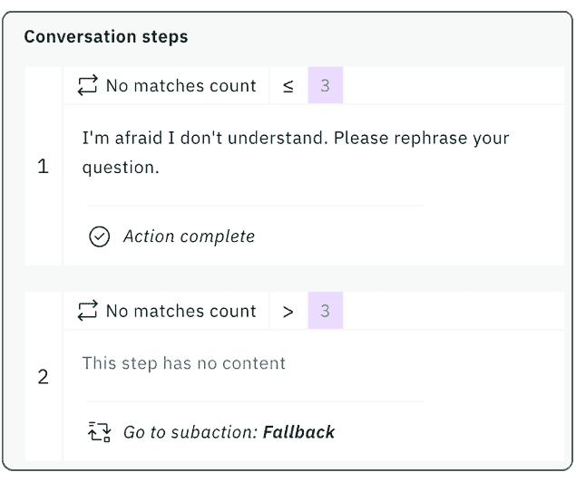
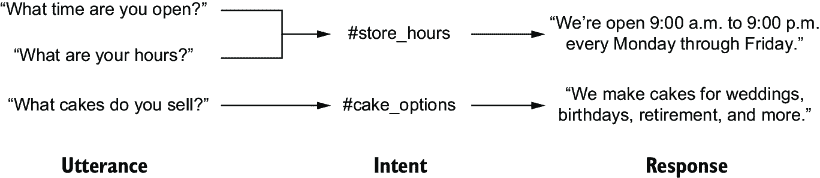
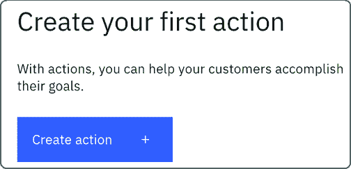
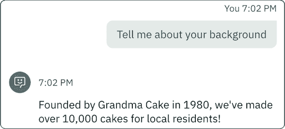
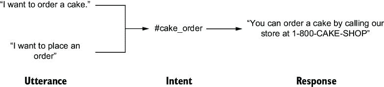
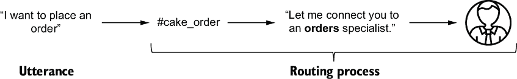
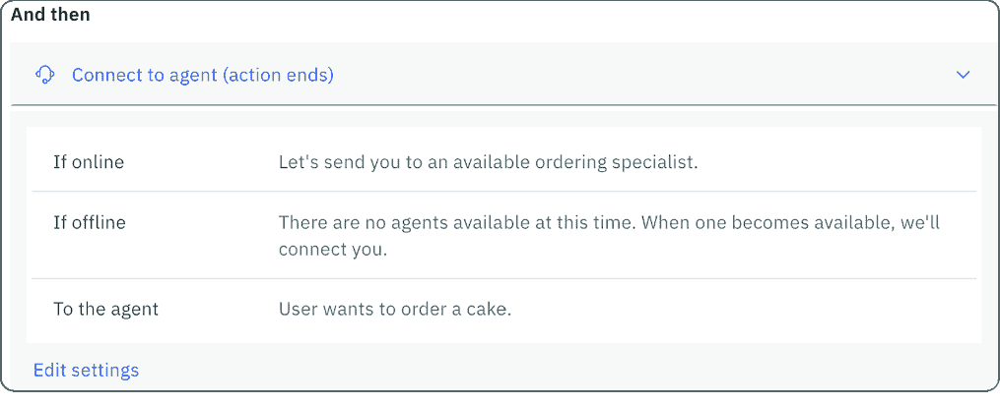
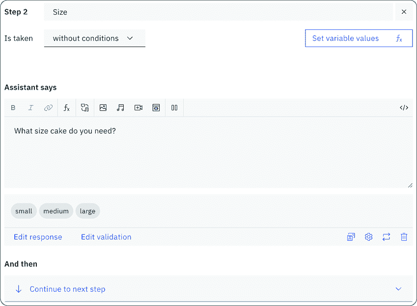
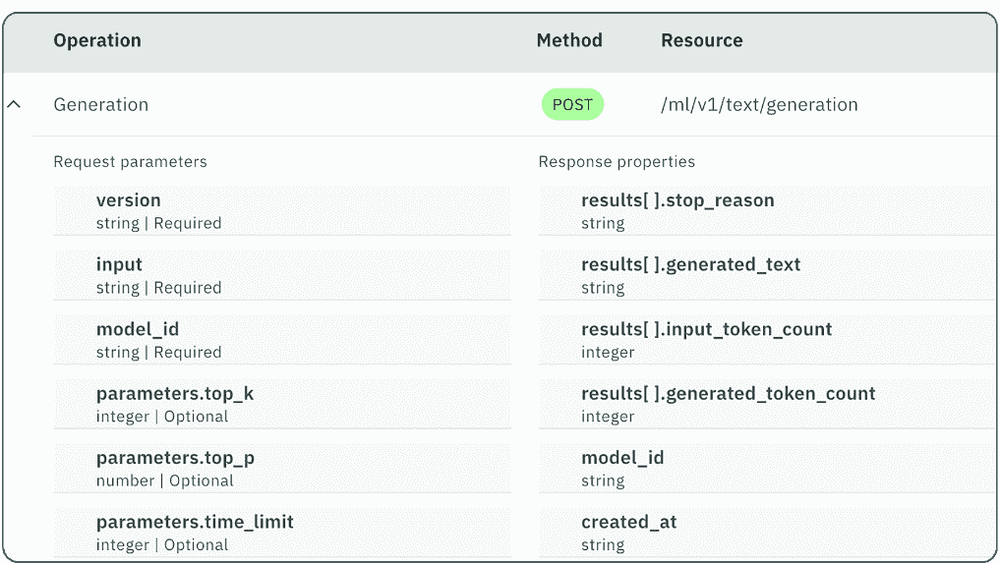
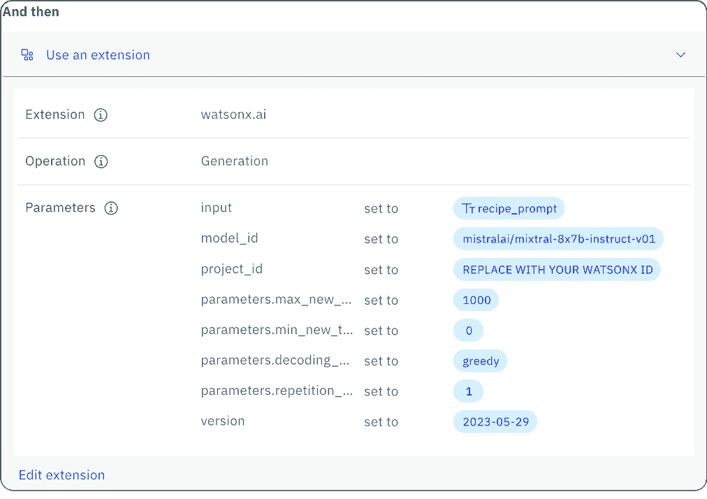

# 第二章：构建对话式人工智能

### 本章涵盖

+   构建 FAQ 对话式人工智能

+   构建面向流程的对话式人工智能

+   在你的对话式人工智能中使用生成式人工智能

在生产中，对话式人工智能可能相当复杂，在本书中，我们将涵盖许多解决你在构建和部署自己的解决方案时面临的现实世界问题的技术。在本章中，我们将构建蛋糕机器人（Cake Bot），这是一个包含几种不同类型对话式人工智能元素的对话式人工智能解决方案。这将为我们理解对话式人工智能结构提供一个坚实的基础。

我们将跟随一家虚构的美国俄亥俄州小面包店——蛋糕店。这家公司制作定制蛋糕，并接受送货或自取订单。他们想在网站上添加一个对话式人工智能解决方案来帮助他们的客户。由于他们以前从未构建过机器人，他们打算从小规模开始，但希望快速扩大解决方案的范围和能力。他们决定从回答他们最常问的问题的人工智能解决方案开始。

本章中的许多任务*可以*使用大型语言模型完成。然而，这个面包店非常谨慎。他们特别希望控制对几种问题类型给出的回答措辞。因此，他们的解决方案将结合传统和生成式技术。

我们将使用对话式人工智能平台（IBM 的 watsonx Assistant）来演示构建过程，稍后我们将整合一个生成式人工智能平台（IBM 的 watsonx.ai）。我们展示的关键概念适用于许多不同的 AI 平台。你可以轻松地使用你选择的对话式人工智能和生成式人工智能平台。

## 2.1 构建 FAQ 机器人

大多数对话式人工智能构建者都是从问题-回答机器人开始的。也称为 FAQ 机器人，这些 AI 解决方案直接对用户的提问给出回答，通常不需要后续问题。用户提问，机器人返回答案，当用户完成提问时，对话结束。这些机器人在只有少数（经常问的）问题时特别有效。

在本节中，我们将为蛋糕店构建一个常见问题解答（FAQ）机器人。有些问题将有静态回答，无论问题如何提出，回答都将相同。其他问题将有动态回答，根据问题中的信息而变化。但在我们对任何问题-回答进行训练之前，我们首先将建立一些基本框架。

### 2.1.1 FAQ 机器人基础

每个对话式人工智能都需要能够开始对话并在不知道如何行动时做出反应。大多数对话式人工智能平台在创建新的聊天机器人时默认提供这种功能。快速检查这些配置并根据您的需求进行调整是值得的。

蛋糕店开始构建他们的对话式人工智能（“助手”），并将其命名为“蛋糕机器人”。从对话式人工智能的主菜单中，他们的开发者导航到“动作”，列出了所有助手的技能。第一个列表标题为“由您创建”，为空；第二个列表标题为“由助手设置”，列出了默认技能，如表 2.1 所示。

##### 表 2.1 新助手的默认技能

| 技能 | 执行时 |
| --- | --- |
| 欢迎客户 | 助手首次打开或互动。打开助手开始对话。 |
| 无匹配动作 | 无法匹配到用户的消息（消息不被理解）。其他平台可能称之为“回退意图”。 |
| 触发词检测 | 检测到侮辱性关键词等。 |
| 回退 | 用户需要离开聊天机器人。 |

第一个功能是最重要的，因为它给了我们第一次定制助手的机会。默认文本是“欢迎，我能帮您什么？”蛋糕店团队将此文本更改为“欢迎来到蛋糕机器人。我能帮您什么？”这是一个最低程度的定制——最好包括额外的信息，比如机器人能为用户做什么。然而，机器人目前还没有任何功能，所以蛋糕店团队保留了这个信息不变。

接下来，应该审查“无匹配动作”动作。当机器人不理解用户时，将调用此动作。由于机器人还没有接受训练，因此此动作将是针对任何用户输入的默认响应。默认配置如图 2.1 所示。



##### 图 2.1 助手中“无匹配动作”的默认配置

此配置总结如下：

1.  动作计数器统计在对话中调用的次数。

1.  如果三次或更少，响应是“恐怕我不理解。请重新措辞您的问题。”

1.  如果四次或更多，它将转向回退程序。（默认回退程序是提供人工代理。）

蛋糕店团队决定通过将 3 改为 1 来降低这个阈值。这样，他们的用户就不会陷入困境。

##### 回退动作和连接到人工代理

大多数对话式人工智能平台都有无代码和低代码集成，可以通过聊天或语音将用户连接到人工代理。我们不会深入探讨这一点，因为细节是平台特定的。只需说，这是一个常见的模式。为了本章的目的，我们将专注于对话设计和人工智能训练。

到目前为止，我们有一个聊天机器人，它能做三件事：

1.  当用户打开聊天时，他们会收到“欢迎来到蛋糕机器人。我能帮您什么？”的问候。

1.  无论他们接下来说什么，聊天机器人都会回应说它不理解。

1.  之后无论他们说什么，聊天机器人都会提供人工代理。

无聊！让我们训练这个机器人来正确回答一些问题。

### 2.1.2 静态问答

让我们从聊天机器人组件的心理模型开始，这些组件参与回答问题。

在某些平台上，你可以直接将问题连接到答案。在其他平台上，引入了一个额外的层来将类似的问题分类到称为 *intents* 的组中。基于意图的问答系统让构建者完全控制由对话人工智能生成的响应。图 2.2 展示了这种设计的通用版本，以 Cake Bot 为例。



##### 图 2.2 问答机器人将用户的 *Utterance* 映射到意图，这些意图映射到答案。

让我们回顾一下这个图中的术语：

+   *Utterance*—这是提供给聊天机器人的输入。对于一个问答机器人，这些是问题。

+   *Intent*—这是具有相似意义的 *Utterance* 的逻辑分组。

+   *Response*—这是聊天机器人的输出。对于一个问答机器人，这些是答案。

对于你的第一个聊天机器人，意图可以节省很多时间。注意，作为一个构建者，你不需要区分意义相似的提问。“你什么时候开门？”和“你的营业时间是什么？”都与你的商店的营业时间有关。对于机器人来说，区分这些并不是关键。我们通过 `#store_hours` 意图给它们相同的“意义”。“你卖什么蛋糕？”有不同的意义，因此有不同的 `#cake_options` 意图。

对于你的机器人服务的每个意图，机器人都会用示例 *Utterance* 进行训练。现代基于意图的系统每个意图只需要五个示例 *Utterance*。这不是一个糟糕的权衡；询问商店营业时间有几乎无限种方式，通过提供一些示例，你可以很好地训练你的机器人。

基于意图的问答系统既是祝福又是诅咒：对于每个你训练的意图，你可以控制响应，这既提供了优点也带来了缺点。

优点：

+   你对响应有完全的设计控制权。你可以编辑它，格式化文本，甚至包括图形元素。你知道响应的确切内容。

+   对于少数意图，这可以快速完成。你可以在不到一个小时的时间内设置你的第一个聊天机器人。

缺点：

+   随着意图数量的增加，训练机器人识别所有这些意图变得更加困难。

+   响应不会适应用户问题的细微差别。对于“你今天开门吗？”这个问题，机器人仍然以通用的方式响应：“我们每天都开门。”

+   不准确或未调优的响应会给用户带来“聊天机器人不理解”的痛苦感觉。

我们将在接下来的几章中解决这些问题问答机器人的几个缺点：如何收集正确的数据来训练你的机器人（第四章），如何使用这些数据来训练更强的意图（第五章），如何通过文档和生成式人工智能的答案来补充这些意图（第六章），以及如何使用生成式人工智能进行更多训练和测试任务（第七章）。

让我们先从训练聊天机器人的第一个问答能力开始。对于每一个，我们需要一个用户意图，一组相关的用户表述，以及一个响应。我们将定义的第一组问题和答案将涵盖蛋糕店的背景，店铺的营业时间，提供的蛋糕种类，蛋糕的大致价格，以及他们的蛋糕俱乐部信息。这些基于意图的问答响应显示在表 2.2 中。

##### 表 2.2 初始 FAQ 意图集，包括相关的表述和响应

| 意图 | 示例表述 | 响应 |
| --- | --- | --- |

| `#background` | 介绍一下蛋糕店，你的业务背景是什么？

蛋糕店历史

| 由蛋糕奶奶于 1980 年创立，我们为当地居民制作了超过 10,000 个蛋糕！ |
| --- |

| `#store_hours` | 店铺营业时间，你的店铺营业时间是什么时候？

你们什么时候开门？

| 我们周一至周五营业，上午 9:00 至晚上 9:00。 |
| --- |

| `#cake_options` | 蛋糕选项，你们制作婚礼蛋糕吗？

你们卖什么种类的蛋糕？

| 我们提供多种场合的蛋糕，如婚礼、生日、周年纪念日、退休和通用场合蛋糕。 |
| --- |

| `#cost` | 蛋糕的价格是多少？有最低订单金额吗？

配送是否有额外费用？

| 我们蛋糕的价格通常在 30 美元左右，加上 5 美元的配送费。 |
| --- |

| `#cake_club` | 蛋糕俱乐部奖励

有任何特别促销或折扣吗？

| 我们的蛋糕俱乐部奖励计划，每购买十个蛋糕，你将获得 10 美元的礼品券。 |
| --- |

在助手中，我们定义了一个检测意图并给出响应的动作——问答动作。这是我们可以在任何对话 AI 平台上定义的最简单类型的动作。图 2.3 显示了开始此动作定义的用户界面。



##### 图 2.3 创建我们第一个动作的用户界面

对于这些动作中的每一个，我们需要配置它们如何开始（用户的表述）以及它们做什么（用答案进行响应）。你会注意到这些是表 2.2 中最右侧的列。一些对话 AI 平台也使用动作的意图标签；我们的标签基于触发它的用户表述之一。我们在图 2.4 中开始定义触发`#background`动作的表述之旅。

注意，用户界面指出，随着更多示例的增加，聊天机器人对该动作的识别将得到改善。为了我们的演示，我们将为每个动作使用三个示例，这足以让我们开始。我们将在后续章节中展示多种找到额外训练示例的方法。

我们的问题-回答动作几乎完成了。我们有了触发它的提问；现在我们需要定义聊天机器人的响应。我们的`#background`动作的响应如图 2.5 所示。这个动作有三个部分：

+   *条件逻辑*——对于静态的问答动作，不需要逻辑。动作仅在检测到意图时开始。

+   *响应*—“助手说”是对用户的响应。我们的响应是简单的文本。

+   *下一步*—对于静态问答动作，不需要下一步。给出答案就结束了动作。


##### 图 2.4 定义触发动作的表述


##### 图 2.5 定义问答动作的响应。最简单的形式在检测到意图后只有一步——给出响应。

我们将为五个意图中的每一个重复这些动作创建步骤。每个动作都通过触发它的示例和它应该给出的响应进行训练。这些动作中的每一个都是一个单步动作，一旦给出答案就结束。

当所有五个动作都创建完成后，我们就准备好进行一些测试了。图 2.6 显示了我们的聊天机器人的测试界面。


##### 图 2.6 聊天预览链接

让我们提出一些问题！图 2.7 显示了样本问题的测试结果。



##### 图 2.7 Cake Bot 的示例问答响应

注意，提出的问题并不完全匹配我们的任何训练示例。这表明机器人已经学会了示例中的含义。以下列表显示了机器人的一些附加测试。

##### 列表 2.1 使用更多问题测试 Cake Bot

```py
User: hours of operation?
Bot: We are open Monday through Friday, 9am to 9pm.
User: why did the chicken cross the road
Bot: I'm afraid I don't understand. Please rephrase your question.
User: cost for a cake?
Bot: Our cakes typically cost around $30, with a $5 delivery fee.
```

这是我们机器人的一个很好的开始。我们可以对更多的意图进行训练，并且可以通过为这些意图提供更多示例来使其更加准确。但让我们考虑一些不同的事情。

我们创建的所有问答动作都是单步动作。无论用户问什么，他们都会得到相同的响应。在下一节中，你将看到如何根据附加信息将静态响应演变成动态响应。

### 2.1.3 动态问答

甜点店目前有四个地点：哥伦布、都柏林、韦斯特维尔和格兰德维尤。当机器人最初创建时，这四个地点的营业时间都是一样的：工作日早上 9:00 到晚上 9:00。情况已经改变——哥伦布的商店需要提前一小时开门和关门（早上 8:00 到晚上 8:00）。单个聊天机器人的响应不再涵盖所有商店。现在当用户询问商店营业时间时，我们需要弄清楚他们需要哪个商店的时间。如果他们没有指定，我们需要问他们澄清问题。

下一个列表显示了我们在一系列样本问题中希望机器人如何处理商店营业时间的问题。

##### 列表 2.2 根据位置存储时间的示例对话

```py
User: hours of operation?  #1
Bot: To view our store hours, please select a location. 
Bot: (Columbus, Dublin, Westerville, Grandview)
User: Columbus 
Bot: Our Columbus store is open Monday through Friday, 8am - 8pm.

User: hours of operation?
Bot: To view our store hours, please select a location.
Bot: (Columbus, Dublin, Westerville, Grandview)
User: Dublin 
Bot: Our Dublin store is open Monday through Friday, 9am - 9pm.

User: hours of operation for Grandview? #2
Bot: Our Grandview store is open Monday through Friday, 9am - 9pm.
```

#1 在回答之前澄清了模糊的问题

#2 明确的问题直接回答

我们还可以绘制一个涵盖这些示例对话的流程图，如图 2.8 所示。当你的对话具有动态性时，创建流程图和示例对话很有帮助。你的团队成员中有些人可能更喜欢图表，有些人更喜欢对话，有些人可能两者都需要。


##### 图 2.8 特定位置的`#store_hours`意图的处理流程

“营业时间”流程可以分三步实现：

1.  显示“要查看我们的营业时间，请选择一个位置”以及位置列表。用户必须选择一个位置。

1.  如果步骤 1 = “Columbus”，显示 Columbus 的营业时间，并结束操作。

1.  显示步骤 1 商店的营业时间，并结束操作。

这是因为在我们的平台上，步骤是“逐级传递”的。以下是一些对话的工作方式：

+   用户输入“营业时间”，步骤 1 被触发。用户选择“Columbus”，步骤 2 被触发并完成操作。

+   用户输入“营业时间”，步骤 1 被触发。用户选择“Grandview”，步骤 2 的条件未满足。步骤 3 被触发并完成操作。

+   用户输入“Columbus 的营业时间”。步骤 1 的退出条件得到满足，因此步骤 2 被触发并完成操作。

+   用户输入“Grandview 的营业时间”。满足步骤 1 的退出条件，但步骤 2 的条件未满足。步骤 3 被触发并完成操作。

图 2.9 展示了这些步骤在我们助手中的实现方式。


##### 图 2.9 `#store_hours`动作的三个步骤

Cake Bot 起步良好。它可以回答一些关于蛋糕店的基本问题，甚至还有一些活力。奶奶蛋糕不必再在电话上回答那么多的重复问题！但 Cake Bot 目前还不能为用户执行任何操作。我们将在下一节中探讨这一点。

##### 练习

1.  从本书的 GitHub 网站下载本章的聊天机器人代码：[`github.com/andrewrfreed/EffectiveConversationalAI`](https://github.com/andrewrfreed/EffectiveConversationalAI)。在 watsonx Assistant 中加载聊天机器人，并使用预览面板测试聊天机器人的问答流程。

1.  或者，在您首选的对话 AI 平台上实现 Cake Bot：

    +   定义一个问候消息。

    +   定义一个回退意图和/或回退消息。

    +   实现表 2.2 中的五个意图。

## 2.2 路由代理和面向过程的机器人

并非所有机器人都是问答机器人。问答机器人擅长提供答案，但如果用户需要的不仅仅是答案——如果他们需要机器人执行操作呢？对于蛋糕店来说，我们希望顾客能够通过机器人订购蛋糕。如果我们只有问答能力，那么图 2.10 就是我们能做的最好了。



##### 图 2.10 Cake Shop 的蛋糕订购流程作为问答。但这实际上并没有真正回答问题！

用户想要完成一个流程，但无法在机器人内部完成。他们只能获得如何完成流程的*说明*。因此，问答机器人通常是更强大解决方案的早期迭代。

### 2.2.1 路由代理

蛋糕店提供各种不同口味和装饰选项的蛋糕。有婚礼、毕业典礼、生日等活动的装饰套餐。有香草、巧克力、草莓等口味选择。此外，还有支付和配送方式。考虑到所有这些选项，合理地假设用户可能想要或需要与人类讨论这个过程。

对于许多聊天机器人开发者来说，他们聊天机器人的下一个逻辑迭代是路由代理。路由代理从用户的表述中检测意图，并确定谁最能帮助满足这个意图。图 2.11 重新构想了我们带有路由代理功能的蛋糕机器人。



##### 图 2.11 路由代理检测用户意图并将它们路由到合适的专家。

对于原始的问答请求，机器人仍然按照之前的方式工作。但对于蛋糕订购请求，这个机器人根本不尝试回答问题——它只是将电话转接到合适的专家。请参见图 2.12 中的我们的实现。一旦检测到意图，动作就只有一个步骤：将用户转接到专家。



##### 图 2.12 为`#cake_orders`的路由代理配置。一旦检测到意图，用户就会被转接到人工专家。

这个路由代理只是对传入的请求进行初步分类，这些请求可以转接到人工代理或专门的 AI 解决方案。人工代理可以使用电话或实时网络聊天。在这本书中，我们将这些人类通称为*呼叫中心代理*。

##### 按 1 预约……

你可能拨打过一个交互式语音响应（IVR）系统，它会朗读一个选项菜单并提示你选择一个（“按 1 预约”）。这也是一个路由代理。这些系统的缺点之一是读取菜单所需的时间长度。对话人工智能路由代理允许你表达你的意图，这比听一个漫长的菜单更方便。

路由代理允许您迭代地实现对话人工智能解决方案，而不是需要一次性处理所有事情。

路由代理系统中的人工代理通常知道他们接收到的请求类型，但除此之外知之甚少。在图 2.12 中，他们只知道用户想要订购蛋糕。对于一些具有高度复杂性和敏感性的流程，这可能很理想。例如，“报告欺诈”意图可能应该立即连接到人类。

在其他场景中，将对话早期转接到人工代理对于代理来说是平凡的，但对于雇主来说却是昂贵的。对于处理索赔状态、成员 ID 和索赔日期的保险系统，在执行更高价值任务（如解释索赔发生了什么）之前，必须收集这些信息。在这里，人工智能助手可以先收集成员 ID 和索赔日期，然后再将对话转接到人类。

因此，路由代理的下一步进化是将更多的工作转移到自动化。让我们为蛋糕机器人构建这个功能。

### 2.2.2 从路由代理过渡到面向过程的机器人

订购蛋糕的通用流程流程图如图 2.13 所示。它包括四个步骤，用于明确订购的蛋糕的细节，然后是确认步骤，最后是履行。为了简洁起见，我们将省略本章剩余部分的履行细节——示例代码可在我们的 GitHub 网站上找到：[`github.com/andrewrfreed/EffectiveConversationalAI`](https://github.com/andrewrfreed/EffectiveConversationalAI)。


##### 图 2.13 从蛋糕店订购蛋糕的流程图

在完整的过程流程设计完成后，我们可以从路由代理过渡到面向过程的机器人。蛋糕机器人将通过在路由到人工代理完成流程之前收集一些细节来处理部分蛋糕订购流程。图 2.14 显示了蛋糕机器人过渡的第一迭代的设计。


##### 图 2.14 将路由代理过渡到面向过程的机器人。机器人现在在转交给人工之前收集两块信息。

我们的过程过去只有一步（图 2.12）。现在我们将有四步：

1.  机器人将通过回复“我可以帮助您订购蛋糕”来启动流程。

1.  询问需要哪种尺寸的蛋糕，并提供选项（小、中、大）。

1.  询问蛋糕的场合，并提供选项（生日、婚礼、周年纪念、退休、全场合）。

1.  将用户转接到人工代理。这是路由代理的原始第一步，但代理的消息已从“用户想要订购蛋糕”更改为“用户想要订购一个<尺寸> <场合>蛋糕。”助手将步骤 2 和 3 的回复注入到消息中。

这些步骤是顺序执行的。图 2.15 显示了步骤 2。



##### 图 2.15 收集蛋糕尺寸的步骤为用户提供明确的选择。

注意，机器人可以以按钮的形式向用户提供不同的选项，让用户知道哪些选项可用。机器人还可以允许用户输入他们的回复，如果他们愿意的话。您可以在书中 GitHub 网站上提供的示例代码中探索这些选项。

还要注意，这些选项中的每一个都将支持“贯穿到底”。如果用户以“我想订购一个蛋糕”开始对话，他们将被要求提供尺寸和场合。如果他们说“我想订购一个大型周年纪念蛋糕”，他们将跳过尺寸和场合问题，因为他们已经提供了这些信息。

其余的蛋糕订购流程已在本节描述的步骤指导下在书的 GitHub 网站上实现。以下列表提供了一个示例对话。

##### 列表 2.3 饼干订购的示例对话

```py
User: I want to order a cake
Bot: I can take your cake order.
Bot: What size cake do you need?
Bot: (small, medium, large)
User: large 
Bot: (birthday, wedding, anniversary, retirement, all-occasion)
User: birthday
Bot: What flavor cake would you like?
Bot: (vanilla, chocolate, marble)
User: vanilla
Bot: Which frosting would you like?
User: strawberry
Bot: Ok, I've got you down for a small vanilla birthday cake with   #1
strawberry frosting. Is that correct? 
User: yes
Bot: Great. Your order has been accepted.  #2
Your order subtotal is $30.00\. 
Bot: Would you like to schedule your order for pickup or delivery? Please note there is a $5 delivery fee.
Bot: (pickup, delivery)
User: delivery
(fulfillment details are omitted)
```

#1 第 7 步的确认信息会回放之前步骤收集的信息。

#2 第 8 步的订单确认会触发蛋糕价格的逻辑条件。

Cake Bot 的能力正在增强。它具有关于蛋糕的静态问答能力，关于店铺营业时间的动态问答能力，以及订购蛋糕的过程导向流程。蛋糕店团队部署了其聊天机器人，并对结果（以及用户对他们的蛋糕感到满意！）感到高兴。接下来，我们将面对本章的最后一个挑战：添加具有大型语言模型（LLM）的生成式 AI 能力。

##### 练习

1.  请参考您从本书 GitHub 网站下载的本章聊天机器人代码（[`github.com/andrewrfreed/EffectiveConversationalAI`](https://github.com/andrewrfreed/EffectiveConversationalAI)）。在 watsonx Assistant 中加载聊天机器人，并使用预览面板测试聊天机器人的蛋糕订购流程。

1.  或者，在您偏好的对话式 AI 平台上实现 Cake Bot 的订单处理过程：

    +   检测订购蛋糕的意图。

    +   直接将意图路由到人工客服。

    +   收集所有四个蛋糕数据点，并得出总结。

## 2.3 使用生成式 AI 响应用户

Cake Bot 目前仅使用传统的对话式 AI 技术。问答过程由基于意图的分类器完成。订单处理是通过一系列顺序规则完成的。到目前为止，这已经很好地满足了蛋糕店的需求。

当蛋糕店团队审查 Cake Bot 的表现时，他们发现了一个不寻常的趋势。用户在点蛋糕之前会向机器人询问他们打算在晚餐上提供的食谱。没有其他食谱请求的模式——有烤菜、沙拉、炒菜等多种请求。团队对用户群体的多样性感到鼓舞，但不知道如何在 Cake Bot 中处理这些请求。他们如何能够检测到所有这些不同类型的食谱，更不用说对它们做出回应了？

这对于蛋糕店团队将一些生成式 AI 整合到他们的解决方案中是一个绝佳的地方。他们可以使用现有的意图机制来检测食谱请求，然后将这些请求路由到 LLM 以生成答案。他们需要将 LLM 集成到他们的聊天机器人中，并向该 LLM 发送特定请求。

让我们看看他们如何做到这一点。

### 2.3.1 与 LLM 集成

对于许多对话式 AI 平台，与外部系统集成的最主要方式是通过应用程序编程接口（API）。这些是普遍的集成模式，幸运的是，它们得到了大量生成式 AI 平台的支持，这些平台公开了 LLM。API 在对话式 AI 中的具体集成方式会因平台而异。在某些平台上，这种集成是通过代码完成的；在其他平台上，则是低代码和可视化界面。不同的平台对其集成能力的命名不同，例如*扩展*、*集成*和*履行*。许多平台允许您通过 OpenAPI 规范来集成 API。

我们将添加一个生成式 AI 平台作为扩展以进行基于 LLM 的文本生成。在我们的平台上添加扩展有四个步骤（步骤的详细信息包含在本书的 GitHub 仓库中）：

1.  从集成菜单中选择“构建自定义扩展”。

1.  提供一个名称和描述，例如“生成式 AI 平台 API 调用”。

1.  提供一个 OpenAPI 规范文件。该文件记录了扩展的功能，包括它公开的方法、其必需和可选参数以及它提供的响应。OpenAPI 规范文件是 API 的常见文档格式。它们通常由生成式 AI 平台提供。

1.  提供连接和身份验证详细信息，例如 API 实现的 URL 和访问它所需的 API 密钥。

我们添加扩展，并在助手内部可视地探索它。图 2.16 显示了我们在平台中的 LLM 文本生成 API 扩展。



##### 图 2.16：我们的 LLM 文本生成 API 的 OpenAPI 规范，包含可能的请求参数的子集

在撰写本文时，我们的文本生成 API 包括 15 个输入参数和 6 个输出参数——比图 2.16 中显示的还要多！还有一些参数无需任何定制即可使用，例如响应的 HTTP 状态码。其他生成式 AI 平台将有类似的参数集，可能参数名称或位置不同。让我们回顾一下最重要的参数：

+   `input` (请求)—对 LLM 的提示。它将包括 LLM 的指令、上下文和数据。其中一些数据可能直接来自用户。

+   `model_id` (请求)—用于任务的 LLM 标识符。大多数生成式 AI 平台允许您从几个模型中选择。

+   `parameters` (请求)—调整 LLM 行为的键值对。这些包括解码方法（贪婪或采样）、要生成的输出标记数以及几个其他参数。

+   `generated_text` (响应)—LLM 的输出。

我们可以使用任何动作中任何步骤的扩展。在本章的早期，我们使用了“助手说”，“继续到下一步”和“连接到代理”等能力。对于扩展，该能力被称为“使用扩展”。图 2.17 显示了我们的食谱动作的扩展调用看起来是什么样子。其他 LLM 任务看起来类似，但具有不同的配置值。此参数集是为提供食谱而调整的。



##### 图 2.17 从助手动作中调用 LLM 文本生成 API

让我们看看如何在 Cake Bot 中将所有这些连接起来。

### 2.3.2 将请求路由到 LLM

图 2.18 中的流程图概述了在 Cake Bot 中如何涵盖食谱生成。我们首先创建一个新的动作。就像我们的问答动作一样，我们从一些触发此动作的示例语句开始。我们的前三个语句是“给我一个食谱”， “我怎样才能做”，和“告诉我如何烤”。鉴于可能的食谱种类繁多，我们不包含菜肴名称，只包含食谱请求可能看起来像的方式。


##### 图 2.18 Cake Bot 通过 LLM 生成食谱的流程图

新动作的第 1 步是将用户原始语句的整个内容（来自系统变量`input.text`）存储在一个名为`recipe_query_text`的变量中。这是我们之前步骤中没有使用过的技术。对于蛋糕订购动作，每个选项都有一个明确且有限的响应集。即使用户说“请给我一个大蛋糕”，我们也只想存储“大”。对于食谱请求，我们不知道用户会说什么，所以我们将捕获他们的整个语句。

动作的第 2 步是定义 LLM 的提示。我们将一个简单的系统提示与用户的请求连接起来。下一个列表演示了构建`recipe_prompt`变量所使用的表达式。

##### **列表 2.4 构建食谱提示，存储在`recipe_prompt`变量中**

```py
"You are a helpful kitchen assistant. Create a recipe as instructed by 
the user.\n\nInput: ".append(recipe_query_text).append("\n\nOutput: ")
```

动作的第 3 步是调用 LLM。参数已在图 2.17 中显示，但让我们深入了解具体的值：

+   `input`—我们将`recipe_prompt`变量的值分配为输入。这会将用户的食谱请求注入到 2.4 列表中显示的通用提示格式中。

+   `model_id`—有许多模型可供选择，但在撰写本文时，mistralai/mixtral-8x7b-instruct-v01 在这个生成任务上表现良好。

+   `project_id`—这是来自生成 AI 平台项目实例的标识符。

+   `min_tokens`和`max_tokens`—这些分别设置为`0`和`1000`，从默认的`0`和`200`增加，因为食谱通常比较长。

+   `decoding_method`—设置为`greedy`以方便调试，因此如果给出相同的输入，模型将做出相同的响应。

+   `repetition_penalty`—设置为`1`（无惩罚），因为互联网上的食谱通常有一些重复。

+   `版本`—表示请求的 API 的次要版本。我们在写作时使用了默认版本：2023-05-29。

行动的第 4 步是检查 API 调用是否成功，如果是，则向用户显示响应。我们将从一些静态文本“这是你的食谱”开始生成响应，并附加 LLM 的响应。我们不需要编写任何 JSON 解析代码；OpenAPI 规范告诉我们我们可以引用`generated_text`的值。图 2.19 显示了动作响应配置。


##### 图 2.19 显示 LLM 调用向用户显示的输出

在 Cake Bot 中构建这个功能非常有趣！列表 2.5 显示了与该机器人进行的一次示例对话。由于食谱较长，所以为了简洁起见，大部分内容被省略。加载 Cake Bot 并亲自尝试一下吧！

##### 列表 2.5 Cake Bot 的样本简略对话

```py
User: I need a quick recipe for peanut butter pie
Bot: Sure! I'm looking up a recipe for you. Please wait a few seconds.
Bot: Here's your recipe:
...
Ingredients:
1 pre-made graham cracker crust
1 cup creamy peanut butter
...

Instructions:
In a large mixing bowl, beat together the peanut butter, powdered sugar, and softened cream cheese until smooth and creamy.
...
Serve chilled and enjoy your quick and easy peanut butter pie!
Let me know if you need any further assistance or clarification.
```

##### 练习

1.  请参考本书 GitHub 网站（[`github.com/andrewrfreed/EffectiveConversationalAI`](https://github.com/andrewrfreed/EffectiveConversationalAI)）上下载的本章聊天机器人代码。在 watsonx Assistant 中加载聊天机器人，并按照说明将其与 watsonx.ai 集成。使用预览面板测试聊天机器人的食谱流程。

1.  或者，在你的首选对话式和生成式 AI 平台上实现 Cake Bot 的订单处理过程：

    +   检测食谱意图。

    +   从一组指令和用户的输入中构建提示。

    +   将 LLM 的响应直接指向用户。

## 摘要

+   问答（Q&A）机器人是开始构建你的第一个对话式 AI 的绝佳方式。

+   使用问题的示例来训练问答机器人，让你能够为相关问题组（意图）提供预定义的答案。

+   行动始于意图，并可能产生多种结果：回答问题、将用户引导至人工客服、提出后续问题以及调用 API。

+   路由代理识别意图并将信息传递给人工客服。这是一个在依赖人工能力的同时，逐步增加对话式 AI 能力的好方法。

+   对话式 AI 可以使用传统和基于规则的技术以及生成式 AI 的组合。
