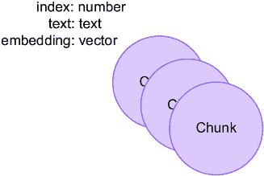

# 第二章：向量相似度搜索和混合搜索

### 本章涵盖

+   嵌入、嵌入模型、向量空间和向量相似度搜索简介

+   向量相似度在 RAG 应用中的位置

+   使用向量相似度搜索的 RAG 应用的实用操作指南

+   向 RAG 应用中添加全文搜索以查看启用混合搜索方法如何提高结果

创建知识图谱可能是一个迭代过程，你从非结构化数据开始，然后向其添加结构。当你拥有大量非结构化数据并希望开始使用它来回答问题时，这通常是这种情况。

本章将探讨如何使用 RAG 通过非结构化数据来回答问题。我们将探讨如何使用向量相似度搜索和混合搜索来找到相关信息，以及如何使用这些信息来生成答案。在后续章节中，我们将探讨我们可以使用哪些技术来改进检索器和生成器，以便在数据具有一些结构时获得更好的结果。

在数据科学和机器学习中，嵌入模型和向量相似度搜索是处理复杂数据的重要工具。本章将探讨这些技术如何将复杂的文本和图像等数据转换为称为嵌入的统一格式。

在本章中，我们将介绍嵌入模型和向量相似度搜索的基础知识，解释为什么它们是有用的，如何使用它们，以及它们在 RAG 应用中帮助解决的挑战。为了跟上进度，你需要访问一个正在运行的、空白的 Neo4j 实例。这可以是一个本地安装或云托管实例；只需确保它是空的。你可以直接在附带的 Jupyter 笔记本中跟随实现，笔记本地址为：[`github.com/tomasonjo/kg-rag/blob/main/notebooks/ch02.ipynb`](https://github.com/tomasonjo/kg-rag/blob/main/notebooks/ch02.ipynb)。

## 2.1 RAG 架构的组件

在 RAG 应用中，有两个主要组件：一个*检索器*和一个*生成器*。检索器找到相关信息，生成器使用这些信息来创建响应。向量相似度搜索在检索器中用于找到相关信息；这将在稍后进行更详细的解释。让我们深入了解这两个组件。

### 2.1.1 检索器

检索器是 RAG 应用的第一个组件。它的目的是找到相关信息并将这些信息传递给生成器。检索器如何找到相关信息并未在 RAG 框架中暗示，但最常见的方式是使用向量相似度搜索。让我们看看为检索器准备数据以成功使用向量相似度搜索需要哪些内容。

#### 向量索引

虽然向量索引对于向量相似度搜索不是严格必需的，但它被高度推荐。向量索引是一种数据结构（如映射），以使其易于搜索相似向量的方式存储向量。当使用向量索引时，检索方法通常被称为*近似最近邻搜索*。这是因为向量索引不找到确切的最近邻，而是找到非常接近最近邻的向量。这是速度和精度之间的权衡。向量索引比暴力搜索快得多，但精度不如暴力搜索。

#### 向量相似度搜索功能

*向量相似度搜索*功能是一个函数，它接受一个向量作为输入，并返回一个相似向量的列表。这个函数可能使用向量索引来找到相似向量，也可能使用其他（暴力）方法。重要的是它返回一个相似向量的列表。

两种最常见的向量相似度搜索功能是余弦相似度和欧几里得距离。*欧几里得距离*代表文本的内容和强度，在本书的大部分情况下并不重要。*余弦相似度*是两个向量之间角度的度量。在我们的文本嵌入案例中，这个角度代表了两篇文本在意义上相似的程度。余弦相似度函数接受两个向量作为输入，并返回一个介于 0 和 1 之间的数字；0 表示向量完全不同，1 表示它们完全相同。余弦相似度被认为是文本聊天机器人的最佳匹配，也是本书中我们将使用的方法。

#### 嵌入模型

文本语义分类的结果被称为*嵌入*。任何你想通过向量相似度搜索匹配的文本都必须转换为嵌入。这是通过嵌入模型完成的，并且在整个 RAG 应用中保持嵌入模型不变非常重要。如果你想更改嵌入模型，你必须重新填充向量索引。

嵌入是数字列表，列表的长度称为嵌入维度。嵌入维度很重要，因为它决定了嵌入可以包含多少信息。嵌入维度越高，处理嵌入的计算成本就越高，无论是生成嵌入还是执行向量相似度搜索。

*嵌入*是将复杂数据表示为更低维空间中一组数字的方法。把它想象成将数据转换成计算机可以轻松理解和处理的形式。

*嵌入模型*提供了一种统一的方式来表示不同类型的数据。嵌入模型的输入可以是任何复杂的数据，输出是一个向量。例如，在处理文本时，嵌入模型将单词或句子转换为向量，这些向量是数字列表。该模型经过训练以确保这些数字列表捕捉到原始单词的基本方面，如它们的含义或上下文。

#### 文本分块

*文本分块*是将文本拆分成更小片段的过程。这样做是为了提高检索器的准确性。存在更小的文本片段意味着嵌入更窄且更具体；因此，检索器在搜索时将找到更多相关信息。

文本分块非常重要，而且不容易做对。你需要考虑如何拆分文本：应该是句子、段落、语义意义，还是其他什么？你应该使用滑动窗口，还是使用固定大小？块的大小应该是多少？

对于这些问题，没有正确答案，这取决于用例、数据和领域。但思考这些问题并尝试不同的方法来找到最适合你用例的最佳解决方案是很重要的。

#### 检索器管道

一旦所有部件都到位，检索器管道相当简单。它将查询作为输入，使用嵌入模型将其转换为嵌入，然后使用向量相似度搜索功能来找到相似的嵌入。在简单情况下，检索器管道随后只返回源块，然后这些块被传递给生成器。但在大多数情况下，检索器管道需要进行一些后处理以找到传递给生成器的最佳块。我们将在下一章中介绍更高级的策略。

### 2.1.2 生成器

*生成器*是 RAG 应用中的第二个组件。它使用检索器找到的信息来生成响应。生成器通常是一个 LLM，但 RAG 相对于微调或依赖模型的基础知识的一个好处是模型不需要那么大。这是因为检索器找到了相关信息，所以生成器不需要知道一切。它确实需要知道如何使用检索器找到的信息来创建响应。这是一个比知道一切小得多的任务。

因此，我们使用语言模型的能力来生成文本，而不是它的知识。这意味着我们可以使用更小的语言模型，它们运行更快且成本更低。这也意味着我们可以相信语言模型将基于检索器找到的信息来生成响应，因此会少创造一些东西，幻觉也更少。

## 2.2 使用向量相似度搜索的 RAG

实现使用向量相似度搜索的 RAG 应用程序需要一些组件。我们将在本章中逐一介绍它们。目标是展示如何使用向量相似度搜索实现 RAG 应用程序，以及如何使用检索器找到的信息来生成响应。图 2.1 说明了完成 RAG 应用程序的数据流。


##### 图 2.1 使用向量相似度搜索的此 RAG 应用程序的数据流

我们需要将应用程序分为两个阶段：

+   数据设置

+   查询时间

我们将首先查看数据设置，然后我们将查看在查询时间应用程序将执行的操作。

### 2.2.1 应用程序数据设置

从前面的章节中，我们知道我们需要对数据进行一些处理，以便能够在运行时将其放置在嵌入模型向量空间中执行向量相似度搜索。所需的部分包括

+   文本语料库

+   文本分块函数

+   嵌入模型

+   具有向量相似度搜索能力的数据库

我们将逐一介绍这些组件，并展示它们如何有助于应用程序数据设置。

数据将存储在数据库中的文本块中，向量索引将填充文本块的嵌入。稍后，在运行时，当用户提出一个问题，该问题将使用与文本块相同的嵌入模型进行嵌入，然后使用向量索引来找到相似文本块。图 2.2 显示了应用程序数据设置的数据流。


##### 图 2.2 应用程序数据设置管道中的组件

### 2.2.2 文本语料库

在这个例子中我们将使用的文本是一篇题为“爱因斯坦的专利和发明”（Caudhuri，2017）的论文。尽管 LLM 对阿尔伯特·爱因斯坦非常了解，但我们通过提出非常具体的问题，并将它们与我们从论文中得到的答案与从 LLM 得到的答案进行比较，来展示 RAG 是如何工作的。

### 2.2.3 文本分块

如果一个 LLM 拥有足够大的上下文窗口，我们可以将整篇论文作为一个单独的块。但为了获得更好的结果，我们将论文分成更小的块，并使用每几百个字符作为一个块。最佳的块大小因情况而异，所以请确保对不同块大小进行实验。

在这种情况下，我们还想在块之间有一些重叠。这是因为我们希望能够找到跨越多个块的答案。所以我们将使用一个大小为 500 个字符、重叠为 40 个字符的滑动窗口。这将使索引稍微大一些，但也会使检索器更准确。

为了帮助嵌入模型更好地分类每个块的语义，我们将在空格处进行分块，这样每个块的开始和结束处就不会有断词。这个函数接受一个文本、块大小（字符数）、重叠（字符数），以及一个可选参数，是否在任意字符或仅空白处分割，并返回一个块列表。

##### 列表 2.1 文本分割函数

```py
def chunk_text(text, chunk_size, overlap, split_on_whitespace_only=True):   #1
    chunks = []
    index = 0

    while index < len(text):
        if split_on_whitespace_only:
            prev_whitespace = 0
            left_index = index - overlap
            while left_index >= 0:
                if text[left_index] == " ":
                    prev_whitespace = left_index
                    break
                left_index -= 1
            next_whitespace = text.find(" ", index + chunk_size)
            if next_whitespace == -1:
                next_whitespace = len(text)
            chunk = text[prev_whitespace:next_whitespace].strip()
            chunks.append(chunk)
            index = next_whitespace + 1
        else:
            start = max(0, index - overlap + 1)
            end = min(index + chunk_size + overlap, len(text))
            chunk = text[start:end].strip()
            chunks.append(chunk)
            index += chunk_size

    return chunks

chunks = chunk_text(text, 500, 40)   #2

print(len(chunks)) # 89 chunks in total    #3
```

#1 定义分割文本的功能

#2 调用函数并获取块

#3 打印块列表的长度。函数的大部分只是为了确保我们不分割单个单词，而只是在空格上分割。

### 2.2.4 嵌入模型

在选择嵌入模型时，重要的是要考虑你想要匹配哪种类型的数据。在这种情况下，我们想要匹配文本，所以我们将使用文本嵌入模型。在这本书的整个过程中，我们将使用来自 OpenAI 的嵌入模型和 LLMs，但外面有许多替代方案。来自 Hugging Face 的`all-MiniLM-L12-v2`通过 Sentence Transformers（[`mng.bz/nZZ2`](https://mng.bz/nZZ2)）是 OpenAI 嵌入模型的一个很好的替代品，它非常易于使用，并且可以在你的本地 CPU 上运行。

一旦我们决定了一个嵌入模型，我们需要确保在整个 RAG 应用程序中使用相同的模型。这是因为向量索引是由嵌入模型中的向量填充的，所以如果我们更改嵌入模型，我们需要重新填充向量索引。要使用 OpenAI 的嵌入模型嵌入块，我们将使用以下代码。

##### 列表 2.2 嵌入块

```py
def embed(texts):    #1
    response = open_ai_client.embeddings.create(
        input=texts,
        model="text-embedding-3-small",
    )
    return list(map(lambda n: n.embedding, response.data))

embeddings = embed(chunks)       #2

print(len(embeddings)) # 89, matching the number of chunks    #3
print(len(embeddings[0])) # 1536 dimensions    #4
```

#1 定义嵌入块的功能

#2 调用函数并获取嵌入向量

#3 打印嵌入向量列表的长度

#4 打印第一个嵌入向量的长度

### 2.2.5 带有向量相似度搜索功能的数据库

现在我们有了嵌入向量，我们需要将它们存储起来，以便稍后进行相似度搜索。在这本书中，我们将使用 Neo4j 作为我们的数据库，因为它具有内置的向量索引，并且易于使用；在本书的后面部分，我们将使用 Neo4j 的图功能。

在这个阶段我们将使用的模型相当简单。我们将有一个单一的节点类型`Chunk`，具有两个属性：`text`和`embedding`。`text`属性将保存块中的文本，而`embedding`属性将保存块的嵌入。



##### 图 2.3 数据模型

图 2.3 显示了将用于演示如何使用向量相似度搜索实现 RAG 应用程序的简单数据模型。

首先，让我们创建一个向量索引。需要记住的一点是，当我们创建向量索引时，我们需要定义向量将具有的维度数。如果你在未来任何时候更改输出不同维度数的嵌入模型，你需要重新创建向量索引。

如我们在代码列表 2.2 中看到的，我们使用的嵌入模型输出的是 1,536 维度的向量，因此当我们创建向量索引时，我们将使用这个维度数。

##### 列表 2.3 在 Neo4j 中创建向量索引

```py
driver.execute_query("""CREATE VECTOR INDEX pdf IF NOT EXISTS
FOR (c:Chunk)
ON c.embedding""")
```

我们将命名向量索引为`pdf`，它将用于在`embedding`属性上索引类型为`Chunk`的节点，使用余弦相似度搜索功能。

现在我们有了向量索引，我们可以用嵌入来填充它。我们将使用 Cypher 来完成这项工作，首先为每个块创建一个节点，然后在节点上设置`text`和`embedding`属性，使用 Cypher 循环。我们还在每个`:Chunk`节点上存储一个索引，这样我们就可以轻松地稍后找到块。

##### 列表 2.4 在 Neo4j 中存储块和填充向量索引

```py
cypher_query = '''
WITH $chunks as chunks, range(0, size($chunks)) AS index
UNWIND index AS i
WITH i, chunks[i] AS chunk, $embeddings[i] AS embedding
MERGE (c:Chunk {index: i})
SET c.text = chunk, c.embedding = embedding
'''

driver.execute_query(cypher_query, chunks=chunks, embeddings=embeddings)
```

要检查数据库中有什么，我们可以运行这个 Cypher 查询来获取索引为 0 的`:Chunk`节点。

##### 列表 2.5 从 Neo4j 中的块节点获取数据

```py
records, _, _ = driver.execute_query(
↪ "MATCH (c:Chunk) WHERE c.index = 0 RETURN c.embedding, c.text")

print(records[0]["c.text"][0:30])
print(records[0]["c.embedding"][0:3])
```

### 2.2.6 执行向量搜索

现在我们已经将向量索引填充了嵌入，我们可以执行向量相似度搜索。首先，我们需要嵌入我们想要回答的问题。我们将使用与块相同的嵌入模型，并且我们将使用与嵌入块相同的函数。

##### 列表 2.6 嵌入用户问题

```py
question = "At what time was Einstein really interested↪
↪ in experimental works?"
question_embedding = embed([question])[0]
```

现在我们已经将问题嵌入，我们可以使用 Cypher 执行向量相似度搜索。

##### 列表 2.7 在 Neo4j 中执行向量搜索

```py
query = '''
CALL db.index.vector.queryNodes('pdf', 2, $question_embedding) YIELD node↪
↪ AS hits, score
RETURN hits.text AS text, score, hits.index AS index
'''
similar_records, _, _ = driver.execute_query(query, question_embedding=question_embedding)
```

查询返回最相似的两个块，我们可以打印结果以查看我们得到了什么。代码将打印以下文本块及其相似度得分。

##### 列表 2.8 打印结果

```py
for record in similar_records:
    print(record["text"])
    print(record["score"], record["index"])
    print("======")

upbringing, his interest in inventions and patents was not unusual.
Being a manufacturer’s son, Einstein grew upon in an environment of↪
↪ machines and instruments.
When his father’s company obtained the contract to illuminate Munich city↪
↪ during beer festival, he
was actively engaged in execution of the contract. In his ETH days↪
↪ Einstein was genuinely interested
in experimental works. He wrote to his friend, “most of the time I worked↪
↪ in the physical laboratory,
fascinated by the direct contact with observation.” Einstein's
0.8185358047485352 42
======
instruments. However, it must also be
emphasized that his main occupation was theoretical physics. The↪
↪ inventions he worked upon were
his diversions. In his unproductive times he used to work upon on solving↪
↪ mathematical problems (not
related to his ongoing theoretical investigations) or took upon some↪
↪ practical problem. As shown in
Table. 2, Einstein was involved in three major inventions; (i)↪
↪ refrigeration system with Leo Szilard, (ii)
Sound reproduction system with Rudolf Goldschmidt and (iii) automatic↪
↪ camera
0.7906564474105835 44
======
```

从打印结果中，我们可以看到匹配的块、它们的相似度得分和它们的索引。下一步是使用这些块通过 LLM 生成一个答案。

### 2.2.7 使用 LLM 生成答案

当与 LLM 通信时，我们有传递所谓的“系统消息”的能力，其中我们可以传递给 LLM 的指令。我们还传递一个“用户消息”，它包含原始问题，在我们的情况下，是问题的答案。

在用户消息中，我们传递给 LLM 想要使用的块，我们通过传递在列表 2.8 中相似搜索中找到的相似块的`text`属性来完成。

##### 列表 2.9 LLM 上下文

```py
system_message = "You're an Einstein expert, but can only use the provided
↪ documents to respond to the questions."

user_message = f"""
Use the following documents to answer the question that will follow:
{[doc["text"] for doc in similar_records]}

---

The question to answer using information only from the above documents:
↪ {question}
"""
```

让我们现在使用 LLM 来生成一个答案。

##### 列表 2.10 使用 LLM 生成答案

```py
print("Question:", question)

stream = open_ai_client.chat.completions.create(
    model="gpt-4",
    messages=[
        {"role": "system", "content": system_message},
        {"role": "user", "content": user_message}
    ],
    stream=True,
)
for chunk in stream:
    print(chunk.choices[0].delta.content or "", end="")
```

这将流式传输 LLM 生成的结果，我们可以看到生成时的结果。

##### 列表 2.11 LLM 的答案

```py
Question: At what time was Einstein really interested in experimental works?
During his ETH days, Einstein was genuinely interested in experimental works.
```

哇，看看这个！LLM 能够根据检索器找到的信息生成一个答案。

## 2.3 向 RAG 应用添加全文搜索以实现混合搜索

在上一节中，我们看到了如何使用向量相似度搜索来实现一个 RAG 应用。虽然纯向量相似度搜索可以带你走很长的路，并且比普通的全文搜索有巨大的改进，但它通常不足以产生足够高质量、准确性和性能，以满足生产用例。

在本节中，我们将探讨如何改进检索器以获得更好的结果。我们将考虑如何向 RAG 应用添加全文搜索以实现混合搜索。

### 2.3.1 全文搜索索引

*全文搜索*，数据库中的一种文本搜索方法，已经存在很长时间了。它通过关键词在数据中搜索匹配项，而不是在向量空间中的相似度。要在全文搜索中找到匹配项，搜索词必须与数据中的单词完全匹配。

要启用混合搜索，我们需要向数据库中添加一个全文搜索索引。大多数数据库都有某种形式的全文搜索索引，在这本书中我们将使用 Neo4j 的全文搜索索引。

##### 列表 2.12 在 Neo4j 中创建全文索引

```py
driver.execute_query("CREATE FULLTEXT INDEX PdfChunkFulltext FOR (c:Chunk)
↪ ON EACH [c.text]")
```

在这里，我们在 `:Chunk` 节点的 `text` 属性上创建一个名为 `PdfChunkFulltext` 的全文索引。

### 2.3.2 执行混合搜索

混合搜索的想法是我们执行向量相似度搜索和全文搜索，然后合并结果。为了能够比较两种不同匹配的分数，我们需要对分数进行归一化。我们通过将分数除以每个搜索的最高分数来实现这一点。

##### 列表 2.13 在 Neo4j 中执行混合搜索

```py
hybrid_query = '''
CALL {
    // vector index
    CALL db.index.vector.queryNodes('pdf', $k, $question_embedding)↪
↪ YIELD node, score
    WITH collect({node:node, score:score}) AS nodes, max(score) AS max
    UNWIND nodes AS n
    // Normalize scores
    RETURN n.node AS node, (n.score / max) AS score
    UNION
    // keyword index
    CALL db.index.fulltext.queryNodes('ftPdfChunk', $question, {limit: $k})
    YIELD node, score
    WITH collect({node:node, score:score}) AS nodes, max(score) AS max
    UNWIND nodes AS n
    // Normalize scores
    RETURN n.node AS node, (n.score / max) AS score
}
// deduplicate nodes
WITH node, max(score) AS score ORDER BY score DESC LIMIT $k
RETURN node, score
'''
```

我们编写了一个联合 Cypher 查询，首先执行向量相似度搜索，然后执行全文搜索。然后我们去重结果并返回前 `k` 个结果。

##### 列表 2.14 在 Neo4j 中调用混合搜索

```py
similar_hybrid_records, _, _ = driver.execute_query(hybrid_query,
↪ question_embedding=question_embedding, question=question, k=4)

for record in similar_hybrid_records:
    print(record["node"]["text"])
    print(record["score"], record["node"]["index"])
    print("======")
```

##### 列表 2.15 混合搜索的答案

```py
CH-Switzerland
Considering Einstein’s upbringing, his interest in inventions and patents↪
↪ was not unusual.
Being a manufacturer’s son, Einstein grew upon in an environment of↪
↪ machines and instruments.
When his father’s company obtained the contract to illuminate Munich city↪
↪ during beer festival, he
was actively engaged in execution of the contract. In his ETH days↪
↪ Einstein was genuinely interested
in experimental works. He wrote to his friend, “most of the time I worked↪
↪ in the physical laboratory,
fascinated by the direct contact with observation.” Einstein's
1.0 42
======
Einstein
left his job at the Patent office and joined the University of Zurich on↪
↪ October 15, 1909\. Thereafter, he
continued to rise in ladder. In 1911, he moved to Prague University as a↪
↪ full professor, a year later, he
was appointed as full professor at ETH, Zurich, his alma-mater. In 1914,↪
↪ he was appointed Director of
the Kaiser Wilhelm Institute for Physics (1914–1932) and a professor at↪
↪ the Humboldt University of
Berlin, with a special clause in his contract that freed him from↪
↪ teaching obligations. In the meantime,
he was working for
0.9835733295862473 31
======
```

在这里，我们可以看到由于归一化，最上面的结果得到了 1.0 的分数。这意味着最上面的结果与向量相似度搜索的最上面的结果相同。但我们也可以看到第二个结果不同。这是因为全文搜索找到了比向量相似度搜索更好的匹配。

## 2.4 总结思考

在本章中，我们探讨了向量相似度搜索是什么，它由哪些组件组成，以及它如何适应 RAG 应用。然后我们添加全文搜索来提高检索器的性能。

通过使用向量相似度搜索和全文搜索，我们可以比只使用其中之一获得更好的结果。虽然这种方法在某些情况下可能效果很好，但由于我们使用非结构化数据来检索信息，所以使用混合搜索的质量、准确性和性能仍然相当有限。文本中的引用并不总是被捕获，周围的环境也不总是足以让 LLMs 理解文本的意义以生成好的答案。

在下一章中，我们将探讨如何改进检索器以获得更好的结果。

## 摘要

+   RAG 应用由一个检索器和生成器组成。检索器找到相关信息，生成器使用这些信息来创建响应。

+   文本嵌入在向量空间中捕捉文本的意义，这使得我们可以使用向量相似度搜索来找到相似文本。

+   通过向 RAG 应用添加全文搜索，我们可以启用混合搜索来提高检索器的性能。

+   向量相似度搜索和混合搜索在特定情况下可以很好地工作，但随着数据复杂性的增加，它们的质量、准确性和性能仍然相当有限。
