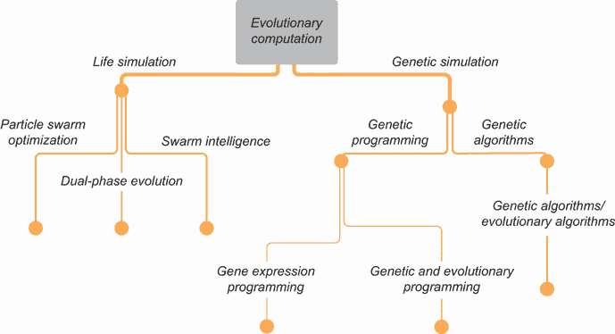
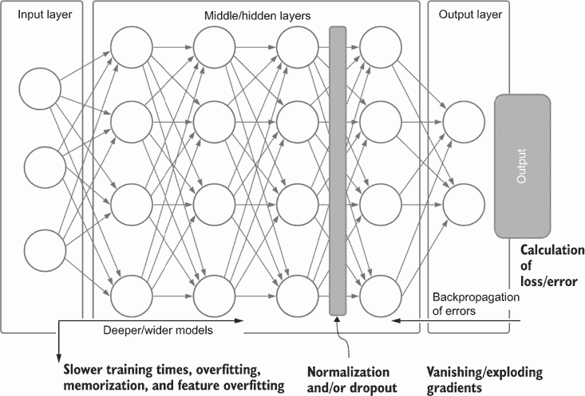
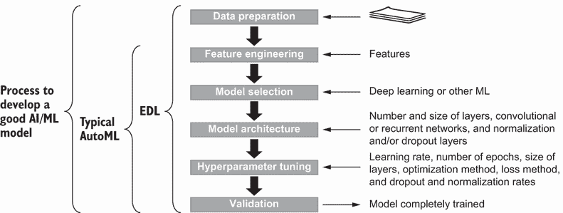
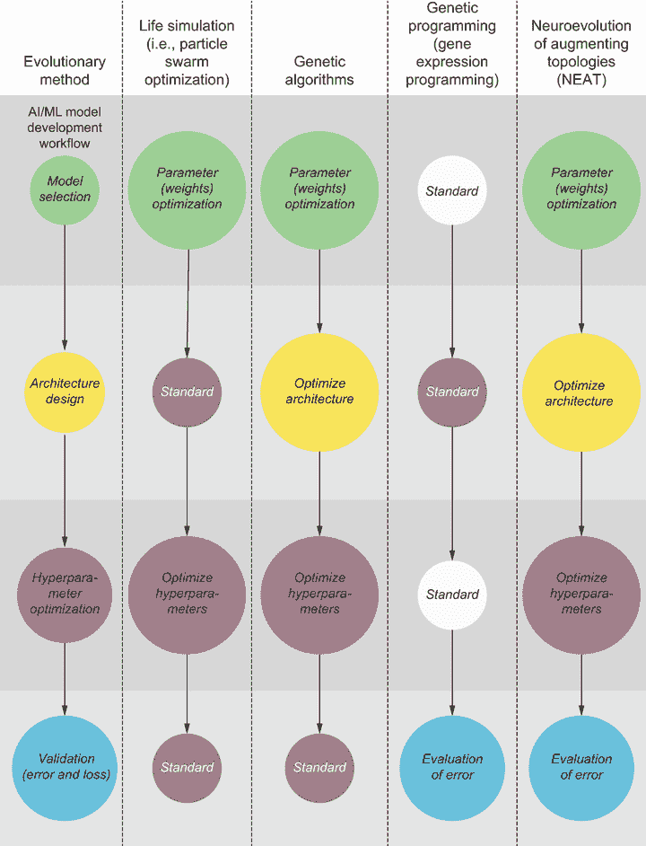

# 1 介绍进化深度学习

本章涵盖

+   进化计算是什么以及它如何集成到深度学习系统中

+   进化深度学习应用

+   建立优化深度学习网络的模式

+   自动化机器学习在优化网络中所扮演的角色

+   将进化计算方法应用于增强深度学习开发的应用

*深度学习*（DL）已经成为与人工智能（AI）和机器学习（ML）爆炸最相关的普遍技术。它已经从被认为是一种伪科学（参见 Terrence J. Sejnowski 的《深度学习革命》，2018 年，麻省理工学院出版社）发展到被用于从诊断乳腺癌到驾驶汽车的各种主流应用。虽然许多人认为它是一种未来的技术，但其他人则采取更务实和实际的方法来应对其日益增长的复杂性和对数据的需求。

随着深度学习的日益复杂，我们不断地给它喂入更多的数据，希望在某一个特定领域有某种伟大的顿悟。不幸的是，这种情况很少发生，我们经常留下糟糕的模型、糟糕的结果和愤怒的老板。这是一个将持续存在，直到我们开发出高效的深度学习系统流程的问题。

构建有效且健壮的深度学习系统的过程与任何其他机器学习（ML）或数据科学（DS）项目的过程相似——或者应该相似。虽然某些阶段在所需资源和复杂性方面可能有所不同，但所有步骤都将保持不变。在相对较新的深度学习世界中，通常缺乏一个工具包可以帮助自动化这些过程中的某些部分。

进入 *进化深度学习*（EDL）。EDL 是这样一个工具包或一系列模式和惯例，可以帮助自动化深度学习系统的开发。本书中使用的 *EDL* 术语涵盖了广泛的应用进化计算方法和模式，应用于机器学习过程中深度学习系统的各个方面。

## 1.1 什么是进化深度学习？

进化深度学习（EDL），这个术语首次在本书中描述，是对一系列结合进化方法和深度学习的技术的一般分类和分组。这些方法可以用来优化深度学习系统，从数据收集到验证。EDL 并非新事物；将进化方法与深度学习结合的工具已经有许多名称，包括深度神经网络进化、进化神经网络自动机器学习、神经进化、进化人工智能等。

EDL 是人工智能（AI）两个独特子领域的融合：进化计算（EC）和将深度学习（DL）应用于自动化和改进模型。进化计算本身是一系列方法，通过模拟生物或自然过程来解决复杂问题。反过来，这些方法可以应用于深度学习之上，以自动化和优化解决方案，同时具有发现新策略和架构的潜力。

我们将在 EDL 下涵盖的广泛方法绝非新颖，它们已经存在了 20 多年。虽然其中许多研究已经证明在自动调整深度学习模型方面是成功的，但它们在人工智能炒作的更前沿、手工制作的例子之后受到了次要的关注。在许多论文中，作者讨论了进行数据或特征工程以及超参数调整一个创新模型所花费的大量时间。

然而，对于许多现在正在拥抱深度学习的开发者来说，构建稳健、高性能模型是一个艰巨的挑战，充满了困难。许多这些挑战需要对其选择的深度学习框架的所有选项和怪癖有深入和复杂的知识，以便理解模型可能只是错误地拟合。在这里，我们提出了 EDL（进化深度学习）作为自动化机器学习（AutoML）的解决方案，以解决实践者——无论是经验丰富的还是新手——将面临的大部分问题。

EDL 的目的是提供更好的机制和工具集，以提供优化和 AutoML，用于构建深度学习解决方案。进化方法是一种优秀且相对简单的机制，可以提供一套广泛的优化工具，这些工具可以应用于深度学习。虽然进化技术有可能自动化更高级人工智能的构建，但这不是 EDL 或本书的当前意图。

相反，我们专注于使用进化技术构建更好的优化网络。在我们这样做之前，我们将介绍操作并讨论使用进化计算（EC）和进化算法（EAs）来深入了解基本概念，下一节将简要介绍进化和进化过程。

### 1.1.1 介绍进化计算

进化计算是人工智能的一个子领域，它使用生物和自然启发的过程来解决复杂问题。这个词“进化”用来描述这一系列算法，因为许多算法以自然选择理论为基础。

查尔斯·达尔文在其著作《物种起源》（1859 年，约翰·默里出版社）中提出的自然选择理论，定义了地球上生命的进化过程。它描述了最强壮和最适应的生命将不断增长，而弱小或不适应的生命将死亡并灭绝。他从 1837 年左右在南美洲环航期间作为自然学家在“贝格尔号”上的经历中发展了这一理论。作为虔诚的宗教徒，达尔文在出版著名的作品之前，又与他的发现斗争了 22 年。

基于达尔文的学说，进化计算的一个基石是模拟系统中的个体或个体群体以找到最佳的方法。目的是通过允许它们改变，推导或进化出能够在这样的人工环境中生存和繁荣的个体。这种个体变化的机制将因进化计算方法而异，但在所有情况下，我们都需要一个量化个体生存能力的机制。

我们用来量化个体可能存活或繁荣程度的术语称为**适应度**。这是一个在 EC 中广泛使用的通用术语，它定义了个体在环境中的生存或表现能力。适应度可以通过多种方式来衡量，但在所有情况下，它都是决定个体或个体群体解决问题效率的终极决定因素。

自然选择和适应度的概念已被用作构建计算方法的基石，这些方法旨在复制生物繁殖过程，无论是粗略地还是深入地。其中一些方法甚至模拟了细胞在染色体分裂和 DNA 共享过程中发生的遗传有丝分裂。以下列表是当前一些显著的 EC 算法的总结：

+   **人工生命**——从康威的生命游戏和冯·诺伊曼的细胞自动机回溯，这些过程通过代理模拟了生命本身的模拟过程。在这个算法中，代理通常根据它们与其他代理或环境的接近程度移动、流动、生存或死亡。虽然代理模拟通常用于模拟现实世界，但它也可以用于优化过程。

+   **差分进化**——一个将微分计算与进化算法相结合以优化搜索的过程。这种技术通常与其他 EC 方法，如人工生命，结合使用。在这个算法中，代理通过取向量差异并将其重新应用于群体来进化或改变。

+   **进化算法**——一个更广泛的 EC 方法类别，它将自然选择的形式应用于问题。这些方法通常侧重于模拟个体群体。

+   **进化编程**——一种使用代码创建算法的专门进化算法形式。在这个算法中，个体由一段代码表示，其相应的适应度通过运行代码产生的某个最优值来衡量。EP 的代码生成有几种实现方式，在许多情况下，我们将依赖于更具体的方法，如基因表达。

+   **遗传算法**——这个算法使用我们在生物体中看到的低级细胞有丝分裂，允许将遗传特征传递给后代。遗传算法（GA）是通过将个体的特征编码到基因序列中来模拟这个过程，这个任意的基因序列可能只是一个 0s 或 1s 的序列，它评估为某个适应度指标。这个适应度用于模拟生物选择过程和父代个体的交配，以产生新的结合后代。

+   *遗传编程*—这个算法使用遗传算法（GA）构建编程代码。在 GA 中，个体的特征更为通用，但在遗传编程（GP）中，一个特征或基因可以代表任意数量的函数或其他代码逻辑。GP 是一种专门的技术，允许开发新的算法代码。这种技术的例子已被用于编写能够解决迷宫或创建图片的代理模拟代码。

+   *基因表达式编程*—这个算法是遗传编程的进一步扩展，用于开发代码或数学函数。在遗传编程（GP）中，代码被抽象为高级函数，而在基因表达式编程（GEP）中，目的是开发特定的数学方程。GEP 与 GP 之间的一个关键区别是使用表达式树来表示函数。在 GP 中，表达式树表示代码，而在 GEP 中，表达式表示一个数学表达式树。其好处是代码将遵循基于位置的运算顺序。

+   *粒子群优化*—这属于人工生命的一个子集，是对人工和相对智能粒子的模拟。在这个算法中，评估每个粒子的适应性，最好的粒子成为剩余粒子围绕其群聚的焦点。

+   *群体智能*—这个算法是一种搜索方法，模拟群体昆虫或鸟类的行为以找到优化问题的峰值。它与粒子群优化（PSO）非常相似，但在实现上有所不同，这取决于适应性评估。

图 1.1 显示了本书中用于应用 EDL 的 EC 方法层次结构。还可以使用其他 EC 方法来改进深度学习模型，但作为介绍，我们将涵盖图中的基本方法，重点关注生命和遗传模拟领域。

图 1.1 用于应用 EDL 的 EC 子集

生命模拟是进化计算（EC）的一个特定子集，它采用了一种模拟我们在自然界中观察到的自然过程的方法，例如粒子或鸟类的群聚方式。另一方面，遗传模拟模仿我们在生物生命中观察到的细胞有丝分裂过程。更具体地说，它模拟了基因和染色体通过生物体的进化进行遗传转移。

## 1.2 进化深度学习的为什么和在哪里

进化深度学习（EDL）既是一个概念，也是一组用于深度学习优化（DL）的工具和技术。从概念上讲，EDL 是使用进化计算（EC）来优化深度学习网络的模式和惯例。然而，它也提供了一套可以叠加在深度学习之上或甚至作为深度学习替代品的工具。

为什么以及在哪里使用 EDL 不仅取决于你在深度学习（DL）方面的专业知识水平，还取决于你推动极限的需求。这并不意味着深度学习的新手不能从使用 EDL 中受益。实际上，这本书探讨了使用 EDL 暴露出的许多神经网络细微差别，这些差别对任何从业者都有益。

EDL 可以使用的答案很简单：任何地方。它可以用于基本的超参数优化、神经权重搜索以解决不连续的解决方案、平衡生成对抗网络中的对抗网络，甚至可以替代深度强化学习。你真的可以将本书中介绍的技术应用到任何深度学习系统中。

回答 EDL 的 *为什么* 的问题归结为必要性。进化方法为任何深度学习系统提供了进一步优化或改进解决方案的选项。然而，EDL 计算密集，可能不适合简单的系统。但是，对于复杂或新颖的问题，进化为任何深度学习从业者提供了一套新的技巧。

## 1.3 深度学习优化的必要性

深度学习是一种强大、但相对较新且常被误解的技术，它提供了众多好处以及一些缺点。其中一个缺点是需要理解和优化模型。这是一个可能需要数小时数据标注或模型超参数调整的过程。

在几乎所有情况下，我们无法直接使用现成的模型，我们通常需要优化深度学习系统的各个方面，从调整学习率到选择激活函数。优化网络模型通常成为主要练习，如果手动进行，这可能需要相当大的努力。

优化深度学习网络可以包括广泛的因素。除了通常的超参数调整之外，我们还需要考虑网络架构本身。

### 1.3.1 优化网络架构

随着网络通过添加层或各种节点类型而变得更加复杂，它直接影响了损失/误差如何通过它反向传播。图 1.2 展示了在增长更复杂和更大的深度学习系统时遇到的最常见问题。

图 1.2 增长深度学习系统时常见的问题

在更大的网络中，损失量需要分成越来越小的组件，最终接近零。当这些损失组件或梯度接近零时，我们称之为 *梯度消失问题*，这通常与深度网络相关。相反，组件也可能通过逐层传递而变得异常大，这些层放大了输入信号。这导致梯度组件变得很大，或者称为 *梯度爆炸*。

这两种梯度问题都可以使用各种技术来解决，例如标准化输入数据和，再次通过层。图 1.2 中展示了称为 *标准化* 和 *dropout* 的特殊层函数。这些技术增加了网络的计算复杂性和要求，也可能过分平滑数据中的重要和特征性特征。因此，需要更大的和多样化的训练数据集来开发良好的网络性能。

归一化可以解决深层网络的梯度消失和爆炸问题，但随着模型的增长，这些会引发其他担忧。随着模型的增长，模型处理更大输入集和图像的能力增加。然而，这可能导致称为*网络记忆*的副作用，如果输入训练集太小，就会发生这种情况。这是因为网络如此之大，它可能开始记忆输入块集或甚至整个图像或文本集。

你可能听说过的尖端深度学习模型，如来自 OpenAI 的自然语言处理器 GPT-3，部分受到记忆问题的困扰。即使向这些模型输入了代表多种文本形式的数十亿份文档，这个问题仍然存在。即使拥有如此多样化和庞大的训练集，GPT-3 之类的模型也已被证明会重放记忆中的整段文本。这个问题可能是一个对不适合深度学习模型的数据库来说有效的特征。

已经开发出了一些针对称为*dropout*的记忆问题的解决方案，这是一个通过在每个训练过程中关闭网络层中一定比例的节点的过程。通过在每个过程中开关节点，创建了一个更通用的网络。然而，这需要网络现在变得 100%到 200%更大。

在这些问题之上，向更深层的网络添加更多层会增加更多权重——这些权重需要在数十亿到数万亿次的迭代中单独训练。训练此类模型需要指数级增长的计算能力，许多顶级、尖端模型现在仅由能够承担这种高成本的组织开发。

许多人认为更宽、更深的网络趋势很快就会达到大多数深度学习实践者的平台期，将未来的尖端发展留给像 Google DeepMind 这样的 AI 巨头。因此，简单的解决方案是考虑其他可以简化如此大型网络开发的替代方法。这就是我们回到应用 EC 于 DL 以优化网络架构、权重或两者都优化的时候了。

幸运的是，EDL 提供了几种潜在的方法，因为它可以自动优化我们将在本书中探讨的各种问题的网络大小和形式。自动优化是 EDL 的基石，并将成为本书中许多练习的重点，这些练习展示了这些技术。

由于进化算法提供了多种优化模式，可以解决众多问题，因此 EDL 可以在机器学习开发过程的各个方面发挥作用。这包括调整模型超参数以适应数据或特征工程、模型验证、模型选择和架构。

## 1.4 使用自动机器学习自动化优化

EDL 提供了一套工具，以帮助自动化深度学习系统的优化，以创建更稳健的模型。因此，它应被视为一个 AutoML 工具。许多商业 AutoML 平台，如 Google AutoML，使用各种进化方法来开发模型。

在我们继续之前，我们还需要讨论术语*自动化机器学习*和*AutoML*的品牌或误命名问题。在这本书中，我们将交替使用*AML*和*AutoML*；它们通常被认为是相同的，并且就我们的目的而言，它们是相同的。然而，AML 和 AutoML 可能被认为是不同的，因为前者通常用来描述一个产生优化模型的黑盒系统。

自动化任何 AI/ML 模型的优化和开发被认为是任何研究和发展项目开发过程中的下一步。它是超越研究和开发并正式化模型构建过程的演变，这使得从业者可以将模型带入全面商业化和产品化。

### 1.4.1 什么是自动化机器学习？

自动化机器学习，或 AutoML，是一套用于自动化和增强 AI/ML 构建的工具或工具集。它不是一个特定的技术，而是一系列方法，其中进化算法或进化优化方法被视为一个子集。它是一个可以在 AI/ML 工作流程的任何阶段使用的工具，如图 1.3 所示。

图 1.3 使用 AutoML 和/或 EDL 开发良好 AI/ML 模型的步骤

AutoML 工具

以下是一个提供 AutoML 的工具和平台列表：

+   *DataRobot*—被视为 AutoML 的第一个平台和起点，DataRobot 提供了一套用于自动构建模型的多样化工具。

+   *Google Cloud AutoML*—这是一个由当前人工智能领域的领军企业推出的流行且稳健的平台。该平台处理各种类型的数据，从图像到结构化数据。

+   *Amazon SageMaker AutoPilot*—这个强大的平台非常适合自动化依赖于结构化数据的模型开发。

+   *H2O AutoML*—这个工具提供了各种自动化机器学习工作流程的功能。

+   *Azure Machine Learning*—这个平台提供了对各种形式数据的模型调优的自动化流程。

+   *AutoKeras*—这个出色的工具提供了自动开发网络架构的功能。

+   *AutoTorch*—这个工具提供了自动架构搜索的功能。

许多其他工具和平台都可用，但超出了这个列表的范围。

图 1.3 展示了用于构建用于对新数据进行自信推断的良好模型的典型 AI/ML 工作流程。这个工作流程通常由各种 AI/ML 从业者手动执行，但已经尝试自动化所有步骤。以下是对这些步骤的更详细总结，包括它们如何通过 AML 进行自动化：

+   *数据准备*—为人工智能/机器学习训练准备数据既耗时又昂贵。一般来说，准备数据和自动化这一任务可以显著提高对微调复杂模型至关重要的数据工作流程的性能。AutoML 在线服务通常假设用户已经根据大多数机器学习模型的要求准备和清理了数据。使用进化方法，有几种自动化数据准备的方法，尽管这项任务并非特定于 EDL，我们将在后面的章节中介绍它。

+   *特征工程*—这是使用先前的领域知识从数据中提取相关特征的过程，专家根据他们的直觉和经验选择相关特征。由于领域专家昂贵且固执己见，自动化这一任务可以降低成本并提高标准化。根据 AutoML 工具的不同，特征工程可能包含在过程中。

+   *模型选择*—随着人工智能/机器学习的进步，已经创建了数百种可以解决类似问题的模型类型。通常，数据科学家会花费几天或几周的时间来选择一组模型以进行进一步评估。自动化这一过程可以加快模型开发，并帮助数据科学家确认他们正在使用适合工作的正确模型。一个好的 AutoML 工具可以从数十或数百个模型中进行选择，包括深度学习变体或模型集成。

+   *模型架构*—根据人工智能/机器学习和深度学习领域，定义正确的模型架构通常至关重要。以自动化的方式正确完成这一点可以减轻无数小时的架构调整和模型重新运行的工作。根据实现方式，一些 AutoML 系统在模型架构上有所不同，但这通常仅限于众所周知的变体。

+   *超参数优化*—微调模型超参数的过程可能耗时且容易出错。为了克服这些问题，许多从业者依赖直觉和以往的经验。虽然这在过去是成功的，但随着模型复杂性的增加，这项任务变得难以承受。通过自动化 HP 调整，我们不仅减轻了构建者的工作负担，还揭示了模型选择或架构中可能存在的潜在缺陷。

+   *验证选择*—评估模型性能有许多选项，从决定用于训练和测试的数据量到可视化模型的输出性能。自动化模型的验证提供了一种稳健的方法，在数据变化时重新表征模型性能，并使模型长期更具可解释性。对于在线 AutoML 服务，这是关键优势之一，为采用此类工具提供了令人信服的理由。

典型的自动化机器学习（AML）/自动化机器学习（AutoML）工作流程仅尝试解决特征工程步骤及其之后的步骤，这个过程通常是迭代进行的，无论是单个步骤还是多个步骤的组合。一些步骤，如超参数调整，是特定于模型类型的，在深度学习（DL）的情况下，可能需要大量时间来优化模型。

尽管这股新的商业自动化机器学习（AutoML）服务浪潮在处理各种数据类型和形式方面取得了成功，但产生的模型缺乏创新，并且可能相当昂贵。构建调整后的模型需要大量的计算能力来处理自动化机器学习（AutoML）需要执行的所有任务，而这些开发出的模型基本上是前一代基准的重建，并且通常缺乏对优化的任何新颖见解。

那些希望以预算获得更多创新自动化模型的 AI/ML 从业者通常会转向开发他们的自动化机器学习（AutoML）解决方案，进化深度学习（EDL）是一个主要候选者。正如我们将在本书的后续章节中看到的那样，进化方法可以为自动构建和优化深度学习（DL）模型、超参数、特征工程和网络架构提供各种各样的解决方案。

## 1.5 进化深度学习的应用

既然我们已经理解了为什么需要将进化计算（EC）和深度学习（DL）结合到自动化机器学习（AutoML）解决方案中，我们就可以继续探讨如何实现。也就是说，我们如何将遗传算法（GAs）等方法应用于深度学习（DL）之上以改进现有的 AI 解决方案？可能存在无数种可能性，允许将进化计算（EC）与深度学习（DL）合并，但在这本书中，我们将坚持一些基本的实用策略。

理解这些策略将使您能够修改现有的深度学习（DL）网络或创建您自己的结合进化计算（EC）/深度学习（DL）的模型。这将使您能够在更短的时间内和更少的资源下创建尖端优化的网络，并赋予您选择和选择策略甚至随着经验增长开发新策略的能力。

为了实现如此宏伟的目标，我们将从深度学习（DL）和进化计算（EC）的一个特定子集的基础知识开始探索。我们将构建基本模型来解决这两个子领域的问题，然后在后面的章节中，我们将探讨如何将它们结合起来以实现更好的性能和自动化。

进化计算（EC）可以以几种形式应用于深度学习（DL），以涵盖自动化机器学习（AutoML）中包裹的各种自动化策略。图 1.4 展示了可以应用于深度学习（DL）的进化计算（EC）或进化深度学习（EDL）的各个子集，以及它们在 AI/ML 模型开发工作流程中可能的应用位置。

图 1.4 将进化计算（EDL）应用于深度学习（DL）的 AI/ML 模型开发工作流程

### 1.5.1 模型选择：权重搜索

如前所述，所选的基础模型和层类型通常由要解决的问题类型决定。在大多数情况下，模型选择优化可以快速手动完成。然而，模型选择不仅仅是选择层类型；它还可以包括优化形式、起始权重以及用于训练模型的损失。

通过优化模型层类型、优化机制甚至损失形式，可以使网络更鲁棒，从而更有效地学习。我们将探讨一些示例，其中初始模型权重、优化类型和损失度量被调整以适应各种问题。

### 1.5.2 模型架构：架构优化

许多时候，在构建深度学习网络时，我们常常会过度设计模型或模型中的节点和层数量。随着时间的推移，我们会将网络规模缩小，使其更适合问题。在许多情况下，网络过大可能会导致对输入数据的记忆化，从而引起过拟合。相反，如果网络太小，无法学习数据的多样性和数量，通常会导致欠拟合。

为了解决过拟合和欠拟合问题，我们可以应用遗传算法自动修剪网络到其最低形式。这不仅提高了模型性能并限制了过拟合或欠拟合，而且通过减小网络规模减少了训练时间。这是一种在尝试优化更大、更深网络时效果很好的技术。

### 1.5.3 超参数调整/优化

*超参数* *调整* 是我们在人工智能和机器学习中所进行的过程，需要通过调整定义模型的各个控制变量来优化模型。在深度学习中，参数用于表示模型的权重；我们通过称控制变量为*超参数*来区分它们。

EC 提供了几种替代措施，以在广泛的模型中添加自动超参数优化，包括深度学习。粒子群优化、微分进化以及遗传算法都已被成功应用。这些方法中的每一种都将被探索，以在各种框架中衡量性能。

### 1.5.4 验证和损失函数优化

在开发鲁棒的深度学习模型时，我们通常依赖于几种已建立的模式来生成高质量的网络。这可能包括通过迭代地审查训练和测试损失来验证模型的训练和性能。我们希望确保损失的两个度量指标不要相差太远。

在典型的监督学习训练场景中，我们通常会使用与标签比较相一致的标准度量。在更高级的生成式深度学习场景中，优化损失形式甚至验证度量的机会变得可用。

如自动编码器、嵌入层和生成对抗网络等网络架构提供了应用组合损失和模型验证的机会。使用 EC，我们可以使用方法以 AutoML 的方式优化这些网络形式。

### 1.5.5 增强拓扑的神经进化

*增强拓扑的神经进化*（NEAT）是一种将超参数和架构优化与权重搜索相结合的技术，可以自动构建新的 DL 模型，这些模型还可以发展它们自己的损失和验证方法。虽然 NEAT 几乎 20 年前就已经开发出来，但直到最近，这项技术才被应用于 DL 和深度强化学习的各种应用中。

### 1.5.6 目标

在这本书中，我们探讨之前提到的技术集合以及它们如何应用于 DL。我们关注实用的技术，这些技术可以通过实际解决方案应用于各种问题，特别关注如何将各种形式的 AML/AutoML 也应用于优化 DL 系统和评估技术间的性能。我们的关注范围还包括进化方法之外的更广泛的技术。

在接下来的章节中，我们将逐步介绍 AutoML 过程的部分内容，向熟悉 DL 的人介绍关键概念。在介绍 EC 的基础知识之后，我们将展示超参数优化，然后是数据和特征工程、模型选项选择和模型架构。最后，我们将进一步探讨更复杂的示例，旨在改进生成性 DL 和深度强化学习问题。

到这本书结束时，你应该能够舒适地描述和使用 DL 以及 EC 的某些子集，无论是单独使用还是组合使用来优化网络。你将能够构建模型来解决使用这两个子领域的问题，并理解哪些更适合特定类别的问题，包括在 DL 模型上应用 EC 进行各种优化和应用 AutoML 的能力。

## 摘要

+   DL 是一种强大的技术，能够解决许多 AI 和 ML 任务，但它很复杂；需要大量的数据；并且开发、训练和优化的成本很高。

+   EC 是 AI 和 ML 的一个子领域，其定义基于自然选择理论。它的发展速度没有 DL 快，但仍然提供了解决各种复杂问题的技术。

+   EDL 是一个广泛的概念，包括进化方法和 DL 的结合。神经进化、进化超参数优化和增强拓扑的神经进化是 EDL 的例子。EDL 定义了 EC 方法的一个子集，可用于自动化和改进 ML 工作流程中许多阶段的 DL 模型开发。

+   AML（自动化机器学习）和 AutoML 定义了一套旨在自动化整个 AI 和 ML 模型开发工作流程的工具和技术。许多形式的进化计算已经被使用，并且可以用于自动化模型开发工作流程。谷歌和其他公司已经大量投资于 AutoML 的开发，以帮助消费者根据自身需求构建稳健的模型。尽管这些服务功能强大，但它们通常像黑盒一样工作，限制了新前沿模型更敏捷的定制化。
