# 2 介绍进化计算

本章涵盖

+   使用 Google Colaboratory 探索生命游戏

+   在 Python 中创建简单的细胞生命模拟

+   通过模拟生命来优化单元格属性

+   将进化论理论应用于模拟

+   将遗传学和遗传算法应用于模拟优化

在上一章中，我们介绍了在深度学习之上或作为其优化的基础上应用进化计算的概念。作为一个通用的总称，我们将这个过程称为 *进化深度学习*（EDL）。在我们开始探索 EDL 的应用之前，我们首先需要了解进化计算或算法是什么。

同样地，“进化计算”是一个总称，涵盖了从多种形式的生命模拟中借鉴的众多方法，其中进化只是其中之一。在本章中，我们将逐步介绍生命模拟，包括它是什么，它能做什么，以及它如何优化问题。

生命模拟是我们可以使用来探索和优化问题的模拟形式之一。还有许多其他形式的模拟，允许我们更好地模拟过程，从火灾到金融市场等等。然而，它们都有一个共同点：它们的起源都来自康威生命游戏的计算机版本。

## 2.1 在 Google Colaboratory 上实现康威的生命游戏

生命游戏是由约翰·霍顿·康威在 1970 年开发的一种简单的细胞自动化，这个“游戏”被认为是计算机模拟的诞生。尽管模拟的规则很简单，但它能产生的模式和表现是对其优雅性的惊人证明。

下一个练习也有助于我们介绍 Google Colaboratory，或简称 Colab。Colab 是一个执行所有形式机器学习（从进化计算到深度学习）的优秀平台。它基于 Jupyter Notebook，因此对于大多数有笔记本背景的 Python 开发者来说应该很熟悉。此外，它是免费的，并提供我们后来会大量使用的 CPU 和 GPU 资源。

开始练习，请在浏览器中加载 EDL_2_1_Conways_Game_of_Life.ipynb 练习。有关如何从 GitHub 仓库将代码加载到 Colab 中的详细信息，请参阅附录。

在 Colab 中打开笔记本后，您将看到几个文本和代码单元格。请不要担心这个练习中的任何代码——只需关注如何使用 Colab 执行笔记本和探索结果的操作步骤。

接下来，选择笔记本中的第一个代码单元格，然后在左上角点击运行单元格按钮，或者按 Ctrl-Enter 或 Cmd-Enter 来运行单元格。这将运行代码并设置稍后要使用的 `show_video` 函数。我们使用此函数来展示模拟的实时可视化输出。

Google Colaboratory：Colab 和实时输出

Colab 是一个出色的平台，也是一个令人难以置信的教育工具，可以快速向学生展示代码。虽然它可以用来快速探索各种任务的代码，但 Colab 的一个缺点是它不提供实时图形渲染输出。为了解决这个问题，我们在本书中使用了几个技巧和技术来可视化实时模拟图形输出。

移动到下一个单元格，该单元格实现了生命的简单规则。同样，我们在这里不探索代码，但图 2.1 以图解的形式解释了康威生命游戏的规则。通过按运行按钮或使用键盘快捷键来运行单元格。

康威生命游戏的规则

生命游戏的优雅之处在于其规则的简单性，这些规则用于模拟细胞模拟。使用了四个简单的规则来模拟或模拟细胞的生存：

+   任何拥有少于两个活细胞的活细胞都会死亡，就像因为人口不足一样。

+   任何拥有两个或三个活细胞的活细胞将存活到下一代。

+   任何拥有超过三个活细胞的活细胞都会死亡，就像因为过度拥挤一样。

+   任何拥有恰好三个活细胞的死细胞会变成活细胞，就像通过繁殖一样。

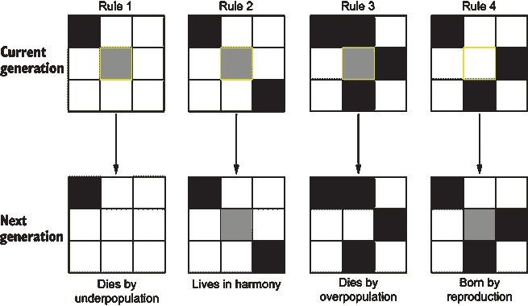

图 2.1 生命游戏规则

运行下一个单元格，并观察输出，如图 2.2 所示。对于这个简单的生命模拟，起始的细胞模式很简单。还有许多其他起始位置可以产生一些令人惊叹的动画和结构。

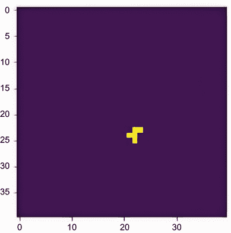

图 2.2 起始细胞位置被突出显示

由于我们并不感兴趣去探索代码的其他部分，我们可以简单地通过菜单中的“运行”>“运行所有”或通过按 Ctrl-F9，Cmd-F9 来运行整个笔记本。倒数第二个执行模拟的单元格需要几分钟才能运行，但在此过程中，会显示一个进度条。当模拟完成后，我们最初设置的第一个函数 `show_video` 会在输出中显示一个简短的视频剪辑。

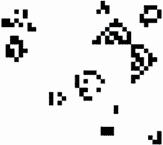

图 2.3 观看模拟视频

在过程完成后播放视频，并观察细胞模拟的运行情况。视频的摘录如图 2.3 所示，突出了细胞网络可以扩展到多么广阔。

生命游戏的简单性和优雅展示了计算机模拟的力量，并催生了许多学科。它展示了如何使用简单的规则来模拟生命，但也可以根据一些非常基本的规则和输入生成新的和未预见的解决方案。

虽然自从路径生命模拟以来看起来显著不同，但我们通常试图坚持康威在这第一次模拟中赞美的简单原则：推导出一套简单的规则，以模拟更复杂的过程，目的是揭示一些未预见的模式或解决方案。这个目标有助于我们在本章和未来的章节中了解进化计算的方法。

## 2.2 使用 Python 模拟生命

在我们探讨使用进化或其他方法推导更复杂的生命模拟形式之前，查看一个简单的、人为的实现是有帮助的。我们继续探讨模拟细胞生命，但这次，我们只考虑细胞的属性，忽略物理条件。

地理空间生命和代理模拟

使用空间或空间表示的模拟，如生命游戏，仍然用于进行各种建模和预测，从交通到像 COVID-19 这样的病毒传播。这些类型的模拟可以很有趣去探索和运行，但不会是我们在 EDL 中的重点。相反，我们的空间关注点更侧重于数学驱动，这意味着我们更多地关注分析向量或图距离，而不是物理空间。

在下一个练习中，我们将跳转到 Colab 上的 Python 代码，演示一个简单的细胞生命模拟。请记住，这是一个人为的例子，仅用于展示一些基本概念，以及在某种程度上说明不应该做什么。随着我们进入本章，示例将演变成一个完整的进化方法。

在浏览器中打开笔记本 EDL_2_2_Simulating_Life.ipynb。如需帮助，请参阅附录。

通常情况下，笔记本中的前几个单元格会安装或设置任何额外的依赖项，并执行一般导入。运行单元格以执行导入，如下所示。

列表 2.1 EDL_2_2_Simulating_Life.ipynb：使用 `import`

```
import random                               ❶
import time                                 ❷
import matplotlib.pyplot as plt             ❸
from IPython.display import clear_output    ❹
```

❶ 用于生成随机数

❷ 用于跟踪时间和等待

❸ 用于显示图表

❹ 用于清除笔记本单元格输出

移动到下一个笔记本单元格。此代码块设置了一个创建新细胞以及根据所需后代数量生成单元格列表或集合的函数。运行此单元格，您将看到单元格的示例列表，如下所示。

列表 2.2 EDL_2_2_Simulating_Life.ipynb：使用 `create_cell` 和 `birth`

```
def create_cell():
  return dict(health = random.randint(1, 100))        ❶

def birth(offspring):
  return [create_cell() for i in range(offspring)]    ❷

cells = birth(10)                                     ❸
print(cells)
```

❶ 创建一个具有 1-100 之间随机健康值的单元格

❷ 创建一个大小为后代的细胞列表

❸ 使用出生函数构建单元格列表

下面的列表定义了繁殖和死亡代码/规则。与生命游戏不同，此示例使用一个预定义的参数，称为 `RPRD_RATE`，来定义新细胞被创建的可能性。同样，代码还根据随机评估检查细胞死亡。

列表 2.3 EDL_2_2_Simulating_Life.ipynb：繁殖和死亡

```
RPRD_RATE = 25                          ❶
DEATH_RATE = 25                         ❶

def reproduce(cells):                   ❷
  return [create_cell() for cell in cells if random.randint(1, 100) < 
  ➥ RPRD_RATE]  

def death(cells):                       ❸
  return [cell for cell in cells if random.randint(1, 100) > DEATH_RATE ]

def run_generation(cells):              ❹
  cells.extend(reproduce(cells))
  return death(cells)
```

❶ 定义繁殖和死亡的速率

❷ 对于每个细胞，根据速率繁殖新细胞

❸ 对于每个细胞，根据死亡变化让细胞存活

❹ 运行一代细胞的繁殖和死亡

运行最后一个代码单元格以创建繁殖和死亡函数；这设置了基本的生命模拟函数。在这个阶段，由于我们只是在设置函数，所以不会有任何输出。

接下来，跳转到最后一个单元格。这个单元格执行模拟，我们现在的唯一目标是增加单元格`人口`，如下所示。

列表 2.4 EDL_2_2_Simulating_Life.ipynb：繁殖和死亡

```
{top code omitted}
cells = birth(initial_offspring)   ❶

history = []
for i in range(generations):       ❷
  cells = run_generation(cells)    ❸
  history.append(len(cells))  
  clear_output()                   ❹
  plt.plot(history)                ❹
  plt.show()
  time.sleep(1)                    ❺
```

❶ 创建一个新的细胞列表

❷ 遍历代数数量

❸ 在细胞上运行一代（繁殖/死亡）

❹ 清除输出，并绘制人口更新的历史图表

❺ 睡眠一秒钟，以便可以看到图表

运行这个单元格，并观察模拟的运行。如果繁殖和死亡速率设置正确，`人口`应该会增加。你可以使用 Colab 表单滑块修改驱动模拟的参数，如图 2.4 所示。你可以返回并更改参数，然后再次运行最后一个笔记本单元格以查看更新的模拟结果。

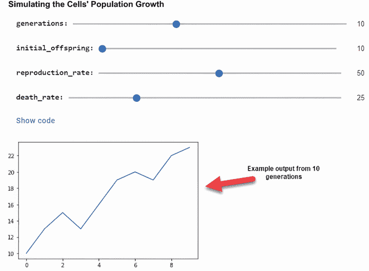

图 2.4 在 Colab 中运行模拟和更改参数

本练习的目标仅仅是设置一个简单的细胞模拟，并尝试让`人口`增长。我们定义了速率来控制细胞的繁殖和死亡。这个模拟没有太多的优雅性，但它易于理解和使用。使用下一节的学习练习来理解这个基本的生命模拟。

### 2.2.1 学习练习

每个部分的结尾都有一个练习集，帮助你回顾各个部分的代码和概念。花时间完成这些练习将极大地帮助你理解未来的概念：

1.  修改`代数`和`初始后代`参数以查看这对结果的影响。

1.  修改出生率和死亡率以查看这对最终`人口`的影响。

1.  看看你是否能找到一个繁殖和死亡率，它会导致`人口`增长下降。

现在我们已经了解了如何轻松地模拟生命，我们继续了解为什么在特定应用中我们想要这样做。

## 2.3 生命模拟作为优化

在这种情况下，我们使用我们之前的简单例子，并将其提升到对单元格上定义的属性进行优化的水平。我们可能开发模拟以进行各种形式的行为发现、优化或启迪的原因有很多。对于大多数进化算法的应用，我们的最终目标是优化一个过程、参数或结构。

在这个笔记本中，我们将每个单元格的属性从`健康`扩展到包括一个名为`力量`的新参数。我们的目标是优化整个`人口`的细胞力量。`力量`参数代表任何使生物在其环境中成功的特征。这意味着在我们的简单例子中，我们的目标是最大化整个`人口`的`力量`。

在你的浏览器中打开笔记本示例 EDL_2_3_Simulating_Life.ipynb。如果需要帮助，请查看附录。

我们在这个书中使用了一个有用的实时绘图库，称为 LiveLossPlot，来展示几个示例。这个库旨在用于绘制机器学习和深度学习问题的训练损失，因此默认图表中包含我们在深度学习问题中会使用的术语。尽管如此，它非常适合我们的需求。以下列表展示了安装该包并导入`PlotLosses`类。

列表 2.5 EDL_2_3_Simulating_Life.ipynb：安装`PlotLosses`

```
!pip install livelossplot –quiet      ❶

from livelossplot import PlotLosses   ❷
```

❶ 在 Colab 中安装 livelossplot 包

❷ 加载 PlotLosses 类以供后续使用

这个例子中的大部分代码与上一个例子共享，因此我们只需关注这里的差异。从第一个代码单元开始，我们可以看到以下列表中定义生命模拟的函数中的一些变化。最大的变化是我们现在使用新的`strength`参数来推导细胞的`health`。

列表 2.6 EDL_2_3_Simulating_Life.ipynb：生命函数更新

```
def create_cell():
  return dict(
      health = random.randint(1, 100),
      strength = random.randint(1, 100)     ❶
    )                     

def birth(offspring):
  return [create_cell() for i in range(offspring)]

def evaluate(cells):                        ❷
  for cell in cells:
    cell["health"] *= cell["strength"]/100  ❸
  return cells
```

❶ 将强度参数添加到细胞中

❷ 新的评估函数计算细胞健康。

❸ 细胞健康成为强度的函数。

同样，繁殖和死亡函数也被修改，不再随机选择细胞进行繁殖或死亡。相反，新的函数根据健康属性确定细胞是否繁殖或死亡。注意以下列表中新增加了两个参数——`RPRD_BOUNDS`和`DEATH_BOUNDS`。这些新参数控制细胞在什么健康水平下可以繁殖或何时应该死亡。

列表 2.7 EDL_2_3_Simulating_Life.ipynb：新的繁殖和死亡函数

```
def reproduce(cells):            ❶
  return [create_cell() for cell in cells if cell["health"] > RPRD_BOUNDS]

def death(cells):                ❷
  return [cell for cell in cells if cell["health"] > DEATH_BOUNDS]

def run_generation(cells):       ❸
  cells = evaluate(cells)        ❹
  cells.extend(reproduce(cells))
  return death(cells)
```

❶ 繁殖现在将健康与 RPRD_BOUNDS 进行比较。

❷ 死亡比较细胞健康是否超过 DEATH_BOUNDS。

❸ 细胞健康成为强度的函数。

❹ 添加一个新的评估函数，根据强度更新细胞健康

对于这个模拟，我们根据细胞健康制定了细胞死亡或繁殖的显式规则。记住，我们模拟的目标是优化细胞的`population strength`属性。

跳转到最后一个代码单元；我们对生成输出做了一些额外的更改，但除此之外，模拟代码基本上保持不变。以下列表中的新代码使用`PlotLosses`类来输出模拟运行时的实时图表。

列表 2.8 EDL_2_3_Simulating_Life.ipynb：绘制结果

```
cells = birth(initial_offspring)

groups = {'Population': ['population'], 'Attributes' : 
➥ ['avg_strength','avg_health']}       ❶
liveloss = PlotLosses(groups=groups)

history = {}
for i in range(generations):  
  cells = run_generation(cells)  
  history["population"] = len(cells)    ❷
  history["avg_strength"] = sum([cell["strength"] for cell in 
  ➥ cells])/(len(cells)+1) 
  history["avg_health"] = sum([cell["health"] for cell in 
  ➥ cells])/(len(cells)+1) 
  liveloss.update(history)
  liveloss.send()                       ❸
```

❶ 设置绘图组以生成输出图表

❷ 更新历史字典以跟踪变量。

❸ 将输出发送到图表

您可以通过菜单中的“运行”>“运行所有”或使用 Ctrl-F9，CMD-F9 来运行整个笔记本。图 2.5 显示了运行 25 代模拟的输出。注意左边的属性图，平均强度和健康都呈上升趋势。

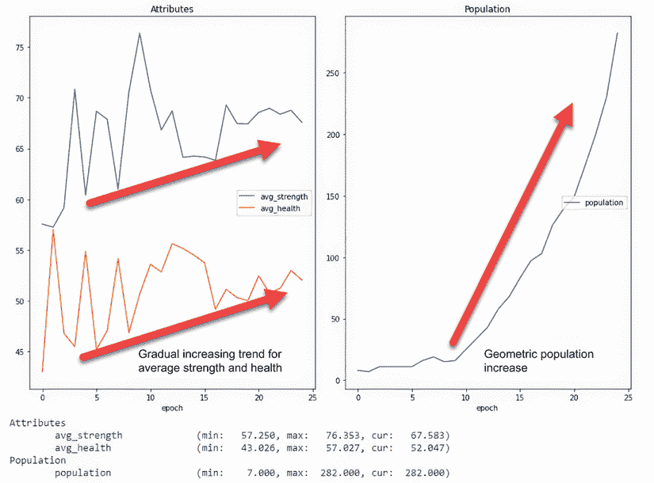

图 2.5 模拟运行输出

通过修改我们的生命模拟代码，我们能够展示单个属性`strength`的大致优化。虽然我们可以看到`population`的`strength`和`health`属性逐渐增加，但结果并不令人印象深刻。事实上，如果我们的生命模拟要复制现实世界，那么我们很可能永远不会进化成现在的我们。

我们生命模拟中缺失的关键是细胞将它们的成功性状传递给后代的能力。查尔斯·达尔文首先观察到，生命通过他称之为*进化*的过程将成功性状传递给后代。事实证明，这个进化理论不仅是地球上的生命，也是进化计算的基石。

### 2.3.1 学习练习

使用这些快速练习来帮助提高你对概念的理解：

1.  修改死亡率和出生率参数，看看这对结果有什么影响。

1.  修改列表 2.6 中的`evaluate`函数，以改变返回的健康参数，然后重新运行模拟并看看有什么影响。

1.  修改列表 2.6 中的`create_cell`函数中`health`和`strength`的起始值。

模拟作为一种优化形式，是一个多样化的领域，但我们在下一节以及本书的其余部分将专注于模拟进化以进行优化。

## 2.4 将进化添加到生命模拟中

将我们的生命模拟提升到下一个层次需要我们模拟进化。虽然这可能听起来很困难，但实现起来相对简单且优雅。在接下来的练习中，我们借鉴了达尔文和其他人的许多观察结果来构建我们的升级版生命模拟。

### 2.4.1 模拟进化

再次，在这个练习中，我们借鉴了前一个练习的大部分代码，修改它来模拟进化或细胞传递选择性性状的能力。然而，这一次，我们不是使用像力量这样的单一性状，而是分配了三个新的性状，分别标记为`a`、`b`和`c`。此外，我们将`health`性状替换为一个更通用的术语，称为`fitness`。

在浏览器中打开笔记本示例 EDL_2_4_Simulating_Evolution.ipynb。如果你需要帮助做这件事，请查阅附录。

这段代码有几个升级，我们将详细检查，首先是更新的`create_cell`函数。在这里，重要的是要注意，该函数现在接受两个输入细胞或两个细胞来产生一个后代。例如，如果在模拟开始时没有亲本，那么性状将被设置为随机值。如果有亲本，那么每个性状的平均值将成为孩子的新的值，如下面的列表所示。请记住，这种平均机制只是创建新孩子性状值的一种可能性。

列表 2.9 EDL_2_4_Simulating_Evolution.ipynb：更新`create_cell`

```
def create_cell(parent1, parent2):                 ❶
  if parent1 is None or parent2 is None:
    return dict(
        fitness = 0,                               ❷
        a = random.randint(1, 100),                ❸
        b = random.randint(1, 100),
        c = random.randint(1, 100)
      ) 
  else:    
    return dict(
        fitness = 0,                               ❷
        a = (parent1[“a”] + parent2[“a”])/2,       ❹
        b = (parent1[« b »] + parent2[« b »])/2,   ❹
        c = (parent1[« c »] + parent2[« c »])/2,   ❹
      )       
```

❶ 现在需要两个亲本细胞来繁殖。

❷ 适应性始终从 0 开始。

❸ 如果没有亲本，性状将初始化为随机值。

❹ 新的性状值是两个亲本的平均值。

接下来，我们查看更新的 `reproduce` 函数。这里有一些变化。首先，我们按 `fitness` 对父母细胞进行排序，然后通过一个称为 `selection` 的过程选择上半部分。其次，我们对剩余的父母进行两次循环（每个父母两个子代）并随机选择两个进行交配。然后，这两个父母被传递给 `create_cell` 以产生具有来自两个父母共享特征的新的子代。最后，细胞通过一个新的 `mutate` 函数，然后返回。下面列表中使用的繁殖 `selection` 形式只是一个例子；我们将看到，这里有许多变体。

列表 2.10 EDL_2_4_Simulating_Evolution.ipynb：更新 `reproduce`

```
def reproduce(cells): 
  parents = sorted(cells, key=lambda d: 
  ➥ d[‘fitness’])[int(len(cells)/2):]                  ❶
  children = [] 
  for I in range(len(parents)*2):                       ❷
    mates = random.sample(parents, 2)                   ❸
    children.append(create_cell(mates[0], mates[1]))    ❹
  return mutate(children)                               ❺
```

❶ 按 `fitness` 排序父母并选择上半部分

❷ 对剩余的父母进行两次循环

❸ 随机选择两个父母进行繁殖

❹ 将父母传递给 create_cell 以产生子代细胞

❺ 在返回列表前对子代进行突变

在 `reproduce` 中的最后一步是调用 `mutate` 函数，如下面的列表所示，它有一个随机机会修改子代。我们添加这个函数或规则来模拟生活中生物（细胞）可能超出其父母特征的 `mutate` 随机性。突变是进化中的一个关键因素，并负责地球上所有高级生命形式。

列表 2.11 EDL_2_4_Simulating_Evolution.ipynb：`mutate` 函数

```
def mutate(cells):
  for cell in cells:
    if random.randint(1,100) < MUTATE_RATE:       ❶
      cell“"”"] = clamp(
          cell“"”"] + random.randint
          ➥ (-MUTATE_RNG, MUTATE_RNG), 1, 100)   ❷
      cell“"”"] = clamp(
          cell“"”"] + random.randint
          ➥ (-MUTATE_RNG, MUTATE_RNG), 1, 100)   ❷
      cell“"”"] = clamp(
          cell“"”"] + random.randint
          ➥ (-MUTATE_RNG, MUTATE_RNG), 1, 100)   ❷
  return cells    
```

❶ 检查细胞突变的随机机会

❷ 添加来自 -+ MUTATE_RNG 的随机数

接下来，我们要查看更新的 `evaluate` 函数。这次我们使用一个简单的方程来 `evaluate` 特征 `a`、`b` 和 `c` 的值，该方程输出细胞的 `fitness`。我们可以看到这个函数将两倍的价值放在特征 `a` 上，对特征 `b` 附加一个负值，而特征 `c` 保持不变，如下面的列表所示。我们进化生命模拟的目标现在是通过优化这些特征来保持高 `fitness`。更高的 `fitness` 有助于提高繁殖的可能性，从而鼓励那些成功的特征得到进一步的传承。

列表 2.12 EDL_2_4_Simulating_Evolution.ipynb：`mutate` 函数

```
def evaluate(cells):
  for cell in cells:
    cell“"fitnes”"] = 2 * cell“"”"]–- cell“"”"] + cell“"”"]    ❶
  return cells    
```

❶ 更新的 `evaluate` 函数

注意，我们移除了 `death` 函数，而是专注于 `reproduce` 函数。我们可以这样做，因为我们现在简单地假设繁殖后，所有父母都无法进一步繁殖；因此，这不是一个考虑因素。因此，我们不再关心 `population` 的增加，而是关注繁殖 `population`。这个假设简化了我们的过程和模拟的性能，并且是我们继续在大多数情况下使用的一个假设。显然，你也可以模拟跨多代的繁殖，但我们现在认为这是一个高级主题。

最后，我们来看看`run_generation`函数，看看它是如何简化的。在函数内部，第一次调用是`evaluate`，它更新细胞的`fitness`。接下来，调用`reproduce`函数来产生下一个繁殖`generation`。之后，我们再次在新的`generation`上调用`evaluate`函数来更新`fitness`值，如下所示。

列表 2.13 EDL_2_4_Simulating_Evolution.ipynb：`run_generation`函数

```
def run_generation(cells):  
  cells = evaluate(cells)    ❶
  cells = reproduce(cells)   ❷
  cells = evaluate(cells)    ❶
  return cells    
```

❶ 评估当前和新生代的`fitness`

❷ 产生一个新的繁殖`generation`

图 2.6 显示了运行所有代码的输出（从菜单中选择“运行”>“运行所有”或按 Ctrl-F9，CMD-F9）。注意图 2.5 和 2.6 之间的明显差异，其中`fitness`有明显的改进，但`population`保持在 10。同时注意特性`a`、`b`和`c`都显示出良好的定义优化。在特性`a`的情况下，我们看到一个明显的增加，而在特性`b`的情况下，我们看到一个减少。这是`evaluate`函数和我们定义这些特性在`fitness`方程中的方式的结果。

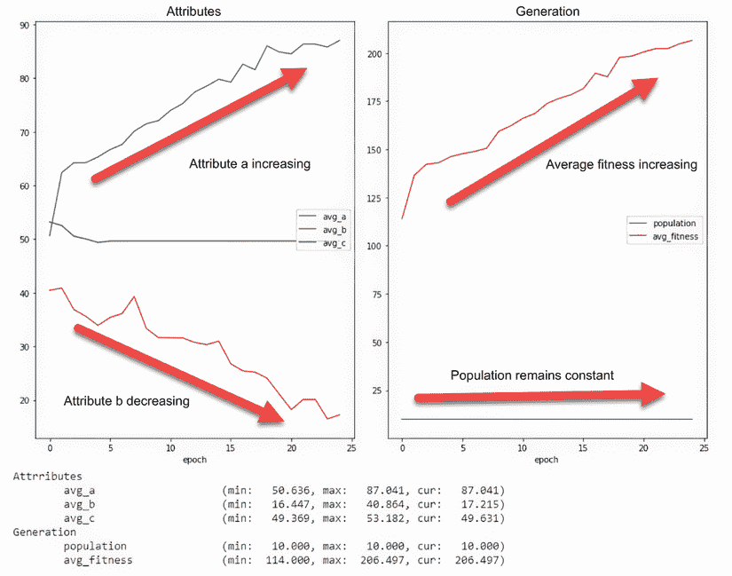

图 2.6 运行进化生命模拟的结果

我们可以看到，通过将进化的概念添加到生命模拟中，我们能够看到`fitness`和特性优化之间的强烈相关性。这不仅使修改后的模拟更加优雅，而且更加健壮和可扩展。事实上，如此优雅，简单的进化概念现在成为了一类算法的骨干，其中许多我们在后面的章节中进行了探讨。

### 2.4.2 学习练习

使用这些练习来提高你的理解：

1.  修改 2.12 列表中所示的`evaluate`函数中的`fitness`计算。重新运行进化过程以确认新方程优化了不同的值。

1.  向细胞添加一个新的属性`d`。这需要你修改 2.9、2.11 和 2.12 列表。

1.  将`mutation`率`MUTATE_RATE`更改为`0`和`1`之间的新值。尝试几次，然后在每次更改后重新运行笔记本。观察`mutation`对细胞进化的影响。

### 2.4.3 关于达尔文和进化的背景知识

查尔斯·达尔文从他在南美洲大陆的航行中形成了他的初步概念和自然选择理论。从达尔文的工作中，我们对理解进化的渴望驱使我们探索地球上的生命如何通过遗传学共享和传递选择性特性。

经过二十年的写作，达尔文在 1859 年发表了其最著名的工作，《物种起源》（由约翰·默里出版），这是一部开创性的作品，颠覆了自然科学。他的工作挑战了智能创造者的观点，并成为我们今天自然和生物科学的基础。书中以下引用描述了达尔文对自然选择的看法：“不是最强的物种能够生存下来，也不是最聪明的物种，而是那些最能适应变化的物种。”

从这个定律出发，达尔文构建了他的进化理论，以及生命为了生存而将更成功的特征传递给后代的必要性。尽管他并不理解细胞有丝分裂和遗传学的过程，但他观察到了多个物种中特征的选择性传递。直到 1865 年，一位名叫格雷戈尔·孟德尔的德国僧侣才会通过观察豌豆植物的七个特征来概述他的基因遗传理论。

孟德尔使用*因子*或*特征*来描述我们现在所理解的基因。他的工作几乎又过了三十年才得到认可，遗传学领域才诞生。从那时起，我们对遗传学的理解已经扩展到包括基因治疗和破解复杂问题以及进化代码等领域。

### 2.4.4 自然选择和适者生存

“适者生存”这个术语经常被用来定义进化以及随后的进化计算。虽然这个术语通常被错误地归功于达尔文，但它最初是由一位早期的自然学家赫伯特·斯宾塞使用的，他比达尔文早 7 年提出了这个短语。斯宾塞，一个误入歧途的社会进化论者，会继续成为达尔文及其对进化的解释的批评者。

定义 *社会达尔文主义*——通常归功于赫伯特·斯宾塞的观点，即社会成功孕育成功，而那些在社会上失败的人天生注定要失败。

斯宾塞和其他人从达尔文的更大进化理论中遗漏的是，生存只是变化的一个后果。达尔文很好地解释了这个概念：“不是最强的物种能够生存下来，也不是最聪明的物种，而是那些最能适应变化的物种。”

在我们阅读这本书的章节时，没有什么比记住达尔文的这句话更好的想法了。进化不是关于发展最强壮或最适应的物种，而是关于能够最好地适应变化的物种。在实践意义上，这意味着虽然我们专注于开发产生最多`适应性`的算法，但我们的真正目标是发展进化变化。

在计算中，进化变化通过确保不仅仅是最强壮或最好的个体能够存活下来，被应用于我们的算法中。这意味着我们采用方法确保一个`种群`中的`个体`不仅仅是最好的，而是最多样化的。鼓励`种群`中的多样性通常能让我们更快地解决问题。

生物学应用于进化计算

进化计算借鉴了生物学和进化理论。并且像 DL（神经网络）与大脑的比较一样，并非所有术语都可以转移。在几个案例中，尝试使用与生物等效物相似或匹配的术语。在许多情况下，生物学术语已经被显著简化，以便更容易理解。这样做不是为了激怒生物学家、遗传学家或进化论者，而是为了让术语更容易接近。

## 2.5 Python 中的遗传算法

遗传算法（GAs）是代码中生命的模拟，借鉴了进化、自然选择和通过遗传传递成功特性的概念。这些算法模拟了在高级有机繁殖中发生的生物细胞级别的减数分裂。虽然你不需要成为遗传学家就能使用遗传算法，但了解生物关系可能会有所帮助。

在下一节中，我们回顾了一些遗传学的重要基本概念和减数分裂的过程。这是为了展示代码中遗传的关系和模仿。当然，如果你已经在遗传理论和减数分裂方面有很强的基础，你可以快速浏览这一节。

### 2.5.1 理解遗传学和减数分裂

遗传算法模拟了遗传层面的生命进化。然而，这种模拟更具体地针对高级生命形式——就像我们。我们在遗传过程（减数分裂）中也做了几个简化。因此，本节中涉及的概念旨在达到相同的高级水平。

每当我们谈论遗传学时，我们都需要从*脱氧核糖核酸*（通常称为 DNA）开始。DNA 链通常被称为生命的蓝图。关于我们的一切，包括我们的细胞，都在我们的 DNA 中定义。

DNA 本身由四种碱基对组成，这些碱基对排列成一定的模式。图 2.7 展示了 DNA 的形成和缠绕成双螺旋结构，然后折叠成染色体。这些染色体位于每个细胞的细胞核中，如图所示。

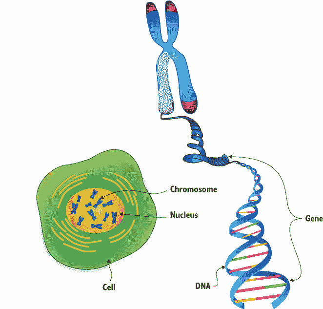

图 2.7 DNA、基因、染色体、细胞核和细胞

基因，那些孟德尔最初定义的事物，可以在 DNA 层面上被识别。*基因*是一段 DNA 序列，它定义了生物体的某些特征或属性。从 1990 年到 2003 年，人类基因组计划研究了并分类了我们染色体内的所有基因。

如图 2.7 所示，*染色体*是这些基因序列的容器。单个染色体可能包含数百或数千个基因。每个基因本身可能由数百到数千个 DNA 碱基对组成。这一切听起来相当复杂，但幸运的是，在遗传算法（GA）中，我们只关心基因和染色体。

遗传进化的模拟本身是通过模拟减数分裂的过程来完成的。*减数分裂*是精子和卵子细胞的性繁殖过程，不要与*有丝分裂*混淆，后者是基本细胞分裂的过程。

减数分裂是半个生物体的遗传物质与另一个生物体的一半遗传物质结合的过程。在人类中，这是精子与卵子的故事，其中男性将其一半的 DNA（精子细胞）与女性的一半 DNA（卵子）结合。

图 2.8 展示了减数分裂过程的一个片段，其中交配生物的染色体被结合。在这个过程中，同源染色体对（即相似的染色体）首先对齐。然后，发生交叉，即遗传物质的共享。由此产生的重组染色体被用来定义新的生物体。

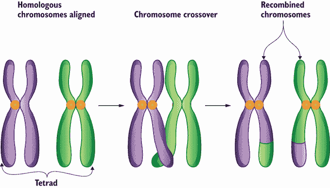

图 2.8 细胞减数分裂过程的一个片段，展示了染色体的交叉

在遗传算法（GAs）中，我们在细胞层面上模拟基因、染色体以及这种交配或交叉过程。我们还需要模拟其他一些因素，这些因素将在下一节中介绍。

### 2.5.2 编码遗传算法

遗传算法（GA）的核心是描述个体所具有的各种特征（无论是好是坏）的`基因`。在 GA 中，我们认为一个`个体`由一个或多个包含在`染色体`内的`基因`序列组成。我们也可以模拟多个`染色体`，但通常我们只使用一个。

图 2.9 显示了一个`个体`的`种群`，每个`个体`在`染色体`中都有一个`基因`序列。每个`基因`由一个数字或布尔值描述，代表此例中的 0 或 1。一个`基因`可以包含任何信息，包括文本字符、颜色或您想要用来描述个体特征的任何其他信息。


图 2.9 遗传算法中的`种群`、`基因`和`染色体`

基因和染色体

一个`基因`可以映射到一个单一的数组值，或者可以由多个值定义。同样，您可能想要定义一个单一的`染色体`或多个。在大多数情况下，本书中我们只定义一个`染色体`。

### 2.5.3 构建种群

遗传算法（GA）可能相当抽象且难以想象，因此为了帮助理解，在本节中，我们将通过一些 Python 示例代码来阐述这些概念，这可能会使这些概念更加具体。您可以通过在浏览器中打开 Google Colab 中的笔记本 EDL_2_5_GeneticAlgorithms.ipynb 来跟随操作。如果需要帮助加载此笔记本，请参考附录。当笔记本加载完成后，使用菜单选择运行 > 运行所有来运行所有单元格。

我们可以从笔记本中的第一个代码单元格开始，它使用 NumPy 数组设置了一个`个体`的`种群`。`种群`中的每个人都是由一个大小为`基因`的单一*n*-维向量组成的。整个`种群`通过`randint`函数构建成一个 NumPy 张量，输入为`0,2`，张量的大小为`(种群,基因)`。这产生了一个输出张量，其中每一行代表一个大小为`基因`的向量，如下所示。

列表 2.14 EDL_2_5_Genetic_Algorithms.ipynb: 创建`种群`

```
population = 100                                        ❶
genes = 100                                             ❷
generations = 100                                       ❸

pop = np.random.randint(0,2, size=(population,genes))   ❹
print(pop)
========================
[[0 1 1 ... 1 0 0]                                      ❺
 [1 1 0 ... 1 1 0]
 [1 0 0 ... 1 0 1]
 ...
 [1 0 1 ... 0 0 1]
 [1 0 0 ... 0 1 0]
 [1 0 0 ... 0 0 1]]
```

❶ 整个种群中个体的数量

❷ 一个个体中的基因数量

❸ 评估的代数数量

❹ 创建一个初始随机种群，基因值为 0 或 1

❺ 打印输出的输出，显示数组中每个个体的基因序列

### 2.5.4 评估适应性

在一个`个体`种群中，我们想要确定哪个是最适应的或最有可能生存或解决问题的。在这个简单的例子中，我们的目标是进化`个体`，因此所有`基因`的值都是`1`。这被称为遗传算法中的最大一问题，是向新入门者介绍的一个常见问题。

为了确定一个`个体`的`适应性`，我们通常推导出一个`适应性`函数或计算方法，以确定一个`个体`距离达到目标目标有多近。通常，这个目标是最小化或最大化一个目标值。在这个例子中，我们的目标是最大化一个`个体`中所有`基因`的总和。由于每个`基因`只是一个`0`或`1`，最大化的总和代表一个所有`基因`都设置为`1`的`个体`，如列表 2.15 所示。

使用 NumPy，如果我们已经在张量中定义了种群，那么执行这一操作的代码非常简单，只需一行代码即可。滚动到笔记本中的下一个单元格，你可以看到调用`np.max`函数，它以`种群``pop`张量作为输入，并设置`axis=1`。下面的代码列表展示了如何通过使用`np.sum`来计算`适应性`。

列表 2.15 EDL_2_5_Genetic_Algorithms.ipynb: 计算`适应性`

```
fitness = np.sum(pop,axis=1)    ❶
plt.hist(fitness)
```

❶ 所有个体的总和（轴 1）

图 2.10 显示了种群初始随机`个体`适应性的直方图输出。正如我们可能预期的那样，输出类似于值的大致 50 左右的正态分布。在这个例子中，由于每个人都有一个包含`100`个`基因`的单个`染色体`，每个`基因`的值为`0`或`1`，因此最大理想的`适应性`分数是`100`。

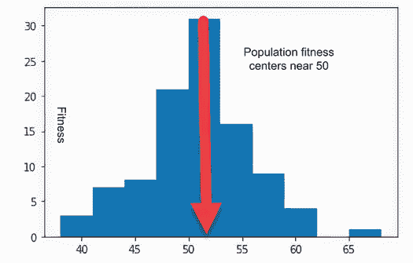

图 2.10 初始`种群`适应性的直方图

### 2.5.5 选择繁殖（交叉）

在评估了种群的`适应性`之后，我们可以确定哪些父母用于交配以产生后代。就像在现实生活中一样，我们模拟了个体的交配选择和繁殖。在自然界中，我们通常看到强壮的或适应性更强的个体生存并繁殖，产生具有部分遗传代码的后代。

在遗传算法中，我们通过首先确定种群中哪些`个体`足够适应以产生后代来模拟这个过程。我们可以使用几种策略来进行这种`选择`，但在这个简单的例子中，我们选择两个最适应的`个体`作为下一代的父母。这种`选择`形式被称为*精英选择*，执行它的代码如下所示。

列表 2.16 EDL_2_5_Genetic_Algorithms.ipynb：选择最适应的

```
def elite_selection(fitness):
  return fitness.argsort()[-2:][::-1]    ❶

parents = elite_selection(fitness)
print(pop[parents[0]])
```

❶ 按照适应性排序，然后返回前两个个体

`elite_selection` 函数接受我们之前计算的 `population` `fitness` 作为输入，并返回前两个父代的索引。它是通过使用 `argsort` 函数对 `fitness` 值进行排序，然后索引到前两个父代以返回索引。这些返回的索引可以用来通过 `pop[parents[idx]]` 从 `population` 中提取 `individuals`，其中 `idx` 为 `0` 或 `1`。

对于这个简单的例子，*精英选择*，即选择最佳的 `individuals` 进行繁殖，效果很好，但在更复杂的问题中，我们通常使用更多样化的 `selection` 方法。父母和配对 `selection` 中的多样性允许 `individuals` 传播那些在短期内可能不利的特征，但可能发展为长期解决方案。这类似于求解全局最大值并陷入局部最小值。

### 2.5.6 应用交叉：繁殖

在选择父母后，我们可以继续应用 `crossover` 或本质上创建子代的繁殖过程。在生物学中的细胞分裂过程中，我们通过 `crossover` 操作模拟 `chromosomes` 的结合，其中每个父代分享其 `gene` 序列的一部分并与另一个父代结合。

图 2.11 显示了使用两个父代应用 `crossover` 操作。在 `crossover` 中，随机选择或使用某种策略沿着 `gene` 序列选择一个点。在这个点上，父代的 `gene` 序列被分割并重新组合。在这个简单的例子中，我们不在乎每个子代与 `gene` 序列共享的百分比是多少。

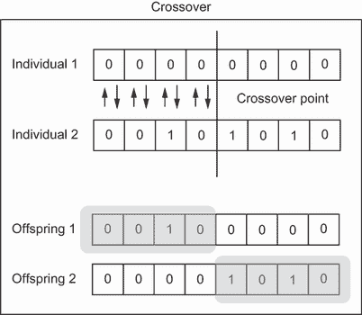

图 2.11 对父母应用 `crossover` 操作以产生子代

对于需要成千上万或数百万 `generations` 的更复杂问题，我们可能更喜欢更平衡的 `crossover` 策略，而不是这种随机的 `selection` 方法。我们将在本章后面进一步介绍我们可以使用的策略来定义此操作。

在代码中，`crossover` 操作首先复制自身以创建原始子代。然后我们使用变量 `crossover_rate` 随机确定是否存在 `crossover` 操作。如果存在 `crossover` 操作，则生成一个沿 `gene` 序列的随机点作为 `crossover` 点。这个点用于分割 `gene` 序列，然后通过以下列表将两个父代的 `gene` 序列组合起来生成子代。

列表 2.17 EDL_2_5_Genetic_Algorithms.ipynb：`Crossover` 和繁殖

```
def crossover(parent1, parent2, crossover_rate):  
  child1, child2 = parent1.copy(), parent2.copy()             ❶

  if random.random() < crossover_rate:                        ❷

    pt = random.randint(1, len(parent1)-2)                    ❸

    child1 = np.concatenate((parent1[:pt], parent2[pt:]))     ❹
    child2 = np.concatenate((parent2[:pt], parent1[pt:]))     ❹

  return [child1, child2]

crossover(pop[parent[0]],pop[parent[1]], .5)                  ❺
```

❶ 子代最初是父母的副本。

❷ 随机允许交叉操作。

❸ 随机选择交叉点

❹ 交叉并创建子代。

❺ 使用父代 1 和 2 调用函数

在基因序列中，`交叉`可以以多种变体和方式应用。对于这个例子，选择一个随机的`交叉`点，然后简单地结合分裂点的序列即可。然而，在某些情况下，特定的`基因`序列可能或可能没有意义；在这些情况下，我们可能需要其他方法来保留`基因`序列。

### 2.5.7 应用变异和变体

在自然界中，我们偶尔会看到后代发展出父母双方都不具备的特征。在这些情况下，后代发生变异，导致出现父母双方未见过的特征。随着时间的推移，这些变异可以累积，创造出全新的特征或个体物种。变异是我们认为生命从单细胞生物进化到人类的关键操作。

在自然界中，遗传算法（GAs）和其他类似的进化过程中，变异通常是独特且罕见的。使用遗传算法，我们可以在`交叉`操作之后控制变异的数量和类型。因此，你可以将变异视为在笨拙的繁殖过程中可能出现的潜在奇怪产物。

在列表 2.18 的后代中应用`变异`操作就像翻转序列中的单个比特或`基因`一样简单。在`变异`函数中，对`个体`中的每个`基因`都进行了变异可能性的测试。为了测试函数，我们使用`.5`的`变异率`，即 50%，尽管通常变异率要低得多——低于 5%。

列表 2.18 EDL_2_5_Genetic_Algorithms.ipynb: `变异`

```
def mutation(individual, mutation_rate):
  for i in range(len(individual)):         ❶

    if random.random() < mutation_rate:    ❷
      individual[i] = 1 - individual[i]    ❷
  return individual

mutation(pop[parent[0]], .5)
```

❶ 我们对所有基因进行可能的变异测试。

❷ 如果进行变异，将基因 0 -> 1，1 -> 0。

同样，与`选择`和`交叉`的遗传操作一样，`变异`也可以采取多种形式。在某些情况下，你可能更喜欢保持`变异`的可能性低，而在其他情况下，一个`种群`可能从更多的随机影响中受益。`变异`类似于深度学习中的学习率，较低的学习率会导致更稳定的训练，但可能会陷入停滞，而较高的学习率会产生良好的初始结果，但可能永远不会稳定到解决方案。

### 2.5.8 整合所有内容

最后，当我们把所有的遗传操作整合在一起时，我们得到图 2.12 所示的流程图，它展示了整个遗传算法过程。在这个图中，我们从初始化开始，在我们的例子中，这是完全随机的。然后，第一个操作是计算所有`个体`的`适应度`。从`适应度`中，我们可以确定哪些`个体`将通过`交叉`操作繁殖后代。

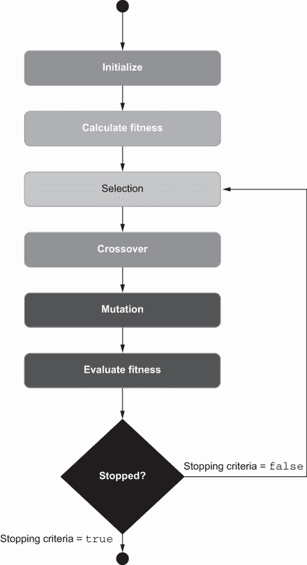

图 2.12 遗传算法过程

在应用交叉操作后，应用变异，然后评估`适应度`。接下来，我们检查是否满足停止条件。通常，我们通过 GA 运行的`代`数来定义停止条件，其中每一代都被计为一个完整的 GA 流程。我们也可以使用其他停止条件，如达到最大或最小`适应度`。

我们可以将所有遗传算法（GA）的过程代码放入一个单独的函数中，如`simple_GA`函数所示。在这个函数中，我们可以看到对`种群`应用的每个遗传操作，这导致了新一代的子代。如下面的代码列表所示，这个子代`种群`被返回，以供进一步评估，并作为新一代传递给`simple_GA`。

列表 2.19 EDL_2_5_Genetic_Algorithms.ipynb：完整的 GA 过程

```
def simple_GA(pop, crossover_rate=.5, mutation_rate=.05):
  fitness = np.sum(pop,axis=1)                            ❶

  parents = elite_selection(fitness)                      ❷

  children = np.zeros((population,genes))                 ❸

  for i in range(population):                             ❹
    offspring = crossover(pop[parents[0]],
    ➥ pop[parents[1]], crossover_rate)                   ❺
    children[i] = mutation(offspring[0],mutation_rate)    ❻
  return children

simple_GA(pop)                                            ❼
```

❶ 计算整个`种群`的适应度

❷ 执行选择以选择父母

❸ 创建一个所有元素为 0 的空子代`种群`

❹ 遍历整个`种群`以创建新的子代

❺ 应用交叉

❻ 应用变异

❼ 每次调用代表一代。

这个单独的函数`simple_ga`代表对`种群`或`个体`的`代`的所有遗传操作的一个完整过程。我们可以使用笔记本中最后一个代码块中的代码来评估连续的`代`。如果笔记本已经完成训练，再次运行最后一个单元格，这允许你看到`种群`是如何进化的。下面的代码列表演示了模拟每个`代`进化的循环。

列表 2.20 EDL_2_5_Genetic_Algorithms.ipynb：运行模拟

```
pop = np.random.randint(0,2, size=(population,genes))   ❶

for i in range(generations):                            ❷
  pop = simple_GA(pop)
  fitness = np.sum(pop,axis=1)
  plt.hist(fitness)
  plt.show()
  print(f"Generation {i+1}")
  print(f"    Max fitness {np.max(fitness)}")
  print(f"    Min fitness {np.min(fitness)}")
  print(f"    Mean fitness {np.mean(fitness)}")
  print(f"    Std fitness {np.std(fitness)}")
```

❶ 创建一个初始随机`种群`

❷ 遍历代数并处理 GA

图 2.13 显示了通过 100 代进化`种群`的结果。图中显示达到了`98`的`适应度`，最小`适应度`为`88`，平均为`93.21`，标准差为`2`。这些结果通常都是好的，并且与深度学习（DL）不同，在深度学习中，我们关注的是最大或最小损失或准确度，而在遗传算法（GA）中，我们希望确定整个`种群`的进步情况。

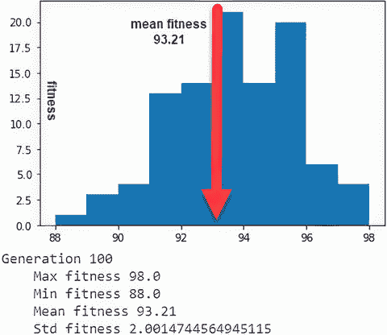

图 2.13 在单最大问题上的`种群`进化结果

虽然单个`个体`的`适应度`可以解决一个困难的问题，但确保整体保持一个健康的`种群`可以允许持续进化。与深度学习（DL）不同，在深度学习中，训练进度可能会随时间放缓，在遗传算法（GA）中，进化过程中往往会有晚期的突破，导致解决方案的激进变化和进步。因此，当我们使用进化算法时，通常希望考虑整个`种群`的`适应度`。

适应性生存

记住，我们训练进化算法的目标始终是确保`种群`能够适应变化。这意味着我们通常希望看到`个体`的`种群`得分一个正常的`适应度`分布。我们可以通过选择和突变操作符的类型和形式来控制这种适应变化。

### 2.5.9 理解遗传算法超参数

正如你可能已经注意到的，GA 为我们提供了几个超参数和遗传操作符选项，以优化解决方案的进化。我们在本章中探讨了各种操作符选项，因为这些选项对于理解我们可以使用哪些超参数来增强进化至关重要。以下是我们迄今为止探索的遗传超参数列表以及它们的工作方式和用途：

+   *种群*—这代表通过每一代进化模拟的`个体`数量。`种群`值与`染色体`的大小或基因序列长度密切相关。因此，具有更复杂`基因`序列的`个体`需要更大的训练`种群`才能有效。

+   *基因/染色体长度*—`染色体`的数量和长度或`基因`的类型通常由问题设定。在先前的示例练习中，我们选择了一个任意的`基因`数量值来展示不同的`基因`序列长度。

+   *代数*—类似于深度学习中的 epoch，`代数`的数量代表进化的迭代次数。`训练`一词保留用于`个体`的改善，在 GA 中，我们进化整个物种或`个体`的`种群`。与`种群`一样，`代数`的数量通常由`染色体`长度和复杂性决定。这可能与`种群`大小相平衡，你可能有大型`种群`和少量`代数`。

+   *交叉率*—这可能决定了交叉的可能性，或者它可能规定了交叉的点或量。在最后的示例中，我们使用这个比率来确定父母共享`基因`的频率。然而，在大多数情况下，交叉是假设的，比率然后可能决定交叉点。

+   *突变率*—这解释了在`交叉`混合过程中可能出现错误的可能性。高突变率通常会导致`种群`中产生大量变异，这可能对更复杂的问题有益。然而，高突变率也可能阻止`个体`达到最佳性能。相反，较低的突变率会产生较少的`种群`多样性和更多的专业化。

在这一点上，了解这些超参数在实际中如何工作的一个好方法是回到最后的示例并更改它们，然后重新运行笔记本。请尝试这样做，因为这确实是学习和理解这些基本值如何改变`种群`进化的最佳方式。

遗传算法（GAs）为我们探索的以下章节中的几种进化计算（EC）方法奠定了基础。从根本上说，进化和适者生存的概念是任何 EC 方法的关键组成部分。我们在寻找优化深度学习（DL）系统更好方法的过程中，使用了达尔文 170 多年前提出的这些普遍规律。

### 2.5.10 学习练习

在本节中，我们已经涵盖了大量的基础材料。请确保至少完成以下练习之一：

1.  修改列表 2.15 中的`适应度`计算。看看这会对进化产生什么影响。

1.  修改列表 2.19 中的`交叉`和`变异`率。重新运行进化过程，看看改变每个参数对进化速度的影响。

1.  你能想到其他父母选择配偶的方式吗？把它们写下来，稍后再回顾这个列表。

## 概述

+   康威生命游戏（Conway’s Game of Life）展示了基于规则的生命模拟的第一种基本形式。生命模拟可以帮助我们优化计算和模拟的实际情况问题。

+   可以使用函数定义繁殖和死亡来观察简单的行为。

+   通过基本生命模拟实现的进化可以展示成功性状传递给后代。通过进化传递的性状可以用来优化特定问题。

+   优化问题的进化成功是通过一个`适应度`函数来衡量的。`适应度`函数量化了模拟的`个体`成功解决给定问题的能力。

+   使用 NumPy 的 Python 可以用来演示模拟遗传进化的基本概念或操作。在遗传进化（GAs）中，我们使用算子来模拟生物减数分裂或高等生物繁殖的基本操作。遗传模拟中使用的基操作是`选择`、`交叉`、`变异`和`评估`/`适应度`：

    +   *选择*—这是选择`个体`进行繁殖的阶段或操作。在遗传算法（GAs）中使用了多种`选择`方法。

    +   *交叉*—这是两个选定的`个体`交配并共享部分遗传材料的阶段或操作。

    +   *变异*—为了模拟现实世界的生物过程，我们在前一个`交叉`操作产生的后代中应用一定程度的随机化。

    +   *评估*—通过一个函数对新生成的`个体`进行`评估`，以产生一个`适应度`分数。这个分数决定了`个体`完成某些问题或任务的成功程度。

+   遗传进化的基本算子的输入和配置可以调整和修改。我们通常会修改以下典型配置参数：

    +   *种群大小*—在一代中模拟的`个体`数量。

    +   *代数数量*—模拟的迭代次数。

    +   *交叉率*—在`交叉`操作期间`个体`共享遗传材料的频率。

    +   *突变率*—新个体将遭受其遗传材料随机改变的频率。
