# 3 使用 DEAP 介绍遗传算法

本章涵盖

+   使用 DEAP 创建遗传求解器

+   将 GA 应用于复杂的设计或放置问题

+   使用 GA 解决或估计数学难题

+   在解决问题时确定要使用的 GA 算子

+   构建复杂基因结构进行设计和绘图

在上一章中，我们探讨了生命模拟的起源以及如何利用进化和自然选择进行优化。我们学习了遗传算法，作为进化计算的一个子集，如何将这些概念进一步扩展为一个优雅的实用搜索优化方法。

在本章中，我们直接将上一章学到的知识扩展到使用遗传算法解决更大、更复杂的问题。作为这一旅程的一部分，我们采用了一个名为 Python 中的分布式进化算法（DEAP）的 EC 工具包，以使我们的工作更轻松。像 Keras 或 PyTorch 这样的框架一样，DEAP 提供了几个工具和算子，使编码更容易。

## 3.1 DEAP 中的遗传算法

尽管我们可以继续用纯 Python 编写我们需要的所有 GA 代码，但这本书不是关于构建 EC 框架的。相反，在本章中，我们使用成熟的 DEAP EC 框架。正如其名所示，这个框架帮助我们回顾各种 EC 方法，包括 GA。

DEAP，于 2009 年发布，是一个全面且简化的框架，用于以各种形式处理 EC 算法。在整个书中，它是我们构建 EDL 解决方案的主要工具。该框架提供工具抽象，使其能够与各种进化算法实现跨兼容。

### 3.1.1 使用 DEAP 实现一个最大值问题

没有比使用它来解决我们在上一章中使用纯 Python 和 GA 解决的问题更好的方式来了解 DEAP 了。这使我们能够熟悉它所使用的框架和工具包。在接下来的练习中，我们使用 DEAP 构建一个求解一个最大值问题的求解器。

在 Colab 中打开 Open EDL_3_1_OneMax_DEAP.ipynb，然后运行所有单元格。如需帮助，请参阅附录。

在第一个单元格中，我们使用以下 shell 命令安装 DEAP。`!`前缀表示这是一个 shell 命令，而不是 Python 代码。我们使用`pip`安装 DEAP，使用静默选项`--quiet`来抑制嘈杂的输出：

```
!pip install deap --quiet
```

跳过导入部分，然后查看下一个代码单元格，展示 DEAP 模块`creator`设置`fitness`标准和`individual`类。创建者接受前两个参数的名称和基类作为输入。如下所示，这创建了一个模板，用于首先定义最大`fitness`，然后基于`numpy.ndarray`定义`individual`，就像在上一例中一样。

列表 3.1 EDL_3_1_OneMax_DEAP.ipynb：`creator`

```
creator.create("FitnessMax", base.Fitness, 
➥ weights=(1.0,))                          ❶

creator.create("Individual", numpy.ndarray, 
➥ fitness=creator.FitnessMax)              ❷
```

❶ 创建最大适应度类

❷ 基于 ndarray 创建个体类

在下一个单元中，我们看到一个新的模块被用作构建 `toolbox` 的基础。`toolbox` 是一个容器，它包含超参数和选项，如遗传算子。在代码中，构建了一个 `toolbox`，然后注册了基本的 `gene` 类型 `attr_bool`。接下来，我们根据创建者注册 `individual`，使用 `attr_bool` `gene` 类型和大小的 `n=100`。在最后一行，将 `population` 注册为一个 `list`，其中填充了 `toolbox.individual` 的类型。这里的模式是构建并注册 `gene` 类型的模板，然后是 `individual`，最后是 `population`，如以下列表所示。

列表 3.2 EDL_3_1_OneMax_DEAP.ipynb：`toolbox`

```
toolbox = base.Toolbox()                                           ❶

toolbox.register("attr_bool", random.randint, 0, 1)                ❷

toolbox.register("individual",                                     ❸
tools.initRepeat, creator.Individual, toolbox.attr_bool, n=100)

toolbox.register("population", tools.initRepeat, 
➥ list, toolbox.individual)                                       ❹
```

❶ 从基础创建 Toolbox

❷ 定义基本基因值 0 或 1

❸ 使用 attr_bool 作为基因模板注册大小为 n=100 的个体基因序列

❹ 注册一个类型为列表的种群，使用现有的个体

接下来，我们继续注册用于处理每一代的遗传算子。我们首先使用 `evaluate` 来评估 `fitness`，并使用一个名为 `evalOneMax` 的自定义函数来填充它。之后，我们添加了 `crossover` 的遗传操作，命名为 `mate`，并使用另一个名为 `cxTwoPointCopy` 的自定义函数。下一行设置了 `mutate` 操作符，这次使用了一个预定义的 DEAP 工具函数 `mutFlipBit`。这，就像之前一样，翻转了 `gene` 的位或逻辑。最后，这次注册的 `selection` 操作符是 `select`，使用了一个预构建的 `selTournament` 操作符，它代表了锦标赛 `selection`。*锦标赛* `selection` 是一种随机配对的形式，它比较 `fitness` 和 `evaluate`，并选择下一代的父母，如以下列表所示。

列表 3.3 EDL_3_1_OneMax_DEAP.ipynb：遗传算子

```
toolbox.register("evaluate", evalOneMax)      ❶

toolbox.register("mate", cxTwoPointCopy)      ❷

toolbox.register("mutate", tools.mutFlipBit, 
➥ indpb=0.05)                                ❸

toolbox.register("select", tools.selTournament, 
➥ tournsize=3)                               ❹
```

❶ 注册评估适应度的函数

❷ 注册应用交叉的函数

❸ 注册应用突变和率的函数

❹ 注册选择方法

在这个练习中，我们使用了两个自定义函数和两个预定义函数来处理遗传算子。如果你向上滚动，你可以看到两个自定义函数 `evalOneMax` 和 `cxTwoPointCopy`。`evalOneMax` 函数是一行代码，返回 `genes` 的总和，如之前所示。

我们可以滚动到最后一行，看看如何运行进化。首先，我们设置 `random.seed` 为一个已知值，这允许运行一致性。然后我们使用 `toolbox` 来创建 `population`。接下来，我们创建一个 `HallOfFame` 对象，我们可以用它来跟踪表现最好的数量。在这个练习中，我们只对跟踪单个最佳表现者感兴趣，因为 `individuals` 是 NumPy 数组，我们需要覆盖排序的 `similar` 或 `matching` 算法，如以下列表所示。

列表 3.4 EDL_3_1_OneMax_DEAP.ipynb：设置进化

```
random.seed(64)                                       ❶
pop = toolbox.population(n=300)                       ❷
hof = tools.HallOfFame(1, similar=numpy.array_equal)  ❸
```

❶ 设置随机种子以保持一致性

❷ 创建种群

❸ 设置要观察的顶级个体数量

下面的代码行创建了一个新的`Statistics`对象`stat`，我们可以用它来跟踪`种群`的`适应度`进度。我们使用`register`函数添加描述性统计，传递相应的 NumPy 函数来评估统计量，如下所示。

列表 3.5 DL_3_1_OneMax_DEAP.ipynb：设置进化（继续）

```
stats = tools.Statistics(lambda ind: ind.fitness.values)    ❶
stats.register("avg", numpy.mean)                           ❷
stats.register("std", numpy.std)
stats.register("min", numpy.min)
stats.register("max", numpy.max)
```

❶ 创建一个用于跟踪个体适应度的统计对象

❷ 注册统计函数名称和实现

最后，最后一行代码使用`algorithms`模块中的`eaSimple`函数进行进化。这个函数接受`pop`、`toolbox`、`halloffame`和`stats`对象作为输入，并设置超参数，包括`交叉`的概率（`cxpb`）、`变异`的概率（`mutpb`）和`代数`的数量（`ngen`），如下所示。

列表 3.6 EDL_3_1_OneMax_DEAP.ipynb：进化

```
algorithms.eaSimple(pop, toolbox, cxpb=0.5, mutpb=0.2, ngen=40, stats=stats,
                    halloffame=hof,verbose=None)
```

随着练习的进行，我们看到统计输出显示了进化的进度。这次有 40 多`代`，`种群`数量为`300`，我们应该看到 GA 达到`100`的最大`适应度`。这种确保成功的原因在于算子的选择。

在最后一种情况下，几乎所有内容都与我们在第二章最后部分讨论的笔记本相似。那么为什么这个`种群`的表现如此出色？DEAP 是否真的那么好？DEAP 并不比其他的好，但它确实为遗传算子和其他设置提供了广泛的选项。最后一个笔记本和前一个例子之间的关键区别是使用了`赛选`。

赛选`选择`通过随机选择竞争的`个体`配对，然后通过几个赛选，胜者是具有更好`适应度`的个体。在赛选结束时，胜者被选为下一`代`的父代。

DEAP 提供了一组有用的遗传算子库，我们可以轻松地替换，例如，开箱即用的`赛选`。在解决了一个最大值问题范围之外的一些实质性问题之后，我们将在下一节中仔细研究其广泛的选项。

### 3.1.2 学习练习

使用以下练习来帮助提高你对所讨论概念的理解：

1.  通过修改列表 3.2 中的`creator.Individual` `toolbox`函数来增加序列中的`基因`数量。重新运行整个笔记本以查看结果。

1.  增加或减少列表 3.4 中的`种群`大小，然后重新运行以查看结果。

1.  修改列表 3.6 中的`交叉`和`变异`率，然后重新运行。这会对最终解决方案的进化产生什么影响？

现在我们已经了解了 DEAP 的基本知识，我们可以继续到下一节，解决更有趣的例子。

## 3.2 解决皇后棋

进化算法和遗传算法已被证明能够成功解决许多设计和布局的复杂问题。这些人工智能和机器学习方法之所以在这些类型的问题上表现出色，部分原因在于它们采用了受控的随机搜索元素。这通常使得使用 EA 或 GA 设计的系统能够超越我们的理解进行创新。

在下一个笔记本中，我们来看一个经典的设计和布局问题：皇后弃兵。这个问题使用典型的棋盘或棋盘风格棋盘，大小为*n*，经典棋盘大小为 8，或 8x8。目标是放置*n*个皇后棋子，使得没有棋子可以捕获另一个棋子而不移动。

象棋与皇后

在象棋中，皇后棋子是最强大的，可以朝任何方向和距离移动。通常，每位玩家只有一个皇后，但有一条特殊规则允许玩家在兵到达对手的后排时随时加冕更多皇后。皇后弃兵的假设是玩家已经加冕了几个皇后。然而，这种情况在现实游戏中可能永远不会发生，因为当玩家的国王棋子被捕获时，玩家就会输掉比赛。

打开 EDL_3_2_QueensGambit.ipynb，然后运行所有单元格。如果您需要打开笔记本的帮助，请参阅附录。

首先，我们想看看在棋盘上放置皇后的初始或随机位置。由于皇后可以朝任何方向移动，并且可以移动任何距离，这个假设游戏的最大皇后数量等于棋盘的大小。在这个例子中，我们使用八个，以下列表中我们查看的代码块绘制了皇后的初始放置。

列表 3.7 EDL_3_2_QueensGambit.ipynb：绘制棋盘

```
chessboard = np.zeros((board_size,board_size))                ❶
chessboard[1::2,0::2] = 1
chessboard[0::2,1::2] = 1

figure(figsize=(6, 6), dpi=80)                                ❷
plt.imshow(chessboard, cmap='binary')                         ❸

for _ in range(number_of_queens):
  i, j = np.random.randint(0, board_size, 2)                  ❹
  plt.text(i, j, '♕', fontsize=30, ha='center', va='center', 
    color='black' if (i - j) % 2 == 0 else 'white')           ❺
plt.show()
```

❶ 设置棋盘 NumPy 数组 0s 和 1s

❷ 设置图形的大小

❸ 使用二进制颜色图绘制基础象棋棋盘网格

❹ 随机在棋盘上放置皇后

❺ 在棋盘上以文本形式绘制棋子

图 3.1 显示了渲染的棋盘和皇后棋子如何移动的提醒。注意，选定的棋子可以立即捕获几个其他棋子。记住，这个问题的目标是放置棋子，使得没有单个棋子可以捕获另一个棋子。

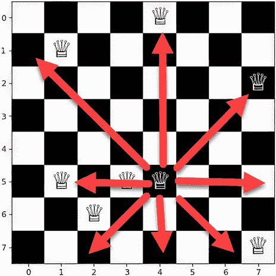

图 3.1 棋盘上的随机皇后放置

再次，这个笔记本中的大部分代码与之前的练习类似。接下来，我们将关注如何填充`toolbox`，如列表 3.8 所示。请注意，对于这个练习，我们使用了两个新的`toolbox`函数用于`交叉`和`变异`。我们将在本章末尾提供更多这些`toolbox`遗传操作员的示例。了解这些操作员的另一个优秀资源是 DEAP 文档[`deap.readthedocs.io/en/master/api/tools.html`](https://deap.readthedocs.io/en/master/api/tools.html)。

列表 3.8 EDL_3_2_QueensGambit.ipynb：填充`toolbox`

```
toolbox = base.Toolbox()

toolbox.register("permutation", random.sample, 
                 range(number_of_queens), 
                 ➥ number_of_queens)                        ❶
toolbox.register("individual", tools.initIterate, 
                 creator.Individual, toolbox.permutation)    ❶
toolbox.register("population", tools.initRepeat, list, toolbox.individual)

toolbox.register("evaluate", evalNQueens)                    ❷

toolbox.register("mate", tools.cxPartialyMatched)            ❸

toolbox.register("mutate", tools.mutShuffleIndexes, 
                 indpb=2.0/number_of_queens)                 ❹

toolbox.register("select", tools.selTournament, tournsize=3) ❺
```

❶ 设置皇后的数量和棋盘/个体大小

❷ 添加客户适应度函数 evalNQueens

❸ 使用工具箱函数进行交配/交叉

❹ 使用工具箱函数应用变异

❺ 使用锦标赛选择进行选择

皇后的`适应度` `评估`函数`evalNQueens`通过捷径评估个体的`适应度`，而不是运行放置的每个迭代，该函数假设只有一位皇后可以放置在一行或一列上。因此，我们只需要评估皇后是否对角放置，这简化了`适应度`函数到以下列表中的代码。

列表 3.9 EDL_3_2_QueensGambit.ipynb：评估`适应度`

```
def evalNQueens(individual):    
  for i in range(size):                    ❶
    left_diagonal[i+individual[i]] += 1
    right_diagonal[size-1-i+individual[i]] += 1    

  sum_ = 0
  for i in range(2*size-1):                ❷
    if left_diagonal[i] > 1:
      sum_ += left_diagonal[i] - 1
    if right_diagonal[i] > 1:
      sum_ += right_diagonal[i] - 1
  return sum_,                             ❸
```

❶ 遍历棋盘并评估对角放置

❷ 对放置进行循环并计算非冲突总和

❸ 返回非冲突的总和

在`适应度` `评估`函数之后，还有一个名为`eaSimple`的函数，这个函数只是 DEAP 中标准`alogirthms.eaSimple`函数的一个副本。这个函数与我们上次练习中使用的是几乎相同的；然而，它移除了大部分的噪声日志，这使得我们可以自定义输出表现最佳的`个体`，以及测试早期停止。注意以下列表中`个体`的`适应度`与最大`适应度`的测试。这允许在达到最大`适应度`时提前停止进化。

列表 3.10 EDL_3_2_QueensGambit.ipynb：进化函数

```
for ind, fit in zip(invalid_ind, fitnesses):    ❶
  ind.fitness.values = fit            
  if fit[0] >= max:                             ❷
    print("Solved")                             ❸
    done = True                                 ❸
```

❶ 通过个体和配对进行循环以与 zip 匹配适应度

❷ 测试个体的适应度是否达到或超过最大值

❸ 如果达到最大适应度，则打印已解决并设置退出标志

在笔记本的末尾，你可以看到种群是如何进化的。我们首先创建`种群`和用于最佳表现者的`名人堂`容器。然后，我们注册各种统计数据，最后调用`eaSimple`函数以进化种群。在以下列表中，注意使用`max = number_of_queens`作为输入来控制早期停止或当`个体`达到最大`适应度`时。

列表 3.11 EDL_3_2_QueensGambit.ipynb：进化

```
random.seed(seed)

pop = toolbox.population(n=100)                            ❶
hof = tools.HallOfFame(1)                                  ❶
stats = tools.Statistics(lambda ind: ind.fitness.values)   ❷
stats.register("Avg", np.mean)
stats.register("Std", np.std)
stats.register("Min", np.min)
stats.register("Max", np.max)

eaSimple(pop, toolbox, cxpb=0.5, mutpb=0.2, ngen=100, max = number_of_queens,
         stats=stats, halloffame=hof)                      ❸
```

❶ 创建最佳表现者的种群和名人堂

❷ 注册用于监控种群的统计数据函数

❸ 调用进化函数以进化种群

最后，我们回顾进化的输出，看看算法如何进化出一个解决方案。图 3.2 显示了之前设置的给定`种子`参数的解决方案。你可以从输出中看到，进化能够提前停止——67 `代`——以创建一个可行的解决方案。

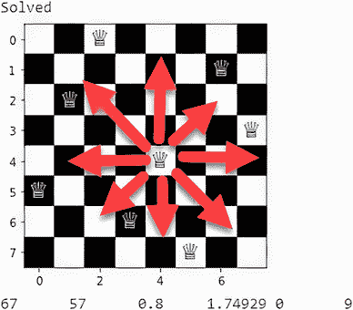

图 3.2 皇后棋的解决方案

随意回顾解决方案，并确认每个皇后都无法捕获彼此。你甚至可以回到增加`棋盘大小`或`皇后数量`到更大的值，如 16 或更多。这可能需要你同时增加`种群`大小和进化的`代数`数量。我建议你现在尝试一下，以获得更多使用 GA 的经验。

### 3.2.1 学习练习

通过探索这些有趣的练习来提高你的知识：

1.  将列表 3.11 中的`种群`大小进行进化，然后重新运行。更大的`种群`对进化有什么影响？

1.  修改列表 3.11 中的`交叉`和`变异`率，然后重新运行。你能在更少的`代数`内解决问题吗？

1.  在列表 3.8 中增加或减少`选择`锦标赛的大小，然后重新运行。锦标赛的大小对进化有什么影响？

女王棋局是一个有趣的问题来观察；我们将在下一节继续探讨其他用 EC 解决的经典问题。

## 3.3 帮助旅行商人

EA 和 GA 在优化难以解决的数学问题方面也取得了成功，例如经典的旅行商问题。你看，在互联网出现之前的日子里，商人需要亲自穿越国家来销售他们的商品。这个问题的概念是解决商人需要采取的路线，以确保他们不会两次访问同一地点，同时优化他们的行程长度。

图 3.3 展示了在 100 单位×100 单位的地图网格上描述的旅行商问题（TSP）的示例。在图中，商人已经优化了他们的路线，因此他们可以只访问每个城市一次，并在旅行的最后返回家中。

TSP 在数学上被认为是一个 NP-hard 问题，这意味着它不能在线性时间内计算解决。相反，解决此类问题的计算能力随着地点数量的增加而呈指数增长。在图 3.3 中，商人有 22 个`目的地`，包括`家`。

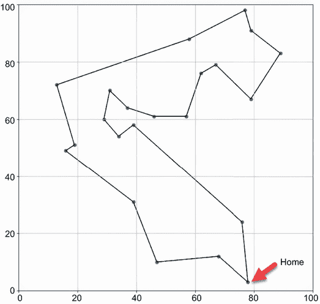

图 3.3 TSP 解决方案的可视化

计算和数学中的 NP 问题

在数学和计算中，算法根据解决它们所需的时间或计算能力来分类其难度。我们将此类问题分类为 NP，其中 N 代表解决所需元素的数量，P 是解决问题所需的时间。如果问题可以在线性时间内解决，则将其分类为 NP easy——即 N × P 以线性速率增加。相反，NP-hard 问题定义为不能在线性时间内解决，而是需要指数时间。NP-hard 解决方案定义为 N2 × P 或更高指数，这样随着元素数量的增加，问题的复杂性呈指数增长。

由于 TSP 问题是 NP 难的，我们还没有找到可以在线性时间内解决问题的数学解。相反，许多为解决 TSP 而开发的方法都是估计方法，它们借鉴了过程和优化的捷径。这些经过精心调整的方法已经在数千个点中成功应用。

使用大 O 符号，我们可以将 TSP 问题表示为 O(n²2^n)来计算得到答案的最大计算时间。对于每个新的`目的地`点，我们都需要重新计算相应的子点。相比之下，计算 22 个`目的地`需要最多 20 亿次的计算，而 23 个`目的地`则需要 45 亿次的计算。

为了将 22 个点的计算量放在一个可比较的视角中，假设每个计算需要 1 毫秒或 1/1000 秒来完成，那么 20 亿次的计算将需要 23 天来完成。随着每个额外`目的地`的增加，这个数字将以指数级增长，使得典型的编程解决方案变得不切实际。相反，EA/GA 等方法为解决这类复杂问题提供了替代方案。

### 3.3.1 构建 TSP 求解器

在下一个笔记本中，我们使用 DEAP 构建一个解决方案来解决开放端 TSP 问题类。TSP 的封闭形式是指旅行商被限制在一定的驾驶距离或长度。这意味着在问题中，旅行商可以旅行任何距离到达所有`目的地`。

在 Colab 中打开 EDL_3_3_TSP.ipynb 笔记本，然后运行所有单元格。如果您需要帮助，请参阅附录。

我们首先来看随机旅行商路径的初始化和可视化。我们首先定义的是包含旅行商路线所有位置的基`地图`。接下来，我们使用`plt.scatter`函数通过传递地图中的`0`和`1`值来绘制`地图目的地`。之后，我们使用`plt.gca()`获取当前图表并添加绘图边界限制，以便我们可以清楚地可视化整个`目的地`地图，如下所示。

列表 3.12 EDL_3_3_TSP.ipynb：设置`地图`

```
figure(num=None, figsize=(10, 10), dpi=80, 
➥ facecolor='w', edgecolor='k')               ❶

map = np.random.randint(min_bounds,max_bounds, 
➥ size=(destinations,2))                      ❷

plt.scatter(map[:,0], map[:,1])                ❸
axes = plt.gca()
axes.set_xlim([min_bounds,max_bounds])         ❹
axes.set_ylim([min_bounds,max_bounds])         ❹
plt.grid()
```

❶ 设置图形的大小和分辨率

❷ 定义一个大小为`目的地`的随机 NumPy 数组

❸ 在地图上绘制点

❹ 设置绘图限制

当我们应用 GA 时，`种群`中的每个`个体`将代表一个在`目的地``地图`上的索引列表。这个列表也代表了`个体`的`基因`序列，其中每个索引是一个`基因`。由于我们的地图代表了一组随机的点，我们可以假设起始`个体`只是按顺序访问这些点。这样做允许我们使用以下列表中的代码从`个体`构建一个简单的路径。

列表 3.13 EDL_3_3_TSP.ipynb：创建`路径`

```
def linear_path(map):
  path = []
  for i,pt in enumerate(map):    ❶
    path.append(i)               ❷
  return path

path = linear_path(map)          ❸
```

❶ 列出地图上的点

❷ 将每个目的地添加到路径中

❸ 基于地图创建新的路径

接下来，我们希望有一种方法来可视化这条路径，以便我们可以看到随着进化的进行，路线将是什么样子。`draw_path`函数通过传递从上一步构建的路径来操作。在函数内部，代码遍历路径中的索引，并使用`plt.arrow`函数通过点对连接点，如下面的列表所示。遍历路径列表中的索引后，我们绘制一条指向起点的最终路径。图 3.4 显示了使用我们在上一步构建的起始路径调用`draw_path`函数的输出。

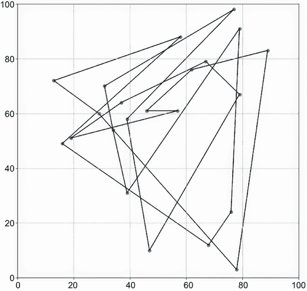

图 3.4 可视化起始随机路径

列表 3.14 EDL_3_3_TSP.ipynb：可视化路径

```
def draw_path(path):
  figure(num=None, figsize=(10, 10), dpi=80, facecolor='w', edgecolor='k')
  prev_pt = None 
  plt.scatter(map[:,0], map[:,1])              ❶
  for I in path:    
    pt = map[i]    
    if prev_pt is not None:
      plt.arrow(pt[0],pt[1], prev_pt[0]-pt[0], 
      ➥ prev_pt[1]-pt[1])                     ❷
    else:
      start_pt = pt                            ❷
    prev_pt = pt
  plt.arrow(pt[0],pt[1], start_pt[0]-pt[0], 
  ➥ start_pt[1]-pt[1])                        ❸
  axes = plt.gca()
  axes.set_xlim([min_bounds,max_bounds])
  axes.set_ylim([min_bounds,max_bounds])
  plt.grid()
  plt.show()

draw_path(path)                                ❹
```

❶ 绘制基础地图目的地

❷ 从一点绘制到另一点的箭头

❸ 绘制一个指向起点的箭头

❹ 绘制整个路径

在`draw_path`函数下方，我们可以看到`evaluate_path`函数用于确定每个路径的`fitness`。在下面的列表中，这个函数遍历路径中的点索引，并计算 L1 或欧几里得距离。然后，将这些距离加起来得到总路径长度，这也对应于`individual`的`fitness`。

列表 3.15 EDL_3_3_TSP.ipynb：评估路径

```
def evaluate_path(path):
  prev_pt = None
  distance = 0
  for i in path:               ❶
    pt = map[i]     
    if prev_pt is not None:    ❷
      distance += math.sqrt((prev_pt[0]-pt[0]) ** 2 + (prev_pt[1]-pt[1]) ** 2)
    else:
      start_pt = pt
    prev_pt = pt
  distance += math.sqrt((start_pt[0]-pt[0]) ** 2 + (start_pt[1]-pt[1]) ** 2)
  return distance,             ❸

evaluate_path(path)
```

❶ 遍历路径中的点索引

❷ 计算点之间的 L1 距离

❸ 返回距离作为集合

从这里，我们传递其他熟悉的代码，并查看`toolbox`的设置以及如何构建`individuals`。在这个例子中，我们构建一个`chromosome`，其索引等于`destinations`的数量，以存储`destination` `map`中的索引，如下面的列表所示。在这个练习中，每个`individual`代表`destination` `map`上的索引路径。

列表 3.16 EDL_3_3_TSP.ipynb：填充`toolbox`

```
toolbox = base.Toolbox()

toolbox.register("indices", random.sample, 
           range(destinations), destinations)           ❶

toolbox.register("individual", tools.initIterate, 
                 creator.Individual, toolbox.indices)   ❷

toolbox.register("population", tools.initRepeat, 
                 list, toolbox.individual)              ❸
```

❶ 创建一个长度等于目的地的基因型索引

❷ 使用索引基因型创建一个个体

❸ 创建一个包含个体的种群列表

跳到最底部的单元格，查看执行进化的代码。再次强调，这段代码与之前的练习类似，只是这次我们没有提供早期停止参数。这是因为计算最小路径距离的成本可能与我们所使用的计算距离的算法一样高，甚至更高。相反，我们可以使用进化的输出来确认进化已经达到解决方案，如下面的列表所示。

列表 3.17 EDL_3_3_TSP.ipynb：进化

```
pop = toolbox.population(n=300)

hof = tools.HallOfFame(1)

stats = tools.Statistics(lambda ind: ind.fitness.values)
stats.register("avg", np.mean)
stats.register("std", np.std)
stats.register("min", np.min)
stats.register("max", np.max)

eaSimple(pop, toolbox, 0.7, 0.3, 200, stats=stats, halloffame=hof)   ❶
```

❶ 使用硬编码的超参数调用进化函数

图 3.5 显示了 22 个点的`目的地`问题的解决方案。评估解决方案是否正确的一个简单方法是通过注意所有连接的点不会交叉，并且本质上形成一个循环，如图所示。

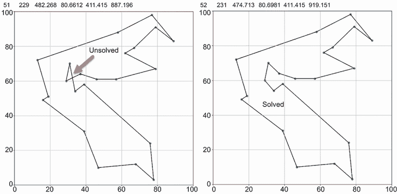

图 3.5 使用 22 个目的地在 52`代`中解决 TSP 问题

在大多数情况下，当`目的地`数量为 22 时，这个练习应该在 200`代`内完成。尽管我们设置了`random.seed`的种子，但我们仍然可以在`目的地``地图`以及最终的解决方案路径中获得多样化的变化。如果你发现笔记本在 200 代内无法解决问题，要么减少`目的地`点的数量，要么增加`代数`的数量。

尝试将`目的地`的数量增加 1 到 23 或最多 25，然后再次运行练习。记住，每增加一个点都会在复杂性上呈指数级增长，但在某些情况下，它同样容易解决。看看你是否能将`目的地`的数量增加到 25 以上以找到解决方案。如果你做到了，记住你可能还需要增加`代数`和/或`种群`的数量。

### 3.3.2 学习练习

使用这些练习来进一步探索笔记本中的概念：

1.  增加或减少销售员需要访问的`目的地`数量，然后每次更改后重新运行。你能创建多少个`目的地`的解决方案？

1.  调整`种群`、`交叉`和`变异`率，然后重新运行笔记本。

1.  改变用于进化的`选择`函数的类型或参数。

现在，几个有趣且引人入胜的例子已经介绍完毕，我们可以在下一节中更深入地探讨选择各种遗传操作符的细节。

## 3.4 选择遗传操作符以改进进化

进化计算，与其他人工智能或机器学习学科一样，提供了广泛的超参数和选项来调整以适应问题。EA 和 GA 当然也不例外，正如我们之前所看到的，它们提供了各种超参数和遗传操作符选项。在本节中，我们将探讨并尝试更深入地了解这些选项。

DEAP 提供了几种遗传操作符选项，根据进化工具文档，在许多情况下可以轻松替换。其他操作符可能需要特殊的`基因`或`个体`类型环境，例如我们在最后两个练习中使用的`mutShuffleIndexes`操作符；其他操作符可能根据你的需求和判断定制制作，使可能性无限。

提示：DEAP 有一个优秀的文档资源，提供了关于本节及以后我们探讨的遗传操作符的更多详细信息。关于进化工具和遗传操作符的文档可以在以下网页上找到：[`deap.readthedocs.io/en/master/api/tools.html`](https://deap.readthedocs.io/en/master/api/tools.html)。

当然，将正确的遗传算子应用于你的进化器需要了解这些工具做什么以及如何做。在下一个练习中，我们将回顾一些最常见的算子，并看看它们如何修改目标种群（population）的进化。我们使用上一节中探索的简化版 TSP 来查看替换各种遗传算子的结果。

在 Colab 中打开 EDL_3_4_TSP_Operators.ipynb 并运行所有单元格。如有需要，请参考附录。这个练习借鉴了上一个练习的大部分代码，并添加了一些额外的可视化注释。

这个笔记本大量使用 Colab 表单来提供用户界面，以修改各种选项和超参数。跳转到标题为“选择遗传算子”的单元格，如图 3.6 所示。


图 3.6 Google Colab 表单界面用于选择遗传算子

让我们从测试 `selection` 遗传算子的变体开始。这个笔记本提供了我们可以选择和测试的 `selection` 算子类型选项，以及用于交叉和选择的选项。由于我们使用的是交换索引的特殊变异形式，因此无法更换变异算子。选择一个 `selection` 算子，然后从菜单中选择运行 > 运行后，以应用更改并重新运行笔记本中的剩余单元格。以下列表显示了每个算子及其简要操作描述：

+   *锦标赛*—此算子通过进行 *n* 次重复的锦标赛选择来选择。初始锦标赛是随机选择的，获胜者进入下一轮锦标赛。此算子效果良好，在保持一定多样性的同时优化最佳个体。

+   *随机*—此算子通过随机从种群中挑选父母来选择。如果你发现种群很快专业化或似乎陷入局部最大值/最小值，这是一个很好的算子。对于像 TSP 这样的问题，这个算子可能有效，具体取决于选择的交叉和变异算子。

+   *最佳* —此算子选择表现最佳的个体作为父母。正如我们在第一个例子中看到的那样，使用精英选择或最佳选择可以快速找到解决方案，但长期效果较差。这是因为种群没有足够多的多样性来克服停滞点。

+   *最差*—与最佳算子的相反，此算子选择表现最差的个体作为父母。使用最差个体作为父母的优点是可以完全避免专业化。当你发现种群专业化并且陷入错误解决方案时，这一点尤其有效。

+   *NSGA2*——此操作符基于 Deb 等人于 2002 年（Springer）发表的论文“A Fast Elitist Non-dominated Sorting Genetic Algorithm for Multi-objective Optimization: NSGA-II”。它是一个既能够很好地维护`fitness`优化，又能在长期内保持`population`多样性的算法/操作符。使用此算法会导致`population`倾向于保持在正态分布内。这使得这种方法对于需要长期进化的问题很有用。

+   *SPEA2*——此操作符起源于 Zitzler 等人于 2001 年（ETH Zurich，计算机工程和网络实验室）发表的论文“SPEA 2: Improving the Strength Pareto Evolutionary Algorithm”。它试图在最大/最小`fitness`附近保持`population`的 Pareto 前沿分布，从而形成一个几乎 U 形的分布。这是一个适用于需要长期进化的问题的良好操作符，因为它保持平衡的多样性，避免了停滞点。

一定要将`population`设置为`1000`，并将`generations`的数量设置为`15`，以便看到`selection`操作符的完整效果。在遍历每个`selection`操作符时，请特别注意最后进行进化的单元格生成的输出。图 3.7 展示了各种`selection`操作符的直方图输出。注意，锦标赛`selection`操作符形成了一个`fitness`的 Pareto 分布，而其他方法则倾向于多样化`fitness`。记住，更多的多样性有利于更长时间的进化，并且通常能更好地适应关键点。然而，与此同时，更多的多样性需要更多的`generations`来进化出最佳的`fitness`。

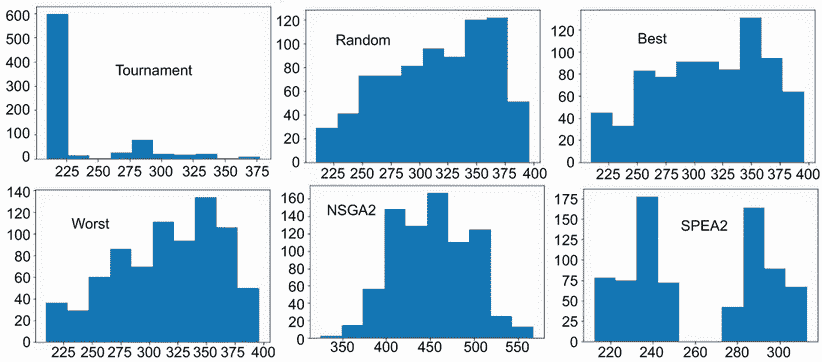

图 3.7 `selection`操作符对种群多样性的比较

随意探索各种选择操作符，并确保更改`destinations`和`generations`的数量以及`populations`的大小。注意较大和较小的`populations`对`selection`的影响。当你完成对`selection`的探索后，我们可以继续更改如图 3.7 所示的`crossover`操作符。有几种类型的`crossover`操作符可以提供更有效的解决方案。在应用`crossover`时，由于不匹配或序列错位，产生的后代往往表现不佳。在某些情况下，`genes`不需要在序列中对齐，但在这个练习中，它们需要。以下是在这个示例笔记本中使用的`crossover`操作符列表以及它们对进化的影响：

+   *部分匹配*——这种方法通过匹配索引类型`genes`的序列并在这序列上执行`crossover`操作来实现。对于其他`gene`类型，它可能工作得不好或不符合预期。通过保留索引序列，这种`crossover`操作更好地保留了后代中最好的部分，而其他操作符可能会破坏路径或重要的进化序列。

+   *均匀部分匹配*—这种方法类似于部分匹配操作符，但不同之处在于它试图在父母的“交叉”之间保持平衡和均匀的序列交换。这种方法的好处是长期坚持序列的更强一致性，但它可能使初始进化变得困难。

+   *有序*—这个“交叉”操作符执行有序的索引序列交换。这样做可以保持顺序，但允许序列基本上旋转。这是一个很好的操作符，用于可能陷入进化序列操作（如 TSP）的“种群”。

+   *一点/两点*—与本章前面提到的第一个“交叉”操作符类似，一点“交叉”选择一个点来分割父母的“基因”序列。扩展这个概念，两点“交叉”执行相同的操作，但使用两个点来切割“基因”序列。这些是很好的通用方法，但在处理像 TSP 这样的索引序列时并不是选项。

为了理解改变“交叉”的影响，我们需要引入一种新的图表类型，称为“家谱图”，如图 3.8 所示。在图中，每个圆圈代表一代，如果这一代产生了好的后代，那么就会有一条箭头连接到下一代。家谱图有助于确认你的“交叉”操作是否产生了有活力的、适应良好的后代。一个好的图表显示了从不太适应到更适应的后代的流动。基本上，箭头和连接越多，越好；这表明进化过程的进展，其中从一个节点到另一个节点的每个箭头代表一个连接步骤，或进化命名法中的“亚种”。显示较少连接或根本没有连接的家谱图表明你的“交叉”没有产生有活力的后代。这个图上的孤立点表示可能具有良好“适应性”但未产生有活力后代的随机后代。

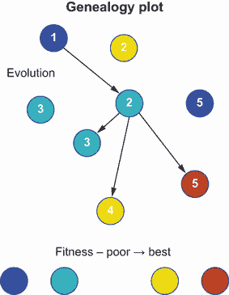

图 3.8 展示使用“交叉”进化的个体家谱图

将“目的地”数量增加到`10`，并将“种群”和“代数”减少到`5`。在进化过程中生成家谱图非常昂贵且难以阅读，所以这个笔记本限制渲染那些图只针对`10`以下的“种群”。你完成这个操作后，更改各种“交叉”操作符，然后从菜单中选择运行 > 运行全部来重新运行整个笔记本。

图 3.9 展示了该笔记本支持的三个不同`交叉`操作的谱系图示例。从图中可以看出，对于这个例子来说，部分匹配选项似乎是最佳的`交叉`操作。如图所示，第一个算子能够成功生成更适应的后代，而均匀部分匹配算子可以产生可行的后代，但`适应度`的增加并不显著。为了更清楚地看到差异，请确保运行笔记本并自行可视化。

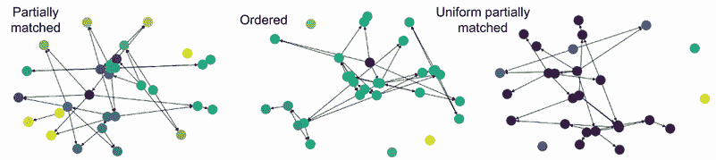

图 3.9 `交叉`操作的谱系图比较

完成这个练习后，你现在应该对使用各种遗传算子进行`交叉`和`选择`之间的差异有所了解。在未来的章节中，我们将探讨在应用 EDL 时`变异`算子的各种实现。

### 3.4.1 学习练习

通过以下练习回顾笔记本：

1.  将图 3.6 中的 Colab 表单中的`选择`或`交叉`算子进行更改。尝试每个算子，看看哪个最适合这个问题。

1.  看看改变算子和超参数（`种群`、`交叉`和`变异`率）对基因谱系有什么影响。

1.  回顾笔记本 EDL_3_2_QueensGambit.ipynb，并更改`选择`或`交叉`算子，看看这会对进化产生什么影响。

在前面的例子基础上，我们现在来看本章最后部分的一个有趣例子。

## 3.5 使用 EvoLisa 绘画

在 2008 年，罗杰·约翰逊展示了使用遗传算法通过一系列多边形绘制蒙娜丽莎的过程。图 3.10 展示了该实验在进化后期阶段的优秀结果。从这些图像集合中，你可以看到这些结果几乎需要一百万个`代`才能进化完成。

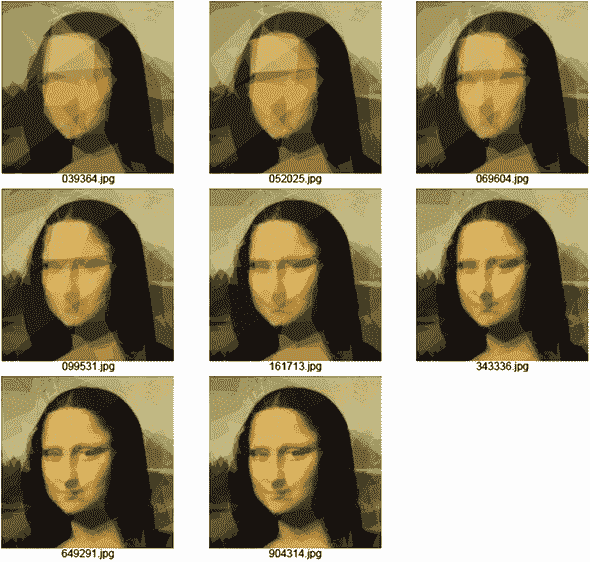

图 3.10 展示了罗杰·约翰逊博客中的 EvoLisa 输出示例（[`rogerjohansson.blog/`](https://rogerjohansson.blog/2008/12/16/evolisa-optimizations-and-improved-quality/））

EvoLisa 是一种生成建模的形式，算法的目标是模拟或复制某些过程的输出。近年来，生成模型（GM）随着生成深度学习（GDL）在生成对抗网络（GANs）中的出现而爆炸式增长。从第八章开始，我们将更深入地探讨 GM 和 GDL 与 GANs，以及如何通过 EDL 改进这些技术。

DEAP 使得复制 EvoLisa 项目变得相当容易，但它确实要求我们以更复杂和结构化的方式思考我们的简单`基因`序列。以前，一个`基因`是列表中的一个单一元素，我们现在需要将`基因`视为列表中元素的一个子集或一组。这些元素子组或`基因`中的每一个定义了一个绘图多边形，一个`个体`拥有多个用于在画布上绘制的多边形`基因`。

让我们开始下一个项目：使用 DEAP 和 GA 构建 EvoLisa。如图 3.10 所示，获得良好的结果可能需要相当多的时间。虽然我们可能不想复制那些结果，但回顾创建复杂 `基因` 的过程对后续章节和其他你可能工作的项目是有益的。

在浏览器中打开 EDL_3_5_EvoLisa.ipynb，让我们开始。如需进一步帮助，请参阅附录。

我们首先需要理解的是，如何将数字序列转换为表示绘图多边形或笔刷的 `基因`。图 3.11 概述了如何从序列中提取一组属性并将其转换为绘图笔刷，其中前六个元素代表简单多边形的三个点。之后，接下来的三个表示颜色，最后，最后一个元素代表 alpha，或透明度。通过引入透明度，我们允许每个笔刷叠加在其他笔刷之上，产生更复杂的功能。

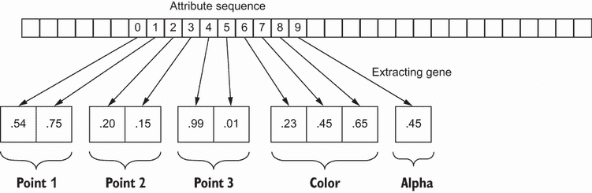

图 3.11 从属性序列中提取 `基因`

在我们之前的场景中，遗传序列中的每个属性代表一个单独的 `基因`。现在，属性的一个子集代表一个 `基因`，该 `基因` 表示一个绘图笔刷。以下代码列表接受一个属性序列（`基因`）并将它们按 `基因` 长度分割。此示例构建为使用多边形作为绘图笔刷，但额外的注释代码演示了使用其他笔刷，如圆形或矩形。

列表 3.18 EDL_3_5_EvoList.ipynb：提取基因

```
def extract_genes(genes, length): 
    for i in range(0, len(genes), length): 
        yield genes[i:i + length]          ❶
```

❶ 从属性序列中提取并产生单个基因

在相同的代码块中，我们可以看到绘制每个 `基因` 的渲染代码。这是一段复杂的代码，我们将其分为两个列表。第一个列表展示了绘制画布的构建和从 `基因` 中提取以循环的内容。

列表 3.19 EDL_3_5_EvoList.ipynb：渲染基因

```
def render_individual(individual):
  if isinstance(individual,lst):                           ❶
    individual = np.array(individual)                      ❶
  canvas = np.zeros(SIZE+(3,))                             ❷
  radius_avg = (SIZE[0] + SIZE[1]) / 2 / 6                 ❸
  genes = extract_genes(individual, GENE_LENGTH)           ❹
  for gene in genes:                                       ❺
```

❶ 如果是列表，将个体转换为 NumPy 数组

❷ 根据图像大小创建画布并添加一个颜色维度

❸ 不用于多边形笔刷

❹ 使用 extract_genes 生成器加载基因

❺ 遍历基因

列表 3.20 展示了如何从提取的相关 `基因` 属性中定义每个笔刷，其中前六个值代表使用 `cv2.fillPoly` 函数绘制的多边形的三个点或坐标。然后，提取的 alpha 用于使用 `cv2.addWeighted` 函数将笔刷（叠加）混合到画布上。最后，在绘制了所有 `基因` 笔刷之后，函数返回要评估的最终画布。

列表 3.20 EDL_3_5_EvoList.ipynb：渲染 `基因`

```
    try:
      overlay = canvas.copy()                           ❶
      # polyline brush uses GENE_LENGTH = 10
      # pts = (0, 1), (2, 3), (4, 5) [6]      
      # color = (6, 7, 8) [9]
      # alpha = (9) [10]
      x1 = int(gene[0] * SIZE[0])                       ❷
      x2 = int(gene[2] * SIZE[0])                       ❷
      x3 = int(gene[4] * SIZE[0])                       ❷
      y1 = int(gene[1] * SIZE[1])                       ❷
      y2 = int(gene[3] * SIZE[1])                       ❷
      y3 = int(gene[5] * SIZE[1])                       ❷
      color = (gene[6:-1] * 255).astype(int).tolist()   ❸
      pts = np.array([[x1,y1],[x2,y2],[x3,y3]])    

      cv2.fillPoly(overlay, [pts], color)               ❹
      alpha = gene[-1]                                  ❺
      canvas = cv2.addWeighted(overlay, alpha, 
      ➥ canvas, 1 - alpha, 0)                          ❻
    except:                                             ❼
      pass
  return canvas
```

❶ 复制基础图像和 NumPy 数组

❷ 从值中提取并缩放为整数以进行绘制

❸ 从下一个点提取颜色

❹ 绘制多边形

❺ 提取 alpha

❻ 使用 alpha 透明度将叠加与画布合并

❼ 包裹在错误处理中，以防万一

图 3.12 展示了使用`render_individual`函数渲染的随机`个体`的结果。您可以通过在菜单中选择“运行”>“运行所有”来运行所有笔记本代码以生成此图像。现在就去做吧，因为这个笔记本需要相当长的时间才能完全运行。

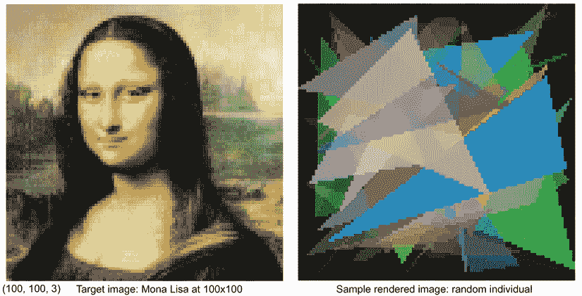

图 3.12 目标图像和从随机`个体`渲染的图像

在这个演示中，我们使用一幅经典的*蒙娜丽莎*画像。然而，如果您滚动到笔记本的顶部，您可以看到其他选项来加载各种其他图像，从停车标志到名人照片，比如道恩·强森（Dwayne “the Rock” Johnson）。如果您想使用不同的图像，请从提供的 Colab 表单下拉菜单中选择，然后重新运行笔记本。

我们可以使用简单的像素级颜色值比较，从一个 NumPy 数组到另一个数组，使用均方误差来评估函数的`fitness`。以下列表中的函数计算渲染图像和原始图像之间的 MSE，然后这个误差作为`individual`的`fitness`分数返回。请记住，EvoLisa 的目标是最小化这个误差。

列表 3.21 EDL_3_5_EvoList.ipynb：`fitness`和`evaluate`函数

```
  def fitness_mse(render):  
    error = (np.square(render - target)).mean(axis=None)   ❶
    return error

  def evaluate(individual):
    render = render_individual(individual)                 ❷
    print('.', end='')                                     ❸
    return fitness_mse(render),                            ❹
```

❶ 从渲染结果与目标之间的比较计算 MSE 误差

❷ 渲染图像

❸ 为每次评估打印一个点，一个简单的进度条

❹ 返回 MSE 作为个体的适应度

我们需要查看的最后部分是遗传算子的设置，如列表 3.22 所示。这里只有一些新的内容。我们定义了一个均匀函数，用于从定义的下限和上限的均匀分布中生成浮点属性。这个函数注册了一个`attr_float`算子，并在`creator.Individual`算子的注册中使用。最后，我们可以看到`evaluate`函数是如何注册为`evaluate`算子的。

列表 3.22 EDL_3_5_EvoList.ipynb：设置 GA 算子

```
  def uniform(low, up, size=None):                                         ❶
  try:
    return [random.uniform(a, b) for a, b in zip(low, up)]
  except TypeError:
    return [random.uniform(a, b) for a, b in zip([low] * size, [up] * size)]

toolbox = base.Toolbox()
toolbox.register("attr_float", uniform, 0, 1, NUM_GENES)                   ❷
toolbox.register("individual", tools.initIterate, creator.Individual, 
➥ toolbox.attr_float)                                                     ❸
toolbox.register("population", tools.initRepeat, list, toolbox.individual)

toolbox.register("mutate", tools.mutGaussian, mu=0.0, sigma=1, indpb=.05)
toolbox.register("evaluate", evaluate)                                     ❹
```

❶ 均匀函数生成个体

❷ 为个体创建注册 attr_float 算子

❸ 使用 attr_float 算子注册创建的个体

❹ 注册`evaluate`函数

图 3.13 展示了使用矩形笔刷和多段线笔刷运行此示例大约 5,000`代`的结果。实现圆形或矩形笔刷的代码已被注释，但作为对感兴趣读者的一个选项展示。


图 3.13 使用不同笔刷格式（矩形和多边形填充）的 EvoLisa 示例输出

一定要回到这个例子中提供的 Colab 表单选项，更改设置，然后重新运行 EvoLisa。您能否提高 EvoLisa 复制图像的速度？请确保还尝试调整 EvoLisa 使用的多边形数量（笔刷/`基因`）。

EvoLisa 是十多年前使用遗传算法进行生成建模的一个很好的演示。从那时起，GDL 的出现已经使用 GANs 展示了远超预期的结果。然而，EvoLisa 展示了我们如何编码和进化一系列`基因`或指令，这可以定义一个更复杂的过程。虽然应用看起来相似，但 EvoLisa 的底层机制展示了不同形式的优化。

### 3.5.1 学习练习

完成以下练习，以巩固本节讨论的概念：

1.  切换到不同的图像，看看进化如何很好地复制原始图像。您甚至可能想添加自己的图像。

1.  增加或减少用于渲染图像的`基因`和多边形的数量，然后看看这有什么影响。

1.  修改`变异`、`交叉`和`种群`，看看它们对进化有什么影响。您能否将`代数`的数量减少到所选图像的更好复制品？

1.  尽可能地制作出最好的复制品。如有需要，请随时联系作者展示您令人印象深刻的结果。

在阅读本章之后，我们现在了解了进化计算的基本原理以及遗传算法的内部工作原理。

## 摘要

+   Python 中的分布式进化算法（DEAP）是一个优秀的工具，它集成了各种进化算法，包括遗传方法。`种群`大小、`代数`数量、`交叉`率和`变异`率的遗传算法超参数可以根据个别解决方案进行调整。DEAP 可以快速配置和设置，以使用基本构建块解决各种问题：

    +   *创建者*—这包含个体的定义。

    +   *工具箱*—这定义了一组辅助函数以及定义遗传算子和操作的位置。

    +   *名人堂*—这跟踪最成功的个体。

    +   *统计数据*—这些跟踪基本指标，可用于评估`种群`的成功率。

    +   *历史对象*—这些提供跟踪自定义或其他外部操作的能力。

+   《后翼弃兵》是一个模拟的棋局问题，可以使用 DEAP 中的遗传算法来解决。

+   旅行商问题，一个经典的复杂路径组织问题，可以使用 DEAP 中的遗传算法来解决。

+   使用直方图可视化`种群`的`适应度`多样性可以识别可能停滞的进化`种群`。

+   通过家谱图可以了解在进化过程中`交叉`操作的效果如何。它们提供了对各种`选择`遗传算子对`种群`进化的评估和性能的洞察。可以使用家谱图评估特定`交叉`操作执行得有多好。

+   一个个体的模拟遗传密码可以代表一个过程或操作顺序。他们甚至可以实施一个复杂的遗传结构来表示复制或复制图像的复杂操作顺序。
