# 4 使用 DEAP 进行更多进化计算

本章涵盖

+   在 DEAP 中使用遗传编程开发回归求解器

+   将粒子群优化应用于求解复杂函数中的未知数

+   将问题分解成组件并协同进化解决方案

+   理解和应用进化策略来近似解

+   使用可微分的进化近似连续和离散解

在第三章中，我们通过介绍 GA 开始探索进化计算的外观，只是触及了表面。从 GA 开始帮助我们建立几个在本章中继续发展的基础。我们还通过探索其他用于解决更专业和复杂问题的进化搜索方法来继续我们的 GA 探索。在本章中，我们考察了其他形式的进化搜索来解决更广泛的问题。

存在着各种各样和形式的进化算法，每种算法都有其不同的优势和劣势。了解其他可用的选项可以加强我们对在哪里应用哪种算法的理解。正如本章所看到的，剥橙子的方法不止一种。

## 4.1 使用 DEAP 进行遗传编程

我们已经广泛使用 DEAP 开发 GA 解决方案来解决各种问题。在下面的笔记本中，我们继续使用 DEAP 来探索 EC/GA 的一个子集，称为*遗传编程*（GP）。GP 遵循与 GA 相同的原理，并采用许多相同的遗传算子。GA 和 GP 之间的关键区别在于`基因`或`染色体`的结构以及如何评估`适应度`。遗传编程和基因表达编程（GEP）可以用于解决各种自动化和控制问题，如本书后面所讨论的。

本节中开发的笔记本展示了遗传编程在解决回归问题中的一个应用。GEP 也可以应用于各种其他问题，从优化到搜索。然而，展示回归对于我们的目的来说最为相关，因为它与我们如何使用深度学习（DL）解决相同问题的方法相似。

在这个笔记本中，我们通过使用 GEP 推导出一个解方程来解决多元回归问题。目标是这个方程能够成功回归或预测给定几个输入值的一个输出值。这个例子只使用预先输入到目标方程中的随机输入来验证结果。然而，这种方法可以并且已经被用来执行回归，类似于我们在深度学习（DL）中使用的样子。

### 4.1.1 使用遗传编程解决回归问题

您可以通过在 Google Colab 中打开 EDL_4_1_GP_Regression.ipynb 笔记本开始练习。如果您需要打开文件的帮助，请参阅附录。这个练习可能感觉与第三章中的 DEAP 练习相似。为了方便使用，请使用菜单“运行”>“运行所有单元格”来运行笔记本中的所有单元格。

我们可以跳过前几个设置和导入的代码单元，专注于列表 4.1 中显示的第一个新代码片段。这段代码本质上定义了我们可以在 `个体` 中表示的特殊 `基因` 集合。在这段代码中，我们可以看到三种不同类型 `基因` 的定义：运算符、常量和输入或参数。为了理解这段代码，让我们退一步看看 GP 是如何工作的。

列表 4.1 EDL_4_1_GP_Regression.ipynb：设置表达式

```
pset = gp.PrimitiveSet("MAIN", 4)                     ❶

pset.addPrimitive(np.add, 2, name="vadd")             ❷
pset.addPrimitive(np.subtract, 2, name="vsub")
pset.addPrimitive(np.multiply, 2, name="vmul")
pset.addPrimitive(protectedDiv, 2)
pset.addPrimitive(np.negative, 1, name="vneg")
pset.addPrimitive(np.cos, 1, name="vcos")
pset.addPrimitive(np.sin, 1, name="vsin")

pset.addEphemeralConstant("rand101", lambda: 
➥ random.randint(-1,1))                              ❸

pset.renameArguments(ARG0='x1')                       ❹
pset.renameArguments(ARG1='x2')
pset.renameArguments(ARG2='x3')
pset.renameArguments(ARG3='x4')
```

❶ 首先创建并命名原始集合

❷ 将运算符添加到集合中

❸ 向集合中添加临时常量

❹ 添加变量输入

遗传编程（GP）使我们能够更专注于我们解决的问题类型以及解决方式。使用 GP，我们不仅寻找新的解决方案，而且开发出可以用来推导这些解决方案的数学函数或程序代码。这里的优势在于，这些函数可以被重用或研究，以更好地理解特定问题。

在 GEP 中，每个 `基因` 代表一个运算符、常量或输入，整个 `染色体` 或 `基因` 序列代表一个表达式树，其中运算符可以代表像加法或减法这样简单的操作，或者像程序函数这样复杂的操作。常量和输入/参数，然后，代表单个标量值或更复杂的数组和张量。

图 4.1 展示了 GP 可能消费的 `个体` 的 `基因` 序列。在图中，你可以看到运算符和输入/常量的顺序如何形成一个可以评估为方程的表达式树，然后可以使用数学规则进行评估。该方程的输出可以与某个目标值进行比较，以确定 `个体` 的错误量或 `适应度`。

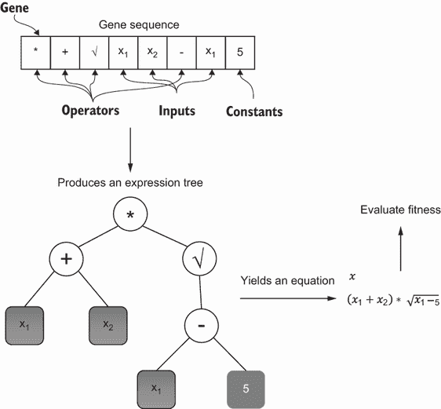

图 4.1 示例 GP `个体` 到表达式树到方程到 `适应度`

图 4.1 中所示的 `基因` 序列展示了运算符、输入/参数和常量的顺序如何形成一个不均匀的叶节点表达式树。查看 `基因` 序列，我们可以看到第一个运算符是 *，它映射到树的根。从这些运算符中，接下来的两个 `基因` 扩展到第一级节点，由 + 和 √ 运算符表示。序列中的下一个两个 `基因` 映射到 + 节点。随后，– 运算符附加到 √ 节点，最后，最后的 `基因` 映射到底部节点。

每个节点形成的子节点数量取决于运算符的顺序。运算符的顺序可以是单目、双目、三目或 *n*-目。为了简化，在这个例子中，我们使用双目运算符 *, – 和 + 以及单目运算符 √。输入和常量没有顺序，并且始终表示表达式树中的叶节点。

从表达式树中，可以通过一个表示某些目标输出的结果来评估一个方程。这个目标输出与监督学习中的预期值进行比较，差异表示错误或，在这种情况下，`fitness`。在这个问题中的目标是减少`fitness`或错误到最小值。

我们可以从笔记本中查看的最后一段代码块向下滚动，跳过创建`creator`的单元格，直到`toolbox`设置的开始。在创建`toolbox`之后，下一行设置了表达式树评估器。在下面的列表中，我们使用了一个现成的表达式树生成器`genHalfandHalf`，它有 50%的概率使用其两种不同形式的树之一。

列表 4.2 EDL_4_1_GP_Regression.ipynb：设置`toolbox`

```
toolbox = base.Toolbox()
toolbox.register("expr", gp.genHalfAndHalf, 
➥ pset=pset, min_=1, max_=2)                           ❶

toolbox.register("individual", tools.initIterate, creator.Individual, 
➥ toolbox.expr)
toolbox.register("population", tools.initRepeat, list, toolbox.individual)
toolbox.register("compile", gp.compile, pset=pset)      ❷
```

❶ 定义表达式生成的类型

❷ 使用原始集定义创建编译函数

在表达式树生成中，我们可以假设树是通过两个基本规则生成的。一个规则假设树中所有叶节点处于同一级别，或者说是偶数级别。另一个规则假设叶节点可以是奇数级别。图 4.1 中所示的是一种奇数级别叶节点的表达式树示例。列表 4.2 中的代码使用`genHalfAndHalf`函数允许生成两种形式的树。

接下来，我们看看如何使用 NumPy 的几行代码随机生成样本输入值，如以下列表所示。`x`输入是通过 NumPy 的随机`rand`函数生成的，形状为`4, 10000`，表示在 10,000 行中有 4 个输入。然后，我们使用一个临时的方程来计算目标`y`值，我们的解决方案稍后应该复制这个方程。

列表 4.3 EDL_4_1_GP_Regression.ipynb：生成数据

```
x = np.random.rand(4, 10000)       ❶
y = (x[3] + x[0]) / x[2] * x[1]    ❷
```

❶ 创建一个 4, 10000 的随机张量

❷ 使用定义的方程评估目标值

我们 GP 进化的目标是重新创建我们在列表 4.3 中使用的方程来计算目标值。在这个例子中，我们使用随机数据，但你当然可以将相同的原理应用于由输入特征*x*和目标输出*y*定义的结构化数据，以解决其他形式的回归问题。

在我们继续之前，让我们回到前面代码中的一个早期代码单元格，如列表 4.4 所示。我们可以看到函数`protected_div`的定义，该函数替换了我们通常使用的除法运算符。我们需要这样做以避免使用 NumPy 可能遇到的除以零错误。参考列表 4.1 以了解该函数是如何用来定义表达式`primitive`集的除法运算符的。

列表 4.4 EDL_4_1_GP_Regression.ipynb：`protected_div`函数

```
def protectedDiv(left, right):                         ❶
  with np.errstate(divide='ignore',invalid='ignore'):
    x = np.divide(left, right)
    if isinstance(x, np.ndarray):
      x[np.isinf(x)] = 1
      x[np.isnan(x)] = 1
    elif np.isinf(x) or np.isnan(x):
      x = 1
  return x
```

❶ 防止除以零的包装器

从这里，我们继续审查用于评估编译表达式与值之间差异量的`fitness`函数，在这个例子中称为`evalSymbReg`。通过传递每个输入来评估差异量。注意以下列表中 NumPy 如何允许我们一次性处理所有 10,000 个样本行数据，以输出总误差或差异。

列表 4.5 EDL_4_1_GP_Regression.ipynb：评估`fitness`

```
def evalSymbReg(individual):    
  func = toolbox.compile(expr=individual)             ❶
  diff = np.sum((func(x[0],x[1],x[2],x[3]) - y)**2)   ❷
  return diff,                                        ❸
```

❶ 将表达式编译成树

❷ 评估编译表达式与值和平方之间的差异

❸ 将差异或误差作为个体`fitness`返回

代码的其余部分与上一章的练习相当，所以我们在这里不需要回顾它。图 4.2 显示了找到一个最小错误量或`fitness`低于一的进化输出表达式树。这个表达式树图是用`network`创建的，正如在列表 4.6 中显示的`plot_expression`函数定义的那样。当这个表达式树被评估时，我们可以看到产生的方程和结果代码与计算`y`的原始函数相匹配，如列表 4.3 所示。你也许还会注意到，表达式树引入了另一个受保护的除法运算符，这导致最后一个项从实际方程中翻转。从数学上讲，求解后的输出表达式树与用于生成`y`的原始方程相匹配。

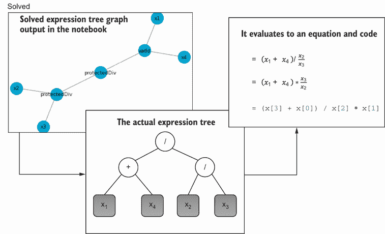

图 4.2 求解的表达式树图，它评估为方程和代码

列表 4.6 显示了如何使用`plot_expression`函数绘制表达式树。与第三章的练习一样，我们继续按`fitness`输出顶部或最佳`individual`。在这种情况下，我们希望`fitness`最小化或接近零的值。使用`plot_expression`函数绘制的表达式树使用 Fruchterman-Reingold 力导向算法定位节点。Networkx 提供了各种位置算法或布局，但弹簧布局适用于大多数情况。

列表 4.6 EDL_4_1_GP_Regression.ipynb：绘制表达式树

```
import matplotlib.pyplot as plt
import networkx as nx                                   ❶

def plot_expression(individual):
  options = {"node_size": 500, "alpha": 0.8}
  nodes, edges, labels = gp.graph(individual)

  g = nx.Graph()
  g.add_nodes_from(nodes)
  g.add_edges_from(edges)

  pos = nx.spring_layout(g)                             ❷
  nx.draw_networkx_nodes(g, pos, **options)             ❸
  nx.draw_networkx_edges(g, pos, width=1.0, alpha=0.5)
  nx.draw_networkx_labels(g, pos, labels, font_size=9, font_color='k')  
  plt.show()
```

❶ networkx 是一个节点图绘图库。

❷ 使用弹簧布局表示节点

❸ 渲染图表的节点、边和标签

在这个例子中，我们使用了随机数据来进化一个回归函数，该函数可以生成我们的原始方程。完全可以修改这个例子以消费 CSV 结构化数据，从而生成解决现实世界问题的回归方程。

GP 提供了使用表达式树生成相同概念来生成方程或实际程序代码的能力。这是因为，从根本上讲，所有编程代码都可以表示为一个表达式树，其中像`if`语句这样的布尔运算符是接受二进制输入或复杂函数的单个返回值的*n*-元运算符。

基因表达式编程

在本例中我们使用的遗传编程形式更具体地称为基因表达编程（GEP）。GEP 由 Candida Ferreira 于 2002 年开发，她目前是 Gepsoft 的负责人，Gepsoft 是一家生产名为 Gene Expression Programming Tools 的工具的 AI/ML 工具软件组织。这个工具可以用来在结构化数据上执行 GEP，产生从方程到跨多种语言的实际程序代码的各种形式输出。如果你想探索使用 GEP 处理结构化数据，那么你绝对应该访问 Gepsoft 网站并下载软件的试用版（[www.gepsoft.com](https://www.gepsoft.com/)）。

GEP 的好处是生成实际的数学函数或编程代码，这些代码可以稍后进行优化和重用。然而，GEP 也可能生成过于复杂的函数或代码，这可能会使解决方案不可用。如果你回过头去运行最后一个练习，输入超过四个时，你可以验证在进化过程中生成的表达式树的复杂性增加。

### 4.1.2 学习练习

请完成以下练习，以帮助提高你对概念的理解：

1.  修改列表 4.3 中的目标函数，然后重新运行笔记本。如果你使方程更复杂会发生什么？

1.  删除或注释列表 4.1 中的某些算子，然后重新运行。当进化算子较少时会发生什么。这是你所期望的吗？

1.  修改遗传算子以及/或`交叉`、`选择`或`变异`参数，然后重新运行。

在使用进化构建基因序列之后，我们现在想转向更具体的适者生存实现。在下一节中，我们回到第二章中生命模拟的根源，并介绍粒子群优化。

## 4.2 使用 DEAP 的粒子群优化

粒子群优化（PSO）是另一种受适者生存和集群行为概念启发的进化计算方法。在下一笔记本中，我们使用 PSO 来近似使用 DEAP 解决函数所需的最佳参数。这是一个简单的例子，展示了 PSO 在解决参数函数输入方面的强大能力。

PSO 的一个常见用例是解决已知方程或函数中的所需输入参数。例如，如果我们想将炮弹射到指定的距离，我们会考虑图 4.3 中显示的物理方程。

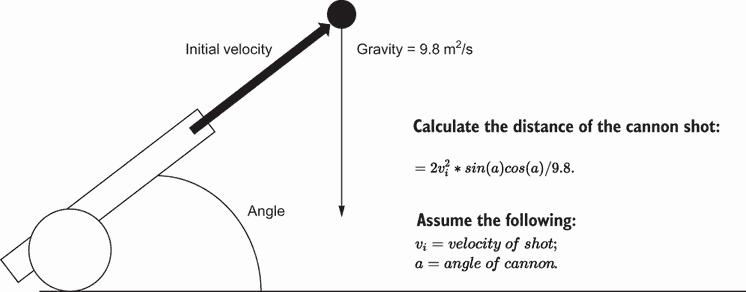

图 4.3 计算炮弹射击距离

### 4.2.1 使用 PSO 求解方程

我们可以尝试使用几种数学和优化方法来解决图 4.3 中的方程。当然，我们不会这么做，而是使用 PSO 来找到所需的初始速度和射击角度。在 Google Colab 中打开 EDL_4_2_PSO.ipynb 并开始以下练习。

本练习中使用的代码是 DEAP，所以其中大部分应该都很熟悉。在这里，我们关注几个独特的代码关键部分，这些部分定义了 PSO。首先，滚动到设置`toolbox`的位置，如下所示。`toolbox`注册了几个关键函数，用于生成、更新和评估`粒子`。可以将其视为`粒子`操作符，确保不要将它们称为遗传操作符。

列表 4.7 EDL_4_2_PSO.ipynb：设置`toolbox`

```
toolbox = base.Toolbox()
toolbox.register("particle", 
                 generate, size=2, pmin=-6, 
                 ➥ pmax=6, smin=-3, smax=3)             ❶
toolbox.register("population", 
                 tools.initRepeat, list, 
                 ➥ toolbox.particle)                    ❷
toolbox.register("update", 
                 updateParticle, phi1=200, phi2=200)     ❸
toolbox.register("evaluate", evaluate)                   ❹
```

❶ 注册`generate`函数以创建一个新的粒子

❷ 将粒子作为种群中的个体进行注册

❸ 注册`updateParticle`函数以更新粒子

❹ 注册函数以评估个体的适应性

我们首先查看`generate`操作符和同名的函数。图 4.8 中显示的`generate`函数创建了一个由`粒子`组成的数组，其起始位置由`pmin`和`pmax`设置。在群集优化过程中，每个`粒子`都有一个固定的速度或距离，它可以在更新中使用。在更新过程中，`粒子`通过评估`fitness`被移动或群集到位置。

列表 4.8 EDL_4_2_PSO.ipynb：生成`粒子`

```
def generate(size, pmin, pmax, smin, smax):
  part = creator.Particle(np.random.uniform(pmin, 
  ➥ pmax, size))                                    ❶

  part.speed = np.random.uniform(smin, smax, size)   ❷
  part.smin = smin
  part.smax = smax
  return part
```

❶ 创建一个粒子数组

❷ 创建一个随机速度向量

接下来，我们查看更新操作符函数`updateParticle`，如下所示。这个函数负责在群集优化的每次迭代中更新`粒子`的位置。在 PSO 中，想法是不断群集`粒子`围绕最适应的`粒子`。在更新函数中，通过改变速度和位置来群集`粒子`。

列表 4.9 EDL_4_2_PSO.ipynb：更新`粒子`

```
def updateParticle(part, best, phi1, phi2):
  u1 = np.random.uniform(0, phi1, len(part))    ❶
  u2 = np.random.uniform(0, phi2, len(part))
  v_u1 = u1 * (part.best - part)                ❷
  v_u2 = u2 * (best - part)
  part.speed += v_u1 + v_u2
  for i, speed in enumerate(part.speed):        ❸
    if abs(speed) < part.smin:
      part.speed[i] = math.copysign(part.smin, speed)
    elif abs(speed) > part.smax:
      part.speed[i] = math.copysign(part.smax, speed)
  part += part.speed
```

❶ 通过一些随机量偏移粒子

❷ 计算二维速度偏移

❸ 遍历速度并调整

图 4.4 展示了 PSO 如何将各种`粒子`围绕优化目标区域进行群集。如果我们把角度和速度画在图上，那么我们可以把每个`粒子`或点看作是射击大炮的猜测或尝试。因此，PSO 的目标是找到最优参数（速度和角度），使大炮弹射到目标距离。

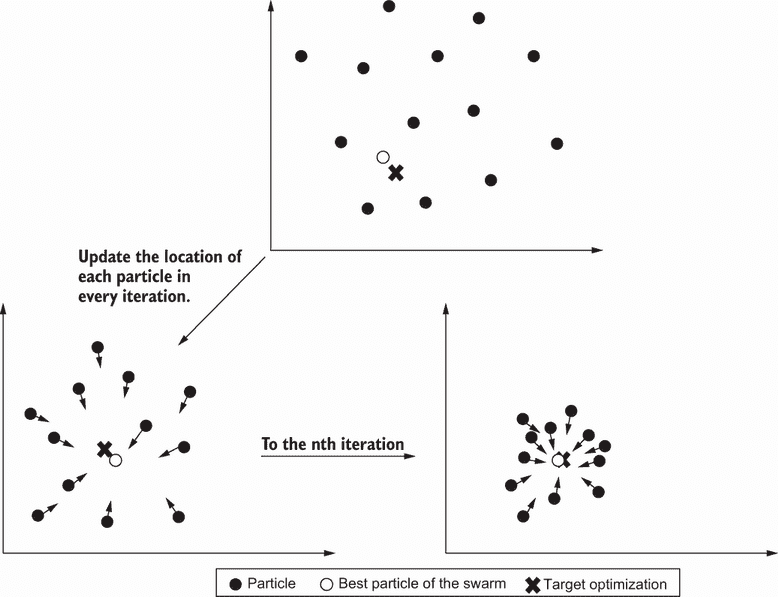

图 4.4 粒子群优化

接下来，我们查看列表 4.7 中注册到`toolbox`的评估函数`evaluate`。在这段代码的开始，我们定义了目标距离，将其作为笔记本滑块输入暴露出来。由于图 4.3 中的方程中速度项是平方的，我们只想允许正值。这就是我们防止负值的原因。同样，我们假设角度是以度为单位，然后将其转换为弧度用于方程。最后，我们使用方程计算距离，并从目标距离中减去。然后我们返回平方值，作为函数返回的元组，以返回平方误差项的总和。

列表 4.10 EDL_4_2_PSO.ipynb：评估粒子

```
distance = 575 #@param {type:"slider", min:10, 
➥ max:1000, step:5}                                     ❶
def evaluate(individual):
  v = individual[0] if individual[0] > 0 else 0  
  ➥ #velocity                                           ❷
  a = individual[1] * math.pi / 180  #angle to radians   ❸
  return ((2*v**2 * math.sin(a) * math.cos(a))/9.8 – 
  ➥ distance)**2,                                       ❹
```

❶ 允许输入距离以滑动条表单控件的形式暴露

❷ 确保速度是一个正值

❸ 将角度从度转换为弧度

❹ 从距离到计算值的平方误差返回

在设置好基本操作后，我们可以继续到群聚代码。这个代码块，如图 4.11 所示，比我们之前的 GA 或 GP 示例简单得多。与 GA 或 GP 不同，在 PSO 中，粒子在整个模拟过程中都存在。由于粒子的寿命较长，我们可以跟踪每个粒子的最佳 `fitness` 值。跟踪每个粒子的最佳 `fitness` 值允许当前最佳粒子（在代码列表中以 `best` 表示）进行交换。最后一行上的 `toolbox.update` 调用是群中粒子根据最佳粒子的位置重新定位的地方，使用列表 4.9 中的 `updateParticle` 函数。

列表 4.11 EDL_4_2_PSO.ipynb：群聚

```
GEN = 100                                              ❶
best = None

for g in range(GEN):          
  for part in pop:                                     ❷
    part.fitness.values = tuple(np.subtract((0,), toolbox.evaluate(part)))          
    if part.best is None or part.best.fitness < 
    ➥ part.fitness:                                   ❸
      part.best = creator.Particle(part)
      part.best.fitness.values = part.fitness.values
    if best is None or best.fitness < part.fitness:    ❹
      best = creator.Particle(part)
      best.fitness.values = part.fitness.values
  for part in pop:                                     ❺
    toolbox.update(part, best)
```

❶ 设置群聚代数数量

❷ 在种群中循环粒子

❸ 检查粒子的最佳适应度

❹ 检查它是否比最佳粒子更好

❺ 遍历种群并更新工具箱

随着模拟的进行，你会看到粒子如何开始收敛到最佳或多个最佳解，如图 4.5 所示。注意，在这个问题中角度和速度有两个正确解。同时注意，粒子在解的某些距离上仍然分布较广。这是由于超参数 `pmin`、`pmax`、`smin`、`smax`、`phi1` 和 `phi2` 的选择，你可以通过调整这些值来改变粒子的分布量。如果你想看到更小的粒子分布，将那些超参数调整到更小的值，然后再次运行笔记本。

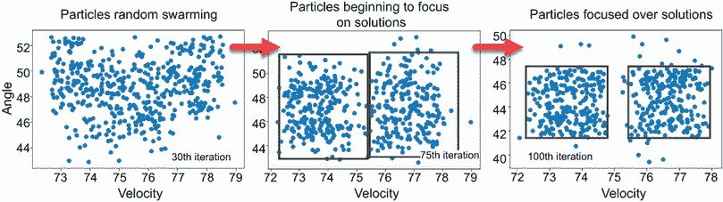

图 4.5 粒子群迭代散点图

最后，笔记本中的最后一块代码允许我们评估最佳粒子的指定解。然而，由于问题有两个解，我们可能会评估多个最佳解。从输出值中，你可以看到 PSO 可以相对快速地近似射击一定距离的解，如下面的列表所示。

列表 4.12 EDL_4_2_PSO.ipynb：输出最佳结果

```
v, a = best                                           ❶
a = a * math.pi / 180  #angle to radians              ❷
distance = (2*v**2 * math.sin(a) * math.cos(a))/9.8   ❸
print(distance)
```

❶ 从最佳解中提取速度和角度

❷ 将角度从度转换为弧度

❸ 计算射击的距离

PSO 可以应用于各种其他问题，并具有不同的有效性。群聚优化是一种轻量级方法，用于寻找未知参数。如第五章所示，PSO 可以提供对深度学习系统超参数的简单优化。

### 4.2.2 学习练习

通过探索以下练习中的某些或全部内容来提高你的知识：

1.  修改列表 4.10 中的目标距离。这会对 PSO 解有什么影响？

1.  修改列表 4.7 中的`pmin`、`pmax`、`smin`和`smax`输入，然后重新运行。

1.  修改列表 4.7 中的`phi1`和`phi2`参数，然后重新运行。这会对找到解决方案有什么影响？

现在我们已经涵盖了优化`particles`，在下一节中，我们将探讨更复杂的进化过程，例如相互依赖或协同进化的解决方案。

## 4.3 使用 DEAP 协同进化解决方案

我们星球上的生命存在于一种共生关系中，数百万物种相互依赖以生存。描述这种关系的术语有*协同进化*和*相互依赖的进化*。当我们试图解决更复杂的问题时，我们同样可以使用进化方法来模拟协同进化。

在下一个笔记本中，我们回顾了本章第一个例子中使用 GP 解决的回归问题。这次我们从玩具问题转向一个更接近现实世界的例子，使用一个名为波士顿住房（BH）市场的样本结构化数据集。

BH 数据集包含 13 个特征列，有助于预测波士顿市场的房价。当然，我们可以单独使用 GP 来尝试推导出一个方程，但结果会过于复杂。相反，在下面的例子中，我们考虑使用协同进化将 GP 与 GA 配对，希望得到一个更简单的输出。

### 4.3.1 使用遗传算法与遗传编程协同进化

这个练习在两个笔记本之间交替进行。第一个是从我们早期的 GP 例子升级到 EDL_4_GP_Regression.ipynb，用 BH 数据集替换了玩具问题。第二个笔记本，EDL_4_3_CoEV_Regression.ipynb，展示了使用协同进化来解决相同的问题——这次使用 GP 和 GA。

打开 EDL_4_GP_Regression.ipynb 笔记本，然后从菜单中选择运行 > 运行所有单元格。这个笔记本与 EDL_4_3_COEV_Regression.ipynb 之间的关键区别是使用了我们可以导入的 BH 数据集，如列表 4.13 所示。BH 数据集从`sklearn.datasets`加载，我们返回特征`x`和目标`y`。然后交换轴以适应行、特征格式和提取的输入数量。输入数量定义了导出方程中的参数数量。

列表 4.13 EDL_4_3_COEV_Regression.ipynb：设置数据

```
from sklearn.datasets import load_boston    ❶
x, y = load_boston(return_X_y=True)         ❷
x = np.swapaxes(x,0,1)                      ❸
inputs = x.shape[0]                         ❹
```

❶ 从 sklearn.datasets 模块导入

❷ 加载数据然后返回目标值 y

❸ 交换轴以匹配笔记本

❹ 提取输入数量、参数

图 4.6 显示了将方程进化到小于 135 的最小`fitness`分数的结果，这是一个用于简化解决方案的值。得到的方程表明，并非所有特征都在导出的方程中使用，只有 ARG5、ARG7、ARG10、ARG11 和 ARG12 是相关的。这也意味着 GP 解决方案自动通过忽略不那么相关的特征来执行特征选择。

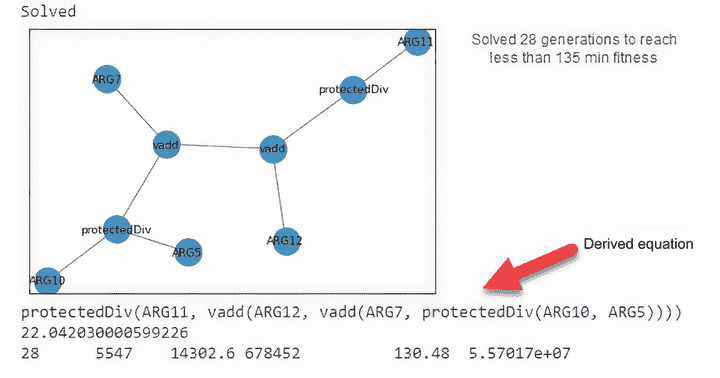

图 4.6 GP_Regression 笔记本的输出

接下来，在 Colab 中打开 EDL_4_3_COEV_Regression.ipynb 笔记本，然后运行所有单元格。这个笔记本中有大量的代码，但我们之前在各种其他示例中都见过。这个例子中的主要区别在于我们同时使用 GP 和 GA 方法来精细调整一个派生的方程。这意味着代码量加倍，但其中大部分我们都见过。首先要注意的是，如下所示，我们构建了两个 `toolboxes`——一个用于 GA `population`，另一个用于 GP。

列表 4.14 EDL_4_3_COEV_Regression.ipynb：`Toolbox` 注册

```
toolbox_ga = base.Toolbox()                            ❶
toolbox_ga.register("float", random.uniform, -1, 1)    ❷
toolbox_ga.register("individual", 
              tools.initRepeat, creator.IndGA, 
              ➥ toolbox_ga.float, inputs)             ❸
toolbox_ga.register("population", 
              tools.initRepeat, list, toolbox_ga.individual)

toolbox_gp = base.Toolbox()                            ❹
toolbox_gp.register("expr", gp.genHalfAndHalf, pset=pset, min_=1, max_=2)
toolbox_gp.register("individual", 
              tools.initIterate, creator.Individual, toolbox_gp.expr)
toolbox_gp.register("population", 
              tools.initRepeat, list, toolbox_gp.individual)
toolbox_gp.register("compile", gp.compile, pset=pset)
```

❶ 为 GA 种群创建工具箱

❷ 每个基因由一个介于 -1 到 +1 之间的单个浮点数定义。

❸ 基因序列的大小由输入数量定义（对于 BH 为 13）。

❹ 为 GP 种群创建工具箱

在这个例子中，GP 求解器正在努力构建一个派生方程。GA 求解器同时与一个大小等于输入/特征数量的缩放器 `genes` 序列协同进化。对于 BH 数据集，输入的数量等于 13。每个 GA 缩放器 `gene` 值用于缩放输入到方程中的特征。我们可以在下面的列表中看到的 `evalSymbReg` 评估函数中看到这一点。当此函数用于评估 `fitness` 时，我们传递两个 `individuals`。`individual` 输入代表一个 GP `individual`，而 `points` 输入代表一个 GA `individual`。这个函数的每次评估都是使用来自 GA 和 GP `populations` 的两个 `individuals`。

列表 4.15 EDL_4_3_COEV_Regression.ipynb：`fitness` 评估

```
def evalSymbReg(individual, points):    
    func = toolbox_gp.compile(expr=individual)             ❶
    p = np.expand_dims(points, axis=1)                     ❷
    x = X * np.asarray(p)                                  ❸
    diff = math.sqrt(np.sum((func(*x.tolist()) - y)**2))   ❹
    return diff, 
```

❶ 从工具箱编译函数

❷ 将 GA 点数组从 (13,) 转换为 (13,1)

❸ 通过点数组缩放输入数据

❹ 计算派生方程的 `fitness`

通常，在协同进化场景中，你不会希望两种方法以相同的速率进化。在这个例子中，例如，我们允许 GA `population`（种群），缩放器，比 GP `population`（种群）进化得更快。这允许 GA 方法精细调整在派生 GP 方程中使用的参数的缩放或权重。本质上，这允许 GA 方法对方程进行精细调整以获得更好的拟合。对于这个笔记本，我们在 GA 到 GP 之间设置了一个进化的比率，为 10 到 1。这些超参数在下面的代码列表中设置。

列表 4.16 EDL_4_3_COEV_Regression.ipynb：控制进化步骤

```
GA_GEN, GP_GEN, BASE_POP = 1, 10, 10000            ❶
pop_ga = toolbox_ga.population(n=BASE_POP*GA_GEN)  ❷
pop_gp = toolbox_gp.population(n=BASE_POP*GP_GEN)
```

❶ 控制生成频率的超参数

❷ 通过生成频率调整种群起始点

在进化代码中，我们通过以下列表中的代码控制每个 `population` 进化的频率。此代码块显示了 GA `population` 的进化，但对于 GP 也应用了相同的过程。超参数 `GA_GEN` 控制进化的频率。

列表 4.17 EDL_4_3_COEV_Regression.ipynb：进化 `population`

```
if (g+1) % GA_GEN == 0:                                  ❶
  off_ga = toolbox_ga.select(pop_ga, len(pop_ga))    
  off_ga = [toolbox_ga.clone(ind) for ind in off_ga]

  for ind1, ind2 in zip(off_ga[::2], off_ga[1::2]):      ❷
    if random.random() < CXPB:
      toolbox_ga.mate(ind1, ind2)
      del ind1.fitness.values
      del ind2.fitness.values

   for ind in off_ga:                                    ❸
     if random.random() < MUTPB:
       toolbox_ga.mutate(ind)
       del ind.fitness.values      

    pop_ga = off_ga                                      ❹
```

❶ 如果这是进化步骤，则进行进化。

❷ 交叉

❸ 突变

❹ 将后代分配以替换种群

记住，当我们评估`适应度`时，该函数需要来自两个`种群`——GA 和 GP 的`个体`。这意味着评估`个体`的代码与每个`种群`相关联。注意，当我们为 GA 或 GP`种群`评估`适应度`时，我们使用另一个`种群`的最佳表现者。这种简化近似了每个`种群`的最高`适应度`。另一种方法是循环遍历两个`种群`并测试每种组合。这种方法将是计算上昂贵的，所以我们退回到以下列表中显示的简化。

列表 4.18 EDL_4_3_COEV_Regression.ipynb：评估`种群``适应度`

```
for ind in pop_gp:
  ind.fitness.values = toolbox_gp.evaluate
  ➥ (ind, points=best_ga)                  ❶
for ind in pop_ga:
  ind.fitness.values = toolbox_gp.evaluate
  ➥ (best_gp, points=ind)                  ❷
```

❶ 使用 GA 种群中的最佳者评估 GP 适应度

❷ 使用 GP 种群中的最佳者评估 GA 适应度

图 4.7 显示了运行此示例到解决方案的最终输出，再次假设`适应度`低于 135。如图所示，推导出的方程已被显著简化。最佳遗传算法（GA）`个体`分配用于修改方程输入的缩放因子。在图 4.7 中，你可以看到最终方程如何应用输入缩放。

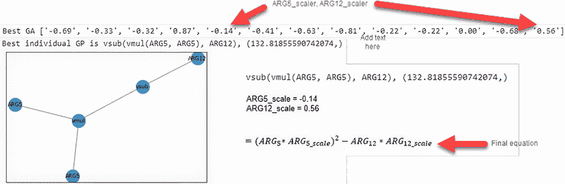

图 4.7 最佳协同进化解决方案

最终推导出的方程显示了预测 BH 市场价值的潜在解决方案。如果我们查看结果方程并参考笔记本中显示的 BH 特征，我们可以看到 ARG5 被识别为 NOX（氧化亚氮浓度），ARG12 被识别为 LSTAT（低阶层`人口`百分比），它们被确定为使用的主要特征。

如果你参考图 4.6 中显示的 GP 回归笔记本中解决的方程，你也会注意到 ARG5 和 ARG12 被认为与 ARG7、ARG10 和 ARG11 一样是重要特征。协同进化解决方案能够进一步通过传递到方程中的输入减少特征权重。这导致了一个可能过于简化的方程，但有了它，我们可以在 BH 数据集中识别 NOX 和 LSTAT 特征之间的关键相关性。

GP 回归结果

随着遗传规划的进化，它通常会创建更复杂或过于复杂的方程。长时间运行的进化甚至可能超出表达式树的大小。将遗传算法（GA）引入遗传规划允许方程进行微调。然而，这可能会导致问题的过度简化。数据集的大小也可能特别有问题，因为 BH 集只有 500 多行。在大多数情况下，你将得到更多数据时的更好结果。

现在，我们刚刚评估的协同进化解决方案并非完美无缺。它确实解决了在遗传规划（GP）中经常遇到的复杂性问题。然而，显然最终的答案可能过于简单，缺少其他关键特征，无法推断出足够的准确性。但这也足够简单，可以用基本的计算器即时计算。

我们将在后续章节中使用其他协同进化的解决方案来平衡应用于 DL 的多种形式的 EC。正如我们在前面的练习中看到的，协同进化可以将多种形式的 EC 绑定在一起来解决一个共同的复杂问题。在后续的例子中，我们花费时间掌握平衡协同进化的方法。

## 4.4 使用 DEAP 的进化策略

进化策略是进化方法和遗传方法的扩展，它添加了控制子基因或表型，称为 *策略*。这些策略只不过是一个额外的向量，它控制或影响 `mutation` 操作符。这为 ES 提供了更有效地解决各种复杂问题的能力，包括函数逼近。

在下一个笔记本中，我们探索一个函数逼近问题，我们稍后将在查看使用深度学习（DL）的进化时再次回顾这个问题。为了保持简单，我们在这里查看逼近已知连续多项式解的函数参数。然后，我们转向更复杂的不连续解，并观察 ES 的表现如何。

### 4.4.1 将进化策略应用于函数逼近

ES 与“vanilla” GAs 的不同之处在于一个 `individual` 携带一个额外的 `gene` 序列或向量，称为策略。在进化的过程中，这个策略向量学会调整和应用更好的、微调的 `mutation` 来优化 `individual` 的进化。

正如我们在第三章中发现的，`mutation` 和 `mutation` 率类似于 DL 中的学习率。`mutation` 控制进化过程中 `population` 的变异性。`mutation` 率越高，`population` 的变异性就越大，多样性也越高。能够控制并在迭代中学习这个 `mutation` 率使我们能够更有效地确定解决方案。

在接下来的笔记本中，我们设置了一个 ES 算法来逼近已知解。我们还讨论了如何学习在时间上优化 `mutation`，这允许 `population` 更好地收敛并逼近解。让我们首先打开 Google Colab 中的笔记本 EDL_4_4_ES.ipynb 并运行整个笔记本。

进化策略是 GA 的扩展，因此我们使用 DEAP 需要的大部分代码与我们之前看到的类似。我们在这里回顾关键差异，重点关注 ES 的实现，从超参数定义开始。`IND_SIZE` 值控制解决的多项式函数的维度或，实际上是 `gene` 的大小。`MAX_TIME` 超参数用于控制进化的总时间。这是一种有效控制进化运行时间的方法，而不是依赖于 `generations` 的数量。最后，策略分配超参数 `MIN_VALUE`、`MAX_VALUE`、`MIN_STRATEGY` 和 `MAX_STRATEGY` 控制突变向量，并在以下列表中进一步讨论。

列表 4.19 EDL_4_4_ES.ipynb：检查超参数

```
IND_SIZE = 6         ❶
NGEN = 1000          ❷

MIN_VALUE = 4        ❸
MAX_VALUE = 5
MIN_STRATEGY = 0.5
MAX_STRATEGY = 3     ❸

CXPB = .6            ❹
MUTPB = .3           ❹
GEN_OUTPUT = 25      ❺
MAX_TIME = 100       ❻
```

❶ 解决的多项式维度

❷ 最大进化代数数量

❸ 控制策略分配的值

❹ 交叉和变异率

❺ 产生输出的代数数量

❻ 进化运行的最大时间

继续到下一个单元格，我们可以看到如何构建初始的目标数据集。在这个练习中，如列表 4.20 所示，我们提供了三个选项或方程进行评估：一个五次多项式连续函数和两个不连续函数，abs 和 step。数据通过范围参数进行处理，生成 `X` 和 `Y` 值，这些值被压缩到一个名为 `data` 的列表中。在单元格底部，我们绘制了数据的散点图以可视化目标函数。

列表 4.20 EDL_4_4_ES.ipynb：准备数据

```
equation_form = "polynomial" #@param ["polynomial", 
➥ "abs", "step"]                                                 ❶

X_START = -5                                                      ❷
X_END = 5                                                         ❷
X_STEP = 0.5                                                      ❷

def equation(x):                                                  ❸
  if equation_form == "polynomial":
    return (2*x + 3*x**2 + 4*x**3 + 5*x**4 + 6*x**5 + 10) 
  elif equation_form == "abs":    
    return abs(x)
  else:    
    return np.where(x>1, 1, 0)     

X = np.array([x for x in np.arange(X_START, X_END, X_STEP)])      ❹
Y = equation(X)                                                   ❺
data = list(zip(X, Y))

plt.scatter(X,Y)                                                  ❻
```

❶ 提供三个目标方程的选项

❷ x 的数据集范围值

❸ 评估目标方程的函数

❹ 构建输入 X 值

❺ 运行方程然后生成 Y 值

❻ 在散点图中绘制函数

图 4.8 展示了五次多项式函数的图像，以及步进和绝对函数。让我们首先针对连续的多项式函数进行目标定位，看看 ES 如何有效地逼近一个解。其他两个函数代表的是不连续的函数，它们不可导，因此通常不能通过 DL 网络求解。

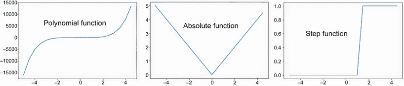

图 4.8 函数逼近选项

接下来，我们看看代码块中的 `creator` 部分，如列表 4.21 所示，以了解 ES 与典型 GA 的不同之处。我们可以看到 `FitnessMin` 和 `Individual` 正常注册，但有一个区别。当 `individual` 被注册时，我们添加了一个名为 `Strategy` 的属性，设置为 `None`。`Strategy` 最后注册，类型为 double `d` 数组。

列表 4.21 EDL_4_4_ES.ipynb：创建 `Individual` 和 `Strategy`

```
creator.create("FitnessMin", base.Fitness, weights=(-1.0,))
creator.create("Individual", array.array, typecode="d", 
➥ fitness=creator.FitnessMin, strategy=None)             ❶
creator.create("Strategy", array.array, typecode="d")     ❷
```

❶ 创建一个具有策略的数组类型的个体

❷ 创建一个数组类型的策略

我们现在跳到设置 `toolbox` 的单元格，如列表 4.22 所示。我们首先注意到使用 `generatES` 函数初始化一个 `individual`，输入为 `creator.Individual`、`creator.Strategy`、`IND_SIZE`、`MIN_VALUE`、`MAX_VALUE`、`MIN_STRATEGY` 和 `MAX_STRATEGY`。`交叉` 或 `mate` 操作使用特殊的 ES 混合算子来组合父代，而不是在正常 `交叉` 中找到的替换算子。同样，`变异` 操作使用 ES 对数正态操作来控制策略的变异。然后在代码块的底部，我们可以看到一个装饰器被应用于 `mate` 或 `mutate` 操作符。装饰器为输入提供了一个过滤机制，在这种情况下，我们使用了稍后展示的 `checkStrategy` 函数。

列表 4.22 EDL_4_4_ES.ipynb：设置 `toolbox`

```
toolbox = base.Toolbox()
toolbox.register("individual", generateES, creator.Individual, 
➥ screator.Strategy,
    IND_SIZE, MIN_VALUE, MAX_VALUE, MIN_STRATEGY, MAX_STRATEGY)            ❶
toolbox.register("population", tools.initRepeat, list, toolbox.individual)
toolbox.register("mate", tools.cxESBlend, alpha=0.1)                       ❷
toolbox.register("mutate", tools.mutESLogNormal, c=1.0, indpb=0.03)        ❸
toolbox.register("select", tools.selTournament, tournsize=3)

toolbox.decorate("mate", checkStrategy(MIN_STRATEGY))                      ❹
toolbox.decorate("mutate", checkStrategy(MIN_STRATEGY))                    ❹
```

❶ 使用生成输入的功能注册个人

❷ 矩阵/交叉算子是 cxESBlend。

❸ 变异算子是 mutESLogNormal。

❹ 使用 `checkStrategy` 装饰 `mate/mutate`

跳到上一个单元，我们可以看到 `generateES` 和 `checkStrategy` 函数的定义，如列表 4.23 所示。第一个函数使用传递给函数的输入创建 `individual`，其中输入 `icls` 代表用于构建 `individual` 的类，而 `scls` 代表用于构建策略的类。第二个函数使用装饰器模式检查策略，以确保向量保持在某个最小值之上。使用初始化的 `individual` 设置，`gene` 序列中的每个随机值都设置在最小值和最大值之间。同样，策略的初始化遵循相同的模式，使用不同的最小/最大值。这产生了一个具有两个大小为 `IND_SIZE` 或 `NDIM` 的向量 `individual`——一个用于定义主要的 `gene` 序列，另一个作为在 `mate` 和 `mutate` 操作符期间应用于每个 `gene` 的学习 `mutation` 和混合率。

列表 4.23 EDL_4_4_ES.ipynb：核心函数

```
def generateES(icls, scls, size, imin, imax, 
➥ smin, smax):                                 ❶
  ind = icls(random.uniform(imin, imax) for _ in range(size))
  ind.strategy = scls(random.uniform(smin, smax) for _ in range(size))
  return ind

def checkStrategy(minstrategy):                 ❷
  def decorator(func):
    def wrappper(*args, **kargs):
      children = func(*args, **kargs)
      for child in children:
        for i, s in enumerate(child.strategy):
          if s < minstrategy:
            child.strategy[i] = minstrategy
      return children
    return wrappper
  return decorator
```

❶ 根据输入参数创建个体

❷ 确保策略保持在边界内的装饰器

我们需要添加的最后 `toolbox` 注册是用于评估 `fitness`。在这个块中，如列表 4.24 所示，有两个函数。第一个函数 `pred` 用于通过遍历 `individual genes` 并将它们乘以 `x` 的因子 `i` 来推导一个值。另一个函数 `fitness` 使用 `pred` 函数遍历 `data` 中的 `x,y` 值，以确定均方误差，返回的最终值是平均 MSE。注意在这个例子中，我们如何通过在 `register` 函数中将它作为参数传递给 `evaluate` 函数来将数据集传递给 `evaluate` 函数。

列表 4.24 EDL_4_4_ES.ipynb：评估 `fitness`

```
def pred(ind, x):              ❶
  y_ = 0.0    
  for i in range(1,IND_SIZE):
    y_ += ind[i-1]*x**I        ❷
  y_ += ind[IND_SIZE-1]       
  return y_

def fitness(ind, data):        ❸
  mse = 0.0    
  for x, y in data:        
    y_ = pred(ind, x)
    mse += (y - y_)**2         ❹
  return mse/len(data),

toolbox.register("evaluate", fitness, data=data)
```

❶ 从个体和 x 生成预测

❷ 计算多项式因子 i

❸ 计算适应度的函数

❹ 评估总均方误差

如同往常，进化代码位于最后一个块中，如列表 4.25 所示，应该看起来很熟悉。我们首先定义了两个超参数，`MU` 和 `LAMBDA`，它们分别代表父母的 `population` 和衍生后代的数量。这意味着在 `selection` 中，我们使用 DEAP 算法 `eaMuCommaLambda` 从 MU 个父母生成 LAMBDA 个后代。对于这个练习，我们不仅通过总 `generations` 限制，还通过已过时间来限制。如果已过时间（以秒为单位）超过阈值 `MAX_TIME`，则进化停止。跟踪已过时间使我们能够评估比较 EC 方法，正如我们在下一个练习中所看到的。

列表 4.25 DL_4_4_ES.ipynb：进化

```
MU, LAMBDA = 250, 1000                                            ❶
#omitted
start = time.time()                                               ❷
for g in range(NGEN):
  pop, logbook = algorithms.eaMuCommaLambda(pop, toolbox, mu=MU, 
                 lambda_=LAMBDA,cxpb=CXPB, 
                 mutpb=MUTPB, ngen=1,                             ❸
                 stats=stats, halloffame=hof, verbose=False)
  if (g+1) % GEN_OUTPUT == 0:                                     ❹
    plot_fitness(g, hof[0], pop, logbook) 
    end = time.time()
    if end-start > MAX_TIME:                                      ❺
      break

print("Best individual is ", hof[0], hof[0].fitness.values[0])
```

❶ 定义种群起始和后代

❷ 跟踪进化开始的时间

❸ 在单一代中使用 `eaMuCommaLambda`

❹ 通过代数数量限制输出

❺ 检查模拟时间是否已到

图 4.9 显示了运行进化到最大 5 秒后的最终输出示例，这是很好的。然而，如果我们把输入数据绘制到 Excel 中，我们同样可以快速地使用趋势线功能生成准确的功能逼近，而且时间更短。目前 Excel 限制为 6 次多项式函数，而我们可以通过这个例子快速超越这一点。

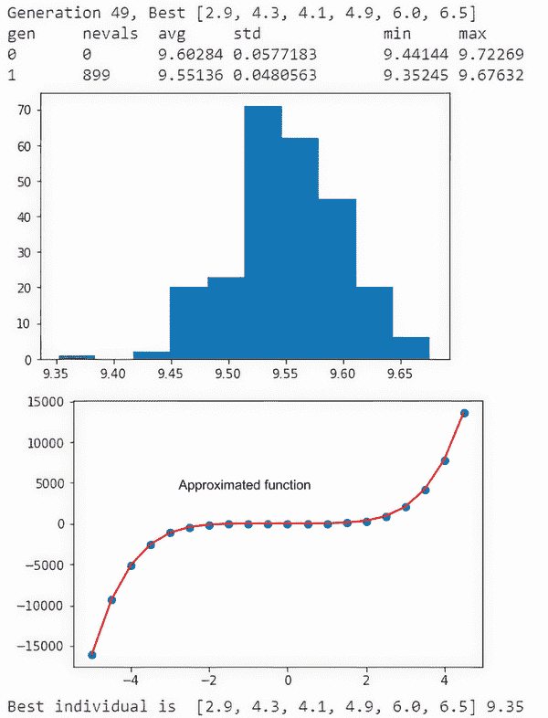

图 4.9 ES 函数逼近的示例输出

到目前为止，你可以返回并调整进化的运行时间，看看是否可以得到更好的结果，或者尝试其他函数 `abs` 和 `step`。你可能会发现，ES 在处理不连续解方面并不那么有效。这主要是因为算法近似函数的方式。

然而，如果我们把 ES 与第三章中的先前练习进行比较，我们会看到连续问题有更快的收敛速度。这是因为 ES 通过学习到的 `变异` 和 `交配` 策略来管理 `种群` 的多样性。如果你将图 4.9 中的输出直方图与之前的示例练习进行比较，就可以看到这一点。

### 4.4.2 回顾 EvoLisa

函数逼近是一个很好的基线问题，但要看到 ES 的全部威力，在本节中，我们重新审视了我们之前最复杂的问题之一：EvoLisa。在这里，我们修改了问题，采用 ES 作为我们的解决方案策略。这是一个非常快速的例子，它对 ES 和常规 GA 之间的比较非常有用。

在 Colab 中打开笔记本 EDL_4_4_EvoLisa.ipynb。如果你需要帮助，请参阅附录。然后运行笔记本中的所有单元格（从菜单中选择“运行”>“运行所有”）。

我们已经介绍了笔记本 EDL_3_5_EvoLisa.ipynb 和 EDL_4_4_ES.ipynb 中的主要代码元素。这个笔记本展示了如何将 GA 笔记本升级以使用 ES。

让笔记本运行几千个 `世代`，以查看图 4.10 所示的显著改进。图中还显示了使用“vanilla” GA 在双倍 `世代` 数——7,000 比 3,000 产生的结果比较。


图 4.10 使用 ES 与之前的 GA 解决方案相比的 EvoLisa 输出

### 4.4.3 学习练习

以下练习可以帮助你进一步理解进化策略的概念：

1.  修改列表 4.20 中的目标函数，然后重新运行以查看这会产生什么影响。

1.  修改列表 4.19 中的几个参数，看看每个变化对结果进化的影响。尝试使用函数逼近和 EvoLisa 笔记本版本都进行这一操作。

1.  将这个版本的 EvoLisa 的结果与我们在第三章中介绍的 GA 示例进行比较。ES 引导的 `变异` 增强对输出有多大的改进？

1.  进化出你能做到的最佳蒙娜丽莎复制品。鼓励你将你的结果与作者联系。

现在，你可能从这个最后的笔记本中得到的启示是将我们所有的解决方案升级到使用 ES（进化策略）。虽然 ES 是一个非常好的进步，我们可以将其保留在我们的工具箱中，但它仍然缺乏快速有效地收敛不连续解的能力。要做到这一点，我们需要了解常规 GA 和修改后的 ES 在解决更复杂函数时遇到的困难。这是我们将在下一个练习中进一步探讨的内容。

## 4.5 使用 DEAP 的差分进化

深度学习系统通常被简单地描述为好的函数或凸逼近器。函数逼近绝对不仅限于深度学习，但目前在大多数解决方案中排名第一。

幸运的是，进化计算（EC）包括几种方法。它不仅限于连续解，也可以解决不连续解。一种专注于连续和不连续解的函数逼近方法是*差分进化*（DE）。DE 不是基于微积分的，而是依赖于减少优化解之间的差异。

在我们的下一个笔记本中，我们使用差分进化来逼近我们上一个练习中已知的一个连续多项式解以及基本的不连续和复杂函数的例子。这为我们提供了另一个工具，当我们考虑在以后构建与 DL 结合的解决方案时。

### 4.5.1 使用 DE 逼近复杂和不连续函数

差分进化（Differential evolution）与 PSO（粒子群优化）比 GAs（遗传算法）或编程有更多的共同点。在差分进化中，我们维护一个`种群`的代理，每个代理的大小都是一些相等的向量大小。像 PSO 一样，代理是长期运行的，并且不产生后代，但它们的分量向量通过与其他随机代理的差异比较来修改，以产生新的更好的代理。

图 4.11 显示了 DE 的基本工作流程。在这个图的开头，从更大的代理池中随机选择了三个代理。然后，这三个代理被用来通过取第一个代理`a`并将其值加到代理`b`和`c`之间的缩放差异上来修改每个索引值的目标`Y`。结果`Y`代理被评估为`fitness`，如果这个值更好，那么就用新的代理`Y`替换它。

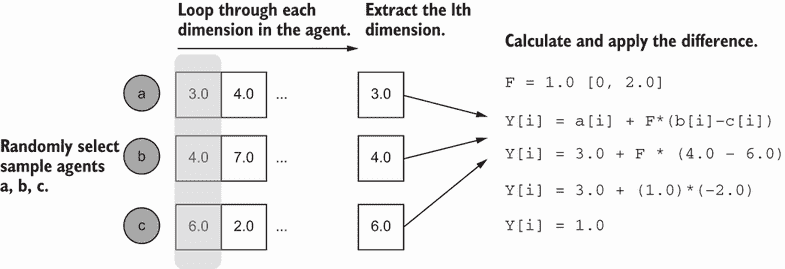

图 4.11 产生新代理的 DE 工作流程

这种方法微妙地增强了其功能，以及为什么它对不连续函数如此有效的原因，在于计算`个体`维度差异。与通常需要混合结果（如深度学习中的 DL）或泛化结果（如遗传进化）的正常优化函数不同，差分进化进行的是分量级的微分。

在深度学习（DL）中，我们用于在训练期间反向传播错误或差异的梯度优化方法是一个全局优化问题。DE 将优化提取为值的分量级微分，因此不受全局方法的限制。这意味着 DE 可以用来逼近不连续或困难的函数，正如我们将看到的。

对于下一个场景，在 Colab 中打开笔记本 EDL_4_5_DE.ipynb 并运行所有单元格。此示例与上一个练习中的相同问题集工作。因此，我们有三个问题可以对此示例进行测试：一个多项式、绝对值和步进函数。为了比较，我们首先运行我们刚刚看过的相同的多项式函数逼近示例。

对于 5 秒的 `MAX_TIME` 运行整个示例，与刚刚看到的 ES 示例相比，输出的是一个不错但并不出色的函数逼近。完成之后，我们想要通过更改准备数据中的函数类型（如列表 4.20 所示）来运行绝对值或步进函数示例，使用 Colab 表单下拉菜单来选择一个不连续的函数。

在重新运行笔记本之前，我们想要修改最大时间超参数，如下所示列表所示。将 `MAX_TIME` 值从 5 秒更改为类似 100 的值。绝对值和步进函数由于更复杂，需要更多时间。

列表 4.26 EDL_4_5_DE.ipynb：超参数

```
NDIM = 6          ❶
CR = 0.25         ❷
F = 1             ❸
MU = 300          ❹
NGEN = 1000  
GEN_OUTPUT = 25
MAX_TIME = 100    ❺
```

❶ 代理中的维度数量

❷ 类似于遗传操作中的交叉率

❸ 差分缩放因子 [0.0, 2.0]

❹ MU，或代理数量

❺ 限制模拟时间的时长

设置函数后，使用菜单中的“运行时”>“工厂重置运行时”重置笔记本的运行时。然后，使用菜单中的“运行时”>“运行所有”重新运行笔记本中的所有单元格。

为了获得良好的比较，回到 EDL_4_ES.ipynb，然后将 `MAX_TIME` 更改为 100 秒，将目标函数设置为步进，重新启动运行时，并重新运行所有单元格。图 4.12 显示了 DE 和 ES 对步进函数的运行差异。值得注意的是，DE 方法比 ES 方法表现好了 10 多倍，这与微分方法有关。另一方面，注意 ES 直方图是正态分布的，而 DE 图表分布类似于狭窄的帕累托或柯西分布。

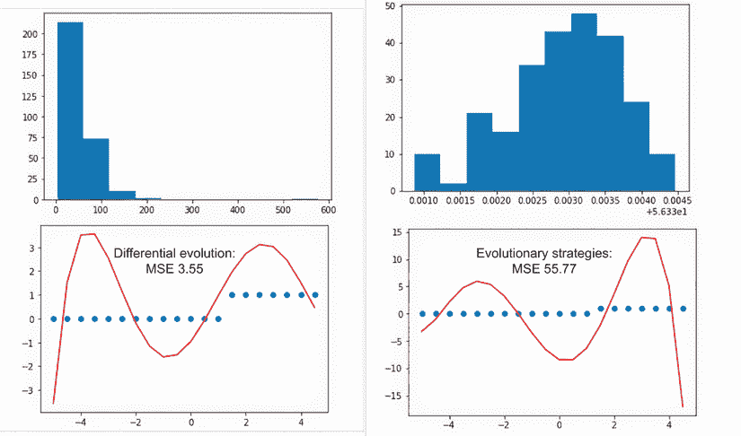

图 4.12 DE 和 ES 在步进函数上的比较

接下来，我们可以查看合并代码列表中的 `creator` 和 `toolbox` 设置。对于 `toolbox`，我们注册一个类型为 `float` 的属性，初始值为 `-3` 到 `+3`，类似于遗传进化中的 `gene`。然后，我们定义类型为 `float` 且大小为 `NDIM` 或维度数量的 `individual` 或代理。在以下代码列表的末尾，我们可以看到一个已注册的选择函数，它使用随机方法选择三个元素。回想一下图 4.11，其中我们选择三个代理（`a`、`b`、`c`）来应用微分算法。

列表 4.27 EDL_4_5_DE.ipynb：`creator` 和 `toolbox`

```
creator.create("FitnessMin", base.Fitness, weights=(-1.0,))
creator.create("Individual", array.array, 
               typecode='d', fitness=creator.FitnessMin)

toolbox = base.Toolbox()
toolbox.register("attr_float", random.uniform, -3, 3)                  ❶
toolbox.register("individual", tools.initRepeat, creator.Individual, 
                 toolbox.attr_float, NDIM)                             ❷
toolbox.register("population", tools.initRepeat, list, toolbox.individual)
toolbox.register("select", tools.selRandom, k=3)                       ❸
```

❶ 每个维度或属性初始化为 -3 到 +3。

❷ 由大小为 NDIM 的浮点数定义的个体/代理

❸ 选择方法使用随机并选择 k=3。

在这个例子中的大部分代码与之前的 ES 练习共享，因为我们正在解决相同的问题。回顾这两个样本之间的关键差异，以了解每个方法由哪些元素组成。

我们的模拟训练代码位于笔记本的底部，但我们只需要关注使 DE 独特的部分，如列表 4.28 所示。代码中有两个`for`循环——第一个循环遍历`代数`的数量，第二个循环遍历每个代理。在内循环中，我们首先采样三个代理（`a, b, c`），然后将代理克隆为目标`y`。然后，我们从一个代理的向量中选择一个随机索引，并使用该索引与`CR`值来确定是否计算可能的差异，如图 4.10 所示。最后，我们检查新代理的`fitness`是否更好，如果是，我们就用新代理替换旧代理。

列表 4.28 EDL_4_5_DE.ipynb：代理可微分模拟

```
for g in range(1, NGEN):   
  for k, agent in enumerate(pop):              ❶

    a,b,c = toolbox.select(pop)                ❷

    y = toolbox.clone(agent)                   ❸

    index = random.randrange(NDIM)             ❹
    for i, value in enumerate(agent):
      if i == index or random.random() < CR:   ❺
        y[i] = a[i] + F*(b[i]-c[i])
    y.fitness.values = toolbox.evaluate(y)
    if y.fitness > agent.fitness:              ❻
      pop[k] = y            
  hof.update(pop)    
```

❶ 枚举种群中的每个代理

❷ 从种群中随机选择三个代理

❸ 将代理克隆到 y

❹ 从代理的向量中选择一个随机索引

❺ 匹配向量索引并检查交叉 CR

❻ 评估 y 的适应度，如果它更好，则替换当前代理

随意返回并尝试比较 ES 和 DE 方法之间的绝对函数。你还可以尝试调整超参数，看看它们对使用 ES 和 DE 逼近函数有什么影响。

### 4.5.2 学习练习

通过完成以下练习，继续探索最后一个笔记本：

1.  修改列表 4.26 中的各种超参数，然后重新运行。你是否能够提高不连续函数逼近的性能？

1.  比较 ES 和 DE 对各种函数的函数逼近结果。对于哪些类型的函数，哪种方法看起来表现更好或更差？

DE 和 ES 都为连续问题提供了优秀的函数逼近器。对于不连续问题，通常应用 DE 更好，因为它不受限于全局空间中的渐进逼近。正如我们在后面的章节中讨论的，当应用 EDL 时，拥有这两种工具可以使我们的工作更容易。在本章中，我们扩展了我们对 EC 的知识，并探讨了更多样化和专业的方法，这些方法可以解决新颖或难以解决的问题。

## 摘要

+   遗传编程是使用遗传序列定义一个过程或步骤的程序。

+   DEAP 采用了一种遗传编程扩展，使得将问题从 GA 转换为 GP 变得容易。GP 的一个应用是推导出已知或未知问题的方程。

+   DEAP 还提供了可视化工具，允许将个体基因序列解释为基因表达树，并评估其如何对应于一个函数。

+   DEAP 提供了几个二级进化算法。其中一个例子是粒子群优化：

    +   粒子群优化使用一个`个体`的`种群`在解空间中游动。

    +   当`粒子`群游动时，更适应的`个体`引导群体关注更好的解决方案。

    +   PSO 可以用于寻找函数或更复杂问题的解参数。

+   DEAP 支持协同进化场景。这是指在特定问题时，识别出两个或更多`个体`的`种群`来处理独特的任务。协同进化可以通过在导出的方程中最小化和缩放特征来找到复杂解。

+   进化策略是遗传算法的扩展，它强调战略性地更新`变异`函数。这种方法对于解决或引导需要具有大或复杂遗传结构或序列的`个体`的解决方案非常有效。

+   差分进化与 PSO 类似，但仅使用三个代理来三角化和缩小解决方案搜索空间。DE 在复杂问题中表现良好，这些问题使用较短的遗传序列。在 DEAP 中使用差分进化来解决连续和断续函数逼近问题。
