# 5 自动化超参数优化

本章涵盖

+   开发一个手动优化深度学习网络超参数的过程

+   使用随机搜索构建自动超参数优化

+   通过使用网格搜索算法形式化自动 HPO

+   使用 PSO 将进化计算应用于 HPO

+   通过使用进化策略扩展进化超参数优化

+   将 DE 应用于 HPO

在过去几章中，我们一直在探索各种进化计算形式，从遗传算法到粒子群优化，甚至更高级的方法如进化策略和差分进化。我们将在本书的其余部分以某种形式继续使用所有这些 EC 方法来改进深度学习。我们将这些方法结合成一个我们俗称为“进化深度学习”（EDL）的过程。

然而，在构建一系列针对各种深度学习问题的 EDL 解决方案之前，如果我们不了解我们试图解决的问题以及它们在没有 EC 的情况下是如何解决的，那么我们将犯下错误。毕竟，EC 工具只是我们可以用来改进深度学习的大量“工具箱”中的一小部分。因此，在我们开始应用 EC 方法到 HPO 之前，我们首先探讨超参数优化的重要性以及一些手动策略。其次，在考虑自动 HPO 时，我们希望通过首先回顾其他搜索方法，如随机搜索和网格搜索，来建立一个基线。

## 5.1 选项选择和超参数调整

深度学习实践者面临的最困难问题之一是确定哪些选项和“旋钮”需要调整以改进他们的模型。大多数致力于教授深度学习的文本都涉及众多选项和超参数，但很少详细说明变化的影响。这种情况被一个展示最先进模型的 AI/ML 社区所加剧，这些模型往往省略了达到这些模型所需的大量工作。

对于大多数实践者来说，学习如何使用众多选项和调整超参数主要来自于构建模型时的数小时经验。没有这种调整，正如上一节所展示的，许多此类模型可能会存在严重缺陷。这不仅是一个新手的难题，也是深度学习领域本身的问题。

我们首先研究一个使用 PyTorch 来近似函数的基本深度学习模型。本书后面的例子将使用 Keras 和/或 PyTorch 来展示这些技术如何在框架之间轻松互换。

### 5.1.1 超参数调整策略

在本节中，我们探讨一些技术和策略来选择选项和调整深度学习模型的超参数。其中一些是从多年经验中获得的，但意识到这些策略需要发展。深度学习不断增长，新的模型选项也在不断被采用。

深度学习知识

本书假设你理解基本深度学习原理，例如感知器、多层感知器、激活函数和优化方法。如果你觉得需要复习一下深度学习的基础，网上和 Manning Publications 出版的资源有很多。

添加了一些关键差异以展示如何处理超参数和其他选项，以供以下练习使用。在浏览器中打开 EDL_5_1_Hyperparameter_Tuning.ipynb 笔记本。如果需要帮助，请查阅附录。

首先，使用菜单中的“运行”>“运行所有”来运行整个笔记本。确认输出类似于图 5.1 中的初始函数和预测解。

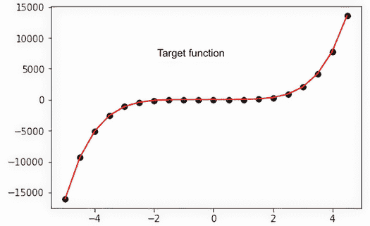

图 5.1 数据点和目标函数的解

接下来，向下滚动，查看如图 5.1 所示的超参数代码块。这里添加了两个新的超参数：`batch_size`和`data_step`。第一个超参数`batch-size`决定了每次前向传递我们向网络输入的输入数量。回想一下，在上一个练习中，这个值是`1`。另一个超参数`data_step`不是一个典型的超参数，但它允许我们控制为训练生成数据的数量。

列表 5.1 EDL_5_1_Hyperparameter_Tuning.ipynb：超参数

```
hp_test = "test 1" #@param {type:"string"}    ❶
learning_rate = 3.5e-03
epochs = 500
middle_layer = 25

batch_size = 2                                ❷

data_step = 1                                 ❸
```

❶ 形成设置测试名称的参数

❷ 单次前向传递中要输入的元素数量

❸ 控制数据生成中数据样本的频率

将测试名称`hp_test`更改为类似`test 2`的内容。然后修改`middle_layer`的值到`25`或更大。运行该单元格，然后使用“运行”>“运行后续单元格”运行笔记本中的剩余单元格。

图 5.2 显示了两个测试的预测输出，其中也显示了`test 2`的输出拟合得更好。注意训练模型的时间略有差异。这种差异来自更大的模型需要更多时间来训练。

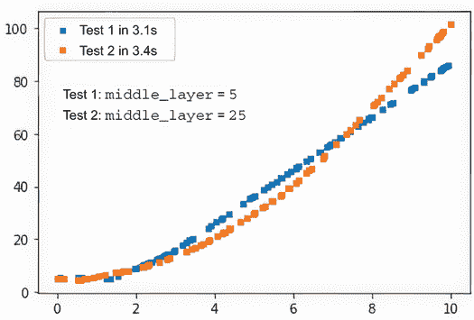

图 5.2 比较中间层超参数调整的差异

你现在可以返回并修改其他超参数——`batch_size`和`data_step`。但请注意，这些值是相互关联的，如果你通过将`data_step`减小到`.1`来大幅增加数据量，那么你同样需要增加`batch_size`。

图 5.3 显示了在增加数据量时改变和未改变批量大小时的结果。图 5.3 中显示的结果与完成 500 个 epoch 的训练时间相比非常显著。


图 5.3 比较改变数据大小，有和无批量大小变化的情况

继续更改测试名称，修改超参数，然后通过“运行”>“运行后续”来运行剩余的单元格。如果你发现图表变得过于混乱，你可以通过从菜单中运行“运行”>“运行所有”来重置图表结果。图 5.4 显示了将`learning_rate`从`3.5e-06`更改为`3.5e-01`的示例。你在调整超参数时的总体目标是创建一个最小的模型，该模型可以最快地训练并产生最佳结果。


图 5.4 改变学习率的影响

即使在我们只有五个超参数的简单例子中，你也可能感到难以确定从哪里开始，因此一个好的起点是遵循以下步骤：

1.  *设置网络大小*—在我们的例子中，这是修改`middle_layer`值。通常，你将想从调整网络大小和/或层数开始。但请注意，增加线性层数的重要性不如增加层中的网络节点数。

    超参数训练规则 #1：网络大小

    增加网络层数以从数据中提取更多特征。扩展或减小模型宽度（节点）以调整模型的拟合度。

1.  *理解数据变异性*—我们期望深度学习模型需要消耗大量数据。虽然深度学习模型确实可能从更多数据中受益，但成功更多地取决于源数据的变异性。在我们的例子中，我们能够通过使用`data_step`值来控制数据的变异性。然而，控制数据变异性的能力通常并不是一个选项。反过来，如果你的模型高度变异，因此需要更多数据，你可能会需要增加模型在层数和/或宽度上的大小。例如，手写数字图片，如 MNIST 数据集，比 Fashion-MNIST 数据集中描述的时尚图片具有更少的变异性。

    超参数训练规则 #2：数据变异性

    理解你的源数据的变异性。更多变性的数据需要更大的模型来提取更多特征或学习如何拟合更复杂的解决方案。

1.  *选择批量大小*—正如我们在例子中所看到的，调整模型的批量大小可以使其训练效率显著提高。然而，这个超参数并不是修复训练性能的万能药，增加它可能会对最终结果产生不利影响。相反，批量大小需要根据输入数据的变异性进行调整。更多变性的输入数据通常从较小的批量大小中受益，范围在 16-64 之间，而较少变性的数据可能从较大的批量大小中受益，范围在 64-256 之间——甚至更高。

    超参数训练规则 #3：批量大小

    如果输入数据高度变异，则减小批量大小。对于较少变异和更均匀的数据集，增加批量大小。

1.  *调整学习率*—学习率控制模型学习的速度，通常是新入门者首先滥用的超参数。与批量大小类似，学习率由模型的复杂度决定，这种复杂度是由输入数据的方差驱动的。更高的数据方差需要更小的学习率，而更均匀的数据可以支持更高的学习率。这在图 2.6 中得到了很好的体现，我们可以看到，由于数据非常均匀，模型从更高的学习率中受益。调整模型大小可能还需要降低学习率，因为模型复杂度增加。

    超参数训练规则 #4：学习率

    调整学习率以匹配输入数据的变异性。如果你需要增加模型的大小，通常，也需要降低学习率。

1.  *调整训练迭代次数*—如果你正在处理较小的问题，你通常会看到模型快速收敛到某个基本解决方案。从那时起，你可以简单地减少模型的 epoch 数（训练迭代次数）。然而，如果模型更复杂且训练时间更长，确定总的训练迭代次数可能会更成问题。幸运的是，大多数深度学习框架提供了早期停止机制，它会监视损失的一些任意值，当达到该值时，将自动停止训练。因此，一般来说，你通常会想选择你认为需要的最高训练迭代次数。另一个选项是让模型定期保存其权重。然后，如果需要，可以重新加载相同的模型并继续训练。

    超参数训练规则 #5：训练迭代次数

    总是使用你认为需要的最高训练迭代次数。使用早期停止和/或模型保存等技术来减少训练迭代次数。

使用这五条规则来指导你在训练超参数时，但请注意，提到的技术仅是一般性指南。可能会有网络配置、数据集和其他因素改变这些一般规则。在下一节中，我们将进一步探讨在构建鲁棒模型时可能需要决定的各种模型选项。

### 5.1.2 选择模型选项

除了超参数之外，调整模型的最大来源是你在内部决定使用的各种选项。深度学习模型提供了许多选项，有时由问题或网络架构决定，但通常，细微的变化会极大地改变模型拟合的方式。

模型选项的范围从激活和优化器函数到层数量和尺寸的增加。如前所述，层深度通常由模型需要提取和学习的特征数量决定。层的类型，无论是卷积还是循环网络，通常由需要学习的特点类型决定。例如，我们使用 CNN 层来学习特征簇，使用 RNN 来确定特征如何对齐或按什么顺序排列。

因此，大多数深度学习模型的网络大小和层类型是由数据的方差和需要学习的特点类型驱动的。对于图像分类问题，CNN 层用于提取视觉特征，如眼睛或嘴巴。另一方面，RNN 层用于处理语言或时间数据，其中需要理解一个特征如何与另一个特征在序列中相关联。

这意味着在大多数情况下，深度学习从业者需要关注的选项是激活、优化和损失的基础函数。激活函数通常由问题的类型和数据的形式决定。我们通常避免在调整的最后步骤之前更改激活函数。

最常见的是，优化器和损失函数的选择决定了模型是否能够良好地训练。以图 5.5 为例，它显示了选择三个不同的优化器来训练我们最后一个练习的结果，使用`middle_layer`超参数为 25。注意在图中，与 Adam 和 RMSprop 相比，随机梯度下降（SGD）和 Adagrad 的表现相当差。

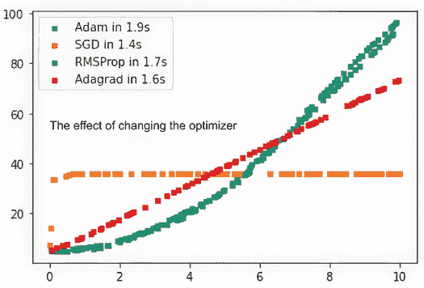

图 5.5 优化器函数的比较

同样，用于评估网络学习的损失函数的形式可以对模型训练产生重大影响。在我们的简单回归示例中，我们有两个选项：均方误差和平均绝对误差，或者 L1 损失。图 5.6 显示了在最后一个样本练习中使用的两个损失函数的比较。从图中可以看出，最后一个练习中更好的损失函数可能是 L1 损失，或 MAE。

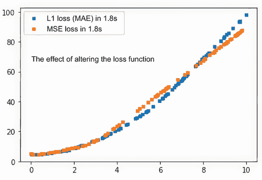

图 5.6 损失标准的比较

超参数训练规则 #6：更改模型

作为一般规则，每当模型架构或关键模型选项，如优化和/或损失函数发生变化时，您需要重新调整所有超参数。

到现在为止，希望您已经意识到，如果没有非常敏锐的视角和对细节的关注，很容易错过找到适合您问题的最佳模型。事实上，您可能会花费无数小时调整模型超参数，最终发现更好的损失或优化函数可能表现得更好。

超参数调整和模型选项选择容易出错，即使在经验丰富的深度学习者中也是如此。在第四章中，我们首先通过使用进化计算来训练模型超参数介绍了 EDL。

当涉及到构建工作的深度学习模型时，你通常会定义模型并选择你认为最适合你问题的选项。然后，你可能需要调整和微调各种超参数，从之前提到的策略开始。然而，不幸的是，这种情况经常发生，你可能会决定更改模型选项，如优化器或损失函数。这反过来又通常要求你根据更改的模型回过头来重新调整超参数。

## 5.2 使用随机搜索自动化 HPO

我们刚刚看了使用函数逼近问题进行深度学习手动 HPO。在这种情况下，我们提供了一套工具，让从业者可以连续运行笔记本，使用不同的超参数生成比较。正如你很可能从完成那个练习中发现的那样，手动 HPO 既耗时又相当无聊。

当然，现在有众多工具可以自动执行 HPO。这些工具从 Python 包到作为 AutoML 解决方案一部分集成到云技术中的完整系统都有。我们当然可以使用这些工具中的任何一个来对 EC 方法进行基线比较，但就我们的目的而言，我们希望更深入地理解自动化和搜索过程。

随机搜索 HPO，正如其名所示，是从给定范围内的已知超参数集中采样随机值并评估其有效性的过程。随机搜索的希望是最终找到最佳或期望的解决方案。这个过程可以比作某人蒙着眼睛投掷飞镖，希望击中靶心。蒙眼的人可能不会在几次投掷中击中靶心，但经过多次投掷，我们预计他们可能会。

### 5.2.1 将随机搜索应用于 HPO

Notebook EDL_5_2_RS_HPO.ipynb 是我们之前笔记本的升级版本，它使用简单的随机搜索算法自动化 HPO。在 Colab 中打开该笔记本，然后通过菜单中的“运行”>“运行所有”来运行所有单元格。作为比较，你可以自由打开 EDL_5_1_Hyperparameter_Tuning.ipynb 笔记本。

让我们首先探索我们希望我们的深度学习网络逼近的问题函数。代码的第一个单元格回顾了第四章中的多项式函数，如图 5.1 所示。以下列表包含生成训练网络的输入和目标数据点的样本集的代码。

列表 5.2 EDL_5_2_RS_HPO.ipynb：定义数据

```
def function(x):
  return (2*x + 3*x**2 + 4*x**3 + 5*x**4 + 6*x**5 + 10)               ❶

data_min = -5                                                         ❷
data_max = 5
data_step = .5
Xi = np.reshape(np.arange(data_min, data_max, data_step), (-1, 1))    ❸
yi = function(Xi)                                                     ❹
inputs = Xi.shape[1]                                                  ❺
yi = yi.reshape(-1, 1)
plt.plot(Xi, yi, 'o', color='black')
```

❶ 定义多项式目标函数

❷ 设置数据的界限和步长

❸ 生成并重塑输入数据

❹ 生成目标输出

❺ 找到网络的输入数量

接下来，我们回顾我们用作学习近似该函数的网络的基础模型/类，如下所示列表中定义。这是我们用来评估第二章中更简单示例的相同基础模型。

列表 5.3 EDL_5_2_RS_HPO.ipynb：定义模型

```
class Net(nn.Module):
  def __init__(self, inputs, middle):      ❶
    super().__init__()
    self.fc1 = nn.Linear(inputs,middle)    ❷
    self.fc2 = nn.Linear(middle,middle)    
    self.out = nn.Linear(middle,1)

  def forward(self, x):                    ❸
    x = F.relu(self.fc1(x))     
    x = F.relu(self.fc2(x))    
    x = self.out(x)
    return x
```

❶ 定义输入节点和中层的大小

❷ 设置第一个全连接层

❸ 定义前向函数

现在，对于自动化魔法。我们自动化 HPO 的过程包括使用一个新类来包含和管理搜索。对于随机搜索，此`Hyperparameters`类的版本如列表 5.4 所示。此`init`函数接收输入超参数并将它们转换为类属性，使用`update`。当我们使用此类时，我们首先设置基本属性作为输入，然后对于每个超参数属性，我们定义一个提供下一个值的生成器。在基础`Hyperparameters`对象上调用`next`函数生成一个新的生成对象，用于单次评估。如果这还不那么明显，请不要担心；我们正在使用一些高级功能，这些功能最好通过即将到来的代码来解释。

列表 5.4 EDL_5_2_RS_HPO.ipynb：超参数类

```
class Hyperparameters(object):
  def __init__(self, **kwargs):            ❶
    self.__dict__.update(kwargs)

  def __str__(self):                       ❷
    out = ""
    for d in self.__dict__:
      ds = self.__dict__[d]
      out += f"{d} = {ds}\n"
    return out

  def next(self):                          ❸
    dict = {}
    for d in self.__dict__:                ❹
      dict[d] = next(self.__dict__[d])
    return Hyperparameters(**dict)         ❺
```

❶ `init`函数将输入参数放入字典中

❷ 覆盖 str 函数以实现更友好的打印

❸ 获取超参数对象下一个实例的函数

❹ 遍历 args 字典，然后对参数调用 next 方法

❺ 返回超参数对象的新实例

`Hyperparameters`类内部使用 Python 生成器模式遍历所有属性以创建一个新实例。对于我们的随机搜索方法，我们使用一个名为`sampler`的函数生成器，如列表 5.5 所示。`sampler`函数旨在从由`min`和`max`设置的某个范围内连续采样给定函数。Python 支持两种形式的生成器——我们使用的一种使用`yield`关键字来中断循环并返回值。要执行生成器，您需要将函数包裹在`next`中，如前一个列表（列表 5.4）所示。

列表 5.5 EDL_5_2_RS_HPO.ipynb：采样生成器

```
def sampler(func, min, max):      ❶
  while True:                     ❷
    yield func(min,max)           ❸
```

❶ 输入是函数和范围，从 min 到 max。

❷ 使用无限循环设置的无限生成器

❸ 通过调用函数并指定 min，max 范围来产生

我们可以在最初设置基本或父`Hyperparameters`对象时将这些部分组合起来，如列表 5.6 所示。在父对象中，我们将每个输入定义为由各种函数和 min/max 范围定义的`sampler`生成器。注意我们使用的采样函数如何从`random.ranint`更改为`random.uniform`，其中两个函数都从均匀分布生成随机变量。调用 next 函数生成一个子超参数对象，可用于实验评估。

列表 5.6 EDL_5_2_RS_HPO.ipynb：创建超参数父对象

```
hp = Hyperparameters(
  epochs = sampler(random.randint,20,400),           ❶
  middle_layer = sampler(random.randint, 8, 64),  
  learning_rate = sampler(random.uniform,3.5e-01,
  ➥ 3.5e-03),                                       ❷
  batch_size = sampler(random.randint, 4, 64)  
)

print(hp.next())                                     ❸
```

❶ 将输入的 epochs 添加到生成器函数中

❷ 使用随机.input 基本函数添加额外输入

❸ 采样下一个对象然后打印

要了解这是如何工作的，请跳转到包含训练函数`train_function`的大块代码，如列表 5.7 所示。在这个函数内部，我们首先调用`hp.next()`来生成一个子对象。然后，我们可以通过在对象上使用名称作为属性来使用我们的训练算法中的值。由于我们每次调用`hp.next()`时都使用`sampler`函数与随机评估器一起使用，所以输出是一组随机的超参数。

列表 5.7 EDL_5_2_RS_HPO.ipynb：使用超参数子对象

```
def train_function(hp):
  hp = hp.next()                ❶

  ...
  for i in range(hp.epochs):    ❷
```

❶ 生成子超参数对象

❶ 通过调用属性来使用超参数

最后，我们可以查看如何将这些内容整合并自动化以执行 HPO，如列表 5.8 所示。由于我们已经将所有随机采样封装在 HP 类中，所以其余代码相当简单。由于这是一个最小化问题，我们希望调整超参数以最小化目标网络的损失，因此我们将起始最佳值设置为最大无穷大。然后，在由运行定义的循环中，我们使用父超参数对象调用`train_function`。在训练函数内部，`HP`生成一个新的随机超参数实例，并使用这些值来评估网络损失。我们通过在模型的所有点上进行完整预测来评估整体`fitness`。

列表 5.8 EDL_5_2_RS_HPO.ipynb：自动 HPO

```
runs = 10000
best = float("inf")                                         ❶
best_hp = None
run_history = []
for i in range(runs):
  span, history, model, hp_out = train_function(hp)         ❷
  y_ = model(torch.Tensor(Xi))   
  fitness = loss_fn(y_, torch.Tensor(yi)).data.item()        ❸
  run_history.append([fitness,*hp_out.__dict__.values()]) 
  if fitness < best:                                        ❹
    best = fitness
    best_hp = hp_out
```

❶ 设置最佳值的初始最大值

❷ 运行训练函数

❸ 在所有数据上评估 fitness

❹ 检查这是否是新的最佳值

图 5.7 展示了使用随机搜索执行自动 HPO 的输出。图表顶部显示的是整体最佳`fitness`，并列出了超参数。下面是三个图表，显示了网络训练的损失历史、模型对函数的近似程度，以及迄今为止所有评估的映射。评估图显示了最佳`fitness`的灰度输出，其中黑色六边形代表迄今为止评估的最佳整体`fitness`。图例底部，你可以看到运行 10,000 次后的结果，其中单个黑色点，难以看清，代表最小`fitness`。

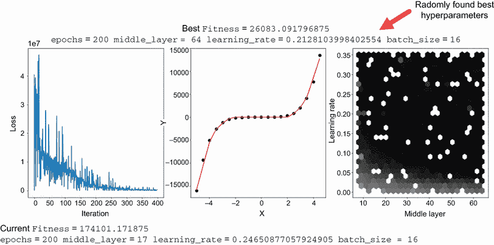

图 5.7 随机超参数搜索的运行结果

最后，我们回顾生成输出的代码，因为我们用它来完成本章的所有练习。此绘图输出首先绘制了最后一次运行的损失历史和函数近似，如下面的列表所示。最终图是所有运行历史的六边形图，通过学习率和中间层超参数绘制。随着自动 HPO 的运行，你会看到这个图随时间变化。

列表 5.9 EDL_5_2_RS_HPO.ipynb：绘制输出

```
clear_output()    

fig, (ax1, ax2, ax3) = plt.subplots(1, 3, 
➥ figsize=(18,6))                               ❶
fig.suptitle(f"Best Fitness {best} \n{hp_out}")
ax1.plot(history)                                ❷
ax1.set_xlabel("iteration") 
ax1.set_ylabel("loss")

ax2.plot(Xi, yi, 'o', color='black')             ❸
ax2.plot(Xi,y_.detach().numpy(), 'r') 
ax2.set_xlabel("X") 
ax2.set_ylabel("Y")

rh = np.array(run_history)                       ❹
hexbins = ax3.hexbin(rh[:, 2], rh[:, 3], C=rh[:, 0], 
                      bins=25, gridsize=25, cmap=cm.get_cmap('gray'))
ax3.set_xlabel("middle_layer")
ax3.set_ylabel("learning_rate")    

plt.show()
time.sleep(1)
```

❶ 设置包含三个水平子图的组合图

❷ 绘制损失训练历史

❸ 绘制函数近似

❹ 对所有运行历史进行六边形图绘制

图 5.8 中显示的结果生成花费了好几个小时，你可以清楚地看到最佳结果落在何处。在这种情况下，我们只为 HPO 使用了两个超参数，因此我们可以清楚地从两个维度可视化结果。当然，我们可以在超过两个变量上使用所有这些技术，但正如预期的那样，这可能会需要更多的运行和时间。在后续场景中，我们将介绍更高级的技术来可视化和跟踪多个超参数。

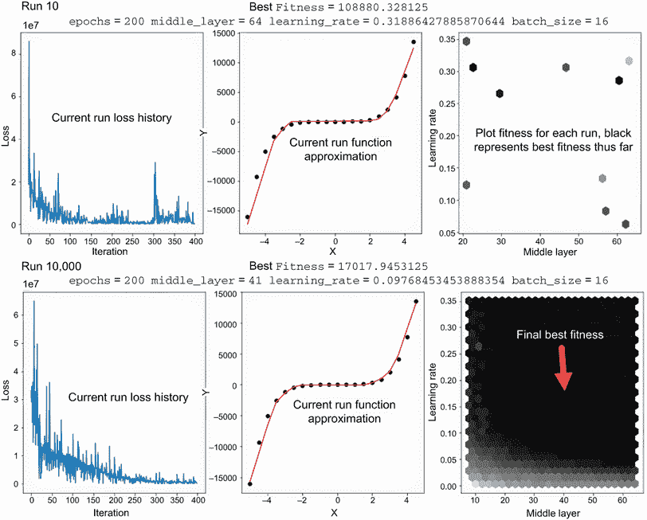

图 5.8 HPO 随机搜索的一个示例输出，从 10 到 10,000 次运行

随机搜索对于找到快速答案很好，但这个方法的问题在于，随机方法就是随机。我们无法知道我们是否接近解决方案，甚至一个可能的最佳解决方案可能是什么样子。有一些统计方法可以跟踪进度并促进更好的解决方案，但这些仍然需要数百——或者数千——次迭代。

在我们这里的简单示例中，我们只是在相对较小的范围内管理两个超参数。这意味着在相对较短的时间内，我们可能有一个相当好的猜测。然而，这个猜测并没有给我们提供关于它有多接近的洞察，除了它是在一定数量的随机采样中最好的。随机搜索对于快速近似效果很好，但正如将在后续章节中讨论的，有更好的方法。

## 5.3 网格搜索和 HPO

虽然随机搜索可以是一个快速做出更好猜测的有效方法，以找到准确的 HPO，但它过于耗时。生成图 5.7 的最终输出花费了超过 8 个小时，这很慢，但可以产生准确的结果。寻找快速且准确的自动 HPO 需要更高级的技术。

一种简单而有效的技术，适用于从考古挖掘到搜救队的一切，就是*网格搜索*。网格搜索通过以网格模式布置搜索区域或表面，然后系统地遍历网格中的每个单元格。网格搜索最好在二维中可视化，但这种技术在任何维度的问题上都是有效的。

图 5.9 显示了在超参数空间中随机搜索和网格搜索之间的比较。该图演示了通过网格的可能模式之一，并且在每个单元格中，它评估`learning_rate`和`middle_layer`变量。网格搜索是一种以系统化和有效的方式评估一系列可能组合的有效方法。

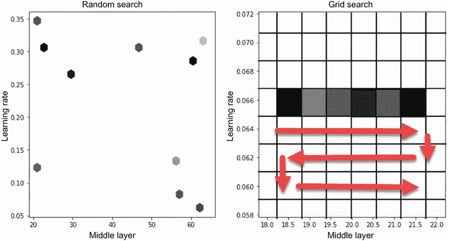

图 5.9 随机搜索和网格搜索的比较

### 5.3.1 使用网格搜索进行自动 HPO

在我们接下来的练习中，我们将我们早期的随机搜索尝试升级为使用更复杂的网格搜索技术。虽然这种技术更加稳健和高效，但它仍然受限于网格的大小。使用较大的网格单元通常会将结果限制在局部最小值或最大值。更细小和密集的单元可以定位全局最小值和最大值，但代价是增加了搜索空间。

下一个练习笔记本中的代码，EDL_5_3_GS_HPO.ipynb，是从我们早期的随机搜索示例派生出来的。因此，大部分代码是相同的，并且，像往常一样，我们只关注使这个样本独特的部分。在 Colab 中打开 EDL_5_3_GS_HPO.ipynb 并通过“运行”>“运行所有单元格”来运行所有单元格。

这个示例的代码与主要区别在于超参数对象现在需要跟踪一个参数网格。我们首先看看新的 `HyperparametersGrid` 类和 `init` 函数的构建。在这个函数中，如列表 5.10 所示，我们将输入参数的名称提取到 `self.hparms` 中，然后测试第一个输入是否指向一个生成器。如果是，那么我们使用 `self.create_grid` 生成一个参数网格；否则，该实例将只是一个子超参数容器。

列表 5.10 EDL_5_3_GS_HPO.ipynb：`HyperparametersGrid` 初始化函数

```
class HyperparametersGrid(object):
  def __init__(self, **kwargs):
    self.__dict__.update(kwargs)     
    self.hparms = [d for d in self.__dict__]        ❶
    self.grid = {}   
    self.gidx = 0
    if isinstance(self.__dict__[self.hparms[0]], 
    ➥ types.GeneratorType):                        ❷
      self.grid = self.create_grid()                ❸
      self.grid_size = len(self.grid)               ❹
```

❶ 提取所有输入参数名

❷ 仅在它是父节点时创建网格

❸ 创建参数网格

❹ 获取网格的大小

接下来，我们看看如何在 `self.create_grid` 函数中构建参数网格。该函数，如列表 5.11 所示，首先创建一个空的 `grid` 字典，然后遍历超参数列表。它调用超参数生成器，使用 `next` 返回，在这种情况下，一个值及其总数量。然后我们再次遍历生成器以提取每个唯一值并将其追加到 `row` 列表中。之后，我们将行追加到网格中，然后通过将 `grid` 注入到 `ParameterGrid` 类来完成。`ParameterGrid` 是 scikit-learn 中的一个辅助类，它接受一个输入字典和值列表作为输入，然后构建一个网格，其中每个单元格代表各种超参数组合。虽然我们在这个示例中只运行了两个超参数在二维网格上的示例，但 `ParameterGrid` 可以管理任意数量的维度。

列表 5.11 EDL_5_3_GS_HPO.ipynb：`create_grid` 函数

```
def create_grid(self):
  grid = {}
  for d in self.hparms:               ❶
    v,len = next(self.__dict__[d])    ❷
    row = []
    for i in range(len):              ❸
      v,_ = next(self.__dict__[d])
      row.append(v)                   ❹
    grid[d] = row
  grid = ParameterGrid(grid)          ❺
  return grid  
```

❶ 遍历所有超参数生成器

❷ 提取一个值及其总数量

❸ 遍历值的范围

❹ 将值追加到一行，然后将其添加到网格中

❺ 从字典网格创建一个 `ParameterGrid` 对象

在内部参数网格包含所有超参数组合后，我们现在可以看看更新的 `next` 函数是如何工作的，如列表 5.12 所示。在顶部，我们有一个 `reset` 函数，它用于重置参数网格的索引。每次调用 `next` 都会增加索引，从而从参数网格 (`self.grid`) 中提取下一个值。代码的最后一行使用 `**` 将网格值解包为 `HyperparametersGrid` 的新实例的输入。

列表 5.12 EDL_5_3_GS_HPO.ipynb：`HyperparametersGrid` 的 `next` 函数

```
def reset(self):                                        ❶
  self.gidx = 0

def next(self):
  self.gidx += 1                                        ❷
  if self.gidx > self.grid_size-1:                      ❸
    self.gidx = 0
  return HyperparametersGrid(**self.grid[self.gidx])    ❹
```

❶ 重置函数以重置网格索引

❷ 增加网格索引

❸ 检查索引的界限

❹ 返回下一个参数网格作为子超参数对象

使用新的网格超参数类也要求我们升级我们用来控制超参数创建的生成器。为了简化，我们定义了两个函数：一个用于浮点数，另一个用于整数。在每一个函数内部，我们从一个最小值到最大值以步长间隔创建一个名为 `grid` 的值数组。我们遍历这个值列表，生成一个新的值和总列表长度，如下所示列表。拥有总列表长度允许我们遍历生成器以创建参数网格，正如之前所见。

列表 5.13 EDL_5_3_GS_HPO.ipynb：生成器

```
def grid(min, max, step):                     ❶
  grid = cycle(np.arange(min, max, step))     ❷
  len = (max-min) / step
  for i in grid:
    yield i, int(len)                         ❸

def grid_int(min, max, step):                 ❹
  grid = cycle(range(min, max, step))         ❷
  len = (max-min) / step
  for i in grid:
    yield i, int(len)                         ❺
```

❶ 浮点函数接受最小/最大值和网格步长。

❷ 遍历值列表

❸ 生成网格单元格长度的值

❹ 整数函数接受最小/最大值和网格步长。

❺ 生成网格单元格长度的值

现在，我们可以看到如何使用这个新类和这些生成器函数来创建父 `hp` 对象，如列表 5.14 所示。设置变量与之前所见相同；然而，这次我们使用的是 `grid` 生成器函数。在类初始化后，内部创建了一个参数网格。我们可以查询有关网格的信息，例如获取组合的总数或值。然后我们也可以在父 `hp` 对象上调用 `next` 来生成几个子对象。我们可以通过将每个超参数的值相乘来计算网格组合的数量。在我们的例子中，`middle_layer` 有 9 个值，`learning_rate` 有 10 个值，`epochs` 有 1 个值，`batch_size` 也有 1 个值，总共是 90，即 10 x 9 x 1 x 1 = 90。网格大小可以迅速增大，尤其是在处理多个变量和较小的步长时。

列表 5.14 EDL_5_3_GS_HPO.ipynb：创建网格

```
hp = HyperparametersGrid(
  middle_layer = grid_int(8, 64, 6),
  learning_rate = grid(3.5e-02,3.5e-01, 3e-02),
  batch_size = grid_int(16, 20, 4),    
  epochs = grid_int(200,225,25)  
)

print(hp.grid_size)          ❶
print(hp.grid.param_grid)    ❷
print(hp.next())             ❸
print(hp.next())             ❸

#OUTPUT#
90
[{'middle_layer': [14, 20, 26, 32, 38, 44, 50, 56, 62], 'learning_rate': 
➥ [0.065, 0.095, 0.125, 0.155, 0.185, 0.215, 0.245, 0.275, 0.305..., 
➥ 0.3349...], 'batch_size': [16], 'epochs': [200]}]
middle_layer = 20 learning_rate = 0.065 epochs = 200 batch_size = 16 
middle_layer = 26 learning_rate = 0.065 epochs = 200 batch_size = 16  
```

❶ 打印网格组合的数量

❷ 打印参数网格输入

❸ 打印下一个子超参数对象

此示例使用 GPU 进行训练，但实现代码的更改很小，不会展示。相反，我们关注自动化设置中的细微变化。`Runs`现在由`hp.grid_size`定义，我们创建了一个新变量`grid_size`，它由运行次数定义，如下所示。第二个变量用于定义我们在`hexbins` `fitness`评估图上绘制的网格单元格的大小。

列表 5.15 EDL_5_3_GS_HPO.ipynb：创建网格

```
runs = hp.grid_size                     ❶
grid_size = int(math.sqrt(runs))-1      ❷
hp.reset()                              ❸
```

❶ 现在的`runs`等于`grid_size`

❷ 根据总运行次数定义`plot_grid_size`

❸ 在开始之前重置父`hp`对象

图 5.10 显示了运行此练习直到完成的结果——全部 90 次运行大约需要 10 分钟。这比随机搜索示例的结果快得多，但准确性不高。注意图 5.3 中的最终`fitness`（约 17,000）是图 5.5 中显示的`fitness`（约 55,000）的三分之一。因此，我们的网格搜索结果并不那么准确，但它确实更快、更高效。我们总是可以回过头来缩小搜索范围，并减小步长以提高准确性。

我们最后要考虑的是修改输出评估图，根据我们之前计算出的变量设置`grid_size`。我们使用六边形图自动通过颜色映射`fitness`值。然后，我们根据组合数量设置`grid_size`。在以下列表中显示的简单示例中，我们假设参数是正方形网格，但这可能并不总是准确。

列表 5.16 EDL_5_3_GS_HPO.ipynb：设置`grid_size`

```
hexbins = ax3.hexbin(rh[:, 1], rh[:, 2], C=rh[:, 0],    ❶
                        bins=25,                        ❷
                        gridsize=grid_size,             ❸
                        cmap=cm.get_cmap('gray'))       ❹
```

❶ 绘制带有超参数数据的六边形图

❷ 保持单元格数量不变

❸ 设置每个单元格的大小

❹ 设置要使用的颜色图

网格搜索是一种在希望系统地查看各种超参数组合时非常出色的技术。然而，再次特别关注图 5.10 中的输出，并注意最佳`fitness`（深色区域）位于最差`fitness`（浅色区域）的两个单元格之内。然而，我们可以看到许多具有良好`fitness`的区域围绕这个浅色单元格，这表明我们可能遗漏了全局最小值和/或最大值。解决这个问题的方法是回到并缩小网格，仅覆盖这个两到三个单元格的区域——这需要我们手动干预以更好地隔离最佳超参数。

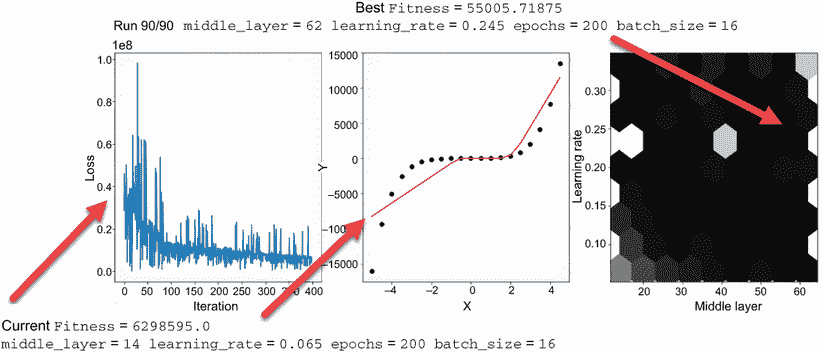

图 5.10 网格搜索的最终输出

既然我们现在使用 EC 方法解决各种问题已有一些经验，那么接下来我们采取的步骤就是使用它们进行 HPO。在本章的其余部分，我们将探讨使用 EC 在执行 HPO 时提供更好的搜索机制。

## 5.4 用于 HPO 的进化计算

现在我们已经对 HPO 问题有了良好的背景了解，我们可以开始使用一些 EC 方法来提高速度和准确性。正如我们在前面的章节中看到的，进化方法提供了一套优秀的工具集，可以用于优化各种问题的搜索。因此，评估使用 EC 进行 HPO 的实际应用是很有意义的。

### 5.4.1 粒子群优化用于 HPO

我们通过使用 PSO 进行 HPO，将 EC 引入到 DL 中。PSO，如第四章所述，使用一群`particles`来寻找最优解。PSO 不仅足够简单，可以用 DEAP 实现，而且展示了 EC 在解决像 HPO 这样的问题上的强大能力。

### 5.4.2 将 EC 和 DEAP 添加到自动 HPO

在下一个练习中，我们关注两个关键方面：将 EC/DEAP 添加到执行自动 HPO，以及将 EC 方法（如 PSO）应用于问题。我们再次使用相同的基本问题来比较不同方法的结果。这不仅使理解代码变得更容易，而且在比较其他方法时也提供了一个良好的基线。

在 Colab 中打开 EDL_5_4_PSO_HPO_PCA.ipynb 笔记本，并通过“运行”>“运行所有单元格”来运行所有单元格。滚动到包含`HyperparametersEC`类定义的单元格，如下所示。再次，将 EC 与 DL 结合的重任大部分发生在`HyperparametersEC`类中。这次，我们创建了一个名为`HyperparametersEC`的专用版本。我们首先关注的是基本函数。

列表 5.17 EDL_5_4_PSO_HPO.ipynb：`HyperparametersEC`基本函数

```
class HyperparametersEC(object):
  def __init__(self, **kwargs):      ❶
    self.__dict__.update(kwargs) 
    self.hparms = [d for d in self.__dict__]  

  def __str__(self):                 ❷
    out = ""
    for d in self.hparms:
      ds = self.__dict__[d]
      out += f"{d} = {ds} "
    return out   

  def values(self):                  ❸
    vals = []
    for d in self.hparms:
      vals.append(self.__dict__[d])
    return vals

  def size(self):                    ❹
    return len(self.hparms)
```

❶ 使用输入参数初始化类

❷ 重写字符串函数

❸ 提供当前值

❹ 返回超参数的大小

在基本函数之后，查看用于调用父`HyperparametersEC`对象的特殊`next`函数。这是一段复杂的代码，直到我们查看新的生成器方法之前，它可能不会完全有意义。注意这个函数（如列表 5.18 所示），它接受一个`individual`或值的向量作为输入。在这个例子中，`individual`代表一个`particle`，但它也可以代表我们使用向量描述的任何形式的`individual`。另一个需要关注的细节是生成器上`send`函数的使用。`send`类似于 Python 中的`next`函数，但它允许生成器初始化或输入值。

列表 5.18 EDL_5_4_PSO_HPO.ipynb：`HyperparametersEC` `next`函数

```
def next(self, individual):
  dict = {}    
  for i, d in enumerate(self.hparms):                  ❶
    next(self.__dict__[d])                             ❷
  for i, d in enumerate(self.hparms):      
    dict[d] = self.__dict__[d].send(individual[i])     ❸
  return HyperparametersEC(**dict)                     ❹
```

❶ 列出超参数

❷ 为每个超参数初始化生成器

❸ 将索引值发送到生成器并产生值

❹ 返回子对象

由于`send`函数允许将值传递到生成器中，我们现在可以重写生成器函数以适应。我们感兴趣的函数是`linespace`和`linespace_int`生成器，如列表 5.19 所示。这些生成器允许使用`i = yield`传递输入，其中`yield`成为使用`send`函数输入的值。值`i`然后成为`-1.0`和`1.0`之间的线性插值空间的索引，通过应用`clamp`函数。如您所回忆的，`send`函数发送了从`individual`中的索引值。因此，`individual`中的每个向量元素都成为由设置父`hp`时使用的最小/最大值定义的超参数线性空间中的索引。

列表 5.19 EDL_5_4_PSO_HPO.ipynb：生成器函数

```
def clamp(num, min_value, max_value):        ❶
   return max(min(num, max_value), min_value)

def linespace(min,max):
  rnge = max - min
  while True:
    i = yield                                ❷
    i = (clamp(i, -1.0, 1.0) + 1.0) / 2.0    ❸
    yield i * rnge + min

def static(val):                             ❹
  while True:
    yield val
```

❶ 将值夹在最小/最大范围内

❷ 将 i 设置为输入值 yield

❸ 线性插值值

❹ 返回一个静态值

现在，我们可以查看以下单元格中如何实现这一功能，其中我们实例化类并创建一个子对象。再次强调，创建父超参数对象是通过传递我们想要跟踪的每个超参数的生成器来完成的。之后，使用范围在`-1.0`到`1.0`之间的值列表定义了一个简单的`individual`，其中每个值代表由设置最小/最大值到生成器定义的线性空间中的索引。这次，当我们对超参数父对象调用`next`时，我们得到一个由输入`individual`的索引值定义的子对象，如下所示。

列表 5.20 EDL_5_4_PSO_HPO.ipynb：创建父超参数对象

```
hp = HyperparametersEC(    
  middle_layer = linespace_int(8, 64),         ❶
  learning_rate = linespace(3.5e-02,3.5e-01),
  batch_size = static(16),                     ❷
  epochs = static(200)  
)

ind = [-.5, -.3, -.1, .8]                      ❸
print(hp.next(ind))                            ❹
## OUTPUT ##
middle_layer = 22 learning_rate = 0.14525 batch_size = 16 epochs = 200
```

❶ 使用最小/最大值定义的线空间生成器

❷ 配置了静态生成器

❸ 创建一个大小为 4 的向量来表示个体

❹ 调用 next 创建一个新的超参数子对象

PSO 设置和操作代码的大部分是从第四章中介绍的 EDL_4_PSO.ipynb 笔记本借用的。我们在这里的重点是`toolbox`和`evaluate`函数的配置。在这段代码中，我们根据`hp.size`或我们想要跟踪的超参数数量设置`particle`的大小。接下来，我们减小`pmax`/`pmin`和`smin`/`smax`的值以适应更小的搜索空间。务必根据您自己的情况修改这些值以查看这对 HPO 的影响。在以下列表中的代码末尾，我们可以看到`evaluate`函数的注册，其中评估了每个`particle`的`fitness`。

列表 5.21 EDL_5_4_PSO_HPO.ipynb：创建父超参数对象

```
toolbox = base.Toolbox()
toolbox.register("particle", 
                 generate, size=hp.size(),                   ❶
                 pmin=-.25, pmax=.25, smin=-.25, smax=.25)   ❷
toolbox.register("population", 
                 tools.initRepeat, list, toolbox.particle)
toolbox.register("update", 
                 updateParticle, phi1=2, phi2=2)
toolbox.register("evaluate", evaluate)                       ❸
```

❶ 粒子的大小，由超参数数量定义

❷ 配置粒子搜索空间

❸ 注册评估函数

现在的`evaluate`函数需要通过传递子超参数对象来调用`train_function`。注意这与我们之前调用网络训练函数的方式略有不同。这次，我们通过在父对象上调用`next`并传递`individual`来生成子超参数对象。然后，将子超参数输入到`train_function`中以生成输出。为了获得完整的评估，我们检查整个数据集上的模型损失，然后将此作为`fitness`返回，如以下列表所示。

列表 5.22 EDL_5_4_PSO_HPO.ipynb：创建父超参数对象

```
def evaluate(individual):
  hp_in = hp.next(individual)                                        ❶
  span, history, model, hp_out = train_function(hp_in)               ❷
  y_ = model(torch.Tensor(Xi).type(Tensor))                          ❸
  fitness = loss_fn(y_, torch.Tensor(yi).type(Tensor)).data.item()   ❸
  return fitness,                                                    ❹
```

❶ 通过传递个体生成子超参数

❷ 通过传递子超参数调用训练

❸ 预测完整模型损失

❹ 返回`fitness`

我们现在可以继续到最后一个代码块，如图 5.23 所示，并检查粒子群集是如何与我们的更改一起工作的。更改已被加粗，并添加以更好地跟踪`particle` `fitness`和相关的超参数。在调用`evaluate`函数对部分`particle`进行评估后，我们调用`hp.next(part)`来创建一个子副本。这不是 PSO 功能所必需的，但它有助于我们跟踪`particle`历史。

列表 5.23 EDL_5_4_PSO_HPO.ipynb：创建父超参数对象

```
for i in range(ITS):          
  for part in pop:       
    part.fitness.values = toolbox.evaluate(part)  
    hp_eval = hp.next(part)                            ❶
    run_history.append([part.fitness.values[0], 
    ➥ *hp_eval.values()])                             ❷
    if part.best is None or part.best.fitness < part.fitness:
      part.best = creator.Particle(part)
      part.best.fitness.values = part.fitness.values
    if best is None or best.fitness > part.fitness:
      best = creator.Particle(part)                    ❸
      best.fitness.values = part.fitness.values
      best_hp = hp.next(best)
  for part in pop:
    toolbox.update(part, best)
```

❶ 捕获超参数子对象

❷ 将值追加到运行历史记录中

❸ 捕获最佳`fitness`和超参数对象

图 5.6 是应用 PSO 进行 10 次迭代群集优化后的最终输出截图。你可以在最左边的图中清楚地看到，`fitness`评估图显示了`particles`如何围绕一个预测的最佳解收敛。注意，最终的最佳`fitness`值，大约为 34,000，比我们的网格搜索实现的结果要好。更重要的是，PSO 能够在网格搜索的一小部分时间内完成这一点。

与我们之前的随机和网格搜索示例相比，图 5.11 的结果看起来相当令人印象深刻。然而，PSO 并非没有自己的问题，尽管它似乎在性能上优于网格搜索，但它并不总是如此。此外，PSO 的参数由`smin`/`smax`和`pmin`/`pmax`紧密定义，正确调整这些值通常需要仔细思考或试错。

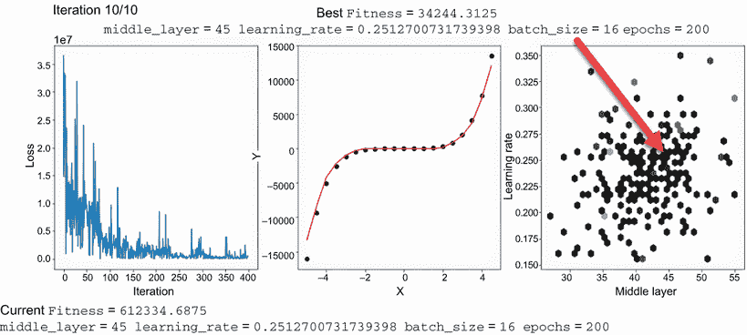

图 5.11 使用 PSO 进行 HPO 的输出

查看图 5.10 的第三个子图，我们可以看到 PSO 如何收敛到一个区域，然后在该区域上群集`particles`以找到更好的最优解。这种方法的问题在于，群集往往会在寻找群集区域内的全局最小/最大值时陷入局部最小/最大值。如果该区域内没有这样的全局值，那么群集就会陷入局部最小/最大值。

考虑到 PSO 的这种潜在困境，我们可以考虑其他可以更好地执行 HPO 并避免或最小化这种问题的 EC 方法。正如我们在第四章中看到的，有一些高级 EC 方法可能有助于我们克服这些担忧。

## 5.5 针对 HPO 的遗传算法和进化策略

我们在第三章花了一些时间来理解遗传算法（GA）的工作原理，然后在第四章中当我们采用进化策略（ES）时，对这些概念进行了扩展。如果你还记得，ES 是一种特殊的 GA，它应用策略来改进遗传操作，如突变。我们继续使用相同的突变策略与 GA 和 ES 进行自动 HPO。

### 5.5.1 将进化策略应用于 HPO

在第四章中，我们探讨了如何将进化策略作为一个额外的向量来控制突变的速度和应用。通过这种方式控制突变，我们可以更好地集中整个`population`以更快地到达解决方案。在我们的下一个项目中，我们将采用 ES 和一种执行自动 HPO 的方法。

在 Colab 中打开 EDL_5_5_ES_HPO.ipynb 笔记本，并通过“运行”>“运行所有单元格”来运行所有单元格。这个笔记本基于 EDL_4_4_ES.ipynb，并从该示例中借用了很多代码。我们还从上一个练习中借用了一些内容来构建这个示例，这意味着这段代码可能看起来很熟悉。

我们通过回顾 ES 超参数来关注第一个差异。第一个修改是将`IND_SIZE`变量设置为超参数的数量。然后，我们将`MAX_STRATEGY`更改为 5，以适应更大的搜索空间，如下列表所示。

列表 5.24 EDL_5_5_ES_HPO.ipynb：设置 ES 超参数

```
IND_SIZE = hp.size()   ❶
NGEN = 10
MIN_VALUE = -1
MAX_VALUE = 1
MIN_STRATEGY = 0.5
MAX_STRATEGY = 5       ❷

CXPB = .6
MUTPB = .3
```

❶ 将个体大小设置为超参数的数量

❷ 增加最大策略以适应更宽的搜索空间

接下来，我们跳转到设置`toolbox`的代码块，如列表 5.25 所示。我们在这里做的唯一关键更改是修改了几个超参数，即`mate`操作符中使用的 alpha 和突变的概率。回想一下，alpha 表示父母之间混合的大小，而不是直接的`crossover`。

列表 5.25 EDL_5_5_ES_HPO.ipynb：创建`toolbox`

```
toolbox = base.Toolbox()
toolbox.register("individual", generateES, creator.Individual, creator.Strategy,
    IND_SIZE, MIN_VALUE, MAX_VALUE, MIN_STRATEGY, MAX_STRATEGY) 
toolbox.register("population", tools.initRepeat, list, toolbox.individual)
toolbox.register("mate", tools.cxESBlend, alpha=0.25)            ❶
toolbox.register("mutate", tools.mutESLogNormal, 
➥ c=1.0, indpb=0.06)                                            ❷
toolbox.register("select", tools.selTournament, tournsize=3)

toolbox.decorate("mate", checkStrategy(MIN_STRATEGY))
toolbox.decorate("mutate", checkStrategy(MIN_STRATEGY))
```

❶ 增加 alpha 掩码的大小

❷ 增加突变发生的概率

最后，我们可以查看以下列表中的进化代码，以了解如何使`population`进化到解决方案。

列表 5.26 EDL_5_5_ES_HPO.ipynb：创建`toolbox`

```
for g in range(NGEN):
  pop, logbook = algorithms.eaMuCommaLambda(pop, toolbox, mu=MU, lambda_=LAMBDA,
            cxpb=CXPB, mutpb=MUTPB, ngen=1, 
            stats=stats, halloffame=hof, verbose=False)   ❶
  best = hof[0]

  span, history, model, hp_out = train_function
  ➥ (hp.next(best))                                      ❷
  y_ = model(torch.Tensor(Xi).type(Tensor))               ❸
  fitness = loss_fn(y_, torch.Tensor(yi).type(Tensor)).data.item()     
  run_history.append([fitness,*hp_out.values()])          ❹
  best_hp = hp_out
```

❶ 使用算法函数进行单次迭代进化

❷ 再次使用进化中的最佳结果进行训练

❸ 从模型预测输出

❹ 将适应度和超参数子项添加到结果中

图 5.12 显示了运行 ES 进行 HPO 的最终输出。注意最后一个图表，即`fitness`评估，显示了更紧密的集中。这种集中比 PSO 更紧密，ES 也遇到了一些相同的问题。

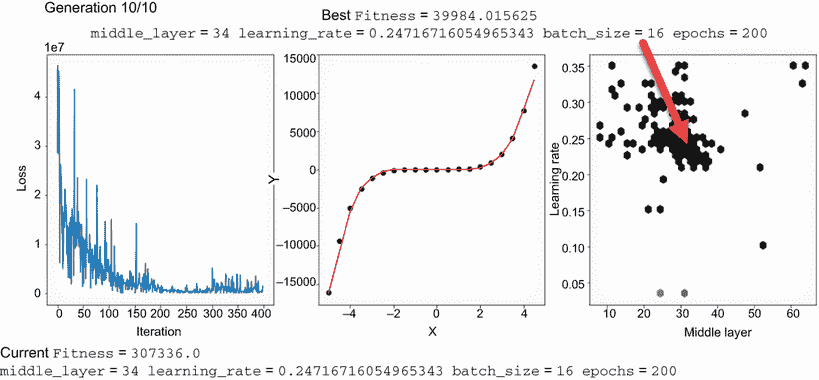

图 5.12 ES 在 HPO 上的示例输出

在 PSO 中，我们看到了一群 `粒子` 卡在局部最小值或最大值上的问题。虽然这似乎与 ES 中的问题相似，但重要的是要注意，收敛速度更快，更集中。增加更大的 `种群` 可以减少或帮助 ES 更频繁地识别全局最小值。

### 5.5.2 使用主成分分析扩展维度

到目前为止，我们一直在测试仅跨越两个超参数（学习率和批量大小）的各种方法，以使在二维中可视化结果更容易。如果我们想在更高维中可视化更多超参数，我们需要将维度减少到二维或三维以进行可视化。幸运的是，有一个简单的技术我们可以应用，以在二维中可视化高维输出，称为 *主成分分析* (PCA)。

PCA 是将多维向量数据从高维降低到低维的过程。在我们的例子中，我们将四维输出降低到二维以进行可视化。你可以将这个过程视为从高维到低维的投影。我们将在下一个练习中展示它是如何工作的以及如何应用于可视化 HPO。

在 Colab 中打开 Open notebook EDL_5_5_ES_HPO_PCA.ipynb，然后通过运行 > 运行所有单元格来运行所有单元格。EDL_5_5_ES_HPO.ipynb 的变体添加了 PCA，因此我们可以自动化额外的超参数，并且仍然可以在二维中可视化结果。

大部分代码都是相同的，但我们专注于一个单元格，该单元格演示了设置 PCA 并在二维中绘制一些多维输出。scikit-learn 提供了一个 PCA 类，可以轻松地将数据从高维转换到更简单的组件输出。在下面的代码列表中，我们将示例 `个体` 对象从四维降低到两个组件。

列表 5.27 EDL_5_5_ES_HPO_PCA.ipynb：添加 PCA

```
pop = np.array([[-.5, .75, -.1, .8], 
                [-.5, -.3, -.5, .8],
                [-.5, 1, -.5, -.8],
                [ 1, -.3, -.5, .8]])      ❶
pca = PCA(n_components=2)                 ❷
reduced = pca.fit_transform(pop)          ❸

t = reduced.transpose()                   ❹

plt.scatter(t[0], t[1])                   ❺
plt.show()
```

❶ 创建一个样本个体种群

❷ 创建一个具有两个维度的 PCA 对象

❸ 拟合数据

❹ 将结果转置到新的向量中

❺ 在二维中绘制输出

图 5.13 显示了列表 5.27 的示例输出以及 PCA 在虚构的 `种群` 数据中的应用。重要的是要理解每个轴都是一个组件，它代表向量空间中元素之间的距离。PCA 输出是通过测量元素之间的方差或差异来计算的，生成组件或轴，每个元素都落在这个轴上。重要的是要理解 PCA 图是相对于正在可视化的数据而言的。如果你需要或想要了解更多关于 PCA 算法的知识，请务必查看 sklearn 文档或其他在线资源。

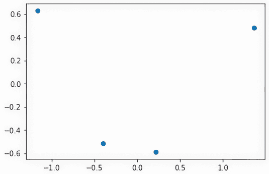

图 5.13 组件空间中四个维度点的 PCA 图

由于我们能够可视化超过两个维度的数据点，我们还可以将我们的`hyperparameter`对象扩展到变化额外的输入。我们现在将`batch size`和`epochs`添加为要变化的超参数，如列表 5.28 所示。暂时考虑将这两个额外超参数添加到网格搜索问题中。如果我们假设每个超参数的范围跨越 10 个单元格或步骤，那么有 4 个输入，我们的搜索空间将等于 10 x 10 x 10 x 10 = 10,000，或 10,000 个单元格。回想一下，我们的随机搜索例子是为 10,000 次运行设置的，并且花费了超过 12 小时来完成。这同样是执行相同四维空间网格搜索所需的时间。

列表 5.28 EDL_5_5_ES_HPO_PCA.ipynb：添加超参数

```
hp = HyperparametersEC(
  middle_layer = linespace_int(8, 64),
  learning_rate = linespace(3.5e-02,3.5e-01),
  batch_size = linespace_int(4,20),    ❶
  epochs = linespace_int(50,400)       ❷
)

ind = [-.5, .75, -.1, .8]
print(hp.next(ind))
```

❶ 改变批量大小

❷ 改变 epoch 的数量

我们需要做的唯一其他代码更改是修改评估函数输出图，如列表 5.29 所示。我们可以借鉴列表 5.27 中的代码来应用相同的过程，将运行历史中的超参数输出减少到两个组件。然后，我们使用`hexbins`函数将这些组件的转置绘制到二维空间中。

列表 5.29 EDL_5_5_ES_HPO_PCA.ipynb：绘制`fitness`评估的代码

```
rh = np.array(run_history) 
  M = rh[:,1:IND_SIZE+1]                           ❶
  reduced = pca.fit_transform(M)
  t = reduced.transpose() 
  hexbins = ax3.hexbin(t[0], t[1], C=rh[ :, 0],    ❷
                        bins=50, gridsize=50, cmap=cm.get_cmap('gray'))
```

❶ 从运行历史中提取超参数

❷ 输出 PCA 成分

图 5.14 显示了将 ES 应用于 HPO 的输出，其中第三个图现在由 PCA 成分组成。这个图使我们能够可视化跨多个维度的最优超参数的搜索。我们仍然可以看到一些最佳解决方案的聚类，但很明显，其他点现在分布得更广。同时，请注意`fitness`与我们的早期例子相比有了多大的提高，这可以归因于额外超参数的变化。

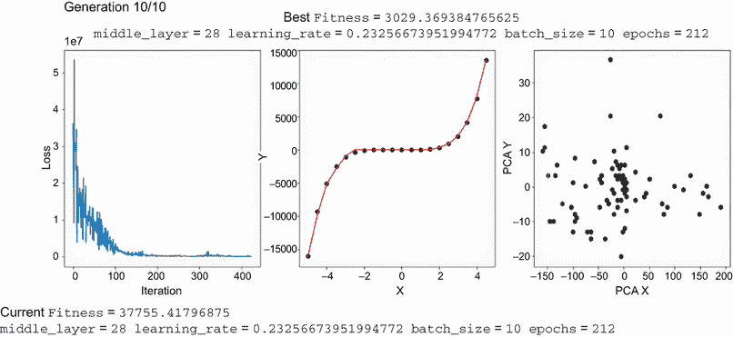

图 5.14 带 PCA 的 ES HPO 输出

我们之前仅改变两个超参数时的例子之间的差异相对较小。通过向搜索空间添加额外的超参数，从而增加维度，我们可以看到 ES 与网格搜索或随机搜索之间的性能明显提高。然而，请记住，ES 仍然容易陷入局部最小值，这表明我们需要考虑替代方法。

## 5.6 用于 HPO 的差分进化

在第四章末尾，当我们使用这种方法在 ES 上解决不连续解时，我们看到了 DE（差分进化）的力量。鉴于 DE 用于进化解决方案的独特方法，它自然成为自动化 HPO 的良好候选者。DE 也可能克服我们在 PSO 和 ES 中观察到的粘滞条件。

### 5.6.1 用于演化的 HPO 的微分搜索

差分进化使用一个简单的迭代算法，从种群中随机选择三个个体。然后，它计算两个个体之间的差异，并将一个缩放值加到第三个个体上。结果产生第四个点：下一个搜索目标区域。

图 5.15 展示了差分进化算法在二维空间中的单个评估。在图中，三个点（A、B、C）是从种群中随机抽取的。计算从 A 到 B 的差异向量（A – B），然后通过缩放函数 F 传递。在大多数情况下，我们通过乘以 1.0 的缩放值来保持简单。然后，我们将缩放后的差异向量加到第三个点上，以创建一个新的目标搜索点。

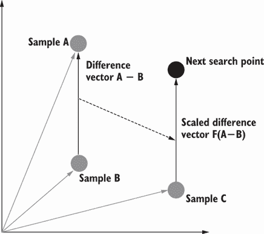

图 5.15 差分进化搜索

差分进化使用的搜索机制足够灵活，可以摆脱我们之前在 PSO 和 ES 中看到的群或聚类问题。当然，我们希望看到 DE 的实际应用来确认这是我们进行超参数优化（HPO）的更好方法。在下一个练习中，我们继续使用 DE 在优化四个超参数的同一问题上进行求解。

在 Colab 中打开 EDL_5_ES_HPO_PCA.ipynb 笔记本，然后通过运行 > 运行所有单元格来运行所有单元格。如果您愿意，您还可以通过探索 EDL_5_ES_HPO.ipynb 来查看仅运行在两个维度上的此笔记本的非 PCA 版本。我们之前已经看到了这个练习中的所有代码，所以我们只需回顾使其独特的部分，从以下列表中的超参数开始。

列表 5.30 EDL_5_6_DE_HPO_PCA.ipynb：设置`creator`和`toolbox`

```
NDIM = hp.size()    ❶
CR = 0.25           ❷
F_ = 1              ❸
MU = 50             ❹
NGEN = 10  
```

❶ 超参数维度的数量

❷ 交叉率

❸ 缩放因子/函数

❹ 总种群

接下来，我们再次回顾设置`creator`和`toolbox`的 DEAP 代码——我们之前已经覆盖了这段代码中的所有内容。注意在`individual`注册中使用`NDIM`值来设置以下列表中的大小。在最后一行，我们可以选择将注册设置为输出三个元素的随机`选择`操作符，`k=3`。

列表 5.31 EDL_5_6_DE_HPO_PCA.ipynb：设置`creator`和`toolbox`

```
creator.create("FitnessMin", base.Fitness, weights=(-1.0,))
creator.create("Individual", 
               array.array, typecode='d', fitness=creator.FitnessMin)

toolbox = base.Toolbox()
toolbox.register("attr_float", random.uniform, -1, 1)
toolbox.register("individual", tools.initRepeat, 
                creator.Individual, toolbox.attr_float, NDIM)              ❶
toolbox.register("population", tools.initRepeat, list, toolbox.individual)
toolbox.register("select", tools.selRandom, k=3)                           ❷
```

❶ 创建一个具有与超参数维度相等大小的个体

❷ 注册一个大小为 3 的随机选择函数

另外一个值得关注的代码是在进化部分。这是我们在第四章中已经审查过的代码，但值得再次审查。在差分进化中，我们称`individual`对象为代理，因为它们像`粒子`一样有很长的生命周期，但像代理一样进化。注意高亮显示的行，其中计算并应用了缩放差异向量到向量`y`的单个分量上。这个计算保证对于每个随机抽取的与当前向量分量匹配的索引只会发生一次。然而，`交叉率`确实提供了改变其他分量值以创建新的`y`的机会，如下面的列表所示。

列表 5.32 EDL_5_6_DE_HPO_PCA.ipynb：进化差分进化

```
for g in range(1, NGEN):
  for k, agent in enumerate(pop):              ❶
    a,b,c = toolbox.select(pop)                ❷
    y = toolbox.clone(agent)
    index = random.randrange(NDIM)             ❸
    for i, value in enumerate(agent):
      if i == index or random.random() < CR:   ❹
        y[i] = a[i] + F_*(b[i]-c[i])           ❺
    y.fitness.values = toolbox.evaluate(y)
    if y.fitness > agent.fitness:
      pop[k] = y            
  hof.update(pop)    
```

❶ 遍历种群

❷ 选择三个代理

❸ 找到一个随机索引

❹ 检查是否存在交叉

❺ 应用缩放向量函数

图 5.16 显示了使用 DE 解决目标问题的 HPO 的最终输出，使用了 10 代。具体来说，注意第三个评估图，以及点并没有聚集在一起。此外，注意从这个方法生成的最佳“适应度”大约为 81，这个数字明显超过了我们之前的所有其他尝试。

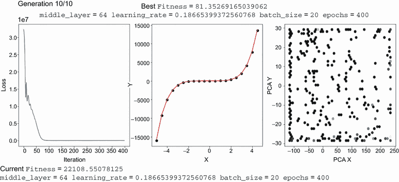

图 5.16 DE 用于 HPO 的一个示例输出

如我们所见，将 DE 应用于 HPO 似乎提供了一个避免 PSO 和 ES 中观察到的局部最小值粘滞问题的优秀机制。我们可以通过将 PSO 示例升级为使用 PCA 来比较三种技术，如 EDL_5_4_PSO_HPO_PCA.ipynb 笔记本中所示。请随意运行该笔记本，以观察 PSO、ES 和 DE 之间的差异。

图 5.17 显示了 PSO、ES 和 DE 的评估图比较。注意 PSO 产生了一个广泛的“粒子”群，大致集中在它期望的最佳解附近。同样，ES 产生了一个更紧密的尝试集群，但分布更像是输出上的一个窄带。我们可以清楚地看到，DE 图表明该算法非常适合探索边界，并避免陷入局部最小值。

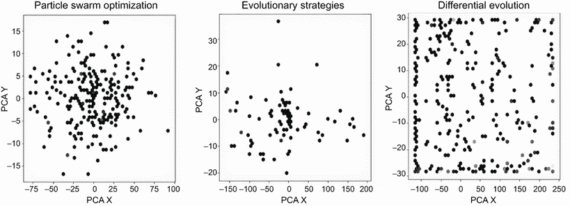

图 5.17 HPO 的 EC 方法比较

这是我们第一次通过将 EC 与 DL 集成来应用 EDL 原则的章节。我们一开始探索了基本的随机搜索，然后提升到网格搜索，为其他方法设定基准。从那里，我们扩展到应用 PSO、ES，最终是 DE。

通过本章对技术的探索，现在应该很明显，EC 方法在 DL 中有明确的应用。正如我们在本书的其余部分所探讨的，这些以及其他技术可以应用于 DL 的改进。然而，现在，让我们通过总结我们所学的内容来结束本章。

## 摘要

+   这是第一个我们将 EC 方法与 DL 结合的章节，也是我们第一次接触 EDL。在这个过程中，我们学习了几个新技巧，我们可以将其应用于 PyTorch，以及其他框架。

+   DL 超参数搜索（超参数优化 HPO）要正确执行需要广泛的知识和经验：

    +   使用基本规则和模板，可以开发出用于各种问题进行手动超参数搜索的策略。

    +   使用 Python 快速演示编写基本的超参数搜索工具。

+   随机超参数搜索是一种使用随机抽样在图表上生成结果的搜索方法。通过观察这些随机观察结果，调优器可以将搜索范围缩小到特定感兴趣的区域。

+   网格搜索是一种将超参数映射到离散值网格的方法，然后按顺序评估这些值。可视化结果网格可以帮助调优器进行微调和选择特定区域进行进一步调优。

+   DEAP 可以快速提供多种进化方法用于超参数优化（HPO）：

    +   从遗传算法（GAs）到差分进化（DE），进化超参数搜索通常比网格搜索或随机搜索更有效。

    +   对于复杂的多维超参数优化，我们可以通过使用降维技术来生成二维图，以可视化各种搜索形式之间的差异。

    +   主成分分析（PCA）是可视化超参数优化（HPO）的良好降维技术。

+   粒子群优化（PSO）是处理相对较少超参数问题的优秀方法。

+   差分进化非常适合更系统化和高效地搜索超参数，以避免局部最小值聚类。始终评估各种搜索形式之间的关键差异，并理解何时使用哪种方法以及何时使用。
