# 6 神经进化优化

本章涵盖

+   深度学习网络如何优化或学习

+   用遗传算法替换神经网络的反向传播训练

+   神经网络的进化优化

+   将进化优化应用于 Keras 深度学习模型

+   将神经进化扩展到处理图像分类任务

在上一章中，我们通过使用进化算法来优化深度学习网络的超参数来尝试涉水。我们看到了如何使用 EA 可以改进超参数搜索，超越简单的随机或网格搜索算法。采用 EA 的变体，如 PSO（粒子群优化）、进化策略和差分进化，揭示了用于搜索和超参数优化（HPO）的方法。

进化深度学习是我们用来涵盖所有用于改进深度学习的进化方法的术语。更具体地说，术语“神经进化”已被用来定义应用于深度学习的特定优化模式。我们在上一章中查看的一个模式是将进化算法应用于 HPO。

神经进化包括用于 HPO（超参数优化）、参数优化（权重/参数搜索）和网络优化的技术。在本章中，我们将深入了解进化方法如何直接应用于优化网络参数，从而消除通过网络反向传播错误或损失的需求。

神经进化通常用于改进单个深度学习网络模型。还有其他将进化应用于深度学习的方法，这些方法将搜索范围扩展到多个模型。然而，现在，让我们看看如何使用 NumPy 作为神经进化的基础来构建一个简单的多层感知器（MLP）。

## 6.1 NumPy 中的多层感知器

在我们深入探讨神经进化网络参数之前，让我们更仔细地看看一个基本的深度学习系统。其中最基本的是用 NumPy 编写的多层感知器。我们不使用像 Keras 或 PyTorch 这样的框架，因此我们可以清楚地可视化内部过程。

图 6.1 显示了简单的 MLP 网络。在图的上部，我们可以看到通过将计算损失推过网络来工作反向传播。图的底部显示了通过用“基因”序列中的值替换网络的每个权重/参数来工作的神经进化优化。实际上，我们正在进行类似于上一章中用于超参数的进化搜索。

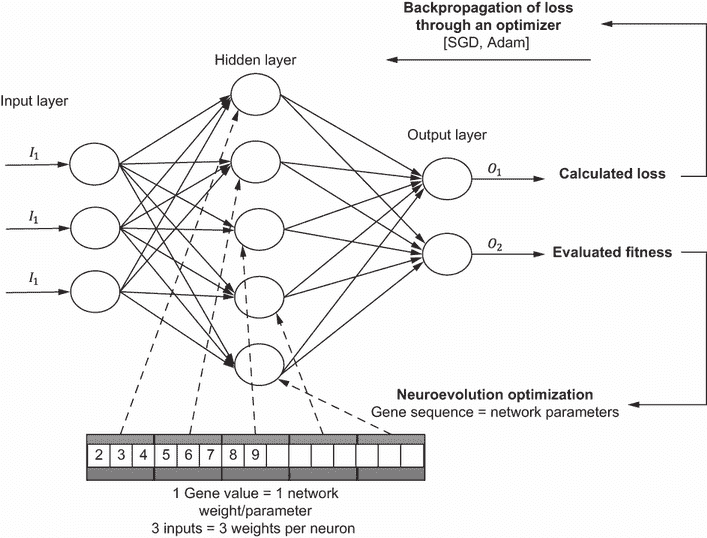

图 6.1 反向传播与神经进化优化

希望如果你在深度学习方面有扎实的背景，你已经理解了 MLP 及其内部工作原理。然而，为了全面起见，我们回顾了仅使用 NumPy 编写的 MLP 结构。然后，我们看看这个简单的网络如何在各种样本分类问题中进行训练。

在 Colab 中打开 EDL_6_1_MLP_NumPy.ipynb 笔记本。如果你需要帮助，请参阅附录。通过选择菜单中的“运行”>“运行所有”来运行所有单元格。

图 6.2 显示了你可以选择的第二个单元格和选项。按照图中的选项选择，然后通过选择运行 > 运行所有来再次运行笔记本中的所有单元格。


图 6.2 选择问题数据集生成参数

处理错误

通常，如果你在运行笔记本时遇到错误，那是因为重复运行代码或代码运行不同步。最简单的修复方法是工厂重置笔记本（运行 > 工厂重置运行时），然后再次运行单元格。

生成问题数据集的代码是使用 sklearn 的`make` `datasets`函数族构建的。我们不会关注具体的代码，而是专注于表 6.1 中的参数选项（见图 6.2）。

表 6.1 参数和值范围的摘要描述

| 参数 | 描述 | 范围 |
| --- | --- | --- |
| `number_samples` | 样本数据点的数量 | 100–1,000 |
| `difficulty` | 一个增加问题难度的任意因素 | 1–5 |
| `problem` | 定义用于问题数据集的函数 | classification = `make_classification`moons = `make_moons`circles = `make_circles`blobs = `make_blobs`Gaussian quantiles = `make_gaussian_quantiles` |
| `middle_layer` | 设置中间网络层的节点数 | 5–25 |
| `epochs` | 在 MLP 上运行的训练迭代次数 | 1000–25000 |

图 6.3 显示了在难度级别 1 下每种数据集类型的示例。尝试更改问题类型，以查看每个数据集的变体。对于简单的 MLP 网络来说，最困难的数据集是圆形，但请确保探索所有数据集。

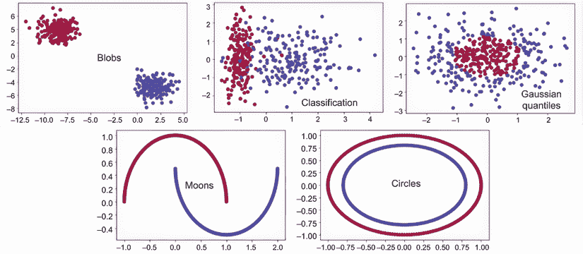

图 6.3 难度级别 1 下样本数据集类型的示例

作为基线，我们比较了来自 sklearn 的一个简单逻辑回归（分类）模型。向下滚动查看以下列表中显示的代码。

列表 6.1 EDL_6_1_MLP_NumPy.ipynb：Sklearn 逻辑回归

```
clf = sklearn.linear_model.LogisticRegressionCV()
clf.fit(X, Y)                                        ❶

show_predictions(clf, X, Y, "Logistic regression")   ❷

LR_predictions = clf.predict(X)                      ❸
print("Logistic Regression accuracy : ", 
np.sum(LR_predictions == Y) / Y.shape[0])            ❹
```

❶ 将模型拟合到数据

❷ 使用辅助函数显示预测的可视化

❸ 生成一组预测

❹ 评估预测的准确性并打印

图 6.4 显示了调用辅助`show_predictions`函数的输出。此函数绘制了模型如何对数据进行分类的漂亮可视化。如图所示，结果并不十分出色。

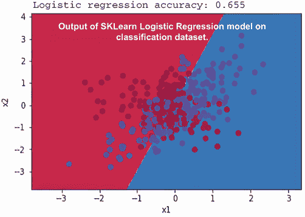

图 6.4 展示了逻辑回归模型对分类数据集进行分类的图

接下来，点击标题为“Python 中的 MLP”的单元格上的“显示代码”链接。务必在空闲时间查看`init`、`forward`、`back_prop`和`train`函数。我们在这里不会花时间查看代码；我们使用这个简单的例子来展示不同的函数。此代码将在未来的项目中重用，但不包括`back_prop`和`training`函数。笔记本中最后一个代码块，如下所示，创建 MLP 网络，对其进行训练，并输出结果的可视化。

列表 6.2 EDL_6_1_MLP_NumPy.ipynb：创建和训练网络

```
nn = Neural_Network(2, middle_layer, 1)         ❶
nn.train(X, Y, epochs, 1.2)                     ❷

show_predictions(nn, X, Y, "Neural Network")    ❸

nn_predictions = nn.predict(X)                  ❹
print("Neural Network accuracy : ", 
    np.sum(nn_predictions == Y) / Y.shape[0])   ❹
```

❶ 创建 MLP 网络

❷ 训练网络

❸ 展示训练结果

❹ 打印出模型准确率

图 6.5 展示了训练 MLP 网络的结果。正如我们在基本的分类示例中可以看到的，使用 MLP 网络的结果显著优于 sklearn 中的逻辑回归模型。这就是为什么神经网络和深度学习变得如此成功的一部分原因。然而，这个简单的网络仍然难以解决所有的问题数据集。

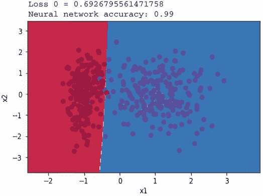

图 6.5 在问题数据集上训练简单 MLP 网络的成果

图 6.6 展示了 MLP 网络尝试解决圆和月亮问题集的输出。如图所示，圆的准确率峰值在 0.5，即 50%，而月亮的准确率在 0.89，即 89%。我们当然可以查看更强大的优化器，如 Adam，但让我们考虑另一种方法。如果我们使用遗传算法，比如找到最优的网络权重，就像我们之前的许多例子一样，会怎样呢？

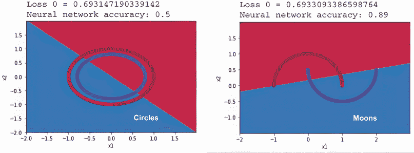

图 6.6 在圆和月亮问题数据集上训练 MLP 的结果

### 6.1.1 学习练习

使用以下练习来提高你的知识：

1.  增加或减少图 6.2 中的样本数量，然后重新运行笔记本。

1.  更改图 6.2 中的问题类型和难度，并在每次更改后重新运行笔记本。保持模型大小一致。

1.  更改图 6.2 中的模型参数和中层，然后重新运行。

现在我们有了感知器 MLP 模型，我们可以在下一节中继续使用遗传算法来优化它。

## 6.2 遗传算法作为深度学习优化器

在上一个项目设置的基础上，我们现在可以继续将我们的 MLP 中使用的深度学习优化方法从反向传播更改为神经进化优化。因此，我们不再使用任何形式的通过优化器（如梯度下降或 Adam）通过损失反向传播，而是完全依赖于遗传算法。

我们接下来要看的下一个项目使用上一个项目的代码作为我们的基础网络模型，然后我们用 DEAP 中的遗传算法包裹训练优化过程。因此，很多代码现在应该感觉非常熟悉，所以我们只考虑重点。如果你需要复习如何使用 DEAP 设置遗传算法，请考虑回顾第 3-5 章。

在 Colab 中打开笔记本 EDL_6_2_MLP_GA.ipynb。如需帮助，请参阅附录 A。确保通过菜单选择运行 > 运行所有来运行模型中的所有单元格。

我们通过开始查看 MLP 网络代码块中的主要变化来关注主要变化。本项目使用相同的 MLP 网络模型，但将`Neural_Network`类中的`train`和`back_prop`函数替换为新的`set_parameters`函数，如列表 6.3 所示。

此代码遍历模型中的参数列表，找到大小和形状，然后从 `individual` 中提取匹配数量的 `genes`。然后，构建一个新的张量并将其重塑以匹配原始参数/权重张量。我们从原始张量中减去自身以将其置零并保持引用，然后添加新的张量。实际上，我们将 `individual` 的 `gene` 序列的部分交换到张量中，然后将其作为模型中的新权重替换。

列表 6.3 EDL_6_2_MLP_GA.ipynb: `set_parameters` 函数

```
def set_parameters(self, individual):      
  idx = 0
  for p in self.parameters:        ❶
    size = p.size                  ❷
    sh = p.shape                   ❷
    t = individual[idx:idx+size]   ❷
    t = np.array(t)
    t = np.reshape(t, sh)          ❸
    p -= p                         ❹
    p += t                         ❹
    idx += size                    ❺
```

❶ 遍历模型权重/参数的列表

❷ 获取参数张量的大小，然后提取基因集

❸ 创建一个新的张量，然后从基因序列中重塑它

❹ 将张量重置为零，然后添加一个新的张量

❺ 将索引位置更新为个体

请注意，`train` 和 `back_prop` 函数已被完全删除，从而防止网络执行任何形式的传统反向传播训练。`set_parameters` 函数设置模型的权重/参数，并允许我们使用 GA 搜索这些值。我们接下来要查看的代码实例化了我们的网络，将所有参数设置为 1.0，然后输出图 6.7 中显示的结果。

列表 6.4 EDL_6_2_MLP_GA.ipynb: 创建网络和设置样本权重

```
nn = Neural_Network(2, middle_layer, 1)                   ❶
number_of_genes = sum([p.size for p in nn.parameters])    ❷
print(number_of_genes)                                    ❷

individual = np.ones(number_of_genes)                     ❸
nn.set_parameters(individual)                             ❸
print(nn.parameters)

show_predictions(nn, X, Y, "Neural Network")              ❹

nn_predictions = nn.predict(X)                            ❺
print("Neural Network accuracy : ", 
    np.sum(nn_predictions == Y) / Y.shape[0])             ❺
```

❶ 创建 MLP 网络

❷ 计算模型参数的数量，该数量等于基因的数量

❸ 将每个模型权重设置为 1

❹ 生成预测图

❺ 计算准确率然后打印

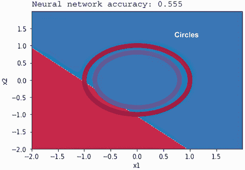

图 6.7 在圆圈数据集上所有权重设置为 1 的网络预测

图 6.7 显示了模型预测的输出，其中所有权重/参数都设置为 1.0。设置 GA 的 DEAP 代码如下所示，但现在应该已经很熟悉了。

列表 6.5 EDL_6_2_MLP_GA.ipynb: DEAP `toolbox` 设置

```
toolbox = base.Toolbox()
toolbox.register("attr_float", uniform, -1, 1, 
➥ number_of_genes)                                      ❶
toolbox.register("individual", tools.initIterate, creator.Individual, 
➥ toolbox.attr_float)
toolbox.register("population", tools.initRepeat, list, toolbox.individual)

toolbox.register("select", tools.selTournament, 
➥ tournsize=5)                                          ❷
toolbox.register("mate", tools.cxBlend, alpha=.5)        ❸
toolbox.register("mutate", tools.mutGaussian, mu=0.0, 
➥ sigma=.1, indpb=.25)                                  ❹
```

❶ 创建长度为 number_of_genes 的浮点基因序列

❷ 将选择设置为大小为 5 的锦标赛

❸ 使用混合函数进行交叉

❹ 使用高斯变异

同样，我们可以回顾 `evaluate` 函数，如下所示。注意我们返回准确率的倒数。这允许我们在进化过程中最小化 `fitness`，从而最大化 `individual` 的准确率。

列表 6.6 EDL_6_2_MLP_GA.ipynb: `evaluate` 函数

```
def evaluate(individual):  
  nn.set_parameters(individual)                       ❶
  nn_predictions = nn.predict(X)                      ❷
  return 1/np.sum(nn_predictions == Y) / Y.shape[0],  ❸

toolbox.register("evaluate", evaluate)                ❹
```

❶ 根据个体基因设置模型参数

❷ 在问题数据集上评估模型预测

❸ 返回计算出的准确率的倒数

❹ 将函数注册到工具箱中

最后，我们可以跳到进化模型以优化模型的代码，如列表 6.7 所示。正如你所期望的，我们使用`eaSimple`函数在一系列`代`中训练`种群`。然后，我们输出上一代`种群`中的一个样本`个体`和当前最佳`个体`作为比较。在代码的末尾，如果准确率达到某个值，我们检查早期停止条件。检查早期停止条件允许我们的代码一旦找到可接受的解决方案就立即中断。

列表 6.7 EDL_6_2_MLP_GA.ipynb：进化模型

```
for g in range(NGEN):
  pop, logbook = algorithms.eaSimple(pop, toolbox, 
            cxpb=CXPB, mutpb=MUTPB, ngen=RGEN, 
            ➥ stats=stats, halloffame=hof, verbose=False)   ❶
  best = hof[0] 
  clear_output()
  print(f"Gen ({(g+1)*RGEN})")
  show_predictions(nn, X, Y, "Neural Network")               ❷
  nn_predictions = nn.predict(X)
  print("Current Neural Network accuracy : ", 
  ➥ np.sum(nn_predictions == Y) / Y.shape[0])               ❷
  plt.show()                                                 ❷

  nn.set_parameters(best)                                    ❸
  show_predictions(nn, X, Y, "Best Neural Network")          ❸
  plt.show()                                                 ❸
  nn_predictions = nn.predict(X)                             ❸
  acc = np.sum(nn_predictions == Y) / Y.shape[0]             ❸
  print("Best Neural Network accuracy : ", acc)              ❸
  if acc > .99999: #stop condition                           ❹
    break
```

❶ 调用进化函数以进化种群

❷ 显示了上一代最后一个个体的结果

❸ 显示了最佳个体的结果

❹ 如果满足早期停止条件则中断

图 6.8 展示了将`种群`进化到一个可以以 100%准确率解决圆问题的`个体`的例子。当你考虑到我们使用反向传播的 MLP 网络在这个问题上只能达到 50%时，这相当令人印象深刻。


图 6.8 使用 GA 解决圆问题的进化过程

用 GA 探索其他问题数据集，看看这种方法与简单的反向传播和梯度下降优化相比如何。再次强调，还有更强大的优化器，比如我们稍后比较的 Adam，但请花时间欣赏 GA 如何优化一个简单的 MLP 网络。

### 6.2.1 学习练习

使用以下练习来提高你的神经进化知识：

1.  增加或减少样本数量然后重新运行。使用更少或更多的样本收敛网络参数是否更难？

1.  修改`交叉`和`变异`率然后重新运行。你能提高给定问题的进化性能吗？

1.  增加或减少中间层的大小，然后重新运行。网络大小对进化有什么影响？

当然，我们还有更强大的进化方法，如进化策略和差分进化，可能表现更好。我们将在下一节花时间查看这两种更先进的进化方法。

## 6.3 用于神经优化的其他进化方法

在第五章中，当我们调整超参数时，我们看到了使用其他进化方法（如进化策略和差分进化）的一些很好的结果。看到这样的好结果，将 ES 和 DE 应用于上一节中解决的问题集是很有意义的。

在这个项目中，我们将 ES 和 DE 作为神经进化优化器应用。这两个代码示例是上一个项目的扩展，位于单独的笔记本中。我们在两个笔记本和上一个项目之间来回跳转，以便进行比较。

在 Colab 中打开两个独立的浏览器标签页中的 EDL_6_3_MLP_ES.ipynb 和 EDL_6_3_MLP_DE.ipynb。你可能还想保持最后一个项目笔记本 EDL_6_2_MLP_GA.ipynb 的打开状态。如果你需要帮助，请参阅附录。

从笔记本的“数据集参数”单元格中选择相同的问题，圆或月亮。如果你不确定选择哪个问题，请参阅图 6.2 和相应的表格，以更详细地解释选项。

通过菜单中的“运行”>“运行所有”来运行两个笔记本的所有单元格。在它们运行时在两个笔记本之间切换，以查看每种方法如何优化权重。

图 6.9 展示了在圆和月亮问题上的 ES 和 DE 笔记本运行到完成（最多 1,000 代）的示例。特别值得注意的是，DE 和 ES 如何为每个问题进化权重。注意 ES 笔记本的进化以及 2D 可视化产生的几条直线。ES 不仅擅长解决这些更难的数据集，而且还有解决更难问题的潜力。

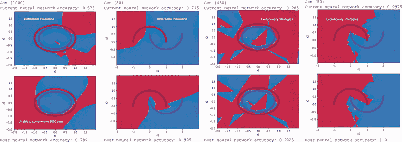

图 6.9 ES 与 DE 在圆和月亮问题数据集上的比较

我们已经回顾了两个笔记本中的所有主要代码元素，所以在这里我们不会重新审视任何代码。然而，你可以自己查看代码的结构，看看从使用 GA 转换为 ES 和 DE 有多容易。你也可以回过头去尝试其他问题或调整数据集参数单元格中的其他设置，以查看 ES 或 DE 的表现。

对于本套项目中展示的样本数据集，简单的 GA 方法通常表现最好。虽然这可能会略有不同，但 DE 显然不是最佳选择，但 ES 有一些明确的潜力。在后面的章节中，我们再次回顾这种方法的选择，以深入了解哪种选项是最好的。

### 6.3.1 学习练习

完成以下练习，以帮助提高你的理解：

1.  找到一个问题类别，其中 ES 的表现优于 DE，反之亦然。

1.  调整各种超参数选项，然后看看它们对 DE 或 ES 笔记本有什么影响。

1.  玩转特定的进化方法超参数——ES 的最小和最大策略，以及 DE 的 pmin/pmax 和 smin/smax。

在本节中，我们探讨了如何使用其他进化方法来对简单的 NumPy 网络权重进行优化。在下一节中，我们将应用同样的原理，但这次是针对深度学习框架，例如 Keras。

## 6.4 将神经进化优化应用于 Keras

虽然在前一个项目中，我们用来进行比较的 MLP 网络功能相对较弱且有限。为了进行有效的比较，我们应该“提高我们的水平”并查看一个更健壮的深度学习平台，如 Keras。Keras 与 PyTorch 和其他许多深度学习框架类似，提供了一系列开箱即用的高级优化器。

在以下项目中，我们设置了一个 Keras 多层深度学习网络来解决分类数据集。这不仅提供了使用鲁棒且成熟的优化器（如 Adam）之间的良好比较，而且还展示了我们如何将 *神经进化优化*（NO）集成到 Keras 网络中。

在 Colab 中打开 EDL_6_4_Keras_GA.ipynb 笔记本。如需帮助，请参阅附录。暂不运行笔记本中的所有单元格，因为我们一步一步地进行。

定位并选择如图 6.8 所示的 Keras 模型设置代码单元格，然后通过选择菜单中的“运行之前”来运行笔记本的所有前一个单元格。该代码创建了一个简单的 Keras 模型，具有输入、隐藏和输出层。输出是一个单一的二进制节点；我们使用二元交叉熵来计算损失。我们还确定了模型的可训练参数数量，因为这也与后面的 `genes` 数量有关。

列表 6.8 EDL_6_4_Keras_GA.ipynb：设置 Keras 模型

```
model = tf.keras.models.Sequential([                            ❶
  tf.keras.layers.Dense(16, activation='relu',                  ❶
  ➥ input_shape=(X.shape[1],)),                                ❶
  tf.keras.layers.Dense(32, activation='relu'),                 ❶
  tf.keras.layers.Dense(1, activation='sigmoid')                ❶
])

optimizer = tf.keras.optimizers.Adam
➥ (learning_rate=.001)                                         ❷

model.compile(optimizer=optimizer,
              loss='binary_crossentropy',                       ❸
              metrics=['accuracy'])                             ❹

model.summary()                                                 ❺
trainableParams = np.sum([np.prod(v.get_shape()) for v in       ❺
➥ model.trainable_weights])                                    ❺
print(f"Trainable parameters: {trainableParams}")               ❺
```

❶ 创建一个简单的 Keras Sequential 模型

❷ 创建一个具有学习率的 Adam 类型优化器

❸ 将损失设置为二元交叉熵

❹ 使用准确性指标

❺ 打印模型的摘要并输出可训练参数

运行 Keras 设置单元格；你将得到图 6.10 所示的输出。输出显示了模型摘要以及每层的参数/权重数量。输出底部还打印了可训练参数的总数。这很重要，因为它代表了 `individual` 中的 `genes` 数量。

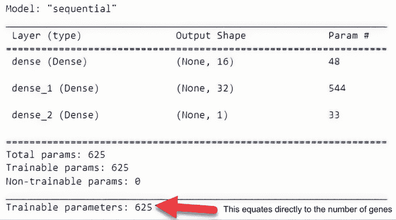

图 6.10 模型总结输出和参数计数

返回到数据集参数单元格，如图 6.2 所示，并选择一个困难的问题，如月亮或圆圈。这会重新运行单元格并生成问题数据集的视图。

滚动到模型训练代码单元格，如下所示列表，然后运行单元格。作为这部分训练代码的一部分，我们使用了一个有用的回调函数：来自 `LiveLossPlot` 模块的 `PlotLossesKeras`。

列表 6.9 EDL_6_4_Keras_GA.ipynb：拟合模型

```
model.fit(X, Y, epochs=epochs,            ❶
          callbacks=[PlotLossesKeras()],  ❷
          verbose=0)                      ❸
```

❶ 在数据集上训练模型多个时期

❷ 使用 PlotLossesKeras 输出进度图

❸ 关闭噪声输出

运行训练单元格。你将得到与图 6.11 中所示类似的输出。

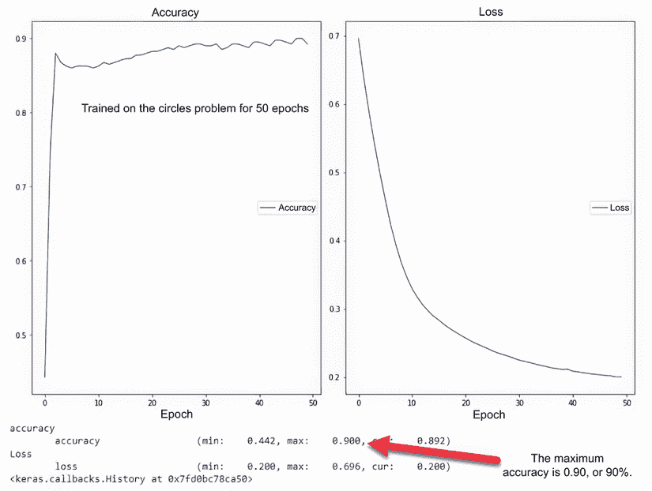

图 6.11 使用 Adam 优化器在 50 个时期内训练 Keras 模型的示例输出

运行接下来的几个单元格以评估模型的准确性并输出结果。图 6.12 显示了 `show_predictions` 辅助方法的输出。彩虹图案代表了模型的输出，是一个从 0 到 1 的值。类别的分离在中间的 0.5 处，由黄色带表示。

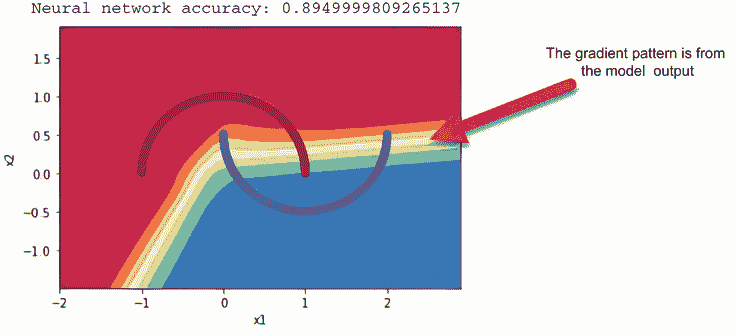

图 6.12 使用 `show_predictions` 的模型输出

移动到下一个代码单元格，其中有一个辅助函数，用于提取一个`个体`的`基因`并将它们插入到 Keras 模型的权重/参数中。这段代码与我们在简单 MLP 网络中设置模型权重的方式非常相似。它遍历模型层和模型权重，提取一个权重张量。从这个信息中，我们重新构建一个张量，从下一个部分的`个体`权重中提取，并将其添加到张量列表中。

最后，使用`set_weights`函数设置模型权重，如下所示。

列表 6.10 EDL_6_4_Keras_GA.ipynb：拟合模型

```
def set_parameters(individual):
  idx = 0
  tensors=[]
  for layer in model.layers:         ❶
    for na in layer.get_weights():   ❷
      size = na.size
      sh = na.shape
      t = individual[idx:idx+size]
      t = np.array(t)
      t = np.reshape(t, sh)      
      idx += size
      tensors.append(t)              ❸
  model.set_weights(tensors)         ❹
```

❶ 遍历模型层

❷ 遍历层的权重张量

❸ 将新的张量追加到列表中

❹ 从张量列表中设置模型的权重

下一个单元格将所有模型权重设置为 1，并使用`show_predictions`输出结果。同样，我们遵循在 MLP 项目中使用的相同程序。

其余的代码与之前的 GA 示例相同，因此请从菜单中选择运行 > 运行后续单元格来运行其余的单元格。只需确保您已选择一个单元格，其中代码和之前的单元格已经完全运行。如果您不确定哪个单元格是最后运行的，您也可以简单地运行所有单元格。

图 6.13 显示了使用 Keras 网络运行 GA 优化的输出。注意模型在没有使用任何深度学习优化器的情况下优化得有多好。如果你是经验丰富的 Keras 用户，你可以尝试替换各种其他优化器，看看是否有任何可以击败进化优化器的。

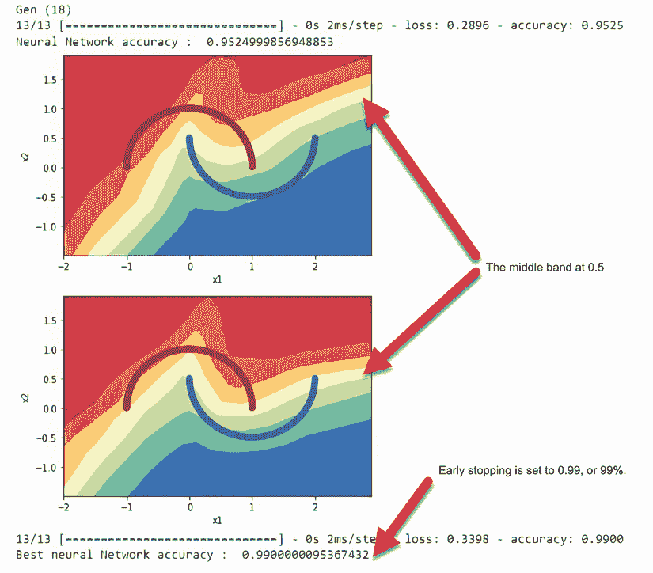

图 6.13 使用 GA 在圆形问题上优化的 Keras 模型的输出

### 6.4.1 学习练习

以下练习旨在展示 Keras 中神经进化的局限性：

1.  将问题类型更改为圆形，然后重新运行问题。网络进化的权重能否解决这个问题？

1.  修改列表 6.8 中的 Keras 模型，然后重新运行笔记本。当你从模型中移除或添加新层时会发生什么？

1.  在列表 6.8 中，将网络损失更改为使用均方误差（MSE）而不是二元交叉熵。这对进化和结果的表现有何影响？

现在，我们的工具箱中有一个强大的新工具——这似乎肯定会对所有深度学习（DL）都有益。不幸的是，这种方法以及进化搜索在一般意义上都有一些局限性。我们将在下一节中查看这些局限性的一个例子。

## 6.5 理解进化优化的局限性

深度学习模型的大小一直在爆炸式增长，从早期模型拥有数百个参数到最新的变换器拥有数十亿个参数。优化或训练这些网络需要大量的计算资源，因此尝试评估更好的方法将始终是一个优先事项。因此，我们希望从玩具数据集转向更实际的进化优化应用。

在下一个项目中，我们将从玩具数据集提升到一级示例问题，即对修改后的国家标准与技术研究院（MNIST）手写数字数据集进行分类。作为你的深度学习教育的一部分，你很可能已经以某种方式使用过 MNIST。MNIST 通常是我们的第一个数据集，我们用它来构建深度学习网络进行分类。

在 Colab 中打开 EDL_6_5_MNIST_GA.ipynb 笔记本。附录可以帮助你在需要时完成任务。运行笔记本顶部的两个单元格——`pip install`和`import`——以设置笔记本代码的基础。下一个单元格加载 MNIST 数据集，归一化值，并将它们放入训练术语`x`和`y`中，如下所示。

列表 6.11 EDL_6_5_MNIST_GA.ipynb：加载数据

```
mnist = tf.keras.datasets.mnist          ❶

(x_train, y_train), (x_test, y_test) = 
➥ mnist.load_data()                     ❶
X, Y = x_train / 255.0, y_train          ❷

plt.imshow(X[0])                         ❸
print(Y[0])                              ❹
```

❶ 加载 MNIST 数据集进行训练和测试。

❷ 将字节数值归一化到 0-1 浮点数。

❸ 绘制集合中的一个示例图像。

❹ 打印出图像对应的标签。


图 6.14 MNIST 的一个示例图像

图 6.14 显示了数据集中单个数字的样本输出。下一个单元格包含模型构建代码，因此运行该单元格和列表 6.12 中显示的训练代码。此代码训练模型，并再次使用 livelossplot 模块的`PlotLossesKeras`函数来显示实时结果。之后，显示模型准确率并生成类别分类报告。

列表 6.12 EDL_6_5_MNIST_GA.ipynb：训练模型

```
model.fit(X, Y, epochs=epochs,                  ❶
          validation_data=(x_test,y_test),      ❷
          callbacks=[PlotLossesKeras()],        ❸
          verbose=0)
print("Neural Network accuracy : ", 
➥ model.evaluate(X,Y)[1])                      ❹
y_pred = model.predict(x_test)
y_pred = np.argmax(y_pred, axis=1)              ❺
print(classification_report(y_test, y_pred))    ❻
```

❶ 使用数据训练模型

❷ 使用测试数据验证模型

❸ 绘制准确率和损失图

❹ 执行测试预测

❺ 将最高预测值作为类别

❻ 打印分类报告

图 6.15 显示了基于测试预测结果的 sklearn 模块`classification_report`函数生成的类别分类报告。正如你所看到的，我们的网络在分类所有类别的数字方面明显非常出色。

从菜单中选择运行 > 运行后，以运行笔记本中剩余的所有单元格。同样，这个笔记本中的大部分代码与我们的前一个项目相同，所以我们不需要对其进行审查。

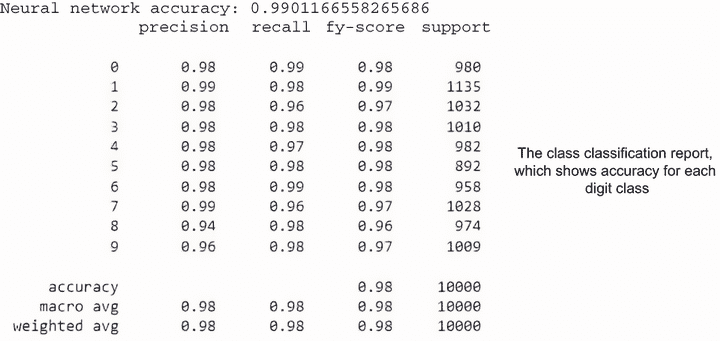

图 6.15 MNIST 数字分类的分类报告

图 6.16 展示了最后单元格执行进化的样本输出。此图显示了随着时间的推移准确率的进展以及分类报告。从这个快速示例中可以看出，当进化优化接近更大的模型时，它具有关键的限制。

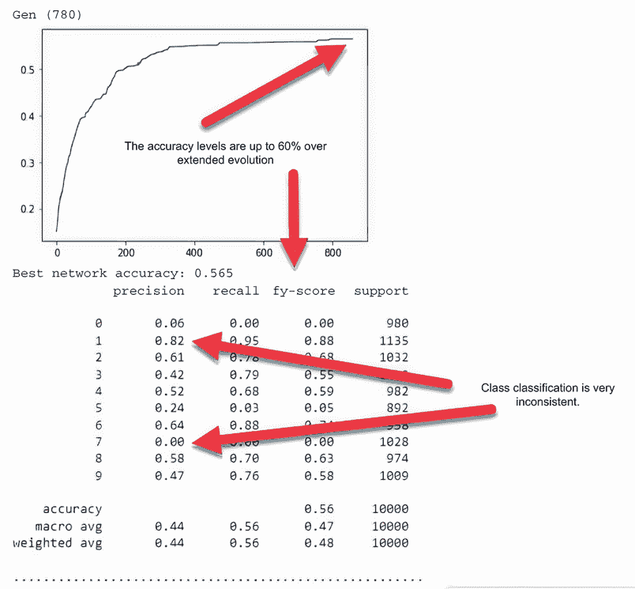

图 6.16 展示了 GA EO 的示例输出，显示了较差的结果

如上一次项目所示，使用进化优化/搜索来寻找最佳网络权重/参数会产生较差的结果，而网络在几小时的训练后可以达到高达 60%的准确率，这比随机要好得多。然而，每个类别的准确率结果都不理想，不能接受。

### 6.5.1 学习练习

这些练习是为希望测试神经进化权重/参数优化极限的高级读者准备的：

1.  通过改变网络大小和形状来更改基础 Keras 模型。使用更小的网络您能得到更好的结果吗？

1.  向模型添加卷积层和最大池化。这可以帮助减少需要进化的模型参数总数。

1.  将笔记本代码调整以适应您过去使用或合作过的其他模型。

显然，最后一个项目的结果表明，使用进化搜索进行深度学习优化在更大的参数模型上不会奏效。但这并不意味着这项技术完全没有价值，正如我们在后面的章节中讨论的那样。

## 摘要

+   可以使用 NumPy 库开发一个简单的多层感知器网络。Sklearn 可用于生成各种单标签分类数据集，这些数据集通过简单的 NumPy MLP 网络展示了二元模型分类。

+   DEAP 和遗传算法可用于寻找简单深度学习网络的权重/参数。

+   结合进化策略和微分演化的 DEAP 可用于优化简单多层感知器网络的权重/参数搜索。比较这两种方法可以有助于评估用于各种进化优化方法和各种样本分类在问题数据集上使用的工具。

+   Keras 深度学习模型可以调整以使用进化搜索进行权重优化，而不是传统的微分反向传播方法。

+   进化权重优化可以成功解决复杂且不可微分的难题。

+   使用自动微分和反向传播的深度学习问题仅限于解决连续问题。

+   进化优化可用于解决以前深度学习网络无法解决的离散问题。

+   随着问题规模的扩大，进化优化变得不太成功。将 EO 应用于更复杂的问题，如图像分类，通常不会成功。
