# 7 进化卷积神经网络

本章涵盖

+   带有 Keras 入门的卷积神经网络

+   使用基因序列定义神经网络架构

+   构建自定义交叉算子

+   应用自定义变异算子

+   为给定数据集进化最佳卷积网络架构

最后一章向我们展示了当将进化算法应用于像参数搜索这样的复杂问题时，其局限性。正如我们所见，遗传算法在处理某一类问题时可以提供出色的结果。然而，当用于更大的图像分类网络时，它们却无法达到预期效果。

在本章中，我们继续探讨用于图像分类的更大网络。然而，这一次，我们不是优化参数权重或模型超参数，而是关注改进网络架构。更具体地说，我们涵盖了卷积神经网络（CNN）的网络架构。

CNN 对于图像分类和其他任务的深度学习采用起到了关键作用。它们是深度学习实践者工具箱中的绝佳工具，但通常被误解和低效使用。在下一节中，我们将回顾 CNN 模型以及它们在 TensorFlow 和 Keras 中的构建方式。

## 7.1 在 Keras 中回顾卷积神经网络

本节的项目是对使用 Keras 构建图像分类 CNN 模型的回顾。虽然我们涵盖了 CNN 的一些基础知识，但我们的重点更多地在于构建这些类型网络所面临的细节问题。

CNN 的未来

CNN 层正迅速被更先进的技术所取代，如残差网络和注意力机制（即转换器）。我们在本章中学到的相同原则可以应用于优化这些其他架构。

在这个项目中，我们在 Fashion-MNIST 数据集上执行图像分类，如图 7.1 所示。这是一个很好的基本测试数据集，可以缩减数据量，而不会对结果产生太大的影响。减少用于训练或推理的数据量可以缩短我们后续进化的运行时间。

GPU 训练

本章中使用的笔记本项目已经准备好使用 GPU，因为处理量很大。然而，Colab 可能会对你的 GPU 实例访问设置限制或限制。如果你发现这有问题，并且你有访问带有 GPU 的机器，你总是可以通过连接到本地实例来运行 Colab。

在 Colab 中打开 EDL_7_1_Keras_CNN.ipynb 笔记本。如果你需要帮助打开笔记本，请查看附录。像往常一样，前几个单元是安装、导入和设置。我们可以忽略这些，并通过菜单中的“运行”>“运行所有”来运行整个笔记本。

我们首先想要查看的是数据加载，如列表 7.1 所示。在这里我们加载 Fashion 数据集，将数据归一化并重塑为 `28,` `28,` `1` 张量，其中末尾的 `,1` 表示通道。我们这样做是因为数据集以没有定义通道的二维数组形式提供。在代码块末尾，我们提取原始数据的前 1,000 个样本用于训练，100 个用于测试。

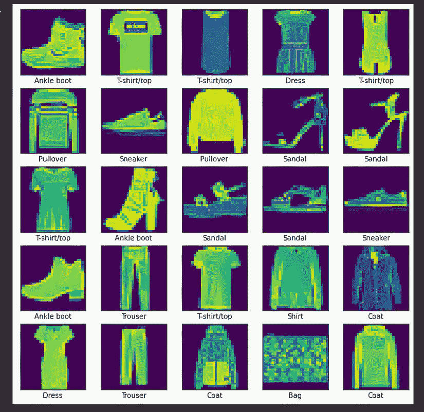

图 7.1 Fashion-MNIST 数据集

这样大幅减少数据集并不是最佳选择，但当我们尝试优化成百上千的 `个体` 或众多 `代` 时，这将节省我们几分钟或几小时的时间。

列表 7.1 EDL_7_1_Keras_CNN.ipynb：加载数据

```
dataset = datasets.fashion_mnist                          ❶
(x_train, y_train), (x_test, y_test) =                    ❶
➥ dataset.load_data()                                    ❶

x_train = x_train.reshape(x_train.shape[0], 28, 28, 1)    ❷
     .astype("float32") / 255.0                           ❷
x_test = x_test.reshape(x_test.shape[0], 28, 28, 1)       ❷
     .astype("float32") / 255.0                           ❷

x_train = x_train[:1000]                                  ❸
y_train= y_train[:1000]                                   ❸
x_test = x_test[:100]                                     ❸
y_test= y_test[:100]                                      ❸
```

❶ 加载数据集。

❷ 归一化和重塑数据。

❸ 提取数据的一个较小子集。

接下来的几个单元格构建了图 7.1 中所示的输出。我们在此不再进一步讨论它们。

图 7.2 展示了如何定义单个层，从代码到可视化实现。每个 CNN 层定义了一组滤波器或神经元，它们描述了一个块或核。单个核通过步长在图像上移动，通常为 1 像素乘以 1 像素。为了简单起见，我们将步长固定在 `1, 1`。

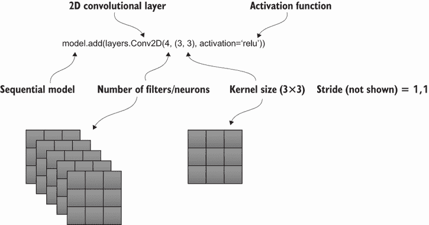

图 7.2 在 Keras 中定义 CNN 层

构建模型卷积层的代码如列表 7.2 所示。每个 `Conv2D` 层定义了对输入应用的卷积操作。在每一连续层中，滤波器或通道的数量从上一层扩展。例如，第一个 `Conv2D` 层将输入通道从 `1` 扩展到 `64`。然后，连续层将其减少到 `32`，然后是 `16`，其中每个卷积层后面都跟着一个 `MaxPooling` 层，该层收集或总结特征。

列表 7.2 EDL_7_1_Keras_CNN.ipynb：构建 CNN 层

```
model = models.Sequential()
model.add(layers.Conv2D(64, (3, 3), activation='relu', padding="same", 
➥ input_shape=(28, 28, 1)))                                 ❶
model.add(layers.MaxPooling2D((2, 2), padding="same"))       ❷
model.add(layers.Conv2D(32, (3, 3), activation='relu', 
➥ padding="same"))                                         ❸
model.add(layers.MaxPooling2D((2, 2)))                       ❹
model.add(layers.Conv2D(16, (3, 3), activation='relu'))      ❺
model.add(layers.MaxPooling2D((2, 2)))                       ❻

model.summary()
```

❶ 第一层卷积神经网络（CNN）接收张量输入形状。

❷ 最大池化层

❸ 中间 CNN 层

❹ 最大池化层

❺ 中间 CNN 层

❻ 最大池化层

图 7.3 展示了单个滤波器或核操作如何应用于单个图像块，以及它如何提取与输出相对应的值。相应的输出是通过在图像上滑动滤波器块产生的，其中每个核操作代表一个单独的输出值。请注意，滤波器中的核值或权重/参数是学习得到的。

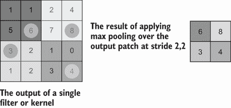

图 7.4 最大池化操作

在设置好模型的卷积和最大池化层之后，使用`model.summary()`打印摘要，如下所示。请注意，这仅仅是完整模型的上部，或特征提取器部分。

列表 7.3 EDL_7_1_Keras_CNN.ipynb：CNN 模型摘要

```
Model: "sequential_4"
_____________________________________________________________
 Layer (type)                Output Shape           Param #   
=============================================================
 conv2d_8 (Conv2D)           (None, 28, 28, 64)     640           ❶

 max_pooling2d_7 (MaxPooling  (None, 14, 14, 64)    0             ❷
 2D)                                                             

 conv2d_9 (Conv2D)           (None, 14, 14, 32)     18464     

 max_pooling2d_8 (MaxPooling  (None, 7, 7, 32)      0         
 2D)                                                             

 conv2d_10 (Conv2D)          (None, 5, 5, 16)       4624      

 max_pooling2d_9 (MaxPooling  (None, 2, 2, 16)      0         
 2D)                                                             

=================================================================
Total params: 23,728                                              ❸
Trainable params: 23,728
Non-trainable params: 0
________________________________________________________________
```

❶ 一个 3×3 的核加上偏置为每个过滤器提供 10 个参数——10×64 = 640。

❷ 池化层不可训练且没有参数。

❸ 参数总数

在下一个单元中，CNN 层的输出被展平并输入到一个单一的密集层，该层输出到 10 个类别，如下所示。

列表 7.4 EDL_7_1_Keras_CNN.ipynb：完成模型

```
model.add(layers.Flatten())                          ❶
model.add(layers.Dense(128, activation='relu'))      ❷
model.add(layers.Dense(10))                          ❸

model.summary()
```

❶ 将 2D 卷积的输出展平到 1D

❷ 添加一个密集层进行分类推理。

❸ 添加一个最终的密集层以输出 10 个类别。

图 7.5 显示了在大量减少的数据集上训练的模型输出。通常，这个数据集被优化以在约 98%的准确率下运行。然而，由于前面提到的原因，在完整数据集上训练既耗时又不切实际，尤其是在我们应用进化算法时。相反，关注这个减少数据集的准确率；我们不会回顾模型的编译和训练代码，因为我们在第六章中已经讨论过。

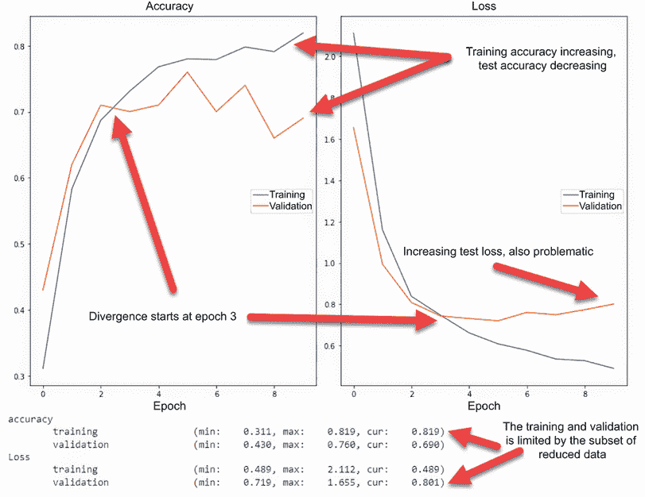

图 7.5 在减少数据集上模型训练

您的结果可能会有所不同，但您应该看到训练或验证数据的最大值大约在 81%。如果您决定为这个项目使用其他数据集，请注意，您的结果可能会有很大差异。Fashion-MNIST 适用于这个应用，因为类之间的差异很小。这当然不会是像 CIFAR-10 或 CIFAR-100 这样的数据集的情况。

参考图 7.5；查看训练和测试中的问题差异，以及损失和准确率。我们可以看到，模型在 3 个 epoch 左右就崩溃了，无法对盲测试数据进行任何好的推理。这可能与我们的数据量减少有关，部分也与模型的结构有关。在下一节中，我们将介绍一些明显的 CNN 层架构，并看看它们引入了什么问题。

### 7.1.1 理解 CNN 层问题

在本节中，我们探索了一些 CNN 层架构的进一步示例，并了解它们引入的问题。CNN 是一个很好的工具，如果使用得当，但如果不有效地使用，它很快就会变成一场灾难。了解何时出现问题是我们在进化优化后续尝试中受益的。

重新打开 EDL_7_1_Keras_CNN.ipynb 笔记本，然后导航到标记为 SECTION 7.1.1 的部分。请确保使用菜单中的“运行”>“运行所有”运行所有单元格。

第一个单元格包含了一个新模型的代码，这次只有一个 CNN 层。正如你所见，我们定义了一个包含 64 个滤波器/神经元和 3×3 核的单层。图 7.6 显示了运行此单元格的输出；注意以下列表中此模型的总参数（超过 600 万个）与之前模型（2.3 万个）在列表 7.3 中的参数之间的极端差异。

列表 7.5 EDL_7_1_Keras_CNN.ipynb：单个 CNN 层

```
model = models.Sequential()
model.add(layers.Conv2D(64, (3, 3), activation='relu', 
➥ padding="same", input_shape=(28, 28, 1)))       ❶
model.add(layers.Flatten())
model.add(layers.Dense(128, activation='relu'))    ❷
model.add(layers.Dense(10))                        ❸

model.summary())
```

❶ 单个 2D 卷积层

❷ 单个密集层

❸ 输出到 10 个类别

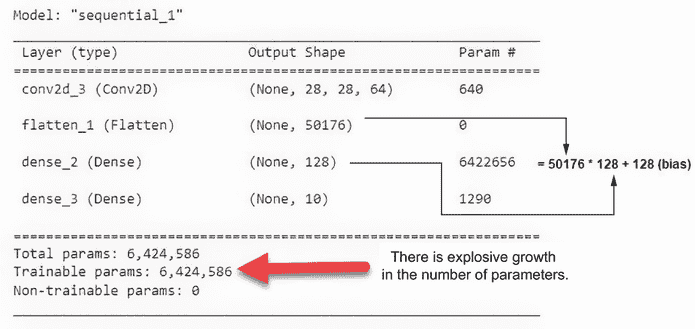

图 7.6 单个 CNN 层模型的总结

图 7.7 显示了运行下一个单元格的模型的训练输出。注意模型在训练数据上的表现如何良好，但在验证/测试数据上的表现如何糟糕。这是因为具有超过 600 万个参数的模型记忆了减少的数据集。因此，你可以看到训练集的准确率几乎达到了 100%，这是非常棒的。然而，测试/验证集开始下降。

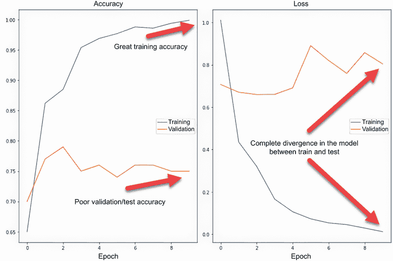

图 7.7 单层 CNN 模型训练输出

模型记忆/专业化与泛化

我们经常希望构建泛化的模型，因此我们将数据分为训练集和测试集以验证这种泛化。我们还可以应用一些其他技术来帮助泛化，比如批量归一化和 dropout，我们稍后会讨论。然而，在某些情况下，泛化可能不是你的最终目标，你可能希望识别非常具体的数据集。如果是这样，那么一个记忆数据的模型是理想的。

现在，我们继续讨论池化对卷积输出的影响。列表 7.6 显示了模型的变化和总训练参数的总结。值得注意的是，这个模型的大小大约是之前模型的四分之一，这是由于添加了池化。我们还在池化层之间添加了一个批量归一化层，以更好地泛化模型。

列表 7.6 EDL_7_1_Keras_CNN.ipynb：添加池化

```
model = models.Sequential()
model.add(layers.Conv2D(64, (3, 3), activation='relu', 
➥ padding="same", input_shape=(28, 28, 1)))              ❶
model.add(layers.BatchNormalization())                    ❷
model.add(layers.MaxPooling2D((2, 2), padding="same"))    ❸
model.add(layers.Flatten())
model.add(layers.Dense(128, activation='relu'))
model.add(layers.Dense(10))

model.summary()
...
=================================================================
Total params: 1,607,946
Trainable params: 1,607,818                               ❹
Non-trainable params: 128
_________________________________________________________________
```

❶ 2D 卷积层

❷ 批量归一化层

❸ 使用 2×2 核的池化层

❹ 可训练参数总数

图 7.8 显示了在 10 个周期上训练模型的输出。虽然这个模型仍然显示出记忆的迹象，但模型在泛化方面也做得更好。我们可以通过查看不断提高的验证准确率和相应的损失下降来看到这一点。

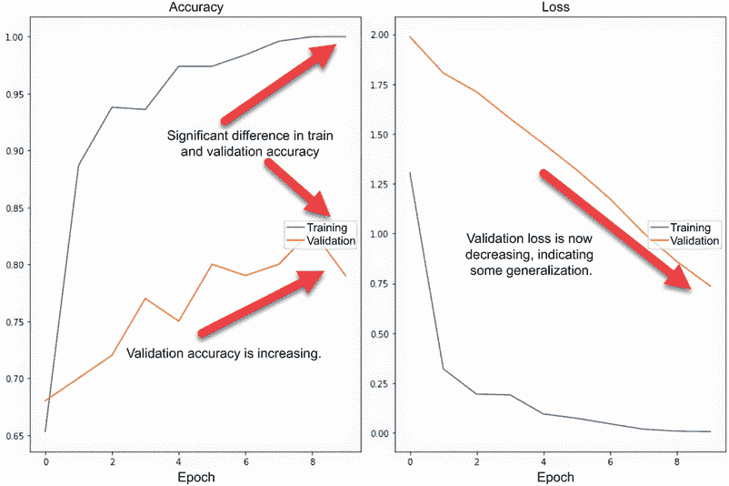

图 7.8 训练更高级 CNN 模型的输出

我们当然可以继续通过模型的多种变体进行尝试，添加更多的 CNN 层或类似批量归一化、dropout 或池化的层。然后，我们会调整各种超参数，如核大小、神经元和滤波器的数量，但这显然会消耗大量时间。

### 7.1.2 学习练习

如果需要，使用以下学习练习来帮助提高你对卷积的理解：

1.  在列表 7.6 中增加或减少内核大小，然后看看这会对结果产生什么影响。

1.  在列表 7.6 中将池化大小从(2,2)增加或减少，然后重新运行。

1.  在列表 7.6 中将额外的卷积层添加到模型中，然后重新运行。

最终，理解如何以及在哪里使用 CNN 层需要一些尝试和错误——这与超参数优化类似。即使你深刻理解了卷积过程，定义正确的 CNN 架构也可能很困难。这当然使得使用某种进化过程来优化 CNN 网络架构成为理想的选择。

## 7.2 使用基因编码网络架构

在本节的项目中，我们查看将 CNN 模型的网络架构编码为`基因`的细节。这是进化这些`个体``基因`序列以产生针对给定数据集的优化模型的先决条件。

已有数篇论文和少数工具被发布，用于进化网络架构。本项目中的代码部分源自一篇题为“用于图像分类的进化深度卷积神经网络”的论文，作者为 Yanan Sun 等人。在这篇论文中，作者开发了一个名为 EvoCNN 的过程，用于构建 CNN 模型架构。

EvoCNN 定义了一个将卷积网络编码为可变长度`基因`序列的过程，如图 7.9 所示。在构建我们的`基因`序列时，我们希望定义一个基本规则，即所有序列都将从卷积层开始，并以一个将输入到另一个密集输出层的密集层结束。为了简化问题，我们在这里不考虑编码最后一个输出层。

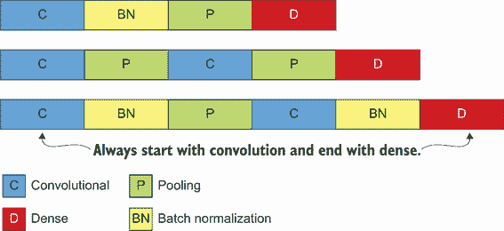

图 7.9 网络架构的可变长度`基因`编码

在每个主要组件层内部，我们还想定义相应的超参数选项，例如滤波器/神经元的数量和内核大小。为了编码这种多样的数据，我们使用否定技巧来分离主要层组件和相关超参数。这个下一个笔记本项目中的代码只关注构建编码序列；我们稍后处理剩余的部分。

在 Colab 中打开 EDL_7_2_Encoding_CNN.ipynb 笔记本。如果你不能为这个项目使用 GPU，请不要担心；我们目前只关注架构编码，还没有进行进化训练。

我们首先查看的代码块（列表 7.7）是我们设置的常数，帮助我们定义层类型和长度，以封装各种相关超参数。我们首先定义了总的最大层数和其他各种层超参数的范围。之后，我们可以看到每种类型的块标识符及其对应的大小。这个大小值表示每个层定义的长度，包括超参数。

列表 7.7 EDL_7_2_Encoding_CNN.ipynb：编码常量

```
max_layers = 5           ❶
max_neurons = 128
min_neurons = 16
max_kernel = 5
min_kernel = 2
max_pool = 3
min_pool = 2

CONV_LAYER = -1          ❷
CONV_LAYER_LEN = 4       ❸
POOLING_LAYER = -2       ❷
POOLING_LAYER_LEN = 3    ❸ 
BN_LAYER = -3            ❷
BN_LAYER_LEN = 1         ❸
DENSE_LAYER = -4         ❷
DENSE_LAYER_LEN = 2      ❸
```

❶ 设置最大和最小构建参数。

❷ 识别层块开始。

❸ 识别层块大小。

图 7.10 展示了带有编码层块及其相应超参数的 `gene` 序列的外观。注意，负值 -1、-2、-3 和 -4 代表层组件的开始。然后，根据层类型，进一步定义了过滤器/神经元数量和内核大小的额外超参数。

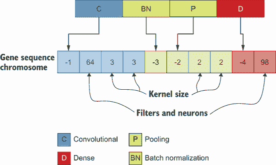

图 7.10 CNN 模型架构的 `gene` 编码

现在我们可以查看构建一个 `individual` 的 `gene` 序列（染色体）的代码，如列表 7.8 所示。首先，我们来看 `create_offspring` 函数，这是构建序列的基础。此代码遍历最大层计数，并带有 50% 的概率添加一个卷积层。如果是这样，它将进一步检查，带有 50% 的概率添加批量归一化和/或池化层。

列表 7.8 EDL_7_2_Encoding_CNN.ipynb：创建后代（`gene` 序列）

```
def create_offspring():
  ind = []
  for i in range(max_layers):
    if random.uniform(0,1)<.5:      
      ind.extend(generate_conv_layer())         ❶
      if random.uniform(0,1)<.5:        
        ind.extend(generate_bn_layer())         ❷
      if random.uniform(0,1)<.5:        
        ind.extend(generate_pooling_layer())    ❸
  ind.extend(generate_dense_layer())
  return ind 
```

❶ 添加一个卷积层。

❷ 添加一个批量归一化层。

❸ 添加一个池化层。

为了完整性，我们还可以回顾各种层构建函数。以下列表中并未显示所有代码，但所示内容应能让你了解辅助函数的工作方式。

列表 7.9 EDL_7_2_Encoding_CNN.ipynb：层组件辅助函数

```
def generate_pooling_layer():   
  part = [POOLING_LAYER]                             ❶
  part.append(random.randint(min_pool, max_pool))    ❷
  part.append(random.randint(min_pool, max_pool))    ❷
  return part

def generate_dense_layer():
  part = [DENSE_LAYER]                               ❶
  part.append(generate_neurons())                    ❸
  return part

def generate_conv_layer():
  part = [CONV_LAYER]                                ❶
  part.append(generate_neurons())                    ❸
  part.extend(generate_kernel())                     ❷
  return part 
```

❶ 添加一个层标记以开始序列块。

❷ 为内核大小添加超参数。

❸ 为过滤器/神经元添加超参数。

调用 `create_offspring` 生成一个 `gene` 序列，如运行最后一个单元格的输出所示。请运行单元格几次，以查看创建的 `gene` 序列的变体，如下列所示。

列表 7.10 EDL_7_2_Encoding_CNN.ipynb：检查生成的 `gene` 序列

```
individual = create_offspring()             ❶
print(individual)

[-1, 37, 5, 2, -3, -1, 112, 4, 2, -4, 25]   ❷
```

❶ 创建一个后代个体。

❷ 随机基因序列的示例输出

使用 `gene` 序列，我们现在可以继续构建模型，本质上解析 `gene` 序列并创建一个 Keras 模型。如你所见，`build_model` 的输入是一个单一的 `gene` 序列，它产生一个 Keras 模型。否则，代码是一个标准的标记解析器，寻找层组件标记 -1、-2、-3 或 -4。在定义层之后，它根据层类型添加额外的超参数，如下列所示。

列表 7.11 EDL_7_2_Encoding_CNN.ipynb：构建模型

```
def build_model(individual):
  model = models.Sequential()
  il = len(individual)
  i = 0
  while i < il:    
    if individual[i] == CONV_LAYER:                    ❶
      n = individual[i+1]
      k = (individual[i+2], individual[i+3])
      i += CONV_LAYER_LEN
      if i == 0:                                       ❷
        model.add(layers.Conv2D(n, k, activation='relu', padding="same", 
        ➥ input_shape=(28, 28, 1)))      
      else:
        model.add(layers.Conv2D(n, k, activation='relu', padding="same"))
    elif individual[i] == POOLING_LAYER:               ❸
      k = k = (individual[i+1], individual[i+2])
      i += POOLING_LAYER_LEN
      model.add(layers.MaxPooling2D(k, padding="same"))      
    elif individual[i] == BN_LAYER:                    ❹
      model.add(layers.BatchNormalization())
      i += 1      
    elif individual[i] == DENSE_LAYER:                 ❺
      model.add(layers.Flatten())      
      model.add(layers.Dense(individual[i+1], activation='relu'))
      i += 2
  model.add(layers.Dense(10))
  return model
```

❶ 添加一个卷积层。

❷ 将输入形状添加到第一个卷积层。

❸ 添加一个池化层。

❹ 添加一个批量归一化层。

❺ 添加一个密集层。

下一段代码创建一个新的 `individual` `gene` 序列，从序列构建模型，然后训练模型，输出训练/验证图，正如我们之前所看到的。

你的结果可能非常差或相对较好，这取决于随机的初始序列。继续运行这个最后的单元格几次，以查看不同初始随机 `individuals` 之间的差异。

### 7.2.1 学习练习

使用以下练习来提高你的理解：

1.  通过在循环中调用 `create_offspring` 从列表 7.8 创建新的 `gene` 编码序列。打印，然后比较 `individuals`。

1.  修改列表 7.6 中的最大/最小范围超参数，然后生成新的后代列表（见练习 1）。

1.  向 `create_offspring` 添加一个新的输入，将静态概率从 0.5 更改为新值。然后，生成后代列表（见练习 1）进行比较。

现在我们有了一种定义表示模型架构的 `gene` 序列的方法，我们可以继续构建支持此类序列的遗传算子。不幸的是，我们无法使用 DEAP 的内置算子，而必须为交配（`crossover`）和 `mutation` 创建自己的算子。

## 7.3 创建交配交叉操作

DEAP `toolbox` 中可用的标准遗传算子不足以满足我们自定义网络架构 `gene` 序列的需求。这是因为任何标准的交配算子都可能破坏我们 `gene` 序列的格式。因此，我们需要为交配（`crossover`）和 `mutation` 建立自己的自定义算子。

图 7.11 显示了当应用于两个交配父母时，这个自定义 `crossover` 操作看起来是什么样子。该操作通过获取两个父母并提取各种层集合到列表中——一个用于卷积，一个用于池化等。从每个列表中，随机选择一对层在 `gene` 序列之间交换。生成的 `genes` 序列成为产生的后代。

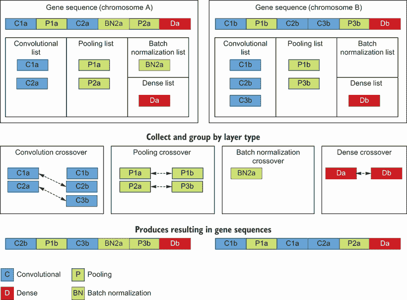

图 7.11 `crossover` 操作的可视化

执行这个自定义 `crossover` 操作的代码在我们的下一个笔记本中，但实质上，它是我们之前查看的最后一个笔记本的扩展。在审查此代码时，请记住，这只是执行 `crossover` 的一种选项，你可能还会考虑其他选项。重要的是在 `crossover` 操作后保持 `gene` 序列的正确格式。

在 Colab 中打开 EDL_7_3_Crossover_CNN.ipynb 笔记本。运行所有单元格（运行 > 运行所有），然后滚动到笔记本的底部附近。再次强调，这个笔记本只是基于我们之前的练习，我们在这里不需要回顾之前的代码。

滚动到标题为“自定义交叉算子”的单元格。这里有一些代码，所以我们将其分解成几个部分来审查，从下面的列表中的主要 `crossover` 函数开始。这个主要函数为每一组层调用 `swap_layers` 函数。

列表 7.12 EDL_7_3_Crossover_CNN.ipynb：自定义 `crossover` 函数

```
def crossover(ind1, ind2):                                            ❶
  ind1, ind2 = swap_layers(ind1, ind2, CONV_LAYER,                    ❷
  ➥ CONV_LAYER_LEN)                                                  ❷
  ind1, ind2 = swap_layers(ind1, ind2, POOLING_LAYER,                 ❷
  ➥ POOLING_LAYER_LEN)                                               ❷
  ind1, ind2 = swap_layers(ind1, ind2, BN_LAYER, BN_LAYER_LEN)        ❷
  ind1, ind2 = swap_layers(ind1, ind2, DENSE_LAYER, DENSE_LAYER_LEN)  ❷
  return ind1, ind2                                                   ❸
```

❶ 该函数接受两个个体作为输入。

❷ 交换各种层组。

❸ 返回两个新的后代。

`swap_layers`函数是每个层类型从序列中提取并随机交换的地方。我们首先通过类型从每个序列中获取层列表。`c1`和`c2`都是我们循环以确定交换点的索引列表。从这些列表中，我们随机抓取一个值来交换每个序列，然后使用`swap`函数执行交换，如下面的列表所示。

列表 7.13 EDL_7_3_Crossover_CNN.ipynb：交换层

```
def swap_layers(ind1, ind2, layer_type, layer_len):
  c1, c2 = get_layers(ind1, layer_type), 
  ➥ get_layers(ind2, layer_type)                          ❶
  min_c = min(len(c1), len(c2))                            ❷
  for i in range(min_c):
    if random.random() < 1:    
      i1 = random.randint(0, len(c1)-1)                    ❸
      i2 = random.randint(0, len(c2)-1)                    ❸
      iv1 = c1.pop(i1)
      iv2 = c2.pop(i2)    
      ind1, ind2 = swap(ind1, iv1, ind2, iv2, layer_len)   ❹
  return ind1, ind2 
```

❶ 获取每个序列中层的列表。

❷ 找到层列表的最小长度。

❸ 从每个层组中随机选择索引。

❹ 交换层。

`get_layers`函数是我们从每个`gene`序列中提取层索引的地方。这可以通过列表推导式简洁地完成，通过检查序列中的每个值并提取列表中匹配的位置，如下面的列表所示。

列表 7.14 EDL_7_3_Crossover_CNN.ipynb：查找层索引

```
def get_layers(ind, layer_type):               ❶
  return [a for a in range(len(ind)) if ind[a] 
  ➥ == layer_type]                            ❷
```

❶ 输入序列和要提取的层类型

❷ 返回序列中层类型的索引列表

我们在这里查看的最后一个函数是`swap`函数，如下面的列表所示，它负责交换每个`individual`的层块。`swap`通过从给定索引的序列中提取每个层块来工作。由于层类型总是相同长度，简单的索引替换是合适的。记住，如果我们的层块长度可变，我们就必须开发一个更高级的解决方案。

列表 7.15 EDL_7_3_Crossover_CNN.ipynb：`swap`函数

```
def swap(ind1, iv1, ind2, iv2, ll):
  ch1 = ind1[iv1:iv1+ll]             ❶
  ch2 = ind2[iv2:iv2+ll]             ❶
  print(ll, iv1, ch1, iv2, ch2)      ❷
  ind1[iv1:iv1+ll] = ch2             ❸
  ind2[iv2:iv2+ll] = ch1             ❸
  return ind1, ind2  
```

❶ 从序列中提取块

❷ 打印层交换的输出

❸ 交换块序列

图 7.12 显示了在两个初始后代上执行`crossover`函数的结果。注意从图中我们是如何交换三个卷积层、一个池化层、一个批量归一化层和一个密集层组的。结果输出序列显示在图 7.12 中。

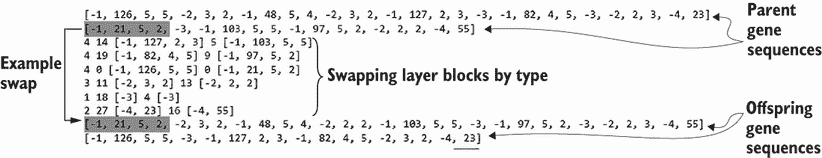

图 7.12 检查`crossover`输出

笔记本的其余部分构建、编译和训练生成的`individuals`，并输出结果。务必查看最后几个单元格，以确认`crossover`操作没有破坏`gene`序列格式。现在我们有了用于交配和产生后代的`crossover`操作，我们可以继续开发最后一个操作：`mutation`。

## 7.4 开发定制的突变算子

再次强调，DEAP 中可用的标准`mutation`算子对我们定制的`gene`序列没有用。因此，我们需要开发一个定制的`mutation`算子来模拟我们希望应用于`gene`序列的`mutations`类型。在本项目的目的上，我们保持`mutation`相对简单，仅改变当前层块。在更高级的应用中，`mutation`可以添加或删除新的层块，但这留给你来实现。

在 Colab 中打开笔记本 EDL_7_4_Mutation_CNN.ipynb。运行所有单元格（运行 > 运行所有）。滚动到笔记本底部附近的标题为“自定义变异算子”的部分。

我们首先检查主要的`变异`函数，如下所示列表。函数开始时检查`个体`是否为空。如果不为空，我们继续使用`mutate_layers`函数对每个层组进行变异。最后，我们按照 DEAP 的约定返回结果。

列表 7.16 EDL_7_4_Mutation_CNN.ipynb：自定义`变异`算子

```
def mutation(ind):  
  if len(ind) > CONV_LAYER_LEN:             ❶
    ind = mutate_layers(ind, CONV_LAYER,    ❷
    ➥ CONV_LAYER_LEN)                      ❷
    ind = mutate_layers(ind, DENSE_LAYER,   ❷
    ➥ DENSE_LAYER_LEN)                     ❷
    ind = mutate_layers(ind, POOLING_LAYER, ❷
    ➥ POOLING_LAYER_LEN)                   ❷
  return ind,                               ❸
```

❶ 仅变异卷积网络。

❷ 按类型变异层。

❸ 按 DEAP 约定返回元组。

`mutate_layers`函数遍历特定类型的层组，并仅变异相应的超参数。首先，使用`get_layers`提取给定类型的层组索引，如上一节所示。然后，在`try`/`except`块中，我们通过调用`mutate`函数来替换给定的索引层块，如下所示列表。

列表 7.17 EDL_7_4_Mutation_CNN.ipynb：`mutate_layers`函数

```
def mutate_layers(ind, layer_type, layer_len):
  layers = get_layers(ind1, layer_type)                ❶
  for layer in layers:                                 ❷
    if random.random() < 1:
      try:
        ind[layer:layer+layer_len] = mutate(
            ind[layer:layer+layer_len], layer_type)    ❸
      except:
        print(layers)                                  ❹
  return ind        
```

❶ 使用 get_layers 提取按类型的层索引。

❷ 遍历索引。

❸ 调用变异函数以替换层块。

❹ 打印出导致错误的层。

`mutate`函数是所有工作发生的地方。我们首先检查提取的部分具有正确的长度，如列表 7.18 所示。这样做是为了防止任何可能发生的格式化损坏问题，这些问题可能发生在`个体`上。接下来，根据层类型，我们可能会改变滤波器/神经元和核的大小。注意我们如何将核的大小限制在原始的最小/最大范围内，但将滤波器/神经元的数量留出增长或缩小的空间。在此阶段，我们还检查`个体基因`序列是否有任何损坏的块——这些块不匹配所需的长度。如果我们发现在`变异`过程中`基因`序列是损坏的，那么我们将抛出一个异常。这个异常将在`变异`函数中被捕获。

列表 7.18 EDL_7_4_Mutation_CNN.ipynb：`变异`函数

```
def mutate(part, layer_type):
  if layer_type == CONV_LAYER and len(part)==CONV_LAYER_LEN:           ❶
    part[1] = int(part[1] * random.uniform(.9, 1.1))                   ❷
    part[2] = random.randint(min_kernel, max_kernel)                   ❸
    part[3] = random.randint(min_kernel, max_kernel)                   ❸
  elif layer_type == POOLING_LAYER and len(part)==POOLING_LAYER_LEN:   ❶
    part[1] = random.randint(min_kernel, max_kernel)                   ❸
    part[2] = random.randint(min_kernel, max_kernel)                   ❸
  elif layer_type == DENSE_LAYER and len(part)==DENSE_LAYER_LEN:       ❶
    part[1] = int(part[1] * random.uniform(.9, 1.1))                   ❷
  else:
    error = f"mutate ERROR {part}"                                     ❹
    raise Exception(error) 
  return part        
```

❶ 检查层类型和部分是否具有适当的长度。

❷ 对滤波器/神经元应用随机增加/减少。

❸ 随机更改核大小。

❹ 如果格式损坏，则抛出错误。

图 7.13 显示了在`个体`基因序列上运行`变异`函数/算子的结果。注意定义层组数量、神经元/滤波器或核大小的超参数是唯一被修改的东西。当你运行笔记本时，你可能会看到不同的结果，但你应该仍然观察到图 7.13 中突出显示的变化。

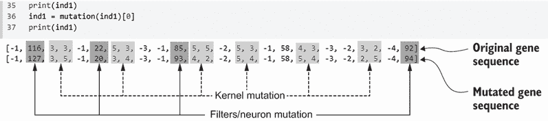

图 7.13 应用`变异`算子的示例

再次，笔记本的其余部分构建、编译和训练 `突变基因` 序列，以确认我们仍然可以生成有效的 Keras 模型。请运行几次 `突变` 代码块以确认输出的 `基因` 序列是有效的。通过构建用于处理 `交叉` 和 `突变` 操作的自定义算子，我们现在可以继续在下一节应用进化。

使用 Keras 的优势

Keras 模型编译稳健且宽容，这在可能随机构建的一些模型存在问题且无法产生良好结果时很有用。相比之下，像 PyTorch 这样的框架宽容度要小得多，可能会对几个构建问题进行抱怨，产生阻塞错误。使用 Keras，我们可以通过最小的错误处理来避免问题，因为大多数模型都会运行；然而，它们可能运行不佳。如果我们将这种相同的进化应用于 PyTorch，我们可能会遇到更多由于次要问题而产生的构建问题，从而产生较少的幸存后代。相反，Keras 会产生更多可行的后代，这些后代可以发展成为更合适的解决方案。这并不一定意味着 PyTorch 作为深度学习框架缺乏功能；相反，它更多地指向了这两个框架的僵化性。

## 7.5 进化卷积网络架构

进化卷积网络架构现在只是添加 DEAP 以使用遗传算法的问题。本节中我们涵盖的大部分内容是前几章的复习，但它应该有助于理解自定义算子是如何工作的。在本节中，我们继续使用之前的笔记本，并扩展它们以执行进化架构搜索。

在 Colab 中打开 EDL_7_5_Evo_CNN.ipynb 笔记本。请运行所有单元格（运行 > 运行所有）。注意，在这个笔记本的顶部，我们使用 pip 安装 DEAP 并导入我们在前几章中使用的标准模块。

向下滚动到名为进化 CNN 的部分，检查 DEAP `toolbox` 设置代码，如下所示。注意我们如何重用列表 7.8 中的 `create_offspring` 函数并将其注册到 `toolbox` 中，使用名称 `network`。这个函数负责创建新的第一代后代。然后，使用列表来保存 `individual` `基因` 序列。在这里使用列表的好处是，一组 `individuals` 的长度可以不同。

列表 7.19 EDL_7_5_Evo_CNN.ipynb：DEAP `toolbox` 设置

```
toolbox = base.Toolbox()
toolbox.register("network", create_offspring)       ❶
toolbox.register("individual", tools.initIterate, 
➥ creator.Individual, toolbox.network)             ❷
toolbox.register("population", tools.initRepeat, 
➥ list, toolbox.individual)                        ❸

toolbox.register("select", tools.selTournament, 
➥ tournsize=5)                                     ❹
```

❶ 添加名为 network 的自定义 create_offspring 函数。

❷ 注册新的网络初始化函数。

❸ 使用列表来包含种群中的个体。

❹ 使用标准的锦标赛选择算子。

向下滚动一点，查看如何注册我们之前创建的自定义 `交叉`（列表 7.12）和 `突变`（列表 7.16）函数，如下所示。

列表 7.20 EDL_7_5_Evo_CNN.ipynb：注册自定义函数

```
toolbox.register("mate", crossover)     ❶
toolbox.register("mutate", mutation)    ❷
```

❶ 注册自定义配对函数。

❷ 注册自定义突变函数。

下一个单元格，如列表 7.21 所示，包含构建、编译、训练和评估模型的代码。我们首先查看 `evaluate` 函数。该函数首先使用 `build_model` 函数（列表 7.11）构建模型，然后使用新的函数 `compile_train` 编译和训练模型。之后，它将 `1/准确度` 钳位到几乎 0 到 1 之间。我们这样做是因为我们想要通过 `1/准确度` 最小化 `适应性`。请注意，我们将代码包裹在 `try`/`except` 中，以确保如果发生任何错误，我们可以优雅地恢复。我们的代码仍然有可能构建无意义的模型，这是防止失败的一种方法。如果代码确实失败，我们返回 `1/.5` 或 50% 的准确度——而不是 0 或接近 0。通过这样做，我们允许这些失败保留在 `种群` 中，并希望它们以后能够 `变异` 成更好的东西。

列表 7.21 EDL_7_5_Evo_CNN.ipynb：`evaluate` 函数

```
def evaluate(individual):  
  try:
    model = build_model(individual)          ❶
    model = compile_train(model)             ❷
    print('.', end='')    
    return 1/clamp(model.evaluate(x_test, 
    ➥ y_test, verbose=0)[1], .00001, 1),    ❸
  except:
    return 1/.5,                             ❹

toolbox.register("evaluate", evaluate)       ❺
```

❶ 构建模型。

❷ 编译和训练模型。

❸ 返回 1/准确度钳位。

❹ 如果出现失败，返回基本准确度。

❺ 注册该函数。

适者生存

通过允许失败的 `个体` 一些基本的 `适应性`，我们鼓励这些 `基因` 序列可能仍然保留在 `种群` 池中。在自然界中，具有严重 `变异` 的 `个体` 几乎肯定会迅速失败。像人类这样的合作物种，在照顾有潜力的较弱 `个体` 方面做得更好。这，无疑是人类婴儿可以如此虚弱和脆弱地出生，但仍然能够成长和生存，成为贡献者的原因。

`compile_train` 函数与我们早期的训练代码非常相似，但以下列表中快速看一下是值得的。这里没有太多不同，但请注意，我们为了简洁起见将训练固定在 3 个周期。再次提醒，你可能想要改变这一点，看看它对结果有什么影响。

列表 7.22 EDL_7_5_Evo_CNN.ipynb：`compile` 和 `train` 函数

```
def compile_train(model):
  model.compile(optimizer='adam',
              loss=tf.keras.losses.SparseCategoricalCrossentropy(from_logits=True),
              metrics=['accuracy'])       ❶
  model.fit(x_train, y_train, epochs=3,   ❷
                    verbose=0)
  return model         
```

❶ 为准确度进行训练。

❷ 在 3 个周期内拟合模型。

滚动到我们在前几章中审查的进化设置代码，并查看在 5 个 `代` 中进化 `种群` 的输出，如图 7.14 所示。由于我们的 `基因` 序列相对较小，我们通常可以期望快速收敛。你的结果可能会有所不同，但在大多数情况下，你的准确度应该在大约 0.81，或 81% 左右达到最大值。尝试增加 `种群` 的大小或 `代` 的数量，看看这会产生什么影响。

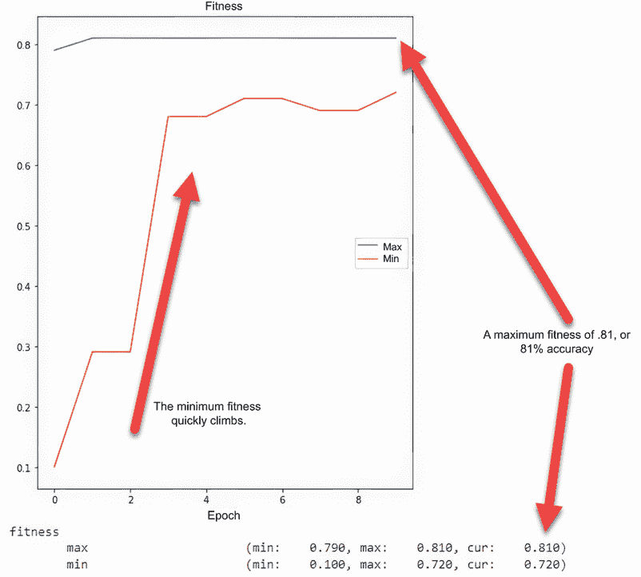

图 7.14 在 5 个 `代` 中进化 `种群` 的结果

进化完成后，我们构建、编译和训练最佳 `个体`，以查看图 7.15 中的结果。我们仍然在 3 个周期后看到发散，这表明如果我们想要一个更持久的模型，我们可能需要增加进化中的训练周期。这很容易实现，但它会显著增加进化时间。

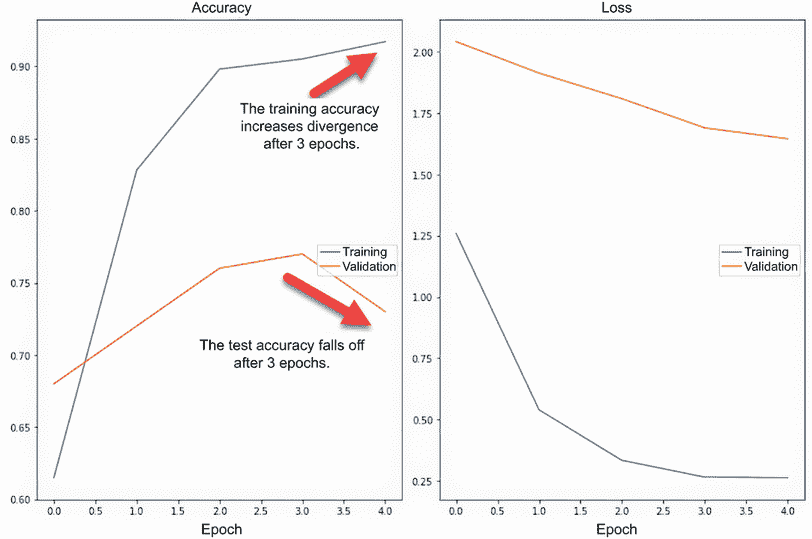

图 7.15 评估进化后最佳`个体`的结果

最后，我们可以查看图 7.16 中进化模型架构的摘要。您的结果可能会有所不同，但您应该会看到与图中显示的类似层结构。实际上，如果您之前已经使用过 Fashion-MNIST 数据集，这可能是您已经见过的架构。

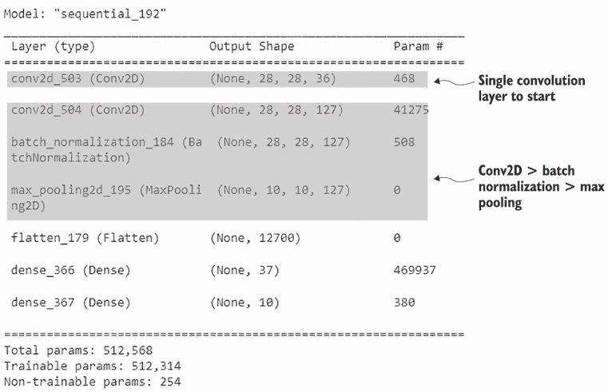

图 7.16 从进化产生的模型摘要结果

当然，您可以根据需要修改这个笔记本，并添加我们在本章中讨论的几个自定义功能。以下是对您可能想要对此笔记本进行的修改的总结：

+   *数据集大小*——我们将原始数据集的大小大幅减少以减少运行时间。预期如果您增加数据集大小，您也会看到模拟运行时间的增加。

+   *训练轮数*——在我们早期的评估中，我们决定使用 3 轮作为我们的训练限制。根据您的数据，您可能想要增加或减少这个值。

+   *层类型*——在这个简单的演示中，我们坚持使用标准层类型，如卷积、池化、批量归一化和密集层。您可能想要添加不同的层类型，如 dropout，以及/或者增加密集层或其他变体的数量。

+   *交叉/变异*——我们为配对和`变异`构建的自定义算子只是其中一种实现方式。正如之前提到的，在构建`变异`函数时，有很多空间进行进一步定制，也许可以通过让`变异`添加或删除层块来实现。

+   *适应度/评估函数*——我们基于直接的准确率分数来评估`个体`的`适应度`。如果我们想最小化可训练参数或层的数量，我们可以在`evaluate`函数中添加相应的逻辑。

### 7.5.1 学习练习

使用以下练习来提高您对 EvoCNN 的理解：

1.  修改数据集的大小或类型。探索不同的数据集，注意进化后的 CNN 模型之间的差异。

1.  在`gene`序列中添加一个新的`Dropout`层类型。这可能需要一些工作，但可能为增强 CNN 模型构建提供一个基础。

1.  考虑如何将其他形式的进化应用于从超参数优化到神经进化权重/参数。

随着自动机器学习模型进化优化概念的发展，我们有望期待框架为我们打包所有这些功能。然而，执行这种强大优化的代码量并不难产生，正如您在本章中看到的。最终，即使出现一个全面的框架，您可能也需要自定义像`mate`和`crossover`这样的函数。

## 概述

+   卷积神经网络是深度学习模型的层扩展，提供了局部特征提取：

    +   通常用于 2D 图像处理，CNN 在增强分类或其他任务方面可以非常成功。

    +   由于超参数、配置和放置的数量，CNN 层对于各种图像识别任务来说设置和定义都很复杂。

+   *神经进化*是描述深度学习优化进化方法的另一个术语，特别是那些与架构和参数优化相关的：

    +   可以使用遗传算法和 DEAP 来优化深度学习网络的 CNN 架构。

    +   CNN 层的复杂架构包括可以编码在定制遗传序列中的层的类型、大小和位置。

    +   这种遗传编码考虑了各种 CNN 层的数量、核大小、步长、归一化和激活函数。

+   需要开发定制的`交叉`（配对）和`变异`遗传算子来支持定制的遗传编码结构。

+   使用遗传算法进化一个`种群`的`个体`，以优化特定数据集上的 CNN 模型架构。

+   EvoCNN 定制的编码架构对模型中使用的层数有限制。然而，使用神经进化可以快速协助完成定义复杂 CNN 架构的复杂任务。
