# 8 进化自编码器

本章涵盖

+   介绍卷积自编码器

+   讨论卷积自编码器网络中的遗传编码

+   应用变异和交配来开发进化自编码器

+   构建和进化自编码器架构

+   介绍卷积变分自编码器

在上一章中，我们介绍了如何使用进化算法来调整卷积神经网络（CNN）架构。我们使用遗传算法来编码定义 CNN 模型的`基因`序列，用于图像分类。结果是成功构建了更优化的网络，用于图像识别任务。

在本章中，我们继续扩展基础知识并探索进化的自编码器（AE）。我们从上一章构建进化的 CNN 架构的经验中汲取了一些经验，并将其应用于卷积自编码器。然后，我们转向更高级的变分自编码器，并探索进化模型损失的新方法。

自编码器是深度学习的基础，它引入了无监督和代表性学习。很可能，如果你花了一些时间研究深度学习，你一定遇到过自编码器和变分自编码器。从进化深度学习的角度来看，它们引入了一些我们在本章中探索的新应用。

自编码器有多种变体，从不完全或标准到深度和卷积。深度卷积自编码器是一个很好的起点，因为它扩展了前几章中的许多想法，这也是我们本章的起点。

## 8.1 卷积自编码器

在本节中，我们探索并回顾了一个用 Keras 编写的卷积自编码器。这是我们在本章后面构建进化型或 evo 自编码器时使用的相同代码。对于新接触自编码器的人来说，下一节回顾了训练、构建和重新训练的主要原则。

### 8.1.1 介绍自编码器

自编码器通常用于介绍无监督和代表性学习的概念。*无监督学习*是使用无标签训练模型的过程。*代表性学习*是指我们训练模型来理解输入特征之间的差异。

图 8.1 显示了一个简单的由卷积、`MaxPool`和`UpSampling`层组成的卷积自编码器。除了添加卷积之外，这种模型架构对于自编码器来说是标准的。

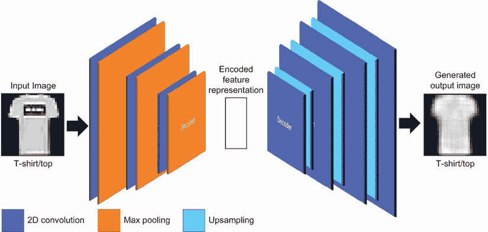

图 8.1 卷积自编码器

自编码器通过将输入通过称为*潜在*或*特征表示视图*的狭窄通道——中间部分——来工作。这个中间部分也被称为图像的*潜在*或*隐藏编码*。

通过将图像迭代地输入编码器并测量输出差异来学习图像的潜在编码。通常，我们使用均方误差或输入和输出图像的像素级损失来测量这个差异或损失。通过迭代，中间部分学会封装输入图像的特征。

图 8.2 展示了在 MNIST 手写数字数据集上训练的 AE 学习到的编码的示例。在图中，编码/潜在空间通过 *t*-分布随机邻域嵌入 (*t*-SNE) 转换为二维。通过可视化这个图表，你可以清楚地看到模型是如何学习区分不同数字类别的。


图 8.2 展示了 AE 潜在空间的一个映射，显示了类别的聚类

AE 使用无监督学习进行训练，这意味着模型中输入的数据无需标记。本质上，模型通过比较输入和生成的输出如何表示编码特征的好坏来通过自我训练进行学习。这简化了模型的训练，同时，也创建了一个强大的特征编码提取器。

*表示学习*，或可能也被称为 *生成式深度学习*，是一个相对较新的领域。我们将在下一章中详细探讨 GDL，但现在，让我们回到代码中，看看 AE 是如何工作的。

### 8.1.2 构建卷积自编码器

我们在下一个笔记本中查看的 AE 集成了卷积层，以更好地从图像中提取特征。将卷积应用于 AE 模型会在网络架构中引入额外的复杂性。在未来的章节中，这个例子还将展示如何应用进化来优化这些网络的优势。

在 Colab 中打开 EDL_8_1_Autoencoders.ipynb 笔记本。如需回顾在 Colab 中打开笔记本的方法，请参阅附录。

滚动页面，然后选择“阶段 1：AE 细胞”。从菜单中选择“运行前”。这将运行笔记本，加载数据并显示如图 8.3 所示的示例图表。过去几章中已经涵盖了几个代码部分，这里将不再进行回顾。


图 8.3 Fashion-MNIST 标准训练数据集

接下来，我们将来到第一个感兴趣的代码块，如图表 8.1 所示：构建 AE。第一层设置是输入层，由图像形状（28×28 和 1 个通道）定义。接下来，添加了一个使用 3×3 核大小的 64 个滤波器的卷积层。然后，在每个 CNN 层之后，一个 `MaxPool` 层将输入减少/聚合到下一层。最后添加的层是一个 `MaxPool` 层，它代表了输入的潜在或隐藏视图。

列表 8.1 EDL_8_1_AE.ipynb：编码器

```
input_layer = Input(shape=(28, 28, 1))                 ❶

encoded_layer1 = layers.Conv2D(64, (3, 3), 
➥ activation=’relu’, padding=’same’)(input_layer)     ❷
encoded_layer1 = layers.MaxPool2D( (2, 2), 
➥ padding=’same’)(encoded_layer1)   
encoded_layer2 = layers.Conv2D(32, (3, 3), 
➥ activation=’relu’, padding=’same’)(encoded_layer1)  ❷
encoded_layer2 = layers.MaxPool2D( (2, 2), 
➥ padding='same')(encoded_layer2)    
encoded_layer3 = layers.Conv2D(16, (3, 3), 
➥ activation='relu', padding='same')(encoded_layer2)  ❷
latent_view    = layers.MaxPool2D( (2, 2), 
➥ padding='same')(encoded_layer3)                     ❸
```

❶ 定义输入层

❷ 2D 卷积层

❸ 最大池化层

现在我们已经构建了编码器模型以输出潜在或编码视图，我们需要使用进一步的卷积层和称为`UpSampling`的特殊层来重建图像。`UpSampling`层可以被认为是`pooling`层的相反。它们的效果是将编码器生成的潜在视图转换回完整图像。这是通过连续卷积输入和`UpSampling`到连续层来完成的。在这个输出链的末尾，我们添加一个最终的 CNN 层，将卷积输出转换为单个通道。如果我们使用彩色图像，我们将输出转换为三个通道，如下面的列表所示。

列表 8.2 EDL_8_1_AE.ipynb：解码器

```
decoded_layer1 = layers.Conv2D(16, (3, 3), activation='relu', 
➥ padding='same')(latent_view)                                               ❶
decoded_layer1 = layers.UpSampling2D((2, 2))
➥ (decoded_layer1)                                                           ❷
decoded_layer2 = layers.Conv2D(32, (3, 3), 
➥ activation='relu', padding='same')(decoded_layer1)                         ❶
decoded_layer2 = layers.UpSampling2D((2, 2))
➥ (decoded_layer2)                                                           ❷
decoded_layer3 = layers.Conv2D(64, (3, 3), activation='relu')(decoded_layer2) ❶
decoded_layer3 = layers.UpSampling2D((2, 2))
➥ (decoded_layer3)                                                           ❷

output_layer   = layers.Conv2D(1, (3, 3), 
➥ padding='same')(decoded_layer3)                                            ❸
```

❶ 2D 卷积层

❷ 2D 上采样层

❸ 输出到 1 个通道的最终 CNN 层

我们通过将相应的输入和输出层输入到 Keras 模型中来组合模型。然后，我们使用 Adam 优化器和 MSE 损失函数来编译模型。之后，我们绘制模型摘要并使用`plot_model`输出完成的模型的美观视觉，如下面的列表所示。

列表 8.3 EDL_8_1_AE.ipynb：构建模型

```
model = Model(input_layer, output_layer)      ❶
model.compile(optimizer='adam', loss='mse')   ❷
model.summary()                               ❸
plot_model(model)                             ❹
```

❶ 从输入和输出层构建

❷ 使用 Adam 和 MSE 编译

❸ 输出模型摘要

❹ 生成模型的图表

运行构建编码器和解码器以及构建模型的单元格。图 8.4 显示了构建模型的摘要输出。通过查看每个连续层，你可以可视化模型如何在潜在编码中缩小输入空间，然后重建它。重要的是要注意各个 CNN 层的大小以及它们如何减少然后增加大小。

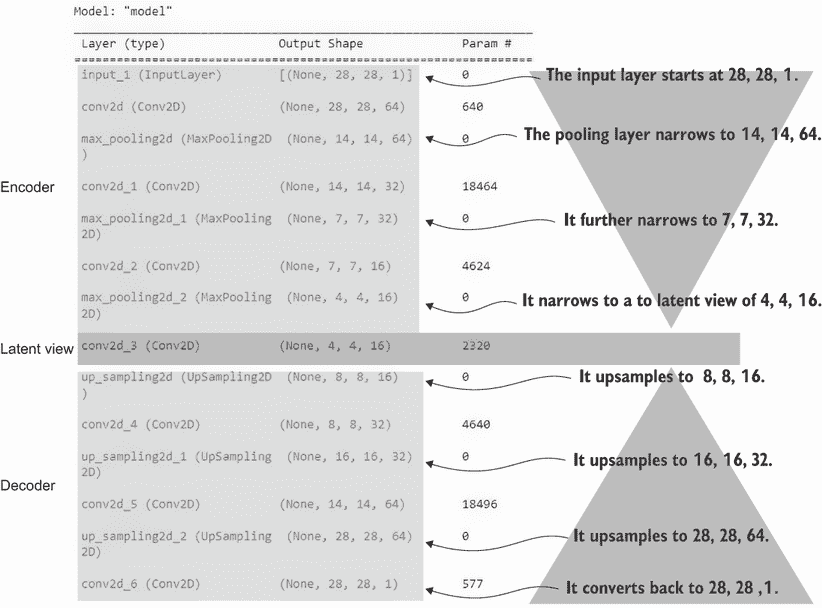

图 8.4 自动编码器模型摘要解释

接下来的几个单元格设置了训练模型的输出代码。请运行这些单元格，包括训练代码。由于之前已经审查过这段代码，这里我们不再重复，除了查看图 8.5 所示的 10 个训练周期后的示例输出。

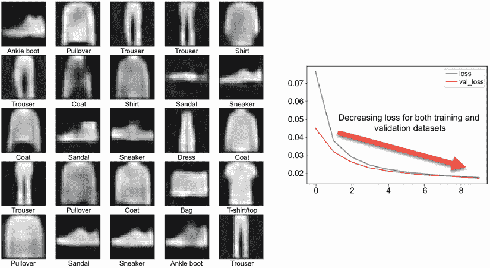

图 8.5 训练自动编码器示例单元格输出

随着模型的训练，输出，如图 8.5 所示，从模糊表示变为清晰特征。自动编码器可能需要大量的训练，这个简单的例子可能永远无法准确描绘更细粒度的特征。然而，它确实有效地区分了各种类别。一个衡量模型训练效果的良好指标是将凉鞋类图像与原始图像或运动鞋进行比较。

### 8.1.3 学习练习

使用以下练习来提高你对自动编码器（AE）的理解：

1.  尝试使用不同的数据集，例如 MNIST 手写数字数据集。

1.  修改模型超参数，如学习率和批量大小，以查看这对训练有何影响。

1.  从编码器和解码器中添加或删除卷积层。确保保持自动编码器的两边平衡。

虽然这个简单的自动编码器工作得相当不错，但我们希望提高模型泛化学习表示的能力。在下一节中，我们将添加泛化特征，如 dropout 和批归一化层。

### 8.1.4 泛化卷积自动编码器

在第七章中，我们深入探讨了卷积层如何通过提取特征来工作。我们还了解到，CNN 模型在识别特征方面可能做得**太好**。为了补偿这一点，我们通常会添加一个名为`Dropout`的层，这有助于泛化特征提取。

图 8.6 展示了 dropout 层如何通过在每个训练迭代中随机禁用网络节点来工作，而不是在每个 epoch 中。通过每个训练迭代禁用随机神经元导致模型更好地泛化并减少记忆化。这导致训练损失和验证损失保持一致。

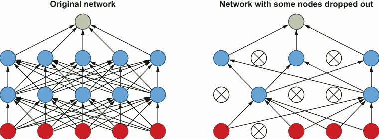

图 8.6 `Dropout`的演示

消失和爆炸梯度是训练 CNN 时，特别是在具有多层网络的 CNN 中起作用的另一个因素。这是因为网络中的权重/参数可能需要变得非常大或非常小，因为输入通过多个层。为了补偿这一点，我们在层之间引入一个称为`BatchNormalization`的正则化步骤。

图 8.7 展示了如何在卷积特征图上计算`BatchNormalization`。在图中，为每个特征图计算均值和方差，并使用这些值来正则化特征图的值，作为下一层的输入。这导致数据保持在约 0 的位置，也显著减少了消失或爆炸梯度的问题。

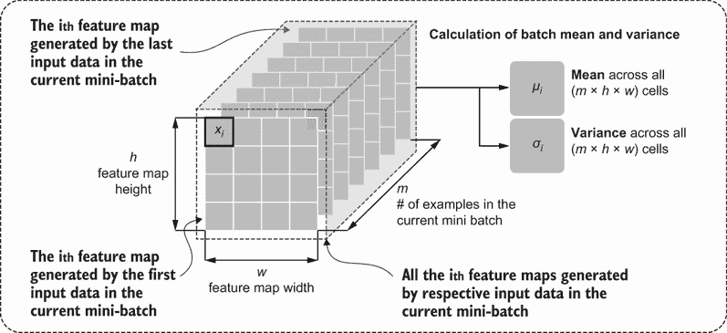

图 8.7 `BatchNormalization`过程

正则化使用以下方程进行。每个输入值都从平均值中减去，然后除以方差的平方根，即标准差*σ*。

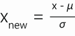

现在我们已经了解了如何创建更通用的模型并避免爆炸和消失梯度，我们可以继续将这些特性集成到自动编码器中。

### 8.1.5 改进自动编码器

通过添加`BatchNormalization`和`Dropout`层，我们可以改进之前查看的简单自动编码器。我们继续使用相同的笔记本，但现在在以下说明中查看添加这些新层类型。

在 Colab 中重新打开 EDL_8_1_Autoencoder.ipynb 笔记本。如有需要，请参考附录。通过菜单中的运行 > 运行所有来运行笔记本中的所有单元格。向下滚动到以改进自动编码器开始的章节。

我们首先查看列表 8.4 中模型的更新编码器部分。大部分代码与上次我们查看的代码相同，但请注意包括了批量归一化和 dropout 层。传递给 dropout 层的参数是每个训练迭代中将被禁用的神经元数量或百分比。

列表 8.4 EDL_8_1_AE.ipynb：改进的编码器

```
inputs = layers.Input(shape=(28, 28 ,1))

x = layers.Conv2D(32, 3, activation='relu', padding='same')(inputs)
x = layers.BatchNormalization()(x)    ❶
x = layers.MaxPool2D()(x)
x = layers.Dropout(0.5)(x)            ❷
x = layers.BatchNormalization()(x)    ❶
x = layers.MaxPool2D()(x)
x = layers.Dropout(0.5)(x)            ❷
x = layers.Conv2D(64, 3, activation='relu', padding='same')(x)
x = layers.BatchNormalization()(x)    ❶
encoded = layers.MaxPool2D()(x)
```

❶ BatchNormalization 层

❷ Dropout 层

在此之后，我们当然会查看改进的解码器部分，如下所示。同样，唯一的区别是在解码器部分包括了`BatchNormalization`和`Dropout`层。

列表 8.5 EDL_8_1_AE.ipynb：改进的解码器

```
x = layers.Conv2DTranspose(64, 3,activation='relu',strides=(2,2))(encoded)
x = layers.BatchNormalization()(x)                                         ❶
x = layers.Dropout(0.5)(x)                                                 ❷
x = layers.Conv2DTranspose(32, 3, activation='relu',strides=(2,2), 
➥ padding='same')(x)
x = layers.BatchNormalization()(x)                                         ❶
x = layers.Dropout(0.5)(x)                                                 ❷
x = layers.Conv2DTranspose(32, 3, padding='same')(x)
x = layers.LeakyReLU()(x)
x = layers.BatchNormalization()(x)                                         ❶
decoded = layers.Conv2DTranspose(1, 3, activation='sigmoid',strides=(2,2), 
➥ padding='same')(x)
```

❶ BatchNormalization 层

❷ Dropout 层

图 8.8 显示了在 10 个 epoch 上训练这个“改进”模型的输出。如果你将这个图与图 8.5 进行比较，你可以清楚地看到这些“改进”并不像原始模型那样有效。

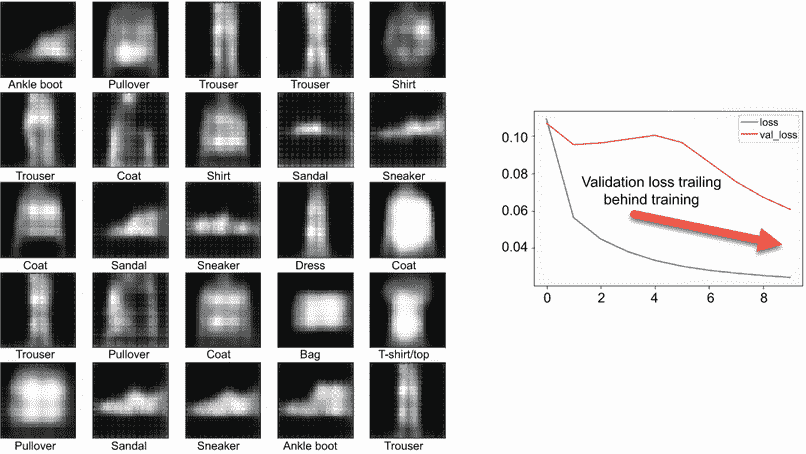

图 8.8 训练改进的 AE 示例单元格输出

因此，如果这些层类型是关于提高模型性能的，为什么我们会得到如此糟糕的结果呢？在这个情况下，答案是简单的：我们过度使用了`BatchNormalization`和`Dropout`的功能。这通常意味着我们需要手动调整网络架构以提高模型性能。相反，我们来看看如何使用 EC 优化 AE 模型开发。

## 8.2 进化 AE 优化

我们已经看到如何使用名为 EvoCNN 的 GAs 自动优化 CNN 模型。在接下来的教程中，我们采取与之前相同的方法，但引入了 AE 的附加复杂性。这意味着我们的模型架构需要遵循更严格的指南。

### 8.2.1 构建 AE 基因序列

构建 GA AE 优化器的第一步是构建一个模式，将架构编码成一个`基因`序列。我们基于之前的例子，但这次引入了 AE 的约束。同样，这个模型也通过允许添加`BatchNormalization`和`Dropout`来改进了 EvoCNN 项目。

在 Colab 中打开 EDL_8_2_Evo_Autoencoder_Encoding.ipynb 笔记本。如需说明，请参阅附录。通过运行 > 运行所有单元格来运行笔记本中的所有单元格。滚动到标题为“编码自动编码器”的部分。我们在第七章中回顾了以下大部分代码，所以这里我们只回顾要点。

首先查看`create_offspring`函数。如果您还记得，这是创建整个`基因`序列的主要函数，但这次版本有所不同。这次，函数被拆分为两个循环：一个用于编码部分，另一个用于解码部分。编码部分遍历层并随机检查是否应该添加另一个卷积层。如果添加了层，然后它将继续随机检查是否也应该添加 BN 和/或 dropout 层。注意在这个例子中，我们自动添加一个`MaxPool`层来考虑自动编码机的漏斗或减少架构。

解码器的第二个循环设置为与编码器架构相匹配。因此，它遍历与编码器相同的迭代次数。这次，它添加了卷积层代码来表示`UpSampling`和卷积层的组合。之后，应用一个机会检查来添加`BatchNormalization`和/或`Dropout`层，如下面的列表所示。

列表 8.6 EDL_8_2_Evo_AE_Encoding.ipynb：创建`基因`序列

```
def create_offspring():
  ind = []
  layers = 0
  for i in range(max_layers):
    if i==0:                                 ❶
      ind.extend(generate_conv_layer())      
      layers += 1
    elif random.uniform(0,1)<.5:             ❷
      ind.extend(generate_conv_layer())
      layers += 1
      if random.uniform(0,1)<.5:             ❸
        ind.extend(generate_bn_layer())
      if random.uniform(0,1) < .5:           ❹
        ind.extend(generate_dropout_layer()) 
  for i in range(layers):                    ❺
    ind.extend(generate_upconv_layer())
    if random.uniform(0,1)<.5:      
      ind.extend(generate_bn_layer())
    if random.uniform(0,1) < .5:
      ind.extend(generate_dropout_layer())
  return ind 
```

❶ 第一层总是卷积。

❷ 有机会添加另一个卷积层

❸ 有机会添加一个批归一化层

❹ 有机会添加一个 Dropout 层

❺ 遍历编码器层以创建解码器。

注意，我们改变了`基因`序列的编码模式，以考虑卷积/`MaxPool`层和`UpSampling`/卷积层。您可以在代码单元格中设置的标记中看到这个小的变化。现在，表示编码器卷积层的编码标记被定义为`CONV_LAYER`，解码器`UpSampling`或卷积层被定义为`UPCONV_LAYER`，如下面的列表所示。

列表 8.7 EDL_8_2_Evo_AE_Encoding.ipynb：`基因`序列标记

```
CONV_LAYER = -1         ❶
CONV_LAYER_LEN = 4
BN_LAYER = -3
BN_LAYER_LEN = 1
DROPOUT_LAYER = -4
DROPOUT_LAYER_LEN = 2
UPCONV_LAYER = -2       ❷
UPCONV_LAYER_LEN = 4 
```

❶ 编码器卷积/池化层

❷ 解码器 UpSampling/卷积层

同样，生成编码器层（`CONV_LAYER`）和解码器层（`UPCONV_LAYER`）的函数也简化了，如下面的列表所示。

列表 8.8 EDL_8_2_Evo_AE_Encoding.ipynb：生成层

```
def generate_conv_layer():         ❶
  part = [CONV_LAYER] 
  part.append(generate_neurons())
  part.extend(generate_kernel())  
  return part

def generate_upconv_layer():       ❷
  part = [UPCONV_LAYER] 
  part.append(generate_neurons())
  part.extend(generate_kernel())  
  return part  
```

❶ 编码器卷积/池化层

❷ 解码器 UpSampling/卷积

同样，添加 BN 和 dropout 层的函数也简化了，如下面的列表所示。

列表 8.9 EDL_8_2_Evo_AE_Encoding.ipynb：生成特殊层

```
def generate_bn_layer():        ❶
  part = [BN_LAYER] 
  return part

def generate_dropout_layer():   ❷
  part = [DROPOUT_LAYER] 
  part.append(random.uniform(0,.5))  
  return part  
```

❶ 生成 BN 层

❷ 生成 Dropout 层

接下来，我们通过解析`基因`序列来构建模型。这段代码相当长，所以我们将其拆分为相关部分，从列表 8.10 中的初始解析开始。我们首先遍历每个`基因`并检查它是否匹配层标记。如果匹配，我们将相应的层和选项添加到模型中。在编码器卷积层（`CONV_LAYER`）的情况下，如果输入形状大于`(7, 7)`，我们将添加一个`MaxPool`层。这确保我们的模型保持固定的潜在视图。

列表 8.10 EDL_8_2_Evo_AE_Encoding.ipynb：构建模型——解析

```
def build_model(individual):
  input_layer = Input(shape=(28, 28, 1))   ❶
  il = len(individual)
  i = 0
  x = input_layer
  while i < il:                            ❷
    if individual[i] == CONV_LAYER:        ❸
      pad="same" 
      n = individual[i+1]
      k = (individual[i+2], individual[i+3])
      i += CONV_LAYER_LEN        
      x = layers.Conv2D(n, k, activation='relu', padding=pad)(x) 
      if x.shape[1] > 7:                   ❹
        x = layers.MaxPool2D( (2, 2), padding='same')(x)  
```

❶ 输入层始终相同。

❷ 遍历基因

❸ 编码卷积层

❹ 如果形状大于 7, 7，则添加池化。

向下移动一点，我们可以通过检查标记来看到添加层的延续，如下面的列表所示。不过，这次对于 `UPCONV_LAYER` 解码器层，我们检查模型是否与输入大小相同。毕竟，我们不想生成的图像太大或太小。

列表 8.11 EDL_8_2_Evo_AE_Encoding.ipynb：构建模型——层

```
elif individual[i] == BN_LAYER:                    ❶
  x = layers.BatchNormalization()(x)
  i += BN_LAYER_LEN      
elif individual[i] == DROPOUT_LAYER:               ❷
  x = layers.Dropout(individual[i+1])(x) 
  i += DROPOUT_LAYER_LEN
elif individual[i] == UPCONV_LAYER:                ❸
  pad="same"
  n = individual[i+1]
  k = (individual[i+2], individual[i+3])        
  x = layers.Conv2D(n, k, activation='relu', padding=pad)(x)   
  x = layers.UpSampling2D((2, 2))(x)   
  i += CONV_LAYER_LEN   
  if x.shape[1] == (28):                           ❹
    break #model is complete
else:
  break   
```

❶ 添加 BN 层

❷ 添加 Dropout 层

❸ 添加解码器 UpSampling/卷积层

❹ 检查模型是否完整

函数通过构建模型、编译它并返回它来完成。但在做这些之前，我们通过检查最后一个解码器层的形状来确认模型不是太小，如下面的列表所示。如果输出太小，我们添加另一个 `UpSampling` 层，将大小从 `14, 14` 增加到 `28, 28`。

列表 8.12 EDL_8_2_Evo_AE_Encoding.ipynb：构建模型——编译

```
if x.shape[1] == 14:                         ❶
  x = layers.UpSampling2D((2, 2))(x)

output_layer = layers.Conv2D(1, (3, 3), 
➥ padding='same')(x)                        ❷
model = Model(input_layer, output_layer)     ❸
model.compile(optimizer='adam', loss='mse')
return model   
```

❶ 确保最终模型不是太小

❷ 转换回单通道

❸ 合并输入/输出层

为了测试 `build_model` 函数，下一个代码块，如列表 8.13 所示，创建了 100 个随机后代并评估了模型的大小。此代码生成随机的 `individual` `gene` 序列，然后从这些序列构建相应的模型。在这个过程中，代码跟踪生成的最小和最大模型。

列表 8.13 EDL_8_2_Evo_AE_Encoding.ipynb：评估 `build_model`

```
max_model = None
min_model = None
maxp = 0
minp = 10000000

for i in range(100):    
  individual = create_offspring()   ❶
  model = build_model(individual)   ❷
  p = model.count_params()          ❸
  if p > maxp:
    maxp = p
    max_model = model
  if p < minp:
    minp = p
    min_model = model 

max_model.summary()
min_model.summary()   
```

❶ 创建一个随机基因序列

❷ 从序列构建模型

❸ 计算模型参数

向下滚动进一步可以看到输出，如图 8.9 所总结。在图中，使用最小尺寸参数模型在 10 个周期内训练模型。

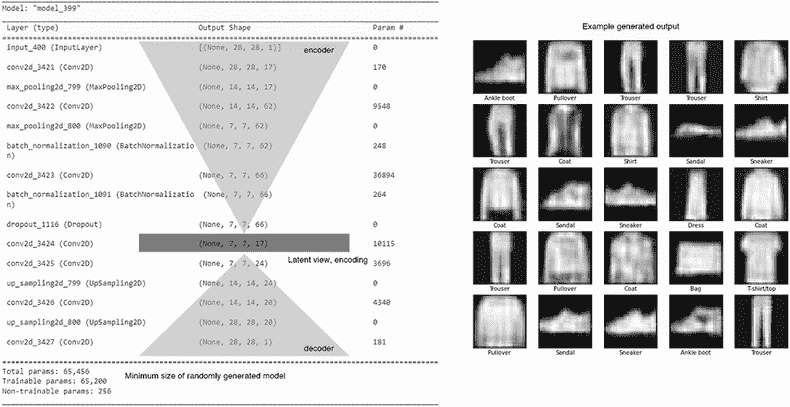

图 8.9 从随机生成的后代构建的最小尺寸模型的输出

这个使用 `create_offspring` 和 `build_model` 随机生成的模型似乎比我们上一个“改进”的 AE 更好，这是有希望的，因为它也是一个近似的最小尺寸模型。务必检查代码并测试最大尺寸模型的训练。记住，在这个例子中，样本大小只使用了 100 种变化。

### 8.2.2 学习练习

使用以下练习来提高你的理解：

1.  通过在循环中调用 `create_offspring` 创建 `individuals` 列表，然后打印并比较各种模型。

1.  将列表 8.6 中的基本概率从 0.5 改为另一个值。通过练习 1 看看这会对生成的模型产生什么影响。

现在我们有了一种创建`基因`序列的方法，反过来，可以使用它来构建 AE 模型。正如我们在第六章所学，我们的下一步是构建自定义的`配对`和`变异`这些`基因`序列的函数。这就是我们在下一节继续这个项目的地方。

## 8.3 自动编码器基因序列的配对和变异

正如我们在第七章的 EvoCNN 项目中做的那样，我们还需要创建自定义的`变异`和`配对`/`交叉`算子。这些自定义算子与我们之前使用的非常相似，所以我们再次只回顾一些亮点。在添加遗传算子后，我们测试了 EvoAE。

在 Colab 中打开 EDL_8_3_EvoAutoencoder.ipynb 笔记本。如需帮助，请参阅附录。向下滚动到创建配对/变异算子部分，然后选择下一个代码单元格。从菜单中选择运行 > 运行之前，以执行笔记本中的所有前一个单元格。请耐心等待，直到样本训练完成。

图 8.10 展示了`交叉`过程——这次使用的是代表 AE 架构的修改后的`基因`序列。请注意，编码器卷积层和解码器卷积层的数量始终相等。这是实现 AE 的漏斗效应所必需的。

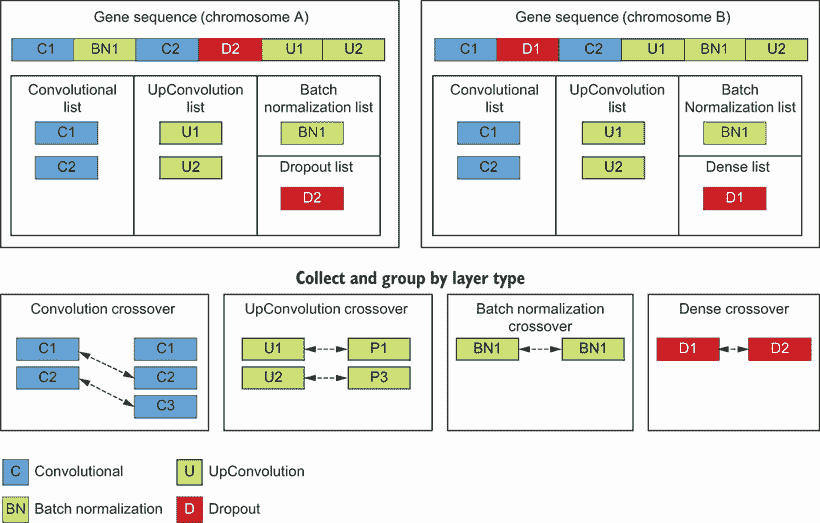

图 8.10 进化 AE `交叉`

幸运的是，第七章中编写的大多数`交叉`/`配对`代码都可以在我们的更新后的`基因`序列上运行，我们不需要在这里重新访问它。DEAP 在进化过程中调用`交叉`函数/算子，在进化过程中传入两个父`个体`。在这个函数内部，我们之前介绍过的`swap_layers`函数是工作的核心。如下面的列表所示，这个函数的唯一区别是我们想要支持的顶层结构的修改：`卷积`（编码器）、`上卷积`（解码器）、`批归一化`和`Dropout`。

列表 8.14 EDL_8_3_EvoAE.ipynb：执行`交叉`

```
def crossover(ind1, ind2):  
  ind1, ind2 = swap_layers(ind1, ind2, CONV_LAYER, 
  ➥ CONV_LAYER_LEN)                                  ❶
  ind1, ind2 = swap_layers(ind1, ind2, UPCONV_LAYER, 
  ➥ UPCONV_LAYER_LEN)                                ❷
  ind1, ind2 = swap_layers(ind1, ind2, BN_LAYER, 
  ➥ BN_LAYER_LEN)                                    ❸
  ind1, ind2 = swap_layers(ind1, ind2, DROPOUT_LAYER, 
  ➥ DROPOUT_LAYER_LEN)                               ❹
  return ind1, ind2    
```

❶ 交换编码器卷积层

❷ 交换解码器上卷积层

❸ 交换 BN

❹ 交换 Dropout

执行`变异`需要对架构中各种层类型的修改更加注意。我们首先查看主要的`变异`函数，该函数由 DEAP 进化调用并接受单个`个体`。此函数大量使用`mutate_layers`函数并将其应用于仅可修改的层。请注意，我们省略了 BN 层，因为它们不需要额外的参数，如下面的列表所示。

列表 8.15 EDL_8_3_EvoAE.ipynb：`变异`函数

```
def mutation(ind):    
  ind = mutate_layers(ind, CONV_LAYER, 
  ➥ CONV_LAYER_LEN)                        ❶
  ind = mutate_layers(ind, DROPOUT_LAYER, 
  ➥ DROPOUT_LAYER_LEN)                     ❷
  ind = mutate_layers(ind, UPCONV_LAYER, 
  ➥ UPCONV_LAYER_LEN)                      ❸
  return ind,    
```

❶ 变异编码器卷积层

❷ 变异 Dropout 层

❸ 变异解码器上卷积层

`mutate_layers` 函数突出了如何为 `mutation` 选择每一层。层按类型收集，并检查 `mutation` 的可能性。注意，目前，这种可能性总是 100%。如果选择了一层进行 `mutation`，则其序列将传递给 `mutate` 函数进行 `mutation`，如下所示。

列表 8.16 EDL_8_3_EvoAE.ipynb：`mutate_layers` 函数

```
def mutate_layers(ind, layer_type, layer_len):
  layers = get_layers(ind1, layer_type)               ❶
  for layer in layers:
    if random.random() < 1:                           ❷
      try:                                            ❸
        ind[layer:layer+layer_len] = mutate(          ❹
            ind[layer:layer+layer_len], layer_type) 
      except:                                         ❸
        print(layers)
  return ind        
```

❶ 获取类型为的层

❷ 检查随机突变

❸ 捕获异常

❹ 突变层

`mutate` 函数执行相应层类型的特定 `mutation`，如下所示。每种层类型都应用了与层类型相关的不同形式的 `mutation`。如果将未知层类型传递给 `mutate`，则会抛出错误，这意味着 `gene` 序列可能已损坏或中断。这，正如自然界一样，导致了一个不可行的后代，该后代将终止进一步执行。

列表 8.17 EDL_8_3_EvoAE.ipynb：`mutate` 函数

```
def mutate(part, layer_type):
  if layer_type == CONV_LAYER and 
  ➥ len(part)==CONV_LAYER_LEN:                       ❶
    part[1] = int(part[1] * random.uniform(.9, 1.1))
    part[2] = random.randint(min_kernel, max_kernel)
    part[3] = random.randint(min_kernel, max_kernel)
  elif layer_type == UPCONV_LAYER and 
  ➥ len(part)==UPCONV_LAYER_LEN:                     ❷
    part[1] = random.randint(min_kernel, max_kernel)
    part[2] = random.randint(min_kernel, max_kernel)
  elif layer_type == DROPOUT_LAYER and 
  ➥ len(part)==DROPOUT_LAYER_LEN:                    ❸
    part[1] = random.uniform(0, .5) 
  else:
    error = f"mutate ERROR {part}"                    ❹
    raise Exception(error) 
  return part        
```

❶ 突变编码器 CNN 层

❷ 突变解码器 CNN 层

❸ 突变 dropout 层

❹ 层代码不匹配，因此抛出错误。

在 `mating`/`mutation` 单元结束时，有代码用于通过创建新的后代并传递给 `crossover` 或 `mutation` 函数来测试相应的操作符。构建了 `mating`/`mutation` 操作符后，我们可以继续到下一节，进化 AE 架构。

## 8.4 生成自动编码器

现在，进化 AE 只是一个相对简单的过程，只需添加 DEAP。同样，这里的大部分代码与之前的示例相同。这意味着我们在这里只关注重点、变更和感兴趣的点。

在 Colab 中打开 EDL_8_4_EvoAutoencoder.ipynb 笔记本。通过菜单中的“运行”>“运行所有”来运行整个笔记本。这个笔记本运行可能需要很长时间，因此最好尽早开始。

自动编码器（AE）架构的进化可能需要相当长的时间。因此，我们使用之前介绍过的数据减少技巧，以使进化过程更加高效。参考数据加载单元，注意我们如何通过简单地从原始数据集中取切片来减少训练集和验证集的大小，如下所示。这只是为了演示代码的运行和操作方式。显然，如果目标是创建一个优化的模型，我们最好使用完整的数据集。

列表 8.18 EDL_8_4_EvoAE.ipynb：减少数据集大小

```
train_images = train_images[1000:]   ❶
test_images = test_images[100:]      ❷
```

❶ 减少训练大小

❷ 减少测试/验证大小

接下来，我们回顾所有基础 DEAP 设置代码，以创建用于执行架构优化的 GA 求解器，如列表 8.19 所示。我们将主要的 `fitness` 函数注册为 `FunctionMin`，因为我们的目标是最小化 `fitness`。然后，注册 `create_offspring` 函数以创建新的 `individuals`。最后，代码通过注册自定义的 `crossover` 和 `mutation` 函数来完成。

列表 8.19 EDL_8_4_EvoAE.ipynb：设置 DEAP

```
creator.create("FitnessMin", base.Fitness, weights=(-1.0,))
creator.create("Individual", list, 
➥ fitness=creator.FitnessMin)                    ❶

toolbox = base.Toolbox()
toolbox.register("AE", create_offspring)          ❷
toolbox.register("individual", tools.initIterate, creator.Individual, 
➥ toolbox.AE)
toolbox.register("population", tools.initRepeat, list, toolbox.individual)

toolbox.register("select", tools.selTournament, tournsize=5)

toolbox.register("mate", crossover)               ❸
toolbox.register("mutate", mutation)              ❹
```

❶ 注册目标函数和最小适应度

❷ 注册初始 AE 函数

❸ 注册自定义交叉

❹ 注册自定义变异

如列表 8.20 所示，下一个是`evaluate`函数。这是评估每个网络模型架构的地方。之前，我们注册了一个名为`fitness`的列表来保存所有评估的`fitness`。我们这样做是为了更好地跟踪最大观察到的`fitness`。在函数内部，我们首先调用`build_model`根据`个体``基因`序列创建模型。之后，我们调用`train`函数来训练模型并返回模型加`history`。从`history`函数中，我们提取最后一个验证历史值并将其视为模型的`fitness`。如果没有错误生成模型和训练，则返回`fitness`，夹在 0 和最大`fitness`之间。我们使用`np.nanman`函数来避免返回`nan`值。如果遇到错误，则返回最大观察到的`fitness`。

列表 8.20 EDL_8_4_EvoAE.ipynb：`evaluate`函数

```
fits = []                                        ❶

def evaluate(individual): 
  global fits
  try:
    model = build_model(individual)              ❷
    model, history = train(model)                ❸
    fitness = history.history["val_loss"]
    fits.append(fitness)
    print(".", end='')    
    return clamp(fitness, 0, np.nanmax(fits)),   ❹
  except:
    return np.nanmax(fits),                      ❺

toolbox.register("evaluate", evaluate)
```

❶ 用于跟踪适应度的全局变量

❷ 从基因序列构建模型

❸ 训练模型

❹ 返回夹紧的适应度值

❺ 如果出现错误，返回最大观察到的适应度。

图 8.11 显示了使用初始`种群`100 `个体`运行 3 `代`进化架构的结果。从这些初始结果中，你可以看到这提供了一种自我优化模型架构的有趣方法。


图 8.11 进化 AE 架构的结果

很可能你的结果会有所不同，这个样本在更大的初始`种群`下运行得更好，这再次表明运行起来可能很耗时。将图 8.11 与图 8.5 和图 8.8 进行比较。结果是否如你所预期的好或坏？

训练 AE 和其他 RL 网络可能很耗时，我们通常需要超过 3 个 epoch，就像上一个笔记本中那样。这个笔记本中的进化输出展示了从进化架构中产生的可能性。

### 8.4.1 学习练习

通过完成以下练习继续探索进化的 AE：

1.  在列表 8.18 中增加或减少训练样本的数量。

1.  更改目标数据集。一个好的选择是 MNIST 手写数字数据集。

1.  尝试调整学习率和批大小超参数，看看这对进化模型有什么影响。

为了总结本章，我们继续研究 AE，但有一些变化。不是直接将编码映射到解码，我们尝试在下一节中添加一个采样层来实现变分 AE。

## 8.5 构建变分自编码器

变分自动编码器（VAEs）是自动编码器（AEs）的扩展，通过理解采样损失中的学习表示差异来学习。在我们跳入下一章关于进化生成式深度学习之前，这是一个我们需要覆盖的重要概念。

对于下一个笔记本项目，我们将探讨构建一个变分自动编码器（VAE），以执行与之前笔记本相同的分析。深度学习（DL）的资深从业者可能对这种模式很熟悉，但为了以防万一，我们将在下一节进一步回顾。

### 8.5.1 变分自动编码器：回顾

在架构上，变分自动编码器（VAEs）几乎完全相同，除了中间编码层中的一个关键差异：在 VAE 中，中间层变成了一个采样层，该层学习表示编码输入并将这种学习到的表示转换回原始图像。通过学习输入的表示，VAE 能够根据这种理解生成新的输出。

图 8.12 展示了 VAE 与图 8.1 中所示的传统自动编码器架构的不同之处。我们可以看到，潜在编码向量被两个学习到的参数所取代：均值（*µ*）和方差（*σ*）。这些学习到的参数随后用于采样或生成一个新的潜在编码向量，称为*Z*，然后将其推入解码器。

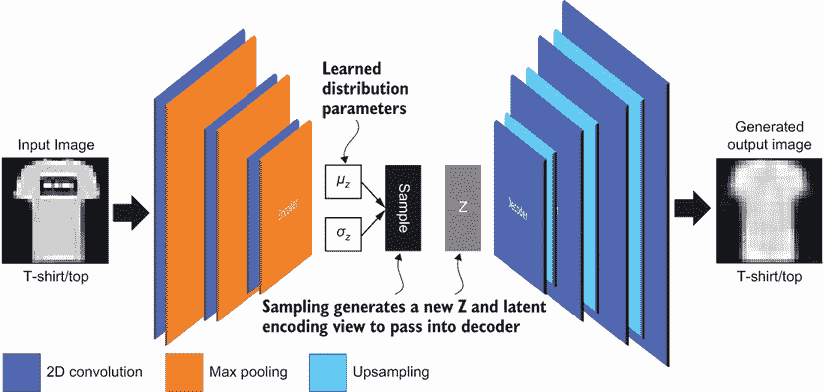

图 8.12 变分自动编码器

与在自动编码器（AE）中学习压缩和提取相关特征不同，VAE 通过训练网络输出输入的均值和方差来学习输入的表示方式。然后基于这种学习到的表示，采样层生成一个新的潜在编码向量，称为*Z*，并将其反馈到解码器中。

由于 VAE 在已知空间中学习表示，我们可以通过遍历模型学习到的均值和方差的范围来生成该空间中的值。图 8.13 通过遍历均值和方差的范围来演示 VAE 的结果，从而输出模型正在学习的内容。现在我们已经对 VAE 有了概述，我们可以在下一节继续构建它。

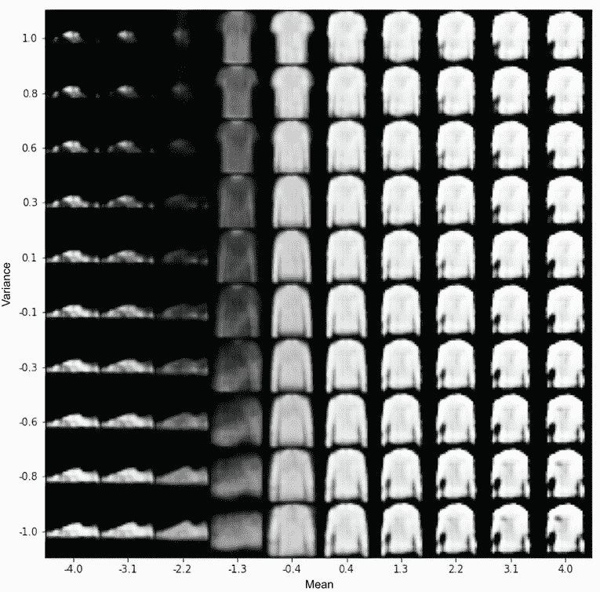

图 8.13 展示了 VAE 学习到的 2D 流形样本输出

### 8.5.2 实现 VAE

VAE 简单来说就是一个将中间编码替换为采样机制的自动编码器。在结构上，VAE 和 AE 是相同的，但在这个笔记本中，我们介绍了实现这种架构的另一种模式。这不仅简化了架构，还为后续章节中的其他创新奠定了基础。

在 Colab 中打开 EDL_8_5_VAE.ipynb 笔记本。如需帮助，请参阅附录。从菜单中选择运行 > 运行所有单元格来运行笔记本中的所有单元格。

滚动到标记为“网络超参数”的单元格。我们首先详细查看笔记本的超参数，如列表 8.21 所示，因为引入了一些新的输入。代码首先使用前一个单元格中加载的数据集提取的`image_size`设置`input_shape`。然后，设置基础内核大小和过滤器数量；我们稍后会看到这些是如何被使用的。之后，将`latent_dim`设置为`2`，表示编码器输出的中间维度的数量。在这种情况下，潜在的维度`2`代表输入的均值和方差。

列表 8.21 EDL_8_5_VAE.ipynb：VAE 超参数

```
input_shape = (image_size, image_size, 1)   ❶
batch_size = 128
kernel_size = 3                             ❷
filters = 16                                ❸
latent_dim = 2                              ❹
epochs = 5     
```

❶ 输入形状由 image_size 和通道定义。

❷ 卷积层的内核大小

❸ CNN 的基础过滤器数量

❹ 潜在的/中间维度的尺寸

下一个单元格显示了编码器卷积层的构建，与 AE 相比相当不同，如列表 8.22 所示。VAE 是通过循环添加连续的 CNN 层来构建的。在每次迭代中，下一层将过滤器数量加倍。需要注意的是，省略了池化层以创建 AE 的漏斗效应的减少。相反，我们将`strides`从`1`增加到`2`，这减少了输出维度的一半。因此，28×28 的图像将减少到 14×14。

列表 8.22 EDL_8_5_VAE.ipynb：构建编码器 CNN

```
inputs = Input(shape=input_shape, name='encoder_input')   ❶
x = inputs
for i in range(2):
    filters *= 2                                          ❷
    x = Conv2D(filters=filters,
               kernel_size=kernel_size,
               activation='relu',
               strides=2,                                 ❸
               padding='same')(x)

shape = K.int_shape(x)                                    ❹
```

❶ 设置初始输入层

❷ 将 CNN 每一步的过滤器数量加倍

❸ 通过增加步长来替换池化

❹ 捕获最终形状

向下滚动到下一个单元格，我们可以看到编码器 CNN 层的输出如何减少到潜在维度并输出均值和方差，如列表 8.23 所示。为此，添加了一个`Flatten`层来压缩编码器的输出到一个`Dense`层。之后，添加了两个更多的`Dense`层，它们产生样本均值`z_mean`和方差`z_log_var`。这些值随后被传递到采样层`z`，这是一个使用 lambda 构建的自定义层，它接受`sampling`函数、期望的输出形状以及均值和方差作为输入。特别注意`latent_space`超参数是如何用来定义采样层的输入和输出形状的。

列表 8.23 EDL_8_5_VAE.ipynb：构建潜在采样

```
x = Flatten()(x)                                    ❶
x = Dense(16, activation='relu')(x)    
z_mean = Dense(latent_dim, name='z_mean')(x)        ❷
z_log_var = Dense(latent_dim, name='z_log_var')(x)  ❷

z = Lambda(
    sampling, 
    output_shape=(latent_dim,), 
    name='z')([z_mean, z_log_var])                  ❸

encoder = Model(inputs, [z_mean, z_log_var, z], 
➥ name='encoder')                                  ❹
encoder.summary()    
```

❶ 将编码器的输出展平

❷ 将潜在维度减少到产生均值和方差

❸ 生成采样层

❹ 实例化编码器模型

图 8.14 显示了编码器模型的`model.summary`，旁边标注了层结构。注意模型如何展平编码器的卷积层，然后将输入推入大小为`16`的`Dense`层。这进一步分解成两个并行层——一个用于均值，另一个用于方差。这些值随后被传递到采样层`z`，这是一个使用 lambda 构建的自定义层，它接受`sampling`函数、期望的输出形状以及均值和方差作为输入。特别注意`latent_space`超参数是如何用来定义采样层的输入和输出形状的。

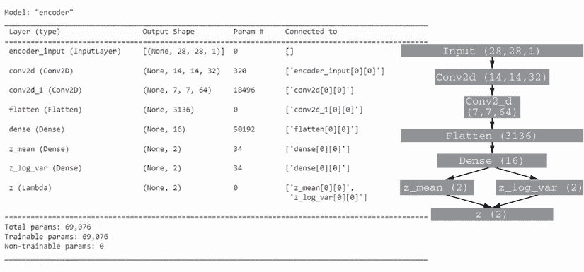

图 8.14 编码器模型的注释总结

在我们到达解码器之前，让我们回顾一下 `sampling` 函数，该函数在文件的顶部代码单元格中显示，并在列表 8.24 中列出，它接受均值和方差作为输入。在函数内部，均值和方差的值从 `args` 中解包。然后，我们从均值输入中提取两个形状值，首先使用 `K.shape` 返回张量形状，然后使用 `K.int_shape` 返回一个元组。简单来说，这设置了采样向量的输出大小。然后，我们创建一个大小为 `(batch, dim)` 的随机样本张量，称为 `epsilon`，它成为基础随机向量。之后，通过应用均值和方差来缩放向量，以确定最终的输出向量 `z`。

列表 8.24 EDL_8_5_VAE.ipynb：`sampling` 函数

```
def sampling(args):
    z_mean, z_log_var = args
    batch = K.shape(z_mean)[0]                            ❶
    dim = K.int_shape(z_mean)[1]                          ❷

    epsilon = K.random_normal(shape=(batch, dim))         ❸
    return z_mean + K.exp(0.5 * z_log_var) * epsilon      ❹
```

❶ 提取批处理参数的张量大小

❷ 提取维度元组

❸ 从正态分布中采样

❹ 返回偏移 epsilon 的采样向量

解码器模型的架构也已经简化，但我们仍然需要处理来自编码器的 z 采样层输出。这次，我们构建一个大小为 `latent_dim` 的 `Input` 层，以匹配编码器的最终采样输出 z，如列表 8.25 所示。接下来，一个新的 `Dense` 层被扩展以匹配最终解码器输出的大小，然后使用 `Reshape` 层重塑以匹配原始编码器输出。简单来说，新的中间采样函数只是用我们构建的 AE 的中间潜在编码交换。然而，我们仍然需要保持数据维度的一致性。

列表 8.25 EDL_8_5_VAE.ipynb：解包解码器输入

```
latent_inputs = Input(shape=(latent_dim,), 
➥ name='z_sampling')                           ❶
x = Dense(shape[1] * shape[2] * shape[3], 
➥ activation='relu')(latent_inputs)            ❷
x = Reshape((shape[1], shape[2], shape[3]))(x)  ❸
```

❶ 构建输入层

❷ 添加一个密集层来重建形状

❸ 将输出重塑以匹配解码器输入

之后，我们可以看到解码器的其余部分正在构建，如列表 8.26 所示。首先要注意的是，使用 `Conv2DTranspose` 层而不是之前使用的 `Conv2D` 和 `UpSampling`。简单来说，这种层类型是卷积过程的更明确的反转。同样，层是通过循环添加的，但这次在每个迭代之后，`filters` 的数量减少，剩余的 `filters` 在构建编码器后留下。之后，使用单个 `Conv2DTranspose` 层将输出减少到单个通道。

列表 8.26 EDL_8_5_VAE.ipynb：构建解码器

```
for i in range(2):
    x = Conv2DTranspose(filters=filters,                   ❶
                        kernel_size=kernel_size,
                        activation='relu',
                        strides=2,                         ❷
                        padding='same')(x)
    filters //= 2                                          ❸

outputs = Conv2DTranspose(filters=1,                       ❹
                          kernel_size=kernel_size,
                          activation='sigmoid',
                          padding='same',
                          name='decoder_output')(x)

decoder = Model(latent_inputs, outputs, name='decoder')    ❺
decoder.summary()     
```

❶ 使用 Conv2DTranspose 层

❷ 将步长值设置为 2 以进行扩展。

❸ 在每个层后减少过滤器数量

❹ 添加一个最终的转置层以实现单通道输出

❺ 实例化模型

图 8.15 显示了解码器模型摘要的注释视图。正如你所见，这部分比 AE 简单且更模块化。注意模型中的输入现在只是来自编码器`sampling`层的两个输入。然而，这使我们能够遍历或采样解码器学习生成的空间。

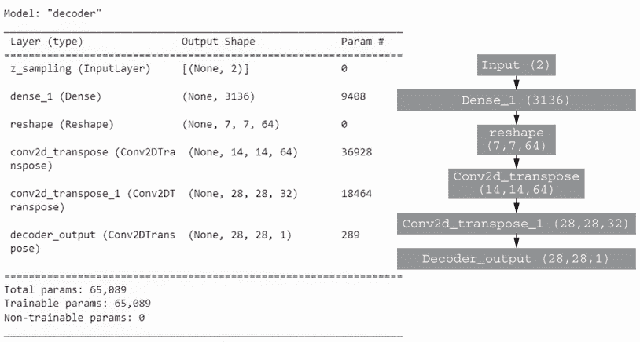

图 8.15 解码器模型的注释视图

VAE 与 AE 之间的另一个主要区别在于损失计算的方式。回想一下，在 AE 中，我们使用 MSE（均方误差）计算像素级的损失。这很简单且效果良好。然而，如果我们以这种方式为 VAE 计算损失，我们将错过学习输入分布的细微差别。相反，使用 VAE，我们通过一个发散度度量来衡量输入和输出之间的分布损失。

这需要我们在 Keras 模型中添加一个专门的损失确定。我们首先计算基础重建损失——通过比较输入图像与输出图像来计算的损失。之后，我们计算`kl_loss`，即 Kullback-Leibler 发散度，这是两个概率分布之间的统计距离。从输入和学习的表示中确定这种发散度的计算方法在下面的列表中展示。我们在第九章中更深入地讨论了类似这样的统计距离和损失计算。最后，使用`add_loss`函数将`kl_loss`和`reconstruction_loss`的均值添加为新的损失度量到模型中。

列表 8.27 EDL_8_5_VAE.ipynb：构建 VAE 模型

```
use_mse = False
if use_mse:
  reconstruction_loss = mse(
      K.flatten(inputs), K.flatten(outputs))      ❶
else:
  reconstruction_loss = binary_crossentropy(
      K.flatten(inputs), K.flatten(outputs))      ❶

reconstruction_loss *= image_size * image_size    ❷
kl_loss = 1 + z_log_var - K.square(z_mean) – 
➥ K.exp(z_log_var)                               ❸
kl_loss = K.sum(kl_loss, axis=-1)                 ❸
kl_loss *= -0.5                                   ❸

vae_loss = K.mean(tf.math.add(reconstruction_loss, 
➥ kl_loss))                                      ❹
vae.add_loss(vae_loss)                            ❺

vae.compile(optimizer='adam')
vae.summary()     
```

❶ 构建基础重建损失

❷ 通过图像大小扩展基础重建损失

❸ 计算 kl_loss

❹ 计算重建损失和 kl 损失的均值

❺ 将损失度量添加到模型中

向下滚动一点，检查图 8.16 所示的训练输出。在这个例子中，我们使用归一化损失度量，即损失除以最大观察到的损失，来跟踪模型的训练。通过跟踪归一化损失，我们可以切换到其他形式的重建和统计距离/发散度度量。尝试将重建损失的标志从 MSE 切换到二元交叉熵，以观察训练差异。这两种度量在不同的尺度上生成输出，但通过归一化损失，我们可以比较度量。

最后，我们可以观察到如图 8.13 所示的输出，它显示了通过循环样本均值和方差参数来`生成`样本图像。此代码创建了一个大小为 10×10 的大网格图像，它只是一个 NumPy 数组。然后，为均值和方差的多个值生成线性空间或值列表，如列表 8.28 所示。之后，代码遍历这些值，均值/方差，并将它们作为解码器模型的输入。解码器模型然后使用`predict`函数根据均值/方差值生成图像。然后，这个预测或生成的图像被绘制到网格中，如图 8.13 的结果所示。

列表 8.28 EDL_8_5_VAE.ipynb：生成流形图像

```
n = 10
digit_size = 28
figure = np.zeros((digit_size * n, digit_size * n))
grid_x = np.linspace(-4, 4, n)                       ❶
grid_y = np.linspace(-1, 1, n)[::-1]                 

for i, yi in enumerate(grid_y):                      ❷
    for j, xi in enumerate(grid_x):                  ❷
        z_sample = np.array([[xi, yi]])              ❸
        x_decoded = decoder.predict(z_sample)        ❹
        digit = x_decoded[0].reshape
        ➥ (digit_size, digit_size)                  ❺
        figure[i * digit_size: (i + 1) * digit_size,
                j * digit_size: (j + 1) * digit_size] = digit     
```

❶ 创建线性空间值

❷ 遍历值

❸ 创建一个样本参数张量

❹ 解码器生成输出图像。

❺ 将图形绘制到图像网格中

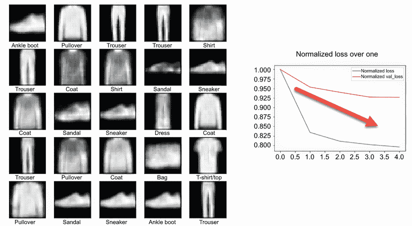

图 8.16 一个 VAE 输出示例

VAE 在短时间内产生的结果可以相当好。除此之外，我们对模型有更多的控制权，可以轻松地识别模型正在学习的内容。这反过来又使得优化模型变得更容易，因为有几个选项可供选择。

### 8.5.3 学习练习

使用以下练习来帮助提高你对 VAE 的理解：

1.  修改列表 8.21 中的各种超参数，然后重新运行笔记本。看看每个超参数对生成的结果有什么影响。

1.  在列表 8.22 和 8.26 中增加或减少编码器和解码器模型层的数量，然后重新运行笔记本。

1.  调整和调整 VAE 模型，使其产生最佳版本的图 8.13。

审查和理解 VAE 的工作原理是第九章的必要背景。抓住机会理解我们刚刚覆盖的基本内容，特别是理解如何从学习到的表示空间生成图像。这些信息是下一章进入进化生成深度学习旅程的基础。

## 摘要

+   AEs 是生成建模/学习的基础，并使用无监督学习来训练模型。

+   AEs 通过将数据编码到潜在/中间表示，然后重建或解码数据回到其原始形式来工作。

+   内部中间/潜在表示需要一个中间瓶颈来减少或压缩数据。压缩过程允许模型学习数据的潜在表示。

+   使用卷积（CNN）层的复杂 AE 可能很难构建。可以使用神经进化来构建定义编码器和解码器部分的分层架构。在编码器和解码器中使用卷积层需要额外的`UpSampling`层和匹配的层配置。这些专用配置可以编码到定制的遗传序列中。

+   可以开发定制的`变异`和`交叉`算子来处理构建进化 AE 所需的定制遗传编码。

+   训练一个构建进化架构的进化自动编码器可能需要一些时间来探索多个架构。

+   变分自动编码器（VAE）中学习的潜在表示可以用来可视化内部表示的样子。变分自动编码器是对自动编码器的一种扩展，它使用一个中间采样层来将编码器与解码器断开连接。断开编码器或解码器可以提供更好的性能。
