# 9 生成深度学习和进化

本章涵盖

+   概述生成对抗网络

+   理解生成对抗网络优化中的问题

+   通过应用 Wasserstein 损失修复生成对抗网络问题

+   为进化优化创建生成对抗网络编码器

+   使用遗传算法进化深度卷积生成对抗网络

在上一章中，我们介绍了自编码器（AEs）并学习了如何提取特征。我们学习了如何将进化应用于 AE 的网络架构优化，然后我们介绍了变分自编码器，它引入了生成深度学习或表示学习的概念。

在本章中，我们继续探索表示学习，这次通过研究生成对抗网络（GANs）。GANs 是一个值得几本书来探讨的有趣话题，但就我们的目的而言，我们只需要探索其基础。因此，在本章中，我们研究 GAN 的基础以及它如何通过进化进行优化。

GANs 的训练非常困难，因此能够通过进化优化这个过程将是有益的。我们将在下一节介绍基本的 GAN，通常被称为“原味”GAN。

## 9.1 生成对抗网络

GAN 是深度学习中的艺术家，虽然它可以创造出美丽的表示，但它也有恶意用途。虽然我们在这个部分不探讨这些极端情况，但我们确实探讨了基本 GAN 的工作原理。然而，在我们跳入代码之前，我们将快速介绍或复习 GAN 是如何工作的。

### 9.1.1 介绍 GANs

我们经常用艺术伪造者和艺术判别器、侦探或评论家的类比来浪漫化 GANs 的解释。艺术伪造是一个有利可图的行业，艺术伪造者试图生成可以欺骗艺术评论家或侦探的伪造品。同样，侦探使用他们的知识库来确定生成艺术的真伪，防止伪造品被出售。

图 9.1 是艺术生成器与艺术判别器或侦探之间的对抗战的经典表示。判别器通过评估真实艺术和伪造者生成的伪造艺术来学习。生成器或伪造者对真实艺术一无所知，只从侦探或判别器的反馈中学习。

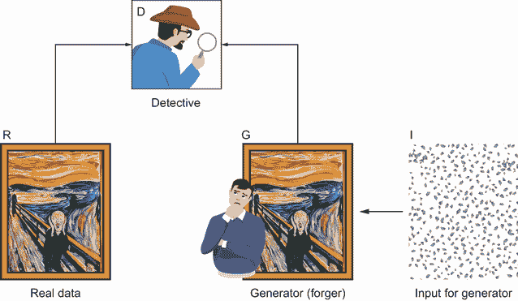

图 9.1 GAN 的经典解释

图 9.2 将图 9.1 的过程描绘为一个深度学习系统。生成器（G）接收一个随机化的潜在空间作为输入，并添加了一些噪声。这代表了艺术伪造者从图 9.1 中作为输入（I）的随机想法。从这些随机想法中，生成的图像被发送到判别器（D）以验证艺术的真伪——是真是假。

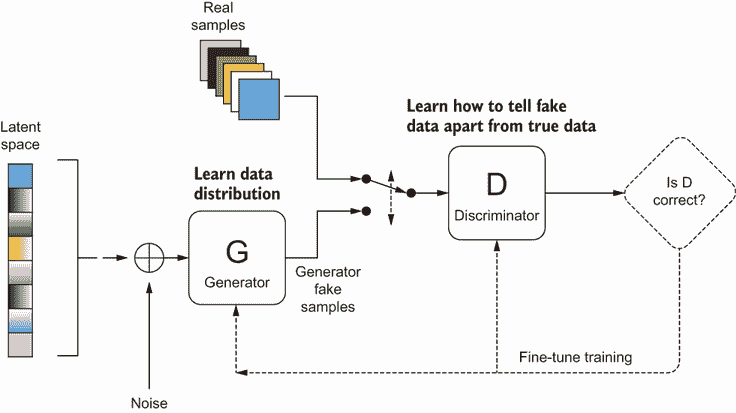

图 9.2 生成对抗网络

同样，D 将真实图像样本和 G 生成的假图像作为输入。D 通过对其预测的反馈来学习检测真实与假货——如果 D 将真实预测为假，则得到消极反馈；如果它成功检测到真实图像，则得到积极反馈。

相反，G 从 D 的反馈中学习。同样，如果生成器能够欺骗 D，则这种反馈是积极的；如果它失败了，则反馈是消极的。反过来，如果 D 认证了一个假货为真，它就会收到消极反馈；如果它检测到一个假货为假，它就会收到积极反馈。

表面上看，对抗训练过程的简单优雅被其训练的难度所掩盖。GANs 在 G 和 D 以相同速度学习时效果最佳。如果其中任何一个学习得更快或更慢，那么系统就会崩溃，双方都无法从这种共生关系中受益。

如本章所讨论的，GAN 的训练和优化是应用进化优化策略的一个很好的候选者。然而，在我们到达那里之前，回顾 GAN 如何工作以及如何在下一节中构建的技术实现是有帮助的。

### 9.1.2 在 Keras 中构建卷积生成对抗网络

在本节中，我们查看使用卷积的基本的、“经典”GAN，我们通常将其称为 DCGAN 的双卷积 GAN。DC 的添加仅仅意味着 GAN 通过添加卷积变得更加专业化。我们在这里涵盖的很多内容是对之前章节中关于卷积和自编码器的回顾。因此，我们在这里不涵盖那些细节，而是简单地研究如何构建和训练 GAN。

打开 Google Colab 中的 EDL_9_1_GAN.ipynb 笔记本。如果需要帮助，请参考附录。通过选择菜单中的“运行”>“运行所有”来运行笔记本中的所有单元格。

在本章中，我们使用 MNIST 手写数字和 Fashion-MNIST 数据集。然而，为了减少训练时间，我们使用`extract`函数从数据集中提取单个类别的图像，如列表 9.1 所示。`extract`函数接受图像批次和标签以及要提取的类别号作为输入。第一行提取与类别号相等的标签匹配的索引。然后，使用索引列表从原始数据集中隔离出匹配类别的图像子集。结果是只包含一个类别图像的数据集：`train_images`。我们可以从对`extract`函数的调用中看到，使用类别号`5`代表数据集中的数字 5，如图表输出所示。

列表 9.1 EDL_9_1_GAN.ipynb：`extract`函数

```
def extract(images, labels, class_):
  idx = labels == class_              ❶
  print(idx)
  imgs = images[idx]                  ❷
  print(imgs.shape)                   ❸
  return imgs

train_images = extract(train_images, train_labels, 5)
```

❶ 提取匹配类别的图像索引

❷ 提取匹配索引的图像

❸ 打印出新图像数据集的形状/大小

接下来，我们查看为生成器和判别器设置一些基本超参数和优化器。第一个参数是一个超参数，它定义了输入到生成器的潜在空间或随机想法的大小。接下来，我们为 G 和 D 创建不同的优化器，以尝试平衡训练，如列表 9.2 所示。之后，我们计算一个卷积常数，我们将使用它来构建网络以及提取通道数和图像形状。这个笔记本是为了支持各种其他样本数据集而开发的，包括 CIFAR。

列表 9.2 EDL_9_1_GAN.ipynb：优化器和超参数

```
latent_dim = 100                           ❶

g_optimizer = Adam(0.0002, 0.5)            ❷
d_optimizer = RMSprop(.00001)              ❷

cs = int(train_images.shape[1] / 4)        ❸
print(train_images.shape)
channels = train_images.shape[3]           ❹
img_shape = (train_images.shape[1],        ❹
➥ train_images.shape[2], channels), 5)    ❹
```

❶ 定义潜在空间输入大小

❷ 为 G 和 D 创建优化器

❸ 计算卷积空间常数

❹ 提取图像通道和大小

如列表 9.3 所示，GAN 是通过将判别器和生成器分解为单独的模型并组合它们来构建的，这与构建自动编码器（AE）的方式类似。生成器架构类似于 AE 中的解码器，其中 `build_generator` 函数创建一个卷积网络，从随机和嘈杂的潜在空间生成图像。

列表 9.3 EDL_9_1_GAN.ipynb：构建生成器

```
def build_generator():
  model = Sequential()
  model.add(Dense(128 * cs * cs, activation="relu", 
  ➥ input_dim=latent_dim))                       ❶
  model.add(Reshape((cs, cs, 128)))               ❷
  model.add(UpSampling2D())                       ❸
  model.add(Conv2D(128, kernel_size=3, padding="same"))
  model.add(BatchNormalization(momentum=0.8))
  model.add(Activation("relu"))
  model.add(UpSampling2D())
  model.add(Conv2D(64, kernel_size=3, padding="same"))
  model.add(BatchNormalization(momentum=0.8))
  model.add(Activation("relu"))
  model.add(Conv2D(channels, kernel_size=3, 
  ➥ padding="same"))                             ❹
  model.add(Activation("tanh"))
  model.summary()

  noise = Input(shape=(latent_dim,))              ❺
  img = model(noise)
  return Model(noise, img) 
```

❶ 第一层输入潜在空间。

❷ 重新塑形输出以适应卷积

❸ 使用上采样来增加分辨率

❹ 将通道展平以匹配图像输出

❺ 将随机噪声作为输入添加到模型中

图 9.3 显示了运行 `build_generator` 函数后的模型摘要。请注意，这仅是内部模型的摘要，我们还在基础生成器周围添加了另一个模型包装器以添加噪声输入。

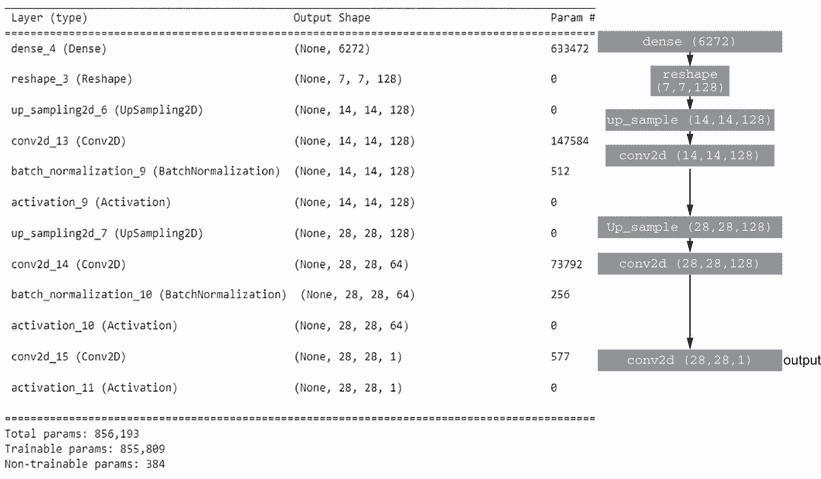

图 9.3 生成器模型输出的摘要

判别器以类似的方式构建，但这次我们在列表 9.4 中添加了一个验证输入。模型从以图像作为输入的卷积层开始，使用大小为 `2` 的步长来减少或池化图像以供下一层使用。在这里增加步长与池化一样，可以减少图像大小。判别器的输出是一个单一值，它将输入图像分类为伪造或真实。

列表 9.4 EDL_9_1_GAN.ipynb：构建判别器

```
def build_discriminator():
  model = Sequential()
  model.add(Conv2D(32, kernel_size=3, strides=2, 
  ➥ input_shape=img_shape, padding="same"))      ❶
  model.add(LeakyReLU(alpha=0.2))
  model.add(Dropout(0.25))
  model.add(Conv2D(64, kernel_size=3, strides=2, 
  ➥ padding="same"))                             ❷
  model.add(ZeroPadding2D(padding=((0,1),(0,1))))
  model.add(BatchNormalization(momentum=0.8))
  model.add(LeakyReLU(alpha=0.2))
  model.add(Dropout(0.25))
  model.add(Conv2D(128, kernel_size=3, strides=2, 
  ➥ padding="same"))                             ❷
  model.add(BatchNormalization(momentum=0.8))
  model.add(LeakyReLU(alpha=0.2))
  model.add(Dropout(0.25))
  model.add(Conv2D(256, kernel_size=3, strides=1, 
  ➥ padding="same"))                             ❷
  model.add(BatchNormalization(momentum=0.8))
  model.add(LeakyReLU(alpha=0.2))
  model.add(Dropout(0.25))
  model.add(Flatten())
  model.add(Dense(1, activation='sigmoid'))       ❸

  model.summary()
  img = Input(shape=img_shape)                    ❶
  validity = model(img)                           ❹
  return Model(img, validity))                    ❺
```

❶ 第一层卷积以图像作为输入。

❷ 卷积层使用步长=2 来减少池化图像。

❸ 最终输出是一个单一值。

❹ 将有效性（真实或伪造）作为输入添加到模型中

❺ 返回组合模型

由于我们分别从生成器中训练判别器，因此我们还使用 `d_optimizer` 编译创建的模型，损失为二元交叉熵，并使用准确度作为指标，如下列所示。

列表 9.5 EDL_9_1_GAN.ipynb：编译判别器

```
d = build_discriminator()
d.compile(loss='binary_crossentropy',
            optimizer=d_optimizer,    ❶
            metrics=['accuracy']) 
```

❶ 使用优化器编译模型

现在，我们可以使用我们之前构建的 D 和 G 模型来构建联合 GAN 模型。在单元格内部，我们创建一个表示生成器潜在空间输入的输入，如列表 9.6 所示。然后，我们创建一个来自 G 的输出，称为 `img`，用于生成的图像。之后，我们关闭将在联合 GAN 中使用的判别器模型的训练。我们不在联合 GAN 中训练判别器。相反，生成器在联合 GAN 中使用单独的优化器 `g_optimizer` 分别进行训练。判别器输出的图像的有效性用于在联合模型中训练生成器。

列表 9.6 EDL_9_1_GAN.ipynb：编译判别器

```
z = Input(shape=(latent_dim,))
img = g(z)                                ❶

d.trainable = False                       ❷

valid = d(img)                            ❸

gan = Model(z, valid)                     ❹
gan.compile(loss='binary_crossentropy', 
➥ optimizer=g_optimizer)])               ❺
```

❶ 从潜在空间生成图像

❷ 在 GAN 中关闭判别器训练

❸ 引入对抗性真实值

❹ 构建联合模型

❺ 编译带有损失和优化器的模型

由于我们有独立的训练流程，我们不能简单地使用 Keras 的 `model.fit` 函数。相反，我们必须分别训练判别器和生成器。代码，如列表 9.7 所示，首先创建真实和伪造图像集的对抗性真实值，为有效图像创建一个 `1`s 的张量，为伪造图像创建一个 `0`s 的张量。训练在两个循环中进行：外循环由 epoch 数量控制，内循环由批次的计算数量控制。在循环内部，我们随机采样一组真实图像 `imgs`，然后使用随机噪声生成一组伪造图像 `gen_images`。然后，我们在判别器上训练并计算真实和伪造图像的损失。注意，对于每一组训练，我们如何传递相应的真实值。通过取真实和伪造损失的均值来计算最终的联合判别器损失。最后，我们通过传递有效真实值与生成的伪造图像来训练联合 GAN 或仅生成器。

列表 9.7 EDL_9_1_GAN.ipynb：训练 GAN

```
batches = int(train_images.shape[0] / BATCH_SIZE)

# Adversarial ground truths
valid = np.ones((BATCH_SIZE, 1))                         ❶
fake = np.zeros((BATCH_SIZE, 1))                         ❶

for e in range(EPOCHS):
  for i in tqdm(range(batches)):   
    idx = np.random.randint(0, train_images.shape[0], 
    ➥ BATCH_SIZE)                                       ❷
    imgs = train_images[idx]                             ❷

    noise = np.random.normal(0, 1, (BATCH_SIZE, 
    ➥ latent_dim))                                      ❸
    gen_imgs = g.predict(noise)                          ❸

    d_loss_real = d.train_on_batch(imgs, valid)          ❹
    d_loss_fake = d.train_on_batch(gen_imgs, fake)       ❹
    d_loss = 0.5 * np.add(d_loss_real, d_loss_fake)      ❹

    g_loss = gan.train_on_batch(noise, valid)            ❺
```

❶ 生成对抗性真实值

❷ 一个样本随机批次的真实图像

❸ 创建噪声并生成伪造图像

❹ 训练判别器并在真实和伪造图像上计算损失

❺ 使用有效真实值训练生成器

图 9.4 显示了在单个数据类别（数字 5）上训练 GAN 10 个周期的结果。你可以开始看到生成器创建的图像类似于手绘的 5。结合生成的图像，我们还看到了判别器的损失训练结果，按真实和伪造分开以及生成器。不深入数学，训练“vanilla”GAN 的目标是最大化伪造图像的损失并最小化真实图像的损失。本质上，D 需要变得更好于识别真实图像，但也需要变得更差于识别伪造图像。相反，生成器必须最小化创建伪造图像的损失。在图中，这似乎是相反的，但这是因为它仍然处于训练的早期阶段。

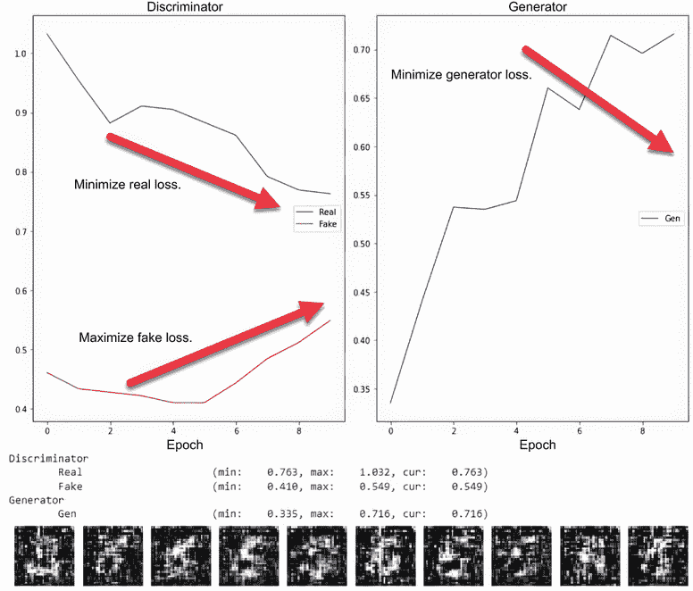

图 9.4 训练 GAN 10 个周期

前进并增加训练 GAN 的`EPOCHS`数量，然后通过菜单中的 Runtime > Run All 再次运行笔记本。你会看到各种真实和伪造损失如何分别最大化或最小化。

### 9.1.3 学习练习

使用以下练习来帮助提高你对基本 GAN 的理解：

1.  增加或减少`BATCH_SIZE`，然后重新运行笔记本。改变这个超参数对 GAN 训练有什么影响？

1.  在 9.2 列表中增加或减少`g_optimizer`和`d_optimizer`的学习率。改变任一优化器对 GAN 训练有什么影响？

1.  在 9.1 列表中不要使用`extract`函数将数据集限制为单个类别。这会如何影响 GAN 的训练？

现在，我们有一个可以学习生成给定类别真实且准确的数字的正在工作的 GAN。虽然概念很简单，但希望你现在也能欣赏到我们刚刚快速覆盖的代码的微妙复杂性和细微差别。我们将在下一节中探讨这些技术细微差别，并尝试理解训练 GAN 的难度。

## 9.2 训练 GAN 的挑战

GAN 最好被描述为判别器和生成器之间的平衡行为，如果任一模型超过另一个，整个系统就会失败。由于判别器是单独训练的，它仍然可能产生有效的模型，但在更广泛的应用中这很少是有用的。

判别器再利用

虽然构建和训练 GAN 的目标是能够生成逼真的伪造品，但另一个好处是拥有一个健壮的判别器，可以区分真实图像和伪造图像。判别器本质上成为分类器，可以识别给定数据集中真实或伪造图像之间的差异，使得模型可以作为整个数据集的简单分类器被重用。例如，如果你在面部上训练了一个 GAN，那么生成的判别器可以用来判断任何图像是否为面部或非面部。

构建和训练一个能够进行这种平衡操作并产生优秀结果的 GAN 是出了名的困难。在本节中，我们探讨了在训练 GAN 时可能出现的明显和不那么明显的失败点。当然，随着我们进入本章，我们将探讨各种手动和通过进化的策略来解决这些问题。然而，在我们这样做之前，让我们回顾一下为什么 GAN 优化是一个问题。

### 9.2.1 GAN 优化问题

通常，GAN 训练的主要问题是在一个有效且同步的解决方案中让生成器和判别器收敛。幸运的是，当这些问题出现时，它们通常以各种现象的形式变得明显。以下是在训练 GAN 时可能遇到的一些最常见和可识别的问题的总结：

+   *梯度消失*—如果判别器在识别伪造内容方面变得强大，这通常会减少反馈给生成器的损失量。反过来，这种减少的损失会降低应用于生成器的训练梯度，导致梯度消失。

+   *模式坍塌或过拟合*—生成器可能会陷入不断生成几乎相同输出的状态，变化很小。这是因为模型变得过于专业化，实际上过度拟合了生成的输出。

+   *无法收敛*—如果在训练过程中生成器改进得太快，判别器会感到不知所措和困惑。这导致判别器崩溃，本质上是在观察到的真实或伪造图像之间随机做出 50/50 的猜测。

观察这些问题并能够识别它们何时发生，对于理解和训练生成对抗网络（GAN）是有用的。在接下来的几个小节中，我们将探讨修改原始笔记本以复制和观察这些现象。

### 9.2.2 观察梯度消失

为了在生成器中复制梯度消失现象，我们通常只需要调整用于判别器的优化器。网络架构也可能对梯度消失问题产生影响，但我们将展示我们已经采取的一些措施来解决这个问题。打开您的浏览器，让我们跳转到下一个笔记本。

在 Colab 中打开 EDL_9_2_GAN_Optimization.ipynb 笔记本。在我们回顾一些代码部分之前，不要运行整个笔记本。向下滚动几个单元格，找到优化器设置的地方，然后寻找注释 `vanishing gradients`，如下所示。取消以下设置判别器优化器的行注释，即取消注释 `disc_optimizer`。注释掉原始的判别器优化器，然后取消注释标记为 `vanishing gradients` 的优化器。

列表 9.8 EDL_9_2_GAN_Optimization.ipynb: 设置优化器

```
gen_optimizer = Adam(0.0002, 0.5)
#disc_optimizer = RMSprop(.00001)      ❶

# vanishing gradients
disc_optimizer = Adam(.00000001, .5)   ❷
```

❶ 取消原始优化器的注释

❷ 取消 Adam 优化器的注释

将优化器替换为判别器的结果，实际上是使其在识别伪造和真实图像方面变得更好或非常好。因此，我们应该看到随着训练的进行，生成器的损失最小化，而输出没有明显的改进。

在你做出更改后，通过选择菜单中的“运行”>“运行所有”来运行笔记本中的所有单元格。向下滚动到训练输出；你应该看到与图 9.5 中显示的类似输出。结果显示了经典的指示，表明生成器由于梯度消失而陷入困境。GAN 可能遇到此问题的两个强烈指标是伪造生成器的损失和判别器的损失。如图所示，判别器的伪造损失在整个训练过程中保持在很小的范围内。对于生成器来说，这导致损失随时间的变化观察到的变化较小，产生梯度消失。

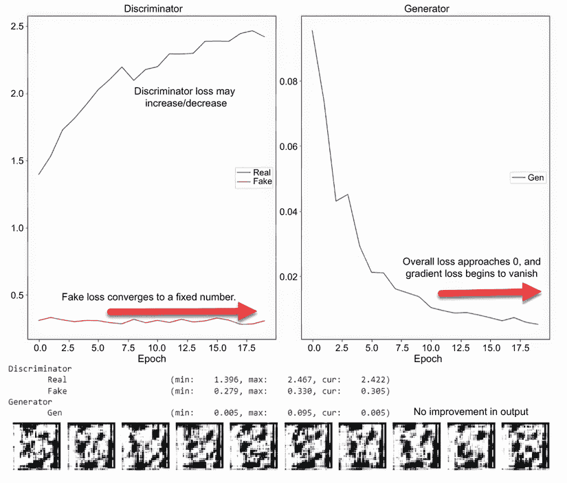

图 9.5 GAN 训练输出显示梯度消失

通常，当我们在一个深度学习模型中观察到梯度消失时，我们会审查模型架构并寻找可能导致 VG 的区域。如果你参考生成器模型构建的地方，你可能注意到我们正在使用 `ReLU` 激活函数。我们可以通过取消注释代码来实现这一点，如下面的列表所示。

列表 9.9 EDL_9_2_GAN_Optimization.ipynb：尝试使用 `LeakyReLU`

```
model.add(Dense(128 * cs * cs, activation="relu", input_dim=latent_dim))
model.add(Reshape((cs, cs, 128)))
model.add(UpSampling2D())
model.add(Conv2D(128, kernel_size=3, padding="same"))
model.add(BatchNormalization(momentum=0.8))
#model.add(Activation("relu"))                  ❶
model.add(LeakyReLU(alpha=0.2))                 ❷
model.add(UpSampling2D())
model.add(Conv2D(64, kernel_size=3, padding="same"))
model.add(BatchNormalization(momentum=0.8))
#model.add(Activation("relu"))                  ❶
model.add(LeakyReLU(alpha=0.2))                 ❷
model.add(Conv2D(channels, kernel_size=3, padding="same"))
model.add(Activation("tanh")) 
```

❶ 注释掉原始激活函数

❷ 取消注释 LeakyReLU 激活函数

运行笔记本中的所有单元格。不幸的是，我们观察到非常小的改进。这是因为交换生成器的激活函数几乎没有效果，因为问题是判别器。如果你想观察这个 GAN 应该如何工作，请继续通过注释和取消注释代码，然后重新运行笔记本。

解决 GAN 中梯度消失的典型方法是对优化器进行调整或解决损失计算的方式。我们试图在本章的后面部分理解和改进损失计算，但在那之前，让我们跳到下一节观察其他形式的 GAN 失败。

### 9.2.3 观察 GAN 中的模式崩溃

当一个 GAN 在输出中难以产生变化时，就会发生模式崩溃。这种情况发生在生成器只找到可以欺骗评论家的一个或一小组输出时。然后，随着评论家的改进，生成器就会陷入只产生输出的小范围变化的困境。

在 Colab 中打开 EDL_9_2_GAN_Optimization.ipynb 笔记本。如果你在上一个部分中进行了任何修改，请确保从存储库中加载一个全新的副本。再次向下滚动到优化器设置部分，然后取消注释注释 `mode collapse` 下的代码，如下面的列表所示。

列表 9.10 EDL_9_2_GAN_Optimization.ipynb：再次设置优化器

```
gen_optimizer = Adam(0.0002, 0.5)
#disc_optimizer = RMSprop(.00001)    ❶

# mode collapse
disc_optimizer = Adam(.002, .9)))    ❷
```

❶ 注释掉原始优化器

❷ 取消 Adam 优化器的注释

在您做出更改后，通过菜单中的“运行”>“运行所有单元格”来运行笔记本中的所有单元格。图 9.6 显示了在 25 个时期上训练 GAN 的输出。您的结果可能会有所不同，但您应该观察到输出图像的模式崩溃，如图所示。

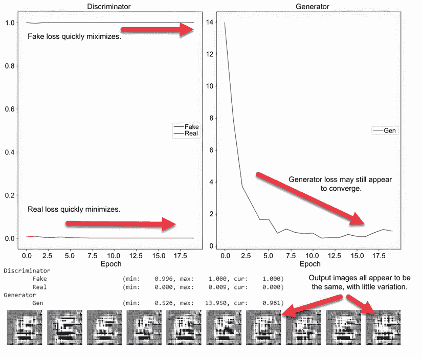

图 9.6 观察 GAN 上的模式崩溃

克服模式崩溃的简单修复当然是找到正确的优化器。还有其他方法也可以帮助最小化这个问题，包括调整损失函数和展开 GAN。

展开 GAN

展开 GAN 背后的想法是将生成器在判别器的当前和未来状态上训练。这允许生成器向前看，并以时间旅行的形式考虑到判别器的未来形态。虽然这个概念并不复杂，但实现这种当前和未来状态管理的代码却是。

我们将在后面介绍交换 GAN 损失函数，而展开 GAN 对于我们的简单需求来说过于复杂。相反，我们选择一个非常简单的方法来缓解模式崩溃：使用噪声。

滚动到训练函数；注意添加了一个新的`ADD_NOISE`布尔形式常量，如下面的列表所示。您可以使用 Colab 表单在`True`和`False`之间切换此变量。将其切换为`True`，然后通过菜单中的“运行”>“运行所有单元格”来运行笔记本中的所有单元格。

列表 9.11 EDL_9_2_GAN_Optimization.ipynb：向对抗性地面真实值添加噪声

```
if ADD_NOISE:  
  fake_d = np.random.sample(BATCH_SIZE) * 0.2          ❶
  valid_d = np.random.sample(BATCH_SIZE) * 0.2 + 0.8   ❷
  valid_g = np.ones((BATCH_SIZE, 1))                   ❸
else:
  valid_d = np.ones((BATCH_SIZE, 1))
  fake_d = np.zeros((BATCH_SIZE, 1))
  valid_g = np.ones((BATCH_SIZE, 1))
```

❶ 假设的地面真实值现在介于 0 和 0.2 之间。

❷ 有效的地面真实值现在介于 0.8 和 1.0 之间。

❸ 保持生成器的有效地面真实值不变

图 9.7 显示了在添加噪声的情况下，经过 25 个时期训练 GAN 的结果。由于优化器的差异，结果仍然不算出色，但我们可以看到输出变异性有所改善。

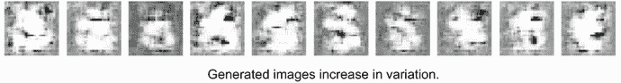

图 9.7 显示模型输出增加变异性的一例输出

如您从最后一个笔记本中的变化中可以看到，我们通过简单地向对抗性地面真实值添加噪声来纠正了模式崩溃问题。在下一节中，我们将解决 GAN 的另一个问题领域。

### 9.2.4 观察 GAN 中的收敛失败

收敛是 GAN 的一个基本问题，可能是模式崩溃、梯度消失或优化不平衡的后果。因此，我们可以相对容易地复制收敛失败。然而，在这个观察中，我们想要看看一个例子，其中只是生成器或判别器未能收敛。

在 Colab 中打开 EDL_9_2_GAN_Optimization.ipynb 笔记本。如果您对其进行了修改，请确保从存储库中开始一个新的副本。滚动到设置优化器的单元格，并取消注释/注释标记为`convergence`的适当行，如下面的列表所示。

列表 9.12 EDL_9_2_GAN_Optimization.ipynb：设置优化器

```
# original optimizers
#gen_optimizer = Adam(0.0002, 0.5)  ❶
disc_optimizer = RMSprop(.00001)      

# convergence
gen_optimizer = RMSprop(.00001)     ❷
```

❶ 注释掉原始生成器优化器

❷ 取消优化器的注释

通过菜单中的“运行”>“运行所有单元格”来运行笔记本中的所有单元格。图 9.8 显示了 GAN 生成器的收敛失败。虽然判别器看起来收敛得很好，但我们可以看到生成器损失的不断增加导致无法收敛。

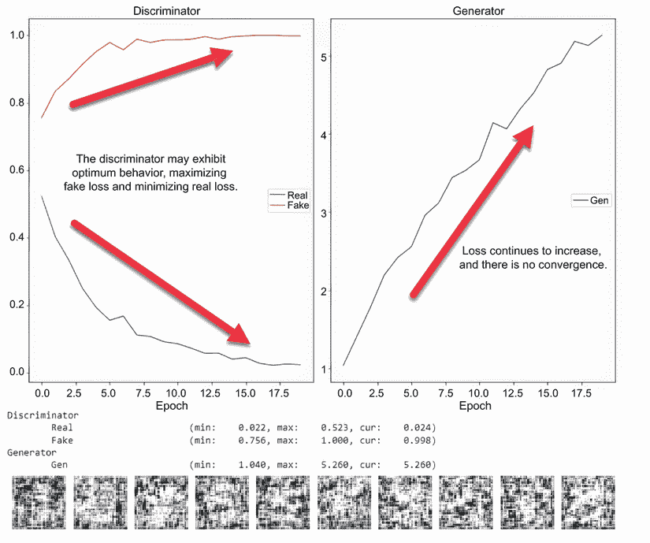

图 9.8 GAN 生成器未能收敛

与我们之前的例子一样，有一个相对简单的解决方案来纠正收敛问题。一个解决方案是打破生成器和判别器训练之间的紧密循环。我们可以通过允许 D 和 G 训练相互独立地循环来实现这一点。

为了支持这种独立的迭代方案，我们添加了更多的代码和额外的输入来控制它，如列表 9.13 所示。列表中的代码只显示了训练循环的基本部分，在这个过程中，我们添加了两个内部循环——一个用于训练判别器，另一个用于训练生成器。这些循环的运行频率可以通过 Colab 中的变量`CRITIC_ITS`来控制，以控制判别器迭代次数，以及`GEN_ITS`来控制生成器迭代次数。

列表 9.13 EDL_9_2_GAN_Optimization.ipynb：打破训练循环

```
CRITIC_ITS = 5 #@param {type:"slider", min:1,   ❶
➥ max:10, step:1}                              ❶
GEN_ITS = 10 #@param {type:"slider", min:1,     ❶
➥ max:10, step:1}                              ❶

for e in range(EPOCHS):
  for i in tqdm(range(batches)):
    for _ in range(CRITIC_ITS):                 ❷
      idx = np.random.randint(0, train_images.shape[0], BATCH_SIZE)
      imgs = train_images[idx]        
      noise = np.random.normal(0, 1, (BATCH_SIZE, latent_dim))
      gen_imgs = g.predict(noise)

      d_loss_real = d.train_on_batch(imgs, valid_d)
      d_loss_fake = d.train_on_batch(gen_imgs, fake_d)
      d_loss = 0.5 * np.add(d_loss_real, d_loss_fake) 

    for _ in range(GEN_ITS):                    ❸
      g_loss = gan.train_on_batch(noise, valid_g)  
```

❶ 控制判别器/生成器迭代次数的变量

❷ 判别器的循环

❸ 生成器的循环

将`CRITIC_ITS`值设置为`5`，将`GEN_ITS`设置为`10`，然后通过“运行”>“运行所有单元格”重新运行所有笔记本单元格。图 9.9 显示了打破生成器和判别器之间紧密依赖关系以及 GAN 收敛的结果。

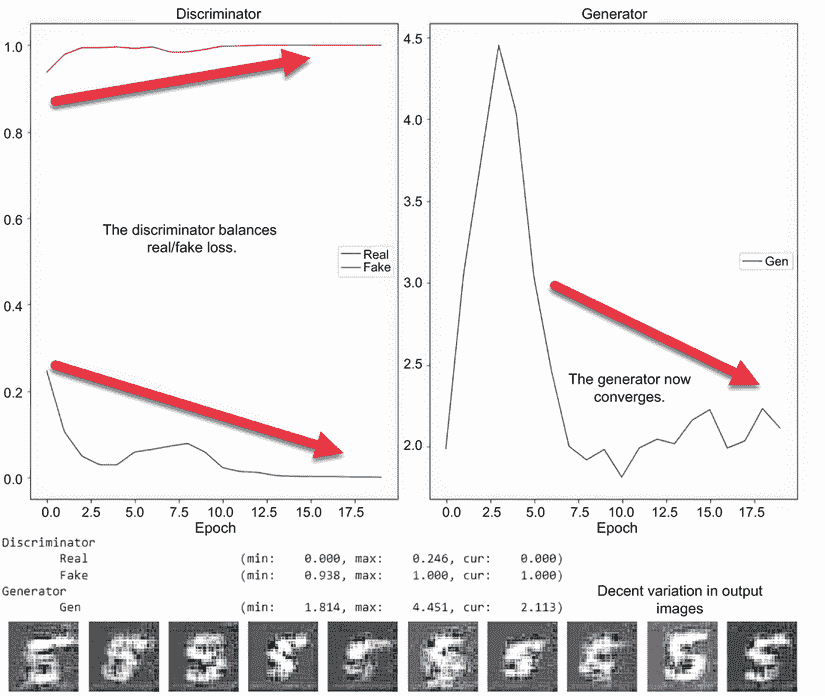

图 9.9 打破紧密耦合后 GAN 收敛

### 9.2.5 学习练习

使用以下练习来提高你对 GAN 训练的理解：

1.  在 GAN 中训练生成器时，如何减少模式崩溃的可能性？

1.  生成器收敛失败的主要原因是什么？

1.  你如何减少 GAN（生成器）中的梯度消失问题？

在生成器和判别器之间获得正确的迭代次数成为了一个通过使用不同值重新运行模型的问题。当然，这可以手动完成，或者，正如你所猜想的，通过某种形式的进化优化来完成。当这个 GAN 运行得更好时，我们可以在下一节中通过更新我们使用的损失函数来添加另一个改进。

## 9.3 使用 Wasserstein 损失修复 GAN 问题

在下一个笔记本中，我们将通过减少或消除收敛失败、梯度消失和模式崩溃来提高 GAN 性能并解决问题。我们通过在 GAN 中引入一种称为*Wasserstein 损失*的替代损失或距离度量方法来实现这一点。在跳入笔记本之前，让我们在下一节中回顾一下 Wasserstein 损失是什么。

### 9.3.1 理解 Wasserstein 损失

当我们训练 GAN 时，面临的一个关键问题是如何解决和平衡生成器和判别器之间的损失。在标准的 GAN 中，判别器通过概率来衡量损失，即图像是伪造的还是真实的概率。在数学上，测量概率差异，即不确定性的度量，在连续的训练迭代中会变得不准确。

2017 年，Martin Arjovsky 等人在其题为“Wasserstein GAN”的论文中提出了一种改进的损失方法：用评论家替换判别器。在他们提出的方法中，评论家不是测量概率，而是预测一个表示图像真实或伪造程度的值。因此，生成的图像可以在真实到伪造的尺度上进行测量。

基本上，当我们训练 GAN 时，我们的目标是缩小或优化真实与伪造之间的距离。当我们用概率来衡量这个距离时，我们就固定使用不确定性的度量。通过引入损失的缩放距离，我们引入了距离优化的另一种度量。

图 9.10 显示了测量变分距离或概率距离与 Wasserstein 距离之间的比较。Wasserstein 距离被称为*地球迁移距离*，因为它更好地描述了如何测量两个分布。Kullback-Lieber 和 Jensen Shannon 距离衡量的是水平距离，而地球迁移距离则考虑了垂直差异。

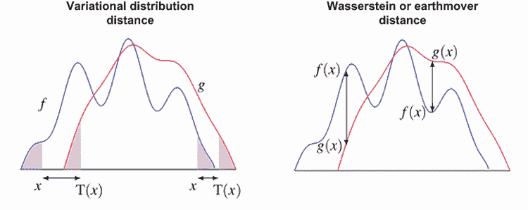

图 9.10 变分距离与 Wasserstein 距离的差异

使用地球迁移距离的好处是，它更好地量化了真实或伪造图像之间的损失或距离，从而产生一个更稳健且更不敏感的模型。使用 Wasserstein 距离还可以消除或减少 GAN 遇到模式崩溃、无法收敛和梯度消失的可能性，正如我们在下一节中实现 Wasserstein 损失在 GAN 中看到的那样。

### 9.3.2 使用 Wasserstein 损失改进 DCGAN

现在，我们可以跳进去回顾如何在 GAN 中实现 Wasserstein，或地球迁移，损失。这个笔记本与我们在 DCGAN 中构建的相同，只是扩展了 Wasserstein 损失。

在 Colab 中打开 EDL_9_3_WGAN.ipynb 笔记本。然后，通过菜单中的“运行”>“运行所有单元格”来运行笔记本中的所有单元格。

滚动到实例化优化器的位置。你可能会首先注意到我们将`discriminator`模型的名称更改为`critic`，如下所示。这是因为`critic`预测的是真实度或伪造度的度量，而不是它真实或伪造的概率。此外，请注意我们现在正在为`generator`和`critic`使用相同的优化器。我们也可以这样做，因为真实与伪造的比例将标准化度量之间的差异。

列表 9.14 EDL_9_3_WGAN.ipynb：优化器设置

```
gen_optimizer = RMSprop(lr=0.00005)      ❶
critic_optimizer = RMSprop(lr=0.00005)   ❷
```

❶ 生成器优化器

❷ 判别器替换为评论家

移动到下一个单元格，如列表 9.15 所示；我们可以看到一个名为`wasserstein_loss`的函数中的 Wasserstein 损失的计算。从单行代码中，你可以看到真实或实际输入的平均值是如何乘以预测的。这个输出的结果是两个分布之间的地球搬运距离。

列表 9.15 EDL_9_3_WGAN.ipynb：Wasserstein 损失函数

```
def wasserstein_loss(y_true, y_pred):
  return K.mean(y_true * y_pred)        ❶
```

❶ 计算真实和预测的平均值。

我们可以通过查看以下列表中的`critic`构建代码来看到`wasserstein_loss`函数的使用。再次注意，我们如何更新了`discriminator`的名称为`critic`，并在编译模型时使用了`wasserstein_loss`函数。

列表 9.16 EDL_9_3_WGAN.ipynb：构建评论者。

```
critic = build_critic()
critic.compile(loss=wasserstein_loss,      ❶
            optimizer=critic_optimizer,    ❷
            metrics=['accuracy']) 
```

❶ 使用 Wasserstein 损失。

❷ 使用选定的优化器。

我们需要考虑的最后的主要变化是更新评论者训练代码。使用`critic`计算损失与`discriminator`相同——除了命名之外没有变化。实现 Wasserstein 损失引入了梯度爆炸的可能性；为了克服这一点，我们添加了一个剪辑步骤，如列表 9.17 所示。对于`critic`的每个训练迭代，我们现在确保将每个模型权重剪辑到`clip_value`超参数内。这种权重的剪辑消除了梯度爆炸的可能性，并减少了收敛模型空间。

列表 9.17 EDL_9_3_WGAN.ipynb：训练评论者。

```
c_loss_real = critic.train_on_batch(imgs, valid)
c_loss_fake = critic.train_on_batch(gen_imgs, fake)
c_loss = 0.5 * np.add(c_loss_real, c_loss_fake)        ❶

for l in critic.layers:                                ❷
  weights = l.get_weights()
  weights = [np.clip(w, -clip_value, clip_value) 
  ➥ for w in weights]                                 ❸
  l.set_weights(weights)) 
```

❶ 真实和伪造损失的平均值。

❷ 遍历评论层。

❸ 使用范围剪辑层权重。

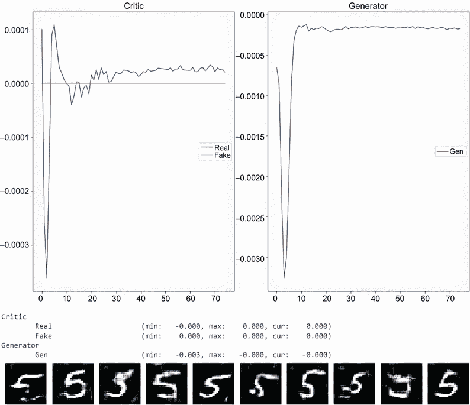

图 9.11 在提取的数字上训练 Wasserstein GAN。

图 9.11 显示了在 MNIST 手写数字数据集的一个单独提取类别上训练这个 GAN 在 80 个 epoch 的结果。如果你想看到这个数据集在 Fashion-MNIST 数据集上的表现，请重新运行整个笔记本，并在列表 9.18 中更改代码。你也可以移除对 extract 函数的调用，以查看模型在数据集的所有类别上的表现。

列表 9.18 EDL_9_3_WGAN.ipynb：切换到 Fashion-MNIST 数据集

```
from tensorflow.keras.datasets import mnist as data    ❶
#from tensorflow.keras.datasets import fashion_mnist 
➥ as data                                             ❷
```

❶ 注释掉该行。

❷ 取消注释该行。

将 Wasserstein 损失引入 DCGAN，使其成为 WGAN 或 WDCGAN，可以缓解标准 GAN 的几个缺点。减少这些额外的复杂性使得我们更容易构建一个进化优化器来找到我们可能的最佳 GAN。在我们这样做之前，我们需要将我们的 WDCGAN 包装起来，以便它可以在下一节中用作进化优化中的编码模型。

## 9.4 编码 Wasserstein DCGAN 以进行进化。

我们已经在之前的章节中经历了将各种模型的超参数或架构编码的过程。对于我们的下一个笔记本，我们打算做同样的事情，但仅限于超参数的编码。这允许进化优化器探索一个更简洁的优化空间。

进化优化复杂模型。

随着我们尝试优化的模型变得更加复杂，我们面临着进行更多强度训练操作的迭代。我们不能再依赖于模型只训练 3 个 epoch 就能给出合理的结果；相反，一些模型可能需要训练数百个 epoch。GAN 优化是那些训练成本可能很高的问题集之一。正因为如此，如果你想看到有趣或好的结果，预期一些优化可能需要数小时甚至数天的时间来训练。

下一个笔记本是对本章中我们一直在开发的 GAN 代码的扩展和整合，将其合并为一个单独的类。这个类通过传递一个`individual` `gene`序列来实例化，以填充各种模型超参数。`gene`序列是我们之前在应用遗传算法时多次见过的简单浮点数数组。

在 Colab 中打开 EDL_9_4_WDCGAN_encoder.ipynb 笔记本。然后从菜单中选择运行 > 运行所有来运行所有单元格。

在这个笔记本中，一个单独的类封装了整个模型以及每个类的变体，每个类的变体由一个输入`gene`序列控制：一个浮点数数组，其中数组中的每个元素都有一个由序列索引定义的对应控制的超参数。定义这些索引和超参数值的最小/最大限制的代码如下所示。

列表 9.19 EDL_9_4_WDCGAN_encoder.ipynb: `gene`编码参数

```
FILTERS = 0          ❶
MIN_FILTERS = 16
MAX_FILTERS = 128
ALPHA = 1            ❷
MIN_ALPHA = .05
MAX_ALPHA = .5
CRITICS = 2          ❸
MIN_CRITICS = 1
MAX_CRITICS = 10
CLIP = 3             ❹
MIN_CLIP = .005
MAX_CLIP = .1
LR = 4               ❺
MIN_LR = .00000001
MAX_LR = .0001 
```

❶ 卷积中使用的基滤波器数量

❷ LeakyReLU 中使用的 Alpha 参数

❸ 每个生成器迭代的批评次数

❹ 裁剪批评权重的范围

❺ 优化器的学习率

我们接下来可以查看`DCGAN`类的`__init__`函数，以了解`gene`序列`i`如何定义模型中使用的每个超参数，如列表 9.20 所示。首先，我们确保`image_shape`能被 4 整除并且可以适应模型的卷积架构。接下来，每个超参数值通过将浮点数映射到相应的空间来生成。代码还初始化权重在零值周围，以便更好地将权重与裁剪函数对齐。最后，代码创建一个单独的优化器，然后构建各种模型。

列表 9.20 EDL_9_4_DCGAN_encoder.ipynb: 初始化模型

```
class DCGAN:
  def __init__(self, i):  
    assert image_shape[0] % 4 == 0, "Image shape must 
    ➥ be divisible by 4."                              ❶

    self.image_shape = image_shape
    self.z_size = (1, 1, latent_dim)

    self.n_filters = linespace_int(i[FILTERS], 
    ➥ MIN_FILTERS, MAX_FILTERS)              
    self.alpha = linespace_int(i[ALPHA], MIN_ALPHA,     ❷
    ➥ MAX_ALPHA)                                       ❷
    self.lr = linespace(i[LR], MIN_LR, MAX_LR)          ❷
    self.clip_lower = -linespace(i[CLIP], MIN_CLIP,     ❷
    ➥ MAX_CLIP)                                        ❷
    self.clip_upper = linespace(i[CLIP], MIN_CLIP,      ❷
    ➥ MAX_CLIP)                                        ❷
    self.critic_iters = linespace_int(i[CRITICS],       ❷
    ➥ MAX_CRITICS, MIN_CRITICS)                        ❷
    self.weight_init = RandomNormal(mean=0., 
    ➥ stddev=0.02)                                     ❸
    self.optimizer = RMSprop(self.lr)                   ❹

    self.critic = self.build_critic()                   ❺
    self.g = self.build_generator()                     ❺
    self.gan = self.build_gan()                         ❺
```

❶ 确认图像大小能被 4 整除

❷ 将浮点数转换为超参数

❸ 初始化起始权重

❹ 创建一个单独的优化器

❺ 构建模型

我们之前已经看到了大部分代码，但我们应该突出显示训练函数中的一个更新部分，如列表 9.21 所示。在 GANs 中比较模型之间的损失比较复杂，因为损失函数和模型性能存在差异。为了比较一个 GAN 和另一个 GAN 之间的损失，我们标准化损失。我们通过跟踪`critic`和`generator`的最小和最大损失来实现这一点，然后使用`reverse_space`函数在`0`和`1`之间的线性空间上输出这个值。

列表 9.21 EDL_9_4_DCGAN_encoder.ipynb：归一化输出损失

```
min_g_loss = min(min_g_loss, g_loss)                       ❶
min_fake_loss = min(min_fake_loss, c_loss[1])              ❶
min_real_loss = min(min_real_loss, c_loss[0])              ❶

max_g_loss = max(max_g_loss, g_loss)                       ❷
max_fake_loss = max(max_fake_loss, c_loss[1])              ❷
max_real_loss = max(max_real_loss, c_loss[0])              ❷

loss = dict(
  Real = reverse_space(c_loss[0],min_real_loss,            ❸
  ➥ max_real_loss),                                       ❸
  Fake = reverse_space(c_loss[1],min_fake_loss,            ❸
  ➥ max_fake_loss),                                       ❸
  Gen = reverse_space(g_loss, min_g_loss, max_g_loss) )    ❸
```

❶ 跟踪最小损失

❷ 跟踪最大损失

❸ 将值归一化到 0–1 范围内

通过将包括训练函数在内的所有内容封装到一个类中，我们可以快速实例化一个具有已知 `gene` 序列的 GAN 来测试结果。为此，如列表 9.22 所示，我们使用 `reverse_space` 函数将已知的超参数值转换为序列中嵌入的适当浮点值，称为 `individual`。然后，将这个 `individual` 传递到 `DCGAN` 构造函数中创建模型。之后，调用类的 `train` 函数，使用 `verbose=1` 选项显示训练结果。

列表 9.22 EDL_9_4_DCGAN_encoder.ipynb：测试编码和 GAN 训练

```
individual = np.random.random((5))                                   ❶
individual[FILTERS] = reverse_space(128, MIN_FILTERS, MAX_FILTERS)   ❷
individual[ALPHA] = reverse_space(.2, MIN_ALPHA, MAX_ALPHA)          ❷
individual[CLIP] = reverse_space(.01, MIN_CLIP, MAX_CLIP)            ❷
individual[CRITICS] = reverse_space(5, MIN_CRITICS, MAX_CRITICS)     ❷
individual[LR] = reverse_space(.00005, MIN_LR, MAX_LR)               ❷
print(individual)

dcgan = DCGAN(individual)                                            ❸
history = dcgan.train(train_images, verbose=1)                       ❹
```

❶ 创建一个随机个体

❷ 将值转换为 0–1 空间

❸ 使用个体创建模型

❹ 训练模型并显示结果

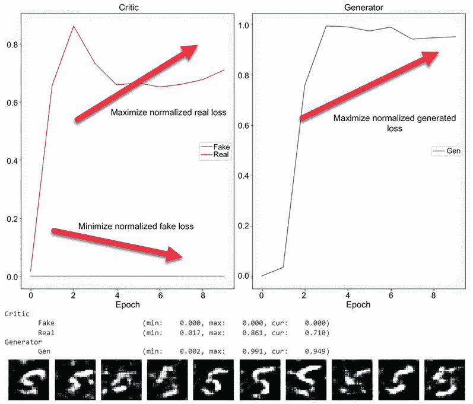

图 9.12 训练 DCGAN 10 个周期的输出

图 9.12 展示了在 MNIST 手写数字数据集的一个提取类别上训练模型 10 个周期的结果。通过归一化损失，我们可以清楚地看到模型正在努力优化的内容。如果你将这些结果与图 9.11 进行比较，你可以清楚地看到在已知范围内识别优化目标是多么容易。这是在使用遗传算法优化模型时一个关键的部分，正如本章后面所讨论的。

尝试其他超参数值，看看这些如何影响模型训练。你可能想尝试使用完全随机的 `gene` 序列来查看模型生成的结果。

### 9.4.1 学习练习

使用以下练习来提高你对 WGAN 的理解：

1.  调整列表 9.19 中的 `gene` 编码超参数，然后重新运行笔记本。

1.  不要使用 `extract` 函数将数据集限制为单个类别，然后使用所有数据重新运行笔记本。

1.  使用不同的数据集，例如 Fashion-MNIST，然后重新运行笔记本。

现在我们已经封装了一个代表 GAN 的类，并且能够传递一个代表性的 `gene` 序列来初始化模型，我们可以继续进行优化。在下一节中，我们将遗传算法代码添加到优化这个 DCGAN 模型中。

## 9.5 使用遗传算法优化 DCGAN

现在我们已经为复制 DCGAN 构建了遗传编码器，我们可以将所有内容整合在一起。在这个阶段，优化封装的 DCGAN 类只是简单地添加 DEAP 并定义我们需要的进化 GA 参数。再次强调，添加进化搜索为我们提供了自我优化 GAN 网络的能力——这正是我们在下一个笔记本中所做的。

在 Colab 中打开 EDL_9_5_EVO_DCGAN.ipynb 笔记本。通过选择菜单中的“运行”>“运行所有”来运行整个笔记本。

如你可能注意到的，这个笔记本安装了 DEAP，并添加了执行 GA 进化的所需工具和算子。不相关的代码单元格被隐藏了，但如果你想查看它们的内 容，只需点击“显示代码”链接或双击单元格。我们之前已经看到过大部分的代码，而且像往常一样，我们只是在这里引用相关的代码部分。

我们首先来看`evaluate`函数，如列表 9.23 所示，其中我们评估模型的`fitness`。在函数的开始部分，我们将`individual`转换为字符串，以便在`trained`字典中用作索引。注意我们是如何将数值四舍五入到小数点后一位的。因此，起始值`[.2345868]`变成了`[.2]`，这简化或离散化了字典中的条目数量。这样做是为了将训练从无限探索空间简化为有限空间。更准确地说，通过将数值四舍五入到一位数字，并且知道`gene`序列长度为`5`，我们可以确定有 10 × 10 × 10 × 10 × 10 = 100,000 个可能的模型需要测试。这样做的好处是它允许进化更大的`populations`，而无需重新评估相似的`individuals`。正如本节所示，评估每个模型需要相当多的时间。

列表 9.23 EDL_9_5_EVO_DCGAN_encoder.ipynb：`evaluate`函数

```
trained = {}                                         ❶
generation = 0

def evaluate(individual): 
  ind = str([round(i, 1) for i in individual])       ❷
  if ind in trained:                                 ❸
    return trained[ind],                             ❸
  print(f"Generarion {generation} individual {ind}")
  dcgan = DCGAN(individual)
  history = dcgan.train(train_images, verbose=0)
  min_loss_real = 1/loss(history, "Real")            ❹
  min_loss_gen = 1/loss(history, "Gen")              ❹
  min_loss_fake = loss(history, "Fake")              ❹
  total = (min_loss_real + min_loss_gen + 
  ➥ min_loss_fake)/3                                ❺
  print(f"Min Fitness {min_loss_real}/{min_loss_gen}:{total}")
  trained[ind] = total                               ❻
  return total,     

toolbox.register("evaluate", evaluate)  
```

❶ 保存评估历史的字典

❷ 四舍五入数值

❸ 训练历史的字典

❹ 计算优化损失

❺ 计算损失的平均值

❻ 训练历史的字典

优化 DCGAN 不是简单比较准确性的问题。我们需要考虑模型输出的三个值或损失：真实、伪造和生成损失。这些损失中的每一个都需要以不同的方式进行优化——在这种情况下，最小化。如果你参考列表 9.23，你可以看到每个损失是如何提取的，在真实和生成损失的情况下，它们被反转以产生部分`fitness`。总`fitness`是三个派生损失或`fitness`值的平均值。

笔记本中的输出显示了进化 DCGAN 最优解的部分结果。我们留给你自己运行这个示例并探索你能产生的最佳潜在 GAN。

最后一个笔记本可能需要相当长的时间来进化，但它自动化了，最终会得到好的结果。在 AutoML 解决方案中，GAN 或其他复杂模型通常不是需要自动化优化的列表上的高优先级。随着时间的推移和 AI/ML 领域的发展，我们这里介绍的方法可能会变得更加主流。

### 9.5.1 学习练习

使用以下练习继续探索这个 Evo DCGAN 版本：

1.  抽出时间进化一个 GAN 模型。然后，使用这个模型在数据集上继续训练，看看你能够生成多好的新输出。

1.  将在一个数据集上开发的进化模型重新用于在新的数据集上训练 GAN。这在数据集大小相似的情况下效果最佳，例如 Fashion-MNIST 和 MNIST 手写数字数据集。

1.  将这个笔记本调整为使用进化策略和/或微分进化。评估这种方法可能或可能不会改善 GAN 训练超参数的进化。

## 摘要

+   生成对抗网络是一种生成模型，它使用双网络——一个用于数据判别，另一个用于数据生成：

    +   GANs 通过向判别器提供真实样本，同时允许生成器生成假样本来工作。

    +   生成器通过从判别器获得反馈来学习生成更好的输出，而判别器也在学习更好地将数据分类为真实或假。

    +   使用 Python 和 Keras 可以简单地构建 GAN。

+   GANs 以其难以有效训练而闻名：

    +   训练 GAN 的核心问题是在判别器和生成器学习速度之间取得平衡。

    +   两个网络需要以相同的速率学习，以平衡它们之间的对抗关系。

    +   当 GANs 失去平衡时，可能会出现许多常见问题，例如无法收敛、模式坍塌和梯度消失。

    +   通过使用进化算法来解决这个训练问题。

+   水晶距离（Wasserstein loss）或地球迁移距离是一种衡量损失的措施，可以帮助 GAN 解决或最小化常见的训练问题。

+   通过将 GAN（DCGAN）封装到一个接受遗传编码的 `genome` 表示形式的类中，可以帮助平衡 GAN 的训练超参数。

+   可以使用遗传算法来平衡 GAN 中判别器和生成器的训练。
