# 10 NEAT：增强拓扑结构的神经进化

本章涵盖

+   构建进化的增强拓扑结构网络

+   可视化增强拓扑结构的神经进化网络

+   锻炼增强拓扑结构的神经进化能力

+   锻炼增强拓扑结构的神经进化以对图像进行分类

+   揭示物种形成在神经进化中的作用

在过去几章的内容中，我们探讨了生成对抗网络和自编码器网络的进化优化。与之前的章节类似，在这些练习中，我们在深度学习网络周围叠加或包裹了进化优化。在本章中，我们脱离了 Python 中的分布式进化算法（DEAP）和 Keras，来探索一个名为*增强拓扑结构的神经进化*（NEAT）的神经进化框架。

NEAT 是由肯·斯坦利在 2002 年开发的，当时他在德克萨斯大学奥斯汀分校。当时，遗传算法（进化计算）和深度学习（高级神经网络）是平等的，并且都被认为是人工智能的下一个大事物。斯坦利的 NEAT 框架吸引了众多人的注意，因为它将神经网络与进化相结合，不仅优化了超参数、权重参数和架构，而且还优化了实际的神经网络连接本身。

图 10.1 显示了常规深度学习网络和进化 NEAT 网络之间的比较。在图中，已经添加和删除了新的连接，并且在进化 NEAT 网络中删除和/或改变了节点的位置。注意这与我们之前仅仅改变深度学习连接层中节点数量的努力有何不同。

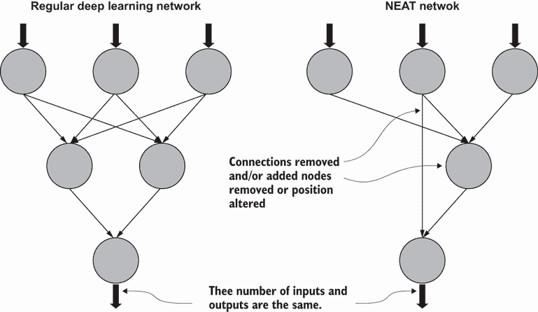

图 10.1 深度学习网络和 NEAT 网络的比较

NEAT 通过允许网络的神经连接和节点数量进化，将进化深度学习网络的概念推向了极致。由于 NEAT 还内部进化每个节点的网络权重，因此消除了使用微积分计算误差反向传播的复杂性。这使得 NEAT 网络能够进化到一些复杂的交织和互联的图。它甚至允许网络进化循环连接，正如我们在下一章深入探讨 NEAT 时所看到的。

在本章中，我们探讨了 NEAT 的基本原理，并深入研究了名为 NEAT-Python 的 Python 实现。这个框架很好地抽象了设置进化和深度学习系统的细节。以下列表标识了 NEAT 的每个组件，这些组件涵盖了本书中使用的许多其他方法：

+   *参数的神经进化*——NEAT 中的权重和参数作为系统的一部分进化。在第六章中，我们使用进化来改变神经网络的权重。

+   *架构的神经进化*——NEAT 进化网络层，结构本身通过进化进行适应。参见第七章，其中我们介绍了使用遗传算法进行神经进化架构的内容，以了解更多相关信息。

+   *超参数优化*——NEAT 不使用学习率、优化器或其他标准深度学习辅助工具。因此，它不需要优化这些参数。然而，正如我们将看到的，NEAT 引入了几个超参数来控制网络进化。

在下一节中，我们从基础知识开始，开始探索 NEAT。

## 10.1 使用 NEAT-Python 探索 NEAT

本章中我们首先考虑的笔记本设置了一个 NEAT 网络来解决经典的一阶 XOR 问题。NEAT 提供了几个配置选项，这个第一个练习展示了其中一些最重要的选项。打开您的网络浏览器，让我们开始查看一些代码。

在 Google Colab 中打开 EDL_10_1_NEAT_XOR.ipynb 笔记本。如需帮助，请参阅附录。通过选择菜单中的“运行”>“运行所有”来运行笔记本中的所有单元格。

NEAT-Python 仍在积极开发中，截至写作时，最佳实践是直接从 GitHub 仓库安装它，而不是从 PyPi 包安装。笔记本中的第一个代码单元格使用`pip`在第一行执行此操作，如下所示。然后，下一行使用`import neat`导入包。

列表 10.1 EDL_10_1_NEAT_XOR.ipynb：安装 NEAT-Python

```
!pip install 
➥ git+https://github.com/CodeReclaimers/neat-python.git   ❶

#then import 
import neat                                                ❷
```

❶ 从 GitHub 仓库安装

❷ 导入包

滚动到下一个单元格，显示数据的设置，分为`xor_inputs`（X）和`xor_outputs`（Y），如下所示。

列表 10.2 EDL_10_1_NEAT_XOR.ipynb：数据设置

```
xor_inputs = [(0.0, 0.0), (0.0, 1.0), (1.0, 0.0), 
➥ (1.0, 1.0)]                                     ❶
xor_outputs = [   (0.0,),     (1.0,),     (1.0,),     
➥ (0.0,)]                                         ❷
```

❶ 输入：X

❷ 输出：Y

接下来，正如我们之前多次做的那样，我们构建一个评估函数来计算进化 NEAT 网络的“适应度”。这个概念现在应该相当熟悉了，代码与之前的练习相似。与 DEAP 不同，评估函数接受一组称为“基因组”的“基因”序列。函数遍历“基因组”，并为每个计算“适应度”，首先分配一些最大“适应度”，如列表 10.3 所示。然后，它使用`FeedForwardNetwork.create`函数创建一个经典的前馈网络的新版本，传入`genome`和配置。然后，通过使用`net.activate`函数对所有数据进行测试，传入`X`或`xi`值之一，并产生`Y`输出。每次激活输入后，输出与预期的输出`xo`进行比较，从`genome.fitness`中减去均方误差（MSE）。最后，`eval_genomes`函数的结果更新了每个进化“基因组”的当前“适应度”。

列表 10.3 EDL_10_1_NEAT_XOR.ipynb：创建评估函数

```
def eval_genomes(genomes, config):
  for genome_id, genome in genomes:                 ❶
    genome.fitness = 4.0                            ❷
    net = neat.nn.FeedForwardNetwork.create
    ➥ (genome, config)                             ❸
    for xi, xo in zip(xor_inputs, xor_outputs):     ❹
      output = net.activate(xi)            
      genome.fitness -= (output[0] - xo[0]) ** 2    ❺
```

❶ 遍历基因组

❷ 分配最大适应度

❸ 从基因组创建 NEAT 网络

❹ 遍历数据

❺ 计算均方误差（MSE）然后从适应度中减去

下一个单元格设置了用于配置和运行 NEAT 代码的配置文件。NEAT-Python（NP）主要是由配置驱动的，你可以更改或微调几个选项。为了保持简单，我们只回顾列表 10.4 中的主要选项：前两个部分。`config`首先设置`fitness`标准、`fitness`阈值、种群大小和`reset`选项。之后，设置默认的`genome`配置，首先是激活选项，在这种情况下，只是`sigmoid`函数。NEAT 允许你从多个激活函数中选择选项，这些选项用于内部互联节点和输出。

列表 10.4 EDL_10_1_NEAT_XOR.ipynb：配置设置

```
%%writefile config                    ❶

[NEAT]                                ❷
fitness_criterion     = max
fitness_threshold     = 3.99
pop_size              = 150           ❸
reset_on_extinction   = False

[DefaultGenome]                       ❹
# node activation options
activation_default      = sigmoid   
activation_mutate_rate  = 0.0
activation_options      = sigmoid     ❺
```

❶ 将单元格内容写入名为 config 的文件

❷ 一般配置参数

❸ 设置要进化的个体数量

❹ 基因配置参数

❺ 默认激活函数

笔记本中的最后一个代码单元格包含我们进化 NEAT 网络所需的所有代码。我们首先回顾列表 10.5 中的前几行。代码首先加载配置并设置基因、繁殖、物种和停滞的基础假设。我们将在本章和下一章中介绍这些默认值。之后，从`config`创建`genome`种群。然后，向`population`对象添加报告器`StdOutReporter`以跟踪进化过程。注意`population`对象`p`是如何成为进化的焦点，以及它与 DEAP 的不同之处。

列表 10.5 EDL_10_1_NEAT_XOR.ipynb：设置 NEAT 进化

```
config = neat.Config(neat.DefaultGenome, neat.DefaultReproduction,
                     neat.DefaultSpeciesSet, neat.DefaultStagnation,
                     'config')               ❶

p = neat.Population(config)                  ❷

p.add_reporter(neat.StdOutReporter(False))   ❸
```

❶ 从配置文件中加载配置

❷ 创建种群

❸ 在进化过程中添加报告器以查看结果

通过在`population`对象上调用`run`函数，简单地运行或执行种群的进化，如下所示。进化完成后，代码将打印出获胜者，即具有最佳`fitness`的`genome`，并输出对 XOR 输入的预测。

列表 10.6 EDL_10_1_NEAT_XOR.ipynb：进化种群

```
winner = p.run(eval_genomes)                           ❶

print('\nBest genome:\n{!s}'.format(winner))           ❷

print('\nOutput:')                                     ❸
winner_net = neat.nn.FeedForwardNetwork.create(winner, config)
for xi, xo in zip(xor_inputs, xor_outputs):
    output = winner_net.activate(xi)
    print(" input {!r}, expected output {!r}, got {!r}".format(xi, xo, 
    ➥ output))
```

❶ 对种群执行进化

❷ 打印出最佳基因

❸ 使用基因预测 XOR 并显示

运行此示例的输出如图 10.2 所示。与 DEAP 不同，NP 使用`fitness`阈值的概念来控制进化迭代次数。如果你还记得，在`config`设置中，我们将`fitness_threshold`设置为`3.99`（见列表 10.4）。图中还显示了网络配置和权重的文本输出。当然，这并不是容易可视化的东西，但我们将在未来的章节中介绍。在图的下端，你可以看到 XOR 输入被正确预测的程度。

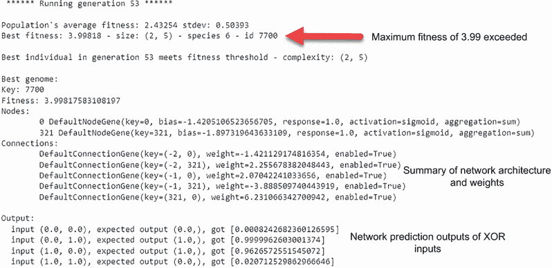

图 10.2 在 XOR 上进化 NEAT 网络的最终输出

这个练习演示了我们可以如何快速设置 NEAT 进化来创建一个能够预测 XOR 函数的网络。正如你所看到的，代码中抽象了很多细节，但希望在这个阶段，你理解了进化是如何被应用的内部工作原理的一些内容。除了增强节点拓扑结构之外，我们之前使用 DEAP 完成了所有内部操作。

### 10.1.1 学习练习

使用以下学习练习来了解更多关于 NEAT 的信息：

1.  在列表 10.4 中更改`population`大小（`pop_size`），然后重新运行笔记本。`population`大小如何影响进化？

1.  在列表 10.4 中减小`fitness_threshold`，然后重新运行笔记本，看看这会对结果产生什么影响。

1.  更改输入或输出以匹配另一个函数，或者编写一个函数来创建列表 10.2 中的输出。然后，重新运行笔记本以查看近似新函数的结果。

从这个基本介绍开始，我们将在下一节中探索可视化进化的 NEAT 网络看起来是什么样子。

## 10.2 可视化进化的 NEAT 网络

现在我们已经将 NEAT-Python 的基本设置完成，我们可以看看添加一些有用的工具到我们的工具箱中。可视化 NEAT 网络对于理解网络架构是如何形成的非常有用。它还突出了网络在拟合或欠拟合问题上的表现如何。

在本节中，我们采用之前的笔记本示例，并添加了可视化进化的最佳`genome`网络的能力。我们还仔细研究了评估`fitness`函数是如何开发的。

在 Google Colab 中打开 EDL_10_2_NEAT_XOR_Visualized.ipynb 笔记本。如需帮助，请参阅附录。通过选择菜单中的“运行”>“运行所有”来运行笔记本中的所有单元格。

跳到加载`config`后的代码单元格开始。所有这些代码通常都在`population`类中处理，但我们提取了这个小节，如列表 10.7 所示，以突出构建评估函数。在 NP 中，所有`genomes`都需要一个键或唯一标识符，这里我们任意使用`fred`。然后，根据默认类型从`config`创建一个`genome`——在这个例子中，是一个`DefaultGenome`。之后，使用`genome_config`通过`genome.configure_new`配置`genome`。最后，通过`FeedForwardNetwork.create`传递`genome`和`config`创建了一个新的`fred` 1.0 随机网络。

列表 10.7 EDL_10_2_NEAT_XOR_Visualized.ipynb：创建`genome`网络

```
key = "fred"                                              ❶
genome = config.genome_type(key)                          ❷
genome.configure_new(config.genome_config)                ❸

net = neat.nn.FeedForwardNetwork.create(genome, config)   ❹
```

❶ 为基因组分配一个键

❷ 创建基因组类型

❸ 从配置中配置基因组

❹ 从基因组创建前馈网络

接下来，网络`net`被`评估`，使用`for`循环遍历数据，从最大`适应度`中减去 MSE，如列表 10.8 所示。回想一下，在实际评估函数列表 10.4 中，代码也遍历了整个`基因组`的`种群`。为了简单起见，我们在这里只`评估`了`基因组` `fred`。此代码块的输出显示了网络的输入和输出以及总`适应度`。

列表 10.8 EDL_10_2_NEAT_XOR_Visualized.ipynb：评估`基因组`

```
fitness = 4                         ❶
for x, y in zip(X, Y):              ❷
  output = net.activate(x)          ❸
  print(output, y)
  fitness -= (output[0]-y[0])**2    ❹

print(fitness)
```

❶ 分配最大适应度值

❷ 遍历 x 和 y 值

❸ 在输入上激活网络

❹ 计算 MSE 然后减去

在设置`fred`之后，我们继续到`draw_net`函数。此函数已直接从 NEAT 示例中提取，并使用 Graphviz 绘制一个进化的网络。您可以自己查看代码，但在这里我们不会关注具体细节。相反，我们想看看如何调用该函数以及它生成的内容。

下一步是调用`draw_net`函数；它首先在字典中命名输入和输出节点。之后，通过传递`config`、`genome`和主要节点（输入和输出）的名称来调用`draw_net`函数。我们传递值`True`以可视化输出，如下所示。

列表 10.9 EDL_10_2_NEAT_XOR_Visualized.ipynb：调用`draw_net`函数

```
node_names = {-1: 'X1', -2: 'X2', 0: 'Output'}        ❶
draw_net(config, genome, True, node_names=node_names) ❷
```

❶ 命名输入和输出节点。

❷ 使用 True 调用函数以查看。

图 10.3 显示了我们所称的`fred`的基本和未进化的`基因组`的输出。如图所示，网络是一个非常简单的单节点网络，有两个输入，分别标记为`X1`和`X2`。

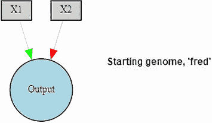

图 10.3 一个初始的 NEAT 网络可视化

到目前为止，NEAT 的`种群`应该已经进化，我们可以再次调用`draw_net`函数，这次传入获胜的`基因组` `winner`。在`种群`上调用`run`会输出获胜者，或最佳`基因组`。然后，从获胜者创建网络以展示激活。接下来，使用获胜者的`基因组`调用`draw_net`来可视化网络，如下所示。

列表 10.10 EDL_10_2_NEAT_XOR_Visualized.ipynb：可视化获胜`基因组`

```
winner = p.run(eval_genomes)                                     ❶

print('\nBest genome:\n{!s}'.format(winner))                     ❷

print('\nOutput:')
winner_net = neat.nn.FeedForwardNetwork.create(winner, config)
for xi, xo in zip(X, Y):                                         ❸
  output = winner_net.activate(xi)
  print("  input {!r}, expected output {!r}, got {!r}".format(xi, xo, 
  ➥ output))

draw_net(config, winner, True, node_names=node_names)            ❹
```

❶ 进化获胜基因组

❷ 输出获胜分数

❸ 遍历并显示激活

❹ 绘制进化的获胜基因组

图 10.4 显示了获胜`基因组`网络的输出。这显然与经典的深度学习网络中的常规层不相似。相反，我们在这里看到的是一个能够高效处理 XOR 问题的优化网络。

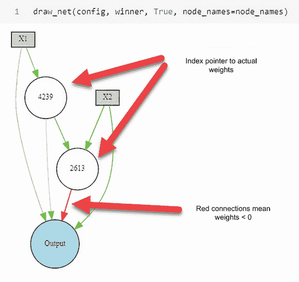

图 10.4 显示获胜`基因组`网络

能够可视化最终演化的网络有助于理解 NEAT 的工作原理。可视化一个演化的网络也有助于了解配置参数是否足够。正如我们在下一节中看到的，NEAT 有许多旋钮和开关，我们需要理解它们来开发解决更复杂问题的解决方案。

## 10.3 锻炼 NEAT 的能力

NEAT 及其在 NEAT-Python 中的实现是封装了我们在这本书中实践过的许多优化模式的工具。NEAT 将网络超参数、架构和参数优化以及拓扑增强纳入其中。但它做得好吗？

在本节中，我们回顾了我们使用 sklearn 包制作示例数据集的一个有趣的视觉分类示例。如果你还记得，我们在第六章中展示了使用 EC 进行参数权重优化。这不仅提供了一个很好的基线，还展示了 NEAT 的几个其他配置选项。

在 Google Colab 中打开 EDL_10_3_NEAT_Circles.ipynb 笔记本。如需帮助，请参考附录。通过菜单选择 Runtime > Run All 来运行笔记本中的所有单元格。

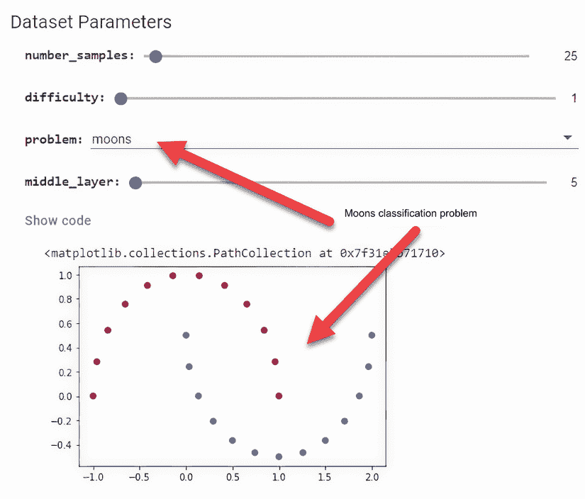

图 10.5 配置数据集生成参数

我们从数据集参数表和图 10.5 所示的输出开始。这是我们之前章节中用来生成各种分类问题数据集的相同表单。首先，我们使用月亮问题生成一个简单的数据集。生成的输出显示了一个应该相对容易用简单网络进行分类的数据集。

由于我们现在处理的问题比 XOR 更复杂，我们希望修改 NEAT 配置文件中的配置选项。列表 10.11 仍然只是所有`config`选项的部分视图，我们再次强调关键的选项，首先是将最大`fitness_threshold`从`4.0`降低到`3.0`，即 75%。然后，我们增加或添加一个中间或中间节点层。在 NEAT 中，我们不按层来考虑节点；我们只关心输入/输出和中间或中间节点的数量。如果这些中间节点恰好按层排列，那是一个愉快的意外，但不是可以预期的。接下来，我们面临几个选项，首先是兼容性。这些选项是用于`speciation`的，将在稍后介绍。最后要注意的是，我们已经通过添加另外两个可能的功能（`identity`和`relu`）来更新了激活选项。

列表 10.11 EDL_10_3_NEAT_Circles.ipynb：检查配置选项

```
[NEAT]
fitness_criterion     = max
fitness_threshold     = 3.0                           ❶
pop_size              = 250
reset_on_extinction   = 0

[DefaultGenome]
num_inputs              = 2
num_hidden              = 10                          ❷
num_outputs             = 1
initial_connection      = partial_direct 0.5
feed_forward            = True
compatibility_disjoint_coefficient    = 1.0           ❸
compatibility_weight_coefficient      = 0.6           ❸
conn_add_prob           = 0.2
conn_delete_prob        = 0.2
node_add_prob           = 0.2
node_delete_prob        = 0.2
activation_default      = sigmoid                     ❹
activation_options      = sigmoid identity relu       ❹
activation_mutate_rate  = 0.1                         ❹
```

❶ 将 fitness_threshold 降低到 3.0。

❷ 增加隐藏中间节点的数量

❸ 用于物种形成

❹ 激活选项已扩展。

图 10.6 显示了应用新配置选项的起始`genome`网络的输出。值得注意的是，并非所有节点都连接到输出，节点 10 既没有连接到输入也没有连接到输出。这允许网络消除不必要的节点，从而防止过拟合或欠拟合的问题。

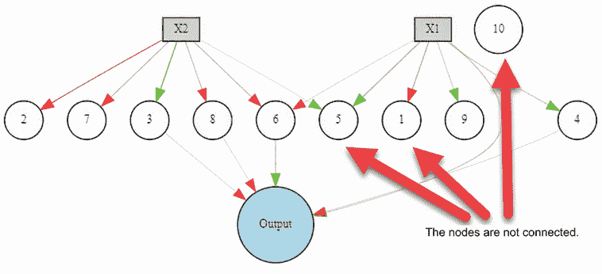

图 10.6 未进化的随机网络的输出

在这一点上，跳到笔记本的底部并查看以下列表中的进化代码。大部分代码已经介绍过，但请注意添加了`CustomReporter`到`population`，`p`，使用`add_reporter`函数调用。添加这个自定义报告允许我们微调进化输出，并允许我们添加可视化。

列表 10.12 EDL_10_3_NEAT_Circles.ipynb：进化网络

```
p = neat.Population(config)                                ❶

p.add_reporter(CustomReporter(False))                      ❷

winner = p.run(eval_genomes)                               ❸

print('\nBest genome:\n{!s}'.format(winner))               ❹

print('\nOutput:')                                         ❹
winner_net = neat.nn.FeedForwardNetwork.create(winner, config)
show_predictions(winner_net, X, Y)
draw_net(config, winner, True, node_names=node_names)      ❹
```

❶ 创建人口

❷ 添加 CustomReporter 进行可视化

❸ 评估胜者

❹ 输出结果

滚动到`CustomReporter`类定义，如列表 10.13 所示。NEAT-Python 允许进行各种自定义，而这个实现只是标准报告器的副本，增加了一些用于可视化拟合进度的代码。在这个新的报告器类中，我们在`post_evaluate`函数中添加了自定义代码，该函数在`genomes`被`evaluated`后调用。我们不希望这段代码在每次迭代时都渲染，因此我们添加了一个模检查，该检查由在`init`函数中设置的新的`self.gen_display`参数控制。如果`generation`等于显示的 gen，则代码从`genome`创建一个网络，并在更新`show_predictions`函数中对其进行`evaluate`。

列表 10.13 EDL_10_3_NEAT_Circles.ipynb：`CustomReporter`类定义

```
from neat.math_util import mean, stdev

class CustomReporter(neat.reporting.BaseReporter):                ❶
  "Uses 'print' to output information about the run; an example 
reporter class."

  def __init__(self, show_species_detail, 
  ➥ gen_display=100):                                            ❷
      #omitted

  def post_evaluate(self, config, population, species, 
  ➥ best_genome):                                                ❸
    #omitted
      if (self.generation) % self.gen_display == 0 :              ❹
        net = neat.nn.FeedForwardNetwork.create(best_genome, config)      
        show_predictions(net, X, Y)     
        time.sleep(5) 
```

❶ 类定义继承自 BaseReporter。

❷ 初始化函数，仅供参考

❸ 添加到 post_evaluate

❹ 自定义代码的开始

回想第六章中我们如何首先在 Keras 网络上使用`show_predictions`函数。在 NEAT 上使用此函数已经更新，如下面的列表所示。与前一段代码的主要变化是使用`net.activate`函数而不是 Keras 中的`model.predict`。

列表 10.14 EDL_10_3_NEAT_Circles.ipynb：更新的`show_predictions`函数

```
def show_predictions(net, X, Y, name=""):    
    x_min, x_max = X[ :, 0].min() – 1, X[ :, 0].max() + 1   ❶
    y_min, y_max = X[:, 1].min() – 1, X[:, 1].max() + 1     ❶
    xx, yy = np.meshgrid(np.arange(x_min, x_max, 0.01),     ❶
    ➥ np.arange(y_min, y_max, 0.01))                       ❶
    X_temp = np.c_[xx.flatten(), yy.flatten()]              ❶
    Z = []

    for x in X_temp:
      Z.append(net.activate(x))                             ❷
    Z = np.array(Z)                                         ❷
    plt.figure("Predictions " + name)  
    plt.contourf(xx, yy, Z.reshape(xx.shape), 
    ➥ cmap=plt.cm.Spectral)                                ❸
    plt.ylabel('x2')
    plt.xlabel('x1')
    plt.scatter(X[:, 0], X[:, 1],c=Y, s=40, cmap=plt.cm.Spectral)
    plt.show()                                              ❹
```

❶ 创建输入和输出的网格

❷ 激活网络并输出结果

❸ 使用光谱图绘制结果

❹ 显示输出

图 10.7 显示了在月亮问题数据集上进化 NEAT 网络的结果。注意，网络中的大多数节点都没有输出到输出节点。你的结果和网络可能会有所不同，但在图中，你可以看到只有两个节点是相关的，并且连接到输出节点。

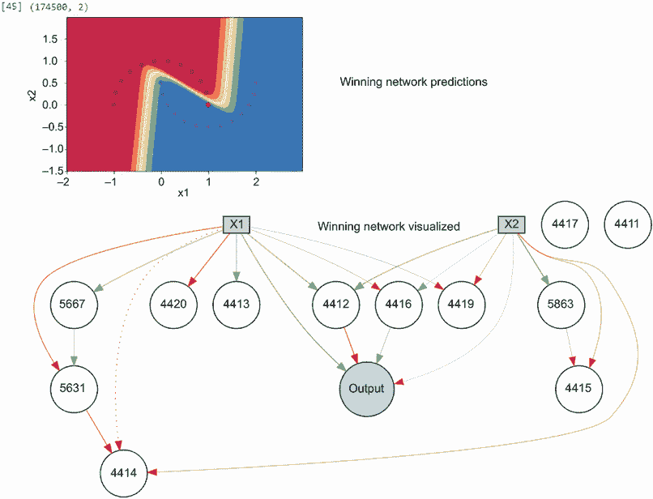

图 10.7 进化 NEAT 网络在月亮问题上的输出

如果你还记得，在第六章中，我们最困难的问题是圆的问题。请将问题切换到圆，然后再次运行笔记本。根据经验，我们知道这个问题可以使用标准的 Keras 网络解决。然而，鉴于我们当前的配置选项，找到解决方案的可能性不大。

### 10.3.1 学习练习

使用以下练习来探索 NEAT 的能力：

1.  更改图 10.5 中的数据样本数量。观察这对 NEAT 近似的影响。

1.  更改图 10.5 中的问题类型，然后重新运行笔记本。NEAT 是否比其他问题处理得更好？

1.  在列表 10.11 中增加或减少隐藏节点 (`num_hidden`) 的数量。然后尝试解决各种问题类型。隐藏节点的数量对构建解决方案有什么影响？

在我们正确解决圆的问题之前，我们将在下一节中深入探讨使用 NEAT 的一个更实际的例子。

## 10.4 练习 NEAT 进行图像分类

为了真正理解 NEAT 的局限性和能力，我们在本节提供了一个实际的比较。一个著名的例子是：使用 MNIST 手写数字数据集进行图像分类。对于我们的下一个练习，我们使用 NEAT 来分类 MNIST 数据集。

在 Google Colab 中打开 EDL_10_4_NEAT_Images.ipynb 笔记本。如需帮助，请参考附录。通过菜单选择运行 > 运行所有来运行笔记本中的所有单元格。

这个笔记本加载了 MNIST 数据集，如图 10.8 所示。我们只使用数据集的训练数据部分来 `evaluate` 批量样本上的 `genome` `fitness`。数据加载后，它被归一化，然后显示一个样本数字。请注意，我们正在使用完整数据集的所有 10 个类别。

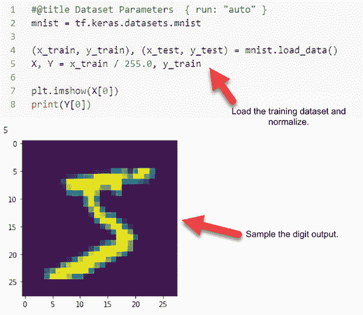

图 10.8 加载 MNIST 训练数据集

接下来，我们查看 NEAT 配置选项的各种更改，如列表 10.15 所示。第一个更改是将 `fitness` 阈值设置为 `.25`，即 25%。我们将更新 `fitness` 函数，以评分演化的网络在准确性而不是错误上的表现。然后，注意输入已增加到 `784`，以匹配输入图像的 28×28 像素，这与 Keras 模型没有区别。在这个练习中，我们为了演示将隐藏节点的数量设置为 `10`。之后，我们将 `initial_connection` 选项更改为 `full_direct`。这实际上意味着我们从一个完全连接的网络开始，这与 Keras 顺序模型没有太大区别。在显示的配置选项底部附近，我们可以看到为 `activation` 函数、`identity` 和 `relu` 设置的选项。最后，我们看到一个新的聚合选项正在被采用。聚合是在节点或感知器内部发生的操作，默认情况下，我们总是假设它是求和。在 NEAT 中，我们可以更改节点使用的聚合函数，就像我们在这里做的那样。

列表 10.15 EDL_10_4_NEAT_Images.ipynb：更新配置选项

```
[NEAT]
fitness_criterion     = max
fitness_threshold     = .25                    ❶
pop_size              = 100
reset_on_extinction   = 1

[DefaultGenome]
num_inputs              = 784                  ❷
num_hidden              = 10                   ❸
num_outputs             = 10
initial_connection      = full_direct          ❹
feed_forward            = True
compatibility_disjoint_coefficient    = 1.0
compatibility_weight_coefficient      = 0.6
conn_add_prob           = 0.2
conn_delete_prob        = 0.2
node_add_prob           = 0.2
node_delete_prob        = 0.2
activation_default      = relu
activation_options      = identity relu        ❺
activation_mutate_rate  = 0.0
aggregation_default     = sum
aggregation_options     = sum mean product min max 
➥ median                                      ❻
aggregation_mutate_rate = 0.2                  ❼
```

❶ `Fitness`现在是准确率。

❷ 展平的图像输入

❸ 中间节点的最大数量

❹ 总是开始完全连接

❺ 激活函数的选择

❻ 修改节点聚合函数

❼ 总是开始完全连接

从配置中，我们跳转到更新`evaluation`函数，如列表 10.16 所示。回想一下，我们现在想使用准确率来评分`fitness`，因为我们的网络将用于图像分类。这意味着我们想在图像集——通常是训练集——上评分网络。然而，评分整个训练图像集是不切实际的，所以我们取随机批次的图像来`evaluate`一个`genome`。在这个笔记本中，我们使用`256`的值来加速性能。这个批次大小用于生成一个随机索引集，该索引集将用于从训练集`X`和`Y`中提取数据。

列表 10.16 EDL_10_4_NEAT_Images.ipynb：随机批处理图像

```
BATCH_SIZE = 256                                     ❶
idx = np.random.randint(0, X.shape[0], BATCH_SIZE)   ❷
xs, ys = X[idx], Y[idx]                              ❸
```

❶ 设置常数

❷ 抽取随机索引

❸ 从原始数据中提取批次

在评估图像批次和标签提取之后，我们可以根据准确率评估`genome`网络，如列表 10.17 所示。随着代码遍历批次中的每个图像和标签，它首先将 2D 28×28 图像展平为 784 个输入。从那里，它激活网络并应用`SoftMax`和`np.argmax`函数来获取预测类别。类别预测被收集在`yis`变量中，并随后使用`balanced_accuracy_score`函数提取平衡准确率分数。关于平衡准确率的详细解释可以在优秀的 SciKit Learn 文档页面上找到，该页面涵盖了损失和指标类型：[`mng.bz/Q8G4`](http://mng.bz/Q8G4)。总之，平衡准确率平衡了来自不平衡数据集的预测。由于我们用于评估的批次数据是随机的，我们不能假设预测将是平衡的。使用平衡准确率可以使评估克服任何偏差。

列表 10.17 EDL_10_4_NEAT_Images.ipynb：评估`genome` `fitness`

```
from sklearn.metrics import balanced_accuracy_score    
yis = []
for x, y in zip(xs,ys):                      ❶
  x = np.reshape(x, (784,))                  ❷
  output = net.activate(x)                   ❸
  class_ = softmax(output)                   ❸
  yis.append(np.argmax(class_))              ❸
print(ys, yis)  
fitness = balanced_accuracy_score(ys, yis)   ❹
print(fitness)
```

❶ 遍历批次数据

❷ 展平图像

❸ 激活并按类别评分输出

❹ 评估基因平衡准确率

滚动到下一个单元，如下面的列表所示，我们可以看到 NEAT 进化将使用的完成评估函数。代码与我们刚才审查的相同，但它展示了它在`genome`集评估函数中的应用。

列表 10.18 EDL_10_4_NEAT_Images.ipynb：`evaluate` `fitness`函数

```
def eval_genomes(genomes, config):  
  for genome_id, genome in genomes:    
    idx = np.random.randint(0, X.shape[0], BATCH_SIZE)               ❶
    xs, ys = X[idx], Y[idx]                                          ❶
    net = neat.nn.FeedForwardNetwork.create(genome, config)
    score = 0
    yis = []
    for x, y in zip(xs,ys): 
      x = np.reshape(x, (784,))                                      ❷
      output = net.activate(x)
      output = softmax(output)
      class_ = np.argmax(output)                                     ❸
      yis.append(class_)       
    genome.fitness = fitness = balanced_accuracy_score(ys, yis)      ❹
```

❶ 提取随机批次数据

❷ 展平图像

❸ 获取预测类别

❹ 评估所有预测

运行进化的代码与之前显示的代码相同。即使添加了一些性能调整（例如，设置批量大小），运行此代码以达到 25%的准确率也需要一些时间。这是当前 NEAT-Python 实现的一个不幸后果。DEAP，我们在之前的例子中将其包装在 Keras/PyTorch 周围，提供了分布式计算选项。NEAT 作为一个更老的框架，没有这个选项。

图 10.9 展示了训练到 25%准确率的网络的预测准确性。此图是从之前笔记本中显示的`plot_classify`函数生成的。如您所见，考虑到评估是在训练集上进行的，结果是可以接受的。您的结果可能不太准确，并且将很大程度上取决于您设置的批量大小。较大的批量大小可以提高准确性，但也会将进化时间延长到几分钟甚至几小时。

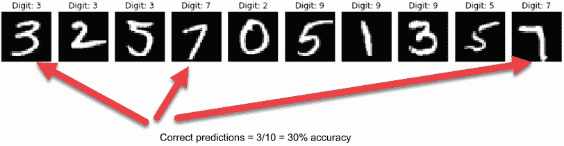

图 10.9 获胜网络预测结果

最后，这个笔记本中的最后一块代码使用我们之前使用的`draw_net`函数绘制了获胜的`genomes`网络。遗憾的是，由于连接过多，这个网络的输出无法阅读。在大多数情况下，具有所选配置选项的进化网络有 10,000 个或更多的连接——是的，您读对了。

因此，鉴于这个图像分类笔记本表现不佳，使用 NEAT 这样的框架有什么好处呢？嗯，与之前章节中的一些进化示例一样，NEAT 在封闭形式、较小的数据集优化问题上表现最佳。正如稍后讨论的那样，这并不意味着进化拓扑不是 EDL 的一个可行应用，但这是一个需要更多微调的应用。

### 10.4.1 学习练习

使用以下练习来进一步测试 NEAT 的极限：

1.  将目标数据集从 MNIST 手写数字更改为 Fashion-MNIST。模型的表现是否有所改善？

1.  在列表 10.15 中增加或减少隐藏节点（`num_hidden`）的数量，然后重新运行笔记本。

1.  在列表 10.15 中调整超参数，尝试提高结果。您能将进化网络分类数字或时尚的程度如何？

我们在本书的最后一章探索另一个进化拓扑框架。然而，现在我们将在下一节中查看 NEAT 的一个有趣特性，该特性可以改善进化，称为`speciation`。

## 10.5 揭示拓扑进化中物种的作用

在下一个笔记本中，我们将探讨 NEAT 如何使用一个名为`speciation`的功能来跟踪`population`多样性。*Speciation*起源于生物学，是一种描述相似生物如何进化出独特特征以成为不同物种的方式。*物种*的概念，首先由达尔文提出，是一种描述或分解地球生命进化方式的方法。

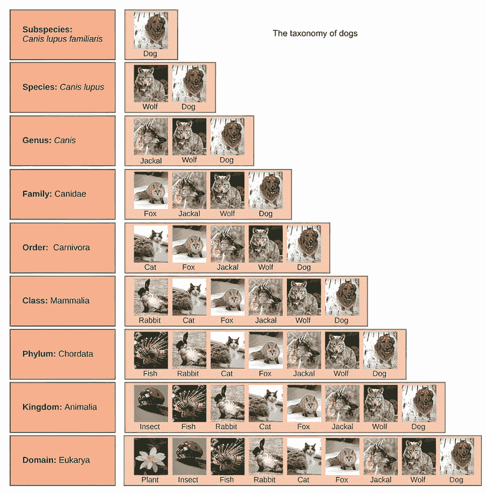

图 10.10 狗品种的分类学

图 10.10 展示了生物学家如何在分类学图表中识别狗的物种和亚种。*分类学* 是生物学家用来展示或分类地球上生命进化的工具。在图的最上方，一个狗亚种被识别出来，展示了生物学家如何定义常见的家犬。

NEAT 使用将 `基因组` 分组到物种的概念来进行优化和多样化。将 `基因组` 分组到物种突出了如何使一个多样化的 `种群` 网络进化。如果你回忆起前面的章节，我们通常希望保持 `种群` 的多样化，以避免陷入某些局部极大值或极小值的陷阱。

不鼓励多样性往往会导致一个进化的 `种群` 过度专业化或固定在某个局部极小值/极大值。在现实世界中，过度专业化且无法适应的有机体会因为不断的变化而灭绝。

演化偏差

在我们的世界中，我们通常将物种灭绝纯粹视为一个坏事件。这当然是因为我们，作为人类，现在能够识别我们自己的行动在全世界数千种物种持续灭绝中的作用。然而，如果没有人类的干预，灭绝是一个生命在地球上经过数十亿年的自然过程。在进化计算中，灭绝也可以是一件好事，因为它鼓励多样性和更好的个体表现。

NEAT 还使用灭绝的概念来迫使物种不断进化或灭绝。这样做可以防止物种停滞或过度专业化，并鼓励 `种群` 多样化。在下一节中，我们将探讨使用 `物种形成` 如何帮助 NEAT 解决复杂问题。

### 10.5.1 调整 NEAT 物种形成

下一笔记本回顾了我们在前一个笔记本中查看的圆圈问题集。这次，我们看看对笔记本进行一些小的改进，以及 NEAT 的 `物种形成` 功能如何有所帮助。我们还探索了更多 NEAT 配置选项，其中有很多。

在 Google Colab 中打开 EDL_10_5_NEAT_Speciation.ipynb 笔记本。如有需要，请参考附录。通过选择菜单中的“运行”>“运行所有”来运行笔记本中的所有单元格。

NEAT-Python 主要由配置选项驱动，这些选项可以控制 `基因组` 进化的各个方面，包括节点连接、节点、激活/聚合函数和权重。所有这些选项都赋予了 NEAT 很大的能力，但它们也使得在复杂问题上进化网络变得更加困难。为了解决圆圈问题，我们需要更好地理解这些配置选项是如何相互作用的。

滚动到 NEAT 配置选项部分，如列表 10.19 所示。对于这个笔记本，我们已更新 `fitness` 函数以产生最大 `fitness` 为 `1.0`。因此，我们也更新了 `fitness_threshold`。中间节点的数量也增加到 `25`，以允许网络拓扑有更多的增长空间。根据经验，我们知道在简单的几层架构下，圆的问题是可以解决的。为了减少网络内部拓扑变化的数量，我们大大减少了连接和节点的添加或删除的可能性。

列表 10.19 EDL_10_5_NEAT_Speciation.ipynb：NEAT 配置选项

```
[NEAT]
fitness_criterion     = max
fitness_threshold     = .85                 ❶
pop_size              = 100
reset_on_extinction   = 1

[DefaultGenome]
num_inputs              = 2
num_hidden              = 25                ❷
num_outputs             = 1
initial_connection      = partial_direct 0.5
feed_forward            = True
compatibility_disjoint_coefficient    = 1.0
compatibility_weight_coefficient      = 0.6
conn_add_prob           = 0.02              ❸
conn_delete_prob        = 0.02              ❸
node_add_prob           = 0.02              ❹
node_delete_prob        = 0.02              ❹
```

❶ 修订后的 `fitness` 函数替换了阈值。

❷ 增加中间层

❸ 降低连接变化率

❹ 降低节点变化率

由于我们知道圆的问题可以通过仅改变权重来解决，所以我们专注于最小化权重变化。这里的想法是允许 `genome` 逐渐适应并缓慢调整权重。这与我们在训练深度学习网络时降低学习率的方式类似。在文件底部，我们还更新了两个选项以更好地控制 `speciation`，如列表 10.20 所示。第一个选项是 `compatibility_threshold`，它控制物种之间的距离——我们将在下一分钟看到这意味着什么。第二个是 `max_stagnation`，它控制等待检查物种灭绝之前的 `generations` 数量。

列表 10.20 EDL_10_5_NEAT_Speciation.ipynb：更多 NEAT 配置选项

```
weight_max_value        = 30
weight_min_value        = -30
weight_init_mean        = 0.0
weight_init_stdev       = 1.0
weight_mutate_rate      = 0.08    ❶
weight_replace_rate     = 0.01    ❷
weight_mutate_power     = 0.1     ❸
enabled_default         = True
enabled_mutate_rate     = 0.01

[DefaultSpeciesSet]
compatibility_threshold = 1.0     ❹

[DefaultStagnation]
species_fitness_func = max
max_stagnation  = 25              ❺
```

❶ 降低权重突变的可能性

❷ 降低权重替换的可能性

❸ 降低权重突变的数量

❹ 降低物种间的兼容性

❺ 增加物种停滞代数

接下来，我们看看 `fitness` 评估函数是如何更新的，以更好地评估二分类问题。如果你还记得，我们之前使用 MSE 进行 `fitness` 评估。这次，我们对此进行了一些修改，以更好地考虑错误的类别分类。我们可以使用类似二元交叉熵的函数来计算这里的错误，但相反，我们使用了一种更简单的方法来计算预期类别与网络输出之间的距离。因此，如果预期类别是 `0` 且网络输出 `.9`，则误差是 `-.9`。同样，如果类别是 `1` 且网络输出 `.2`，则误差是 `.8`。将误差平方并附加到结果中消除了符号，并允许我们使用 `np.mean` 在以后提取平均误差。然后，通过从最大 `fitness`（现在为 `1`）中减去平均/均值误差来计算总 `fitness`，如下面的列表所示。

列表 10.21 EDL_10_5_NEAT_Speciation.ipynb：更新 `fitness` 评估

```
results = []
for x, y in zip(X,Y):   
  yi = net.activate(x)[0]        ❶
  if y < .5:                     ❷
    error = yi – y               ❷
  else:
    error = y – yi               ❸
  print(yi, error)

  results.append(error*error)    ❹
fitness = 1 - np.mean(results)   ❺

print(fitness) 
```

❶ 预测介于 0 和 1 之间的类别值

❷ 计算类别 0 的误差

❸ 计算类别 1 的误差

❹ 添加平方误差

❺ 最大 `fitness`(1) - 平均误差

当笔记本正在运行时，向下滚动到进化代码并查看结果。图 10.11 显示了网络在几代内的进化结果。在图的左侧，进化初期，NEAT 只跟踪三个网络（组）的物种。每个物种中的个体数量由我们之前看到的`compatibility_threshold`选项控制。兼容性是网络之间相似性的度量，可能因连接数、连接权重、节点等因素而不同。降低兼容性阈值会创建更多物种，因为网络之间兼容性/相似性的差异很小。同样，提高这个阈值会减少物种数量。

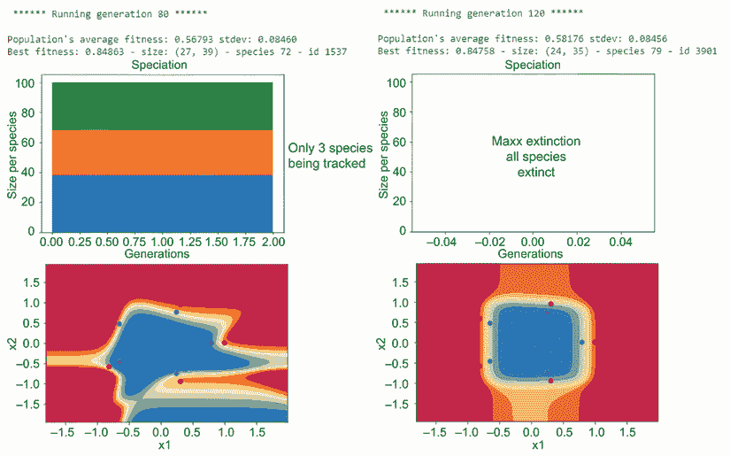

图 10.11 在圆上训练 NEAT 的结果

NEAT 跟踪每个“物种形成”在整个进化过程中的历史。`max_stagnation`选项控制等待多少代来评估特定物种的进度。停滞期过后，物种将根据进度变化或进步进行评估。如果在这个时候，一个物种在停滞期内没有变化，它就会灭绝并被从种群中移除。在图 10.11 的右侧，所有物种都被标记为灭绝。这是由于物种停滞，没有明显的改进`fitness`的变化。实际上，当前获胜的`genome`的结果看起来相对较好，所以停滞期可能太短了。

现在轮到你了，回到前面去探索各种配置选项，看看你是否能用大于`.95`的`fitness`解决圆的问题。前往并修改配置选项文件，并在每次更改后，从菜单中选择运行 > 运行全部来重新运行整个笔记本。

前往并查阅 NEAT-Python 配置选项文档，可在此处找到：[`mng.bz/X58E`](http://mng.bz/X58E)。此文档提供了关于许多可用选项的更多见解和细节。

“物种形成”不仅为种群提供了更多的多样性，还展示了进化网络如何变得停滞或陷入困境。NEAT 成功解决复杂问题的关键在于平衡配置选项的调整。幸运的是，就像任何事情一样，你越是用 NEAT 工作，你就越会了解如何调整这些旋钮以获得更好的结果。

### 10.5.2 学习练习

使用以下练习来提高你对 NEAT“物种形成”的理解：

1.  在列表 10.20 中增加或减少`compatibility_threshold`的值，然后重新运行笔记本以查看这对物种数量有何影响。

1.  在列表 10.20 中增加或减少最大“停滞”代数（`max_stagnation`）的数量，然后重新运行笔记本以查看结果。

1.  增加或减少`种群`大小，看看这可能会对`物种形成`产生什么影响。当你使用非常小的`种群`时会发生什么？

在下一章中，我们将花更多的时间研究 NEAT（NEAT-Python），并探索更多有趣和有趣的问题来解决。

## 摘要

+   神经进化拓扑增强（NEAT）是一个进化框架，它采用了从超参数优化到进化网络架构的多种技术。NEAT-Python 是一个优秀的框架，它将这些复杂性封装成一个简单的配置驱动解决方案。NEAT 是深度学习网络的一种进化自适应性架构。

+   NEAT 在`代际`中适应和进化节点权重和网络架构。随着拓扑结构的变化可视化并检查 NEAT 网络，可以有助于理解框架的工作原理。

+   NEAT 可以解决各种问题，如不连续函数逼近以及其他复杂的分类问题，以及其他难以解决的封闭形式问题。

+   NEAT 可以用于执行图像分类任务，并取得一些有限的结果。

+   `物种形成`是一个进化术语，指的是根据相似特征将`个体`分类或分组成类或子集。NEAT 使用`物种形成`来`评估`可能已经停滞的`个体`（物种）组的性能。停滞的物种随后可以被淘汰，并从`种群`池中移除。灭绝允许在固定的`种群`内建立新的`个体`群体。
