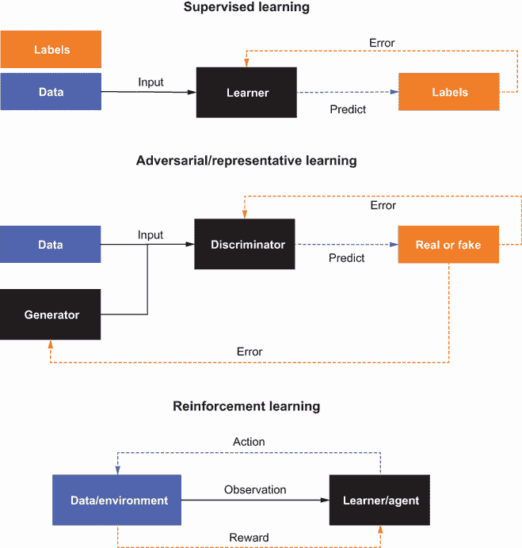
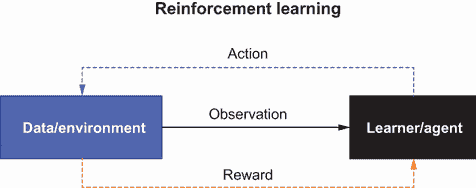
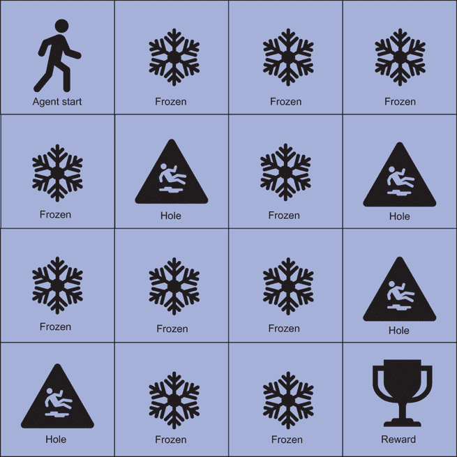
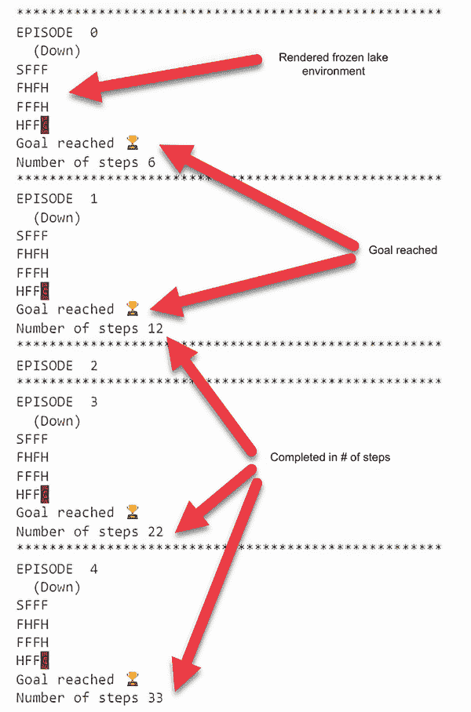
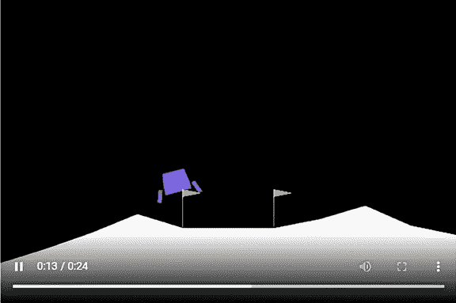
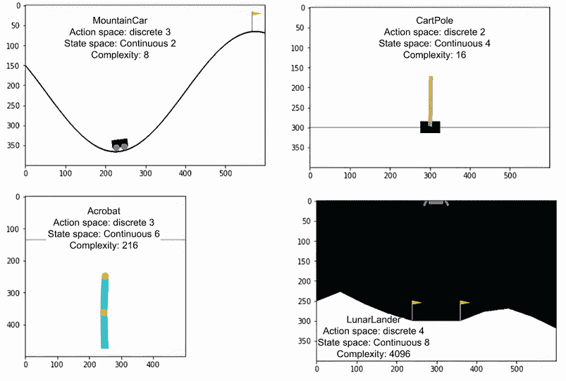
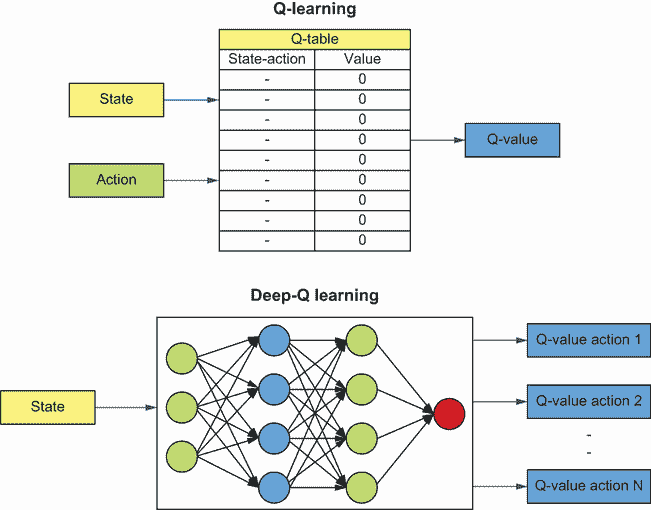
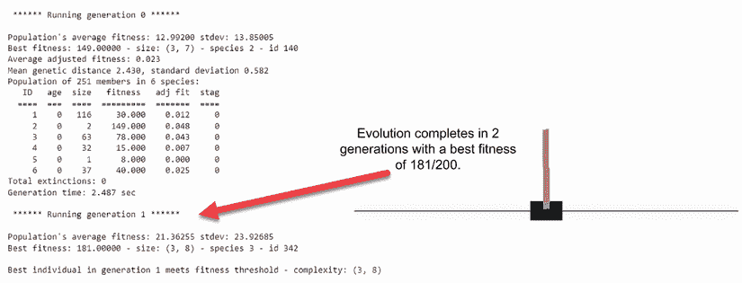
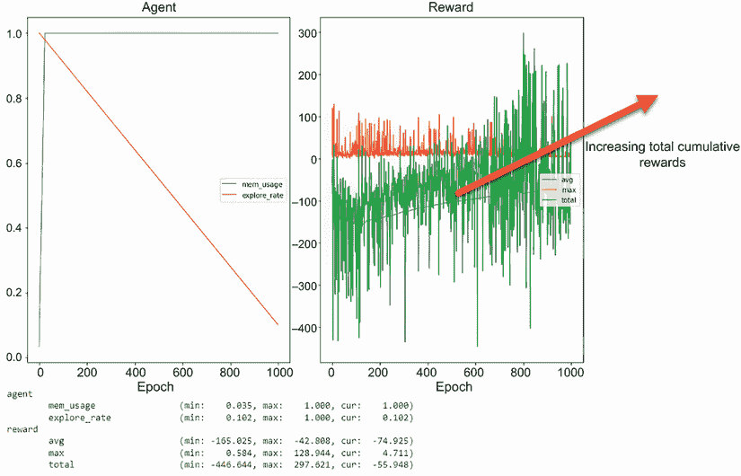

# 11 使用 NEAT 进行进化学习

本章涵盖

+   强化学习的介绍

+   探索 OpenAI Gym 中的复杂问题

+   使用 NEAT 作为代理解决强化学习问题

+   使用 NEAT 代理解决 Gym 的月球着陆器问题

+   使用深度 Q 网络解决 Gym 的月球着陆器问题

在上一章中，我们探讨了神经进化拓扑增强（NEAT）来解决我们在前几章中探讨的常见问题。在这一章中，我们研究学习的进化。首先，我们使用 NEAT 开发一个可以解决通常与强化学习相关问题的进化代理。然后，我们研究更困难的强化学习问题，并提供一个用于进化学习的 NEAT 解决方案。最后，我们通过使用称为 *本能学习* 的心理模型来探讨我们对学习本身的理解需要如何进化。

## 11.1 强化学习的介绍

*强化* *学习* (RL) 是一种基于动物行为和心理学的学习形式，试图复制生物体通过奖励来学习的方式。如果你曾经用某种形式的奖励，比如零食或表扬，来训练宠物做一个小把戏，那么你就理解了这个前提。许多人认为，理解高级意识和我们学习的基础是通过强化学习来建模的。

图 11.1a 展示了本书中涵盖的三种学习形式的比较：监督学习、代表性学习（生成建模）和强化学习。这三种学习类型都有所变化，从自监督学习到深度强化学习。



图 11.1a 不同形式学习的比较

强化学习通过让学习者，或称为 *代理*，观察环境的 `state` 来工作。这种对环境的 `observation` 或 `view` 通常被称为当前 `state`。代理消耗观察到的 `state` 并基于此 `state` 进行预测，或执行 `action`。然后，基于该 `action`，环境根据给定 `state` 的 `action` 提供奖励。

这个观察环境和代理执行 `actions` 的过程会一直持续到代理解决问题或失败为止。代理或学习者通过环境促进的奖励积累来学习，其中对于给定 `state` 通常产生更高奖励的 `action` 被认为更有价值。

强化学习代理的学习过程通常涉及代理开始时随机执行 `actions`。代理使用随机 `actions` 来探测环境，以找到那些产生最多奖励的 `actions` 或 `actions` 序列。这种学习被称为 *尝试错误* 或 *蛮力*。

尝试错误学习与执行功能

强化学习（RL）的一个关键批评是其使用试错法或蛮力学习。这种学习形式是重复的，并且可能极其昂贵。通常，它需要代理执行数百万次的`动作`来解决一个问题。虽然人类和其他动物往往以类似的方式学习任务，但我们很少需要数百万次迭代才能在某件事上变得擅长。

*执行功能*（EF）是大脑学习机制的过程，它使我们能够规划和完成复杂任务。虽然强化学习可以在代理中模拟执行功能，但其机制与 RL 有显著不同。EF 使我们能够查看我们以前从未完成过的复杂任务，并规划一系列动作以成功完成这些任务。目前正在进行研究，通过各种技术，包括进化优化，将执行功能提升到 RL 代理中。

虽然强化学习并非没有缺陷，但它确实提供了一种机制，使我们能够解决我们从未考虑过使用监督学习或对抗学习的复杂问题。如果允许，RL 还允许代理与环境交互并对其进行更改，从而产生更加复杂的问题。为了理解 RL 是如何工作的，我们将在下一节中查看并解决一个一阶问题。

### 11.1.1 冻结湖上的 Q 学习代理

现代强化学习是三种算法路径的结合：试错法、动态规划和蒙特卡洛模拟。在此基础上，1996 年由 Chris Watkins 推导出一种称为*Q 学习*的强化学习形式。自那时起，Q 学习已成为 RL 的基础概念，通常作为第一步教授给学生。

Q 学习通过给代理提供量化已知`状态`下给定`动作`质量的能力来实现，如图 11.1b 所示。通过能够衡量给定`动作`的质量，代理可以轻松选择正确的动作序列来解决给定的问题。代理仍然需要通过试错法摸索，探索环境以推导出这些`动作`或`状态`的质量。



图 11.1b 强化学习

为了了解这在实践中是如何工作的，我们首先构建一个 Q 学习代理，它可以解决来自 OpenAI Gym 的基本问题，称为*冻结湖问题*。OpenAI Gym（[`www.gymlibrary.dev/`](https://www.gymlibrary.dev/））是一个开源项目，封装了数百个不同的问题环境。这些环境从经典的 Atari 游戏到基本的控制问题都有。

图 11.2 展示了我们为 Q 代理解决而开发的冻结湖环境的示意图。环境是一个由四个方格组成的 4x4 网格，代表一个冻结的湖，其中湖的某些区域被冻结得非常坚固且安全，可以穿越。湖的其他区域是不稳定的，有洞，会导致代理掉入并死亡，从而结束他们的旅程或阶段。



图 11.2 冻结湖环境

冰冻湖问题的目标是让智能体在网格中移动，使用 `actions` 中的 `up`、`down`、`left` 或 `right` 操作来穿越。当智能体到达右下角时，任务完成并获得奖励。如果智能体掉入湖中的洞里，旅程结束，智能体将获得负奖励。

幸运的是，通过 OpenAI Gym 的发展，构建强化学习智能体及其测试环境变得更加容易。我们将在下一笔记本中深入探讨如何加载环境和编写一个工作的 Q 智能体。

在 Google Colab 中打开 EDL_11_1_FrozenLake.ipynb 笔记本。如需帮助，请参阅附录。通过选择菜单中的“运行”>“运行所有”来运行笔记本中的所有单元格。在下面的列表中，我们首先关注的是 OpenAI Gym 的安装和导入。

列表 11.1 EDL_11_1_FrozenLake.ipynb：安装 OpenAI Gym

```
!pip install gym     ❶

import numpy as np
import gym           ❷
import random
```

❶ 安装基本 Gym

❷ 导入包

之后，我们将查看如何使用 Gym 创建环境。有数百个环境可供选择，要创建一个环境，只需将名称传递给 `gym.make` 函数，如列表 11.2 所示。然后，我们查询环境以获取 `action` 和 `state` 空间的大小；这些数字表示有多少个离散值可用。冰冻湖环境使用离散值来表示 `action` 和 `state` 空间。在许多环境中，我们使用连续或范围值来表示 `action`、`state` 或两者空间。

列表 11.2 EDL_11_1_FrozenLake.ipynb：创建环境

```
env = gym.make("FrozenLake-v0")         ❶

action_size = env.action_space.n        ❷
state_size = env.observation_space.n    ❸
print(action_size, state_size)
```

❶ 创建环境

❷ 获取动作空间的大小

❸ 获取状态空间的大小

在 Q 学习中，智能体或学习者将其知识或学习封装在一个称为 *Q 表* 的表中。这个表的维度、列和行由 `state` 和可用的 `actions` 定义。代码中的下一步，如列表 11.3 所示，是创建这个表来表示智能体的知识。我们使用 `np.zeros` 创建一个由 `action_size` 和 `state_size` 值大小的数组。结果是包含值的数组（表），其中每一行代表 `state`，每一行上的列代表在该 `state` 上的 `action` 的质量。

列表 11.3 EDL_11_1_FrozenLake.ipynb：构建 Q 表

```
Q = np.zeros((state_size, action_size))    ❶
print(Q)

#========== printed Q table
[[0\. 0\. 0\. 0.]                             ❷
 [0\. 0\. 0\. 0.]                             ❸
 [0\. 0\. 0\. 0.]
 [0\. 0\. 0\. 0.]
 [0\. 0\. 0\. 0.]
 [0\. 0\. 0\. 0.]
 [0\. 0\. 0\. 0.]
 [0\. 0\. 0\. 0.]
 [0\. 0\. 0\. 0.]
 [0\. 0\. 0\. 0.]
 [0\. 0\. 0\. 0.]
 [0\. 0\. 0\. 0.]
 [0\. 0\. 0\. 0.]
 [0\. 0\. 0\. 0.]
 [0\. 0\. 0\. 0.]
 [0\. 0\. 0\. 0.]]
```

❶ 创建一个值为零的数组

❷ 第一行和第一个状态

❸ 每行四个动作

接下来，我们来看一组 Q 学习者的标准超参数，如列表 11.4 所示。代理在湖上进行的每次旅行被定义为一场游戏。`total_episodes`超参数设置了代理将进行的总游戏数或旅行次数，而`max_steps`值定义了代理在单次旅行中可以采取的最大步数。还有两个其他值也被使用：`learning_rate`，类似于 DL 中的学习率，以及`gamma`，它是一个控制未来奖励对代理重要性的折扣因子。最后，底部的超参数组控制代理的探索。

列表 11.4 EDL_11_1_FrozenLake.ipynb：定义超参数

```
total_episodes = 20000    ❶
learning_rate = 0.7       ❷
max_steps = 99            ❸
gamma = 0.95              ❹

epsilon = 1.0             ❺
max_epsilon = 1.0         ❺
min_epsilon = 0.01        ❺
decay_rate = 0.005        ❺
```

❶ 训练尝试的总数

❷ 代理学习速度有多快

❸ 一场游戏中的最大步数

❹ 未来奖励的折扣率

❺ 控制代理探索

Q 学习中的一个基本概念是探索与利用之间的权衡，或者使用代理获得的知识。当代理最初开始训练时，其知识较低，在 Q 表中表示为所有零。在没有知识的情况下，代理通常会依赖于随机选择的`动作`。然后，随着知识的增加，代理可以开始使用 Q 表中的值来确定下一个最佳`动作`。不幸的是，如果代理的知识不完整，总是选择最佳`动作`可能会导致灾难。因此，我们引入了一个名为`epsilon`的超参数来控制代理探索的频率。

我们可以通过查看列表 11.5 中显示的`choose_action`函数来了解这种探索和利用是如何工作的。在这个函数中，生成一个随机均匀值并与`epsilon`进行比较。如果值小于`epsilon`，代理将从`action`空间中随机选择一个`动作`并返回它。否则，代理将选择当前`状态`的最大质量`动作`并返回。随着代理在环境中训练，`epsilon`值将随着时间的推移减少或衰减，以表示代理知识的积累和减少探索的倾向。

列表 11.5 EDL_11_1_FrozenLake.ipynb：选择 `动作`

```
def choose_action(state):
  if random.uniform(0, 1) > epsilon:   ❶
    return np.argmax(Q[state,:])       ❷
  else:
    return env.action_space.sample()   ❸
```

❶ 随机动作的概率，探索

❷ 为给定状态选择最大动作

❸ 随机采样一个动作

代理通过 Q 函数计算的知识积累来学习。Q 函数中的术语代表当前的 Q-质量值、奖励以及应用折扣因子 gamma。这种学习方法封装在`learn`函数中，该函数应用了以下列表中显示的 Q 学习函数。我们在这里不深入探讨这个函数，因为我们的重点是 NEAT 如何在不使用 Q 函数的情况下解决相同的问题。

列表 11.6 EDL_11_1_FrozenLake.ipynb：`learn`函数

```
def learn(reward, state, action, new_state):  
  Q[state, action] = Q[state, action] + learning_rate 
  ➥ * (reward + gamma * np.max(Q[new_state, :]) – 
  ➥ Q[state, action])                               ❶
```

❶ 根据状态/动作计算质量

训练智能体的代码分为两个循环，第一个循环遍历回合，第二个循环遍历每个回合的旅程或步骤。在每一步中，智能体使用`choose_action`函数选择下一个`action`，然后通过调用`env.step(action)`来执行`action`。调用`step`函数的输出用于通过调用`learn`函数更新智能体的知识在 Q 表中。然后，检查确认回合是否完成或不完整，以及智能体是否掉入洞中或到达了终点。随着智能体遍历回合，`epsilon`值会衰减或减少，这代表着随着时间的推移，智能体探索的需求减少，如下所示。

列表 11.7 EDL_11_1_FrozenLake.ipynb：训练函数

```
rewards = []
for episode in range(total_episodes):    
    state = env.reset()                                    ❶
    step = 0
    done = False
    total_rewards = 0

    for step in range(max_steps):  
        action = choose_action(state)                      ❷

        new_state, reward, done, info = env.step(action)   ❷

        learn(reward, state, action, new_state)            ❸

        total_rewards += reward       
        state = new_state

        if done == True:                                   ❹
            break

    epsilon = min_epsilon                                  ❺
+ (max_epsilon - min_epsilon)*np.exp(-decay_rate*episode) 
    rewards.append(total_rewards)

print ("Score over time: " +  str(sum(rewards)/total_episodes))
print(Q)         
```

❶ 重置环境

❷ 选择动作并在环境中执行

❸ 学习并更新 Q 表

❹ 如果完成并且回合结束，则中断

❺ 随时间衰减 epsilon 探索

在这个例子中，我们训练智能体在一定的次数中运行，而不考虑性能的改进。在智能体训练完成后，我们通过在环境中运行模拟的智能体来测试其知识，如下所示。

列表 11.8 EDL_11_1_FrozenLake.ipynb：训练智能体

```
for episode in range(5):                                    ❶
    state = env.reset()
    step = 0
    done = False
    print("****************************************************")
    print("EPISODE ", episode)

    for step in range(max_steps): 
        action = np.argmax(Q[state,:])                      ❷
        new_state, reward, done, info = env.step(action)    ❷

        if done:            
            env.render()                                    ❸
            if new_state == 15:
                print("Goal reached ")
            else:
                print("Aaaah ☠️")            

            print("Number of steps", step)            
            break
        state = new_state   
env.close()         
```

❶ 遍历 5 个回合

❷ 执行状态的最大最佳动作

❸ 渲染环境

图 11.3 显示了运行训练智能体五个回合的输出。从结果中，你可以看到智能体是如何在最大允许步骤（99 步）内一般解决环境的。如果你想尝试改进智能体解决环境的一致性速度，尝试修改超参数，然后再次运行笔记本。下一节将展示一些有助于提高你对强化学习（RL）知识的练习。



图 11.3 模拟智能体在冰面上的输出

### 11.1.2 学习练习

使用这些练习来提高你对主题材料的了解：

1.  从列表 11.4 中更改`learning_rate`和`gamma`超参数。观察它们对智能体学习的影响。

1.  从列表 11.4 中更改探索衰减率`decay_rate`。观察这对智能体训练的影响。

1.  修改训练的`EPISODES`数量。观察这对智能体性能的影响。

当然，在这个阶段，我们可以编写一个进化优化器来调整超参数，就像我们之前所做的那样。然而，使用 NEAT，我们可以做得更好，实际上可以替代使用强化学习（RL）来解决这类问题。不过，在我们达到这一点之前，我们将在下一节中查看如何加载更复杂的 OpenAI Gym 环境。

## 11.2 探索 OpenAI Gym 中的复杂问题

OpenAI Gym 提供了大量的训练环境，旨在提高强化学习（RL）。在我们将 NEAT 应用于这些环境之前，我们需要做一些额外的准备工作来使用 Colab。在本章和下一章中，我们将探索以下列表中描述的各种 Gym 环境：

+   *山车*——这里的目的是将一辆从两个山丘的谷地开始的汽车开到目标山丘的顶部。为此，汽车需要来回摇晃，直到获得足够的动力爬到更高的山丘顶部。

+   *摆锤*——这个问题的目标是施加力量于摆动的摆臂，使其保持直立位置。这需要根据摆锤的位置知道何时施加力量。

+   *小车和杆*——这个经典的 Gym 问题要求在移动的货车上平衡一个杆。同样，这需要代理/模型平衡货车的位置和速度。

+   *月球着陆器*——从旧视频游戏中复制而来，月球着陆器的目标是将月球着陆器平稳地降落在平坦的着陆面上。关键是飞行器的着陆速度必须足够低，以避免损坏着陆器并失败。

在下一本快速笔记中，我们将设置并探索上述列表中的各种 Gym 环境。

在 Google Colab 中打开 EDL_11_2_Gym_Setup.ipynb 笔记本。如需帮助，请参阅附录。通过选择菜单中的“运行”>“运行所有”来运行笔记本中的所有单元格。

由于 Colab 是服务器端笔记本，通常不需要提供 UI 输出。为了渲染一些更美观的 Gym 环境，我们必须安装一些虚拟界面驱动程序和相关辅助工具，如下面的列表所示。我们还安装了一些工具来渲染我们的环境输出并回放为视频，这使得我们的实验更加有趣。

列表 11.9 EDL_11_2_Gym_Setup.ipynb：安装所需软件包

```
!apt-get install -y xvfb x11-utils        ❶

!pip install gym[box2d]==0.17.* \         ❷
            pyvirtualdisplay==0.2.* \     ❸
            PyOpenGL==3.1.* \             ❸
            PyOpenGL-accelerate==3.1.* \  ❸
            mediapy \                     ❹
            piglet -q)                    ❺
```

❶ 安装视频设备驱动程序

❷ 安装带有 box2d 的 Gym

❸ 图形辅助工具

❹ 用于播放视频/媒体

❺ 模板引擎

我们需要创建一个虚拟显示并启动它。实现这一点的代码只需要几行简单代码，如下面的列表所示。

列表 11.10 EDL_11_2_Gym_Setup.ipynb：创建虚拟显示

```
from pyvirtualdisplay import Display
display = Display(visible=0, size=(1400, 900))    ❶
display.start()                                   ❷
```

❶ 创建虚拟显示

❷ 开始显示

导入之后，我们现在可以创建一个环境并将一个帧渲染到单元格的输出中。这个单元格使用 Colab 表单提供一系列环境选项供选择。我们的目标是能够构建 NEAT 代理/解决方案，以应对每个环境。使用 `env.render` 函数并传入模式为 `rgb_array` 以输出 2D 数组，可以可视化环境本身。然后，可以使用 `plt.imshow` 将此输出渲染，如下面的列表所示。

列表 11.11 EDL_11_2_Gym_Setup.ipynb：创建虚拟显示

```
#@title Setup Environment { run: "auto" }
ENVIRONMENT = "CartPole-v1" #@param ["CartPole-v1", "Acrobot-v1", 
➥ "CubeCrash-v0", "MountainCar-v0", "LunarLander-v2"]              ❶

env = gym.make(ENVIRONMENT)                                         ❷

state = env.reset()
plt.imshow(env.render(mode='rgb_array'))                            ❸

print("action space: {0!r}".format(env.action_space))               ❹
print("observation space: {0!r}".format                             ❹
➥ (env.observation_space))                                         ❹
```

❶ 环境名称列表

❷ 创建环境

❸ 渲染一个帧并绘制它

❹ 打印动作/状态空间

渲染单个帧是可以的，但我们真正想看到的是环境如何运行或播放。我们接下来要查看的下一个单元，如列表 11.12 所示，通过创建一个环境和然后让智能体通过环境来运行，正是这样做的。随着模拟的运行，环境将每一帧渲染到一个列表中。然后，这个帧列表被转换成视频并输出在单元下方。图 11.4 显示了在 Colab 笔记本中渲染到视频输出的月球着陆环境。

列表 11.12 EDL_11_2_Gym_Setup.ipynb：环境的视频渲染

```
env = gym.make(ENVIRONMENT)

fitnesses = []
frames = []

for run in range(SIMULATION_RUNS):                ❶
  state = env.reset()
  fitness = 0
  for I in range(SIMULATION_ITERATIONS):          ❷
    action = env.action_space.sample()            ❸
    state, reward, done, info = env.step          ❸
    ➥ (np.argmax(action))                        ❸
    frames.append(env.render(mode='rgb_array'))   ❹
    fitness += reward       
    if done:                                      ❺
      fitnesses.append(fitness) 
      break 

mediapy.show_video(frames, fps=30)                ❻
```

❶ 运行 n 次模拟

❷ 每次运行中的最大步数

❸ 执行最大动作

❹ 将渲染的帧追加到列表中

❺ 如果完成，这将停止模拟运行。

❻ 将帧集合渲染为视频



图 11.4 月球着陆环境的视频输出

尝试运行各种其他环境选项，以可视化我们探索的其他可能性。所有这些环境在`state`空间是连续的，而`action`空间是离散的方面是相似的。我们通过可能的状态数量来衡量环境的复杂性。

图 11.5 显示了每个环境，`action`和`state`空间的大小以及相对复杂性。每个环境的相对复杂性是通过将`state`空间的大小提高到`action`空间的幂来计算的，公式如下：

相对复杂性 = `size_state_space` × `size_action_space`

以山车问题的一个版本为例，其中`state_space` = 2 和 `action_space` = 3。因此，相对复杂性可以表示为以下公式：相对复杂性 = 2³ = 2 × 2 × 2 = 8。



图 11.5 Gym 环境的比较

通常，图 11.5 中显示的 Box2D 环境的子类使用深度强化学习（DRL）来解决。DRL 是 RL 的扩展，它使用深度学习来解决 Q 方程或其他 RL 函数。本质上，深度学习取代了`state`或 Q 表的需求，使用神经网络。



图 11.6 Q 学习和深度 Q 学习比较

图 11.6 显示了 Q 学习和深度 Q 学习或深度 Q 网络（DQN）之间的比较。这个 DQN 模型已被证明非常灵活，能够解决各种 RL 问题，从经典的 Atari 游戏到小车和月球着陆问题。

深度 Q 学习通过使用我们之前查看的 Q 学习函数作为训练网络的检查或监督器来工作。这意味着，在内部，DQN 模型通过监督训练来学习，这种训练以 Q 学习方程的形式提供。下一节的学习练习可以帮助加强你在本节中学到的内容。

### 11.2.1 学习练习

完成以下练习，以加深对本节概念的理解：

1.  打开并运行笔记本中提供的所有模拟环境。同时熟悉每个环境的`action`和`observation`/`state`空间。

1.  在互联网上搜索并探索其他 Gym 环境，这些环境可能是原始的，也可能是其他人扩展的。有数百个 Gym 环境可以探索。

1.  在笔记本中添加一个新的环境，并演示智能体如何在这个新环境中随机玩耍。

自从 DQN（深度 Q 网络）的发展以来，已经出现了许多变体和采用深度学习网络结合强化学习的方法。在所有情况下，学习的基础都是 Q 或其他派生学习方程形式的强化学习。在下一节中，我们将展示如何超越派生的强化学习方程，让解决方案自我演化。

## 11.3 使用 NEAT 解决强化学习问题

在本节中，我们使用 NEAT（神经进化算法）来解决我们刚刚查看的一些困难的强化学习 Gym 问题。然而，重要的是要强调，我们用来派生网络和解决未知方程的方法不是强化学习，而是进化以及 NEAT。虽然我们确实使用了强化学习环境和以强化学习的方式训练智能体，但底层方法不是强化学习。

使用 NEAT 和一个演化的 NEAT 智能体群体相对简单，正如我们在下一个笔记本中看到的那样。在 Google Colab 中打开 EDL_11_3_NEAT_Gym.ipynb 笔记本。如有需要，请参考附录。通过选择菜单中的“Runtime > Run All”来运行笔记本中的所有单元格。

我们刚刚回顾了设置代码，因此我们可以直接跳到 NEAT 配置。配置与之前我们看到的是相似的，但现在我们定义网络`num_inputs`等于`state`或`observation`空间的大小，而`num_outputs`等于`action`空间的大小。这意味着 NEAT 智能体的输入是`state`/`observation`，输出是`action`，如下所示。

列表 11.13 EDL_11_3_NEAT_Gyms.ipynb：NEAT 配置

```
inputs = env.observation_space.shape[0]   ❶
outputs = env.action_space.n              ❷

config = f'''
[NEAT]    
fitness_criterion     = max
fitness_threshold     = 175.0             ❸
pop_size              = 250
reset_on_extinction   = 0

[DefaultGenome]
num_inputs              = {inputs}        ❹
num_hidden              = 1
num_outputs             = {outputs}       ❺
```

❶ 状态空间的大小

❷ 动作空间的大小

❸ 定义适应度阈值

❹ 将状态空间映射到输入

❺ 将动作空间映射到输出

接下来，我们回顾我们的测试`genome` `fred`，以了解如何评估`individual` `fitness`。我们可以看到`fred`是如何从`genome`配置中创建的，然后实例化为网络`net`。这个网络通过传递一个任意的环境`state`并输出一个`action`集来测试。为了执行`action`，使用`np.argmax(action)`来提取用于调用`env.step`的`action`索引，如下所示。

列表 11.14 EDL_11_3_NEAT_Gyms.ipynb：`genome`和`ENVIRONMENT`

```
env = gym.make(ENVIRONMENT)                              ❶
state = env.reset()
print(state)

key = "fred"
fred = config.genome_type(key)                           ❷
fred.configure_new(config.genome_config)                 ❷

net = neat.nn.FeedForwardNetwork.create(fred, config)    ❸
action = net.activate(state)                             ❹
print(action)

state, reward, done, info = env.step(np.argmax(action))  ❺
print(state, reward, done, info) 
```

❶ 创建环境

❷ 配置初始随机基因组

❸ 从基因组构建网络

❹ 输入状态并输出动作

❺ 执行动作

与之前一样，我们可以使用 `fred` 来推导基础 `genome` `evaluate` 函数。代码，如列表 11.15 所示，模仿了我们已经设置的样本视频演示播放代码。不过，这次 `genome` 的 `fitness` 是基于奖励的累积来计算的。这意味着——这个微妙的不同很重要——`genome` 的 `fitness` 是奖励的总和，但代理在任何时候都没有训练/学习如何消耗或使用这些奖励。进化使用奖励来 `evaluate` 具有最佳 `fitness` 的代理——即能够累积最多奖励的代理。

列表 11.15 EDL_11_3_NEAT_Gyms.ipynb：评估 `genome` `fitness`

```
#@title Simulation Options { run: "auto" }           ❶
SIMULATION_ITERATIONS = 200                          ❶
SIMULATION_RUNS = 10 #@param {type:"slider", min:1,  ❶
➥ max:10, step:1}                                   ❶

frames = []
fitnesses = []
for run in range(SIMULATION_RUNS):  
  state = env.reset()
  fitness = 0
  for i in range(SIMULATION_ITERATIONS):
    action = net.activate(state)                     ❷
    state, reward, done, info = env.step
    ➥ (np.argmax(action))                           ❸
    frames.append(env.render(mode='rgb_array'))      
    fitness += reward                                ❹
    if done: 
      fitnesses.append(fitness) 
      break 

print(fitnesses)
mediapy.show_video(frames, fps=30)                   ❺
```

❶ 模拟参数的 Colab 表单

❷ 将状态传递给网络以激活动作

❸ 在环境中执行步骤

❹ 将奖励添加到 `fitness`

❺ 重新播放模拟运行

这段简单的代码可以轻松地转换为 `eval_genomes`/`eval_genome` 函数集，其中 `eval_genomes` 是父函数，传递 `genomes` 的 `population`，而 `individual` `genome` 的评估是通过 `eval_genome` 来完成的。内部，列表 11.16 中显示的代码与列表 11.15 中我们查看的代码相同，没有视频帧捕获代码。毕竟，我们不需要为每个 `genome` 模拟捕获视频。

列表 11.16 EDL_11_3_NEAT_Gyms.ipynb：评估 `genome` `fitness`

```
def eval_genome(genome, config):
  net = neat.nn.FeedForwardNetwork.create
  ➥ (genome, config)                              ❶
  fitnesses = []
  for run in range(SIMULATION_RUNS):  
    state = env.reset()
    fitness = 0
    for I in range(SIMULATION_ITERATIONS):
      action = net.activate(state)                 ❷
      state, reward, done, info = env.step         ❷
      ➥ (np.argmax(action))                       ❷
      fitness += reward       
      if done: 
        fitnesses.append(fitness) 
        break 
  return -9999.99 if len(fitnesses) < 
  ➥ 1 else min(fitnesses)                         ❸

def eval_genomes(genomes, config):
  for genome_id, genome in genomes:                ❹
    genome.fitness = eval_genome(genome, config)   ❹

print(eval_genome(fred, config))                   ❺
```

❶ 从 `genome` 创建网络

❷ 将状态传递给网络以激活动作

❸ 返回最小 `fitness`

❹ 遍历 `genome` 种群

❺ 在 fred 上测试函数

现在，进化 `population` 的代码变得非常简单和优雅。创建 `pop` 并添加默认的 `statistics` 和 `out` 报告器以生成进度更新。之后，我们使用一个名为 `neat.ParallelEvaluator` 的新功能来提供进化的内部多线程处理。在 Colab 的免费版本中，此功能的使用有限，但如果你有一台功能强大的计算机，可以尝试在本地运行此代码以获得更好的性能。最后，最后一行调用 `pop.run` 来运行进化并产生一个获胜的 `genome`，如下所示。图 11.7 显示了输出进化的 NEAT 代理 `population` 以解决 cart pole Gym 环境。



图 11.7 NEAT 代理的输出

列表 11.17 EDL_11_3_NEAT_Gyms.ipynb：进化 `population`

```
pop = neat.Population(config)                 ❶
stats = neat.StatisticsReporter()             ❷
pop.add_reporter(stats)                       ❷
pop.add_reporter(neat.StdOutReporter(True))   ❸

pe = neat.ParallelEvaluator(multiprocessing
➥ .cpu_count(), eval_genome)                 ❹
winner = pop.run(pe.evaluate)                 ❺
```

❶ 创建种群

❷ 使用标准的统计报告器

❸ 添加标准输出报告器

❹ 使用并行执行

❺ 评估最佳 `genome`

虽然 `fitness` 与代理的最大奖励相关，但重要的是要强调我们并没有训练 RL 代理。相反，进化的网络正在进化它们自己的内部功能以累积奖励并变得更加适合。`fitness` 与奖励相关的事实只是一个有用的指标，用于描述 `individual` 的性能。

### 11.3.1 学习练习

使用以下附加练习来帮助巩固你对本节内容的理解：

1.  使用 NEAT 代理尝试其他环境，看看是否能够以及如何快速地实现解决方案，如果可能的话。

1.  修改 `SIMULATION_RUNS` 和 `SIMULATION_ITERATIONS` 的数量，然后重新评估 NEAT 代理。

1.  修改 NEAT 配置中的隐藏神经元数量 `num_hidden`，如列表 11.13 所示。查看重新运行各种环境时这一变化的影响。

那么，这种学习或进化被称为什么或如何描述？好吧，我们将在下一章中讨论一组思想和理论。现在，我们想要看看我们是否可以改进 NEAT 代理的进化以解决更困难的问题。

## 11.4 使用 NEAT 代理解决 Gym 的月球着陆问题

很可能，如果你在其他的强化学习环境中运行了上一个笔记本，你会发现我们的过程仅适用于简单的强化学习环境。实际上，在远更复杂的环境中，如月球着陆问题中进化解决方案，根本没有任何进展。这是因为仅使用奖励来进化 NEAT 代理/网络所需的复杂性不足以实现。

在第十二章中，我们将探讨一系列可以帮助我们解决月球着陆问题的策略，但到目前为止，我们来看一个来自 NEAT-Python 仓库示例的解决方案。NEAT-Python 拥有一系列设计用于无笔记本运行的示例。为了方便，我们将月球着陆示例转换为 Colab 笔记本，以展示改进的 NEAT 求解器。

注意：本例中的代码演示了进化 NEAT 网络以解决更复杂强化学习问题的一种可能解决方案。这个解决方案高度定制化，并使用复杂的数学概念来细化 `fitness` 评估。如前所述，我们将在下一章中探讨更优雅的解决方案，但请随时查阅这个笔记本。

在 Google Colab 中打开 EDL_11_4_NEAT_LunarLander.ipynb 笔记本。如需帮助，请参阅附录。通过选择菜单中的“运行”>“运行所有”来运行笔记本中的所有单元格。一如既往，这个笔记本是从之前的示例扩展而来的，并共享一个共同的代码库。我们在本笔记本中关注的重点部分都集中在改进 `fitness` 评估和 `gene` 操作符。

我们首先关注对 `gene` 操作符的改进和专门的 `LanderGenome` 类，如列表 11.18 所示。这个类的核心引入了一个新的参数，称为 `discount`。`discount` 参数的前提是引入一个随时间减少奖励的因素。*折现奖励*，即随着时间的推移减少未来或过去奖励的影响，是强化学习中发展出的一个概念。Q-learning 方程中使用的 `gamma` 项代表未来奖励的衰减。然而，在这个解决方案中，衰减的奖励并不直接影响代理的 `action`；相反，它们被用来更好地评估其 `fitness`。

列表 11.18 EDL_11_4_NEAT_LunarLander.ipynb：自定义 `基因组` 配置

```
class LanderGenome(neat.DefaultGenome):
    def __init__(self, key):
        super().__init__(key)
        self.discount = None                             ❶

    def configure_new(self, config):
        super().configure_new(config)
        self.discount = 0.01 + 0.98 * random.random()    ❷

    def configure_crossover(self, genome1, genome2, config):
        super().configure_crossover(genome1, genome2, config)
        self.discount = random.choice((genome1
        ➥ .discount, genome2.discount))                 ❸

    def mutate(self, config):
        super().mutate(config)
        self.discount += random.gauss(0.0, 0.05)
        self.discount = max(0.01, min(0.99, self
        ➥ .discount))                                   ❹

    def distance(self, other, config):
        dist = super().distance(other, config)
        disc_diff = abs(self.discount - other.discount)
        return dist + disc_diff                          ❺

    def __str__(self):
        return f"Reward discount: {self.discount}\n{super().__str__()}"  
```

❶ 创建折扣参数

❷ 设置折扣值

❸ 交叉/配对折扣

❹ 突变折扣

❺ 计算基因组距离

现在，`基因组`的`适应性`是通过一个`compute_fitness`函数来评估的，该函数不再直接在环境中模拟代理，而是使用记录的`动作`历史，如列表 11.19 所示。这个关于剧集和步骤的历史为每个`基因组`回放，其中`基因组`内的`折扣`因子用于评估与先前代理`动作`相关的重要性。本质上，代理的`适应性`是通过与其他代理先前表现的比较来计算的。虽然我们不能说这个解决方案使用了强化学习，但它确实使用了先前代理奖励和未来进化代理之间的归一化和折扣差异。

列表 11.19 EDL_11_4_NEAT_LunarLander.ipynb：计算 `适应性`

```
def compute_fitness(genome, net, episodes, min_reward, max_reward):
  m = int(round(np.log(0.01) / np.log(genome.discount)))
  discount_function = [genome.discount ** (m - i) 
  ➥ for I in range(m + 1)]                         ❶

  reward_error = []
  for score, data in episodes:                      ❷
    # Compute normalized discounted reward.
    dr = np.convolve(data[:, -1], discount_function)[m:]
    dr = 2 * (dr–- min_reward) / (max_reward–- min_reward)–- 1.0
    dr = np.clip(dr, -1.0, 1.0)                     ❸

    for row, dr in zip(data, dr):                   ❹
      observation = row[:8]
      action = int(row[8])
      output = net.activate(observation)
      reward_error.append(float((output[action]–- dr) 
      ➥ ** 2))                                     ❺

  return reward_error   
```

❶ 创建折扣函数

❷ 遍历剧集

❸ 根据函数折扣奖励

❹ 遍历剧集步骤

❺ 计算奖励误差的差异

这个笔记本中有大量代码围绕着模拟代理环境交互、记录它并在`基因组`群体中评估它。我们接下来要查看的关键元素是运行模拟的代码：`PooledErrorCompute`类中的`simulate`函数。与之前的笔记本不同，通过模拟运行的代理代码（如列表 11.20 所示）基于当前步骤进行简单探索，给模拟机会添加探索步骤到模拟数据中。每次模拟运行都被添加到数据中以评分和提取最成功的运行，成功仍然是通过累积的总奖励来衡量的。

列表 11.20 EDL_11_4_NEAT_LunarLander.ipynb：模拟运行

```
def simulate(self, nets):
    scores = []
    for genome, net in nets:                            ❶
        observation = env.reset()
        step = 0
        data = []
        while 1:
            step += 1
            if step < 200 and random.random() < 0.2:    ❷
                action = env.action_space.sample()
            else:
                output = net.activate(observation)
                action = np.argmax(output)

            observation, reward, done, info = env.step(action)
            data.append(np.hstack((observation, 
            ➥ action, reward)))                        ❸

            if done:
                break

        data = np.array(data)
        score = np.sum(data[:, -1])                     ❹
        self.episode_score.append(score)
        scores.append(score)
        self.episode_length.append(step)

        self.test_episodes.append((score, data))        ❺
```

❶ 遍历基因组网络

❷ 决定探索或利用

❸ 将步骤输出添加到数据中

❹ 评分最佳模拟运行

❺ 将数据添加到测试剧集

这个解决方案确实借鉴了强化学习过程，并试图用奖励来衡量误差。这里的总奖励误差对`个体适应性`有直接影响。

在笔记本运行时，请自行审查所有其余的代码——并且它将运行相当长的时间。这个笔记本可能需要 8 小时以上才能进化，而且可能仍然无法解决问题。

随着这个笔记本的训练，我们看到`适应性`快速收敛，但随后，事情迅速达到平台期。事实上，你可能直到进化到 1,000+ `代`之后才找不到任何正面的奖励或`适应性`评估。进步很慢，但如果你有耐心，NEAT 代理最终可以被进化来解决月球着陆环境。

尽管 NEAT 代理借鉴了强化学习环境和一些技术来帮助解决问题，但实际的进化并不是我们所说的 DRL。相反，我们需要考虑其他进化概念或想法，这些概念或想法描述了如何进化一个能够自我进化其学习函数的代理。本质上，我们已经进化了一个能够进化其自身学习系统或学习函数的代理。

虽然进化的内部学习函数不太可能类似于 Q 学习方程，但我们能确认它能够解决复杂的强化学习环境。正是这个学习函数的进化，成为了我们在下一章和最后一章中探讨的最有趣和最有力的概念。

### 11.4.1 学习练习

执行以下练习将有助于你复习和改进对内容的理解：

1.  将运行此笔记本的结果与上一节中探索的标准 NEAT Gym 练习进行比较。代理在相同数量的`generations`后表现如何？这是你预期的吗？

1.  在笔记本中添加一个不同的环境，以查看改进的`fitness`评估如何增加或减少 NEAT 代理的性能。

1.  实现不同的探索方法。目前，这个笔记本使用固定的探索率。通过实现一个衰减的探索率，就像之前示例中看到的那样，增加一些变化。

本节展示了 NEAT 的强大能力，可以进化一个能够内部复制 Q 学习强化学习过程的`个体`。在下一节中，我们将查看一个称为 DQN 的基线 DRL 实现，并将其与我们使用 NEXT 所做的工作进行比较。

## 11.5 使用深度 Q 网络解决 Gym 的月球着陆器问题

当深度强化学习（DRL）首次展示出深度 Q 学习模型能够仅使用`观察``状态`作为输入解决经典的 Atari 游戏时，它引起了人们的关注。这是一个重大的突破，从那时起，DRL 已经证明能够比人类更好地解决许多复杂任务。在本节的笔记本中，我们查看 DQN 的经典实现，作为解决月球着陆器问题的替代方案。

在 Atari 上的深度 Q 网络

使用 DQN 解决经典 Atari 游戏是有效的，但需要大量的迭代。解决甚至像 Breakout 这样的基本 Atari 环境所需的训练次数可能达到数百万次。自那时以来，强化学习方法的改进已经减少了所需的训练次数，但总体而言，DRL 是一个计算成本高昂的任务。幸运的是，与 EC 不同，DRL 是深度学习带来的计算增强的主要受益者。

在 Google Colab 中打开 EDL_11_5_DQN_LunarLander.ipynb 笔记本。如需帮助，请参考附录。通过选择菜单中的“运行”>“运行所有”来运行笔记本中的所有单元格。

这个笔记本被设置为使用相同的环境，但移除了进化和代码库。现在，我们的重点是 DQN 模型在 Gym 问题上的工作方式。这意味着我们从 `DQNAgent` 类定义开始，如下面的列表所示。`init` 函数设置基本超参数并保存 `action` 和 `observation` 的大小。它还添加了一个 `memory`，用于存储模拟中的经验以及代理的大脑或模型。

列表 11.21 EDL_11_5_DQN_Gyms.ipynb：DQN 代理

```
import tensorflow.keras as k                              ❶
import tensorflow.keras.layers as kl                      ❶

class DQNAgent():
    def __init__(self, state_size, action_size, episodes=100):
        self.weight_backup      = "backup_weights.h5"
        self.state_size         = state_size              ❷
        self.action_size        = action_size             ❷
        self.memory             = deque(maxlen=2000)      ❸
        self.learning_rate      = 0.001                   ❹
        self.gamma              = 0.95
        self.exploration_rate   = 1.0
        self.exploration_min    = 0.1
        self.exploration_decay  = 
        ➥ (self.exploration_rate-self.exploration_min) / episodes      
        self.brain              = self._build_model()     ❺
```

❶ 导入深度学习包

❷ 保存动作/观察大小

❸ 创建一个存储记忆的地方

❹ 设置超参数

❺ 创建代理的模型或大脑

在 `build_model` 函数中接下来定义代理的深度学习模型或大脑。该函数中的代码创建了一个三层模型，以 `state` 空间作为输入，以 `action` 空间作为输出。模型使用 `mse` 作为损失函数和 `Adam` 优化器进行编译。本例的独特之处在于模型能够加载包含先前训练的模型权重的文件，如下面的列表所示。

列表 11.22 EDL_11_5_DQN_Gyms.ipynb：构建大脑

```
def _build_model(self):        
        model = k.Sequential()                            ❶
        model.add(kl.Dense(24, input_dim=self.state_size, activation='relu'))
        model.add(kl.Dense(24, activation='relu'))        ❷
        model.add(kl.Dense(self.action_size, 
        ➥ activation='linear'))                          ❸
        model.compile(loss='mse',  optimizer=k.optimizers.Adam(learning_rate=self
     ➥ .learning_rate))                                  ❹

        if os.path.isfile(self.weight_backup):            ❺
            model.load_weights(self.weight_backup)
            self.exploration_rate = self.exploration_min
        return model 
```

❶ 从基本模型开始

❷ 向模型添加层

❸ 输出层与动作大小匹配。

❹ 使用均方误差（MSE）损失编译模型

❺ 如果可能，加载先前的模型权重

在我们继续 `DQNAgent` 定义的其他部分之前，让我们回顾一下训练代码。代码，如列表 11.23 所示，首先设置 `BATCH_SIZE` 和 `EPISODES` 的主要超参数。然后，它开始循环遍历 episode 的数量，模拟代理直到 `env.step` 在每个 episode 中输出 `done` 等于 `True`。如果代理未完成，它将 `state` 输入到 `agent.act` 函数以输出动作预测，然后将其应用于 `env.step` 函数以输出下一个 `state`、`reward` 和 `done`。接下来，调用 `agent.remember` 将 `action` 和后果添加到代理的记忆中。在每个 episode 结束时，当 `done == True`，调用 `agent.remember`，回放所有记住的 `actions` 并使用结果来训练模型。

列表 11.23 EDL_11_5_DQN_Gyms.ipynb：训练代理

```
BATCH_SIZE = 256 #@param {type:"slider", min:32, 
➥ max:256, step:2}                                       ❶
EPISODES = 1000 #@param {type:"slider", min:10, max:1000, step:1}

state_size = env.observation_space.shape[0]
action_size = env.action_space.n
agent = DQNAgent(state_size, action_size, episodes=EPISODES)

groups = { "reward" : {"total", "max", "avg"}, 
          "agent" : {"explore_rate", "mem_usage"}}
plotlosses = PlotLosses(groups=groups)
total_rewards = 0
for ep in nb.tqdm(range(EPISODES)):
  rewards = []
  state = env.reset()
  state = np.reshape(state, [1, state_size])              ❷

  done = False
  index = 0
  while not done:    
    action = agent.act(state)                             ❸
    next_state, reward, done, _ = env.step(action)        ❸
    rewards.append(reward)
    next_state = np.reshape(next_state, 
    ➥ [1, state_size])                                   ❷
    agent.remember(state, action, reward, next_state, 
    ➥ done)                                              ❹
    state = next_state      
  agent.replay(BATCH_SIZE)                                ❺
  total_rewards += sum(rewards)
  plotlosses.update({'total': sum(rewards),    
                     'max': max(rewards),
                     "avg" : total_rewards/(ep+1),
                     "explore_rate" : agent.exploration_rate,
                     "mem_usage" : agent.mem_usage(),
                     })
  plotlosses.send()  
```

❶ 设置主要超参数

❷ 重新塑形状态以供模型使用

❸ 预测并执行动作

❹ 记住动作和后果

❺ 回放动作并训练代理

现在，我们回到 `DQNAgent` 定义，并回顾列表 11.24 中的 `act`、`remember`**、**和 `replay` 函数。第一个函数 `act` 评估探索的机会，并在探索时响应随机 `动作`，如果不是探索则响应预测 `动作`。第二个函数 `remember` 存储代理在模拟过程中积累的经验。这里使用的内存是一个出队类，它使用固定大小，并在填满时自动丢弃最老的记忆。第三个函数 `replay` 从代理内存中提取一批经验，前提是有足够的记忆。这批经验随后用于回放代理的 `动作` 并评估每个先前执行的 `动作`（随机或预测）的质量。`动作` 的质量 `目标` 使用 Q-learning 方程的一种形式来计算。然后使用 `fit` 函数在单个周期内使用计算出的值来更新模型。最后，在 `replay` 函数的末尾，如果需要，通过 `exploration_decay` 更新探索的机会——`exploration_rate`。

列表 11.24 EDL_11_5_DQN_Gyms.ipynb：`act`、`remember` 和 `replay` 函数

```
def act(self, state):    
    if np.random.rand() <= self.exploration_rate:    ❶
        return random.randrange(self.action_size)
    act_values = self.brain.predict(state)
    return np.argmax(act_values[0])

def remember(self, state, action, reward, next_state, done):
    self.memory.append((state, action, reward, 
    ➥ next_state, done))                            ❷

def replay(self, batch_size):
    if len(self.memory) < batch_size:                ❸
        return
    sample_batch = random.sample(self.memory, 
    ➥ batch_size)                                   ❹
    for state, action, reward, next_state, done in sample_batch:
        target = reward
        if not done:
          target = reward + self.gamma * np.amax(self.brain.predict(next_state)[0])
        target_f = self.brain.predict(state)         ❺
        target_f[0][action] = target
        self.brain.fit(state, target_f, epochs=1, verbose=0)
    if self.exploration_rate > self.exploration_min:
        self.exploration_rate -= self.exploration_decay   
```

❶ 选择随机或预测动作

❷ 将数据追加到出队内存中

❸ 检查内存是否大于批量大小

❹ 从内存中提取经验并进行训练

❺ 评估 Q-learning 函数的目标预测

图 11.8 展示了在月球着陆器环境中训练 DQN 代理 1,000 个周期的结果。在图中，你可以看到代理如何随着学习掌握环境而逐渐积累奖励。



图 11.8 在月球着陆器环境中训练代理的结果

DQN 和 DRL 是 AI 和 ML 中的强大进步，展示了数字智能在某些任务上可能比人类做得更好的潜力。然而，DRL 需要克服的一些关键挑战仍然存在，包括多任务或泛化学习。我们将在下一章探讨如何利用进化来探索可能用于泛化形式的学习，如 DRL。

## 摘要

+   强化学习是另一种动态学习形式，它使用奖励来强化给定当前 `状态` 时选择最佳适当 `动作` 的选择。

+   Q-learning 是一种 RL 的实现，它使用 `状态` 或 `动作` 查找表或策略来提供关于代理应采取的下一个最佳可能 `动作` 的决策。

+   能够区分各种学习形式很重要，包括生成式、监督式和强化学习。

+   OpenAI Gym 是一个用于评估和探索 RL 或其他奖励/决策求解模型各种实现的框架和工具包。

+   在 Colab 笔记本中运行 OpenAI Gym 可以用于探索各种复杂度不同的环境。

+   OpenAI Gym 是一个常见的强化学习算法基准和探索工具。

+   NEAT 可以通过使用典型的强化学习来解决各种样本强化学习 Gym 环境。

+   可以开发一个 NEAT 智能体，通过采样和回放技术来解决更复杂的强化学习环境。

+   深度 Q 学习是强化学习的一种高级形式，它使用深度学习代替 Q 表或策略。深度 Q 网络已被用于解决复杂环境，如月球着陆游戏。
