# 12 进化机器学习及其超越

本章节涵盖

+   基因表达编程与进化与机器学习

+   重新审视使用 Geppy 的强化学习

+   本能学习

+   使用遗传编程的广义学习

+   进化机器学习的未来

+   基于本能的深度学习和深度强化学习的泛化

在上一章中，我们深入探讨了如何将进化解决方案如 NEAT 应用于解决强化学习问题。在本章中，我们继续探讨这些相同的概念，同时也退后一步，探讨进化方法如何应用于扩展我们对机器学习的理解。具体来说，研究进化搜索在其中的作用可以扩展我们开发广义机器学习的方法。

广义机器学习（又称广义人工智能）

*广义机器学习*，或称广义智能，是一个专注于构建能够解决多个任务的模型的研究领域。通常，在机器学习中，我们开发模型来对单一数据源进行分类或回归，通过迭代训练模型并使用相似数据验证性能。广义机器学习的目标是开发能够预测多种不同形式的数据或环境的模型。在数据科学中，你可能听到这个问题被称为*跨领域*或*多模态*，这意味着我们正在构建一个模型来处理跨领域的问题。

深度学习针对的是函数逼近和优化，通常是为了解决特定问题而设计的。在本书中，我们探讨了通过改进超参数搜索、优化网络架构和神经进化网络等方法来增强或改进深度学习的方法。

在本章中，我们将注意力从深度学习转向，探讨使用进化来帮助我们泛化解决机器学习问题的一些例子。我们首先研究进化的函数，然后转向开发可能解决多个问题的更广义的函数。在扩展泛化的基础上，我们接着探讨一个试图封装广义函数学习的想法，称为*本能学习*。

从广义本能学习出发，我们转向一个有趣的例子，使用遗传编程训练一个`蚂蚁`智能体。然后，我们探讨如何通过进一步的进化使特定智能体泛化。最后，我们以讨论机器学习中进化的未来作为本章的结尾。在下一节中，我们首先关注机器学习的核心——函数，以及它如何可以通过基因表达编程（GEP）进行进化。

## 12.1 基因表达编程与进化与机器学习

函数，或函数逼近器，是任何机器学习算法的核心。这个函数的作用是接收数据或输入并输出结果或预测。图 12.1 展示了本书中涵盖的各种学习形式，使用深度学习作为针对每种学习类型的函数或函数逼近器。

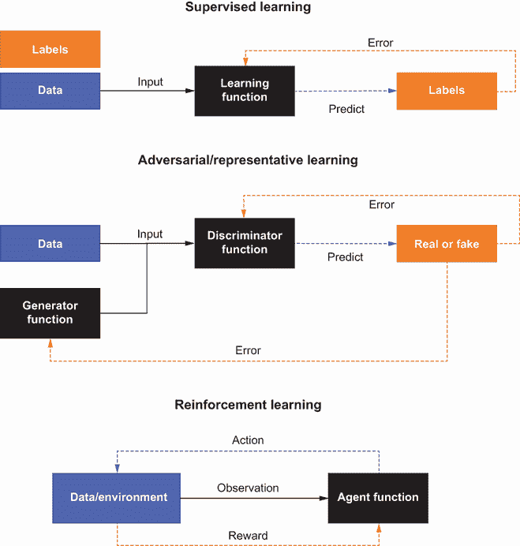

图 12.1 学习函数的例子

在本节中，我们查看一个笔记本，它构建了实际函数，而不是使用进化的近似。这里的优点是进化消除了在学习过程中使用损失或误差函数的需求。图 12.2 展示了这种类型的学习是如何操作的。如果你回顾第十一章，这就是我们使用 NEAT 作为函数逼近器执行的过程，取代了传统的深度学习。

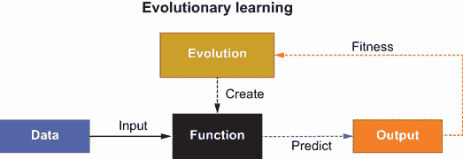

图 12.2 进化学习

对于本节中的笔记本，我们使用 Geppy，这是 DEAP 的扩展，它改进了 GEP 的 DEAP 实现。如果你还记得，我们在第三章已经看过 GEP。我们在这里做的工作是关于进化函数以及它与通用机器学习的关系。

在 Google Colab 中打开 EDL_12_1_GEPPY.ipynb 笔记本。如需帮助，请参阅附录。通过选择菜单中的“运行”>“运行所有”来运行笔记本中的所有单元。

由于 Geppy 是 DEAP 的扩展，大部分代码看起来与我们之前覆盖的非常相似；因此，我们在这里只回顾新特性。我们首先查看的第一个代码单元块，如下所示，展示了我们正在进化的解决方案的目标函数。这个简单的线性函数是我们希望通过进化复制的目标函数。

列表 12.1 EDL_12_1_GEPPY.ipynb：定义目标函数

```
def f(x1):    
    return 6 * x1 + 22    ❶
```

❶ 地面真实函数

这个笔记本使用一组基本的表达式运算符来生成表达式树，如下所示。

列表 12.2 EDL_12_1_GEPPY.ipynb：添加表达式运算符

```
import operator 

pset = gep.PrimitiveSet('Main', input_names=['x1'])   ❶
pset.add_function(operator.add, 2)                    ❷
pset.add_function(operator.sub, 2)                    ❷
pset.add_function(operator.mul, 2)                    ❷
pset.add_function(protected_div, 2)                   ❸
pset.add_ephemeral_terminal(name='enc', gen=lambda: 
➥ random.randint(-10, 10))                           ❹
```

❶ 构建运算符集合

❷ 添加标准数学运算符

❸ 添加一个用于除法的特殊运算符

❹ 添加一个常数/瞬时运算符

接下来，我们跳转到`evaluate`函数，它展示了我们如何确定种群中每个`individual`的`fitness`。`toolbox.compile`函数从`individual`的`gene`序列生成函数。然后，从样本`X1`输入生成输出。之后，通过计算平均绝对误差来返回`fitness`，如下所示。

列表 12.3 EDL_12_1_GEPPY.ipynb：`evaluate`函数

```
def evaluate(individual):
    func = toolbox.compile(individual)     ❶
    Yp = np.array(list(map(func, X1)))     ❷
    return np.mean(np.abs(Y - Yp)),        ❸

toolbox.register('evaluate', evaluate)     ❹
```

❶ 从个体编译函数

❷ 输出预测结果

❸ 返回平均绝对误差

❹ 在工具箱中注册函数

使用 Geppy 而不是 DEAP 的基本基因表达库的好处是我们可以访问一些与这种形式进化相关的有用扩展和算子。这些新算子通过调整`突变`和`交叉`遗传算子来帮助 GEP 进化，如列表 12.4 所示。额外的`突变`算子，以`mut_`为前缀，允许函数被反转和转置。随后，额外的`交叉`算子，以`cx_`为前缀，提供两点`交叉`和`基因``交叉`。两点`交叉`允许将`基因`序列沿`基因`序列分割成两个位置。`基因``交叉`的过程允许每个`基因``染色体`进行`交叉`。

列表 12.4 EDL_12_1_GEPPY.ipynb：注册自定义算子

```
toolbox.register('mut_uniform', gep.mutate_uniform, 
➥ pset=pset, ind_pb=0.05, pb=1)                        ❶
toolbox.register('mut_invert', gep.invert, pb=0.1)      ❶
toolbox.register('mut_is_transpose', gep.is_transpose,  ❶
➥ pb=0.1)                                              ❶
toolbox.register('mut_ris_transpose',                   ❶
➥ gep.ris_transpose, pb=0.1)                           ❶
toolbox.register('mut_gene_transpose',                  ❶
➥ gep.gene_transpose, pb=0.1)                          ❶

toolbox.register('cx_1p', gep.crossover_one_point,      ❷
➥ pb=0.4)                                              ❷
toolbox.register('cx_2p', gep.crossover_two_point,      ❷
➥ pb=0.2)                                              
toolbox.register('cx_gene', gep.crossover_gene, pb=0.1) ❷

toolbox.register('mut_ephemeral', gep.mutate_
➥ uniform_ephemeral, ind_pb='1p')                      ❸
toolbox.pbs['mut_ephemeral'] = 1                        ❸
```

❶ 为突变添加

❷ 为交叉添加

❸ 处理常数/临时算子

在之前，我们通常用一个单一的`基因`序列来表示我们的遗传编码。Geppy 通过将`基因`序列分解成组件，或`染色体`来工作。将`基因`序列分解成`染色体`可以将复杂的`基因`序列隔离成有用的部分。然后，通过进化，这些部分可以在`交叉`操作期间交换，从而保持有用的部分。

通过查看`基因`的注册，我们可以看到`基因`和`染色体`是如何定义的，如列表 12.5 所示。参数`h`代表`染色体`的数量，参数`n_genes`代表每个`染色体`中`基因`的数量。`染色体`模板和`基因`序列在`toolbox`中注册，正如我们之前所看到的。

列表 12.5 EDL_12_1_GEPPY.ipynb：定义`基因`、`头部`和`染色体`

```
h = 7                                                 ❶
n_genes = 2                                           ❷

toolbox = gep.Toolbox()
toolbox.register('gene_gen', gep.Gene, pset=pset, 
➥ head_length=h)                                     ❸
toolbox.register('individual', creator.Individual, gene_gen=toolbox.gene_gen, 
     ➥ n_genes=n_genes, 
     ➥ linker=operator.add)                          ❹
toolbox.register("population", tools.initRepeat, list, 
➥ toolbox.individual)                                ❸
```

❶ 设置头部长度

❷ 染色体中的基因数量

❸ 注册基因染色体

❹ 注册基因序列

进化函数的代码，如列表 12.6 所示，只有几行长，从创建`种群`和设置使用`HallOfFame`类跟踪的最佳`个体`数量开始。之后，只需调用`gep_simple`来在`n_gen`代`进化`解决方案即可。

列表 12.6 EDL_12_1_GEPPY.ipynb：进化函数

```
n_pop = 100                                          ❶
n_gen = 100                                          ❶

pop = toolbox.population(n=n_pop)                    ❷
hof = tools.HallOfFame(3)                            ❸

pop, log = gep.gep_simple(pop, toolbox, n_generations=n_gen, n_elites=1,
                          stats=stats, hall_of_fame=
                          ➥ hof, verbose=True)      ❹
```

❶ 种群和代数的参数

❷ 创建种群

❸ 设置最佳值的最大数量

❹ 进化

由于大多数原始进化函数都有冗余项或算子，Geppy 提供的一个有用功能是*简化*。使用最佳`个体`调用`gep.simplify`函数生成顶级解决方案。正如您可以从以下列表的结果中看到的那样，最终函数与列表 12.1 中的目标函数完全匹配。

列表 12.7 EDL_12_1_GEPPY.ipynb：简化的进化函数

```
best_ind = hof[0]                           ❶
symplified_best = gep.simplify(best_ind)    ❷
print('Symplified best individual: ')
print(symplified_best)                      ❸

# output
Symplified best individual:                 ❸
6*x1 + 22
```

❶ 获取最佳解

❷ 提取简化视图

❸ 显示输出

笔记本中的最后一个单元，如列表 12.8 所示，使用 Geppy 的另一个有用功能渲染原始函数，而不是简化函数。对`gep.export_expression_tree`的调用将函数渲染成如图 12.3 所示的漂亮图表。请注意，您看到的原始图表可能与图中的不同，但结果——一个简化的表达式——应该是相同的。

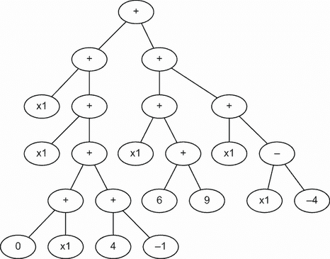

图 12.3 进化方程表达式树

列表 12.8 EDL_12_1_GEPPY.ipynb：显示进化方程

```
rename_labels = {'add': '+', 'sub': '-', 'mul': '*', 'protected_div': '/'}  
gep.export_expression_tree(best_ind, rename_labels, 
➥ 'data/numerical_expression_tree.png')                  ❶

from IPython.display import Image
Image(filename='data/numerical_expression_tree.png')      ❷
```

❶ 生成表达式树的图像

❷ 在笔记本中显示树

这个笔记本的目的是展示一个可以推导出显式函数的有用工具。在这个例子中，得到的函数与目标函数相同，但这种情况并不总是如此。在许多情况下，得到的函数可以提供对数据关系的洞察，这些关系之前并未被理解，正如我们在本章后面所看到的。在此之前，让我们跳到下一节的一些学习练习。

### 12.1.1 学习练习

使用这些练习帮助您提高对内容的知识：

1.  修改列表 12.1 中的目标函数，然后重新运行笔记本。进化的表现如何？

1.  通过修改列表 12.5 中的`head`、`h`和基因数量`n_genes`参数来修改`chromosomes`。重新运行笔记本以查看这对进化过程有何影响。

1.  向列表 12.2 中添加或删除表达式运算符。例如，您可以添加`cos`或`sin`等运算符——只需检查 DEAP 文档。确保还更新列表 12.8 中的标签。

在下一节中，我们将从简单的例子转向经典控制问题，通过重新审视 OpenAI Gym。

## 12.2 使用 Geppy 重新审视强化学习

为了展示 Geppy 在进化方程方面的有效性，我们通过 OpenAI Gym 查看一个班级控制问题。想法是让 Geppy 进化一个可以驱动几个最复杂的 OpenAI Gym 环境的方程。这个例子反映了我们在第十一章中用 NEAT 所做的工作，如果您需要回顾一些元素，请参考那些笔记本。

在 Google Colab 中打开 EDL_12_2_GEPPY_Gym.ipynb 笔记本。如果您需要帮助，请参阅附录。通过从菜单中选择运行时 > 运行所有来运行笔记本中的所有单元。

可能不稳定

如第十一章所述，由于虚拟驾驶员设置和其他自定义安装的组件，这些笔记本电脑可能会出现崩溃。如果在执行过程中笔记本电脑崩溃，请断开连接并删除运行时，然后重新启动并重新运行。从菜单中选择运行时 > 断开连接并删除运行时，然后运行时 > 运行所有。

在这个笔记本中，我们尝试解决两个`连续`控制问题：山车（连续）和摆锤（连续）。"连续"这个词用来定义环境的`动作`和`观察`（状态）空间。巧合的是，也可能有些令人困惑，"连续"也可能指代接收连续奖励的代理。也就是说，在每一步，环境都会提供一个奖励，无论是正面的还是负面的。设置笔记本和渲染它们的`动作`或`观察`空间相当简单，如下面的列表所示。

列表 12.9 EDL_12_2_GEPPY_Gym.ipynb：渲染环境空间

```
ENVIRONMENT = "MountainCarContinuous-v0" #@param ['Pendulum-v0', 
➥ 'MountainCarContinuous-v0']                           ❶

env = gym.make(ENVIRONMENT)                              ❷

env.reset()
plt.imshow(env.render(mode='rgb_array'))                 ❸

print("action space: {0!r}".format(env.action_space))    ❹
print("observation space: {0!r}".format                  ❹
➥ (env.observation_space))                              ❹
```

❶ Colab 表单的环境选项

❷ 创建环境

❸ 渲染环境的图像

❹ 显示动作/观察空间

图 12.4 显示了我们要尝试进化解决方案方程的两个环境。这两个环境都使用连续的`动作空间`，而我们在第十一章中探索的 Gym 环境使用的是离散的`动作空间`。"连续"意味着`动作`现在可以是给定范围内的实数值：摆锤为-2 到+2，山车为-1 到+1。这是完美的，因为我们的导出方程现在可以输出该范围内的值。

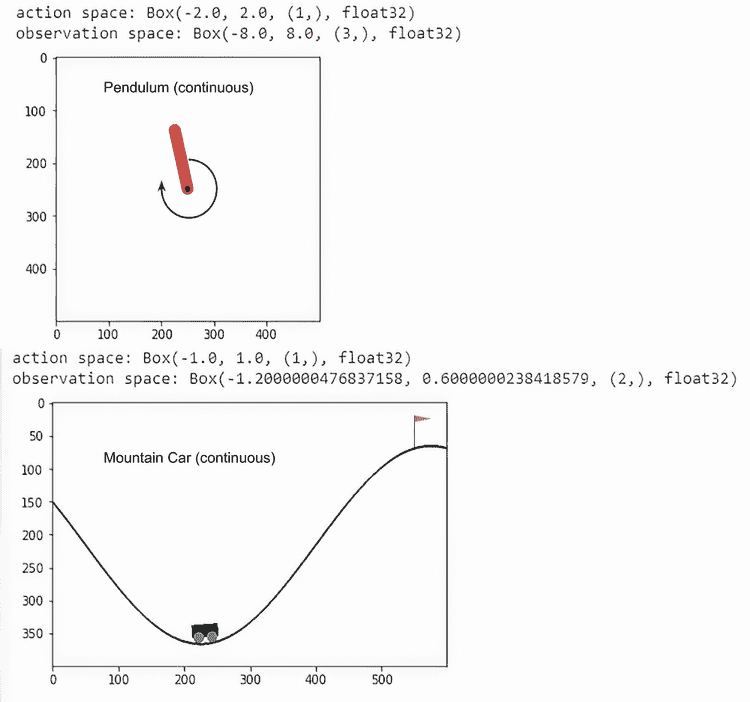

图 12.4 渲染环境和空间

每个环境的`观察空间`都不同，因此我们必须对定义`原始集`的方式做轻微的调整，如列表 12.10 所示。由于这两个环境使用不同的`观察`空间，因此在设置输入的基本集合时，我们需要考虑这些变化。对于摆锤，`观察空间`是摆锤的`x`、`y`坐标。同样，对于山车，`观察空间`是汽车的`x`、`y`坐标及其`速度`。这意味着摆锤的函数是`f(x, y)`，而对于山车，它是`f(x, y, 速度)`。

列表 12.10 EDL_12_2_GEPPY_Gym.ipynb：设置`原始`集

```
if ENVIRONMENT == "Pendulum-v0":
  pset = gep.PrimitiveSet('Main', input_names=
  ➥ ['x', 'y', 'velocity'])                     ❶
elif ENVIRONMENT == "MountainCarContinuous-v0":
  pset = gep.PrimitiveSet('Main', input_names=
  ➥ ['x', 'y'])                                 ❷

pset.add_function(operator.add, 2)               ❸
pset.add_function(operator.sub, 2)
pset.add_function(operator.mul, 2)
pset.add_function(protected_div, 2)
pset.add_ephemeral_terminal(name='enc', gen=lambda: random.randint(-10, 10))
```

❶ 摆锤的集合

❷ 山车的集合

❸ 如前所述创建剩余集合

正如我们在第十一章中所做的那样，我们根据个体积累奖励的能力来确定其`适应度`。然而，这次我们不是使用 NEAT 网络来预测`动作`，而是使用进化的函数/方程来计算`动作`。在这个代码块中，如列表 12.11 所示，为每个环境编写了两个简单的函数。这些示例仅用于测试，并不代表内部最终进化的解决方案。根据环境，对`func`的调用使用展开运算符`*`将观察到的`状态`展开为函数的参数。然后，函数的输出，可以是任何东西，通过`convert_to_action`和`clamp`函数转换为环境适当的`动作空间`。

列表 12.11 EDL_12_2_GEPPY_Gym.ipynb：确定`个体``适应度`

```
if ENVIRONMENT == "Pendulum-v0":    
  def func(x, y, velocity):                               ❶
    return x * y / velocity
elif ENVIRONMENT == "MountainCarContinuous-v0":
  def func(x, y):                                         ❶
    return x * y 

def clamp(minv, maxv, val):                               ❷
  return min(max(minv, val), maxv)

def convert_to_action(act, env):                          ❸
  return clamp(env.action_space.low, env.action_space.high, act)

frames = []
fitness = 0

state = env.reset()  
for i in range(SIMULATION_STEPS):    
  action = convert_to_action(func(*state), env)           ❹
  state, reward, done, info = env.step([action])       
  fitness += reward # reward for each step                ❺
  frames.append(env.render(mode='rgb_array'))    
  if done:       
    break 
```

❶ 样本函数

❷ 限制值在范围内

❸ 将计算值转换到环境中

❹ 计算/转换成输出动作

❺ 将奖励添加到总适应度

现在，真正的 `evaluate` 函数，如下面的列表所示，可以从列表 12.11 编写。

列表 12.12 EDL_12_2_GEPPY_Gym.ipynb：真正的 `evaluate` 函数

```
def evaluate(individual):
    func = toolbox.compile(individual)                       ❶
    fitness = 0
    for run in range(SIMULATION_RUNS):  
      state = env.reset()   
      actions=[]   
      for i in range(SIMULATION_STEPS):
        action = convert_to_action(func(*state), env)        ❷
        state, reward, done, info = env.step([action])       ❸
        fitness += reward                                    ❹
        if done:                              
          break      

    return fitness, 

toolbox.register('evaluate', evaluate)                       ❺
```

❶ 从个体编译函数

❷ 计算/转换动作

❸ 取得一步

❹ 将奖励添加到总适应度

❺ 注册函数

运行进化的代码相当直接，如下面的列表所示。

列表 12.13 EDL_12_2_GEPPY_Gym.ipynb：进化解决方案

```
POPULATION = 250 #@param {type:"slider", min:10,                   ❶
➥ max:1000, step:5}                                               ❶
GENERATIONS = 25 #@param {type:"slider", min:10,                   ❶
➥ max:250, step:1}                                                ❶

pop = toolbox.population(n=POPULATION)
hof = tools.HallOfFame(3)   

for gen in range(GENERATIONS):
  pop, log = gep.gep_simple(pop, toolbox, n_generations=1, n_elites=1,
                            stats=stats, hall_of_fame=
                                             ➥ hof, verbose=True) ❷
  clear_output()
  print(f"GENERATION: {gen}")
  best = hof[0]
  show_best(best)                                                  ❸
```

❶ 进化超参数

❷ 进化一代

❸ 展示最佳个体的性能

在每个 `generation` 之后，我们调用 `show_best` 函数运行 `individual` 通过模拟并将其渲染成视频，如下面的列表所示。

列表 12.14 EDL_12_2_GEPPY_Gym.ipynb：展示最适应的

```
def show_best(best):
  func = toolbox.compile(best)                      ❶
  frames = []
  fitness = 0
  state = env.reset()
  for i in range(SIMULATION_STEPS):                 ❷
    action = convert_to_action(func(*state), env)         
    state, reward, done, info = env.step([action])    
    frames.append(env.render(mode='rgb_array')) 
    fitness += reward
    if done:       
      break 

  mediapy.show_video(frames, fps=30)                ❸
  try:
    symplified_best = gep.simplify(best)
    print(f'Symplified best individual: {fitness}')
    print(symplified_best)                          ❹
  except:
    pass 
```

❶ 编译成函数

❷ 在一次运行中模拟函数

❸ 将记录的模拟渲染成视频

❹ 展示函数的简化形式

图 12.5 展示了使用简化方程的 `mountain car` 解决方案的结果。结果输出显示了推导出的方程被用来从不同的环境中获得良好的奖励。值得注意的是，由于任务和输入的相似性，每个方程都是不同的。

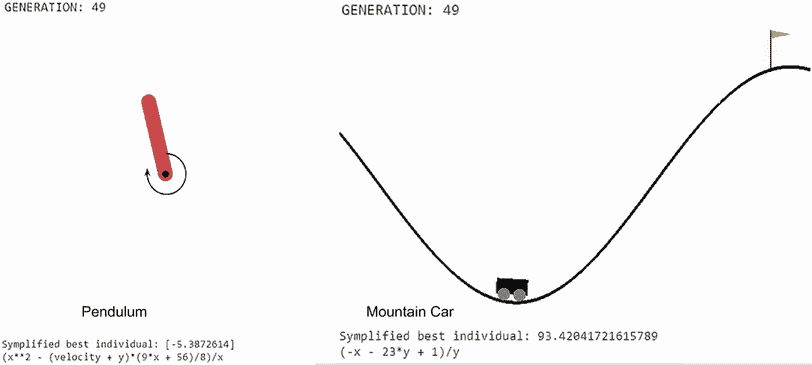

图 12.5 在环境中进化方程的结果

使用 Geppy 进化方程解决这些环境的能力令人印象深刻。它展示了进化在克服控制问题上的有效性。然而，我们本章的目标是探讨如何进化更通用的学习解决方案。我们将在下一节中更深入地探讨这一点，但现在，让我们跳入一些可以帮助加强本节概念的学习任务。

### 12.2.1 学习练习

使用这些练习回顾材料并加强你所学的知识：

1.  在互联网上搜索其他可能的 OpenAI Gym 环境，我们可能可以用这种技术解决。

1.  向集合中添加新的表达式运算符，如 `cos` 或 `sin`。重新运行笔记本以查看这些运算符是否以及如何被用于结果推导出的方程中。

1.  尝试使用摆锤或山车获得最佳的 `fitness`。这可以通过多种方式完成，包括增加 `population`、增加起始的 `generations` 数量以及引入新的表达式。

在下一节中，我们将扩展我们对使用进化来进化更通用解决方案的理解。

## 12.3 介绍本能学习

本能学习（IL）是本书作者提出的一个概念，旨在概括特质或功能如何既可以通过进化也可以通过学习而发展。它基于对人类和其他生物体的生物学观察，并借鉴了强化学习（RL）和其他行为学习方法的概念。在我们接下来的笔记本中，我们将运用一些本能学习的概念，尝试为上一节中的例子进化出一种更通用的解决方案。在此之前，让我们更深入地了解一下什么是本能学习。

### 12.3.1 本能学习的基本原理

IL 是一个抽象的思维模型，旨在指导使用进化来开发更通用的机器学习。IL 的倡议是，如果进化可以发展人类的一般化，它同样可以发展数字生命。当然，进化出某种形式的通用数字生命并非易事，因此 IL 试图描述一些基本模式和起点。

在自然界中，我们观察到许多生物体都有我们所说的*本能*，这描述了一些形式的学习或进化行为。对于许多物种来说，区分学习和进化的本能可能是显而易见的。一个很好的例子是狗，其中一些品种与特定的自然行为相关联；然而，狗也可以学习新的行为，这些行为可以成为本能。

一条狗通常通过行为学习来学习本能，例如通过强化或基于奖励的学习。最初，训练狗完成一项任务需要重复的试错过程，但经过一定量的训练后，狗“就知道了”。狗“就知道”的那个阶段就是我们所说的*本能的过渡*。在我们深入探讨这种过渡是如何发生之前，让我们在下节中更深入地探讨生物心智如何工作的通用理论。

思维的双过程理论

思维的双过程理论描述了生物生命中的高级思维过程。其观点是我们的大脑中有两个过程在起作用：一个低级过程，称为*系统 1*，另一个更自觉的过程，称为*系统 2*。图 12.6 展示了这两个过程之间的关键区别。

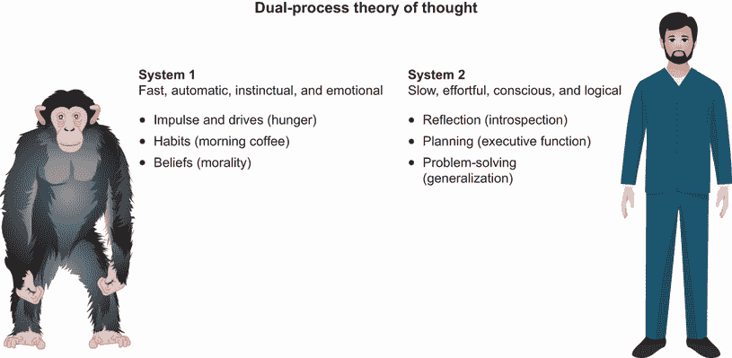

图 12.6 双过程理论

这两个思维过程通常被认为是分开的，但系统 2 中的思维或行为可以通过足够的训练和实践转化为系统 1。因此，强化学习的有意识行为是一个系统 2 过程，通过足够的试错转化为系统 1 过程。我们可以将这种过渡过程称为*条件反射*，它起源于巴甫洛夫式条件反射。

巴甫洛夫的狗和巴甫洛夫式条件反射

伊万·巴甫洛夫（1849–1936）是一位心理学家，他通过强化（基于奖励）学习表明，狗可以被训练在听到铃声时分泌唾液。这种条件或学习行为展示了从系统 2 过程到系统 1 过程的转变，通过持续训练，狗本能地在听到铃声时分泌唾液。

图 12.7 从本能学习的角度描述了双过程理论。根据进化，生物体获得某些遗传特征或本能。根据双过程理论，生物体可以思考和将思想和行动转化为本能。

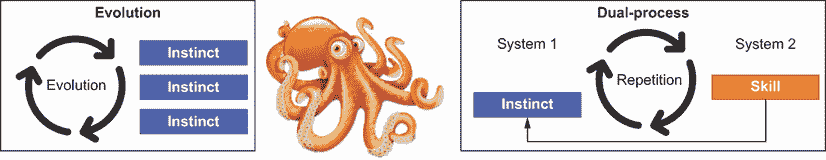

图 12.7 双过程理论与本能学习

假设双过程理论是准确的，我们也可以假设进化发展了这一过程以提高效率。换句话说，我们假设在高等生命进化的某个阶段，进化从构建硬编码的本能转变为让生物体发展自己的本能。这意味着，在某个时刻，生物体进化出了我们现在称之为双过程理论的本能。

IL 是寻找衍生出这种双过程或系统 2 本能的进化基础。它关乎理解在生命进化的某个时刻，本能如何变成了思想。因此，强化学习是双过程理论的一种简单形式，而 IL 是寻找 RL 起源的搜索。下一节中我们看到的笔记本示例展示了进化泛化本能（函数）可能有多么低效。

### 12.3.2 发展泛化本能

下一本笔记本展示了生物体如何以及为什么可能从仅仅发展本能发展到更高层次的思想形式。在接下来的笔记本中，我们仅使用进化来尝试发展一个单一的方程（本能），以解决这两个 Gym 问题。在强化学习（RL）中，这被称为多任务 RL，许多人认为这是一个难题。

在 Google Colab 中打开 EDL_12_3_GEPPY_Instinctual.ipynb 笔记本。如有需要，请参考附录。通过选择菜单中的“运行”>“运行所有”来运行笔记本中的所有单元格。

在这个笔记本中，我们研究在上一项练习中可能学习到的本能是如何进化的，以及如何用于泛化学习。因此，我们首先研究的是那些先前开发的本能（即方程或函数）如何被重用，如下列所示。函数`instinct1`是从在摆动环境中运行 EDL_12_2_GEPPY_Gyms.ipynb 笔记本中进化的。同样，`instinct2`是从同一笔记本在山车环境中进化的。请参考图 12.5 来回顾那些生成的方程。

列表 12.15 EDL_12_3_GEPPY_Instinctual.ipynb：添加本能

```
def protected_div(x1, x2):                      ❶
    if abs(x2) < 1e-6:
        return 1
    return x1 / x2

def instinct1(x1, x2):                          ❷
  return protected_div((-x1 – 23*x2 + 1),x2)

def instinct2(x1, x2, x3):                      ❸
  return protected_div(x1**2 – (x3 + x2)*(9*x1 + 56)/8,x1) 
```

❶ 避免除以零

❷ 解决摆动问题的函数

❸ 解决山车问题的函数

在 IL（智能学习）中的一个主要概念是本能或函数是分层的，并且随着时间的推移而发展和添加。这个笔记本试图证明在两个不同任务中成功的模拟生物如何结合生成第三个进化的生物，这个第三个生物能够进化一个三级或更高层次的本能，以泛化两个环境的解决方案。

接下来，我们来看这些新定义的本能如何添加到 `primitive` 集中，如列表 12.16 所示。对于 `PrimitiveSet` 定义，我们将输入设置为包括 `x`、`y` 和 `velocity` 以及一个新的输入 `e`，它代表环境。然后，我们将可能的功能操作符简化为仅包括 `add`、`sub` 和 `mul`，以及新的本能操作符。由于基础本能应该包含所需的常数，因此移除了瞬时常数操作符。

列表 12.16 EDL_12_3_GEPPY_Instinctual.ipynb：完成 `primitive` 集合

```
pset = gep.PrimitiveSet('Main', input_names=
➥ ['e', 'x', 'y', 'velocity'])              ❶
pset.add_function(operator.add, 2)
pset.add_function(operator.sub, 2)
pset.add_function(operator.mul, 2)
#pset.add_function(protected_div, 2)         ❷
pset.add_function(instinct1, 2)              ❸
pset.add_function(instinct2, 3)              ❹
#pset.add_ephemeral_terminal...              ❺
```

❶ 泛化输入和环境

❷ 简化函数集

❸ 使用两个操作符进行添加

❹ 使用三个操作符进行添加

❺ 消除常数

与之前的笔记本不同，这次我们进化一个智能体同时解决两个环境。为此，我们创建了一个环境列表，我们使用这个列表来进化智能体，如下面的列表所示。

列表 12.17 EDL_12_3_GEPPY_Instinctual.ipynb：创建环境

```
environments = [gym.make("MountainCarContinuous-v0"), 
➥ gym.make("Pendulum-v0")]    ❶
print(str(environments[1]))    ❷
```

❶ 要评估的环境列表

❷ 在打印前转换为字符串

我们接下来要查看的下一个单元格块，如列表 12.18 所示，包含 `evaluate` 函数。这次，函数首先遍历 `environments` 列表，并为每个环境运行一系列模拟。输入 `e` 简单地表示环境索引，并将其作为第一个参数传递给目标函数。由于每个环境都有不同的 `observation` 状态，当仅用 `2` 个状态运行摆动问题时，我们在状态空间中追加一个 `0` 来表示第三个输入：`速度`。在函数结束时，两个环境的 `fitness` 值被平均并返回。

列表 12.18 EDL_12_3_GEPPY_Instinctual.ipynb：构建 `evaluate` 函数

```
def evaluate(individual):    
    func = toolbox.compile(individual)    
    total_fitness = 0    
    for env in environments:                              ❶
      fitness = [] 
      e = environments.index(env)                         ❷
      for run in range(SIMULATION_RUNS):  
        state = env.reset()   
        actions=[]   
        for i in range(SIMULATION_STEPS):
          if len(state) < 3:  
            state = np.append(state, 0)                   ❸
          state = np.insert(state, 0, e)
          action = convert_to_action(func(*state), env)   ❹
          state, reward, done, info = env.step([action])             
          fitness.append(reward)      
          if done:                              
            break      
      total_fitness += sum(fitness)/len(fitness)
    return total_fitness/2,                               ❺

toolbox.register('evaluate', evaluate) 
```

❶ 遍历环境

❷ 根据环境索引填充 e

❸ 如有必要则追加到状态

❹ 转换为动作

❺ 返回平均适应度

我们接下来要查看的是更新的`show_best`函数，它现在将代理在两个环境中的模拟运行合并成一个视频。这次，函数遍历环境并对每个环境进行模拟。由于每个环境渲染到不同的窗口大小，我们使用`cv2.resize`函数将所有帧调整为相同的大小，如列表 12.19 所示。这样做是为了将所有帧合并成一个视频。在函数的末尾，表达式树被保存到文件中以便侧边观看。你可以通过打开左侧的系统文件夹，在数据文件夹中找到文件，然后双击它以打开一个侧边窗口来查看表达式树的进化。

列表 12.19 EDL_12_3_GEPPY_Instinctual.ipynb：更新`show_best`函数

```
rename_labels = {'add' : '+',
                 'sub': '-',
                 'mul': '*',
                 'protected_div': '/',
                 'instinct1': 'I1',                                                       ❶
                 'instinct2': 'I2'}                                                       ❶

def show_best(best):  
  func = toolbox.compile(best)
  frames = []
  fitness = 0
  for env in environments:                                                                ❷
    e = environments.index(env)
    state = env.reset()
    for i in range(SIMULATION_STEPS):
      if len(state) < 3:    
        state = np.append(state, 0)
      state = np.insert(state, 0, e)
      action = convert_to_action(func(*state), env) 
      state, reward, done, info = env.step([action]) 
      frame = env.render(mode='rgb_array')
      frame = cv2.resize(frame, dsize=(600, 400), 
                         interpolation=cv2.INTER_CUBIC)                                   ❸
      frames.append(frame) 
      fitness += reward
      if done:       
        break 

  mediapy.show_video(frames, fps=30)                                                      ❹
  gep.export_expression_tree(best, rename_labels, 'data/numerical_expression_tree.png'))  ❺
```

❶ 为本能函数添加标签

❷ 遍历环境

❸ 调整捕获帧的大小

❹ 渲染视频

❺ 保存表达式树输出

图 12.8 显示了在 250 `代`和 1,000 `个体`的进化过程中生成的视频的捕获输出。你可能看到代理在很短的时间内就解决了其中一个或两个环境。

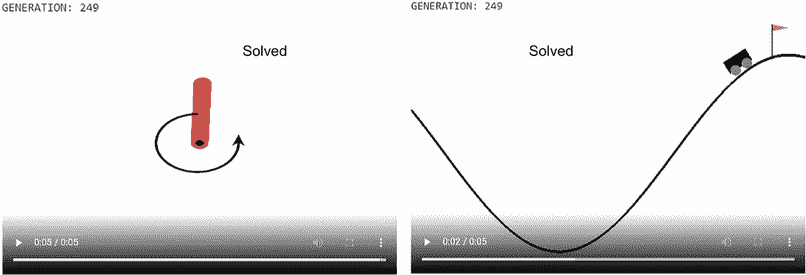

图 12.8 一个代理同时解决两个环境

图 12.9 显示了最终进化的表达式树。如果你运行这个笔记本，你可能会看到不同的树，但总体上，它可能很相似。这个表达式树有趣的地方在于`instinct1`和`instinct2`函数的重用和链式调用。实际上，它们成为了方程中的主要操作符，但它们并没有像我们预期的那样被完全使用。注意，在大多数情况下，输入甚至没有与本能的原始输入对齐。

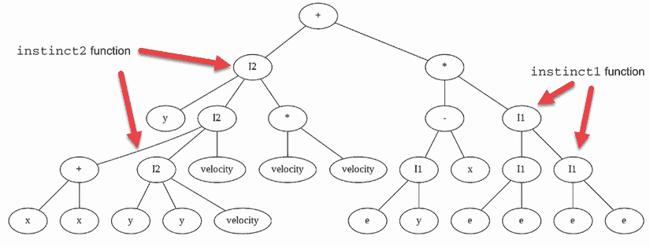

图 12.9 最终进化的表达式树

在这一点上，你可能想知道我们是否可以仅仅让代理进化一个单一函数，而不添加本能操作符。这是一个合理的问题，所以让我们看看在下一节中它是如何工作的。

### 12.3.3 无本能地进化通用解

在接下来的笔记本中，我们采取与上一个练习相反的方法，对本能和 IL 不做任何假设。这意味着我们允许代理通过推导一个没有本能操作符的单一代数来解决两个环境。

在 Google Colab 中打开 EDL_12_3_GEPPY_Generalize.ipynb 笔记本。如需帮助，请参阅附录。通过选择菜单中的“运行”>“运行所有”来运行笔记本中的所有单元格。

这个笔记本的唯一变化是用于构建表达式树的`primitive`集的定义，如列表 12.20 所示。与 IL 示例相比，主要变化是省略了本能操作符，并添加了`protected_ div`和`ephemeral`常量。除了额外的输入外，这个操作符集与我们用于单个环境上的基本函数推导所使用的操作符集相同。

列表 12.20 EDL_12_3_GEPPY_Generalize.ipynb：设置`原始`集

```
pset = gep.PrimitiveSet('Main', input_names=
➥ ['e', 'x', 'y', ''elocit''])  ’             ❶
pset.add_function(operator.add, 2)
pset.add_function(operator.sub, 2)
pset.add_function(operator.mul, 2)
pset.add_function(protected_div, 2)            ❷
#pset.add_function(instinct1, 2)               ❸
#pset.add_function(instinct2, 3)               ❸
pset.add_ephemeral_terminal(name='enc', gen=lambda: 
➥ random.randint(-10, 10))                    ❹
```

❶ 使用相同的输入

❷ 包含复杂的操作符

❸ 不包含本能

❹ 添加常数

笔记本中的其余部分与我们之前看到的一样，所以请放松并观看进化过程——或者，也许，缺乏进化。确实，通过在多个环境中运行此示例，你会发现，在最理想的情况下，智能体只能接近解决单个环境。图 12.10 展示了显示这种失败的示例视频输出。

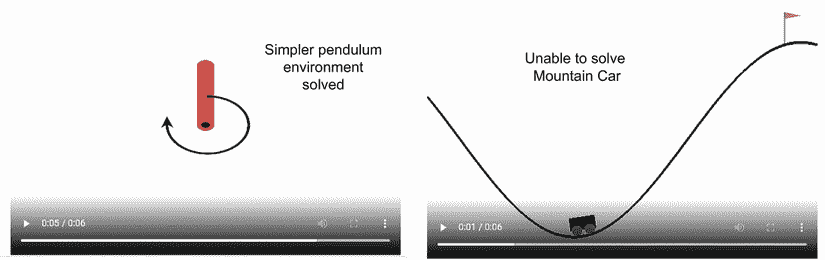

图 12.10 智能体无法在两个任务中推广的失败

那么，发生了什么？为什么将先前开发的函数或本能作为新函数导出的操作符比导出新方程更成功？对这个问题的简单答案是限制复杂性和选择。可重用的本能降低了在进化新函数时的复杂性和选择。

这种重用和开发可重用代码和函数的概念是当今软件开发最佳实践的基石。今天，编码者从众多先前开发的组件或函数中构建应用程序。今天软件行业所发展的，可能只是模仿数百万年前形成的进化最佳实践。

图 12.11 展示了本能如何随时间进化，以章鱼（章鱼）进化为例。在早期，生物体可能进化了硬编码的本能，这与我们在 EDL_12_2_GEPPY_Gyms.ipynb 笔记本中所做的不太一样。通过进化的另一个阶段，生物体可能进化出一种三级本能，使其能够同时使用两种本能。最后，在进化的最后阶段，头足类发展出一种新的本能类型：系统-2 本能，或允许其思考的本能。

头足类（章鱼）进化

章鱼是一种令人难以置信的生物，它以工具使用和有意识的行为形式表现出高级智力。使章鱼特别独特的是，它的进化路径与我们通常认为的高等生命形式从哪里发展出来的大相径庭。它还独特之处在于它没有中枢神经系统或大脑，据信章鱼的大多数思想是在其整个身体中产生的。了解头足类的进化可能会为我们提供关于 IL 的有效性以及所有有意识的思想可能如何进化的深刻见解。

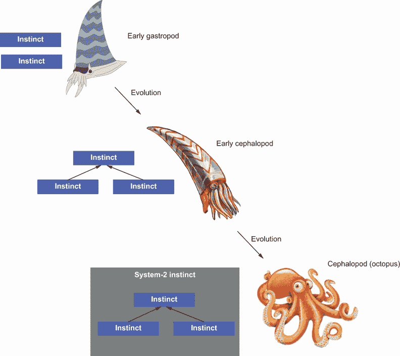

图 12.11 进化过程中的 IL

在下一节中，我们将探讨一种可能的建模、开发和进化双过程系统级-2 本能的方法。在此之前，让我们看看一些有用的学习示例，这将有助于你的回忆。

### 12.3.4 学习练习

使用以下练习来提高你对材料的理解，也许甚至可以自己开发新的技巧和技术：

1.  从笔记本示例 EDL_12_3_GEPPY_Instinctual.ipynb 的 `原始` 集合中移除一个基本本能，然后再次运行练习。你只使用一个本能就能得到类似的结果吗？

1.  返回并运行 EDL_12_2_GEPPY_Gyms.ipynb 笔记本，以推导出使用不同运算符的新方程。尝试添加新的运算符，如 `cos` 或 `sin`。接下来，将这些方程用于笔记本 EDL_12_3_GEPPY_Instinctual .ipynb 中，以查看结果。

1.  向 EDL_12_3_GEPPY_Instinctual.ipynb 添加更多运算符，包括本能，并看看这对代理泛化有什么影响。

在下一节中，我们继续探讨通过查看开发双过程系统-2 本能的另一种方法来泛化学习。

## 12.4 使用遗传编程进行泛化学习

遗传编程是我们使用 GEPPY 探索的 GEP 技术的基础。使用 GP，可以开发出能够用布尔逻辑模拟决策过程的结构化代码，例如。GP 不仅是一种强大的机器学习技术，能够开发出有趣的解决方案，而且还能阐明系统-2 思维过程或本能如何进化。

在本节中，我们查看一个经典的遗传编程示例：遗传蚂蚁。在这个示例中，一个 `ant` 代理通过在环境中搜索以找到并消耗食物而进化。这个示例是从标准的 DEAP 示例中派生出来的，并在此处修改以展示重要概念，并展示如何将 `ant` 泛化以从多个不同的环境中进食。

在 Google Colab 中打开 EDL_12_4_DEAP_Ant.ipynb 笔记本。如有需要，请参考附录。通过选择菜单中的“运行”>“运行所有”来运行笔记本中的所有单元格。

这个笔记本使用了 DEAP 的 GP 组件，因此示例有些不同，但大部分代码与我们之前多次看到的代码相同。GP 与 GEP 非常相似，使用 `原始` 集合来定义主要函数集，如列表 12.21 所示。与使用 GEPPY 的 GEP 不同，GP 中的函数不是表达式树，而是实际的代码实现。如果你向下滚动到 `原始` 集合的设置，可以看到如何添加基本函数。注意 `PrimitiveSet` 是如何构建的，它不接受任何输入。这是因为生成的代码在运行时会自行拉取所需的输入。接下来，我们看到添加了三个 `原始` 二进制或三元运算符，随后是终端节点函数。这些函数在 GP 表达式树或代码 `例程` 执行时执行。

列表 12.21 EDL_12_4_DEAP_Ant.ipynb：设置 `原始` 集合

```
ant = AntSimulator(600)                    ❶

pset = gp.PrimitiveSet("MAIN", 0)          ❷
pset.addPrimitive(ant.if_food_ahead, 2)    ❸
pset.addPrimitive(prog2, 2)                ❸
pset.addPrimitive(prog3, 3)                ❸
pset.addTerminal(ant.move_forward)         ❹
pset.addTerminal(ant.turn_left)            ❹
pset.addTerminal(ant.turn_right)           ❹
```

❶ 代表代理或环境

❷ 一个没有输入的新集合

❸ 定义基本原始运算符

❹ 定义终端或执行函数

现在，我们可以查看用于定义蚂蚁代理逻辑的`原始`操作符的定义。这些函数的设置使用`partial`函数——一个允许基础函数被包装并暴露变量输入参数的辅助函数。蚂蚁使用的三个操作符是`prog2`、`prog3`和`if_then_else`，但请注意，在内部，每个函数都会执行它接收的终端输入，如下面的列表所示。这意味着高级操作符消耗布尔逻辑进行操作。因此，我们稍后将看到的终端函数返回`True`或`False`。

列表 12.22 EDL_12_4_DEAP_Ant.ipynb：设置逻辑函数

```
def progn(*args):                            ❶
    for arg in args:
        arg()

def prog2(out1, out2):                       ❷
    return partial(progn,out1,out2)

def prog3(out1, out2, out3):                 ❸
    return partial(progn,out1,out2,out3)

def if_then_else(condition, out1, out2):     ❹
    out1() if condition() else out2()  
```

❶ 基础部分函数

❷ 操作符接受两个输入

❸ 操作符接受三个输入

❹ 条件操作符

终端函数被写入`AntSimulator`类中，如列表 12.23 所示。不要过于关注每个函数中的实际代码。这段代码处理蚂蚁代理在网格环境中的位置、移动和朝向。值得注意的是，这些终端函数既不接收也不输出任何输出。

列表 12.23 EDL_12_4_DEAP_Ant.ipynb：终端函数

```
def turn_left(self):                    ❶
    if self.moves < self.max_moves:
        self.moves += 1            
        self.dir = (self.dir – 1) % 4

def turn_right(self):                   ❷
    if self.moves < self.max_moves:
        self.moves += 1             
        self.dir = (self.dir + 1) % 4

def move_forward(self):                 ❸
    if self.moves < self.max_moves:
        self.moves += 1           
        self.row = (self.row + self.dir_row[self.dir]) % self.matrix_row
        self.col = (self.col + self.dir_col[self.dir]) % self.matrix_col
        if self.matrix_exc[self.row][self.col] == "food":
            self.eaten += 1               
            self.matrix_exc[self.row][self.col] = "empty"
        self.matrix_exc[self.row][self.col] = "passed"  
```

❶ 将蚂蚁转向 90 度向左

❷ 将蚂蚁转向 90 度向右

❸ 蚂蚁向前移动并消耗任何食物

从终端函数中，我们继续查看蚂蚁实现的单操作符自定义函数。再次强调，函数内的代码会检查网格以确定蚂蚁是否感知到前方有食物以及它面对的方向。下面的列表中展示的`sense_food`函数就是检测蚂蚁当前是否面对食物的函数。

列表 12.24 EDL_12_4_DEAP_Ant.ipynb：自定义操作符函数

```
def sense_food(self):                                                    ❶
    ahead_row = (self.row + self.dir_row[self.dir]) % self.matrix_row
    ahead_col = (self.col + self.dir_col[self.dir]) % self.matrix_col 
    return self.matrix_exc[ahead_row][ahead_col] == "food"

def if_food_ahead(self, out1, out2):                                     ❷
    return partial(if_then_else, self.sense_food, out1, out2)            ❸
```

❶ 自定义操作符函数

❷ 内部终端辅助函数

❸ 使用预定义的操作符函数 if_then_else

被称为`evalArtificalAnt`的`evaluate`函数用于确定`个体`的`适应度`很简单。它首先使用`gp.compile`将`个体基因`序列转换为编译后的 Python 代码。然后，使用`AntSimulator`的`run`函数运行输出`例程`。之后，根据蚂蚁消耗的食物方格数量输出蚂蚁的`适应度`，如下面的列表所示。

列表 12.25 EDL_12_4_DEAP_Ant.ipynb：`fitness` `evaluate`函数

```
def evalArtificialAnt(individual):    
    routine = gp.compile(individual, pset)   ❶
    ant.run(routine)                         ❷
    return ant.eaten,                        ❸
```

❶ 编译成 Python 代码

❷ 运行脚本例程

❸ 根据消耗的食物返回适应度

`AntSimulator`的`run`函数是执行结果表达式代码树的地方。在执行之前，环境通常会重置。然后，如果蚂蚁代理还有剩余的动作，它会通过调用生成的或进化的`例程`函数来执行一个动作，如下面的列表所示。你可以将其视为某种形式的意识决策思维过程，这在双过程理论中被描述为系统 2。

列表 12.26 EDL_12_4_DEAP_Ant.ipynb：运行例程

```
def run(self,routine):
    self._reset()                         ❶
    while self.moves < self.max_moves:    ❷
        routine()                         ❸
```

❶ 重置模拟环境

❷ 检查是否有剩余的动作

❸ 执行 GP 代码

与我们之前查看的 Gym 环境 不同，`AntSimulator` 可以加载任意描述的环境，如下面的列表所示。我们首先尝试进化一个`ant`以在原始 DEAP 示例中成功。

列表 12.27 EDL_12_4_DEAP_Ant.ipynb：定义环境

```
%%writefile santafe_trail1.txt      ❶
S###............................    ❷
...#............................
...#.....................###....
...#....................#....#..
...#....................#....#..
...####.#####........##.........    ❸
............#................#..
............#.......#...........
............#.......#........#..
............#.......#...........
....................#...........
............#................#..
............#...................
............#.......#.....###...
............#.......#..#........
.................#..............
................................    ❹
............#...........#.......
............#...#..........#....
............#...#...............
............#...#...............
............#...#.........#.....
............#..........#........
............#...................
...##..#####....#...............
.#..............#...............
.#..............#...............
.#......#######.................
.#.....#........................
.......#........................
..####..........................
................................   
```

❶ 将文件以名称写入文件系统

❷ S 代表起始位置。

❸ #是食物。

❺ .是空空间。

这个例子运行非常快，完成后，你可以实时见证最佳`ant`如何在环境中移动，如图 12.12 所示。当你观察`ant`时，注意它是如何穿过网格空间的。

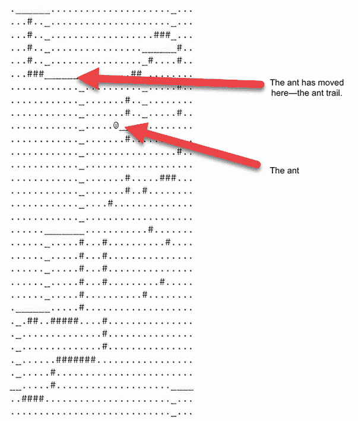

图 12.12 `ant` 在环境中移动

这是一个很有趣的例子，可以运行和探索。它还展示了遗传编程在创建代码方面的力量，但更重要的是，它揭示了一种创建本能的系统级 2 思维过程的方法。为了进一步展示这种能力，让我们继续使用相同的笔记本。


图 12.13 添加两个环境

在 Colab 中继续使用 EDL_12_4_DEAP_Ant.ipynb 笔记本。假设笔记本已完成执行，我们只需查看剩余的单元格，以了解如何进化`ant`以泛化到不同环境。图 12.13 显示了我们加载到`AntSimulator`中的两个附加环境，希望进化的`ants`可以跨环境泛化。接下来，我们查看将那些环境添加到`ant`模拟器的代码，如下列 12.28 所示。

列表 12.28 EDL_12_4_DEAP_Ant.ipynb：将环境添加到模拟器

```
ant.clear_matrix()                                ❶
with  open("santafe_trail2.txt") as trail_file:
  ant.add_matrix(trail_file)                      ❷

with  open("santafe_trail3.txt") as trail_file:
  ant.add_matrix(trail_file)                      ❸
```

❶ 清除现有环境

❷ 添加环境 2

❸ 添加环境 3

在不进行任何进一步进化的情况下，我们可以通过简单地运行`visual_run`函数来测试当前最佳`ant`在这些新环境中的表现，如下面的列表所示。从在两个新环境中运行`ant`的结果来看，它们的性能并不好。我们可以通过同时在这三个环境中进化`ant`来改进这一点。

列表 12.29 EDL_12_4_DEAP_Ant.ipynb：测试`ant`

```
ant.visualize_run(routine)     ❶
```

❶ 在新环境中可视化`ant`

在所有三个环境中进化`ant`现在只是将特定环境添加到模拟器中并重新运行进化的简单问题。内部，一个评估`reset`函数调用的`ant`将`ant`放入随机选择的环境。由于`ant`现在可以随机切换到不同的环境，所以生成的代码`routine`必须考虑到更好的食物搜索，如下面的列表所示。

列表 12.30 EDL_12_4_DEAP_Ant.ipynb：泛化`ant`

```
ant.clear_matrix()                                ❶

with  open("santafe_trail1.txt") as trail_file:
  ant.add_matrix(trail_file)                      ❷

with  open("santafe_trail2.txt") as trail_file:
  ant.add_matrix(trail_file)                      ❷

with  open("santafe_trail3.txt") as trail_file:
  ant.add_matrix(trail_file)                      ❷

GENERATIONS = 100 #@param {type:"slider", min:10, max:1000, step:5}
algorithms.eaSimple(pop, toolbox, 0.5, 0.2, 
➥ GENERATIONS, stats, halloffame=hof)            ❸
```

❶ 清除现有环境

❷ 添加新环境

❸ 进化`ant`

进化完成后，你可以通过再次运行`ant.visualize_run`函数调用来可视化`蚂蚁`现在的表现。这个练习展示了基因编程如何被用来泛化一个智能体以解决多个环境。它是通过将低级终端函数，或我们可能称之为*活动*或*本能*，与可能代表思维的更高级布尔逻辑分开来做到这一点的。因此，`蚂蚁`智能体不仅推导出一个单一的核心函数或表达式树，而是两个不同的操作或思维系统。

因此，基因编程是寻找描述双过程系统级 2 思维的本能或过程的潜在途径。但请记住，一个思维系统可能与其他系统不相似，并且还需要确定这能否导致 AI 和机器学习中的更高形式的一般化和意识。我们在下一节更深入地讨论了进化和寻找更高形式的人工智能和机器学习。在此之前，让我们先探索一些学习练习。

### 12.4.1 学习练习

使用以下练习来扩展你对基因编程和遗传蚂蚁问题的知识：

1.  为`蚂蚁`添加一些新的环境以供探索和进化。确保这些新环境有大致相同数量的食物方块。

1.  想想你可以如何改变或添加终端函数。也许，你可以添加一个`跳`或`飞`函数，使`蚂蚁`在它面对的方向上移动几个空间。

1.  添加一个新的操作符`感知`函数，如`感知食物`，可以在一定距离上感知食物或其他任何东西。

基因编程为我们提供了一个潜在的基础，以寻找更高阶、双过程系统级 2 功能或本能。我们在本书的下一节讨论了 IL 和 EDL 的潜在未来。

## 12.5 进化机器学习的未来

在本节中，我们探讨了进化搜索在改善机器学习（ML）和，当然，深度学习（DL）应用方面的未来。虽然本书的重点是深度学习，但进化搜索在其他形式的机器学习中有广泛的应用。进化搜索有潜力帮助我们引导到新的学习形式或子学习方法，如 IL。我们通过讨论进化本身是否可能出了问题，开始我们的旅程，探讨进化搜索可能带来的可能性，在下一节中。

### 12.5.1 进化是否出了问题？

近年来，我们对进化过程的理解受到了严厉的审视。现在，受到审视的进化并不是什么新鲜事，但这一次，批评者本身就是进化论者。进化论者声称，我们对进化过程的当前理解没有解释进化步骤之间的巨大变化。

达尔文本人也因非常类似的原因对进化理论质疑了 20 年。他挣扎于一种不安的感觉，即作为进化变化基石的突变无法发展出像人眼这样复杂的东西。随着时间的推移和大量的统计和化石证据，突变驱动的进化被接受。

如果你已经尝试过这本书中许多持续时间较长的练习，你可能也对进化也有过类似的感受。其中一些练习模拟了基于`突变`的进化过程，涉及成千上万的`个体`和成千代的`世代`，只产生了非常微小的变化。当然，质疑`突变`作为变化的主要导演是很容易的，但除此之外还有什么可能呢？

### 12.5.2 进化塑性

*进化* *塑性*，源于表型塑性的概念，试图描述没有突变的可能遗传变化。基本概念是，遗传变化可能发生在生物在其一生中，然后这些变化被传递给未来的`世代`。这些变化不是随机的，就像突变那样，而是与其他生物和环境相互作用的直接结果。

我们在 DNA 研究和我们及其他物种基因组理解方面的现代和快速创新改变了我们对可能性的理解。我们不再需要通过选择性育种来强制遗传变化，而是现在可以直接修改基因组，并让这些修改传递给未来的`世代`。也已经显示，这些变化可以很容易地进行——这也对我们的进化理解提出了质疑。

CRISPR 技术

*成簇规律间隔短回文重复序列*（CRISPR）是一项非常新的技术，它允许人类通过基因拼接的方式修改自身和其他物种。在某些情况下，这意味着移除不良基因，而在其他情况下，它仅仅意味着替换基因以产生一些新的效果，比如发光。这项技术之所以令人印象深刻，是因为它提供了一种低技术手段来改变物种的基因组。例如，你可以在互联网上购买 CRISPR 套件，允许你改变细菌甚至青蛙的 DNA。

那么，问题就来了，基因组是否可以通过非常具体的环境变化来改变，以及我们如何在进化中解释这些变化。对于一个传统的进化论者来说，这可能只是另一种形式的突变，而突变可以有效地描述这些变化。然而，对于我们这些数字进化论者来说，这提供了其他形式模拟的一些有趣机会。

无论哪种方式，进化塑性可能表明我们对进化的理解是会变化的，随之而来的是数字进化搜索的应用，在这种搜索中，我们不是通过缓慢且罕见的变异来驱动进化，而是使用其他遗传算子，这些算子提供了更快、选择性驱动的变化。在下一节中，我们将查看我们的最终笔记本，该笔记本展示了具有塑性的进化。

### 12.5.3 使用塑性改进进化

在本节中的笔记本中，我们回顾了我们最初演示 GA 尝试复制图像（如*蒙娜丽莎*）的一个原始示例。在这里，我们进行了一个单一且简单的更改，实现了一个新的`塑性`算子，该算子可以用来增强数字进化。这个算子的实现只是对`塑性`算子可能如何工作的一种解释。

打开 EDL_12_5_Genetic_Plasticity.ipynb 笔记本以及 EDL_2_6_Genetic_Algorithms.ipynb，以便进行比较。请从菜单中选择运行>运行所有来运行这两个笔记本。

检查两个笔记本的代码。我们在这里只关注`塑性`算子的实现。在生物学中，塑性假设任何环境变化对生物体都是有益的，因此为了模拟`塑性`算子，我们首先确定`个体`的`适应性`作为基准，如下所示。然后，我们强制执行 100%的新`个体`变异机会，并确定变化的`适应性`。如果变化提高了`适应性`，则返回修改后的`个体`；否则，我们保留原始内容。

列表 12.31 EDL_12_5_Genetic_Plasticity.ipynb：遗传`塑性`算子

```
def plasticity(individual):
  original = individual.copy()           ❶
  f1 = fitness(individual)               ❷
  indvidual = mutation(individual, 1.0)  ❸
  f2 = fitness(individual)               ❷
  if f1 < f2:
    return individual                    ❹
  else:
    return original                      ❹

plasticity(pop[parents[0]])
```

❶ 创建副本以保留原始内容

❷ 在更改前后确定适应性

❸ 强制执行变异后的更改

❹ 返回适应性更高的个体

图 12.14 显示了第二章中原始遗传算子示例以及包含`塑性`的新算子的进化结果。这两个笔记本中的输出是通过在 10,000 代中进化 300 个`个体`的种群来生成的。

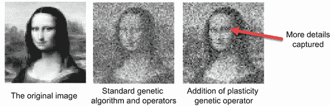

图 12.14 使用遗传`塑性`算子的结果

从计算角度来看，这种形式的`塑性`实现成本较高。如果你并排运行笔记本，你会清楚地注意到这种差异。然而，除了计算差异之外，明显的是这种新的`塑性`算子如何改进了更细微的细节。也许具有讽刺意味的是，改进后的笔记本中的眼睛首先变得清晰可辨。

为此例开发的 `塑性` 操作符是进化如何通过稍微修改的 `变异` 形式得到改进的一个例子。正如我们在这一独立例子中看到的，这个新操作符确实表现得更好。由于额外的计算费用和尚未证实的塑性理论，我们还没有在本书的例子中使用它。然而，它确实提出了一个关于生物和数字进化未来的有趣问题。然而，这个例子确实展示了在进化搜索中使用计算的限制，这是我们将在下一节中探讨的内容。

### 12.5.4 计算和进化搜索

使用进化搜索来优化深度学习（DL）或机器学习（ML）的一个可能的关键限制因素是额外的计算成本。这是我们在这本书的几个例子中见证并努力适应的事情。这也成为进化搜索在实际应用中的关键限制因素。

深度学习（DL）已经从游戏行业的进步中受益，这使得它能够使用快速的 GPU 来大幅降低计算成本。正是因为这些计算进步，DL 才有优势成为未来人工智能（AI）和机器学习（ML）的关键技术。但如果我们能够通过分布式计算或甚至量子计算机来改进计算上的进化搜索呢？

在这本书中，DEAP 已经与 Google Colab 结合使用，这限制了框架分布式计算能力的应用。然而，对于任何严肃的项目来说，使用分布式计算可能会大大减轻额外的计算成本。不幸的是，在这个领域还没有做很多工作，所以它的有效性还有待观察。

然而，如果进化搜索的成本或时间可以降低，那么这将为更昂贵的探索开辟更多的可能性。像 IL 或使用进化来寻找新的学习方法等技术可能更加实用。研究人员不必花费数小时开发新算法，搜索可能由进化来完成。在本书的下一节和最后一节中，我们将探讨一种使用 IL 和 DL 的技术。

## 12.6 本能深度学习和深度强化学习中的泛化

在本节的最后，我们查看了一个笔记本，展示了如何将 IL 应用到 DRL 中，以泛化多个环境中的智能体。这个练习模仿了我们之前开发的 IL 泛化例子，但这次是通过 DRL 应用。像我们在 DQN 例子中使用的 DRL 网络相当简单，为 IL 的应用提供了一个良好的基础。

图 12.15 展示了一对 DQN DRL 网络如何用于解决两个不同的环境。然而，每个网络的中层已经被分割成三个不同的可共享本能槽位，这两个网络学习的目标是找到一组共享的基本本能：本能池。

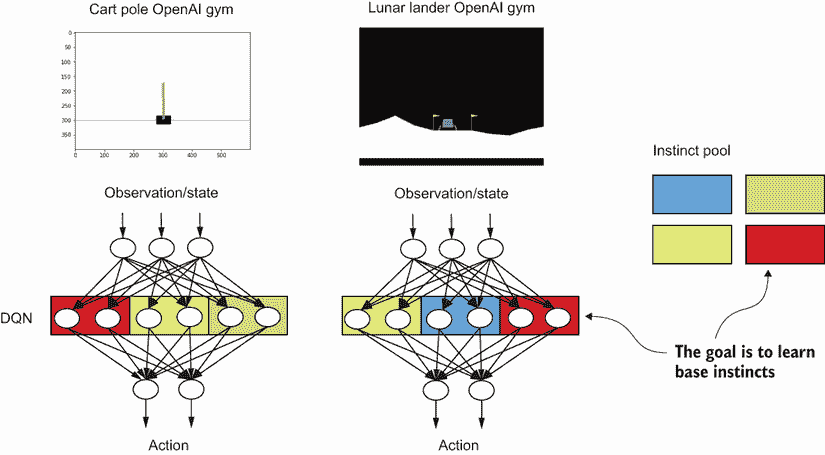

图 12.15 将 IL 应用于 DL

我们还可以在图 12.15 中看到，共享本能不必在两个网络中的相同位置。同样，正如我们在 Geppy 练习中看到的那样，重用的本能函数操作符通常混合匹配来解决两个环境。然而，与 Geppy 不同，我们严格限制这些本能的放置和操作方式，甚至更进一步，允许每个网络的顶层和底层专门针对环境进行训练。

打开 EDL_12_6_Instinctual_DQN_GYMS.ipynb 笔记本。请通过菜单中的“运行”>“运行所有”来运行这两个笔记本。这个笔记本是从 EDL_11_5_DQN_GYMS.ipynb 扩展而来的，所以如果你需要回顾 DQN 或 DRL，请参考第 11.5 节。

我们首先关注的是对`DQNAgent`类`_build_model`函数的修改，如列表 12.32 所示。为了将网络分割成功能块（本能），我们使用了 Keras 功能 API，它允许深度学习网络以函数的形式进行描述。这也意味着每个层部分都可以被视为一个函数。因此，我们不是从一组静态的层或函数定义中构建模型，而是将本能列表中的层块传递进去。这个列表的第一个和最后一个元素是专门为环境定义的层，中间的层或函数是可重用的本能。图 12.16 解释了如何将`build_model`函数从标准深度学习网络转换为本能网络。

列表 12.32 EDL_12_6_Instinctual_DQN_GYMS.ipynb：构建模型

```
def _build_model(self, instincts):    
    inputs = k.Input(shape=(self.state_size,))            ❶
    dense_in = instincts[0]                               ❷
    dense1 = instincts[1]
    dense2 = instincts[2]                                 ❷
    dense3 = instincts[3]
    dense_out = instincts[4]                              ❷

    x = dense_in(inputs)
    x1 = dense1(x)                                        ❸
    x2 = dense2(x)
    x3 = dense3(x)
    x = kl.concatenate([x1, x2, x3])                      ❹
    outputs = dense_out(x)
    model = k.Model(inputs=inputs, outputs=outputs)       ❺
    model.compile(loss='mse',   optimizer=k.optimizers.Adam(learning_rate=self.learning_rate))
    return model 
```

❶ 切换到 Keras 功能 API

❷ 加载层/本能

❸ 执行前向传递

❹ 连接本能

❺ 构建/编译并返回模型

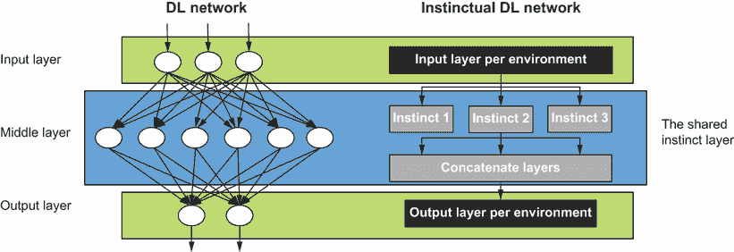

图 12.16 转换为 IL

这个笔记本包含几个示例单元，展示了如何填充层本能列表并用于创建`DQNAgent`。在这里，我们关注的是如何为多个环境创建本能层，如图列表 12.33 所示。这段代码在共享层池中创建了本能的基础集合——在这种情况下，是一个具有`8`个节点的标准`Dense`层，使用`ReLU`激活。然后，我们为输入和输出创建了特定于环境的层，以及每个环境的内存`dequeue`。在这个例子中，我们只使用了两个环境，所以四个层的池子就足够了。如果你将这项技术应用于超过两个环境，你可能需要增加共享池的大小。

列表 12.33 EDL_12_6_Instinctual_DQN_GYMS.ipynb：创建层

```
ENVIRONMENTS = len(environments)                            ❶

LAYERS = [                                                  ❷
          kl.Dense(8, activation="relu"),
          kl.Dense(8, activation="relu"),
          kl.Dense(8, activation="relu"),
          kl.Dense(8, activation="relu"),                           
]

input_layers = [kl.Dense(24, activation="relu") 
➥ for e in environments]                                   ❸
output_layers = [kl.Dense(e.action_space.n, 
➥ activation="linear") for e in environments]              ❹
memories = [ deque(maxlen=2000) for e in environments]      ❺
```

❶ 获取环境的数量

❷ 创建本能池

❸ 创建特定于输入环境的层

❹ 创建特定于输出环境的层

❺ 创建环境内存的持有者

现在，为了找到基本本能（功能层）是如何共享和重用来同时解决两个环境的，我们当然使用进化搜索，回归到我们老朋友：带有 DEAP 的遗传算法（GAs）。由于我们每个环境只使用三个本能，因此可以构建一个简单的`基因`序列，每个环境有三个`基因`，其中每个`基因`代表对共享本能层池的索引。图 12.17 展示了`基因`序列是如何构建的，其中每个环境模型描述了一组索引，这些索引链接回共享层池。

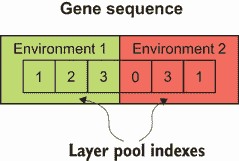

图 12.17 个体`基因`序列

我们可以在`evaluate`函数中看到这一切是如何结合在一起的。代码首先遍历每个环境，将`基因`序列转换为层索引。然后，构建一组特定和共享层以传递到模型中。然后，为每个环境构建一个新的代理模型并进行`评估`。注意，在以下列表中，训练被阻塞，直到`evaluate`函数以`train=True`被调用——我们很快就会明白这是为什么。

列表 12.34 EDL_12_6_Instinctual_DQN_GYMS.ipynb：`evaluate` 函数

```
def evaluate(individual, train=False):  
  total = 0
  for i, env in enumerate(environments):   
    rewards = 0    
    layer1 = convert_layer(individual[i*3])               ❶
    layer2 = convert_layer(individual[i*3+1])             ❶
    layer3 = convert_layer(individual[i*3+2])             ❶

    instincts = [input_layers[i],
                 LAYERS[layer1],
                 LAYERS[layer2],
                 LAYERS[layer3],
                 output_layers[i],
                 ]                                        ❷
    state_size = env.observation_space.shape[0]
    action_size = env.action_space.n
    agent = DQNAgent(instincts, state_size, 
    ➥ action_size, memories[i])                          ❸
    state = env.reset()
    state = np.reshape(state, [1, state_size])

    done=False
    while not done:                                       ❹
      action = agent.act(state)   
      next_state, reward, done, _ = env.step(action) 
      rewards += reward   
      next_state = np.reshape(next_state, [1, state_size])
      agent.remember(state, action, reward, next_state, 
      ➥ done)                                            ❹
      state = next_state    
    total += rewards 
    if train:      
      agent.replay(32)                                    ❺

  print(total/len(environments))
  return total/len(environments),                         ❻
```

❶ 从基因序列中提取层索引

❷ 为模型设置层

❸ 为层创建代理包装器

❹ 在环境中评估代理模型

❺ 仅在需要时进行训练

❻ 返回平均适应度

我们不针对每个`个体`训练派生模型和特定及共享层的原因是，这可能会导致内部冲突或二义性。我们在尝试在不使用本能的情况下在两个环境中训练单个模型时看到了这一点。相反，我们的目标是只为每个`代`训练最佳的代理。这意味着所有层在每个进化`代`中只针对最佳的`个体`进行一次训练或更新。如果我们试图坚持严格的进化搜索，我们永远不会这样做。但如果我们借鉴之前提到的`可塑性`概念，我们可以接受这种训练过程是来自环境的反应性改进或`变异`。

这意味着在进化环境时，我们现在在最佳当前`个体`上执行深度学习层（DL）的训练，如列表 12.35 所示。注意，没有进行其他训练，这意味着更新或调整模型权重是针对模型的本能的，这些本能可能不同。正因为我们的 DQN 代理具有这种近乎随机的特性，所以我们从训练中移除了任何探索或随机性。如果你查看`DQNAgent.act`函数，你会看到这一点。

列表 12.35 EDL_12_6_Instinctual_DQN_GYMS.ipynb：进化本能

```
for g in range(NGEN):
  pop, logbook = algorithms.eaSimple(pop, toolbox,            ❶
            cxpb=CXPB, mutpb=MUTPB, ngen=RGEN, stats=stats, halloffame=hof, 
  ➥ verbose=False)
  best = hof[0] 
  best_fit = evaluate(best, train=True)                       ❷
```

❶ 执行一代进化

❷ 在最佳个体上运行评估并进行训练

这个例子现在已经被简化，以解释性能，在适当的情况下。它可以产生一组通用的本能，可以用来解决两种环境，但进化和训练需要时间。一个更健壮的本能深度学习器可能会使用更小和更多数量的本能，甚至可能共享输入和输出层的本能。

IL 的主要目标是找到一组基础本能或函数，可以在不同的任务上重复使用以泛化模型。目标是允许重复使用函数（本能）以在系统泛化学习方面表现出色。IL 的次要目标是找到可以动态重组这些本能的函数（本能），通过过程或思维。

IL 仍处于发展的早期阶段，但正接近解决其首要目标。仍然有几种替代的 DL 网络类型、应用和进化搜索方法可以应用。我希望能有研究人员和学生拥抱寻找这些在网络中共享的基本能函数的道路。

## 摘要

+   进化可以应用于许多其他形式的机器学习，并为扩展我们的知识提供了新的机会。

+   Geppy 和基因表达式编程是 GAs 的扩展，通过编写连贯的代码或函数来工作。Geppy 可以是生成复杂函数逼近问题的可读函数的绝佳工具。

+   Geppy 可以作为函数逼近工具应用于 DRL 问题上的进化搜索，以生成单个可读的函数。生成的函数可以用来应用并解决来自 OpenAI Gym 工具包的复杂控制环境。

+   IL 是一种将进化方法与深度学习结合的模式，以寻找建模和解决复杂问题的新的方法。

+   IL 的基础是本能，或模型或生物体的核心学习行为：

    +   在自然界中，生物体发展出本能来解决任务，如进食或行走。本能的数量、大小和复杂性往往随着生命形式的复杂化而减少。

    +   相反，生命形式通常必须学会控制其基本本能以完成基本或复杂任务。

+   进化的概念以及我们对进化的理解可能会适应和进化，以使我们能够进一步进化机器学习和深度学习。像进化可塑性这样的理论概念——生物体可能能够在繁殖之外进化——可能在进化计算和进化深度学习中具有有趣的应用。

+   IL 的基本原理可以通过将 DQN 代理网络分解为本能，然后让代理针对多个任务训练这些本能来展示。能够使用 IL 泛化到多个任务的代理可以展示出在任务之间接近更通用的模型。
