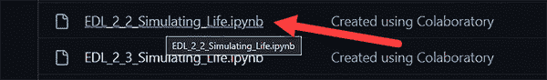
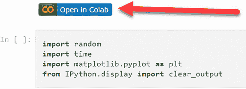
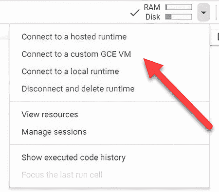
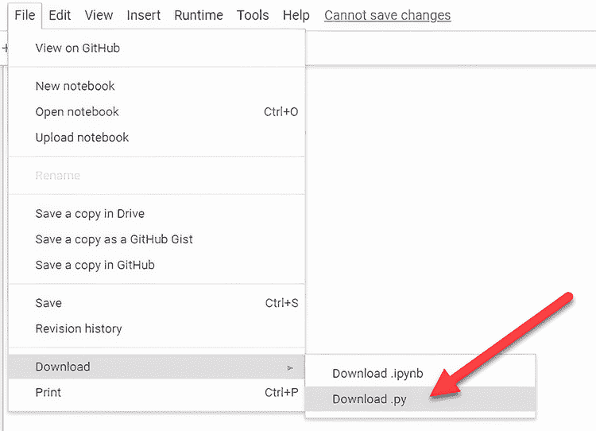

# 附录。

## A.1 访问源代码

书籍的源代码位于[`github.com/cxbxmxcx/EvolutionaryDeepLearning`](https://github.com/cxbxmxcx/EvolutionaryDeepLearning)。您不需要将任何代码下载到本地机器上；所有代码都将运行在 Google Colaboratory 上，或简称 Colab。要打开您的第一个笔记本，请按照以下步骤操作：

1.  访问[`github.com/cxbxmxcx/EvolutionaryDeepLearning`](https://github.com/cxbxmxcx/EvolutionaryDeepLearning)，并点击图 A.1 中显示的链接打开其中一个样本笔记本。

    

    图 A.1 在代码库视图中点击笔记本链接

1.  这将打开笔记本的视图。顶部将有一个 Colab 徽章（图 A.2）。点击徽章以在 Colab 中打开笔记本。

    

    图 A.2 样本笔记本的视图

1.  一旦打开笔记本，您就可以跟随书中的其他练习。

Google Colab Pro

多年来，Colab 已经从最初的一个优秀的免费 Python 计算平台，转变为一个更具商业驱动力的平台。尽管它仍然是一个优秀的平台，但对于免费用户来说，现在对 GPU 资源的访问已经受限。因此，如果你发现自己大量使用 Colab，购买 Colab Pro 许可证可能是有益的。

## A.2 在其他平台上运行代码

Colab 还可以连接到辅助的 Jupyter 运行时，无论是本地托管还是其他云资源。这只有在您配置了计算/GPU 资源并且能够复制 Colab 的设置时才有益。您可以通过点击位于右上角菜单栏中的运行时下拉菜单来访问此选项和进一步说明（图 A.3）。

图 A.3 Google Colab 运行时菜单

当然，另一种选择是将代码转换为 Python 并在笔记本之外运行它。为此，只需使用 Colab 中的功能将笔记本下载为 Python 文件。您可以通过导航到文件 > 下载 > 下载.py（如图 A.4 所示）来访问此功能。

图 A.4 下载笔记本作为 Python 文件
